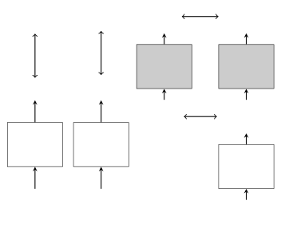

# Spectral feature mapping with mimic loss for robust speech recognition

Deblin Bagchi    Peter Plantinga    Adam Stiff    Eric Fosler-Lussier

###### Abstract

For the task of speech enhancement, local learning objectives are
agnostic to phonetic structures helpful for speech recognition. We
propose to add a global criterion to ensure de-noised speech is useful
for downstream tasks like ASR. We first train a spectral classifier on
clean speech to predict senone labels. Then, the spectral classifier is
joined with our speech enhancer as a noisy speech recognizer. This model
is taught to imitate the output of the spectral classifier alone on
clean speech. This mimic loss is combined with the traditional local
criterion to train the speech enhancer to produce de-noised speech.
Feeding the de-noised speech to an off-the-shelf Kaldi training recipe
for the CHiME-2 corpus shows significant improvements in WER.

###### Index Terms: 

Speech enhancement, Spectral mapping, Mimic loss, Noise-robust speech
recognition, CHiME-2

^(†)^(†)address: Department of Computer Science and Engineering  
The Ohio State University, Columbus, OH, USA

## 1 Introduction

Automatic Speech Recognition (ASR) has shown tremendous progress over
the years in recognizing clean speech. However, traditional DNN-HMM ASR
systems still suffer from performance degradation in the presence of
acoustic interference, such as additive noise and room reverberation.
Some strategies for building a noise-robust speech recognizer include
using noise-invariant features \[1\], augmented data \[2\], bulkier
acoustic models like LSTMs and CNNs \[2, 3\] and sophisticated language
models \[2, 3\]. Few groups, however, have looked at systems that train
only a speech enhancement model, which can be used for different tasks.

 


Figure 1: Our speech enhancement system is trained in three steps. (1)
The spectral classifier is trained to predict senone labels with
cross-entropy criterion (classification loss, $`\mathcal{L}_{\rm C}`$).
(2) The spectral mapper is pre-trained to map from noisy speech to clean
speech using MSE criterion (fidelity loss, $`\mathcal{L}_{\rm F}`$). (3)
The spectral mapper is trained using joint loss from both the clean
speech and the outputs of the classifier when fed clean speech (mimic
loss, $`\mathcal{L}_{\rm M}`$). The gray models have frozen weights.

A speech enhancement front-end refers to a performance-boosting
denoising technique that can be attached to any standard automatic
speech recognition model. Some deep learning models for speech
enhancement attempt to estimate an ideal ratio mask (IRM) for removing
noise from a speech signal \[4\]. Others utilize spectral mapping in the
signal domain \[5, 6\] or in the feature domain \[7, 8\] to directly
predict features.

Recent work in computer vision has seen notable success in addressing
the problem of poor resolution in modified input data, using a framework
broadly referred to as Generative Adversarial Networks (GANs).
Fundamentally, these gains are achieved by the injection of auxiliary or
proxy learning objectives into more traditional pipelines. These
auxiliary objectives exploit an adversarial relationship between two
neural networks (a generator and a discriminator) to find a Nash
equilibrium in which generating sensible data is the optimal behavior
for the generator \[9\]. This has the effect of refining the
distribution of the generated data closer to some desirable outcome
relative to a system trained without the auxiliary objective, e.g.,
sharper, more realistic generated images.

In light of these successes, in particular that of \[9\], inserting an
auxiliary realism objective into a speech denoising pipeline seems to be
a natural avenue to pursue improved performance. However, initial
experiments with GANs conditioned on noisy speech inputs, in which the
discriminator network was trained to distinguish between real and fake
clean/noisy input pairs, exposed the well-known mode collapse problem
endemic to GANs \[10\]. Results failed to improve upon simple baselines
of noisy-to-clean speech mappings trained with only MSE loss. Other
attempts have also failed to improve upon a DNN baseline, as in \[11\].
We speculate that the difference in performance from experiments in the
visual domain may be due to the relatively non-local structure of the
speech signal in the frequency axis (i.e. harmonic structure), as well
as the smoothness of speech features as compared to images.

The work described in this paper is motivated by the observations of
over-simple outputs from GANs that seemed to be stuck in mode collapse
orbits. We hypothesize that a training objective that can provide
stronger feedback than a simple real or fake determination will be
better able to guide the parameters of the denoising network towards
producing output that behaves like actual speech. While our resulting
system retains none of the properties of being generative or trained
adversarially, the insight to use an auxiliary task to improve the
denoising process is drawn from that body of work.

The auxiliary global objective that we add to our local criterion is the
behavioral loss of a classifier trained on clean speech. We call this
additional objective the mimic loss. First, we train a senone classifier
using clean speech as input, and a spectral mapper network \[8, 6\]
using parallel noisy and clean speech frame pairs. Next, we freeze the
weights of the acoustic model and join our pre-trained spectral mapper
to it. We then pass noisy speech frames to train our spectral mapper
with a joint objective, i.e. a weighted sum of the traditional fidelity
loss and mimic loss. The mimic loss, then, is MSE loss with respect to
the softmax (or pre-softmax) outputs of the classifier fed with the
corresponding clean speech frame. See figure 1 for a graphical depiction
of the model.

This technique of using one model to teach another was proposed by Ba
and Caruna \[12\] for the task of model compression. In their work, they
introduce student-teacher learning, where separate teacher and student
models are trained to do the same task. Mimic loss, on the other hand,
is used to train the student model to do a different task from the
teacher model.

## 2 prior work

To deal with noise, many DNN based methods have been proposed to improve
the robustness of ASR systems. In acoustic modeling, using Convolutional
Neural Networks (CNNs), such as in \[13\] and Long Short Term Memory
Networks (LSTMs) in \[14\] has resulted in an improvement in
performance. LSTMs have also been successfully used as speech
enhancement front-ends in \[15, 14\].

Spectral mapping has been used to generate clean speech signals.
However, in \[8, 7\] they use only a local learning objective.
Student-teacher networks have been used to improve the quality of noisy
speech recognition \[16, 17, 18\]. Our model uses mimic loss instead of
student-teacher learning, which means the speech enhancer is not jointly
trained with a particular acoustic model. This speech enhancer could be
used as a pre-processor for any ASR system, or for another similar
dataset. This modularity is the strength of mimic loss.

## 3 system description

In this section, we will describe the major components of our system:
namely, the spectral mapper, the spectral classifier, and the overall
framework binding the two together.

### 3.1 Spectral mapping

Spectral mapping improves performance of the speech recognizer by
learning a mapping from noisy spectral patterns to clean features. We
train a DNN-based spectral mapper for feature denoising. In our previous
work \[7, 8\], we have shown that a DNN-based spectral mapper, which
takes noisy spectrogram as input to predict clean filterbank features
for ASR, yields good results on the CHiME-2 noisy and reverberant
dataset.

Specifically, we first divide the input time-domain signals into 25-ms
frames with a 10-ms frame shift, and then apply short time Fourier
transform (STFT) to compute log spectral magnitudes in each time frame.
For a 16 kHz signal, each frame contains 400 samples, and we use
512-point Fourier transform to compute the magnitudes, forming a
257-dimensional log magnitude vector. Each noisy spectral component
$`x^{k}_{m}`$ for frequency $`k`$ at time slice $`m`$ is augmented on
the input by the deltas and double deltas, as well as a five frame
window (designated $`\tilde{x}_{m}^{k}=[x_{m\pm 5}^{k}`$\]), leading to
the dimensionality of $`\tilde{x}_{m}`$ being
$`257\cdot 3\cdot 11=8481`$. Similarly, we define $`y_{m}`$ to be the
clean spectral slice at time $`m`$.

We then use a feed-forward neural network $`f(\cdot)`$ to map noisy
spectral slices $`\tilde{x}_{m}`$ to clean spectral features $`y_{m}`$
using an MSE loss function, which we call fidelity loss.

```math
\begin{split}\mathcal{L}_{\rm FIDELITY}(\tilde{x}_{m},y_{m})&=\frac{1}{K}\sum_{k=1}^{K}(y_{m}^{k}-f(\tilde{x}_{m})^{k})^{2}\\
\end{split} \tag{1}
```

### 3.2 Spectral classifier

The spectral classifier is similar to the traditional DNN acoustic model
trained to classify a stacked clean spectral pattern $`\tilde{y}_{m}`$
to its corresponding senone class $`z_{m}`$. We train the classifier
using a cross entropy criterion; critically, once the classifier is
trained, we freeze the weights as a model of appropriate behavior under
clean speech.

### 3.3 Joint loss

We can define the mimic loss as the mean square difference between a
$`D`$-dimensional representation $`g`$ within the spectral classifier
evaluated on clean speech $`y_{m}`$ and its paired cleaned speech
$`f(\tilde{x}_{m})`$:

```math
\begin{split}\mathcal{L}_{\rm MIMIC}({\mathchoice{\tilde{\hbox{$\displaystyle\tilde{x}$}}}{\tilde{\hbox{$\textstyle\tilde{x}$}}}{\tilde{\hbox{$\scriptstyle\tilde{x}$}}}{\tilde{\hbox{$\scriptscriptstyle\tilde{x}$}}}}_{m},\tilde{y}_{m})=\frac{1}{D}\sum_{d=1}^{D}(g(\tilde{y}_{m})^{d}-g(\tilde{f}(\tilde{x}_{m}))^{d})^{2}\end{split} \tag{2}
```

We experimented with two different representations for $`g(\cdot)`$: the
posterior output of the senones after softmax normalization
(post-softmax) and the layer outputs prior to the softmax normalization
(pre-softmax).

While training the speech enhancer, we found that using only mimic loss
was not enough to allow the model to converge. We speculate that the
task of predicting senones is too different from the task of predicting
clean speech for the error signal to drive the output of the speech
enhancer to actually look like speech. Combining the fidelity and mimic
losses into a joint loss allows the enhancer to better imitate the
behavior of the classifier under clean speech while keeping the
projection of noisy speech closer to clean speech.

```math
\begin{split}\mathcal{L}_{\rm JOINT}=\mathcal{L}_{\rm FIDELITY}+\alpha\mathcal{L}_{\rm MIMIC}\end{split} \tag{3}
```

The hyper-parameter $`\alpha`$ is used to ensure that both of the losses
that make up the joint loss have a similar magnitude. We used 0.1 for
pre-softmax and 1000 for post-softmax.

## 4 experimental setup

We evaluate the effectiveness of our proposed method on Track 2 of the
CHiME-2 challenge \[19\], which is a medium-vocabulary task for word
recognition under reverberant and noisy environments without speaker
movements. In this task, three types of data are provided based on the
Wall Street Journal (WSJ0) 5k vocabulary read speech corpus: clean,
reverberant and reverberant+noisy. The clean utterances are extracted
from the WSJ0 database. The reverberant utterances are created by
convolving the clean speech with binaural room impulse responses (BRIR)
corresponding to a frontal position in a family living room. Real-world
non-stationary noise background recorded in the same room is mixed with
the reverberant utterances to form the reverberant+noisy set. The noise
excerpts are selected such that the signal-to-noise ratio (SNR) ranges
among -6, -3, 0, 3, 6 and 9 dB without scaling. The multi-condition
training, development and test sets of the reverberant+noisy set contain
7138, 2454 and 1980 utterances respectively, which are the same
utterances in the clean set but with reverberation and noise at 6
different SNR conditions.

Our system is monaural. In our experiments, we simply average the
signals from the left and right ear. A GMM-HMM system is built using the
Kaldi toolkit \[20\] on the clean utterances in the WSJ0-5k to get the
senone state for each frame of the corresponding noisy-reverberant
utterances. The initial clean alignments are obtained by performing
forced alignment on the clean utterances. To refine the initial clean
alignments, we further trained a DNN-based acoustic model using the
filterbank features of the clean utterances, and re-generate clean
alignments. These clean alignments are used as the labels for training
all the acoustic models in this study. Note that the DNN-HMM hybrid
system built on the clean utterances is a powerful recognizer. It
achieves 2.3% WER on the clean test set of the WSJ0-5k dataset.

| Spectral input to Kaldi       | CE WER | sMBR WER |
| ----------------------------- | ------ | -------- |
| No enhancement                | 18.0   | 17.3     |
| Enhancement via fidelity loss | 17.5   | 16.5     |
| Enhancement via joint loss    |        |          |
|    w/ post-softmax mimic loss | 16.5   | 15.7     |
|    w/ pre-softmax mimic loss  | 15.7   | 14.7     |

Table 1: Experimental results on the CHiME2 test set; CE WER is the word
error rate of a DNN-HMM hybrid system trained using a cross-entropy
criterion. sMBR WER is the error rate after sequential minimum Bayes
risk training.

| Enhancement   | -6 dB | -3 dB | 0 dB | 3 dB | 6 dB | 9 dB |
| ------------- | ----- | ----- | ---- | ---- | ---- | ---- |
| None          | 29.8  | 22.3  | 17.6 | 13.4 | 10.9 | 9.7  |
| Fidelity loss | 29.3  | 20.6  | 16.2 | 12.4 | 10.9 | 9.2  |
| Joint loss    | 25.9  | 19.6  | 14.8 | 10.9 | 9.0  | 8.0  |

Table 2: Experimental results on the CHiME2 test set, broken down across
different SNRs. Mimic loss based on pre-softmax units. Bold indicates
the best performing system for each evaluation subset.

| Study                | WER  |
| -------------------- | ---- |
| Wang et.al \[1\]     | 10.6 |
| Weninger et.al\[15\] | 13.8 |
| proposed approach    | 14.7 |
| Narayanan-Wang\[4\]  | 15.4 |
| Chen et. al \[14\]   | 16.0 |

Table 3: Performance comparison with other studies on the CHiME2 test
set.

### 4.1 Description of the acoustic model

In order to determine the effectiveness of the additional criterion, we
train a model using the denoised features with an off-the-shelf Kaldi
recipe. The DNN-HMM hybrid system is trained using the clean WSJ0-5k
alignments generated using the method stated above. The DNN has 7 hidden
layers, with 2048 sigmoid neurons in each layer and a softmax output
layer. Splicing context size for the filter-bank features was fixed at
11 frames, with the minibatch-size being 1024. After that, we train the
DNN with sMBR sequence training to achieve better performance. We
regenerate the lattices after the first iteration and train for 4 more
iterations. We use the CMU pronunciation dictionary and the official 5k
close-vocabulary tri-gram language model in our experiments.

### 4.2 Description of the spectral classifier

The spectral classifier network is a multilayer feed-forward network
which classifies clean speech frames as one of 1999 senone labels. We
use 6 layers of 1024 neurons with Leaky ReLU activations and batch
normalization between all the layers. While training the spectral
classifier on clean speech, we apply softmax after the topmost layer,
and use a cross entropy criterion to teach the network to produce
senones.

### 4.3 Description of the spectral mapper

The spectral mapper is composed of a simple two-layer feed-forward
network with 2048 neurons in each layer. The fact that this model is
simple means it can be used in some low-resource situations, and is fast
to use. Note that mimic loss can be applied to improve the results of
any kind of speech enhancer. To regularize the network, we use batch
normalization and a dropout rate of 0.5 between every layer. We also use
ReLU activations after each layer. The classifier and mapper are written
using TensorFlow¹¹ 1 Code at
[https://github.com/OSU-slatelab/actor_critic_specmap](https://github.com/OSU-slatelab/actor_critic_specmap).

### 4.4 Results

We see in Table 1 that the outputs of the recognizer before the softmax
provide a better target for the noisy speech recognizer, as suggested in
\[12\], even though our setup is quite different from theirs. The
difference in performance between pre- and post-softmax targets may be
due to a mismatch between target domain and loss criterion; ongoing work
suggests that a cross-entropy mimic loss on post-softmax targets
performs similarly to MSE on pre-softmax. Furthermore, the information
loss in the softmax normalization may “broaden” the allowable spectral
mappings, harming generalization. This suggests that it is helpful for
the noisy recognizer not only to have the same targets as the clean
recognizer, but also to learn to behave in the same way as the clean
recognizer.

We also demonstrate this fact by training the noisy speech recognizer
using hard targets rather than the soft targets of mimic loss. This
caused the joint loss in the spectral mapper to diverge, providing more
evidence that the noisy speech recognizer must learn to mimic the
behavior, not just the targets of the clean speech recognizer. Finally,
in Table 2 we break down our results into different SNRs and see that
the gains are consistent over all Signal-to-Noise levels.

### 4.5 Comparison with other systems

For context, we show in Table 3 the performance of our system relative
to other published results in the field. The better-performing models in
this list use more sophisticated models (like RNNs and LSTMs) for
front-end speech enhancement \[14, 15\] and acoustic modeling \[14\], as
well as noise-invariant features \[1\] (e.g., PNCC, MRCG). We use an
off-the-shelf Kaldi recipe using DNN-HMM to do speech recognition, as
well as a simple 2 layer feed-forward network to do spectral mapping.
Again, mimic loss can theoretically be used to improve the results of
any front-end system.

## 5 conclusion

We have proposed a speech enhancement criterion, called mimic loss,
which can be used to produce speech that is useful for downstream ASR
tasks. The mimic loss comes from comparing the outputs of a frozen clean
speech recognizer, before softmax is applied, on clean and enhanced
speech. This configuration allows the speech enhancement output to be
used as clean speech for any downstream task. We see that with mimic
loss, the spectral mapper learns to produce more detailed speech data,
retaining features that fidelity loss alone fails to model. Mimicking
the behavior of the pre-softmax layer of the classifier was superior to
mimicking the output of the senone posterior estimates; in general, the
lower error rates show that these features are helpful for downstream
tasks.

In future work, we propose to extend this work by matching every layer
of the phone recognizer, rather than just the inputs and outputs. We
could also use a variety of models for speech enhancement to demonstrate
the effectiveness of mimic loss. Another avenue is to evaluate the
output of our system in multiple domains to determine the effectiveness
of this approach at learning domain-invariant representations of speech.
Finally, we can train a more sophisticated acoustic model, rather than
using an off-the-shelf Kaldi recipe.

## 6 Acknowledgements

This material is based upon work supported by the National Science
Foundation under Grant IIS-1409431. We also thank the Ohio Supercomputer
Center (OSC) \[21\] for providing us with computational resources.

## References

- \[1\] Z.-Q. Wang and D. Wang, “A joint training framework for robust
  automatic speech recognition,” IEEE/ACM Transactions on Audio, Speech,
  and Language Processing, vol. 24, no. 4, pp. 796–806, 2016.
- \[2\] J. Du, Y.-H. Tu, L. Sun, F. Ma, H.-K. Wang, J. Pan, C. Liu,
  J.-D. Chen, and C.-H. Lee, “The USTC-iFlytek system for CHiME-4
  challenge,” Proc. CHiME, pp. 36–38, 2016.
- \[3\] T. Yoshioka, N. Ito, M. Delcroix, A. Ogawa, K. Kinoshita,
  M. Fujimoto, C. Yu, W. J. Fabian, M. Espi, T. Higuchi, et al., “The
  NTT CHiME-3 system: Advances in speech enhancement and recognition for
  mobile multi-microphone devices,” in Automatic Speech Recognition and
  Understanding (ASRU), 2015 IEEE Workshop on. IEEE, 2015, pp. 436–443.
- \[4\] A. Narayanan and D. Wang, “Improving robustness of deep neural
  network acoustic models via speech separation and joint adaptive
  training,” IEEE/ACM Transactions on Audio, Speech, and Language
  Processing, vol. 23, no. 1, pp. 92–101, 2015.
- \[5\] K. Han, Y. Wang, and D. Wang, “Learning spectral mapping for
  speech dereverberation,” in Acoustics, Speech and Signal Processing
  (ICASSP), 2014 IEEE International Conference on. IEEE, 2014, pp.
  4628–4632.
- \[6\] K. Han, Y. Wang, D. Wang, W. S. Woods, I. Merks, and T. Zhang,
  “Learning spectral mapping for speech dereverberation and denoising,”
  IEEE Transactions on Audio, Speech, and Language Processing, vol. 23,
  no. 6, pp. 982–992, 2015.
- \[7\] K. Han, Y. He, D. Bagchi, E. Fosler-Lussier, and D. Wang, “Deep
  neural network based spectral feature mapping for robust speech
  recognition,” in Proc. Interspeech, 2015.
- \[8\] D. Bagchi, M. I. Mandel, Z. Wang, Y. He, A. Plummer, and
  E. Fosler-Lussier, “Combining spectral feature mapping and
  multi-channel model-based source separation for noise-robust automatic
  speech recognition,” in Automatic Speech Recognition and Understanding
  (ASRU), 2015 IEEE Workshop on. IEEE, 2015, pp. 496–503.
- \[9\] P. Isola, J.-Y. Zhu, T. Zhou, and A. A. Efros, “Image-to-image
  translation with conditional adversarial networks,” arXiv preprint
  arXiv:1611.07004, 2016.
- \[10\] T. Salimans, I. Goodfellow, W. Zaremba, V. Cheung, A. Radford,
  and X. Chen, “Improved techniques for training GAN,” in Advances in
  Neural Information Processing Systems, 2016, pp. 2234–2242.
- \[11\] D. Michelsanti and Z.-H. Tan, “Conditional generative
  adversarial networks for speech enhancement and noise-robust speaker
  verification,” in Interspeech. ISCA, 2017.
- \[12\] J. Ba and R. Caruana, “Do deep nets really need to be deep?,”
  in Advances in neural information processing systems, 2014, pp.
  2654–2662.
- \[13\] Y. Qian and P. C. Woodland, “Very deep convolutional neural
  networks for robust speech recognition,” in Spoken Language Technology
  Workshop (SLT), 2016 IEEE. IEEE, 2016, pp. 481–488.
- \[14\] Z. Chen, S. Watanabe, H. Erdogan, and J. Hershey, “Integration
  of speech enhancement and recognition using long-short term memory
  recurrent neural network,” in Proc. Interspeech, 2015.
- \[15\] F. Weninger, H. Erdogan, S. Watanabe, E. Vincent, J. Le Roux,
  J. R. Hershey, and B. Schuller, “Speech enhancement with lstm
  recurrent neural networks and its application to noise-robust ASR,” in
  International Conference on Latent Variable Analysis and Signal
  Separation. Springer, 2015, pp. 91–99.
- \[16\] K. Markov and T. Matsui, “Robust speech recognition using
  generalized distillation framework.,” in Interspeech, 2016, pp.
  2364–2368.
- \[17\] S. Watanabe, T. Hori, J. Le Roux, and J. R. Hershey,
  “Student-teacher network learning with enhanced features,” in
  Acoustics, Speech and Signal Processing (ICASSP), 2017 IEEE
  International Conference on. IEEE, 2017, pp. 5275–5279.
- \[18\] J. Li, M. L. Seltzer, X. Wang, R. Zhao, and Y. Gong,
  “Large-scale domain adaptation via teacher-student learning,” Proc.
  Interspeech 2017, pp. 2386–2390, 2017.
- \[19\] E. Vincent, J. Barker, S. Watanabe, J. Le Roux, F. Nesta, and
  M. Matassoni, “The second ‘CHiME’ speech separation and recognition
  challenge: Datasets, tasks and baselines,” in Acoustics, Speech and
  Signal Processing (ICASSP), 2013 IEEE International Conference on.
  IEEE, 2013, pp. 126–130.
- \[20\] D. Povey, A. Ghoshal, G. Boulianne, L. Burget, O. Glembek,
  N. Goel, M. Hannemann, P. Motlicek, Y. Qian, P. Schwarz, et al., “The
  Kaldi speech recognition toolkit,” in IEEE 2011 Workshop on Automatic
  Speech Recognition and Understanding. IEEE Signal Processing Society,
  2011, number EPFL-CONF-192584.
- \[21\] O. S. Center, “Ohio supercomputer center,”
  [http://osc.edu/ark:/19495/f5s1ph73](http://osc.edu/ark:/19495/f5s1ph73), 1987.
