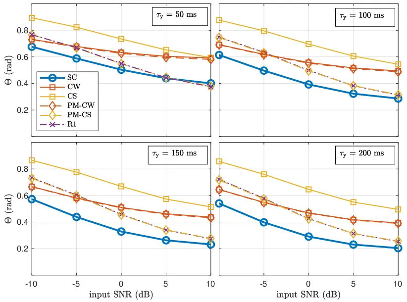
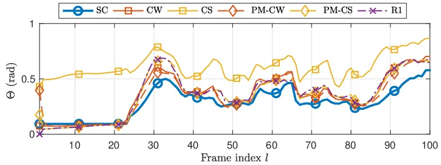
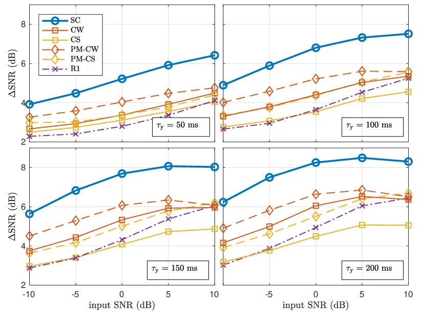

STFT  
short-time Fourier transform

RTF  
relative transfer function

ATF  
acoustic transfer function

SNR  
signal-to-noise ratio

PSD  
power spectral density

CS  
covariance subtraction

CW  
covariance whitening

MVDR  
minimum variance distortionless response

GEVD  
generalised eigenvalue decomposition

EVD  
eigenvalue decomposition

PM  
power method

VAD  
voice activity detector

MWF  
multichannel Wiener filter

DOA  
direction-of-arrival

SC  
spatial coherence

ASN  
acoustic sensor network

# Relative Transfer Function Estimation Exploiting Spatially Separated Microphones in a Diffuse Noise Field

This work was supported by the Collaborative Research Centre 1330
Hearing Acoustics, the Cluster of Excellence 1077 Hearing4all, funded by
the German Research Foundation (DFG), and by the joint Lower
Saxony-Israeli Project ATHENA.

###### Abstract

Many multi-microphone speech enhancement algorithms require the relative
transfer function (RTF) vector of the desired speech source, relating
the acoustic transfer functions of all array microphones to a reference
microphone. In this paper, we propose a computationally efficient method
to estimate the RTF vector in a diffuse noise field, which requires an
additional microphone that is spatially separated from the microphone
array, such that the spatial coherence between the noise components in
the microphone array signals and the additional microphone signal is
low. Assuming this spatial coherence to be zero, we show that an
unbiased estimate of the RTF vector can be obtained. Based on real-world
recordings experimental results show that the proposed RTF estimator
outperforms state-of-the-art estimators using only the microphone array
signals in terms of estimation accuracy and noise reduction performance.

|                                                                                                |
| ---------------------------------------------------------------------------------------------- |
| Nico Gößling, Simon Doclo                                                                      |
| University of Oldenburg, Department of Medical Physics and Acoustics and Cluster of Excellence |
| Hearing4All, Oldenburg, Germany                                                                |

Index Terms—  Relative transfer function, external microphone, acoustic
sensor network, speech enhancement, MVDR

## 1 Introduction

In many hands-free speech communication systems such as hearing aids,
hearables or other assistive listening devices, the captured speech
signal is often corrupted by additive background noise, such that speech
enhancement methods are required to improve speech quality and speech
intelligibillity \[1\]. When more than one microphone is available, it
is not only possible to exploit the spectro-temporal properties but also
the spatial properties of the sound field to extract the desired speech
source at a certain position from the noisy microphone signals. By using
spatially distributed microphones, e.g., one or more external
microphones in addition to the microphones on the hearing device, the
spatial sampling of the sound field can be increased \[2, 3, 4, 5, 6,
7\].  
A well-known multi-microphone speech enhancement method is the mvdr
(mvdr) beamformer \[1, 8\]. In a reverberant environment the MVDR
beamformer either requires the atf between the desired speech source and
the microphones, which are difficult to accurately estimate in practice,
or the rtf of the desired speech source, which relate the atf to a
reference microphone \[1, 9\]. Since rtf can be exploited in many
multi-microphone speech enhancement methods \[10, 11, 12, 13, 14, 15,
16, 17\], accurately estimating the rtf of one or more sources is an
important task. In the literature several methods for estimating the rtf
have been proposed \[9, 18, 10, 11, 12, 19, 20, 21\], where most recent
methods are based either on cs (cs) or cw (cw). These methods usually
require an estimate of the microphone signal covariance matrix (e.g.,
estimated during speech-plus-noise periods) and the noise covariance
matrix (e.g., estimated during noise-only periods). Although an
iterative version of the cs and cw methods has been presented in \[12,
21\], the computational complexity of the cs-based and cw-based rtf
estimation methods is generally high due to the involved matrix
operations (possibly involving an evd (evd)), which is especially
relevant for an online-implementation.  
In this paper, we propose a computationally efficient method to estimate
the rtf of a local microphone array (e.g., on a hearing device) by
exploiting the availability of an external microphone that is spatially
separated from the local microphone array. We consider a diffuse noise
field and assume that the distance between the external microphone and
the local microphone array is large enough such that the sc (sc) between
the noise components in the local microphone signals and the external
microphone signal is low. When assuming this sc to be zero, we show that
a simple rtf estimator can be derived that only depends on the
microphone signal covariance matrix. Based on real-world recordings with
(local) head-mounted microphones and an (external) table microphone, we
compare the performance of the proposed rtf estimator and different
CS-based and CW-based RTF estimators (using only the local microphone
signals). Simulation results show that the proposed estimator yields the
best performance when used in an online implementation of the binaural
MVDR beamformer.

## 2 Signal model

We consider an acoustic scenario with one desired speech source and
diffuse noise (e.g., babble noise) in a reverberant environment. The
$`m`$-th microphone signal $`Y_{m}(k,l)`$ of an $`M`$-element local
microphone array can be written in the stft (stft) domain as

```math
Y_{m}(k,l)=X_{m}(k,l)+N_{m}(k,l),\hskip 9.24994ptm\in\{1,\dots,M\}, \tag{1}
```

where $`X_{m}(k,l)`$ denotes the speech component, $`N_{m}(k,l)`$
denotes the noise component, and $`k`$ and $`l`$ denote the frequency
and frame indices, respectively. For the sake of brevity, we will omit
these indices in the remainder of the paper wherever possible. All
microphone signals can be stacked in a vector, i.e.,

```math
\mathbf{y}=\left[Y_{1},\;Y_{2},\;\dots,Y_{M}\right]^{T}\in\mathbb{C}^{M}, \tag{2}
```

which can be written as

```math
\mathbf{y}=\mathbf{x}+\mathbf{n}, \tag{3}
```

where the speech vector $`\mathbf{x}`$ and the noise vector
$`\mathbf{n}`$ are defined similarly as $`\mathbf{y}`$ in (2). Without
loss of generality, we choose the first microphone as the reference
microphone. The rtf vector of the desired speech source is then given by

```math
\mathbf{h}=\left[1,\;\frac{A_{2}}{A_{1}},\;\dots,\frac{A_{M}}{A_{1}}\right]^{T}, \tag{4}
```

where $`A_{m}`$ is the atf between the desired speech source and the
$`m`$-th microphone. Using (4), the speech vector can be written as

```math
\mathbf{x}=X_{1}\mathbf{h}. \tag{5}
```

The speech covariance matrix
$`\mathbf{R}_{\mathrm{x}}\in\mathbb{C}^{M\times M}`$ and the noise
covariance matrix $`\mathbf{R}_{\mathrm{n}}\in\mathbb{C}^{M\times M}`$
are given by

```math
\displaystyle\mathbf{R}_{\mathrm{x}} \displaystyle=\mathcal{E}\{\mathbf{x}\mathbf{x}^{H}\}=\Phi_{\mathrm{x_{1}}}\mathbf{h}\mathbf{h}^{H}, \tag{6}
```

```math
\displaystyle\mathbf{R}_{\mathrm{n}} \displaystyle=\mathcal{E}\{\mathbf{n}\mathbf{n}^{H}\}, \tag{7}
```

where $`(\cdot)^{H}`$ denotes complex conjugation,
$`\mathcal{E}\{\cdot\}`$ denotes the expectation operator and
$`\Phi_{\mathrm{x_{1}}}`$ is the speech psd (psd) in the first
microphone. Assuming statistical independence between the speech and the
noise components, the covariance matrix of the microphone signals
$`\mathbf{R}_{\mathrm{y}}=\mathcal{E}\{\mathbf{y}\mathbf{y}^{H}\}`$ is
equal to

```math
\mathbf{R}_{\mathrm{y}}=\mathbf{R}_{\mathrm{x}}+\mathbf{R}_{\mathrm{n}}. \tag{8}
```

When applying a filter-and-sum beamformer
$`\mathbf{w}\in\mathbb{C}^{M}`$ to the microphone signals, the output
signal $`Z`$ is given by

```math
Z=\mathbf{w}^{H}\mathbf{y}. \tag{9}
```

The mvdr beamformer \[1, 9\] aims at minimizing the output noise psd
while preserving the speech component in the reference microphone signal
and is hence given by

```math
\begin{split}\mathbf{w}&=\arg\;\min_{\mathbf{w}}\;\mathbf{w}^{H}\mathbf{R}_{\mathrm{n}}\mathbf{w}\hskip 9.24994pt\text{subject to}\hskip 9.24994pt\mathbf{w}^{H}\mathbf{h}=1,\\
&=\frac{\mathbf{R}_{\mathrm{n}}^{-1}\mathbf{h}}{\mathbf{h}^{H}\mathbf{R}_{\mathrm{n}}^{-1}\mathbf{h}}.\end{split} \tag{10}
```

From (10) it is clear that the mvdr beamformer only requires knowledge
about the noise covariance matrix $`\mathbf{R}_{\mathrm{n}}`$ and the
rtf vector of the desired speech source $`\mathbf{h}`$.

## 3 RTF vector estimation

In this section, we briefly review two commonly used methods to estimate
the rtf vector $`\mathbf{h}`$, namely the cs method\[18, 22, 19\] and
the cw method \[22, 11\]. For both methods, we also discuss iterative
versions based on the power iteration method \[10, 12, 21\]. All methods
require an estimate of the microphone signal covariance matrix
$`\mathbf{R}_{\mathrm{y}}`$ and the noise covariance matrix
$`\mathbf{R}_{\mathrm{n}}`$, where $`\hat{\mathbf{R}}_{\mathrm{y}}`$ is
estimated during speech-plus-noise frames and
$`\hat{\mathbf{R}}_{\mathrm{n}}`$ is estimated during noise-only frames,
assuming a vad (vad) is available. The computational complexity of the
CS-based and CW-based methods depends on the required matrix operations,
where especially matrix inversion or evd will result in a large
computational complexity.

### 3.1 Covariance subtraction (CS)

By using the rank-1 model in (6), the rtf vector $`\mathbf{h}`$ can be
calculated as any column of the speech correlation matrix
$`\mathbf{R}_{\mathrm{x}}`$, normalised by the entry corresponding to
the reference microphone, i.e.,

```math
\mathbf{h}_{\mathrm{CS}}=\frac{\mathbf{R}_{\mathrm{x}}\mathbf{e}}{\mathbf{e}^{T}\mathbf{R}_{\mathrm{x}}\mathbf{e}}, \tag{11}
```

where $`\mathbf{e}=[1,\>0,\>\dots,\>0]^{T}`$ is a selection vector
consisting of zeros with one element equal to 1. Usually, the speech
covariance matrix $`\mathbf{R}_{\mathrm{x}}`$ is estimated as
$`\hat{\mathbf{R}}_{\mathrm{x}}=\hat{\mathbf{R}}_{\mathrm{y}}-\hat{\mathbf{R}}_{\mathrm{n}}`$.  
Although the CS method has a relatively low computational complexity,
its performance is not always very good since due to estimation errors
the estimated speech covariance matrix $`\hat{\mathbf{R}}_{\mathrm{x}}`$
typically does not have rank-1 \[22, 19\]. Hence, the RTF vector can
also be estimated as the principal eigenvector (corresponding to the
largest eigenvalue) of $`\hat{\mathbf{R}}_{\mathrm{x}}`$ normalising by
the entry corresponding to the reference microphone. We denote this
estimate as $`\mathbf{h}_{\mathrm{R1}}`$. It has been shown in \[22\]
that $`\mathbf{h}_{\mathrm{R1}}`$ outperforms
$`\mathbf{h}_{\mathrm{CS}}`$ when used in a mwf (mwf), but obviously has
a larger computational complexity due to the evd.

### 3.2 Covariance whitening (CW)

By using a square-root decomposition (e.g., Cholesky decomposition) of
the noise covariance matrix $`\mathbf{R}_{\mathrm{n}}`$, i.e.,

```math
\mathbf{R}_{\mathrm{n}}=\mathbf{R}_{\mathrm{n}}^{H/2}\mathbf{R}_{\mathrm{n}}^{1/2}, \tag{12}
```

the pre-whitened microphone signal covariance matrix is given by

```math
\mathbf{R}_{\mathrm{y}}^{\mathrm{w}}=\mathbf{R}_{\mathrm{n}}^{-H/2}\mathbf{R}_{\mathrm{y}}\mathbf{R}_{\mathrm{n}}^{-1/2}. \tag{13}
```

The evd of (13) is equal to

```math
\mathbf{R}_{\mathrm{y}}^{\mathrm{w}}=\mathbf{V}\bm{\Lambda}\mathbf{V}^{H}, \tag{14}
```

where $`\mathbf{V}\in\mathbb{C}^{M\times M}`$ contains the eigenvectors
and the diagonal matrix $`\bm{\Lambda}\in\mathbb{R}^{M\times M}`$
contains the eigenvalues. Based on the principal eigenvector
$`\mathbf{v}_{\rm max}`$, the RTF vector can be estimated as \[19\]

```math
\mathbf{h}_{\mathrm{CW}}=\frac{\mathbf{R}_{\mathrm{n}}^{1/2}\mathbf{v}_{\mathrm{max}}}{\mathbf{e}^{T}\mathbf{R}_{\mathrm{n}}^{1/2}\mathbf{v}_{\mathrm{max}}}. \tag{15}
```

### 3.3 Iterative methods

Iterative CS-based and CW-based methods for RTF estimation have been
proposed, which aim at reducing the computational complexity of the evd
by using the power iteration method (or von-Mises-Iteration) to
calculate the principal eigenvector $`\mathbf{v}_{\mathrm{max}}`$. Using
the power iteration method on the pre-whitened microphone signal
covariance matrix $`\mathbf{R}_{\mathrm{y}}^{\mathrm{w}}`$ \[12\] or the
speech covariance matrix $`\mathbf{R}_{\mathrm{x}}`$ \[21\] yields the
pm (pm) estimators $`\mathbf{h}_{\mathrm{PM-CW}}`$ and
$`\mathbf{h}_{\mathrm{PM-CS}}`$, respectively. As mentioned in \[12,
21\], one iteration per frame is typically sufficient for an online
implementation.

## 4 Incorporation of an external microphone

In addition to the local microphone array, we now assume the presence of
an external microphone that is spatially separated from the local
microphones. The extended microphone signal vector, containing the
microphone signals of the local microphone array and the external
microphone signal, is given by

```math
\bar{\mathbf{y}}=\begin{bmatrix}\mathbf{y}\\
Y_{\rm E}\end{bmatrix}\in\mathbb{C}^{M+1}, \tag{16}
```

where $`Y_{\mathrm{E}}`$ denotes the external microphone signal. The
extended speech and noise vectors are defined similarly as
$`\bar{\mathbf{x}}=\left[\mathbf{x},\;X_{\mathrm{E}}\right]^{T}`$ and
$`\bar{\mathbf{n}}=\left[\mathbf{n},\;N_{\mathrm{E}}\right]^{T}`$,
respectively. Similarly to (4), the extended rtf vector is given by

```math
\bar{\mathbf{h}}=\begin{bmatrix}\mathbf{h}\\
A_{\rm E}/A_{\rm 1}\end{bmatrix}\in\mathbb{C}^{M+1}, \tag{17}
```

where $`A_{\mathrm{E}}`$ denotes the atf between the desired speech
source and the external microphone. Similarly to (6) and (7), the
extended speech covariance matrix and the extended noise covariance
matrix are equal to

```math
\displaystyle\bar{\mathbf{R}}_{\mathrm{x}} \displaystyle=\mathcal{E}\{\bar{\mathbf{x}}\bar{\mathbf{x}}^{H}\}=\Phi_{\mathrm{x_{1}}}\bar{\mathbf{h}}\bar{\mathbf{h}}^{H}\in\mathbb{C}^{(M+1)\times(M+1)}, \tag{18}
```

```math
\displaystyle\bar{\mathbf{R}}_{\mathrm{n}} \displaystyle=\mathcal{E}\{\bar{\mathbf{n}}\bar{\mathbf{n}}^{H}\}\in\mathbb{C}^{(M+1)\times(M+1)}. \tag{19}
```

Similarly to (8), the extended microphone signal correlation matrix is
equal to
$`\bar{\mathbf{R}}_{\mathrm{y}}=\bar{\mathbf{R}}_{\mathrm{x}}+\bar{\mathbf{R}}_{\mathrm{n}}`$.
We assume that the distance between the external microphone and the
local microphones is large enough such that the noise components in the
local microphone signals are spatially uncorrelated with the noise
component in the external microphone signal, i.e.,

```math
\mathcal{E}\{\mathbf{n}N_{\mathrm{E}}^{*}\}=\mathbf{0}_{M}, \tag{20}
```

where $`\mathbf{0}_{M}`$ is an $`M`$-element zero vector. Hence, the
extended noise covariance matrix $`\bar{\mathbf{R}}_{\mathrm{n}}`$ in
(19) can be written as

```math
\bar{\mathbf{R}}_{\mathrm{n}}=\left[\begin{array}[]{c|c}\bar{\mathbf{R}}_{\mathrm{n}}&\mathbf{0}_{M}\\
\hline\cr\mathbf{0}_{M}^{T}&\Phi_{\rm n_{E}}\end{array}\right], \tag{21}
```

where $`\Phi_{\rm n_{E}}=\mathcal{E}\{|N_{\rm E}|^{2}\}`$ denotes the
noise psd in the external microphone signal. For a diffuse, i.e.,
spherically isotropic, noise field, the sc between the noise component
in the external microphone signal and the noise component in a local
microphone signal is equal to (neglecting head shadow effects)

```math
\gamma={\rm sinc}\left(d\omega/c\right), \tag{22}
```

with $`d`$ the distance between the external microphone and the local
microphone, $`\omega`$ the angular frequency and $`c`$ the speed of
sound. Hence, the assumption in (20) already holds well even for
relatively small distances (especially at high frequencies).  
Based on the assumption in (20), it can be easily shown that the
covariance between the local microphone signals and the external
microphone signal is equal to the covariance between the speech
components in these microphone signals, i.e.,

```math
\begin{split}\mathcal{E}\{\mathbf{y}Y_{\mathrm{E}}^{*}\}&=\mathcal{E}\{\left(\mathbf{x}+\mathbf{n}\right)\left(X_{\mathrm{E}}^{*}+N_{\mathrm{E}}^{*}\right)\}=\mathcal{E}\{\mathbf{x}X_{\mathrm{E}}^{*}\}.\end{split} \tag{23}
```

Using the CS method described in Section 3.1, the extended RTF vector
$`\bar{\mathbf{h}}`$ in (17) can be estimated as the last column of the
extended speech covariance matrix $`\bar{\mathbf{R}}_{\mathrm{x}}`$,
normalized by the first entry (corresponding to the reference
microphone), i.e.,

```math
\bar{\mathbf{h}}=\frac{\bar{\mathbf{R}}_{\mathrm{x}}\bar{\mathbf{e}}_{\mathrm{E}}}{\bar{\mathbf{e}}^{T}\bar{\mathbf{R}}_{\mathrm{x}}\bar{\mathbf{e}}_{\mathrm{E}}} \tag{24}
```

with the $`(M+1)`$-dimensional selection vectors
$`\bar{\mathbf{e}}=[1,0,\dots,0]^{T}`$ and
$`\bar{\mathbf{e}}_{\mathrm{E}}=[0,\dots,0,1]^{T}`$. Using (21), it can
easily be shown that

```math
\displaystyle\bar{\mathbf{R}}_{\mathrm{y}}\bar{\mathbf{e}}_{\mathrm{E}}=\bar{\mathbf{R}}_{\mathrm{x}}\bar{\mathbf{e}}_{\mathrm{E}}+\bar{\mathbf{R}}_{\mathrm{n}}\bar{\mathbf{e}}_{\mathrm{E}}=\bar{\mathbf{R}}_{\mathrm{x}}\bar{\mathbf{e}}_{\mathrm{E}}+\Phi_{\rm n_{E}}\bar{\mathbf{e}}_{\mathrm{E}}, \tag{25}
```

```math
\displaystyle\bar{\mathbf{e}}^{T}\bar{\mathbf{R}}_{\mathrm{y}}\bar{\mathbf{e}}_{\mathrm{E}}=\bar{\mathbf{e}}^{T}\bar{\mathbf{R}}_{\mathrm{x}}\bar{\mathbf{e}}_{\mathrm{E}}+\bar{\mathbf{e}}^{T}\bar{\mathbf{R}}_{\mathrm{n}}\bar{\mathbf{e}}_{\mathrm{E}}=\bar{\mathbf{e}}^{T}\bar{\mathbf{R}}_{\mathrm{x}}\bar{\mathbf{e}}_{\mathrm{E}}, \tag{26}
```

such that, using (24),

```math
\frac{\bar{\mathbf{R}}_{\mathrm{y}}\bar{\mathbf{e}}_{\mathrm{E}}}{\bar{\mathbf{e}}^{T}\bar{\mathbf{R}}_{\mathrm{y}}\bar{\mathbf{e}}_{\mathrm{E}}}=\frac{\bar{\mathbf{R}}_{\mathrm{x}}\bar{\mathbf{e}}_{\mathrm{E}}+\Phi_{\rm n_{E}}\bar{\mathbf{e}}_{\mathrm{E}}}{\bar{\mathbf{e}}^{T}\bar{\mathbf{R}}_{\mathrm{x}}\bar{\mathbf{e}}_{\mathrm{E}}}=\bar{\mathbf{h}}+\frac{\Phi_{\rm n_{E}}}{\bar{\mathbf{e}}^{T}\bar{\mathbf{R}}_{\mathrm{x}}\bar{\mathbf{e}}_{\mathrm{E}}}\bar{\mathbf{e}}_{\mathrm{E}}. \tag{27}
```

Hence, an unbiased estimation for the RTF vector $`\mathbf{h}`$ can be
obtained as the first elements of the vector in (27), i.e.,

```math
\boxed{\mathbf{h}_{\rm SC}=\left[\mathbf{I}_{M},\;\mathbf{0}_{M}\right]\frac{\bar{\mathbf{R}}_{\mathrm{y}}\bar{\mathbf{e}}_{\mathrm{E}}}{\bar{\mathbf{e}}^{T}\bar{\mathbf{R}}_{\mathrm{y}}\bar{\mathbf{e}}_{\mathrm{E}}}} \tag{28}
```

where $`\mathbf{I}_{M}`$ is the identity matrix of size $`M`$ and which
requires an estimate of the extended microphone covariance matrix
$`\bar{\mathbf{R}}_{\mathrm{y}}`$ and no estimate of any noise
covariance matrix. The proposed estimator has a low computational
complexity (similar to the CS estimator using only the local microphone
signals), but obviously requires an external microphone signal to be
transmitted to the local microphone array (synchronization aspects are
outside the scope of this paper). Assuming the availability of a vad
that outputs 1 if speech is present and 0 if speech is absent, the
proposed RTF estimation algorithm is summarized in Algorithm 1, where
the extended microphone signal covariance matrix is recursively updated
during speech-plus-noise frames.

0:  $`\bar{\mathbf{y}}(l)`$, $`\bar{\mathbf{R}}_{\mathrm{y}}(l-1)`$,
$`\mathrm{VAD}(l)`$

0:  smoothing factor $`\alpha`$For each frequency bin: Estimation of the
extended microphone signal covariance matrix:

1:  if ($`\mathrm{VAD}(l)==1`$) then

2:
   $`\bar{\mathbf{R}}_{\mathrm{y}}(l)=\alpha\bar{\mathbf{R}}_{\mathrm{y}}(l-1)+(1-\alpha)\bar{\mathbf{y}}(l)\bar{\mathbf{y}}^{H}(l)`$

3:  else

4:
   $`\bar{\mathbf{R}}_{\mathrm{y}}(l)=\bar{\mathbf{R}}_{\mathrm{y}}(l-1)`$

5:  end ifEstimation of the RTF vector:

6:
 $`\mathbf{h}_{\rm SC}(l)=\left[\mathbf{I}_{M},\;\mathbf{0}_{M}\right]\frac{\bar{\mathbf{R}}_{\mathrm{y}}(l)\bar{\mathbf{e}}_{\mathrm{E}}}{\bar{\mathbf{e}}^{T}\bar{\mathbf{R}}_{\mathrm{y}}(l)\bar{\mathbf{e}}_{\mathrm{E}}}`$

6:  $`\mathbf{h}_{\rm SC}(l)`$

Algorithm 1 Proposed RTF estimation algorithm

## 5 Experimental results

In this section we compare the performance of the proposed RTF estimator
(using the local and the external microphones) with all RTF estimations
discussed in Section 3 (using only the local microphone signals).
Section 5.1 describes the experimental setup and the algorithmic
parameters. Section 5.2 and 5.3 evaluate the RTF estimation accuracy and
the noise reduction performance when using the RTF estimates in an MVDR
beamformer.

### 5.1 Experimental setup

For the simulations we used the database of real-world recordings
(sampling frequency
$`f_{s}=$16\text{\,}\mathrm{k}\mathrm{H}\mathrm{z}$`$) described in
\[23\]. The room dimensions were about $`12.7\times 10\times 3.6`$
$`\mathrm{m}`$ with a reverberation time of about
$`620\text{\,}\mathrm{m}\mathrm{s}`$. The local microphone array
consisted of $`M=4`$ microphones mounted to the ears of a listener (two
microphones per ear). As reference microphone we chose the front
microphone mounted to the left ear. The external microphone was located
on a table in front of the desired speaker with about
$`60\text{\,}\mathrm{c}\mathrm{m}`$ distance to the reference
microphone. The desired speaker was an English-speaking female talker
who sat to the right of the listener at an angle of about
$`45\text{\,}\mathrm{\SIUnitSymbolDegree}`$. Both the listener and the
desired speaker were seated at a circular table with a diameter of
$`106\text{\,}\mathrm{c}\mathrm{m}`$. In addition, 56 other talkers
which were also seated at tables, generated a realistic babble noise.
The noise field hence contained mainly diffuse but also directional
components from temporally dominant interfering talkers. Separate
recordings of the babble noise and the desired speaker were used to mix
them together at different input snr
$`\{-10,\,-5,\,0,\,5,\,10\}\>$\mathrm{d}\mathrm{B}$`$. The SNR in the
external microphone signal was about $`13\text{\,}\mathrm{d}\mathrm{B}`$
higher than in the reference microphone signal (due to distance and head
shadow effect). We calculated all snr using the intelligibility-weighted
SNR \[24\]. The total signal length was about
$`23\text{\,}\mathrm{s}`$.  
We used an stft framework with a frame length $`L*{\mathrm{f}}=512`$
samples and a frame-shift of $`L*{\mathrm{o}}=L*{\mathrm{f}}/2`$ samples
and a square-root Hann window. To estimate the covariance matrices
$`\bar{\mathbf{R}}*{\mathrm{y}}`$ and $`\mathbf{R}_{\mathrm{y}}`$ using
speech-plus-noise frames and the noise covariance matrix
$`\mathbf{R}_{\mathrm{n}}`$ using noise-only frames we used a simple
broadband energy-based vad calculated from the speech component in the
reference microphone signal. To recursively estimate these covariance
matrices, we used the time constants $`\tau*{\mathrm{y}}`$ and
$`\tau*{\mathrm{n}}`$, respectively. The corresponding smoothing factor
(cf. Algorithm 1) is equal to
$`\alpha=\exp(-\frac{L*{\mathrm{f}}-L*{\mathrm{o}}}{f*{\mathrm{s}}\tau})`$.
Please note that a smaller time constant corresponds to a smaller
smoothing factor and hence to a faster adaptation to possible changes,
but may also lead to less accurate estimates of the covariance matrices.
Especially in a scenario where the microphones or the desired speaker
may change their position, a small time constant is desireable to be
able to track changes fast enough. Because the background noise can be
assumed to be rather stationary we set the corresponding time constant
$`\tau*{\mathrm{n}}=$500\text{\,}\mathrm{m}\mathrm{s}$`$. The time
constant used to recursively estimate the covariance matrices
$`\bar{\mathbf{R}}_{\mathrm{y}}`$ and $`\mathbf{R}_{\mathrm{y}}`$ was
chosen as
$`\tau\_{\mathrm{y}}\in\{50,\,100,\,150,\,200\}\>$\mathrm{m}\mathrm{s}$`$.
All covariance matrix estimates were initialised using the corresponding
long-term estimate.

### 5.2 RTF estimation accuracy

As suggested in \[21\], to evaluate the RTF estimation accuracy we used
the Hermitian angle between a reference RTF vector
$`\mathbf{h}_{\mathrm{REF}}`$ and the estimated RTF vector
$`\hat{\mathbf{h}}`$, i.e.,

```math
\Theta(k,l)=\arccos\frac{|\mathbf{h}_{\mathrm{REF}}^{H}(k,l)\hat{\mathbf{h}}(k,l)|}{\|\mathbf{h}_{\mathrm{REF}}(k,l)\|_{2}\|\hat{\mathbf{h}}(k,l)\|_{2}}. \tag{29}
```

The reference rtf vector $`\mathbf{h}_{\mathrm{REF}}`$ was calculated as
the principal eigenvector of the oracle speech covariance matrix
$`\mathbf{R}_{\mathrm{x}}`$ (estimated using all available speech
frames), normalised by its first element (corresponding to the reference
microphone).



Fig. 1: Hermitian angle $`\Theta`$ between the reference RTF vector
$`\mathbf{h}_{\mathrm{REF}}`$ and the estimated RTF vectors (averaged
over frequency and time) for different input SNRs and different time
constants $`\tau_{\mathrm{y}}`$.

Figure 1 depicts the results (averaged over all frequencies and frames)
for different time constants over different input snr. As expected, the
performance of all estimators improves by increasing the input SNR and
the time constant. It can be observed that the proposed SC-based
estimator generally outperforms the other estimators for all input snr
and time constants. The cs method showed worse performance, in line with
the literature \[19\]. Only for a time constant of
$`\tau_{\mathrm{y}}=$50\text{\,}\mathrm{m}\mathrm{s}$`$ and a high input
SNR of $`10\text{\,}\mathrm{d}\mathrm{B}`$ the R1 and PM-CS estimators
slightly outperform the proposed estimator. For an exemplary input SNR
of $`0\text{\,}\mathrm{d}\mathrm{B}`$ and a time constant of
$`50\text{\,}\mathrm{m}\mathrm{s}`$ Figure 2 depicts the Hermitian
angles (averaged over all frequencies) for the first 100 frames. The
proposed estimator starts to adapt after about 22 frames because this is
the first frame where the speaker is active. All other estimators rely
on estimates of both the noisy and the noise covariance matrices and
hence adapt during noise-only and speech-plus-noise frames. The R1 and
CW estimators both seem to benefit from the long-term initializations in
the first frames but perform worse than the proposed estimator
afterwards.



Fig. 2: Hermitian angle $`\Theta`$ between the reference RTF vector
$`\mathbf{h}_{\mathrm{REF}}`$ and the estimated RTF vectors (averaged
over frequency) for an input SNR of 0 dB and
$`\tau_{\mathrm{y}}=$50\text{\,}\mathrm{m}\mathrm{s}$`$.

### 5.3 Noise reduction

We evaluated the noise reduction performance when using the estimated
rtf to steer an mvdr beamformer, i.e., using $`\hat{\mathbf{h}}(k,l)`$
and the time-varying estimate of $`\mathbf{R}_{\mathrm{n}}(k,l)`$ in
(10). Please note, that for all estimators the MVDR beamformer is
$`M`$-dimensional. Figure 3 depicts the snr improvement ($`\Delta`$SNR)
calculated by applying the beamformer to the desired speech and noise
components separately. As can be seen, the proposed sc estimator clearly
outperforms all other estimators for all input snr and time constants.



Fig. 3: SNR improvement $`\Delta`$SNR of an MVDR beamformer steered by
using the estimated RTF vectors for different time constants
$`\tau_{\mathrm{y}}`$.

## 6 Conclusion

In this paper, we proposed an RTF estimation method exploiting low
spatial coherence between the noise components in local microphone
signals and an external microphone signal. We derived a simple and
computational efficient RTF estimator that yields an unbiased estimate
of the RTF vector corresponding to the local microphone array.
Evaluation results in terms of the RTF estimation error and the noise
reduction performance using real-world signals in an online
implementation showed that the proposed estimator outperforms existing
estimators using only the local microphone signals.

## References

- \[1\] S. Doclo, W. Kellermann, S. Makino, and S.E. Nordholm,
  “Multichannel Signal Enhancement Algorithms for Assisted Listening
  Devices: Exploiting spatial diversity using multiple microphones,”
  IEEE Signal Processing Magazine, vol. 32, no. 2, pp. 18–30, Mar. 2015.
- \[2\] A. Bertrand and M. Moonen, “Robust Distributed Noise Reduction
  in Hearing Aids with External Acoustic Sensor Nodes,” EURASIP Journal
  on Advances in Signal Processing, vol. 2009, pp. 14 pages, Jan. 2009.
- \[3\] S. Markovich-Golan, A. Bertrand, M. Moonen, and S. Gannot,
  “Optimal distributed minimum-variance beamforming approaches for
  speech enhancement in wireless acoustic sensor networks,” Signal
  Processing, vol. 107, pp. 4–20, Feb. 2015.
- \[4\] J. Szurley, A. Bertrand, B. Van Dijk, and M. Moonen, “Binaural
  noise cue preservation in a binaural noise reduction system with a
  remote microphone signal,” IEEE/ACM Trans. on Audio, Speech and
  Language Processing, vol. 24, no. 5, pp. 952–966, May 2016.
- \[5\] D. Yee, H. Kamkar-Parsi, R. Martin, and H. Puder, “A Noise
  Reduction Post-Filter for Binaurally-linked Single-Microphone Hearing
  Aids Utilizing a Nearby External Microphone,” IEEE/ACM Trans. on Audio
  Speech and Language Processing, vol. 26, no. 1, pp. 5–18, 2017.
- \[6\] N. Gößling, D. Marquardt, and S. Doclo, “Performance analysis of
  the extended binaural MVDR beamformer with partial noise estimation in
  a homogeneous noise field,” in Proc. Joint Workshop on Hands-free
  Speech Communication and Microphone Arrays (HSCMA), San Francisco,
  USA, Mar. 2017, pp. 1–5.
- \[7\] R. Ali, T. Van Watershoot, and M. Moonen, “Generalised sidelobe
  canceller for noise reduction in hearing devices using an external
  microphone,” in Proc. IEEE International Conference on Acoustics,
  Speech and Signal Processing (ICASSP), Calgary, Alberta, Kanada, Apr.
  2018, pp. 521–525.
- \[8\] B. D. Van Veen and K. M. Buckley, “Beamforming: a versatile
  approach to spatial filtering,” IEEE ASSP Magazine, vol. 5, no. 2, pp.
  4–24, Apr. 1988.
- \[9\] S. Gannot, D. Burshtein, and E. Weinstein, “Signal Enhancement
  Using Beamforming and Non-Stationarity with Applications to Speech,”
  IEEE Trans. on Signal Processing, vol. 49, no. 8, pp. 1614–1626,
  Aug. 2001.
- \[10\] E. Warsitz and R. Haeb-Umbach, “Blind acoustic beamforming
  based on generalized eigenvalue decomposition,” IEEE Trans. on Audio
  Speech and Language Processing, vol. 15, no. 5, pp. 1529–1539,
  July 2007.
- \[11\] S. Markovich, S. Gannot, and I. Cohen, “Multichannel eigenspace
  beamforming in a reverberant noisy environment with multiple
  interfering speech signals,” IEEE Trans. on Audio, Speech, and
  Language Processing, vol. 17, no. 6, pp. 1071–1086, Aug. 2009.
- \[12\] A. Krueger, E. Warsitz, and R. Haeb-Umbach, “Speech enhancement
  with a GSC-like structure employing eigenvector-based transfer
  function ratios estimation,” IEEE Trans. on Audio Speech and Language
  Processing, vol. 19, no. 1, pp. 206–219, Jan. 2011.
- \[13\] D. Marquardt, E. Hadad, S. Gannot, and S. Doclo, “Theoretical
  Analysis of Linearly Constrained Multi-channel Wiener Filtering
  Algorithms for Combined Noise Reduction and Binaural Cue Preservation
  in Binaural Hearing Aids,” IEEE/ACM Trans. on Audio, Speech, and
  Language Processing, vol. 23, no. 12, pp. 2384–2397, Dec. 2015.
- \[14\] E. Hadad, S. Doclo, and S. Gannot, “The Binaural LCMV
  Beamformer and its Performance Analysis,” IEEE/ACM Trans. on Audio,
  Speech, and Language Proc., vol. 24, no. 3, pp. 543–558, 2016.
- \[15\] A. Hassani, A. Bertrand, and M. Moonen, “LCMV beamforming with
  subspace projection for multi-speaker speech enhancement,” in Proc.
  IEEE International Conference on Acoustics, Speech and Signal
  Processing (ICASSP), Shanghai, China, May 2016, pp. 91–95.
- \[16\] M. Taseska and E. A. P. Habets, “Spotforming: Spatial Filtering
  with Distributed Arrays for Position-Selective Sound Acquisition,”
  IEEE/ACM Trans. on Audio Speech and Language Processing, vol. 24, no.
  7, pp. 1291–1304, 2016.
- \[17\] A. Koutrouvelis, T. W. Sherson, R. Heusdens, and R. C.
  Hendriks, “A Low-Cost Robust Distributed Linearly Constrained
  Beamformer for Wireless Acoustic Sensor Networks With Arbitrary
  Topology,” IEEE/ACM Trans. on Audio Speech and Language Processing,
  vol. 26, no. 8, pp. 1434–1448, 2018.
- \[18\] I. Cohen, “Relative transfer function identification using
  speech signals,” IEEE Trans. on Speech and Audio Processing, vol. 12,
  no. 5, pp. 451–459, Sep. 2004.
- \[19\] S. Markovich-Golan and S. Gannot, “Performance analysis of the
  covariance subtraction method for relative transfer function
  estimation and comparison to the covariance whitening method,” in
  Proc. IEEE International Conference on Acoustics, Speech and Signal
  Processing (ICASSP), Brisbane, Australia, Apr. 2015, pp. 544–548.
- \[20\] R. Giri, D. Rao, B., F. Mustiere, and T. Zhang, “Dynamic
  relative impulse response estimation using structured sparse Bayesian
  learning,” in Proc. IEEE International Conference on Acoustics, Speech
  and Signal Processing (ICASSP), March 2016, pp. 514–518.
- \[21\] R. Varzandeh, M. Taseska, and E. A. P. Habets, “An iterative
  multichannel subspace-based covariance subtraction method for relative
  transfer function estimation,” in Proc. Joint Workshop on Hands-free
  Speech Communication and Microphone Arrays (HSCMA), San Francisco,
  USA, Mar. 2017, pp. 11–15.
- \[22\] R. Serizel, M. Moonen, B. Van Dijk, and J. Wouters, “Low-rank
  approximation based multichannel Wiener filter algorithms for noise
  reduction with application in cochlear implants,” IEEE/ACM Trans. on
  Audio, Speech and Language Processing, vol. 22, no. 4, pp. 785–799,
  Apr. 2014.
- \[23\] W. S. Woods, E. Hadad, I. Merks, B. Xu, S. Gannot, and
  T. Zhang, “A real-world recording database for ad hoc microphone
  arrays,” in Proc. IEEE Workshop on Applications of Signal Processing
  to Audio and Acoustics (WASPAA), New Paltz, New York, Oct 2015, pp.
  1–5.
- \[24\] J. E. Greenberg, P. M. Peterson, and P. M. Zurek,
  “Intelligibility-weighted measures of speech-to-interference ratio and
  speech system performance,” Journal of the Acoustical Society of
  America, vol. 94, no. 5, pp. 3009–3010, Nov. 1993.
