# Receiver Placement for Speech Enhancement using Sound Propagation Optimization

Journal: Journal of Applied Acoustics

Nicolas Morales Email: <nmorales@cs.unc.edu> Corresponding
author: Corresponding author Address: University of North Carolina at
Chapel Hill    Zhenyu Tang Address: University of Maryland    Dinesh
Manocha Address: University of Maryland

###### Abstract

A common problem in acoustic design is the placement of speakers or
receivers for public address systems, telecommunications, and home smart
speakers or digital personal assistants. We present a novel algorithm to
automatically place a speaker or receiver in a room to improve the
intelligibility of spoken phrases in a design. Our technique uses a
sound propagation optimization formulation to maximize the Speech
Transmission Index (STI) by computing an optimal location of the sound
receiver. We use an efficient and accurate hybrid sound propagation
technique on complex 3D models to compute the Room Impulse Responses
(RIR) and evaluate their impact on the STI. The overall algorithm
computes a globally optimal position of the receiver that reduces the
effects of reverberation and noise over many source positions. We
evaluate our algorithm on various indoor 3D models, all showing
significant improvement in STI, based on accurate sound propagation.

###### Keywords: 

acoustic design, sound propagation, speech intelligibility

## 1 Introduction

The acoustic design of a workplace, home, or public venue has a
significant influence on the clarity of speech and, consequently,
workplace efficiency and comfort. For example, communication problems in
a workplace can come from unclear public address systems, unreliable
telecommunication devices, or excessive environmental noise. At home,
the prevalence of digital personal assistants and control of various
home devices via voice recognition commands means that acoustic design
can be the difference between a device correctly interpreting a command
to turn off an air conditioner or incorrectly interpreting it as one to
turn itself off. This class of problems extends to public venues, where
the clarity of a speech is dependent on the acoustic design of the
venue.

In this paper, we focus on computer-aided design techniques for
improving the clarity and intelligibility of speech through optimal
speaker or receiver placement. Sound propagates throughout an
environment from the source to a receiver and is affected by
environmental factors and noise. For example, the effectiveness of
teleconference devices in offices is significantly affected by the
distance of the user from the device or any obstacles between the user
and the device. As such, the acoustic design can be affected by
materials, the geometry of the environment, and the placement of sound
sources and receivers. Various solutions have been proposed for acoustic
material optimization and geometry optimization \[1, 2\]. Some previous
work also includes methods for reducing noise in workplace
environments \[3\]; however, this paper focuses on receiver placement
for the purpose of improving speech intelligibility.

In addition, an interesting trend is the increasing prevalence of speech
recognition devices such as Amazon Echo or Google Home \[4\]. These
devices work by using Automatic Speech Recognition (ASR) algorithms to
translate spoken words into text and metadata \[5\] that can then be
processed by the device. Such device can allow certain tasks to be
performed more efficiently \[6\]. The current trend is to use these
devices for organizational purposes, web searching, or control of the
home via the Internet of Things (IoT).

In this paper, we use the term _speech recognition_ or Automatic Speech
Recognition (ASR) to refer to the algorithmic recovery of the spoken
source text or metadata from an input recording \[5\]. These signals can
often be noisy or reverberant, making retrieval of the text complicated.
In indoor environments, noise can be introduced by secondary sound
sources (such as an air conditioning unit, outdoor traffic, or other
voices and devices such as televisions), by environmental sound
propagation effects such as diffraction and reverberation, and by the
characteristics of the receiver microphone. In particular, reverberation
can have a detrimental effect on speech recognition algorithms, even
when environmental noise is minimized. Its impact on ASR algorithms has
been studied extensively \[7\].

The Speech Transmission Index (STI) is a common metric for evaluating
the intelligibility of spoken audio \[8\], and is regarded as an
accurate subjective measure for human recognition of speech \[9\]. STI
is negatively impacted by reverberation and noise, and thus serves as a
useful metric in the evaluation of the intelligibility of a propagation
environment and source/receiver configuration. In this paper, we address
the problem of computing an optimal placement of the receiver that
minimizes error due to sound propagation, environmental effects, and
secondary noise sources in order to maximize the STI.

Prior work on ASR techniques has focused on denoising and
dereverberation filters on the incoming audio on the receiver in order
to reduce extraneous noise \[10\]. Many of these approaches are based on
machine learning techniques for noise minimization \[11\], and may need
a considerable amount of training data. However, these methods have some
limitations. While they can reduce the effects of propagated noise,
denoising filters are limited in their applicability to sound
propagation paths where the signal to noise ratio (SNR) of the incoming
audio is not sufficient to recover the original signal. For example,
speech from an adjacent room may only be propagated to the receiver by
indirect paths such as propagation through solid walls, diffraction, or
reflection. Although previous works have incorporated dereverberation
techniques to reduce some of these problems, they often use
approximations of reverberation times or decay rates that may not
capture the acoustic characteristics of complex environments such as
multi-room apartments or offices. This is particularly relevant to how
these devices are placed, since solving this kind of design problem can
proactively reduce some of these issues. As such, we are interested in
placement using computer-aided design techniques rather than the
development of real time or training algorithms.

Furthermore, we use STI as a metric for receiver placement quality.
First, it is useful as a perceptual metric for human beings. In ASR
applications, it has been shown that using features from human auditory
systems can improve the performance of speech recognition \[12\].
Furthermore, ASR applications are sensitive to noise and STI serves as a
perceptual metric for measuring noise from reverberation and secondary
sources. Finally, the receiver placement problem can also be posed as a
speaker placement problem.

Main Results: We present a novel algorithm for receiver placement using
sound optimization. Our optimization algorithm maximizes the STI at a
receiver by relocating it based on the sound propagation characteristics
of an indoor environment. We use a hybrid sound simulation technique for
sound propagation, computing the Room Impulse Response (RIR) with
wave-based sound simulation techniques at lower frequencies for accuracy
and geometric propagation techniques at higher frequencies for
performance. We present our optimization algorithm for computing the
ideal location for maximizing the STI in Section 4. Additionally, using
our algorithm, we are able to significantly improve the speech
intelligibility at the receiver and minimize the impact of noise and
reverberation. We highlight the performance of our algorithm on indoor
office and residential scenes (see Section 5), where we show a
significant improvement of the STI on all scenes.

## 2 Prior Work

### 2.1 Speech Enhancement

The impact of reverberation and noise remains one of the primary
challenges in designing ASR algorithms. There has been extensive work on
identifying the impact of various noise sources and on ways of reducing
the effect of noise and reverberation on ASR algorithms. Various
benchmarks exist to study the effect of noise and reverberation on
speech recognition \[13\]. The CHiME challenge \[14\] aims to promote
research on the digital signal processing (DSP) method for noise-robust
far field ASR. Setting aside the idea of noise impacts, Gillespie et
al. \[7\] study the effect of reverberation time ($`\text{T}_{60}`$) on
ASR algorithms. They find that even moderate reverberation causes a
catastrophic decrease in the performance of speech-based systems. The
REVERB challenge \[15\] is a novel benchmark specifically designed to
test robustness of speech enhancement and ASR techniques for reverberant
speech.

Different techniques have been proposed to reduce the impact of
reverberation effects on speech recognition. Tashev and Allred \[10\]
use a multi-band decay model for real-time reverberation, but are unable
to accurately model all the sound propagation paths. Ko et al. \[16\]
use image-source methods for computing an RIR that more accurately
captures reverberation, but this is limited to specular reflections.
Feng et al. \[11\] use machine learning techniques to filter out noise
and reverberation effects on incoming signals. Palomaki et al. \[17\]
attempt to improve the performance of ASR algorithms by mimicking the
binaural properties of human hearing. Chen et al. \[18\] use machine
learning techniques to isolate speech features to improve the
effectiveness of hearing aids.

The aforementioned benchmarks and techniques are mainly DSP based, some
of which incorporate machine learning. Our technique is different and
complementary to these methods, and we use an accurate impulse response
computation method instead.

### 2.2 Acoustic Optimization

Previous work in computer-aided design techniques for acoustic
optimization has primarily used geometric techniques for sound
propagation. Monks et al. \[2\] use geometric methods to optimize the
acoustic materials and shape of room features of acoustic environments.
Other material optimization approaches include \[19\] and a 3D
wave-based method \[1\]. Additional wave-based techniques include a 2D
FDTD approach \[20\] for modifying the shape of balconies in concert
halls.

Prior work in speaker placement algorithms include work by Khalilian et
al. in sound field reproduction \[21\] and a constraint-based
optimization of acoustic treatment and room dimensions for the design of
home theater systems \[22\]. Our approach is similar to these in that we
do not reconfigure the acoustic environment, but rather optimize the
placement of the listener.

## 3 Evaluating Speech Intelligibility

|                  |                                                                |
| ---------------- | -------------------------------------------------------------- |
| $`c`$            | the constant speed of sound                                    |
| $`t`$            | time                                                           |
| $`p(\vec{x},t)`$ | pressure at location $`\vec{x}`$ at time $`t`$                 |
| $`p_{0}`$        | reference sound pressure in $`\mathrm{Pa}`$                    |
| $`h(s,\ell)`$    | a room impulse response from source $`s`$ to listener $`\ell`$ |
| $`H(f)`$         | room frequency response                                        |

Table 1: Notation and symbols used in our acoustic solver and
optimization algorithm.

In this section, we discuss how sound propagates for a given receiver
placement and how a receiver placement is evaluated for intelligibility.
Notation throughout this section is referenced in Table 1.

### 3.1 Speech Transmission Index

In particular, we are interested in the Speech Transmission Index (STI).
STI is an objective measure to evaluate speech intelligibility of a
transmission channel that has been widely applied since 1970s \[23\]. It
provides reliable results that agree with subjective measures \[24\],
and is effective for different languages \[25\]. Thus, we use STI as our
objective in optimization.

The basis of STI is the computation of the Modulation Transfer Function
(MTF) \[26\]. In our work, we adapt the indirect method where the
simulated RIR is used to derive MTF \[27\] of the transmission channel,
using equation (1):

```math
m_{k}(f_{m})=\frac{|\int_{0}^{\infty}h_{k}(t)^{2}e^{-j2\pi f_{m}t}dt|}{\int_{0}^{\infty}h_{k}(t)^{2}dt}\times(1+10^{-\text{SNR}_{k}/10})^{-1}, \tag{1}
```

where $`r_{k}(t)`$ is our impulse response filtered to octave band
$`k`$, $`f_{m}`$ is the modulation frequency defined in \[8\], and
$`\text{SNR}_{k}`$ is the SNR in octave band $`k`$ in decibels, which is
further explained in Section 3.3. Note that the noise here is a
combination of physical noise, threshold and masking effects, which is
not provided with the RIR, but can be simulated with our propagation
model. Consequently, both environment noise and reverberation negatively
impact the STI. The result $`m_{k}(f_{m})`$ is the modulation transfer
ratio at modulation frequency $`f_{m}`$. STI can be calculated from a
weighted contribution of $`m_{k}(f_{m})`$. Due to sound frequency’s
dependency on gender, STI has a separate set of frequency band
weightings for males and females. Without losing the generality of our
result \[28\], we use male weightings throughout our optimization. For
robust implementation of STI from RIR, we refer to \[29\].

### 3.2 Hybrid Sound Propagation

The RIR is used to model the sound propagation effects in a room for
given source and receiver positions. Given an impulse sound (e.g. one
similar to a Dirac delta function) at a source location, the sound
pressure is evaluated at the receiver to determine the RIR. Traditional
geometric approaches for sound propagation rely on the assumption that
sound travels geometrically rather than as a wave; as a result, such
approaches do not provide accurate representations of certain wave
phenomena like diffraction and scattering. Wave-based methods, on the
other hand, rely on numerical solvers of the acoustic wave equation:

```math
\frac{\partial^{2}}{\partial t^{2}}p(\vec{x},t)-c^{2}\nabla^{2}p(\vec{x},t)=f(\vec{x},t). \tag{2}
```

However, the computational cost of wave-based solvers becomes
intractable at higher frequencies. The asymptotic complexity of these
methods scales with $`O\left(f^{4}\right)`$ where $`f`$ is the
simulation frequency. Thus, wave-based methods are computationally
expensive at higher frequencies, but can accurately represent wave
phenomena prevalent at lower frequencies. This is important because
human speech often includes a wide range of frequencies and much of the
energy is concentrated at lower frequencies.

In optimization techniques, it is often the case that the objective
function must be evaluated many times. In order to maintain both
accuracy and efficiency, we evaluate the RIR and subsequently the STI
metric through the use of a hybrid sound propagation scheme. We combine
impulse responses from a wave-based method and a geometric method for
sound propagation. Adaptive Rectangular Decomposition (ARD) \[30, 31\],
an efficient solver for indoor scenes, is used for computing the lower
frequencies (up to $`500\text{\,}\mathrm{Hz}`$) of the impulse response.
We use a ray tracing solver \[32\] that simulates both specular and
diffuse reflections for higher frequencies. The wave-based method is
more accurate for lower frequencies, where diffraction and scattering
effects are more apparent, while the ray-tracing method is more
computationally efficient.

Given a frequency response $`H_{w}(f)`$ computed by the wave-based
solver up to $`500\text{\,}\mathrm{Hz}`$ and a frequency response
$`H_{g}(f)`$ for the geometric technique, we can determine the hybrid
impulse response with the application of a Linkwitz-Riley crossover
filter \[33\]:

```math
h(t)=\mathscr{F}^{-1}\left\{B^{2}_{low}(H_{w}(f))+B^{2}_{high}(H_{g}(f))\right\}, \tag{3}
```

where $`B^{2}_{low}`$ is the composition of two Butterworth lowpass
filters and $`B^{2}_{high}`$ is the composition of two Butterworth
highpass filters. The application of the Linkwitz-Riley crossover filter
helps avoid ringing artifacts from the lowpass and highpass stages.

In our algorithm, we use pre-recorded sound clips of a human voice for
the propagated sound. We use the convolution of the sound clip with the
impulse response to yield the propagated sound:

```math
I(s_{i},\ell)=h(s_{i},\ell)\circledast b_{i}, \tag{4}
```

where $`b_{i}`$ is the sound clip associated with the source.

### 3.3 Environmental Noise

One important aspect of speech intelligibility is the ambient or
environmental noise present in the domain. In addition to evaluating
primary sound from speaker positions in our objective function, we
simulate noise emitted from secondary sources, such as a television or
HVAC system. The secondary noise is then propagated separately by our
hybrid solver and used in computing the SNR for the MTF:

```math
\text{SNR}_{k}=10\log_{10}\left(\frac{I(s_{\text{secondary}},\ell)_{k}+I_{\text{masking},k}+I_{\text{threshold},k}}{I(s_{i},\ell)_{k}}\right), \tag{5}
```

where $`I_{\text{threshold,k}}`$ is the auditory reception threshold and
$`I_{\text{masking,k}}`$ is the auditory masking from the combined noise
from the primary and secondary sources \[29\] for the $`k`$-th octave
band.

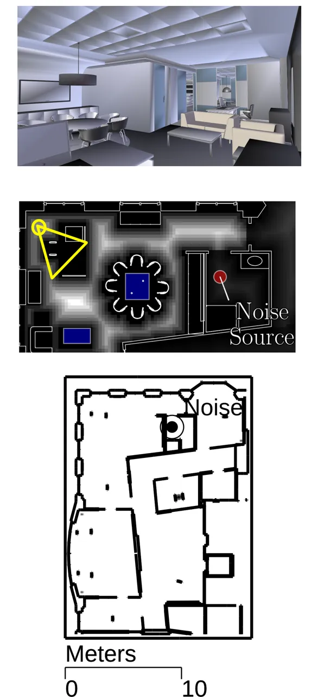

(a) Office (Zoomed-in)

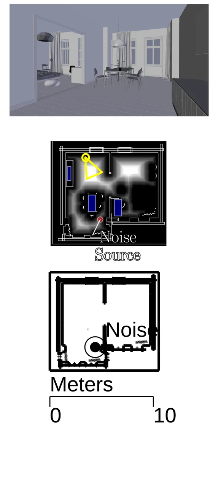

(b) Berlin

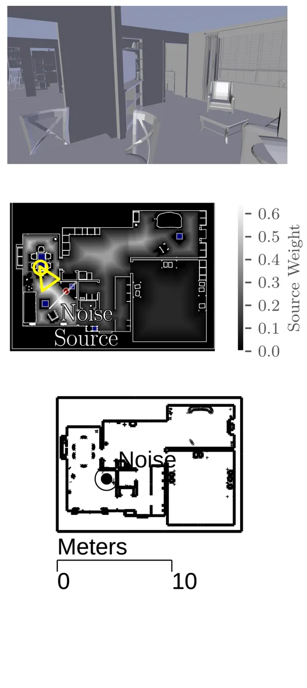

(c) Suburban

Figure 1: The three complex CAD benchmarks used to evaluate our
algorithm: The Office scene, the Berlin scene, and the Suburban scene.
The first row shows the interior of part of the CAD scene, with the
camera positions marked in the second row in yellow. The second row
shows diagram of the placements constraints used in the discretization
of a portion of these scenes from a top-down view. Blue regions
correspond to allowable areas within which the listener can be placed.
The gradient represents possible source positions corresponding to where
a human speaker may be located and the weighting of that speaker
location. The red dot refers to a noise source that can interfere with
STI. Note that subfigure (a) is a zoomed-in view of the office scene, in
the area of interest with positive weights since the rest of the
benchmark has very low weights. The third row shows the dimensions of
the rooms and locations of the noise sources.

## 4 Our Optimization Algorithm

In a typical environment where speech recognition is used, having a high
STI for a single source location is not sufficiently optimal for the
entire environment. For example, in a household, the user of a speech
recognition device could use the device from many different locations.
As the user’s location changes, so does the source position and the
propagated sound. Therefore, we consider the set of all possible source
locations $`S`$ in our optimization formulation, based on user-defined
constraints. This set is sampled discretely according to a uniform
distribution yielding the source locations $`s_{1}\dots s_{n}`$ where
$`n`$ is the number of sampled locations.

### 4.1 Objective Function

Given the optimization variable for the receiver location $`\ell`$, we
use the following objective function:

```math
\argmax_{\ell}\sum_{i=1}^{n}w_{i}\STI\left(h\left(s_{i},\ell\right)\right), \tag{6}
```

where $`w_{i}`$ is a weighting for the source location $`s_{i}`$ defined
by the user. An overview of how the objective function is used to drive
the overall optimization of the receiver location is shown in Figure 2.

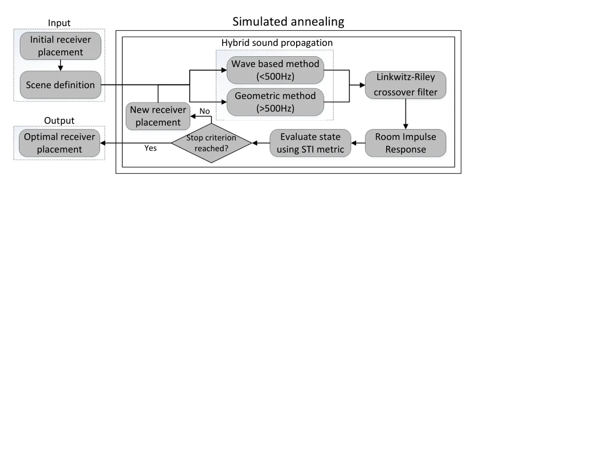

Figure 2: We highlight various components of our approach: The scene
definition consists of the scene geometry (i.e. the triangulated CAD
model) and the acoustic property of each material assigned to the
triangular mesh. It is sent to our optimization scheme as the input
along with an initial receiver location. The RIR is computed using a
hybrid sound propagation approach, with a wave based technique under
$`500\text{\,}\mathrm{Hz}`$ and a geometric technique above
$`500\text{\,}\mathrm{Hz}`$. The STI is then computed from the RIR and
averaged to evaluate the objective function. Our simulated annealing
approach then computes a new receiver location for the next iteration
until the stopping criteria are encountered.

The goal of this objective function is to find the receiver location
where the STI is maximized throughout the domain. Importantly, this
depends on the acoustic environment and how sound propagates in it. The
STI is computed using the hybrid impulse response described in
Equation 3. The linear weighted sum allows for some designer control in
the multiobjective optimization process.

Using this weight, certain regions of the environment can be prominent
or dominant in our optimization algorithm. For example, if a speech
recognition device is primarily for use in the living room, source
locations in that room should be weighted higher. This weighting is
specified by the designer, but can also be computed using data-driven
approaches; for example the measured frequency at which the user is in
each room or the areas in which workers are primarily located.

A higher weight in a particular location will make the optimization
process more sensitive to changes of the STI in that area. For example,
in our Suburban scene, we weight the garage area close to zero. As a
result, the STI in the garage has little effect on the results of the
optimization process. However, both living rooms were weighted highly,
leading the algorithm to select a location in one living room, but still
be intelligible in parts of the other.

To compute the objective function for a specific listener position, we
compute the RIR and STI for every source. In our implementation, we
propagate acoustic waves outwards from the receiver position rather than
the source in order to evaluate $`h\left(s_{i},\ell\right)`$ for all
source locations $`s_{1}\dots s_{n}`$ with the wave-based technique. In
general, the cost of the ARD method is the same whether one listener is
evaluated or the entire field is computed. Therefore, using acoustic
reciprocity the same holds for whether one source is active or a large
number of sources are active for one listener. If there is a many-to-one
or one-to-many relationship between sources and listeners, it is
possible to take advantage of this property.

Without loss of generality, a similar approach without reciprocity can
be used to determine speaker placement in a public address system,
though our experiments focus on receiver placement.

### 4.2 The Optimization Domain

The optimization domain is first defined in continuous space by the set
of subdomains that are distinct regions of space. In our implementation,
these are defined by the designer using 3D axis-aligned bounding boxes,
although it is straightforward to use other subdomain shapes. Each of
these subdomains represents constraints on where the receiver can be
placed. This can reflect structural constraints, such as the placement
of a PA system, or aesthetic constraints such as the location of a home
automation device.

This domain is then uniformly sampled, using a stratified sampling
approach. Our set of listeners is defined as:

```math
L=\left\{\ell:\ell\in\bigcup\limits_{i=1}^{m}{B_{i}}\right\}, \tag{7}
```

where $`L`$ is the set of possible listeners and $`B_{i}`$ is a
subdomain specified by the designer.

To maximize Equation (6), we select from a set of discrete receiver
locations $`L`$. This discrete sampling allows for a straightforward way
of evaluating constraints. The primary constraint of the receiver
location is an allowable set of surfaces on which the receiver can be
placed. A device would commonly be placed on a table or counter top, but
the floor would not be a desirable location. Receiver locations are
sampled from the areas allowed by the constraints. Figure 1 shows these
constraints on a typical scene, such as an office workplace.

The choice of sampling density and distribution can affect the
convergence of the optimization algorithm and the performance of the
approach. For example, too coarse a sampling can cause some details of
the resulting pressure field to be missed, while too fine a sampling can
increase the overall search space of the optimization algorithm and
increase the overall number of iterations.

In our implementation, we used a sampling density of one sample every
approximately $`5\text{\,}\mathrm{cm}10\text{\,}\mathrm{cm}`$. The
spatial step of the wave-based solver for $`500\text{\,}\mathrm{Hz}`$
was approximately $`10\text{\,}\mathrm{cm}`$, so this sampling was able
to sufficiently capture variances in the lower-frequency sound field.

### 4.3 Simulated Annealing

Input: Source regions $`\Omega`$, $`s_{1},...,s_{n}\in\Omega`$

     Initial temperature $`T_{0}`$

     Cooling rate $`\alpha`$

Output: Optimal receiver location $`l_{opt}`$

Initializaiton( );

$`l`$ $`\leftarrow`$ GetInitialState( );

$`q\leftarrow\sum_{i=1}^{n}w_{i}\STI\left(h\left(s_{i},\ell\right)\right)`$;

$`T\leftarrow T_{0}`$;

while _$`T>1`$_ do

   $`l^{\prime}\leftarrow`$ PermuteState(_l_); /\* Compute new state \*/

   $`q^{\prime}\leftarrow\sum_{i=1}^{n}w_{i}\STI\left(h\left(s_{i},\ell\right)\right)`$;

   if _TestState(_$`q,q^{\prime},T`$_)_ then

      $`l\leftarrow l^{\prime}`$;

      if _$`q^{\prime}>q`$_ then

         $`q\leftarrow q^{\prime}`$; /\* Update optimal state \*/

         $`l_{opt}\leftarrow l^{\prime}`$;

      end if

   end if

   $`T\leftarrow\alpha T`$; /\* Temperature cools down \*/

end while

Procedure _TestState(_$`q,q^{\prime},T`$_)_

   if _$`q^{\prime}>q`$_ then

      return _true_; /\* Always accept better state \*/

   end if

   $`p\leftarrow e^{\frac{q-q^{\prime}}{T}}`$; /\* Accept worse state by
probability \*/

   return
_$`p<\textnormal{{Rand(}}\textnormal{\emph{0,1}}\textnormal{{)}}`$_;

Algorithm 1 Simulated Annealing

Given the discrete search domain $`L`$, we use a simulated annealing
(SA) approach for choosing the optimal receiver position and maximizing
STI. SA algorithms work by mimicking physical annealing processes, where
gradual cooling processes affect the structure of a material. In SA, an
optimal solution to an optimization problem is obtained by randomly
selecting configurations and gradually restricting (or _cooling_) the
choice of a new configuration.

The probabilistic nature of SA techniques allow them to avoid local
extrema by probabilistically iterating over less-optimal solution. Early
termination conditions allow our algorithm to keep the number of
iterations low. Additionally, since the compute cost of evaluating the
acoustic field in our hybrid approach is very high, simulated annealing
improves iteration performance by only evaluating the field once for
each iteration.

In typical SA approaches, an initial temperature $`T_{0}`$ is chosen.
Then, using a specified cooling schedule, the temperature is reduced on
each iteration as the optimization variables are perturbed. The
temperature is used to determine the probability of moving to a
less-optimal state, where the optimality is given by the energy of that
state. Whenever a new state is chosen for the optimization variables,
better states are allowed but worse states may still be permitted
depending on the temperature. In our formulation, given a configuration
of listener location $`\ell`$, the energy is the STI computed in
Equation 6. Since states represent possible receiver positions, a new
state $`\ell^{\prime}`$ is determined by randomly selecting a new
discrete point from the set of possible receiver positions. The entire
SA algorithm is described in the pseudo-code listing Algorithm 1

We tune the cooling schedule of the SA algorithm so that at the end of
our optimization process, the probability of accepting a state with an
STI $`0.03`$ (the just-noticeable difference of STI \[34\]) less than
the current state is $`1\%`$.

```math
T_{end}=-\frac{0.03}{\ln{0.01}}. \tag{8}
```

Additionally, we reduce the overall number of iterations by ending early
if a state is rejected $`k`$ times, where $`k=10`$ yielded good results
in our experiments. Usually a long sequence of consecutive rejects means
that the SA approach has encountered a global maximum, or at least that
the probability of a better configuration is low.

### 4.4 Comparison to Prior Work

In Section 2.2, we discuss prior methods of acoustic optimization
dealing with various acoustic problems. Monks et al. \[2\] also use a
simulated annealing technique, but for shape and material optimization.
However, the technique uses geometric methods that are not accurate for
lower frequencies. Similarly, prior work in wave-based optimization for
materials \[1\] is restricted to lower frequencies where the
computational cost of the wave-based method is not intractable.

Recent work has focused on hybrid acoustics for noise control \[3\]. Our
problem formulation differs in a few aspects. First, we are interested
in a problem domain with fixed environmental noise, and rather the
improvement of STI by the placement of speakers or receivers. Our
technique can work in conjunction with previous work — consider a design
pipeline where noise in minimized using prior work and the result of the
minimization is used as the static noise input for improving speech
intelligibility. Secondly, since we are dealing with a single
omnidirectional receiver/listener, we can take advantage of some
properties of acoustic wave propagation to improve the performance of
our algorithm; using the principle of acoustic reciprocity, we can model
receivers in the same way we model sources. This is only possible with a
one-to-many relationship between receivers and sources rather than a
many-to-many relationship. Finally, we focus on different acoustic
phenomena. While environmental noise is an important focus of our work,
we are also interested in the reverberation in the room where the
listener is being placed. Therefore optimal placement is more heavily
dependent on the acoustic environment, not just the secondary noise
sources.

## 5 Results and Analysis

|                |           |      |     |      |      |      |      |     |      |      |      |           |
| -------------- | --------- | ---- | --- | ---- | ---- | ---- | ---- | --- | ---- | ---- | ---- | --------- |
| STI            | $`>`$0.76 | 0.74 | 0.7 | 0.66 | 0.62 | 0.58 | 0.54 | 0.5 | 0.46 | 0.42 | 0.38 | $`<`$0.36 |
| Quality rating | A+        | A    | B   | C    | D    | E    | F    | G   | H    | I    | J    | U         |

Table 2: STI scale and qualification \[8\]

| Scene    | Num. Triangles | Model Size    | Avg. STI Before | Avg. STI After | Num. Iterations | Num. Samples | Time ($`\mathrm{s}`$) |
| -------- | -------------- | ------------- | --------------- | -------------- | --------------- | ------------ | --------------------- |
| Office   | 973373         | $`1290m^{3}`$ | $`0.1600`$      | $`0.6757`$     | $`60`$          | $`879`$      | $`2357`$              |
| Berlin   | 2198393        | $`370m^{3}`$  | $`0.1818`$      | $`0.5601`$     | $`76`$          | $`219`$      | $`2707`$              |
| Suburban | 85604          | $`391m^{3}`$  | $`0.1802`$      | $`0.6571`$     | $`37`$          | $`554`$      | $`1686`$              |

Table 3: Our optimization process can improve the STI of scenes of
differing complexity. We were able to improve the receiver’s STI in the
Berlin scene from the lowest intelligibility rating of U to an
intelligibility rating of E, which is suitable for high quality public
address systems. Our optimization process improved intelligibility of
the suburban scene and the office scene from U to C, which indicates
high speech intelligibility (see Table 2). We also reference the
relative scene complexity for both the wave-based and geometric method.
Since the performance of the geometric method is dependent on the
triangle mesh for the surface representation of the model, we show the
total number of surface triangles in each benchmark. We also summarize
the volume, since the wave-based method uses a spatial regular grid
discretization of the input model. The number of samples is the number
of discrete listener positions and the size of the search space.

We tested our receiver placement optimization on three workplace and
residential scenes. Our method can accurately compute the STI on complex
indoor scenes. The optimization was computed on a desktop machine, using
8 threads. Our benchmark scenes included Office, a multi-room workplace
with conference rooms; Suburban, the ground floor of a multi-story
house; and Berlin, a small apartment with two connected rooms. The
material absorptions of the three benchmarks are specified by hand
annotation of their respective CAD models using the material database
from \[35\].

We evaluate the performance of our algorithm on different benchmarks. On
each scene we were able to obtain a result significantly greater than
the JND of STI, which is 0.03 \[34\]. A reference for the
intelligibility of different STI values is included in Table 2. Our
optimization algorithm is able to converge in a few iterations to the
maximum STI. These results are summarized in Table 3. In this table, we
also highlight the complexity of the scene with respect to the volume
(which affects the performance of the wave-based model) and with respect
to the number of triangles in the CAD model (since the geometric solver
works by tracing rays against a triangle mesh).

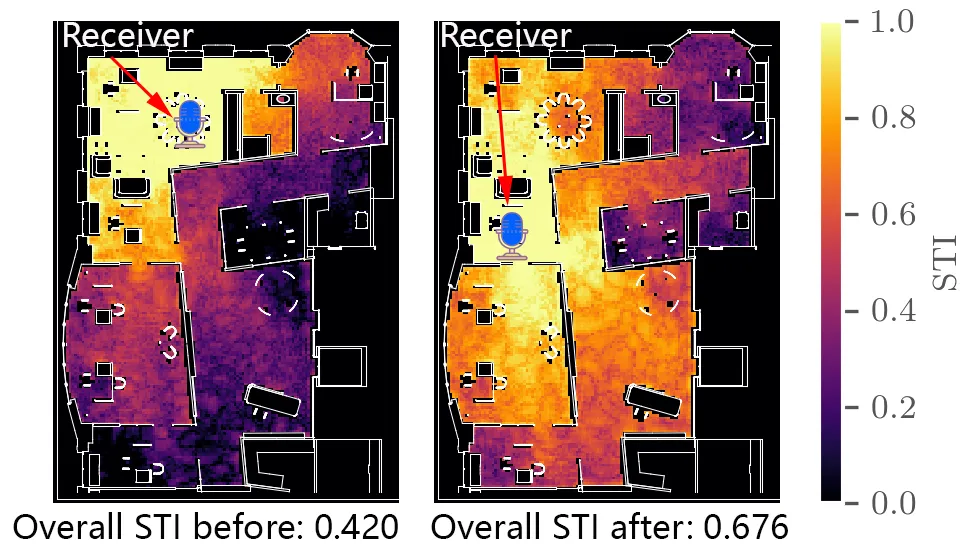

(a) Office scene STI fields

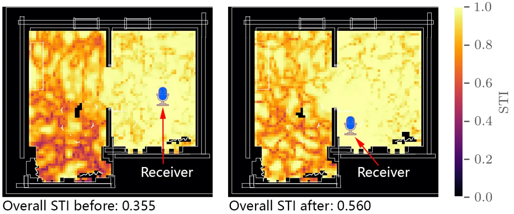

(b) Berlin scene STI fields

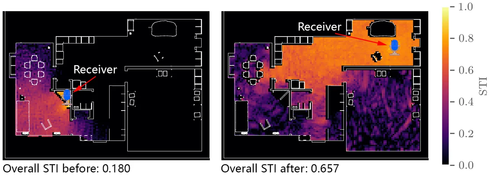

(c) Suburban scene STI fields

Figure 3: Side-by-side comparison of the initial and final placements
for the receiver according to our optimization process. The figure on
the left shows a receiver placement close to the noise-emitting source,
yielding a very poor STI rating. The figure on the right shows placement
as a result of our optimization process. The receivers are placed away
from the noise source, but also placed to avoid areas that have
reflective floors. Note that the left side placements are generally not
the worst case because we do not search the whole feasible areas by
brute force. Consequently, the actual improvement on STI could be
greater in worse cases.

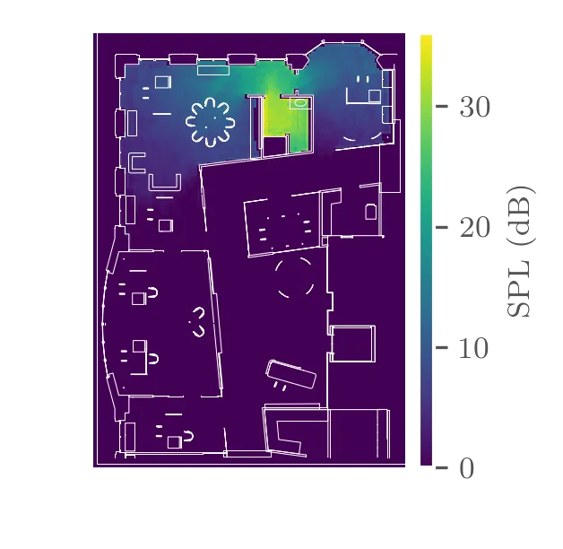

(a) Office scene noise pressure distribution

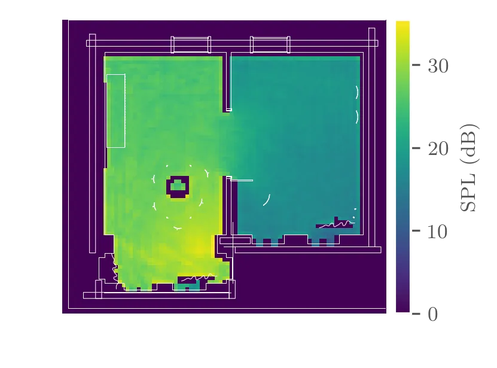

(b) Berlin scene noise pressure distribution

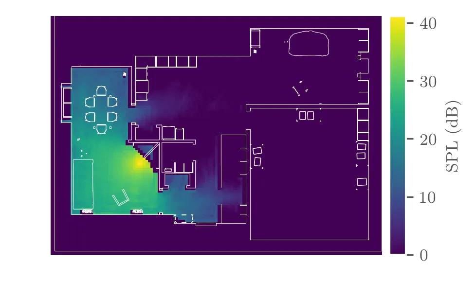

(c) Suburban scene noise pressure distribution

Figure 4: Pressure distribution of each of the noise sources in the
three models.

Figure 3 shows the impact the choice of listener position has on the
various speaking positions within the Suburban scene. Our optimization
process accounts for multiple speaking locations throughout the
environment rather than a single location. The pressure distribution
from the noise source in each scene is summarized in Figure 4.

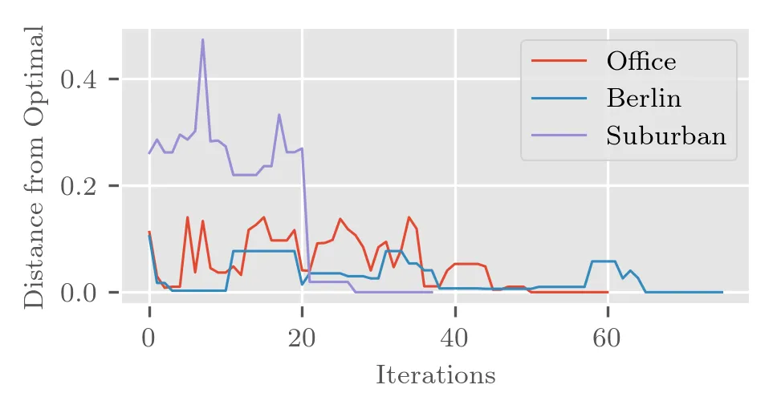

Figure 5: Convergence plot of our optimization process in different
environments. These show the overall energy difference at each iteration
in comparison to the final converged energy. The starting point was
selected randomly. The distance to optimal is a measure of the absolute
value difference between the total energy in each iteration and the
final energy at the end of the optimization process.

A summary of the convergence of our algorithm is in Figure 5. The
starting points for these experiments were selected randomly, and show
how the simulated annealing process avoids local maxima throughout the
optimization.

### 5.1 Validation

|     |            |            |            |                     |                   |
| --- | ---------- | ---------- | ---------- | ------------------- | ----------------- |
|     | Measured   | Geometric  | Wave-based | Hybrid              | Hybrid Error      |
| IR0 | $`0.8438`$ | $`0.7186`$ | $`0.7241`$ | $`\mathbf{0.7510}`$ | $`\mathbf{11\%}`$ |
| IR1 | $`0.7251`$ | $`0.6838`$ | $`0.6885`$ | $`\mathbf{0.7031}`$ | $`\mathbf{3\%}`$  |

Table 4: Comparison of our simulated STI with measured STI in a
digitally scanned room by \[36\].

We measured the accuracy of our hybrid propagation STI calculations by
comparing our method to measured IRs in a room that was digitally
scanned in work by \[36\]. These results are summarized in Table 4. For
the comparison, we cutoff the simulated IR to match the total length (in
samples) of the measured IR and matched the peak offset to account for
differing impulse times in the measured and simulated impulse responses.

Previous work on both the geometric and wave-based approaches we used
has also performed some validation work. Schissler et al. \[37\] compare
the accuracy of their geometric method (which we use) on the round Robin
Elmia benchmark. Additionally the accuracy of the ARD wave-based solver
was evaluated with measured IRs in \[38\].

### 5.2 Comparison to STI estimation

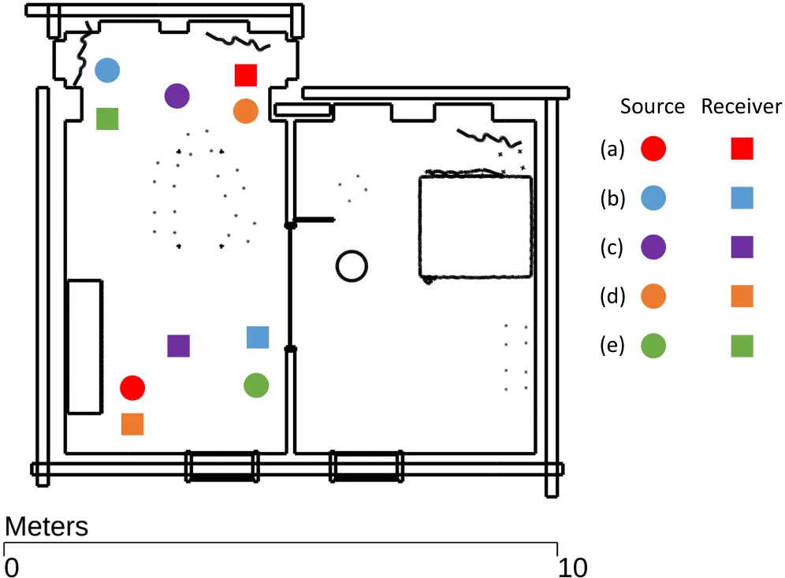

Figure 6: Experiment setup for evaluating effects of inaccurate
propagation. Five source-receiver pairs labeled from ($`a`$) to ($`e`$)
are manually chosen throughout the Berlin scene. Note that we separated
out a single room by adding a wall for the convenience of applying
Sabine approximation.

Additionally, we compare our results to the use of less accurate
reverberation models, including empirical predictive models for
reverberation time \[39\] and STI \[40\] based on room volume, and the
geometric propagation model that is part of our hybrid simulator.
Previous research \[3\] has shown that a pure geometric approach can
lead to errors up to 36$`\mathrm{dB}`$ in frequency response at a low
frequency ($`125\text{\,}\mathrm{Hz}`$) compared to wave-based methods
in an area of diffraction. Here we evaluate the error introduced to STI
from inaccurate sound propagation. We show errors beyond the JND of STI
that occur while using these models. The single room we used for the
test has a dimension of $`4.475\times 8.338\times 3.524m^{3}`$, which
gives us its volume $`V=131.49m^{3}`$. Then we apply the quadratic
fitting function in \[39\] to compute the reverberation time at
$`500\text{\,}\mathrm{Hz}`$ in furnished rooms as

```math
\text{T}_{60}=-2\times 10^{5}V^{2}+0.0048V+0.255. \tag{9}
```

This yields $`\text{T}_{60}=0.54s`$. Then we continue applying the
regression equation in \[40\] to calculate an estimated STI as:

```math
\text{STI}=0.5895-0.4422\text{log}_{10}(\text{T}_{60}), \tag{10}
```

which gives $`\text{STI}=0.708`$. Then we use the same setup and
computed IRs for five source-receiver pairs under a distribution in
Figure 6 using both geometric propagation and hybrid propagation
separately. Figure 7 shows a comparison of STI values computed from our
propagated IRs and the empirical model.

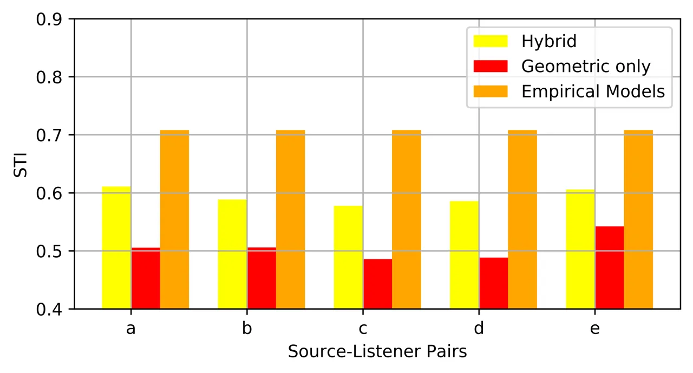

Figure 7: Comparison of the accurate hybrid sound propagation model to
using less accurate propagation models. Source-listener pairs _a_
through _e_ were arbitrarily selected from the Berlin scene. The
_hybrid_ and _geometric only_ STI values displayed are calculated from
impulse responses generated by a full hybrid sound propagation, and a
simulation using only geometric sound propagation respectively; and the
_empirical_ STI is calculated from empirical models in \[39, 40\], which
do not account for source/listener location. We observe that the
difference between the hybrid model and the other two is always above
the JND of STI. It is not sufficient to use less accurate propagation
models even for simpler scenes such as the Berlin scene.

## 6 Conclusion and Future Work

We present a novel optimization-based receiver placement algorithm to
improve speech intelligibility. Using hybrid sound propagation, we can
keep our performance costs low while maintaining accuracy at lower
frequencies. We have applied our approach to complex indoor scenes and
obtained considerable improvement in STI. To the best of our knowledge,
this is the first algorithm that performs hybrid sound propagation
optimization for this application.

In the future, we would like to couple our method with existing
denoising and dereverberation algorithms in addition to previous noise
reduction techniques. For example, a computer design can be specified
using reduced environmental noise and then improved STI. Then,
dereverberation algorithms can be applied to the resulting signal.

The primary limitation of our technique is the quality of our input. We
found that in general, our computed STI values tended to be higher than
many measured STIs in similar environments. Although we modeled some
environmental noise sources, designers using our algorithm would need to
perform measurements of the ambient noise levels first. This is not
straightforward to model when ambient noise or transmissive noise
sources (e.g. a highway outside the building) are involved.

Additionally, in many cases, the directivity of human speech can
influence the STI. Our method, however, is limited to omnidirectional
sound sources.

## Acknowledgements

This research was supported by ARO grant W911NF14-1-0437 and NSF grant 1320644.

## References

- \[1\] N. Morales, D. Manocha, Efficient wave-based acoustic material
  design optimization, Computer-Aided Design 78 (2016) 83–92.
- \[2\] M. Monks, B. M. Oh, J. Dorsey, Audioptimization: Goal-based
  acoustic design, Computer Graphics and Applications, IEEE
  20 (3) (2000) 76–90.
- \[3\] N. Morales, D. Manocha, Optimizing source placement for noise
  minimization using hybrid acoustic simulation, Computer-Aided Design
  96 (2018) 1–12.
- \[4\] A. Sriram, H. Jun, Y. Gaur, S. Satheesh, Robust speech
  recognition using generative adversarial networks, in: 2018 IEEE
  International Conference on Acoustics, Speech and Signal Processing
  (ICASSP), IEEE, 2018, pp. 5639–5643.
- \[5\] D. S. Pallett, A look at nist’s benchmark asr tests: past,
  present, and future, in: Automatic Speech Recognition and
  Understanding, 2003. ASRU’03. 2003 IEEE Workshop on, IEEE, 2003, pp.
  483–488.
- \[6\] M. G. Helander, Handbook of human-computer interaction,
  Elsevier, 2014.
- \[7\] B. W. Gillespie, L. E. Atlas, Acoustic diversity for improved
  speech recognition in reverberant environments, in: Acoustics, Speech,
  and Signal Processing (ICASSP), 2002 IEEE International Conference on,
  Vol. 1, IEEE, 2002, pp. I–557.
- \[8\] B. EN, 60268-16: 2011.", Sound system equipment–Part 16:
  Objective rating of speech intelligibility by speech transmission
  index.
- \[9\] J. A. Galster, The effect of room volume on speech recognition
  in enclosures with similar mean reverberation time, Ph.D. thesis
  (2007).
- \[10\] I. Tashev, D. Allred, Reverberation reduction for improved
  speech recognition, Proc. Hands-Free Communication and Microphone
  Arrays.
- \[11\] X. Feng, Y. Zhang, J. Glass, Speech feature denoising and
  dereverberation via deep autoencoders for noisy reverberant speech
  recognition, in: Acoustics, Speech and Signal Processing (ICASSP),
  2014 IEEE International Conference on, IEEE, 2014, pp. 1759–1763.
- \[12\] J. Tchorz, B. Kollmeier, A model of auditory perception as
  front end for automatic speech recognition, The Journal of the
  Acoustical Society of America 106 (4) (1999) 2040–2050.
- \[13\] H.-G. Hirsch, D. Pearce, The aurora experimental framework for
  the performance evaluation of speech recognition systems under noisy
  conditions, in: ASR2000-Automatic Speech Recognition: Challenges for
  the new Millenium ISCA Tutorial and Research Workshop (ITRW), 2000.
- \[14\] J. Barker, R. Marxer, E. Vincent, S. Watanabe, The third
  ‘chime’speech separation and recognition challenge: Dataset, task and
  baselines, in: Automatic Speech Recognition and Understanding (ASRU),
  2015 IEEE Workshop on, IEEE, 2015, pp. 504–511.
- \[15\] K. Kinoshita, M. Delcroix, S. Gannot, E. A. Habets,
  R. Haeb-Umbach, W. Kellermann, V. Leutnant, R. Maas, T. Nakatani,
  B. Raj, et al., A summary of the reverb challenge: state-of-the-art
  and remaining challenges in reverberant speech processing research,
  EURASIP Journal on Advances in Signal Processing 2016 (1) (2016) 7.
- \[16\] T. Ko, V. Peddinti, D. Povey, M. L. Seltzer, S. Khudanpur, A
  study on data augmentation of reverberant speech for robust speech
  recognition, in: Acoustics, Speech and Signal Processing (ICASSP),
  2017 IEEE International Conference on, IEEE, 2017, pp. 5220–5224.
- \[17\] K. J. Palomäki, G. J. Brown, D. Wang, A binaural processor for
  missing data speech recognition in the presence of noise and
  small-room reverberation, Speech Communication 43 (4) (2004) 361–378.
- \[18\] J. Chen, Y. Wang, S. E. Yoho, D. Wang, E. W. Healy, Large-scale
  training to increase speech intelligibility for hearing-impaired
  listeners in novel noises, The Journal of the Acoustical Society of
  America 139 (5) (2016) 2604–2612.
- \[19\] K. Saksela, J. Botts, L. Savioja, Optimization of absorption
  placement using geometrical acoustic models and least squares, The
  Journal of the Acoustical Society of America 137 (4) (2015)
  EL274–EL280.
- \[20\] P. W. Robinson, S. Siltanen, T. Lokki, L. Savioja, Concert hall
  geometry optimization with parametric modeling tools and wave-based
  acoustic simulations, Building Acoustics 21 (1) (2014) 55–64.
- \[21\] H. Khalilian, I. V. Bajić, R. G. Vaughan, Joint optimization of
  loudspeaker placement and radiation patterns for sound field
  reproduction, in: Acoustics, Speech and Signal Processing (ICASSP),
  2015 IEEE International Conference on, IEEE, 2015, pp. 519–523.
- \[22\] P. D’Antonio, T. J. Cox, Room optimizer: A computer program to
  optimize the placement of listener, loudspeakers, acoustical surface
  treatment and room dimensions in critical listening rooms, in: Audio
  Engineering Society Convention 103, Audio Engineering Society, 1997.
- \[23\] T. Houtgast, H. Steeneken, W. Ahnert, L. Braida, R. Drullman,
  J. Festen, K. Jacob, P. Mapp, S. McManus, K. Payton, et al., Past,
  present and future of the Speech Transmission Index, Soesterberg:
  TNO, 2002.
- \[24\] S. J. v. Wijngaarden, H. J. Steeneken, Objective prediction of
  speech intelligibility at high ambient noise levels using the speech
  transmission index, in: Sixth European Conference on Speech
  Communication and Technology, 1999.
- \[25\] T. Houtgast, H. J. M. Steeneken, A multi-language evaluation of
  the rasti-method for estimating speech intelligibility in auditoria,
  Acta Acustica united with Acustica 54 (4) (1984) 185–199.
- \[26\] T. Houtgast, H. J. Steeneken, A review of the mtf concept in
  room acoustics and its use for estimating speech intelligibility in
  auditoria, The Journal of the Acoustical Society of America
  77 (3) (1985) 1069–1077.
- \[27\] M. R. Schroeder, Modulation transfer functions: Definition and
  measurement, Acta Acustica united with Acustica 49 (3) (1981) 179–182.
- \[28\] D. Cabrera, M. Yadav, D. Protheroe, Critical methodological
  assessment of the distraction distance used for evaluating room
  acoustic quality of open-plan offices, Applied Acoustics 140 (2018)
  132–142.
- \[29\] D. Cabrera, D. Lee, G. Leembruggen, D. Jimenez, Increasing
  robustness in the calculation of the speech transmission index from
  impulse responses, Building Acoustics 21 (3) (2014) 181–198.
- \[30\] N. Raghuvanshi, R. Narain, M. C. Lin, Efficient and accurate
  sound propagation using adaptive rectangular decomposition,
  Visualization and Computer Graphics, IEEE Transactions on
  15 (5) (2009) 789–801.
- \[31\] N. Morales, R. Mehra, D. Manocha, A parallel time-domain wave
  simulator based on rectangular decomposition for distributed memory
  architectures, Applied Acoustics 97 (2015) 104–114.
- \[32\] C. Schissler, D. Manocha, Interactive sound propagation and
  rendering for large multi-source scenes, ACM Transactions on Graphics
  (TOG) 36 (1) (2016) 2.
- \[33\] S. H. Linkwitz, Active crossover networks for noncoincident
  drivers, Journal of the Audio Engineering Society 24 (1) (1976) 2–8.
- \[34\] J. Bradley, R. Reich, S. Norcross, A just noticeable difference
  in c 50 for speech, Applied Acoustics 58 (2) (1999) 99–108.
- \[35\] M. D. Egan, Architectural Acoustics (J. Ross Publishing
  Classics), Vol. 4, J. Ross Publishing, 2007.
- \[36\] C. Schissler, C. Loftin, D. Manocha, Acoustic classification
  and optimization for multi-modal rendering of real-world scenes, IEEE
  transactions on visualization and computer graphics 24 (3) (2018)
  1246–1259.
- \[37\] C. Schissler, D. Manocha, Interactive sound propagation and
  rendering for large multi-source scenes, ACM Transactions on Graphics
  (TOG) 36 (1) (2017) 2.
- \[38\] R. Mehra, N. Raghuvanshi, A. Chandak, D. G. Albert,
  D. Keith Wilson, D. Manocha, Acoustic pulse propagation in an urban
  environment using a three-dimensional numerical simulation, The
  Journal of the Acoustical Society of America 135 (6) (2014) 3231–3242.
- \[39\] C. Díaz, A. Pedrero, The reverberation time of furnished rooms
  in dwellings, Applied Acoustics 66 (8) (2005) 945–956.
- \[40\] S. Tang, M. Yeung, Speech transmission index or rapid speech
  transmission index for classrooms? a designer’s point of view, Journal
  of sound and vibration.
