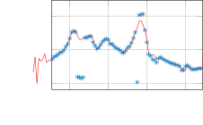
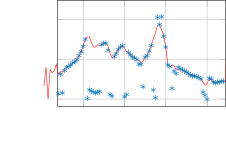
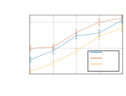
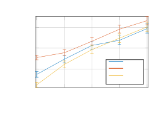
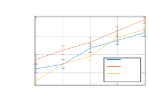
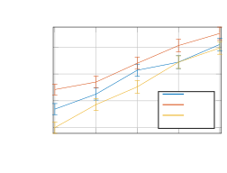

\usetkzobj

all

# Model-based Speech Enhancement for Intelligibility Improvement in Binaural Hearing Aids

Mathew Shaji Kavalekalam    Jesper Kjær Nielsen    Jesper Bünsow Boldt
   and Mads Græsbøll Christensen ^(†)^(†)thanks: Mathew S. Kavalekalam,
Jesper K. Nielsen and Mads G. Christensen are with the Audio Analysis
Lab, Department of Architecture, Design and Media Technology at Aalborg
University.^(†)^(†)thanks: Jesper Boldt is with GN Hearing, Ballerup,
Denmark^(†)^(†)thanks: Manuscript received ; revised

###### Abstract

Speech intelligibility is often severely degraded among hearing impaired
individuals in situations such as the cocktail party scenario. The
performance of the current hearing aid technology has been observed to
be limited in these scenarios. In this paper, we propose a binaural
speech enhancement framework that takes into consideration the speech
production model. The enhancement framework proposed here is based on
the Kalman filter that allows us to take the speech production dynamics
into account during the enhancement process. The usage of a Kalman
filter requires the estimation of clean speech and noise short term
predictor (STP) parameters, and the clean speech pitch parameters. In
this work, a binaural codebook-based method is proposed for estimating
the STP parameters, and a directional pitch estimator based on the
harmonic model and maximum likelihood principle is used to estimate the
pitch parameters. The proposed method for estimating the STP and pitch
parameters jointly uses the information from left and right ears,
leading to a more robust estimation of the filter parameters. Objective
measures such as PESQ and STOI have been used to evaluate the
enhancement framework in different acoustic scenarios representative of
the cocktail party scenario. We have also conducted subjective listening
tests on a set of nine normal hearing subjects, to evaluate the
performance in terms of intelligibility and quality improvement. The
listening tests show that the proposed algorithm, even with access to
only a single channel noisy observation, significantly improves the
overall speech quality, and the speech intelligibility by up to
$`15\%`$.

###### Index Terms:

Kalman filter, binaural enhancement, pitch estimation, autoregressive
model.

## I Introduction

Normal hearing (NH) individuals have the ability to concentrate on a
single speaker even in the presence of multiple interfering speakers.
This phenomenon is termed as the cocktail party effect. However, hearing
impaired individuals lack this ability to separate out a single speaker
in the presence of multiple competing speakers. This leads to listener
fatigue and isolation of the hearing aid (HA) user. Mimicking the
cocktail party effect in a digital HA is very much desired in such
scenarios \[1\]. Thus, to help the HA user to focus on a particular
speaker, speech enhancement has to be performed to reduce the effect of
the interfering speakers. The primary objectives of a speech enhancement
system in HA are to improve the intelligibility and quality of the
degraded speech. Often, a hearing impaired person is fitted with HAs at
both ears. Modern HAs have the technology to wirelessly communicate with
each other making it possible to share information between the HAs. Such
a property in HAs enables the use of binaural speech enhancement
algorithms. The binaural processing of noisy signals has shown to be
more effective than processing the noisy signal independently at each
ear due to the utilization of spatial information \[2\]. Apart from a
better noise reduction performance, binaural algorithms make it possible
to preserve the binaural cues which contribute to spatial release from
masking \[3\]. Often, HAs are fitted with multiple microphones at both
ears. Some binaural speech enhancement algorithms developed for such
cases are \[4, 5\]. In \[4\], a multichannel Wiener filter for HA
applications is proposed which results in a minimum mean squared error
(MMSE) estimation of the target speech. These methods were shown to
distort the binaural cues of the interfering noise while maintaining the
binaural cues of the target. Consequently, a method was proposed in
\[6\] that introduced a parameter to trade off between the noise
reduction and cue preservation. The above mentioned algorithms have
reported improvements in speech intelligibility.

We are here mainly concerned with the binaural enhancement of speech
with access to only one microphone per HA \[7, 8, 9\]. More
specifically, this paper is concerned with a two-input two-output
system. This situation is encountered in in-the-ear (ITE) HAs, where the
space constraints limit the number of microphones per HA. Moreover, in
the case where we have multiple microphones per HA, beamforming can be
applied individually on each HA to form the two inputs, which can then
be processed further by the proposed dual channel enhancement framework.
One of the first approaches to perform dual channel speech enhancement
was that of \[7\] where a two channel spectral subtraction was combined
with an adaptive Wiener post-filter. This led to a distortion of the
binaural cues, as different gains were applied to the left and right
channels. Another approach to performing dual channel speech enhancement
was proposed in \[8\] and this solution consisted of two stages. The
first stage dealt with the estimation of interference signals using an
equalisation-cancellation theory, and the second stage was an adaptive
Wiener filter. The intelligibility improvements corresponding to the
algorithms stated above have not been studied well. These algorithms
perform the enhancement in the frequency domain by assuming that the
speech and noise components are uncorrelated, and do not take into
account the nature of the speech production process. In this paper, we
propose a binaural speech enhancement framework that takes the speech
production model into account. The model used here is based on the
source-filter model, where the filter corresponds to the vocal tract and
the source corresponds to the excitation signal produced by the vocal
chords. Using a physically meaningful model gives us a sufficiently
accurate way for explaining how the signals were generated, but also
helps in reducing the number of parameters to be estimated. One way to
exploit this speech production model for the enhancement process is to
use a Kalman filter, as the speech production dynamics can be modelled
within the Kalman filter using the state space equations while also
accounting for the background noise. Kalman filtering for single channel
speech enhancement in the presence of white background noise was first
proposed in \[10\]. This work was later extended to deal with coloured
noise in \[11, 12\]. One of the main limitations of Kalman filtering
based enhancement is that the state space parameters required for the
formulation of the state space equations need to be known or estimated.
The estimation of the state space parameters is a difficult problem due
to the non-stationary nature of speech and the presence of noise. The
state space parameters are the autoregressive (AR) coefficients and the
excitation variances for the speech and noise respectively. Henceforth,
AR coefficients along with the excitation variances will be denoted as
the short term predictor (STP) parameters. In \[11, 12\] these STP
parameters were estimated using an approximated expectation-maximisation
algorithm. However, the performance of these algorithms were noted to be
unsatisfactory in non-stationary noise environments. Moreover, these
algorithms assumed the excitation signal in the source-filter model to
be white Gaussian noise. Even though this assumption is appropriate for
modelling unvoiced speech, it is not very suitable for modelling voiced
speech. This issue was handled in \[13\] by using a modified model for
the excitation signal capable of modelling both voiced and unvoiced
speech. The usage of this model for the enhancement process required the
estimation of the pitch parameters in addition to the STP parameters.
This modification of the excitation signal was found to improve the
performance in voiced speech regions, but the performance of the
algorithm in the presence of non-stationary background noise was still
observed to be unsatisfactory. This was primarily due to the poor
estimation of the model parameters in non-stationary background noise.
The noise STP parameters were estimated in \[13\] by assuming that the
first 100 milli seconds of the speech segment contained only noise and
the parameters were then assumed to be constant.

In this work, we introduce a binaural model-based speech enhancement
framework which addresses the poor estimation of the parameters
explained above. We here propose a binaural codebook-based method for
estimating the STP parameters, and a directional pitch estimator based
on the harmonic model for estimating the pitch parameters. The estimated
parameters are subsequently used in a binaural speech enhancement
framework that is based on the signal model used in \[13\].
Codebook-based approaches for estimating STP parameters in the single
channel case have been previously proposed in \[14\], and has been used
to estimate the filter parameters required for the Kalman filter for
single channel speech enhancement in \[15\]. In this work we extend this
to the dual channel case, where we assume that there is a wireless link
between the HAs. The estimation of STP and pitch parameters using the
information on both the left and right channels leads to a more robust
estimation of these parameters. Thus, in this work, we propose a
binaural speech enhancement method that is model-based in several ways
as 1) the state space equations involved in the Kalman filter takes into
account the dynamics of the speech production model; 2) the estimation
of STP parameters utilised in the Kalman filter is based on trained
spectral models of speech and noise; and 3) the pitch parameters used
within the Kalman filter are estimated based on the harmonic model which
is a good model for voiced speech. We remark that this paper is an
extension of previous conference papers \[16, 17\]. In comparison to
\[16, 17\], we have used an improved method for estimating the
excitation variances. Moreover, the proposed enhancement framework has
been evaluated in more realistic scenarios and subjective listening
tests have been conducted to validate the results obtained using
objective measures.

## II Problem formulation

In this section, we formulate the problem and state the assumptions that
have been used in this work. The noisy signals at the left/right ears at
time index $`n`$ are denoted by

```math
z_{l/r}(n)=s_{l/r}(n)+w_{l/r}(n)\hskip 19.91684pt\forall n=0,1,2\ldots, \tag{1}
```

where $`z_{l/r}`$, $`s_{l/r}`$ and $`w_{l/r}`$ denote the noisy, clean
and noise components at the left/right ears, respectively. It is assumed
that the clean speech component is statistically independent with the
noise component. Our objective here is to obtain estimates of the clean
speech signals denoted as $`\hat{s}_{l/r}(n)`$, from the noisy signals.
The processing of the noisy speech using a speech enhancement system to
estimate the clean speech signal requires the knowledge of the speech
and noise statistics. To obtain this, it is convenient to assume a
statsitical model for the speech and noise components, making it easier
to estimate the statistics from the noisy signal. In this work, we model
the clean speech as an AR process, which is a common model used to
represent the speech production process \[18\].

We also assume that the speech source is in the nose direction of the
listener, so that the clean speech component at the left and right ears
can be represented by AR processes having the same parameters,

```math
s_{l/r}(n)=\sum\limits_{i=1}^{P}a_{i}s_{l/r}(n-i)+u(n), \tag{2}
```

where $`\mathbf{a}=[-a_{1},\ldots,-a_{P}]^{T}`$ is the set of speech AR
coefficients, $`P`$ is the order of the speech AR process and $`u(n)`$
is the excitation signal corresponding to the speech signal. Often,
$`u(n)`$ is modelled as white Gaussian noise with variance
$`\sigma_{u}^{2}`$ and this will be referred to as the unvoiced (UV)
model \[11\]. It should be noted that we do not model the reverberation
here. Similar to the speech, the noise components are represented by AR
processes as,

```math
w_{l/r}(n)=\sum\limits_{i=1}^{Q}c_{i}w_{l/r}(n-i)+v(n), \tag{3}
```

where $`\mathbf{c}=[-c_{1},\ldots,-c_{Q}]^{T}`$ is the set of noise AR
coefficients, $`Q`$ is the order of the noise AR process and $`v(n)`$ is
white Gaussian noise with variance $`\sigma_{v}^{2}`$.

As we have seen previously, the excitation signal, $`u(n)`$, in (2) was
modelled as a white Gaussian noise. Although this assumption is suitable
for representing unvoiced speech, it is not appropriate for modelling
voiced speech. Thus, inspired by \[13\], the enhancement framework here
models $`u(n)`$ as

```math
u(n)=b(p)u(n-p)+d(n), \tag{4}
```

where $`d(n)`$ is white Gaussian noise with variance $`\sigma_{d}^{2}`$,
$`p`$ is the pitch period and $`b(p)\in(0,1)`$ is the degree of voicing.
In portions containing predominantly voiced speech, $`b(p)`$ is assumed
to be close to $`1`$ and the variance of $`d(n)`$ is assumed to be
small, whereas in portions of unvoiced speech, $`b(p)`$ is assumed to be
close to zero so that (2) simplifies into the conventional unvoiced AR
model. The excitation model in (4) when used together with (2) is
referred to as the voiced-unvoiced (V-UV) model. This model can be
easily incorporated into the speech enhancement framework by modifying
the state space equations. The incorporation of the V-UV model into the
enhancement framework requires the pitch parameters, $`p`$ and $`b(p)`$,
in addition to the STP parameters to be estimated from the noisy signal.
We would like to remark here that these parameters are usually time
varying in the case of speech and noise signals. Herein, these
parameters are assumed to be quasi-stationary, and are estimated for
every frame index $`f_{n}=\lfloor\frac{n}{M}\rfloor+1`$, where $`M`$ is
the frame length. The estimation of these parameters will be explained
in the subsequent section.

## III Proposed Enhancement framework


Figure 1: Basic block diagram of the binaural enhancement framework.

### III-A Overview

The enhancement framework proposed here assumes that there is a
communication link between the two HAs that makes it possible to
exchange information. Fig. 1 shows the basic block diagram of the
proposed enhancement framework. The noisy signals at the left and right
ears are enhanced using a fixed lag Kalman smoother (FLKS), which
requires the estimation of STP and pitch parameters. These parameters
are estimated jointly using the information in the left and right
channels. The usage of identical filter parameters at both the ears
leads to the preservation of binaural cues. In this paper, the details
regarding the proposed binaural framework will be explained and the
performance of the binaural framework will be compared with that of the
bilateral framework, where it is assumed that there is no communication
link between the two HAs which leads to the filter parameters being
estimated independently at each ear. We will now explain the different
components of the proposed enhancement framework in detail.

### III-B FLKS for speech enhancement

As alluded to in the introduction, a Kalman filter allows us to take
into account the speech production dynamics in the form of state space
equations while also accounting for the observation noise. In this work,
we use FLKS which is a variant of the Kalman filter. A FLKS gives a
better performance than a Kalman filter, but has a higher delay. In this
section, we will explain the functioning of FLKS for both the UV and
V-UV models that we have introduced in Section II. We assume here that
the model parameters are known. For the UV model, the usage of a FLKS
(with a smoother delay of $`d_{s}\geq P`$) from a speech enhancement
perspective requires the AR signal model in (2) to be written as a state
space form as shown below

```math
\bar{\mathbf{s}}_{l/r}(n)=\mathbf{A}(f_{n})\bar{\mathbf{s}}_{l/r}(n-1)+\mathbf{\Gamma}_{1}u(n), \tag{5}
```

where
$`\bar{\mathbf{s}}_{l/r}(n)=[s_{l/r}(n),s_{l/r}(n-1),\ldots,s_{l/r}(n-d_{s})]^{T}`$
is the state vector containing the $`d_{s}+1`$ recent speech samples,
$`\mathbf{\Gamma}_{1}=[1,0,\ldots,0]^{T}`$ is a $`(d_{s}+1)\times 1`$
vector, $`u(n)=d(n)`$ and $`\mathbf{A}(f_{n})`$ is the
$`(d_{s}+1)\times(d_{s}+1)`$ speech state transition matrix written as

```math
\mathbf{A}(f_{n})=\begin{bmatrix}-\mathbf{a}(f_{n})^{T}&\mathbf{0}^{T}&0\\
\mathbf{I}_{P}&\mathbf{0}&\mathbf{0}\\
\mathbf{0}&\mathbf{I}_{d_{s}-P}&\mathbf{0}\end{bmatrix}. \tag{6}
```

The state space equation for the noise signal in (3) is similarly
written as

```math
\bar{\mathbf{w}}_{l/r}(n)=\mathbf{C}(f_{n})\bar{\mathbf{w}}_{l/r}(n-1)+\mathbf{\Gamma}_{2}v(n), \tag{7}
```

where
$`\bar{\mathbf{w}}_{l/r}(n)=[w_{l/r}(n),w_{l/r}(n-1),\ldots,w_{l/r}(n-Q+1)]^{T}`$,
$`\mathbf{\Gamma}_{2}=[1,0,\ldots,0]^{T}`$ is a $`Q\times 1`$ vector and

```math
\mathbf{C}(f_{n})=\begin{bmatrix}\left[c_{1}(f_{n}),\ldots,c_{Q-1}(f_{n})\right]&c_{Q}(f_{n})\\
\mathbf{I}_{Q-1}&\mathbf{0}\\
\end{bmatrix} \tag{8}
```

is a $`Q\times Q`$ matrix. The state space equations in (5) and (7) are
combined to form a concatenated state space equation for the UV model as

```math
\begin{bmatrix}\bar{\mathbf{s}}_{l/r}(n)\\
\bar{\mathbf{w}}_{l/r}(n)\end{bmatrix}=\begin{bmatrix}\mathbf{A}(f_{n})&\mathbf{0}\\
\mathbf{0}&\mathbf{C}(f_{n})\end{bmatrix}\begin{bmatrix}\bar{\mathbf{s}}_{l/r}(n-1)\\
\bar{\mathbf{w}}_{l/r}(n-1)\end{bmatrix}+\begin{bmatrix}\mathbf{\Gamma}_{1}&\mathbf{0}\\
\mathbf{0}&\mathbf{\Gamma}_{2}\end{bmatrix}\begin{bmatrix}d(n)\\
v(n)\end{bmatrix}
```

which can be rewritten as

```math
\bar{\mathbf{x}}^{\text{\tiny{UV}}}_{l/r}(n)\triangleq\mathbf{F}^{\text{\tiny{UV}}}(f_{n})\mathbf{x}(n-1)+\mathbf{\Gamma}_{3}\mathbf{y}(n), \tag{9}
```

where
$`\bar{\mathbf{x}}^{\text{\tiny{UV}}}_{l/r}(n)=\left[\bar{\mathbf{s}}_{l/r}(n)^{T}\,\bar{\mathbf{w}}_{l/r}(n)^{T}\right]^{T}`$
is the concatenated state space vector and
$`\mathbf{F}^{\text{\tiny{UV}}}(f_{n})`$ is the concatenated state
transition matrix for the UV model. The observation equation to obtain
the noisy signal is then written as

```math
z_{l/r}(n)=\mathbf{\Gamma}^{{\text{\tiny{UV}}}^{T}}\bar{\mathbf{x}}^{\text{\tiny{UV}}}_{l/r}(n), \tag{10}
```

where
$`\mathbf{\Gamma}^{{\text{\tiny{UV}}}}=\left[\mathbf{\Gamma}_{1}^{T}\,\mathbf{\Gamma}_{2}^{T}\right]^{T}`$.
The state space equation (9) and the observation equation (10) can then
be used to formulate the prediction and correction stages of the FLKS
for the UV model. We will now explain the formulation of the state space
equations for the V-UV model. The state space equation for the V-UV
model of speech is written as

```math
\bar{\mathbf{s}}_{l/r}(n)=\mathbf{A}(f_{n})\bar{\mathbf{s}}_{l/r}(n-1)+\mathbf{\Gamma}_{1}u(n), \tag{11}
```

where the excitation signal in (4) is also modelled as a state space
equation as

```math
\bar{\mathbf{u}}(n)=\mathbf{B}(f_{n})\bar{\mathbf{u}}(n-1)+\mathbf{\Gamma}_{4}d(n), \tag{12}
```

where
$`\bar{\mathbf{u}}(n)=[u(n),\,u(n-1),\ldots,u(n-p_{\text{max}}+1)]^{T}`$,
$`p_{\text{max}}`$ is the maximum pitch period in integer samples,
$`\mathbf{\Gamma}_{4}=[1,0\ldots 0]^{T}`$ is a
$`(p_{\text{max}})\times 1`$ vector and

```math
\mathbf{B}(f_{n})=\begin{bmatrix}\left[b(1),\ldots,b(p_{\text{max}}-1)\right]&b(p_{\text{max}})\\
\mathbf{I}_{p_{\text{max}}-1}&\mathbf{0}\\
\end{bmatrix} \tag{13}
```

is a $`p_{\text{max}}\times p_{\text{max}}`$ matrix where
$`b(i)=0\,\,\forall i\neq p({f_{n}})`$. The concatenated state space
equation for the V-UV model is

```math
\begin{split}\begin{bmatrix}\bar{\mathbf{s}}_{l/r}(n)\\
\mathbf{u}(n+1)\\
\bar{\mathbf{w}}_{l/r}(n)\end{bmatrix}=\begin{bmatrix}\mathbf{A}(f_{n})&\mathbf{\Gamma}_{1}\mathbf{\Gamma}_{2}^{T}&\mathbf{0}\\
\mathbf{0}&\mathbf{B}(f_{n})&\mathbf{0}\\
\mathbf{0}&\mathbf{0}&\mathbf{C}(f_{n})\end{bmatrix}\begin{bmatrix}\bar{\mathbf{s}}_{l/r}(n-1)\\
\bar{\mathbf{u}}(n)\\
\bar{\mathbf{w}}_{l/r}(n-1)\end{bmatrix}\\
+\begin{bmatrix}\mathbf{0}&\mathbf{0}\\
\mathbf{\Gamma}_{4}&\mathbf{0}\\
\mathbf{0}&\mathbf{\Gamma}_{2}\end{bmatrix}\begin{bmatrix}d(n+1)\\
v(n)\end{bmatrix},\end{split}
```

which can also be written as

```math
\bar{\mathbf{x}}^{\text{\tiny{V-UV}}}_{l/r}(n+1)\triangleq\mathbf{F}^{\text{\tiny{V-UV}}}(f_{n})\bar{\mathbf{x}}^{\text{\tiny{V-UV}}}_{l/r}(n)+\mathbf{\Gamma}_{5}\mathbf{g}(n+1), \tag{14}
```

where
$`\bar{\mathbf{x}}^{\text{\tiny{V-UV}}}_{l/r}(n+1)=[\bar{\mathbf{s}}_{l/r}(n)^{T}\,\bar{\mathbf{u}}(n+1)^{T}\,\bar{\mathbf{w}}_{l/r}(n)^{T}]^{T}`$
is the concatenated state space vector,
$`\mathbf{g}(n+1)=[d(n+1)\,v(n)]^{T}`$ and
$`\mathbf{F}^{\text{\tiny{V-UV}}}(f_{n})`$ is the concatenated state
transition matrix for the V-UV model. The observation equation to obtain
the noisy signal is written as

```math
z_{l/r}(n)=\mathbf{\Gamma}^{{\text{\tiny{V-UV}}}^{T}}\bar{\mathbf{x}}^{\text{\tiny{V-UV}}}_{l/r}(n+1), \tag{15}
```

where
$`\mathbf{\Gamma}^{{\text{\tiny{V-UV}}}}=\left[\mathbf{\Gamma}_{1}^{T}\,\mathbf{0}^{T}\,\mathbf{\Gamma}_{2}^{T}\right]^{T}`$.
The state space equation (14) and the observation equation (15) can then
be used to formulate the prediction and correction stages of the FLKS
for the V-UV model (see Appendix A). It can be seen that the formulation
of the prediction and correction stages of the FLKS requires the
knowledge of the speech and noise STP parameters, and the clean speech
pitch parameters. The estimation of these model parameters are explained
in the subsequent sections.

### III-C Codebook-based binaural estimation of STP parameters

As mentioned in the introduction, the estimation of the speech and noise
STP parameters forms a very critical part of the proposed enhancement
framework. These parameters are here estimated using a codebook-based
approach. The estimation of STP parameters using a codebook-based
approach, when having access to a single channel noisy signal has been
previously proposed in \[14, 19\]. Here, we extend this to the case when
we have access to binaural noisy signals. Codebook-based estimation of
STP parameters uses the a priori information about speech and noise
spectral shapes stored in trained speech and noise codebooks in the form
of speech and noise AR coefficients respectively. The codebooks offer us
an elegant way of including prior information about the speech and noise
spectral models e.g. if the enhancement system present in the HA has to
operate in a particular noisy environment, or mainly process speech from
a particular set of speakers, the codebooks can be trained accordingly.
Contrarily, if we do not have any specific information regarding the
speaker or the noisy environment, we can still train general codebooks
from a large database consisting of different speakers and noise types.
We would like to remark here that we assume the UV model of speech for
the estimation of STP parameters.

A Bayesian framework is utilised to estimate the parameters for every
frame index. Thus, the random variables (r.v.) corresponding to the
parameters to be estimated for the $`f_{n}^{\text{th}}`$ frame are
concatenated to form a single vector
$`\boldsymbol{\theta}(f_{n})=[\boldsymbol{\theta}_{s}(f_{n})^{T}\,\,\boldsymbol{\theta}_{w}(f_{n})^{T}]^{T}=[\mathbf{a}(f_{n})^{T}\,\sigma_{d}^{2}(f_{n})\,\mathbf{c}(f_{n})^{T}\,\sigma_{v}^{2}(f_{n})]^{T}`$,
where $`\mathbf{a}(f_{n})`$ and $`\mathbf{c}(f_{n})`$ are r.v.
representing the speech and noise AR coefficients, and
$`\sigma_{d}^{2}(f_{n})`$ and $`\sigma_{v}^{2}(f_{n})`$ are r.v.
representing the speech and noise excitation variances. The MMSE
estimate of the parameter vector is

```math
\hat{\boldsymbol{\theta}}(f_{n})=\mathbb{E}(\boldsymbol{\theta}(f_{n})|\mathbf{z}_{l}(f_{n}M),\mathbf{z}_{r}(f_{n}M)), \tag{16}
```

where $`\mathbb{E}(\cdot)`$ is the expectation operator and
$`\mathbf{z}_{l/r}(f_{n}M)=\left[z_{l/r}(f_{n}M),\ldots,z_{l/r}(f_{n}M+m),\ldots,z_{l/r}(f_{n}M+M-1)\right]^{T}`$
denotes the $`f_{n}^{\text{th}}`$ frame of noisy speech at the
left/right ears. The frame index, $`f_{n}`$, will be left out for the
remainder of the section for notational convenience. Equation (16) is
then rewritten as

```math
\hat{\boldsymbol{\theta}}=\int_{\Theta}\boldsymbol{\theta}\frac{p(\mathbf{z}_{l},\mathbf{z}_{r}|\boldsymbol{\theta})\,\,p(\boldsymbol{\theta})}{p(\mathbf{z}_{l},\mathbf{z}_{r})}d\boldsymbol{\theta}, \tag{17}
```

where $`\Theta`$ denotes the combined support space of the parameters to
be estimated. Since we assumed that the speech and noise are independent
(see Section II), it follows that
$`p(\boldsymbol{\theta})=p(\boldsymbol{\theta}_{s})p(\boldsymbol{\theta}_{w})`$
where $`\boldsymbol{\theta}_{s}`$ and $`\boldsymbol{\theta}_{w}`$ speech
and noise STP parameters respectively. Furthermore, the speech and noise
AR coefficients are assumed to be independent with the excitation
variances leading to
$`p(\boldsymbol{\theta}_{s})=p(\mathbf{a})p(\sigma_{d}^{2})`$ and
$`p(\boldsymbol{\theta}_{w})=p(\mathbf{c})p(\sigma_{v}^{2})`$. Using the
aforementioned assumptions, (17) is rewritten as

```math
\hat{\boldsymbol{\theta}}=\int_{\Theta}\boldsymbol{\theta}\frac{p(\mathbf{z}_{l},\mathbf{z}_{r}|\boldsymbol{\theta})\,p(\mathbf{a})p(\sigma_{d}^{2})p(\mathbf{c})p(\sigma_{v}^{2})}{p(\mathbf{z}_{l},\mathbf{z}_{r})}d\boldsymbol{\theta}. \tag{18}
```

The probability density of the AR coefficients is here modelled as a sum
of Dirac delta functions centered around each codebook entry as
$`p(\mathbf{a})=\frac{1}{N_{s}}\sum_{i=1}^{N_{s}}\delta(\mathbf{a}-\mathbf{a}_{i})`$
and
$`p(\mathbf{c})=\frac{1}{N_{w}}\sum_{j=1}^{N_{w}}\delta(\mathbf{c}-\mathbf{c}_{j})`$,
where $`\mathbf{a}_{i}`$ is the $`i^{th}`$ entry of the speech codebook
(of size $`N_{s}`$), $`\mathbf{c}_{j}`$ is the $`j^{th}`$ entry of the
noise codebook (of size $`N_{w}`$) . Defining
$`\boldsymbol{\theta}_{ij}\triangleq[\mathbf{a}_{i}^{T}\,\sigma_{d}^{2}\,\mathbf{c}_{j}^{T}\,\sigma_{v}^{2}]^{T}`$,
(18) can be rewritten as

```math
\hat{\boldsymbol{\theta}}\!=\!\!\frac{1}{N_{s}N_{w}}\sum\limits_{i=1}^{N_{s}}\sum\limits_{j=1}^{N_{w}}\!\!\int_{\sigma_{d}^{2}}\int_{\sigma_{v}^{2}}\!\!\!\!\boldsymbol{\theta}_{ij}\frac{p(\mathbf{z}_{l},\mathbf{z}_{r}|\boldsymbol{\theta}_{ij})\,p(\sigma_{d}^{2})p(\sigma_{v}^{2})}{p(\mathbf{z}_{l},\mathbf{z}_{r})}d\sigma_{d}^{2}d\sigma_{v}^{2}. \tag{19}
```

For a particular set of speech and noise AR coefficients,
$`\mathbf{a}_{i}`$ and $`\mathbf{c}_{j}`$, it can be shown that the
likelihood,
$`p(\mathbf{z}_{l},\mathbf{z}_{r}|\boldsymbol{\theta}_{ij})`$, decays
rapidly from its maximum value when there is a small deviation in the
excitation variances from its true value \[14\] (see Appendix B). If we
then approximate the true values of the excitation variances with the
corresponding maximum likelihood (ML) estimates denoted as
$`\sigma_{d,ij}^{2}`$ and $`\sigma_{v,ij}^{2}`$, the likelihood term
$`p(\mathbf{z}_{l},\mathbf{z}_{r}|\boldsymbol{\theta}_{ij})`$ can be
approximated as
$`p(\mathbf{z}_{l},\mathbf{z}_{r}|\boldsymbol{\theta}_{ij})\delta(\sigma_{d}^{2}-\sigma_{d,ij}^{2})\delta(\sigma_{v}^{2}-\sigma_{v,ij}^{2})`$.
Defining
$`\boldsymbol{\theta}_{ij}^{\text{ML}}\triangleq[\mathbf{a}_{i}^{T}\,\sigma_{d,ij}^{2}\,\mathbf{c}_{j}^{T}\,\sigma_{v,ij}^{2}]^{T}`$,
and using the above approximation and the property,
$`\int_{x}f(x)\delta(x-x_{0})dx=f(x_{0})`$, we can rewrite (19) as

```math
\!\hat{\boldsymbol{\theta}}=\frac{1}{N_{s}N_{w}}\sum\limits_{i=1}^{N_{s}}\sum\limits_{j=1}^{N_{w}}\boldsymbol{\theta}_{ij}^{\text{ML}}\frac{p(\mathbf{z}_{l},\mathbf{z}_{r}|\boldsymbol{\theta}_{ij}^{\text{ML}})p(\sigma_{d,ij}^{2})p(\sigma_{v,ij}^{2})}{p(\mathbf{z}_{l},\mathbf{z}_{r})}, \tag{20}
```

where

```math
p(\mathbf{z}_{l},\mathbf{z}_{r})=\frac{1}{N_{s}N_{w}}\sum\limits_{i=1}^{N_{s}}\sum\limits_{j=1}^{N_{w}}p(\mathbf{z}_{l},\mathbf{z}_{r}|\boldsymbol{\theta}_{ij}^{\text{ML}})p(\sigma_{d,ij}^{2})p(\sigma_{v,ij}^{2}).
```

Details regarding the prior distributions used for the excitation
variances is given in Appendix C. It can be seen from (20) that the
final estimate of the parameter vector is a weighted linear combination
of $`\boldsymbol{\theta}_{ij}^{\text{ML}}`$ with weights proportional to
$`p(\mathbf{z}_{l},\mathbf{z}_{r}|\boldsymbol{\theta}_{ij}^{\text{ML}})p(\sigma_{d,ij}^{2})p(\sigma_{v,ij}^{2})`$.
To compute this, we need to first obtain the ML estimates of the
excitation variances for a given set of speech and noise AR
coefficients, $`\mathbf{a}_{i}`$ and $`\mathbf{c}_{j}`$, as

```math
\{\sigma_{d,ij}^{2},\sigma_{v,ij}^{2}\}=\argmax_{\sigma_{d}^{2},\sigma_{v}^{2}\geq 0}\,\,\,\,p(\mathbf{z}_{l},\mathbf{z}_{r}|\boldsymbol{\theta}_{ij}). \tag{21}
```

For the models we have assumed previously in Section II, we can show
that $`\mathbf{z}_{l}`$ and $`\mathbf{z}_{r}`$ are statistically
independent given $`\boldsymbol{\theta}_{ij}`$ \[20, Sec 8.2.2\], which
results in

```math
p(\mathbf{z}_{l},\mathbf{z}_{r}|\boldsymbol{\theta}_{ij})=p(\mathbf{z}_{l}|\boldsymbol{\theta}_{ij})p(\mathbf{z}_{r}|\boldsymbol{\theta}_{ij}).
```

We first derive the likelihood for the left channel,
$`p(\mathbf{z}_{l}|\boldsymbol{\theta}_{ij})`$, using the assumptions we
have introduced previously in Section II. Using these assumptions, frame
of speech and noise component associated with the noisy frame
$`\mathbf{z}_{l}`$ denoted by $`\mathbf{s}_{l}`$ and $`\mathbf{w}_{l}`$
respectively can be expressed as

```math
\displaystyle p(\mathbf{s}_{l}|\sigma_{d}^{2},\mathbf{a}_{i}) \displaystyle\sim\mathcal{N}(\mathbf{0},\,\sigma_{d}^{2}\mathbf{R}_{s}(\mathbf{a}_{i}))
```

```math
\displaystyle p(\mathbf{w}_{l}|\sigma_{v}^{2},\mathbf{c}_{j}) \displaystyle\sim\mathcal{N}(\mathbf{0},\,\sigma_{v}^{2}\mathbf{R}_{w}(\mathbf{c}_{j})),
```

where $`\mathbf{R}_{s}(\mathbf{a}_{i})`$ is the normalised speech
covariance matrix and $`\mathbf{R}_{w}(\mathbf{c}_{j})`$ is the
normalised noise covariance matrix. These matrices can be asymptotically
approximated as circulant matrices which can be diagonalised using the
Fourier transform as \[14, 21\],

```math
\mathbf{R}_{s}(\mathbf{a}_{i})=\mathbf{F}\mathbf{D}_{s_{i}}\mathbf{F}^{H}\,\,\,\,\text{and}\,\,\,\,\mathbf{R}_{w}(\mathbf{c}_{j})=\mathbf{F}\mathbf{D}_{w_{j}}\mathbf{F}^{H},
```

where $`\mathbf{F}`$ is the discrete Fourier transform (DFT) matrix
defined as
$`[\mathbf{F}]_{m,k}=\frac{1}{\sqrt{M}}\exp(\frac{\imath 2\pi mk}{M}),\,\,\,\,\forall m,k=0,\ldots M-1`$
where $`k`$ represents the frequency index and

```math
\mathbf{D}_{s_{i}}=(\mathbf{\Lambda}_{s_{i}}^{H}\mathbf{\Lambda}_{s_{i}})^{-1},\,\,\,\,\,\,\,\,\,\mathbf{\Lambda}_{s_{i}}=\text{diag}\left(\sqrt{M}\mathbf{F}^{H}\begin{bmatrix}1\\
\mathbf{a}_{i}\\
\mathbf{0}\end{bmatrix}\right),
```

```math
\mathbf{D}_{w_{j}}=(\mathbf{\Lambda}_{w_{j}}^{H}\mathbf{\Lambda}_{w_{j}})^{-1},\,\,\,\,\,\,\,\,\,\mathbf{\Lambda}_{w_{j}}=\text{diag}\left(\sqrt{M}\mathbf{F}^{H}\begin{bmatrix}1\\
\mathbf{c}_{j}\\
\mathbf{0}\end{bmatrix}\right).
```

Thus we obtain the likelihood for the left channel as,

```math
p(\mathbf{z}_{l}|\boldsymbol{\theta}_{ij})\sim\mathcal{N}(\mathbf{0},\,\sigma_{d}^{2}\mathbf{F}\mathbf{D}_{s_{i}}\mathbf{F}^{H}+\sigma_{v}^{2}\mathbf{F}\mathbf{D}_{w_{j}}\mathbf{F}^{H}).
```

The log-likelihood
$`\text{ln}p(\mathbf{z}_{l}|\boldsymbol{\theta}_{ij})`$ is then given by

```math
\begin{split}\text{ln}p(\mathbf{z}_{l}|\boldsymbol{\theta}_{ij})\,\,\stackrel{{\scriptstyle\mathclap{\mbox{c}}}}{{=}}\,\,\text{ln}\Big|\sigma_{d}^{2}\mathbf{F}\mathbf{D}_{s_{i}}\mathbf{F}^{H}+\sigma_{v}^{2}\mathbf{F}\mathbf{D}_{w_{j}}\mathbf{F}^{H}\Big|^{-\frac{1}{2}}\\
-\frac{1}{2}\mathbf{z}_{l}^{T}\left[\sigma_{d}^{2}\mathbf{F}\mathbf{D}_{s_{i}}\mathbf{F}^{H}+\sigma_{v}^{2}\mathbf{F}\mathbf{D}_{w_{j}}\mathbf{F}^{H}\right]^{-1}\mathbf{z}_{l},\end{split} \tag{22}
```

where $`\stackrel{{\scriptstyle\mathclap{\mbox{c}}}}{{=}}`$ denotes
equality up to a constant and $`|\cdot|`$ denotes the matrix determinant
operator. Denoting $`\frac{1}{A_{s}^{i}(k)}`$ as the $`k^{\text{th}}`$
diagonal element of $`\mathbf{D}_{s_{i}}`$ and
$`\frac{1}{A_{w}^{i}(k)}`$ as the $`k^{\text{th}}`$ diagonal element of
$`\mathbf{D}_{w_{j}}`$, (22) can be rewritten as

```math
\begin{split}&\text{ln}p(\mathbf{z}_{l}|\boldsymbol{\theta}_{ij})\,\,\stackrel{{\scriptstyle\mathclap{\mbox{c}}}}{{=}}\,\,\text{ln}\prod_{k=0}^{K-1}\left(\frac{\sigma_{d}^{2}}{A_{s}^{i}(k)}+\frac{\sigma_{v}^{2}}{A_{w}^{j}(k)}\right)^{-\frac{1}{2}}\\
&-\frac{1}{2}\mathbf{z}_{l}^{T}\mathbf{F}\begin{bmatrix}\frac{\sigma_{d}^{2}}{A_{s}^{i}(0)}+\frac{\sigma_{v}^{2}}{A_{w}^{j}(0)}&\mathbf{0}&0\\
\mathbf{0}&\ddots&\mathbf{0}\\
0&\mathbf{0}&\frac{\sigma_{d}^{2}}{A_{s}^{i}(K-1)}+\frac{\sigma_{v}^{2}}{A_{w}^{j}(K-1)}\end{bmatrix}^{-1}\!\!\!\!\!\!\!\!\mathbf{F}^{H}\mathbf{z}_{l}.\end{split} \tag{23}
```

Defining the modelled spectrum as
$`\hat{P}_{z_{ij}}(k)\triangleq\frac{\sigma_{d}^{2}}{A_{s}^{i}(k)}+\frac{\sigma_{v}^{2}}{A_{w}^{j}(k)},`$
(23) can be written as

```math
\begin{split}\text{ln}p(\mathbf{z}_{l}|\boldsymbol{\theta}_{ij})\,\,\stackrel{{\scriptstyle\mathclap{\mbox{c}}}}{{=}}\,\,\text{ln}\prod_{k=0}^{K-1}\left(\hat{P}_{z_{ij}}(k)\right)^{-\frac{1}{2}}-\frac{1}{2}\sum\limits_{k=0}^{K-1}\frac{P_{z_{l}}(k)}{\hat{P}_{z_{ij}}(k)},\end{split} \tag{24}
```

where $`P_{z_{l}}(k)`$ is the squared magnitude of the $`k^{\text{th}}`$
element of the vector $`\mathbf{F}^{H}\mathbf{z}_{l}`$. Thus,

```math
\text{ln}p(\mathbf{z}_{l}|\boldsymbol{\theta}_{ij})\,\,\stackrel{{\scriptstyle\mathclap{\mbox{c}}}}{{=}}\,\,-\frac{1}{2}\sum_{k=0}^{K-1}\left(\frac{P_{z_{l}}(k)}{\hat{P}_{z_{ij}}(k)}+\text{ln}\hat{P}_{z_{ij}}(k)\right). \tag{25}
```

We can then see that the log-likelihood is equal, up to a constant, to
the Itakura-Saito (IS) divergence between $`\mathbf{P}_{z_{l}}`$ and
$`\hat{\mathbf{P}}_{z_{ij}}`$ which is defined as \[22\]

```math
d_{\mathrm{IS}}(\mathbf{P}_{z_{l}},\hat{\mathbf{P}}_{z_{ij}})=\frac{1}{K}\sum_{k=0}^{K-1}\left(\frac{P_{z_{l}}(k)}{\hat{P}_{z_{ij}}(k)}-\text{ln}\frac{P_{z_{l}}(k)}{\hat{P}_{z_{ij}}(k)}-1\right),
```

where
$`\mathbf{P}_{z_{l}}=\left[P_{z_{l}}(0),\ldots,P_{z_{l}}(K-1)\right]^{T}`$
and
$`\hat{\mathbf{P}}_{z_{ij}}=\left[\hat{P}_{z_{ij}}(0),\ldots,\hat{P}_{z_{ij}}(K-1)\right]^{T}`$.
Using the same result for the right ear, the optimisation problem in
(21), under the aforementioned conditions can be equivalently written as

```math
\{\sigma_{d,ij}^{2},\sigma_{v,ij}^{2}\}\!=\!\argmin_{\sigma_{d}^{2},\sigma_{v}^{2}\geq 0}\!\!\,\,\left[d_{\mathrm{IS}}(\mathbf{P}_{z_{l}},\hat{\mathbf{P}}_{z_{ij}})\!+\!d_{\mathrm{IS}}(\mathbf{P}_{z_{r}},\!\hat{\mathbf{P}}_{z_{ij}})\right]\!\!. \tag{26}
```

Unfortunately, it is not possible to get a closed form expression for
the excitation variances by minimising (26). Instead, this is solved
iteratively using the multiplicative update (MU) method \[23\]. For
notational convenience, $`\hat{\mathbf{P}}_{z_{ij}}`$ can be written as
$`\hat{\mathbf{P}}_{z_{ij}}=\mathbf{P}_{s,i}\sigma_{d}^{2}+\mathbf{P}_{w,j}\sigma_{v}^{2},`$
where

```math
\scalebox{0.95}{$\mathbf{P}_{s,i}=\left[\frac{1}{A_{s}^{i}(0)},\ldots,\frac{1}{A_{s}^{i}(K-1)}\right]^{T},\,\,\,\,\mathbf{P}_{w,j}=\left[\frac{1}{A_{w}^{j}(0)},\ldots,\frac{1}{A_{w}^{j}(K-1)}\right]^{T}$}.
```

Defining
$`\mathbf{P}_{ij}=\left[\mathbf{P}_{s,i}\,\,\,\mathbf{P}_{w,j}\right]`$,
and
$`\mathbf{\Sigma}_{ij}^{(l)}=[\sigma_{d,ij}^{2(l)}\,\,\sigma_{v,ij}^{2(l)}]^{T}`$
where $`\sigma_{d,ij}^{2(l)}`$ and $`\sigma_{v,ij}^{2(l)}`$ represents
the ML estimates of the excitation variances at the $`l^{\text{th}}`$ MU
iteration, the values for the excitation variances using the MU method
are computed iteratively as \[24\],

```math
\sigma_{d,ij}^{2(l+1)}\leftarrow\sigma_{d,ij}^{2(l)}\frac{\mathbf{P}_{s,i}^{T}\left[(\mathbf{P}_{ij}\mathbf{\Sigma}_{ij}^{(l)})^{-2}\cdot(\mathbf{P}_{z_{l}}+\mathbf{P}_{z_{r}})\right]}{2\mathbf{P}_{s,i}^{T}(\mathbf{P}_{ij}\mathbf{\Sigma}_{ij}^{(l)})^{-1}}, \tag{27}
```

```math
\sigma_{v,ij}^{2(l+1)}\leftarrow\sigma_{v,ij}^{2(l)}\frac{\mathbf{P}_{w,j}^{T}\left[(\mathbf{P}_{ij}\mathbf{\Sigma}_{ij}^{(l)})^{-2}\cdot(\mathbf{P}_{z_{l}}+\mathbf{P}_{z_{r}})\right]}{2\mathbf{P}_{w,j}^{T}(\mathbf{P}_{ij}\mathbf{\Sigma}_{ij}^{(l)})^{-1}}, \tag{28}
```

where ($`\cdot`$) denotes the element wise multiplication operator and
$`(\cdot)^{-2}`$ denotes element-wise inverse squared operator. The
excitation variances estimated using (27) and (28) lead to the
minimisation of the cost function in (26). Using these results,
$`p(\mathbf{z}_{l},\mathbf{z}_{r}|\boldsymbol{\theta}_{ij}^{\text{ML}})`$
can be written as

```math
p(\mathbf{z}_{l},\mathbf{z}_{r}|\boldsymbol{\theta}_{ij}^{\text{ML}})=Ce^{\left(-\frac{M}{2}\left[d_{\mathrm{IS}}(\mathbf{P}_{z_{l}},\hat{\mathbf{P}}_{z_{ij}}^{\text{ML}})+d_{\mathrm{IS}}(\mathbf{P}_{z_{r}},\hat{\mathbf{P}}_{z_{ij}}^{\text{ML}})\right]\right)}, \tag{29}
```

where $`C`$ is a normalisation constant, and
$`\hat{\mathbf{P}}_{z_{ij}}^{\text{ML}}=[\hat{P}_{z_{ij}}^{\text{ML}}(0),\ldots,\hat{P}_{z_{ij}}^{\text{ML}}(K-1)]^{T}`$
and

```math
\hat{P}_{z_{ij}}^{\text{{ML}}}(k)=\frac{\sigma_{d,ij}^{2}}{A_{s}^{i}(k)}+\frac{\sigma_{v,ij}^{2}}{A_{w}^{j}(k)}. \tag{30}
```

Once the likelihoods are calculated using (29), they are substituted
into (20) to get the final estimate of the speech and noise STP
parameters. Some other practicalities involved in the estimation
procedure of the STP parameters are explained next.

#### III-C1 Adaptive noise codebook

The noise codebook used for the estimation of the STP parameters is
usually generated by using a training sample consisting of the noise
type of interest. However, there might be scenarios where the noise type
is not known a priori. In such scenarios, to make the enhancement system
more robust, the noise codebook can be appended with an entry
corresponding to the noise power spectral density (PSD) estimated using
another dual channel method. Here, we utilise such a dual channel method
for estimating the noise PSD \[7\], which requires the transmission of
noisy signals between the HAs. The estimated dual channel noise PSD,
$`\hat{P}^{\text{DC}}_{w}(k)`$, is then used to find the AR coefficients
and the variance representing the noise spectral envelope. At first, the
autocorrelation coefficients corresponding to the noise PSD estimate are
computed using the Wiener-Khinchin theorem as

```math
r_{ww}(q)=\sum\limits_{k=0}^{K-1}\hat{P}^{\text{DC}}_{w}(k)\exp\left(\imath 2\pi\frac{qk}{K}\right),\,\,\,0\leq q\leq Q.
```

Subsequently, the AR coefficients denoted by
$`\hat{\mathbf{c}}^{\text{DC}}=[1,\,\hat{c}^{\text{DC}}_{1},\ldots,\hat{c}^{\text{DC}}_{Q}]^{T}`$,
and the excitation variance corresponding to the dual channel noise PSD
estimate are estimated by Levinson-Durbin recursive algorithm \[25, p.
100\]. The estimated AR coefficient vector,
$`\hat{\mathbf{c}}^{\text{DC}}`$, is then appended to the noise
codebook. The final estimate of the noise excitation variance can be
taken as a mean of variance obtained from the dual channel estimate and
the variance obtained from (20). It should be noted that, in the case a
noise codebook is not available a priori, the speech codebook can be
used in conjunction with dual channel noise PSD estimate alone. This
leads to a reduction in the computational complexity. Some other dual
channel noise PSD estimation algorithms present in the literature are
\[26, 27\], and these can in principle also be included in the noise
codebook.

### III-D Directional pitch estimator

As we have seen previously, the formulation of the state transition
matrix in (12) requires the estimation of pitch parameters. In this
paper, we propose a parametric method to estimate the pitch parameters
of clean speech present in noise. The babble noise generally encountered
in a cocktail party scenario is spectrally coloured. As the pitch
estimator proposed here is optimal only for white Gaussian noise
signals, pre-whitening is first performed on the noisy signal to whiten
the noise component. Pre-whitening is performed using the estimated
noise AR coefficients as

```math
\tilde{z}_{l/r}(n)=z_{l/r}(n)+\sum_{i=1}^{Q}\hat{c}_{i}(f_{n})z_{l/r}(n-i). \tag{31}
```

The method proposed here operates on signal vectors
$`\tilde{\mathbf{z}}_{{l/r}_{c}}(f_{n}M)\in\mathbb{C}^{M}`$ defined as
$`\tilde{\mathbf{z}}_{{l/r}_{c}}(f_{n}M)=[\tilde{z}_{{l/r}_{c}}(f_{n}M),\ldots,\tilde{z}_{{l/r}_{c}}(f_{n}M+M-1)]^{T}`$
where $`\tilde{z}_{{l/r}_{c}}(n)`$ is the complex signal corresponding
to $`\tilde{z}_{{l/r}}(n)`$, which is obtained using the Hilbert
transform. This method uses the harmonic model to represent the clean
speech as a sum of $`L`$ harmonically related complex sinusoids. Using
the harmonic model, the noisy signal at the left ear in vector of
Gaussian noise $`\tilde{\mathbf{w}}_{l_{c}}(f_{n}M)`$, with covariance
matrix, $`\mathbf{Q}_{l}(f_{n})`$, is represented as

```math
\tilde{\mathbf{z}}_{l_{c}}(f_{n}M)=\mathbf{V}(f_{n})\mathbf{D}_{l}\mathbf{q}(f_{n})+\tilde{\mathbf{w}}_{l_{c}}(f_{n}M) \tag{32}
```

where $`\mathbf{q}(f_{n})`$ is a vector of complex amplitudes,
$`\mathbf{V}(f_{n})`$ is the Vandermonde matrix defined as
$`\mathbf{V}(f_{n})=[\mathbf{v}_{1}(f_{n})\ldots\mathbf{v}_{L}(f_{n})]`$,
where $`[\mathbf{v}_{p}(f_{n})]_{m}=e^{\imath\omega_{0}p(f_{n}M+m-1)}`$
with $`\omega_{0}`$ being the fundamental frequency and
$`\mathbf{D}_{l}`$ being the directivity matrix from the source to the
left ear. The directivity matrix contains a frequency and angle
dependent delay and magnitude term along the diagonal, designed using
the method in \[28, eq. 3\]. Similarly, the noisy signal at the right
ear is written as

```math
\tilde{\mathbf{z}}_{r_{c}}(f_{n}M)=\mathbf{V}(f_{n})\mathbf{D}_{r}\mathbf{q}(f_{n})+\tilde{\mathbf{w}}_{r_{c}}(f_{n}M). \tag{33}
```

The frame index $`f_{n}`$ will be omitted for the remainder of the
section for notational convenience. Assuming independence between the
channels, the likelihood, due to Gaussianity can be expressed as

```math
p(\tilde{\mathbf{z}}_{l_{c}},\tilde{\mathbf{z}}_{r_{c}}|\boldsymbol{\epsilon})=\mathcal{CN}(\tilde{\mathbf{z}}_{l_{c}};\mathbf{V}\mathbf{D}_{l}\mathbf{q},\mathbf{Q}_{l})\,\mathcal{CN}(\tilde{\mathbf{z}}_{r_{c}};\mathbf{V}\mathbf{D}_{r}\mathbf{q},\mathbf{Q}_{r}) \tag{34}
```

where $`\boldsymbol{\epsilon}`$ is the parameter set containing
$`\omega_{0}`$, the complex amplitudes, the directivity matrices and the
noise covariance matrices. Assuming that the noise is white in both the
channels, the likelihood is rewritten as

```math
p(\tilde{\mathbf{z}}_{l_{c}},\tilde{\mathbf{z}}_{r_{c}}|\boldsymbol{\epsilon})=\frac{e^{-\left(\frac{||\tilde{\mathbf{z}}_{{l}_{c}}-\mathbf{V}\mathbf{D}_{l}\mathbf{q}||^{2}}{\sigma_{l}^{2}}+\frac{||\tilde{\mathbf{z}}_{{r}_{c}}-\mathbf{V}\mathbf{D}_{r}\mathbf{q}||^{2}}{\sigma_{r}^{2}}\right)}}{(\pi\sigma_{l}\sigma_{r})^{2M}} \tag{35}
```

and the log-likelihood is then

```math
\begin{split}\ln p(\tilde{\mathbf{z}}_{l_{c}},&\tilde{\mathbf{z}}_{r_{c}}|\boldsymbol{\epsilon})=-M(\ln\pi\sigma_{l}^{2}+\ln\pi\sigma_{r}^{2})\\
&-\left(\frac{||\tilde{\mathbf{z}}_{{l}_{c}}-\mathbf{V}\mathbf{D}_{l}\mathbf{q}||^{2}}{\sigma_{l}^{2}}+\frac{||\tilde{\mathbf{z}}_{{r}_{c}}-\mathbf{V}\mathbf{D}_{r}\mathbf{q}||^{2}}{\sigma_{r}^{2}}\right).\end{split} \tag{36}
```

Assuming the fundamental frequency to be known, the ML estimate of the
amplitudes is obtained as

```math
\hat{\mathbf{q}}=(\mathbf{H}^{H}\mathbf{H})^{-1}\mathbf{H}^{H}\mathbf{y}, \tag{37}
```

where
$`\mathbf{H}=\begin{bmatrix}\left(\mathbf{V}\mathbf{D}_{l}\right)^{T}\,\,\left(\mathbf{V}\mathbf{D}_{r}\right)^{T}\end{bmatrix}^{T}`$
and
$`\mathbf{y}=[\tilde{\mathbf{z}}_{l_{c}}^{T}\tilde{\mathbf{z}}_{r_{c}}^{T}]^{T}`$.
These amplitude estimates are further used to estimate the noise
variances as

```math
\hat{\sigma}_{l/r}^{2}=\frac{1}{M}||\hat{\tilde{\mathbf{w}}}_{{l/r}_{c}}||^{2}=\frac{1}{M}||\tilde{\mathbf{z}}_{{l/r}_{c}}-\mathbf{V}\mathbf{D}_{l/r}\hat{\mathbf{q}}||^{2}. \tag{38}
```

Substituting these into (36), we obtain the log-likelihood as

```math
\ln p(\tilde{\mathbf{z}}_{l_{c}},\tilde{\mathbf{z}}_{r_{c}}|\boldsymbol{\epsilon})\stackrel{{\scriptstyle\mathclap{\mbox{c}}}}{{=}}-M(\ln\hat{\sigma}_{l}^{2}+\ln\hat{\sigma}_{r}^{2}). \tag{39}
```

The ML estimate of the fundamental frequency is then

```math
\hat{\omega}_{0}=\argmin_{\omega_{0}\in\Omega_{0}}\,\,(\ln\hat{\sigma}_{l}^{2}+\ln\hat{\sigma}_{r}^{2}), \tag{40}
```

where $`\Omega_{0}`$ is the set of candidate fundamental frequencies.
This leads to (40) being evaluated on grid of candidate fundamental
frequencies. The pitch is then obtained by rounding the reciprocal of
the estimated fundamental frequency in Hz. We remark that the model
order $`L`$ is estimated here using the maximum a posteriori (MAP) rule
\[29, p. 38\]. The degree of voicing is calculated by taking the ratio
between the energy (calculated as the square of the $`l^{2}`$-norm)
present at integer multiples of the fundamental frequency and the total
energy present in the signal. This is motivated by the observation that,
in case of highly voiced regions, the energy of the signal will be
concentrated at the harmonics. Figures 2 and 3 show the pitch estimation
plot from the binaural noisy signal (SNR = $`3`$ dB) for the proposed
method (which uses information from the two channels), and a single
channel pitch estimation method which uses only the left channel,
respectively. The red line denotes the true fundamental frequency and
the blue asterisk denotes the estimated fundamental frequency. It can be
seen that the use of the two channels leads to a more robust pitch
estimation.

The main steps involved in the proposed enhancement framework for the
V-UV model are shown in Algorithm 1. The enhancement framework for the
UV model differs from the V-UV model in that it does not require
estimation of the pitch parameters, and that the FLKS equations would be
derived based on (9) and (10) instead of (14) and (15).



Figure 2: Fundamental frequency estimates using the proposed method (SNR
= $`3`$ dB). The red line indicates the true fundamental frequency and
the blue aterisk denotes the estimated fundamental frequency.



Figure 3: Fundamental frequency estimates using the corresponding single
channel method\[29\] (SNR = $`3`$ dB).

1:  while new time-frames are available do

2:   Estimate the dual channel noise PSD and append the noise codebook
with the AR coefficients corresponding to the estimated noise PSD
$`\hat{P}^{\text{DC}}_{w}`$ (see Section III-C1).

3:   for $`\forall i\in N_{s}`$ do

4:    for $`\forall j\in N_{w}`$ do

5:     compute the ML estimates of excitation noise variances
($`\sigma_{d,ij}^{2}\,\,\text{and}\,\,\sigma_{v,ij}^{2}`$) using (27)
and (28).

6:     compute the modelled spectrum $`\hat{P}_{z_{ij}}^{\text{ML}}`$
using (30).

7:     compute the likelihood values
$`p(\mathbf{z}_{l},\mathbf{z}_{r}|\boldsymbol{\theta}_{ij}^{\text{ML}})`$
using (29).

8:    end for

9:   end for

10:   Get the final estimates of STP parameters using (20).

11:   Estimate the pitch parameters using the algorithm explained in
Section III-D.

12:   Use the estimated STP parameters and the pitch parameters in the
FLKS equations (see Appendix A) to get the enhanced signal.

13:  end while

Algorithm 1 Main steps involved in the binaural enhancement framework

## IV Simulation Results

In this section, we will present the experiments that have been carried
out to evaluate the proposed enhancement framework.

### IV-A Implementation details

The test audio files used for the experiments consisted of speech from
the GRID database \[30\] re-sampled to 8 kHz. The noisy signals were
generated using the simulation set-up explained in Section IV-B. The
speech and noise STP parameters required for the enhancement process
were estimated every 25 ms using the codebook-based approach, as
explained in Section III-C. The speech codebook and noise codebook used
for the estimation of the STP parameters are obtained by the generalised
Lloyd algorithm \[31\]. During the training process, AR coefficients
(converted into line spectral frequency coefficients) are extracted from
windowed frames, obtained from the training signal and passed as an
input to the vector quantiser. Working in the line spectral frequency
domain is guaranteed to result in stable inverse filters \[32\].
Codebook vectors are then obtained as an output from the vector
quantiser depending on the size of the codebook. For our experiments, we
have used both a speaker-specific codebook and a general speech
codebook. A speaker-specific codebook of 64 entries was generated using
head related impulse response (HRIR) convolved speech from the specific
speaker of interest. A general speech codebook of 256 entries was
generated from a training sample of 30 minutes of HRIR convolved speech
from 30 different speakers. Using a speaker-specific codebook instead of
a general speech codebook leads to an improvement in performance, and a
comparison between the two was made in \[15\]. It should be noted that
the sentences used for training the codebook were not included in the
test sequence. The noise codebook consisting of only 8 entries, was
generated using thirty seconds of noise signal \[33\]. The AR model
order for both the speech and noise signal was empirically chosen to be 14. The pitch period and degree of voicing was estimated as explained in
Section III-D where the cost function in (40) was evaluated on a $`0.5`$
Hz grid for fundamental frequencies in the range $`80-400`$ Hz. For each
fundamental frequency candidate $`\omega_{0}`$, the model orders
considered were
$`\mathcal{L}=\{1,\ldots,\left\lfloor 2\pi/\omega_{0}\right\rfloor\}`$.

### IV-B Simulation set-up

In this paper we have considered two simulation set-ups representative
of the cocktail party scenario. The details regarding the two set-ups
are given below:

#### IV-B1 Set-up 1

The clean signals were at first convolved with an anechoic binaural HRIR
corresponding to the nose direction, taken from a database \[34\]. Noisy
signals are then generated by adding binaurally recorded babble noise
taken from the ETSI database \[33\].

#### IV-B2 Set-up 2

The noisy signals were generated using the McRoomSim acoustic simulation
software \[35\]. Fig. 4 shows the geometry of the room along with the
speaker, listener and the interferers. This denotes a typical cocktail
party scenario, where 1 (red) indicates the speaker of interest, 2-10
(red) are the interferers, and 1, 2 (blue) are the microphones on the
left, right ears respectively. The dimensions of the room in this case
is $`10\times 6\times 4`$ $`m`$. The reverberation time of the room was
chosen to be 0.4 $`s`$.


Figure 4: Set-up 2 showing the cocktail scenario where 1 (red) indicates
the speaker of interest and 2-10 (red) are the interferers and 1,2
(blue) are the microphones on the left ear and right ear respectively.

### IV-C Evaluated enhancement frameworks

In this section we will give an overview about the binaural and
bilateral enhancement frameworks that have been evaluated in this paper
using the objective and subjective scores.

#### IV-C1 Binaural enhancement framework

In the binaural enhancement framework, we assume that there is a
wireless link between the HAs. Thus, the filter parameters are estimated
jointly using the information at the left and right channels.

1.  Proposed methods : The binaural enhancement framework utilising the
    V-UV model, when used in conjunction with a general speech codebook
    is denoted as Bin-S(V-UV), whereas Bin-Spkr(V-UV) denotes the case
    where we use a speaker-specific codebook. The binaural enhancement
    framework utilising the UV model, when used in conjunction with a
    general speech codebook is denoted as Bin-S(UV), whereas
    Bin-Spkr(UV) denotes the case where we use a speaker-specific
    codebook.
2.  Reference methods : For comparison, we have used the methods
    proposed in \[7\] and \[8\] which we denote as TwoChSS and TS-WF
    respectively. We chose these methods for comparison, as TwoChSS was
    one of the first methods designed for a two-input two-output
    configuration and TS-WF is one of the state of the art methods
    belonging to this class.

#### IV-C2 Bilateral enhancement framework

In the bilateral enhancement framework, single channel speech
enhancement techniques are performed independently on each ear.

1.  Proposed methods : The bilateral enhancement framework utilising the
    V-UV model, when used in conjunction with a general speech codebook
    is denoted as Bil-S(V-UV), whereas Bil-Spkr(V-UV) denotes the case
    where we use a speaker-specific codebook. The bilateral enhancement
    framework utilising the UV model, when used in conjunction with a
    general speech codebook is denoted as Bil-S(UV), whereas
    Bil-Spkr(UV) denotes the case where we use a speaker-specific
    codebook. The difference of the bilateral case in comparison to the
    binaural case is in the estimation of the filter parameters. In the
    bilateral case, the filter parameters are estimated independently
    for each ear which leads to different filter parameters for each
    ear, e.g., the STP parameters are estimated using the method in
    \[19\] independently for each ear.
2.  Reference methods : For comparison, we have used the methods
    proposed in \[36\] and \[37\] which we denote as MMSE-GGP and PMBE
    respectively.

### IV-D Objective measures

The objective measures, STOI \[38\] and PESQ \[39\] have been used to
evaluate the intelligibility and quality of different enhancement
frameworks. We have evaluated the performance of the algorithms,
separately for the 2 different simulation set-ups explained in Section
IV-B. Table I and II show the objective measures obtained for the
binaural and bilateral enhancement frameworks, respectively, when
evaluated in the set-up 1. The test signals that have been used for the
binaural and bilateral enhancement frameworks are identical. The scores
shown in the tables are the averaged scores across the left and right
channels. In comparison to the reference methods which reduce the STOI
scores, it can be seen that all of the proposed methods improve the STOI
scores. It can be seen from Tables I and II that the Bin-Spkr(V-UV)
performs the best in terms of STOI scores. In addition to preserving the
binaural cues, it is evident from the scores that the binaural
frameworks perform in general better than the bilateral frameworks, and
the improvement of binaural framework over bilateral framework is more
pronounced at low SNRs. It can also be seen that the V-UV model which
takes into account the pitch information performs better than the UV
model. Tables III and IV show the objective measures obtained for the
different binaural and bilateral enhancement frameworks, respectively,
when evaluated in the simulation set-up 2. The results obtained for
set-up 2 shows similar trends to the results obtained for set-up 1. We
would also like to remark here that in the range of 0.6-0.8, an increase
in $`0.05`$ in STOI score corresponds to approximately $`16`$ percentage
points increase in subjective intelligibility \[40\].

### IV-E Inter-aural errors

​We now evaluate the proposed algorithm in terms of binaural cue
preservation. This was evaluated objectively using inter-aural time
difference (ITD) and inter-aural level difference (ILD) also used in
\[8\]. ITD is calculated as

```math
\text{ITD}=\frac{|\angle C_{\text{enh}}-\angle C_{\text{clean}}|}{\pi}, \tag{41}
```

where $`\angle C_{\text{enh}}`$ and $`\angle C_{\text{clean}}`$ denotes
the phases of the cross PSD of the enhanced and clean signal
respectively, given by
$`C_{\text{enh}}=\mathbb{E}\{\hat{S}_{l}\hat{S}_{r}\}\,\,\,\text{and}\,\,\,C_{\text{clean}}=\mathbb{E}\{S_{l}S_{r}\},`$
where $`\hat{S}_{l/r}`$ denotes the spectrum of enhanced signal at the
left/right ear and $`S_{l/r}`$ denotes the spectrum of the clean signal
at the left/right ear. The expectation is calculated by taking the
average value over all frames and frequency indices (which has been
omitted here for notational convenience). ILD is calculated as

```math
\text{ILD}=\left|10\text{log}_{\text{10}}\frac{I_{\text{enh}}}{I_{\text{clean}}}\right|, \tag{42}
```

where
$`I_{\text{enh}}=\frac{\mathbb{E}\{|\hat{S}_{l}|^{2}\}}{\mathbb{E}\{|\hat{S}_{r}|^{2}\}}\,\,\,\text{and}\,\,\,I_{\text{clean}}=\frac{\mathbb{E}\{|S_{l}|^{2}\}}{\mathbb{E}\{|S_{r}|^{2}\}}.`$
Fig. 5 shows the ILD and ITD cues for the proposed method,
Bin-Spkr(V-UV), TwoChSS and TS-WF for different angles of arrivals. It
can be seen that the proposed method has a lower ITD and ILD in
comparison to TwoChSS and TS-WF. It should be noted that the proposed
method and TwoChSS do not use the angle of arrival and assume that the
speaker of interest is in the nose direction of the listener. TS-WF, on
the other hand requires the a priori knowledge of the angle of arrival.
Thus, to make a fair comparison we have included here the inter-aural
cues for TS-WF when the speaker of interest is assumed to be in the nose
direction.

(a) ILD

(b) ITD

Figure 5: Inter-aural cues for different speaker positions.

|      |       | Bin-Spkr(UV)      | Bin-Spkr(V-UV)    | Bin-S(UV) | Bin-S(V-UV) | TS-WF    | TwoChSS  | Noisy    |
| ---- | ----- | ----------------- | ----------------- | --------- | ----------- | -------- | -------- | -------- |
| STOI | 0 dB  | $`0.71`$          | $`\mathbf{0.75}`$ | $`0.68`$  | $`0.72`$    | $`0.62`$ | $`0.64`$ | $`0.67`$ |
|      | 3 dB  | $`0.80`$          | $`\mathbf{0.82}`$ | $`0.77`$  | $`0.79`$    | $`0.69`$ | $`0.72`$ | $`0.73`$ |
|      | 5 dB  | $`0.84`$          | $`\mathbf{0.85}`$ | $`0.81`$  | $`0.83`$    | $`0.74`$ | $`0.77`$ | $`0.78`$ |
|      | 10 dB | $`0.91`$          | $`\mathbf{0.91}`$ | $`0.90`$  | $`0.90`$    | $`0.85`$ | $`0.86`$ | $`0.87`$ |
| PESQ | 0 dB  | $`1.43`$          | $`\mathbf{1.53}`$ | $`1.37`$  | $`1.45`$    | $`1.40`$ | $`1.49`$ | $`1.33`$ |
|      | 3 dB  | $`1.67`$          | $`\mathbf{1.72}`$ | $`1.58`$  | $`1.68`$    | $`1.55`$ | $`1.66`$ | $`1.43`$ |
|      | 5 dB  | $`1.80`$          | $`\mathbf{1.85}`$ | $`1.73`$  | $`1.78`$    | $`1.68`$ | $`1.79`$ | $`1.50`$ |
|      | 10dB  | $`\mathbf{2.24}`$ | $`2.22`$          | $`2.13`$  | $`2.14`$    | $`2.13`$ | $`2.20`$ | $`1.70`$ |

Table I: This table shows the comparison of objective measures (PESQ &
STOI) for the different BINAURAL enhancement frameworks for 4 different
signal to noise ratios. Noisy signals used for the evaluation here is
generated using the simulation set-up 1.

|      |       | Bil-Spkr(UV)      | Bil-Spkr(V-UV)    | Bil-S(UV) | Bil-S(V-UV) | MMSE-GGP | PMBE     | Noisy    |
| ---- | ----- | ----------------- | ----------------- | --------- | ----------- | -------- | -------- | -------- |
| STOI | 0 dB  | $`0.68`$          | $`\mathbf{0.72}`$ | $`0.66`$  | $`0.70`$    | $`0.66`$ | $`0.66`$ | $`0.67`$ |
|      | 3 dB  | $`0.77`$          | $`\mathbf{0.79}`$ | $`0.75`$  | $`0.78`$    | $`0.73`$ | $`0.73`$ | $`0.73`$ |
|      | 5 dB  | $`0.81`$          | $`\mathbf{0.83}`$ | $`0.80`$  | $`0.82`$    | $`0.78`$ | $`0.78`$ | $`0.78`$ |
|      | 10 dB | $`0.90`$          | $`\mathbf{0.90}`$ | $`0.89`$  | $`0.90`$    | $`0.87`$ | $`0.87`$ | $`0.87`$ |
| PESQ | 0 dB  | $`1.37`$          | $`\mathbf{1.45}`$ | $`1.34`$  | $`1.40`$    | $`1.26`$ | $`1.30`$ | $`1.33`$ |
|      | 3 dB  | $`1.58`$          | $`\mathbf{1.65}`$ | $`1.53`$  | $`1.60`$    | $`1.43`$ | $`1.43`$ | $`1.43`$ |
|      | 5 dB  | $`1.72`$          | $`\mathbf{1.76}`$ | $`1.66`$  | $`1.72`$    | $`1.50`$ | $`1.56`$ | $`1.50`$ |
|      | 10 dB | $`\mathbf{2.12}`$ | $`2.10`$          | $`2.04`$  | $`2.05`$    | $`1.73`$ | $`1.79`$ | $`1.70`$ |

Table II: This table shows the comparison of objective measures (PESQ &
STOI) for the different BILATERAL enhancement frameworks for 4 different
signal to noise ratios. Noisy signals used for the evaluation here is
generated using the simulation set-up 1.

|      |       | Bin-Spkr(UV) | Bin-Spkr(V-UV)    | Bin-S(UV) | Bin-S(V-UV) | TS-WF    | TwoChSS  | Noisy    |
| ---- | ----- | ------------ | ----------------- | --------- | ----------- | -------- | -------- | -------- |
| STOI | 0 dB  | $`0.63`$     | $`\mathbf{0.68}`$ | $`0.61`$  | $`0.66`$    | $`0.62`$ | $`0.58`$ | $`0.60`$ |
|      | 3 dB  | $`0.73`$     | $`\mathbf{0.75}`$ | $`0.71`$  | $`0.74`$    | $`0.69`$ | $`0.67`$ | $`0.68`$ |
|      | 5 dB  | $`0.78`$     | $`\mathbf{0.80}`$ | $`0.76`$  | $`0.79`$    | $`0.73`$ | $`0.72`$ | $`0.73`$ |
|      | 10 dB | $`0.88`$     | $`\mathbf{0.89}`$ | $`0.87`$  | $`0.88`$    | $`0.81`$ | $`0.83`$ | $`0.84`$ |

Table III: This table shows the comparison of STOI scores for the
different BINAURAL enhancement frameworks for 4 different signal to
noise ratios. Noisy signals used for the evaluation here is generated
using the simulation set-up 2.

|      |       | Bil-Spkr(UV) | Bil-Spkr(V-UV)    | Bil-S(UV) | Bil-S(V-UV) | MMSE-GGP | PMBE     | Noisy    |
| ---- | ----- | ------------ | ----------------- | --------- | ----------- | -------- | -------- | -------- |
| STOI | 0 dB  | $`0.61`$     | $`\mathbf{0.65}`$ | $`0.60`$  | $`0.64`$    | $`0.58`$ | $`0.60`$ | $`0.60`$ |
|      | 3 dB  | $`0.71`$     | $`\mathbf{0.74}`$ | $`0.69`$  | $`0.73`$    | $`0.66`$ | $`0.68`$ | $`0.68`$ |
|      | 5 dB  | $`0.76`$     | $`\mathbf{0.79}`$ | $`0.75`$  | $`0.78`$    | $`0.72`$ | $`0.73`$ | $`0.73`$ |
|      | 10 dB | $`0.87`$     | $`\mathbf{0.88}`$ | $`0.86`$  | $`0.88`$    | $`0.83`$ | $`0.84`$ | $`0.84`$ |

Table IV: This table shows the comparison of STOI scores for the
different BILATERAL enhancement frameworks for 4 different signal to
noise ratios. Noisy signals used for the evaluation here is generated
using the simulation set-up 2.

### IV-F Listening tests

We have conducted listening tests to measure the performance of the
proposed algorithm in terms of quality and intelligibility improvements.
The tests were conducted on a set of nine NH subjects. These tests were
performed in a silent room using a set of Beyerdynamic DT 990 pro
headphones. The speech enhancement method that we have evaluated in the
listening tests is Bil-Spkr(V-UV) for a single channel. We chose this
case for the tests as we wanted to test the simpler, but more
challenging case of intelligibility and quality improvement when we have
access to only a single channel. Moreover, as the tests were conducted
with NH subjects, we also wanted to eliminate any bias in the results
that can be caused due to the binaural cues \[41\], as the benefit of
using binaural cues is higher for a NH person than for a hearing
impaired person.

#### IV-F1 Quality tests

Quality performance of the proposed algorithms were evaluated using
MUSHRA experiments \[42\]. The test subjects were asked to evaluate the
quality of the processed audio-files using a MUSHRA set-up. The subjects
were presented with the clean, processed and the noisy signals. The
processing algorithms considered here are Bil-Spkr(V-UV) and MMSE-GGP.
The SNR of the noisy signal considered here was $`10`$ dB. The subjects
were then asked to rate the presented signals in a score range of
$`0-100`$. Fig. 6 shows the mean scores along with $`95\%`$ confidence
intervals that were obtained for the different methods. It can be seen
from the figure that the proposed method performs significantly better
than the reference method.


Figure 6: Figure showing the mean scores and the $`95\%`$ confidence
intervals obtained in the MUSHRA test for the different methods.

#### IV-F2 Intelligibility tests

Intelligibility tests were conducted using sentences from the GRID
database \[30\]. The GRID database contains sentences spoken by 34
different speakers (18 males and 16 females). The sentences are of the
following syntax: Bin Blue (Color) by S (Letter) 5 (Digit) please. Table
V shows the syntax of all the possible sentences. subjects are asked to
identify the color, letter and number after listening to the sentence.
The sentences are played back in the SNR range $`-8`$ to $`0`$ dB for
different algorithms. This SNR range is chosen as all the subjects were
NH which led to the intelligibility of the unprocessed signal above
$`2`$ dB to be close to $`100`$%. A total of nine test subjects were
used for the experiments and the average time taken for carrying out the
listening test for a particular person was approximately two hours. The
noise signal that we have used for the tests is the babble signal from
the AURORA database \[43\]. The test subjects evaluated the noisy
signals ($`unp`$) and two versions of the processed signal, $`nr_{100}`$
and $`nr_{85}`$. The first version, $`nr_{100}`$, refers to the
completely enhanced signal and the second version, $`nr_{85}`$, refers
to a mixture of the enhanced signal and the noisy signal with $`85\%`$
of the enhanced signal and $`15\%`$ of the noisy signal. This mixing
combination was empirically chosen \[44\]. Figures 7, 8 and 9 show the
intelligibility percentage along with $`90\%`$ probability intervals
obtained for digit, color and the letter field respectively as a
function of SNR, for the different methods. It can be seen that
$`nr_{85}`$ performs the best consistently followed by $`nr_{100}`$ and
the $`unp`$. Fig. 10 shows the mean accuracy over all the 3 fields. It
can be seen from the figure that $`nr_{85}`$ gives up to $`15\%`$
improvement in intelligibility at $`-8`$ dB SNR. We have also computed
the probabilities that a particular method is better than the
unprocessed signal in terms of intelligibility. For the computation of
these probabilities, the posterior probability of success for each
method is modelled using a beta distribution. Table VI shows these
probabilities at different SNRs for the $`3`$ different fields.
$`P(nr_{85}>unp)`$ denotes the probability that $`nr_{85}`$ is better
than $`unp`$. It can be seen from the table that $`nr_{85}`$
consistently has a very high probability of being better than $`unp`$
for all the SNRs, whereas $`nr_{100}`$ has a high probability of
decreasing the intelligibility for the color field at $`-2`$ dB and the
letter field at $`0`$ dB. This can also be seen from Figures 8 and 9. In
terms of the mean intelligibility across all fields, it can be seen that
the probability that $`nr_{85}`$ performs better than $`unp`$ is $`1`$
for all the SNRs. Similarly, the probability that $`nr_{100}`$ also
performs better than $`unp`$ is very high across all SNRs.

|                    |       |             |        |       |        |
| ------------------ | ----- | ----------- | ------ | ----- | ------ |
| Sentence structure |       |             |        |       |        |
| command            | color | preposition | letter | digit | adverb |
| bin                | blue  | at          | A-Z    | 0-9   | again  |
| lay                | green | by          | (no W) |       | now    |
| place              | red   | in          |        |       | please |
| set                | white | with        |        |       | soon   |

Table V: Sentence syntax of the GRID database.



Figure 7: Mean percentage of correct answers given by participants for
the digit field as function of SNR for different methods. ($`unp`$)
refers to the noisy signal, ($`nr_{100}`$) refers to the completely
enhanced signal and ($`nr_{85}`$) refers to a mixture of the enhanced
signal and the noisy signal with $`85\%`$ of the enhanced signal and
$`15\%`$ of the noisy signal.



Figure 8: Mean percentage of correct answers given by participants for
color field as function of SNR for different methods.



Figure 9: Mean percentage of correct answers given by participants for
letter field as function of SNR for different methods.



Figure 10: Mean percentage of correct answers given by participants for
all the fields as function of SNR for different methods.

## V Discussion

The noise reduction capabilities of a HA are limited especially in
situations such as the cocktail party scenario. Single channel speech
enhancement algorithms which do not use any prior information regarding
the speech and noise type have not been able to show much improvements
in speech intelligibility \[45\]. A class of algorithms that has
received significant attention recently have been the deep neural
network (DNN) based speech enhancement systems. These algorithms use a
priori information about speech and noise types to learn the structure
of the mapping function between noisy and clean speech features. These
methods were able to show improvements in speech intelligibility when
trained to very specific scenarios. Recently, the performance of a
general DNN based enhancement system was investigated in terms of
objective measures and intelligibility tests \[46\]. Even though the
general system showed improvements in the objective measures, the
intelligibility tests failed to show consistent improvements across the
SNR range. In this paper we have proposed a model-based speech
enhancement framework that takes into account the speech production
model, characterised by the vocal tract and the excitation signal. The
proposed framework uses a priori information regarding the speech
spectral envelopes (which is used for modelling the characteristics of
the vocal tract) and noise spectral envelopes. In comparison to DNN
based algorithms the training data required by the proposed algorithm,
and the parameters to be trained for the proposed algorithm is
significantly less. The parameters to be trained in the proposed
algorithm includes the AR coefficients corresponding to the speech and
noise spectral shapes which is considerably less compared to the weights
present in a DNN. As the amount of parameters to be trained is much
smaller, it should also be possible to train these parameters on-line in
case of noise only scenarios or speech only scenarios. The proposed
framework was able to show consistent improvements in the
intelligibility tests even for the single channel case as shown in
section IV-F2. Moreover, we have shown the benefit of using multiple
channels for enhancement by the means of objective experiments. We would
like to remark that the enhancement algorithm proposed in this paper is
computationally more complex when compared to conventional speech
enhancement algorithms such as \[36\]. However, there exists some
methods in the literature which can reduce the computational complexity
of the proposed algorithm. The pitch estimation algorithm can be sped up
using the principles proposed in \[47\]. There also exists efficient
ways of performing Kalman filtering due to the structured and sparse
matrices involved in the operation of a Kalman filter \[13\].

|        |                     |          |          |          |          |          |     |
| ------ | ------------------- | -------- | -------- | -------- | -------- | -------- | --- |
|        |                     | SNR (dB) |          |          |          |          |     |
|        |                     | -8       | -6       | -4       | -2       | 0        |     |
| Digit  | $`P(nr_{85}>unp)`$  | $`1`$    | $`1`$    | $`1`$    | $`1`$    | $`1`$    |     |
|        | $`P(nr_{100}>unp)`$ | $`1`$    | $`1`$    | $`1`$    | $`0.91`$ | $`0.99`$ |     |
| Color  | $`P(nr_{85}>unp)`$  | $`1`$    | $`0.99`$ | $`0.99`$ | $`0.99`$ | $`0.99`$ |     |
|        | $`P(nr_{100}>unp)`$ | $`0.98`$ | $`0.91`$ | $`0.89`$ | $`0.24`$ | $`0.27`$ |     |
| Letter | $`P(nr_{85}>unp)`$  | $`1`$    | $`1`$    | $`1`$    | $`0.96`$ | $`0.99`$ |     |
|        | $`P(nr_{100}>unp)`$ | $`1`$    | $`0.44`$ | $`0.99`$ | $`0.22`$ | $`0.19`$ |     |
| Mean   | $`P(nr_{85}>unp)`$  | $`1`$    | $`1`$    | $`1`$    | $`1`$    | $`1`$    |     |
|        | $`P(nr_{100}>unp)`$ | $`1`$    | $`0.99`$ | $`1`$    | $`0.50`$ | $`0.87`$ |     |

Table VI: This table shows the probabilities that a particular method is
better than the unprocessed signal.

## VI Conclusion

In this paper, we have proposed a model-based method for performing
binaural/bilateral speech enhancement in HAs. The proposed enhancement
framework takes into account the speech production dynamics by using a
FLKS for the enhancement process. The filter parameters required for the
functioning of the FLKS are estimated jointly using the information at
the left and right microphones. The filter parameters considered here
are the speech and noise STP parameters and the speech pitch parameters.
The estimation of these parameters in not trivial due to the highly
non-stationary nature of speech and the noise in a cocktail party
scenario. In this work, we have proposed a binaural codebook-based
method, trained on spectral models of speech and noise, for estimating
the speech and noise STP parameters, and a pitch estimator based on the
harmonic model is proposed to estimate the pitch parameters. We then
evaluated the proposed enhancement framework in two experimental set-ups
representative of the cocktail party scenario. The objective measures,
STOI and PESQ, were used for evaluating the proposed enhancement
framework. The proposed method showed considerable improvement in STOI
and PESQ scores, in comparison to a number of reference methods.
Subjective listening tests when having access to single channel noisy
observation also showed improvement in terms of intelligibility and
quality. In the case of intelligibility tests, a mean improvement of
about $`15`$ % was observed at -$`8`$ dB SNR.

## Appendix A Prediction and Correction stages of the FLKS

This section gives the prediction and correction stages involved in the
FLKS for the V-UV model. The same equations apply for the UV model,
except that the state vector and the state transition matrices will be
different. The prediction stage of the FLKS, which computes the a priori
estimates of the state vector
($`\hat{\bar{\mathbf{x}}}^{\text{\tiny{V-UV}}}_{l/r}(n|n-1)`$) and error
covariance matrix ($`\mathbf{M}(n|n-1)`$) is given by

```math
\hat{\bar{\mathbf{x}}}^{\text{\tiny{V-UV}}}_{l/r}(n|n-1)=\mathbf{F}^{\text{\tiny{V-UV}}}(f_{n})\hat{\bar{\mathbf{x}}}^{\text{\tiny{V-UV}}}_{l/r}(n-1|n-1)
```

```math
\begin{split}\mathbf{M}(n|n-1)=\mathbf{F}^{\text{\tiny{V-UV}}}(f_{n})\mathbf{M}(n-1|n-1)\mathbf{F}^{\text{\tiny{V-UV}}}(f_{n})^{T}+\\
\mathbf{\Gamma}_{5}\begin{bmatrix}\sigma_{d}^{2}(f_{n})&0\\
0&\sigma_{v}^{2}(f_{n})\end{bmatrix}\mathbf{\Gamma}_{5}^{T}.\end{split}
```

The Kalman gain is computed as

```math
\mathbf{K}(n)=\frac{\mathbf{M}(n|n-1)\mathbf{\Gamma}^{{\text{\tiny{V-UV}}}}}{[\mathbf{\Gamma}^{{\text{\tiny{V-UV}}}^{T}}\mathbf{M}(n|n-1)\mathbf{\Gamma}^{{\text{\tiny{V-UV}}}}]}. \tag{43}
```

The correction stage of the FLKS, which computes the a posteriori
estimates of the state vector and error covariance matrix is given by

```math
\hat{\bar{\mathbf{x}}}^{\text{\tiny{V-UV}}}_{l/r}(n|n)=\hat{\bar{\mathbf{x}}}^{\text{\tiny{V-UV}}}_{l/r}(n|n-1)+\mathbf{K}(n)[z_{l/r}(n)-\mathbf{\Gamma}^{{\text{\tiny{V-UV}}}^{T}}\hat{\bar{\mathbf{x}}}^{\text{\tiny{V-UV}}}_{l/r}(n|n-1)]
```

```math
\mathbf{M}(n|n)=(\mathbf{I}-\mathbf{K}(n)\mathbf{\Gamma}^{{\text{\tiny{V-UV}}}^{T}})\mathbf{M}(n|n-1).
```

Finally, the enhanced signal at time index $`n-(d_{s}+1)`$ is obtained
by taking the $`(d_{s}+1)^{th}`$ entry of the a posteriori estimate of
the state vector as

```math
\hat{s}_{l/r}(n-(d_{s}+1))=\left[\hat{\bar{\mathbf{x}}}^{\text{\tiny{V-UV}}}_{l/r}(n|n)\right]_{d_{s}+1}. \tag{44}
```

## Appendix B Behaviour of the likelihood function

For a given set of speech and noise AR coefficients, we show the
behaviour of the likelihood
$`p(\mathbf{z}_{l},\mathbf{z}_{r}|\boldsymbol{\theta})`$ as a function
of the speech and noise excitation variance. For the experiments, we
have set the excitation variances to be $`10^{-3}`$. Fig. 11 plots the
likelihood as a function of the speech and noise excitation variance. It
can be seen from the figure that likelihood is the maximum at the true
values and decays rapidly as it deviates form its true value. This
behaviour motivates the approximation in Section III-C.


Figure 11: Likelihood shown as a function of the speech and noise
excitation variance.

## Appendix C A priori information on the distribution of the excitation variances

It can be seen from (20) that the prior distributions of the excitation
variances are used in the estimation of STP parameters. In the case of
no a priori knowledge regarding the excitation variances, a uniform
distribution can be used as done in \[14\], but a priori knowledge
regarding the distribution of the noise excitation variance can be
beneficial. Fig. 12 shows the histogram of the noise excitation variance
plotted for a minute of babble noise \[43\]. It can be observed from the
figure that the histogram approximately follows a Gamma distribution.
Thus, we here use a Gamma distribution to model the a priori information
about the noise excitation variance, which is modelled using two
parameters (shape parameter $`\kappa`$ and the scale parameter
$`\zeta`$) as

```math
p(\sigma_{v}^{2})=\frac{1}{\Gamma(\kappa)\zeta^{k}}\sigma_{v}^{2^{\kappa-1}}e^{-\frac{\sigma_{v}^{2}}{\zeta}}, \tag{45}
```

where $`\Gamma(\cdot)`$ is the Gamma function. The parameters $`\zeta`$
and $`\kappa`$ can be learned from the training data.


Figure 12: Plot showing the histogram fitting for noise excitation
variance. Curve (red) is obtained by fitting the histogram with a Gamma
distribution with two parameters.

## Acknowledgment

The authors would like to thank Innovation Fund Denmark (Grant No.
99-2014-1) for the financial support.

## References

- \[1\] S. Kochkin, “10-year customer satisfaction trends in the US
  hearing instrument market,” _Hearing Review_, vol. 9, no. 10, pp.
  14–25, 2002.
- \[2\] T. V. D. Bogaert, S. Doclo, J. Wouters, and M. Moonen, “Speech
  enhancement with multichannel Wiener filter techniques in
  multimicrophone binaural hearing aids,” _The Journal of the Acoustical
  Society of America_, vol. 125, no. 1, pp. 360–371, 2009.
- \[3\] A. Bronkhorst and R. Plomp, “The effect of head-induced
  interaural time and level differences on speech intelligibility in
  noise,” _The Journal of the Acoustical Society of America_, vol. 83,
  no. 4, pp. 1508–1516, 1988.
- \[4\] S. Doclo, S. Gannot, M. Moonen, and A. Spriet, “Acoustic
  beamforming for hearing aid applications,” _Handbook on array
  processing and sensor networks_, pp. 269–302, 2008.
- \[5\] B. Cornelis, S. Doclo, T. Van dan Bogaert, M. Moonen, and J.
  Wouters, “Theoretical analysis of binaural multimicrophone noise
  reduction techniques,” _IEEE Trans. Audio, Speech, and Language
  Process._, vol. 18, no. 2, pp. 342–355, 2010.
- \[6\] T. J. Klasen, T. V. D. Bogaert, M. Moonen, and J. Wouters,
  “Binaural noise reduction algorithms for hearing aids that preserve
  interaural time delay cues,” _IEEE Trans. on Signal Process._, vol.
  55, no. 4, pp. 1579–1585, 2007.
- \[7\] M. Dorbecker and S. Ernst, “Combination of two-channel spectral
  subtraction and adaptive Wiener post-filtering for noise reduction and
  dereverberation,” in _Signal Processing Conference, 1996
  European_. IEEE, 1996, pp. 1–4.
- \[8\] J. Li, S. Sakamoto, S. Hongo, M. Akagi, and Y. Suzuki,
  “Two-stage binaural speech enhancement with Wiener filter for
  high-quality speech communication,” _Speech Communication_, vol. 53,
  no. 5, pp. 677–689, 2011.
- \[9\] T. Lotter and P. Vary, “Dual-channel speech enhancement by
  superdirective beamforming,” _EURASIP Journal on Advances in Signal
  Processing_, vol. 2006, no. 1, pp. 1–14, 2006.
- \[10\] K. K. Paliwal and A. Basu, “A speech enhancement method based
  on Kalman filtering,” _Proc. Int. Conf. Acoustics, Speech, Signal
  Processing_, 1987.
- \[11\] J. D. Gibson, B. Koo, and S. D. Gray, “Filtering of colored
  noise for speech enhancement and coding,” _IEEE Trans. Signal
  Process._, vol. 39, no. 8, pp. 1732–1742, 1991.
- \[12\] S. Gannot, D. Burshtein, and E. Weinstein, “Iterative and
  sequential Kalman filter-based speech enhancement algorithms,” _IEEE
  Trans. Acoust., Speech, Signal Process._, vol. 6, no. 4, pp.
  373–385, 1998.
- \[13\] Z. Goh, K. C. Tan, and B. T. G. Tan, “Kalman-filtering speech
  enhancement method based on a voiced-unvoiced speech model,” _IEEE
  Trans. Acoust., Speech, Signal Process._, vol. 7, no. 5, pp.
  510–524, 1999.
- \[14\] S. Srinivasan, J. Samuelsson, and W. B. Kleijn,
  “Codebook-based Bayesian speech enhancement for nonstationary
  environments,” _IEEE Trans. Audio, Speech, and Language Process._,
  vol. 15, no. 2, pp. 441–452, 2007.
- \[15\] M. S. Kavalekalam, M. G. Christensen, F. Gran, and J. B.
  Boldt, “Kalman filter for speech enhancement in cocktail party
  scenarios using a codebook based approach,” _Proc. Int. Conf.
  Acoustics, Speech, Signal Processing_, 2016.
- \[16\] M. S. Kavalekalam, M. G. Christensen, and J. B. Boldt,
  “Binaural speech enhancement using a codebook based approach,” _Proc.
  Int. Workshop on Acoustic Signal Enhancement_, 2016.
- \[17\] ——, “Model based binaural enhancement of voiced and unvoiced
  speech,” _Proc. Int. Conf. Acoustics, Speech, Signal
  Processing_, 2017.
- \[18\] J. Makhoul, “Linear prediction: A tutorial review,”
  _Proceedings of the IEEE_, vol. 63, no. 4, pp. 561–580, 1975.
- \[19\] Q. He, F. Bao, and C. Bao, “Multiplicative update of
  auto-regressive gains for codebook-based speech enhancement,” _IEEE
  Trans. Audio, Speech, and Language Process._, vol. 25, no. 3, pp.
  457–468, 2017.
- \[20\] M. B. Christopher, _Pattern recognition and machine
  learning_. Springer-Verlag New York, 2006.
- \[21\] R. M. Gray _et al._, “Toeplitz and circulant matrices: A
  review,” _Foundations and Trends® in Communications and Information
  Theory_, vol. 2, no. 3, pp. 155–239, 2006.
- \[22\] F. Itakura, “Analysis synthesis telephony based on the maximum
  likelihood method,” in _The 6th international congress on acoustics,
  1968_, 1968, pp. 280–292.
- \[23\] D. D. Lee and H. S. Seung, “Algorithms for non-negative matrix
  factorization,” in _Advances in neural information processing
  systems_, 2001, pp. 556–562.
- \[24\] C. Févotte, N. Bertin, and J.-L. Durrieu, “Nonnegative matrix
  factorization with the Itakura-Saito divergence: With application to
  music analysis,” _Neural computation_, vol. 21, no. 3, pp.
  793–830, 2009.
- \[25\] P. Stoica, R. L. Moses _et al._, _Spectral analysis of
  signals_. Pearson Prentice Hall Upper Saddle River, NJ, 2005,
  vol. 452.
- \[26\] A. H. Kamkar-Parsi and M. Bouchard, “Improved noise power
  spectrum density estimation for binaural hearing aids operating in a
  diffuse noise field environment,” _IEEE Trans. Audio, Speech, and
  Language Process._, vol. 17, no. 4, pp. 521–533, 2009.
- \[27\] M. Jeub, C. Nelke, H. Kruger, C. Beaugeant, and P. Vary,
  “Robust dual-channel noise power spectral density estimation,” in
  _Signal Processing Conference, 2011 19th European_. IEEE, 2011, pp.
  2304–2308.
- \[28\] P. C. Brown and R. O. Duda, “A structural model for binaural
  sound synthesis,” _IEEE Trans. Acoust., Speech, Signal Process._, vol.
  6, no. 5, pp. 476–488, 1998.
- \[29\] M. G. Christensen and A. Jakobsson, “Multi-pitch estimation,”
  _Synthesis Lectures on Speech & Audio Processing_, vol. 5, no. 1, pp.
  1–160, 2009.
- \[30\] M. Cooke, J. Barker, S. Cunningham, and X. Shao, “An
  audio-visual corpus for speech perception and automatic speech
  recognition,” _The Journal of the Acoustical Society of America_, vol.
  120, no. 5, pp. 2421–2424, 2006.
- \[31\] Y. Linde, A. Buzo, and R. M. Gray, “An algorithm for vector
  quantizer design,” _IEEE Trans. Communications_, vol. 28, no. 1, pp.
  84–95, 1980.
- \[32\] A. Gray and J. Markel, “Distance measures for speech
  processing,” _IEEE Trans. Acoust., Speech, Signal Process._, vol. 24,
  no. 5, pp. 380–391, 1976.
- \[33\] ETSI202396-1, “Speech and multimedia transmission quality; part
  1: Background noise simulation technique and background noise
  database.” 2009.
- \[34\] H. Kayser, S. D. Ewert, J. Anemüller, T. Rohdenburg, V.
  Hohmann, and B. Kollmeier, “Database of multichannel in-ear and
  behind-the-ear head-related and binaural room impulse responses,”
  _EURASIP Journal on Advances in Signal Processing_, vol. 2009, no. 1,
  pp. 1–10, 2009.
- \[35\] A. Wabnitz, N. Epain, C. Jin, and A. Van Schaik, “Room
  acoustics simulation for multichannel microphone arrays,” in
  _Proceedings of the International Symposium on Room Acoustics_, 2010,
  pp. 1–6.
- \[36\] J. S. Erkelens, R. C. Hendriks, R. Heusdens, and J. Jensen,
  “Minimum mean-square error estimation of discrete fourier coefficients
  with generalized gamma priors,” _IEEE Trans. Audio, Speech, and
  Language Process._, vol. 15, no. 6, pp. 1741–1752, 2007.
- \[37\] P. C. Loizou, “Speech enhancement based on perceptually
  motivated Bayesian estimators of the magnitude spectrum,” _IEEE Trans.
  Acoust., Speech, Signal Process._, vol. 13, no. 5, pp. 857–869, 2005.
- \[38\] C. H. Taal, R. C. Hendriks, R. Heusdens, and J. Jensen, “An
  algorithm for intelligibility prediction of time–frequency weighted
  noisy speech,” _IEEE Trans. Audio, Speech, and Language Process._,
  vol. 19, no. 7, pp. 2125–2136, 2011.
- \[39\] “Perceptual evaluation of speech quality, an objective method
  for end-to-end speech quality assessment of narrowband telephone
  networks and speech codecs,” _ITU-T Recommendation_, p. 862, 2001.
- \[40\] T. H. Falk, V. Parsa, J. F. Santos, K. Arehart, O. Hazrati, R.
  Huber, J. M. Kates, and S. Scollie, “Objective quality and
  intelligibility prediction for users of assistive listening devices:
  Advantages and limitations of existing tools,” _IEEE signal processing
  magazine_, vol. 32, no. 2, pp. 114–124, 2015.
- \[41\] A. W. Bronkhorst and R. Plomp, “A clinical test for the
  assessment of binaural speech perception in noise,” _Audiology_, vol.
  29, no. 5, pp. 275–285, 1990.
- \[42\] I. Recommendation, “1534-1: Method for the subjective
  assessment of intermediate quality level of coding systems,”
  _International Telecommunication Union_, 2003.
- \[43\] H.-G. Hirsch and D. Pearce, “The aurora experimental framework
  for the performance evaluation of speech recognition systems under
  noisy conditions,” in _ASR2000-Automatic Speech Recognition:
  Challenges for the new Millenium ISCA Tutorial and Research Workshop
  (ITRW)_, 2000.
- \[44\] M. C. Anzalone, L. Calandruccio, K. A. Doherty, and L. H.
  Carney, “Determination of the potential benefit of time-frequency gain
  manipulation,” _Ear and hearing_, vol. 27, no. 5, p. 480, 2006.
- \[45\] P. C. Loizou and G. Kim, “Reasons why current
  speech-enhancement algorithms do not improve speech intelligibility
  and suggested solutions,” _IEEE Trans. Audio, Speech, and Language
  Process._, vol. 19, no. 1, pp. 47–56, 2011.
- \[46\] M. Kolbæk, Z.-H. Tan, and J. Jensen, “Speech intelligibility
  potential of general and specialized deep neural network based speech
  enhancement systems,” _IEEE Trans. Audio, Speech, and Language
  Process._, vol. 25, no. 1, pp. 153–167, 2017.
- \[47\] J. K. Nielsen, T. L. Jensen, J. R. Jensen, M. G. Christensen,
  and S. H. Jensen, “Fast fundamental frequency estimation: Making a
  statistically efficient estimator computationally efficient,” _Signal
  Processing_, vol. 135, pp. 188–197, 2017.

|                                                                                |                                                                                                                                                                                                                                                                                                                                                                                                                                                                                   |
| ------------------------------------------------------------------------------ | --------------------------------------------------------------------------------------------------------------------------------------------------------------------------------------------------------------------------------------------------------------------------------------------------------------------------------------------------------------------------------------------------------------------------------------------------------------------------------- |
| ![[Uncaptioned image]](arxiv-1806-04885v2--e7d3c2e9032a.figures/figure-5.webp) | Mathew Shaji Kavalekalam was born in Thrissur, India in 1989. He received his B.Tech in electronics and communications engineering from Amrita University and M.Sc in communications engineering from RWTH Aachen university in 2011 and 2014 respectively. He is currently a PhD student at the Audio Analysis Lab, Department of Architecture, Design and Media Technology, Aalborg University. His research interests include speech enhancement for Hearing aid applications. |

|                                                                                |                                                                                                                                                                                                                                                                                                                                                                                                                                                                                                                                                                                                                                                                                                                                                                                                                                                                                                                                                                                                                                                                                                                                                                                                                                                                                                              |
| ------------------------------------------------------------------------------ | ------------------------------------------------------------------------------------------------------------------------------------------------------------------------------------------------------------------------------------------------------------------------------------------------------------------------------------------------------------------------------------------------------------------------------------------------------------------------------------------------------------------------------------------------------------------------------------------------------------------------------------------------------------------------------------------------------------------------------------------------------------------------------------------------------------------------------------------------------------------------------------------------------------------------------------------------------------------------------------------------------------------------------------------------------------------------------------------------------------------------------------------------------------------------------------------------------------------------------------------------------------------------------------------------------------ |
| ![[Uncaptioned image]](arxiv-1806-04885v2--e7d3c2e9032a.figures/figure-6.webp) | Jesper Kjær Nielsen (S’12–M’13) received the M.Sc (Cum Laude) and Ph.D. degrees in electrical engineering with a specialisation in signal processing from Aalborg University, Denmark, in 2009 and 2012, respectively. From 2012 to 2016, he was with the Department of Electronic Systems, Aalborg University, as an industrial postdoctoral researcher (12-15) and as a non-tenured associate professor (15-16). Bang & Olufsen A/S (B&O) was the industrial partner in these four years. Jesper is currently with the Audio Analysis Lab, Aalborg University, in a three year position as an assistant professor in Statistical Signal Processing. He is part-time employed by B&O and part time employed on a research project with the Danish hearing aid company GN ReSound. Jesper has been a Visiting Scholar in the Signal Processing and Communications Laboratory, University of Cambridge in 2009 and at the Department of Computer Science, University of Illinois at Urbana-Champaign in 2011. Moreover, he has been a guest researcher in the Signal & Information Processing Lab at TU Delft in 2014. His research interests include spectral estimation, (sinusoidal) parameter estimation, microphone array processing, as well as statistical and Bayesian methods for signal processing. |

|                                                                                |                                                                                                                                                                                                                                                                                                                                                                                                                                                                                                                                                                                                                                                                                                                                                                                                                                                                                                         |
| ------------------------------------------------------------------------------ | ------------------------------------------------------------------------------------------------------------------------------------------------------------------------------------------------------------------------------------------------------------------------------------------------------------------------------------------------------------------------------------------------------------------------------------------------------------------------------------------------------------------------------------------------------------------------------------------------------------------------------------------------------------------------------------------------------------------------------------------------------------------------------------------------------------------------------------------------------------------------------------------------------- |
| ![[Uncaptioned image]](arxiv-1806-04885v2--e7d3c2e9032a.figures/figure-7.webp) | Jesper Bünsow Boldt received the M.Sc. degree in Electrical Engineering in 2003 and the Ph.D. degree in Signal Processing in 2010, both from Aalborg University (AAU) in Denmark. After his Master’s studies he joined Oticon as Hearing Aid Algorithm Developer and from 2007 as Industrial Ph.D. Researcher jointly with Aalborg University and the Technical University of Denmark (DTU). He has been visiting researcher at both Columbia University and Eriksholm Research Centre. In 2013 he joined GN ReSound as Senior Research Scientist and in 2015 he became Research Team Manager in GN Advanced Science. His main interest is the cocktail party problem and the research that has the potential to solve this problem for hearing impaired individuals. This includes speech, audio, and acoustic signal processing but also auditory signal processing, psychoacoustics, and perception. |

|                                                                                |                                                                                                                                                                                                                                                                                                                                                                                                                                                                                                                                                                                                                                                                                                                                                                                                                                                                                                                                                                                                                                                                                                                                                                                                                                                                                                                                                                                                                                                                                                                                                                                                                                                                                                                                                                                                 |
| ------------------------------------------------------------------------------ | ----------------------------------------------------------------------------------------------------------------------------------------------------------------------------------------------------------------------------------------------------------------------------------------------------------------------------------------------------------------------------------------------------------------------------------------------------------------------------------------------------------------------------------------------------------------------------------------------------------------------------------------------------------------------------------------------------------------------------------------------------------------------------------------------------------------------------------------------------------------------------------------------------------------------------------------------------------------------------------------------------------------------------------------------------------------------------------------------------------------------------------------------------------------------------------------------------------------------------------------------------------------------------------------------------------------------------------------------------------------------------------------------------------------------------------------------------------------------------------------------------------------------------------------------------------------------------------------------------------------------------------------------------------------------------------------------------------------------------------------------------------------------------------------------- |
| ![[Uncaptioned image]](arxiv-1806-04885v2--e7d3c2e9032a.figures/figure-8.webp) | Mads Græsbøll Christensen (S’00–M’05–SM’11)) received the M.Sc. and Ph.D. degrees in 2002 and 2005, respectively, from Aalborg University (AAU) in Denmark, where he is also currently employed at the Dept. of Architecture, Design & Media Technology as Professor in Audio Processing and is head and founder of the Audio Analysis Lab. He was formerly with the Dept. of Electronic Systems at AAU and has been held visiting positions at Philips Research Labs, ENST, UCSB, and Columbia University. He has published 3 books and more than 200 papers in peer-reviewed conference proceedings and journals, and he has given multiple tutorials at EUSIPCO, SMC, and INTERSPEECH and a keynote talk at IWAENC. His research interests lie in audio and acoustic signal processing where he has worked on topics such as microphone arrays, noise reduction, signal modeling, speech analysis, audio classification, and audio coding. Dr. Christensen has received several awards, including best paper awards, the Spar Nord Foundation’s Research Prize, a Danish Independent Research Council Young Researcher’s Award, the Statoil Prize, the EURASIP Early Career Award, and an IEEE SPS best paper award. He is a beneficiary of major grants from the Independent Research Fund Denmark, the Villum Foundation, and Innovation Fund Denmark. He is a former Associate Editor for IEEE/ACM Trans. on Audio, Speech, and Language Processing and IEEE Signal Processing Letters, a member of the IEEE Audio and Acoustic Signal Processing Technical Committee, and a founding member of the EURASIP Special Area Team in Acoustic, Sound and Music Signal Processing. He is Senior Member of the IEEE, Member of EURASIP, and Member of the Danish Academy of Technical Sciences. |
