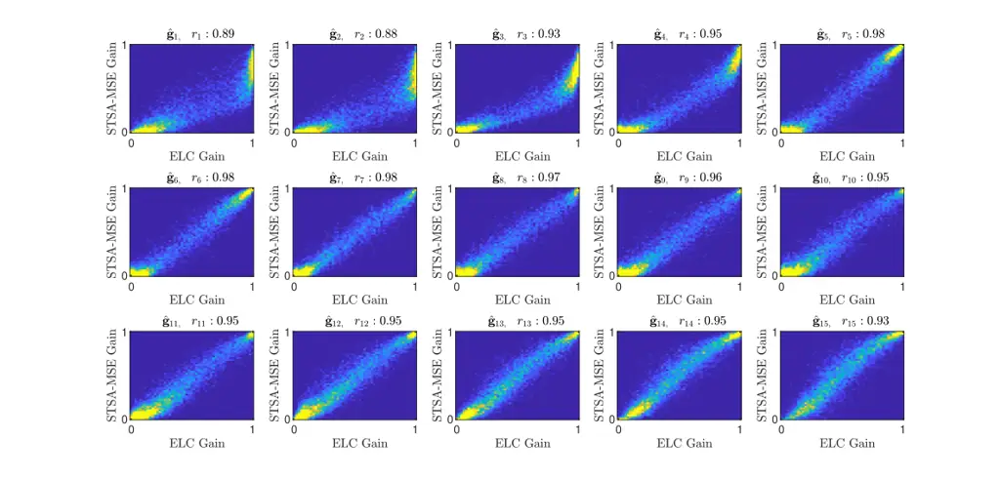

# On the Relationship Between Short-Time Objective Intelligibility and Short-Time Spectral-Amplitude Mean-Square Error for Speech EnhancementThanks: Manuscript received month day, year; revised month day, year; accepted month day, year. Date of publication month day, year; date of current version Month day, year. This research was partly funded by the Oticon Foundation. The associate editor coordinating the review of this manuscript and approving it for publication was xxyyzz xxyyzz.Thanks: M. Kolbæk and Z.-H. Tan are with the Department of Electronic Systems, Aalborg University, Aalborg 9220, Denmark (e-mail: mok@es.aau.dk; zt@es.aau.dk).Thanks: J. Jensen is with the Department of Electronic Systems, Aalborg University, Aalborg 9220, Denmark, and also with Oticon A/S, Smørum 2765, Denmark (e-mail: jje@es.aau.dk; jesj@oticon.com).Thanks: Digital Object Identifier 00.0000/TASLP.2018.0000000

Morten Kolbæk, Zheng-Hua Tan, Senior Member, IEEE, and Jesper Jensen
Affiliation: 

###### Abstract

The majority of deep neural network (DNN) based speech enhancement
algorithms rely on the mean-square error (MSE) criterion of short-time
spectral amplitudes (STSA), which has no apparent link to human
perception, e.g. speech intelligibility. Short-Time Objective
Intelligibility (STOI), a popular state-of-the-art speech
intelligibility estimator, on the other hand, relies on linear
correlation of speech temporal envelopes. This raises the question if a
DNN training criterion based on envelope linear correlation (ELC) can
lead to improved speech intelligibility performance of DNN based speech
enhancement algorithms compared to algorithms based on the STSA-MSE
criterion. In this paper we derive that, under certain general
conditions, the STSA-MSE and ELC criteria are practically equivalent,
and we provide empirical data to support our theoretical results.
Furthermore, our experimental findings suggest that the standard STSA
minimum-MSE estimator is near optimal, if the objective is to enhance
noisy speech in a manner which is optimal with respect to the STOI
speech intelligibility estimator.

###### Index Terms: 

Speech enhancement, Speech intelligibility, Deep neural networks,
Minimum mean-square error estimator.

## I Introduction

Despite the recent success of deep neural network (DNN) based speech
enhancement algorithms \[1, 2, 3, 4, 5\], it is yet unknown if these
algorithms are optimal in terms of aspects related to human auditory
perception, e.g. speech intelligibility, since existing algorithms do
not directly optimize criteria designed with human auditory perception
in mind.

Many current state-of-the-art DNN based speech enhancement algorithms
use a mean squared error (MSE) training criterion \[6, 7, 8\] on
short-time spectral amplitudes (STSA). This, however, might not be the
optimal training criterion if the target is the human auditory system,
and improvement in speech intelligibility or speech quality is the
desired objective.

It is well known that the frequency sensitivity of the human auditory
system is non-linear ( e.g. \[9, 10\]) and, as a consequence, is often
approximated in digital signal processing algorithms using e.g. a
Gammatone filter bank \[11\] or a one-third octave band filter bank
\[12\]. It is also well known that preservation of modulation
frequencies in the range 4-20 Hz are critical for speech intelligibility
\[13, 9, 14\]. Therefore, it is natural to believe that, if prior
knowledge about the human auditory system is incorporated into a speech
enhancement algorithm, improvements in speech intelligibility or speech
quality can be achieved \[15\].

Indeed, numerous works exist that attempt to incorporate such knowledge
(e.g. \[16, 17, 18, 19, 20, 21, 22, 23, 24, 25, 26\] and references
therein). In \[16\] a transform-domain method based on a Gammatone
filter bank was used, which incorporates a non-linear frequency
resolution mimicking that of the human auditory system. In \[17\]
different perceptually motivated cost functions were used to derive STSA
clean speech spectrum estimators in order to emphasize spectral peak
information, account for auditory masking or penalize spectral
over-attenuation. In \[20, 21\] similar goals were pursued, but instead
of using classical statistically-based models, DNNs were used. Finally,
in \[22\] a deep reinforcement learning technique was used to reward
solutions that achieved a large score in terms of perceptual evaluation
of speech quality (PESQ) \[27\], a commonly used speech quality
estimator.

Although the works in e.g. \[17, 16, 21, 22\] include knowledge about
the human auditory system the techniques are not designed specifically
to maximize speech intelligibility. While speech processing methods that
improve speech intelligibility would be of vital importance for
applications such as mobile communications, or hearing assistive
devices, only very little research has been performed to understand if
DNN-based speech enhancement systems can help improve speech
intelligibility. Very recent work \[23, 24, 25, 26\] has investigated if
DNNs trained to maximize a state-of-the-art speech intelligibility
estimator are capable of improving speech intelligibility as measured by
the estimator \[23, 24, 25\] or human listeners \[26\]. Specifically,
DNNs were trained to maximize the short-time objective
intelligibility (STOI) \[12\] estimator and were then compared, in terms
of STOI, with DNNs trained to minimize the classical STSA-MSE criterion.
Surprisingly, although all DNNs improved STOI, the DNNs trained to
maximize STOI showed none or only very modest improvements in STOI
compared to the DNNs trained with the classical STSA-MSE criterion \[23,
24, 25, 26\].

The STOI speech intelligibility estimator has proven to be able to quite
accurately predict the intelligibility of noisy/processed speech in a
large range of acoustic scenarios, including speech processed by mobile
communication devices \[28\], ideal time-frequency weighted noisy speech
\[12\], noisy speech enhanced by single-microphone time-frequency
weighting-based speech enhancement systems \[29, 12, 30\], and speech
processed by hearing assistive devices such as cochlear implants \[31\].
STOI has also been shown to be robust to variations in language types,
including Danish \[12\], Dutch \[30\], and Mandarin \[32\]. Finally,
recent studies e.g. \[7, 6\] also show a good correspondence between
STOI predictions of noisy speech enhanced by DNN-based speech
enhancement systems, and speech intelligibility. As a consequence, STOI
is currently the, perhaps, most commonly used speech intelligibility
estimator for objectively evaluating the performance of speech
enhancement systems \[16, 6, 7, 8\]. Therefore, it is natural to believe
that gains in speech intelligibility, as estimated by STOI, can be
achieved by utilizing an optimality criterion based on STOI as opposed
to the classical criterion based on STSA-MSE.

In this paper we study the potential gain in speech intelligibility that
can be achieved, if a DNN is designed to perform optimally with respect
to the STOI speech intelligibility estimator. We derive that, under
certain general conditions, maximizing an approximate-STOI criterion is
equivalent to minimizing a STSA-MSE criterion. Furthermore, we present
empirical data using simulation studies with DNNs applied to noisy
speech signals, that support our theoretical results. Finally, we show
theoretically under which conditions the equality between the
approximate-STOI criterion and the STSA-MSE criterion holds for
practical systems. Our results are in line with recent empirical work
and might explain the somewhat surprising result in \[23, 24, 25, 26\],
where none or only very modest improvements in STOI were achieved with
STOI optimal DNNs compared to MSE optimal DNNs.

## II STFT-domain based Speech Enhancement

Fig. 1 shows a block-diagram of a classical gain-based speech
enhancement system \[18, 33\].

![](data:image/svg+xml;base64,PHN2ZyBpZD0iUzIuRjEucGljMSIgY2xhc3M9Imx0eF9waWN0dXJlIGx0eF9jZW50ZXJpbmciIGhlaWdodD0iMTQzLjYzIiBvdmVyZmxvdz0idmlzaWJsZSIgc3R5bGU9InZlcnRpY2FsLWFsaWduOi0xNDMuNjNweCIgdmVyc2lvbj0iMS4xIiB2aWV3Ym94PSIwIDAgMzI1LjEyIDE0My42MyIgd2lkdGg9IjMyNS4xMiI+PGcgc3R5bGU9Ii0tbHR4LXN0cm9rZS1jb2xvcjojMDAwMDAwOy0tbHR4LWZpbGwtY29sb3I6IzAwMDAwMDsiIGZpbGw9IiMwMDAwMDAiIHN0cm9rZT0iIzAwMDAwMCIgdHJhbnNmb3JtPSJ0cmFuc2xhdGUoMCwxNDMuNjMpIG1hdHJpeCgxIDAgMCAtMSAwIDApIHRyYW5zbGF0ZSg0LjcxLDApIHRyYW5zbGF0ZSgwLC0yLjkzKSI+PGcgc3Ryb2tlLXdpZHRoPSIwLjhwdCI+PHBhdGggc3R5bGU9ImZpbGw6bm9uZSIgZD0iTSAwIDc4Ljc0IEwgMjIuNjQgNzguNzQiIC8+PC9nPjxnIHN0cm9rZS1kYXNoYXJyYXk9Im5vbmUiIHN0cm9rZS1kYXNob2Zmc2V0PSIwLjBwdCIgc3Ryb2tlLWxpbmVjYXA9InJvdW5kIiBzdHJva2UtbGluZWpvaW49InJvdW5kIiBzdHJva2Utd2lkdGg9IjAuNjRwdCIgdHJhbnNmb3JtPSJtYXRyaXgoMS4wIDAuMCAwLjAgMS4wIDIyLjY0IDc4Ljc0KSI+PHBhdGggc3R5bGU9ImZpbGw6bm9uZSIgZD0iTSAtMi4xNiAyLjg4IEMgLTEuOTggMS44IDAgMC4xOCAwLjU0IDAgQyAwIC0wLjE4IC0xLjk4IC0xLjggLTIuMTYgLTIuODgiIC8+PC9nPjxnIHN0cm9rZS13aWR0aD0iMC40cHQiPjxnIHN0eWxlPSItLWx0eC1zdHJva2UtY29sb3I6IzAwMDAwMDstLWx0eC1maWxsLWNvbG9yOiMwMDAwMDA7IiBmaWxsPSIjMDAwMDAwIiBzdHJva2U9IiMwMDAwMDAiIHRyYW5zZm9ybT0ibWF0cml4KDEuMCAwLjAgMC4wIDEuMCAtMC4xIDg2LjQpIj48Zm9yZWlnbm9iamVjdCBzdHlsZT0iLS1sdHgtZm8td2lkdGg6MS42OWVtOy0tbHR4LWZvLWhlaWdodDowLjcxZW07LS1sdHgtZm8tZGVwdGg6MC4yNGVtO2ZvbnQtc2l6ZTo4LjVwdDsiIGhlaWdodD0iMTEuMDciIG92ZXJmbG93PSJ2aXNpYmxlIiB0cmFuc2Zvcm09Im1hdHJpeCgxIDAgMCAtMSAwIDguMykiIHdpZHRoPSIxOS44OCI+PHNwYW4gY2xhc3M9Imx0eF9mb3JlaWdub2JqZWN0X2NvbnRhaW5lciI+PHNwYW4gY2xhc3M9Imx0eF9mb3JlaWdub2JqZWN0X2NvbnRlbnQiPjxtYXRoIGlkPSJTMi5GMS5waWMxLm0xIiBjbGFzcz0ibHR4X01hdGgiIGFsdHRleHQ9Inlbbl0iIGRpc3BsYXk9ImlubGluZSIgaW50ZW50PSI6bGl0ZXJhbCI+PHNlbWFudGljcz48bXJvdz48bWkgbWF0aHNpemU9IjAuODAwZW0iPnk8L21pPjxtbz7igaE8L21vPjxtcm93PjxtbyBtYXhzaXplPSIwLjgwMGVtIiBtaW5zaXplPSIwLjgwMGVtIj5bPC9tbz48bWkgbWF0aHNpemU9IjAuODAwZW0iPm48L21pPjxtbyBtYXhzaXplPSIwLjgwMGVtIiBtaW5zaXplPSIwLjgwMGVtIj5dPC9tbz48L21yb3c+PC9tcm93Pjxhbm5vdGF0aW9uIGVuY29kaW5nPSJhcHBsaWNhdGlvbi94LXRleCI+eVtuXTwvYW5ub3RhdGlvbj48L3NlbWFudGljcz48L21hdGg+PC9zcGFuPjwvc3Bhbj48L2ZvcmVpZ25vYmplY3Q+PC9nPjxnIHN0cm9rZS13aWR0aD0iMC44cHQiPjxwYXRoIHN0eWxlPSJmaWxsOm5vbmUiIGQ9Ik0gNzAuODcgNzguNzQgTCA4OS41NyA3OC43NCIgLz48L2c+PGcgc3Ryb2tlLWRhc2hhcnJheT0ibm9uZSIgc3Ryb2tlLWRhc2hvZmZzZXQ9IjAuMHB0IiBzdHJva2UtbGluZWNhcD0icm91bmQiIHN0cm9rZS1saW5lam9pbj0icm91bmQiIHN0cm9rZS13aWR0aD0iMC42NHB0IiB0cmFuc2Zvcm09Im1hdHJpeCgxLjAgMC4wIDAuMCAxLjAgODkuNTcgNzguNzQpIj48cGF0aCBzdHlsZT0iZmlsbDpub25lIiBkPSJNIC0yLjE2IDIuODggQyAtMS45OCAxLjggMCAwLjE4IDAuNTQgMCBDIDAgLTAuMTggLTEuOTggLTEuOCAtMi4xNiAtMi44OCIgLz48L2c+PGcgc3R5bGU9Ii0tbHR4LXN0cm9rZS1jb2xvcjojMDAwMDAwOy0tbHR4LWZpbGwtY29sb3I6IzAwMDAwMDsiIGZpbGw9IiMwMDAwMDAiIHN0cm9rZT0iIzAwMDAwMCIgdHJhbnNmb3JtPSJtYXRyaXgoMS4wIDAuMCAwLjAgMS4wIDExNy40MSAxMzMuNjQpIj48Zm9yZWlnbm9iamVjdCBzdHlsZT0iLS1sdHgtZm8td2lkdGg6My4xM2VtOy0tbHR4LWZvLWhlaWdodDowLjcxZW07LS1sdHgtZm8tZGVwdGg6MC4yNGVtO2ZvbnQtc2l6ZTo4LjVwdDsiIGhlaWdodD0iMTEuMDciIG92ZXJmbG93PSJ2aXNpYmxlIiB0cmFuc2Zvcm09Im1hdHJpeCgxIDAgMCAtMSAwIDguMykiIHdpZHRoPSIzNi44MyI+PHNwYW4gY2xhc3M9Imx0eF9mb3JlaWdub2JqZWN0X2NvbnRhaW5lciI+PHNwYW4gY2xhc3M9Imx0eF9mb3JlaWdub2JqZWN0X2NvbnRlbnQiPjxtYXRoIGlkPSJTMi5GMS5waWMxLm0yIiBjbGFzcz0ibHR4X01hdGgiIGFsdHRleHQ9InIoayxtKSIgZGlzcGxheT0iaW5saW5lIiBpbnRlbnQ9IjpsaXRlcmFsIj48c2VtYW50aWNzPjxtcm93PjxtaSBtYXRoc2l6ZT0iMC44MDBlbSI+cjwvbWk+PG1vPuKBoTwvbW8+PG1yb3c+PG1vIG1heHNpemU9IjAuODAwZW0iIG1pbnNpemU9IjAuODAwZW0iPig8L21vPjxtaSBtYXRoc2l6ZT0iMC44MDBlbSI+azwvbWk+PG1vIG1hdGhzaXplPSIwLjgwMGVtIj4sPC9tbz48bWkgbWF0aHNpemU9IjAuODAwZW0iPm08L21pPjxtbyBtYXhzaXplPSIwLjgwMGVtIiBtaW5zaXplPSIwLjgwMGVtIj4pPC9tbz48L21yb3c+PC9tcm93Pjxhbm5vdGF0aW9uIGVuY29kaW5nPSJhcHBsaWNhdGlvbi94LXRleCI+cihrLG0pPC9hbm5vdGF0aW9uPjwvc2VtYW50aWNzPjwvbWF0aD48L3NwYW4+PC9zcGFuPjwvZm9yZWlnbm9iamVjdD48L2c+PGcgc3Ryb2tlLXdpZHRoPSIwLjhwdCI+PHBhdGggc3R5bGU9ImZpbGw6bm9uZSIgZD0iTSA4MC43MSA3OC43NCBMIDgwLjcxIDEyNS45OCBMIDE5MC45NSAxMjUuOTggTCAxOTAuOTUgODYuMDIiIC8+PC9nPjxnIHN0cm9rZS1kYXNoYXJyYXk9Im5vbmUiIHN0cm9rZS1kYXNob2Zmc2V0PSIwLjBwdCIgc3Ryb2tlLWxpbmVjYXA9InJvdW5kIiBzdHJva2UtbGluZWpvaW49InJvdW5kIiBzdHJva2Utd2lkdGg9IjAuNjRwdCIgdHJhbnNmb3JtPSJtYXRyaXgoMC4wIC0xLjAgMS4wIDAuMCAxOTAuOTUgODYuMDIpIj48cGF0aCBzdHlsZT0iZmlsbDpub25lIiBkPSJNIC0yLjE2IDIuODggQyAtMS45OCAxLjggMCAwLjE4IDAuNTQgMCBDIDAgLTAuMTggLTEuOTggLTEuOCAtMi4xNiAtMi44OCIgLz48L2c+PGcgc3Ryb2tlLXdpZHRoPSIwLjhwdCI+PHBhdGggc3R5bGU9ImZpbGw6bm9uZSIgZD0iTSA0Ny4yNCA1OS4wNiBMIDQ3LjI0IDIzLjYyIEwgMjY3LjcyIDIzLjYyIEwgMjY3LjcyIDU4LjA3IiAvPjwvZz48ZyBzdHJva2UtZGFzaGFycmF5PSJub25lIiBzdHJva2UtZGFzaG9mZnNldD0iMC4wcHQiIHN0cm9rZS1saW5lY2FwPSJyb3VuZCIgc3Ryb2tlLWxpbmVqb2luPSJyb3VuZCIgc3Ryb2tlLXdpZHRoPSIwLjY0cHQiIHRyYW5zZm9ybT0ibWF0cml4KDAuMCAxLjAgLTEuMCAwLjAgMjY3LjcyIDU4LjA3KSI+PHBhdGggc3R5bGU9ImZpbGw6bm9uZSIgZD0iTSAtMi4xNiAyLjg4IEMgLTEuOTggMS44IDAgMC4xOCAwLjU0IDAgQyAwIC0wLjE4IC0xLjk4IC0xLjggLTIuMTYgLTIuODgiIC8+PC9nPjxnIHN0eWxlPSItLWx0eC1zdHJva2UtY29sb3I6IzAwMDAwMDstLWx0eC1maWxsLWNvbG9yOiMwMDAwMDA7IiBmaWxsPSIjMDAwMDAwIiBzdHJva2U9IiMwMDAwMDAiIHRyYW5zZm9ybT0ibWF0cml4KDEuMCAwLjAgMC4wIDEuMCAxMzUuMDcgMTAuNDMpIj48Zm9yZWlnbm9iamVjdCBzdHlsZT0iLS1sdHgtZm8td2lkdGg6My44MWVtOy0tbHR4LWZvLWhlaWdodDowLjcxZW07LS1sdHgtZm8tZGVwdGg6MC4yNWVtO2ZvbnQtc2l6ZTo4LjVwdDsiIGhlaWdodD0iMTEuMTkiIG92ZXJmbG93PSJ2aXNpYmxlIiB0cmFuc2Zvcm09Im1hdHJpeCgxIDAgMCAtMSAwIDguMykiIHdpZHRoPSI0NC44MiI+PHNwYW4gY2xhc3M9Imx0eF9mb3JlaWdub2JqZWN0X2NvbnRhaW5lciI+PHNwYW4gY2xhc3M9Imx0eF9mb3JlaWdub2JqZWN0X2NvbnRlbnQiPjxtYXRoIGlkPSJTMi5GMS5waWMxLm0zIiBjbGFzcz0ibHR4X01hdGgiIGFsdHRleHQ9IlxwaGlfe3l9KGssbSkiIGRpc3BsYXk9ImlubGluZSIgaW50ZW50PSI6bGl0ZXJhbCI+PHNlbWFudGljcz48bXJvdz48bXN1Yj48bWkgbWF0aHNpemU9IjAuODAwZW0iPs+VPC9taT48bWkgbWF0aHNpemU9IjAuODAwZW0iPnk8L21pPjwvbXN1Yj48bW8gbHNwYWNlPSIwZW0iIHJzcGFjZT0iMGVtIj7igIs8L21vPjxtcm93PjxtbyBtYXhzaXplPSIwLjgwMGVtIiBtaW5zaXplPSIwLjgwMGVtIj4oPC9tbz48bWkgbWF0aHNpemU9IjAuODAwZW0iPms8L21pPjxtbyBtYXRoc2l6ZT0iMC44MDBlbSI+LDwvbW8+PG1pIG1hdGhzaXplPSIwLjgwMGVtIj5tPC9taT48bW8gbWF4c2l6ZT0iMC44MDBlbSIgbWluc2l6ZT0iMC44MDBlbSI+KTwvbW8+PC9tcm93PjwvbXJvdz48YW5ub3RhdGlvbiBlbmNvZGluZz0iYXBwbGljYXRpb24veC10ZXgiPlxwaGlfe3l9KGssbSk8L2Fubm90YXRpb24+PC9zZW1hbnRpY3M+PC9tYXRoPjwvc3Bhbj48L3NwYW4+PC9mb3JlaWdub2JqZWN0PjwvZz48ZyBzdHJva2Utd2lkdGg9IjAuOHB0Ij48cGF0aCBzdHlsZT0iZmlsbDpub25lIiBkPSJNIDEzNy44IDc4Ljc0IEwgMTgzLjY2IDc4Ljc0IiAvPjwvZz48ZyBzdHJva2UtZGFzaGFycmF5PSJub25lIiBzdHJva2UtZGFzaG9mZnNldD0iMC4wcHQiIHN0cm9rZS1saW5lY2FwPSJyb3VuZCIgc3Ryb2tlLWxpbmVqb2luPSJyb3VuZCIgc3Ryb2tlLXdpZHRoPSIwLjY0cHQiIHRyYW5zZm9ybT0ibWF0cml4KDEuMCAwLjAgMC4wIDEuMCAxODMuNjYgNzguNzQpIj48cGF0aCBzdHlsZT0iZmlsbDpub25lIiBkPSJNIC0yLjE2IDIuODggQyAtMS45OCAxLjggMCAwLjE4IDAuNTQgMCBDIDAgLTAuMTggLTEuOTggLTEuOCAtMi4xNiAtMi44OCIgLz48L2c+PGcgc3R5bGU9Ii0tbHR4LXN0cm9rZS1jb2xvcjojMDAwMDAwOy0tbHR4LWZpbGwtY29sb3I6IzAwMDAwMDsiIGZpbGw9IiMwMDAwMDAiIHN0cm9rZT0iIzAwMDAwMCIgdHJhbnNmb3JtPSJtYXRyaXgoMS4wIDAuMCAwLjAgMS4wIDE0My45NCA4Ni40KSI+PGZvcmVpZ25vYmplY3Qgc3R5bGU9Ii0tbHR4LWZvLXdpZHRoOjMuMzFlbTstLWx0eC1mby1oZWlnaHQ6MC44NWVtOy0tbHR4LWZvLWRlcHRoOjAuMjRlbTtmb250LXNpemU6OC41cHQ7IiBoZWlnaHQ9IjEyLjc2IiBvdmVyZmxvdz0idmlzaWJsZSIgdHJhbnNmb3JtPSJtYXRyaXgoMSAwIDAgLTEgMCA5Ljk5KSIgd2lkdGg9IjM4Ljg5Ij48c3BhbiBjbGFzcz0ibHR4X2ZvcmVpZ25vYmplY3RfY29udGFpbmVyIj48c3BhbiBjbGFzcz0ibHR4X2ZvcmVpZ25vYmplY3RfY29udGVudCI+PG1hdGggaWQ9IlMyLkYxLnBpYzEubTQiIGNsYXNzPSJsdHhfTWF0aCIgYWx0dGV4dD0iXGhhdHtnfShrLG0pIiBkaXNwbGF5PSJpbmxpbmUiIGludGVudD0iOmxpdGVyYWwiPjxzZW1hbnRpY3M+PG1yb3c+PG1vdmVyIGFjY2VudD0idHJ1ZSI+PG1pIG1hdGhzaXplPSIwLjgwMGVtIj5nPC9taT48bW8+XjwvbW8+PC9tb3Zlcj48bW8gbHNwYWNlPSIwZW0iIHJzcGFjZT0iMGVtIj7igIs8L21vPjxtcm93PjxtbyBtYXhzaXplPSIwLjgwMGVtIiBtaW5zaXplPSIwLjgwMGVtIj4oPC9tbz48bWkgbWF0aHNpemU9IjAuODAwZW0iPms8L21pPjxtbyBtYXRoc2l6ZT0iMC44MDBlbSI+LDwvbW8+PG1pIG1hdGhzaXplPSIwLjgwMGVtIj5tPC9taT48bW8gbWF4c2l6ZT0iMC44MDBlbSIgbWluc2l6ZT0iMC44MDBlbSI+KTwvbW8+PC9tcm93PjwvbXJvdz48YW5ub3RhdGlvbiBlbmNvZGluZz0iYXBwbGljYXRpb24veC10ZXgiPlxoYXR7Z30oayxtKTwvYW5ub3RhdGlvbj48L3NlbWFudGljcz48L21hdGg+PC9zcGFuPjwvc3Bhbj48L2ZvcmVpZ25vYmplY3Q+PC9nPjxjbGlwcGF0aCBpZD0icGdmY3AxIj48cGF0aCBkPSJNIDE5Ny40NyA3OC43NCBDIDE5Ny40NyA4Mi4zNCAxOTQuNTUgODUuMjYgMTkwLjk1IDg1LjI2IEMgMTg3LjM0IDg1LjI2IDE4NC40MiA4Mi4zNCAxODQuNDIgNzguNzQgQyAxODQuNDIgNzUuMTQgMTg3LjM0IDcyLjIyIDE5MC45NSA3Mi4yMiBDIDE5NC41NSA3Mi4yMiAxOTcuNDcgNzUuMTQgMTk3LjQ3IDc4Ljc0IFogTSAxOTAuOTUgNzguNzQiIC8+PC9jbGlwcGF0aD48ZyBjbGlwLXBhdGg9InVybCgjcGdmY3AxKSI+PGcgc3Ryb2tlLWxpbmVjYXA9InJvdW5kIj48cGF0aCBzdHlsZT0iZmlsbDpub25lIiBkPSJNIDE4NC40MiA3Mi4yMiBMIDE5Ny40NyA4NS4yNiBNIDE4NC40MiA4NS4yNiBMIDE5Ny40NyA3Mi4yMiIgLz48L2c+PGc+PC9nPjwvZz48cGF0aCBzdHlsZT0iZmlsbDpub25lIiBkPSJNIDE5Ny40NyA3OC43NCBDIDE5Ny40NyA4Mi4zNCAxOTQuNTUgODUuMjYgMTkwLjk1IDg1LjI2IEMgMTg3LjM0IDg1LjI2IDE4NC40MiA4Mi4zNCAxODQuNDIgNzguNzQgQyAxODQuNDIgNzUuMTQgMTg3LjM0IDcyLjIyIDE5MC45NSA3Mi4yMiBDIDE5NC41NSA3Mi4yMiAxOTcuNDcgNzUuMTQgMTk3LjQ3IDc4Ljc0IFogTSAxOTAuOTUgNzguNzQiIC8+PGcgc3Ryb2tlLXdpZHRoPSIwLjhwdCI+PHBhdGggc3R5bGU9ImZpbGw6bm9uZSIgZD0iTSAxOTcuMjQgNzguNzQgTCAyNDMuMTEgNzguNzQiIC8+PC9nPjxnIHN0cm9rZS1kYXNoYXJyYXk9Im5vbmUiIHN0cm9rZS1kYXNob2Zmc2V0PSIwLjBwdCIgc3Ryb2tlLWxpbmVjYXA9InJvdW5kIiBzdHJva2UtbGluZWpvaW49InJvdW5kIiBzdHJva2Utd2lkdGg9IjAuNjRwdCIgdHJhbnNmb3JtPSJtYXRyaXgoMS4wIDAuMCAwLjAgMS4wIDI0My4xMSA3OC43NCkiPjxwYXRoIHN0eWxlPSJmaWxsOm5vbmUiIGQ9Ik0gLTIuMTYgMi44OCBDIC0xLjk4IDEuOCAwIDAuMTggMC41NCAwIEMgMCAtMC4xOCAtMS45OCAtMS44IC0yLjE2IC0yLjg4IiAvPjwvZz48ZyBzdHlsZT0iLS1sdHgtc3Ryb2tlLWNvbG9yOiMwMDAwMDA7LS1sdHgtZmlsbC1jb2xvcjojMDAwMDAwOyIgZmlsbD0iIzAwMDAwMCIgc3Ryb2tlPSIjMDAwMDAwIiB0cmFuc2Zvcm09Im1hdHJpeCgxLjAgMC4wIDAuMCAxLjAgMjAxLjQyIDg2LjQpIj48Zm9yZWlnbm9iamVjdCBzdHlsZT0iLS1sdHgtZm8td2lkdGg6My4zMWVtOy0tbHR4LWZvLWhlaWdodDowLjg1ZW07LS1sdHgtZm8tZGVwdGg6MC4yNGVtO2ZvbnQtc2l6ZTo4LjVwdDsiIGhlaWdodD0iMTIuNzYiIG92ZXJmbG93PSJ2aXNpYmxlIiB0cmFuc2Zvcm09Im1hdHJpeCgxIDAgMCAtMSAwIDkuOTkpIiB3aWR0aD0iMzguODkiPjxzcGFuIGNsYXNzPSJsdHhfZm9yZWlnbm9iamVjdF9jb250YWluZXIiPjxzcGFuIGNsYXNzPSJsdHhfZm9yZWlnbm9iamVjdF9jb250ZW50Ij48bWF0aCBpZD0iUzIuRjEucGljMS5tNSIgY2xhc3M9Imx0eF9NYXRoIiBhbHR0ZXh0PSJcaGF0e2F9KGssbSkiIGRpc3BsYXk9ImlubGluZSIgaW50ZW50PSI6bGl0ZXJhbCI+PHNlbWFudGljcz48bXJvdz48bW92ZXIgYWNjZW50PSJ0cnVlIj48bWkgbWF0aHNpemU9IjAuODAwZW0iPmE8L21pPjxtbz5ePC9tbz48L21vdmVyPjxtbyBsc3BhY2U9IjBlbSIgcnNwYWNlPSIwZW0iPuKAizwvbW8+PG1yb3c+PG1vIG1heHNpemU9IjAuODAwZW0iIG1pbnNpemU9IjAuODAwZW0iPig8L21vPjxtaSBtYXRoc2l6ZT0iMC44MDBlbSI+azwvbWk+PG1vIG1hdGhzaXplPSIwLjgwMGVtIj4sPC9tbz48bWkgbWF0aHNpemU9IjAuODAwZW0iPm08L21pPjxtbyBtYXhzaXplPSIwLjgwMGVtIiBtaW5zaXplPSIwLjgwMGVtIj4pPC9tbz48L21yb3c+PC9tcm93Pjxhbm5vdGF0aW9uIGVuY29kaW5nPSJhcHBsaWNhdGlvbi94LXRleCI+XGhhdHthfShrLG0pPC9hbm5vdGF0aW9uPjwvc2VtYW50aWNzPjwvbWF0aD48L3NwYW4+PC9zcGFuPjwvZm9yZWlnbm9iamVjdD48L2c+PGcgc3Ryb2tlLXdpZHRoPSIwLjhwdCI+PHBhdGggc3R5bGU9ImZpbGw6bm9uZSIgZD0iTSAyODMuNDYgNzguNzQgTCAzMTMuOTggNzguNzQiIC8+PC9nPjxnIHN0cm9rZS1kYXNoYXJyYXk9Im5vbmUiIHN0cm9rZS1kYXNob2Zmc2V0PSIwLjBwdCIgc3Ryb2tlLWxpbmVjYXA9InJvdW5kIiBzdHJva2UtbGluZWpvaW49InJvdW5kIiBzdHJva2Utd2lkdGg9IjAuNjRwdCIgdHJhbnNmb3JtPSJtYXRyaXgoMS4wIDAuMCAwLjAgMS4wIDMxMy45OCA3OC43NCkiPjxwYXRoIHN0eWxlPSJmaWxsOm5vbmUiIGQ9Ik0gLTIuMTYgMi44OCBDIC0xLjk4IDEuOCAwIDAuMTggMC41NCAwIEMgMCAtMC4xOCAtMS45OCAtMS44IC0yLjE2IC0yLjg4IiAvPjwvZz48ZyBzdHlsZT0iLS1sdHgtc3Ryb2tlLWNvbG9yOiMwMDAwMDA7LS1sdHgtZmlsbC1jb2xvcjojMDAwMDAwOyIgZmlsbD0iIzAwMDAwMCIgc3Ryb2tlPSIjMDAwMDAwIiB0cmFuc2Zvcm09Im1hdHJpeCgxLjAgMC4wIDAuMCAxLjAgMjk0LjQ0IDg2LjQpIj48Zm9yZWlnbm9iamVjdCBzdHlsZT0iLS1sdHgtZm8td2lkdGg6MS44MmVtOy0tbHR4LWZvLWhlaWdodDowLjg1ZW07LS1sdHgtZm8tZGVwdGg6MC4yNGVtO2ZvbnQtc2l6ZTo4LjVwdDsiIGhlaWdodD0iMTIuNzYiIG92ZXJmbG93PSJ2aXNpYmxlIiB0cmFuc2Zvcm09Im1hdHJpeCgxIDAgMCAtMSAwIDkuOTkpIiB3aWR0aD0iMjEuMzYiPjxzcGFuIGNsYXNzPSJsdHhfZm9yZWlnbm9iamVjdF9jb250YWluZXIiPjxzcGFuIGNsYXNzPSJsdHhfZm9yZWlnbm9iamVjdF9jb250ZW50Ij48bWF0aCBpZD0iUzIuRjEucGljMS5tNiIgY2xhc3M9Imx0eF9NYXRoIiBhbHR0ZXh0PSJcaGF0e3h9W25dIiBkaXNwbGF5PSJpbmxpbmUiIGludGVudD0iOmxpdGVyYWwiPjxzZW1hbnRpY3M+PG1yb3c+PG1vdmVyIGFjY2VudD0idHJ1ZSI+PG1pIG1hdGhzaXplPSIwLjgwMGVtIj54PC9taT48bW8+XjwvbW8+PC9tb3Zlcj48bW8gbHNwYWNlPSIwZW0iIHJzcGFjZT0iMGVtIj7igIs8L21vPjxtcm93PjxtbyBtYXhzaXplPSIwLjgwMGVtIiBtaW5zaXplPSIwLjgwMGVtIj5bPC9tbz48bWkgbWF0aHNpemU9IjAuODAwZW0iPm48L21pPjxtbyBtYXhzaXplPSIwLjgwMGVtIiBtaW5zaXplPSIwLjgwMGVtIj5dPC9tbz48L21yb3c+PC9tcm93Pjxhbm5vdGF0aW9uIGVuY29kaW5nPSJhcHBsaWNhdGlvbi94LXRleCI+XGhhdHt4fVtuXTwvYW5ub3RhdGlvbj48L3NlbWFudGljcz48L21hdGg+PC9zcGFuPjwvc3Bhbj48L2ZvcmVpZ25vYmplY3Q+PC9nPjxnIHN0eWxlPSItLWx0eC1zdHJva2UtY29sb3I6IzAwMDAwMDstLWx0eC1maWxsLWNvbG9yOiNFNkU2RTY7IiBmaWxsPSIjRTZFNkU2IiBzdHJva2U9IiMwMDAwMDAiPjxwYXRoIGQ9Ik0gMjMuNjIgNTkuMDYgTSAyMy42MiA1OS4wNiBMIDIzLjYyIDk4LjQzIEwgNzAuODcgOTguNDMgTCA3MC44NyA1OS4wNiBaIE0gNzAuODcgOTguNDMiIC8+PC9nPjxnIHN0eWxlPSItLWx0eC1zdHJva2UtY29sb3I6IzAwMDAwMDstLWx0eC1maWxsLWNvbG9yOiMwMDAwMDA7IiBmaWxsPSIjMDAwMDAwIiBzdHJva2U9IiMwMDAwMDAiIHRyYW5zZm9ybT0ibWF0cml4KDEuMCAwLjAgMC4wIDEuMCAxOC42MiA3NS4yOCkiPjxmb3JlaWdub2JqZWN0IHN0eWxlPSItLWx0eC1mby13aWR0aDo0LjE0ZW07LS1sdHgtZm8taGVpZ2h0OjEuNDVlbTstLWx0eC1mby1kZXB0aDowLjk1ZW07Zm9udC1zaXplOjEwcHQ7IiBoZWlnaHQ9IjMzLjIxIiBvdmVyZmxvdz0idmlzaWJsZSIgdHJhbnNmb3JtPSJtYXRyaXgoMSAwIDAgLTEgMCAyMC4wNikiIHdpZHRoPSI1Ny4yNSI+PHNwYW4gY2xhc3M9Imx0eF9mb3JlaWdub2JqZWN0X2NvbnRhaW5lciI+PHNwYW4gY2xhc3M9Imx0eF9mb3JlaWdub2JqZWN0X2NvbnRlbnQiPgo8dGFibGUgaWQ9IlMyLkYxLnBpYzEuMSIgY2xhc3M9Imx0eF90YWJ1bGFyIGx0eF9hbGlnbl9taWRkbGUiPgo8dGJvZHkgY2xhc3M9Imx0eF90Ym9keSI+Cjx0ciBpZD0iUzIuRjEucGljMS4xLjEiIGNsYXNzPSJsdHhfdHIiPgo8dGQgaWQ9IlMyLkYxLnBpYzEuMS4xLjEiIGNsYXNzPSJsdHhfdGQgbHR4X2FsaWduX2NlbnRlciI+PHNwYW4gaWQ9IlMyLkYxLnBpYzEuMS4xLjEuMSIgY2xhc3M9Imx0eF90ZXh0IiBzdHlsZT0iZm9udC1zaXplOjcwJTsiPlQtRjwvc3Bhbj48L3RkPjwvdHI+Cjx0ciBpZD0iUzIuRjEucGljMS4xLjIiIGNsYXNzPSJsdHhfdHIiPgo8dGQgaWQ9IlMyLkYxLnBpYzEuMS4yLjEiIGNsYXNzPSJsdHhfdGQgbHR4X2FsaWduX2NlbnRlciI+PHNwYW4gaWQ9IlMyLkYxLnBpYzEuMS4yLjEuMSIgY2xhc3M9Imx0eF90ZXh0IiBzdHlsZT0iZm9udC1zaXplOjcwJTsiPkFuYWx5c2lzPC9zcGFuPjwvdGQ+PC90cj4KPC90Ym9keT4KPC90YWJsZT48L3NwYW4+PC9zcGFuPjwvZm9yZWlnbm9iamVjdD48L2c+PGcgc3R5bGU9Ii0tbHR4LXN0cm9rZS1jb2xvcjojMDAwMDAwOy0tbHR4LWZpbGwtY29sb3I6I0U2RTZFNjsiIGZpbGw9IiNFNkU2RTYiIHN0cm9rZT0iIzAwMDAwMCI+PHBhdGggZD0iTSA5MC41NSA1OS4wNiBNIDkwLjU1IDU5LjA2IEwgOTAuNTUgOTguNDMgTCAxMzcuOCA5OC40MyBMIDEzNy44IDU5LjA2IFogTSAxMzcuOCA5OC40MyIgLz48L2c+PGcgc3R5bGU9Ii0tbHR4LXN0cm9rZS1jb2xvcjojMDAwMDAwOy0tbHR4LWZpbGwtY29sb3I6IzAwMDAwMDsiIGZpbGw9IiMwMDAwMDAiIHN0cm9rZT0iIzAwMDAwMCIgdHJhbnNmb3JtPSJtYXRyaXgoMS4wIDAuMCAwLjAgMS4wIDgxLjg1IDc1LjI4KSI+PGZvcmVpZ25vYmplY3Qgc3R5bGU9Ii0tbHR4LWZvLXdpZHRoOjQuNjdlbTstLWx0eC1mby1oZWlnaHQ6MS40NWVtOy0tbHR4LWZvLWRlcHRoOjAuOTVlbTtmb250LXNpemU6MTBwdDsiIGhlaWdodD0iMzMuMjEiIG92ZXJmbG93PSJ2aXNpYmxlIiB0cmFuc2Zvcm09Im1hdHJpeCgxIDAgMCAtMSAwIDIwLjA2KSIgd2lkdGg9IjY0LjY1Ij48c3BhbiBjbGFzcz0ibHR4X2ZvcmVpZ25vYmplY3RfY29udGFpbmVyIj48c3BhbiBjbGFzcz0ibHR4X2ZvcmVpZ25vYmplY3RfY29udGVudCI+Cjx0YWJsZSBpZD0iUzIuRjEucGljMS4yIiBjbGFzcz0ibHR4X3RhYnVsYXIgbHR4X2FsaWduX21pZGRsZSI+Cjx0Ym9keSBjbGFzcz0ibHR4X3Rib2R5Ij4KPHRyIGlkPSJTMi5GMS5waWMxLjIuMSIgY2xhc3M9Imx0eF90ciI+Cjx0ZCBpZD0iUzIuRjEucGljMS4yLjEuMSIgY2xhc3M9Imx0eF90ZCBsdHhfYWxpZ25fY2VudGVyIj48c3BhbiBpZD0iUzIuRjEucGljMS4yLjEuMS4xIiBjbGFzcz0ibHR4X3RleHQiIHN0eWxlPSJmb250LXNpemU6NzAlOyI+R2Fpbjwvc3Bhbj48L3RkPjwvdHI+Cjx0ciBpZD0iUzIuRjEucGljMS4yLjIiIGNsYXNzPSJsdHhfdHIiPgo8dGQgaWQ9IlMyLkYxLnBpYzEuMi4yLjEiIGNsYXNzPSJsdHhfdGQgbHR4X2FsaWduX2NlbnRlciI+PHNwYW4gaWQ9IlMyLkYxLnBpYzEuMi4yLjEuMSIgY2xhc3M9Imx0eF90ZXh0IiBzdHlsZT0iZm9udC1zaXplOjcwJTsiPkVzdGltYXRvcjwvc3Bhbj48L3RkPjwvdHI+CjwvdGJvZHk+CjwvdGFibGU+PC9zcGFuPjwvc3Bhbj48L2ZvcmVpZ25vYmplY3Q+PC9nPjxnIHN0eWxlPSItLWx0eC1zdHJva2UtY29sb3I6IzAwMDAwMDstLWx0eC1maWxsLWNvbG9yOiNFNkU2RTY7IiBmaWxsPSIjRTZFNkU2IiBzdHJva2U9IiMwMDAwMDAiPjxwYXRoIGQ9Ik0gMjQ0LjA5IDU5LjA2IE0gMjQ0LjA5IDU5LjA2IEwgMjQ0LjA5IDk4LjQzIEwgMjkxLjM0IDk4LjQzIEwgMjkxLjM0IDU5LjA2IFogTSAyOTEuMzQgOTguNDMiIC8+PC9nPjxnIHN0eWxlPSItLWx0eC1zdHJva2UtY29sb3I6IzAwMDAwMDstLWx0eC1maWxsLWNvbG9yOiMwMDAwMDA7IiBmaWxsPSIjMDAwMDAwIiBzdHJva2U9IiMwMDAwMDAiIHRyYW5zZm9ybT0ibWF0cml4KDEuMCAwLjAgMC4wIDEuMCAyMzYuOTIgNzUuMjgpIj48Zm9yZWlnbm9iamVjdCBzdHlsZT0iLS1sdHgtZm8td2lkdGg6NC40NWVtOy0tbHR4LWZvLWhlaWdodDoxLjQ1ZW07LS1sdHgtZm8tZGVwdGg6MC45NWVtO2ZvbnQtc2l6ZToxMHB0OyIgaGVpZ2h0PSIzMy4yMSIgb3ZlcmZsb3c9InZpc2libGUiIHRyYW5zZm9ybT0ibWF0cml4KDEgMCAwIC0xIDAgMjAuMDYpIiB3aWR0aD0iNjEuNiI+PHNwYW4gY2xhc3M9Imx0eF9mb3JlaWdub2JqZWN0X2NvbnRhaW5lciI+PHNwYW4gY2xhc3M9Imx0eF9mb3JlaWdub2JqZWN0X2NvbnRlbnQiPgo8dGFibGUgaWQ9IlMyLkYxLnBpYzEuMyIgY2xhc3M9Imx0eF90YWJ1bGFyIGx0eF9hbGlnbl9taWRkbGUiPgo8dGJvZHkgY2xhc3M9Imx0eF90Ym9keSI+Cjx0ciBpZD0iUzIuRjEucGljMS4zLjEiIGNsYXNzPSJsdHhfdHIiPgo8dGQgaWQ9IlMyLkYxLnBpYzEuMy4xLjEiIGNsYXNzPSJsdHhfdGQgbHR4X2FsaWduX2NlbnRlciI+PHNwYW4gaWQ9IlMyLkYxLnBpYzEuMy4xLjEuMSIgY2xhc3M9Imx0eF90ZXh0IiBzdHlsZT0iZm9udC1zaXplOjcwJTsiPlQtRjwvc3Bhbj48L3RkPjwvdHI+Cjx0ciBpZD0iUzIuRjEucGljMS4zLjIiIGNsYXNzPSJsdHhfdHIiPgo8dGQgaWQ9IlMyLkYxLnBpYzEuMy4yLjEiIGNsYXNzPSJsdHhfdGQgbHR4X2FsaWduX2NlbnRlciI+PHNwYW4gaWQ9IlMyLkYxLnBpYzEuMy4yLjEuMSIgY2xhc3M9Imx0eF90ZXh0IiBzdHlsZT0iZm9udC1zaXplOjcwJTsiPlN5bnRoZXNpczwvc3Bhbj48L3RkPjwvdHI+CjwvdGJvZHk+CjwvdGFibGU+PC9zcGFuPjwvc3Bhbj48L2ZvcmVpZ25vYmplY3Q+PC9nPjwvZz48L2c+PC9zdmc+)

Fig. 1: Classical gain-based speech enhancement system. The noisy
time-domain signal $`y[n]=x[n]+v[n]`$ is first decomposed into a
time-frequency (T-F) representation $`r(k,m)`$ for time-frame $`m`$ and
frequency index $`k`$. An estimator, e.g. a DNN, estimates a gain
$`\hat{g}(k,m)`$ that is applied to the noisy short-term magnitude
spectrum $`r(k,m)`$ to arrive at an enhanced signal magnitude
$`\hat{a}(k,m)=\hat{g}(k,m)r(k,m)`$. Finally, the enhanced time-domain
signal $`\hat{x}[n]`$ is obtained from a T-F synthesis stage using the
phase of the noisy signal $`\phi_{y}(k,m)`$.

Let $`x[n]`$ be the $`n`$th sample of the clean time-domain speech
signal and let a noisy observation $`y[n]`$ be given by

```math
y[n]=x[n]+v[n], \tag{1}
```

where $`v[n]`$ is a sample of additive noise. Furthermore, let
$`a(k,m)`$ and $`r(k,m)`$, $`k=1,\dots,\frac{K}{2}+1`$, $`m=1,\dots M,`$
denote the single-sided magnitude spectra of the $`K`$-point short-time
discrete Fourier transform (STFT) of $`x[n]`$ and $`y[n]`$,
respectively, where $`M`$ is the number of STFT frames. Also, let
$`\hat{a}(k,m)`$ denote an estimate of $`a(k,m)`$ obtained as
$`\hat{a}(k,m)=\hat{g}(k,m)r(k,m)`$. Here, $`\hat{g}(k,m)`$ is a scalar
gain factor applied to the magnitude spectrum of the noisy speech
$`r(k,m)`$ to arrive at an estimate $`\hat{a}(k,m)`$ of the clean speech
magnitude spectrum $`a(k,m)`$. It is the goal of many STFT-based speech
enhancement systems to find appropriate values for $`\hat{g}(k,m)`$
based on the available noisy signal $`y[n]`$. The gain factor
$`\hat{g}(k,m)`$ is typically estimated using either statistical
model-based methods such as classical STSA minimum mean-square
error (MMSE) estimators \[34\], \[18, 33\], or machine learning based
techniques such as Gaussian mixture models \[35\], support vector
machines \[36\], or, more recently, DNNs \[16, 6, 7, 8\]. For
reconstructing the enhanced speech signal in the time domain, it is
common practice to append the short-time phase spectrum of the noisy
signal to the estimated short-time magnitude spectrum and then use the
overlap-and-add technique \[37\], \[33\].

## III Short-Time Objective Intelligibility (STOI)

In the following, we shortly review the STOI intelligibility estimator
\[12\]. For further details we refer to \[12\]. Let the $`j`$th
one-third octave band clean-speech amplitude, for time-frame $`m`$, be
defined as

```math
a_{j}(m)=\sqrt{\sum_{k=k_{1}(j)}^{k_{2}(j)}a(k,m)^{2}}, \tag{2}
```

where $`k_{1}(j)`$ and $`k_{2}(j)`$ denote the first and last STFT bin
index, respectively, of the $`j`$th one-third octave band. Furthermore,
let a short-time temporal envelope vector that spans time-frames
$`m-N+1,\dots,m`$, for the clean speech signal be defined as

```math
\hbox{\hskip 2.64294pt\hskip-2.64294pt\hbox{${a}$}\hskip-2.64294pt\hskip 0.0pt\raisebox{-1.2pt}{\hbox{\rule{3.44444pt}{0.32289pt}}}\hskip 0.0pt\hskip 2.64294pt}_{j,m}=[a_{j}(m-N+1),\;a_{j}(m-N+2),\dots,a_{j}(m)]^{T} \tag{3}
```

In a similar manner we define
$`\hbox{\hskip 2.77779pt\hskip-2.77779pt\hbox{${\hat{a}}$}\hskip-2.77779pt\hskip 0.0pt\raisebox{-1.2pt}{\hbox{\rule{3.44444pt}{0.32289pt}}}\hskip 0.0pt\hskip 2.77779pt}_{j,m}`$
and
$`\hbox{\hskip 2.39468pt\hskip-2.39468pt\hbox{${r}$}\hskip-2.39468pt\hskip 0.0pt\raisebox{-1.2pt}{\hbox{\rule{3.44444pt}{0.32289pt}}}\hskip 0.0pt\hskip 2.39468pt}_{j,m}`$
for the enhanced speech signal and the noisy observation, respectively.

The parameter $`N`$ defines the length of the temporal envelope and for
STOI $`N=30`$¹¹ 1 With $`N=30`$, STOI is sensitive to temporal
modulations of $`2.6`$ Hz and higher, which are frequencies important
for speech intelligibility \[12\]., which for the STFT settings used in
this study, as well as in \[12\], corresponds to approximately $`384`$
ms. Finally, the STOI speech intelligibility estimator for a pair of
short-time temporal envelope vectors can then be approximated by the
sample envelope linear correlation (ELC) between the clean and enhanced
envelope vectors
$`\hbox{\hskip 2.64294pt\hskip-2.64294pt\hbox{${a}$}\hskip-2.64294pt\hskip 0.0pt\raisebox{-1.2pt}{\hbox{\rule{3.44444pt}{0.32289pt}}}\hskip 0.0pt\hskip 2.64294pt}_{j,m}`$
and
$`\hbox{\hskip 2.77779pt\hskip-2.77779pt\hbox{${\hat{a}}$}\hskip-2.77779pt\hskip 0.0pt\raisebox{-1.2pt}{\hbox{\rule{3.44444pt}{0.32289pt}}}\hskip 0.0pt\hskip 2.77779pt}_{j,m}`$
given as

```math
\mathcal{L}(\hbox{\hskip 2.64294pt\hskip-2.64294pt\hbox{${a}$}\hskip-2.64294pt\hskip 0.0pt\raisebox{-1.2pt}{\hbox{\rule{3.44444pt}{0.32289pt}}}\hskip 0.0pt\hskip 2.64294pt}_{j,m},\hbox{\hskip 2.77779pt\hskip-2.77779pt\hbox{${\hat{a}}$}\hskip-2.77779pt\hskip 0.0pt\raisebox{-1.2pt}{\hbox{\rule{3.44444pt}{0.32289pt}}}\hskip 0.0pt\hskip 2.77779pt}_{j,m})=\frac{\left(\hbox{\hskip 2.64294pt\hskip-2.64294pt\hbox{${a}$}\hskip-2.64294pt\hskip 0.0pt\raisebox{-1.2pt}{\hbox{\rule{3.44444pt}{0.32289pt}}}\hskip 0.0pt\hskip 2.64294pt}_{j,m}-\mu_{\hbox{\hskip 2.16882pt\hskip-2.16882pt\hbox{${a}$}\hskip-2.16882pt\hskip 0.0pt\raisebox{-1.2pt}{\hbox{\rule{2.41112pt}{0.22603pt}}}\hskip 0.0pt\hskip 2.16882pt}_{j,m}}\right)^{T}\left(\hbox{\hskip 2.77779pt\hskip-2.77779pt\hbox{${\hat{a}}$}\hskip-2.77779pt\hskip 0.0pt\raisebox{-1.2pt}{\hbox{\rule{3.44444pt}{0.32289pt}}}\hskip 0.0pt\hskip 2.77779pt}_{j,m}-\mu_{\hbox{\hskip 2.77779pt\hskip-2.77779pt\hbox{${\hat{a}}$}\hskip-2.77779pt\hskip 0.0pt\raisebox{-1.2pt}{\hbox{\rule{2.41112pt}{0.22603pt}}}\hskip 0.0pt\hskip 2.77779pt}_{j,m}}\right)}{\left\lVert\hbox{\hskip 2.64294pt\hskip-2.64294pt\hbox{${a}$}\hskip-2.64294pt\hskip 0.0pt\raisebox{-1.2pt}{\hbox{\rule{3.44444pt}{0.32289pt}}}\hskip 0.0pt\hskip 2.64294pt}_{j,m}-\mu_{\hbox{\hskip 2.16882pt\hskip-2.16882pt\hbox{${a}$}\hskip-2.16882pt\hskip 0.0pt\raisebox{-1.2pt}{\hbox{\rule{2.41112pt}{0.22603pt}}}\hskip 0.0pt\hskip 2.16882pt}_{j,m}}\right\rVert\;\left\lVert\hbox{\hskip 2.77779pt\hskip-2.77779pt\hbox{${\hat{a}}$}\hskip-2.77779pt\hskip 0.0pt\raisebox{-1.2pt}{\hbox{\rule{3.44444pt}{0.32289pt}}}\hskip 0.0pt\hskip 2.77779pt}_{j,m}-\mu_{\hbox{\hskip 2.77779pt\hskip-2.77779pt\hbox{${\hat{a}}$}\hskip-2.77779pt\hskip 0.0pt\raisebox{-1.2pt}{\hbox{\rule{2.41112pt}{0.22603pt}}}\hskip 0.0pt\hskip 2.77779pt}_{j,m}}\right\rVert}, \tag{4}
```

where $`\left\lVert\cdot\right\rVert`$ denotes the Euclidean
$`\ell^{2}`$-norm and
$`\mu_{\hbox{\hskip 2.16882pt\hskip-2.16882pt\hbox{${a}$}\hskip-2.16882pt\hskip 0.0pt\raisebox{-1.2pt}{\hbox{\rule{2.41112pt}{0.22603pt}}}\hskip 0.0pt\hskip 2.16882pt}_{j,m}}`$
and
$`\mu_{\hbox{\hskip 2.77779pt\hskip-2.77779pt\hbox{${\hat{a}}$}\hskip-2.77779pt\hskip 0.0pt\raisebox{-1.2pt}{\hbox{\rule{2.41112pt}{0.22603pt}}}\hskip 0.0pt\hskip 2.77779pt}_{j,m}}`$
denote the sample means of
$`\hbox{\hskip 2.64294pt\hskip-2.64294pt\hbox{${a}$}\hskip-2.64294pt\hskip 0.0pt\raisebox{-1.2pt}{\hbox{\rule{3.44444pt}{0.32289pt}}}\hskip 0.0pt\hskip 2.64294pt}_{j,m}`$
and
$`\hbox{\hskip 2.77779pt\hskip-2.77779pt\hbox{${\hat{a}}$}\hskip-2.77779pt\hskip 0.0pt\raisebox{-1.2pt}{\hbox{\rule{3.44444pt}{0.32289pt}}}\hskip 0.0pt\hskip 2.77779pt}_{j,m}`$,
respectively. Note that Eq. (4) is an approximation, since the clipping
and normalization steps otherwise used in STOI, have been omitted. This
has empirically been found not to have any significant effect on
intelligibility prediction performance in most cases \[38, 19, 29, 39\].
Furthermore, since the normalization step is applied for the entire
vector
$`\hbox{\hskip 2.77779pt\hskip-2.77779pt\hbox{${\hat{a}}$}\hskip-2.77779pt\hskip 0.0pt\raisebox{-1.2pt}{\hbox{\rule{3.44444pt}{0.32289pt}}}\hskip 0.0pt\hskip 2.77779pt}_{j,m}`$,
the normalization procedure itself does not influence the final STOI
score. Also, as clipping only occurs for time-frequency units for which
the signal-to-distortion ratio (see Eq. (4) in \[12\]) is below $`-15`$
dB, clipping only occurs for a minority of the envelope vectors and
approximating STOI with ELC is well valid, or even exact, in most cases,
when evaluating speech signals at practical SNRs.

From
$`\mathcal{L}(\hbox{\hskip 2.64294pt\hskip-2.64294pt\hbox{${a}$}\hskip-2.64294pt\hskip 0.0pt\raisebox{-1.2pt}{\hbox{\rule{3.44444pt}{0.32289pt}}}\hskip 0.0pt\hskip 2.64294pt}_{j,m},\hbox{\hskip 2.77779pt\hskip-2.77779pt\hbox{${\hat{a}}$}\hskip-2.77779pt\hskip 0.0pt\raisebox{-1.2pt}{\hbox{\rule{3.44444pt}{0.32289pt}}}\hskip 0.0pt\hskip 2.77779pt}_{j,m})`$,
the final STOI score for an entire speech signal is then defined as
\[12\] the scalar, $`-1\leq d\leq 1`$,

```math
d=\frac{1}{J(M-N+1)}\sum_{j=1}^{J}\sum_{m=N}^{M}\mathcal{L}(\hbox{\hskip 2.64294pt\hskip-2.64294pt\hbox{${a}$}\hskip-2.64294pt\hskip 0.0pt\raisebox{-1.2pt}{\hbox{\rule{3.44444pt}{0.32289pt}}}\hskip 0.0pt\hskip 2.64294pt}_{j,m},\hbox{\hskip 2.77779pt\hskip-2.77779pt\hbox{${\hat{a}}$}\hskip-2.77779pt\hskip 0.0pt\raisebox{-1.2pt}{\hbox{\rule{3.44444pt}{0.32289pt}}}\hskip 0.0pt\hskip 2.77779pt}_{j,m}), \tag{5}
```

where $`J`$ is the number of one-third octave bands and $`M-N+1`$ is the
total number of short-time temporal envelope vectors.

Similarly to \[12\], we use $`J=15`$ with a center frequency of the
first one-third octave band at 150 Hz and the last at approximately 3.8
kHz to ensure a frequency range that covers the majority of the spectral
information of human speech. The STOI score in general has been shown to
often have high correlation with listening tests involving human test
subjects, i.e. the higher numerical value of Eq. (5), the more
intelligible is the speech signal.

Since STOI, as approximated by Eq. (5), is a sum of ELC values as given
by Eq. (4), maximizing Eq. (4) will also maximize the overall STOI score
in Eq. (5). As a consequence, in order to find an estimate
$`\hat{x}[n]`$ of $`x[n]`$ so that STOI is maximized, one can focus on
finding optimal estimates of the individual short-time temporal envelope
vectors
$`\hbox{\hskip 2.64294pt\hskip-2.64294pt\hbox{${a}$}\hskip-2.64294pt\hskip 0.0pt\raisebox{-1.2pt}{\hbox{\rule{3.44444pt}{0.32289pt}}}\hskip 0.0pt\hskip 2.64294pt}_{j,m}`$.
Therefore, we define
$`\hbox{\hskip 2.77779pt\hskip-2.77779pt\hbox{${\hat{a}}$}\hskip-2.77779pt\hskip 0.0pt\raisebox{-1.2pt}{\hbox{\rule{3.44444pt}{0.32289pt}}}\hskip 0.0pt\hskip 2.77779pt}_{j,m}=\text{diag}(\hbox{\hskip 2.77779pt\hskip-2.77779pt\hbox{${\hat{g}}$}\hskip-2.77779pt\hskip 0.0pt\raisebox{-1.2pt}{\hbox{\rule{3.44444pt}{0.32289pt}}}\hskip 0.0pt\hskip 2.77779pt}_{j,m})\hbox{\hskip 2.39468pt\hskip-2.39468pt\hbox{${r}$}\hskip-2.39468pt\hskip 0.0pt\raisebox{-1.2pt}{\hbox{\rule{3.44444pt}{0.32289pt}}}\hskip 0.0pt\hskip 2.39468pt}_{j,m}`$
as the short-time temporal one-third octave band envelope vector of the
enhanced speech signal, where
$`\hbox{\hskip 2.77779pt\hskip-2.77779pt\hbox{${\hat{g}}$}\hskip-2.77779pt\hskip 0.0pt\raisebox{-1.2pt}{\hbox{\rule{3.44444pt}{0.32289pt}}}\hskip 0.0pt\hskip 2.77779pt}_{j,m}`$
is an estimated gain vector and
$`\text{diag}(\hbox{\hskip 2.77779pt\hskip-2.77779pt\hbox{${\hat{g}}$}\hskip-2.77779pt\hskip 0.0pt\raisebox{-1.2pt}{\hbox{\rule{3.44444pt}{0.32289pt}}}\hskip 0.0pt\hskip 2.77779pt}_{j,m})`$
is a diagonal matrix with the elements of
$`\hbox{\hskip 2.77779pt\hskip-2.77779pt\hbox{${\hat{g}}$}\hskip-2.77779pt\hskip 0.0pt\raisebox{-1.2pt}{\hbox{\rule{3.44444pt}{0.32289pt}}}\hskip 0.0pt\hskip 2.77779pt}_{j,m}`$
on the main diagonal.

## IV Envelope Linear Correlation Estimator

We now introduce the approximate-STOI criterion in a stochastic context
and derive the speech envelope estimator that maximizes it. We denote
this estimator as the maximum mean envelope linear correlation (MMELC)
estimator. Let $`A_{j}(m)`$ and $`R_{j}(m)`$ denote random variables
representing a clean and a noisy, respectively, one-third octave band
magnitude, for band $`j`$ and time frame $`m`$. Furthermore, let

```math
\hbox{\hskip 3.75pt\hskip-3.75pt\hbox{${A}$}\hskip-3.75pt\hskip 0.0pt\raisebox{-1.2pt}{\hbox{\rule{3.44444pt}{0.32289pt}}}\hskip 0.0pt\hskip 3.75pt}_{j}(m)=\left[A_{j}(m-N+1),\,\dots\,A_{j}(m)\right] \tag{6}
```

and

```math
\hbox{\hskip 3.83507pt\hskip-3.83507pt\hbox{${R}$}\hskip-3.83507pt\hskip 0.0pt\raisebox{-1.2pt}{\hbox{\rule{3.44444pt}{0.32289pt}}}\hskip 0.0pt\hskip 3.83507pt}_{j}(m)=\left[R_{j}(m-N+1),\,\dots\,R_{j}(m)\right] \tag{7}
```

be the stack of these random variables in random envelope vectors.
Finally, in a similar manner, let

```math
\hbox{\hskip 2.77779pt\hskip-2.77779pt\hbox{${\hat{A}}$}\hskip-2.77779pt\hskip 0.0pt\raisebox{-1.2pt}{\hbox{\rule{3.44444pt}{0.32289pt}}}\hskip 0.0pt\hskip 2.77779pt}_{j}(m)=\left[\hat{A}_{j}(m-N+1),\,\dots\,\hat{A}_{j}(m)\right], \tag{8}
```

be a random envelope vector representing an estimate of
$`\hbox{\hskip 3.75pt\hskip-3.75pt\hbox{${A}$}\hskip-3.75pt\hskip 0.0pt\raisebox{-1.2pt}{\hbox{\rule{3.44444pt}{0.32289pt}}}\hskip 0.0pt\hskip 3.75pt}_{j}(m)`$.
Now, the contribution of
$`\hbox{\hskip 2.77779pt\hskip-2.77779pt\hbox{${\hat{A}}$}\hskip-2.77779pt\hskip 0.0pt\raisebox{-1.2pt}{\hbox{\rule{3.44444pt}{0.32289pt}}}\hskip 0.0pt\hskip 2.77779pt}_{j}(m)`$
to speech intelligibility may be approximated as the ELC between the
envelope vectors
$`\hbox{\hskip 3.75pt\hskip-3.75pt\hbox{${A}$}\hskip-3.75pt\hskip 0.0pt\raisebox{-1.2pt}{\hbox{\rule{3.44444pt}{0.32289pt}}}\hskip 0.0pt\hskip 3.75pt}_{j}(m)`$
and
$`\hbox{\hskip 2.77779pt\hskip-2.77779pt\hbox{${\hat{A}}$}\hskip-2.77779pt\hskip 0.0pt\raisebox{-1.2pt}{\hbox{\rule{3.44444pt}{0.32289pt}}}\hskip 0.0pt\hskip 2.77779pt}_{j}(m)`$.
In the following, the indices $`j`$ and $`m`$ are omitted for
convenience. Let  $`{1}`$   denote a vector of ones, and let
$`\hbox{\hskip 3.01274pt\hskip-3.01274pt\hbox{$\mu$}\hskip-3.01274pt\hskip 0.0pt\raisebox{-3.14444pt}{\hbox{\rule{3.44444pt}{0.32289pt}}}\hskip 0.0pt\hskip 3.01274pt}_{\hbox{\hskip 3.00696pt\hskip-3.00696pt\hbox{${A}$}\hskip-3.00696pt\hskip 0.0pt\raisebox{-1.2pt}{\hbox{\rule{2.41112pt}{0.22603pt}}}\hskip 0.0pt\hskip 3.00696pt}}=\frac{1}{N}\hbox{\hskip 2.5pt\hskip-2.5pt\hbox{${1}$}\hskip-2.5pt\hskip 0.0pt\raisebox{-1.2pt}{\hbox{\rule{3.44444pt}{0.32289pt}}}\hskip 0.0pt\hskip 2.5pt}^{T}\hbox{\hskip 3.75pt\hskip-3.75pt\hbox{${A}$}\hskip-3.75pt\hskip 0.0pt\raisebox{-1.2pt}{\hbox{\rule{3.44444pt}{0.32289pt}}}\hskip 0.0pt\hskip 3.75pt}\hbox{\hskip 2.5pt\hskip-2.5pt\hbox{${1}$}\hskip-2.5pt\hskip 0.0pt\raisebox{-1.2pt}{\hbox{\rule{3.44444pt}{0.32289pt}}}\hskip 0.0pt\hskip 2.5pt}`$
be a vector, whose entries equal the sample mean of the entries in
 $`{A}`$  . Let
$`\hbox{\hskip 3.01274pt\hskip-3.01274pt\hbox{$\mu$}\hskip-3.01274pt\hskip 0.0pt\raisebox{-3.14444pt}{\hbox{\rule{3.44444pt}{0.32289pt}}}\hskip 0.0pt\hskip 3.01274pt}_{\hbox{\hskip 2.77779pt\hskip-2.77779pt\hbox{${\hat{A}}$}\hskip-2.77779pt\hskip 0.0pt\raisebox{-1.2pt}{\hbox{\rule{2.41112pt}{0.22603pt}}}\hskip 0.0pt\hskip 2.77779pt}}`$
be defined in a similar manner. Finally, let the ELC between  $`{A}`$  
and  $`{\hat{A}}`$  , which is a random variable, be defined as

```math
\rho\left(\hbox{\hskip 3.75pt\hskip-3.75pt\hbox{${A}$}\hskip-3.75pt\hskip 0.0pt\raisebox{-1.2pt}{\hbox{\rule{3.44444pt}{0.32289pt}}}\hskip 0.0pt\hskip 3.75pt},\hbox{\hskip 2.77779pt\hskip-2.77779pt\hbox{${\hat{A}}$}\hskip-2.77779pt\hskip 0.0pt\raisebox{-1.2pt}{\hbox{\rule{3.44444pt}{0.32289pt}}}\hskip 0.0pt\hskip 2.77779pt}\right)\triangleq\frac{\Big(\hbox{\hskip 3.75pt\hskip-3.75pt\hbox{${A}$}\hskip-3.75pt\hskip 0.0pt\raisebox{-1.2pt}{\hbox{\rule{3.44444pt}{0.32289pt}}}\hskip 0.0pt\hskip 3.75pt}-\hbox{\hskip 3.01274pt\hskip-3.01274pt\hbox{$\mu$}\hskip-3.01274pt\hskip 0.0pt\raisebox{-3.14444pt}{\hbox{\rule{3.44444pt}{0.32289pt}}}\hskip 0.0pt\hskip 3.01274pt}_{\hbox{\hskip 3.00696pt\hskip-3.00696pt\hbox{${A}$}\hskip-3.00696pt\hskip 0.0pt\raisebox{-1.2pt}{\hbox{\rule{2.41112pt}{0.22603pt}}}\hskip 0.0pt\hskip 3.00696pt}}\Big)^{T}\Big(\hbox{\hskip 2.77779pt\hskip-2.77779pt\hbox{${\hat{A}}$}\hskip-2.77779pt\hskip 0.0pt\raisebox{-1.2pt}{\hbox{\rule{3.44444pt}{0.32289pt}}}\hskip 0.0pt\hskip 2.77779pt}-\hbox{\hskip 3.01274pt\hskip-3.01274pt\hbox{$\mu$}\hskip-3.01274pt\hskip 0.0pt\raisebox{-3.14444pt}{\hbox{\rule{3.44444pt}{0.32289pt}}}\hskip 0.0pt\hskip 3.01274pt}_{\hbox{\hskip 2.77779pt\hskip-2.77779pt\hbox{${\hat{A}}$}\hskip-2.77779pt\hskip 0.0pt\raisebox{-1.2pt}{\hbox{\rule{2.41112pt}{0.22603pt}}}\hskip 0.0pt\hskip 2.77779pt}}\Big)}{\Big\lVert\hbox{\hskip 3.75pt\hskip-3.75pt\hbox{${A}$}\hskip-3.75pt\hskip 0.0pt\raisebox{-1.2pt}{\hbox{\rule{3.44444pt}{0.32289pt}}}\hskip 0.0pt\hskip 3.75pt}-\hbox{\hskip 3.01274pt\hskip-3.01274pt\hbox{$\mu$}\hskip-3.01274pt\hskip 0.0pt\raisebox{-3.14444pt}{\hbox{\rule{3.44444pt}{0.32289pt}}}\hskip 0.0pt\hskip 3.01274pt}_{\hbox{\hskip 3.00696pt\hskip-3.00696pt\hbox{${A}$}\hskip-3.00696pt\hskip 0.0pt\raisebox{-1.2pt}{\hbox{\rule{2.41112pt}{0.22603pt}}}\hskip 0.0pt\hskip 3.00696pt}}\Big\rVert\Big\lVert\hbox{\hskip 2.77779pt\hskip-2.77779pt\hbox{${\hat{A}}$}\hskip-2.77779pt\hskip 0.0pt\raisebox{-1.2pt}{\hbox{\rule{3.44444pt}{0.32289pt}}}\hskip 0.0pt\hskip 2.77779pt}-\hbox{\hskip 3.01274pt\hskip-3.01274pt\hbox{$\mu$}\hskip-3.01274pt\hskip 0.0pt\raisebox{-3.14444pt}{\hbox{\rule{3.44444pt}{0.32289pt}}}\hskip 0.0pt\hskip 3.01274pt}_{\hbox{\hskip 2.77779pt\hskip-2.77779pt\hbox{${\hat{A}}$}\hskip-2.77779pt\hskip 0.0pt\raisebox{-1.2pt}{\hbox{\rule{2.41112pt}{0.22603pt}}}\hskip 0.0pt\hskip 2.77779pt}}\Big\rVert}, \tag{9}
```

and the expected ELC as

```math
\begin{split}\Omega_{ELC}&=\mathbb{E}_{\hbox{\hskip 3.00696pt\hskip-3.00696pt\hbox{${A}$}\hskip-3.00696pt\hskip 0.0pt\raisebox{-1.2pt}{\hbox{\rule{2.41112pt}{0.22603pt}}}\hskip 0.0pt\hskip 3.00696pt},\hbox{\hskip 3.03004pt\hskip-3.03004pt\hbox{${R}$}\hskip-3.03004pt\hskip 0.0pt\raisebox{-1.2pt}{\hbox{\rule{2.41112pt}{0.22603pt}}}\hskip 0.0pt\hskip 3.03004pt}}\left[\rho\left(\hbox{\hskip 3.75pt\hskip-3.75pt\hbox{${A}$}\hskip-3.75pt\hskip 0.0pt\raisebox{-1.2pt}{\hbox{\rule{3.44444pt}{0.32289pt}}}\hskip 0.0pt\hskip 3.75pt},\hbox{\hskip 2.77779pt\hskip-2.77779pt\hbox{${\hat{A}}$}\hskip-2.77779pt\hskip 0.0pt\raisebox{-1.2pt}{\hbox{\rule{3.44444pt}{0.32289pt}}}\hskip 0.0pt\hskip 2.77779pt}\right)\right]\\
&=\int\int\rho\left(\hbox{\hskip 2.64294pt\hskip-2.64294pt\hbox{${a}$}\hskip-2.64294pt\hskip 0.0pt\raisebox{-1.2pt}{\hbox{\rule{3.44444pt}{0.32289pt}}}\hskip 0.0pt\hskip 2.64294pt},\hbox{\hskip 2.77779pt\hskip-2.77779pt\hbox{${\hat{a}}$}\hskip-2.77779pt\hskip 0.0pt\raisebox{-1.2pt}{\hbox{\rule{3.44444pt}{0.32289pt}}}\hskip 0.0pt\hskip 2.77779pt}\right)f_{\hbox{\hskip 3.00696pt\hskip-3.00696pt\hbox{${A}$}\hskip-3.00696pt\hskip 0.0pt\raisebox{-1.2pt}{\hbox{\rule{2.41112pt}{0.22603pt}}}\hskip 0.0pt\hskip 3.00696pt},\hbox{\hskip 3.03004pt\hskip-3.03004pt\hbox{${R}$}\hskip-3.03004pt\hskip 0.0pt\raisebox{-1.2pt}{\hbox{\rule{2.41112pt}{0.22603pt}}}\hskip 0.0pt\hskip 3.03004pt}}\left(\hbox{\hskip 2.64294pt\hskip-2.64294pt\hbox{${a}$}\hskip-2.64294pt\hskip 0.0pt\raisebox{-1.2pt}{\hbox{\rule{3.44444pt}{0.32289pt}}}\hskip 0.0pt\hskip 2.64294pt},\hbox{\hskip 2.39468pt\hskip-2.39468pt\hbox{${r}$}\hskip-2.39468pt\hskip 0.0pt\raisebox{-1.2pt}{\hbox{\rule{3.44444pt}{0.32289pt}}}\hskip 0.0pt\hskip 2.39468pt}\right)d\hbox{\hskip 2.64294pt\hskip-2.64294pt\hbox{${a}$}\hskip-2.64294pt\hskip 0.0pt\raisebox{-1.2pt}{\hbox{\rule{3.44444pt}{0.32289pt}}}\hskip 0.0pt\hskip 2.64294pt}\,d\hbox{\hskip 2.39468pt\hskip-2.39468pt\hbox{${r}$}\hskip-2.39468pt\hskip 0.0pt\raisebox{-1.2pt}{\hbox{\rule{3.44444pt}{0.32289pt}}}\hskip 0.0pt\hskip 2.39468pt}\\
&=\int\underbrace{\int\rho\left(\hbox{\hskip 2.64294pt\hskip-2.64294pt\hbox{${a}$}\hskip-2.64294pt\hskip 0.0pt\raisebox{-1.2pt}{\hbox{\rule{3.44444pt}{0.32289pt}}}\hskip 0.0pt\hskip 2.64294pt},\hbox{\hskip 2.77779pt\hskip-2.77779pt\hbox{${\hat{a}}$}\hskip-2.77779pt\hskip 0.0pt\raisebox{-1.2pt}{\hbox{\rule{3.44444pt}{0.32289pt}}}\hskip 0.0pt\hskip 2.77779pt}\right)f_{\hbox{\hskip 3.00696pt\hskip-3.00696pt\hbox{${A}$}\hskip-3.00696pt\hskip 0.0pt\raisebox{-1.2pt}{\hbox{\rule{2.41112pt}{0.22603pt}}}\hskip 0.0pt\hskip 3.00696pt}\lvert\hbox{\hskip 3.03004pt\hskip-3.03004pt\hbox{${R}$}\hskip-3.03004pt\hskip 0.0pt\raisebox{-1.2pt}{\hbox{\rule{2.41112pt}{0.22603pt}}}\hskip 0.0pt\hskip 3.03004pt}}\left(\hbox{\hskip 2.64294pt\hskip-2.64294pt\hbox{${a}$}\hskip-2.64294pt\hskip 0.0pt\raisebox{-1.2pt}{\hbox{\rule{3.44444pt}{0.32289pt}}}\hskip 0.0pt\hskip 2.64294pt}\lvert\hbox{\hskip 2.39468pt\hskip-2.39468pt\hbox{${r}$}\hskip-2.39468pt\hskip 0.0pt\raisebox{-1.2pt}{\hbox{\rule{3.44444pt}{0.32289pt}}}\hskip 0.0pt\hskip 2.39468pt}\right)\,d\hbox{\hskip 2.64294pt\hskip-2.64294pt\hbox{${a}$}\hskip-2.64294pt\hskip 0.0pt\raisebox{-1.2pt}{\hbox{\rule{3.44444pt}{0.32289pt}}}\hskip 0.0pt\hskip 2.64294pt}\;}_{\Gamma\left(\hbox{\hskip 1.96413pt\hskip-1.96413pt\hbox{${r}$}\hskip-1.96413pt\hskip 0.0pt\raisebox{-1.2pt}{\hbox{\rule{2.41112pt}{0.22603pt}}}\hskip 0.0pt\hskip 1.96413pt}\right)}f_{\hbox{\hskip 3.03004pt\hskip-3.03004pt\hbox{${R}$}\hskip-3.03004pt\hskip 0.0pt\raisebox{-1.2pt}{\hbox{\rule{2.41112pt}{0.22603pt}}}\hskip 0.0pt\hskip 3.03004pt}}\left(\hbox{\hskip 2.39468pt\hskip-2.39468pt\hbox{${r}$}\hskip-2.39468pt\hskip 0.0pt\raisebox{-1.2pt}{\hbox{\rule{3.44444pt}{0.32289pt}}}\hskip 0.0pt\hskip 2.39468pt}\right)\,d\hbox{\hskip 2.39468pt\hskip-2.39468pt\hbox{${r}$}\hskip-2.39468pt\hskip 0.0pt\raisebox{-1.2pt}{\hbox{\rule{3.44444pt}{0.32289pt}}}\hskip 0.0pt\hskip 2.39468pt}.\end{split} \tag{10}
```

Here,  $`{\hat{a}}`$   is related to  $`{r}`$   via a deterministic map,
e.g. a DNN, and
$`f_{\hbox{\hskip 3.00696pt\hskip-3.00696pt\hbox{${A}$}\hskip-3.00696pt\hskip 0.0pt\raisebox{-1.2pt}{\hbox{\rule{2.41112pt}{0.22603pt}}}\hskip 0.0pt\hskip 3.00696pt},\hbox{\hskip 3.03004pt\hskip-3.03004pt\hbox{${R}$}\hskip-3.03004pt\hskip 0.0pt\raisebox{-1.2pt}{\hbox{\rule{2.41112pt}{0.22603pt}}}\hskip 0.0pt\hskip 3.03004pt}}\left(\hbox{\hskip 2.64294pt\hskip-2.64294pt\hbox{${a}$}\hskip-2.64294pt\hskip 0.0pt\raisebox{-1.2pt}{\hbox{\rule{3.44444pt}{0.32289pt}}}\hskip 0.0pt\hskip 2.64294pt},\hbox{\hskip 2.39468pt\hskip-2.39468pt\hbox{${r}$}\hskip-2.39468pt\hskip 0.0pt\raisebox{-1.2pt}{\hbox{\rule{3.44444pt}{0.32289pt}}}\hskip 0.0pt\hskip 2.39468pt}\right)`$
denotes the joint probability density function (PDF) of clean and
noisy/processed one-third octave band envelope vectors. Furthermore,
$`f_{\hbox{\hskip 3.00696pt\hskip-3.00696pt\hbox{${A}$}\hskip-3.00696pt\hskip 0.0pt\raisebox{-1.2pt}{\hbox{\rule{2.41112pt}{0.22603pt}}}\hskip 0.0pt\hskip 3.00696pt}\lvert\hbox{\hskip 3.03004pt\hskip-3.03004pt\hbox{${R}$}\hskip-3.03004pt\hskip 0.0pt\raisebox{-1.2pt}{\hbox{\rule{2.41112pt}{0.22603pt}}}\hskip 0.0pt\hskip 3.03004pt}}\left(\hbox{\hskip 2.64294pt\hskip-2.64294pt\hbox{${a}$}\hskip-2.64294pt\hskip 0.0pt\raisebox{-1.2pt}{\hbox{\rule{3.44444pt}{0.32289pt}}}\hskip 0.0pt\hskip 2.64294pt}\lvert\hbox{\hskip 2.39468pt\hskip-2.39468pt\hbox{${r}$}\hskip-2.39468pt\hskip 0.0pt\raisebox{-1.2pt}{\hbox{\rule{3.44444pt}{0.32289pt}}}\hskip 0.0pt\hskip 2.39468pt}\right)`$
and
$`f_{\hbox{\hskip 3.03004pt\hskip-3.03004pt\hbox{${R}$}\hskip-3.03004pt\hskip 0.0pt\raisebox{-1.2pt}{\hbox{\rule{2.41112pt}{0.22603pt}}}\hskip 0.0pt\hskip 3.03004pt}}\left(\hbox{\hskip 2.39468pt\hskip-2.39468pt\hbox{${r}$}\hskip-2.39468pt\hskip 0.0pt\raisebox{-1.2pt}{\hbox{\rule{3.44444pt}{0.32289pt}}}\hskip 0.0pt\hskip 2.39468pt}\right)`$
denote a conditional and marginal PDF, respectively.

An optimal estimator can be found by minimizing the Bayes risk \[40,
33\], which is equivalent to maximizing Eq. (10), hence arriving at the
MMELC estimator, which we denote as
$`\hbox{\hskip 2.77779pt\hskip-2.77779pt\hbox{${\hat{a}}$}\hskip-2.77779pt\hskip 0.0pt\raisebox{-1.2pt}{\hbox{\rule{3.44444pt}{0.32289pt}}}\hskip 0.0pt\hskip 2.77779pt}_{MMELC}`$.
To do so, observe that for a particular noisy observation  $`{r}`$  
maximizing
$`\Gamma\left(\hbox{\hskip 2.39468pt\hskip-2.39468pt\hbox{${r}$}\hskip-2.39468pt\hskip 0.0pt\raisebox{-1.2pt}{\hbox{\rule{3.44444pt}{0.32289pt}}}\hskip 0.0pt\hskip 2.39468pt}\right)`$
maximizes Eq. (10), since
$`f_{\hbox{\hskip 3.03004pt\hskip-3.03004pt\hbox{${R}$}\hskip-3.03004pt\hskip 0.0pt\raisebox{-1.2pt}{\hbox{\rule{2.41112pt}{0.22603pt}}}\hskip 0.0pt\hskip 3.03004pt}}\left(\hbox{\hskip 2.39468pt\hskip-2.39468pt\hbox{${r}$}\hskip-2.39468pt\hskip 0.0pt\raisebox{-1.2pt}{\hbox{\rule{3.44444pt}{0.32289pt}}}\hskip 0.0pt\hskip 2.39468pt}\right)\geq 0\;\forall\;\hbox{\hskip 2.39468pt\hskip-2.39468pt\hbox{${r}$}\hskip-2.39468pt\hskip 0.0pt\raisebox{-1.2pt}{\hbox{\rule{3.44444pt}{0.32289pt}}}\hskip 0.0pt\hskip 2.39468pt}`$.
In other words, our goal is to maximize
$`\Gamma\left(\hbox{\hskip 2.39468pt\hskip-2.39468pt\hbox{${r}$}\hskip-2.39468pt\hskip 0.0pt\raisebox{-1.2pt}{\hbox{\rule{3.44444pt}{0.32289pt}}}\hskip 0.0pt\hskip 2.39468pt}\right)`$
for each and every  $`{r}`$  . Hence, for a particular observation,
 $`{r}`$  , the MMELC estimate is given by

```math
\begin{split}\hbox{\hskip 2.77779pt\hskip-2.77779pt\hbox{${\hat{a}}$}\hskip-2.77779pt\hskip 0.0pt\raisebox{-1.2pt}{\hbox{\rule{3.44444pt}{0.32289pt}}}\hskip 0.0pt\hskip 2.77779pt}_{MMELC}&=\arg\max_{\hbox{\hskip 2.77779pt\hskip-2.77779pt\hbox{${\hat{a}}$}\hskip-2.77779pt\hskip 0.0pt\raisebox{-1.2pt}{\hbox{\rule{2.41112pt}{0.22603pt}}}\hskip 0.0pt\hskip 2.77779pt}}\int\rho\left(\hbox{\hskip 2.64294pt\hskip-2.64294pt\hbox{${a}$}\hskip-2.64294pt\hskip 0.0pt\raisebox{-1.2pt}{\hbox{\rule{3.44444pt}{0.32289pt}}}\hskip 0.0pt\hskip 2.64294pt},\hbox{\hskip 2.77779pt\hskip-2.77779pt\hbox{${\hat{a}}$}\hskip-2.77779pt\hskip 0.0pt\raisebox{-1.2pt}{\hbox{\rule{3.44444pt}{0.32289pt}}}\hskip 0.0pt\hskip 2.77779pt}\right)f_{\hbox{\hskip 3.00696pt\hskip-3.00696pt\hbox{${A}$}\hskip-3.00696pt\hskip 0.0pt\raisebox{-1.2pt}{\hbox{\rule{2.41112pt}{0.22603pt}}}\hskip 0.0pt\hskip 3.00696pt}\lvert\hbox{\hskip 3.03004pt\hskip-3.03004pt\hbox{${R}$}\hskip-3.03004pt\hskip 0.0pt\raisebox{-1.2pt}{\hbox{\rule{2.41112pt}{0.22603pt}}}\hskip 0.0pt\hskip 3.03004pt}}\left(\hbox{\hskip 2.64294pt\hskip-2.64294pt\hbox{${a}$}\hskip-2.64294pt\hskip 0.0pt\raisebox{-1.2pt}{\hbox{\rule{3.44444pt}{0.32289pt}}}\hskip 0.0pt\hskip 2.64294pt}\lvert\hbox{\hskip 2.39468pt\hskip-2.39468pt\hbox{${r}$}\hskip-2.39468pt\hskip 0.0pt\raisebox{-1.2pt}{\hbox{\rule{3.44444pt}{0.32289pt}}}\hskip 0.0pt\hskip 2.39468pt}\right)\,d\hbox{\hskip 2.64294pt\hskip-2.64294pt\hbox{${a}$}\hskip-2.64294pt\hskip 0.0pt\raisebox{-1.2pt}{\hbox{\rule{3.44444pt}{0.32289pt}}}\hskip 0.0pt\hskip 2.64294pt}\\
&=\arg\max_{\hbox{\hskip 2.77779pt\hskip-2.77779pt\hbox{${\hat{a}}$}\hskip-2.77779pt\hskip 0.0pt\raisebox{-1.2pt}{\hbox{\rule{2.41112pt}{0.22603pt}}}\hskip 0.0pt\hskip 2.77779pt}}\int\frac{\big(\hbox{\hskip 2.64294pt\hskip-2.64294pt\hbox{${a}$}\hskip-2.64294pt\hskip 0.0pt\raisebox{-1.2pt}{\hbox{\rule{3.44444pt}{0.32289pt}}}\hskip 0.0pt\hskip 2.64294pt}-\hbox{\hskip 3.01274pt\hskip-3.01274pt\hbox{$\mu$}\hskip-3.01274pt\hskip 0.0pt\raisebox{-3.14444pt}{\hbox{\rule{3.44444pt}{0.32289pt}}}\hskip 0.0pt\hskip 3.01274pt}_{\hbox{\hskip 2.16882pt\hskip-2.16882pt\hbox{${a}$}\hskip-2.16882pt\hskip 0.0pt\raisebox{-1.2pt}{\hbox{\rule{2.41112pt}{0.22603pt}}}\hskip 0.0pt\hskip 2.16882pt}}\big)^{T}\big(\hbox{\hskip 2.77779pt\hskip-2.77779pt\hbox{${\hat{a}}$}\hskip-2.77779pt\hskip 0.0pt\raisebox{-1.2pt}{\hbox{\rule{3.44444pt}{0.32289pt}}}\hskip 0.0pt\hskip 2.77779pt}-\hbox{\hskip 3.01274pt\hskip-3.01274pt\hbox{$\mu$}\hskip-3.01274pt\hskip 0.0pt\raisebox{-3.14444pt}{\hbox{\rule{3.44444pt}{0.32289pt}}}\hskip 0.0pt\hskip 3.01274pt}_{\hbox{\hskip 2.77779pt\hskip-2.77779pt\hbox{${\hat{a}}$}\hskip-2.77779pt\hskip 0.0pt\raisebox{-1.2pt}{\hbox{\rule{2.41112pt}{0.22603pt}}}\hskip 0.0pt\hskip 2.77779pt}}\big)}{\big\lVert\hbox{\hskip 2.64294pt\hskip-2.64294pt\hbox{${a}$}\hskip-2.64294pt\hskip 0.0pt\raisebox{-1.2pt}{\hbox{\rule{3.44444pt}{0.32289pt}}}\hskip 0.0pt\hskip 2.64294pt}-\hbox{\hskip 3.01274pt\hskip-3.01274pt\hbox{$\mu$}\hskip-3.01274pt\hskip 0.0pt\raisebox{-3.14444pt}{\hbox{\rule{3.44444pt}{0.32289pt}}}\hskip 0.0pt\hskip 3.01274pt}_{\hbox{\hskip 2.16882pt\hskip-2.16882pt\hbox{${a}$}\hskip-2.16882pt\hskip 0.0pt\raisebox{-1.2pt}{\hbox{\rule{2.41112pt}{0.22603pt}}}\hskip 0.0pt\hskip 2.16882pt}}\big\rVert\big\lVert\hbox{\hskip 2.77779pt\hskip-2.77779pt\hbox{${\hat{a}}$}\hskip-2.77779pt\hskip 0.0pt\raisebox{-1.2pt}{\hbox{\rule{3.44444pt}{0.32289pt}}}\hskip 0.0pt\hskip 2.77779pt}-\hbox{\hskip 3.01274pt\hskip-3.01274pt\hbox{$\mu$}\hskip-3.01274pt\hskip 0.0pt\raisebox{-3.14444pt}{\hbox{\rule{3.44444pt}{0.32289pt}}}\hskip 0.0pt\hskip 3.01274pt}_{\hbox{\hskip 2.77779pt\hskip-2.77779pt\hbox{${\hat{a}}$}\hskip-2.77779pt\hskip 0.0pt\raisebox{-1.2pt}{\hbox{\rule{2.41112pt}{0.22603pt}}}\hskip 0.0pt\hskip 2.77779pt}}\big\rVert}f_{\hbox{\hskip 3.00696pt\hskip-3.00696pt\hbox{${A}$}\hskip-3.00696pt\hskip 0.0pt\raisebox{-1.2pt}{\hbox{\rule{2.41112pt}{0.22603pt}}}\hskip 0.0pt\hskip 3.00696pt}\lvert\hbox{\hskip 3.03004pt\hskip-3.03004pt\hbox{${R}$}\hskip-3.03004pt\hskip 0.0pt\raisebox{-1.2pt}{\hbox{\rule{2.41112pt}{0.22603pt}}}\hskip 0.0pt\hskip 3.03004pt}}\left(\hbox{\hskip 2.64294pt\hskip-2.64294pt\hbox{${a}$}\hskip-2.64294pt\hskip 0.0pt\raisebox{-1.2pt}{\hbox{\rule{3.44444pt}{0.32289pt}}}\hskip 0.0pt\hskip 2.64294pt}\lvert\hbox{\hskip 2.39468pt\hskip-2.39468pt\hbox{${r}$}\hskip-2.39468pt\hskip 0.0pt\raisebox{-1.2pt}{\hbox{\rule{3.44444pt}{0.32289pt}}}\hskip 0.0pt\hskip 2.39468pt}\right)\,d\hbox{\hskip 2.64294pt\hskip-2.64294pt\hbox{${a}$}\hskip-2.64294pt\hskip 0.0pt\raisebox{-1.2pt}{\hbox{\rule{3.44444pt}{0.32289pt}}}\hskip 0.0pt\hskip 2.64294pt}\\
&=\arg\max_{\hbox{\hskip 2.77779pt\hskip-2.77779pt\hbox{${\hat{a}}$}\hskip-2.77779pt\hskip 0.0pt\raisebox{-1.2pt}{\hbox{\rule{2.41112pt}{0.22603pt}}}\hskip 0.0pt\hskip 2.77779pt}}\underbrace{\int\frac{\big(\hbox{\hskip 2.64294pt\hskip-2.64294pt\hbox{${a}$}\hskip-2.64294pt\hskip 0.0pt\raisebox{-1.2pt}{\hbox{\rule{3.44444pt}{0.32289pt}}}\hskip 0.0pt\hskip 2.64294pt}-\hbox{\hskip 3.01274pt\hskip-3.01274pt\hbox{$\mu$}\hskip-3.01274pt\hskip 0.0pt\raisebox{-3.14444pt}{\hbox{\rule{3.44444pt}{0.32289pt}}}\hskip 0.0pt\hskip 3.01274pt}_{\hbox{\hskip 2.16882pt\hskip-2.16882pt\hbox{${a}$}\hskip-2.16882pt\hskip 0.0pt\raisebox{-1.2pt}{\hbox{\rule{2.41112pt}{0.22603pt}}}\hskip 0.0pt\hskip 2.16882pt}}\big)^{T}}{\big\lVert\hbox{\hskip 2.64294pt\hskip-2.64294pt\hbox{${a}$}\hskip-2.64294pt\hskip 0.0pt\raisebox{-1.2pt}{\hbox{\rule{3.44444pt}{0.32289pt}}}\hskip 0.0pt\hskip 2.64294pt}-\hbox{\hskip 3.01274pt\hskip-3.01274pt\hbox{$\mu$}\hskip-3.01274pt\hskip 0.0pt\raisebox{-3.14444pt}{\hbox{\rule{3.44444pt}{0.32289pt}}}\hskip 0.0pt\hskip 3.01274pt}_{\hbox{\hskip 2.16882pt\hskip-2.16882pt\hbox{${a}$}\hskip-2.16882pt\hskip 0.0pt\raisebox{-1.2pt}{\hbox{\rule{2.41112pt}{0.22603pt}}}\hskip 0.0pt\hskip 2.16882pt}}\big\rVert}f_{\hbox{\hskip 3.00696pt\hskip-3.00696pt\hbox{${A}$}\hskip-3.00696pt\hskip 0.0pt\raisebox{-1.2pt}{\hbox{\rule{2.41112pt}{0.22603pt}}}\hskip 0.0pt\hskip 3.00696pt}\lvert\hbox{\hskip 3.03004pt\hskip-3.03004pt\hbox{${R}$}\hskip-3.03004pt\hskip 0.0pt\raisebox{-1.2pt}{\hbox{\rule{2.41112pt}{0.22603pt}}}\hskip 0.0pt\hskip 3.03004pt}}\left(\hbox{\hskip 2.64294pt\hskip-2.64294pt\hbox{${a}$}\hskip-2.64294pt\hskip 0.0pt\raisebox{-1.2pt}{\hbox{\rule{3.44444pt}{0.32289pt}}}\hskip 0.0pt\hskip 2.64294pt}\lvert\hbox{\hskip 2.39468pt\hskip-2.39468pt\hbox{${r}$}\hskip-2.39468pt\hskip 0.0pt\raisebox{-1.2pt}{\hbox{\rule{3.44444pt}{0.32289pt}}}\hskip 0.0pt\hskip 2.39468pt}\right)\,d\hbox{\hskip 2.64294pt\hskip-2.64294pt\hbox{${a}$}\hskip-2.64294pt\hskip 0.0pt\raisebox{-1.2pt}{\hbox{\rule{3.44444pt}{0.32289pt}}}\hskip 0.0pt\hskip 2.64294pt}}_{\mathbb{E}_{\hbox{\hskip 2.59032pt\hskip-2.59032pt\hbox{${A}$}\hskip-2.59032pt\hskip 0.0pt\raisebox{-1.2pt}{\hbox{\rule{1.72221pt}{0.16144pt}}}\hskip 0.0pt\hskip 2.59032pt}|\hbox{\hskip 1.76506pt\hskip-1.76506pt\hbox{${r}$}\hskip-1.76506pt\hskip 0.0pt\raisebox{-1.2pt}{\hbox{\rule{1.72221pt}{0.16144pt}}}\hskip 0.0pt\hskip 1.76506pt}}\left[\hbox{\hskip 1.89705pt\hskip-1.89705pt\hbox{${e}$}\hskip-1.89705pt\hskip 0.0pt\raisebox{-1.2pt}{\hbox{\rule{2.41112pt}{0.22603pt}}}\hskip 0.0pt\hskip 1.89705pt}(\hbox{\hskip 3.00696pt\hskip-3.00696pt\hbox{${A}$}\hskip-3.00696pt\hskip 0.0pt\raisebox{-1.2pt}{\hbox{\rule{2.41112pt}{0.22603pt}}}\hskip 0.0pt\hskip 3.00696pt})^{T}\right]}\underbrace{\frac{\big(\hbox{\hskip 2.77779pt\hskip-2.77779pt\hbox{${\hat{a}}$}\hskip-2.77779pt\hskip 0.0pt\raisebox{-1.2pt}{\hbox{\rule{3.44444pt}{0.32289pt}}}\hskip 0.0pt\hskip 2.77779pt}-\hbox{\hskip 3.01274pt\hskip-3.01274pt\hbox{$\mu$}\hskip-3.01274pt\hskip 0.0pt\raisebox{-3.14444pt}{\hbox{\rule{3.44444pt}{0.32289pt}}}\hskip 0.0pt\hskip 3.01274pt}_{\hbox{\hskip 2.77779pt\hskip-2.77779pt\hbox{${\hat{a}}$}\hskip-2.77779pt\hskip 0.0pt\raisebox{-1.2pt}{\hbox{\rule{2.41112pt}{0.22603pt}}}\hskip 0.0pt\hskip 2.77779pt}}\big)}{\big\lVert\hbox{\hskip 2.77779pt\hskip-2.77779pt\hbox{${\hat{a}}$}\hskip-2.77779pt\hskip 0.0pt\raisebox{-1.2pt}{\hbox{\rule{3.44444pt}{0.32289pt}}}\hskip 0.0pt\hskip 2.77779pt}-\hbox{\hskip 3.01274pt\hskip-3.01274pt\hbox{$\mu$}\hskip-3.01274pt\hskip 0.0pt\raisebox{-3.14444pt}{\hbox{\rule{3.44444pt}{0.32289pt}}}\hskip 0.0pt\hskip 3.01274pt}_{\hbox{\hskip 2.77779pt\hskip-2.77779pt\hbox{${\hat{a}}$}\hskip-2.77779pt\hskip 0.0pt\raisebox{-1.2pt}{\hbox{\rule{2.41112pt}{0.22603pt}}}\hskip 0.0pt\hskip 2.77779pt}}\big\rVert}}_{\hbox{\hskip 1.89705pt\hskip-1.89705pt\hbox{${e}$}\hskip-1.89705pt\hskip 0.0pt\raisebox{-1.2pt}{\hbox{\rule{2.41112pt}{0.22603pt}}}\hskip 0.0pt\hskip 1.89705pt}(\hbox{\hskip 2.77779pt\hskip-2.77779pt\hbox{${\hat{a}}$}\hskip-2.77779pt\hskip 0.0pt\raisebox{-1.2pt}{\hbox{\rule{2.41112pt}{0.22603pt}}}\hskip 0.0pt\hskip 2.77779pt})}\\
&=\arg\max_{\hbox{\hskip 2.77779pt\hskip-2.77779pt\hbox{${\hat{a}}$}\hskip-2.77779pt\hskip 0.0pt\raisebox{-1.2pt}{\hbox{\rule{2.41112pt}{0.22603pt}}}\hskip 0.0pt\hskip 2.77779pt}}\;\mathbb{E}_{\hbox{\hskip 3.00696pt\hskip-3.00696pt\hbox{${A}$}\hskip-3.00696pt\hskip 0.0pt\raisebox{-1.2pt}{\hbox{\rule{2.41112pt}{0.22603pt}}}\hskip 0.0pt\hskip 3.00696pt}|\hbox{\hskip 1.96413pt\hskip-1.96413pt\hbox{${r}$}\hskip-1.96413pt\hskip 0.0pt\raisebox{-1.2pt}{\hbox{\rule{2.41112pt}{0.22603pt}}}\hskip 0.0pt\hskip 1.96413pt}}\left[\hbox{\hskip 2.32813pt\hskip-2.32813pt\hbox{${e}$}\hskip-2.32813pt\hskip 0.0pt\raisebox{-1.2pt}{\hbox{\rule{3.44444pt}{0.32289pt}}}\hskip 0.0pt\hskip 2.32813pt}(\hbox{\hskip 3.75pt\hskip-3.75pt\hbox{${A}$}\hskip-3.75pt\hskip 0.0pt\raisebox{-1.2pt}{\hbox{\rule{3.44444pt}{0.32289pt}}}\hskip 0.0pt\hskip 3.75pt})^{T}\right]\hbox{\hskip 2.32813pt\hskip-2.32813pt\hbox{${e}$}\hskip-2.32813pt\hskip 0.0pt\raisebox{-1.2pt}{\hbox{\rule{3.44444pt}{0.32289pt}}}\hskip 0.0pt\hskip 2.32813pt}(\hbox{\hskip 2.77779pt\hskip-2.77779pt\hbox{${\hat{a}}$}\hskip-2.77779pt\hskip 0.0pt\raisebox{-1.2pt}{\hbox{\rule{3.44444pt}{0.32289pt}}}\hskip 0.0pt\hskip 2.77779pt}),\\
\end{split} \tag{11}
```

where
$`\hbox{\hskip 2.32813pt\hskip-2.32813pt\hbox{${e}$}\hskip-2.32813pt\hskip 0.0pt\raisebox{-1.2pt}{\hbox{\rule{3.44444pt}{0.32289pt}}}\hskip 0.0pt\hskip 2.32813pt}(\cdot)`$
is a function that normalizes its vector argument to zero sample mean
and unit norm and where we used that for a given noisy observation
 $`{r}`$  ,  $`{\hat{a}}`$   is deterministic. Note that the solution to
Eq. (11) is non-unique. For one given solution, say
$`\hbox{\hskip 2.77779pt\hskip-2.77779pt\hbox{${\hat{a}}$}\hskip-2.77779pt\hskip 0.0pt\raisebox{-1.2pt}{\hbox{\rule{3.44444pt}{0.32289pt}}}\hskip 0.0pt\hskip 2.77779pt}^{\ast}`$,
any affine transformation,
$`\delta\hbox{\hskip 2.77779pt\hskip-2.77779pt\hbox{${\hat{a}}$}\hskip-2.77779pt\hskip 0.0pt\raisebox{-1.2pt}{\hbox{\rule{3.44444pt}{0.32289pt}}}\hskip 0.0pt\hskip 2.77779pt}^{\ast}+\gamma\hbox{\hskip 2.5pt\hskip-2.5pt\hbox{${1}$}\hskip-2.5pt\hskip 0.0pt\raisebox{-1.2pt}{\hbox{\rule{3.44444pt}{0.32289pt}}}\hskip 0.0pt\hskip 2.5pt}\;\forall\;\delta,\gamma\,\in\mathcal{R}`$,
is also a solution, because any such transformation is undone by
$`\hbox{\hskip 2.32813pt\hskip-2.32813pt\hbox{${e}$}\hskip-2.32813pt\hskip 0.0pt\raisebox{-1.2pt}{\hbox{\rule{3.44444pt}{0.32289pt}}}\hskip 0.0pt\hskip 2.32813pt}(\cdot)`$.
Hence, in the following we focus on finding one such particular
solution, namely the zero sample mean, unit norm solution, i.e. the
vector
$`\hbox{\hskip 2.32813pt\hskip-2.32813pt\hbox{${e}$}\hskip-2.32813pt\hskip 0.0pt\raisebox{-1.2pt}{\hbox{\rule{3.44444pt}{0.32289pt}}}\hskip 0.0pt\hskip 2.32813pt}(\hbox{\hskip 2.77779pt\hskip-2.77779pt\hbox{${\hat{a}}$}\hskip-2.77779pt\hskip 0.0pt\raisebox{-1.2pt}{\hbox{\rule{3.44444pt}{0.32289pt}}}\hskip 0.0pt\hskip 2.77779pt})`$
that maximizes the inner product with the vector
$`\mathbb{E}_{\hbox{\hskip 3.00696pt\hskip-3.00696pt\hbox{${A}$}\hskip-3.00696pt\hskip 0.0pt\raisebox{-1.2pt}{\hbox{\rule{2.41112pt}{0.22603pt}}}\hskip 0.0pt\hskip 3.00696pt}|\hbox{\hskip 1.96413pt\hskip-1.96413pt\hbox{${r}$}\hskip-1.96413pt\hskip 0.0pt\raisebox{-1.2pt}{\hbox{\rule{2.41112pt}{0.22603pt}}}\hskip 0.0pt\hskip 1.96413pt}}\left[\hbox{\hskip 2.32813pt\hskip-2.32813pt\hbox{${e}$}\hskip-2.32813pt\hskip 0.0pt\raisebox{-1.2pt}{\hbox{\rule{3.44444pt}{0.32289pt}}}\hskip 0.0pt\hskip 2.32813pt}(\hbox{\hskip 3.75pt\hskip-3.75pt\hbox{${A}$}\hskip-3.75pt\hskip 0.0pt\raisebox{-1.2pt}{\hbox{\rule{3.44444pt}{0.32289pt}}}\hskip 0.0pt\hskip 3.75pt}|\hbox{\hskip 2.39468pt\hskip-2.39468pt\hbox{${r}$}\hskip-2.39468pt\hskip 0.0pt\raisebox{-1.2pt}{\hbox{\rule{3.44444pt}{0.32289pt}}}\hskip 0.0pt\hskip 2.39468pt})\right]`$.
To do so, let
$`\hbox{\hskip 3.1985pt\hskip-3.1985pt\hbox{${\alpha}$}\hskip-3.1985pt\hskip 0.0pt\raisebox{-1.2pt}{\hbox{\rule{3.44444pt}{0.32289pt}}}\hskip 0.0pt\hskip 3.1985pt}=\mathbb{E}_{\hbox{\hskip 3.00696pt\hskip-3.00696pt\hbox{${A}$}\hskip-3.00696pt\hskip 0.0pt\raisebox{-1.2pt}{\hbox{\rule{2.41112pt}{0.22603pt}}}\hskip 0.0pt\hskip 3.00696pt}|\hbox{\hskip 1.96413pt\hskip-1.96413pt\hbox{${r}$}\hskip-1.96413pt\hskip 0.0pt\raisebox{-1.2pt}{\hbox{\rule{2.41112pt}{0.22603pt}}}\hskip 0.0pt\hskip 1.96413pt}}\left[\hbox{\hskip 2.32813pt\hskip-2.32813pt\hbox{${e}$}\hskip-2.32813pt\hskip 0.0pt\raisebox{-1.2pt}{\hbox{\rule{3.44444pt}{0.32289pt}}}\hskip 0.0pt\hskip 2.32813pt}(\hbox{\hskip 3.75pt\hskip-3.75pt\hbox{${A}$}\hskip-3.75pt\hskip 0.0pt\raisebox{-1.2pt}{\hbox{\rule{3.44444pt}{0.32289pt}}}\hskip 0.0pt\hskip 3.75pt}|\hbox{\hskip 2.39468pt\hskip-2.39468pt\hbox{${r}$}\hskip-2.39468pt\hskip 0.0pt\raisebox{-1.2pt}{\hbox{\rule{3.44444pt}{0.32289pt}}}\hskip 0.0pt\hskip 2.39468pt})\right]`$,
and let
$`\hbox{\hskip 2.32813pt\hskip-2.32813pt\hbox{${e}$}\hskip-2.32813pt\hskip 0.0pt\raisebox{-1.2pt}{\hbox{\rule{3.44444pt}{0.32289pt}}}\hskip 0.0pt\hskip 2.32813pt}(\hbox{\hskip 2.77779pt\hskip-2.77779pt\hbox{${\hat{a}}$}\hskip-2.77779pt\hskip 0.0pt\raisebox{-1.2pt}{\hbox{\rule{3.44444pt}{0.32289pt}}}\hskip 0.0pt\hskip 2.77779pt}^{\ast})`$
denote the zero sample mean, unit norm vector that maximizes Eq. (11).
Then, using the method of Lagrange multipliers, it can be shown (see
Appendix A) that the MMELC estimator is given by

```math
\begin{split}\hbox{\hskip 2.77779pt\hskip-2.77779pt\hbox{${\hat{a}}$}\hskip-2.77779pt\hskip 0.0pt\raisebox{-1.2pt}{\hbox{\rule{3.44444pt}{0.32289pt}}}\hskip 0.0pt\hskip 2.77779pt}_{MMELC}&=\hbox{\hskip 2.32813pt\hskip-2.32813pt\hbox{${e}$}\hskip-2.32813pt\hskip 0.0pt\raisebox{-1.2pt}{\hbox{\rule{3.44444pt}{0.32289pt}}}\hskip 0.0pt\hskip 2.32813pt}(\hbox{\hskip 2.77779pt\hskip-2.77779pt\hbox{${\hat{a}}$}\hskip-2.77779pt\hskip 0.0pt\raisebox{-1.2pt}{\hbox{\rule{3.44444pt}{0.32289pt}}}\hskip 0.0pt\hskip 2.77779pt}^{\ast})\\
&=\frac{\big(\hbox{\hskip 3.1985pt\hskip-3.1985pt\hbox{${\alpha}$}\hskip-3.1985pt\hskip 0.0pt\raisebox{-1.2pt}{\hbox{\rule{3.44444pt}{0.32289pt}}}\hskip 0.0pt\hskip 3.1985pt}-\hbox{\hskip 3.01274pt\hskip-3.01274pt\hbox{$\mu$}\hskip-3.01274pt\hskip 0.0pt\raisebox{-3.14444pt}{\hbox{\rule{3.44444pt}{0.32289pt}}}\hskip 0.0pt\hskip 3.01274pt}_{\hbox{\hskip 2.59938pt\hskip-2.59938pt\hbox{${\alpha}$}\hskip-2.59938pt\hskip 0.0pt\raisebox{-1.2pt}{\hbox{\rule{2.41112pt}{0.22603pt}}}\hskip 0.0pt\hskip 2.59938pt}}\big)}{\big\lVert\hbox{\hskip 3.1985pt\hskip-3.1985pt\hbox{${\alpha}$}\hskip-3.1985pt\hskip 0.0pt\raisebox{-1.2pt}{\hbox{\rule{3.44444pt}{0.32289pt}}}\hskip 0.0pt\hskip 3.1985pt}-\hbox{\hskip 3.01274pt\hskip-3.01274pt\hbox{$\mu$}\hskip-3.01274pt\hskip 0.0pt\raisebox{-3.14444pt}{\hbox{\rule{3.44444pt}{0.32289pt}}}\hskip 0.0pt\hskip 3.01274pt}_{\hbox{\hskip 2.59938pt\hskip-2.59938pt\hbox{${\alpha}$}\hskip-2.59938pt\hskip 0.0pt\raisebox{-1.2pt}{\hbox{\rule{2.41112pt}{0.22603pt}}}\hskip 0.0pt\hskip 2.59938pt}}\big\rVert}\\
&=\frac{\hbox{\hskip 3.1985pt\hskip-3.1985pt\hbox{${\alpha}$}\hskip-3.1985pt\hskip 0.0pt\raisebox{-1.2pt}{\hbox{\rule{3.44444pt}{0.32289pt}}}\hskip 0.0pt\hskip 3.1985pt}}{\|\hbox{\hskip 3.1985pt\hskip-3.1985pt\hbox{${\alpha}$}\hskip-3.1985pt\hskip 0.0pt\raisebox{-1.2pt}{\hbox{\rule{3.44444pt}{0.32289pt}}}\hskip 0.0pt\hskip 3.1985pt}\|},\end{split} \tag{12}
```

which is nothing more than the vector  $`{\alpha}`$  , normalized to
unit norm. The fact that
$`\hbox{\hskip 3.01274pt\hskip-3.01274pt\hbox{$\mu$}\hskip-3.01274pt\hskip 0.0pt\raisebox{-3.14444pt}{\hbox{\rule{3.44444pt}{0.32289pt}}}\hskip 0.0pt\hskip 3.01274pt}_{\hbox{\hskip 2.59938pt\hskip-2.59938pt\hbox{${\alpha}$}\hskip-2.59938pt\hskip 0.0pt\raisebox{-1.2pt}{\hbox{\rule{2.41112pt}{0.22603pt}}}\hskip 0.0pt\hskip 2.59938pt}}=\frac{1}{N}\hbox{\hskip 2.5pt\hskip-2.5pt\hbox{${1}$}\hskip-2.5pt\hskip 0.0pt\raisebox{-1.2pt}{\hbox{\rule{3.44444pt}{0.32289pt}}}\hskip 0.0pt\hskip 2.5pt}^{T}\alpha\hbox{\hskip 2.5pt\hskip-2.5pt\hbox{${1}$}\hskip-2.5pt\hskip 0.0pt\raisebox{-1.2pt}{\hbox{\rule{3.44444pt}{0.32289pt}}}\hskip 0.0pt\hskip 2.5pt}=\hbox{\hskip 2.5pt\hskip-2.5pt\hbox{${0}$}\hskip-2.5pt\hskip 0.0pt\raisebox{-1.2pt}{\hbox{\rule{3.44444pt}{0.32289pt}}}\hskip 0.0pt\hskip 2.5pt}`$
follows from Eq. (11), where it is seen that
$`\hbox{\hskip 3.1985pt\hskip-3.1985pt\hbox{${\alpha}$}\hskip-3.1985pt\hskip 0.0pt\raisebox{-1.2pt}{\hbox{\rule{3.44444pt}{0.32289pt}}}\hskip 0.0pt\hskip 3.1985pt}=\mathbb{E}_{\hbox{\hskip 3.00696pt\hskip-3.00696pt\hbox{${A}$}\hskip-3.00696pt\hskip 0.0pt\raisebox{-1.2pt}{\hbox{\rule{2.41112pt}{0.22603pt}}}\hskip 0.0pt\hskip 3.00696pt}|\hbox{\hskip 1.96413pt\hskip-1.96413pt\hbox{${r}$}\hskip-1.96413pt\hskip 0.0pt\raisebox{-1.2pt}{\hbox{\rule{2.41112pt}{0.22603pt}}}\hskip 0.0pt\hskip 1.96413pt}}\left[\hbox{\hskip 2.32813pt\hskip-2.32813pt\hbox{${e}$}\hskip-2.32813pt\hskip 0.0pt\raisebox{-1.2pt}{\hbox{\rule{3.44444pt}{0.32289pt}}}\hskip 0.0pt\hskip 2.32813pt}(\hbox{\hskip 3.75pt\hskip-3.75pt\hbox{${A}$}\hskip-3.75pt\hskip 0.0pt\raisebox{-1.2pt}{\hbox{\rule{3.44444pt}{0.32289pt}}}\hskip 0.0pt\hskip 3.75pt}|\hbox{\hskip 2.39468pt\hskip-2.39468pt\hbox{${r}$}\hskip-2.39468pt\hskip 0.0pt\raisebox{-1.2pt}{\hbox{\rule{3.44444pt}{0.32289pt}}}\hskip 0.0pt\hskip 2.39468pt})\right]`$
is an expectation over vectors
$`(\hbox{\hskip 2.64294pt\hskip-2.64294pt\hbox{${a}$}\hskip-2.64294pt\hskip 0.0pt\raisebox{-1.2pt}{\hbox{\rule{3.44444pt}{0.32289pt}}}\hskip 0.0pt\hskip 2.64294pt}-\hbox{\hskip 3.01274pt\hskip-3.01274pt\hbox{$\mu$}\hskip-3.01274pt\hskip 0.0pt\raisebox{-3.14444pt}{\hbox{\rule{3.44444pt}{0.32289pt}}}\hskip 0.0pt\hskip 3.01274pt}_{\hbox{\hskip 2.16882pt\hskip-2.16882pt\hbox{${a}$}\hskip-2.16882pt\hskip 0.0pt\raisebox{-1.2pt}{\hbox{\rule{2.41112pt}{0.22603pt}}}\hskip 0.0pt\hskip 2.16882pt}})\big\lVert\hbox{\hskip 2.64294pt\hskip-2.64294pt\hbox{${a}$}\hskip-2.64294pt\hskip 0.0pt\raisebox{-1.2pt}{\hbox{\rule{3.44444pt}{0.32289pt}}}\hskip 0.0pt\hskip 2.64294pt}-\hbox{\hskip 3.01274pt\hskip-3.01274pt\hbox{$\mu$}\hskip-3.01274pt\hskip 0.0pt\raisebox{-3.14444pt}{\hbox{\rule{3.44444pt}{0.32289pt}}}\hskip 0.0pt\hskip 3.01274pt}_{\hbox{\hskip 2.16882pt\hskip-2.16882pt\hbox{${a}$}\hskip-2.16882pt\hskip 0.0pt\raisebox{-1.2pt}{\hbox{\rule{2.41112pt}{0.22603pt}}}\hskip 0.0pt\hskip 2.16882pt}}\big\rVert^{-1}`$
whose sample mean is zero. By interpreting the expectation as an
infinite linear combination of such vectors, it follows that
$`\hbox{\hskip 3.01274pt\hskip-3.01274pt\hbox{$\mu$}\hskip-3.01274pt\hskip 0.0pt\raisebox{-3.14444pt}{\hbox{\rule{3.44444pt}{0.32289pt}}}\hskip 0.0pt\hskip 3.01274pt}_{\hbox{\hskip 2.59938pt\hskip-2.59938pt\hbox{${\alpha}$}\hskip-2.59938pt\hskip 0.0pt\raisebox{-1.2pt}{\hbox{\rule{2.41112pt}{0.22603pt}}}\hskip 0.0pt\hskip 2.59938pt}}=\hbox{\hskip 2.5pt\hskip-2.5pt\hbox{${0}$}\hskip-2.5pt\hskip 0.0pt\raisebox{-1.2pt}{\hbox{\rule{3.44444pt}{0.32289pt}}}\hskip 0.0pt\hskip 2.5pt}`$.

## V Relation to STSA-MMSE Estimators

We now show that the MMELC estimator, Eq. (12), is asymptotically
equivalent to the one-third octave band STSA-MMSE estimator for large
envelope lengths, i.e. as $`N\to\infty`$. The STSA-MSE (e.g. \[34\]) is
defined as

```math
\begin{split}\Omega_{MSE}&=\mathbb{E}_{\hbox{\hskip 3.00696pt\hskip-3.00696pt\hbox{${A}$}\hskip-3.00696pt\hskip 0.0pt\raisebox{-1.2pt}{\hbox{\rule{2.41112pt}{0.22603pt}}}\hskip 0.0pt\hskip 3.00696pt},\hbox{\hskip 3.03004pt\hskip-3.03004pt\hbox{${R}$}\hskip-3.03004pt\hskip 0.0pt\raisebox{-1.2pt}{\hbox{\rule{2.41112pt}{0.22603pt}}}\hskip 0.0pt\hskip 3.03004pt}}\left[\left(\hbox{\hskip 3.75pt\hskip-3.75pt\hbox{${A}$}\hskip-3.75pt\hskip 0.0pt\raisebox{-1.2pt}{\hbox{\rule{3.44444pt}{0.32289pt}}}\hskip 0.0pt\hskip 3.75pt}-\hbox{\hskip 2.77779pt\hskip-2.77779pt\hbox{${\hat{A}}$}\hskip-2.77779pt\hskip 0.0pt\raisebox{-1.2pt}{\hbox{\rule{3.44444pt}{0.32289pt}}}\hskip 0.0pt\hskip 2.77779pt}\right)^{2}\right].\\
\end{split} \tag{13}
```

It can be shown (e.g. \[34, 18, 33\]) that the optimal Bayesian
estimator with respect to Eq. (13), is the STSA-MMSE estimator given by
the conditional mean defined as

```math
\begin{split}\hbox{\hskip 2.77779pt\hskip-2.77779pt\hbox{${\hat{a}}$}\hskip-2.77779pt\hskip 0.0pt\raisebox{-1.2pt}{\hbox{\rule{3.44444pt}{0.32289pt}}}\hskip 0.0pt\hskip 2.77779pt}_{MMSE}&=\int\hbox{\hskip 2.64294pt\hskip-2.64294pt\hbox{${a}$}\hskip-2.64294pt\hskip 0.0pt\raisebox{-1.2pt}{\hbox{\rule{3.44444pt}{0.32289pt}}}\hskip 0.0pt\hskip 2.64294pt}\;f_{\hbox{\hskip 3.00696pt\hskip-3.00696pt\hbox{${A}$}\hskip-3.00696pt\hskip 0.0pt\raisebox{-1.2pt}{\hbox{\rule{2.41112pt}{0.22603pt}}}\hskip 0.0pt\hskip 3.00696pt}\lvert\hbox{\hskip 3.03004pt\hskip-3.03004pt\hbox{${R}$}\hskip-3.03004pt\hskip 0.0pt\raisebox{-1.2pt}{\hbox{\rule{2.41112pt}{0.22603pt}}}\hskip 0.0pt\hskip 3.03004pt}}\left(\hbox{\hskip 2.64294pt\hskip-2.64294pt\hbox{${a}$}\hskip-2.64294pt\hskip 0.0pt\raisebox{-1.2pt}{\hbox{\rule{3.44444pt}{0.32289pt}}}\hskip 0.0pt\hskip 2.64294pt}\lvert\hbox{\hskip 2.39468pt\hskip-2.39468pt\hbox{${r}$}\hskip-2.39468pt\hskip 0.0pt\raisebox{-1.2pt}{\hbox{\rule{3.44444pt}{0.32289pt}}}\hskip 0.0pt\hskip 2.39468pt}\right)\,d\hbox{\hskip 2.64294pt\hskip-2.64294pt\hbox{${a}$}\hskip-2.64294pt\hskip 0.0pt\raisebox{-1.2pt}{\hbox{\rule{3.44444pt}{0.32289pt}}}\hskip 0.0pt\hskip 2.64294pt}\\
&=\mathbb{E}_{\hbox{\hskip 3.00696pt\hskip-3.00696pt\hbox{${A}$}\hskip-3.00696pt\hskip 0.0pt\raisebox{-1.2pt}{\hbox{\rule{2.41112pt}{0.22603pt}}}\hskip 0.0pt\hskip 3.00696pt}|\hbox{\hskip 1.96413pt\hskip-1.96413pt\hbox{${r}$}\hskip-1.96413pt\hskip 0.0pt\raisebox{-1.2pt}{\hbox{\rule{2.41112pt}{0.22603pt}}}\hskip 0.0pt\hskip 1.96413pt}}\left[\hbox{\hskip 3.75pt\hskip-3.75pt\hbox{${A}$}\hskip-3.75pt\hskip 0.0pt\raisebox{-1.2pt}{\hbox{\rule{3.44444pt}{0.32289pt}}}\hskip 0.0pt\hskip 3.75pt}|\hbox{\hskip 2.39468pt\hskip-2.39468pt\hbox{${r}$}\hskip-2.39468pt\hskip 0.0pt\raisebox{-1.2pt}{\hbox{\rule{3.44444pt}{0.32289pt}}}\hskip 0.0pt\hskip 2.39468pt}\right].\\
\end{split} \tag{14}
```

To show that
$`\hbox{\hskip 2.77779pt\hskip-2.77779pt\hbox{${\hat{a}}$}\hskip-2.77779pt\hskip 0.0pt\raisebox{-1.2pt}{\hbox{\rule{3.44444pt}{0.32289pt}}}\hskip 0.0pt\hskip 2.77779pt}_{MMELC}`$
is asymptotically equivalent to
$`\hbox{\hskip 2.77779pt\hskip-2.77779pt\hbox{${\hat{a}}$}\hskip-2.77779pt\hskip 0.0pt\raisebox{-1.2pt}{\hbox{\rule{3.44444pt}{0.32289pt}}}\hskip 0.0pt\hskip 2.77779pt}_{MMSE}`$,
let us introduce the idempotent, symmetric matrix

```math
\hbox{\hskip 4.56248pt\hskip-4.56248pt\hbox{$\hbox{\hskip 4.56248pt\hskip-4.56248pt\hbox{${H}$}\hskip-4.56248pt\hskip 0.0pt\raisebox{-1.2pt}{\hbox{\rule{3.44444pt}{0.32289pt}}}\hskip 0.0pt\hskip 4.56248pt}$}\hskip-4.56248pt\hskip 0.0pt\raisebox{-1.2pt}{\hbox{\rule{3.44444pt}{0.32289pt}}}\hskip 0.0pt\hskip 4.56248pt}=\hbox{\hskip 2.59027pt\hskip-2.59027pt\hbox{$\hbox{\hskip 2.59027pt\hskip-2.59027pt\hbox{$I$}\hskip-2.59027pt\hskip 0.0pt\raisebox{-1.2pt}{\hbox{\rule{3.44444pt}{0.32289pt}}}\hskip 0.0pt\hskip 2.59027pt}$}\hskip-2.59027pt\hskip 0.0pt\raisebox{-1.2pt}{\hbox{\rule{3.44444pt}{0.32289pt}}}\hskip 0.0pt\hskip 2.59027pt}_{N}-\frac{1}{N}\hbox{\hskip 2.5pt\hskip-2.5pt\hbox{${1}$}\hskip-2.5pt\hskip 0.0pt\raisebox{-1.2pt}{\hbox{\rule{3.44444pt}{0.32289pt}}}\hskip 0.0pt\hskip 2.5pt}\hbox{\hskip 2.5pt\hskip-2.5pt\hbox{${1}$}\hskip-2.5pt\hskip 0.0pt\raisebox{-1.2pt}{\hbox{\rule{3.44444pt}{0.32289pt}}}\hskip 0.0pt\hskip 2.5pt}^{T}, \tag{15}
```

where
$`\hbox{\hskip 2.59027pt\hskip-2.59027pt\hbox{$\hbox{\hskip 2.59027pt\hskip-2.59027pt\hbox{$I$}\hskip-2.59027pt\hskip 0.0pt\raisebox{-1.2pt}{\hbox{\rule{3.44444pt}{0.32289pt}}}\hskip 0.0pt\hskip 2.59027pt}$}\hskip-2.59027pt\hskip 0.0pt\raisebox{-1.2pt}{\hbox{\rule{3.44444pt}{0.32289pt}}}\hskip 0.0pt\hskip 2.59027pt}_{N}`$
denotes the $`N`$-dimensional identity matrix. We can then rewrite the
vector  $`{\alpha}`$   as

```math
\begin{split}\hbox{\hskip 3.1985pt\hskip-3.1985pt\hbox{${\alpha}$}\hskip-3.1985pt\hskip 0.0pt\raisebox{-1.2pt}{\hbox{\rule{3.44444pt}{0.32289pt}}}\hskip 0.0pt\hskip 3.1985pt}&=\int\frac{\big(\hbox{\hskip 2.64294pt\hskip-2.64294pt\hbox{${a}$}\hskip-2.64294pt\hskip 0.0pt\raisebox{-1.2pt}{\hbox{\rule{3.44444pt}{0.32289pt}}}\hskip 0.0pt\hskip 2.64294pt}-\hbox{\hskip 3.01274pt\hskip-3.01274pt\hbox{$\mu$}\hskip-3.01274pt\hskip 0.0pt\raisebox{-3.14444pt}{\hbox{\rule{3.44444pt}{0.32289pt}}}\hskip 0.0pt\hskip 3.01274pt}_{\hbox{\hskip 2.16882pt\hskip-2.16882pt\hbox{${a}$}\hskip-2.16882pt\hskip 0.0pt\raisebox{-1.2pt}{\hbox{\rule{2.41112pt}{0.22603pt}}}\hskip 0.0pt\hskip 2.16882pt}}\big)}{\big\lVert\hbox{\hskip 2.77779pt\hskip-2.77779pt\hbox{${\hat{a}}$}\hskip-2.77779pt\hskip 0.0pt\raisebox{-1.2pt}{\hbox{\rule{3.44444pt}{0.32289pt}}}\hskip 0.0pt\hskip 2.77779pt}-\hbox{\hskip 3.01274pt\hskip-3.01274pt\hbox{$\mu$}\hskip-3.01274pt\hskip 0.0pt\raisebox{-3.14444pt}{\hbox{\rule{3.44444pt}{0.32289pt}}}\hskip 0.0pt\hskip 3.01274pt}_{\hbox{\hskip 2.77779pt\hskip-2.77779pt\hbox{${\hat{a}}$}\hskip-2.77779pt\hskip 0.0pt\raisebox{-1.2pt}{\hbox{\rule{2.41112pt}{0.22603pt}}}\hskip 0.0pt\hskip 2.77779pt}}\big\rVert}f_{\hbox{\hskip 3.00696pt\hskip-3.00696pt\hbox{${A}$}\hskip-3.00696pt\hskip 0.0pt\raisebox{-1.2pt}{\hbox{\rule{2.41112pt}{0.22603pt}}}\hskip 0.0pt\hskip 3.00696pt}\lvert\hbox{\hskip 3.03004pt\hskip-3.03004pt\hbox{${R}$}\hskip-3.03004pt\hskip 0.0pt\raisebox{-1.2pt}{\hbox{\rule{2.41112pt}{0.22603pt}}}\hskip 0.0pt\hskip 3.03004pt}}\left(\hbox{\hskip 2.64294pt\hskip-2.64294pt\hbox{${a}$}\hskip-2.64294pt\hskip 0.0pt\raisebox{-1.2pt}{\hbox{\rule{3.44444pt}{0.32289pt}}}\hskip 0.0pt\hskip 2.64294pt}\lvert\hbox{\hskip 2.39468pt\hskip-2.39468pt\hbox{${r}$}\hskip-2.39468pt\hskip 0.0pt\raisebox{-1.2pt}{\hbox{\rule{3.44444pt}{0.32289pt}}}\hskip 0.0pt\hskip 2.39468pt}\right)\,d\hbox{\hskip 2.64294pt\hskip-2.64294pt\hbox{${a}$}\hskip-2.64294pt\hskip 0.0pt\raisebox{-1.2pt}{\hbox{\rule{3.44444pt}{0.32289pt}}}\hskip 0.0pt\hskip 2.64294pt}\\
&=\int\frac{\hbox{\hskip 4.56248pt\hskip-4.56248pt\hbox{$\hbox{\hskip 4.56248pt\hskip-4.56248pt\hbox{${H}$}\hskip-4.56248pt\hskip 0.0pt\raisebox{-1.2pt}{\hbox{\rule{3.44444pt}{0.32289pt}}}\hskip 0.0pt\hskip 4.56248pt}$}\hskip-4.56248pt\hskip 0.0pt\raisebox{-1.2pt}{\hbox{\rule{3.44444pt}{0.32289pt}}}\hskip 0.0pt\hskip 4.56248pt}\hbox{\hskip 2.64294pt\hskip-2.64294pt\hbox{${a}$}\hskip-2.64294pt\hskip 0.0pt\raisebox{-1.2pt}{\hbox{\rule{3.44444pt}{0.32289pt}}}\hskip 0.0pt\hskip 2.64294pt}}{\big\lVert\hbox{\hskip 4.56248pt\hskip-4.56248pt\hbox{$\hbox{\hskip 4.56248pt\hskip-4.56248pt\hbox{${H}$}\hskip-4.56248pt\hskip 0.0pt\raisebox{-1.2pt}{\hbox{\rule{3.44444pt}{0.32289pt}}}\hskip 0.0pt\hskip 4.56248pt}$}\hskip-4.56248pt\hskip 0.0pt\raisebox{-1.2pt}{\hbox{\rule{3.44444pt}{0.32289pt}}}\hskip 0.0pt\hskip 4.56248pt}\hbox{\hskip 2.64294pt\hskip-2.64294pt\hbox{${a}$}\hskip-2.64294pt\hskip 0.0pt\raisebox{-1.2pt}{\hbox{\rule{3.44444pt}{0.32289pt}}}\hskip 0.0pt\hskip 2.64294pt}\big\rVert}f_{\hbox{\hskip 3.00696pt\hskip-3.00696pt\hbox{${A}$}\hskip-3.00696pt\hskip 0.0pt\raisebox{-1.2pt}{\hbox{\rule{2.41112pt}{0.22603pt}}}\hskip 0.0pt\hskip 3.00696pt}\lvert\hbox{\hskip 3.03004pt\hskip-3.03004pt\hbox{${R}$}\hskip-3.03004pt\hskip 0.0pt\raisebox{-1.2pt}{\hbox{\rule{2.41112pt}{0.22603pt}}}\hskip 0.0pt\hskip 3.03004pt}}\left(\hbox{\hskip 2.64294pt\hskip-2.64294pt\hbox{${a}$}\hskip-2.64294pt\hskip 0.0pt\raisebox{-1.2pt}{\hbox{\rule{3.44444pt}{0.32289pt}}}\hskip 0.0pt\hskip 2.64294pt}\lvert\hbox{\hskip 2.39468pt\hskip-2.39468pt\hbox{${r}$}\hskip-2.39468pt\hskip 0.0pt\raisebox{-1.2pt}{\hbox{\rule{3.44444pt}{0.32289pt}}}\hskip 0.0pt\hskip 2.39468pt}\right)\,d\hbox{\hskip 2.64294pt\hskip-2.64294pt\hbox{${a}$}\hskip-2.64294pt\hskip 0.0pt\raisebox{-1.2pt}{\hbox{\rule{3.44444pt}{0.32289pt}}}\hskip 0.0pt\hskip 2.64294pt}\\
&=\mathbb{E}_{\hbox{\hskip 3.00696pt\hskip-3.00696pt\hbox{${A}$}\hskip-3.00696pt\hskip 0.0pt\raisebox{-1.2pt}{\hbox{\rule{2.41112pt}{0.22603pt}}}\hskip 0.0pt\hskip 3.00696pt}|\hbox{\hskip 1.96413pt\hskip-1.96413pt\hbox{${r}$}\hskip-1.96413pt\hskip 0.0pt\raisebox{-1.2pt}{\hbox{\rule{2.41112pt}{0.22603pt}}}\hskip 0.0pt\hskip 1.96413pt}}\left[\frac{\hbox{\hskip 4.56248pt\hskip-4.56248pt\hbox{$\hbox{\hskip 4.56248pt\hskip-4.56248pt\hbox{${H}$}\hskip-4.56248pt\hskip 0.0pt\raisebox{-1.2pt}{\hbox{\rule{3.44444pt}{0.32289pt}}}\hskip 0.0pt\hskip 4.56248pt}$}\hskip-4.56248pt\hskip 0.0pt\raisebox{-1.2pt}{\hbox{\rule{3.44444pt}{0.32289pt}}}\hskip 0.0pt\hskip 4.56248pt}\hbox{\hskip 3.75pt\hskip-3.75pt\hbox{${A}$}\hskip-3.75pt\hskip 0.0pt\raisebox{-1.2pt}{\hbox{\rule{3.44444pt}{0.32289pt}}}\hskip 0.0pt\hskip 3.75pt}|\hbox{\hskip 2.39468pt\hskip-2.39468pt\hbox{${r}$}\hskip-2.39468pt\hskip 0.0pt\raisebox{-1.2pt}{\hbox{\rule{3.44444pt}{0.32289pt}}}\hskip 0.0pt\hskip 2.39468pt}}{\big\lVert\hbox{\hskip 4.56248pt\hskip-4.56248pt\hbox{$\hbox{\hskip 4.56248pt\hskip-4.56248pt\hbox{${H}$}\hskip-4.56248pt\hskip 0.0pt\raisebox{-1.2pt}{\hbox{\rule{3.44444pt}{0.32289pt}}}\hskip 0.0pt\hskip 4.56248pt}$}\hskip-4.56248pt\hskip 0.0pt\raisebox{-1.2pt}{\hbox{\rule{3.44444pt}{0.32289pt}}}\hskip 0.0pt\hskip 4.56248pt}\hbox{\hskip 3.75pt\hskip-3.75pt\hbox{${A}$}\hskip-3.75pt\hskip 0.0pt\raisebox{-1.2pt}{\hbox{\rule{3.44444pt}{0.32289pt}}}\hskip 0.0pt\hskip 3.75pt}|\hbox{\hskip 2.39468pt\hskip-2.39468pt\hbox{${r}$}\hskip-2.39468pt\hskip 0.0pt\raisebox{-1.2pt}{\hbox{\rule{3.44444pt}{0.32289pt}}}\hskip 0.0pt\hskip 2.39468pt}\big\rVert}\right]\\
&=\mathbb{E}_{\hbox{\hskip 3.00696pt\hskip-3.00696pt\hbox{${A}$}\hskip-3.00696pt\hskip 0.0pt\raisebox{-1.2pt}{\hbox{\rule{2.41112pt}{0.22603pt}}}\hskip 0.0pt\hskip 3.00696pt}|\hbox{\hskip 1.96413pt\hskip-1.96413pt\hbox{${r}$}\hskip-1.96413pt\hskip 0.0pt\raisebox{-1.2pt}{\hbox{\rule{2.41112pt}{0.22603pt}}}\hskip 0.0pt\hskip 1.96413pt}}\left[\frac{\hbox{\hskip 3.77083pt\hskip-3.77083pt\hbox{${Z}$}\hskip-3.77083pt\hskip 0.0pt\raisebox{-1.2pt}{\hbox{\rule{3.44444pt}{0.32289pt}}}\hskip 0.0pt\hskip 3.77083pt}}{\big\lVert\hbox{\hskip 3.77083pt\hskip-3.77083pt\hbox{${Z}$}\hskip-3.77083pt\hskip 0.0pt\raisebox{-1.2pt}{\hbox{\rule{3.44444pt}{0.32289pt}}}\hskip 0.0pt\hskip 3.77083pt}\big\rVert}\right],\\
\end{split} \tag{16}
```

where
$`\hbox{\hskip 3.75pt\hskip-3.75pt\hbox{${A}$}\hskip-3.75pt\hskip 0.0pt\raisebox{-1.2pt}{\hbox{\rule{3.44444pt}{0.32289pt}}}\hskip 0.0pt\hskip 3.75pt}|\hbox{\hskip 2.39468pt\hskip-2.39468pt\hbox{${r}$}\hskip-2.39468pt\hskip 0.0pt\raisebox{-1.2pt}{\hbox{\rule{3.44444pt}{0.32289pt}}}\hskip 0.0pt\hskip 2.39468pt}`$
is a random vector, and we introduced the notation
$`\hbox{\hskip 3.77083pt\hskip-3.77083pt\hbox{${Z}$}\hskip-3.77083pt\hskip 0.0pt\raisebox{-1.2pt}{\hbox{\rule{3.44444pt}{0.32289pt}}}\hskip 0.0pt\hskip 3.77083pt}\triangleq\hbox{\hskip 4.56248pt\hskip-4.56248pt\hbox{$\hbox{\hskip 4.56248pt\hskip-4.56248pt\hbox{${H}$}\hskip-4.56248pt\hskip 0.0pt\raisebox{-1.2pt}{\hbox{\rule{3.44444pt}{0.32289pt}}}\hskip 0.0pt\hskip 4.56248pt}$}\hskip-4.56248pt\hskip 0.0pt\raisebox{-1.2pt}{\hbox{\rule{3.44444pt}{0.32289pt}}}\hskip 0.0pt\hskip 4.56248pt}\hbox{\hskip 3.75pt\hskip-3.75pt\hbox{${A}$}\hskip-3.75pt\hskip 0.0pt\raisebox{-1.2pt}{\hbox{\rule{3.44444pt}{0.32289pt}}}\hskip 0.0pt\hskip 3.75pt}|\hbox{\hskip 2.39468pt\hskip-2.39468pt\hbox{${r}$}\hskip-2.39468pt\hskip 0.0pt\raisebox{-1.2pt}{\hbox{\rule{3.44444pt}{0.32289pt}}}\hskip 0.0pt\hskip 2.39468pt}`$.
We now employ the following conditional independence assumption

```math
f_{\hbox{\hskip 3.00696pt\hskip-3.00696pt\hbox{${A}$}\hskip-3.00696pt\hskip 0.0pt\raisebox{-1.2pt}{\hbox{\rule{2.41112pt}{0.22603pt}}}\hskip 0.0pt\hskip 3.00696pt}\lvert\hbox{\hskip 3.03004pt\hskip-3.03004pt\hbox{${R}$}\hskip-3.03004pt\hskip 0.0pt\raisebox{-1.2pt}{\hbox{\rule{2.41112pt}{0.22603pt}}}\hskip 0.0pt\hskip 3.03004pt}}\left(\hbox{\hskip 2.64294pt\hskip-2.64294pt\hbox{${a}$}\hskip-2.64294pt\hskip 0.0pt\raisebox{-1.2pt}{\hbox{\rule{3.44444pt}{0.32289pt}}}\hskip 0.0pt\hskip 2.64294pt}\lvert\hbox{\hskip 2.39468pt\hskip-2.39468pt\hbox{${r}$}\hskip-2.39468pt\hskip 0.0pt\raisebox{-1.2pt}{\hbox{\rule{3.44444pt}{0.32289pt}}}\hskip 0.0pt\hskip 2.39468pt}\right)=\prod_{j=1}^{N}f_{A_{j}|R_{j}=r_{j}}(a_{j}|r_{j}). \tag{17}
```

This is a standard assumption in the area of speech enhancement, when
operating in the STFT domain and has been the underlying assumption of a
very large number of speech enhancement methods (see e.g. \[34, 41, 42,
18, 33\] and references therein). The conditional independence
assumption is, for example, valid, when speech and noise STFT
coefficients may be assumed statistically independent across time and
frequency and mutually independent \[43, 34, 33\].

Using Kolmogorovs strong law of large numbers \[44, pp. 67-68\] and the
conditional independence assumption, it can be shown (see Appendix B)
that asymptotically, as $`N\to\infty`$, the expectation in Eq. (16)
factorizes as

```math
\begin{split}\lim_{N\to\infty}\;\;\hbox{\hskip 3.1985pt\hskip-3.1985pt\hbox{${\alpha}$}\hskip-3.1985pt\hskip 0.0pt\raisebox{-1.2pt}{\hbox{\rule{3.44444pt}{0.32289pt}}}\hskip 0.0pt\hskip 3.1985pt}&=\lim\limits_{N\to\infty}\mathbb{E}_{\hbox{\hskip 3.00696pt\hskip-3.00696pt\hbox{${A}$}\hskip-3.00696pt\hskip 0.0pt\raisebox{-1.2pt}{\hbox{\rule{2.41112pt}{0.22603pt}}}\hskip 0.0pt\hskip 3.00696pt}|\hbox{\hskip 1.96413pt\hskip-1.96413pt\hbox{${r}$}\hskip-1.96413pt\hskip 0.0pt\raisebox{-1.2pt}{\hbox{\rule{2.41112pt}{0.22603pt}}}\hskip 0.0pt\hskip 1.96413pt}}\left[\frac{1}{\big\lVert\hbox{\hskip 3.77083pt\hskip-3.77083pt\hbox{${Z}$}\hskip-3.77083pt\hskip 0.0pt\raisebox{-1.2pt}{\hbox{\rule{3.44444pt}{0.32289pt}}}\hskip 0.0pt\hskip 3.77083pt}\big\rVert}\right]\mathbb{E}_{\hbox{\hskip 3.00696pt\hskip-3.00696pt\hbox{${A}$}\hskip-3.00696pt\hskip 0.0pt\raisebox{-1.2pt}{\hbox{\rule{2.41112pt}{0.22603pt}}}\hskip 0.0pt\hskip 3.00696pt}|\hbox{\hskip 1.96413pt\hskip-1.96413pt\hbox{${r}$}\hskip-1.96413pt\hskip 0.0pt\raisebox{-1.2pt}{\hbox{\rule{2.41112pt}{0.22603pt}}}\hskip 0.0pt\hskip 1.96413pt}}\left[\hbox{\hskip 3.77083pt\hskip-3.77083pt\hbox{${Z}$}\hskip-3.77083pt\hskip 0.0pt\raisebox{-1.2pt}{\hbox{\rule{3.44444pt}{0.32289pt}}}\hskip 0.0pt\hskip 3.77083pt}\right].\\
\end{split} \tag{18}
```

Combining this result with Eq. (12) leads to

```math
\begin{split}\lim_{N\to\infty}\hbox{\hskip 2.77779pt\hskip-2.77779pt\hbox{${\hat{a}}$}\hskip-2.77779pt\hskip 0.0pt\raisebox{-1.2pt}{\hbox{\rule{3.44444pt}{0.32289pt}}}\hskip 0.0pt\hskip 2.77779pt}_{MMELC}&=\lim_{N\to\infty}\frac{\hbox{\hskip 3.1985pt\hskip-3.1985pt\hbox{${\alpha}$}\hskip-3.1985pt\hskip 0.0pt\raisebox{-1.2pt}{\hbox{\rule{3.44444pt}{0.32289pt}}}\hskip 0.0pt\hskip 3.1985pt}}{\big\lVert\hbox{\hskip 3.1985pt\hskip-3.1985pt\hbox{${\alpha}$}\hskip-3.1985pt\hskip 0.0pt\raisebox{-1.2pt}{\hbox{\rule{3.44444pt}{0.32289pt}}}\hskip 0.0pt\hskip 3.1985pt}\big\rVert}\\
&=\lim_{N\to\infty}\frac{\mathbb{E}_{\hbox{\hskip 3.00696pt\hskip-3.00696pt\hbox{${A}$}\hskip-3.00696pt\hskip 0.0pt\raisebox{-1.2pt}{\hbox{\rule{2.41112pt}{0.22603pt}}}\hskip 0.0pt\hskip 3.00696pt}|\hbox{\hskip 1.96413pt\hskip-1.96413pt\hbox{${r}$}\hskip-1.96413pt\hskip 0.0pt\raisebox{-1.2pt}{\hbox{\rule{2.41112pt}{0.22603pt}}}\hskip 0.0pt\hskip 1.96413pt}}\left[\frac{1}{\lVert\hbox{\hskip 2.96944pt\hskip-2.96944pt\hbox{${Z}$}\hskip-2.96944pt\hskip 0.0pt\raisebox{-1.2pt}{\hbox{\rule{2.41112pt}{0.22603pt}}}\hskip 0.0pt\hskip 2.96944pt}\rVert}\right]\mathbb{E}_{\hbox{\hskip 3.00696pt\hskip-3.00696pt\hbox{${A}$}\hskip-3.00696pt\hskip 0.0pt\raisebox{-1.2pt}{\hbox{\rule{2.41112pt}{0.22603pt}}}\hskip 0.0pt\hskip 3.00696pt}|\hbox{\hskip 1.96413pt\hskip-1.96413pt\hbox{${r}$}\hskip-1.96413pt\hskip 0.0pt\raisebox{-1.2pt}{\hbox{\rule{2.41112pt}{0.22603pt}}}\hskip 0.0pt\hskip 1.96413pt}}\left[\hbox{\hskip 3.77083pt\hskip-3.77083pt\hbox{${Z}$}\hskip-3.77083pt\hskip 0.0pt\raisebox{-1.2pt}{\hbox{\rule{3.44444pt}{0.32289pt}}}\hskip 0.0pt\hskip 3.77083pt}\right]}{\Big\lVert\mathbb{E}_{\hbox{\hskip 3.00696pt\hskip-3.00696pt\hbox{${A}$}\hskip-3.00696pt\hskip 0.0pt\raisebox{-1.2pt}{\hbox{\rule{2.41112pt}{0.22603pt}}}\hskip 0.0pt\hskip 3.00696pt}|\hbox{\hskip 1.96413pt\hskip-1.96413pt\hbox{${r}$}\hskip-1.96413pt\hskip 0.0pt\raisebox{-1.2pt}{\hbox{\rule{2.41112pt}{0.22603pt}}}\hskip 0.0pt\hskip 1.96413pt}}\left[\frac{1}{\lVert\hbox{\hskip 2.96944pt\hskip-2.96944pt\hbox{${Z}$}\hskip-2.96944pt\hskip 0.0pt\raisebox{-1.2pt}{\hbox{\rule{2.41112pt}{0.22603pt}}}\hskip 0.0pt\hskip 2.96944pt}\rVert}\right]\mathbb{E}_{\hbox{\hskip 3.00696pt\hskip-3.00696pt\hbox{${A}$}\hskip-3.00696pt\hskip 0.0pt\raisebox{-1.2pt}{\hbox{\rule{2.41112pt}{0.22603pt}}}\hskip 0.0pt\hskip 3.00696pt}|\hbox{\hskip 1.96413pt\hskip-1.96413pt\hbox{${r}$}\hskip-1.96413pt\hskip 0.0pt\raisebox{-1.2pt}{\hbox{\rule{2.41112pt}{0.22603pt}}}\hskip 0.0pt\hskip 1.96413pt}}\left[\hbox{\hskip 3.77083pt\hskip-3.77083pt\hbox{${Z}$}\hskip-3.77083pt\hskip 0.0pt\raisebox{-1.2pt}{\hbox{\rule{3.44444pt}{0.32289pt}}}\hskip 0.0pt\hskip 3.77083pt}\right]\Big\rVert}\\
&=\lim_{N\to\infty}\frac{\mathbb{E}_{\hbox{\hskip 3.00696pt\hskip-3.00696pt\hbox{${A}$}\hskip-3.00696pt\hskip 0.0pt\raisebox{-1.2pt}{\hbox{\rule{2.41112pt}{0.22603pt}}}\hskip 0.0pt\hskip 3.00696pt}|\hbox{\hskip 1.96413pt\hskip-1.96413pt\hbox{${r}$}\hskip-1.96413pt\hskip 0.0pt\raisebox{-1.2pt}{\hbox{\rule{2.41112pt}{0.22603pt}}}\hskip 0.0pt\hskip 1.96413pt}}\left[\frac{1}{\lVert\hbox{\hskip 2.96944pt\hskip-2.96944pt\hbox{${Z}$}\hskip-2.96944pt\hskip 0.0pt\raisebox{-1.2pt}{\hbox{\rule{2.41112pt}{0.22603pt}}}\hskip 0.0pt\hskip 2.96944pt}\rVert}\right]\mathbb{E}_{\hbox{\hskip 3.00696pt\hskip-3.00696pt\hbox{${A}$}\hskip-3.00696pt\hskip 0.0pt\raisebox{-1.2pt}{\hbox{\rule{2.41112pt}{0.22603pt}}}\hskip 0.0pt\hskip 3.00696pt}|\hbox{\hskip 1.96413pt\hskip-1.96413pt\hbox{${r}$}\hskip-1.96413pt\hskip 0.0pt\raisebox{-1.2pt}{\hbox{\rule{2.41112pt}{0.22603pt}}}\hskip 0.0pt\hskip 1.96413pt}}\left[\hbox{\hskip 3.77083pt\hskip-3.77083pt\hbox{${Z}$}\hskip-3.77083pt\hskip 0.0pt\raisebox{-1.2pt}{\hbox{\rule{3.44444pt}{0.32289pt}}}\hskip 0.0pt\hskip 3.77083pt}\right]}{\mathbb{E}_{\hbox{\hskip 3.00696pt\hskip-3.00696pt\hbox{${A}$}\hskip-3.00696pt\hskip 0.0pt\raisebox{-1.2pt}{\hbox{\rule{2.41112pt}{0.22603pt}}}\hskip 0.0pt\hskip 3.00696pt}|\hbox{\hskip 1.96413pt\hskip-1.96413pt\hbox{${r}$}\hskip-1.96413pt\hskip 0.0pt\raisebox{-1.2pt}{\hbox{\rule{2.41112pt}{0.22603pt}}}\hskip 0.0pt\hskip 1.96413pt}}\left[\frac{1}{\lVert\hbox{\hskip 2.96944pt\hskip-2.96944pt\hbox{${Z}$}\hskip-2.96944pt\hskip 0.0pt\raisebox{-1.2pt}{\hbox{\rule{2.41112pt}{0.22603pt}}}\hskip 0.0pt\hskip 2.96944pt}\rVert}\right]\Big\lVert\mathbb{E}_{\hbox{\hskip 3.00696pt\hskip-3.00696pt\hbox{${A}$}\hskip-3.00696pt\hskip 0.0pt\raisebox{-1.2pt}{\hbox{\rule{2.41112pt}{0.22603pt}}}\hskip 0.0pt\hskip 3.00696pt}|\hbox{\hskip 1.96413pt\hskip-1.96413pt\hbox{${r}$}\hskip-1.96413pt\hskip 0.0pt\raisebox{-1.2pt}{\hbox{\rule{2.41112pt}{0.22603pt}}}\hskip 0.0pt\hskip 1.96413pt}}\left[\hbox{\hskip 3.77083pt\hskip-3.77083pt\hbox{${Z}$}\hskip-3.77083pt\hskip 0.0pt\raisebox{-1.2pt}{\hbox{\rule{3.44444pt}{0.32289pt}}}\hskip 0.0pt\hskip 3.77083pt}\right]\Big\rVert}\\
&=\lim_{N\to\infty}\frac{\mathbb{E}_{\hbox{\hskip 3.00696pt\hskip-3.00696pt\hbox{${A}$}\hskip-3.00696pt\hskip 0.0pt\raisebox{-1.2pt}{\hbox{\rule{2.41112pt}{0.22603pt}}}\hskip 0.0pt\hskip 3.00696pt}|\hbox{\hskip 1.96413pt\hskip-1.96413pt\hbox{${r}$}\hskip-1.96413pt\hskip 0.0pt\raisebox{-1.2pt}{\hbox{\rule{2.41112pt}{0.22603pt}}}\hskip 0.0pt\hskip 1.96413pt}}\left[\hbox{\hskip 3.77083pt\hskip-3.77083pt\hbox{${Z}$}\hskip-3.77083pt\hskip 0.0pt\raisebox{-1.2pt}{\hbox{\rule{3.44444pt}{0.32289pt}}}\hskip 0.0pt\hskip 3.77083pt}\right]}{\Big\lVert\mathbb{E}_{\hbox{\hskip 3.00696pt\hskip-3.00696pt\hbox{${A}$}\hskip-3.00696pt\hskip 0.0pt\raisebox{-1.2pt}{\hbox{\rule{2.41112pt}{0.22603pt}}}\hskip 0.0pt\hskip 3.00696pt}|\hbox{\hskip 1.96413pt\hskip-1.96413pt\hbox{${r}$}\hskip-1.96413pt\hskip 0.0pt\raisebox{-1.2pt}{\hbox{\rule{2.41112pt}{0.22603pt}}}\hskip 0.0pt\hskip 1.96413pt}}\left[\hbox{\hskip 3.77083pt\hskip-3.77083pt\hbox{${Z}$}\hskip-3.77083pt\hskip 0.0pt\raisebox{-1.2pt}{\hbox{\rule{3.44444pt}{0.32289pt}}}\hskip 0.0pt\hskip 3.77083pt}\right]\Big\rVert}.\\
\end{split} \tag{19}
```

Since Eq. (11) is invariant to affine transformations of its input
arguments, we can scale
$`\hbox{\hskip 2.77779pt\hskip-2.77779pt\hbox{${\hat{a}}$}\hskip-2.77779pt\hskip 0.0pt\raisebox{-1.2pt}{\hbox{\rule{3.44444pt}{0.32289pt}}}\hskip 0.0pt\hskip 2.77779pt}_{MMELC}`$
with the scalar quantity
$`\lVert\mathbb{E}_{\hbox{\hskip 3.00696pt\hskip-3.00696pt\hbox{${A}$}\hskip-3.00696pt\hskip 0.0pt\raisebox{-1.2pt}{\hbox{\rule{2.41112pt}{0.22603pt}}}\hskip 0.0pt\hskip 3.00696pt}|\hbox{\hskip 1.96413pt\hskip-1.96413pt\hbox{${r}$}\hskip-1.96413pt\hskip 0.0pt\raisebox{-1.2pt}{\hbox{\rule{2.41112pt}{0.22603pt}}}\hskip 0.0pt\hskip 1.96413pt}}\left[\hbox{\hskip 3.77083pt\hskip-3.77083pt\hbox{${Z}$}\hskip-3.77083pt\hskip 0.0pt\raisebox{-1.2pt}{\hbox{\rule{3.44444pt}{0.32289pt}}}\hskip 0.0pt\hskip 3.77083pt}\right]\rVert`$
in Eq. (19) to arrive at

```math
\begin{split}\lim_{N\to\infty}\;\;\hbox{\hskip 2.77779pt\hskip-2.77779pt\hbox{${\hat{a}}$}\hskip-2.77779pt\hskip 0.0pt\raisebox{-1.2pt}{\hbox{\rule{3.44444pt}{0.32289pt}}}\hskip 0.0pt\hskip 2.77779pt}_{MMELC}&=\mathbb{E}_{\hbox{\hskip 3.00696pt\hskip-3.00696pt\hbox{${A}$}\hskip-3.00696pt\hskip 0.0pt\raisebox{-1.2pt}{\hbox{\rule{2.41112pt}{0.22603pt}}}\hskip 0.0pt\hskip 3.00696pt}|\hbox{\hskip 1.96413pt\hskip-1.96413pt\hbox{${r}$}\hskip-1.96413pt\hskip 0.0pt\raisebox{-1.2pt}{\hbox{\rule{2.41112pt}{0.22603pt}}}\hskip 0.0pt\hskip 1.96413pt}}\left[\hbox{\hskip 3.77083pt\hskip-3.77083pt\hbox{${Z}$}\hskip-3.77083pt\hskip 0.0pt\raisebox{-1.2pt}{\hbox{\rule{3.44444pt}{0.32289pt}}}\hskip 0.0pt\hskip 3.77083pt}\right].\\
\end{split} \tag{20}
```

Finally, as $`N\to\infty`$, the MMELC estimator
$`\hbox{\hskip 2.77779pt\hskip-2.77779pt\hbox{${\hat{a}}$}\hskip-2.77779pt\hskip 0.0pt\raisebox{-1.2pt}{\hbox{\rule{3.44444pt}{0.32289pt}}}\hskip 0.0pt\hskip 2.77779pt}_{MMELC}`$
is given by

```math
\begin{split}\lim_{N\to\infty}\;\;\hbox{\hskip 2.77779pt\hskip-2.77779pt\hbox{${\hat{a}}$}\hskip-2.77779pt\hskip 0.0pt\raisebox{-1.2pt}{\hbox{\rule{3.44444pt}{0.32289pt}}}\hskip 0.0pt\hskip 2.77779pt}_{MMELC}&=\;\mathbb{E}_{\hbox{\hskip 3.00696pt\hskip-3.00696pt\hbox{${A}$}\hskip-3.00696pt\hskip 0.0pt\raisebox{-1.2pt}{\hbox{\rule{2.41112pt}{0.22603pt}}}\hskip 0.0pt\hskip 3.00696pt}|\hbox{\hskip 1.96413pt\hskip-1.96413pt\hbox{${r}$}\hskip-1.96413pt\hskip 0.0pt\raisebox{-1.2pt}{\hbox{\rule{2.41112pt}{0.22603pt}}}\hskip 0.0pt\hskip 1.96413pt}}\left[\hbox{\hskip 3.77083pt\hskip-3.77083pt\hbox{${Z}$}\hskip-3.77083pt\hskip 0.0pt\raisebox{-1.2pt}{\hbox{\rule{3.44444pt}{0.32289pt}}}\hskip 0.0pt\hskip 3.77083pt}\right]\\
&=\mathbb{E}_{\hbox{\hskip 3.00696pt\hskip-3.00696pt\hbox{${A}$}\hskip-3.00696pt\hskip 0.0pt\raisebox{-1.2pt}{\hbox{\rule{2.41112pt}{0.22603pt}}}\hskip 0.0pt\hskip 3.00696pt}|\hbox{\hskip 1.96413pt\hskip-1.96413pt\hbox{${r}$}\hskip-1.96413pt\hskip 0.0pt\raisebox{-1.2pt}{\hbox{\rule{2.41112pt}{0.22603pt}}}\hskip 0.0pt\hskip 1.96413pt}}\big[\hbox{\hskip 4.56248pt\hskip-4.56248pt\hbox{$\hbox{\hskip 4.56248pt\hskip-4.56248pt\hbox{${H}$}\hskip-4.56248pt\hskip 0.0pt\raisebox{-1.2pt}{\hbox{\rule{3.44444pt}{0.32289pt}}}\hskip 0.0pt\hskip 4.56248pt}$}\hskip-4.56248pt\hskip 0.0pt\raisebox{-1.2pt}{\hbox{\rule{3.44444pt}{0.32289pt}}}\hskip 0.0pt\hskip 4.56248pt}\hbox{\hskip 3.75pt\hskip-3.75pt\hbox{${A}$}\hskip-3.75pt\hskip 0.0pt\raisebox{-1.2pt}{\hbox{\rule{3.44444pt}{0.32289pt}}}\hskip 0.0pt\hskip 3.75pt}|\hbox{\hskip 2.39468pt\hskip-2.39468pt\hbox{${r}$}\hskip-2.39468pt\hskip 0.0pt\raisebox{-1.2pt}{\hbox{\rule{3.44444pt}{0.32289pt}}}\hskip 0.0pt\hskip 2.39468pt}\big]\\
&=\mathbb{E}_{\hbox{\hskip 3.00696pt\hskip-3.00696pt\hbox{${A}$}\hskip-3.00696pt\hskip 0.0pt\raisebox{-1.2pt}{\hbox{\rule{2.41112pt}{0.22603pt}}}\hskip 0.0pt\hskip 3.00696pt}|\hbox{\hskip 1.96413pt\hskip-1.96413pt\hbox{${r}$}\hskip-1.96413pt\hskip 0.0pt\raisebox{-1.2pt}{\hbox{\rule{2.41112pt}{0.22603pt}}}\hskip 0.0pt\hskip 1.96413pt}}\Bigg[\left(\hbox{\hskip 2.18054pt\hskip-2.18054pt\hbox{$\hbox{\hskip 2.18054pt\hskip-2.18054pt\hbox{$\mathbf{I}$}\hskip-2.18054pt\hskip 0.0pt\raisebox{-1.2pt}{\hbox{\rule{3.44444pt}{0.32289pt}}}\hskip 0.0pt\hskip 2.18054pt}$}\hskip-2.18054pt\hskip 0.0pt\raisebox{-1.2pt}{\hbox{\rule{3.44444pt}{0.32289pt}}}\hskip 0.0pt\hskip 2.18054pt}_{N}-\frac{1}{N}\hbox{\hskip 2.5pt\hskip-2.5pt\hbox{${1}$}\hskip-2.5pt\hskip 0.0pt\raisebox{-1.2pt}{\hbox{\rule{3.44444pt}{0.32289pt}}}\hskip 0.0pt\hskip 2.5pt}\hbox{\hskip 2.5pt\hskip-2.5pt\hbox{${1}$}\hskip-2.5pt\hskip 0.0pt\raisebox{-1.2pt}{\hbox{\rule{3.44444pt}{0.32289pt}}}\hskip 0.0pt\hskip 2.5pt}^{T}\right)\hbox{\hskip 3.75pt\hskip-3.75pt\hbox{${A}$}\hskip-3.75pt\hskip 0.0pt\raisebox{-1.2pt}{\hbox{\rule{3.44444pt}{0.32289pt}}}\hskip 0.0pt\hskip 3.75pt}|\hbox{\hskip 2.39468pt\hskip-2.39468pt\hbox{${r}$}\hskip-2.39468pt\hskip 0.0pt\raisebox{-1.2pt}{\hbox{\rule{3.44444pt}{0.32289pt}}}\hskip 0.0pt\hskip 2.39468pt}\Bigg]\\
&=\mathbb{E}_{\hbox{\hskip 3.00696pt\hskip-3.00696pt\hbox{${A}$}\hskip-3.00696pt\hskip 0.0pt\raisebox{-1.2pt}{\hbox{\rule{2.41112pt}{0.22603pt}}}\hskip 0.0pt\hskip 3.00696pt}|\hbox{\hskip 1.96413pt\hskip-1.96413pt\hbox{${r}$}\hskip-1.96413pt\hskip 0.0pt\raisebox{-1.2pt}{\hbox{\rule{2.41112pt}{0.22603pt}}}\hskip 0.0pt\hskip 1.96413pt}}\bigg[\hbox{\hskip 3.75pt\hskip-3.75pt\hbox{${A}$}\hskip-3.75pt\hskip 0.0pt\raisebox{-1.2pt}{\hbox{\rule{3.44444pt}{0.32289pt}}}\hskip 0.0pt\hskip 3.75pt}|\hbox{\hskip 2.39468pt\hskip-2.39468pt\hbox{${r}$}\hskip-2.39468pt\hskip 0.0pt\raisebox{-1.2pt}{\hbox{\rule{3.44444pt}{0.32289pt}}}\hskip 0.0pt\hskip 2.39468pt}-\frac{1}{N}\hbox{\hskip 2.5pt\hskip-2.5pt\hbox{${1}$}\hskip-2.5pt\hskip 0.0pt\raisebox{-1.2pt}{\hbox{\rule{3.44444pt}{0.32289pt}}}\hskip 0.0pt\hskip 2.5pt}\hbox{\hskip 2.5pt\hskip-2.5pt\hbox{${1}$}\hskip-2.5pt\hskip 0.0pt\raisebox{-1.2pt}{\hbox{\rule{3.44444pt}{0.32289pt}}}\hskip 0.0pt\hskip 2.5pt}^{T}\hbox{\hskip 3.75pt\hskip-3.75pt\hbox{${A}$}\hskip-3.75pt\hskip 0.0pt\raisebox{-1.2pt}{\hbox{\rule{3.44444pt}{0.32289pt}}}\hskip 0.0pt\hskip 3.75pt}|\hbox{\hskip 2.39468pt\hskip-2.39468pt\hbox{${r}$}\hskip-2.39468pt\hskip 0.0pt\raisebox{-1.2pt}{\hbox{\rule{3.44444pt}{0.32289pt}}}\hskip 0.0pt\hskip 2.39468pt}\bigg]\\
&=\mathbb{E}_{\hbox{\hskip 3.00696pt\hskip-3.00696pt\hbox{${A}$}\hskip-3.00696pt\hskip 0.0pt\raisebox{-1.2pt}{\hbox{\rule{2.41112pt}{0.22603pt}}}\hskip 0.0pt\hskip 3.00696pt}|\hbox{\hskip 1.96413pt\hskip-1.96413pt\hbox{${r}$}\hskip-1.96413pt\hskip 0.0pt\raisebox{-1.2pt}{\hbox{\rule{2.41112pt}{0.22603pt}}}\hskip 0.0pt\hskip 1.96413pt}}\big[\hbox{\hskip 3.75pt\hskip-3.75pt\hbox{${A}$}\hskip-3.75pt\hskip 0.0pt\raisebox{-1.2pt}{\hbox{\rule{3.44444pt}{0.32289pt}}}\hskip 0.0pt\hskip 3.75pt}|\hbox{\hskip 2.39468pt\hskip-2.39468pt\hbox{${r}$}\hskip-2.39468pt\hskip 0.0pt\raisebox{-1.2pt}{\hbox{\rule{3.44444pt}{0.32289pt}}}\hskip 0.0pt\hskip 2.39468pt}\big]-\frac{1}{N}\hbox{\hskip 2.5pt\hskip-2.5pt\hbox{${1}$}\hskip-2.5pt\hskip 0.0pt\raisebox{-1.2pt}{\hbox{\rule{3.44444pt}{0.32289pt}}}\hskip 0.0pt\hskip 2.5pt}\hbox{\hskip 2.5pt\hskip-2.5pt\hbox{${1}$}\hskip-2.5pt\hskip 0.0pt\raisebox{-1.2pt}{\hbox{\rule{3.44444pt}{0.32289pt}}}\hskip 0.0pt\hskip 2.5pt}^{T}\mathbb{E}_{\hbox{\hskip 3.00696pt\hskip-3.00696pt\hbox{${A}$}\hskip-3.00696pt\hskip 0.0pt\raisebox{-1.2pt}{\hbox{\rule{2.41112pt}{0.22603pt}}}\hskip 0.0pt\hskip 3.00696pt}|\hbox{\hskip 1.96413pt\hskip-1.96413pt\hbox{${r}$}\hskip-1.96413pt\hskip 0.0pt\raisebox{-1.2pt}{\hbox{\rule{2.41112pt}{0.22603pt}}}\hskip 0.0pt\hskip 1.96413pt}}\big[\hbox{\hskip 3.75pt\hskip-3.75pt\hbox{${A}$}\hskip-3.75pt\hskip 0.0pt\raisebox{-1.2pt}{\hbox{\rule{3.44444pt}{0.32289pt}}}\hskip 0.0pt\hskip 3.75pt}|\hbox{\hskip 2.39468pt\hskip-2.39468pt\hbox{${r}$}\hskip-2.39468pt\hskip 0.0pt\raisebox{-1.2pt}{\hbox{\rule{3.44444pt}{0.32289pt}}}\hskip 0.0pt\hskip 2.39468pt}\big]\\
&=\hbox{\hskip 2.77779pt\hskip-2.77779pt\hbox{${\hat{a}}$}\hskip-2.77779pt\hskip 0.0pt\raisebox{-1.2pt}{\hbox{\rule{3.44444pt}{0.32289pt}}}\hskip 0.0pt\hskip 2.77779pt}_{MMSE}-\hbox{\hskip 3.01274pt\hskip-3.01274pt\hbox{$\mu$}\hskip-3.01274pt\hskip 0.0pt\raisebox{-3.14444pt}{\hbox{\rule{3.44444pt}{0.32289pt}}}\hskip 0.0pt\hskip 3.01274pt}_{\hbox{\hskip 2.77779pt\hskip-2.77779pt\hbox{${\hat{a}}$}\hskip-2.77779pt\hskip 0.0pt\raisebox{-1.2pt}{\hbox{\rule{2.41112pt}{0.22603pt}}}\hskip 0.0pt\hskip 2.77779pt}_{MMSE}}.\\
\end{split} \tag{21}
```

In words, the MMELC estimator,
$`\hbox{\hskip 2.77779pt\hskip-2.77779pt\hbox{${\hat{a}}$}\hskip-2.77779pt\hskip 0.0pt\raisebox{-1.2pt}{\hbox{\rule{3.44444pt}{0.32289pt}}}\hskip 0.0pt\hskip 2.77779pt}_{MMELC}`$,
is (asymptotically in $`N`$) an affine transformation of the STSA-MMSE
estimator
$`\hbox{\hskip 2.77779pt\hskip-2.77779pt\hbox{${\hat{a}}$}\hskip-2.77779pt\hskip 0.0pt\raisebox{-1.2pt}{\hbox{\rule{3.44444pt}{0.32289pt}}}\hskip 0.0pt\hskip 2.77779pt}_{MMSE}`$.
In practice, this means that using the STSA-MMSE estimator leads to the
same approximate-STOI criterion value as the estimator,
$`\hbox{\hskip 2.77779pt\hskip-2.77779pt\hbox{${\hat{a}}$}\hskip-2.77779pt\hskip 0.0pt\raisebox{-1.2pt}{\hbox{\rule{3.44444pt}{0.32289pt}}}\hskip 0.0pt\hskip 2.77779pt}_{MMELC}`$,
derived to maximize this criterion.

In other words, applying the traditional STSA-MMSE estimator leads to
maximum speech intelligibility as reflected by the approximate STOI
estimator.

## VI Experimental Design

We now investigate empirically the relationship between the MMELC
estimator in Eq. (14) and the STSA-MMSE estimator in Eq. (11) using an
experimental study. As defined in Eq. (11), the MMELC estimator is the
vector that maximizes the expectation of the ELC cost function given by
Eq. (10). This expectation, Eq. (10), is defined via an integral of
$`\rho\left(\hbox{\hskip 2.64294pt\hskip-2.64294pt\hbox{${a}$}\hskip-2.64294pt\hskip 0.0pt\raisebox{-1.2pt}{\hbox{\rule{3.44444pt}{0.32289pt}}}\hskip 0.0pt\hskip 2.64294pt},\hbox{\hskip 2.77779pt\hskip-2.77779pt\hbox{${\hat{a}}$}\hskip-2.77779pt\hskip 0.0pt\raisebox{-1.2pt}{\hbox{\rule{3.44444pt}{0.32289pt}}}\hskip 0.0pt\hskip 2.77779pt}\right)`$
for various realizations of  $`{a}`$   and  $`{\hat{a}}`$  , and
weighted by the joint PDF
$`f_{\hbox{\hskip 3.00696pt\hskip-3.00696pt\hbox{${A}$}\hskip-3.00696pt\hskip 0.0pt\raisebox{-1.2pt}{\hbox{\rule{2.41112pt}{0.22603pt}}}\hskip 0.0pt\hskip 3.00696pt},\hbox{\hskip 3.03004pt\hskip-3.03004pt\hbox{${R}$}\hskip-3.03004pt\hskip 0.0pt\raisebox{-1.2pt}{\hbox{\rule{2.41112pt}{0.22603pt}}}\hskip 0.0pt\hskip 3.03004pt}}\left(\hbox{\hskip 2.64294pt\hskip-2.64294pt\hbox{${a}$}\hskip-2.64294pt\hskip 0.0pt\raisebox{-1.2pt}{\hbox{\rule{3.44444pt}{0.32289pt}}}\hskip 0.0pt\hskip 2.64294pt},\hbox{\hskip 2.39468pt\hskip-2.39468pt\hbox{${r}$}\hskip-2.39468pt\hskip 0.0pt\raisebox{-1.2pt}{\hbox{\rule{3.44444pt}{0.32289pt}}}\hskip 0.0pt\hskip 2.39468pt}\right)`$.
It is however, well known, that the integral may be approximated
(arbitrarily well) as a sum of
$`\rho\left(\hbox{\hskip 2.64294pt\hskip-2.64294pt\hbox{${a}$}\hskip-2.64294pt\hskip 0.0pt\raisebox{-1.2pt}{\hbox{\rule{3.44444pt}{0.32289pt}}}\hskip 0.0pt\hskip 2.64294pt},\hbox{\hskip 2.77779pt\hskip-2.77779pt\hbox{${\hat{a}}$}\hskip-2.77779pt\hskip 0.0pt\raisebox{-1.2pt}{\hbox{\rule{3.44444pt}{0.32289pt}}}\hskip 0.0pt\hskip 2.77779pt}\right)`$
terms, where realizations of  $`{a}`$   and  $`{\hat{a}}`$   are drawn
according to
$`f_{\hbox{\hskip 3.00696pt\hskip-3.00696pt\hbox{${A}$}\hskip-3.00696pt\hskip 0.0pt\raisebox{-1.2pt}{\hbox{\rule{2.41112pt}{0.22603pt}}}\hskip 0.0pt\hskip 3.00696pt},\hbox{\hskip 3.03004pt\hskip-3.03004pt\hbox{${R}$}\hskip-3.03004pt\hskip 0.0pt\raisebox{-1.2pt}{\hbox{\rule{2.41112pt}{0.22603pt}}}\hskip 0.0pt\hskip 3.03004pt}}\left(\hbox{\hskip 2.64294pt\hskip-2.64294pt\hbox{${a}$}\hskip-2.64294pt\hskip 0.0pt\raisebox{-1.2pt}{\hbox{\rule{3.44444pt}{0.32289pt}}}\hskip 0.0pt\hskip 2.64294pt},\hbox{\hskip 2.39468pt\hskip-2.39468pt\hbox{${r}$}\hskip-2.39468pt\hskip 0.0pt\raisebox{-1.2pt}{\hbox{\rule{3.44444pt}{0.32289pt}}}\hskip 0.0pt\hskip 2.39468pt}\right)`$.
This is similar to what a DNN approximates during a standard training
process, where a gradient based optimization technique is used to
minimize the cost on a representative training set \[45\]. Therefore,
training a DNN, e.g. using stochastic gradient ascent, to maximize
Eq. (4) may be seen as an approximation of Eq. (11), where the
approximation becomes more accurate with increasing training set size.

From the theoretical results presented in Sec. V, we would therefore
expect that, for some sufficiently large $`N`$, one would obtain
equality in an ELC sense, between a DNN trained to maximize an ELC cost
function and one that is trained to minimize the classical STSA-MSE cost
function. To validate this expectation we follow the techniques
formalized in Secs. II and III and train DNNs to estimate gain vectors,
$`\hbox{\hskip 2.77779pt\hskip-2.77779pt\hbox{${\hat{g}}$}\hskip-2.77779pt\hskip 0.0pt\raisebox{-1.2pt}{\hbox{\rule{3.44444pt}{0.32289pt}}}\hskip 0.0pt\hskip 2.77779pt}_{j,m}`$,
that we apply to noisy one-third octave band magnitude envelope signals
$`\hbox{\hskip 2.39468pt\hskip-2.39468pt\hbox{${r}$}\hskip-2.39468pt\hskip 0.0pt\raisebox{-1.2pt}{\hbox{\rule{3.44444pt}{0.32289pt}}}\hskip 0.0pt\hskip 2.39468pt}_{j,m}`$,
to arrive at enhanced signals
$`\hbox{\hskip 2.77779pt\hskip-2.77779pt\hbox{${\hat{a}}$}\hskip-2.77779pt\hskip 0.0pt\raisebox{-1.2pt}{\hbox{\rule{3.44444pt}{0.32289pt}}}\hskip 0.0pt\hskip 2.77779pt}_{j,m}`$.

In principle, any supervised learning model would be applicable for
these experiments but considering the universal function approximation
capability of DNNs \[46\], this is our model of choice. We use
short-time temporal one-third octave band envelope vectors, as defined
in Eq. (3), and train multiple DNNs, one for each of the $`J=15`$
one-third octave bands, for various $`N`$, to investigate if for
sufficiently large $`N`$, DNNs trained with a STSA-MSE cost function
approach the ELC values of DNNs trained with a cost function based on
ELC.

We construct two types of enhancement systems, one type is trained using
the STSA-MSE cost function, denoted as $`\text{ES}_{MSE}`$, and one that
is trained using the ELC cost function denoted as $`\text{ES}_{ELC}`$.
Each of the systems consists of $`J=15`$ DNNs, each estimating a gain
vector
$`\hbox{\hskip 2.77779pt\hskip-2.77779pt\hbox{${\hat{g}}$}\hskip-2.77779pt\hskip 0.0pt\raisebox{-1.2pt}{\hbox{\rule{3.44444pt}{0.32289pt}}}\hskip 0.0pt\hskip 2.77779pt}_{j,m}`$
for a particular one-third octave band directly from the STFT magnitudes
of the noisy signal $`r(k,m)`$, with the input context given by
$`k=1,\dots,\frac{K}{2}+1`$, $`m-N+1\dots,m`$. This ensures that all
DNNs have access to the same information for a particular value of
$`N`$, as they all receive the same input data. Furthermore, we follow
common practice (e.g. \[16, 7, 6, 23\]) and average overlapping
estimated gain values, within a one-third octave band, during
enhancement. We found during a preliminary study that this technique
consistently lead to slightly larger STOI scores for both types of
systems.

To compute the STFT coefficients for all signals we use a 10 kHz sample
frequency and a $`K=256`$ point STFT with a Hann-window size of 256
samples (25.6 ms) and a 128 sample frame shift (12.8 ms). These
coefficients are then used to compute one-third octave band envelopes
for the clean and noisy signals using Eq. (3).

### VI-A Noise-free Speech Mixtures

We have used the Wall Street Journal (WSJ0) speech corpus \[47\] as the
clean speech data for both the training set, validation set, and test
set. Specifically, the noise-free utterances used for training and
validation are generated by randomly selecting utterances from 44 male
and 47 female speakers from the WSJ0 training set entitled si_tr_s. In
total 20000 utterances are used for the training set and 2000 are used
for the validation set, which adds up to approximately 37 hours of
training data and 4 hours of validation data. For the test set, we have
used a similar approach and sampled 1000 utterances among 16 speakers
(10 males and 6 females) from the WSJ0 validation set si_dt_05 and
evaluation set si_et_05, which is equivalent to approximately 2 hours of
data, see \[48\] for further details. The speakers used in the training
and validation sets are different than the speakers used for test, i.e.
we test in a speaker independent setting. Finally, since WSJ0 utterances
primarily include speech active regions we do not apply a VAD. This is
motivated by the fact that noise-only regions are irrelevant for STOI,
as these are discarded by an ideal VAD in the STOI front-end \[12\].

### VI-B Noise Types

To simulate a wide variety of sound scenes we have used six different
noise types in our experiments: two synthetic noise signals and four
natural noise signals, which are real-life recordings of naturally
occurring sound scenes. For the two synthetic noise signals, we use a
stationary speech shaped noise (SSN) signal and a highly non-stationary
6-speaker babble (BBL) noise. For the naturally occurring noise signals,
we use the street (STR), cafeteria (CAF), bus (BUS), and
pedestrian (PED) noise signals from the CHiME3 dataset \[49\]. The SSN
noise signal is Gaussian white noise, spectrally shaped according to the
long-term spectrum of the entire TIMIT speech corpus \[50\]. Similarly,
the BBL noise signal is constructed by mixing utterances from both
genders from TIMIT. To ensure that all noise types are equally
represented and with unique realizations in the training, validation and
test sets, all six noise signals are split into non-overlapping segments
such that 40 min. is used for training, 5 min. is used for validation
and another 5 min. is used for test.

### VI-C Noisy Speech Mixtures

To construct the noisy speech signals used for training, we follow
Eq. (1) and combine a noise-free training utterance $`x[n]`$ with a
randomly selected noise sequence $`v[n]`$, of equal length, from the
training noise signal. We scale the noise signal $`v[n]`$, to achieve a
certain signal-to-noise ratio (SNR), according to the active speech
level of $`x[n]`$ as defined by ITU P.56 \[51\]. For the training and
validation sets, the SNRs are chosen uniformly from $`[-5,10]`$ dB to
ensure that the intelligibility of the noisy speech mixtures $`y[n]`$
ranges from degraded to perfectly intelligible.

### VI-D Model Architecture and Training

The two types of enhancement systems, $`\text{ES}_{ELC}`$ and
$`\text{ES}_{MSE}`$, each consist of 15 feed-forward DNNs. The DNNs in
the $`\text{ES}_{ELC}`$ system are trained with the ELC cost function
introduced in Eq. (4) and the DNNs in the $`\text{ES}_{MSE}`$ system are
trained using the well-known STSA-MSE cost function given by

```math
\mathcal{J}(\hbox{\hskip 2.64294pt\hskip-2.64294pt\hbox{${a}$}\hskip-2.64294pt\hskip 0.0pt\raisebox{-1.2pt}{\hbox{\rule{3.44444pt}{0.32289pt}}}\hskip 0.0pt\hskip 2.64294pt},\hbox{\hskip 2.77779pt\hskip-2.77779pt\hbox{${\hat{a}}$}\hskip-2.77779pt\hskip 0.0pt\raisebox{-1.2pt}{\hbox{\rule{3.44444pt}{0.32289pt}}}\hskip 0.0pt\hskip 2.77779pt})=\frac{1}{N}\left\lVert\hbox{\hskip 2.64294pt\hskip-2.64294pt\hbox{${a}$}\hskip-2.64294pt\hskip 0.0pt\raisebox{-1.2pt}{\hbox{\rule{3.44444pt}{0.32289pt}}}\hskip 0.0pt\hskip 2.64294pt}-\hbox{\hskip 2.77779pt\hskip-2.77779pt\hbox{${\hat{a}}$}\hskip-2.77779pt\hskip 0.0pt\raisebox{-1.2pt}{\hbox{\rule{3.44444pt}{0.32289pt}}}\hskip 0.0pt\hskip 2.77779pt}\right\lVert^{2}, \tag{22}
```

where the subscripts $`j`$ and $`m`$ are omitted for convenience. We
train both the $`\text{ES}_{ELC}`$ and $`\text{ES}_{MSE}`$ systems with
20000 training utterances and 2000 validation utterances and both data
sets have been mixed uniformly with the SSN, BBL, CAF, and STR noise
signals, which ensures that each noise type have been mixed with
$`25\%`$ of the utterances in the training and validation sets. During
test, we evaluate each system with one noise type at a time, i.e. each
system is evaluated with 1000 noisy test utterances per noise type, and
since BUS and PED are not included in the training and validation sets,
these two noise signals serve as unmatched noise types, whereas SSN,
BBL, CAF, and STR are matched noise types. This will allow us to study
how the ELC optimal DNNs and STSA-MSE optimal DNNs generalize to
unmatched noise types.

Each feed-forward DNN consists of three hidden layers with 512 units
using ReLU activation functions. The $`N`$-dimensional output layer uses
sigmoid functions which ensures that the output gain
$`\hbox{\hskip 2.77779pt\hskip-2.77779pt\hbox{${\hat{g}}$}\hskip-2.77779pt\hskip 0.0pt\raisebox{-1.2pt}{\hbox{\rule{3.44444pt}{0.32289pt}}}\hskip 0.0pt\hskip 2.77779pt}_{j,m}`$
is confined between zero and one. The DNNs are trained using stochastic
gradient de-/ascent with the backpropagation technique and batch
normalization \[45\]. The DNNs are trained for a maximum of 200 epochs
with a minibatch size of 256 randomly selected short-time temporal
one-third octave band envelope vectors.

Since the $`\text{ES}_{ELC}`$ and $`\text{ES}_{MSE}`$ systems use
different cost functions, they likely have different optimal learning
rates. This is easily seen from the gradient norms of the two cost
functions. It can be shown (details omitted due to space limitations)
that the $`\ell^{2}`$-norm of the gradient of the ELC cost function in
Eq. (4), with respect to the desired signal vector  $`{\hat{a}}`$  , is
given by

```math
\left\lVert\nabla\mathcal{L}(\hbox{\hskip 2.64294pt\hskip-2.64294pt\hbox{${a}$}\hskip-2.64294pt\hskip 0.0pt\raisebox{-1.2pt}{\hbox{\rule{3.44444pt}{0.32289pt}}}\hskip 0.0pt\hskip 2.64294pt},\hbox{\hskip 2.77779pt\hskip-2.77779pt\hbox{${\hat{a}}$}\hskip-2.77779pt\hskip 0.0pt\raisebox{-1.2pt}{\hbox{\rule{3.44444pt}{0.32289pt}}}\hskip 0.0pt\hskip 2.77779pt})\right\rVert=\frac{\sqrt{1-\mathcal{L}(\hbox{\hskip 2.64294pt\hskip-2.64294pt\hbox{${a}$}\hskip-2.64294pt\hskip 0.0pt\raisebox{-1.2pt}{\hbox{\rule{3.44444pt}{0.32289pt}}}\hskip 0.0pt\hskip 2.64294pt},\hbox{\hskip 2.77779pt\hskip-2.77779pt\hbox{${\hat{a}}$}\hskip-2.77779pt\hskip 0.0pt\raisebox{-1.2pt}{\hbox{\rule{3.44444pt}{0.32289pt}}}\hskip 0.0pt\hskip 2.77779pt})^{2}}}{\left\lVert\hbox{\hskip 2.77779pt\hskip-2.77779pt\hbox{${\hat{a}}$}\hskip-2.77779pt\hskip 0.0pt\raisebox{-1.2pt}{\hbox{\rule{3.44444pt}{0.32289pt}}}\hskip 0.0pt\hskip 2.77779pt}\right\rVert}, \tag{23}
```

where the gradient
$`\nabla\mathcal{L}(\hbox{\hskip 2.64294pt\hskip-2.64294pt\hbox{${a}$}\hskip-2.64294pt\hskip 0.0pt\raisebox{-1.2pt}{\hbox{\rule{3.44444pt}{0.32289pt}}}\hskip 0.0pt\hskip 2.64294pt},\hbox{\hskip 2.77779pt\hskip-2.77779pt\hbox{${\hat{a}}$}\hskip-2.77779pt\hskip 0.0pt\raisebox{-1.2pt}{\hbox{\rule{3.44444pt}{0.32289pt}}}\hskip 0.0pt\hskip 2.77779pt})`$
is given by

```math
\begin{split}&\nabla\mathcal{L}\big(\hbox{\hskip 2.64294pt\hskip-2.64294pt\hbox{${a}$}\hskip-2.64294pt\hskip 0.0pt\raisebox{-1.2pt}{\hbox{\rule{3.44444pt}{0.32289pt}}}\hskip 0.0pt\hskip 2.64294pt},\hbox{\hskip 2.77779pt\hskip-2.77779pt\hbox{${\hat{a}}$}\hskip-2.77779pt\hskip 0.0pt\raisebox{-1.2pt}{\hbox{\rule{3.44444pt}{0.32289pt}}}\hskip 0.0pt\hskip 2.77779pt}\big)=\\
&\left[\frac{\partial\mathcal{L}\big(\hbox{\hskip 2.64294pt\hskip-2.64294pt\hbox{${a}$}\hskip-2.64294pt\hskip 0.0pt\raisebox{-1.2pt}{\hbox{\rule{3.44444pt}{0.32289pt}}}\hskip 0.0pt\hskip 2.64294pt},\hbox{\hskip 2.77779pt\hskip-2.77779pt\hbox{${\hat{a}}$}\hskip-2.77779pt\hskip 0.0pt\raisebox{-1.2pt}{\hbox{\rule{3.44444pt}{0.32289pt}}}\hskip 0.0pt\hskip 2.77779pt}\big)}{\partial\hat{{a}}_{1}},\frac{\partial\mathcal{L}\big(\hbox{\hskip 2.64294pt\hskip-2.64294pt\hbox{${a}$}\hskip-2.64294pt\hskip 0.0pt\raisebox{-1.2pt}{\hbox{\rule{3.44444pt}{0.32289pt}}}\hskip 0.0pt\hskip 2.64294pt},\hbox{\hskip 2.77779pt\hskip-2.77779pt\hbox{${\hat{a}}$}\hskip-2.77779pt\hskip 0.0pt\raisebox{-1.2pt}{\hbox{\rule{3.44444pt}{0.32289pt}}}\hskip 0.0pt\hskip 2.77779pt}\big)}{\partial\hat{a}_{2}},\dots,\frac{\partial\mathcal{L}\big(\hbox{\hskip 2.64294pt\hskip-2.64294pt\hbox{${a}$}\hskip-2.64294pt\hskip 0.0pt\raisebox{-1.2pt}{\hbox{\rule{3.44444pt}{0.32289pt}}}\hskip 0.0pt\hskip 2.64294pt},\hbox{\hskip 2.77779pt\hskip-2.77779pt\hbox{${\hat{a}}$}\hskip-2.77779pt\hskip 0.0pt\raisebox{-1.2pt}{\hbox{\rule{3.44444pt}{0.32289pt}}}\hskip 0.0pt\hskip 2.77779pt}\big)}{\partial\hat{a}_{N}}\right]^{T},\end{split} \tag{24}
```

and

```math
\begin{split}&\frac{\partial\mathcal{L}\big(\hbox{\hskip 2.64294pt\hskip-2.64294pt\hbox{${a}$}\hskip-2.64294pt\hskip 0.0pt\raisebox{-1.2pt}{\hbox{\rule{3.44444pt}{0.32289pt}}}\hskip 0.0pt\hskip 2.64294pt},\hbox{\hskip 2.77779pt\hskip-2.77779pt\hbox{${\hat{a}}$}\hskip-2.77779pt\hskip 0.0pt\raisebox{-1.2pt}{\hbox{\rule{3.44444pt}{0.32289pt}}}\hskip 0.0pt\hskip 2.77779pt}\big)}{\partial\hat{a}_{m}}=\\
&\frac{\mathcal{L}\big(\hbox{\hskip 2.64294pt\hskip-2.64294pt\hbox{${a}$}\hskip-2.64294pt\hskip 0.0pt\raisebox{-1.2pt}{\hbox{\rule{3.44444pt}{0.32289pt}}}\hskip 0.0pt\hskip 2.64294pt},\hbox{\hskip 2.77779pt\hskip-2.77779pt\hbox{${\hat{a}}$}\hskip-2.77779pt\hskip 0.0pt\raisebox{-1.2pt}{\hbox{\rule{3.44444pt}{0.32289pt}}}\hskip 0.0pt\hskip 2.77779pt}\big)\big(\hbox{\hskip 2.64294pt\hskip-2.64294pt\hbox{${a}$}\hskip-2.64294pt\hskip 0.0pt\raisebox{-1.2pt}{\hbox{\rule{3.44444pt}{0.32289pt}}}\hskip 0.0pt\hskip 2.64294pt}_{m}-\mu_{\hbox{\hskip 2.16882pt\hskip-2.16882pt\hbox{${a}$}\hskip-2.16882pt\hskip 0.0pt\raisebox{-1.2pt}{\hbox{\rule{2.41112pt}{0.22603pt}}}\hskip 0.0pt\hskip 2.16882pt}}\big)}{\big(\hbox{\hskip 2.77779pt\hskip-2.77779pt\hbox{${\hat{a}}$}\hskip-2.77779pt\hskip 0.0pt\raisebox{-1.2pt}{\hbox{\rule{3.44444pt}{0.32289pt}}}\hskip 0.0pt\hskip 2.77779pt}-\mu_{\hbox{\hskip 2.77779pt\hskip-2.77779pt\hbox{${\hat{a}}$}\hskip-2.77779pt\hskip 0.0pt\raisebox{-1.2pt}{\hbox{\rule{2.41112pt}{0.22603pt}}}\hskip 0.0pt\hskip 2.77779pt}}\big)^{T}\big(\hbox{\hskip 2.64294pt\hskip-2.64294pt\hbox{${a}$}\hskip-2.64294pt\hskip 0.0pt\raisebox{-1.2pt}{\hbox{\rule{3.44444pt}{0.32289pt}}}\hskip 0.0pt\hskip 2.64294pt}-\mu_{\hbox{\hskip 2.16882pt\hskip-2.16882pt\hbox{${a}$}\hskip-2.16882pt\hskip 0.0pt\raisebox{-1.2pt}{\hbox{\rule{2.41112pt}{0.22603pt}}}\hskip 0.0pt\hskip 2.16882pt}}\big)}-\frac{\mathcal{L}\big(\hbox{\hskip 2.64294pt\hskip-2.64294pt\hbox{${a}$}\hskip-2.64294pt\hskip 0.0pt\raisebox{-1.2pt}{\hbox{\rule{3.44444pt}{0.32289pt}}}\hskip 0.0pt\hskip 2.64294pt},\hbox{\hskip 2.77779pt\hskip-2.77779pt\hbox{${\hat{a}}$}\hskip-2.77779pt\hskip 0.0pt\raisebox{-1.2pt}{\hbox{\rule{3.44444pt}{0.32289pt}}}\hskip 0.0pt\hskip 2.77779pt}\big)\big(\hbox{\hskip 2.77779pt\hskip-2.77779pt\hbox{${\hat{a}}$}\hskip-2.77779pt\hskip 0.0pt\raisebox{-1.2pt}{\hbox{\rule{3.44444pt}{0.32289pt}}}\hskip 0.0pt\hskip 2.77779pt}_{m}-\mu_{\hbox{\hskip 2.77779pt\hskip-2.77779pt\hbox{${\hat{a}}$}\hskip-2.77779pt\hskip 0.0pt\raisebox{-1.2pt}{\hbox{\rule{2.41112pt}{0.22603pt}}}\hskip 0.0pt\hskip 2.77779pt}}\big)}{\big(\hbox{\hskip 2.77779pt\hskip-2.77779pt\hbox{${\hat{a}}$}\hskip-2.77779pt\hskip 0.0pt\raisebox{-1.2pt}{\hbox{\rule{3.44444pt}{0.32289pt}}}\hskip 0.0pt\hskip 2.77779pt}-\mu_{\hbox{\hskip 2.77779pt\hskip-2.77779pt\hbox{${\hat{a}}$}\hskip-2.77779pt\hskip 0.0pt\raisebox{-1.2pt}{\hbox{\rule{2.41112pt}{0.22603pt}}}\hskip 0.0pt\hskip 2.77779pt}}\big)^{T}\big(\hbox{\hskip 2.77779pt\hskip-2.77779pt\hbox{${\hat{a}}$}\hskip-2.77779pt\hskip 0.0pt\raisebox{-1.2pt}{\hbox{\rule{3.44444pt}{0.32289pt}}}\hskip 0.0pt\hskip 2.77779pt}-\mu_{\hbox{\hskip 2.77779pt\hskip-2.77779pt\hbox{${\hat{a}}$}\hskip-2.77779pt\hskip 0.0pt\raisebox{-1.2pt}{\hbox{\rule{2.41112pt}{0.22603pt}}}\hskip 0.0pt\hskip 2.77779pt}}\big)}.\end{split} \tag{25}
```

is the partial derivative of
$`\mathcal{L}(\hbox{\hskip 2.64294pt\hskip-2.64294pt\hbox{${a}$}\hskip-2.64294pt\hskip 0.0pt\raisebox{-1.2pt}{\hbox{\rule{3.44444pt}{0.32289pt}}}\hskip 0.0pt\hskip 2.64294pt},\hbox{\hskip 2.77779pt\hskip-2.77779pt\hbox{${\hat{a}}$}\hskip-2.77779pt\hskip 0.0pt\raisebox{-1.2pt}{\hbox{\rule{3.44444pt}{0.32289pt}}}\hskip 0.0pt\hskip 2.77779pt})`$
with respect to entry $`m`$ of vector  $`{\hat{a}}`$  . Similarly, the
gradient of the STSA-MSE cost function in Eq. (22) is given by

```math
\begin{split}&\nabla\mathcal{J}\big(\hbox{\hskip 2.64294pt\hskip-2.64294pt\hbox{${a}$}\hskip-2.64294pt\hskip 0.0pt\raisebox{-1.2pt}{\hbox{\rule{3.44444pt}{0.32289pt}}}\hskip 0.0pt\hskip 2.64294pt},\hbox{\hskip 2.77779pt\hskip-2.77779pt\hbox{${\hat{a}}$}\hskip-2.77779pt\hskip 0.0pt\raisebox{-1.2pt}{\hbox{\rule{3.44444pt}{0.32289pt}}}\hskip 0.0pt\hskip 2.77779pt}\big)=\frac{2}{N}\left(\hbox{\hskip 2.64294pt\hskip-2.64294pt\hbox{${a}$}\hskip-2.64294pt\hskip 0.0pt\raisebox{-1.2pt}{\hbox{\rule{3.44444pt}{0.32289pt}}}\hskip 0.0pt\hskip 2.64294pt}-\hbox{\hskip 2.77779pt\hskip-2.77779pt\hbox{${\hat{a}}$}\hskip-2.77779pt\hskip 0.0pt\raisebox{-1.2pt}{\hbox{\rule{3.44444pt}{0.32289pt}}}\hskip 0.0pt\hskip 2.77779pt}\right),\end{split} \tag{26}
```

such that

```math
\begin{split}\left\lVert\nabla\mathcal{J}\big(\hbox{\hskip 2.64294pt\hskip-2.64294pt\hbox{${a}$}\hskip-2.64294pt\hskip 0.0pt\raisebox{-1.2pt}{\hbox{\rule{3.44444pt}{0.32289pt}}}\hskip 0.0pt\hskip 2.64294pt},\hbox{\hskip 2.77779pt\hskip-2.77779pt\hbox{${\hat{a}}$}\hskip-2.77779pt\hskip 0.0pt\raisebox{-1.2pt}{\hbox{\rule{3.44444pt}{0.32289pt}}}\hskip 0.0pt\hskip 2.77779pt}\big)\right\rVert=\frac{2}{N}\left\lVert\hbox{\hskip 2.64294pt\hskip-2.64294pt\hbox{${a}$}\hskip-2.64294pt\hskip 0.0pt\raisebox{-1.2pt}{\hbox{\rule{3.44444pt}{0.32289pt}}}\hskip 0.0pt\hskip 2.64294pt}-\hbox{\hskip 2.77779pt\hskip-2.77779pt\hbox{${\hat{a}}$}\hskip-2.77779pt\hskip 0.0pt\raisebox{-1.2pt}{\hbox{\rule{3.44444pt}{0.32289pt}}}\hskip 0.0pt\hskip 2.77779pt}\right\rVert.\end{split} \tag{27}
```

Note, since
$`\mathcal{L}(\hbox{\hskip 2.64294pt\hskip-2.64294pt\hbox{${a}$}\hskip-2.64294pt\hskip 0.0pt\raisebox{-1.2pt}{\hbox{\rule{3.44444pt}{0.32289pt}}}\hskip 0.0pt\hskip 2.64294pt},\hbox{\hskip 2.77779pt\hskip-2.77779pt\hbox{${\hat{a}}$}\hskip-2.77779pt\hskip 0.0pt\raisebox{-1.2pt}{\hbox{\rule{3.44444pt}{0.32289pt}}}\hskip 0.0pt\hskip 2.77779pt})`$
is invariant to the magnitude of
$`\left\lVert\hbox{\hskip 2.77779pt\hskip-2.77779pt\hbox{${\hat{a}}$}\hskip-2.77779pt\hskip 0.0pt\raisebox{-1.2pt}{\hbox{\rule{3.44444pt}{0.32289pt}}}\hskip 0.0pt\hskip 2.77779pt}\right\rVert`$
(see Eq. (4)), and  $`{a}`$   and $`N`$ are constants during training,
the gradient norm of the ELC cost function, Eq. (23), with respect to
 $`{\hat{a}}`$  , is inversely proportional to the gradient norm of the
STSA-MSE cost function, Eq. (27). This suggests that the two cost
functions have different optimal learning rates. This observation might
partly explain why equality with respect to STOI between STOI optimal
and STSA-MSE optimal DNNs were achieved in \[23\] but not in \[24, 25,
26\], as \[23\] was the only study that explicitly stated that different
learning rates for the two cost functions were used. In fact, in \[24,
25, 26\] the optimization method Adam \[52\] was used, and although Adam
is an adaptive gradient method, it still has several critical
hyper-parameters that can influence convergence \[53\].

During a preliminary grid-search using the validation set corrupted with
SSN at an SNR of 0 dB and $`N=30`$, we found learning rates of $`0.01`$
and $`5\cdot 10^{-5}`$ per sample to be optimal for the
$`\text{ES}_{ELC}`$ and $`\text{ES}_{MSE}`$ systems, respectively.
During training, the cost on the validation set was evaluated for each
epoch and the learning rates were scaled by $`0.7`$, if the cost
increased compared to the cost for the previous epoch. The training was
terminated, if the learning rate was below $`10^{-10}`$. We implemented
the DNNs using CNTK \[54\] and the scripts needed to reproduce the
reported results can be found in \[48\]. Note, the goal of these
experiments is not to achieve state-of-the-art enhancement performance.
In fact, increasing the size of the dataset or DNNs might likely improve
performance, although we have not reason to believe it will change the
conclusion.

## VII Experimental Results

To study the relationship between $`\text{ES}_{ELC}`$ and
$`\text{ES}_{MSE}`$ systems as function of $`N`$, we have trained
multiple systems for various $`N`$. Specifically, a total of eight
$`\text{ES}_{ELC}`$ systems and eight $`\text{ES}_{MSE}`$ systems have
been trained with $`N`$ taking the values
$`N=\{4,7,15,20,30,40,50,80\}`$, which correspond to temporal envelope
vectors with durations from approximately 50 to 1000 milliseconds.

Fig. 2: ELC values for $`\text{ES}_{ELC}`$ and $`\text{ES}_{MSE}`$
systems trained using various envelope durations, $`N`$, and tested with
corresponding values of $`N`$ using speech corrupted with BBL noise at
an SNR of 0 dB. Each figure shows one out of $`J=15`$ one-third octave
band DNNs (center frequency (CF) shown in parenthesis). It is seen that
as $`N\to 80`$ the difference between the $`\text{ES}_{ELC}`$ DNNs and
$`\text{ES}_{MSE}`$ DNNs, as measured by ELC, tends to zero. This is in
line with the theoretical results of Sec. V.

Fig. 3: Average ELC differences, as function of envelope durations
$`N`$, between $`\text{ES}_{ELC}`$ and $`\text{ES}_{MSE}`$ systems, for
different noise types. We observe a monotonic decreasing relationship
between the average ELC difference and the envelope length and for
$`N=80`$, the average ELC difference between the $`\text{ES}_{ELC}`$ and
$`\text{ES}_{MSE}`$ systems is close to zero. This is in line with the
theoretical results of Sec. V.

### VII-A Comparing One-third Octave Bands

In Fig. 2 we present the ELC scores, as function of envelope duration
$`N`$, for each of the $`J=15`$ one-third octave band DNNs in the
$`\text{ES}_{ELC}`$ and $`\text{ES}_{MSE}`$ systems. All DNNs are tested
using speech corrupted with BBL noise at an SNR of 0 dB. First, we
observe that both systems manage to improve the ELC score considerably,
when compared to the ELC score of the noisy speech signals, i.e. both
systems enhance the noisy speech, which is in line with known results
\[8\].

Furthermore, we can observe that the DNNs trained with the ELC cost
function, i.e. the $`\text{ES}_{ELC}`$ systems, in general achieve
higher, or similar, ELC scores than the DNNs trained with the STSA-MSE
cost function, i.e. the $`\text{ES}_{MSE}`$ systems. This is an
important observation, since it verifies that DNNs trained to maximize
ELC indeed achieve the highest, or similar, ELC scores compared to DNNs
trained to optimize a different cost function, STSA-MSE in this case.
Finally, and most importantly, we observe that the difference in ELC
score between the $`\text{ES}_{ELC}`$ and $`\text{ES}_{MSE}`$ DNNs
generally decrease with increasing $`N`$. For $`N=80`$ the ELC score of
the $`\text{ES}_{ELC}`$ and $`\text{ES}_{MSE}`$ DNNs practically
coincide.

### VII-B Comparing ELC across Noise Types

In Fig. 3 we present the ELC score difference, as function of envelope
duration $`N`$, for $`\text{ES}_{ELC}`$ and $`\text{ES}_{MSE}`$ systems,
when tested using speech material corrupted with various noise types at
an SNR of 0 dB. Specifically, we compute the difference in ELC score for
each pair of one-third octave band DNNs in the $`\text{ES}_{ELC}`$ and
$`\text{ES}_{MSE}`$ systems, and then compute the average ELC difference
as function of envelope duration $`N`$. We do this for all the 1000 test
utterances and for each of the six noise types introduced in Sec VI-B:
SSN, BBL, CAF, STR, BUS, and PED. Finally, we compute the $`95\%`$
confidence interval (CI) on the mean ELC difference.

From Fig. 3 we observe that the average ELC difference, i.e.
$`\text{ES}_{ELC}-\text{ES}_{MSE}`$, appears to be monotonically
decreasing with respect to the duration of the envelope $`N`$.
Furthermore, we observe that the average ELC difference approaches zero
as the duration of the envelope $`N`$ increases, and similarly to
Fig. 2, for $`N=80`$, the difference between the $`\text{ES}_{ELC}`$ and
$`\text{ES}_{MSE}`$ systems is close to zero. Finally, we observe that
the $`95\%`$ confidence intervals are relatively narrow for all envelope
durations and noise types, which indicate that our test set is
sufficiently large to provide accurate estimates of the true mean ELC
difference. Similarly to Fig. 2, the results in Fig. 3 support the
theoretical results of Sec. V. Additionally, the results in Fig. 3 show
consistency across multiple noise types, which suggests that the theory
in practice applies for various noise type distributions.

### VII-C Comparing STOI across Noise Types

We now investigate if the global behavior observed for approximate-STOI,
i.e. ELC, in Fig. 3 also applies for real STOI. To do this, we
reconstruct the test signals used for Fig. 3 in the time domain. We
follow the technique proposed in \[23\], where a uniform gain across
STFT coefficients within a one-third octave band is used before an
inverse DFT is applied using the phase of the noisy signal. In Table I
we present the STOI scores for $`\text{ES}_{ELC}`$ and
$`\text{ES}_{MSE}`$ systems, as a function of $`N`$, when tested using
speech material corrupted with different noise types at an SNR of 0 dB.
Note that these test signals are similar to the test signals used for
Fig. 3 except that we now evaluate them according to STOI and not ELC.

From Table I we observe that the average STOI difference between the
$`\text{ES}_{ELC}`$ and $`\text{ES}_{MSE}`$ systems is maximum for
$`N=4`$, but quickly tends to zero as $`N`$ increases and for
$`N\geq 15`$, the STOI difference is practically zero, i.e.
$`\leq 0.01`$. Also, we observe that the gap in STOI between the
$`\text{ES}_{ELC}`$ and $`\text{ES}_{MSE}`$ systems closes faster at a
lower value of $`N`$ in Table I compared to Fig. 3. We believe this is
due to the transformation of the, potentially ”invalid”, sequences of
(e.g. \[55, 56\]) modified magnitude spectra, when reconstructing
enhanced time-domain signals, whose intelligibility is estimated by STOI
in Table I. Therefore, STOI in Table I might be computed based on
slightly different magnitude spectra compared to the magnitude spectra
used for computing the ELC scores in Fig. 3. Furthermore, we observe
that the $`\text{ES}_{MSE}`$ achieve slightly higher STOI scores than
the $`\text{ES}_{ELC}`$ systems for $`N=4`$, which might be due to
sub-optimal learning rates as the ones actually used during training of
the systems at, e.g. $`N=4`$, were found based on a grid-search using
systems with $`N=30`$ (see Sec. VI.D). More importantly, the maximum
improvement in STOI is achieved for $`N=\{15,20,30\}`$, where both
systems achieve similar STOI scores. Finally, while the theoretical
results of Sec. V show that approximate-STOI performance of
$`\hbox{\hskip 2.77779pt\hskip-2.77779pt\hbox{${\hat{a}}$}\hskip-2.77779pt\hskip 0.0pt\raisebox{-1.2pt}{\hbox{\rule{3.44444pt}{0.32289pt}}}\hskip 0.0pt\hskip 2.77779pt}_{MMELC}`$
and
$`\hbox{\hskip 2.77779pt\hskip-2.77779pt\hbox{${\hat{a}}$}\hskip-2.77779pt\hskip 0.0pt\raisebox{-1.2pt}{\hbox{\rule{3.44444pt}{0.32289pt}}}\hskip 0.0pt\hskip 2.77779pt}_{MMSE}`$
is identical, asymptotically, for $`N\to\infty`$, the empirical results
in Table I suggest that $`N\geq 15`$ is sufficient for practical
equality to hold for DNN based speech enhancement systems.

| $`N:`$ |       | $`4`$ | $`7`$ | $`15`$ | $`20`$ | $`30`$ | $`40`$ | $`50`$ | $`80`$ |
| ------ | ----- | ----- | ----- | ------ | ------ | ------ | ------ | ------ | ------ |
| SSN:   | ELC : | 0.81  | 0.85  | 0.88   | 0.88   | 0.87   | 0.86   | 0.85   | 0.84   |
|        | MSE : | 0.84  | 0.87  | 0.87   | 0.87   | 0.87   | 0.86   | 0.85   | 0.84   |
| BBL:   | ELC : | 0.77  | 0.80  | 0.82   | 0.82   | 0.81   | 0.80   | 0.80   | 0.78   |
|        | MSE : | 0.79  | 0.82  | 0.82   | 0.82   | 0.81   | 0.80   | 0.80   | 0.78   |
| CAF:   | ELC : | 0.82  | 0.85  | 0.87   | 0.87   | 0.86   | 0.85   | 0.84   | 0.83   |
|        | MSE : | 0.85  | 0.87  | 0.87   | 0.87   | 0.86   | 0.85   | 0.85   | 0.84   |
| STR:   | ELC : | 0.83  | 0.86  | 0.88   | 0.89   | 0.88   | 0.87   | 0.87   | 0.85   |
|        | MSE : | 0.86  | 0.88  | 0.88   | 0.88   | 0.88   | 0.87   | 0.87   | 0.85   |
| PED:   | ELC : | 0.77  | 0.81  | 0.83   | 0.83   | 0.83   | 0.82   | 0.81   | 0.80   |
|        | MSE : | 0.80  | 0.82  | 0.83   | 0.83   | 0.82   | 0.82   | 0.81   | 0.80   |
| BUS:   | ELC : | 0.87  | 0.89  | 0.90   | 0.91   | 0.90   | 0.89   | 0.89   | 0.89   |
|        | MSE : | 0.89  | 0.90  | 0.90   | 0.90   | 0.90   | 0.90   | 0.89   | 0.89   |

TABLE I: STOI scores as function of $`N`$ for $`\text{ES}_{ELC}`$ and
$`\text{ES}_{MSE}`$ systems tested using different noise types at an SNR
of 0 dB.

### VII-D Comparing Gain-Values

Figures 2 and 3, and Table I show that $`\text{ES}_{ELC}`$ systems
achieve approximately the same ELC and STOI values as
$`\text{ES}_{MSE}`$ systems and that the ELC and STOI difference between
the two types of systems approach zero as $`N`$ becomes large. These
empirical results are in line with the theoretical results in Sec. V.
However, the results in Sec. V predict that not only do
$`\text{ES}_{ELC}`$, and $`\text{ES}_{MSE}`$ systems produce identical
ELC scores, they also predict that the systems are, in fact, essentially
identical, i.e. up to an affine transformation. Hence, in this section,
we compare how the systems actually operate. Specifically, we compare
the gains estimated by $`\text{ES}_{ELC}`$ systems with gains estimated
by $`\text{ES}_{MSE}`$ systems.

In Fig. 4 we present scatter plots, one for each one-third octave band
for pairs of gains estimated by $`\text{ES}_{ELC}`$ and
$`\text{ES}_{MSE}`$ systems tested with BBL noise at an SNR of 5 dB.
Each scatter plot consists of 10000 pairs of gains acquired by sampling
10 gain-pairs randomly and uniformly distributed from each of the 1000
test utterances. In Fig. 4, yellow indicates high density of gain-pairs
and dark blue indicates low density. From Fig. 4 it is seen that a
correlation no smaller than $`0.88`$ is achieved for all 15 one-third
octave bands. The highest correlation of $`r=0.98`$ is achieved by bands
$`5`$ to $`7`$ and the lowest is $`r=0.88`$ achieved by band $`2`$
followed by band $`1`$ with $`r=0.89`$. It is also seen that a large
number of gain values are either zero, or one, as one would expect due
to the sparse nature of speech in the T-F domain. However, although a
strong correlation is observed for all bands, the gain-pairs are
slightly more scattered at the first few bands than for the remaining
bands. This might be explained simply by the fact that low one-third
octave bands correspond to single STFT bins, whereas higher one-third
octave bands are sums of a large number of STFT bins. This, in turn, may
have the consequence that for finite $`N`$ $`(N=30)`$, Kolmogorovs
strong law of large numbers (see Appendix. B) is better valid at higher
frequencies than at lower frequencies (so that gain vectors produced by
one system is closer to an affine transformation of gain vectors
produced by the other system). In fact, if we compute $`r_{1}`$ for
models trained with $`N=50`$, we get $`r_{1}=0.93`$, i.e. increased
correlation between the gain vectors produced by the two systems.
Finally, in Table. II we present average correlation coefficients and we
observe correlation coefficients $`\geq 0.87`$ for all, both matched and
unmatched, noise types, at multiple SNRs.



Fig. 4: Scatter plots based on gain values from $`\text{ES}_{ELC}`$ and
$`\text{ES}_{MSE}`$ systems with an envelope length of $`N=30`$. Dark
blue indicate low density and bright yellow indicate high density. The
systems are tested with BBL noise corrupted speech at an SNR of 5 dB.
Each figure shows one of 15
($`\hat{\mathbf{g}}_{1},\hat{\mathbf{g}}_{2},\dots,\hat{\mathbf{g}}_{15}`$)
one-third octave bands. A correlation no smaller than $`0.88`$ is
achieved for all one-third octave bands, which indicates that the
$`\text{ES}_{ELC}`$ and $`\text{ES}_{MSE}`$ systems estimate fairly
similar gain vectors.

[TABLE]

TABLE II: Sample correlations between gains from $`\text{ES}_{ELC}`$ and
$`\text{ES}_{MSE}`$ systems with $`N=30`$. See Fig. 4 for per band
correlations.

## VIII Conclusion

This study is motivated by the fact that most estimators used for speech
enhancement, being either data-driven models, e.g. deep neural
networks (DNNs), or statistical model-based techniques such as the
short-time spectral amplitude minimum mean-square error (STSA-MMSE)
estimator, use the STSA mean-square error (MSE) cost function as a
performance indicator. Short-time objective intelligibility (STOI), a
state-of-the-art speech intelligibility estimator, on the other hand,
rely on the envelope linear correlation (ELC) of speech temporal
envelopes. Since the primary goal of many speech enhancement systems is
to improve speech intelligibility, it raises the question if estimators
can benefit from an ELC cost function.

In this paper we derive the maximum mean envelope linear
correlation (MMELC) estimator and study its relationship to the
well-known STSA-MMSE estimator. We show theoretically that the MMELC
estimator, under a commonly used conditional independence assumption, is
asymptotically equivalent to the STSA-MMSE estimator. Furthermore, we
demonstrate experimentally that this relationship also holds for DNN
based speech enhancement systems, when the DNNs are trained to either
maximize ELC or minimize MSE and the systems are evaluated using both
ELC and STOI. Finally, our experimental findings suggest, that applying
the traditional STSA-MMSE estimator on noisy speech signals in practice
leads to essentially maximum speech intelligibility as reflected by the
STOI speech intelligibility estimator.

## Appendix A Maximizing a Constrained Inner Product

This appendix derives an expression for the zero-mean, unit-norm vector
$`\hbox{\hskip 2.32813pt\hskip-2.32813pt\hbox{${e}$}\hskip-2.32813pt\hskip 0.0pt\raisebox{-1.2pt}{\hbox{\rule{3.44444pt}{0.32289pt}}}\hskip 0.0pt\hskip 2.32813pt}(\hbox{\hskip 2.77779pt\hskip-2.77779pt\hbox{${\hat{a}}$}\hskip-2.77779pt\hskip 0.0pt\raisebox{-1.2pt}{\hbox{\rule{3.44444pt}{0.32289pt}}}\hskip 0.0pt\hskip 2.77779pt})`$,
which maximizes the inner product with the vector
$`\mathbb{E}_{\hbox{\hskip 3.00696pt\hskip-3.00696pt\hbox{${A}$}\hskip-3.00696pt\hskip 0.0pt\raisebox{-1.2pt}{\hbox{\rule{2.41112pt}{0.22603pt}}}\hskip 0.0pt\hskip 3.00696pt}|\hbox{\hskip 1.96413pt\hskip-1.96413pt\hbox{${r}$}\hskip-1.96413pt\hskip 0.0pt\raisebox{-1.2pt}{\hbox{\rule{2.41112pt}{0.22603pt}}}\hskip 0.0pt\hskip 1.96413pt}}\left[\hbox{\hskip 2.32813pt\hskip-2.32813pt\hbox{${e}$}\hskip-2.32813pt\hskip 0.0pt\raisebox{-1.2pt}{\hbox{\rule{3.44444pt}{0.32289pt}}}\hskip 0.0pt\hskip 2.32813pt}(\hbox{\hskip 3.75pt\hskip-3.75pt\hbox{${A}$}\hskip-3.75pt\hskip 0.0pt\raisebox{-1.2pt}{\hbox{\rule{3.44444pt}{0.32289pt}}}\hskip 0.0pt\hskip 3.75pt}|\hbox{\hskip 2.39468pt\hskip-2.39468pt\hbox{${r}$}\hskip-2.39468pt\hskip 0.0pt\raisebox{-1.2pt}{\hbox{\rule{3.44444pt}{0.32289pt}}}\hskip 0.0pt\hskip 2.39468pt})\right]`$.
For notational convenience, let
$`\hbox{\hskip 3.1985pt\hskip-3.1985pt\hbox{${\alpha}$}\hskip-3.1985pt\hskip 0.0pt\raisebox{-1.2pt}{\hbox{\rule{3.44444pt}{0.32289pt}}}\hskip 0.0pt\hskip 3.1985pt}=\mathbb{E}_{\hbox{\hskip 3.00696pt\hskip-3.00696pt\hbox{${A}$}\hskip-3.00696pt\hskip 0.0pt\raisebox{-1.2pt}{\hbox{\rule{2.41112pt}{0.22603pt}}}\hskip 0.0pt\hskip 3.00696pt}|\hbox{\hskip 1.96413pt\hskip-1.96413pt\hbox{${r}$}\hskip-1.96413pt\hskip 0.0pt\raisebox{-1.2pt}{\hbox{\rule{2.41112pt}{0.22603pt}}}\hskip 0.0pt\hskip 1.96413pt}}\left[\hbox{\hskip 2.32813pt\hskip-2.32813pt\hbox{${e}$}\hskip-2.32813pt\hskip 0.0pt\raisebox{-1.2pt}{\hbox{\rule{3.44444pt}{0.32289pt}}}\hskip 0.0pt\hskip 2.32813pt}(\hbox{\hskip 3.75pt\hskip-3.75pt\hbox{${A}$}\hskip-3.75pt\hskip 0.0pt\raisebox{-1.2pt}{\hbox{\rule{3.44444pt}{0.32289pt}}}\hskip 0.0pt\hskip 3.75pt}|\hbox{\hskip 2.39468pt\hskip-2.39468pt\hbox{${r}$}\hskip-2.39468pt\hskip 0.0pt\raisebox{-1.2pt}{\hbox{\rule{3.44444pt}{0.32289pt}}}\hskip 0.0pt\hskip 2.39468pt})\right]`$,
and
$`\hbox{\hskip 2.82813pt\hskip-2.82813pt\hbox{${\beta}$}\hskip-2.82813pt\hskip 0.0pt\raisebox{-3.14444pt}{\hbox{\rule{3.44444pt}{0.32289pt}}}\hskip 0.0pt\hskip 2.82813pt}=\hbox{\hskip 2.32813pt\hskip-2.32813pt\hbox{${e}$}\hskip-2.32813pt\hskip 0.0pt\raisebox{-1.2pt}{\hbox{\rule{3.44444pt}{0.32289pt}}}\hskip 0.0pt\hskip 2.32813pt}(\hbox{\hskip 2.77779pt\hskip-2.77779pt\hbox{${\hat{a}}$}\hskip-2.77779pt\hskip 0.0pt\raisebox{-1.2pt}{\hbox{\rule{3.44444pt}{0.32289pt}}}\hskip 0.0pt\hskip 2.77779pt})`$.
The constrained optimization problem from Eq. (11) is then defined as

```math
\displaystyle\underset{\hbox{\hskip 2.2672pt\hskip-2.2672pt\hbox{${\beta}$}\hskip-2.2672pt\hskip 0.0pt\raisebox{-2.5611pt}{\hbox{\rule{2.41112pt}{0.22603pt}}}\hskip 0.0pt\hskip 2.2672pt}}{\text{maximize}} \displaystyle\hbox{\hskip 3.1985pt\hskip-3.1985pt\hbox{${\alpha}$}\hskip-3.1985pt\hskip 0.0pt\raisebox{-1.2pt}{\hbox{\rule{3.44444pt}{0.32289pt}}}\hskip 0.0pt\hskip 3.1985pt}^{T}\hbox{\hskip 2.82813pt\hskip-2.82813pt\hbox{${\beta}$}\hskip-2.82813pt\hskip 0.0pt\raisebox{-3.14444pt}{\hbox{\rule{3.44444pt}{0.32289pt}}}\hskip 0.0pt\hskip 2.82813pt} \tag{28}
```

```math
\displaystyle\text{subject to} \displaystyle\hbox{\hskip 2.82813pt\hskip-2.82813pt\hbox{${\beta}$}\hskip-2.82813pt\hskip 0.0pt\raisebox{-3.14444pt}{\hbox{\rule{3.44444pt}{0.32289pt}}}\hskip 0.0pt\hskip 2.82813pt}^{T}\hbox{\hskip 2.5pt\hskip-2.5pt\hbox{${1}$}\hskip-2.5pt\hskip 0.0pt\raisebox{-1.2pt}{\hbox{\rule{3.44444pt}{0.32289pt}}}\hskip 0.0pt\hskip 2.5pt}=0,
```

```math
\displaystyle\hbox{\hskip 2.82813pt\hskip-2.82813pt\hbox{${\beta}$}\hskip-2.82813pt\hskip 0.0pt\raisebox{-3.14444pt}{\hbox{\rule{3.44444pt}{0.32289pt}}}\hskip 0.0pt\hskip 2.82813pt}^{T}\hbox{\hskip 2.82813pt\hskip-2.82813pt\hbox{${\beta}$}\hskip-2.82813pt\hskip 0.0pt\raisebox{-3.14444pt}{\hbox{\rule{3.44444pt}{0.32289pt}}}\hskip 0.0pt\hskip 2.82813pt}=1.
```

The vector
$`\hbox{\hskip 2.82813pt\hskip-2.82813pt\hbox{${\beta}$}\hskip-2.82813pt\hskip 0.0pt\raisebox{-3.14444pt}{\hbox{\rule{3.44444pt}{0.32289pt}}}\hskip 0.0pt\hskip 2.82813pt}^{\ast}`$
that solves Eq. (28) can be found using the method of Lagrange
multipliers \[57\]. Introducing two scalar Lagrange multipliers,
$`\lambda_{1}`$ and $`\lambda_{2}`$, for the two equality constraints,
the Lagrangian is given by²² 2 We solve the equivalent problem that
minimizes
$`-\hbox{\hskip 3.1985pt\hskip-3.1985pt\hbox{${\alpha}$}\hskip-3.1985pt\hskip 0.0pt\raisebox{-1.2pt}{\hbox{\rule{3.44444pt}{0.32289pt}}}\hskip 0.0pt\hskip 3.1985pt}^{T}\hbox{\hskip 2.82813pt\hskip-2.82813pt\hbox{${\beta}$}\hskip-2.82813pt\hskip 0.0pt\raisebox{-3.14444pt}{\hbox{\rule{3.44444pt}{0.32289pt}}}\hskip 0.0pt\hskip 2.82813pt}`$.

```math
\mathcal{L}(\hbox{\hskip 2.82813pt\hskip-2.82813pt\hbox{${\beta}$}\hskip-2.82813pt\hskip 0.0pt\raisebox{-3.14444pt}{\hbox{\rule{3.44444pt}{0.32289pt}}}\hskip 0.0pt\hskip 2.82813pt},\lambda_{1},\lambda_{2})=-\hbox{\hskip 3.1985pt\hskip-3.1985pt\hbox{${\alpha}$}\hskip-3.1985pt\hskip 0.0pt\raisebox{-1.2pt}{\hbox{\rule{3.44444pt}{0.32289pt}}}\hskip 0.0pt\hskip 3.1985pt}^{T}\hbox{\hskip 2.82813pt\hskip-2.82813pt\hbox{${\beta}$}\hskip-2.82813pt\hskip 0.0pt\raisebox{-3.14444pt}{\hbox{\rule{3.44444pt}{0.32289pt}}}\hskip 0.0pt\hskip 2.82813pt}+\lambda_{1}\hbox{\hskip 2.82813pt\hskip-2.82813pt\hbox{${\beta}$}\hskip-2.82813pt\hskip 0.0pt\raisebox{-3.14444pt}{\hbox{\rule{3.44444pt}{0.32289pt}}}\hskip 0.0pt\hskip 2.82813pt}^{T}\hbox{\hskip 2.5pt\hskip-2.5pt\hbox{${1}$}\hskip-2.5pt\hskip 0.0pt\raisebox{-1.2pt}{\hbox{\rule{3.44444pt}{0.32289pt}}}\hskip 0.0pt\hskip 2.5pt}+\lambda_{2}(\hbox{\hskip 2.82813pt\hskip-2.82813pt\hbox{${\beta}$}\hskip-2.82813pt\hskip 0.0pt\raisebox{-3.14444pt}{\hbox{\rule{3.44444pt}{0.32289pt}}}\hskip 0.0pt\hskip 2.82813pt}^{T}\hbox{\hskip 2.82813pt\hskip-2.82813pt\hbox{${\beta}$}\hskip-2.82813pt\hskip 0.0pt\raisebox{-3.14444pt}{\hbox{\rule{3.44444pt}{0.32289pt}}}\hskip 0.0pt\hskip 2.82813pt}-1). \tag{29}
```

Setting the partial derivatives
$`\frac{\partial\mathcal{L}}{\partial\hbox{\hskip 2.2672pt\hskip-2.2672pt\hbox{${\beta}$}\hskip-2.2672pt\hskip 0.0pt\raisebox{-2.5611pt}{\hbox{\rule{2.41112pt}{0.22603pt}}}\hskip 0.0pt\hskip 2.2672pt}}`$
equal to zero

```math
\displaystyle\frac{\partial\mathcal{L}}{\partial\hbox{\hskip 2.82813pt\hskip-2.82813pt\hbox{${\beta}$}\hskip-2.82813pt\hskip 0.0pt\raisebox{-3.14444pt}{\hbox{\rule{3.44444pt}{0.32289pt}}}\hskip 0.0pt\hskip 2.82813pt}} \displaystyle=-\hbox{\hskip 3.1985pt\hskip-3.1985pt\hbox{${\alpha}$}\hskip-3.1985pt\hskip 0.0pt\raisebox{-1.2pt}{\hbox{\rule{3.44444pt}{0.32289pt}}}\hskip 0.0pt\hskip 3.1985pt}+\lambda_{1}\hbox{\hskip 2.5pt\hskip-2.5pt\hbox{${1}$}\hskip-2.5pt\hskip 0.0pt\raisebox{-1.2pt}{\hbox{\rule{3.44444pt}{0.32289pt}}}\hskip 0.0pt\hskip 2.5pt}+2\lambda_{2}\hbox{\hskip 2.82813pt\hskip-2.82813pt\hbox{${\beta}$}\hskip-2.82813pt\hskip 0.0pt\raisebox{-3.14444pt}{\hbox{\rule{3.44444pt}{0.32289pt}}}\hskip 0.0pt\hskip 2.82813pt}=\hbox{\hskip 2.5pt\hskip-2.5pt\hbox{$0$}\hskip-2.5pt\hskip 0.0pt\raisebox{-1.2pt}{\hbox{\rule{3.44444pt}{0.32289pt}}}\hskip 0.0pt\hskip 2.5pt}, \tag{30}
```

and solving for  $`{\beta}`$  , we arrive at

```math
\displaystyle\hbox{\hskip 2.82813pt\hskip-2.82813pt\hbox{${\beta}$}\hskip-2.82813pt\hskip 0.0pt\raisebox{-3.14444pt}{\hbox{\rule{3.44444pt}{0.32289pt}}}\hskip 0.0pt\hskip 2.82813pt} \displaystyle=\frac{\hbox{\hskip 3.1985pt\hskip-3.1985pt\hbox{${\alpha}$}\hskip-3.1985pt\hskip 0.0pt\raisebox{-1.2pt}{\hbox{\rule{3.44444pt}{0.32289pt}}}\hskip 0.0pt\hskip 3.1985pt}-\lambda_{1}\hbox{\hskip 2.5pt\hskip-2.5pt\hbox{${1}$}\hskip-2.5pt\hskip 0.0pt\raisebox{-1.2pt}{\hbox{\rule{3.44444pt}{0.32289pt}}}\hskip 0.0pt\hskip 2.5pt}}{2\lambda_{2}}. \tag{31}
```

Using the same approach for
$`\frac{\partial\mathcal{L}}{\partial\lambda_{1}}`$ and
$`\frac{\partial\mathcal{L}}{\partial\lambda_{2}}`$, substituting in
Eq. (31) and solving for $`\lambda_{1}`$, and $`\lambda_{2}`$ such that
the two constraints are fulfilled, we find

```math
\displaystyle\lambda_{1} \displaystyle=\frac{1}{N}\hbox{\hskip 3.1985pt\hskip-3.1985pt\hbox{${\alpha}$}\hskip-3.1985pt\hskip 0.0pt\raisebox{-1.2pt}{\hbox{\rule{3.44444pt}{0.32289pt}}}\hskip 0.0pt\hskip 3.1985pt}^{T}\hbox{\hskip 2.5pt\hskip-2.5pt\hbox{${1}$}\hskip-2.5pt\hskip 0.0pt\raisebox{-1.2pt}{\hbox{\rule{3.44444pt}{0.32289pt}}}\hskip 0.0pt\hskip 2.5pt}={\mu}_{\hbox{\hskip 2.59938pt\hskip-2.59938pt\hbox{${\alpha}$}\hskip-2.59938pt\hskip 0.0pt\raisebox{-1.2pt}{\hbox{\rule{2.41112pt}{0.22603pt}}}\hskip 0.0pt\hskip 2.59938pt}}, \tag{32}
```

and

```math
\displaystyle\lambda_{2} \displaystyle=\frac{\lVert\hbox{\hskip 3.1985pt\hskip-3.1985pt\hbox{${\alpha}$}\hskip-3.1985pt\hskip 0.0pt\raisebox{-1.2pt}{\hbox{\rule{3.44444pt}{0.32289pt}}}\hskip 0.0pt\hskip 3.1985pt}-\hbox{\hskip 3.01274pt\hskip-3.01274pt\hbox{$\mu$}\hskip-3.01274pt\hskip 0.0pt\raisebox{-3.14444pt}{\hbox{\rule{3.44444pt}{0.32289pt}}}\hskip 0.0pt\hskip 3.01274pt}_{\hbox{\hskip 2.59938pt\hskip-2.59938pt\hbox{${\alpha}$}\hskip-2.59938pt\hskip 0.0pt\raisebox{-1.2pt}{\hbox{\rule{2.41112pt}{0.22603pt}}}\hskip 0.0pt\hskip 2.59938pt}}\hbox{\hskip 2.5pt\hskip-2.5pt\hbox{${1}$}\hskip-2.5pt\hskip 0.0pt\raisebox{-1.2pt}{\hbox{\rule{3.44444pt}{0.32289pt}}}\hskip 0.0pt\hskip 2.5pt}\rVert}{2}. \tag{33}
```

Inserting $`\lambda_{1}`$ and $`\lambda_{2}`$ into Eq. (31) results in

```math
\displaystyle\hbox{\hskip 2.82813pt\hskip-2.82813pt\hbox{${\beta}$}\hskip-2.82813pt\hskip 0.0pt\raisebox{-3.14444pt}{\hbox{\rule{3.44444pt}{0.32289pt}}}\hskip 0.0pt\hskip 2.82813pt}^{\ast} \displaystyle=\frac{\hbox{\hskip 3.1985pt\hskip-3.1985pt\hbox{${\alpha}$}\hskip-3.1985pt\hskip 0.0pt\raisebox{-1.2pt}{\hbox{\rule{3.44444pt}{0.32289pt}}}\hskip 0.0pt\hskip 3.1985pt}-\hbox{\hskip 3.01274pt\hskip-3.01274pt\hbox{$\mu$}\hskip-3.01274pt\hskip 0.0pt\raisebox{-3.14444pt}{\hbox{\rule{3.44444pt}{0.32289pt}}}\hskip 0.0pt\hskip 3.01274pt}_{\hbox{\hskip 2.59938pt\hskip-2.59938pt\hbox{${\alpha}$}\hskip-2.59938pt\hskip 0.0pt\raisebox{-1.2pt}{\hbox{\rule{2.41112pt}{0.22603pt}}}\hskip 0.0pt\hskip 2.59938pt}}\hbox{\hskip 2.5pt\hskip-2.5pt\hbox{${1}$}\hskip-2.5pt\hskip 0.0pt\raisebox{-1.2pt}{\hbox{\rule{3.44444pt}{0.32289pt}}}\hskip 0.0pt\hskip 2.5pt}}{\lVert\hbox{\hskip 3.1985pt\hskip-3.1985pt\hbox{${\alpha}$}\hskip-3.1985pt\hskip 0.0pt\raisebox{-1.2pt}{\hbox{\rule{3.44444pt}{0.32289pt}}}\hskip 0.0pt\hskip 3.1985pt}-\hbox{\hskip 3.01274pt\hskip-3.01274pt\hbox{$\mu$}\hskip-3.01274pt\hskip 0.0pt\raisebox{-3.14444pt}{\hbox{\rule{3.44444pt}{0.32289pt}}}\hskip 0.0pt\hskip 3.01274pt}_{\hbox{\hskip 2.59938pt\hskip-2.59938pt\hbox{${\alpha}$}\hskip-2.59938pt\hskip 0.0pt\raisebox{-1.2pt}{\hbox{\rule{2.41112pt}{0.22603pt}}}\hskip 0.0pt\hskip 2.59938pt}}\hbox{\hskip 2.5pt\hskip-2.5pt\hbox{${1}$}\hskip-2.5pt\hskip 0.0pt\raisebox{-1.2pt}{\hbox{\rule{3.44444pt}{0.32289pt}}}\hskip 0.0pt\hskip 2.5pt}\rVert}, \tag{34}
```

which is simply the vector  $`{\alpha}`$  , normalized to zero sample
mean and unit norm.

## Appendix B Factorization of Expectation

This appendix shows that the expectation in Eq. (16) factorizes into the
product of expectations in Eq. (18), asymptotically as $`N\to\infty`$.
Let

```math
\hbox{\hskip 4.01389pt\hskip-4.01389pt\hbox{${Y}$}\hskip-4.01389pt\hskip 0.0pt\raisebox{-1.2pt}{\hbox{\rule{3.44444pt}{0.32289pt}}}\hskip 0.0pt\hskip 4.01389pt}\triangleq\hbox{\hskip 3.75pt\hskip-3.75pt\hbox{${A}$}\hskip-3.75pt\hskip 0.0pt\raisebox{-1.2pt}{\hbox{\rule{3.44444pt}{0.32289pt}}}\hskip 0.0pt\hskip 3.75pt}|\hbox{\hskip 2.39468pt\hskip-2.39468pt\hbox{${r}$}\hskip-2.39468pt\hskip 0.0pt\raisebox{-1.2pt}{\hbox{\rule{3.44444pt}{0.32289pt}}}\hskip 0.0pt\hskip 2.39468pt}, \tag{35}
```

and

```math
\hbox{\hskip 4.56248pt\hskip-4.56248pt\hbox{$\hbox{\hskip 4.56248pt\hskip-4.56248pt\hbox{${H}$}\hskip-4.56248pt\hskip 0.0pt\raisebox{-1.2pt}{\hbox{\rule{3.44444pt}{0.32289pt}}}\hskip 0.0pt\hskip 4.56248pt}$}\hskip-4.56248pt\hskip 0.0pt\raisebox{-1.2pt}{\hbox{\rule{3.44444pt}{0.32289pt}}}\hskip 0.0pt\hskip 4.56248pt}\triangleq\hbox{\hskip 2.59027pt\hskip-2.59027pt\hbox{$\hbox{\hskip 2.59027pt\hskip-2.59027pt\hbox{$I$}\hskip-2.59027pt\hskip 0.0pt\raisebox{-1.2pt}{\hbox{\rule{3.44444pt}{0.32289pt}}}\hskip 0.0pt\hskip 2.59027pt}$}\hskip-2.59027pt\hskip 0.0pt\raisebox{-1.2pt}{\hbox{\rule{3.44444pt}{0.32289pt}}}\hskip 0.0pt\hskip 2.59027pt}_{N}-\frac{1}{N}\hbox{\hskip 2.5pt\hskip-2.5pt\hbox{${1}$}\hskip-2.5pt\hskip 0.0pt\raisebox{-1.2pt}{\hbox{\rule{3.44444pt}{0.32289pt}}}\hskip 0.0pt\hskip 2.5pt}\hbox{\hskip 2.5pt\hskip-2.5pt\hbox{${1}$}\hskip-2.5pt\hskip 0.0pt\raisebox{-1.2pt}{\hbox{\rule{3.44444pt}{0.32289pt}}}\hskip 0.0pt\hskip 2.5pt}^{T}, \tag{36}
```

so that

```math
\hbox{\hskip 3.77083pt\hskip-3.77083pt\hbox{${Z}$}\hskip-3.77083pt\hskip 0.0pt\raisebox{-1.2pt}{\hbox{\rule{3.44444pt}{0.32289pt}}}\hskip 0.0pt\hskip 3.77083pt}=\hbox{\hskip 4.56248pt\hskip-4.56248pt\hbox{$\hbox{\hskip 4.56248pt\hskip-4.56248pt\hbox{${H}$}\hskip-4.56248pt\hskip 0.0pt\raisebox{-1.2pt}{\hbox{\rule{3.44444pt}{0.32289pt}}}\hskip 0.0pt\hskip 4.56248pt}$}\hskip-4.56248pt\hskip 0.0pt\raisebox{-1.2pt}{\hbox{\rule{3.44444pt}{0.32289pt}}}\hskip 0.0pt\hskip 4.56248pt}\hbox{\hskip 4.01389pt\hskip-4.01389pt\hbox{${Y}$}\hskip-4.01389pt\hskip 0.0pt\raisebox{-1.2pt}{\hbox{\rule{3.44444pt}{0.32289pt}}}\hskip 0.0pt\hskip 4.01389pt}, \tag{37}
```

where
$`\hbox{\hskip 2.59027pt\hskip-2.59027pt\hbox{$\hbox{\hskip 2.59027pt\hskip-2.59027pt\hbox{$I$}\hskip-2.59027pt\hskip 0.0pt\raisebox{-1.2pt}{\hbox{\rule{3.44444pt}{0.32289pt}}}\hskip 0.0pt\hskip 2.59027pt}$}\hskip-2.59027pt\hskip 0.0pt\raisebox{-1.2pt}{\hbox{\rule{3.44444pt}{0.32289pt}}}\hskip 0.0pt\hskip 2.59027pt}_{N}`$
denotes the $`N`$-dimensional identity matrix and
$`\hbox{\hskip 3.75pt\hskip-3.75pt\hbox{${A}$}\hskip-3.75pt\hskip 0.0pt\raisebox{-1.2pt}{\hbox{\rule{3.44444pt}{0.32289pt}}}\hskip 0.0pt\hskip 3.75pt}|\hbox{\hskip 2.39468pt\hskip-2.39468pt\hbox{${r}$}\hskip-2.39468pt\hskip 0.0pt\raisebox{-1.2pt}{\hbox{\rule{3.44444pt}{0.32289pt}}}\hskip 0.0pt\hskip 2.39468pt}`$
is a random vector distributed according to the conditional probability
density function
$`f_{\hbox{\hskip 3.00696pt\hskip-3.00696pt\hbox{${A}$}\hskip-3.00696pt\hskip 0.0pt\raisebox{-1.2pt}{\hbox{\rule{2.41112pt}{0.22603pt}}}\hskip 0.0pt\hskip 3.00696pt}\lvert\hbox{\hskip 3.03004pt\hskip-3.03004pt\hbox{${R}$}\hskip-3.03004pt\hskip 0.0pt\raisebox{-1.2pt}{\hbox{\rule{2.41112pt}{0.22603pt}}}\hskip 0.0pt\hskip 3.03004pt}}\left(\hbox{\hskip 2.64294pt\hskip-2.64294pt\hbox{${a}$}\hskip-2.64294pt\hskip 0.0pt\raisebox{-1.2pt}{\hbox{\rule{3.44444pt}{0.32289pt}}}\hskip 0.0pt\hskip 2.64294pt}\lvert\hbox{\hskip 2.39468pt\hskip-2.39468pt\hbox{${r}$}\hskip-2.39468pt\hskip 0.0pt\raisebox{-1.2pt}{\hbox{\rule{3.44444pt}{0.32289pt}}}\hskip 0.0pt\hskip 2.39468pt}\right)`$.
A specific element $`Z_{i}`$, of  $`{Z}`$   is then given by

```math
\begin{split}Z_{i}&=\hbox{\hskip 2.88078pt\hskip-2.88078pt\hbox{${h}$}\hskip-2.88078pt\hskip 0.0pt\raisebox{-1.2pt}{\hbox{\rule{3.44444pt}{0.32289pt}}}\hskip 0.0pt\hskip 2.88078pt}_{i}^{T}\hbox{\hskip 4.01389pt\hskip-4.01389pt\hbox{${Y}$}\hskip-4.01389pt\hskip 0.0pt\raisebox{-1.2pt}{\hbox{\rule{3.44444pt}{0.32289pt}}}\hskip 0.0pt\hskip 4.01389pt}\\
&=S_{i}-\frac{1}{N}\hbox{\hskip 2.5pt\hskip-2.5pt\hbox{${1}$}\hskip-2.5pt\hskip 0.0pt\raisebox{-1.2pt}{\hbox{\rule{3.44444pt}{0.32289pt}}}\hskip 0.0pt\hskip 2.5pt}^{T}\hbox{\hskip 4.01389pt\hskip-4.01389pt\hbox{${Y}$}\hskip-4.01389pt\hskip 0.0pt\raisebox{-1.2pt}{\hbox{\rule{3.44444pt}{0.32289pt}}}\hskip 0.0pt\hskip 4.01389pt},\\
\end{split} \tag{38}
```

where
$`\hbox{\hskip 2.88078pt\hskip-2.88078pt\hbox{${h}$}\hskip-2.88078pt\hskip 0.0pt\raisebox{-1.2pt}{\hbox{\rule{3.44444pt}{0.32289pt}}}\hskip 0.0pt\hskip 2.88078pt}_{i}`$
is the $`i`$th column of matrix     $`{H}`$      .

We now define the covariance between $`Z_{i}`$ and
$`1/\lVert\hbox{\hskip 3.77083pt\hskip-3.77083pt\hbox{${Z}$}\hskip-3.77083pt\hskip 0.0pt\raisebox{-1.2pt}{\hbox{\rule{3.44444pt}{0.32289pt}}}\hskip 0.0pt\hskip 3.77083pt}\rVert`$
as

```math
\begin{split}\text{cov}(Z_{i},\frac{1}{\big\lVert\hbox{\hskip 3.77083pt\hskip-3.77083pt\hbox{${Z}$}\hskip-3.77083pt\hskip 0.0pt\raisebox{-1.2pt}{\hbox{\rule{3.44444pt}{0.32289pt}}}\hskip 0.0pt\hskip 3.77083pt}\big\rVert})&\triangleq\mathbb{E}\left[\bigg(Z_{i}-\mathbb{E}\left[Z_{i}\right]\bigg)\bigg(\frac{1}{\big\lVert\hbox{\hskip 3.77083pt\hskip-3.77083pt\hbox{${Z}$}\hskip-3.77083pt\hskip 0.0pt\raisebox{-1.2pt}{\hbox{\rule{3.44444pt}{0.32289pt}}}\hskip 0.0pt\hskip 3.77083pt}\big\rVert}-\mathbb{E}\left[\frac{1}{\big\lVert\hbox{\hskip 3.77083pt\hskip-3.77083pt\hbox{${Z}$}\hskip-3.77083pt\hskip 0.0pt\raisebox{-1.2pt}{\hbox{\rule{3.44444pt}{0.32289pt}}}\hskip 0.0pt\hskip 3.77083pt}\big\rVert}\right]\bigg)\right]\\
&=\mathbb{E}\left[\frac{Z_{i}}{\big\lVert\hbox{\hskip 3.77083pt\hskip-3.77083pt\hbox{${Z}$}\hskip-3.77083pt\hskip 0.0pt\raisebox{-1.2pt}{\hbox{\rule{3.44444pt}{0.32289pt}}}\hskip 0.0pt\hskip 3.77083pt}\big\rVert}\right]-\mathbb{E}\left[Z_{i}\right]\mathbb{E}\left[\frac{1}{\big\lVert\hbox{\hskip 3.77083pt\hskip-3.77083pt\hbox{${Z}$}\hskip-3.77083pt\hskip 0.0pt\raisebox{-1.2pt}{\hbox{\rule{3.44444pt}{0.32289pt}}}\hskip 0.0pt\hskip 3.77083pt}\big\rVert}\right].\\
\end{split} \tag{39}
```

We can rewrite the factors on the right-hand side of Eq. (39) as follows

```math
\begin{split}\mathbb{E}\left[Z_{i}\right]&=\mathbb{E}\left[\hbox{\hskip 3.19443pt\hskip-3.19443pt\hbox{$\mathbf{h}$}\hskip-3.19443pt\hskip 0.0pt\raisebox{-1.2pt}{\hbox{\rule{3.44444pt}{0.32289pt}}}\hskip 0.0pt\hskip 3.19443pt}_{i}^{T}\hbox{\hskip 4.01389pt\hskip-4.01389pt\hbox{${Y}$}\hskip-4.01389pt\hskip 0.0pt\raisebox{-1.2pt}{\hbox{\rule{3.44444pt}{0.32289pt}}}\hskip 0.0pt\hskip 4.01389pt}\right]\\
&=\mathbb{E}\left[S_{i}-\frac{1}{N}\hbox{\hskip 2.5pt\hskip-2.5pt\hbox{${1}$}\hskip-2.5pt\hskip 0.0pt\raisebox{-1.2pt}{\hbox{\rule{3.44444pt}{0.32289pt}}}\hskip 0.0pt\hskip 2.5pt}^{T}\hbox{\hskip 4.01389pt\hskip-4.01389pt\hbox{${Y}$}\hskip-4.01389pt\hskip 0.0pt\raisebox{-1.2pt}{\hbox{\rule{3.44444pt}{0.32289pt}}}\hskip 0.0pt\hskip 4.01389pt}\right]\\
&=\mathbb{E}\left[S_{i}\right]-\frac{1}{N}\hbox{\hskip 2.5pt\hskip-2.5pt\hbox{${1}$}\hskip-2.5pt\hskip 0.0pt\raisebox{-1.2pt}{\hbox{\rule{3.44444pt}{0.32289pt}}}\hskip 0.0pt\hskip 2.5pt}^{T}\mathbb{E}\left[\hbox{\hskip 4.01389pt\hskip-4.01389pt\hbox{${Y}$}\hskip-4.01389pt\hskip 0.0pt\raisebox{-1.2pt}{\hbox{\rule{3.44444pt}{0.32289pt}}}\hskip 0.0pt\hskip 4.01389pt}\right]\\
&=\mathbb{E}\left[S_{i}\right]-\frac{1}{N}\sum_{j=1}^{N}\mathbb{E}\left[S_{j}\right],\\
\end{split} \tag{40}
```

```math
\begin{split}\mathbb{E}\left[\frac{1}{\big\lVert\hbox{\hskip 3.77083pt\hskip-3.77083pt\hbox{${Z}$}\hskip-3.77083pt\hskip 0.0pt\raisebox{-1.2pt}{\hbox{\rule{3.44444pt}{0.32289pt}}}\hskip 0.0pt\hskip 3.77083pt}\big\rVert}\right]&=\mathbb{E}\left[\frac{1}{\sqrt{\hbox{\hskip 4.01389pt\hskip-4.01389pt\hbox{${Y}$}\hskip-4.01389pt\hskip 0.0pt\raisebox{-1.2pt}{\hbox{\rule{3.44444pt}{0.32289pt}}}\hskip 0.0pt\hskip 4.01389pt}^{T}\hbox{\hskip 4.56248pt\hskip-4.56248pt\hbox{$\hbox{\hskip 4.56248pt\hskip-4.56248pt\hbox{${H}$}\hskip-4.56248pt\hskip 0.0pt\raisebox{-1.2pt}{\hbox{\rule{3.44444pt}{0.32289pt}}}\hskip 0.0pt\hskip 4.56248pt}$}\hskip-4.56248pt\hskip 0.0pt\raisebox{-1.2pt}{\hbox{\rule{3.44444pt}{0.32289pt}}}\hskip 0.0pt\hskip 4.56248pt}\hbox{\hskip 4.56248pt\hskip-4.56248pt\hbox{$\hbox{\hskip 4.56248pt\hskip-4.56248pt\hbox{${H}$}\hskip-4.56248pt\hskip 0.0pt\raisebox{-1.2pt}{\hbox{\rule{3.44444pt}{0.32289pt}}}\hskip 0.0pt\hskip 4.56248pt}$}\hskip-4.56248pt\hskip 0.0pt\raisebox{-1.2pt}{\hbox{\rule{3.44444pt}{0.32289pt}}}\hskip 0.0pt\hskip 4.56248pt}^{T}\hbox{\hskip 4.01389pt\hskip-4.01389pt\hbox{${Y}$}\hskip-4.01389pt\hskip 0.0pt\raisebox{-1.2pt}{\hbox{\rule{3.44444pt}{0.32289pt}}}\hskip 0.0pt\hskip 4.01389pt}}}\right]\\
&=\mathbb{E}\left[\frac{1}{\sqrt{\hbox{\hskip 4.01389pt\hskip-4.01389pt\hbox{${Y}$}\hskip-4.01389pt\hskip 0.0pt\raisebox{-1.2pt}{\hbox{\rule{3.44444pt}{0.32289pt}}}\hskip 0.0pt\hskip 4.01389pt}^{T}\hbox{\hskip 4.56248pt\hskip-4.56248pt\hbox{$\hbox{\hskip 4.56248pt\hskip-4.56248pt\hbox{${H}$}\hskip-4.56248pt\hskip 0.0pt\raisebox{-1.2pt}{\hbox{\rule{3.44444pt}{0.32289pt}}}\hskip 0.0pt\hskip 4.56248pt}$}\hskip-4.56248pt\hskip 0.0pt\raisebox{-1.2pt}{\hbox{\rule{3.44444pt}{0.32289pt}}}\hskip 0.0pt\hskip 4.56248pt}\hbox{\hskip 4.01389pt\hskip-4.01389pt\hbox{${Y}$}\hskip-4.01389pt\hskip 0.0pt\raisebox{-1.2pt}{\hbox{\rule{3.44444pt}{0.32289pt}}}\hskip 0.0pt\hskip 4.01389pt}}}\right]\\
&=\mathbb{E}\left[\frac{1}{\sqrt{\hbox{\hskip 4.01389pt\hskip-4.01389pt\hbox{${Y}$}\hskip-4.01389pt\hskip 0.0pt\raisebox{-1.2pt}{\hbox{\rule{3.44444pt}{0.32289pt}}}\hskip 0.0pt\hskip 4.01389pt}^{T}\hbox{\hskip 4.01389pt\hskip-4.01389pt\hbox{${Y}$}\hskip-4.01389pt\hskip 0.0pt\raisebox{-1.2pt}{\hbox{\rule{3.44444pt}{0.32289pt}}}\hskip 0.0pt\hskip 4.01389pt}-\frac{1}{N}\hbox{\hskip 4.01389pt\hskip-4.01389pt\hbox{${Y}$}\hskip-4.01389pt\hskip 0.0pt\raisebox{-1.2pt}{\hbox{\rule{3.44444pt}{0.32289pt}}}\hskip 0.0pt\hskip 4.01389pt}^{T}\hbox{\hskip 2.5pt\hskip-2.5pt\hbox{${1}$}\hskip-2.5pt\hskip 0.0pt\raisebox{-1.2pt}{\hbox{\rule{3.44444pt}{0.32289pt}}}\hskip 0.0pt\hskip 2.5pt}\hbox{\hskip 2.5pt\hskip-2.5pt\hbox{${1}$}\hskip-2.5pt\hskip 0.0pt\raisebox{-1.2pt}{\hbox{\rule{3.44444pt}{0.32289pt}}}\hskip 0.0pt\hskip 2.5pt}^{T}\hbox{\hskip 4.01389pt\hskip-4.01389pt\hbox{${Y}$}\hskip-4.01389pt\hskip 0.0pt\raisebox{-1.2pt}{\hbox{\rule{3.44444pt}{0.32289pt}}}\hskip 0.0pt\hskip 4.01389pt}}}\right]\\
&=\mathbb{E}\left[\frac{1}{\sqrt{\sum_{j=1}^{N}S_{j}^{2}-\frac{1}{N}\left(\sum_{j=1}^{N}S_{j}\right)^{2}}}\right]\\
&=\mathbb{E}\left[\frac{\sqrt{\frac{1}{N}}}{\sqrt{\frac{1}{N}\sum_{j=1}^{N}S_{j}^{2}-\left(\frac{1}{N}\sum_{j=1}^{N}S_{j}\right)^{2}}}\right],\\
\end{split} \tag{41}
```

and

```math
\begin{split}\mathbb{E}\left[\frac{Z_{i}}{\big\lVert\hbox{\hskip 3.77083pt\hskip-3.77083pt\hbox{${Z}$}\hskip-3.77083pt\hskip 0.0pt\raisebox{-1.2pt}{\hbox{\rule{3.44444pt}{0.32289pt}}}\hskip 0.0pt\hskip 3.77083pt}\big\rVert}\right]&=\mathbb{E}\left[\frac{\sqrt{\frac{1}{N}}\left(S_{i}-\frac{1}{N}\sum_{j=1}^{N}S_{j}\right)}{\sqrt{\frac{1}{N}\sum_{j=1}^{N}S_{j}^{2}-\left(\frac{1}{N}\sum_{j=1}^{N}S_{j}\right)^{2}}}\right].\\
\end{split} \tag{42}
```

In Eqs. (40), (41) and (42) two different sums of random variables
occur,

```math
\begin{split}\frac{1}{N}\sum_{j=1}^{N}S_{j},\\
\end{split} \tag{43}
```

and

```math
\begin{split}\frac{1}{N}\sum_{j=1}^{N}S_{j}^{2}.\\
\end{split} \tag{44}
```

Since, by assumption, Eq. (17), $`S_{j}\;\forall\;j`$ are independent
random variables with finite variances³³ 3 Assuming a finite variance of
$`S_{j}`$ is motivated by the fact that $`S_{j}`$ model speech signals,
which always take finite values due to both physical and physiological
limitations of sound and speech production systems, respectively.,
according to Kolmogorovs strong law of large numbers \[44\], the sums
given by Eqs. (43) and (44) will converge (almost surely, i.e. with
probability ($`\Pr`$) one) to their average means
$`\mu_{S}=\frac{1}{N}\sum_{j=1}^{N}\mathbb{E}[S_{j}]`$, and
$`\mu_{S^{2}}=\frac{1}{N}\sum_{j=1}^{N}\mathbb{E}[S_{j}^{2}]`$,
respectively, as $`N\to\infty`$. Formally, we can express this as

```math
\begin{split}\Pr&\left(\lim\limits_{N\to\infty}\frac{1}{N}\sum_{j=1}^{N}S_{j}=\mu_{S}\right)=1,\\
\end{split} \tag{45}
```

and

```math
\begin{split}\Pr&\left(\lim\limits_{N\to\infty}\frac{1}{N}\sum_{j=1}^{N}S_{j}^{2}=\mu_{S^{2}}\right)=1.\\
\end{split} \tag{46}
```

By substituting Eqs. (45), and (46) into Eqs. (40), (41) and (42), we
arrive at

```math
\begin{split}\lim\limits_{N\to\infty}\mathbb{E}\left[Z_{i}\right]&=\mathbb{E}\left[S_{i}\right]-\mu_{S},\\
\end{split} \tag{47}
```

```math
\begin{split}\lim\limits_{N\to\infty}\mathbb{E}\left[\frac{1}{\big\lVert\hbox{\hskip 3.77083pt\hskip-3.77083pt\hbox{${Z}$}\hskip-3.77083pt\hskip 0.0pt\raisebox{-1.2pt}{\hbox{\rule{3.44444pt}{0.32289pt}}}\hskip 0.0pt\hskip 3.77083pt}\big\rVert}\right]&=\frac{\lim\limits_{N\to\infty}\sqrt{\frac{1}{N}}}{\sqrt{\mu_{S^{2}}-\mu_{S}^{2}}},\\
\end{split} \tag{48}
```

and

```math
\begin{split}\lim\limits_{N\to\infty}\mathbb{E}\left[\frac{Z_{i}}{\big\lVert\hbox{\hskip 3.77083pt\hskip-3.77083pt\hbox{${Z}$}\hskip-3.77083pt\hskip 0.0pt\raisebox{-1.2pt}{\hbox{\rule{3.44444pt}{0.32289pt}}}\hskip 0.0pt\hskip 3.77083pt}\big\rVert}\right]&=\left(\mathbb{E}\left[S_{i}\right]-\mu_{S}\right)\frac{\lim\limits_{N\to\infty}\sqrt{\frac{1}{N}}}{\sqrt{\mu_{S^{2}}-\mu_{S}^{2}}}\\
&=\lim\limits_{N\to\infty}\mathbb{E}\left[Z_{i}\right]\mathbb{E}\left[\frac{1}{\big\lVert\hbox{\hskip 3.77083pt\hskip-3.77083pt\hbox{${Z}$}\hskip-3.77083pt\hskip 0.0pt\raisebox{-1.2pt}{\hbox{\rule{3.44444pt}{0.32289pt}}}\hskip 0.0pt\hskip 3.77083pt}\big\rVert}\right],\\
\end{split} \tag{49}
```

where the last line follows from Eq. (47) and (48). In words, as
$`N\to\infty`$, the covariance between $`Z_{i}`$ and
$`1/\lVert\hbox{\hskip 3.77083pt\hskip-3.77083pt\hbox{${Z}$}\hskip-3.77083pt\hskip 0.0pt\raisebox{-1.2pt}{\hbox{\rule{3.44444pt}{0.32289pt}}}\hskip 0.0pt\hskip 3.77083pt}\rVert`$
tends to zero and, consequently, the expectation in Eq. (16) factorizes
into the product of expectations in Eq. (18).

## References

- \[1\] H. Erdogan, J. R. Hershey, S. Watanabe, and J. L. Roux, “Deep
  Recurrent Networks for Separation and Recognition of Single-Channel
  Speech in Nonstationary Background Audio,” in _New Era for Robust
  Speech Recognition_. Springer, 2017, pp. 165–186.
- \[2\] D. Wang, “Deep learning reinvents the hearing aid,” _IEEE
  Spectrum_, vol. 54, no. 3, pp. 32–37, 2017.
- \[3\] D. Wang and J. Chen, “Supervised Speech Separation Based on Deep
  Learning: An Overview,” _arXiv:1708.07524_, 2017.
- \[4\] M. Kim and P. Smaragdis, “Bitwise Neural Networks for Efficient
  Single-Channel Source Separation,” in _Proc. NIPS Machine Learning for
  Audio Signal Processing Workshop_, 2017.
- \[5\] R. Fakoor, X. He, I. Tashev, and S. Zarar, “Reinforcement
  Learning To Adapt Speech Enhancement to Instantaneous Input Signal
  Quality,” in _Proc. NIPS Machine Learning for Audio Signal Processing
  Workshop_, 2017.
- \[6\] J. Chen, Y. Wang, S. E. Yoho, D. Wang, and E. W. Healy,
  “Large-scale training to increase speech intelligibility for
  hearing-impaired listeners in novel noises,” _J. Acoust. Soc. Am._,
  vol. 139, no. 5, pp. 2604–2612, 2016.
- \[7\] E. W. Healy, M. Delfarah, J. L. Vasko, B. L. Carter, and
  D. Wang, “An algorithm to increase intelligibility for
  hearing-impaired listeners in the presence of a competing talker,” _J.
  Acoust. Soc. Am._, vol. 141, no. 6, pp. 4230–4239, 2017.
- \[8\] M. Kolbæk, Z. H. Tan, and J. Jensen, “Speech Intelligibility
  Potential of General and Specialized Deep Neural Network Based Speech
  Enhancement Systems,” _IEEE/ACM Trans. Audio, Speech, Lang. Process._,
  vol. 25, no. 1, pp. 153–167, 2017.
- \[9\] J. Schnupp, E. Nelken, and A. King, _Auditory Neuroscience -
  Making Sense of Sound_. MIT Press, 2011.
- \[10\] B. Moore, _An Introduction to the Psychology of
  Hearing_. Brill, 2013.
- \[11\] R. D. Patterson, K. Robinson, J. Holdsworth, D. Mckeown,
  C. Zhang, and M. Allerhand, “Complex sounds and auditory images,” in
  _In Proc. International Symposium on Hearing_, 1992, pp. 429–446.
- \[12\] C. H. Taal, R. C. Hendriks, R. Heusdens, and J. Jensen, “An
  Algorithm for Intelligibility Prediction of Time-Frequency Weighted
  Noisy Speech,” _IEEE/ACM Trans. Audio, Speech, Lang. Process._,
  vol. 19, no. 7, pp. 2125–2136, 2011.
- \[13\] T. M. Elliott and F. E. Theunissen, “The Modulation Transfer
  Function for Speech Intelligibility,” _PLOS Computational Biology_,
  vol. 5, no. 3, 2009.
- \[14\] R. Drullman, J. M. Festen, and R. Plomp, “Effect of temporal
  envelope smearing on speech reception,” _J. Acoust. Soc. Am._,
  vol. 95, no. 2, pp. 1053–1064, 1994.
- \[15\] J. S. Lim and A. V. Oppenheim, “Enhancement and bandwidth
  compression of noisy speech,” _Proceedings of the IEEE_, vol. 67,
  no. 12, pp. 1586–1604, 1979.
- \[16\] E. W. Healy, S. E. Yoho, J. Chen, Y. Wang, and D. Wang, “An
  algorithm to increase speech intelligibility for hearing-impaired
  listeners in novel segments of the same noise type,” _J. Acoust. Soc.
  Am._, vol. 138, no. 3, pp. 1660–1669, 2015.
- \[17\] P. C. Loizou, “Speech Enhancement Based on Perceptually
  Motivated Bayesian Estimators of the Magnitude Spectrum,” _IEEE/ACM
  Trans. Audio, Speech, Lang. Process._, vol. 13, no. 5, pp.
  857–869, 2005.
- \[18\] R. C. Hendriks, T. Gerkmann, and J. Jensen, “DFT-Domain Based
  Single-Microphone Noise Reduction for Speech Enhancement: A Survey of
  the State of the Art,” _Synth. Lect. on Speech and Audio Process._,
  vol. 9, no. 1, pp. 1–80, 2013.
- \[19\] L. Lightburn and M. Brookes, “SOBM - a binary mask for noisy
  speech that optimises an objective intelligibility metric,” in _Proc.
  ICASSP_, 2015, pp. 5078–5082.
- \[20\] W. Han, X. Zhang, G. Min, X. Zhou, and W. Zhang, “Perceptual
  weighting deep neural networks for single-channel speech enhancement,”
  in _Proc. WCICA_, 2016, pp. 446–450.
- \[21\] P. G. Shivakumar and P. Georgiou, “Perception Optimized Deep
  Denoising AutoEncoders for Speech Enhancement - Semantic Scholar,” in
  _Proc. INTERSPEECH_, 2016, pp. 3743–3747.
- \[22\] Y. Koizumi, K. Niwa, Y. Hioka, K. Kobayashi, and Y. Haneda,
  “DNN-based source enhancement self-optimized by reinforcement learning
  using sound quality measurements,” in _Proc. ICASSP_, 2017, pp. 81–85.
- \[23\] M. Kolbæk, Z.-H. Tan, and J. Jensen, “Monaural Speech
  Enhancement using Deep Neural Networks by Maximizing a Short-Time
  Objective Intelligibility Measure,” in _Proc. ICASSP_, 2018, pp. 5059
  – 5063.
- \[24\] Y. Zhao, B. Xu, R. Giri, and T. Zhang, “Perceptually Guided
  Speech Enhancement using Deep Neural Networks,” in _Proc. ICASSP_,
  2018, pp. 5074–5078.
- \[25\] H. Zhang, X. Zhang, and G. Gao, “Training Supervised Speech
  Separation System to Improve STOI and PESQ Directly,” in _Proc.
  ICASSP_, 2018, pp. 5374–5378.
- \[26\] S. W. Fu, T. W. Wang, Y. Tsao, X. Lu, and H. Kawai, “End-to-End
  Waveform Utterance Enhancement for Direct Evaluation Metrics
  Optimization by Fully Convolutional Neural Networks,” _IEEE/ACM Trans.
  Audio, Speech, Lang. Process._, vol. 26, no. 9, pp. 570 – 1584, 2018.
- \[27\] A. W. Rix, J. G. Beerends, M. P. Hollier, and A. P. Hekstra,
  “Perceptual evaluation of speech quality (PESQ)-a new method for
  speech quality assessment of telephone networks and codecs,” in _Proc.
  ICASSP_, vol. 2, 2001, pp. 749–752.
- \[28\] S. Jørgensen, J. Cubick, and T. Dau, “Speech Intelligibility
  Evaluation for Mobile Phones.” _Acustica United with Acta Acustica_,
  vol. 101, pp. 1016–1025, 2015.
- \[29\] J. Jensen and C. H. Taal, “An Algorithm for Predicting the
  Intelligibility of Speech Masked by Modulated Noise Maskers,”
  _IEEE/ACM Trans. Audio, Speech, Lang. Process._, vol. 24, no. 11, pp.
  2009–2022, 2016.
- \[30\] ——, “Speech Intelligibility Prediction Based on Mutual
  Information,” _IEEE/ACM Trans. Audio, Speech, Lang. Process._,
  vol. 22, no. 2, pp. 430–440, 2014.
- \[31\] T. H. Falk _et al._, “Objective Quality and Intelligibility
  Prediction for Users of Assistive Listening Devices: Advantages and
  limitations of existing tools,” _IEEE Sig. Process. Mag._, vol. 32,
  no. 2, pp. 114–124, 2015.
- \[32\] R. Xia, J. Li, M. Akagi, and Y. Yan, “Evaluation of objective
  intelligibility prediction measures for noise-reduced signals in
  mandarin,” in _Proc. ICASSP_, 2012, pp. 4465–4468.
- \[33\] P. C. Loizou, _Speech Enhancement: Theory and Practice_. CRC
  Press, 2013.
- \[34\] Y. Ephraim and D. Malah, “Speech enhancement using a
  minimum-mean square error short-time spectral amplitude estimator,”
  _IEEE Trans. Acoust., Speech, and Sig. Process._, vol. 32, no. 6, pp.
  1109–1121, 1984.
- \[35\] G. Kim, Y. Lu, Y. Hu, and P. C. Loizou, “An algorithm that
  improves speech intelligibility in noise for normal-hearing
  listeners,” _J. Acoust. Soc. Am._, vol. 126, no. 3, pp.
  1486–1494, 2009.
- \[36\] K. Han and D. Wang, “A classification based approach to speech
  segregation,” _J. Acoust. Soc. Am._, vol. 132, no. 5, pp.
  3475–3483, 2012.
- \[37\] J. Allen, “Short term spectral analysis, synthesis, and
  modification by discrete Fourier transform,” _IEEE Trans. Acoust.,
  Speech, and Sig. Process._, vol. 25, no. 3, pp. 235–238, 1977.
- \[38\] C. H. Taal, R. C. Hendriks, and R. Heusdens, “Matching pursuit
  for channel selection in cochlear implants based on an intelligibility
  metric,” in _Proc. EUSIPCO_, 2012, pp. 504–508.
- \[39\] A. H. Andersen, J. M. d. Haan, Z. H. Tan, and J. Jensen,
  “Predicting the Intelligibility of Noisy and Nonlinearly Processed
  Binaural Speech,” _IEEE/ACM Trans. Audio, Speech, Lang. Process._,
  vol. 24, no. 11, pp. 1908–1920, 2016.
- \[40\] S. M. Kay, _Fundamentals of Statistical Signal Processing:
  Estimation Theory_. Prentice Hall, 2010.
- \[41\] Y. Ephraim and D. Malah, “Speech enhancement using a minimum
  mean-square error log-spectral amplitude estimator,” _IEEE Trans.
  Acoust., Speech, and Sig. Process._, vol. 33, no. 2, pp.
  443–445, 1985.
- \[42\] J. S. Erkelens, R. C. Hendriks, R. Heusdens, and J. Jensen,
  “Minimum Mean-Square Error Estimation of Discrete Fourier Coefficients
  With Generalized Gamma Priors,” _IEEE/ACM Trans. Audio, Speech, Lang.
  Process._, vol. 15, no. 6, pp. 1741–1752, 2007.
- \[43\] R. McAulay and M. Malpass, “Speech enhancement using a
  soft-decision noise suppression filter,” _IEEE Trans. Acoust., Speech,
  and Sig. Process._, vol. 28, no. 2, pp. 137–145, 1980.
- \[44\] P. K. Sen and J. M. Singer, *Large Sample Methods in
  Statistics: An Introduction with Applications.* Chapman & Hall, 1994.
- \[45\] I. Goodfellow, Y. Bengio, and A. Courville, _Deep
  Learning_. MIT Press, 2016.
- \[46\] K. Hornik, M. Stinchcombe, and H. White, “Multilayer
  feedforward networks are universal approximators,” _Neural Networks_,
  vol. 2, no. 5, pp. 359–366, 1989.
- \[47\] J. Garofolo, D. Graff, P. Doug, and D. Pallett, “CSR-I (WSJ0)
  Complete LDC93s6a,” 1993, philadelphia: Linguistic Data Consortium.
- \[48\] M. Kolbæk, Z.-H. Tan, and J. Jensen, “Supplemental Material.”
  \[Online\]. Available: http://kom.aau.dk/~mok/taslp2018
- \[49\] J. Barker, R. Marxer, E. Vincent, and S. Watanabe, “The third
  ‘CHiME’ speech separation and recognition challenge: Dataset, task and
  baselines,” in _Proc. ASRU_, 2015, pp. 504–511.
- \[50\] J. S. Garofolo, L. F. Lamel, W. M. Fisher, J. G. Fiscus, D. S.
  Pallett, and N. L. Dahlgren, “DARPA TIMIT Acoustic Phonetic Continuous
  Speech Corpus CDROM,” 1993.
- \[51\] ITU, “Rec. P.56 : Objective measurement of active speech
  level,” 1993, https://www.itu.int/rec/T-REC-P.56/.
- \[52\] D. P. Kingma and J. Ba, “Adam: A Method for Stochastic
  Optimization,” in _Proc. ICLR (arXiv:1412.6980)_, 2014.
- \[53\] A. C. Wilson, R. Roelofs, M. Stern, N. Srebro, and B. Recht,
  “The Marginal Value of Adaptive Gradient Methods in Machine Learning,”
  in _Proc. NIPS_, 2017.
- \[54\] A. Agarwal _et al._, “An introduction to computational networks
  and the computational network toolkit,” Microsoft Technical Report
  {MSR-TR}-2014-112, Tech. Rep., 2014.
- \[55\] S. Nawab, T. Quatieri, and J. Lim, “Signal reconstruction from
  short-time Fourier transform magnitude,” _IEEE Trans. Acoust., Speech,
  and Sig. Process._, vol. 31, no. 4, pp. 986–998, 1983.
- \[56\] D. Griffin and J. Lim, “Signal estimation from modified
  short-time Fourier transform,” _IEEE Trans. Acoust., Speech, and Sig.
  Process._, vol. 32, no. 2, pp. 236–243, 1984.
- \[57\] S. Boyd and L. Vandenberghe, _Convex Optimization_. Cambridge
  University Press, 2004.

|                                                                                |                                                                                                                                                                                                                                                                                                                                                                                                                                                                                                                                                 |
| ------------------------------------------------------------------------------ | ----------------------------------------------------------------------------------------------------------------------------------------------------------------------------------------------------------------------------------------------------------------------------------------------------------------------------------------------------------------------------------------------------------------------------------------------------------------------------------------------------------------------------------------------- |
| ![[Uncaptioned image]](arxiv-1806-08404v2--c174a48187be.figures/figure-2.webp) | Morten Kolbæk received the B.Eng. degree in electronic design at Aarhus University, Business and Social Sciences, AU Herning, Denmark, in 2013 and the M.Sc. in signal processing and computing from Aalborg University, Denmark, in 2015. He is currently pursuing his PhD degree at the section for Signal and Information Processing at the Department of Electronic Systems, Aalborg University, Denmark. His research interests include speech enhancement and separation, deep learning, and intelligibility improvement of noisy speech. |

|                                                                                |                                                                                                                                                                                                                                                                                                                                                                                                                                                                                                                                                                                                                                                                                                                                                                                                                                                                                                                                                                                                                                                                                                                                                                                                                                                   |
| ------------------------------------------------------------------------------ | ------------------------------------------------------------------------------------------------------------------------------------------------------------------------------------------------------------------------------------------------------------------------------------------------------------------------------------------------------------------------------------------------------------------------------------------------------------------------------------------------------------------------------------------------------------------------------------------------------------------------------------------------------------------------------------------------------------------------------------------------------------------------------------------------------------------------------------------------------------------------------------------------------------------------------------------------------------------------------------------------------------------------------------------------------------------------------------------------------------------------------------------------------------------------------------------------------------------------------------------------- |
| ![[Uncaptioned image]](arxiv-1806-08404v2--c174a48187be.figures/figure-3.webp) | Zheng-Hua Tan (M’00–SM’06) received the B.Sc. and M.Sc. degrees in electrical engineering from Hunan University, Changsha, China, in 1990 and 1996, respectively, and the Ph.D. degree in electronic engineering from Shanghai Jiao Tong University, Shanghai, China, in 1999. He is a Professor and a Co-Head of the Centre for Acoustic Signal Processing Research (CASPR) at Aalborg University, Aalborg, Denmark. He was a Visiting Scientist at the Computer Science and Artificial Intelligence Laboratory, MIT, Cambridge, USA, an Associate Professor at Shanghai Jiao Tong University, and a postdoctoral fellow at KAIST, Daejeon, Korea. His research interests include machine learning, deep learning, pattern recognition, speech and speaker recognition, noise-robust speech processing, multimodal signal processing, and social robotics. He is a member of the IEEE Signal Processing Society Machine Learning for Signal Processing Technical Committee (MLSP TC). He is an Editorial Board Member for Computer Speech and Language and was a Guest Editor for the IEEE Journal of Selected Topics in Signal Processing and Neurocomputing. He was the General Chair for IEEE MLSP 2018 and a TPC co-chair for IEEE SLT 2016. |

|                                                                                |                                                                                                                                                                                                                                                                                                                                                                                                                                                                                                                                                                                                                                                                                                                                                                                                                                                                                                                                                                                                                                                                                                                                                                                                                                                                                                                                             |
| ------------------------------------------------------------------------------ | ------------------------------------------------------------------------------------------------------------------------------------------------------------------------------------------------------------------------------------------------------------------------------------------------------------------------------------------------------------------------------------------------------------------------------------------------------------------------------------------------------------------------------------------------------------------------------------------------------------------------------------------------------------------------------------------------------------------------------------------------------------------------------------------------------------------------------------------------------------------------------------------------------------------------------------------------------------------------------------------------------------------------------------------------------------------------------------------------------------------------------------------------------------------------------------------------------------------------------------------------------------------------------------------------------------------------------------------- |
| ![[Uncaptioned image]](arxiv-1806-08404v2--c174a48187be.figures/figure-4.webp) | Jesper Jensen received the M.Sc. degree in electrical engineering and the Ph.D. degree in signal processing from Aalborg University, Aalborg, Denmark, in 1996 and 2000, respectively. From 1996 to 2000, he was with the Center for Person Kommunikation (CPK), Aalborg University, as a Ph.D. student and Assistant Research Professor. From 2000 to 2007, he was a Post-Doctoral Researcher and Assistant Professor with Delft University of Technology, Delft, The Netherlands, and an External Associate Professor with Aalborg University. Currently, he is a Senior Principal Scientist with Oticon A/S, Copenhagen, Denmark, where his main responsibility is scouting and development of new signal processing concepts for hearing aid applications. He is a Professor with the Section for Signal and Information Processing (SIP), Department of Electronic Systems, at Aalborg University. He is also a co-founder of the Centre for Acoustic Signal Processing Research (CASPR) at Aalborg University. His main interests are in the area of acoustic signal processing, including signal retrieval from noisy observations, coding, speech and audio modification and synthesis, intelligibility enhancement of speech signals, signal processing for hearing aid applications, and perceptual aspects of signal processing. |
