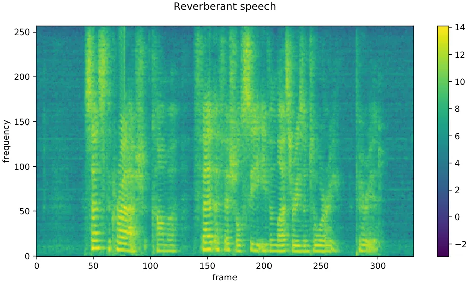
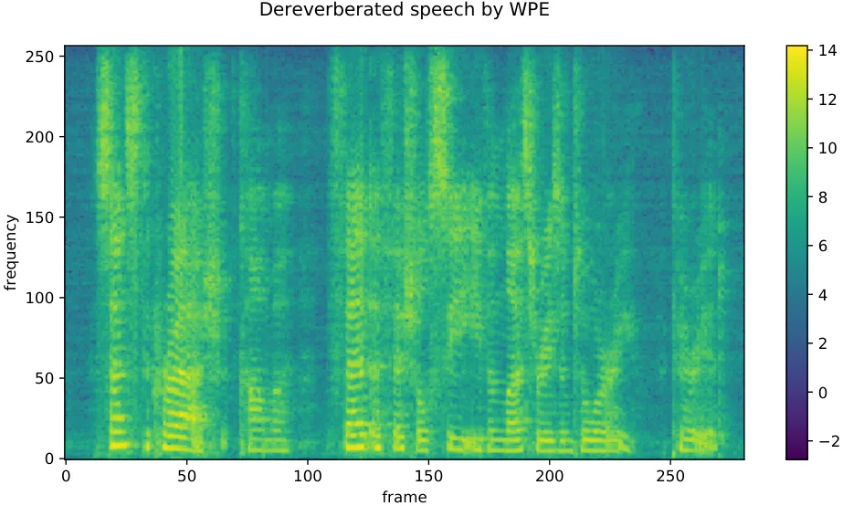
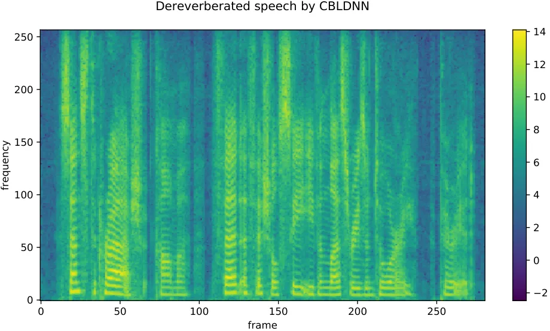
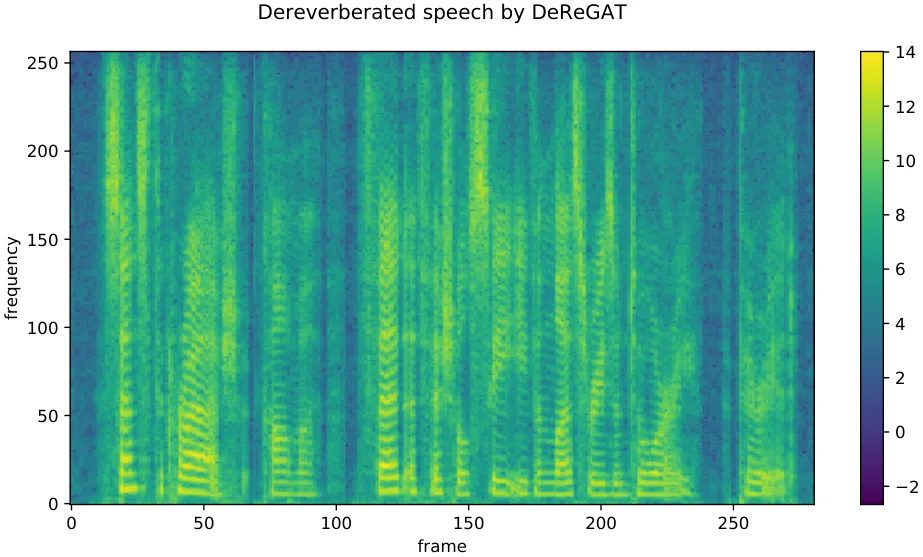
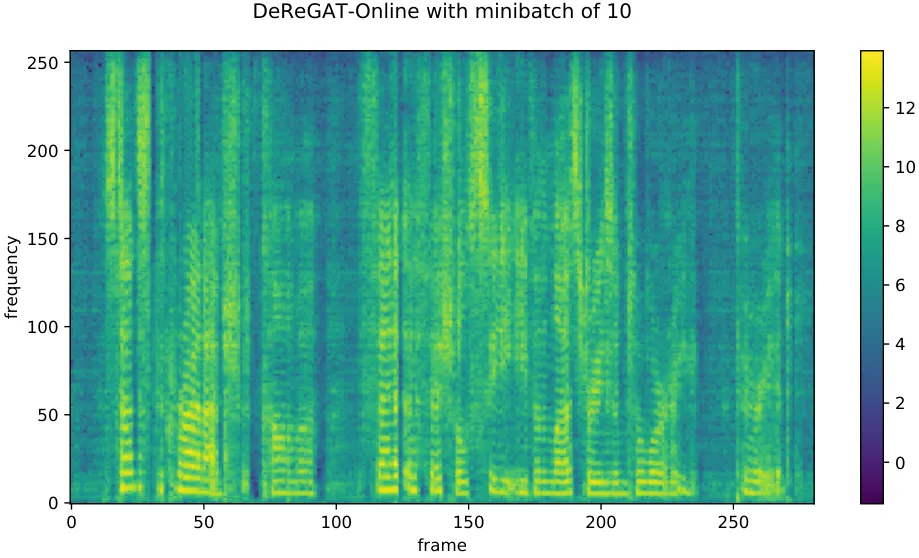
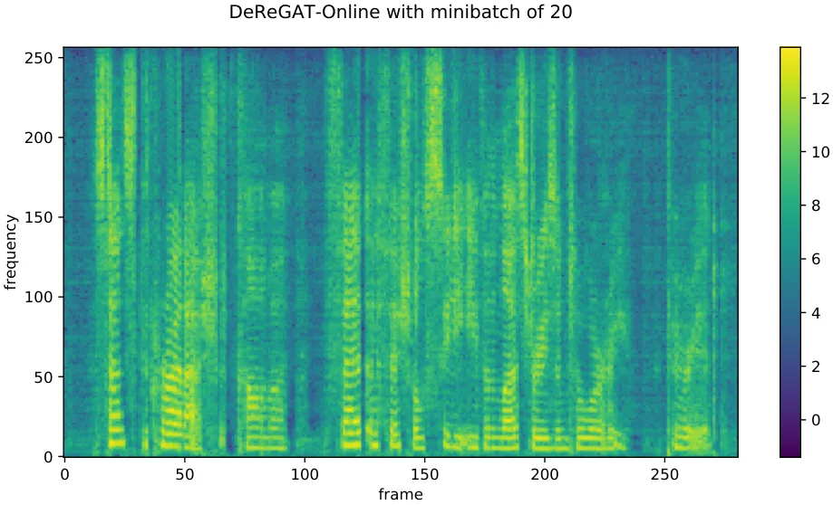
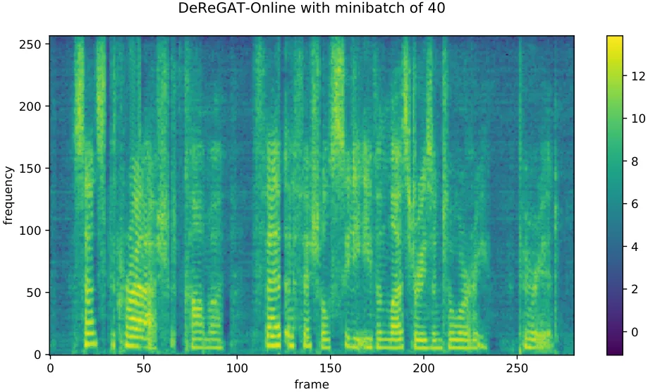
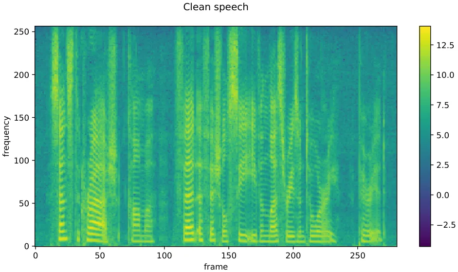

# Single-channel Speech Dereverberation via Generative Adversarial Training

###### Abstract

In this paper, we propose a single-channel speech dereverberation system
(DeReGAT) based on convolutional, bidirectional long short-term memory
and deep feed-forward neural network (CBLDNN) with generative
adversarial training (GAT). In order to obtain better speech quality
instead of only minimizing a mean square error (MSE), GAT is employed to
make the dereverberated speech indistinguishable form the clean samples.
Besides, our system can deal with wide range reverberation and be well
adapted to variant environments. The experimental results show that the
proposed model outperforms weighted prediction error (WPE) and deep
neural network-based systems. In addition, DeReGAT is extended to an
online speech dereverberation scenario, which reports comparable
performance with the offline case.

Chenxing Li^(1,2), Tieqiang Wang^(1,2), Shuang Xu¹, Bo Xu¹

¹Institute of Automation, Chinese Academy of Sciences, Beijing,
P.R.China  
²University of Chinese Academy of Sciences, Beijing, P.R.China

{lichenxing2015, wangtieqiang2015, shuang.xu, xubo}@ia.ac.cn

Index Terms: speech dereverberation, generative adversarial training,
CBLDNN.

## 1 Introduction

In an enclosed space, speech signals recorded by receivers will be the
mixes of original signals and their delayed and attenuated version, this
phenomenon is caused by the reflections from different directions. These
various reflections damage speech intelligibility, degrade the
performance of source localization or speech recognition and are
generally hard to be described by deterministic functions or models. To
draw these issues, effective speech dereverberation system should be
established.

Many approaches have been proposed for decades: (1). Inverse filtering
of the room impulse response (RIR) \[1, 2\] convolves reverberant speech
with the inverse filters to refine speech, but the minimum phase
assumption severely restricts this method. Some improvements have been
conducted in \[3, 4\]. But the time-varying RIR is still hard to
estimate. (2). Blind multi-channel speech dereverberation is another
popular method, which based on multi-channel linear prediction (MCLP)
\[5, 6, 7, 8, 9\]. MCLP-based methods predict undesired reverberant
component in the microphone signals, which is subsequently subtracted
from the same signals. However, since these methods lack additional
knowledge about the undesired components, they may lead to a significant
overestimation of these components and severe distortions of the output
signals. (3). Spatial processing uses multiple microphones and spectral
enhancement to suppress reverberation \[10\]. Microphone array
processing techniques such as beamforming provide spatial filtering to
suppress specular reflections so that the speech signals from the
desired directions can be enhanced (delay and sum beamformer in \[11\],
minimum variance distortionless response (MVDR) beamformer in \[12\]).
(4). Recently, WPE algorithm has shown promising results \[13, 14\].
Standard WPE requires entire utterance to be obtained before calculating
the filter taps, and then dereverberation can be performed. Several
improvements have also been gradually proposed, such as adaptive version
\[15\] and online WPE \[16\]. WPE and MVDR are also combined in a two
stages algorithm \[17\]. Besides, WPE can be applied to both single and
multi-channel conditions.

Nowadays, deep neural network is gradually applied to speech
dereverberation. DNN in \[18\] learns a spectral mapping from
reverberant to anechoic speech. However, performance is still limited at
low reverberation time (RT60). Moreover, their system is environmentally
insensitive, though LSTM has been utilized to further promote the
performance in \[19\]. Furthermore, DNN-based nonlinear feature mapping
and statistical linear feature adaptation approaches are also
investigated in \[20\] for reducing reverberation in speech signals, and
a reverberation-time-aware DNN-based speech dereverberation framework
\[21\] is proposed to handle a wide range of reverberation times.
However, this network highly relies on an accurate estimation of RT60.

However, the methods mentioned above come with several shortcomings:
(1). Most of the methods rely on complex pipelines composed of multiple
algorithms and hand-designed processing stages. (2). MSE loss utilized
in these methods only concerns the numerical difference in the
estimation, and the numerical error reduction may not necessarily lead
to perceptual improvement on the dereverberated speech. (3). Most of
methods above only work well in specific environments. Thus we propose a
speech dereverberation system based on generative adversarial network.
In this paper, we mainly focus on single-channel speech dereverberation.
Our contributions are as follows: (1). A more sophisticated structure,
CBLDNN, is used to improve the performance; (2). Our system has the
ability to deal with the speech with a wide range of RT60 in different
environments. (3). GAT is employed to train the network to further
enhance the speech quality.

In order to illuminate the effectiveness of this method, several
experiments are conducted. Perceptual evaluation of speech quality
(PESQ) \[22\] and speech to reverberation modulation energy ratio (SRMR)
\[23\] are utilized to evaluate the performance. Compared with WPE and
deep neural network-based methods, experiments show that our DeReGAT
achieves better performances both in PESQ and SRMR. At the same time,
our DeReGAT also works well in clean condition, which indicates that our
system is robust in variate RT60 and room sizes. Furthermore, we extend
the DeReGAT to online speech dereverberation, which enables the output
of the proposed method can be thrown into subsequent online speech
enhancement and recognition.

The rest of this paper is organized as follows. Section 2 introduces the
single-channel speech dereverberation. Section 3 describes the
generative adversarial training methodology in this paper. Experimental
setup and results are presented in Section 4. Section 5 details the
online version of the proposed DeReGAT. Finally, Section 6 concludes our
work.

## 2 Single-channel speech dereverberation

Speech dereverberation aims at estimating anechoic speech signals from
reverberant speech. In this paper, we focus on single-channel speech
dereverberation task, and additive noise is ignored. The reverberant
speech can be represented as:

```math
y(n)=x(n)*h, \tag{1}
```

where $`y(n)`$ represents reverberant speech, $`x(n)`$ is anechoic
speech and $`h`$ is RIR. The following relationship is still satisfied
after short time fourier transform (STFT):

```math
Y(t,f)=X(t,f)\times H, \tag{2}
```

where $`Y(t,f)`$ and $`X(t,f)`$ represent the STFT of speech $`y(n)`$
and $`x(n)`$ respectively. Thus, our task is clarified as recovering
anechoic signal $`x(n)`$ from $`y(n)`$ or $`Y(t,f)`$. In speech
separation task, better results can be obtained by estimating a set of
masks \[24\]. Similarly, mask is adopted as training target rather than
spectral magnitude in our task. In our experiment, we firstly deploy a
deep neural network to estimate mask $`M(t,f)`$ in frequency domain
instead of directly recovering $`x(n)`$ from $`y(n)`$. In the following
equation, $`H(|Y(t,f)|,\theta)`$ represents a non-linear representation
from STFT spectral magnitude $`|Y(t,f)|`$ to $`M(t,f)`$.

```math
H(|Y(t,f)|,\theta)=M(t,f), \tag{3}
```

and $`|X(t,f)|`$ can be recovered by $`M(t,f)\times|Y(t,f)|`$
($`\times`$ indicates element-wise multiplication). The anechoic speech
signal $`x(n)`$ can be obtained by inverse STFT.

Masks are to be estimated as the training targets, and several
widely-accepted masks are utilized in paper \[24\]. Phase sensitive mask
(PSM) takes the differences of phases into account, and it achieves the
state-of-the-art performance in speech separation task. Therefore, PSM
mask is adopted in this paper, which is defined as:

```math
M^{\mathit{PSM}}=|X(t,f)|\times cos(\theta_{y}(t,f)-\theta(t,f))/|Y(t,f)|, \tag{4}
```

where $`\theta_{y}(t,f)`$ is the phase of reverberant speech, and
$`\theta(t,f)`$ is the phase of clean signal.

## 3 Generative adversarial training

Generative adversarial net \[25\] comprises two adversarial sub
networks, a generator which generates the fake examples from the random
noises, and a discriminator which discriminates whether the input is
real or generated by the generator.

In this paper, we implement a conditional GAN \[26, 27\], where the
generator, a CLDNN-based model, performs mapping conditioned on some
extra clues. Specifically, the generator learns a mapping from observed
feature $`|Y(t,f)|`$ to mask $`M(t,f)`$. The discriminator is trained to
classify whether the STFT feature comes from clean speech or generated.
This training procedure is diagrammed in Figure 1.

Figure 1: CLDNN-based speech dereverberation with GAT.

### 3.1 CBLDNN-based generator

In this section, an utterance-level CLDNN-based generator is proposed.
By using convolutional layers, some acoustic variations can be
effectively normalized and the resultant feature representation may be
immune to speaker variations, colored background and channel noises.
Besides, filters that work on local frequency region provide an
efficient way to represent local structures and their combinations,
which give a more precise spectral structure to dereverberated speech.
Higher convolutional layers capture wider frequency variations and cover
longer range RT60. BLSTMs well model temporal variations and DNN layers
map features to a more separable space. The CBLDNN architecture
incorporates the three layers in a unified framework, fusing the
benefits of individual layers.

The proposed CBLDNN model is similar to \[28\], but with fine adjustment
and more sophisticated structure. As depicted in Figure 1. The proposed
model consists of 5 stacked convolutional layers, 2 stacked BLSTM layers
and 1 output layer. In (inChannel, outChannel, kernelW, kernelH) format,
the convolutional part have (1, 4, 10, 10)-, (4, 4, 5, 5)-, (4, 8, 7,
7)-, (8, 8, 5, 5)- and (8, 8, 3, 3)-convolution layer from shallow to
deep with no pooling and 1 stride. Each BLSTM layer has 256 units. The
model has 1 fully-connected (FC) layers, which has 257 output nodes.

### 3.2 BLCDNN-based discriminator

In our experiment, we use utterance-level BLCDNN-based discriminator,
which is depicted in Figure 1.

We aim to use BLSTM to model the dependency of the speech and
convolutional layer to extract discriminative features that are useful
for classification task. As for convolutional layer, to extract
complementary features and enrich the representation, we learn several
different filters simultaneously. Convolutional filters with multiple
sizes capture valuable features from different scales, which contribute
a lot to robust classification. The feature maps produced by the
convolution layer are forwarded to the pooling layer. 1-max pooling is
employed on each feature map to reduce it to a single but the most
dominant feature. The features are then joined to form a feature vector
input to the final layer. This step transforms the variable-length,
high-dimensional vector into a fixed-length vector. Finally, an FC layer
maps it to one output node. The input is more like a clean speech when
the output value is closer to 1.

The BLCDNN model consists of 2 BLSTM layers, 1 convolutional layer and 1
FC layer. Each BLSTM layer has 256 units. In (kernelW, kernelH) format,
the convolutional layer has 3 different filter sizes that are (5, 5),
(3, 3) and (1, 1) both with 4 output channels and 1 stride.

### 3.3 Loss function

For comparison, a dereverberation system with PSM-based deep neural
network (CBLDNN) is selected as baseline, and MSE-based loss function
is:

```math
\mathcal{L}_{2}^{\mathit{PSM}}=\frac{1}{N}||M^{\mathit{PSM}}\times|Y|-|X|\cos(\theta_{y}-\theta)||^{2}, \tag{5}
```

where $`M`$, $`|Y|`$ and $`|X|`$ represent mask, STFT spectral magnitude
of reverberant speech and STFT spectral magnitude of clean speech for
one utterance respectively. $`N`$ is the total number of time-frequency
bins. $`\theta_{y}`$ is the phase of reverberant speech, and $`\theta`$
is the phase of clean signal.

In this experiment, we train network by GAT, and LSGAN \[29\] based
method is utilized. At the same time, $`L_{1}`$-regularization is
utilized to guide the training. In order to balance GAN loss and
$`L_{1}`$-regularization, $`\lambda`$ is taken as hyper-parameter in
this experiment. The loss function is listed as:

```math
\displaystyle\min\limits_{D}\mathcal{L}(D) \displaystyle=\mathbb{E}_{|X|\sim{}p_{\mathit{data}}(|X|)}[(D(|X|)-1)^{2}] \tag{6}
```

```math
\displaystyle+\mathbb{E}_{|Y|\sim{}p_{\mathit{data}}(|Y|)}[(D(G(|Y|)\times|Y|))^{2}],
```

```math
\displaystyle\min\limits_{G}\mathcal{L}(G) \displaystyle=\mathbb{E}_{|Y|\sim{}p_{\mathit{data}}(|Y|)}[(D(G(|Y|)\times|Y|)-1)^{2}]
```

```math
\displaystyle+\lambda\mathcal{L}_{1}^{\mathit{PSM}}.
```

## 4 Experiments

### 4.1 Experimental setup

To build a large-scale training dataset for DeReGAT, clean speech is
selected from WSJ0 dataset \[30\], which has 12776 utterances, 1206
utterances and 651 utterances in training set, development set and test
set respectively. Then reverberant speech is generated by convolving the
clean speech with RIR. The impulse responses are generated by \[31,
32\].

We place 1 microphone at the very centre of the room. Three different
Room (Room A, B, C) and two different Room (Room D, E) are conducted for
training and test. For training and development set, RT60 is uniformly
distributed between 0 and 700ms, and RT60 is uniformly distributed
between 70ms and 600ms in test set. Sound source is randomly placed in
each room. Thus, 38328, 3618 and 1302 utterances are conducted as
training set, development set and test set respectively. Detailed
configuration is listed in Table 1 and Table 2. Development set is used
to choose the model. The experimental results are all evaluated on test
set.

|                 |                                                         |
| --------------- | ------------------------------------------------------- |
|   Dataset       | 12776 utterances in training set and                    |
|                 | 1206 in development set                                 |
| Room Size(m)    | Room A ($`3\times 3\times 3`$), Room B                  |
|                 | ($`6\times 6\times 4`$), Room C ($`9\times 9\times 5`$) |
| $`RT_{60}`$(ms) | Uniformly sampled from 0 to 700ms                       |
|                 |                                                         |

Table 1: Configurations used for simulating training and development
data.

|   Dataset       | 651 utterances in test set             |
| --------------- | -------------------------------------- |
| Room Size(m)    | Room D ($`4\times 5\times 3`$), Room E |
|                 | ($`10\times 12\times 6`$)              |
| $`RT_{60}`$(ms) | Uniformly sampled from 70ms to 600ms   |
|                 |                                        |

Table 2: Configurations used for simulating test data.

The input features of generator and discriminator are 257-dimensional
STFT spectral magnitude computed with a frame size of 32ms and 16ms
shift. The phase of the anechoic signal is used to build PSM-based loss
function, and the phase of the reverberant speech is used to restore the
speech. After fine adjustment, hyper-parameters $`\lambda`$ is set as 1.
The models are all trained on Tensorflow \[33\]. RMSprop algorithm
\[34\] is utilized for training where the learning rate started at
0.0002.

### 4.2 Baseline systems

We conduct several baseline systems. A standard WPE-based system and a
deep neural network-based system, CBLDNN, are conducted. CBLDNN outputs
PSM-based mask, and MSE is selected as loss function. CBLDNN has the
same model structure as the generator of DeReGAT. The performance of
these systems is listed in Table 3.

### 4.3 DeReGAT dereverberation system



(a) Reverberant speech.



(b) Dereverberated by WPE.



(c) Dereverberated by CLDNN.



(d) Dereverberated by DeReGAT.



(e) Dereverberated by DeRe-10.



(f) Dereverberated by DeRe-20.



(g) Dereverberated by DeRe-40.



(h) Clean signal.

Figure 2: An example of dereverberated speech and its clean signal,
which is randomly selected. The RT60 of reverberant speech is 468ms.

|   System    |     | PESQ     |          |     | SRMR     |          |
| ----------- | --- | -------- | -------- | --- | -------- | -------- |
|             |     | Room D   | Room E   |     | Room D   | Room E   |
| WPE         |     | $`2.00`$ | $`2.21`$ |     | $`4.45`$ | $`4.67`$ |
| CBLDNN      |     | $`2.28`$ | $`2.37`$ |     | $`4.93`$ | $`5.11`$ |
| DeReGAT     |     | $`2.54`$ | $`2.76`$ |     | $`5.70`$ | $`5.42`$ |
| Reverberant |     | $`1.75`$ | $`2.04`$ |     | $`4.09`$ | $`4.28`$ |
| Clean       |     | $`-`$    | $`-`$    |     | $`5.73`$ | $`5.62`$ |
|             |     |          |          |     |          |          |

Table 3: Comparison of dereverberation systems with different methods.

In this section, we explore the impact of GAT. In GAT, PSM is used to
measure the loss of $`L_{1}`$, which is utilized to minimize the
distance between generations and clean examples. From Table 3,
experimental results show that all listed methods have contribution to
dereverberation in different rooms, and DeReGAT obtains the best
results. Compared with existing methods, PESQ and SRMR of DeReGAT have
been significantly improved. The SRMR of speech processed by DeReGAT is
markedly approximate to the clean speech. The results mean GAT plays an
important role in improving the performance. GAT makes the speech
produced by generator approaches to clean one. The results also state
that our DeReGAT achieves better dereverberation performance in variant
environments.

Figure 2 shows the spectrogram of dereverberated speech based on
different methods. Compared with speech dereverberated by WPE and
CBLDNN, the speech dereverberated by DeReGAT has clearer and more
compact spectrum structure. At the same time, the speech dereverberated
by WPE remains obviously reverberations.

### 4.4 DeReGAT in clean environment

In practice, due to environments differences, speech collected by
microphone may bear various degrees of reverberation or have little
reverberation. Therefore, We augment clean samples and
weakly-reverberated samples into training set to ensure that
dereverberation system not only has an impressive effect to
dereverberate reverberant speech but also maintain speech with zero or
little reverberation. In the testing phase, clean speech which derived
from different environments is sent to DeReGAT. The results are shown in
Table 4. From the view of PESQ, clean speech is distorted by WPE
apparently, but it still shows high quality after passing DeReGAT both
in Room D and Room E. This shows that our system can be applied to
different environments with variant reverberation.

System PESQ Room D Room E WPE $`3.44`$ $`3.11`$ DeReGAT $`4.47`$
$`4.48`$

Table 4: Comparison of dereverberation systems with clean input.

## 5 Online speech dereverberation by DeReGAT

|   System    |     | PESQ     |          |     | SRMR     |          |
| ----------- | --- | -------- | -------- | --- | -------- | -------- |
|             |     | Room D   | Room E   |     | Room D   | Room E   |
| DeRe-10     |     | $`1.54`$ | $`1.55`$ |     | $`4.96`$ | $`4.77`$ |
| DeRe-20     |     | $`2.12`$ | $`2.23`$ |     | $`5.44`$ | $`5.25`$ |
| DeRe-40     |     | $`2.33`$ | $`2.41`$ |     | $`5.63`$ | $`5.35`$ |
| DeReGAT     |     | $`2.54`$ | $`2.76`$ |     | $`5.70`$ | $`5.42`$ |
| Reverberant |     | $`1.75`$ | $`2.04`$ |     | $`4.09`$ | $`4.28`$ |
|             |     |          |          |     |          |          |

Table 5: Comparison of dereverberation systems with online processing.

In this section, we extend the proposed DeReGAT to enable online speech
dereverberation (DeReGAT-online). We assume that the reverberant signal
is obtained as a sequence of mini-batches. In detail, compared with
offline DeReGAT, DeReGAT-online is performed without updating
parameters. DeReGAT-online receives the mini-batch and outputs the
dereverberated batch. The size of the mini-batches are selected as 10
(DeRe-10), 20 (DeRe-20), 40 (DeRe-40) frames, which represent 160ms,
320ms, 640ms delays respectively.

The results are listed in Table 5. Compared with utterance-level
DeReGAT, the performance of DeReGAT-online degrades. Compared with
reverberant speech, the worse PESQ of DeRe-10 shows heavy distortion in
speech quality. The comparable performance of DeRe-40 with DeReGAT makes
it capable of serving as an online system, where the overall delay
consists of model’s feed-forward time and the size of mini-batch. An
example is also depicted in Figure 2. The visual intervals in
Figure 2(e) make the corresponding speech sounds off and on. The speech
dereverberated by DeRe-20 sounds better, and DeRe-40 generates the most
consistent speech among all online systems.

## 6 Conclusions

In this paper, we introduce CBLDNN-based single-channel speech
dereverberation system with GAT. Our results indicate that DeReGAT shows
impressive performance improvement compared with traditional WPE and
MSE-based deep neural network methods. Our DeReGAT effectively deals
with variant RT60 and environmental differences. Additionally, DeReGAT
is extended to an online version, which can achieve comparable
performance with offline DeReGAT. This shows great potential for further
deployment. We note that the proposed method has great potential for the
further improvement. We can compress the model to further reduce the
system size, which can reduce the storage size and feed-forward time.
Furthermore, single-channel DeReGAT can be extended to multi-channel
DeReGAT, which can utilize the information of source location.

## 7 Acknowledgments

This work is supported by National Key Research and Development Program
of China under Grant No.2016YFB1001404 and Beijing Engineering Research
Center Program under Grant No.Z171100002217015.

## References

- \[1\] S. T. Neely and J. B. Allen, “Invertibility of a room impulse
  response,” _The Journal of the Acoustical Society of America_,
  vol. 66, no. 1, pp. 165–169, 1979.
- \[2\] P. A. Naylor and N. D. Gaubitch, _Speech
  dereverberation_. Springer Science & Business Media, 2010.
- \[3\] M. Wu and D. Wang, “A two-stage algorithm for one-microphone
  reverberant speech enhancement,” _IEEE Transactions on Audio, Speech,
  and Language Processing_, vol. 14, no. 3, pp. 774–784, 2006.
- \[4\] S. Mosayyebpour, M. Esmaeili, and T. A. Gulliver,
  “Single-microphone early and late reverberation suppression in noisy
  speech,” _IEEE Transactions on Audio, Speech, and Language
  Processing_, vol. 21, no. 2, pp. 322–335, 2013.
- \[5\] A. Jukić, T. van Waterschoot, and S. Doclo, “Adaptive speech
  dereverberation using constrained sparse multichannel linear
  prediction,” _IEEE Signal Processing Letters_, vol. 24, no. 1, pp.
  101–105, 2017.
- \[6\] A. Jukić, T. van Waterschoot, T. Gerkmann, and S. Doclo,
  “Multi-channel linear prediction-based speech dereverberation with
  sparse priors,” _IEEE/ACM Transactions on Audio, Speech and Language
  Processing_, vol. 23, no. 9, pp. 1509–1520, 2015.
- \[7\] A. Jukic, T. van Waterschoot, T. Gerkmann, and S. Doclo, “A
  general framework for multichannel speech dereverberation exploiting
  sparsity,” in _International Conference on Dereverberation and
  Reverberation of Audio, Music, and Speech)_, 2016.
- \[8\] T. Yoshioka, H. Tachibana, T. Nakatani, and M. Miyoshi,
  “Adaptive dereverberation of speech signals with speaker-position
  change detection,” in _IEEE International Conference on Acoustics,
  Speech and Signal Processing_, 2009, pp. 3733–3736.
- \[9\] T. Yoshioka and T. Nakatani, “Dereverberation for
  reverberation-robust microphone arrays,” in _European Signal
  Processing Conference_, 2013, pp. 1–5.
- \[10\] J. Allen, D. Berkley, and J. Blauert, “Multimicrophone
  signal-processing technique to remove room reverberation from speech
  signals,” _The Journal of the Acoustical Society of America_, vol. 62,
  no. 4, pp. 912–915, 1977.
- \[11\] E. A. P. Habets, J. Benesty, I. Cohen, S. Gannot, and
  J. Dmochowski, “New insights into the MVDR beamformer in room
  acoustics,” _IEEE Transactions on Audio, Speech, and Language
  Processing_, vol. 18, no. 1, pp. 158–170, 2010.
- \[12\] E. A. Habets and J. Benesty, “A two-stage beamforming approach
  for noise reduction and dereverberation,” _IEEE Transactions on Audio,
  Speech, and Language Processing_, vol. 21, no. 5, pp. 945–958, 2013.
- \[13\] T. Nakatani, T. Yoshioka, K. Kinoshita, M. Miyoshi, and B.-H.
  Juang, “Blind speech dereverberation with multi-channel linear
  prediction based on short time fourier transform representation,” in
  _IEEE International Conference on Acoustics, Speech and Signal
  Processing_, 2008, pp. 85–88.
- \[14\] ——, “Speech dereverberation based on variance-normalized
  delayed linear prediction,” _IEEE Transactions on Audio, Speech, and
  Language Processing_, vol. 18, no. 7, pp. 1717–1731, 2010.
- \[15\] J. Caroselli, I. Shafran, A. Narayanan, and R. Rose, “Adaptive
  multichannel dereverberation for automatic speech recognition,” in
  _INTERSPEECH_, 2017.
- \[16\] K. Kinoshita, M. Delcroix, H. Kwon, T. Mori, and T. Nakatani,
  “Neural network-based spectrum estimation for online WPE
  dereverberation,” _INTERSPEECH_, pp. 384–388, 2017.
- \[17\] A. Cohen, G. Stemmer, S. Ingalsuo, and S. Markovich-Golan,
  “Combined weighted prediction error and minimum variance
  distortionless response for dereverberation,” in _IEEE International
  Conference on Acoustics, Speech and Signal Processing_, 2017, pp.
  446–450.
- \[18\] K. Han, Y. Wang, D. Wang, W. S. Woods, I. Merks, and T. Zhang,
  “Learning spectral mapping for speech dereverberation and denoising,”
  _IEEE/ACM Transactions on Audio, Speech, and Language Processing_,
  vol. 23, no. 6, pp. 982–992, 2015.
- \[19\] F. Weninger, J. Geiger, M. Wöllmer, B. Schuller, and G. Rigoll,
  “Feature enhancement by deep LSTM networks for ASR in reverberant
  multisource environments,” _Computer Speech & Language_, vol. 28,
  no. 4, pp. 888–902, 2014.
- \[20\] X. Xiao, S. Zhao, D. H. H. Nguyen, X. Zhong, D. L. Jones, E. S.
  Chng, and H. Li, “Speech dereverberation for enhancement and
  recognition using dynamic features constrained deep neural networks
  and feature adaptation,” _EURASIP Journal on Advances in Signal
  Processing_, vol. 2016, no. 1, p. 4, 2016.
- \[21\] B. Wu, K. Li, M. Yang, and C.-H. Lee, “A
  reverberation-time-aware approach to speech dereverberation based on
  deep neural networks,” _IEEE/ACM Transactions on Audio, Speech, and
  Language Processing_, vol. 25, no. 1, pp. 102–111, 2017.
- \[22\] A. W. Rix, J. G. Beerends, M. P. Hollier, and A. P. Hekstra,
  “Perceptual evaluation of speech quality (PESQ)-a new method for
  speech quality assessment of telephone networks and codecs,” in _IEEE
  International Conference on Acoustics, Speech, and Signal Processing_,
  vol. 2, 2001, pp. 749–752.
- \[23\] T. H. Falk and W.-Y. Chan, “A non-intrusive quality measure of
  dereverberated speech,” in _International Workshop on Acoustic Echo
  and Noise Control_, 2008.
- \[24\] M. Kolbæk, D. Yu, Z.-H. Tan, and J. Jensen, “Multitalker speech
  separation with utterance-level permutation invariant training of deep
  recurrent neural networks,” _IEEE/ACM Transactions on Audio, Speech,
  and Language Processing_, vol. 25, no. 10, pp. 1901–1913, 2017.
- \[25\] I. Goodfellow, J. Pouget-Abadie, M. Mirza, B. Xu,
  D. Warde-Farley, S. Ozair, A. Courville, and Y. Bengio, “Generative
  adversarial nets,” in _Advances in Neural Information Processing
  Ssystems_, 2014, pp. 2672–2680.
- \[26\] P. Isola, J.-Y. Zhu, T. Zhou, and A. A. Efros, “Image-to-image
  translation with conditional adversarial networks,” _arXiv preprint
  arXiv:1611.07004_, 2016.
- \[27\] S. Pascual, A. Bonafonte, and J. Serrà, “SEGAN: Speech
  enhancement generative adversarial network,” _arXiv preprint
  arXiv:1703.09452_, 2017.
- \[28\] T. N. Sainath, O. Vinyals, A. Senior, and H. Sak,
  “Convolutional, long short-term memory, fully connected deep neural
  networks,” in _IEEE International Conference on Acoustics, Speech and
  Signal Processing_, 2015, pp. 4580–4584.
- \[29\] X. Mao, Q. Li, H. Xie, R. Y. Lau, Z. Wang, and S. P. Smolley,
  “Least squares generative adversarial networks,” _arXiv preprint
  ArXiv:1611.04076_, 2016.
- \[30\] J. Garofalo, D. Graff, D. Paul, and D. Pallett, “Csr-i (wsj0)
  complete,” _Linguistic Data Consortium_, 2007.
- \[31\] J. B. Allen and D. A. Berkley, “Image method for efficiently
  simulating small-room acoustics,” _The Journal of the Acoustical
  Society of America_, vol. 65, no. 4, pp. 943–950, 1979.
- \[32\] E. A. Lehmann and A. M. Johansson, “Prediction of energy decay
  in room impulse responses simulated with an image-source model,” _The
  Journal of the Acoustical Society of America_, vol. 124, no. 1, pp.
  269–277, 2008.
- \[33\] M. Abadi, A. Agarwal, P. Barham, E. Brevdo, Z. Chen, C. Citro,
  G. S. Corrado, A. Davis, J. Dean, M. Devin _et al._, “Tensorflow:
  Large-scale machine learning on heterogeneous distributed systems,”
  _arXiv preprint arXiv:1603.04467_, 2016.
- \[34\] T. Tieleman and G. Hinton, “Lecture 6.5-rmsprop: Divide the
  gradient by a running average of its recent magnitude,” _COURSERA:
  Neural networks for machine learning_, vol. 4, no. 2, pp. 26–31, 2012.
