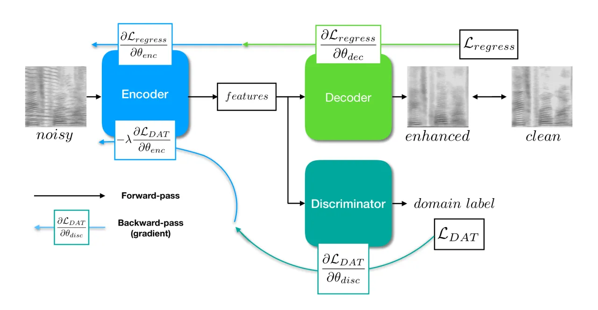
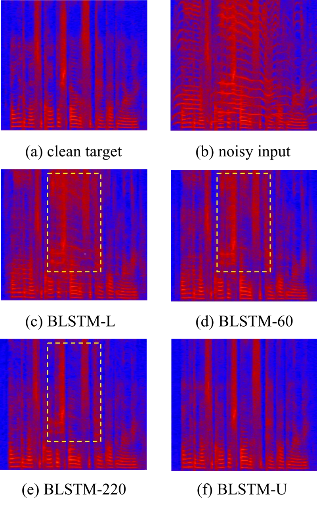

# Noise Adaptive Speech Enhancement using Domain Adversarial Training

###### Abstract

In this study, we propose a novel noise adaptive speech enhancement (SE)
system, which employs a domain adversarial training (DAT) approach to
tackle the issue of a noise type mismatch between the training and
testing conditions. Such a mismatch is a critical problem in
deep-learning-based SE systems. A large mismatch may cause a serious
performance degradation to the SE performance. Because we generally use
a well-trained SE system to handle various unseen noise types, a noise
type mismatch commonly occurs in real-world scenarios. The proposed
noise adaptive SE system contains an encoder-decoder-based enhancement
model and a domain discriminator model. During adaptation, the DAT
approach encourages the encoder to produce noise-invariant features
based on the information from the discriminator model and
consequentially increases the robustness of the enhancement model to
unseen noise types. Herein, we regard stationary noises as the source
domain (with the ground truth of clean speech) and non-stationary noises
as the target domain (without the ground truth). We evaluated the
proposed system on TIMIT sentences. The experiment results show that the
proposed noise adaptive SE system successfully provides significant
improvements in PESQ (19.0%), SSNR (39.3%), and STOI (27.0%) over the SE
system without an adaptation.

Chien-Feng Liao¹, Yu Tsao¹, Hung-Yi Lee³, Hsin-Min Wang²

¹Research Center for Information Technology Innovation, Academia Sinica,
Taiwan  
² Institute of Information Science, Academia Sinica, Taiwan  
³Graduate Institute of Electrical Engineering, National Taiwan
University, Taiwan

{r06946002,hungyilee}@ntu.edu.tw, yu.tsao@citi.sinica.edu.tw,
whm@iis.sinica.edu.tw

Index Terms:Speech enhancement, domain adversarial training, domain
adaptation, deep neural networks

## 1 Introduction



Figure 1: The proposed adversarial training scheme includes an encoder,
a decoder and a discriminator. During training, the encoder-decoder and
the discriminator are optimized alternatively. The discriminator tries
to minimize $`\mathcal{L_{DAT}}`$, whereas the encoder tries to maximize
it. In this way, the encoder is encouraged to produce noise-invariant
features.

Speech enhancement (SE) has been widely used as a preprocessor in
speech-related applications, such as speech coding, hearing aids \[1\],
automatic speech recognition (ASR), and cochlear implants \[2\]. In the
past, various SE approaches have been developed. Notable examples
include spectral subtraction \[3\], minimum-mean-square-error
(MMSE)-based spectral amplitude estimator \[4\], Wiener filtering \[5\],
and non-negative matrix factorization (NMF) \[6\]. Recently, deep
denoising autoencoder (DDAE) and deep neural network (DNN)-based SE
models have also been proposed and extensively investigated \[7, 8, 9,
10\]. However, one of the critical problems in data-driven SE is the
mismatch between the training and testing environments.

In real-world scenarios, the acoustic environment where we deploy our
enhancement model can be vastly different from our training examples,
and unseen noises can seriously degrade the quality of processed signal.
One way to overcome this problem is to collect as many types of noises
as possible to increase the generalization \[8\], but it is not
practical to cover potentially infinite noise types that may occur in
real scenarios. We propose to come in from the domain adaptation
perspective. Although not commonly seen in SE studies, this is of great
interest in the field of computer vision and has been shown to be
successful \[11, 12, 13\]. The goal of domain adaptation is to utilize
the unlabelled target domain data to transfer the model learned from the
source domain data to a robust model in the target domain. One way is to
extract domain invariant features in the use of domain adversarial
training (DAT) \[14\]. The key idea is to jointly train a discriminator,
which can classify whether the input is from the source domain or the
target domain given the extracted features, and a feature extractor,
which tries to confuse the discriminator. As a result, the downstream
task will not take domain information into consideration, and thus will
be robust to a domain mismatch.

In our scenario, noisy utterances corrupted by stationary noises are
defined as the source domain, and non-stationary noises without
corresponding clean utterances are the target domain. With the help of
DAT, we achieved significant improvements in objective measures
including perceptual evaluation of speech quality (PESQ) \[15\],
segmental signal-to-noise ratio (SSNR), and short-time objective
intelligibility (STOI)\[16\]. We compare our DAT with an upper-bound
model and a lower-bound model. The upper-bound model is trained in a
fully-supervised fashion where the clean speech references for the
target domain data are available, and the lower-bound model is trained
using the source domain data only, without any domain adaptation
techniques. Experiments show that the proposed noise adaptive model
successfully provides significant improvements over the lower-bound
model.

The rest of the paper is organized as follows. We review some works
focused on domain adaptation for speech-related tasks in Section 2. In
Section 3, we provide a detailed explanation of our approach, including
the objective functions. The experiment settings and results are
presented in Section 4. Finally, we provide some concluding remarks in
Section 5.

## 2 Related work

Generative Adversarial Network (GAN) \[17\] has recently attracted great
attention in the deep learning community. Adversarial training is
capable of modeling a complex data distribution by employing an
alternative mini-max training scheme between a generator network and a
discriminator network. One of its applications is to serve as a new
objective function for a regression task. Instead of explicitly
minimizing the L1$`\backslash`$L2 losses, which can cause over-smoothing
results, the discriminator provides a high-level abstract measurement of
the “realness” of the generated images. This idea has been used in SE
tasks with parallel \[18, 19, 20, 21, 22, 23\] or nonparallel corpora
\[24, 25\].

Another important application of adversarial training is domain
adaptation. In a data-driven-based pattern
classification$`\backslash`$regression task, the mismatch between the
training and testing conditions is also known as the domain shift
problem, which can cause a serious performance degradation. One way to
tackle this problem is to match the data distributions across domains.
Ganin et al. \[14\] proposed utilizing adversarial training to produce
high-dimensional features that were indistinguishable for a
discriminative domain classifier. Such an idea has been deployed in
various speech processing frameworks for extracting domain-invariant
features. In \[26, 27\], the authors matched the distributions of the
clean and distorted speeches in the feature space, and confirmed that
the noise-invariant features were beneficial to robust acoustic models.
In \[28, 29, 30, 31\], speaker-invariant and accent-invariant features
were extracted in a similar fashion for speaker recognition and speech
recognition. In \[32\], Domain Separation Network with three network
components was used to extract the features. The component shared by
both domains was optimized with the classification loss and DAT. To
further increase the degree of domain-invariance, two private components
were separately trained to be orthogonal to the shared component.
Although DAT has frequently been utilized in noise-robust speech
recognition, all uses have been in classification tasks. In this study,
we confirmed that DAT can be deployed on an SE system as well.

## 3 Domain adversarial speech enhancement

We assume a scenario in which only a small amount of noisy utterances
that match the testing condition (i.e., the non-stationary noise
environment) are available, and there is no corresponding clean speech
at all. We denote the speech dataset under stationary noises as
$`S=\{x_{i},y_{i},c_{i}\}^{N}_{i=1}`$, where $`x_{i}`$ and $`y_{i}`$ are
the noisy signal and its corresponding clean signal,
$`c_{i}\in\{1,...,C\}`$ indicates the noise type of the i-th data, and
$`C`$ denotes the number of noise classes. The unlabelled speech dataset
under non-stationary noises is denoted as
$`T=\{x_{j},c_{j}\}^{M}_{j=1}`$, where $`M<<N`$. The goal is to utilize
these unlabelled data to minimize the domain mismatch.

### 3.1 Domain adversarial training

Our network consists of three components: the encoder network
$`E(x;\theta_{enc})`$ whose input is noisy speech $`x`$ and output is
the extracted feature vector $`f`$, the decoder network
$`D(f;\theta_{dec})`$ that estimates clean acoustic feature $`y`$ given
input $`f`$, and the discriminator network $`Disc(f;\theta_{disc})`$
that outputs a probability distribution over the domains. Here,
$`\theta_{enc}`$, $`\theta_{dec}`$ and $`\theta_{disc}`$ are the
parameters of the network; for simplicity, we drop the $`\theta`$
notation in the equations below. The overall workflow is shown in Figure

1. Unlike the discriminator in \[14\], which is a binary classifier that
   predicts the source$`\backslash`$target domain, in this study it gives a
   probability distribution over multiple noise types. The discriminator
   tries to correctly predict the noise types, whereas the encoder tries to
   maximize the prediction error. As a result, the encoder tends to produce
   noise-invariant features, thereby reducing the mismatch problem.

|           |         |                    |        |       |          |        |       |                  |        |       |
| --------- | ------- | ------------------ | ------ | ----- | -------- | ------ | ----- | ---------------- | ------ | ----- |
|           |         | BLSTM-L (Baseline) |        |       | BLSTM-60 |        |       | BLSTM-U (Oracle) |        |       |
|           | SNR(dB) | PESQ               | SSNR   | STOI  | PESQ     | SSNR   | STOI  | PESQ             | SSNR   | STOI  |
| BabyCry   | -3      | 1.803              | -3.995 | 0.775 | 1.971    | -0.916 | 0.802 | 2.901            | 4.981  | 0.901 |
|           | 3       | 2.181              | -0.609 | 0.844 | 2.369    | 2.098  | 0.865 | 3.208            | 6.549  | 0.929 |
|           | 6       | 2.373              | 1.007  | 0.871 | 2.559    | 3.478  | 0.890 | 3.325            | 7.195  | 0.938 |
|           | 9       | 2.557              | 2.399  | 0.894 | 2.739    | 4.696  | 0.911 | 3.419            | 7.732  | 0.945 |
|           | 12      | 2.730              | 3.808  | 0.910 | 2.903    | 5.879  | 0.925 | 3.509            | 8.314  | 0.951 |
|           | Avg.    | 2.329              | 0.522  | 0.859 | 2.508    | 3.047  | 0.879 | 3.272            | 6.954  | 0.933 |
| Cafeteria | -3      | 1.609              | -8.485 | 0.574 | 1.654    | -7.587 | 0.603 | 1.595            | -8.703 | 0.584 |
|           | 3       | 2.021              | -4.951 | 0.729 | 2.099    | -3.595 | 0.759 | 2.031            | -4.801 | 0.745 |
|           | 6       | 2.219              | -2.987 | 0.796 | 2.312    | -1.476 | 0.820 | 2.246            | -2.574 | 0.812 |
|           | 9       | 2.418              | -1.065 | 0.849 | 2.520    | 0.570  | 0.867 | 2.462            | -0.395 | 0.866 |
|           | 12      | 2.612              | 0.715  | 0.887 | 2.720    | 2.476  | 0.902 | 2.669            | 1.647  | 0.905 |
|           | Avg.    | 2.176              | -3.355 | 0.767 | 2.261    | -1.922 | 0.790 | 2.201            | -2.965 | 0.782 |

Table 1: The average PESQ, SSNR, and STOI scores for evaluating BLSTM-L,
BLSTM-60, and BLSTM-U on the test set at five different SNR levels and
the average scores across all SNRs. BabyCry is the adapted target domain
noise type, while Cafeteria is the unseen noise type. The adaptive model
(BLSTM-60) is superior to the baseline (BLSTM-L) across all SNRs for
three metrics. The highest scores per metric are highlighted with bold
text, excluding the BLSTM-U.

### 3.2 Objective functions

We take the regression approach as our SE objective function, which
minimizes mean-absolute-error between the ground truth of the clean
speech and the output of the decoder network:

```math
\begin{split}\mathcal{L}_{regress}=\frac{1}{N}\sum_{i=1}^{N}|D(f_{i})-y_{i}|\end{split} \tag{1}
```

where $`N`$ is the total number of training samples from the source
domain, $`x_{i}`$ and $`y_{i}`$ are the $`i`$-th paired noisy and clean
speeches. The discriminator is optimized by minimizing the categorical
cross-entropy loss, denoted as $`\mathcal{L}_{DAT}`$:

```math
\begin{split}\mathcal{L}_{DAT}=-\frac{1}{M+N}\sum_{i=1}^{M+N}\sum_{k=1}^{C}c_{ik}logP(c_{i}=k|f_{i})\end{split} \tag{2}
```

where $`P(c_{i}=k|f_{i})`$ is the discriminator output after softmax,
and $`c_{ik}`$ denotes the k-th value in one-hot expression of label
$`c_{i}`$.

We attempted two methods to realize adversarial training. First,
following \[14\], a gradient reversal layer (GRL) is inserted between
the discriminator and the encoder. In the forward-pass, the GRL acts as
an identity layer that leaves the input unchanged, but reverses the
gradient passing through it by multiplying it by a negative scalar
$`\lambda`$ in the backward-pass. Another way is to optimize the encoder
and the discriminator alternatively, as in \[17\]. The choice of GRL
instead of alternating minimization can be viewed as different
approximations of mini-max \[33\], and the second scheme stabilized the
training and produced better results in our preliminary experiments.
Finally, the network parameters are updated via gradient descent, and
the overall update rules are as follows:

```math
\begin{split}\theta_{enc}\leftarrow\theta_{enc}-\alpha(\frac{\partial{\mathcal{L}_{regress}}}{\partial{\theta_{enc}}}-\lambda\frac{\partial{\mathcal{L}_{DAT}}}{\theta_{enc}})\end{split} \tag{3}
```

```math
\begin{split}\theta_{dec}\leftarrow\theta_{dec}-\alpha\frac{\partial{\mathcal{L}_{regress}}}{\theta_{dec}}\end{split} \tag{4}
```

```math
\begin{split}\theta_{disc}\leftarrow\theta_{disc}-\alpha\frac{\partial{\mathcal{L}_{DAT}}}{\theta_{disc}}\end{split} \tag{5}
```

where $`\alpha`$ is the learning rate, and the hyperparameter
$`\lambda`$ is the importance weight between two objectives.

## 4 Experiments

The TIMIT database \[34\] was used to prepare the training and test
sets. For the training set, 500 utterances were randomly selected from
the TIMIT training set and corrupted with five stationary noise types
(the source domain) at six SNR levels (-5 dB, 0 dB, 5 dB, 10 dB, 15 dB,
and 20 dB) to form 15,000 source domain training data. Another 220
utterances were mixed with the non-stationary noise type (the target
domain) to form the adaptation dataset. In this paper, the stationary
noise types include car noise, engine noise, soft wind noise, strong
wind noise, and pink noise, and the non-stationary noise type is a
baby-cry noise. Hence, the total number of noise classes $`C`$ was six
in the following experiments. For the test set, to evaluate the
adaptation performance, 192 utterances from the core test set of TIMIT
database were corrupted with the same non-stationary noise type
(baby-cry) of the target domain. Unseen non-stationary noise type
cafeteria babble was also used to evaluate the generalization ability of
the adapted SE model.

### 4.1 Implementation

We used a BLSTM \[35, 36\] model as building block for the SE network.
The encoder and the decoder each contains a bidirectional LSTM layer
with 512 nodes, and the decoder contains a fully connected layer with
257 linear nodes at the output for spectrogram estimation. The
discriminator herein was a unidirectional LSTM with 1,024 nodes, and a
fully connected layer with 6 nodes followed by a softmax layer to
predict the noise type. The Adam algorithm \[37\] was used for training,
with a learning rate of 0.0001 and 0.0005 for the SE model and the
discriminator, respectively. The batch size is set to 16. We found that
models are robust to the choice of $`\lambda`$ as long as it is below
0.1, and $`\lambda`$ = 0.05 was chosen through out all adaptation
models.

The sampling rate of our speech data is 16 kHz. We extracted the
time-frequency (T-F) features using a 512-point short time Fourier
transform (STFT) with a hamming window size of 32 ms and a hop size of
16 ms, resulting in feature vectors consisting of 257-point STFT
log-power spectra (LPS). For the SE model, we split each training
utterance into multiple segments of 32 frames, and thus the input and
output of our encoder-decoder will be a matrix of 257x32. Finally,
multiple decoder outputs were concatenated and synthesized back to the
waveform signal via the inverse Fourier transform and an overlap-add
method. We used the phases of the noisy signals for the inverse Fourier
transform. Further details and the demo may be found at
[https://github.com/jerrygood0703/noise_adaptive_DAT_SE](https://github.com/jerrygood0703/noise_adaptive_DAT_SE).

In the following experiments, we will evaluate our SE algorithm from
three aspects: speech quality, noise reduction, and speech
intelligibility. Therefore, PESQ, SSNR (in dB), and STOI will be used to
evaluate the enhanced speech, respectively. For all three, a higher
score indicates better results.

Figure 2: Comparison of the baseline and the proposed models in PESQ at
different SNR levels. We denote BLSTM-60 (-140 and -220) as the proposed
models, where the number represents the amount of target domain noisy
speech data seen during training. The PESQ scores for the unprocessed
speech are 1.506, 1.882, 2.075, 2.261, and 2.456 at -3 dB, 3 dB, 6 dB, 9
dB, and 12 dB, respectively, with the average of 2.036.

### 4.2 Results



Figure 3: Spectrograms of a TIMIT utterance in the teset set: (a) clean
target, (b) noisy speech (baby-cry at 3 dB), (c) baseline model BLSTM-L,
(d) and (e) adaptive model BLSTM-(60, 220), (f) upper-bound model
BLSTM-U.

For a fair comparison, we used the same model architecture, weight
initialization, and training scheme for all models compared during the
experiments. The baseline is denoted as BLSTM-L, with $`\lambda`$ set to
zero, meaning that only the source domain data were used to train the
model parameters. First, we intend to investigate the correlation of the
amount of adaptation data to the achievable performance. Thus, we
prepared three sets of adaptation data. For the first set, 60 out of 220
noisy utterances were mixed with the target noise type at 0 dB SNR,
which yielded 60 target domain noisy utterances that could be used in
DAT. Another 80 utterances were added to formed a 140-utterances subset,
while the third subset contained all of 220 utterances. The models
unsupervisedly adapted with different numbers of target domain noisy
utterances are dubbed as BLSTM-60, BLSTM-140 and BLSTM-220. We also
conducted a fully supervised experiment to be our upper-bound model,
denoted as BLSTM-U. In this case, the 220 noisy training utterances of
the target domain were paired with the corresponding clean utterances
during training, and thus the model was optimized using fully supervised
mean-absolute-error and the domain adversarial objective was not
involved.

Table 1 shows the results of the average PESQ, SSNR, and STOI scores on
the test set for the BLSTM-L, BLSTM-60, and BLSTM-U. For the baby-cry
noise set, we can see that with only 60 noisy utterances for adaptation,
the proposed model outperformed the baseline at every SNR levels by a
large margin. It covers 19.0%, 39.3%, and 27.0% of the gap between the
baseline and upper-bound model, with respect to the average PESQ, SSNR,
and STOI. For the cafeteria babble noise set, we tested the SE
performance using the model adapted with the baby-cry noise. The results
show that the proposed model does not overfit to the adapted noise, and
even attains slightly better scores. We hypothesize that DAT learns more
generalized features by explicitly constraining the encoder to be noise
invariant, thus making the decoder noise independent. Research into the
generalization ability will be left for future studies.

In Figure 2, we show the effectiveness of DAT on different amounts of
target domain adaptation data. We can see that PESQ gradually increases
when there are more target domain noisy speech data involved in
training. Since unlabelled noisy speech data are easily acquired, the
benefit from noise adaptive training is promising. Finally, examples of
enhanced spectrograms of the baseline model, proposed methods, and
upper-bound are shown in Figure 3. It is clearly shown that noises are
more suppressed for the models using DAT than the baseline. In summary,
the models equipped with noise adaptation achieved higher scores than
the models without adaptation.

## 5 Conclusions and Future work

In this paper, we studied the problem of noise mismatch in SE systems.
We propose tackling the problem using a DAT algorithm on a BLSTM model.
Utilizing unlabelled target domain noisy speech, we aimed at extracting
noise-invariant features. Experimental results show that the proposed
model achieves significant improvements over the baseline model using
only a few noisy data. To the best of our knowledge, this is the first
study adopting DAT to adapt an SE model to unseen noise types with an
improved performance. In the future, we plan to study the generalization
ability of SE systems with respect to unseen noise types.

## References

- \[1\] H. Levitt, “Noise reduction in hearing aids: A review,” _Journal
  of rehabilitation research and development_, vol. 38, no. 1, pp.
  111–122, 2001.
- \[2\] Y.-H. Lai, F. Chen, S.-S. Wang, X. Lu, Y. Tsao, and C.-H. Lee,
  “A deep denoising autoencoder approach to improving the
  intelligibility of vocoded speech in cochlear implant simulation,”
  _IEEE Transactions on Biomedical Engineering_, vol. 64, no. 7, pp.
  1568–1578, 2016.
- \[3\] S. Boll, “Suppression of acoustic noise in speech using spectral
  subtraction,” _IEEE Transactions on acoustics, speech, and signal
  processing_, vol. 27, no. 2, pp. 113–120, 1979.
- \[4\] Y. Ephraim and D. Malah, “Speech enhancement using a
  minimum-mean square error short-time spectral amplitude estimator,”
  _IEEE Transactions on acoustics, speech, and signal processing_,
  vol. 32, no. 6, pp. 1109–1121, 1984.
- \[5\] P. Scalart and J. V. Filho, “Speech enhancement based on a
  priori signal to noise estimation,” in _Acoustics, Speech, and Signal
  Processing, 1996. ICASSP-96. Conference Proceedings., 1996 IEEE
  International Conference on_, vol. 2. IEEE, 1996, pp. 629–632.
- \[6\] K. W. Wilson, B. Raj, P. Smaragdis, and A. Divakaran, “Speech
  denoising using nonnegative matrix factorization with priors,” in
  _Acoustics, Speech and Signal Processing, 2008. ICASSP 2008. IEEE
  International Conference on_. IEEE, 2008, pp. 4029–4032.
- \[7\] X. Lu, Y. Tsao, S. Matsuda, and C. Hori, “Speech enhancement
  based on deep denoising autoencoder.” in _Interspeech_, 2013, pp.
  436–440.
- \[8\] Y. Xu, J. Du, L.-R. Dai, and C.-H. Lee, “A regression approach
  to speech enhancement based on deep neural networks,” _IEEE/ACM
  Transactions on Audio, Speech, and Language Processing_, vol. 23,
  no. 1, pp. 7–19, 2015.
- \[9\] M. Kolbk, Z.-H. Tan, J. Jensen, M. Kolbk, Z.-H. Tan, and
  J. Jensen, “Speech intelligibility potential of general and
  specialized deep neural network based speech enhancement systems,”
  _IEEE/ACM Transactions on Audio, Speech, and Language Processing_,
  vol. 25, no. 1, pp. 153–167, 2017.
- \[10\] D. Wang and J. Chen, “Supervised speech separation based on
  deep learning: An overview,” _IEEE/ACM Transactions on Audio, Speech,
  and Language Processing_, 2018.
- \[11\] M. Long, H. Zhu, J. Wang, and M. I. Jordan, “Unsupervised
  domain adaptation with residual transfer networks,” in _Advances in
  Neural Information Processing Systems_, 2016, pp. 136–144.
- \[12\] E. Tzeng, J. Hoffman, K. Saenko, and T. Darrell, “Adversarial
  discriminative domain adaptation,” in _Computer Vision and Pattern
  Recognition (CVPR)_, vol. 1, no. 2, 2017, p. 4.
- \[13\] R. Shu, H. H. Bui, H. Narui, and S. Ermon, “A dirt-t approach
  to unsupervised domain adaptation,” _arXiv preprint
  arXiv:1802.08735_, 2018.
- \[14\] Y. Ganin, E. Ustinova, H. Ajakan, P. Germain, H. Larochelle,
  F. Laviolette, M. Marchand, and V. Lempitsky, “Domain-adversarial
  training of neural networks,” _The Journal of Machine Learning
  Research_, vol. 17, no. 1, pp. 2096–2030, 2016.
- \[15\] I.-T. Recommendation, “Perceptual evaluation of speech quality
  (pesq): An objective method for end-to-end speech quality assessment
  of narrow-band telephone networks and speech codecs,” _Rec. ITU-T P.
  862_, 2001.
- \[16\] C. H. Taal, R. C. Hendriks, R. Heusdens, and J. Jensen, “An
  algorithm for intelligibility prediction of time–frequency weighted
  noisy speech,” _IEEE/ACM Transactions on Audio, Speech, and Language
  Processing_, vol. 19, no. 7, pp. 2125–2136, 2011.
- \[17\] I. Goodfellow, J. Pouget-Abadie, M. Mirza, B. Xu,
  D. Warde-Farley, S. Ozair, A. Courville, and Y. Bengio, “Generative
  adversarial nets,” in _Advances in neural information processing
  systems_, 2014, pp. 2672–2680.
- \[18\] S. Pascual, A. Bonafonte, and J. Serra, “Segan: Speech
  enhancement generative adversarial network,” _arXiv preprint
  arXiv:1703.09452_, 2017.
- \[19\] D. Michelsanti and Z.-H. Tan, “Conditional generative
  adversarial networks for speech enhancement and noise-robust speaker
  verification,” _arXiv preprint arXiv:1709.01703_, 2017.
- \[20\] C. Donahue, B. Li, and R. Prabhavalkar, “Exploring speech
  enhancement with generative adversarial networks for robust speech
  recognition,” _arXiv preprint arXiv:1711.05747_, 2017.
- \[21\] Z. Meng, J. Li, Y. Gong _et al._, “Adversarial feature-mapping
  for speech enhancement,” _arXiv preprint arXiv:1809.02251_, 2018.
- \[22\] A. Pandey and D. Wang, “On adversarial training and loss
  functions for speech enhancement,” in _2018 IEEE International
  Conference on Acoustics, Speech and Signal Processing (ICASSP)_. IEEE,
  2018, pp. 5414–5418.
- \[23\] S.-W. Fu, C.-F. Liao, Y. Tsao, and S.-D. Lin, “Metricgan:
  Generative adversarial networks based black-box metric scores
  optimization for speech enhancement,” _arXiv preprint
  arXiv:1905.04874_, 2019.
- \[24\] M. Mimura, S. Sakai, and T. Kawahara, “Cross-domain speech
  recognition using nonparallel corpora with cycle-consistent
  adversarial networks,” in _Automatic Speech Recognition and
  Understanding Workshop (ASRU), 2017 IEEE_. IEEE, 2017, pp. 134–140.
- \[25\] Z. Meng, J. Li, Y. Gong _et al._, “Cycle-consistent speech
  enhancement,” _arXiv preprint arXiv:1809.02253_, 2018.
- \[26\] Y. Shinohara, “Adversarial multi-task learning of deep neural
  networks for robust speech recognition.” in _INTERSPEECH_, 2016, pp.
  2369–2372.
- \[27\] S. Sun, B. Zhang, L. Xie, and Y. Zhang, “An unsupervised deep
  domain adaptation approach for robust speech recognition,”
  _Neurocomputing_, vol. 257, pp. 79–87, 2017.
- \[28\] T. Tsuchiya, N. Tawara, T. Ogawa, and T. Kobayashi, “Speaker
  invariant feature extraction for zero-resource languages with
  adversarial learning,” in _2018 IEEE International Conference on
  Acoustics, Speech and Signal Processing (ICASSP)_, 2018, pp.
  2381–2385.
- \[29\] Z. Meng, J. Li, Z. Chen, Y. Zhao, V. Mazalov, Y. Gong _et al._,
  “Speaker-invariant training via adversarial learning,” _arXiv preprint
  arXiv:1804.00732_, 2018.
- \[30\] Q. Wang, W. Rao, S. Sun, L. Xie, E. S. Chng, and H. Li,
  “Unsupervised domain adaptation via domain adversarial training for
  speaker recognition,” in _2018 IEEE International Conference on
  Acoustics, Speech and Signal Processing (ICASSP)_. IEEE, 2018, pp.
  4889–4893.
- \[31\] S. Sun, C.-F. Yeh, M.-Y. Hwang, M. Ostendorf, and L. Xie,
  “Domain adversarial training for accented speech recognition,” _arXiv
  preprint arXiv:1806.02786_, 2018.
- \[32\] Z. Meng, Z. Chen, V. Mazalov, J. Li, and Y. Gong, “Unsupervised
  adaptation with domain separation networks for robust speech
  recognition,” in _Automatic Speech Recognition and Understanding
  Workshop (ASRU), 2017 IEEE_. IEEE, 2017, pp. 214–221.
- \[33\] W. Fedus, M. Rosca, B. Lakshminarayanan, A. M. Dai, S. Mohamed,
  and I. Goodfellow, “Many paths to equilibrium: Gans do not need to
  decrease adivergence at every step,” _arXiv preprint
  arXiv:1710.08446_, 2017.
- \[34\] J. S. Garofolo, “Timit acoustic phonetic continuous speech
  corpus,” _Linguistic Data Consortium, 1993_, 1993.
- \[35\] F. Weninger, H. Erdogan, S. Watanabe, E. Vincent, J. Le Roux,
  J. R. Hershey, and B. Schuller, “Speech enhancement with lstm
  recurrent neural networks and its application to noise-robust asr,” in
  _International Conference on Latent Variable Analysis and Signal
  Separation_. Springer, 2015, pp. 91–99.
- \[36\] L. Sun, J. Du, L.-R. Dai, and C.-H. Lee, “Multiple-target deep
  learning for lstm-rnn based speech enhancement,” in _2017 Hands-free
  Speech Communications and Microphone Arrays (HSCMA)_. IEEE, 2017, pp.
  136–140.
- \[37\] D. P. Kingma and J. Ba, “Adam: A method for stochastic
  optimization,” _arXiv preprint arXiv:1412.6980_, 2014.
