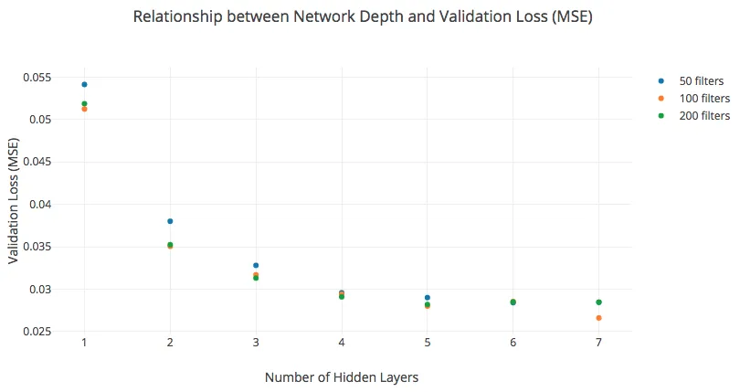

# A Fully Convolutional Neural Network Approach to End-to-End Speech Enhancement

###### Abstract

This paper will describe a novel approach to the cocktail party problem
that relies on a fully convolutional neural network (FCN) architecture.
The FCN takes noisy audio data as input and performs nonlinear,
filtering operations to produce clean audio data of the target speech at
the output. Our method learns a model for one specific speaker, and is
then able to extract that speakers voice from babble background noise.

Results from experimentation indicate the ability to generalize to new
speakers and robustness to new noise environments of varying
signal-to-noise ratios. A potential application of this method would be
for use in hearing aids. A pre-trained model could be quickly fine tuned
for an individuals family members and close friends, and deployed onto a
hearing aid to assist listeners in noisy environments.

|                                            |
| ------------------------------------------ |
| Frank Longueira, Sam Keene                 |
| The Cooper Union                           |
| franklongueira@gmail.com, keene@cooper.edu |

Index Terms—  speech enhancement, end-to-end, convolutional neural
networks, signal processing, hearing aid

## 1 Introduction

One of the largest issues facing hearing impaired individuals in their
day-to-day lives is accurately recognizing speech in the presence of
background noise \[1\]. While modern hearing aids do a good job of
amplifying sound, they do not do enough to increase speech quality and
intelligibility. This is not a problem in quiet environments, but a
standard hearing aid that simply amplifies audio will fail to provide
the user with a signal they can easily understand when the user is in a
noisy environment \[2\]. The problem of speech intelligibility is even
more difficult if the background noise is also speech, such as in a bar
or restaurant with many patrons.

While people without hearing impairments usually have no trouble
focusing on a single speaker out of multiple, it is a much more
difficult task for people with a hearing impairment \[3\]. The problem
of picking out one person’s speech in an environment with many speakers
was dubbed the cocktail party problem \[4\]. The paper asserts that
humans are normally capable of separating multiple speakers and focusing
on a single one. However, hearing impaired individuals may have issues
when it comes to performing this same task. A solution to the cocktail
party problem would be an algorithm that a computer can employ in
real-time to enhance the speech corrupted by babble (background noise
from other speakers). Traditionally, the cocktail party problem has been
approached using several different techniques, such as using microphone
arrays, monaural algorithms involving signal processing techniques, and
Computational Auditory Scene Analysis (CASA) \[1\].

Deep learning approaches to the cocktail party problem and speech
enhancement in general tend to take noisy spectrograms as input and
transform them to clean spectrograms. The use of deep convolutional
neural networks and deep denoising autoencoders on spectrograms have
proven to be powerful techniques in practice \[5\]. One drawback to the
use of spectrograms as input is the computation of spectrograms tends to
be high since the short-time Fourier transform has to be applied to the
raw audio data. This prior computation before inputting into the network
requires time and hence increases the difficulty of use in real-time
applications. In addition, phase information of the input speech tends
to be lost in many of these approaches since only the magnitude spectrum
is used. This can cause degradation in quality at the output of the
system \[6\].

More recent deep learning approaches have considered an end-to-end
approach to speech enhancement that requires no feature extraction
\[7\] - \[9\]. The noisy time-domain audio signal is used as the input
to a neural network and a filtered time-domain audio signal is obtained
at the output. This methodology removes the need for a prior STFT
computation and retains phase information at the output. This recent
push in the deep learning community towards end-to-end speech
enhancement systems is one of the motivations for this paper’s approach.
The other large motivation comes from two papers dealing with the study
of CNNs on raw audio data. In the first paper \[10\], the authors make a
strong case for the lack of need for fully connected layers in a neural
network that processes raw audio data at the input. Instead, they
recommend the use of convolutional layers in order to maintain local
correlations in the signal as it passes through the network. In
addition, a fully convolutional network (i.e. a CNN with no fully
connected layers) will generally have much fewer parameters than a
correspondingly similar network that includes fully connected layers.
This reduced model complexity is especially important for real-time
application of the speech enhancement algorithm. In the second paper
\[11\], the authors provide insight into the inner workings of
convolutional layers applied to raw audio data. They make a strong case
for the lack of need for pooling layers and emphasize the convolution
theorem:

```math
\displaystyle x*h=\mathcal{F}^{-1}\{\mathcal{F}\{x\}\cdot\mathcal{F}\{h\}\} \tag{1}
```

where $`x`$ can be viewed as the input audio signal, $`h`$ is a learned
filter, and $`\mathcal{F}`$ is the Fourier transform operator. The
convolution theorem allows an FCN to be viewed as a large, nonlinear
filter bank. By maintaining the size of the raw audio input vector
throughout intermediary computations, each filter’s output can be viewed
as providing a nonlinear filtered representation of the input vector. As
the depth of the FCN increases, a larger number of nonlinear filtered
representations is achieved. At the final filtering layer, these
representations are combined in a matter that rids the input signal of
the background noise representations and only keeps the target speech
representations. With the motivation of the approach in mind, the next
section will provide specific details of the system design.

## 2 System Design

The first step in designing the speech enhancement system is gathering
data for training and validation purposes. An openly available audiobook
(narrated by a speaker named Pamela) found online serves as the target
speech for designing the system \[12\]. In addition, babble noise audio
clips were found online to serve as background noise when additively
combined to Pamela’s speech \[13\] - \[14\]. All of these audio clips
were downsampled to 16 kHz and to have only one audio channel (taking
the element-wise average of the two channels if necessary). Table 1
concisely describes this data and how it is split for training and
validation.

|                | Target Speech | Babble Noise | SNR  | Time (Min:Sec) |
| -------------- | ------------- | ------------ | ---- | -------------- |
| Training Set   | Chapter 1     | Bar Noise    | 5 dB | 35:37          |
| Validation Set | Chapter 2     | Cafe Noise   | 5 dB | 5:04           |

Table 1: Data collection and splitting for system design purposes.
Target speech refers to Pamela’s narration of Chapters 1 - 2 in \[12\].
Babble noise refers to two different environments found online \[13\] -
\[14\]. Each set of target speech is additively combined with its
corresponding set of babble noise at an SNR of 5 dB.

It is important to note that the system is being designed around a
single speaker (i.e. Pamela) and a single SNR of 5 dB. The reason for
doing this is to first find a few reasonable FCN architectures for the
task of denoising Pamela’s speech that has been corrupted by babble
noise at an SNR of 5 dB. After choosing a subset of FCN architectures,
further exploration will be done for denoising Pamela’s speech at SNRs
of 0 dB and -5 dB in order to choose one FCN architecture for the
system. Once a single FCN architecture is selected and fixed, the next
step will involve exploring generalization to a new speaker and the
system’s robustness to different signal-to-noise ratios.

Having decided on training and validation data, designing the system
relies on three main things: (1) a methodology for pre-processing the
raw audio data for input into the FCN, (2) fixing an FCN architecture,
(3) a methodology for post-processing the raw audio data that is output
by the FCN. To begin, let’s discuss (1). First, target speech is
additively combined with its corresponding babble noise. Next, based on
stationarity assumptions for speech, the noisy audio data is split into
20 ms frames in which consecutive frames overlap by 50%. Each noisy
frame is to be multiplied by a corresponding Hanning window of equal
length. To complete the pre-processing methodology, for each noisy frame
the mean of the entire training target speech is element-wise subtracted
and standard deviation of the entire training target speech is
element-wise divided. Having fixed the methodology for pre-processing,
the methodology for post-processing, (3), can also be fixed if it is
assumed the FCN outputs a preprocessed filtered 20 ms frame of the
preprocessed noisy 20 ms input frame. Given an output frame from the
FCN, it is element-wise multiplied by the standard deviation of the
entire training target speech and the mean of the entire training target
speech is added element-wise. Next, the output from the FCN for the next
frame (keeping in mind that these two consecutive frames overlap by 50%)
is obtained and the same thing is done. Finally, the overlap-add method
of reconstruction is applied to undo the Hanning window that was applied
to both overlapping frames. This results in having reconstructed 30 ms
of filtered raw audio data that is ready for playback. This
post-processing methodology can be iteratively done for an arbitrary
amount of noisy input audio data. The most important part of the system
design is (2), fixing an FCN architecture.

Since a fully convolutional neural network contains only convolutional
layers, the only things to be determined are how deep the network needs
to be and the details of each layer (i.e. number of filters, kernel
size, etc.). The output of the network is to be a one dimensional vector
of the same length as the 20 ms input vector, so two things can be
immediately concluded upon. The first conclusion is to use “same”
padding in all layers to ensure the temporal length of the input vector
remains the same throughout intermediary computations and therefore at
the output. This allows the FCN to be viewed as a nonlinear, filter
bank. The second conclusion is the output layer will be a convolutional
layer with one filter and no activation function. This output layer is
suitable for reconstructing audio data from its nonlinear
representations (i.e. the output layer is able to match the range in
which audio data exists) and allows for an output that is
one-dimensional. Next, the kernel size for all filters in the network
will initially be fixed at 5 ms in length, i.e. 25% of the input size.
This can be tuned later on via the validation set. In addition, a
dilation factor will not be used in any convolutional layer in order to
better preserve local correlations. The structure of each hidden layer
will be the following: convolution operation, batch normalization, and
ReLU (or PReLU) activation. Batch normalization between the convolution
operation and activation function tends to improve training time and
generalization performance \[17\]. Also, the ReLU (or PReLU) activation
tends to work well in general CNN practice \[15\]. With all of this
covered, the only thing left to determine is how many hidden layers are
necessary and how many filters per hidden layer. These hyperparameters
will be determined by training different FCN architectures and comparing
MSE performance on the validation set. All models to follow are
supervised trained with Adam SGD to minimize MSE \[16\]. In addition,
all training employs early stopping that terminates after 20 epochs of
no improvement and returns the parameters of the model with best
validation loss during training.

To begin, an architecture with one hidden layer is trained to find the
number of filters needed in a layer. The number of filters is slowly
increased and with each new number of filters a model is trained and
validation loss computed. This process provides an understanding of how
much complexity, in terms of number of filters per layer, is needed for
this task.

| Number of Filters | Training MSE | Validation MSE |
| ----------------- | ------------ | -------------- |
| 50                | 0.0401       | 0.0541         |
| 100               | 0.0384       | 0.0512         |
| 200               | 0.0398       | 0.0519         |
| 300               | 0.0383       | 0.0504         |
| 400               | 0.0372       | 0.0496         |
| 500               | 0.0377       | 0.0490         |
| 600               | 0.0381       | 0.0504         |
| 700               | 0.0384       | 0.0503         |
| 800               | 0.0375       | 0.0507         |
| 900               | 0.0391       | 0.0497         |
| 1000              | 0.0373       | 0.0498         |

Table 2: This table describes training loss & validation loss (MSE) of
single hidden layer FCN architectures as the number of filters
increases.

Table 2 shows that increasing the number of filters marginally helps
reduce training loss and validation loss. With this result, a similar
procedure will be followed to gain an understanding of how the depth of
the network improves performance. The procedure involves first fixing
the number of filters to be either 50, 100, or 200 filters per layer and
then the depth of the network is increased.



Fig. 1: A plot that shows increasing network depth leads to large
decreases in validation loss. Each curve was generated by fixing the
number of filters per hidden layer (either 50, 100, or 200) and
increasing the number of hidden layers in the network.

From Figure 1, it can be concluded that increasing depth largely helps
decrease validation loss as compared to increasing the number of filters
in a given layer. With the knowledge that between 1 to 200 filters in a
layer and a depth of 5 to 6 layers tends to provide good validation
loss, different network architectures are experimented with within this
range. Architectures with different kernel sizes, activation functions,
number of filters and regularization were experimented with with the
goal of minimizing validation loss. Over 70 FCN architectures were
trained and validated in total. From the over 70 FCN architectures, the
top 13 FCN architectures that provide the lowest validation loss are
taken to be studied further. The PESQ and WER of the filtered validation
set is computed for each of the 13 architectures and compared to the
PESQ and WER of the noisy validation set (at an SNR of 5 dB) \[19\] -
\[20\]. These results are displayed in Table 3.

Table 4 presents the architecture from Table 3 (Model \#53) that
provided the best combination of high validation PESQ (good speech
quality), low validation WER (good intelligibility), and sufficient
model complexity for learning across different SNRs. This FCN
architecture will be used for testing the speech enhancement system. The
next section will present results related to testing the system on new
audio data in order to measure its ability to generalize on the same
speaker.

| Model \# | Number of Parameters | PESQ  | WER     |
| -------- | -------------------- | ----- | ------- |
| 25       | 3,218,501            | 2.470 | 29.001% |
| 26       | 12,837,001           | 2.445 | 28.591% |
| 27       | 1,009,501            | 2.390 | 26.402% |
| 30       | 1,209,751            | 2.441 | 31.464% |
| 31       | 4,819,501            | 2.490 | 31.737% |
| 33       | 2,142,896            | 2.421 | 28.728% |
| 38       | 5,867,728            | 2.452 | 29.001% |
| 41       | 4,682,896            | 2.422 | 28.454% |
| 53       | 2,266,736            | 2.458 | 25.718% |
| 64       | 761,251              | 2.437 | 29.275% |
| 69       | 761,501              | 2.443 | 27.633% |
| 70       | 1,562,101            | 2.451 | 29.412% |
| 71       | 841,251              | 2.480 | 27.223% |

Table 3: Number of parameters, PESQ, and WER of top 13 FCN architectures
in terms of validation loss. The specific details of each architecture
are removed for brevity. For comparison, the noisy validation set at an
SNR of 5 dB has a PESQ of 1.764 and WER of 50.479%.

| Layer Type          | Output Shape | Number of Parameters |
| ------------------- | ------------ | -------------------- |
| 1-D Convolution     | (320, 12)    | 972                  |
| Batch Normalization | (320, 12)    | 48                   |
| PReLU Activation    | (320, 12)    | 3,840                |
| 1-D Convolution     | (320, 25)    | 24,025               |
| Batch Normalization | (320, 25)    | 100                  |
| PReLU Activation    | (320, 25)    | 8,000                |
| 1-D Convolution     | (320, 50)    | 100,050              |
| Batch Normalization | (320, 50)    | 200                  |
| PReLU Activation    | (320, 50)    | 16,000               |
| 1-D Convolution     | (320, 100)   | 400,100              |
| Batch Normalization | (320, 100)   | 400                  |
| PReLU Activation    | (320, 100)   | 32,000               |
| 1-D Convolution     | (320, 200)   | 1,600,200            |
| Batch Normalization | (320, 200)   | 800                  |
| PReLU Activation    | (320, 200)   | 64,000               |
| 1-D Convolution     | (320, 1)     | 16,001               |

Table 4: A layer-by-layer description of the speech enhancement system’s
FCN architecture (Model \#53 from Table 3).

## 3 Testing Generalization on the Same Speaker

The first part of testing involves training the speech enhancement
system on a speaker and testing it on the same speaker, but the speech
will have never been seen by the system nor the babble environment.
First, the speech enhancement system trained and validated from the
previous section, i.e. using the model from Table 4 as the FCN
architecture, is used for testing. Five minutes from Chapter 3 from
\[12\] will be used as the test target speech and five minutes of a new
babble environment \[18\] will be used for the test background noise. To
make sure the testing procedure is clear, consider the following
walkthrough of the process.

First, using the training setup of the previous section, the speech
enhancement system is trained using Chapter 1 from \[12\] and bar babble
noise from \[13\] at a specific SNR, say 5 dB. The training process
employs early stopping that uses 5 minutes from Chapter 2 from \[12\]
and 5 minutes of cafe babble noise from \[14\] at the same SNR. Next,
the trained system is tested on 5 minutes from Chapter 3 in \[12\] and 5
minutes of coffee shop babble noise from \[18\] at the same SNR (i.e. 5
dB), but also at 0 dB and -5 dB to get a measure of the system’s
robustness across SNRs. This process is repeated for an SNR of 0 dB and
an SNR of -5 dB. Tables 5 & 6 report the results of this process.

|              | Testing SNR    |                |                |
| ------------ | -------------- | -------------- | -------------- |
|              | 5 dB           | 0 dB           | -5 dB          |
| Training SNR |                |                |                |
|      5 dB    | 2.478          | 1.917          | 1.350          |
|      0 dB    | 2.530          | 2.100          | 1.461          |
|       -5 dB  | 2.379          | 2.060          | 1.482          |
|              | (Noisy: 1.782) | (Noisy: 1.444) | (Noisy: 1.321) |

Table 5: This table presents PESQ test results across different SNRs for
testing on the same speaker. Each row represents the SNR that the speech
enhancement system was trained at. Each column represents the SNR of the
test set. For reference, the PESQ of the noisy test set is included for
each SNR.

|              | Testing SNR      |                  |                  |
| ------------ | ---------------- | ---------------- | ---------------- |
|              | 5 dB             | 0 dB             | -5 dB            |
| Training SNR |                  |                  |                  |
|      5 dB    | 25.243%          | 60.888%          | 94.868%          |
|      0 dB    | 31.900%          | 58.391%          | 91.817%          |
|       -5 dB  | 52.705%          | 77.531%          | 94.452%          |
|              | (Noisy: 43.689%) | (Noisy: 86.269%) | (Noisy: 97.503%) |

Table 6: This table presents WER test results across different SNRs for
testing on the same speaker. Each row represents the SNR the speech
enhancement system was trained at. Each column represents the SNR of the
test set. For reference, the WER of the noisy test set is included for
each SNR.

Tables 5 & 6 provide some interesting insights into the generalizability
of the speech enhancement system. The first key insight is that both
PESQ and WER on the test set do a good job tracking the results for PESQ
and WER seen on the validation set. The other key insight is that the
speech enhancement system trained at 0 dB is quite robust across SNRs,
sometimes doing better in scenarios one would not expect. With promising
results from testing on the same speaker, the second part of testing
will study generalizability to a new speaker.

## 4 Testing Generalization on a New Speaker

The second part of testing will employ the same methodology as the first
part of testing but the target speech will come from a new speaker.
Audio data is acquired for a new speaker (specifically another female
speaker by the name of Tricia) via another audiobook \[21\]. First,
performance will be measured when the speech enhancement system is
trained only on the speaker Pamela (as has been done up to this point)
and tested on the speaker Tricia. All trained models (i.e. at each
specific SNR) from the first part of testing are used again in the
second part of testing. These trained models filter 5 minutes of speech
from Chapter 1 of \[21\] corrupted by the same coffee shop babble noise
\[18\] at SNRs of -5, 0, and 5 dB. Tables 7 & 8 report the results of
this process.

|              | Testing SNR    |                |                |
| ------------ | -------------- | -------------- | -------------- |
|              | 5 dB           | 0 dB           | -5 dB          |
| Training SNR |                |                |                |
|      5 dB    | 2.215          | 1.781          | 1.291          |
|      0 dB    | 2.171          | 1.839          | 1.382          |
|       -5 dB  | 2.229          | 1.876          | 1.437          |
|              | (Noisy: 1.874) | (Noisy: 1.471) | (Noisy: 1.182) |

Table 7: This table presents PESQ test results across different SNRs for
training on one speaker and testing on a new speaker.

|              | Testing SNR      |                  |                  |
| ------------ | ---------------- | ---------------- | ---------------- |
|              | 5 dB             | 0 dB             | -5 dB            |
| Training SNR |                  |                  |                  |
|      5 dB    | 25.134%          | 54.545%          | 89.037%          |
|      0 dB    | 29.412%          | 50.401%          | 84.358%          |
|       -5 dB  | 55.615%          | 67.380%          | 89.305%          |
|              | (Noisy: 33.556%) | (Noisy: 72.326%) | (Noisy: 94.652%) |

Table 8: This table presents WER test results across different SNRs for
training on one speaker and testing on a new speaker.

When comparing Tables 5 & 6 with Tables 7 & 8, it is noticed that
performance on the new speaker is good but does not quite track the
performance of a system trained on a speaker and then tested on that
same speaker. It is hypothesized that fine-tuning the parameters of the
trained network with a few minutes of data from the new speaker should
improve performance and more closely track performance on the same
speaker. Therefore, an additional, disjoint 5 minutes of speech from
Chapter 1 of \[21\] corrupted by 5 minutes of cafe babble noise from
\[14\] at a given SNR is used to fine-tune the already trained model
(i.e. trained on the speaker Pamela) by doing 5 epochs of gradient
descent. The resulting trained model is then used to again filter 5
minutes of speech from Chapter 1 of \[21\] corrupted by the same coffee
shop babble noise \[18\] at SNRs of -5, 0, and 5 dB. Tables 9 & 10
report the results of this process.

|              | Testing SNR    |                |                |
| ------------ | -------------- | -------------- | -------------- |
|              | 5 dB           | 0 dB           | -5 dB          |
| Training SNR |                |                |                |
|      5 dB    | 2.417          | 1.953          | 1.442          |
|      0 dB    | 2.378          | 2.025          | 1.571          |
|      -5 dB   | 2.283          | 2.026          | 1.619          |
|              | (Noisy: 1.874) | (Noisy: 1.471) | (Noisy: 1.182) |

Table 9: This table presents PESQ test results across different SNRs for
training on one speaker, fine-tuning on a new speaker, and then testing
on that new speaker.

|              | Testing SNR      |                  |                  |
| ------------ | ---------------- | ---------------- | ---------------- |
|              | 5 dB             | 0 dB             | -5 dB            |
| Training SNR |                  |                  |                  |
|      5 dB    | 21.791%          | 45.588%          | 87.166%          |
|      0 dB    | 28.342%          | 40.909%          | 76.337%          |
|       -5 dB  | 58.690%          | 79.813%          | 81.684%          |
|              | (Noisy: 33.556%) | (Noisy: 72.326%) | (Noisy: 94.652%) |

Table 10: This table presents WER test results across different SNRs for
training on one speaker, fine-tuning on a new speaker, and then testing
on that new speaker.

When comparing Tables 5 & 6 with Tables 9 & 10, it is noticed that
performance on the new speaker now does a good job tracking the
performance of a system trained on a speaker then tested on that same
speaker. This helps verify the initial hypothesis and it can be
concluded that the speech enhancement system trained at 0 dB is able to
generalize to new speakers (via fine-tuning) and is markedly robust
across different SNRs.

## 5 Conclusions & Future Work

A fully convolutional neural network based end-to-end speech enhancement
system that serves as a solution to the famous cocktail party problem
has been presented. An ability to generalize to new speakers is
presented by fine-tuning of the system with limited data. Test results
show that the system is robust to different babble noise environments of
varying SNRs. This speech enhancement system shows promising results
objectively, using PESQ and WER measures, and subjectively by listening
to the filtered audio. A few questions to consider for future research
pertaining to this speech enhancement system are presented below:

1\) What is the optimal model complexity for the task?  
2) Does the system continue to generalize well to new environments and
speakers?  
3) What is the minimal computational/storage complexity needed to employ
this system in real-time?

## References

- \[1\] E. Healy, et al., “An Algorithm to Improve Speech Recognition
  in Noise for Hearing-Impaired Listeners.”The Journal of the Acoustical
  Society of America, vol. 134, no. 4, 2013, pp. 30293038.,
  doi:10.1121/1.4820893.
- \[2\] H. Dillon, Hearing Aids. Thieme, 2012.
- \[3\] J. Mcdermott, “The Cocktail Party Problem.” Current Biology,
  vol. 19, no. 22, 2009, doi:10.1016/j.cub.2009.09.005.
- \[4\] C. Cherry, “Some Experiments on the Recognition of Speech, with
  One and with Two Ears” (PDF). The Journal of the Acoustical Society of
  America., 1953, 25 (5): 97579. doi:10.1121/1.1907229.
- \[5\] Simpson, and Andrew J. R., “Deep Transform: Cocktail Party
  Source Separation via Complex Convolution in a Deep Neural Network.”
  12 Apr. 2015, arxiv.org/abs/1504.02945
- \[6\] K. Paliwal, et al., “The Importance of Phase in Speech
  Enhancement.” Speech Communication, vol. 53, no. 4, 2011, pp. 465494.,
  doi:10.1016/j.specom.2010.12.003.
- \[7\] T. Sainath, R. Weiss, et al., “Learning the speech front-end
  with raw waveform cldnns.” In Sixteenth Annual Conference of the
  International Speech Communication Association, 2015.
- \[8\] G. Trigeorgis, F. Ringeval, et al., “Adieu features? End-to-end
  speech emotion recognition using a deep convolutional recurrent
  network.” In Acoustics, Speech and Signal Processing (ICASSP), 2016
  IEEE International Conference, pp. 52005204. IEEE, 2016.
- \[9\] J. Thickstun, Z. Harchaoui, and S. Kakade, “Learning features
  of music from scratch”. arXiv preprint arXiv:1611.09827, 2016.
- \[10\] S. Fu, et al, “Raw Waveform-Based Speech Enhancement by Fully
  Convolutional Networks.” 2017 Asia-Pacific Signal and Information
  Processing Association Annual Summit and Conference (APSIPA ASC),
  2017, doi:10.1109/apsipa.2017.8281993.
- \[11\] Y. Gong and C. Poellabauer, “How do deep convolutional neural
  networks learn from raw audio waveforms?”, 2018, Available:
  https://openreview.net/forum?id=S1Ow_eRb
- \[12\] J. McCharthy, A History of the Four Georges., Vol. 1,
  Audiobook Available:
  librivox.org/a-history-of-the-four-georges-volume-1-by-justin-mccarthy/.
  Narrator: Pamela Nagami
- \[13\] “BAR CROWD for 3 Hours Sound Effect.” YouTube, 10 Oct. 2013,
  www.youtube.com/watch?v=bCnJoaXYFGg.
- \[14\] “The Noise Cafe 2 hours.” YouTube, 28 Apr. 2012,
  www.youtube.com/watch?v=KZV9FmHOsRg.
- \[15\] I. Goodfellow, et al., Deep Learning. MIT Press, 2016.
  Available online: http://www.deeplearningbook.org/
- \[16\] D. P. Kingma and J. Ba, “Adam: A Method for Stochastic
  Optimization,” CoRR, vol. abs/1412.6980, 2014. \[Online\]. Available:
  http://arxiv.org/abs/1412.6980
- \[17\] S. Ioffe and C. Szegedy, “Batch Normalization: Accelerating
  Deep Network Training by Reducing Internal Covariate Shift,” CoRR,
  vol. abs/1502.03167, 2015. \[Online\]. Available:
  http://arxiv.org/abs/1502.03167
- \[18\] “Coffee Shop Sounds Background Noise For Work.” YouTube, 23
  Mar. 2016, www.youtube.com/watch?v=jBNoFk03vWk.
- \[19\] Rix, A.W., et al., “Perceptual evaluation of speech quality
  (PESQ) - a new method for speech quality assessment of telephone
  networks and codecs.” 2001 IEEE International Conference on Acoustics,
  Speech, and Signal Processing. Proceedings (Cat. No.01CH37221),
  doi:10.1109/icassp.2001.941023.
- \[20\] A. Morris, et al., “From WER and RIL to MER and WIL: improved
  evaluation measures for connected speech recognition.” Institute of
  Phonetics at Saarland University, Germany.
- \[21\] M. Twain, The \$30,000 Bequest and Other Stories., Audiobook
  Available:
  librivox.org/30000-bequest-and-other-stories-by-mark-twain/, Narrator:
  Tricia G.
