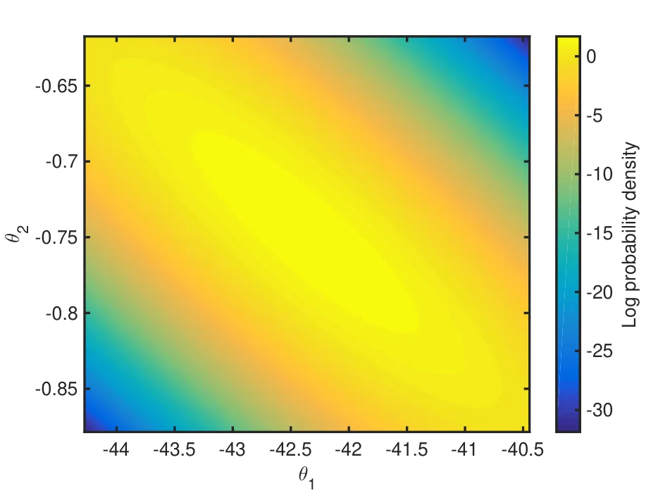
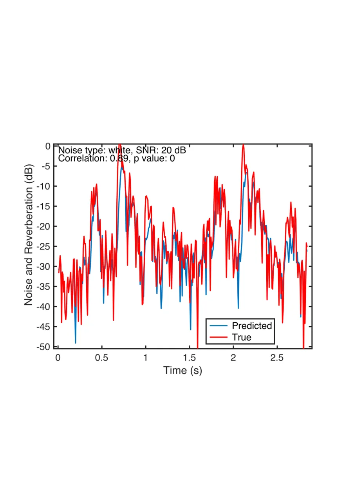
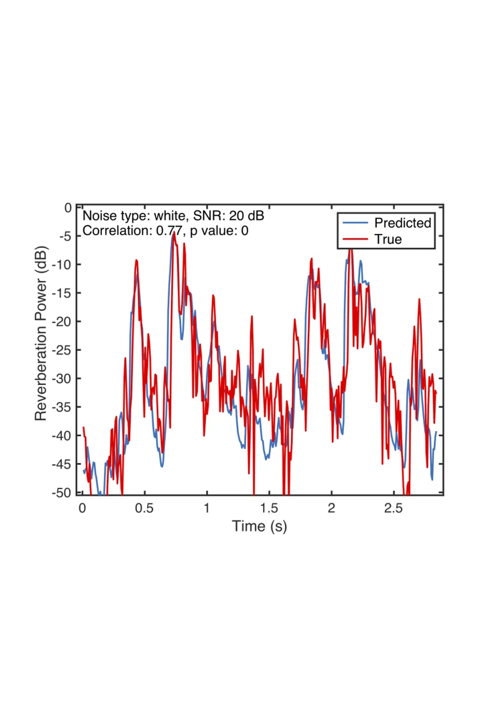

# Modulation-Domain Kalman Filtering for Monaural Blind Speech Denoising and Dereverberation

N. Dionelis   
https://www.commsp.ee.ic.ac.uk/~sap/people-nikolaos-dionelis/    M.
Brookes    Member    IEEE

###### Abstract

We describe a monaural speech enhancement algorithm based on
modulation-domain Kalman filtering to blindly track the time-frequency
log-magnitude spectra of speech and reverberation. We propose an
adaptive algorithm that performs blind joint denoising and
dereverberation, while accounting for the inter-frame speech dynamics,
by estimating the posterior distribution of the speech log-magnitude
spectrum given the log-magnitude spectrum of the noisy reverberant
speech. The Kalman filter update step models the non-linear relations
between the speech, noise and reverberation log-spectra. The Kalman
filtering algorithm uses a signal model that takes into account the
reverberation parameters of the reverberation time, $`T_{60}`$, and the
direct-to-reverberant energy ratio (DRR) and also estimates and tracks
the $`T_{60}`$ and the DRR in every frequency bin in order to improve
the estimation of the speech log-magnitude spectrum. The Kalman
filtering algorithm is tested and graphs that depict the estimated
reverberation features over time are examined. The proposed algorithm is
evaluated in terms of speech quality, speech intelligibility and
dereverberation performance for a range of reverberation parameters and
SNRs, in different noise types, and is also compared to competing
denoising and dereverberation techniques. Experimental results using
noisy reverberant speech demonstrate the effectiveness of the
enhancement algorithm.

###### Index Terms:

Speech enhancement, dereverberation, Kalman filter, minimum mean-square
error (MMSE) estimator.

N. Dionelis and M. Brookes are with the Department of Electrical and
Electronic Engineering, Imperial College London, London SW7 2AZ, U.K.
(e-mail: nikolaos.dionelis11@imperial.ac.uk;
mike.brookes@imperial.ac.uk).

## I Introduction

Nowadays, technology is ever evolving with tremendous haste and the
demand for speech enhancement systems is evident. Speech enhancement in
noisy reverberant environments, for human listeners, is challenging.
Speech is degraded by noise and reverberation when captured using a
near-field or far-field distant microphone \[1\] \[2\]. A room impulse
response (RIR) can include components at long delays, hence resulting in
reverberation and echoes \[3\] \[4\]. Reverberation is a convolutive
distortion that can be quite long with a reverberation time, $`T_{60}`$,
of more than $`0.8`$ s. Due to convolution, reverberation induces
long-term correlation between consecutive observations. Reverberation
and noise, which can be stationary or non-stationary, have a detrimental
impact on speech quality and intelligibility. Reverberation, especially
in the presence of non-stationary noise, damages the intelligibility of
speech.

The direct to reverberant energy ratio (DRR) and the reverberation time,
$`T_{60}`$, are the two main parameters of a reverberation model \[5\]
\[1\]. The DRR describes reverberation in the space domain, depending on
the positions of the sound source and the receiver. The $`T_{60}`$ is
the time interval required for a sound level to decay $`60`$ dB after
ceasing its original stimulus. The reverberation time, when measured in
the diffuse sound field, is independent of the source to microphone
configuration and mainly depends on the room. The impact of
reverberation on auditory perception depends on the $`T_{60}`$. If the
$`T_{60}`$ is short, the environment reinforces the sound which may
enhance the sound perception \[6\] \[7\]. On the contrary, if the
$`T_{60}`$ is long, spoken syllables interfere with future spoken
syllables. Reverberation spreads energy over time and this smearing
across time has two effects: (a) the energy of individual phonemes
spreads out in time and, hence, plosives have a delayed decay and
fricatives are smoothed, and (b) preceding phonemes blur into the
current phonemes.

The aim of speech enhancement is to reduce and ideally eliminate the
effects of both noise and reverberation without distorting the speech
signal \[8\]. Enhancement algorithms typically aim to suppress noise and
late reverberation because early reverberation is not perceived as
separate sound sources and usually improves the quality and
intelligibility of speech. Noise is assumed to be uncorrelated with
speech, early reverberation is correlated with speech and late
reverberation is commonly assumed to be uncorrelated with speech \[9\]
\[6\].

Speech enhancement can be performed in different domains. The ideal
domain should be chosen such that (a) good statistical models of speech
and noise exist in this domain, and (b) speech and noise are separable
in this domain. Speech and noise are additive in the time domain and the
Short Time Fourier Transform (STFT) domain \[10\] \[11\]. The relation
between speech and noise becomes progressively more complicated in the
amplitude, power and log-power spectral domains. Noise suppression
algorithms usually operate in a time-frequency STFT domain and these
techniques have been extended to address dereverberation. In \[9\],
spectral enhancement methods based on a time-frequency gain, originally
developed for noise suppression, have been modified and employed for
dereverberation. Such algorithms suppress late reverberation assuming
that the early and late reverberation components are uncorrelated. The
spectral enhancement methods in \[12\] \[9\] estimate the late
reverberant spectral variance (LRSV) and use it in the place of the
noise spectral variance, reducing the problem of late reverberation
suppression to that of estimating the LRSV \[6\]. In \[7\], blind
spectral weighting is employed to reduce the overlap-masking effect of
reverberation using an uncorrelated and additive assumption for late
reverberation.

Dereverberation algorithms that leave the phase unaltered and operate in
the amplitude, power or log-power spectral domains are relatively
insensitive to minor variations in the spatial placement of sources
\[13\]. Two criticisms of spectral enhancement algorithms based on LRSV
reverberation noise estimation are that they introduce musical noise and
suppress speech onsets when they over-estimate reverberation \[14\]. The
LRSV estimator in \[15\], which is a continuation of \[6\], models the
RIR in the STFT domain and not in the time domain \[6\] \[16\], using
the same model of the RIR that is attributed to J. Polack or J. Moorer
\[16\]. Reverberation is estimated in \[15\] considering the STFT energy
contribution of the direct path of speech and an external $`T_{60}`$
estimate.

Modelling the speech temporal dynamics is beneficial when the $`T_{60}`$
is long and the DRR is low \[17\] \[2\]. Joint denoising and
dereverberation using speech and noise tracking is performed in \[17\].
The SPENDRED algorithm \[18\] \[19\], which is a model-based method with
a convolution model for reverberation based on the $`T_{60}`$ and the
DRR, considers the speech temporal dynamics. SPENDRED employs a
parametric model of the RIR \[20\] and performs frequency-dependent and
time-varying $`T_{60}`$ and DRR estimation. However, unless the source
or the microphone are moving, the $`T_{60}`$ and the DRR will be
constant throughout the recording. The SPENDRED algorithm assumes that
$`\text{DRR}\geq 1-(10^{-6})^{\frac{L}{T_{60}}}`$ where $`L`$ is the
acoustic frame increment. For example, when $`T_{60}=0.4`$ s and $`L=5`$
ms, then $`\text{DRR}\geq-8`$ dB is assumed. In addition, SPENDRED
performs intra-frame correlation modelling, which can be beneficial in
adverse conditions, while typical algorithms decouple different
frequency dimensions \[10\].

Statistical-based models, such as the SPENDRED algorithm, describe
reverberation by a convolution in the power spectral domain while LRSV
models describe reverberation as an additive distortion in the power
spectral domain \[20\] \[21\]. A model with an infinite impulse response
is used either with the two parameters of the $`T_{60}`$ and the DRR, as
in \[18\] \[19\], or with a finite number of parameters. The
infinite-order convolution model of reverberation with the $`T_{60}`$
and the DRR is sparse and contrasts with the higher-order autoregressive
processes in the complex STFT domain, used in \[22\] \[23\].

The algorithms described in \[24\], \[20\] and \[21\] create non-linear
observation models of noisy reverberant speech in the log Mel-power
spectral domain, using the reverberation-to-noise ratio (RNR). As
discussed in \[25\], phase differences in Mel-frequency bands have
different properties from phase differences in STFT bins. The phase
factor between reverberant speech and noise is different from that
between speech and noise \[24\]. In \[20\], the phase factor between
reverberant speech and noise in Mel-frequency bands is examined.

In noisy reverberant conditions, finding the onset of speech phonemes
and determining which frames are unvoiced/silence is difficult, due to
the smearing across time, often leading to noise over-estimation. The
concatenation of different techniques for denoising and dereverberation
has lower performance than unified methods due to over-estimating noise
when estimating noise and reverberation separately \[17\] \[26\].

Despite the claim that it is inefficient to perform a two step procedure
that is comprised of denoising followed by dereverberation \[17\]
\[26\], long-term linear prediction with pre-denoising can be used to
suppress noise and reverberation. With the weighted prediction error
(WPE) algorithm \[27\] \[2\], reverberation is represented as a
one-dimensional convolution in each frequency bin. In \[28\], the WPE
algorithm is discussed along with inter-frame correlation. In \[29\],
the WPE algorithm is used in the complex STFT domain performing batch
processing and iteratively estimating, first, the reverberation
prediction coefficients and, then, the speech spectral variance. The WPE
linear filtering approach, which can be employed in the power spectral
domain \[30\] \[31\], takes into account past frames, from the $`3`$-rd
to the $`40`$-th past frame \[29\] \[30\].

This paper presents an adaptive denoising and dereverberation Kalman
filtering framework that tracks the speech and reverberation spectral
log-magnitudes. In this paper, we extend the enhancer in \[32\] to
include dereverberation. Enhancement is performed using a Kalman filter
(KF) to model inter-frame correlations. We use an integrated structure
of two parallel signal models to track speech, reverberation and the
$`T_{60}`$ and DRR reverberation parameters. The $`T_{60}`$ and the DRR
are updated in every frame to improve the estimation of the speech
log-magnitude spectrum. We create an observation model and a series of
non-linear KF update steps performing joint noise and reverberation
suppression by estimating the first two moments of the posterior
distribution of the speech log-spectrum given the noisy reverberant
log-spectrum. The log-spectral domain is chosen, as in \[33\] \[32\],
because good speech models exist in this domain. Modelling spectral
log-amplitudes as Gaussian distributions leads to good speech modelling
in noisy reverberant environments since super-Gaussian distributions
that resemble the log-normal, such as the Gamma \[11\] \[34\], are used
to model the speech amplitude spectrum. Mean squared errors (MSEs) in
the log-spectral domain are a good measure to use for perceptual quality
and speech log-spectra are well modelled by Gaussian distributions, as
in \[35\] and \[36\].

The structure of this paper is as follows. Section II describes the
signal model and Sec. III presents the enhancement algorithm and its
non-linear KF. The implementation and the validation of the algorithm
are in Sec. IV. The algorithm’s evaluation is in Sec. V. Conclusions are
drawn in Sec. VI.

## II Signal model and notation

In the complex STFT domain, the noisy speech, $`Y_{t}(k)`$, is given by
$`Y_{t}(k)=S_{t}(k)+R_{t}(k)+N_{t}(k)`$ where $`S_{t}(k)`$ is the direct
speech component, $`R_{t}(k)`$ is the reverberant speech component and
$`N_{t}(k)`$ is the noise, as for example in \[22\] \[23\]. The
time-frame index is $`t`$ and the frequency bin index is $`k`$. For
clarity, we also define $`Z_{t}(k)=R_{t}(k)+N_{t}(k)`$. We drop the time
and frequency indexes and we obtain $`Y=S+Z=S+R+N`$. We define the
log-magnitude spectrum of $`S`$ as $`s=\log(|S|)`$ and we also define
$`r`$, $`n`$, $`y`$ and $`z`$ similarly.

In the signal model, signal quantities with capital letters, such as
$`S_{t}`$, are complex numbers with magnitude and phase values,
$`|S_{t}|`$ and $`\angle S_{t}`$. In the complex STFT domain, using
$`a_{t},b_{t}\in\mathbb{R}`$, the reverberation signal model is given by

```math
\displaystyle R_{t} \displaystyle=\sqrt{a_{t}}\,R_{t-1}\exp(j\theta_{t})+\sqrt{b_{t}}\,S_{t-1}\exp(j\psi_{t}) \tag{1}
```

```math
\displaystyle=\sum_{\tau=1}^{\infty}\left(\prod_{i=1}^{\tau-1}\left(\sqrt{a_{t-i+1}}\exp(j\theta_{t-i+1})\right)\right.
```

```math
\displaystyle\times\left.\sqrt{b_{t-\tau+1}}S_{t-\tau}\exp(j\psi_{t-\tau+1})\right)\text{,}
```

```math
\displaystyle a_{t}^{\frac{T_{60}}{L}}=10^{-6},\ \ \ \ \ \ \ \ b_{t}=\frac{1-a_{t}}{\text{DRR}} \tag{2}
```

where $`L`$ is the acoustic frame increment. In (1), the factors
$`\exp(j\theta_{t})`$ and $`\exp(j\psi_{t})`$, where $`\theta_{t}`$ and
$`\psi_{t}`$ are uniformly distributed phases, are used. In (2), the DRR
is defined in the power spectral domain \[18\] \[19\] and the $`T_{60}`$
and the DRR are both time and frequency dependent, as described in
\[5\].

The expression in (1) is the convolution model for reverberation; the
most common reverberation model is this single-pole filter that is
described by the pole and zero positions that depend on the $`T_{60}`$
and the DRR \[18\] \[2\]. A convolution of infinite order is used, with
the two parameters of the $`T_{60}`$ and the DRR, to describe
reverberation \[18\] \[19\]. Models that describe reverberation by a
convolution are also discussed in \[20\] \[21\]. The signal model is
defined by (1) and by

```math
\displaystyle Y_{t}=S_{t}+Z_{t},\ \ \ \ \ \ Z_{t}=R_{t}+N_{t}\text{,} \tag{3}
```

```math
\displaystyle\gamma_{t}=0.5\log\left(a_{t}\right),\ \ \delta_{t}=\gamma_{t}+r_{t-1}=\log\left(\sqrt{a_{t}}\left|R_{t-1}\right|\right)\text{,} \tag{4}
```

```math
\displaystyle\beta_{t}=0.5\log\left(b_{t}\right),\ \ \epsilon_{t}=\beta_{t}+s_{t-1}=\log(\sqrt{b_{t}}\left|S_{t-1}\right|) \tag{5}
```

where $`b_{t}>0`$, $`0<a_{t}<1`$ and $`\gamma_{t}<0`$.

Figure 1 shows graphs of $`\beta`$ against $`T_{60}`$ for a fixed DRR
and of $`\beta`$ against DRR for a fixed $`T_{60}`$. If $`\text{DRR}=0`$
dB, then $`b_{t}=1-a_{t}`$. If $`\beta_{t}=0`$, then $`b_{t}=1`$ and
$`\text{DRR}=1-a_{t}`$.

Figure 2 illustrates the flowchart of the signal model. The
reverberation signal model in (1) uses $`\sqrt{a_{t}}`$ and
$`\sqrt{b_{t}}`$ because the $`a_{t}`$ and $`b_{t}`$ reverberation
parameters, in (2), and the DRR are defined in the power spectral
domain, as in \[18\] \[19\]. The $`a_{t}`$ and $`b_{t}`$ parameters are
mapped to $`\gamma_{t}`$ and $`\beta_{t}`$ using (4) and (5). The
signals $`z_{t}`$, $`\delta_{t}`$ and $`\epsilon_{t}`$ are the total
distubance, the old (decaying) reverberation and the new reverberation,
respectively. We note that $`z_{t}`$ is defined in the first paragraph
of this section and that $`\delta_{t}`$ and $`\epsilon_{t}`$ are defined
in (4) and (5).

The signal model of how the reverberation parameters of $`\gamma_{t}`$
and $`\beta_{t}`$ change over time is a random walk model. This is used
in the algorithm’s KF prediction step for $`\gamma_{t}`$ and
$`\beta_{t}`$.

The signal model in Fig. 2 is directly linked to the alternating and
interacting KFs of the enhancement algorithm. The algorithm is a
collection of two KFs, the speech KF and the reverberation KF, that
estimate the speech and reverberation log-amplitude spectra and the
$`\gamma_{t}`$ and $`\beta_{t}`$ reverberation parameters. This KF
algorithm is described in detail in Sec. III.

## III The speech enhancement algorithm

The KF algorithm operates in the log-magnitude spectral domain, tracking
speech and reverberation. Figure 3 depicts the denoising and
dereverberation algorithm that formulates a model of reverberation as a
first-order autoregressive process and propagates the means and
variances of the random variables. Almost all the signals follow a
Gaussian distribution and the distribution of $`s_{t}`$ conditioned on
observations up to time $`\tau`$ is given by
$`p_{s_{t|\tau}}(s)\triangleq p(s_{t}|y_{0},\dots,y_{\tau})=N(s_{t|\tau},\Sigma^{(s)}_{t|\tau})`$.
In Fig. 3, a Gaussian distribution is denoted by its mean,
$`s_{t|\tau}`$.

The core of the algorithm in Fig. 3 is the KF that is defined by the
gray blocks in the flowchart diagram. The non-linear KF estimates and
tracks the posterior distributions of the speech log-magnitude spectrum,
$`s_{t}`$, the reverberation log-magnitude spectrum, $`r_{t}`$, and the
reverberation parameters, $`\gamma_{t}`$ and $`\beta_{t}`$.

The input to the algorithm in Fig. 3 is the noisy reverberant speech in
the time domain. The algorithm’s first step is to perform a STFT and
obtain the signal in the complex STFT domain. The algorithm does not
alter the noisy reverberant phase, $`\angle Y`$, and uses the noisy
reverberant amplitude spectrum, $`|Y|`$, in three ways: in the speech KF
prediction step, in the KF update step and in the noise power modelling.
The main part of the algorithm is the KF and the speech KF state,
$`\textbf{s}_{t}\in\mathbb{R}^{p}`$, is the speech log-spectrum from the
previous $`p`$ frames,

```math
\displaystyle\textbf{s}_{t}=(s_{t}\ s_{t-1}\ \dots\ s_{t-p+1})^{T}\text{.} \tag{6}
```

The speech KF prediction step is based on autoregressive (AR) modelling
on the log-spectrum of pre-cleaned speech \[33\]. The reverberation KF
state is $`r_{t}`$ and the KF states of the reverberation parameters are
$`\gamma_{t}`$ and $`\beta_{t}`$. The KF observation is the noisy
reverberant speech log-spectrum, $`y_{t}`$, which is used in the KF
update step to compute the first two moments of the posterior of the
speech log-spectrum. The mean of the speech log-spectrum posterior is
used together with $`\angle Y`$ to create the enhanced speech signal
using the inverse STFT (ISTFT).

Apart from the speech log-spectrum, the non-linear KF also tracks the
reverberation log-spectrum, $`r_{t}`$, and the $`\gamma_{t}`$ and
$`\beta_{t}`$ reverberation parameters. The KF, as defined by the gray
blocks in Fig. 3, has a speech KF prediction step, a reverberation KF
prediction step and a series of KF update steps. The reverberation KF is
comprised of the blocks “Reverberation KF prediction”, “KF Update” and
“$`\gamma_{t}`$, $`\beta_{t}`$ KF Update”. These three blocks perform
joint denoising and dereverberation and estimate $`s_{t|t}`$ and
$`\Sigma_{t|t}^{\text{(s)}}`$ to enhance noisy reverberant speech.

(a)

(b)

Fig. 1: Plot of $`\beta`$, using $`L=8`$ ms in (2), against: (a)
$`T_{60}`$ when the DRR is $`4`$, $`0`$ and $`-4`$ dB, and (b) DRR when
the $`T_{60}`$ is $`0.2`$, $`0.5`$ and $`0.8`$ s.

Fig. 2: The flowchart diagram of the proposed signal model of the speech
enhancement algorithm. The signal model is defined in (1) and (3).

Fig. 3: The flowchart of the algorithm to suppress noise and
reverberation. For clarity, the signal variances are not included. The
gray blocks constitute the KF that tracks the speech and reverberation
log-spectra and the reverberation parameters. The “KF Update” and
“$`\gamma_{t}`$, $`\beta_{t}`$ KF Update” blocks constitute the
non-linear KF update step that uses the signal model described in Sec.
II.

The structure of the rest of this algorithm description section is as
follows. Sections III.A and III.B present the speech and reverberation
KF prediction steps, respectively. Section III.C describes the KF update
step and Sec. III.D the priors for the $`\gamma_{t}`$ and $`\beta_{t}`$
parameters that are needed so that the KF (a) distinguishes between
speech and reverberation, and (b) does not diverge to non-realistic
$`T_{60}`$ and DRR estimates. Section III.E describes the unshaded
peripheral blocks in Fig. 3.

### III-A The Speech KF Prediction Step

The speech KF prediction step is linear and is related to the “Speech KF
prediction”, “Decorrelate” and “Recorrelate” blocks in Fig. 3. The
speech KF prediction step is described in \[33\] and in \[32\] \[35\]
and is based on conditional distributions to model short-term
dependencies. Decorrelation and recorrelation of the speech KF state in
(6) are performed after and before the speech KF prediction step,
respectively. The decorrelation and recorrelation operations in Fig. 3,
which are performed so that the non-linear KF update step can be
applied, perform vector-matrix and matrix-matrix multiplications for the
speech KF state mean and its covariance matrix, respectively, using
$`\textbf{B}_{t}\in\mathbb{R}^{p\times p}`$ \[34\] \[33\]. The outputs
of the “Decorrelate” block are: (a) the first element of the speech KF
state, and (b) the rest elements of the speech KF state.

The KF prediction step propagates the first and second moments of the
speech KF state \[33\] \[36\]. Inter-frame linear relationships are used
for the speech KF prediction step that uses AR modelling in the
log-magnitude spectral domain. In the speech KF prediction step,
$`\textbf{s}_{t}`$ is predicted as a linear combination of
$`\textbf{s}_{t-1}`$ using the speech AR coefficients that are obtained
from the “Speech AR(p)” block in Fig. 3, which uses pre-cleaned speech
as an input. After the speech KF prediction step, $`\textbf{s}_{t}`$ is
correlated; we decorrelate the speech KF state with a linear
transformation (using $`\textbf{B}_{t}`$) to simplify the KF update step
and impose the observation constraint \[10\]. The KF update step changes
only the first element of the speech KF state and after the KF update
step, recorrelation is applied with a linear transformation (using
$`\textbf{B}_{t}^{-1}`$) to continue the KF recursion.

### III-B The Reverberation KF Prediction Step

The presented algorithm uses a KF prediction step for $`\gamma_{t}`$ and
$`\beta_{t}`$ that assumes that the variance of $`\gamma_{t}`$ and
$`\beta_{t}`$ increases over time, preserving their mean. The KF
algorithm implements a random-walk prediction step, performing the
operations of

```math
\displaystyle\negthinspace\negthinspace\negthinspace\negthinspace\negthinspace\negthinspace\negthinspace\negthinspace\negthinspace\negthinspace\gamma_{t|t-1}^{\prime}=\gamma_{t-1|t-1},\ \ \ \ \ \Sigma_{t|t-1}^{(\gamma^{\prime})}=\Sigma_{t-1|t-1}^{(\gamma)}+Q_{\gamma}, \tag{7}
```

```math
\displaystyle\negthinspace\negthinspace\negthinspace\negthinspace\negthinspace\negthinspace\negthinspace\negthinspace\negthinspace\negthinspace\beta_{t|t-1}^{\prime}=\beta_{t-1|t-1},\ \ \ \ \ \Sigma_{t|t-1}^{(\beta^{\prime})}=\Sigma_{t-1|t-1}^{(\beta)}+Q_{\beta} \tag{8}
```

where $`Q_{\gamma}`$ is a fixed error variance for $`\gamma`$ and
$`Q_{\beta}`$ is a fixed error variance for $`\beta`$. The values used
for the prediction error variances, $`Q_{\gamma}`$ and $`Q_{\beta}`$,
depend on the rate at which the $`T_{60}`$ and the DRR are likely to
change in a real situation.

After the reverberation KF prediction step, the algorithm computes and
imposes priors on $`\gamma_{t}`$ and $`\beta_{t}`$ using
Gaussian-Gaussian multiplication. The internally computed priors for
$`\gamma_{t}`$ and $`\beta_{t}`$ in the “$`\gamma_{t}`$, $`\beta_{t}`$
priors” block in Fig. 3 are explained in Sec. III.D. After imposing the
priors, the outputs are $`\gamma_{t|t-1}`$,
$`\Sigma_{t|t-1}^{(\gamma)}`$ and $`\beta_{t|t-1}`$,
$`\Sigma_{t|t-1}^{(\beta)}`$. We note that a prime diacritic,
$`\prime`$, is used in (7) and (8) to denote quantities before the
priors.

The “Reverberation KF prediction” block in Fig. 3 estimates the first
two moments of the prior distribution of the reverberation spectral
log-amplitude, i.e. $`r_{t|t-1}`$ and its variance. The algorithm
performs a reverberation KF prediction step based on the previous
posterior of both speech and reverberation using the signal model in
(1), where $`a`$ is less than unity and this makes the reverberation KF
prediction step stable.

From (1) and Fig. 2, the STFT-domain reverberation is the sum of two
components arising, respectively, from the reverberation and speech
components of the previous frame. The old reverberation, $`\delta_{t}`$,
and the new reverberation, $`\epsilon_{t}`$, are defined in (4) and (5),
respectively. The KF algorithm calculates the prior distributions of
these two components in the log-amplitude spectral domain using
$`\delta_{t|t-1}=\gamma_{t|t-1}+r_{t-1|t-1}`$ and
$`\epsilon_{t|t-1}=\beta_{t|t-1}+s_{t-1|t-1}`$. These equations are
based on (4) and (5) with a common condition added to all terms.
Assuming that $`r_{t-1}`$ and $`s_{t-1}`$ are uncorrelated with
$`\gamma_{t}`$ and $`\beta_{t}`$, respectively, the means and variances
of the two Gaussian distributions are added. The variances therefore
add,

```math
\displaystyle\Sigma_{t|t-1}^{(\delta)}=\Sigma_{t|t-1}^{(\gamma)}+\Sigma_{t-1|t-1}^{\text{(r)}}, \tag{9}
```

```math
\displaystyle\Sigma_{t|t-1}^{(\epsilon)}=\Sigma_{t|t-1}^{(\beta)}+\Sigma_{t-1|t-1}^{\text{(s)}}\text{.} \tag{10}
```

As shown in Fig. 3, the final operation of the “Reverberation KF
prediction” block is to compute the prior distribution, $`r_{t|t-1}`$.
The addition in the complex STFT domain of two random variables in the
log-spectral domain is modelled. The reverberation log-amplitude
spectrum is estimated by modelling the addition in the STFT domain of
two random variables in the log-amplitude spectral domain. Given two
disturbance sources, we combine them into a single disturbance source.

From this point onwards in Sec. III.B, the time-frame subscript
$`t|t-1`$ is omitted for clarity. For example, $`p(\delta)`$ is used
instead of $`p_{\delta_{t|t-1}}(\delta)`$, which is defined in Sec. III.

From (1), the reverberation component is the STFT-domain sum of two
elements arising, respectively, from the reverberation and speech
components in the previous frame. The log-amplitude spectral domain
distributions of these two elements, $`\delta_{t|t-1}`$ and
$`\epsilon_{t|t-1}`$, were calculated in the preceding paragraphs. A
two-dimensional Gaussian distribution is used for
$`p(\delta,\epsilon)=p(\delta)p(\epsilon)`$ assuming independence
between $`\delta`$ and $`\epsilon`$. We assume that the phase
difference, $`\eta`$, between the two disturbance sources, $`\delta`$
and $`\epsilon`$, is uniformly distributed, i.e.
$`\eta\sim U(-\pi,\pi)`$, and independent of their magnitudes. We write
$`e^{2r}=e^{2\delta}+e^{2\epsilon}+2\cos(\eta)e^{\delta+\epsilon}`$ and
$`r=0.5\log\left(e^{2\delta}+e^{2\epsilon}+2\cos(\eta)e^{\delta+\epsilon}\right)`$,
which takes account of $`\eta`$ \[32\] \[33\]. Next, we calculate

```math
\displaystyle\mathbb{E}\left\{r\right\} \displaystyle=\int_{\eta=-\pi}^{\pi}p(\eta)\ \int_{\delta,\epsilon}r\ p(\delta,\epsilon)\ d\delta\ d\epsilon\ d\eta
```

```math
\displaystyle=\int_{\eta=0}^{\pi}\dfrac{1}{\pi}\ \int_{\delta,\epsilon}0.5\log\left(e^{2\delta}+e^{2\epsilon}+2\cos(\eta)e^{\delta+\epsilon}\right)
```

```math
\displaystyle\times p(\delta)\ p(\epsilon)\ d\delta\ d\epsilon\ d\eta\text{,} \tag{11}
```

```math
\displaystyle\mathbb{E}\left\{r^{2}\right\} \displaystyle=\int_{\eta=0}^{\pi}\dfrac{1}{\pi}\ \int_{\delta,\epsilon}\left(0.5\log\left(e^{2\delta}+e^{2\epsilon}\right.\right.
```

```math
\displaystyle\left.\left.+2\cos(\eta)e^{\delta+\epsilon}\right)\right)^{2}\times p(\delta)\ p(\epsilon)\ d\delta\ d\epsilon\ d\eta \tag{12}
```

where $`K_{(\delta,\epsilon)}`$ sigma points are used to evaluate the
inner integral over $`(\delta,\epsilon)`$ \[37\] and $`K_{\eta}`$ the
outer integral over $`\eta`$.

Equations (11) and (12) estimate the first two moments of the prior
distribution of reverberation, $`r_{t|t-1}`$. In this algorithm
description section, we provide expressions for either the second moment
or the variance. We convert implicitly between them using, for example,
$`\Sigma_{t}^{\text{(r)}}=\mathbb{E}\{r_{t}^{2}\}-(\mathbb{E}\{r_{t}\})^{2}`$
for $`r_{t}`$.

### III-C The Non-Linear KF Update Step

The KF algorithm decomposes the noisy reverberant observation,
$`y_{t}`$, into its component parts using distributions in the
log-magnitude spectral domain. The decompositions are based on Fig. 2
and the signal model in (3) and (1). The KF algorithm performs a series
of low-dimensional operations instead of a high-dimensional one in the
KF update step. The adaptive KF algorithm propagates backwards through
Fig. 2 and decomposes: (a) $`y_{t}`$ into speech, $`s_{t}`$, and into
reverberation and noise, $`z_{t}`$, (b) the reverberation and noise,
$`z_{t}`$, into reverberation, $`r_{t}`$, and into noise, $`n_{t}`$, and
(c) the reverberation, $`r_{t}`$, into “old reverberation”,
$`\delta_{t}`$, and into “new reverberation”, $`\epsilon_{t}`$. The
reverberation and noise log-spectrum, $`z_{t}`$, is a variable of the
“KF Update” block in Fig. 3.

The KF algorithm in Fig. 3 uses the noisy reverberant observation,
$`y_{t}`$, to first update $`s_{t}`$ and $`z_{t}`$ and then update
$`r_{t}`$. The posterior $`z_{t|t}`$ is computed in the “KF Update”
block in Fig. 3. In the proposed KF algorithm, the observed $`y_{t}`$
affects $`z_{t|t}`$ directly and, in turn, $`z_{t|t}`$ affects
$`r_{t|t}`$. We hence divide the observation update into two steps: (a)
we use the log-spectrum observation, $`y_{t}`$, to estimate the
posterior distributions $`s_{t|t}`$ and $`z_{t|t}`$ because
$`Y_{t}=S_{t}+Z_{t}`$ in (3), and (b) we use $`z_{t|t}`$ as an
“observation” to obtain the posterior distributions $`r_{t|t}`$ and
$`n_{t|t}`$ because $`Z_{t}=R_{t}+N_{t}`$ in (3). In (b), we calculate
an updated version of $`r_{t}`$ by using the posterior $`z_{t|t}`$ as a
KF observation constraint. Hence, according to (a) and (b), the
log-spectrum observation, $`y_{t}`$, provides new information about
$`s_{t}`$ and $`r_{t}`$.

The sequence of operations involved in the “Reverberation KF
prediction”, “KF update” and “$`\gamma_{t}`$, $`\beta_{t}`$ KF update”
blocks are listed in Table . The “Reverberation KF prediction” block in
Fig. 3, which was presented in Sec. III.B, performs the first five
operations in Table . The “KF update” and “$`\gamma_{t}`$, $`\beta_{t}`$
KF update” blocks in Fig. 3 perform the next seven operations in Table ,
i.e. steps 6-12. The bottom “$`z^{-1}`$” block in Fig. 3 performs step 13. These 13 steps constitute the dereverberation KF update step. The
non-linear dereverberation KF update step computes the first two moments
of the posterior distributions for most signal quantities and, moreover,
includes the prediction step as well for some quantities. Both means and
variances are computed for the tracked Gaussian signals; for clarity,
the variances, such as $`\Sigma_{t|t}^{\text{(r)}}`$ for $`r_{t}`$, are
not included in Table .

\ctable

\[caption = The operations performed in the “Reverberation KF
prediction”, “KF Update” and “$`\gamma_{t}`$, $`\beta_{t}`$ KF Update”
blocks in Fig. 3. Steps 7-12 perform specific signal decompositions
propagating backwards through Fig. 2., label = tab:ppssaaa, pos = hp,
doinside=, width=.492\]p0.2cm p7.8cm \FL Inputs: (a) $`s_{t|t-1}`$ from
the speech KF prediction step, (b) $`n_{t|-}`$ from external noise
estimation, (c) $`y_{t}`$ from observation, and (d) $`s_{t-1|t}`$ from
$`s_{t|t}`$ in step 7 and $`\textbf{B}_{t}^{-1}`$ from Sec. III.A. \ML1:
$`\gamma_{t|t-1}\ \leftarrow\ \gamma_{t-1|t-1}`$ from step 13

\NN

2: $`\beta_{t|t-1}\ \leftarrow\ \beta_{t-1|t-1}`$ from step 13

\NN

3: $`\delta_{t|t-1}\ \leftarrow\ \gamma_{t|t-1},r_{t-1|t-1}`$ from steps
1, 13

\NN

4: $`\epsilon_{t|t-1}\ \leftarrow\ \beta_{t|t-1},s_{t-1|t-1}`$ from
steps 2, 13

\NN

5: $`r_{t|t-1}\ \leftarrow\ \delta_{t|t-1},\epsilon_{t|t-1}`$ from steps
3, 4

\NN

6: $`z_{t|t-1}\ \leftarrow\ r_{t|t-1},n_{t|-}`$ from step 5 and input
(b)

\NN

7: $`s_{t|t},z_{t|t}\ \leftarrow\ s_{t|t-1},z_{t|t-1},y_{t}`$ from 6 and
inputs (a), (c)

\NN

8: $`r_{t|t},[n_{t|t}]\ \leftarrow\ r_{t|t-1},n_{t|-},z_{t|t}`$ from 5,
7 and input (b)

\NN

9: $`\epsilon_{t|t}^{\prime}\ \leftarrow\ \beta_{t|t-1},s_{t-1|t}`$ from
step 2 and input (d)

\NN

10:
$`\delta_{t|t},\epsilon_{t|t}\ \leftarrow\ \delta_{t|t-1},\epsilon_{t|t}^{\prime},r_{t|t}`$
from steps 3, 8, 9

\NN

11:
$`\gamma_{t|t},[r_{t-1|t}]\ \leftarrow\ \gamma_{t|t-1},r_{t-1|t-1},\delta_{t|t}`$
from steps 1, 10, 13

\NN

12:
$`\beta_{t|t},[s_{t-1|t}]\ \leftarrow\ \beta_{t|t-1},s_{t-1|t},\epsilon_{t|t}`$
from 2, 10 and input (d)

\NN

13:
$`r_{t-1|t-1},\gamma_{t-1|t-1},\beta_{t-1|t-1}\ \leftarrow\ r_{t|t},\gamma_{t|t},\beta_{t|t}`$
\LL

For clarity, from this point onwards in Sec. III.C, the time subscript
is included only if it differs from $`t|t-1`$. Table shows the time
subscripts. We also denote $`n_{t|-}`$ by $`n_{t|t-1}`$.

The KF algorithm computes the total distubance, $`z_{t}`$, from (3) in
step 6 using similar equations to step 5. A two-dimensional Gaussian
distribution is used for $`p(r,n)`$ and independence is assumed between
$`r`$ and $`n`$. Hence, $`p(r,n)=p(r)p(n)`$. The phase-sensitive KF
algorithm assumes that the phase difference, $`\zeta`$, between the two
disturbance sources, $`r`$ and $`n`$, is uniformly distributed and
independent of their magnitudes. From (3), we write
$`e^{2z}=e^{2r}+e^{2n}+2\cos(\zeta)e^{r+n}`$ and thus
$`z=0.5\log\left(e^{2r}+e^{2n}+2\cos(\zeta)e^{r+n}\right)`$. Next, using
$`p(\zeta)=\frac{1}{2\pi}`$, the first two moments of $`z`$ are given by

```math
\displaystyle\mathbb{E}\left\{z\right\} \displaystyle=\int_{\zeta=0}^{\pi}\dfrac{1}{\pi}\int_{r,n}0.5\log\left(e^{2r}+e^{2n}+2\cos(\zeta)e^{r+n}\right)
```

```math
\displaystyle\times p(r)\ p(n)\ dr\ dn\ d\zeta\text{,} \tag{13}
```

```math
\displaystyle\mathbb{E}\left\{z^{2}\right\} \displaystyle=\int_{\zeta=0}^{\pi}\dfrac{1}{\pi}\int_{r,n}\left(0.5\log\left(e^{2r}+e^{2n}\right.\right.
```

```math
\displaystyle\left.\left.+2\cos(\zeta)e^{r+n}\right)\right)^{2}\times p(r)\ p(n)\ dr\ dn\ d\zeta \tag{14}
```

where $`K_{(r,n)}`$ sigma points are used to evaluate the inner integral
over $`(r,n)`$ \[37\] and $`K_{\zeta}`$ the outer integral over
$`\zeta`$.

The KF algorithm performs noise suppression with steps 6 and 7. Step 7
decomposes $`y_{t}`$ into $`s_{t}`$ and $`z_{t}`$, as shown in the
signal model in Fig. 2, estimating both $`s_{t|t}`$ and $`z_{t|t}`$.

Step 7 performs the first signal decomposition, $`y_{t}`$ into $`s_{t}`$
and $`z_{t}`$, when propagating backwards through the signal model in
Fig. 2. Step 7 applies the observation constraint, $`y_{t}`$, according
to (3). As in \[32\] \[35\], the variables are first transformed
according to $`(s,z,\lambda)\Rightarrow(u,y,\lambda)`$ where $`u=z-s`$
and $`\lambda=\angle S-\angle Z`$. This variable transformation is
performed to allow the imposition of the scalar KF observation,
$`y_{t}`$.

The noisy reverberant log-amplitude spectrum, $`y`$, is given by
$`y=s+0.5\log(1+\exp(2(z-s))+2\cos(\lambda)\exp(z-s))`$. The KF update
step assumes that $`\angle Z`$ is uniformly distributed,
$`\angle Z\sim U(-\pi,\pi)`$. Therefore, $`\lambda\sim U(-\pi,\pi)`$.
The first two moments of the posteriors of $`s_{t}`$ and $`z_{t}`$ are
computed using

```math
\displaystyle\mathbb{E}\left\{s_{t}^{m_{1}}z_{t}^{m_{2}}\,|\,y_{0},y_{1},\dots,y_{t}\right\}
```

```math
\displaystyle=\int_{\lambda=-\pi}^{\pi}\int_{u=-\infty}^{\infty}s^{m_{1}}z^{m_{2}}\ p(u,\lambda|y_{t})\ du\ d\lambda
```

```math
\displaystyle\propto\dfrac{1}{|\Delta|}\int_{\lambda=-\pi}^{\pi}p(\lambda)\int_{u=-\infty}^{\infty}s^{m_{1}}z^{m_{2}}\ p(s,z)\ du\ d\lambda
```

```math
\displaystyle\propto\int_{\lambda=0}^{\pi}\int_{u=-\infty}^{\infty}s^{m_{1}}z^{m_{2}}\ p(s)\ p(z)\ du\ d\lambda \tag{15}
```

where the Jacobian determinant is $`\Delta=-1`$ and the moment indexes,
$`m_{1}`$ and $`m_{2}`$, are integers, $`0\leq m_{1},m_{2}\leq 2`$. We
denote the variables for two moment indexes by $`m_{1}`$ and $`m_{2}`$.

The first two moments of the posterior distributions of $`s_{t}`$ and
$`z_{t}`$ are estimated. In (15), the priors of the speech and of the
noise and late reverberation are assumed to be independent, i.e.
$`p(s,z)=p(s)p(z)`$. In addition, in (15), $`K_{\lambda}`$ weighted
sigma points are used to evaluate the outer integral over $`\lambda`$
\[33\].

Step 8 performs the second signal decomposition, $`z_{t}`$ into
$`r_{t}`$ and $`n_{t}`$, when propagating backwards through the proposed
signal model in Fig. 2. Step 8 decomposes $`z_{t|t}`$ into $`r_{t}`$ and
$`n_{t}`$, according to (3), estimating both $`r_{t|t}`$ and
$`n_{t|t}`$. Step 8 performs an integral over $`z_{t}`$ where the
integrand is similar to step 7 and (15) and to the KF update step in
\[32\] \[35\]. Instead of a scalar observation, as in step 7, the
observation in step 8 is a distribution; step 8 performs an outer
integral over the observation distribution and the integrand is similar
to step 7. Step 8 uses
$`\mathbb{E}\left\{r^{m}\right\}=\int_{z_{t}}\mathbb{E}\left\{r^{m}|z_{t}\right\}dz_{t}`$
where $`m\in\mathbb{N}_{0}`$ and $`0\leq m\leq 2`$. Step 7 computes a
two-dimensional integral over the variables of $`(z-s)`$ and of the
phase difference between $`S`$ and $`Z`$, using $`y_{t}`$ that reduces
the probability space from three to two dimensions. In step 8, the KF
algorithm calculates a three-dimensional integral over: (a) $`(r-n)`$,
(b) the phase difference between $`R`$ and $`N`$, i.e.
$`\iota=\angle R-\angle N`$, and (c) the posterior of $`z_{t}`$.
Assuming $`\angle N\sim U(-\pi,\pi)`$, step 8 computes

```math
\displaystyle\mathbb{E}\left\{r_{t}^{m_{1}}n_{t}^{m_{2}}\,|\,y_{0},y_{1},\dots,y_{t}\right\}\propto\int_{z_{t}=-\infty}^{\infty}p_{z_{t|t}}(z)
```

```math
\displaystyle\times\int_{\iota=0}^{\pi}\ \int_{u^{\prime}=-\infty}^{\infty}r^{m_{1}}n^{m_{2}}\ p(r)\ p(n)\ du^{\prime}\ d\iota\ dz_{t} \tag{16}
```

where $`u^{\prime}=(r-n)`$ and $`\iota\sim U(-\pi,\pi)`$. In (16),
$`K_{\iota}`$ weighted sigma points are used to evaluate the integral
over $`\iota`$ and $`K_{z_{t|t}}`$ sigma points are used to evaluate the
integral over $`z_{t}`$ \[37\].

In Table , the signals in square brackets are calculated but are not
used in the KF recursion. In step 8, the posterior of $`n_{t}`$ is
estimated using (16) but is not used in the KF recursion.

Step 9 determines a preliminary estimate of the posterior distribution
of new reverberation component, $`\epsilon_{t}`$ in (5). This
preliminary estimate, denoted $`\epsilon_{t|t}^{\prime}`$, combines an
updated estimate of the previous frame’s speech, $`s_{t-1}`$ with the
prior estimate of the reverberation parameter, $`\beta_{t}`$. In step 9,
two random variables in the log-amplitude spectral domain are added; the
means and variances of the two Gaussian variables are:
$`\epsilon_{t|t}^{\prime}=\beta_{t|t-1}+s_{t-1|t}`$ and
$`\Sigma_{t|t}^{(\epsilon^{\prime})}=\Sigma_{t|t-1}^{(\beta)}+\Sigma_{t-1|t}^{\text{(s)}}`$.
In this addition, $`\beta_{t}`$ and $`s_{t-1}`$ are assumed to be
independent.

Step 10 decomposes the reverberation, $`r_{t}`$, into a new
reverberation component, $`\epsilon_{t}`$ and an old decaying
reverberation component, $`\delta_{t}`$, using (1), (4) and (5). Step 10
uses the prior distributions for these two components from steps 3 and 9. Step 10 performs the same operation as step 8. In analogy to step 7,
the variable transformations in steps 8 and 10 are
$`(r,n,\iota)\Rightarrow(u^{\prime},z,\iota)`$ and
$`(\delta,\epsilon,\xi)\Rightarrow(u^{\prime\prime},r,\xi)`$,
respectively. In step 10, the KF algorithm performs an integral over
$`r`$ where the integrand is similar to the KF update step in \[32\].
Step 10 estimates the posterior distributions of $`\delta`$ and
$`\epsilon`$; it estimates both $`\delta_{t|t}`$ and $`\epsilon_{t|t}`$
using $`\delta_{t|t-1}`$ and $`\epsilon_{t|t}^{\prime}`$. Step 10
computes

```math
\displaystyle\mathbb{E}\left\{\delta_{t}^{m_{1}}\epsilon_{t}^{m_{2}}\,|\,y_{0},y_{1},\dots,y_{t}\right\}\propto\int_{r_{t}=-\infty}^{\infty}p_{r_{t|t}}(r)
```

```math
\displaystyle\times\int_{\xi=0}^{\pi}\ \int_{u^{\prime\prime}=-\infty}^{\infty}\delta^{m_{1}}\,\epsilon^{m_{2}}\ p(\delta)\ p_{\epsilon_{t|t}^{\prime}}(\epsilon)\ du^{\prime\prime}\ d\xi\ dr_{t} \tag{17}
```

where $`u^{\prime\prime}=(\delta-\epsilon)`$ and $`\xi\sim U(-\pi,\pi)`$
is the phase difference of the STFT-domain signals of $`\delta`$ and
$`\epsilon`$. Using (17), we decompose $`r_{t|t}`$ into old
reverberation and new reverberation, estimating $`\delta_{t|t}`$ and
$`\epsilon_{t|t}`$. In (17), $`K_{\xi}`$ sigma points are used to
evaluate the integral over $`\xi`$ and $`K_{r_{t|t}}`$ the integral over
$`r_{t}`$.

Steps 10-12 perform the final signal decomposition, $`r_{t}`$ into
$`\gamma_{t}`$ and $`\beta_{t}`$, when propagating backwards through the
signal model in Fig. 2. In steps 11 and 12, the KF algorithm computes
the first two moments of the posterior distributions of $`\gamma_{t}`$
and $`\beta_{t}`$. In step 11, the algorithm performs an integral over
$`\delta_{t}`$ using weighted sigma points where the integrand models
the addition of two random variables in the log-amplitude spectral
domain, $`\gamma_{t}`$ and $`r_{t-1}`$. Likewise, in step 12, the
algorithm performs an integral over $`\epsilon_{t}`$ using sigma points
where the integrand models the addition of two random variables in the
log-amplitude spectral domain, $`\beta_{t}`$ and $`s_{t-1}`$. Steps 11
and 12 perform a linear KF update and impose a straight line observation
constraint because the signal model is that $`\gamma_{t}`$ and
$`r_{t-1}`$ are additive and that $`\beta_{t}`$ and $`s_{t-1}`$ are
additive, according to (3) and (1).

In step 11, the KF algorithm decomposes the old reverberation component,
$`\delta_{t}`$, according to (5) into the sum of a reverberation
parameter, $`\gamma_{t}`$, and the previous frame’s reverberation,
$`r_{t-1}`$. We define
$`\textbf{x}_{1}\sim\text{N}(\textbf{x}_{1};\,\boldsymbol{\mu}_{1},\textbf{S}_{1})`$
where
$`\textbf{x}_{1}=(\gamma_{t},\,r_{t-1},\,w_{t})^{T}\in\mathbb{R}^{3}`$,
$`w_{t}`$ is zero-mean Gaussian with variance $`\Sigma_{t}^{(\delta)}`$,
$`\boldsymbol{\mu}_{1}=(\gamma_{t|t-1},\,r_{t-1|t-1},\,0)^{T}\in\mathbb{R}^{3}`$
and
$`\textbf{S}_{1}=\text{diag}((\Sigma_{t|t-1}^{(\gamma)},\,\Sigma_{t-1|t-1}^{\text{(r)}},\,\Sigma_{t|t}^{(\delta)})^{T})\in\mathbb{R}^{3\times 3}`$
where $`\text{diag}(\textbf{j})`$ is a diagonal matrix with the elements
of j on the main diagonal of the matrix. If
$`\textbf{x}_{1}\sim\text{N}(\textbf{x}_{1};\boldsymbol{\mu}_{1},\textbf{S}_{1})`$,
then

```math
\displaystyle(\textbf{x}_{1}|\textbf{g}^{T}\textbf{x}_{1}=\delta_{t|t}) \displaystyle\sim\text{N}\left(\textbf{x}_{1};\,(\textbf{I}-\textbf{H}_{1}\textbf{g}^{T})\boldsymbol{\mu}_{1}+\textbf{H}_{1}\delta_{t|t},\right.
```

```math
\displaystyle\ \ \ \left.(\textbf{I}-\textbf{H}_{1}\textbf{g}^{T})\textbf{S}_{1}\right) \tag{18}
```

where
$`\textbf{H}_{1}=\textbf{S}_{1}\textbf{g}(\textbf{g}^{T}\textbf{S}_{1}\textbf{g})^{-1}`$
and $`\textbf{g}=(1,\,1,\,-1)^{T}\in\mathbb{R}^{3}`$ \[38\]. We compute
$`(\textbf{I}-\textbf{H}_{1}\textbf{g}^{T})\boldsymbol{\mu}_{1}+\textbf{H}_{1}\delta_{t|t}\in\mathbb{R}^{3}`$
and
$`(\textbf{I}-\textbf{H}_{1}\textbf{g}^{T})\textbf{S}_{1}\in\mathbb{R}^{3\times 3}`$
and set $`\gamma_{t|t}`$ equal to the first element of this computed
mean and $`\Sigma_{t|t}^{(\gamma)}`$ equal to the first element of this
variance.

Likewise, for step 12, we define
$`\textbf{x}_{2}\sim\text{N}(\textbf{x}_{2};\,\boldsymbol{\mu}_{2},\textbf{S}_{2})`$
where
$`\textbf{x}_{2}=(\beta_{t},\,s_{t-1},\,q_{t})^{T}\in\mathbb{R}^{3}`$,
$`q_{t}`$ is zero-mean Gaussian with variance
$`\Sigma_{t}^{(\epsilon)}`$,
$`\boldsymbol{\mu}_{2}=(\beta_{t|t-1},\,s_{t-1|t},\,0)^{T}\in\mathbb{R}^{3}`$
and, moreover,
$`\textbf{S}_{2}=\text{diag}((\Sigma_{t|t-1}^{(\beta)},\,\Sigma_{t-1|t}^{\text{(s)}},\,\Sigma_{t|t}^{(\epsilon)})^{T})\in\mathbb{R}^{3\times 3}`$.
Next, we use

```math
\displaystyle(\textbf{x}_{2}|\textbf{g}^{T}\textbf{x}_{2}=\epsilon_{t|t}) \displaystyle\sim\text{N}\left(\textbf{x}_{2};\,(\textbf{I}-\textbf{H}_{2}\textbf{g}^{T})\boldsymbol{\mu}_{2}+\textbf{H}_{2}\epsilon_{t|t},\right.
```

```math
\displaystyle\ \ \ \left.(\textbf{I}-\textbf{H}_{2}\textbf{g}^{T})\textbf{S}_{2}\right) \tag{19}
```

where
$`\textbf{H}_{2}=\textbf{S}_{2}\textbf{g}(\textbf{g}^{T}\textbf{S}_{2}\textbf{g})^{-1}`$
\[38\]. The KF algorithm computes
$`(\textbf{I}-\textbf{H}_{2}\textbf{g}^{T})\boldsymbol{\mu}_{2}+\textbf{H}_{2}\epsilon_{t|t}\in\mathbb{R}^{3}`$
and
$`(\textbf{I}-\textbf{H}_{2}\textbf{g}^{T})\textbf{S}_{2}\in\mathbb{R}^{3\times 3}`$
and sets $`\beta_{t|t}`$ equal to the first element of this computed
mean and $`\Sigma_{t|t}^{(\beta)}`$ equal to the first element of this
computed variance.

In steps 11 and 12, the presented KF algorithm computes
$`\gamma_{t|t}`$, $`\Sigma_{t|t}^{(\gamma)}`$ and $`\beta_{t|t}`$,
$`\Sigma_{t|t}^{(\beta)}`$, respectively. Steps 11 and 12 use
$`p(\gamma_{t},r_{t-1}|\delta_{t|t}+w_{t})`$ and
$`p(\beta_{t},s_{t-1}|\epsilon_{t|t}+q_{t})`$, respectively.

Step 13 applies a one-frame delay, i.e. $`z^{-1}`$, to continue the KF
recursion as shown in Fig. 3. In summary, the 13 steps have the four
main operations of: (a) step 5, (b) step 7, (c) step 8, and (d) step 11.
The operations performed in the other steps are either simple or
identical to these operations.

According to the 13 steps in Table , the $`\gamma_{t}`$ and
$`\beta_{t}`$ reverberation parameters are affected by the observed
$`y_{t}`$ through a series of operations that estimate the first two
moments of the posterior distributions. The estimate of $`\gamma_{t}`$
is affected by the previous estimate of $`\beta_{t}`$ because of the
sequence of operations:
$`\beta_{t-1|t-1}\Rightarrow\beta_{t|t-1}\Rightarrow\epsilon_{t|t}^{\prime}\Rightarrow\delta_{t|t}\Rightarrow\gamma_{t|t}`$.
The estimate of $`\beta_{t}`$ depends on the previous estimate of
$`\gamma_{t}`$ because of the sequence of operations:
$`\gamma_{t-1|t-1}\Rightarrow\gamma_{t|t-1}\Rightarrow\delta_{t|t-1}\Rightarrow\epsilon_{t|t}\Rightarrow\beta_{t|t}`$.

The proposed 13 steps do not include the speech KF prediction step,
which is shown in Fig. 3, that is used to calculate $`s_{t-1|t}`$ that
is needed in steps 9 and 12. After step 7, according to Fig. 3 and Sec.
III.B, recorrelation of the speech KF state is performed with
$`\textbf{B}_{t}^{-1}`$. Using $`s_{t|t}`$, from the recorrelation
operation, $`s_{t-1|t}`$ is obtained. In steps 9 and 12, $`s_{t-1|t}`$
is used as a better estimate of $`s_{t-1}`$ than $`s_{t-1|t-1}`$.

In step 9, we note that two sub-indexes of $`t|t-1`$ and $`t-1|t`$ give
rise to a sub-index of $`t|t`$:
$`\epsilon_{t|t}^{\prime}=f(\beta_{t|t-1},s_{t-1|t})`$. In step 9, we
introduce the notation $`\epsilon_{t|t}^{\prime}`$ to avoid using the
same symbol for two different posterior distributions, $`\epsilon_{t}`$
and $`\epsilon_{t}^{\prime}`$.

### III-D The Priors for the Reverberation Parameters

This section describes the priors for the $`\gamma_{t}`$ and
$`\beta_{t}`$ reverberation parameters, which are based on \[39\] \[40\]
and \[41\]. The priors for $`\gamma_{t}`$ and $`\beta_{t}`$ are imposed
using Gaussian-Gaussian multiplication; $`\gamma_{t}`$ is modelled with
a Gaussian distribution and its internal prior is also a Gaussian.
Likewise, $`\beta_{t}`$ is modelled with a Gaussian and its internal
prior is also a Gaussian.

The priors for $`\gamma_{t}`$ and $`\beta_{t}`$ are estimated from
spectral log-amplitude observations in the free decay region (FDR),
which is comprised of $`M_{t}`$ consecutive frames with decreasing
energy. We define the look-ahead factor $`C`$ and the frame index
$`l=t-M_{t}+C+1,t-M_{t}+C+2,...,t+C`$. The least squares (LS) fit to the
FDR is found using $`r_{l}=\theta_{1}x_{l}+\theta_{2}`$ where $`x_{l}`$
is the time index in seconds and depends on $`L`$. The parameters of the
straight line are the slope, $`\theta_{1}`$, and the y-intercept,
$`\theta_{2}`$. For clarity, the frame subscript $`t`$ is omitted from
$`\theta_{1}`$ and $`\theta_{2}`$. We define
$`\bm{\theta}=(\theta_{1}\ \theta_{2})^{T}\in\mathbb{R}^{2}`$. Its
Gaussian distribution is

```math
\displaystyle N(\bm{\theta};\bm{\mu}_{\theta},\bm{\Sigma}_{\theta})\,\propto\,|\bm{\Sigma}_{\theta}|^{-0.5}
```

```math
\displaystyle\times\exp\left(-0.5(\bm{\theta}-\bm{\mu}_{\theta})^{T}\bm{\Sigma}_{\theta}^{-1}(\bm{\theta}-\bm{\mu}_{\theta})\right) \tag{20}
```

where $`\bm{\mu}_{\theta}\in\mathbb{R}^{2}`$ and
$`\bm{\Sigma}_{\theta}\in\mathbb{R}^{2\times 2}`$.

The log-likelihood of $`\bm{\theta}`$ is given by
$`l(\bm{\theta})=\text{c}_{1}-0.5(\bm{\theta}-\bm{\mu}_{\theta})^{T}\bm{\Sigma}_{\theta}^{-1}(\bm{\theta}-\bm{\mu}_{\theta})=\text{c}_{2}-0.5\sum_{\tau=t-M_{t}+C+1}^{t+C}((\theta_{1}x_{\tau}+\theta_{2}-r_{\tau})^{T}(\Sigma_{\tau}^{(r)})^{-1}(\theta_{1}x_{\tau}+\theta_{2}-r_{\tau}))`$
where $`\text{c}_{1}`$ and $`\text{c}_{2}`$ are constants.

We define the vectors $`\textbf{x}\in\mathbb{R}^{M_{t}}`$ and
$`\textbf{r}\in\mathbb{R}^{M_{t}}`$ from $`x_{l}`$ and $`r_{l}`$,
respectively. We define
$`\bm{\Sigma}_{r}\in\mathbb{R}^{M_{t}\times M_{t}}`$ as the covariance
matrix of r. The regression coefficients as a Gaussian distribution are
$`N(\bm{\theta};\bm{\mu}_{\theta},\bm{\Sigma}_{\theta})`$ where
$`\bm{\mu}_{\theta}=\textbf{A}^{-1}\textbf{b}`$ and
$`\bm{\Sigma}_{\theta}=\textbf{A}^{-1}`$,

```math
\displaystyle\textbf{A}=\left(\begin{array}[]{c}\textbf{x}^{T}\bm{\Sigma}_{r}^{-1}\textbf{x}\\
\textbf{1}^{T}\bm{\Sigma}_{r}^{-1}\textbf{x}\end{array}\ \begin{array}[]{c}\textbf{x}^{T}\bm{\Sigma}_{r}^{-1}\textbf{1}\\
\textbf{1}^{T}\bm{\Sigma}_{r}^{-1}\textbf{1}\end{array}\right)\text{,}
```

```math
\displaystyle\textbf{b}=\left(\begin{array}[]{c}\textbf{x}^{T}\bm{\Sigma}_{r}^{-1}\textbf{r}\\
\textbf{1}^{T}\bm{\Sigma}_{r}^{-1}\textbf{r}\end{array}\right)
```

where $`\textbf{1}\in\mathbb{R}^{M_{t}}`$ is a vector of ones. Figure 5
shows the log-likelihood of the Gaussian distribution of $`\bm{\theta}`$
with mean $`\bm{\mu}_{\theta}`$ and variance $`\bm{\Sigma}_{\theta}`$
when the correlation between $`\theta_{1}`$ and $`\theta_{2}`$ is
strong. We note that the maximum likelihood solution for the mean of
$`\theta_{1}`$, when $`\theta_{2}`$ is not considered, can be found in
\[42\].



Fig. 4: Plot of the log-likelihood of the Gaussian distribution of
$`\bm{\theta}`$ in (20). $`\bm{\Sigma}_{\theta}=\textbf{A}^{-1}`$ is
non-diagonal. A is computed in (III-D) from the FDR.

Fig. 5: Plot of the true $`s_{t}`$, $`y_{t}`$ and the true $`r_{t}`$ at
$`1`$ kHz when the noise type is white, $`\text{SNR}=20`$ dB,
$`T_{60}=0.68`$ s and $`\text{DRR}=-2.52`$ dB.

The noisy reverberation, $`z_{t}`$, is the observation and, in this
case, our aim is to find $`r_{t}`$ and $`\Sigma_{t}^{(r)}`$. We denote
the noise floor in the power spectral domain by $`|N|^{2}`$. In a FDR,
at high RNRs and when $`|N|^{2}`$ is low, we have $`r_{t}\approx z_{t}`$
because:
$`z=r+0.5\log(1+\text{RNR}^{-1}+2\cos(\zeta)\,\text{RNR}^{-0.5})`$,
which was also used in (13) and (14), where $`\text{RNR}=\exp(2(r-n))`$.

To solve the problem of finding $`r_{t}`$ and $`\Sigma_{t}^{(r)}`$ given
the observed $`z_{t}`$, we first employ a minimum MSE (MMSE) algorithm,
such as the traditional Log-MMSE estimator \[43\], to remove the noise
and estimate the signal’s spectral amplitude, as in the end of Sec. 3.1
in \[41\], and then perform a KF update step and use $`z_{t}`$ as the KF
observation. For the linear KF \[44\] \[45\], when the observation noise
covariance matrix tends to zero at high RNRs, then the mean of the KF
state goes to the KF observation and the variance of the KF state goes
to zero. Therefore, a solution to finding $`r_{t}`$ and
$`\Sigma_{t}^{(r)}`$ is to set $`r_{t}=z_{t}`$ and $`\Sigma_{t}^{(r)}`$
equal to a small value, such as $`1`$ $`\text{dB}^{2}`$.

The $`T_{60}`$ can be estimated from $`\theta_{1}`$ using
$`T_{60}=-\frac{3\log(10)}{\theta_{1}}`$, where $`\theta_{1}`$ is
computed from FDR data in the log-magnitude spectral domain \[40\]. The
KF algorithm, which models $`\gamma_{t}`$ with a Gaussian distribution,
uses a Gaussian prior for $`\gamma`$ with mean $`L\mu_{\theta_{1}}`$ and
variance $`L^{2}\Sigma_{\theta_{1}}`$ because $`\gamma=L\theta_{1}`$.
Using $`\gamma=L\theta_{1}`$, $`\theta_{1}`$ is directly mapped to
$`\gamma_{t}`$, without going via the $`T_{60}`$.

The algorithm estimates a prior for $`\beta`$ directly, at the same time
as the prior for $`\gamma`$, rather than first estimating the $`T_{60}`$
and the DRR. Figure 5 depicts $`y_{t}`$, $`s_{t}`$ and $`r_{t}`$ over
time, at $`1`$ kHz, when the $`T_{60}`$ is $`0.68`$ s, the DRR is
$`-2.52`$ dB, the noise type is white and the SNR is $`20`$ dB. In Fig.
5, $`s_{t}`$ and $`r_{t}`$ are the true speech and reverberation powers;
the latter is computed by convolving the RIR without its first $`30`$ ms
with the speech signal \[2\]. If we choose an appropriate FDR, then we
can see that (1) is related to the FDR and the first frame of the FDR to
the DRR. The $`\beta`$ reverberation parameter is computed from the
difference between the log-amplitude of the first frame and the
y-intercept of the LS fit, i.e. $`\theta_{2}`$. For the LS fit to the
FDR, we choose to not use the first frame of the FDR. For the
subtraction of two independent random variables, their means subtract
and their variances add; $`\theta_{2}`$ has a mean and a variance and
the log-amplitude of the first frame of the FDR has a mean and a fixed
small variance. The prior for $`\beta`$ is given by

```math
\displaystyle\beta=r_{t-M_{t}+C+1}-\theta_{2}\text{.} \tag{27}
```

We denote the mean of the internally computed Gaussian $`\gamma_{t}`$
prior by $`\gamma_{t|t-1}^{\prime\prime}`$ and its variance by
$`\Sigma_{t|t-1}^{(\gamma^{\prime\prime})}`$. We use

```math
\displaystyle\gamma_{t|t-1}=\dfrac{\gamma_{t|t-1}^{\prime}\Sigma_{t|t-1}^{(\gamma^{\prime\prime})}+\gamma_{t|t-1}^{\prime\prime}\Sigma_{t|t-1}^{(\gamma^{\prime})}}{\Sigma_{t|t-1}^{(\gamma^{\prime})}+\Sigma_{t|t-1}^{(\gamma^{\prime\prime})}}\text{,} \tag{28}
```

```math
\displaystyle\Sigma_{t|t-1}^{(\gamma)}=\dfrac{\Sigma_{t|t-1}^{(\gamma^{\prime})}\Sigma_{t|t-1}^{(\gamma^{\prime\prime})}}{\Sigma_{t|t-1}^{(\gamma^{\prime})}+\Sigma_{t|t-1}^{(\gamma^{\prime\prime})}}\text{.} \tag{29}
```

Likewise, we denote the mean of the Gaussian $`\beta_{t}`$ prior by
$`\beta_{t|t-1}^{\prime\prime}`$ and its variance by
$`\Sigma_{t|t-1}^{(\beta^{\prime\prime})}`$. For $`\beta_{t}`$, we use

```math
\displaystyle\beta_{t|t-1}=\dfrac{\beta_{t|t-1}^{\prime}\Sigma_{t|t-1}^{(\beta^{\prime\prime})}+\beta_{t|t-1}^{\prime\prime}\Sigma_{t|t-1}^{(\beta^{\prime})}}{\Sigma_{t|t-1}^{(\beta^{\prime})}+\Sigma_{t|t-1}^{(\beta^{\prime\prime})}}\text{,} \tag{30}
```

```math
\displaystyle\Sigma_{t|t-1}^{(\beta)}=\dfrac{\Sigma_{t|t-1}^{(\beta^{\prime})}\Sigma_{t|t-1}^{(\beta^{\prime\prime})}}{\Sigma_{t|t-1}^{(\beta^{\prime})}+\Sigma_{t|t-1}^{(\beta^{\prime\prime})}}\text{.} \tag{31}
```

Assuming that the RIR is known, it is straightforward to compute the
$`T_{60}`$: compute the energy decay curve, plot it on a log scale and
estimate the $`T_{60}`$ from its slope. On the contrary, estimating the
$`T_{60}`$ blindly is not trivial. The KF algorithm estimates the
$`T_{60}`$, applying internally estimated priors using the decay rate of
the LS fit to the FDR \[40\], so that the KF does not diverge and does
not treat reverberation as speech.

### III-E The Peripheral Blocks of the Algorithm

This section describes the unshaded peripheral blocks of the KF
algorithm in Fig. 3. The algorithm uses pre-cleaning before performing
speech AR modelling, as in \[33\] and \[45\]. Pre-cleaning has also been
used in \[46\] \[47\], in \[11\] \[34\] and in \[10\] \[48\]. The
“Speech pre-cleaning” block in Fig. 3 affects the “Speech KF prediction”
block and not the observation of the non-linear “KF Update” block, i.e.
$`y_{t}`$, used in step 7.

For the “Noise power estimation” block, an external noise power
estimator, such as \[49\], is used. External noise estimation and
log-normal noise power modelling, as in \[50\] \[51\], are used for
$`n_{t|-}`$, which is then used in step 6 of Table I.

In summary, the KF algorithm tracks speech and reverberation in the
spectral log-magnitude domain along with $`\gamma_{t}`$ and
$`\beta_{t}`$, as described in Fig. 3 and in the signal model in Fig. 2.

## IV Implementation, Testing and Validation

We use acoustic frames of length $`32`$ ms and an acoustic frame
increment of $`L=8`$ ms in (2). We also use modulation frames of $`64`$
ms and a modulation frame increment of $`8`$ ms \[33\] \[34\]. In Fig.
3, for speech amplitude spectrum pre-cleaning, we use the Log-MMSE
estimator \[43\] followed by the WPE dereverberation algorithm \[52\]
\[53\]. The dimension of the speech KF state, $`\textbf{s}_{t}`$, in (6)
is $`p=2`$. In the “Noise power estimation” block of Fig. 3, we use
external noise power estimation from \[49\] using the implementation in
\[54\].

The outer integrals in Secs. III.B and III.C are performed using sigma
points, as in \[33\]. The numbers of sigma points used in (11)-(17) are
$`K_{(\delta,\epsilon)}=K_{(r,n)}=K_{z_{t|t}}=K_{r_{t|t}}=3`$ and
$`K_{\eta}=K_{\zeta}=K_{\lambda}=K_{\iota}=K_{\xi}=6`$. For the latter
cases, for $`\xi`$, the sigma points are at
$`\xi=((1:K_{\xi})-0.5)\frac{\pi}{K_{\xi}}`$ and the weights are all
equal to $`\frac{1}{K_{\xi}}`$ \[33\] \[32\]. With this choice of sigma
points for $`\xi`$, the integral will be exact for an integrand that is
a sum of terms of the form $`\cos(n\xi)`$ for
$`0\leq n\leq 2K_{\xi}+1`$.

In Sec. III.D, for the $`\gamma_{t}`$ and $`\beta_{t}`$ priors, the
look-ahead factor is $`C=3`$ frames. For the FDR that is comprised of
frames with decreasing energy, $`M_{t}`$ is computed in every frame.

(a)



(b)



(c)

(d)

Fig. 6: Plot of the predicted and true: (a) speech power, i.e.
$`s_{t|t}`$ and the true $`s_{t}`$, at $`1`$ kHz, (b) noise and
reverberation power, i.e. $`z_{t|t}`$ and the true $`z_{t}`$, at $`1`$
kHz, (c) reverberation power, i.e. $`r_{t|t}`$ and the true $`r_{t}`$,
at $`1`$ kHz, and (d) $`T_{60}`$ and DRR reverberation parameters. In
(a)-(d), the $`T_{60}`$ is $`0.61`$ s and the DRR is $`-1.74`$ dB, while
the noise type is white and the SNR is $`20`$ dB.

Figures 6(a)-(c) illustrate $`s_{t}`$, $`z_{t}`$ and $`r_{t}`$ at $`1`$
kHz over time, as Fig. 3 in \[45\]. Figure 6(a) shows the predicted and
true speech power, i.e. $`s_{t|t}`$ and the true $`s_{t}`$, and Fig.
6(b) the predicted and true noise and reverberation power, i.e.
$`z_{t|t}`$ and the true $`z_{t}`$. The correlation coefficient between
the true $`z_{t}`$ and $`z_{t|t}`$ is $`0.89`$. Figure 6(c) shows the
predicted and true reverberation power, i.e. $`r_{t|t}`$ and the true
$`r_{t}`$. The correlation coefficient between the true $`r_{t}`$ and
$`r_{t|t}`$ is $`0.77`$ $`(<0.89)`$. The noise type is white, the SNR is
$`20`$ dB, $`T_{60}=0.61`$ s and $`\text{DRR}=-1.74`$ dB.

The ordering of the graphs in Figs. 6(a)-(c) matches the ordering of the
signal decompositions in the KF algorithm, in Table . The noisy
reverberant observation is first decomposed into $`s_{t}`$ and $`z_{t}`$
with step 7 in Table ; Figs. 6(a) and (b) illustrate $`s_{t|t}`$ and
$`z_{t|t}`$, respectively, over time. Then, $`z_{t|t}`$ is decomposed
into $`r_{t}`$ and $`n_{t}`$ with step 8; Fig. 6(c) depicts $`r_{t|t}`$
over time.

| Index | $`T_{60}`$ (s) | DRR (dB)  | Room (m$`\times`$m$`\times`$m) | $`a`$    | $`b`$    |
| ----- | -------------- | --------- | ------------------------------ | -------- | -------- |
| A     | $`0.18`$       | $`8.43`$  | $`5\times 4\times 4`$          | $`0.54`$ | $`0.07`$ |
| B     | $`0.25`$       | $`5.78`$  | $`5\times 4\times 4`$          | $`0.64`$ | $`0.10`$ |
| C     | $`0.33`$       | $`3.13`$  | $`5\times 4\times 4`$          | $`0.72`$ | $`0.14`$ |
| D     | $`0.40`$       | $`1.69`$  | $`5\times 4\times 4`$          | $`0.76`$ | $`0.16`$ |
| E     | $`0.47`$       | $`0.25`$  | $`5\times 4\times 4`$          | $`0.79`$ | $`0.20`$ |
| F     | $`0.54`$       | $`-0.74`$ | $`5\times 4\times 4`$          | $`0.81`$ | $`0.23`$ |
| G     | $`0.61`$       | $`-1.74`$ | $`5\times 4\times 4`$          | $`0.83`$ | $`0.25`$ |
| H     | $`0.64`$       | $`-2.13`$ | $`5\times 4\times 4`$          | $`0.84`$ | $`0.26`$ |
| I     | $`0.68`$       | $`-2.52`$ | $`5\times 4\times 4`$          | $`0.85`$ | $`0.27`$ |
| J     | $`0.21`$       | $`8.07`$  | $`10\times 7\times 3`$         | $`0.59`$ | $`0.06`$ |
| K     | $`0.31`$       | $`2.74`$  | $`10\times 7\times 3`$         | $`0.70`$ | $`0.16`$ |
| L     | $`0.40`$       | $`0.17`$  | $`10\times 7\times 3`$         | $`0.76`$ | $`0.23`$ |
| M     | $`0.50`$       | $`0.11`$  | $`10\times 7\times 3`$         | $`0.80`$ | $`0.19`$ |
| N     | $`0.59`$       | $`-0.73`$ | $`10\times 7\times 3`$         | $`0.83`$ | $`0.20`$ |
| O     | $`0.64`$       | $`-0.95`$ | $`10\times 7\times 3`$         | $`0.84`$ | $`0.20`$ |
| P     | $`0.69`$       | $`-1.12`$ | $`10\times 7\times 3`$         | $`0.85`$ | $`0.19`$ |
| Q     | $`0.71`$       | $`-1.68`$ | $`10\times 7\times 3`$         | $`0.86`$ | $`0.21`$ |
| R     | $`0.73`$       | $`-2.01`$ | $`10\times 7\times 3`$         | $`0.86`$ | $`0.22`$ |
| S     | $`0.85`$       | $`-2.09`$ | $`10\times 7\times 3`$         | $`0.88`$ | $`0.19`$ |
| T     | $`0.97`$       | $`-2.95`$ | $`10\times 7\times 3`$         | $`0.89`$ | $`0.22`$ |
| U     | $`1.01`$       | $`-3.11`$ | $`10\times 7\times 3`$         | $`0.90`$ | $`0.20`$ |
| V     | $`1.05`$       | $`-3.33`$ | $`10\times 7\times 3`$         | $`0.90`$ | $`0.22`$ |

TABLE I: List of the environments sorted with respect to the $`T_{60}`$
from A to I and from J to V. The room dimensions are
$`5\times 4\times 4`$ or $`10\times 7\times 3`$ m. The source-microphone
distance is $`1.5`$ m. The wall reflection coefficient is adjusted to
vary the $`T_{60}`$ and the DRR. For $`a`$ and $`b`$ in (2), $`L=8`$ ms.

The $`T_{60}`$ and DRR estimates should converge to their true constant
values when the talker and the microphone are not moving and the
frequency variations in the reflection coefficients are not modelled
\[55\] \[56\]. Internally estimated priors for $`\gamma_{t}`$ and
$`\beta_{t}`$ make the reverberation parameters converge over time.
Figure 6(d) shows the predicted and true $`T_{60}`$ and DRR
reverberation parameters over time. The dashed lines are the signals’
standard deviations, computed from $`\gamma_{t}`$ and $`\beta_{t}`$.

## V Evaluation of the Algorithm

The proposed KF algorithm is evaluated in terms of the perceptual
evaluation of speech quality (PESQ) \[57\], the cepstral distance (CD)
spectral divergence metric \[58\], the reverberation decay tail (RDT)
dereverberation metric \[59\] and the STOI speech intelligibility metric
\[60\] \[61\]. The ideal values of CD and RDT, which have been also used
in \[18\], are zero. For evaluation, the TIMIT database \[62\], sampled
at $`16`$ kHz, and the RSG-10 noise database \[63\] are used. From the
TIMIT database, $`52`$ clean speech utterances are chosen. We use
artificially-created reverberation with the image method \[55\] using
the implementation in \[64\]. The wall reflection coefficient is
adjusted to vary the $`T_{60}`$ and hence also the DRR. The KF algorithm
is evaluated with noisy reverberant speech signals at various SNRs, from
$`5`$ to $`20`$ dB, using random noise segments and the noise types of
white, babble and factory.

(a)

(b)

(c)

(d)

Fig. 7: Plot of: (a) $`\Delta`$PESQ where higher scores signify better
speech quality, (b) $`\Delta`$CD where lower values signify better
speech quality, (c) $`\Delta`$RDT where lower values signify better
dereverberation, and (d) $`\Delta`$STOI where higher scores signify
better intelligibility. The graphs are against the index of the acoustic
environment and, hence, against the $`T_{60}`$ and the DRR. The mean
over the noises of white, babble and factory at $`20`$ dB SNR is shown.

(a)

(b)

(c)

(d)

Fig. 8: Plot of: (a) $`\Delta`$PESQ, (b) $`\Delta`$CD, (c)
$`\Delta`$RDT, and (d) $`\Delta`$STOI. The graphs are against the index
of the acoustic environment. The average over the noise types of white,
babble and factory at $`10`$ dB SNR is shown.

The KF algorithm is compared to the SPENDRED algorithm \[18\] \[19\],
which jointly performs blind denoising and dereverberation, and to
algorithms that sequentially perform denoising and dereverberation,
specifically to the Log-MMSE estimator \[43\] followed by the WPE
algorithm \[53\] \[30\] and to the Log-MMSE estimator followed by an
inverse-filter (IF) dereverberation method that is based on $`T_{60}`$
and DRR estimates \[41\]. For the IF, we blindly estimate the $`T_{60}`$
and the DRR for the entire speech utterance using the algorithm in
\[41\] \[65\], whose implementation was generously provided by the
author. As found in the Acoustic Characterisation of Environments (ACE)
challenge \[1\], the $`T_{60}`$ estimator in \[41\] had the best
performance of the examined $`T_{60}`$ estimators.

For evaluation, the examined acoustic conditions are shown in Table I.
Two different rooms with dimensions $`5\times 4\times 4`$ m and
$`10\times 7\times 3`$ m are used. The distance between the microphone
and the talker is $`1.5`$ m. Table I is sorted with respect to the
$`T_{60}`$ and the DRR from A to I and from J to V. We plot the
improvement in PESQ, $`\Delta`$PESQ, against the index of the acoustic
environment to evaluate the KF algorithm. The top axis shows the raw
PESQ of the noisy reverberant speech and is monotonic from A to I and
from J to V. Similar graphs are also plotted for the other metrics. The
ordering of the legends matches that of the algorithms at low $`T_{60}`$
values.

Table I also shows the $`a`$ and $`b`$ reverberation values of the RIRs
and we note that one of the baselines that we use, i.e. the SPENDRED
algorithm \[18\] \[19\], assumes that $`b\leq 1`$. This is valid in
Table I because $`b<<1`$ and its range is small.

(a)

(b)

(c)

(d)

Fig. 9: Plot of: (a) $`\Delta`$PESQ, (b) $`\Delta`$CD, (c)
$`\Delta`$RDT, and (d) $`\Delta`$STOI. The graphs are against the index
of the acoustic environment. The average over the noise types of white,
babble and factory at $`5`$ dB SNR is shown.

### V-A Overall Performance Against the $`T_{60}`$ and the DRR

This section investigates the overall performance of the KF algorithm
against the $`T_{60}`$ and the DRR. Figure 7 examines: (a) the
$`\Delta`$PESQ, where higher scores signify better speech quality, (b)
the $`\Delta`$CD, where lower values signify better speech quality, (c)
the $`\Delta`$RDT, where lower values signify better dereverberation,
and (d) the $`\Delta`$STOI, where higher scores signify better
intelligibility. Figure 7 first presents the results that are related to
speech quality, in (a) and (b). Then, it shows the dereverberation
results, in (c), and the speech intelligibility results, in (d). The
graphs are against the index of the acoustic environment and, hence,
against the $`T_{60}`$ and the DRR. The average over the noise types of
white, babble and factory at $`20`$ dB SNR is shown. We note that noisy
reverberant speech with $`T_{60}\approx 0.6`$ s has a raw PESQ score of
$`2`$ in Fig. 7(a).

In Fig. 7(a), the top axis is monotonic from A to I and from J to V and
there is no transition from index I to index J.

(a)

(b)

Fig. 10: Plot of $`\Delta`$LLR where lower scores signify better speech
quality when white noise is used: (a) at $`20`$ dB SNR, and (b) at
$`10`$ dB SNR.

(a)

(b)

(c)

(d)

Fig. 11: Plot of $`\Delta`$PESQ against SNR for: (a), (b) white noise,
and (c), (d) babble noise (solid lines) and factory noise (dashed
lines). In (a) and (c), $`T_{60}=0.40`$ s and DRR = 0.17 dB (i.e. index
L in Table I). In (b) and (d), $`T_{60}=0.73`$ s and DRR = -2.1 dB (i.e.
index R). In (c) and (d), babble noise is used for the top axis and for
the legends.

From Fig. 7(a), in terms of PESQ, the proposed algorithm consistently
yields improved speech quality in challenging environments compared to
the examined baselines. Compared to the unprocessed noisy reverberant
speech, the algorithm shows improved performance for all the examined
$`T_{60}`$ range from $`0.18`$ to $`1.05`$ s and DRR range from $`8.43`$
to $`-3.33`$ dB. Compared to the unprocessed speech, for a $`T_{60}`$ of
$`0.3`$ and $`1`$ s, the algorithm has a $`\Delta`$PESQ of $`0.35`$ and
$`0.25`$, respectively, for the SNR of $`20`$ dB averaged over the
examined noises.

From Fig. 7(b), in terms of CD, the KF algorithm yields improved speech
quality in acoustic environments with a $`T_{60}`$ from $`0.18`$ to
$`1.05`$ s. The KF algorithm shows a deteriorating CD improvement with
increasing $`T_{60}`$. Compared to the unprocessed signal, for a
$`T_{60}`$ of $`0.3`$ and $`1`$ s, the algorithm has a CD improvement of
approximately $`-1.1`$ and $`-0.6`$, respectively, for the SNR of $`20`$
dB averaged over the tested noise types.

From Fig. 7(c), we observe that the KF algorithm yields improved speech
dereverberation in challenging acoustic conditions and that the
$`\Delta`$RDT improves with increasing $`T_{60}`$ values. From the raw
RDT of noisy reverberant speech in Fig. 7(c), we observe that the
indexes A and J have very low reverberation. The indexes A and J have
raw RDT scores $`0.4`$ and $`0.7`$, respectively. The indexes G-I and
T-V have high reverberation with a high raw RDT score. The proposed
algorithm in these high reverberation cases achieves a large RDT
improvement decreasing the RDT metric from approximately $`2.6`$ to
$`0.8`$.

From Fig. 7(d), the KF algorithm shows marginally improved STOI
performance for the examined $`T_{60}`$ range compared to the
unprocessed speech and to the examined baselines. For a $`T_{60}`$ of
$`0.3`$ and $`1`$ s, the algorithm has a $`\Delta`$STOI of $`0.03`$ and
$`0.07`$, respectively. With increasing $`T_{60}`$, the $`\Delta`$STOI
scores slightly increase. The baselines have negative $`\Delta`$STOI.

(a)

(b)

(c)

(d)

Fig. 12: Plot of $`\Delta`$RDT against SNR for: (a), (b) white noise,
and (c), (d) babble noise (solid lines) and factory noise (dashed
lines). In (a) and (c), $`T_{60}=0.40`$ s and DRR = 0.17 dB (i.e. index
L in Table I). In (b) and (d), $`T_{60}=0.73`$ s and DRR = -2.1 dB (i.e.
index R). In (c) and (d), babble noise is used for the top axis and for
the legends.

We use the noise types of white, babble and factory at $`10`$ dB SNR and
we obtain Fig. 8. Figure 8 shows similar graphs to Fig. 7 but for a SNR
of $`10`$ dB. For all the examined $`T_{60}`$ values, the KF algorithm
shows a consistent improvement in the evaluation metrics of PESQ, CD,
RDT and STOI.

We now use the noise types of white, babble and factory at $`5`$ dB SNR
and we obtain Fig. 9. Figure 9 shows similar graphs to Figs. 7 and 8.
For all the examined SNRs, the KF algorithm shows a consistent
improvement in the examined metrics, depending on the $`T_{60}`$. From
Fig. 9(a), we observe that the $`\Delta`$PESQ scores of the KF algorithm
at $`5`$ dB SNR are similar to the $`\Delta`$PESQ scores at $`10`$ dB
SNR in Fig. 8(a).

The KF algorithm shows improved PESQ performance for the examined SNRs
from $`5`$ dB to $`20`$ dB. The algorithm has better speech quality
performance compared to the baselines for all the examined $`T_{60}`$
values. Compared to the unprocessed noisy reverberant speech, for the
SNR of $`5`$ dB, the algorithm has a $`\Delta`$PESQ of about $`0.45`$
for a $`T_{60}`$ of $`0.6`$ s and a raw PESQ of $`1.6`$. For the SNR of
$`20`$ dB, the algorithm has a $`\Delta`$PESQ of approximately $`0.3`$
for a $`T_{60}`$ of $`0.6`$ s and a raw PESQ of $`2`$. Comparing Figs.
7-9, we observe that the raw PESQ decreases with decreasing SNR while
the $`\Delta`$PESQ increases.

The KF algorithm yields improved dereverberation performance in terms of
RDT in adverse conditions in Fig. 9(c). The algorithm’s performance
improves with decreasing SNR. We observe that the indexes A-C and J-K
have a high raw RDT despite that they have low reverberation at $`5`$ dB
SNR, when the effect of noise is higher than that of reverberation.

The results of the log-likelihood ratio (LLR) speech quality metric
\[66\] \[67\], which is used as the main evaluation metric in the
dereverberation algorithm in \[68\], resemble the results of CD in Fig. 10. Both CD and LLR have been used in the REVERB challenge \[4\] \[3\].
It was found in \[67\] that LLR correlates well with speech quality
although slightly less well than PESQ. Figure 10 examines $`\Delta`$LLR
when white noise is used at $`20`$ and $`10`$ dB SNR. From Fig. 10, we
observe that decreasing the SNR from $`20`$ to $`10`$ dB increases the
raw LLR of noisy reverberant speech and deteriorates the $`\Delta`$LLR.

### V-B Overall Performance Against the SNR

This section investigates the overall performance of the KF algorithm
against the SNR. Figure 11 presents the algorithm’s PESQ performance
compared to the baselines. Figures 11(a) and 11(b) depict the PESQ
improvement, $`\Delta`$PESQ, against the SNR for white noise when: (a)
$`T_{60}=0.40`$ s and DRR = 0.17 dB, which is case L in Table I, and (b)
$`T_{60}=0.73`$ s and DRR = -2.1 dB, which is case R in Table I. The
indexes L and R were chosen because they are not extreme cases and they
have different $`T_{60}`$ and DRR values. The ordering of the legends in
Fig. 11 matches that of the algorithms at high SNRs.

(a)

(b)

Fig. 13: Plot of (a) $`\Delta`$PESQ, and (b) $`\Delta`$RDT against SNR
(dB) for the KF algorithm for white, factory and babble noises. The
indexes J to V are shown.

Figures 11(c) and 11(d) show the $`\Delta`$PESQ against the SNR for
babble and factory noises, for cases L and R in Table I respectively,
for the KF algorithm compared to the baselines. Babble noise is used for
the solid lines, the top axis and the legends while factory noise is
used for the dashed lines. The KF algorithm has a $`\Delta`$PESQ that is
dependent on the SNR and noise type and is, most of the times,
increasing with decreasing SNRs. Compared to the unprocessed speech in
Fig. 11(c), the algorithm has a $`\Delta`$PESQ of about $`0.35`$ for
factory noise for SNRs from $`5`$ to $`20`$ dB, while decreasing for
lower SNRs.

Figure 12 examines the RDT improvement, $`\Delta`$RDT, against the SNR
for white noise, for cases L and R in Table I, in (a) and (b). Figure 12
also depicts the $`\Delta`$RDT against the SNR for babble and factory
noises, for cases L and R in Table I, in (c) and (d). Babble noise is
used for the solid lines, the top axis and the legends. Factory noise is
used for the dashed lines. Figures 12(a)-(d) show that the $`\Delta`$RDT
improves and the raw RDT of noisy reverberant speech increases with
decreasing SNR. The $`\Delta`$RDT scores are better for stationary white
noise than for non-stationary factory and babble noises.

Figure 13 shows the $`\Delta`$PESQ and the $`\Delta`$RDT against the
SNR, from $`5`$ to $`20`$ dB, for the KF algorithm for white, factory
and babble noises. Figure 13 examines the acoustic conditions J to V
that correspond to the room $`10\times 7\times 3`$ m in Table I. Figure
13 differs from Figs. 11 and 12 in presenting the indexes J to V and not
only L and R. From Fig. 13(a), we observe that the $`\Delta`$PESQ
decreases as the $`T_{60}`$ increases. The $`\Delta`$PESQ improves with
decreasing SNR and the $`\Delta`$PESQ is higher for white noise than for
factory and babble noises. In Fig. 13(b), the $`\Delta`$RDT improves as
the $`T_{60}`$ increases and, moreover, the $`\Delta`$RDT improves with
decreasing SNR.

In summary, in this evaluation section, we have tested the KF algorithm
in different SNRs, noise types and acoustic conditions with different
$`T_{60}`$ and DRR values. The algorithm is effective in enhancing
distorted speech, decomposing noisy reverberant speech into speech,
reverberation and noise. Regarding noise robustness, Figs. 7-13 show
that the proposed KF algorithm achieves a significant performance gain
over different noise types and SNRs, compared to the unprocessed noisy
reverberant speech and to the examined baselines.

## VI Conclusion

In this paper, we present a monaural speech enhancement algorithm based
on Kalman filtering in the log-magnitude spectral domain to blindly
suppress noise and reverberation while accounting for inter-frame speech
dynamics. The first two moments of the posterior distribution of the
speech log-magnitude spectrum are estimated in noisy reverberant
environments using a model that adaptively updates the $`T_{60}`$ and
DRR reverberation parameters. The non-linear KF algorithm updates and
tracks the two reverberation parameters of $`\gamma_{t}`$ and
$`\beta_{t}`$ to further improve the estimation of the speech
log-magnitude spectrum. In this paper, we show by means of theoretical
and experimental analyses that Kalman filtering can be performed in
challenging conditions by performing the proposed signal decompositions
into speech, reverberation and noise, propagating backwards through the
proposed signal model. Experimental results using instrumental measures
show improved performance against both the $`T_{60}`$ and the SNR
compared to the unprocessed noisy reverberant speech and to alternative
competing techniques that perform blind denoising and dereverberation
either in concatenation or jointly.

## References

- \[1\] J. Eaton, N. D. Gaubitch, A. H. Moore and P. A. Naylor,
  “Estimation of room acoustic parameters: The ACE challenge,” _IEEE
  Trans. on Audio, Speech and Language Process., vol. 24, no. 10, pp.
  1681-1693_, Oct. 2016.
- \[2\] J. Li and L. Deng and R. Haeb-Umbach and Y. Gong, _Robust
  automatic speech recognition: A bridge to practical applications, Ch.
  9: Reverberant speech recognition_. Elsevier, ISBN:
  978-0-12-802398-3, 2016.
- \[3\] K. Kinoshita, M. Delcroix, S. Gannot, E. Habets et al., “A
  summary of the REVERB challenge: State-of-the-art and remaining
  challenges in reverberant speech processing research,” _EURASIP J.
  Adv. Signal Process., vol. 7, pp. 1-19_, 2016.
- \[4\] K. Kinoshita, M. Delcroix, T. Yoshioka, T. Nakatani, E. Habets
  et al., “The REVERB challenge: A common evaluation framework for
  dereverberation and recognition of reverberant speech,” _in Proc. IEEE
  Workshop on Applications of Signal Processing to Audio and Acoustics,
  New Paltz, NY_, Oct. 2013.
- \[5\] C. S. J. Doire, M. Brookes, P. A. Naylor, D. Betts, C. M.
  Hicks, M. A. Dmour and S. H. Jensen, “Single-channel blind estimation
  of reverberation parameters,” _in Proc. IEEE Intl. Conf. on Acoustics,
  Speech and Signal Processing, Brisbane, Australia, pp. 31-35_,
  April 2015.
- \[6\] K. Lebart, J. M. Boucher, and P. N. Denbigh, “A New Method
  Based on Spectral Subtraction for Speech Dereverberation,” _Acta
  Acoustica_, vol. 87, pp. 359–366, 2001.
- \[7\] S. O. Sadjadi and J. H. L. Hansen, “Blind spectral weighting
  for robust speaker identification under reverberation mismatch,” _IEEE
  Trans. on Audio, Speech and Language Process., vol. 22, no. 5, pp.
  937-945_, May 2014.
- \[8\] I. J. Tashev, _Sound Capture and Processing, Ch. 8:
  De-reverberation_. John Wiley and Sons, ISBN: 978-0-470-31983-3,
  Aug. 2009.
- \[9\] E. A. P. Habets, “Single- and Multi-Microphone Speech
  Dereverberation using Spectral Enhancement, Ch. 6: Late Reverberant
  Spectral Variance Estimation,” Ph.D. dissertation, Technische
  Universiteit Eindhoven, 2007.
- \[10\] Y. Wang and M. Brookes, “Model-based speech enhancement in the
  modulation domain,” _IEEE Trans. on Audio, Speech and Language
  Process., vol. 26, no. 3, pp. 580-594_, March 2018.
- \[11\] Y. Wang and M. Brookes, “Speech enhancement using an MMSE
  spectral amplitude estimator based on a modulation domain Kalman
  filter with a Gamma prior,” _in Proc. IEEE Int. Conf. Acoustics,
  Speech and Signal Process., Shanghai_, March 2016.
- \[12\] S. Braun, B. Schwartz, S. Gannot and E. A. P. Habets, “Late
  reverberation PSD estimation for single-channel dereverberation using
  relative convolutive transfer functions,” _in Proc. IEEE Intl.
  Workshop on Acoustic Signal Enhancement, Xi’an, China_, Sept. 2016.
- \[13\] A. Maezawa, K. Itoyama, K. Yoshii and H. G. Okuno,
  “Nonparametric Bayesian dereverberation of power spectrograms based on
  infinite-order autoregressive processes,” _IEEE Trans. on Audio,
  Speech and Language Process., vol. 22, no. 12, pp. 1918-1930_,
  Dec. 2014.
- \[14\] M. Parchami, W.-P. Zhu and B. Champagne, “Model-based
  estimation of late reverberant spectral variance using modified
  weighted prediction error method,” _Speech Communication, vol. 92, pp.
  100-113_, 2017.
- \[15\] E. A. P. Habets, S. Gannot and I. Cohen, “Late reverberant
  spectral variance estimation based on a statistical model,” _IEEE
  Signal Processing Letters, vol. 16, no. 9, pp. 770-773_, Sept. 2009.
- \[16\] J. Moorer, “About this reverberation business,” _Computer
  Music Journal, vol. 3, no. 2, pp. 13-28_, June 1979.
- \[17\] M. Wölfel, “Enhanced speech features by single-channel joint
  compensation of noise and reverberation,” _IEEE Trans. on Audio,
  Speech and Language Process., vol. 17, no. 2, pp. 312-323_, Feb. 2009.
- \[18\] C. S. J. Doire, M. Brookes, P. A. Naylor et al,
  “Single-channel online enhancement of speech corrupted by
  reverberation and noise,” _IEEE Trans. on Audio, Speech and Language
  Process., vol. 25, no. 3, pp. 572-587_, March 2017.
- \[19\] C. S. J. Doire, “Single-channel enhancement of speech
  corrupted by reverberation and noise, Ch. 4: Single-channel
  enhancement of speech,” Ph.D. dissertation, Imperial College
  London, 2016.
- \[20\] V. Leutnant, A. Krueger and R. Haeb-Umbach, “A new observation
  model in the logarithmic Mel power spectral domain for the automatic
  recognition of noisy reverberant speech,” _IEEE Trans. on Audio,
  Speech and Language Process., vol. 22, no. 1, pp. 95-109_, Jan. 2014.
- \[21\] V. Leutnant, “Bayesian estimation employing a phase-sensitive
  observation model for noise and reverberation robust automatic speech
  recognition, Ch. 4: Bayesian estimation of the speech feature
  posterior,” Ph.D. dissertation, Paderborn University, 2015.
- \[22\] S. Braun and E. A. P. Habets, “Linear prediction based online
  dereverberation and noise reduction using alternating Kalman filters,”
  _IEEE Trans. on Audio, Speech, and Language Process._, vol. 26, no. 6,
  pp. 1119–1129, June 2018.
- \[23\] S. Braun, “Speech dereverberation in noisy environments using
  time-frequency domain signal models, Ch. 4: Single-channel late
  reverberation PSD estimation,” Ph.D. dissertation, University of
  Erlangen-Nuremberg, International Audio Laboratories Erlangen, 2018.
  \[Online\]. Available:
  http://theses.eurasip.org/theses/776/speech-derereverberation-in-noisy-environments/
- \[24\] V. Leutnant, A. Krueger and R. Haeb-Umbach, “Investigations
  into a statistical observation model for logarithmic Mel power
  spectral density features of noisy reverberant speech,” _in Proc.
  Speech Communication 10. ITG Symposium, Braunschweig, Germany_,
  Sept. 2012.
- \[25\] V. Leutnant and R. Haeb-Umbach, “An analytic derivation of a
  phase-sensitive observation model for noise-robust speech
  recognition,” _in Proc. Conf. Int. Speech Communication Association,
  pp. 2395-2398, Brighton_, Sept. 2009.
- \[26\] M. Wölfel, “Robust automatic transcription of lectures, Ch. 8:
  Joint compensation of additive and convolutive distortions,” Ph.D.
  dissertation, Karlsruhe Institute of Technology (KIT), Karlsruhe,
  Germany, Febr. 2009. \[Online\]. Available:
  http://isl.anthropomatik.kit.edu/cmu-kit/english/2168\\2342.php
- \[27\] T. Yoshioka, A. Sehr, M. Delcroix, K. Kinoshita, R. Maas, T.
  Nakatani, et al., “Making machines understand us in reverberant rooms:
  robustness against reverberation for automatic speech recognition,”
  _IEEE Signal Process., vol. 29, no. 6, pp. 114-126_, 2012.
- \[28\] M. Parchami, W.-P. Zhu and B. Champagne, “Speech
  dereverberation using weighted prediction error with correlated
  inter-frame speech components,” _Speech Communication, vol. 87, pp.
  49-57_, 2017.
- \[29\] M. Delcroix, T. Yoshioka, A. Ogawa et al., “Linear
  prediction-based dereverberation with advanced speech enhancement and
  recognition technologies for the REVERB challenge,” _REVERB’14_, 2014.
- \[30\] M. Delcroix, T. Yoshioka, A. Ogawa et al., “Strategies for
  distant speech recognition in reverberant environments,” _EURASIP
  Journal on Advances in Signal Processing, vol. 60_, July 2015.
- \[31\] K. Kinoshita, M. Delcroix, H. Kwon, T. Mori, T. Nakatani,
  “Neural network-based spectrum estimation for online WPE
  dereverberation,” _in Proc. Conf. Int. Speech Communication
  Association, Stockholm_, Aug. 2017.
- \[32\] N. Dionelis and M. Brookes, “Modulation-domain speech
  enhancement using a Kalman filter with a Bayesian update of speech and
  noise in the log-spectral domain,” _in Proc. IEEE Int. Work.
  Hands-free Speech Communication and Microphone Arrays, San Francisco_,
  March 2017.
- \[33\] N. Dionelis and M. Brookes, “Phase-aware single-channel speech
  enhancement with modulation-domain Kalman filtering,” _IEEE Trans. on
  Audio, Speech and Language Process., vol. 26, no. 5, pp. 937-950_,
  May 2018.
- \[34\] Y. Wang, “Speech enhancement in the modulation domain, Ch. 5:
  Model-based speech enhancement in the modulation domain,” Ph.D.
  dissertation, Imperial College London, 2015.
- \[35\] N. Dionelis and M. Brookes, “Speech enhancement using
  modulation-domain Kalman filtering with active speech level normalized
  log-spectrum global priors,” _in Proc. European Signal Process. Conf.,
  Kos_, Aug. 2017.
- \[36\] N. Dionelis and M. Brookes, “Speech enhancement using Kalman
  filtering in the logarithmic Bark power spectral domain,” _in Proc.
  European Signal Process. Conf., Rome_, Sept. 2018.
- \[37\] S. J. Julier and J. K. Uhlmann, “Unscented filtering and
  nonlinear estimation,” _Proceedings of the IEEE, vol. 92, no. 3, pp.
  401-422_, 2004.
- \[38\] M. Brookes, “The Matrix Reference Manual, Stochastic
  Matrices,” Imperial College London, 2018, \[Online\]. Available:  
  http://www.ee.ic.ac.uk/hp/staff/dmb/matrix/expect.html.
- \[39\] J. Eaton, N. D. Gaubitch and P. A. Naylor, “Noise-robust
  reverberation time estimation using spectral decay distributions with
  reduced computational cost,” _in Proc. IEEE Int. Conf. on Acoustics,
  Speech and Signal Process., Vancouver_, May 2013.
- \[40\] J. Y. C. Wen, E. A. P. Habets and P. A. Naylor, “Blind
  estimation of reverberation time based on the distribution of signal
  decay rates,” _in Proc. IEEE Intl. Conf. on Acoustics, Speech and
  Signal Processing, Las Vegas_, April 2008.
- \[41\] T. de M. Prego, A. A. de Lima, R. Zambrano-Lopez and S. L.
  Netto, “Blind estimators for reverberation time and
  direct-to-reverberant energy ratio using subband speech
  decomposition,” _in Proc. IEEE Workshop on Applications of Signal
  Processing to Audio and Acoustics, New Paltz, NY_, Oct. 2015.
- \[42\] S. Theodoridis, _Machine Learning: A Bayesian and Optimization
  Perspective, Ch. 3.10.1: Linear Regression: The nonwhite Gaussian
  noise case_. Elsevier, ISBN: 978-0-12-801522-3, 2015.
- \[43\] Ephraim, Y. and Malah, D., “Speech enhancement using a minimum
  mean-square error log-spectral amplitude estimator,” _IEEE Trans. on
  Acoustics, Speech and Signal Process._, vol. 33, no. 2, pp. 443–445,
  April 1985.
- \[44\] S. J. Russell and P. Norvig, _Artificial Intelligence: a
  Modern Approach, Ch. 15: Probabilistic Reasoning over Time_. Prentice
  Hall Pearson Education International, Second Edition, ISBN:
  0-13-080302-2, 2003.
- \[45\] R. Chen, C.-F. Chan and H. C. So, “Model-based speech
  enhancement with improved spectral envelope estimation via dynamics
  tracking,” _IEEE Trans. on Audio, Speech, and Language Process., vol.
  20, no. 4, pp. 1324-1336_, May 2012.
- \[46\] S. So and K. K. Paliwal, “Modulation-domain Kalman filtering
  for single-channel speech enhancement,” _Speech Communication, vol.
  53, no. 6, pp. 818-829_, July 2011.
- \[47\] S. So, K. K. Wójcicki, and K. K. Paliwal, “Single-channel
  speech enhancement using Kalman filtering in the modulation domain,”
  in _Proc. Conf. Int. Speech Communication Association, Makuhari_,
  Sept. 2010.
- \[48\] Y. Wang and M. Brookes, “Speech enhancement using a modulation
  domain Kalman filter post-processor with a Gaussian mixture noise
  model,” _in Proc. IEEE Int. Conf. Acoustics, Speech and Signal
  Process., pp. 7024-7028, Florence_, May 2014.
- \[49\] T. Gerkmann and R. C. Hendriks, “Unbiased MMSE-based noise
  power estimation with low complexity and low tracking delay,” _IEEE
  Trans. on Audio, Speech, and Language Process., vol. 20, no. 4, pp.
  1383-1393_, 2012.
- \[50\] M. Gales and S. Young, “Cepstral parameter compensation for
  HMM recognition in noise,” _Speech Communication, vol. 12, no. 3, pp.
  231-239_, July 1993.
- \[51\] R. F. Astudillo, “Integration of short-time Fourier domain
  speech enhancement and observation uncertainty techniques for robust
  automatic speech recognition, Ch. 5: Fourier domain uncertainty
  models,” Ph.D. dissertation, Technical University of Berlin, 2010.
- \[52\] T. Nakatani, T. Yoshioka, K. Kinoshita, M. Miyoshi, and B.-H.
  Juang, “Speech dereverberation based on variance-normalized delayed
  linear prediction,” _IEEE Trans. on Audio, Speech and Language
  Process., vol. 18, no. 7, pp. 1717-1731_, Sept. 2010.
- \[53\] M. Delcroix, T. Yoshioka et al., “Linear prediction-based
  dereverberation with advanced speech enhancement and recognition
  technologies for the REVERB challenge,” _in Proc. REVERB Workshop
  2014_, 2014.
- \[54\] M. Brookes, “VOICEBOX: A speech processing toolbox for
  MATLAB,” Imperial College London, Software Library, 1997-2018.
- \[55\] J. B. Allen and D. A. Berkley, “Image method for efficiently
  simulating small-room acoustics,” _J. Acoust. Soc. Amer._, vol. 65,
  no. 4, pp. 943–950, Apr 1979.
- \[56\] E. De Sena, N. Antonello, M. Moonen and T. van Waterschoot,
  “On the modeling of rectangular geometries in room acoustic
  simulations,” _IEEE Trans. on Audio, Speech and Language Process.,
  vol. 23, no. 4, pp. 774-786_, April 2015.
- \[57\] ITU-T, “Perceptual evaluation of speech quality (PESQ), an
  objective method for end-to-end speech quality assessment of
  narrowband telephone networks and speech codecs,” ITU-T Rec P.862,
  Feb. 2001.
- \[58\] N. Kitawaki, H. Nagabuchi, and K. Itoh, “Objective quality
  evaluation for low bit-rate speech coding systems,” _IEEE Journal on
  Selected Areas in Communications_, vol. 6, no. 2, pp. 262–273, 1988.
- \[59\] J. Y. C. Wen and P. A. Naylor, “An evaluation measure for
  reverberant speech using decay tail modelling,” _in Proc. European
  Signal Process. Conf., Florence, pp. 1-5_, Sept. 2006.
- \[60\] C. H. Taal, R. C. Hendriks, R. Heusdens and J. Jensen, “An
  algorithm for intelligibility prediction of time-frequency weighted
  noisy speech,” _IEEE Trans. on Audio, Speech and Language Process.,
  vol. 19, no. 7, pp. 2125-2136_, Sept. 2011.
- \[61\] C. Taal, “MATLAB code for algorithms,” Software Package,
  2011-2015, \[Online\]. Available: http://www.ceestaal.nl/matlab-code/.
- \[62\] J. Garofolo, L. Lamel, W. Fisher et al, “TIMIT
  acoustic-phonetic continuous speech corpus,” _Corpus LDC93S1,
  Linguistic Data Consortium, Philadelphia_, 1993.
- \[63\] H. Steeneken and F. Geurtsen, “Description of the RSG-10 noise
  database,” _TNO Institute for perception, Tech. Rep. IZF
  1988-3_, 1988.
- \[64\] E. Habets, “Room impulse response generator,” April 2016.
  \[Online\]. Available: https://github.com/ehabets/RIR-Generator
- \[65\] T. de M. Prego, A. A. de Lima and S. L. Netto, “A blind
  algorithm for reverberation-time estimation using subband
  decomposition of speech signals,” _Journal of the Acoustical Society
  of America, vol. 131, no. 4, pp. 2811-2816_, April 2012.
- \[66\] S. R. Quackenbush, T. P. Barnwell, III, and M. A. Clements,
  _Objective Measures of Speech Quality_. Prentice Hall, Jan. 1988.
- \[67\] Y. Hu and P. C. Loizou, “Evaluation of objective quality
  measures for speech enhancement,” _IEEE Trans. on Audio, Speech and
  Language Process., vol. 16, no. 1, pp. 229-238_, Jan. 2008.
- \[68\] D. Schmid, G. Enzner, S. Malik, D. Kolossa and R. Martin,
  “Variational Bayesian inference for multichannel dereverberation and
  noise reduction,” _IEEE Trans. on Audio, Speech and Language Process.,
  vol. 22, no. 8, pp. 1320-1335_, 2011.
