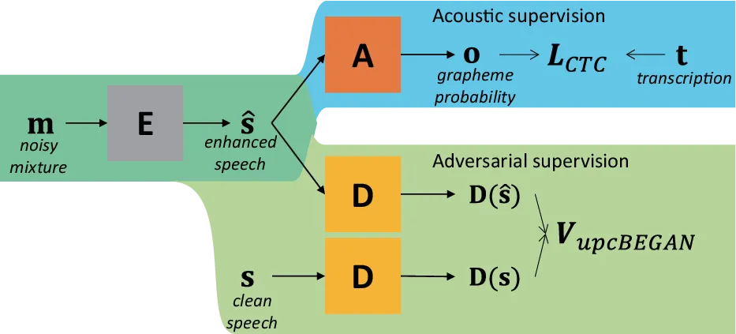
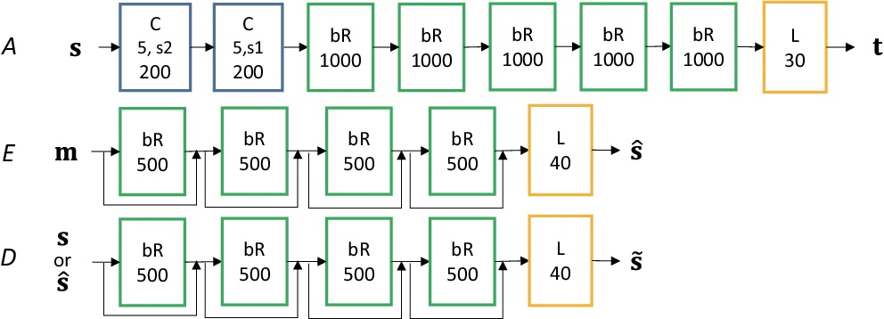
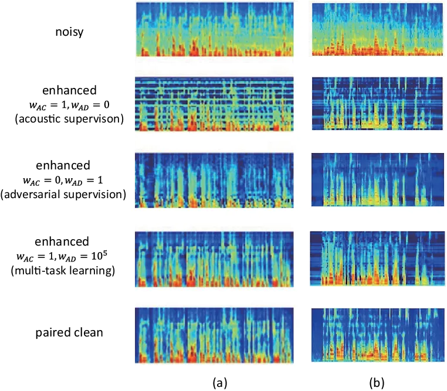
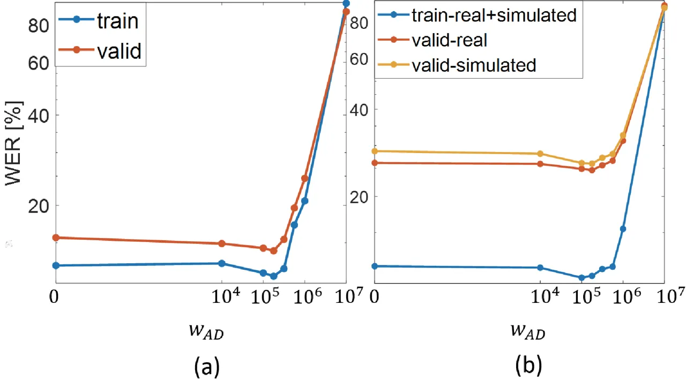

# Unpaired Speech Enhancement by Acoustic and Adversarial Supervision for Speech Recognition

Geonmin Kim    Hwaran Lee    Bo-Kyeong Kim    Sang-Hoon Oh    Soo-Young
Lee ^(†)^(†)thanks: This work was supported by the Industrial Strategic
Technology Development Program (10076757, Free-Running Embedded Speech
Recognition Technology for Natural Language Dialogue with Robots) funded
by the Ministry of Trade, Industry and Energy (MOTIE,
Korea)^(†)^(†)thanks: G. Kim, H. Lee and B.-K. Kim are with the
Department of Electrical Engineering, KAIST, Daejeon 305-701, Korea.
(e-mail: gmkim90@gmail.com, hwaran.lee@kaist.ac.kr,
bokyeong1015@gmail.com)^(†)^(†)thanks: S.-H Oh is with the Division of
Information and Communication Convergence Engineering, Mokwon
University, Daejeon, 302-318, Korea. (e-mail:
shoh@mokwon.ac.kr)^(†)^(†)thanks: S.-Y. Lee is with the KAIST Institute
for Artificial Intelligence, Daejeon, 305-701, Korea. (e-mail:
sy-lee@kaist.ac.kr)

###### Abstract

Many speech enhancement methods try to learn the relationship between
noisy and clean speech, obtained using an acoustic room simulator. We
point out several limitations of enhancement methods relying on clean
speech targets; the goal of this work is proposing an alternative
learning algorithm, called acoustic and adversarial supervision (AAS).
AAS makes the enhanced output both maximizing the likelihood of
transcription on the pre-trained acoustic model and having general
characteristics of clean speech, which improve generalization on unseen
noisy speeches. We employ the connectionist temporal classification and
the unpaired conditional boundary equilibrium generative adversarial
network as the loss function of AAS. AAS is tested on two datasets
including additive noise without and with reverberation, Librispeech +
DEMAND and CHiME-4. By visualizing the enhanced speech with different
loss combinations, we demonstrate the role of each supervision. AAS
achieves a lower word error rate than other state-of-the-art methods
using the clean speech target in both datasets.

###### Index Terms: 

speech enhancement, room simulator, connectionist temporal
classification, generative adversarial network

## I Introduction

Techniques for single-channel speech enhancement range from conventional
signal processing methods such as minimum mean square error \[1\],
wiener filter \[2\], and subspace algorithm \[3\] to expressive deep
neural network \[4, 5, 6\]. Most of the latter approaches are based on
supervised learning, which requires clean speech paired with the noisy
mixture to learn the relationship between them. Since such pairs are
generally unknown, they need to be generated artificially from clean
speech, assuming that they will match the target noisy environment.
However, speech enhancement methods relying on clean speech targets have
several limitations.

Firstly, the acoustic room simulator requires extensive environment
information (i.e., room size distribution, reverberation time, source to
microphone distance, and noise type) \[7\] to convolve the room impulse
response and add noise to the clean speech. This information can be
estimated from noisy speech; however, this itself is a challenging
problem \[8, 9\].

Secondly, the acoustic model trained on simulated data is often not
generalized well in a real environment \[10\]. This is because
simulation may not fully cover the real environment or represent
characteristics other than additive noise and reverberation (e.g.,
Lombard effect \[11\]).

Thirdly, when enhancement is used as a preprocessing stage for speech
recognition, enhancement towards clean speech may not be the optimal
approach. Speech recognition requires the phonetic characteristics in
the enhanced speech to be preserved while suppressing other non-verbal
details. However, yielding enhanced outputs that resemble clean speech
is different from this direction.

To avoid the use of clean speech targets, we propose an alternative
learning algorithm: acoustic and adversarial supervision (AAS). Acoustic
supervision teaches an enhancement model to yield outputs that are
recognized correctly by the pre-trained acoustic model. Adversarial
supervision trains the enhancement model to yield outputs that have the
general characteristics of clean speech. AAS ¹¹ 1 Code and the
supplmentary results are available at
[https://github.com/gmkim90/AAS_enhancement](https://github.com/gmkim90/AAS_enhancement).
is compared with other state-of-the-art methods using clean speech
target in synthetic and real noisy datasets. The remainder of this paper
describes the review on conditional generative adversarial networks, the
proposed AAS algorithm, experimental setting, and results.

## II Conditional Generative Adversarial Network for Speech Enhancement

Speech enhancement is related to domain transfer problems (e.g.,
image-to-image \[12\] and voice conversion\[13\]) where the source and
target domains are the noisy and clean recording environments,
respectively. The representative work is the frequency speech
enhancement generative adversarial network (FSEGAN, \[14\]) which
employs two losses: the distance from the clean to enhanced speech and
the loss function for the conditional generative adversarial network
(cGAN, \[15\]). Given a source domain ($`\textbf{x}_{s}`$) and a target
domain ($`\textbf{x}_{t}`$) data, cGAN optimizes the min-max game
between a generator ($`G`$) and a discriminator ($`D`$) with the value
function ($`V`$) given by

```math
\begin{split}\min_{G}\max_{D}V_{cGAN}(G,D)=\E_{(\textbf{x}_{s},\textbf{x}_{t})\sim p(\textbf{x}_{s},\textbf{x}_{t})}[\log D(\textbf{x}_{s},\textbf{x}_{t})]\\
+\E_{\textbf{x}_{s}\sim p(\textbf{x}_{s}),\textbf{z}\sim N(0,I)}[\log(1-D(\textbf{x}_{s},G(\textbf{x}_{s},\textbf{z})))].\end{split} \tag{1}
```

Here, $`G`$ is trained to deceive $`D`$, which judges whether a given
pair of cross-domain samples come from the real data
$`(\textbf{x}_{s},\textbf{x}_{t})`$ or are generated from the source
domain and random noise z
$`(\textbf{x}_{s},G(\textbf{x}_{s},\textbf{z}))`$. Two losses of FSEGAN
require the paired clean and noisy speeches, not available in the real
environment.

Usually, domain transfer problems require unsupervised learning because
the paired data between different domains are expensive to be obtained.
Therefore, many domain transfer models based on cGAN \[12, 16, 17\]
remove the dependency of the paired source in a discriminator and use
the unpaired cGAN (upcGAN) whose value function ($`V`$) is

```math
\begin{split}\min_{G}\max_{D}V_{upcGAN}(G,D)=\\
\E_{\textbf{x}_{t}\sim p(\textbf{x}_{t})}[\log D(\textbf{x}_{t})]+\E_{\textbf{x}_{s}\sim p(\textbf{x}_{s})}[\log(1-D(G(\textbf{x}_{s})))],\end{split} \tag{2}
```

where z is often omitted to learn deterministic generator.

However, upcGAN can lead the transferred sample $`G(\textbf{x}_{s})`$
merely having the general characteristics of the target domain, since
the discriminator judges the transferred sample without seeing the
paired source domain sample. This problem can be alleviated by imposing
additional regularization \[18\] on a generated sample, such as
cycle-consistency loss \[16, 17\]. However, this loss is not applicable
for speech enhancement because the original noisy speech cannot be
reconstructed from enhanced speech since there are infinite possible
noises to mix. Instead, we encourage the enhanced sample to be
recognized correctly by an acoustic model as an alternative
regularization.

## III Acoustic and Adversarial Supervision

We propose acoustic and adversarial supervision (AAS) for a
speech-enhancement learning algorithm, as shown in Fig. 1. The proposed
method consists of three models: Enhancement (E), Acoustic (A), and
Discriminator (D). For the following description, m, s,
$`\hat{\textbf{s}}`$, o, and t are the noisy mixture, (unpaired) clean
speech, enhanced speech, grapheme probability, and transcription,
respectively. We assume s and pairs of $`(\textbf{m},\textbf{t})`$ are
available for the training data.

### III-A Acoustic Supervision

Acoustic supervision trains the enhancement model to maximize the
likelihood of transcription of the noisy sample. The pre-trained
acoustic model (AM) provides the enhancement model with top-down
information of the phonetic features essential for correct recognition.
This is motivated from top-down attention mechanism of humans, applied
for noise-robust speech recognition \[19\], and N-best rescoring \[20\].
Although this supervision does not require a specific type of AM, we
employ a neural network with connectionist temporal classification (CTC,
\[21\]). The CTC is used to label a sequence without requiring explicit
alignment between the input and label sequences. Moreover, grapheme is
used as the output unit of the neural network, so that AM does not
require a lexicon, which allows generating out-of-vocabulary words
during inference. The CTC loss function is given by

```math
L_{CTC}(E)=-\E_{(\textbf{m},\textbf{t})\sim p(\textbf{m},\textbf{t})}[\text{log}p(\textbf{t}|E(\textbf{m}))], \tag{3}
```

```math
p(\textbf{t}|E(\textbf{m}))=\sum_{\textbf{$\pi$}\in Align(E(\textbf{m}),\mathbf{\tilde{t}})}\prod_{f}o_{f}^{\pi}, \tag{4}
```

where $`\mathbf{\tilde{t}}`$ is a sequence with CTC-blank added between
every pair of graphemes in t, the beginning, and the end. The likelihood
of t given $`E(\textbf{m})`$ is defined as sum of single path
likelihoods across all possible alignments
($`Align(E(\textbf{m}),\mathbf{\tilde{t}})`$).



Fig. 1: The proposed acoustic and adversarial supervision (AAS). The
enhancement model (E) is trained with two loss functions: the acoustic
supervision ($`L_{CTC}`$) computed using the acoustic model (A) and the
adversarial supervision ($`V_{upcBEGAN}`$) computed using the
discriminator (D).

### III-B Adversarial Supervision

Adversarial supervision encourages the enhanced speech to have the
characteristics of clean speech. We employ upcGAN by replacing $`G`$
with $`E`$. The training convergence of upcGAN is improved further by
leveraging the techniques of boundary equilibrium GAN (BEGAN, \[22\]).

Firstly, the discriminator ($`D`$) auto-encodes the inputs
($`l_{D}(\textbf{x})=|\textbf{x}-D(\textbf{x})|`$) instead of using
binary logistic prediction to enhance training efficiency by providing
diverse directions of the gradients within the minibatch \[23\].
Secondly, to balance the power of the discriminator ($`D`$) and the
enhancement ($`E`$) model, the importance of loss on the clean sample
($`\E_{\textbf{s}\sim p(\textbf{s})}[l_{D}(\textbf{s})]`$) is controlled
by the proportional control theory \[22\] given by formula (6). This
control helps to maintain the ratio of loss between clean and enhanced
data as the pre-defined constant ($`\gamma\in[0,1]`$):
$`\E_{\textbf{m}\sim p(\textbf{m})}[l_{D}(E(\textbf{m}))]/\E_{\textbf{s}\sim p(\textbf{s})}[l_{D}(\textbf{s})]=\gamma`$.
The final value function for $`D`$ and $`E`$ is given by

```math
\begin{split}\min_{E}\max_{D}V_{upcBEGAN}(E,D)=\\
\E_{\textbf{m}\sim p(\textbf{m})}[l_{D}(E(\textbf{m}))]-1/(k_{t}+\epsilon)\E_{\textbf{s}\sim p(\textbf{s})}[l_{D}(\textbf{s})],\end{split} \tag{5}
```

```math
k_{t+1}=k_{t}+\lambda(\gamma\E_{\textbf{s}\sim p(\textbf{s})}[l_{D}(\textbf{s})]-\E_{\textbf{m}\sim p(\textbf{m})}[l_{D}(E(\textbf{m}))]), \tag{6}
```

where $`k_{t}\in[0,1],k_{0}=0,\epsilon=10^{-8}`$.

### III-C Multi-task Learning

An enhancement model trained using acoustic supervision directly
increases the likelihood of transcription on the AM. However, such a
model is not unique and depends on the initialization of model
parameters and training data. Due to the non-uniqueness, the enhanced
output is not guaranteed to converge towards natural speech and often
includes artifacts. Moreover, the optimal parameters differ depending on
training data, which may not generalize well on an unseen data.

To constrain the solution, we employ the adversarial supervision as an
auxiliary task. The adversarial supervision regularizes the enhanced
speech having less artifacts, leading to the improved generalization on
an unseen data.

Both losses are combined with weight $`w_{AC}`$ and $`w_{AD}`$ as

```math
\min_{E}\max_{D}w_{AC}L_{CTC}(E)+w_{AD}V_{upcBEGAN}(E,D). \tag{7}
```

## IV Experimental setting

### IV-A Common setting

In all experiments, all the parameters of the neural network are
randomly initialized with the distribution $`N(0,0.1^{2})`$. Adam
optimizer \[24\] with learning rate $`10^{-5}`$ and minibatch size 30 is
used for training the model. The performance on the test data is
reported when the word error rate (WER) on the validation data is the
minimum out of 100 epochs. We use $`\gamma=0.5,\lambda=0.001`$ for
optimizing the $`V_{upcBEGAN}`$.

For the language model (LM), 4-gram trained with the Librispeech text
corpus is used.²² 2 The resources are available in
[http://www.openslr.org/11/](http://www.openslr.org/11/). 100-best
hypotheses, obtained by beam search on AM, are rescored by combining AM
score and length normalized word-level LM score \[25\] given by

```math
S=\log p(\textbf{y}|\textbf{x})+\alpha\log(p(\textbf{y})/|\textbf{y}|^{\beta}). \tag{8}
```

We use 40-dimensional log-mel filterbank (LMFB) feature as the feature
for enhancement and recognition. We employ 30 symbols (26 alphabets,
underscore, apostrophe, whitespace, and CTC-blank) to represent the AM
output.

The AM is trained with the Librispeech corpus \[26\], which provides 960
h of read speech collected from 2,338 speakers as the training data. The
AM combined with LM achieves a WER of 5.7% on the test-clean of
Librispeech, which is competitive with DNN-HMM (5.3%, \[26\]). This AM
is applied for both the noisy domain datasets described in Section IV-B.

### IV-B Noisy dataset

Librispeech + DEMAND \[27\] is a large-scale simulated dataset for
evaluating enhancement for additive noise. For the training and
validation data, 10 types of noise with SNR = {15, 10, 5, 0} are mixed.
For the test data, 5 types of unseen noise with SNR = {17.5, 12.5, 7.5,
2.5} are mixed. The noise type, interval, and SNR are randomly selected
for each clean utterance. We generate the simulated noisy speech as much
as the clean Librispeech (i.e., 960, 10, and 10 h for training,
validation, and test, respectively).

CHiME-4 \[28\] provides read speech recorded from noisy environments
with a 6-channel tablet microphone. It includes speech with additive
noise (4 types) and reverberation. It provides 15, 3, 6, and 5 h of
speech for simulted training, real training, validation, and test set,
respectively. The acoustic room simulator \[29\] is used to generate
multi-channel simulated training data which convolve single-channel
clean speech with 88 ms impulse response estimated from 65 recordings of
tablet microphones, and add 4 types of background noise. During
training, the multi-channel data is sampled randomly to make the
enhancement model robust to slight changes in source position \[30,
31\]. Among the 6 channels, we report the WER of the 5th channel in the
test data.

### IV-C Comparable loss functions

As the single channel speech enhancement baseline, we evaluate the
Wiener filter method \[2\], with smoothing factor $`\beta=0.98`$. For
methods relying on clean speech target, we evaluate the method
minimizing the L1 distance between clean and enhanced LMFB feature
(DCE), and FSEGAN \[14\] described in Section II.

The optimal hyperparameters (i.e., the number of hidden layers and
neurons of the models, $`(\alpha,\beta)`$) were selected based on
yielding the minimum WER on validation data, under the DCE loss
function. Selected hyperparameters and architecture of $`E`$ are the
same across all of the comparable loss functions.



Fig. 2: Detailed architectures of acoustic ($`A`$), enhancement ($`E`$),
and discriminator ($`D`$). Each box describes the layer type (C: 1D
convolutional, bR: bidirectional LSTM-RNN, L: linear) and the kernel
size (width, stride, $`\#`$map) for C, $`\#`$unit for bR and L.

### IV-D Detailed architecture

Fig. 2 shows the architectures of each $`A`$, $`E`$, $`D`$ models. The
speech feature is employed with the LMFB features. The architecture of
$`A`$ is based on a stack of convolutional and long short-term memory
(LSTM) recurrent layers. Each convolutional layer is followed by batch
normalization and rectified linear unit nonlinearity. Each recurrent
layer is followed by a sequence-wise batch normalization layer \[32\].

Both $`E`$ and $`D`$ are multi-layer bidirectional LSTM-RNNs, whose
input and output are LMFB features. Moreover, they have a residual
connection between the input and output of each layer for better
convergence \[33\].

## V Results



Fig. 3: Enhanced test LMFB features obtained using different task
combination. (a) Metro noise with SNR=5 in Librispeech+DEMAND. (b) Bus
noise with reverberation in CHiME-4

### V-A Enhanced feature obtained with different loss functions

Fig. 3 shows the LMFB features of noisy, paired clean, and enhanced
speech obtained using different loss combinations on the simulated test
sets. The enhanced feature obtained using the acoustic supervision
($`w_{AC}=1,w_{AD}=0`$) contains the characteristic of voice (e.g.,
harmonics) in the noisy mixture, and artifacts (e.g., the horizontal
line for a few frequencies). Compared to acoustic supervision, the
enhanced feature obtained using adversarial supervision
($`w_{AC}=0,w_{AD}=1`$) shows less artifacts, but has less voice
characteristic at low frequency. The multi-task learning of AAS
($`w_{AC}=1,w_{AD}=10^{5}`$) maintains voice characteristics in the
generated samples while suppressing the artifacts. This tendency is
consistently observed in both noisy datasets.



Fig. 4: WER with varying loss weight for adversarial supervision (a) on
Librispeech + DEMAND, and (b) on CHiME-4

### V-B WERs and distance between clean and enhanced feature

Fig. 4 compares the WERs obtained using values of
$`w_{AD}\in\{0,10^{4},10^{5},10^{5.25},10^{5.5},10^{5.75},10^{6},10^{7}\}`$
given $`w_{AC}=1`$. On both datasets, the lowest WER on the validation
data is observed when $`w_{AD}`$ is between $`10^{5}`$ to $`10^{6}`$ and
starts to increase at some point.

Table I and II show the WER and DCE (normalized by the number of frames)
on the test set of Librispeech + DEMAND, and CHiME-4. The Wiener
filtering method shows lower DCE, but higher WER than no enhancement. We
conjecture that Wiener filter remove some fraction of noise, however,
remaining speech is distorted as well. The adversarial supervision
(i.e., $`w_{AC}=0,w_{AD}>0`$) consistently shows very high WER (i.e.,
$`>`$ 90%), because the enhanced sample tends to have less correlation
with noisy speech, as shown in Fig. 3.

In Librispeech + DEMAND, acoustic supervision (15.6%) and multi-task
learning (14.4%) achieves a lower WER than minimizing DCE (15.8%) and
FSEGAN (14.9%). The same tendency is observed in CHiME-4 (i.e. acoustic
supervision (27.7%) and multi-task learning (26.1%) show lower WER than
minimizing DCE (31.1%) and FSEGAN (29.1%)).

Because the AM is trained on Librispeech, reducing DCE is directly
related to lowering the WER in Librispeech+DEMAND, but does not ensure
lowering of the WER in CHiME-4. This explains the slight WER difference
between AAS and FSEGAN in Librispeech+DEMAND and the large difference in
CHiME-4.

Table III shows the WERs on the simulated and real test sets when AAS is
trained with different training data. With the simulated dataset as the
training data, FSEGAN (29.6%) does not generalize well compared to AAS
(25.2%) in terms of WER. With the real dataset as the training data, AAS
shows

|                                  |         |       |
| -------------------------------- | ------- | ----- |
| Method                           | WER (%) | DCE   |
| No enhancement                   | 17.3    | 0.828 |
| Wiener filter                    | 19.5    | 0.722 |
| Minimizing DCE                   | 15.8    | 0.269 |
| FSEGAN                           | 14.9    | 0.291 |
| AAS ($`w_{AC}=1,w_{AD}=0`$)      | 15.6    | 0.330 |
| AAS ($`w_{AC}=1,w_{AD}=10^{5}`$) | 14.4    | 0.303 |
| Clean speech                     | 5.7     | 0.0   |

TABLE I: WERs ($`\%`$) and DCE of different speech enhancement methods
on Librispeech + DEMAND test set

|                                  |         |       |
| -------------------------------- | ------- | ----- |
| Method                           | WER (%) | DCE   |
| No enhancement                   | 38.4    | 0.958 |
| Wiener filter                    | 41.0    | 0.775 |
| Minimizing DCE                   | 31.1    | 0.392 |
| FSEGAN                           | 29.1    | 0.421 |
| AAS ($`w_{AC}=1,w_{AD}=0`$)      | 27.7    | 0.476 |
| AAS ($`w_{AC}=1,w_{AD}=10^{5}`$) | 26.1    | 0.462 |
| Clean speech                     | 9.3     | 0.0   |

TABLE II: WERs ($`\%`$) and DCE of different speech enhancement methods
on CHiME4-simulated test set

| Method                           | Training Data    | Test WER (%) |      |
| -------------------------------- | ---------------- | ------------ | ---- |
|                                  |                  | simulated    | real |
| AAS ($`w_{AC}=1,w_{AD}=10^{5}`$) | simulated        | 26.1         | 25.2 |
|                                  | real             | 37.3         | 35.2 |
|                                  | simulated + real | 25.9         | 24.7 |
| FSEGAN                           | simulated        | 29.1         | 29.6 |

TABLE III: WERs ($`\%`$) of obtained using different training data of
CHiME-4

severe overfitting since the size of training data is small. When AAS is
trained with simulated and real datasets, it achieves the best result
(24.7%) on the real test set.

## VI Conclusion

Speech enhancement models have several limitations when using clean
speech from the simulated database as the target. To avoid relying on
clean speech target, we propose training speech enhancement model with
the multi-task learning of acoustic and adversarial supervision (AAS).
Each supervision maximizes the likelihood of transcription on the
pre-trained acoustic model and ensures general characteristics of clean
speech in the enhanced output, which improves generalization on unseen
noisy speech. The proposed method was tested on two datasets:
Librispeech + DEMAND and CHiME-4. By visualizing the enhanced feature,
we demonstrated the role of each supervision. AAS showed a lower word
error rate compared to speech enhancement methods using a clean target.
The proposed AAS can be combined with any acoustic model of a given
clean speech and noisy speech with transcription.

## References

- \[1\] E. Yariv and M. David, “Speech Enhancement using a Minimum Mean
  Square Error Short-Time Spectral Amplitude Estimator,” _IEEE
  Transactions on Audio Speech and Language Processing_, 1984.
- \[2\] S. Pascal and F. Jozue, Vieira, “Speech enhancement based on a
  priori signal to noise estimation,” in _International Conference on
  Acoustic, Speech and Signal Processing (ICASSP)_, 1996.
- \[3\] E. Yariv and V. T. Harry L., “A Signal Subspace Approach for
  Speech Enhancement,” _IEEE Transactions on Audio Speech and Language
  Processing_, 1995.
- \[4\] S. Pascual, A. Bonafonte, and J. Serra, “SEGAN: Speech
  enhancement generative adversarial network,” in _Proceedings of the
  Annual Conference of the International Speech Communication
  Association, INTERSPEECH_, 2017.
- \[5\] D. Rethage, J. Pons, and X. Serra, “A Wavenet for Speech
  Denoising,” in _ICASSP, IEEE International Conference on Acoustics,
  Speech and Signal Processing_, 2018.
- \[6\] M. Ravanelli, P. Brakel, M. Omologo, and Y. Bengio, “A network
  of deep neural networks for Distant Speech Recognition,” in _ICASSP,
  IEEE International Conference on Acoustics, Speech and Signal
  Processing_, 2017.
- \[7\] C. Kim, A. Misra, K. Chin, T. Hughes, A. Narayanan, T. Sainath,
  and M. Bacchiani, “Generation of large-scale simulated utterances in
  virtual rooms to train deep-neural networks for far-field speech
  recognition in Google Home,” in _Proceedings of the Annual Conference
  of the International Speech Communication Association,
  INTERSPEECH_, 2017.
- \[8\] G. Lafay, E. Benetos, and M. Lagrange, “Sound event detection in
  synthetic audio: Analysis of the dcase 2016 task results,” in _IEEE
  Workshop on Applications of Signal Processing to Audio and
  Acoustics_, 2017.
- \[9\] Y. E. Baba, A. Walther, and E. A. Habets, “3D room geometry
  inference based on room impulse response stacks,” _IEEE/ACM
  Transactions on Audio Speech and Language Processing_, 2018.
- \[10\] E. Vincent, S. Watanabe, A. Arie Nugraha, J. Barker, and
  R. Marxer, “An analysis of environment, microphone and data simulation
  mismatches in robust speech recognition,” _Computer speech and
  Language_, vol. 46, pp. 535–557, 2017.
- \[11\] J.-C. Junqua, S. Fincke, and K. Field, “The Lombard effect: a
  reflex to better communicate with others in noise,” in _ICASSP, IEEE
  International Conference on Acoustics, Speech and Signal
  Processing_, 1999.
- \[12\] M.-Y. Liu, T. Breuel, and J. Kautz, “Unsupervised
  Image-to-Image Translation Networks,” in _Neural Information
  Processing Systems_, 2017.
- \[13\] C. C. Hsu, H. T. Hwang, Y. C. Wu, Y. Tsao, and H. M. Wang,
  “Voice conversion from unaligned corpora using variational
  autoencoding wasserstein generative adversarial networks,” in
  _Proceedings of the Annual Conference of the International Speech
  Communication Association, INTERSPEECH_, 2017.
- \[14\] C. Donahue, B. Li, and R. Prabhavalkar, “Exploring Speech
  Enhancement with Generative Adversarial Networks for Robust Speech
  Recognition,” in _ICASSP, IEEE International Conference on Acoustics,
  Speech and Signal Processing_, 2017.
- \[15\] M. Mirza and S. Osindero, “Conditional Generative Adversarial
  Nets,” in _arXiv preprint arXiv : 1411.1784_, 2014.
- \[16\] J. Y. Zhu, T. Park, P. Isola, and A. A. Efros, “Unpaired
  Image-to-Image Translation Using Cycle-Consistent Adversarial
  Networks,” in _Proceedings of the IEEE International Conference on
  Computer Vision_, 2017.
- \[17\] T. Kim, M. Cha, H. Kim, J. K. Lee, and J. Kim, “Learning to
  Discover Cross-Domain Relations with Generative Adversarial Networks,”
  in _Proceedings of the International Conference on Machine Learning
  (ICML)_, 2017.
- \[18\] H. Kwak and B.-T. Zhang, “Ways of Conditioning Generative
  Adversarial Networks,” in _Workshop on Neural Information Processing
  Systems_, 2016.
- \[19\] L. Chang-Hoon and L. Soo-Young, “Noise-Robust Speech
  Recognition Using Top-Down Selective Attention With an HMM
  Classifier,” _IEEE Signal Processing Letters_, 2007.
- \[20\] K. Ho-Gyeong, L. Hwaran, K. Geonmin, O. Sang-Hoon, and
  L. Soo-Young, “Rescoring of N-Best Hypotheses Using Top-down Selective
  Attention for Automatic Speech Recognition,” _IEEE Signal Processing
  Letters_, 2018.
- \[21\] A. Graves, S. Fernandez, F. Gomez, and J. Schmidhuber,
  “Connectionist Temporal Classification : Labelling Unsegmented
  Sequence Data with Recurrent Neural Networks,” in _Proceedings of the
  23rd international conference on Machine Learning_, 2006, pp. 369–376.
- \[22\] D. Berthelot, T. Schumm, and L. Metz, “BEGAN: Boundary
  Equilibrium Generative Adversarial Networks,” in _Neural Information
  Processing Systems_, 2017.
- \[23\] Z. Junbo, M. Michael, and Y. LeCun, “Energy-based Generative
  Adversarial Networks,” in _International Conference on Learning
  Representation_, 2017.
- \[24\] D. P. Kingma and J. Ba, “Adam: A Method for Stochastic
  Optimization,” in _International Conference on Learning
  Representation_, 2015.
- \[25\] D. Amodei, R. Anubhai, E. Battenberg, C. Case, J. Casper,
  B. Catanzaro, J. Chen, M. Chrzanowski, A. Coates, G. Diamos, E. Elsen,
  J. Engel, L. Fan, C. Fougner, T. Han, A. Hannun, B. Jun, P. LeGresley,
  L. Lin, S. Narang, A. Ng, S. Ozair, R. Prenger, J. Raiman,
  S. Satheesh, D. Seetapun, S. Sengupta, Y. Wang, Z. Wang, C. Wang,
  B. Xiao, D. Yogatama, J. Zhan, and Z. Zhu, “Deep Speech 2: End-to-End
  Speech Recognition in English and Mandarin,” in _Proceedings of the
  International Conference on Machine Learning (ICML)_, 2016.
- \[26\] V. Panayotov, G. Chen, D. Povey, and S. Khudanpur,
  “Librispeech: An ASR corpus based on public domain audio books,” in
  _ICASSP, IEEE International Conference on Acoustics, Speech and Signal
  Processing_, 2015.
- \[27\] J. Thiemann, N. Ito, and E. Vincent, “The Diverse Environments
  Multi-channel Acoustic Noise Database (DEMAND): A database of
  multichannel environmental noise recordings,” in _International
  Congress on Acoustics_, 2013.
- \[28\] J. Barker, R. Marxer, E. Vincent, and S. Watanabe, “The third
  ‘CHiME’ speech separation and recognition challenge: Analysis and
  outcomes,” _Computer Speech and Language_, 2017.
- \[29\] “CHiME-4 Acoustic simulation baseline.” \[Online\]. Available:
  [http://spandh.dcs.shef.ac.uk/chime_challenge/chime2015/software.html](http://spandh.dcs.shef.ac.uk/chime_challenge/chime2015/software.html)
- \[30\] D. Jun, T. Yan-Hui, S. Lei, M. Feng, W. Hai-Kun, P. Jia,
  L. Cong, C. Jing-Dong, and L. Chin-Hui, “The USTC-iFlytek System for
  CHiME-4 Challenge,” in _Proceeding on CHiME_, 2016.
- \[31\] D. Tran, Huy, Z. T. Ng, Wen, S. Sunil, T. Luong, Trung, and
  D. Tran, Anh, “The I2R System for CHiME-4 Challenge,” in _Proceeding
  on CHiME_, 2016.
- \[32\] G. Pereyra, Y. Zhang, and Y. Bengio, “Batch Normalized
  Recurrent Neural Networks,” in _ICASSP, IEEE International Conference
  on Acoustics, Speech and Signal Processing_, 2016.
- \[33\] S. Zhou, Y. Zhao, S. Xu, and B. Xu, “Multilingual recurrent
  neural networks with residual learning for low-resource speech
  recognition,” in _Proceedings of the Annual Conference of the
  International Speech Communication Association, INTERSPEECH_, 2017.
