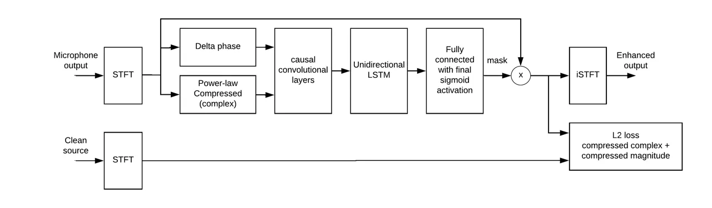
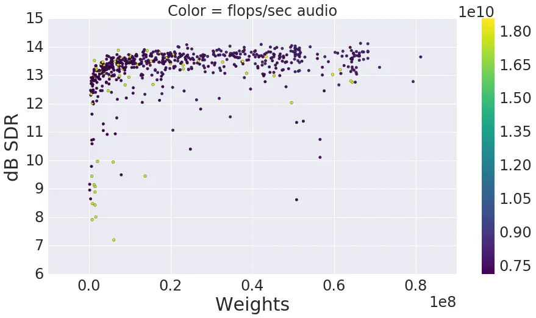
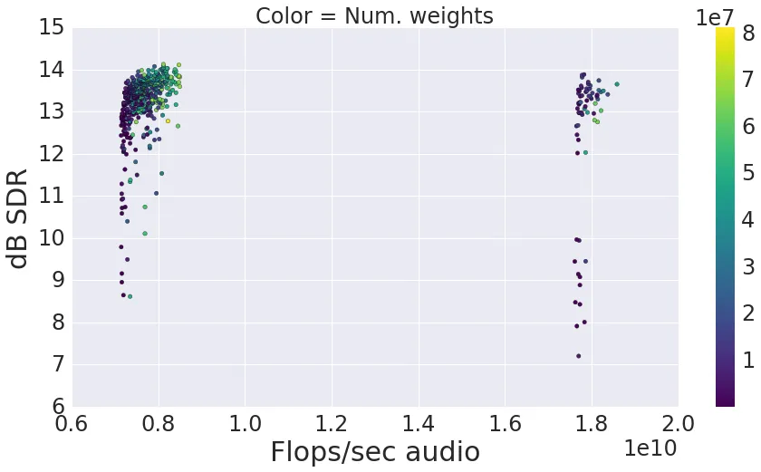
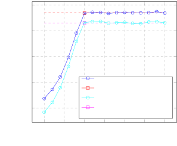

# exploring tradeoffs in models for low-latency speech enhancement

###### Abstract

We explore a variety of neural networks configurations for one- and
two-channel spectrogram-mask-based speech enhancement. Our best model
improves on previous state-of-the-art performance on the CHiME2 speech
enhancement task by 0.4 decibels in signal-to-distortion ratio (SDR). We
examine trade-offs such as non-causal look-ahead, computation, and
parameter count versus enhancement performance and find that
zero-look-ahead models can achieve, on average, within 0.03 dB SDR of
our best bidirectional model. Further, we find that 200 milliseconds of
look-ahead is sufficient to achieve equivalent performance to our best
bidirectional model.

|                                                             |
| ----------------------------------------------------------- |
| Kevin Wilson, Michael Chinen, Jeremy Thorpe, Brian Patton,  |
| John Hershey, Rif A. Saurous, Jan Skoglund, Richard F. Lyon |
| Google Research, Google Chrome Audio                        |

Index Terms—  speech enhancement, low-latency inference

## 1 Introduction

Recent work \[1, 2, 3, 4, 5, 6\] has successfully used deep learning to
train systems to estimate multiplicative spectrogram masks to remove
noise from mixtures of speech and noise. In this work, we explore the
design space of such systems in the context of the CHiME2 WSJ0 dataset
\[7\] by varying the input features, the loss function, the
representation of the mask, and the size and shape of the trainable
neural network.

To explore this space, we first search the space of fully bidirectional
(non-causal) models using Vizier \[8\], Google’s hyperparameter tuning
system. Then, starting with the best-performing configuration found by
Vizier, we examine the effect of look-ahead on enhancement performance.



Fig. 1: System architecture.

## 2 Background

Our speech enhancement networks are similar to those used in other
recent work on spectrogram-mask-based speech enhancement and are shown
schematically in Figure 1. They take as input a noisy, possibly
multi-microphone, time-domain audio signal. We then compute the
short-time Fourier transform (STFT), and from the STFT we derive input
features, e.g. the compressed magnitude spectrogram, for the network.
Our neural networks consist of a stack of convolutional layers followed,
optionally, by LSTM and fully connected layers, each with ReLU
activations. The final layer has a sigmoidal activation and outputs a
soft mask, which is pointwise multiplied by the noisy input STFT. During
training, this masked STFT is compared to the clean reference STFT
according to a loss function (described below). To apply the model, the
inverse STFT of the masked STFT is computed to generate an enhanced
time-domain output.

In this work, we use the CHiME2 WSJ0 dataset \[7\], which consists of
cleanly-recorded Wall Street Journal sentences convolved with a standard
set of two-microphone room impulse responses and added to recorded
two-microphone noise. The signal-to-noise ratios (SNRs) of the resulting
utterances range from -6 to 9 dB. In this dataset, the target speaker is
always at broadside (no relative delay between the two microphones), and
the training target signals have been passed through the room impulse
responses, so the goal is to remove additive noise only, not to
dereverberate the signal.

The previous state-of-the-art enhancement performance on CHiME2 WSJ0 was
achieved by Weninger et al. \[6\]. Their system consisted of 2
bidirectional LSTM layers, each with 384 units, followed by a fully
connected layer with sigmoidal activation. Weninger et al. use a loss
function, “phase-sensitive spectrum approximation,” which modifies only
the magnitudes (not the phases) of the noisy input, but which penalizes
the output based on distance in the complex spectrum space. Their best
system also uses speech recognizer state estimates as additional inputs.
It achieves 15.07 dB output SDR averaged over the evaluation dataset.

We do not attempt to replicate all details of their configurations, but
we take their system as inspiration and, by doing a large hyperparameter
search, find a system that improves on their system’s performance.

## 3 Model and training

Starting with 16 kHz sample rate audio, we compute the STFT using a 25
ms Hann window and a 10 ms hop size, resulting in a 257-dimensional STFT
frame every 10 ms. We use this same STFT as the basis for our loss
function, the input to our neural network, and as the representation to
which the time-frequency mask is applied. The loss function for our
models is

```math
\begin{split}L=&\left\lVert|S_{clean_{0}}^{0.3}(t,f)|-|S_{enhanced}^{0.3}(t,f)|\right\rVert_{2}^{2}+\\
&\lambda\left\lVert S_{clean_{0}}^{0.3}(t,f)-S_{enhanced}^{0.3}(t,f)\right\rVert_{2}^{2}\end{split} \tag{1}
```

where $`S`$ is an STFT representation. The first component penalizes
mismatches between the enhanced magnitude spectra and channel 0 of the
clean training target, and the second component penalizes mismatches
between the enhanced complex spectra and channel 0 of the training
target, weighted by hyperparameter $`\lambda`$. All spectra are
power-law compressed (with power $`0.3`$), which partially equalizes the
importance of quieter sounds relative to loud ones. If we had set the
power in our power-law compression to 1.0, the second term of our loss
function would be equivalent to the phase-sensitive spectrum
approximation (PSA) loss from Weninger et al. \[6\].

We train on batches of fixed-length (3 second) audio clips, obtained by
chopping the variable-length CHiME2 training examples into consecutive
3-second chunks and discarding any final fractional chunks.

## 4 Vizier search

There are many possible variations on the high-level architecture
described above. We implement our models in TensorFlow and use Vizier
\[8\] to search this space using its Batched Gaussian Process Bandits
approach. In early experiments, we observed that models usually achieved
their maximum validation set performance within 24 hours on one GPU,
while consuming one to six training epochs depending on the complexity
of the model. For our Vizier exploration, we trained each model for up
to 24 hours, using maximum validation set performance as Vizier’s
objective function. At each stage, Vizier suggested parameters for 40
models that were trained concurrently, until a total of 765 models were
trained.

|         |         |         |            |            |
| ------- | ------- | ------- | ---------- | ---------- |
| Filters | T width | F width | T dilation | F dilation |
| 32      | 1       | 7       | 1          | 1          |
| 32      | 7       | 1       | 1          | 1          |
| 32      | 5       | 5       | 1          | 1          |
| 32      | 5       | 5       | 2          | 1          |
| 32      | 5       | 5       | 4          | 1          |
| 32      | 5       | 5       | 8          | 1          |
| 32      | 5       | 5       | 16         | 1          |
| 8       | 1       | 1       | 1          | 1          |

(a) Small configuration

|         |         |         |            |            |
| ------- | ------- | ------- | ---------- | ---------- |
| Filters | T width | F width | T dilation | F dilation |
| 32      | 1       | 7       | 1          | 1          |
| 32      | 7       | 1       | 1          | 1          |
| 32      | 5       | 5       | 1          | 1          |
| 32      | 5       | 5       | 2          | 1          |
| 32      | 5       | 5       | 4          | 1          |
| 32      | 5       | 5       | 8          | 1          |
| 32      | 5       | 5       | 16         | 1          |
| 32      | 5       | 5       | 32         | 1          |
| 32      | 5       | 5       | 1          | 1          |
| 32      | 5       | 5       | 2          | 2          |
| 32      | 5       | 5       | 4          | 4          |
| 32      | 5       | 5       | 8          | 8          |
| 32      | 5       | 5       | 16         | 16         |
| 32      | 5       | 5       | 32         | 32         |
| 8       | 1       | 1       | 1          | 1          |

(b) Large configuration

Table 1: Convolutional layer configurations explored in our Vizier
study. “Filters” is the number of filters (feature maps) in the layer.
“T width” and “F width” are the size of the filter in time (frames) and
frequency (bins), respectively. “T dilation” and “F dilation” are
dilation factors in time and frequency, respectively.

|                          |                                                                          |
| ------------------------ | ------------------------------------------------------------------------ |
| Hyperparameter           | Possible values                                                          |
| Convolutional config     | small, large (See Table 1.)                                              |
| BLSTM depth              | $`0\mathchar 45\relax 5`$                                                |
| BLSTM width              | $`8\mathchar 45\relax 1024`$                                             |
| Fully connected depth    | $`0\mathchar 45\relax 5`$                                                |
| Fully connected width    | $`8\mathchar 45\relax 1024`$                                             |
| Delta-phase input        | yes, no                                                                  |
| Complex loss $`\lambda`$ | $`0.0\mathchar 45\relax 1.0`$                                            |
| Learning rate            | $`$3\text{\times}{10}^{-6}$\mathchar 45\relax$1\text{\times}{10}^{-3}$`$ |
| Input channels           | $`1\mathchar 45\relax 2`$                                                |

Table 2: Hyperparameters explored in our Vizier study.

All of our networks use power-law compressed magnitude spectrograms as
input features. For “delta-phase” models, we concatenate delta-phase
spectrogram inputs \[9\], which are frame-to-frame phase ratios at each
frequency. Two-channel inputs yield two-channel spectrogram images, so
using delta-phase doubles the channel dimension.

For the neural network, we stack one of the two configurations of
convolutional layers described in Table 1, followed by LSTM layers with
residual connections (where each layer is put in parallel with a bypass
connection), followed by fully connected layers. Preliminary experiments
showed improvement from having some convolutional layers, but it was not
feasible to do a less-constrained search over convolutional
architectures while also exploring other aspects of the model. Thus, we
limit this study to these two possible convolutional layer
configurations.

All models in this study use the output of the DNN as a real-valued mask
by which the input signal(s) are multiplied to produce denoised
spectrogram. In the case of two-channel input, that results in adding
together the magnitude-masked channels, with no relative delay. Since
the target speaker in CHiME2 is always at zero relative delay, this is
reasonable, and preliminary experiments in which we allowed the network
to adjust the relative phase yielded no benefit. For tasks in which the
direction of the target varies, we would expect the optimal mask to have
non-zero phase in general.

We evaluate model accuracy and select the best performing model using
source-to-distortion ratio (SDR) from BSS Eval \[10\]. While this metric
is imperfect (it allows the enhancement output to be badly equalized),
we use it because it is a standard benchmark. By this metric, our best
model found by the search achieved an average development set SDR of
14.60 dB and eval set SDR of 15.37 dB (Table 4).

Our best model includes delta-phase input and uses relatively wide BLSTM
and fully connected layers, but it uses the smaller of the two
convolutional configurations. It was trained using a loss function that
includes both magnitude and complex loss, with Vizier finding that a
small amount of complex-loss, $`\lambda=0.113`$, was optimal.

The hyperparameter values and ranges over which Vizier searched are in
Table 2 and the hyperparameter values for the best model found by Vizier
are in Table 3.

|                          |                               |
| ------------------------ | ----------------------------- |
| Hyperparameter           | Value                         |
| Convolutional config     | small                         |
| BLSTM depth              | $`3`$                         |
| BLSTM width              | $`1023`$                      |
| Fully connected depth    | $`2`$                         |
| Fully connected width    | $`873`$                       |
| Delta-phase input        | yes                           |
| Complex loss $`\lambda`$ | $`0.113`$                     |
| Learning rate            | $`2.1\text{\times}{10}^{-4}`$ |
| Input channels           | $`2`$                         |

Table 3: Best-performing hyperparameters found in our Vizier study.

| Eval SDR |       |       |       |       |       |       |
| -------- | ----- | ----- | ----- | ----- | ----- | ----- |
| -6dB     | -3dB  | 0dB   | 3dB   | 6dB   | 9dB   | Avg   |
| 12.17    | 13.44 | 14.70 | 15.83 | 17.30 | 18.78 | 15.37 |

Table 4: Performance of best-performing model found by Vizier search as
a function of input SNR.

| Eval SDR |       |       |       |       |       |       |
| -------- | ----- | ----- | ----- | ----- | ----- | ----- |
| -6dB     | -3dB  | 0dB   | 3dB   | 6dB   | 9dB   | Avg   |
| 12.31    | 13.52 | 14.76 | 15.94 | 17.41 | 18.90 | 15.48 |

Table 5: Performance of best-performing causal model (180 ms look-ahead)
as a function of input SNR.

We compared SDR, number of weights, and operations per second of audio
processed of the 765 models that were explored in the Vizier search. In
general, we found that more LSTM and fully-connected weights improved
SDR, with diminishing returns, for the small convolutional network. The
large convolutional network required approximately twice the operations,
and may not have converged by the 24 hours deadline with large
LSTM/fully-connected layers.

In Figure 2(a), we show the maximum SDR achieved on the development set
vs. number of trainable weights. While the top performing model has
around 65 million parameters, the Vizier study found models with only
around 1M parameters that perform within about 1dB. Vizier seems to have
explored the space of models with many/few parameters fairly well.

In the set of models that we explored, computation was dominated by the
convolutional layers, as can be seen in figure 2(b). The number of
operations per second required by the two convolutional configurations
is approximately equal to the minimum value in each of the two clusters.
All of the models we explored have a fairly high inference-time
computational cost. A finer-grained class of convolutional layers, and
possibly a different optimization metric, would be needed to find models
appropriate for tight computational budgets.

The SDR numbers in Figure 2 are lower than the results in other tables
and figures because the Vizier objective scores used for Figure 2 use
only a subset of the CHiME2 development set, which is more difficult
than the evaluation set.



(a) SDR vs. number of weights for all models in our Vizier study.



(b) SDR vs. operations per second of audio for all models in our Vizier
study. The two clusters reflect the two configurations of convolutional
layers, small and large, defined in Table 1.

Fig. 2: Scatter plots of the models trained in our Vizier study.



Fig. 3: Plot of SDR vs. look-ahead

## 5 Effects of look-ahead

We create a causal variant of the best configuration found by Vizier by
changing all LSTM layers from bidirectional to unidirectional (which
cuts the number of parameters per layer in half) and by altering the
receptive field of each convolutional layer to be causal rather than
centered on the current time (which does not change the number of
parameters per layer). With that causal configuration, we then shift the
input features with respect to the output, yielding a varying amount of
future context while keeping the number of parameters fixed, and examine
the effect of look-ahead on denoising performance. To control for the
run-to-run variance we ran 16 trials of each look-ahead setting, picked
the model and training step that best performed on a subset of the
development set, and scored it against the evaluation dataset (Table 5).
The scores for the non-causal model were also found this way.

Our findings, which are consistent with Wichern and Lukin \[11\] and
Erdogan et al. \[2\], but which more systematically explore look-aheads,
are that unidirectionality with zero or positive look-ahead shows little
difference in SDR compared to the bidirectional model for the CHiME2
dataset. For non-negative look-ahead, the differences in SDR had a range
of only 0.14dB. Such differences are of marginal statistical
significance based on our finding a run-to-run standard deviation of
0.08dB SDR for multiple trainings of identical configurations. For
negative look-ahead (predicting future spectrogram mask values), the
effect was much larger, with a reduction of 6.6dB SDR with -100 ms
look-ahead compared to the zero-look-ahead causal model. When the
network must blindly predict future masks, it will not be able to
respond immediately to transient in the noise, or to the nonstationarity
of the speech. In contrast, positive look-ahead may have less of an
effect because of the predictability of clean speech.

Figure 3 shows an unexpectedly small gain in performance as look-ahead
increases (among non-negative look-ahead values). This contrasts with
results in \[11\] as well as our unpublished experiments using
single-channel inputs, for which the beneficial effect of look-ahead was
larger. One hypothesis is that two-channel models have a larger input
dimensionality, and hence a greater capacity to overfit. In addition,
CHiME2 training/validation/test datasets are constructed using binaural
impulse responses, recorded under different conditions (e.g. doors and
curtains open/closed, different ambient noise). Thus there may be
significant mismatch in the spatial characteristics between training and
validation data, leading to a tendency for overfitting with two-channel
models. In preliminary experiments with dropout regularization we
observed improved performance for large look-ahead models, presumably
via a reduction in overfitting.

## 6 Conclusion

We described a spectrogram-mask-based speech enhancement system, which
takes as input the noisy magnitude spectrogram and delta-phase
spectrogram, and consists of a stack of convolutional, LSTM, and fully
connected neural network layers, that achieves a new state-of-the-art
performance on the CHiME2 speech enhancement dataset. We found the cost
of unidirectionality to be negligible with zero or positive look-ahead,
and large with negative look-ahead.

## References

- \[1\] Donald S Williamson, Yuxuan Wang, and DeLiang Wang, “Complex
  ratio masking for monaural speech separation,” IEEE/ACM Transactions
  on Audio, Speech, and Language Processing, vol. 24, no. 3, pp.
  483–492, 2016.
- \[2\] Hakan Erdogan, John R Hershey, Shinji Watanabe, and Jonathan
  Le Roux, “Phase-sensitive and recognition-boosted speech separation
  using deep recurrent neural networks,” in Acoustics, Speech and Signal
  Processing (ICASSP), 2015 IEEE International Conference on. IEEE,
  2015, pp. 708–712.
- \[3\] Zhuo Chen, Single Channel auditory source separation with neural
  network, Ph.D. thesis, Columbia University, 2017.
- \[4\] Jitong Chen, Yuxuan Wang, Sarah E. Yoho, DeLiang Wang, and
  Eric W. Healy, “Large-scale training to increase speech
  intelligibility for hearing-impaired listeners in novel noises,” The
  Journal of the Acoustical Society of America, vol. 139, no. 5, pp.
  2604–2612, 2016.
- \[5\] Jitong Chen and DeLiang Wang, “Long short-term memory for
  speaker generalization in supervised speech separation,” in
  INTERSPEECH, 2016.
- \[6\] Felix Weninger, Hakan Erdogan, Shinji Watanabe, Emmanuel
  Vincent, Jonathan Le Roux, John R Hershey, and Björn Schuller, “Speech
  enhancement with lstm recurrent neural networks and its application to
  noise-robust asr,” in International Conference on Latent Variable
  Analysis and Signal Separation. Springer, 2015, pp. 91–99.
- \[7\] Emmanuel Vincent, Jon Barker, Shinji Watanabe, Jonathan Le Roux,
  Francesco Nesta, and Marco Matassoni, “The second ‘chime’speech
  separation and recognition challenge: Datasets, tasks and baselines,”
  in Acoustics, Speech and Signal Processing (ICASSP), 2013 IEEE
  International Conference on. IEEE, 2013, pp. 126–130.
- \[8\] Daniel Golovin, Benjamin Solnik, Subhodeep Moitra, Greg
  Kochanski, John Elliot Karro, and D. Sculley, Eds., Google Vizier: A
  Service for Black-Box Optimization, 2017.
- \[9\] Iain McCowan, David Dean, Mitchell McLaren, Robert Vogt, and
  Sridha Sridharan, “The delta-phase spectrum with application to voice
  activity detection and speaker recognition,” IEEE Transactions on
  Audio, Speech, and Language Processing, vol. 19, no. 7, pp.
  2026–2038, 2011.
- \[10\] Emmanuel Vincent, Rémi Gribonval, and Cédric Févotte,
  “Performance measurement in blind audio source separation,” IEEE
  transactions on audio, speech, and language processing, vol. 14, no.
  4, pp. 1462–1469, 2006.
- \[11\] Gordon Wichern and Alexey Lukin, “Low-latency approximation of
  bidirectional recurrent networks for speech denoising,” in
  Applications of Signal Processing to Audio and Acoustics (WASPAA),
  2017 IEEE Workshop on. IEEE, 2017, pp. 66–70.
