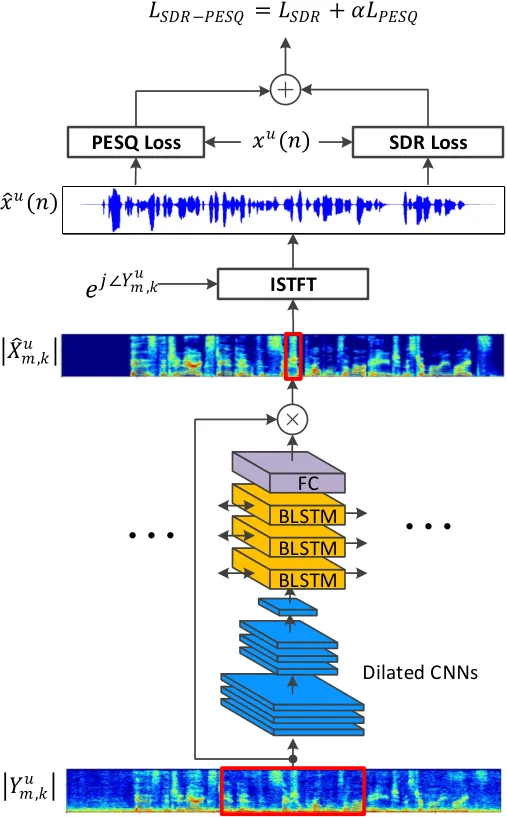
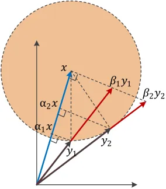

# End-to-End Multi-Task Denoising for Joint SDR and PESQ Optimization

Jaeyoung Kim Affiliation: Samsung Device Solutions Research America, USA
Correspondence to: <jykim@stanford.kr>    Mostafa El-Khamy
Affiliation: Samsung Device Solutions Research America, USA
Correspondence to: <m_elkhamy@ieee.org>    Jungwon Lee
Affiliation: Samsung Device Solutions Research America, USA

###### Abstract

Supervised learning based on a deep neural network recently has achieved
substantial improvement on speech enhancement. Denoising networks learn
mapping from noisy speech to clean one directly, or to a spectrum mask
which is the ratio between clean and noisy spectra. In either case, the
network is optimized by minimizing mean square error (MSE) between
ground-truth labels and time-domain or spectrum output. However,
existing schemes have either of two critical issues: spectrum and metric
mismatches. The spectrum mismatch is a well known issue that any
spectrum modification after short-time Fourier transform (STFT), in
general, cannot be fully recovered after inverse short-time Fourier
transform (ISTFT). The metric mismatch is that a conventional MSE metric
is sub-optimal to maximize our target metrics, signal-to-distortion
ratio (SDR) and perceptual evaluation of speech quality (PESQ). This
paper presents a new end-to-end denoising framework with the goal of
joint SDR and PESQ optimization. First, the network optimization is
performed on the time-domain signals after ISTFT to avoid spectrum
mismatch. Second, two loss functions which have improved correlations
with SDR and PESQ metrics are proposed to minimize metric mismatch. The
experimental result showed that the proposed denoising scheme
significantly improved both SDR and PESQ performance over the existing
methods.

###### Keywords: 

SDR, PESQ

marginparsep has been altered.  
topmargin has been altered.  
marginparwidth has been altered.  
marginparpush has been altered.

The page layout violates the ICML style.

Please do not change the page layout, or include packages like geometry,
savetrees, or fullpage, which change it for you.

We’re not able to reliably undo arbitrary changes to the style. Please
remove the offending package(s), or layout-changing commands and try
again.

## 1 Introduction

In recent years, deep neural networks have shown great success in speech
enhancement compared with traditional statistical approaches.
Statistical enhancement schemes such as MMSE STSA (Ephraim & Malah, 1984) and OM-LSA (Ephraim & Malah, 1985; Cohen & Berdugo, 2001) do not
learn any model architecture from data but they provide blind signal
estimation based on their predefined speech and noise models. However,
their model assumptions, in general, do not match with real-world
complex non-stationary noise, which often leads to failure of noise
estimation and tracking. On the contrary, a neural network directly
learns nonlinear complex mapping from noisy speech to clean one only by
referencing data without any prior assumption. With more data, a neural
network can learn better underlying mapping.

Spectrum mask estimation is a popular supervised denoising method that
predicts a time-frequency mask to obtain an estimate of clean speech by
multiplication with noisy spectrum. There are numerous types of spectrum
mask estimation depending on how to define mask labels. For example,
authors in (Narayanan & Wang, 2013) proposed ideal binary mask (IBM) as
a training label, where it is set to be zero or one depending on the
signal to noise ratio (SNR) of a noisy spectrum. Ideal ratio mask
(IRM) (Wang et al., 2014) and ideal amplitude mask (IAM) (Erdogan
et al., 2015) provided non-binary soft mask labels to overcome coarse
label mapping of IBM. Phase sensitive mask (PSM) (Erdogan et al., 2015)
considers phase spectrum difference between clean and noisy signal in
order to correctly maximize signal to noise ratio (SNR).

Generative models such as generative adversarial networks (GANs) and
variational autoencoders (VAEs) suggested an alternative to supervised
learning. In speech enhancement GAN (SEGAN) (Pascual et al., 2017), a
generator network is trained to output a time-domain denoised signal
that can fool a discriminator from a true clean signal. TF-SEGAN (Soni
et al., 2018) extended SEGAN into time-frequency mask. (Bando et al.,
2018), on the other hand, combined a VAE-based speech model with
non-negative matrix factorization (NMF) for noise spectrum to show good
performance on unseen data.

However, all the schemes described above suffer from either of two
critical issues: metric and spectrum mismatches. SDR and PESQ are two
most widely known metrics for measuring quality of speech signal. The
typical mean square error (MSE) criterion popularly used for spectrum
mask estimation is not optimal to maximize our target metrics of SDR and
PESQ. For example, decreasing mean square error of noisy speech signal
often degrades SDR or PESQ due to different weighting on frequency
components or non-linear transforms involved in the metric. Furthermore,
GAN-based generative models don’t have even a specific loss function to
minimize. Although they are robust for unseen data, they typically
perform much worse for test data with small data mismatch. The spectrum
mismatch is a well known issue that any spectrum modification after
short-time Fourier transform (STFT), in general, cannot be fully
recovered after ISTFT. Therefore, spectrum mask estimation and other
alternatives optimized in the spectrum domain always have a potential
risk of performance loss.

This paper presents a new end-to-end multi-task denoising scheme with
following contributions. First, the proposed framework presents two loss
functions:

- •
  SDR loss function: instead of typical MSE, SDR metric is used as a
  loss function. The scale-invariant term in SDR metric is incorporated
  as a part of training, which provided significant SDR boost.
- •
  PESQ loss function: PESQ metric is redesigned to be usable as a loss
  function. The two key variables of PESQ, symmetric and asymmetric
  disturbances are approximated to be optimized during training.

The proposed multi-task denoising scheme combines two loss functions for
joint SDR and PESQ optimization. Second, a denoising network still
predicts a time-frequency mask but the network optimization is performed
after ISTFT in order to avoid spectrum mismatch. SDR loss function is
naturally calculated from the time-domain reconstructed signal. PESQ
loss function needs clean and denoised power spectra as input for
disturbance calculation and therefore, the second STFT is applied on the
time-domain signal for spectrum consistency. The evaluation result
showed that the proposed framework provided large improvement both on
SDR and PESQ.

## 2 Background and Related Works

Figure 1: Block Diagram of Denoising Framework

Figure 1 illustrates the overall speech denoising flow. The input noisy
signal is given by

```math
y^{u}(n)=x^{u}(n)+n^{u}(n) \tag{1}
```

where $`u`$ is a utterance index, $`n`$ is a time index, $`x^{u}(n)`$ is
clean speech and $`n^{u}(n)`$ is noise signal. $`Y_{m,k}^{u}`$ is STFT
output, where $`m`$ and $`k`$ are frame and frequency indices,
respectively. It is fed into two separate paths. For the upper path, the
magnitude of $`Y_{m,k}^{u}`$ is passed to the Denoiser block. On the
contrary, the phase of $`Y_{m,k}^{u}`$ is bypassed without compensation.
$`\hat{X}_{m,k}^{u}`$ is synthesized by noisy input phase and denoised
amplitude spectra. After ISTFT, we can recover time-domain denoised
output $`\hat{x}^{u}(n)`$.

### 2.1 Spectrum Mask Estimation

The neural network in Figure 1 predicts a time-frequency mask to obtain
an estimate of the clean amplitude spectrum. The estimated mask is
multiplied by the input amplitude spectrum as follows:

```math
|\hat{X}_{m,k}^{u}|=M_{m,k}^{u}|Y_{m,k}^{u}| \tag{2}
```

Given clean and noisy amplitude spectrum pairs, the mask estimation is
to minimize a predefined distortion metric, $`d`$ for all utterances and
time-frequency bins:

```math
\textrm{L}=\min_{\phi}\sum_{u=1}^{U}\sum_{m=1}^{M_{u}}\sum_{k=1}^{K}d\left(M_{m,k}^{u},|X_{m,k}^{u}|,|N_{m,k}^{u}|\right) \tag{3}
```

where $`\phi`$ is a denoiser parameter, $`M_{u}`$ is the number of
frames for the utterance $`u`$, $`K`$ is the number of frequency bins,
$`d`$ is a distortion metric, $`|X_{m,k}^{u}|`$ is an amplitude spectrum
of clean speech and $`|Y_{m,k}^{u}|`$ is an amplitude spectrum of noisy
speech. Ideal binary mask (IBM) and ideal ratio mask (IRM) are two
well-known mask labels given by

```math
\textrm{L}^{u}_{\textrm{IBM},m,k}=\bigg\{\begin{array}[]{l}1,\textrm{ if }\frac{|X_{m,k}^{u}|}{|N_{m,k}^{u}|}\geq 10^{\frac{S_{th,k}}{10}}\\
0,\textrm{ else }\end{array} \tag{4}
```

where $`S_{th,k}`$ is a log-scale threshold for frequency index $`k`$.

```math
\textrm{L}^{u}_{\textrm{IRM},m,k}=\frac{|X_{m,k}^{u}|}{|X_{m,k}^{u}|+|N_{m,k}^{u}|} \tag{5}
```

The distortion metric for IBM and IRM is given by

```math
d_{1}\left(M_{m,k}^{u},|X_{m,k}^{u}|,|N_{m,k}^{u}|\right)=\left(M_{m,k}^{u}-\textrm{L}_{x,m,k}^{u}\right)^{2} \tag{6}
```

where $`x`$ is either IBM or IRM. The one issue for two mask labels is
that they don’t correctly recover clean speech. For example,
$`\textrm{L}_{x,m,k}^{u}|Y_{m,k}^{u}|`$ is generally not equal to
$`|X_{m,k}^{u}|`$. Ideal amplitude mask (IAM) is defined to represent
the exact magnitude ratio:

```math
\textrm{L}_{\textrm{IAM},m,k}^{u}=\frac{|X_{m,k}^{u}|}{|X_{m,k}^{u}+N_{m,k}^{u}|} \tag{7}
```

For IAM, instead of direct mask optimization as IBM or IRM at Eq.(6),
(Weninger et al., 2014) suggested magnitude spectrum minimization, which
was shown to have significant improvement:

```math
d_{2}\left(M_{m,k}^{u},|X_{m,k}^{u}|,|Y_{m,k}^{u}|\right)=\left(M_{m,k}^{u}|Y_{m,k}^{u}|-|X_{m,k}^{u}|\right)^{2} \tag{8}
```

The one drawback in Eq.(8) is that it cannot correctly maximize signal
to noise ratio (SNR) when phase difference between clean and noisy
spectra is not zero. The optimal distortion measure to maximize SNR is
to minimize mean square error between complex spectra as follows:

```math
\displaystyle d_{3}\left(M_{m,k}^{u},|X_{m,k}^{u}|,|Y_{m,k}^{u}|,\angle X_{m,k}^{u},\angle Y_{m,k}^{u}\right)=
```

```math
\displaystyle\left|M_{m,k}^{u}|Y_{m,k}^{u}|e^{j\angle Y_{m,k}^{u}}-|X_{m,k}^{u}|e^{j\angle X_{m,k}^{u}}\right|^{2} \tag{9}
```

Eq.(9) can be rearranged after removing unnecessary terms for
optimization:

```math
\displaystyle d_{3}\left(M_{m,k}^{u},|X_{m,k}^{u}|,|Y_{m,k}^{u}|,\angle X_{m,k}^{u},\angle Y_{m,k}^{u}\right)=
```

```math
\displaystyle\left(M_{m,k}^{u}|Y_{m,k}^{u}|-|X_{m,k}^{u}|\cos(\angle Y_{m,k}^{u}-\angle X_{m,k}^{u})\right)^{2} \tag{10}
```

The equivalent mask label, also called phase sensitive mask (PSM) label
is given by

```math
\textrm{L}_{\textrm{PSM},m,k}^{u}=\frac{|X_{m,k}^{u}|}{|X_{m,k}^{u}+N_{m,k}^{u}|}\cos(\angle Y_{m,k}^{u}-\angle X_{m,k}^{u}) \tag{11}
```

In this paper, PSM (Erdogan et al., 2015) was chosen as a baseline
denoising scheme because PSM showed the best performance on the target
metrics of SDR and PESQ among spectrum mask estimation schemes.

### 2.2 Griffin-Lim Algorithm

ISTFT operation in Figure 1 consists of IFFT, windowing and overlap
addition as follows:

```math
\hat{x}^{u}(n)=\sum_{m=0}^{M_{u}-1}\hat{x}^{u}_{m}(n-m\delta)w_{\textrm{ISTFT}}(n-m\delta) \tag{12}
```

where $`\delta`$ is frame shifting number and $`\hat{x}^{u}_{m}(n)`$ is
IFFT of $`\hat{X}_{m,k}^{u}`$. Due to the overlapped frame sequence
generation, any arbitrary spectrum modification can cause spectrum
mismatch. For example, $`\hat{X}_{m,k}^{u}`$ is, in general, not matched
to the STFT of $`\hat{x}^{u}(n)`$ due to the modification of amplitude
spectrum. Griffin-Lim algorithm (Griffin & Lim, 1984) is to find
legitimate $`z^{u}(n)`$, which has the closest spectrum to
$`\hat{X}_{m,k}^{u}`$. A legitimate signal is meant to have no spectrum
mismatch. The Griffin-Lim formulation is given by

```math
\displaystyle\min_{Z_{m,k}^{u}}\sum_{k=0}^{K-1}\sum_{m=0}^{M_{u}-1}|\hat{X}_{m,k}^{u}-Z_{m,k}^{u}|^{2}=
```

```math
\displaystyle\min_{z^{u}(n)}\sum_{n=0}^{N-1}\sum_{m=0}^{M_{u}-1}(\hat{x}_{m}^{u}(n)-z^{u}(n)w_{\textrm{STFT}}(n-m\delta))^{2} \tag{13}
```

where $`Z_{m,k}^{u}`$ is STFT of $`z^{u}(n)`$ and $`w_{\textrm{STFT}}`$
is a STFT window function. The solution can be easily derived by finding
$`z^{u}(n)`$ that makes Eq.(13) have zero gradient:

```math
z^{u}(n)=\frac{\sum_{m=0}^{M_{u}-1}w_{\textrm{STFT}}(n-m\delta)\hat{x}^{u}_{m}(n-m\delta)}{\sum_{m=0}^{M_{u}-1}w^{2}_{\textrm{STFT}}(n-m\delta)} \tag{14}
```

Although Griffin-Lim algorithm guarantees to find a legitimate signal
with minimum MSE, it is still not guaranteed to coincide with
$`\hat{X}_{m,k}^{u}`$. The iterative Griffin-Lim algorithm further
decreases magnitude spectrum mismatch for every iteration by allowing
phase distortion, which will be evaluated in conjunction with the
proposed framework.

## 3 The Proposed Framework



Figure 2: Illustration of End-to-End Multi-Task Denoising based on
CNN-BLSTM

Figure 2 describes the proposed end-to-end multi-task denoising
framework. The underlying model architecture is composed of convolution
layers and bi-directional BLSTMs. The spectrogram formed by 11 frames of
the noisy amplitude spectrum $`|Y^{u}_{m,k}|`$ is the input to the
convolutional layers with the kernel size of 5x5. The dilated
convolution with rate of 2 and 4 is applied to the second and third
layers, respectively, in order to increase kernel’s coverage on
frequency bins. Dilation is only applied to the frequency dimension
because time correlation will be learned by bi-drectional LSTMs.
Griffin-Lim ISTFT is applied to the synthesized complex spectrum
$`\hat{X}^{u}_{m,k}`$ to obtain time-domain denoised output
$`\hat{x}^{u}(n)`$. Two proposed loss functions are evaluated based on
$`\hat{x}^{u}(n)`$ and therefore, they are free from spectrum mismatch.

### 3.1 SDR Loss Function

Unlike SNR, the definition of SDR is not unique. There are at least two
popularly used SDR definitions. The most well known Vincent’s
definition (Vincent et al., 2006) is given by

```math
\textrm{SDR}=10\log_{10}\frac{||x_{target}||^{2}}{||e_{noise}+e_{artif}||^{2}} \tag{15}
```

There was an $`e_{interf}`$ term in the original SDR but it is removed
because there is no interference error for single source denoising
problem. $`x_{target}`$ and $`e_{noise}`$ can be found by projecting
denoised signal $`\hat{x}^{u}(n)`$ into clean and noise signal domain,
respectively. $`e_{artif}`$ is a residual term and they can be
formulated as follows:

```math
\displaystyle x_{target} \displaystyle= \displaystyle\frac{x^{T}\hat{x}}{||x||^{2}}x \tag{16}
```

```math
\displaystyle e_{noise} \displaystyle= \displaystyle\frac{n^{T}\hat{x}}{||n||^{2}}n \tag{17}
```

```math
\displaystyle e_{artif} \displaystyle= \displaystyle\hat{x}-\left(\frac{x^{T}\hat{x}}{||x||^{2}}x+\frac{n^{T}\hat{x}}{||n||^{2}}n\right) \tag{18}
```

Substituting Eq.(16), (17) and (18) into Eq.(15), the rearranged SDR is
given by

```math
\displaystyle= \displaystyle 10\log_{10}\frac{||\frac{x^{T}\hat{x}}{||x||^{2}}x||^{2}}{||\frac{x^{T}\hat{x}}{||x||^{2}}x-\hat{x}||^{2}} \tag{19}
```

```math
\displaystyle= \displaystyle 10\log_{10}\frac{||\alpha x||^{2}}{||\alpha x-\hat{x}||^{2}}
```

where $`\alpha=\operatorname*{arg\,min}_{\alpha}||\alpha x-\hat{x}||`$.
Eq.(19) coincides with SI-SDR that is another popularly used SDR
definition (Roux et al., 2018). In the general multiple source problems,
they do not match each other. However, for single source denoising
problem, we can use them interchangeably.

SDR loss function is defined as mini-batch average of Eq.(19):

```math
\textrm{L}_{\textrm{SDR}}=\frac{1}{B}\sum_{u=0}^{B-1}10\log_{10}\frac{||\alpha x^{u}||^{2}}{||\alpha x^{u}-\hat{x^{u}}||^{2}} \tag{20}
```

Compared with conventional MSE loss function, scale-invariant $`\alpha`$
is included as a training variable in Eq.(20). Figure 3 illustrates why
training $`\alpha`$ is important to maximize the SDR metric. For two
noisy signal $`y_{1}`$ and $`y_{2}`$, they have the same SNR because
they positioned at the same circle centered at the clean signal $`x`$.
However, their SDRs are different. For $`y_{1}`$, SDR is
$`\frac{||\alpha_{1}x||^{2}}{||\alpha_{1}x-y_{1}||^{2}}`$, which is
$`\frac{||x||^{2}}{||x-\beta_{1}y_{1}||^{2}}`$ by geometry. By the same
way, SDR for $`y_{2}`$ is
$`\frac{||x||^{2}}{||x-\beta_{2}y_{2}||^{2}}`$. Clearly, $`y_{1}`$ is
better than $`y_{2}`$ in terms of SDR metric but MSE criterion cannot
distinguish between them because they have the same SNR.



Figure 3: SDR comparison between two noisy signals with the same SNR

### 3.2 PESQ Loss Function

Figure 4: Block Diagram for $`L_{\textrm{PESQ}}`$: $`x^{u}(n)`$ is
time-domain clean signal and $`\hat{x}^{u}(n)`$ is denoised time-domain
signal after ISTFT.

Perceptual evaluation of speech quality (PESQ) (Rix et al., 2001) is
ITU-T standard and it provides objective speech quality evaluation. Its
value ranges from -0.5 to 4.5 and the higher PESQ means better
perceptual quality. Although SDR and PESQ have high correlation, it is
frequently observed that signal with smaller SDR have higher PESQ than
the one with the higher SDR. For example, acoustic signal with high
reverberation would have low SNR or SDR but PESQ can be much better
because time-frequency equalization in PESQ can compensate the most of
channel fading effects. It is just one example and there are a lot of
operations that make PESQ behave much differently from SDR. Therefore,
SDR loss function cannot effectively optimize PESQ.

In this section, a new PESQ loss function is designed based on PESQ
metric. Figure 4 shows the block diagram to find PESQ loss function
$`\textrm{L}_{\textrm{PESQ}}`$. The overall procedure is similar to the
PESQ system in  (Rix et al., 2001). There are three major modifications.
First, IIR filter in PESQ is removed. The reason is that time evolution
of IIR filter is too deep to apply back-propagation. Second, delay
adjustment routine is not necessary because training data pairs were
already time-aligned. Third, bad-interval iteration was removed. PESQ
improves metric calculations by detecting bad intervals of frames and
updating metrics over those periods. As long as training clean and noisy
data pairs are perfectly time-aligned, there’s no significant impact on
PESQ by removing this operation.

Level Alignment: The average power of clean and noisy speeches ranging
from 300Hz to 3KHz are aligned to be $`10^{7}`$, which is a predefined
power value. IIR filter gain 2.47 is also compensated in this block.

Bark Spectrum: Bark spectrum block is to find the mean of linear scale
frequency bins according to the Bark scale mapping. The higher frequency
bins are averaged with more number of bins, which effectively provides
lower weighting to them. The mapped bark spectrum power can be
formulated as follows:

```math
B^{u}_{c,m,i}=\frac{1}{I_{i+1}-I_{i}}\sum_{k=I_{i}}^{I_{i+1}-1}|X^{u}_{m,k}|^{2} \tag{21}
```

where $`I_{i}`$ is the start of linear frequency bin number for the
$`i^{th}`$ bark spectrun, $`B^{u}_{c,m,i}`$ is $`i^{th}`$ bark spectrum
power of clean speech. All the positive linear frequency bins were
mapped to 49 Bark spectrum bins. $`B^{u}_{n,m,i}`$ is a bark spectrum
power of noisy speech and can be also found in the similar manner.

Time-Frequency Equalization: Each Bark spectrum bin of clean speech is
compensated by the average power ratio between clean and noisy Bark
spectrum as follows:

```math
E^{u}_{c,m,i}=\frac{P^{u}_{n,i}+c_{1}}{P^{u}_{c,i}+c_{1}}B^{u}_{c,m,i} \tag{22}
```

where
$`P^{u}_{n,i}=\frac{1}{M_{u}}\sum_{m=0}^{M_{u}-1}B^{u}_{n,m,i}S^{u}_{n,m,i}`$,
$`P^{u}_{c,i}=\frac{1}{M_{u}}\sum_{m=0}^{M_{u}-1}B^{u}_{c,m,i}S^{u}_{c,m,i}`$,
$`c_{1}`$ is a constant and $`S^{u}_{n,m,i}`$ and $`S^{u}_{n,m,i}`$ are
silence masks that become 1 only when the corresponding bark spectrum
power exceeds predefined thresholds. After frequency equalization, the
short-term gain variation of a noisy bark spectrum is also compensated
for each frame:

```math
\displaystyle S^{u}_{m} \displaystyle= \displaystyle\frac{G^{u}_{c,m}+c_{2}}{G^{u}_{n,m}+c_{2}} \tag{23}
```

```math
\displaystyle S^{u}_{m} \displaystyle= \displaystyle 0.2S^{u}_{m-1}+0.8S^{u}_{m} \tag{24}
```

```math
\displaystyle E^{u}_{n,m,i} \displaystyle= \displaystyle S^{u}_{m}B^{u}_{n,m,i} \tag{25}
```

where $`G^{u}_{n,m}=\sum_{i=0}^{I-1}B^{u}_{n,m,i}`$,
$`G^{u}_{c,m}=\sum_{i=0}^{I-1}E^{u}_{c,m,i}`$ , $`I`$ is the size of
Bark spectrum bins, and $`c_{2}`$ is a constant.

Loudness Mapping: The power densities are transformed to a Soner
loudness scale using Zwicker’s law (Zwicker & Feldtkeller, 1967):

```math
L^{u}_{x,m,i}=S_{i}\left(\frac{P_{0,i}}{0.5}\right)\left[\left(0.5+0.5\frac{E^{u}_{x,m,i}}{P_{0,i}}\right)-1\right] \tag{26}
```

where $`P_{0,i}`$ is the absolute hearing threshold, $`S_{i}`$ is the
loudness scaling factor, and r is Zwicker power and x can be c (clean)
or n (noisy).

Disturbance Processing: The raw disturbance is difference between clean
and noisy loudness densities with following operations:

```math
\displaystyle D^{u}_{m,i}=\max\left(L^{u}_{c,m,i}-L^{u}_{n,m,i}-\textrm{DZ}^{u}_{m,i},0\right)
```

```math
\displaystyle+\min\left(L^{u}_{c,m,i}-L^{u}_{n,m,i}+\textrm{DZ}^{u}_{m,i},0\right) \tag{27}
```

where $`\textrm{DZ}^{u}_{m,i}=0.25\min(L^{u}_{c,m,i},L^{u}_{n,m,i})`$.
If absolute difference between clean and noisy loudness densities are
less than 0.25 of minimum of two densities, raw disturbance becomes
zero. From raw disturbance, symmetric frame disturbance is given by

```math
\textrm{FD}^{u}_{m}=\sum_{i=0}^{I-1}w_{i}\sqrt{\frac{1}{\sum_{i=0}^{I-1}w_{i}}\sum_{i=0}^{I-1}\left(W_{i}D^{u}_{m,i}\right)^{2}} \tag{28}
```

where $`w_{i}`$ is predefined weighting for bark spectrum bins.
Asymmetric frame disturbance has additional scaling and thresholding
steps as follows:

```math
\displaystyle h^{u}_{m,i} \displaystyle= \displaystyle\left(\frac{B^{u}_{n,m,i}+50}{B^{u}_{c,m,i}+50}\right)^{1.2} \tag{29}
```

```math
\displaystyle h^{u}_{m,i} \displaystyle= \displaystyle\bigg\{\begin{array}[]{l}12,\textrm{ if }h^{u}_{m,i}>12\\
0,\textrm{ if }h^{u}_{m,i}<3\end{array}
```

```math
\textrm{AFD}^{u}_{m}=\sum_{i=0}^{I-1}w_{i}\sqrt{\frac{1}{\sum_{i=0}^{I-1}w_{i}}\sum_{i=0}^{I-1}\left(W_{i}D^{u}_{m,i}h^{u}_{m,i}\right)^{2}} \tag{33}
```

Aggregation: PESQ loss function $`L_{\textrm{PESQ}}`$ can be found as
follows:

```math
L_{\textrm{PESQ}}=4.5-0.1d_{sym}-0.0309d_{asym} \tag{34}
```

$`d_{sym}`$ can be found from two stage averaging:

```math
\displaystyle\textrm{PSQM}_{s}^{u}=\sqrt[6]{\frac{1}{20}\sum_{i=0}^{19}\left(\textrm{FD}^{u}_{10s+i}\right)^{6}} \tag{35}
```

```math
\displaystyle d_{sym}=\sum_{u=0}^{B-1}\sqrt{\frac{1}{S^{u}}\sum_{s=0}^{S^{u}-1}\left(\textrm{PSQM}_{s}^{u}\right)^{2}} \tag{36}
```

where $`S^{u}`$ is $`\lfloor\frac{M^{u}}{10}\rfloor`$. $`d_{asym}`$ can
also be found with similar averaging.

### 3.3 Joint SDR and PESQ optimization

To jointly maximize SDR and PESQ, a new loss function is defined by
combining $`L_{\textrm{SDR}}`$ and $`\textrm{L}_{\textrm{PESQ}}`$:

```math
\textrm{L}_{\textrm{SDR-PESQ}}=\textrm{L}_{\textrm{SDR}}+\alpha\textrm{L}_{\textrm{PESQ}} \tag{37}
```

Another combined loss function is defined using MSE criterion instead of
$`\textrm{L}_{\textrm{PESQ}}`$:

```math
\displaystyle\textrm{L}_{\textrm{SDR-MSE}}=\textrm{L}_{\textrm{SDR}}+
```

```math
\displaystyle\alpha\sum_{u=0}^{B-1}\sum_{m=0}^{M-1}\sum_{k=0}^{K-1}\left(M^{u}_{m,k}|Y^{u}_{m,k}|-|X^{u}_{m,k}|\right)^{2} \tag{38}
```

By comparing $`\textrm{L}_{\textrm{SDR-MSE}}`$ with
$`\textrm{L}_{\textrm{SDR-PESQ}}`$, we can evaluate PESQ improvement
from the proposed PESQ loss function over MSE criterion.

## 4 Experiments and Results

### 4.1 Experimental Settings

|           |                                                                                                                                                               |
| --------- | ------------------------------------------------------------------------------------------------------------------------------------------------------------- |
| Train Set | CAFE-FOODCOURTB-1, CAFE-FOODCOURTB-2, CAR-WINDOWNB-1, CAR-WINDOWNM-2, HOME-KITCHEN-1, HOME-KITCHEN-2, REVERB-POOL1, REVERB-POOL2, STREET-CITY-1, STREET-CITY2 |
| Test Set  | CAFE-CAFE-1, CAR-WINUPB-1, HOME-LIVING-1, REVERB-CARPARK-1, STREET-KG-1                                                                                       |

Table 1: Train and test sets sampled from QUT-NOISE-TIMIT: The notation
is X-Y-N. X refers to noise type, Y is a recorded location for the noise
and N is session number.

In order to evaluate the proposed denoising framework, we used the
following three datasets:

CHIME-4 (Vincent et al., 2017): Simulated dataset is used for training
and evaluation. It is synthesized by mixing Wall Stree Journal (WSJ)
corpus with noise sources from four different environments: bus, cafe,
pedestrian area and street junction. Four noise conditions are applied
to both train and development data. Moreover, simulated dataset has
fixed SNR and therefore, it is relatively easy data to improve.

QUT-NOISE-TIMIT (Dean et al., 2010): QUT-NOISE-TIMIT corpus is created
by mixing 5 different background noise sources with TIMIT clean
speech (Garofolo et al., 1993). Unlike CHIME-4, the synthesized speech
sequences provide wide range of SNR categories from -10dB to 15dB SNR.
For training set, only -5 and 5 dB SNR data were used but test set
contains all SNR ranges. The noise and location information used for
train and test sets are summarized in Table 1.

VoiceBank-DEMAND (Valentini et al., 2016): 30 speakers selected from
Voice Bank corpus (Veaux et al., 2013) were mixed with 10 noise types: 8
from Demand dataset (Thiemann et al., 2013) and 2 artificially generated
one. Test set is generated with 5 noise types from Demand that does not
coincide with those for training data. VoiceBank-DEMAND corpus was used
to evaluate generative models such as SEGAN (Pascual et al., 2017),
TF-GAN (Soni et al., 2018) and WAVENET (Rethage et al., 2018).

### 4.2 Model Comparison

| Model       | G-L Iter. | Loss Type | SDR   | PESQ  |
| ----------- | --------- | --------- | ----- | ----- |
| Noisy Input | -         | -         | 5.80  | 1.267 |
| OM-LSA      | -         | -         | 8.50  | 1.514 |
| DNN\*       | -         | IRM       | 10.93 | \-    |
| CNN DAE     | 1         | IAM       | 11.30 | 1.507 |
| CNN DAE     | 10        | IAM       | 11.21 | 1.491 |
| CNN-BLSTM   | 1         | IAM       | 11.91 | 1.822 |
| CNN-BLSTM   | 10        | IAM       | 12.06 | 1.829 |

Table 2: SDR and PESQ results between different denoising architectures
on CHIME-4 corpus. The result for DNN\* came from (Bando et al., 2018).

|             | SDR    |       |       |      |       |       | PESQ   |       |      |      |       |       |
| ----------- | ------ | ----- | ----- | ---- | ----- | ----- | ------ | ----- | ---- | ---- | ----- | ----- |
| Loss Type   | -10 dB | -5 dB | 0 dB  | 5 dB | 10 db | 15 dB | -10 dB | -5 dB | 0 dB | 5 dB | 10 db | 15 dB |
| Noisy Input | -11.82 | -7.33 | -3.27 | 0.21 | 2.55  | 5.03  | 1.07   | 1.08  | 1.13 | 1.26 | 1.44  | 1.72  |
| IAM         | -3.23  | 0.49  | 2.79  | 4.63 | 5.74  | 7.52  | 1.29   | 1.47  | 1.66 | 1.88 | 2.07  | 2.30  |
| PSM         | -2.95  | 0.92  | 3.37  | 5.40 | 6.64  | 8.50  | 1.30   | 1.49  | 1.71 | 1.94 | 2.15  | 2.37  |
| SNR         | -2.79  | 1.36  | 3.70  | 5.68 | 6.18  | 8.44  | 1.29   | 1.46  | 1.68 | 1.93 | 2.14  | 2.38  |
| SDR         | -2.66  | 1.55  | 4.13  | 6.25 | 7.53  | 9.39  | 1.26   | 1.42  | 1.65 | 1.92 | 2.16  | 2.41  |
| SDR-MSE     | -2.53  | 1.57  | 4.10  | 6.31 | 7.60  | 9.43  | 1.29   | 1.47  | 1.68 | 1.93 | 2.15  | 2.39  |
| SDR-PESQ    | -2.31  | 1.80  | 4.36  | 6.51 | 7.79  | 9.65  | 1.43   | 1.65  | 1.89 | 2.16 | 2.35  | 2.54  |

Table 3: SDR and PESQ results on QUT-NOISE-TIMIT: Test set consists of 6
SNR ranges:-10, -5, 0, 5, 10, 15 dB. The highest SDR or PESQ scores for
each SNR test data were highlighted with bold fonts.

Table 2 showed SDR and PESQ performance for various denoising networks
based on CHIME-4 corpus. OM-LSA is a baseline statistical scheme that
presented 2.7 dB SDR gain and 0.25 PESQ improvement. For neural
network-based approaches, the author in (Bando et al., 2018) presented
10.93 dB SDR for 5-layer DNN. In this paper, two models were trained:
CNN-based denoising autoencoder (DAE) and CNN-BLSTM. The generator
architecture in (Pascual et al., 2017) was used for CNN-DAE. It
presented SDR improvement over DNN model but PESQ performance is worse
than OM-LSA. For CNN-BLSTM, both SDR and PESQ significantly improved,
which is why we chose it as our model architecture.

Iterative Griffin-Lim algorithm (Griffin & Lim, 1984) was evaluated for
CNN-DAE and CNN-BLSTM at the inference time. SDR and PESQ for two
networks converged after 10 iterations. CNN-BLSTM showed 0.15 dB SDR
gain from 10 iterations, on the other hand, CNN DAE showed 0.1 dB loss.
Although iterative Griffin-Lim algorithm reduces amplitude spectrum
mismatch for each iteration, phase spectrum also changes from update.
Phase spectrum update is not predictable. As shown in this experiment,
sometimes, it is beneficial but in other case, it is not. Due to
unstable SDR performance, iterative Griffin-Lim algorithm was not used
in the inference time. Iterative Griffin-Lim in the training stage would
be evaluated at the later section.

### 4.3 Main Results

Table 3 compared SDR and PESQ performance between different denoising
methods on QUT-NOISE-TIMIT corpus. All the schemes were based on the
same CNN-BLSTM model and trained with -5 and +5 dB SNR data as explained
at Section 4.1. IAM and PSM are two spectrum mask estimation schemes
explained at Section 2.1. SDR refers $`\textrm{L}_{\textrm{SDR}}`$ at
Section 3.1 and SDR-MSE and SDR-PESQ correspond to
$`\textrm{L}_{\textrm{SDR-PESQ}}`$ and $`\textrm{L}_{\textrm{SDR-MSE}}`$
at Section 3.3, respectively.

The proposed end-to-end scheme based on $`\textrm{L}_{\textrm{SDR}}`$
showed significant SDR gain over spectrum mask schemes for all SNR
ranges. However, for PESQ, it did not show similar improvement due to
metric mismatch. For example, PESQ performance degraded on the low SNR
ranges such as -10, -5 and 0 dB over PSM.

Two proposed joint optimization schemes were evaluated. First,
$`\textrm{L}_{\textrm{SDR-MSE}}`$ showed improvement on both SDR and
PESQ metrics for the most of SNR ranges. However, the improvement is
marginal and it still suffered from PESQ loss on low SNR ranges over
PSM. Second, $`\textrm{L}_{\textrm{SDR-PESQ}}`$ loss function improved
both SDR and PESQ metrics with large margin over all other schemes. By
combining $`\textrm{L}_{\textrm{PESQ}}`$ loss function with
$`\textrm{L}_{\textrm{SDR}}`$, both SDR and PESQ performances were
significantly improved.

At Section 3.1, we claimed MSE loss function cannot correctly maximize
SDR. To evaluate this statement, we trained CNN-BLSTM with MSE
criterion, which is the SNR entry in Table 1. Compared with
$`\textrm{L}_{\textrm{SDR}}`$, SDR performance for SNR loss function
degraded for all SNR ranges. One thing to note is that PESQ performance
does not degrade. Therefore, this also showed that
$`\textrm{L}_{\textrm{SDR}}`$ or SNR loss functions couldn’t correctly
impact PESQ metric.

| Loss Type | SDR   | PESQ  |
| --------- | ----- | ----- |
| IAM       | 11.91 | 1.822 |
| PSM       | 12.08 | 1.857 |
| SDR       | 12.43 | 1.699 |
| SDR-MSE   | 12.44 | 1.758 |
| SDR-PESQ  | 12.59 | 1.953 |

Table 4: SDR and PESQ results on CHIME-4

Table 4 showed SDR and PESQ result on CHIME-4. The result is similar to
QUT-NOISE-TIMIT. $`\textrm{L}_{\textrm{SDR}}`$ presented significant SDR
improvement but PESQ performance degraded. The proposed joint SDR and
PESQ optimization presented the best performance both on SDR and PESQ
metrics.

Figure 5: Train and test SDR curve comparison between different
denoising schemes

The proposed joint optimization loss, $`\textrm{L}_{\textrm{SDR-PESQ}}`$
improved both SDR and PESQ even compared with
$`\textrm{L}_{\textrm{SDR}}`$. It is logical to guess
$`\textrm{L}_{\textrm{SDR}}`$ should present the best SDR performance.
However, for both CHIME-4 and QUT-NOISE-TIMIT corpora, PESQ loss
function in $`\textrm{L}_{\textrm{SDR-PESQ}}`$ was also helpful to
improve SDR metric. The reason can be explained by train and test curves
in Figure 5. The training SDR curve for $`\textrm{L}_{\textrm{SDR}}`$
reached the highest value as expected but it showed the lower SDR on the
test set than $`\textrm{L}_{\textrm{SDR-PESQ}}`$. Clearly,
$`\textrm{L}_{\textrm{PESQ}}`$ also acted as a regularizer to avoid
overffiting. We tried other regularization terms such as $`L_{1}`$ and
$`L_{2}`$ norms but $`\textrm{L}_{\textrm{PESQ}}`$ was more effective to
improve generalization to unseen data than other general regularization
methods.

### 4.4 Comparison with Generative Models

| Models      | CSIG | CBAK | COVL | PESQ | SSNR  |
| ----------- | ---- | ---- | ---- | ---- | ----- |
| Noisy Input | 3.37 | 2.49 | 2.66 | 1.99 | 2.17  |
| SEGAN       | 3.48 | 2.94 | 2.80 | 2.16 | 7.73  |
| WAVENET     | 3.62 | 3.23 | 2.98 | -    | \-    |
| TF-GAN      | 3.80 | 3.12 | 3.14 | 2.53 | \-    |
| DCUnet-10   | 3.70 | 3.22 | 3.10 | 2.52 | 9.40  |
| DCUnet-20   | 4.12 | 3.47 | 3.51 | 2.87 | 9.96  |
| WSDR        | 3.54 | 3.24 | 3.01 | 2.51 | 9.93  |
| SDR-PESQ    | 4.09 | 3.54 | 3.55 | 3.01 | 10.44 |

Table 5: Evaluation on VoiceBank-DEMAND corpus: DCUnet-10 and DCUnet-20
are based on real-valued network (RMRn).

Table 5 showed comparison with other generative models. All the results
except our end-to-end model came from the original papers:
SEGAN (Pascual et al., 2017), WAVENET (Rethage et al., 2018) and
TF-GAN (Soni et al., 2018). CSIG, CBAK and COVL are objective measures
where high value means better quality of speech (Hu & Loizou, 2008).
CSIG is mean opinion score (MOS) of signal distortion, CBAK is MOS of
background noise intrusiveness and COVL is MOS of the overall effect.
SSNR is Segmental SNR defined in (Quackenbush, 1986).

The proposed SDR and PESQ joint optimization scheme outperformed all the
generative models in all objective measures. Unfortunately, the original
papers didn’t provide SDR metric. SSNR metric is similar to SDR but
basically, SSNR is scale-sensitive metric and therefore, SDR loss
function would not be optimal to maximize SSNR. Nevertheless, SSNR
performance for the SDR-PESQ loss function showed significant gain over
other generative models.

The results for DCUnet-10 and DCUnet-20 in Table 5 came from the recent
paper (Choi et al., 2019). This paper suggested a couple of fancy ideas.
One of main contributions was phase compensation scheme, which showed
significant improvement on VoiceBank-DEMAND corpus. Our proposed joint
optimization scheme was based on amplitude spectrum estimation. However,
it is not limited to real mask estimation but can also enjoy phase
compensation gain if applied. Therefore, the gain from complex mask
should be removed for fair comparison. Fortunately, this paper provided
its scheme based on real-valued network (RMRn), which were shown in
Table 5. Our joint optimization scheme,
$`\textrm{L}_{\textrm{SDR-PESQ}}`$ presented better performance on
almost all the objective measures. In order to remove performance
variation from model difference, a CNN-BLSTM model was also trained with
the weighted SDR loss function proposed in this paper, which is WSDR in
Table 5. It showed comparable performance to DCUnet-10. Compared with
$`\textrm{L}_{\textrm{SDR-PESQ}}`$, it showed large loss especially for
PESQ and SSNR.

### 4.5 Training with Iterative Griffin-Lim Algorithm

| Griffin-Lim Iteration | SDR   | PESQ  |
| --------------------- | ----- | ----- |
| 1                     | 12.59 | 1.953 |
| 2                     | 11.59 | 1.679 |
| 3                     | 12.35 | 1.949 |
| 4                     | 11.61 | 1.638 |

Table 6: SDR and PESQ evaluation of Iterative Griffin-Lim algorithm
applied to joint SDR and PESQ optimization

K-MISI scheme for blind source separation (Wang et al., 2018) applied
multiple STFT-ISTFT operations similar to iterative Griffin-Lim
algorithm. It showed SDR improvement by increasing the number of
iterations. We also applied iterative Griffin-Lim algorithm to our
end-to-end joint optimization at the training stage. Table 6 showed SDR
and PESQ performance for each Griffin-Lim iteration. Multiple iteration
of Griffin-Lim algorithm only hurt SDR and PESQ performance unlike
K-MISI. The key difference in K-MISI is that the reconstructed
time-domain signal is redistributed between multiple sources for each
iteration, which could provide substantial enhancement of source
separation. For single source denoising problem, single iteration of
Griffin-Lim algorithm presented the best performance.

## 5 Conclusion

In this paper, a new end-to-end multi-task denoising scheme was
proposed. The proposed scheme resolved two issues addressed before:
Spectrum and metric mismatches. First, two metric-based loss functions
are defined: SDR and PESQ loss functions. Second, two newly defined loss
functions are combined for joint SDR and PESQ optimization. Finally, the
combined loss function is optimized based on the reconstructed
time-domain signal after Griffin-Lim ISTFT in order to avoid spectrum
mismatch. The experimental result presented that the proposed joint
optimization scheme significantly improved SDR and PESQ performances
over both spectrum mask estimation schemes and generative models.

## References

- Bando et al. (2018) Bando, Y., Mimura, M., Itoyama, K., Yoshii, K.,
  and Kawahara, T. Statistical speech enhancement based on probabilistic
  integration of variational autoencoder and non-negative matrix
  factorization. In _2018 IEEE International Conference on Acoustics,
  Speech and Signal Processing (ICASSP)_, pp. 716–720. IEEE, 2018.
- Choi et al. (2019) Choi, H.-S., Kim, J., Huh, J., Kim, A., Ha, J.-W.,
  and Lee, K. Phase-aware speech enhancement with deep complex u-net.
  _ICLR_, 2019.
- Cohen & Berdugo (2001) Cohen, I. and Berdugo, B. Speech enhancement
  for non-stationary noise environments. _Signal processing_,
  81(11):2403–2418, 2001.
- Dean et al. (2010) Dean, D. B., Sridharan, S., Vogt, R. J., and Mason,
  M. W. The qut-noise-timit corpus for the evaluation of voice activity
  detection algorithms. _Proceedings of Interspeech 2010_, 2010.
- Ephraim & Malah (1984) Ephraim, Y. and Malah, D. Speech enhancement
  using a minimum-mean square error short-time spectral amplitude
  estimator. _IEEE Transactions on acoustics, speech, and signal
  processing_, 32(6):1109–1121, 1984.
- Ephraim & Malah (1985) Ephraim, Y. and Malah, D. Speech enhancement
  using a minimum mean-square error log-spectral amplitude estimator.
  _IEEE transactions on acoustics, speech, and signal processing_,
  33(2):443–445, 1985.
- Erdogan et al. (2015) Erdogan, H., Hershey, J. R., Watanabe, S., and
  Le Roux, J. Phase-sensitive and recognition-boosted speech separation
  using deep recurrent neural networks. In _Acoustics, Speech and Signal
  Processing (ICASSP), 2015 IEEE International Conference on_, pp.
  708–712. IEEE, 2015.
- Garofolo et al. (1993) Garofolo, J. S., Lamel, L. F., Fisher, W. M.,
  Fiscus, J. G., and Pallett, D. S. Darpa timit acoustic-phonetic
  continous speech corpus cd-rom. nist speech disc 1-1.1. _NASA
  STI/Recon technical report n_, 93, 1993.
- Griffin & Lim (1984) Griffin, D. and Lim, J. Signal estimation from
  modified short-time fourier transform. _IEEE Transactions on
  Acoustics, Speech, and Signal Processing_, 32(2):236–243, 1984.
- Hu & Loizou (2008) Hu, Y. and Loizou, P. C. Evaluation of objective
  quality measures for speech enhancement. _IEEE Transactions on audio,
  speech, and language processing_, 16(1):229–238, 2008.
- Narayanan & Wang (2013) Narayanan, A. and Wang, D. Ideal ratio mask
  estimation using deep neural networks for robust speech recognition.
  In _Acoustics, Speech and Signal Processing (ICASSP), 2013 IEEE
  International Conference on_, pp. 7092–7096. IEEE, 2013.
- Pascual et al. (2017) Pascual, S., Bonafonte, A., and Serra, J. Segan:
  Speech enhancement generative adversarial network. _arXiv preprint
  arXiv:1703.09452_, 2017.
- Quackenbush (1986) Quackenbush, S. R. Objective measures of speech
  quality (subjective). 1986.
- Rethage et al. (2018) Rethage, D., Pons, J., and Serra, X. A wavenet
  for speech denoising. In _2018 IEEE International Conference on
  Acoustics, Speech and Signal Processing (ICASSP)_, pp. 5069–5073.
  IEEE, 2018.
- Rix et al. (2001) Rix, A. W., Beerends, J. G., Hollier, M. P., and
  Hekstra, A. P. Perceptual evaluation of speech quality (pesq)-a new
  method for speech quality assessment of telephone networks and codecs.
  In _Acoustics, Speech, and Signal Processing, 2001.
  Proceedings.(ICASSP’01). 2001 IEEE International Conference on_,
  volume 2, pp. 749–752. IEEE, 2001.
- Roux et al. (2018) Roux, J. L., Wisdom, S., Erdogan, H., and Hershey,
  J. R. Sdr-half-baked or well done? _arXiv preprint
  arXiv:1811.02508_, 2018.
- Soni et al. (2018) Soni, M. H., Shah, N., and Patil, H. A.
  Time-frequency masking-based speech enhancement using generative
  adversarial network. 2018.
- Thiemann et al. (2013) Thiemann, J., Ito, N., and Vincent, E. The
  diverse environments multi-channel acoustic noise database: A database
  of multichannel environmental noise recordings. _The Journal of the
  Acoustical Society of America_, 133(5):3591–3591, 2013.
- Valentini et al. (2016) Valentini, C., Wang, X., Takaki, S., and
  Yamagishi, J. Investigating rnn-based speech enhancement methods for
  noise-robust text-to-speech. In _9th ISCA Speech Synthesis Workshop_,
  pp. 146–152, 2016.
- Veaux et al. (2013) Veaux, C., Yamagishi, J., and King, S. The voice
  bank corpus: Design, collection and data analysis of a large regional
  accent speech database. In _Oriental COCOSDA held jointly with 2013
  Conference on Asian Spoken Language Research and Evaluation
  (O-COCOSDA/CASLRE), 2013 International Conference_, pp. 1–4.
  IEEE, 2013.
- Vincent et al. (2006) Vincent, E., Gribonval, R., and Févotte, C.
  Performance measurement in blind audio source separation. _IEEE
  transactions on audio, speech, and language processing_,
  14(4):1462–1469, 2006.
- Vincent et al. (2017) Vincent, E., Watanabe, S., Nugraha, A. A.,
  Barker, J., and Marxer, R. An analysis of environment, microphone and
  data simulation mismatches in robust speech recognition. _Computer
  Speech & Language_, 46:535–557, 2017.
- Wang et al. (2014) Wang, Y., Narayanan, A., and Wang, D. On training
  targets for supervised speech separation. _IEEE/ACM Transactions on
  Audio, Speech and Language Processing (TASLP)_,
  22(12):1849–1858, 2014.
- Wang et al. (2018) Wang, Z.-Q., Roux, J. L., Wang, D., and Hershey,
  J. R. End-to-end speech separation with unfolded iterative phase
  reconstruction. _arXiv preprint arXiv:1804.10204_, 2018.
- Weninger et al. (2014) Weninger, F., Hershey, J. R., Le Roux, J., and
  Schuller, B. Discriminatively trained recurrent neural networks for
  single-channel speech separation. In _Proceedings 2nd IEEE Global
  Conference on Signal and Information Processing, GlobalSIP, Machine
  Learning Applications in Speech Processing Symposium, Atlanta, GA,
  USA_, 2014.
- Zwicker & Feldtkeller (1967) Zwicker, E. and Feldtkeller, R. _Das Ohr
  als Nachrichtenempfänger_. Hirzel, 1967.
