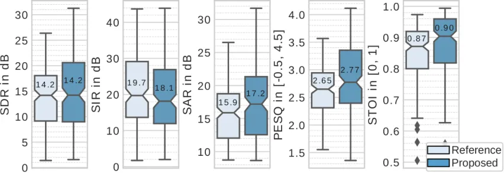

# Speech enhancement with variational autoencoders and alpha-stable distributions

Simon Leglaive    Umut Şimşekli    Antoine Liutkus    Laurent Girin   
Radu Horaud ^(†)^(†)thanks: This work is supported by the ERC Advanced
Grant VHIA \#340113.

###### Abstract

This paper focuses on single-channel semi-supervised speech enhancement.
We learn a speaker-independent deep generative speech model using the
framework of variational autoencoders. The noise model remains
unsupervised because we do not assume prior knowledge of the noisy
recording environment. In this context, our contribution is to propose a
noise model based on alpha-stable distributions, instead of the more
conventional Gaussian non-negative matrix factorization approach found
in previous studies. We develop a Monte Carlo expectation-maximization
algorithm for estimating the model parameters at test time. Experimental
results show the superiority of the proposed approach both in terms of
perceptual quality and intelligibility of the enhanced speech signal.

###### Index Terms: 

Speech enhancement, variational autoencoders, alpha-stable distribution,
Monte Carlo expectation-maximization.

^(†)^(†)address: ¹Inria Grenoble Rhône-Alpes, France,   ²LTCI, Télécom
ParisTech, Université Paris-Saclay, France  
³Inria and LIRMM, France,   ⁴Univ. Grenoble Alpes, Grenoble INP,
GIPSA-lab, France

## 1 Introduction

Speech enhancement is one of the central problems in audio signal
processing \[1\]. The goal is to recover a clean speech signal after
observing a noisy mixture. In this work, we address single-channel
speech enhancement, which can be seen as an under-determined source
separation problem, where the sources are of different nature.

One popular statistical approach for source separation combines a local
Gaussian model of the time-frequency signal coefficients with a variance
model \[2\]. In this framework, non-negative matrix factorization (NMF)
techniques have been used to model the time-frequency-dependent signal
variance \[3, 4\]. Recently, discriminative approaches based on deep
neural networks (DNNs) have also been investigated for speech
enhancement, with the aim of estimating either clean spectrograms or
time-frequency masks, given noisy spectrograms \[5, 6, 7\]. As a
representative example, a DNN is used in \[6\] to map noisy speech
log-power spectrograms into clean speech log-power spectrograms.

Even more recently, generative models based on deep learning, and in
particular variational autoencoders (VAEs) \[8\], have been used for
single-channel \[9, 10\] and multi-channel speech enhancement \[11,
12\]. These generative model-based approaches provide important
advantages and justify the interest of semi-supervised methods for
speech enhancement. Indeed, as shown in \[9, 10\], fully-supervised
methods such as \[6\] may have issues for generalizing to unseen noise
types. The method proposed in \[10\] was shown to outperform both a
semi-supervised NMF baseline and the fully-supervised deep learning
approach \[6\].

In most cases, probabilistic models for source separation or speech
enhancement rely on a Gaussianity assumption, which turns out to be
restrictive for audio signals \[13\]. As a result, _heavy-tailed_
distributions have started receiving increasing attention in the audio
processing community \[14, 15, 16\]. In particular, $`\alpha`$-stable
distributions (cf. Section 3) are becoming popular heavy-tailed models
for audio modeling due to their nice theoretical properties \[17, 13,
14, 18, 19, 20, 21\].

In this work, we investigate the combination of a deep learning-based
generative speech model with a heavy-tailed $`\alpha`$-stable noise
model. The rationale for introducing a noise model based on heavy-tailed
distributions as opposed to a structured NMF approach as in \[10\] is to
avoid relying on restricting assumptions regarding stationarity or
temporal redundancy of the noisy environment, that may be violated in
practice, leading to errors in the estimates. In addition, we let the
noise model remain unsupervised in order to avoid the aforementioned
generalization issues regarding the noisy recording environment. We
develop a Monte Carlo expectation-maximization algorithm \[22\] for
performing maximum likelihood estimation at test time. Experiments
performed under challenging conditions show that the proposed approach
outperforms the competing approaches in terms of both perceptual quality
and intelligibility.

## 2 Speech model

We work in the short-term Fourier transform (STFT) domain where
$`\mathbb{B}={\{0,...,F-1\}}\times{\{0,...,N-1\}}`$ denotes the set of
time-frequency bins. For $`(f,n)\in\mathbb{B}`$, $`f`$ denotes the
frequency index and $`n`$ the time-frame index. We use
$`s_{fn},b_{fn},x_{fn}\in\mathbb{C}`$ to denote the complex STFT
coefficients of the speech, noise, and mixture signals, respectively.

As in \[9, 10\], independently for all $`(f,n)\in\mathbb{B}`$, we
consider the following generative speech model involving a latent random
vector $`\mathbf{h}_{n}\in\mathbb{R}^{L}`$, with $`L\ll F`$:

```math
\displaystyle\mathbf{h}_{n} \displaystyle\sim\mathcal{N}(\mathbf{0},\mathbf{I}); \tag{1}
```

```math
\displaystyle s_{fn}\mid\mathbf{h}_{n} \displaystyle\sim\mathcal{N}_{c}(0,\sigma_{s,f}^{2}(\mathbf{h}_{n})), \tag{2}
```

where $`\mathcal{N}(\mathbf{x};\boldsymbol{\mu},\boldsymbol{\Sigma})`$
denotes the multivariate Gaussian distribution for a real-valued random
vector, $`\mathbf{I}`$ is the identity matrix of appropriate size, and
$`\mathcal{N}_{c}(x;\mu,\sigma^{2})`$ denotes the univariate complex
proper Gaussian distribution. As represented in Fig. 1a,
$`\{\sigma_{s,f}^{2}:\mathbb{R}^{L}\mapsto\mathbb{R}_{+}\}_{f=0}^{F-1}`$
is a set of non-linear functions corresponding to a neural network which
takes as input $`\mathbf{h}_{n}\in\mathbb{R}^{L}`$. This variance term
can be understood as a model for the short-term power spectral density
of speech \[23\]. We denote by $`\boldsymbol{\theta}_{s}`$ the
parameters of this _generative neural network_.

An important contribution of VAEs \[8\] is to provide an efficient way
of learning the parameters of such a generative model. Let
$`\mathbf{s}=\{\mathbf{s}_{n}\in\mathbb{C}^{F}\}_{n=0}^{N-1}`$ be a
training dataset of clean-speech STFT time frames and
$`\mathbf{h}=\{\mathbf{h}_{n}\in\mathbb{R}^{L}\}_{n=0}^{N-1}`$ the set
of associated latent random vectors. Taking ideas from variational
inference, VAEs estimate the parameters $`\boldsymbol{\theta}_{s}`$ by
maximizing a lower bound of the log-likelihood
$`\ln p(\mathbf{s};\boldsymbol{\theta}_{s})`$ defined by:

```math
\mathcal{L}\left(\boldsymbol{\theta}_{s},\boldsymbol{\psi}\right)\hskip-1.5pt=\hskip-1.5pt\mathbb{E}_{q\left(\mathbf{h}\mid\mathbf{s};\boldsymbol{\psi}\right)}\left[\ln p\left(\mathbf{s}\mid\mathbf{h};\boldsymbol{\theta}_{s}\right)\right]-D_{\text{KL}}\left(q\left(\mathbf{h}\mid\mathbf{s};\boldsymbol{\psi}\right)\parallel p(\mathbf{h})\right), \tag{3}
```

where $`q\left(\mathbf{h}\mid\mathbf{s};\boldsymbol{\psi}\right)`$
denotes an approximation of the intractable true posterior distribution
$`p(\mathbf{h}\mid\mathbf{s};\boldsymbol{\theta}_{s})`$, and
$`D_{\text{KL}}(q\parallel p)=\mathbb{E}_{q}[\ln(q/p)]`$ is the
Kullback-Leibler divergence. Independently for all the dimensions
$`l\in\{0,...,L-1\}`$ and all the time frames $`n\in\{0,...,N-1\}`$,
$`q(\mathbf{h}\mid\mathbf{s};\boldsymbol{\psi})`$ is defined by:

```math
h_{l,n}\mid\mathbf{s}_{n}\sim\mathcal{N}\left(\tilde{\mu}_{l}\left(|\mathbf{s}_{n}|^{\odot 2}\right),\tilde{\sigma}_{l}^{2}\left(|\mathbf{s}_{n}|^{\odot 2}\right)\right), \tag{4}
```

where $`h_{l,n}=(\mathbf{h}_{n})_{l}`$ and $`(\cdot)^{\odot\cdot}`$
denotes element-wise exponentiation. As represented in Figure 1b,
$`\{\tilde{\mu}_{l}:\mathbb{R}_{+}^{F}\mapsto\mathbb{R}\}_{l=0}^{L-1}`$
and
$`\{\tilde{\sigma}_{l}^{2}:\mathbb{R}_{+}^{F}\mapsto\mathbb{R}_{+}\}_{l=0}^{L-1}`$
are non-linear functions corresponding to a neural network which takes
as input the speech power spectrum at a given time frame.
$`\boldsymbol{\psi}`$ denotes the parameters of this _recognition
network_, which also have to be estimated by maximizing the _variational
lower bound_ defined in (3). Using (1), (2) and (4) we can develop this
objective function as follows:

```math
\displaystyle\mathcal{L}\left(\boldsymbol{\theta}_{s},\boldsymbol{\psi}\right)\overset{c}{=} \displaystyle-\sum_{f=0}^{F-1}\sum_{n=0}^{N-1}\mathbb{E}_{q\left(\mathbf{h}_{n}\mid\mathbf{s}_{n};\boldsymbol{\psi}\right)}\left[d_{\text{IS}}\left(\left|s_{fn}\right|^{2};\sigma_{f}^{2}(\mathbf{h}_{n})\right)\right]
```

```math
\displaystyle\hskip-45.52458pt+\frac{1}{2}\sum_{l=0}^{L-1}\sum_{n=0}^{N-1}\left[\ln\tilde{\sigma}_{l}^{2}\left(\left|\mathbf{s}_{n}\right|^{\odot 2}\right)-\tilde{\mu}_{l}\left(\left|\mathbf{s}_{n}\right|^{\odot 2}\right)^{2}-\tilde{\sigma}_{l}^{2}\left(\left|\mathbf{s}_{n}\right|^{\odot 2}\right)\right], \tag{5}
```

where $`d_{\text{IS}}(x;y)=x/y-\ln(x/y)-1`$ is the Itakura-Saito
divergence. Finally, using the so-called “reparametrization trick” \[8\]
to approximate the intractable expectation in (5), we obtain an
objective function which is differentiable with respect to both
$`\boldsymbol{\theta}_{s}`$ and $`\boldsymbol{\psi}`$ and can be
optimized using gradient-ascent-based algorithms. It is important to
note that the only reason why the recognition network is introduced is
to learn the parameters of the generative network.

(a) Generative network.

(b) Recognition network.

Figure 1: Generative and recognition networks. Beside each layer is
indicated its size and the activation function.

## 3 Noise and Mixture Models

In the previous section we have seen how to learn the parameters of the
generative model (1)-(2). This model can then be used as a speech signal
probabilistic prior for a variety of applications. In this paper we are
interested in single-channel speech enhancement.

We do not assume prior knowledge about the recording environment, so
that the noise model remains unsupervised. Independently for all
$`(f,n)\in\mathbb{B}`$, the STFT coefficients of noise are modeled as
complex circularly symmetric $`\alpha`$-stable random variables \[24\]:

```math
b_{fn}\sim\mathcal{S}\alpha\mathcal{S}(\sigma_{b,f}), \tag{6}
```

where $`\alpha\in]0,2]`$ is the characteristic exponent and
$`\sigma_{b,f}\in\mathbb{R}_{+}`$ is the scale parameter. As proposed in
\[20\] for multichannel speech enhancement, this scale parameter is only
frequency-dependent, it does not depend on time. For algorithmic
purposes, the noise model (6) can be conveniently rewritten in an
_equivalent_ scale mixture of Gaussians form \[25\], by making use of
the product property of the symmetric $`\alpha`$-stable distribution
\[24\]:

```math
\displaystyle\phi_{fn} \displaystyle\sim\mathcal{P}\frac{\alpha}{2}\mathcal{S}\Big(2\cos(\pi\alpha/4)^{2/\alpha}\Big); \tag{7}
```

```math
\displaystyle b_{fn}\mid\phi_{fn} \displaystyle\sim\mathcal{N}_{c}(0,\phi_{fn}\sigma_{b,f}^{2}), \tag{8}
```

where $`\phi_{fn}\in\mathbb{R}_{+}`$ is called the _impulse variable_.
It locally modulates the variance of the conditional distribution of
$`b_{fn}`$ given in (8). $`\mathcal{P}\frac{\alpha}{2}\mathcal{S}`$
denotes a positive stable distribution of characteristic exponent
$`\alpha/2`$. It corresponds to a right-skewed heavy-tailed distribution
defined for non-negative random variables \[26\]. These impulse
variables can be understood as carrying uncertainty about the stationary
noise assumption made in the marginal model (6), where the scale
parameter does not depend on the time-frame index.

The observed mixture signal is modeled as follows for all
$`(f,n)\in\mathbb{B}`$:

```math
x_{fn}=\sqrt{g_{n}}s_{fn}+b_{fn}, \tag{9}
```

where $`g_{n}\in\mathbb{R}_{+}`$ represents a frame-dependent but
frequency-independent gain. The importance of this parameter was
experimentally shown in \[10\]. We further consider the conditional
independence of the speech and noise STFT coefficients so that:

```math
x_{fn}\mid\mathbf{h}_{n},\phi_{fn}\sim\mathcal{N}_{c}\left(0,g_{n}\sigma_{s,f}^{2}(\mathbf{h}_{n})+\phi_{fn}\sigma_{b,f}^{2}\right). \tag{10}
```

## 4 Inference

Let
$`\boldsymbol{\theta}_{u}=\left\{\mathbf{g}=\{g_{n}\in\mathbb{R}_{+}\}_{n=0}^{N-1},\boldsymbol{\sigma}_{b}^{2}=\{\sigma_{b,f}^{2}\in\mathbb{R}_{+}\}_{f=0}^{F-1}\right\}`$
be the set of model parameters to be estimated. For maximum likelihood
estimation, in this section we develop a Monte-Carlo expectation
maximization (MCEM) algorithm \[22\], which iteratively applies the
so-called E- and M-steps until convergence, which we detail below.
Remember that the speech generative model parameters
$`\boldsymbol{\theta}_{s}`$ have been learned during a training phase
(see Section 2). We denote by
$`\mathbf{x}=\{x_{fn}\}_{(f,n)\in\mathbb{B}}`$ the set of observed data
while
$`\mathbf{z}=\left\{\mathbf{h}_{n},\boldsymbol{\phi}_{n}=\{\phi_{fn}\}_{f=0}^{F-1}\right\}_{n=0}^{N-1}`$
is the set of latent variables. We will also use
$`\mathbf{x}_{n}=\{x_{fn}\}_{f=0}^{F-1}`$ and
$`\mathbf{z}_{n}=\left\{\mathbf{h}_{n},\boldsymbol{\phi}_{n}\right\}`$
to respectively denote the set of observed and latent variables at a
given time frame $`n`$.

Monte Carlo E-Step.   Let $`\boldsymbol{\theta}_{u}^{\star}`$ be the
current (or the initial) value of the model parameters. At the E-step of
a standard expectation-maximization algorithm, we would compute the
following conditional expectation of the complete-data log-likelihood
$`Q(\boldsymbol{\theta}_{u};\boldsymbol{\theta}_{u}^{\star})=\mathbb{E}_{p(\mathbf{z}\mid\mathbf{x};\boldsymbol{\theta}_{s},\boldsymbol{\theta}_{u}^{\star})}\left[\ln p(\mathbf{x},\mathbf{z};\boldsymbol{\theta}_{s},\boldsymbol{\theta}_{u})\right]`$.
However, this expectation cannot be here computed analytically. We
therefore approximate
$`Q(\boldsymbol{\theta}_{u};\boldsymbol{\theta}_{u}^{\star})`$ using an
empirical average:

```math
\displaystyle\tilde{Q}(\boldsymbol{\theta}_{u};\boldsymbol{\theta}_{u}^{\star})\overset{c}{=} \displaystyle-\frac{1}{R}\sum_{r=1}^{R}\sum_{(f,n)\in\mathbb{B}}\Big[\ln\left(g_{n}\sigma_{s,f}^{2}\left(\mathbf{h}_{n}^{(r)}\right)+\phi_{fn}^{(r)}\sigma_{b,f}^{2}\right)
```

```math
\displaystyle+|x_{fn}|^{2}\left(g_{n}\sigma_{s,f}^{2}\left(\mathbf{h}_{n}^{(r)}\right)+\phi_{fn}^{(r)}\sigma_{b,f}^{2}\right)^{-1}\Big], \tag{11}
```

where $`\overset{c}{=}`$ denotes equality up to an additive constant,
and
$`\mathbf{z}_{n}^{(r)}=\big\{\mathbf{h}_{n}^{(r)},\boldsymbol{\phi}_{n}^{(r)}=\big\{\phi_{fn}^{(r)}\big\}_{f=0}^{F-1}\big\}`$,
$`r\in\{1,...,R\}`$, is a sample drawn from the posterior
$`p(\mathbf{z}_{n}\mid\mathbf{x}_{n};\boldsymbol{\theta}_{s},\boldsymbol{\theta}_{u}^{\star})`$
using a Markov Chain Monte Carlo (MCMC) method. This approach forms the
basis of the MCEM algorithm \[22\]. Note that unlike the standard EM
algorithm, it does not ensure an improvement in the likelihood at each
iteration. Nevertheless, some convergence results in terms of stationary
points of the likelihood can be obtained under suitable conditions
\[27\].

In this work we use a (block) Gibbs sampling algorithm \[28\]. From an
initialization $`\mathbf{z}_{n}^{(0)}`$, it consists in iteratively
sampling from the so-called full conditionals. More precisely, at the
$`m`$-th iteration of the algorithm and independently for all
$`n\in\{0,...,N-1\}`$, we first sample
$`\mathbf{h}_{n}^{(m)}\sim p\big(\mathbf{h}_{n}\mid\mathbf{x}_{n},\boldsymbol{\phi}_{n}^{(m-1)};\boldsymbol{\theta}_{s},\boldsymbol{\theta}_{u}^{\star}\big)`$.
Then, we sample
$`\phi_{fn}^{(m)}\sim p\big(\phi_{fn}\mid x_{fn},\mathbf{h}_{n}^{(m)};\boldsymbol{\theta}_{s},\boldsymbol{\theta}_{u}^{\star}\big)`$
independently for all $`f\in\{0,...,F-1\}`$. Those two full conditionals
are unfortunately analytically intractable, but we can use one iteration
of the Metropolis-Hastings algorithm to sample from them. This approach
corresponds to the Metropolis-within-Gibbs sampling algorithm \[28, p.
393\]. One iteration of this method is detailed in Algorithm 1. The
proposal distributions for $`\mathbf{h}_{n}`$ and $`\phi_{fn}`$ are
respectively given in lines 2 and 6. The two acceptance probabilities
required in lines 3 and 7 are computed as follows:

```math
\alpha_{n}^{(h)}=\min\left(\hskip-2.4pt1,\displaystyle\frac{p\left(\tilde{\mathbf{h}}_{n}\right)\prod\limits_{f=0}^{F-1}p\left(x_{fn}\mid\tilde{\mathbf{h}}_{n},\phi_{fn}^{(m-1)};\boldsymbol{\theta}_{s},\boldsymbol{\theta}_{u}^{\star}\right)}{p\left(\mathbf{h}_{n}^{(m-1)}\right)\prod\limits_{f=0}^{F-1}p\left(x_{fn}\mid\mathbf{h}_{n}^{(m-1)},\phi_{fn}^{(m-1)};\boldsymbol{\theta}_{s},\boldsymbol{\theta}_{u}^{\star}\right)}\hskip-2.4pt\right); \tag{12}
```

```math
\alpha_{n}^{(\phi)}=\min\left(1,\displaystyle\frac{p\big(x_{fn}\mid\mathbf{h}_{n}^{(m)},\tilde{\phi}_{fn};\boldsymbol{\theta}_{s},\boldsymbol{\theta}_{u}^{\star}\big)}{p\big(x_{fn}\mid\mathbf{h}_{n}^{(m)},\phi_{fn}^{(m-1)};\boldsymbol{\theta}_{s},\boldsymbol{\theta}_{u}^{\star}\big)}\right). \tag{13}
```

The two distributions involved in the computation of those acceptance
probabilities are defined in (1) and (10). Finally, we only keep the
last $`R`$ samples for computing
$`\tilde{Q}(\boldsymbol{\theta}_{u};\boldsymbol{\theta}_{u}^{\star})`$,
i.e. we discard the samples drawn during a so-called burn-in period.

M-Step.   At the M-step we want to minimize
$`-\tilde{Q}(\boldsymbol{\theta}_{u};\boldsymbol{\theta}_{u}^{\star})`$
with respect to $`\boldsymbol{\theta}_{u}`$. Let
$`\mathcal{C}(\boldsymbol{\theta}_{u})`$ denote the cost function
associated with this non-convex optimization problem. Similar to \[29\],
we adopt a majorization-minimization approach. Let us introduce the two
following sets of _auxiliary variables_
$`\mathbf{c}=\{c_{fn}^{(r)}\in\mathbb{R}_{+}\}_{r,f,n}`$ and
$`\boldsymbol{\lambda}=\{\lambda_{k,fn}^{(r)}\in\mathbb{R}_{+}\}_{k,r,f,n}`$.
We can show using standard concave/convex inequalities (see e.g. \[29\])
that
$`\mathcal{C}(\boldsymbol{\theta}_{u})\leq\mathcal{G}(\boldsymbol{\theta}_{u},\mathbf{c},\boldsymbol{\lambda})`$,
where:

```math
\displaystyle\mathcal{G}(\boldsymbol{\theta}_{u},\mathbf{c},\boldsymbol{\lambda})= \displaystyle\frac{1}{R}\sum_{r=1}^{R}\sum_{(f,n)\in\mathbb{B}}\Bigg[\ln\left(c_{fn}^{(r)}\right)
```

```math
\displaystyle+\frac{1}{c_{fn}^{(r)}}\left(g_{n}\sigma_{s,f}^{2}\left(\mathbf{h}_{n}^{(r)}\right)+\phi_{fn}^{(r)}\sigma_{b,f}^{2}-c_{fn}^{(r)}\right)
```

```math
\displaystyle+|x_{fn}|^{2}\Bigg(\frac{\left(\lambda_{1,fn}^{(r)}\right)^{2}}{g_{n}\sigma_{s,f}^{2}\left(\mathbf{h}_{n}^{(r)}\right)}+\frac{\left(\lambda_{2,fn}^{(r)}\right)^{2}}{\phi_{fn}^{(r)}\sigma_{b,f}^{2}}\Bigg)\Bigg]. \tag{14}
```

Moreover, this upper bound is tight, i.e.
$`\mathcal{C}(\boldsymbol{\theta}_{u})=\mathcal{G}(\boldsymbol{\theta}_{u},\mathbf{c},\boldsymbol{\lambda})`$,
for

```math
\displaystyle c_{fn}^{(r)} \displaystyle=g_{n}\sigma_{s,f}^{2}\left(\mathbf{h}_{n}^{(r)}\right)+\phi_{fn}^{(r)}\sigma_{b,f}^{2}; \tag{15}
```

```math
\displaystyle\lambda_{1,fn}^{(r)} \displaystyle=g_{n}\sigma_{s,f}^{2}\left(\mathbf{h}_{n}^{(r)}\right)\left(g_{n}\sigma_{s,f}^{2}\left(\mathbf{h}_{n}^{(r)}\right)+\phi_{fn}^{(r)}\sigma_{b,f}^{2}\right)^{-1}; \tag{16}
```

```math
\displaystyle\lambda_{2,fn}^{(r)} \displaystyle=\phi_{fn}^{(r)}\sigma_{b,f}^{2}\left(g_{n}\sigma_{s,f}^{2}\left(\mathbf{h}_{n}^{(r)}\right)+\phi_{fn}^{(r)}\sigma_{b,f}^{2}\right)^{-1}. \tag{17}
```

Minimizing
$`\mathcal{G}(\boldsymbol{\theta}_{u},\mathbf{c},\boldsymbol{\lambda})`$
with respect to the model parameters $`\boldsymbol{\theta}_{u}`$ is a
convex optimization problem. By zeroing the partial derivatives of
$`\mathcal{G}`$ with respect to each scalar in
$`\boldsymbol{\theta}_{u}`$ we obtain update rules that depend on the
auxiliary variables. We then replace these auxiliary variables with the
formulas given in (15)-(17), which makes the upper bound $`\mathcal{G}`$
tight. This procedure ensures that the cost
$`\mathcal{C}(\boldsymbol{\theta}_{u})`$ decreases \[30\]. The resulting
final updates are given as follows:

```math
\displaystyle\sigma_{b,f}^{2} \displaystyle\leftarrow\sigma_{b,f}^{2}\left[\frac{\sum\limits_{n=0}^{N-1}|x_{fn}|^{2}\sum\limits_{r=1}^{R}\phi_{fn}^{(r)}\left(v_{x,fn}^{(r)}\right)^{-2}}{\sum\limits_{n=0}^{N-1}\sum\limits_{r=1}^{R}\phi_{fn}^{(r)}\left(v_{x,fn}^{(r)}\right)^{-1}}\right]^{1/2}; \tag{18}
```

```math
\displaystyle g_{n} \displaystyle\leftarrow g_{n}\left[\frac{\sum\limits_{f=0}^{F-1}|x_{fn}|^{2}\sum\limits_{r=1}^{R}\sigma_{s,f}^{2}\left(\mathbf{h}_{n}^{(r)}\right)\left(v_{x,fn}^{(r)}\right)^{-2}}{\sum\limits_{f=0}^{F-1}\sum\limits_{r=1}^{R}\sigma_{s,f}^{2}\left(\mathbf{h}_{n}^{(r)}\right)\left(v_{x,fn}^{(r)}\right)^{-1}}\right]^{1/2}, \tag{19}
```

where we introduced
$`v_{x,fn}^{(r)}=g_{n}\sigma_{s,f}^{2}\left(\mathbf{h}_{n}^{(r)}\right)+\phi_{fn}^{(r)}\sigma_{b,f}^{2}`$
in order to ease the notations. Non-negativity is ensured provided that
the parameters are initialized with non-negative values.

Speech reconstruction.   Once the unsupervised model parameters
$`\boldsymbol{\theta}_{u}`$ are estimated with the MCEM algorithm, we
need to estimate the clean speech signal. For all
$`(f,n)\in\mathbb{B}`$, let $`\tilde{s}_{fn}=\sqrt{g_{n}}s_{fn}`$ be the
scaled version of the speech STFT coefficients. We estimate these
variables according to their posterior mean, given by:

```math
\displaystyle\hat{\tilde{s}}_{fn} \displaystyle=\mathbb{E}_{p(\tilde{s}_{fn}\mid x_{fn};\boldsymbol{\theta}_{u},\boldsymbol{\theta}_{s})}[\tilde{s}_{fn}]
```

```math
\displaystyle=\mathbb{E}_{p(\mathbf{z}_{n}\mid\mathbf{x}_{n};\boldsymbol{\theta}_{u},\boldsymbol{\theta}_{s})}\left[\mathbb{E}_{p(\tilde{s}_{fn}\mid\mathbf{z}_{n},\mathbf{x}_{n};\boldsymbol{\theta}_{u},\boldsymbol{\theta}_{s})}[\tilde{s}_{fn}]\right]
```

```math
\displaystyle=\mathbb{E}_{p(\mathbf{z}_{n}\mid\mathbf{x}_{n};\boldsymbol{\theta}_{u},\boldsymbol{\theta}_{s})}\left[\frac{g_{n}\sigma_{s,f}^{2}(\mathbf{h}_{n})}{g_{n}\sigma_{s,f}^{2}(\mathbf{h}_{n})+\phi_{fn}\sigma_{b,f}^{2}}\right]x_{fn}. \tag{20}
```

As before, this expectation cannot be computed analytically so it is
approximated using the Metropolis-within-Gibbs sampling algorithm
detailed in Algorithm 1. This estimate corresponds to a probabilistic
Wiener filtering averaged over all possible realizations of the latent
variables according to their posterior distribution.

1: independently for all $`n\in\{0,...,N-1\}`$ do

2:   Sample
$`\tilde{\mathbf{h}}_{n}\sim\mathcal{N}(\mathbf{h}_{n}^{(m-1)},\epsilon^{2}\mathbf{I})`$

3:   Compute acceptance probability $`\alpha_{n}^{(h)}`$ (equation (12))

4:   Set
$`\mathbf{h}_{n}^{(m)}=\begin{cases}\tilde{\mathbf{h}}_{n}&\text{ if }\alpha_{n}^{(h)}>u_{n}^{(h)}\sim\mathcal{U}([0,1])\\
\mathbf{h}_{n}^{(m-1)}&\text{ otherwise}\end{cases}`$

5:   independently for all $`f\in\{0,...,F-1\}`$ do

6:    Sample
$`\tilde{\phi}_{fn}\sim\mathcal{P}\frac{\alpha}{2}\mathcal{S}\Big(2\cos(\pi\alpha/4)^{2/\alpha}\Big)`$

7:    Compute acceptance probability $`\alpha_{n}^{(\phi)}`$ (equation
(13))

8:    Set
$`\phi_{fn}^{(m)}=\begin{cases}\tilde{\phi}_{fn}&\text{ if }\alpha_{n}^{(\phi)}>u_{n}^{(\phi)}\sim\mathcal{U}([0,1])\\
\phi_{fn}^{(m-1)}&\text{ otherwise}\end{cases}`$

9:   end for

10: end for

Algorithm 1 $`m`$-th iteration of the Metropolis-within-Gibbs sampling
algorithm

## 5 Experiments

Figure 2: Speech enhancement results obtained with the proposed method
as a function of the characteristic exponent $`\alpha`$ in the noise
model (6). $`\alpha=2.0`$ actually corresponds to $`\alpha=1.999`$. The
value of the median is indicated within each boxplot.



Figure 3: Results obtained with the reference and the proposed methods
(using $`\alpha=1.8`$). The median is indicated within each boxplot.

Reference method: The proposed approach is compared with the recent
method \[10\]. The speech signal in this paper is modeled in the exact
same manner as in the current work, only the noise model differs. This
latter is a Gaussian model with an NMF parametrization of the variance
\[3\]:
$`b_{fn}\sim\mathcal{N}_{c}\left(0,\left(\mathbf{W}_{b}\mathbf{H}_{b}\right)_{f,n}\right)`$,
where $`\mathbf{W}_{b}\in\mathbb{R}_{+}^{F\times K}`$ and
$`\mathbf{H}_{b}\in\mathbb{R}_{+}^{K\times N}`$. It is also unsupervised
in the sense that both $`\mathbf{W}_{b}`$ and $`\mathbf{H}_{b}`$ are
estimated from the noisy mixture signal. This method also relies on an
MCEM algorithm. By comparing the proposed method with \[10\], we fairly
investigate which noise model leads to the best speech enhancement
results. Note that the method proposed in \[10\] was shown to outperform
both a semi-supervised NMF baseline and the fully-supervised deep
learning approach \[6\], the latter having difficulties for generalizing
to unseen noise types. We do not include here the results obtained with
these two other methods.

Database: The supervised speech model parameters in the proposed and the
reference methods are learned from the training set of the TIMIT
database \[31\]. It contains almost 4 hours of 16-kHz speech signals,
distributed over 462 speakers. For the evaluation of the speech
enhancement algorithms, we mixed clean speech signals from the TIMIT
test set and noise signals from the DEMAND database \[32\],
corresponding to various noisy environments: domestic, nature, office,
indoor public spaces, street and transportation. We created 168 mixtures
at a 0 dB signal-to-noise ratio (one mixture per speaker in the TIMIT
test set). Note that both speakers and sentences are different than in
the training set.

Parameter setting: The STFT is computed using a 64-ms sine window
(i.e. $`F=513`$) with 75%-overlap. Based on \[10\], the latent dimension
in the speech generative model (1)-(2) is fixed to $`L=64`$. In this
reference method, the NMF rank of the noise model is fixed to $`K=10`$.
The NMF parameters are randomly initialized. For both the proposed and
the reference method, the gain $`g_{n}`$ is initialized to one for all
time frames $`n`$. For the proposed method, the noise scale parameter
$`\sigma_{b,f}`$ is also initialized to one for all frequency bins. We
run 200 iterations of the MCEM algorithm. At each Monte-Carlo E-Step, we
run 40 iterations of the Metropolis-within-Gibbs algorithm and we
discard the first 30 samples as the burn-in period. The parameter
$`\epsilon^{2}`$ in line 2 of Algorithm 1 is set to $`0.01`$.

Neural network: The structure of the generative and recognition networks
is the same as in \[10\] and is represented in Fig. 1. Hidden layers use
hyperbolic tangent ($`\tanh(\cdot)`$) activation functions and output
layers use identity activation functions ($`I_{d}(\cdot)`$). The output
of these last layers is therefore real-valued, which is the reason why
we consider logarithm of variances. For learning the parameters
$`\boldsymbol{\theta}_{s}`$ and $`\boldsymbol{\phi}`$, we use the Adam
optimizer \[33\] with a step size of $`10^{-3}`$, exponential decay
rates for the first and second moment estimates of $`0.9`$ and $`0.999`$
respectively, and an epsilon of $`10^{-7}`$ for preventing division by
zero. 20% of the TIMIT training set is kept as a validation set, and
early stopping with a patience of 10 epochs is used. Weights are
initialized using the uniform initializer described in \[34\].

Results: The estimated speech signal quality is evaluated in terms of
standard energy ratios expressed in decibels (dBs) \[35\]: the
signal-to-distortion (SDR), signal-to-interference (SIR) and
signal-to-artifact (SAR) ratios. We also consider the perceptual
evaluation of speech quality (PESQ) \[36\] measure (in $`[-0.5,4.5]`$),
and the short-time objective intelligibility (STOI) measure \[37\] (in
$`[0,1]`$). For all measures, the higher the better. We first study the
performance of the proposed method according to the choice of the
characteristic exponent $`\alpha`$ in the noise model (6). Results
presented in Fig. 2 indicate that according to the PESQ and STOI
measures, the best performance is obtained for $`\alpha=2`$ (Gaussian
case).¹¹ 1 Actually $`\alpha=1.999`$ because for $`\alpha=2`$ the
positive $`\alpha`$-stable distribution in (6) is degenerate. The SDR
indicates that we should choose $`\alpha=1.8`$. Indeed, for greater
values of $`\alpha`$, the SIR starts to decrease
($`\sim\hskip-3.0pt1`$dB difference between $`\alpha=1.8`$ and
$`\alpha=2`$) while the SAR remains stable (results are not shown here
due to space constraints). Therefore, in Fig. 3 we compare the results
obtained with the reference \[10\] and the proposed method using
$`\alpha=1.8`$. With the proposed method, the estimated speech signal
contains more interferences (SIR is lower) but less artifacts (SAR is
higher). According to the SDR both methods are equivalent. But for
intelligibility and perceptual quality, artifacts are actually more
disturbing than interferences \[38\], which is the reason why the
proposed method obtains better results in terms of both STOI and PESQ
measures. For reproducibility, a Python implementation of our algorithm
and audio examples are available online.²² 2
https://team.inria.fr/perception/icassp2019-asvae/

## 6 Conclusion

In this work, we proposed a speech enhancement method exploiting a
speech model based on VAEs and a noise model based on alpha-stable
distributions. At the expense of more interferences, the proposed
$`\alpha`$-stable noise model reduces the amount of artifacts in the
estimated speech signal, compared to the use of a Gaussian NMF-based
noise model as in \[10\]. Overall, it is shown that the proposed
approach improves the intelligibility and perceptual quality of the
enhanced speech signal. Future works include extending the proposed
approach to a multi-microphone setting using multivariate
$`\alpha`$-stable distributions \[18, 20\].

## References

- \[1\] P. C. Loizou, Speech enhancement: theory and practice, CRC
  press, 2007.
- \[2\] E. Vincent, M. G. Jafari, S. A. Abdallah, M. D. Plumbley, and
  M. E. Davies, “Probabilistic modeling paradigms for audio source
  separation,” in Machine Audition: Principles, Algorithms and
  Systems, W. Wang, Ed., pp. 162–185. IGI Global, 2010.
- \[3\] C. Févotte, N. Bertin, and J.-L. Durrieu, “Nonnegative matrix
  factorization with the Itakura-Saito divergence: With application to
  music analysis,” Neural computation, vol. 21, no. 3, pp.
  793–830, 2009.
- \[4\] N. Mohammadiha, P. Smaragdis, and A. Leijon, “Supervised and
  unsupervised speech enhancement using nonnegative matrix
  factorization,” IEEE Trans. Audio, Speech, Language Process., vol. 21,
  no. 10, pp. 2140–2151, 2013.
- \[5\] D. Wang and J. Chen, “Supervised speech separation based on
  deep learning: An overview,” IEEE Trans. Audio, Speech, Language
  Process., vol. 26, no. 10, pp. 1702–1726, 2018.
- \[6\] Y. Xu, J. Du, L.-R. Dai, and C.-H. Lee, “A regression approach
  to speech enhancement based on deep neural networks,” IEEE Trans.
  Audio, Speech, Language Process., vol. 23, no. 1, pp. 7–19, 2015.
- \[7\] F. Weninger, H. Erdogan, S. Watanabe, E. Vincent, J. Le Roux,
  J. R. Hershey, and B. Schuller, “Speech enhancement with LSTM
  recurrent neural networks and its application to noise-robust ASR,” in
  Proc. Int. Conf. Latent Variable Analysis and Signal Separation
  (LVA/ICA), 2015, pp. 91–99.
- \[8\] D. P. Kingma and M. Welling, “Auto-encoding variational Bayes,”
  in Proc. Int. Conf. Learning Representations (ICLR), 2014.
- \[9\] Y. Bando, M. Mimura, K. Itoyama, K. Yoshii, and T. Kawahara,
  “Statistical speech enhancement based on probabilistic integration of
  variational autoencoder and non-negative matrix factorization,” in
  Proc. IEEE Int. Conf. Acoust., Speech, Signal Process. (ICASSP), 2018,
  pp. 716–720.
- \[10\] S. Leglaive, L. Girin, and R. Horaud, “A variance modeling
  framework based on variational autoencoders for speech enhancement,”
  Proc. IEEE Int. Workshop Machine Learning Signal Process.
  (MLSP), 2018.
- \[11\] K. Sekiguchi, Y. Bando, K. Yoshii, and T. Kawahara, “Bayesian
  multichannel speech enhancement with a deep speech prior,” in Proc.
  Asia-Pacific Signal and Information Processing Association Annual
  Summit and Conference (APSIPA ASC), 2018, pp. 1233–1239.
- \[12\] S. Leglaive, L. Girin, and R. Horaud, “Semi-supervised
  multichannel speech enhancement with variational autoencoders and
  non-negative matrix factorization,” in Proc. IEEE Int. Conf. Acoust.,
  Speech, Signal Process. (ICASSP), 2019.
- \[13\] A. Liutkus and R. Badeau, “Generalized Wiener filtering with
  fractional power spectrograms,” in Proc. IEEE Int. Conf. Acoust.,
  Speech, Signal Process. (ICASSP), 2015, pp. 266–270.
- \[14\] U. Şimşekli, A. Liutkus, and A. T. Cemgil, “Alpha-stable
  matrix factorization,” IEEE Signal Process. Lett., vol. 22, no. 12,
  pp. 2289–2293, 2015.
- \[15\] A. Liutkus, D. Fitzgerald, and R. Badeau, “Cauchy nonnegative
  matrix factorization,” in Proc. IEEE Workshop Applicat. Signal
  Process. Audio Acoust. (WASPAA), New Paltz, NY, USA, 2015, pp. 1–5.
- \[16\] K. Yoshii, K. Itoyama, and M. Goto, “Student’s t nonnegative
  matrix factorization and positive semidefinite tensor factorization
  for single-channel audio source separation,” in Proc. IEEE Int. Conf.
  Acoust., Speech, Signal Process. (ICASSP), 2016, pp. 51–55.
- \[17\] E. E. Kuruoglu, Signal processing in alpha-stable noise
  environments: a least lp-norm approach, Ph.D. thesis, University of
  Cambridge, 1999.
- \[18\] S. Leglaive, U. Şimşekli, A. Liutkus, R. Badeau, and G.
  Richard, “Alpha-stable multichannel audio source separation,” in Proc.
  IEEE Int. Conf. Acoust., Speech, Signal Process. (ICASSP), 2017, pp.
  576–580.
- \[19\] M. Fontaine, A. Liutkus, L. Girin, and R. Badeau, “Explaining
  the parameterized Wiener filter with alpha-stable processes,” in Proc.
  IEEE Workshop Applicat. Signal Process. Audio Acoust. (WASPAA), 2017.
- \[20\] M. Fontaine, F.-R. Stöter, A. Liutkus, U. Şimşekli, R.
  Serizel, and R. Badeau, “Multichannel Audio Modeling with Elliptically
  Stable Tensor Decomposition,” in Proc. Int. Conf. Latent Variable
  Analysis and Signal Separation (LVA/ICA), 2018.
- \[21\] U. Şimşekli, H. Erdoğan, S. Leglaive, A. Liutkus, R. Badeau,
  and G. Richard, “Alpha-stable low-rank plus residual decomposition for
  speech enhancement,” in Proc. IEEE Int. Conf. Acoust., Speech, Signal
  Process. (ICASSP), 2018.
- \[22\] G. C. Wei and M. A. Tanner, “A Monte Carlo implementation of
  the EM algorithm and the poor man’s data augmentation algorithms,”
  Journal of the American statistical Association, vol. 85, no. 411, pp.
  699–704, 1990.
- \[23\] A. Liutkus, R. Badeau, and G. Richard, “Gaussian processes for
  underdetermined source separation,” IEEE Trans. Signal Process., vol.
  59, no. 7, pp. 3155–3167, 2011.
- \[24\] G. Samorodnitsky and M. S. Taqqu, Stable non-Gaussian random
  processes: stochastic models with infinite variance, vol. 1, CRC
  press, 1994.
- \[25\] D. F. Andrews and C. L. Mallows, “Scale mixtures of normal
  distributions,” Journal of the Royal Statistical Society. Series B
  (Methodological), vol. 36, no. 1, pp. 99–102, 1974.
- \[26\] P. Magron, R. Badeau, and A. Liutkus, “Lévy NMF for robust
  nonnegative source separation,” in Proc. IEEE Workshop Applicat.
  Signal Process. Audio Acoust. (WASPAA), New Paltz, NY, United States,
  2017, pp. 259–263.
- \[27\] K. Chan and J. Ledolter, “Monte Carlo EM estimation for time
  series models involving counts,” Journal of the American Statistical
  Association, vol. 90, no. 429, pp. 242–252, 1995.
- \[28\] C. P. Robert and G. Casella, Monte Carlo Statistical Methods,
  Springer-Verlag New York, Inc., Secaucus, NJ, USA, 2005.
- \[29\] C. Févotte and J. Idier, “Algorithms for nonnegative matrix
  factorization with the $`\beta`$-divergence,” Neural computation, vol.
  23, no. 9, pp. 2421–2456, 2011.
- \[30\] D. R. Hunter and K. Lange, “A tutorial on MM algorithms,” The
  American Statistician, vol. 58, no. 1, pp. 30–37, 2004.
- \[31\] J. S. Garofolo, L. F. Lamel, W. M. Fisher, J. G. Fiscus, D. S.
  Pallett, N. L. Dahlgren, and V. Zue, “TIMIT acoustic phonetic
  continuous speech corpus,” in Linguistic data consortium, 1993.
- \[32\] J. Thiemann, N. Ito, and E. Vincent, “The Diverse Environments
  Multi-channel Acoustic Noise Database (DEMAND): A database of
  multichannel environmental noise recordings,” in Proc. Int. Cong. on
  Acoust., 2013.
- \[33\] D. P. Kingma and J. Ba, “Adam: A method for stochastic
  optimization,” in Proc. Int. Conf. Learning Representations
  (ICLR), 2015.
- \[34\] X. Glorot and Y. Bengio, “Understanding the difficulty of
  training deep feedforward neural networks,” in Proc. Int. Conf. Artif.
  Intelligence and Stat., 2010, pp. 249–256.
- \[35\] E. Vincent, R. Gribonval, and C. Févotte, “Performance
  measurement in blind audio source separation,” IEEE Trans. Audio,
  Speech, Language Process., vol. 14, no. 4, pp. 1462–1469, 2006.
- \[36\] A. W. Rix, J. G. Beerends, M. P. Hollier, and A. P. Hekstra,
  “Perceptual evaluation of speech quality (PESQ)-a new method for
  speech quality assessment of telephone networks and codecs,” in Proc.
  IEEE Int. Conf. Acoust., Speech, Signal Process. (ICASSP), 2001, pp.
  749–752.
- \[37\] C. H. Taal, R. C. Hendriks, R. Heusdens, and J. Jensen, “An
  algorithm for intelligibility prediction of time–frequency weighted
  noisy speech,” IEEE Trans. Audio, Speech, Language Process., vol. 19,
  no. 7, pp. 2125–2136, 2011.
- \[38\] S. Venkataramani, R. Higa, and P. Smaragdis, “Performance
  based cost functions for end-to-end speech separation,” in Proc.
  Asia-Pacific Signal and Information Processing Association Annual
  Summit and Conference (APSIPA ASC), 2018, pp. 350–355.
