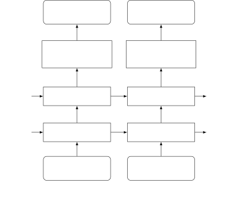
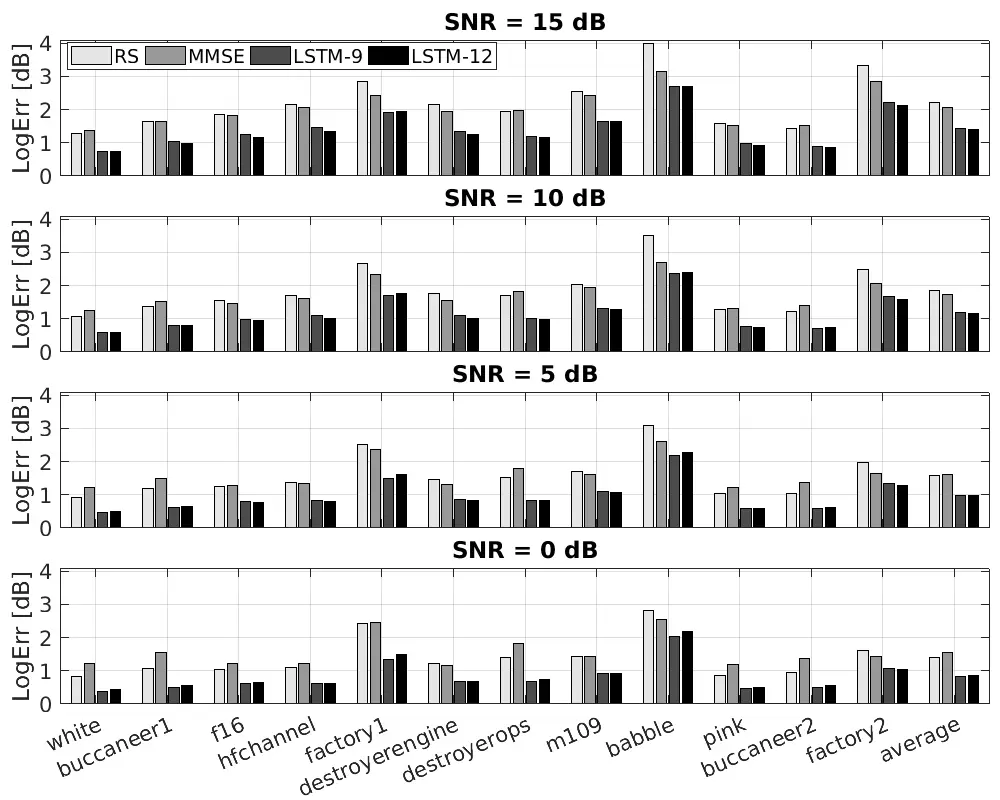
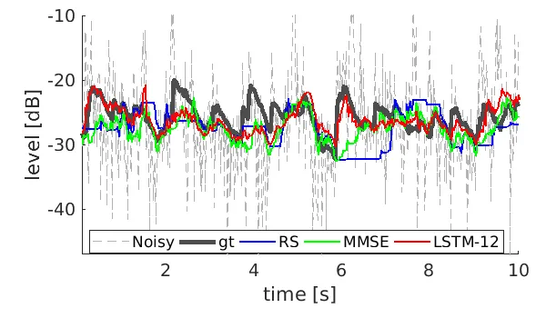
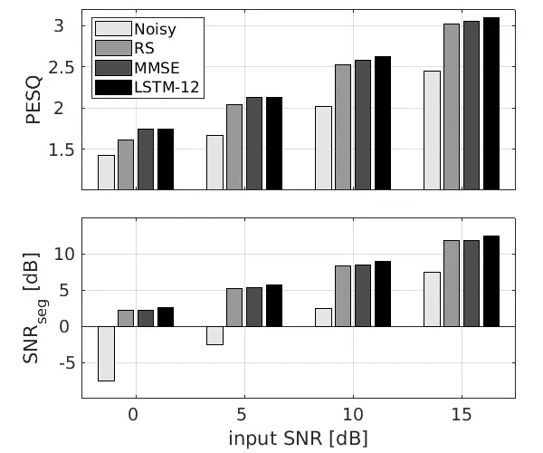

# Audio-noise Power Spectral Density Estimation Using Long Short-term Memory

Xiaofei Li    Simon Leglaive    Laurent Girin    Radu Horaud
^(†)^(†)thanks: Xiaofei Li, Simon Leglaive and Radu Horaud are with
Inria and with Univ. Grenoble Alpes,, France. E-mail:
first.last@inria.fr ^(†)^(†)thanks: Laurent Girin is with Inria and with
Univ. Grenoble Alpes, Grenoble-INP, GIPSA-lab, France. E-mail:
laurent.girin@grenoble-inp.fr

###### Abstract

We propose a method using a long short-term memory (LSTM) network to
estimate the noise power spectral density (PSD) of single-channel audio
signals represented in the short time Fourier transform (STFT) domain.
An LSTM network common to all frequency bands is trained, which
processes each frequency band individually by mapping the noisy STFT
magnitude sequence to its corresponding noise PSD sequence. Unlike
deep-learning-based speech enhancement methods that learn the full-band
spectral structure of speech segments, the proposed method exploits the
sub-band STFT magnitude evolution of noise with a long time dependency,
in the spirit of the unsupervised noise estimators described in the
literature. Speaker- and speech-independent experiments with different
types of noise show that the proposed method outperforms the
unsupervised estimators, and generalizes well to noise types that are
not present in the training set.

###### Index Terms: 

Noise PSD, LSTM, Speech enhancement.

## I Introduction

Noise power spectral density (PSD) estimation is a prerequisite for many
audio applications, such as speech enhancement \[1, 2, 3\], voice
activity detection \[4, 5\], acoustic environment identification \[6\]
and noise-aware training of speech enhancement network \[7, 8\], to cite
a few. Noise PSD estimation is generally performed in the time-frequency
(TF) domain, and in an online manner. The local minimum of the smoothed
noisy signal periodogram, searched in a sliding window, is widely
employed for noise PSD estimation \[9\]. Due to the spectral sparsity of
speech, the local minimum point is assumed to locate in a speech absence
segment, and thus it corresponds to a noise-only segment. The local
minimum is multiplied with a compensation factor leading to noise PSD
estimate in the minimum statistics algorithm \[9\]. Based on the local
minimum, the improved minima controlled recursive averaging algorithm
(MCRA) \[10\] first estimates the speech presence probability (SPP) for
each frame, and then averages the noisy signal periodogram weighted by
SPP. In \[11\], a non-linear averaging of the past spectral values is
proposed to track the local minimum, which circumvents the possible
tracking latency when applying the minimum-search window. Instead of
using the local minimum, other regional statistics such as normalized
variance and median crossing rate are used to estimate the SPP in
\[12\], which also circumvents the aforementionned possible tracking
latency. The minimum mean-squared error (MMSE) based methods \[13, 14\]
estimate the noise PSD by recursively averaging the posterior mean of
the noise periodogram given the noisy speech periodogram, which can be
interpreted as a voice activity detector. In the MMSE-based methods, the
required parameters of the probablistic model, i.e. noise and speech
PSDs, are approximated by their estimates at the previous frame. The
above mentioned methods, i.e. \[9, 10, 11, 12, 13, 14\], are all
unsupervised and applied separately for each frequency bin. They
explicitly or implicitly detect the noise-only segments, and estimate
the noise PSD during these segments. To do that, they exploit the
difference in noise and speech characteristics, i.e. noise is assumed to
be more stationary than speech, and the speech TF representation is
assumed to be more sparse than the noise one. Therefore, these methods
are suitable for reasonably non-stationary background noise, but not for
highly non-stationary (transient) noise, i.e. noise with a PSD that can
vary suddenly.

Recently, supervised deep-learning-based speech enhancement has been
largely investigated, see \[15\] for an overview. These methods use a
neural network to map noisy speech features to clean speech features.
The input features, e.g. cepstral coefficient and linear prediction
based features, generally encode the full-band structure of noisy speech
spectra. The output target vector generally consists of either the clean
speech STFT magnitude vector or an ideal binary (or ratio) mask vector
to be applied on the corresponding noisy speech STFT frame. Widely-used
speech enhancement neural networks include feed-forward neural network
(FNN) and recurrent neural network (RNN). The temporal dynamics of
speech can be modeled by stacking context frames in the FNN input, while
it is automatically modeled by RNN. The ideal binary (ratio) mask can be
considered as an SPP estimate. Therefore, it can be further used for
noise variance (or covariance for the multichannel case) estimation
\[16, 17, 18, 19, 20\]. In \[21\], an LSTM RNN is employed to estimate
log-Mel spectrograms not only for clean speech, but also for noise. In
\[22\], instead of estimating the noise PSD for each TF bin, the global
signal-to-noise-ratio (SNR) of a long-term noisy speech signal is
estimated using an FNN.

In this work, we propose an online method for estimating the noise PSD
individually at each frequency band, thus following the same principle
as the unsupervised methods \[9, 10, 11, 12, 13, 14\], but leveraging an
LSTM RNN. Such a network is able to efficiently model the temporal
dynamics of audio signal \[21, 23\]. In the STFT domain, a sequence of
noisy speech STFT magnitudes within a small subband (3 consecutive
frequency bins) is input to the LSTM network, which outputs the
corresponding sequence of noise (log-scale) PSD estimate at the
corresponding central frequency bin. This process is applied for all
frequencies with the same unique LSTM network. The network is expected
not only to learn a regression function from the input sequence to the
output sequence, but also to learn to extract low-level information such
as the local minimum \[9, 10, 11\], regional statistics \[12\] and
signal correlation between neighboring frequency bins, and to
automatically implement mid-level information processing that are useful
for noise PSD estimation, such as the SPP calculation \[10\] and the
recursive update process \[13, 14\]. Compared with deep-learning-based
speech enhancement methods that learn the full-band spectral structure,
the proposed method is expected to have better generalization
capabilities. Indeed, the proposed LSTM network does not rely on the
full-band spectral structure, and thus has to model much smaller
variability with respect to speakers, speech content (including
different languages) and noise types. In addition, due to the small
feature dimension and variability, the proposed method requires a
smaller network, and thus less training data and a lower computation
cost at both training and prediction time. However, the proposed method
mainly relies on the speech/noise discriminative information, typical of
unsupervised methods. It is thus poorly suitable for transient noises
with abrupt variations.

## II Noise PSD Estimation with LSTM Network

We consider a single-channel signal in the STFT domain:

```math
x(k,l)=s(k,l)+u(k,l), \tag{1}
```

where $`x(k,l)`$, $`s(k,l)`$ and $`u(k,l)`$ are the (complex-valued)
STFT coefficients of the microphone, speech and noise signals,
respectively, $`k=0,\cdots,K-1`$ and $`l`$ are the frequency and frame
indices, respectively. The speech signal $`s(k,l)`$ and noise signal
$`u(k,l)`$ are assumed to be independent random variables. The noise PSD
is defined as $`\lambda_{u}(k,l)=\mathbb{E}[|u(k,l)|^{2}]`$, where
$`\mathbb{E}[\cdot]`$ and $`|\cdot|`$ denote expectation and modulus,
respectively. In this work, we consider a “reasonably” non-stationary
background noise with slowly-varying PSD. Therefore, the noise PSD at a
given frame can be approximately calculated by averaging the noise
periodogram over a small number of adjacent past frames. For online
calculation, recursive averaging is used:
$`\lambda_{u}(k,l)=\alpha{\lambda}_{u}(k,l-1)+(1-\alpha)|u(k,l)|^{2}`$,
where $`\alpha`$ is the smoothing factor. However, the true noise signal
is usually unoberseved and the goal of noise PSD estimation is to
compute $`\lambda_{u}(k,l)`$ from the observed noisy speech signal
$`x(k,l)`$. In this work, we employ LSTM for this aim.

### II-A Input Feature

Unsupervised methods \[9, 10, 11, 12, 13, 14\] only rely on local
information provided by the sequence of noisy speech STFT magnitude
coefficients, considering each frequency bin independently. The phase
information is ignored since it does not carry information about the
noise PSD. In this work, we also would like to exploit the signal
correlation between neighboring frequency bins. Thence, for frequency
$`k`$, the STFT magnitude vector

```math
\mathbf{x}(k,l)=[|x(k-1,l)|,|x(k,l)|,|x(k+1,l)|]^{\top} \tag{2}
```

is used as the input feature to the LSTM network, where ^(⊤) denotes
vector transpose. Note that, for $`k=0`$ or $`K-1`$, the non-existing
neighbour data is replaced with data at frequency $`k`$, which is thus
duplicated. For frame $`l`$, to perform the online estimation, we take
the current and previous frames

```math
\mathcal{X}(k,l)=\big(\mathbf{x}(k,l-T+1),\dots,\mathbf{x}(k,l)\big), \tag{3}
```

as the input sequence, where $`T`$ is the sequence length. To facilitate
the network training, the input sequence has to be normalized to
equalize the input level. Based on some pilot experiments, the mean of
the sequence at frequency bin $`k`$, i.e.
$`\mu(k,l)=\frac{1}{T}\sum_{l^{\prime}=l-T+1}^{l}|x(k,l^{\prime})|`$, is
used for normalization. The input sequence it thus finally given by:

```math
\tilde{\mathcal{X}}(k,l)=\mathcal{X}(k,l)/\mu(k,l). \tag{4}
```

### II-B Output Target

For frequency $`k`$ at frame $`l`$, the ground truth noise PSD sequence

```math
\Lambda_{u}(k,l)=\big(\lambda_{u}(k,l-T+1),\dots,\lambda_{u}(k,l)\big), \tag{5}
```

is taken as the target. According to the input sequence normalization,
we use $`\mu^{2}(k,l)`$ to normalize the noise PSD sequence. Finally,
the logarithm of the normalized sequence, i.e.

```math
\tilde{{\Lambda}}_{u}(k,l)=\text{log}(\Lambda_{u}(k,l)/\mu^{2}(k,l)) \tag{6}
```

is taken as the output target sequence. During test, the predicted
output $`\hat{\tilde{\Lambda}}_{u}(k,l)`$ is transformed back to the
original domain as
$`\hat{{\Lambda}}_{u}(k,l))=e^{\hat{\tilde{{\Lambda}}}_{u}(k,l)}\mu^{2}(k,l)`$,
which is the noise PSD estimation for TF bin $`(k,l)`$.

### II-C Noise PSD Estimation Network

RNN transmits the hidden units along time step. To avoid the problem of
exponential weight decay (or explosion) along time steps, LSTM
introduces an extra memory cell, which conveys the information along
time step respectively to the hidden units. The memory cell allows to
learn long-term dependencies. For the detailed structure of LSTM, see
the seminal paper \[24\].

Fig. 1 shows the diagram of the network used in this work, where two
LSTM layers are stacked. The output vector of the second LSTM layer is
transformed to the output target, i.e. the noise PSD estimate, through a
time-distributed dense layer. The time-distributed dense layer shares
the parameters for all the time steps. The whole system has about 0.46 M
learnable parameters. Note that the input sequence
$`\mathbf{x}_{t},\ t=1,\dots,T`$ and output sequence
$`y_{t},\ t=1,\dots,T`$ represent one sequence defined by (4) and (6),
respectively, with any frequency index $`k`$ and frame index $`l`$.



Fig. 1: Diagram of the proposed network.

## III Experiments

### III-A Dataset and data pre-processing

Twelve types of noise from the NOISEX92 database \[25\] were used:
white, babble, pink, buccaneer1, buccaneer2, f16, hfchannel, factory1,
factory2, destroyerengine, destroyerops, m109. We used clean speech
signals from the TIMIT database \[26\]. Each noise signal was split into
three sections used for training (70%), validation (10%) and test (20%),
respectively, which means different noise instances are used for
training and test. Speech signals from the TIMIT training set were used
for training, and speech signals from the TIMIT _Diverse_ test set were
equally split without speaker overlap, and were used for validation and
test, respectively. This means that the experiments are both
speaker-independent and speech-content-independent. All signals are
resampled to $`16`$ kHz.

To generate noisy signals, speech and noise signals were randomly
selected from their corresponding train/validation/test set, and mixed
with a given SNR. The noisy signal and pure noise signal were
transformed to the STFT domain using a 512-sample (32 ms) Hamming window
with a frame step of 256 samples. After pilot experiments, the training
sequence length was set to $`T=128`$ frames (about 2 s). Four SNRs were
used to create the training data, namely $`\{-3,3,9,15\}`$ dB. For each
type of noise and each SNR, $`500`$ seconds of noisy data were
generated. For training, we picked one pair of input/output sequences
(4) and (6) every $`64`$ frames from the training data, which makes two
consecutive sequences being not highly similar and guarantees high
variability of training sequences. Four SNRs were used to create the
validation and test data, i.e. $`\{0,5,10,15\}`$ dB. For each type of
noise and each SNR, $`45`$ and $`90`$ seconds of noisy data were
generated for validation and test, respectively.

### III-B Network Training

Remind that in principle one single LSTM network is designed to process
all frequency bins and all types of noise. Therefore, all training
sequences (with different frequency bin $`k`$ from $`0`$ to $`K-1`$,
different $`l`$ index, and different speech content, noise types and
SNRs) were presented to the same network. However, in practice, two
networks were trained: The first one, referred to as LSTM-12, uses all
twelve noise types. The second one, referred to as LSTM-9, excludes
three of them, namely pink, buccaneer2 and factory2. By comparing the
performance measures of these two networks on pink, buccaneer2 and
factory2, we can evaluate the generalization ability of the proposed
network in terms of noise type. For these two networks, a total of
$`500\times 4\times 12/3600\approx 6.7`$ hours and
$`500\times 4\times 9/3600=5`$ hours of signal were used for training,
respectively, from which a total of about $`5.8\times 10^{6}`$ and
$`4.3\times 10^{6}`$ training sequences were generated, respectively.
These sequences were shuffled during training.

The mean squared error (MSE) was used as the training cost. We used the
Keras framework \[27\] to implement the proposed method. The Adam
optimizer \[28\] was used with a learning rate of 0.001. The batch size
was 512. The training process was early-stopped with a patience of two
epochs.

### III-C Noise PSD Prediction Setting

The networks were trained with a sequence length set to $`T=128`$, in
other words, the back propagation through time \[29\] goes through
$`128`$ time steps. At test time, even though the length of test
sequence is not theoretically constrained to be $`128`$, this choice
leads to the best performances in pilot experiments. To process a long
test signal, a sliding window is applied to form the successive test
sequences with length of 128 frames. For one test sequence, the
prediction error decreases with the increasing of time step, since more
past information is used by the late time steps. Therefore, to achieve
the smallest prediction error, only the prediction of the last time step
should be output as the estimated noise PSD for the corresponding frame.
For this case, the moving step of the sliding window is set to one, and
the noise PSD of one frame is estimated using this frame and its
previous 127 frames, in other words, there is no estimation latency.
However, the computation cost of this scheme is very high, since one
sequence is processed to obtain the noise PSD estimation for a single
frame. In our experiments, to reduce the computation cost, we output the
prediction of the last $`32`$ time steps as the estimated noise PSD for
the corresponding frames, and thus the moving step for the sliding
window is set to 32 frames. Note that this leads to an estimation
latency of $`32`$ frames.



Fig. 2: Logarithmic error of noise PSD estimation.



Fig. 3: An example of audio-noise PSD estimation at 3 kHz. Noise signal
is factory1, and SNR is 10 dB. ‘gt’ means ground truth.

### III-D Experimental Results

Two unsupervised methods are used as baselines: the regional statistics
(RS) method of \[12\] and the MMSE-based method of \[14\]. The symmetric
segmental logarithmic error (LogErr, in dB) \[30\] is taken as the
criterion for evaluating the noise PSD estimation performance. The
smaller LogErr is, the better the estimation. The estimated noise PSD is
used to derive the optimally-modified log-spectral amplitude estimator
\[2\] for speech denoising. The perceptual evaluation of speech quality
(PESQ) \[31\] and segmental SNR (SNR$`{}_{\text{seg}}`$, in dB) \[14\]
are applied on the resulting denoised signal to evaluate the denoising
performance. Note that SNR$`{}_{\text{seg}}`$ is different from the SNR
mentioned above. The latter is computed using the power of the entire
signal, while the former is computed by averaging the SNR over the
signal segments. The signal segments are set to have a length of $`10`$
ms and zero overlap, and noise-only frames are excluded for the
calculating of SNR$`{}_{\text{seg}}`$. For both PESQ and
SNR$`{}_{\text{seg}}`$, the higher the better.



Fig. 4: PESQ and SNR$`{}_{\text{seg}}`$ scores averaged over all noise
types.

#### III-D1 Noise PSD Estimation Results

Fig. 2 shows the LogErr values obtained for the different types of
noise. It can be seen that the proposed LSTM-based method significantly
outperforms the two unsupervised baseline methods for all SNRs and all
noise types. This shows the superiority of the data-driven supervised
method over the hand-crafted unsupervised methods in the present setup.
The supervised method is assumed to automatically learn features and
combine multiple processes that are used in the unsupervised methods.
Moreover the LSTM network is possibly able to learn some tricks that
have not been discovered by human researchers. The two networks, i.e.
LSTM-9 and LSTM-12, perform similarly for both the first nine noise
types and the last three noise types, which indicates a good ability of
such network to generalize to unseen noise types. The proposed method
aims at learning a strategy that discriminates noise and speech frames
mainly based on the stationarity of the magnitude sequence of a very
limited set of frequencies (here 3 bins), rather than the wideband
spectral structure of either speech or noise. Therefore, the difference
between the wideband spectral structure of the learning and test data
does not impact the network generalization. However, we should mention
that the proposed network cannot generalize to the extremely
non-stationary noise, such as the machinegun noise in NOISEX92.

#### III-D2 Noise PSD Estimation Example

Fig. 3 shows an example of noise PSD estimation for a period of factory1
noise. Note that the result obtained with LSTM-9 is similar to the one
obtained with LSTM-12, thus it is not shown. It can be seen that the
LSTM-based estimator behaves similarly with the MMSE estimator in the
sense that they both update the noise estimation smoothly at each frame.
The main advantage of the LSTM-based estimator shown in this example is
that it is sometimes able to track the abruptly increasing noise power.

#### III-D3 Speech Enhancement Results

Fig. 4 shows the speech enhancement scores averaged over all the twelve
noise types. It is seen that all the three methods largely improve the
performance measures over the noisy signal. Compared to the two
unsupervised methods, the proposed method achieves larger performance
improvement by improving the accuracy of noise PSD estimation. However,
the superiority of the proposed method for speech enhancement is not as
prominent as the one for noise PSD estimation.

## IV Conclusion

In this paper, we have proposed a noise PSD estimation method based on a
supervised training of an LSTM network. The unsupervised methods \[9,
10, 11, 12, 13, 14\] previously demonstrated that an STFT magnitude
sequence at one frequency bin contains rich information for noise PSD
estimation. Our experiments show that an LSTM-based network is able to
automatically exploit this information, and outperforms the unsupervised
methods. Meanwhile, the proposed method preserves the merits of the
unsupervised methods, namely generalizing well to the unseen
speech/noise conditions.

## References

- \[1\] Y. Ephraim and D. Malah, “Speech enhancement using a
  minimum-mean square error short-time spectral amplitude estimator,”
  IEEE Transactions on Acoustics, Speech and Signal Processing, vol. 32,
  no. 6, pp. 1109–1121, 1984.
- \[2\] I. Cohen and B. Berdugo, “Speech enhancement for non-stationary
  noise environments,” Signal processing, vol. 81, no. 11,
  pp. 2403–2418, 2001.
- \[3\] J. S. Erkelens, R. C. Hendriks, R. Heusdens, and J. Jensen,
  “Minimum mean-square error estimation of discrete Fourier coefficients
  with generalized Gamma priors,” IEEE Transactions on Audio, Speech,
  and Language Processing, vol. 15, no. 6, pp. 1741–1752, 2007.
- \[4\] J. Sohn, N. S. Kim, and W. Sung, “A statistical model-based
  voice activity detection,” IEEE Signal Processing Letters, vol. 6,
  no. 1, pp. 1–3, 1999.
- \[5\] X. Li, R. Horaud, L. Girin, and S. Gannot, “Voice activity
  detection based on statistical likelihood ratio with adaptive
  thresholding,” in IEEE International Workshop on Acoustic Signal
  Enhancement (IWAENC), pp. 1–5, 2016.
- \[6\] H. Malik, “Acoustic environment identification and its
  applications to audio forensics,” IEEE Transactions on Information
  Forensics and Security, vol. 8, no. 11, pp. 1827–1837, 2013.
- \[7\] Y. Xu, J. Du, L.-R. Dai, and C.-H. Lee, “Dynamic noise aware
  training for speech enhancement based on deep neural networks,” in
  Fifteenth Annual Conference of the International Speech Communication
  Association, 2014.
- \[8\] S.-W. Fu, Y. Tsao, and X. Lu, “SNR-Aware convolutional neural
  network modeling for speech enhancement.,” in Interspeech,
  pp. 3768–3772, 2016.
- \[9\] R. Martin, “Noise power spectral density estimation based on
  optimal smoothing and minimum statistics,” IEEE Transactions on Speech
  and Audio Processing, vol. 9, no. 5, pp. 504–512, 2001.
- \[10\] I. Cohen, “Noise spectrum estimation in adverse environments:
  Improved minima controlled recursive averaging,” IEEE Transactions on
  Speech and Audio Processing, vol. 11, no. 5, pp. 466–475, 2003.
- \[11\] S. Rangachari and P. C. Loizou, “A noise-estimation algorithm
  for highly non-stationary environments,” Speech communication,
  vol. 48, no. 2, pp. 220–231, 2006.
- \[12\] X. Li, L. Girin, S. Gannot, and R. Horaud, “Non-stationary
  noise power spectral density estimation based on regional statistics,”
  in IEEE International Conference on Acoustics, Speech and Signal
  Processing, pp. 181–185, 2016.
- \[13\] R. C. Hendriks, R. Heusdens, and J. Jensen, “MMSE based noise
  psd tracking with low complexity,” in IEEE International Conference on
  Acoustics Speech and Signal Processing (ICASSP), pp. 4266–4269, 2010.
- \[14\] T. Gerkmann and R. C. Hendriks, “Unbiased MMSE-based noise
  power estimation with low complexity and low tracking delay,” IEEE
  Transactions on Audio, Speech, and Language Processing, vol. 20,
  no. 4, pp. 1383–1393, 2012.
- \[15\] D. Wang and J. Chen, “Supervised speech separation based on
  deep learning: An overview,” IEEE/ACM Transactions on Audio, Speech,
  and Language Processing, vol. 26, no. 10, pp. 1702–1726, 2018.
- \[16\] J. Heymann, L. Drude, and R. Haeb-Umbach, “Neural network based
  spectral mask estimation for acoustic beamforming,” in Acoustics,
  Speech and Signal Processing (ICASSP), 2016 IEEE International
  Conference on, pp. 196–200, IEEE, 2016.
- \[17\] T. Higuchi, N. Ito, T. Yoshioka, and T. Nakatani, “Robust MVDR
  beamforming using time-frequency masks for online/offline ASR in
  noise,” in Acoustics, Speech and Signal Processing (ICASSP), 2016 IEEE
  International Conference on, pp. 5210–5214, IEEE, 2016.
- \[18\] X. Xiao, S. Zhao, D. L. Jones, E. S. Chng, and H. Li, “On
  time-frequency mask estimation for MVDR beamforming with application
  in robust speech recognition,” in Acoustics, Speech and Signal
  Processing (ICASSP), 2017 IEEE International Conference on,
  pp. 3246–3250, IEEE, 2017.
- \[19\] X. Zhang, Z.-Q. Wang, and D. Wang, “A speech enhancement
  algorithm by iterating single-and multi-microphone processing and its
  application to robust ASR,” in Acoustics, Speech and Signal Processing
  (ICASSP), 2017 IEEE International Conference on, pp. 276–280,
  IEEE, 2017.
- \[20\] C. Boeddeker, H. Erdogan, T. Yoshioka, and R. Haeb-Umbach,
  “Exploring practical aspects of neural mask-based beamforming for
  far-field speech recognition,” in 2018 IEEE International Conference
  on Acoustics, Speech and Signal Processing (ICASSP), pp. 6697–6701,
  IEEE, 2018.
- \[21\] F. Weninger, F. Eyben, and B. Schuller, “Single-channel speech
  separation with memory-enhanced recurrent neural networks,” in
  Acoustics, Speech and Signal Processing (ICASSP), 2014 IEEE
  International Conference on, pp. 3709–3713, IEEE, 2014.
- \[22\] P. Papadopoulos, R. Travadi, and S. Narayanan, “Global SNR
  estimation of speech signals for unknown noise conditions using noise
  adapted non-linear regression,” Proc. Interspeech 2017,
  pp. 3842–3846, 2017.
- \[23\] J. Chen and D. Wang, “Long short-term memory for speaker
  generalization in supervised speech separation,” The Journal of the
  Acoustical Society of America, vol. 141, no. 6, pp. 4705–4714, 2017.
- \[24\] S. Hochreiter and J. Schmidhuber, “Long short-term memory,”
  Neural computation, vol. 9, no. 8, pp. 1735–1780, 1997.
- \[25\] A. Varga and H. J. Steeneken, “Assessment for automatic speech
  recognition: II. NOISEX-92: A database and an experiment to study the
  effect of additive noise on speech recognition systems,” Speech
  communication, vol. 12, no. 3, pp. 247–251, 1993.
- \[26\] J. S. Garofolo, L. F. Lamel, W. M. Fisher, J. G. Fiscus, D. S.
  Pallett, and N. L. Dahlgren, “Getting started with the DARPA TIMIT
  CD-ROM: An acoustic phonetic continuous speech database,” National
  Institute of Standards and Technology (NIST), Gaithersburgh, MD,
  vol. 107, 1988.
- \[27\] F. Chollet et al., “Keras,” 2015.
- \[28\] D. P. Kingma and J. Ba, “Adam: A method for stochastic
  optimization,” arXiv preprint arXiv:1412.6980, 2014.
- \[29\] P. J. Werbos et al., “Backpropagation through time: what it
  does and how to do it,” Proceedings of the IEEE, vol. 78, no. 10,
  pp. 1550–1560, 1990.
- \[30\] R. C. Hendriks, J. Jensen, and R. Heusdens, “Noise tracking
  using DFT domain subspace decompositions,” IEEE Transactions on Audio,
  Speech, and Language Processing, vol. 16, no. 3, pp. 541–553, 2008.
- \[31\] A. W. Rix, J. G. Beerends, M. P. Hollier, and A. P. Hekstra,
  “Perceptual evaluation of speech quality (PESQ)-a new method for
  speech quality assessment of telephone networks and codecs,” in IEEE
  International Conference on Acoustics, Speech, and Signal Processing,
  vol. 2, pp. 749–752, 2001.
