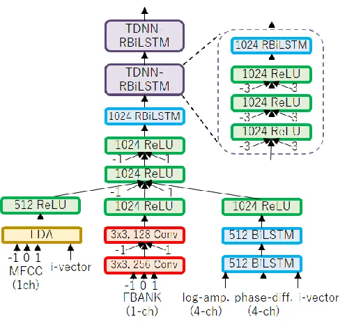

# Guided Source Separation Meets a Strong ASR Backend: Hitachi/Paderborn University Joint Investigation for Dinner Party ASR

###### Abstract

In this paper, we present Hitachi and Paderborn University’s joint
effort for automatic speech recognition (ASR) in a dinner party
scenario. The main challenges of ASR systems for dinner party recordings
obtained by multiple microphone arrays are (1) heavy speech overlaps,
(2) severe noise and reverberation, (3) very natural conversational
content, and possibly (4) insufficient training data. As an example of a
dinner party scenario, we have chosen the data presented during the
CHiME-5 speech recognition challenge, where the baseline ASR had a 73.3%
word error rate (WER), and even the best performing system at the
CHiME-5 challenge had a 46.1% WER. We extensively investigated a
combination of the guided source separation-based speech enhancement
technique and an already proposed strong ASR backend and found that a
tight combination of these techniques provided substantial accuracy
improvements. Our final system achieved WERs of 39.94% and 41.64% for
the development and evaluation data, respectively, both of which are the
best published results for the dataset. We also investigated with
additional training data on the official small data in the CHiME-5
corpus to assess the intrinsic difficulty of this ASR task.

Naoyuki Kanda^(1,∗), Christoph Boeddeker^(2,∗), Jens
Heitkaemper^(2,∗),  
Yusuke Fujita¹, Shota Horiguchi¹, Kenji Nagamatsu¹, Reinhold
Haeb-Umbach²

¹Hitachi Ltd., Japan  
²Paderborn University, Germany

naoyuki.kanda.kn@hitachi.com, boeddeker@nt.upb.de, heitkaemper@nt.upb.de

Index Terms: multi-talker speech recognition, deep learning

## 1 Introduction

^(†)^(†)footnotetext: \* Equal contribution

Due to recent advances in deep learning \[1, 2, 3\], the word error
rates (WERs) of automatic speech recognition (ASR) for some datasets
have become close to (Switchboard \[4, 5\]) or just below (LibriSpeech
\[6\] and \[7\]) the WER level of human transcribers. However, despite
this progress, noise and reverberation still severely increase the WERs.
In particular, multi-talker speech recognition is one of the most
difficult settings for speech recognition \[8, 9, 10\] because of the
difficulty of separating the target speech signal from other interfering
speech signals. One example is meeting speech recognition, where it is
known that the WERs are still around 30% \[8, 11\] even with
state-of-the-art speech recognizers. Another example is distant speech
recognition in a daily home environment, such as a dinner party \[9\],
which will be useful for developing intelligent home devices.

To push the boundary of the current state-of-the-art ASR for such
difficult noisy environments, the CHiME challenge has been held every
one or two years \[12, 13, 14, 9\]. In the latest CHiME-5 challenge
\[9\], dinner party recordings with four participants were provided. The
recordings were conducted with six microphone arrays, each of which had
four microphones. The ASR for this dataset was significantly more
difficult compared with the previous challenge \[12, 13, 14\] because of
(1) heavy speech overlaps, (2) severe noise and reverberation, (3) very
natural conversational content, and possibly (4) insufficient training
data. The first to third reasons came from the nature of the recordings.
On the other hand, the fourth reason came from the regulation of the
challenge in which only 40 hours of official training data was allowed
to be used for the official challenge system¹¹ 1 32 microphones were
used for the recordings, so the total duration of the data was about
1,300 hours.. As a result, the baseline system had a 73.3% WER \[9\],
and even the best performing system \[15\] achieved a 46.1% WER.

At the time of the challenge, Hitachi provided many contributions with
Johns Hopkins University (JHU) on acoustic modeling (AM), language
modeling (LM), and decoding techniques and achieved the second best
result of a 48.2% WER \[10\]. On the other hand, Paderborn University
achieved very promising speech enhancement (SE) techniques, named guided
source separation (GSS)²² 2 https://github.com/fgnt/pb_chime5, which
achieved a significant improvement for evaluation data in multiple array
settings \[16, 17\]. We thought this is worth investigating to evaluate
the results combining our contributions to assess the state-of-the-art
performance of today’s ASR system.

According to the discussion above, in this paper, we present Hitachi and
Paderborn University’s joint effort on developing a state-of-the-art ASR
system on the CHiME-5 corpus. We conducted investigations from two
perspectives. Firstly, we conducted a comprehensive investigation of the
system that utilizes all the contributions we separately proposed in the
CHiME-5 challenge. By tightly combining our contributions, we achieved
the new best records for the dataset. Secondly, we addressed the concern
about the data scarcity problem by using AM or LM with more training
data. We believe our results will provide better insights into the
intrinsic difficulty of this ASR task.

## 2 CHiME-5 Corpus

The CHiME-5 database contains recordings of dinner parties attended by
four friends who engaged in casual conversations. Each party was split
into three parts: preparing food, dining, and socializing. All the parts
took place in different rooms and lasted at least 30 minutes. Recordings
were conducted with six Microsoft Kinect® microphone arrays with four
audio channels each and two arrays per room. For all the parties, every
speaker wore two in-ear microphones. These in-ear microphone signals
were considered as close talk, and they were only used in training and
development.

The training dataset comprises about 40 hours of audio, while the
development and evaluation set consist of five hours each. Because of
the natural conversation style, around $`22\text{\,}\%`$ of the signal
recorded for the training set includes more than one active speaker. For
the development and evaluation set, this number is around
$`40\text{\,}\%`$ and $`25\text{\,}\%`$, respectively. Due to the great
difficulty of the ASR task, annotations regarding the start and end
times for each utterance were allowed to be used at the time of the
CHiME-5 challenge, and we also utilized the same time annotations in
this study.

## 3 Speech enhancement

In this study, we applied the speech enhancement (SE) proposed by the
Paderborn University team for the CHiME-5 challenge \[16\]. The system
uses spatial mixture models, which are learned in an unsupervised
fashion. The time annotations in the database are algorithmically
fine-tuned to obtain source activity information at word level
precision. This time annotation is used to guide the source separation
process.

Figure 1: Overview of speech enhancement system

An overview of this system is shown in Fig. 1. The SE combines Weighted
Prediction Error (WPE) \[18, 19\] for dereverberation with statistical
beamforming (BF) for source extraction (MVDR beamformer \[20, 21\] with
a Blind Analytic Normalization postfilter \[22\]). The target and
distortion masks for the beamformer are estimated from a Guided Source
Separation (GSS) system consisting of a spatial mixture model using
complex angular central Gaussian distributions \[23\]. The GSS makes
efficient use of the utterance start and end time annotations found in
the database as follows. First, GSS determines the number of active
speakers from the time annotations. Second, GSS uses the time
annotations to initialize the posterior probability of a source being
active as one divided by the number of active speakers in a time-frame.
Third, the posterior probability of a speaker is fixed to be zero
whenever the speaker is inactive according to the time annotations.

Using the time annotation in the described fashion eliminates the need
to estimate the number of active speakers. Furthermore, the iterative
estimation of the posterior probabilities encourages a permutation-free
solution and is guided to keep it free of permutations because if the
source activity pattern between all active sources is sufficiently
different, the posterior will tend to be permutation free. This includes
the absence of permutations between frequencies and between utterances;
furthermore, it avoids the situation where a source is modeled by more
than one mixture component. Since the activity patterns of the sources
in an utterance may not always be sufficiently different (e.g., if two
speakers are simultaneously active during the whole utterance), the
utterance is extended with a $`15\text{\,}\mathrm{s}`$ left and right
context. An in depth description of the SE system can be found in
Boeddeker et al.’s study \[16\].

However, the annotations provided by the database are not perfect. For
example, the silence frames at the start and end of an utterance or
between words are not marked. We therefore fine-tuned the annotations.
In the previous study \[16\], a source activity detector (SAD) neural
network was trained and used to predict the activity of a source from
the observations, the time annotations, and a mask from GSS. The
training data for SAD was obtained from the forced alignment on the
in-ear microphone signals computed by ASR. On the other hand, a strong
ASR system can itself estimate a good alignment on the enhanced test
data. The procedure we finally applied in this study is as follows.
First, the data is enhanced by using SE with the SAD-based annotation.
Next, the ASR estimates the alignment on the enhanced signals. Then, the
time annotations of the database are adjusted to be zero where the
alignments indicate silence. With this refined guiding information, the
enhancement is repeated, followed by the final recognition pass.

Note the whole enhancement system is independent of the number of input
channels $`N`$. It can be applied on the reference array ($`N=4`$) or
jointly on all arrays ($`N=24`$). In theory, stacking all arrays into
one big array could improve the performance (e.g., being more spatially
discriminable) or could degrade the performance (e.g., the arrays are
not perfectly synchronized). However, in the experiments, we saw a large
benefit from stacking all array data.

## 4 Acoustic modeling

| System              | Array    | SE                                     | Array Combination      | AM   | RNN-LM | HD  | DEV (%) | EVAL (%) |
| ------------------- | -------- | -------------------------------------- | ---------------------- | ---- | ------ | --- | ------- | -------- |
| Baseline \[9\]      | Single   | BeamFormIt \[24\]                      | -                      | 1-AM |        |     | 81.1    | 73.3     |
| USTC/iFlytek \[15\] | Single   | Multi-stage BF \[15\]                  | -                      | 5-AM | ✓      |     | 50.2    | 46.1     |
| USTC/iFlytek \[15\] | Multiple | Multi-stage BF \[15\]                  | Array Selection \[15\] | 5-AM | ✓      |     | 45.0    | 46.1     |
| Our System 1        | Single   | RAW                                    | -                      | 1-AM |        |     | 63.45   | -        |
| Our System 2        | Single   | WPE                                    | -                      | 1-AM |        |     | 63.05   | -        |
| Our System 3        | Single   | WPE + CGMM-MVDR\[10\]                  | -                      | 1-AM |        |     | 62.24   | -        |
| Our System 4        | Single   | WPE + SA-NN-MVDR\[10\]                 | -                      | 1-AM |        |     | 61.91   | -        |
| Our System 5        | Single   | WPE + GSS + BF w/ Context\[16\]        | -                      | 1-AM |        |     | 58.57   | -        |
| Our System 6        | Single   | WPE + GSS w/ SAD + BF w/ Context\[16\] | -                      | 1-AM |        |     | 58.05   | -        |
| Our System 7        | Single   | WPE + GSS w/ SAD + BF w/o Context      | -                      | 1-AM |        |     | 58.13   | 53.76    |
| Our System 8        | Single   | WPE + GSS w/ ASR + BF w/o Context      | -                      | 1-AM |        |     | 58.29   | 53.10    |
| Our System 9        | Single   | WPE + GSS w/ ASR + BF w/o Context      | -                      | 6-AM |        |     | 54.62   | 49.18    |
| Our System 10       | Single   | WPE + GSS w/ ASR + BF w/o Context      | -                      | 6-AM | ✓      |     | 53.18   | 47.54    |
| Our System 11       | Single   | WPE + GSS w/ ASR + BF w/o Context      | -                      | 6-AM | ✓      | ✓   | 52.07   | 47.31    |
| Our System 12       | Multiple | WPE + SA-NN-MVDR\[10\]                 | ROVER                  | 1-AM |        |     | 57.50   | -        |
| Our System 13       | Multiple | WPE + GSS + BF w/ Context\[16\]        | Stacking in SE         | 1-AM |        |     | 50.23   | -        |
| Our System 14       | Multiple | WPE + GSS w/ SAD + BF w/ Context\[16\] | Stacking in SE         | 1-AM |        |     | 49.21   | -        |
| Our System 15       | Multiple | WPE + GSS w/ SAD + BF w/o Context      | Stacking in SE         | 1-AM |        |     | 46.54   | 51.99    |
| Our System 16       | Multiple | WPE + GSS w/ ASR + BF w/o Context      | Stacking in SE         | 1-AM |        |     | 45.14   | 47.29    |
| Our System 17       | Multiple | WPE + GSS w/ ASR + BF w/o Context      | Stacking in SE         | 6-AM |        |     | 41.67   | 43.70    |
| Our System 18       | Multiple | WPE + GSS w/ ASR + BF w/o Context      | Stacking in SE         | 6-AM | ✓      |     | 39.94   | 41.64    |
| Our System 19       | Multiple | WPE + GSS w/ ASR + BF w/o Context      | Stacking in SE         | 6-AM | ✓      | ✓   | 40.26   | 42.00    |

Table 1: WERs (%) for development and evaluation sets with various
settings.

Figure 2: Overview of CNN-TDNN-RBiLSTM acoustic model

In this study, we applied the AM with single- and multi-channel input
branches proposed for the Hitachi/JHU system \[10\] that provided us
with substantial improvement over the baseline AM. An overview of the
acoustic model is depicted in Fig. 2. Our AM consists of a convolutional
neural network (CNN), time delay neural network (TDNN), and our proposed
residual bidirectional long short-term memory (RBiLSTM) \[10\]. The
unique part of this model architecture is in its input branch. This
model has input branches for single-channel features and an input branch
that accepts multi-channel features. The multi-channel input branch acts
as a learnable SE module. On the other hand, the single-channel input
branch is used to accept enhanced speech by using a complementary SE
module. By having these two types of input branches, our model uniquely
has the ability to use a complementary SE module while exploiting the
power of jointly trained AM and SE architecture.

We use mel-frequency cepstral coefficients (MFCCs) and log
mel-filterbank (FBANK) as input for the single-channel branch. On the
other hand, we use two types of features that represent multi-channel
input signals for the multi-channel branch. One type of feature is the
log amplitude for each microphone, and the other type of feature is the
phase difference between each microphone and the first microphone. We
trained the AM by using LF-MMI criterion \[25\] and then further updated
the AM by using lattice-free state-level minimum Bayes risk (LF-sMBR)
criterion \[7\]. The details of our training schemes and comprehensive
investigation results can be found in previous studies \[10, 11\].

## 5 Language modeling and decoding

In this study, we basically followed the language modeling and decoding
procedure proposed for the Hitachi/JHU system \[10\]. We trained
recurrent neural network language models (RNN-LMs) by using the official
transcription of the training data. We prepared two 2-layer LSTM-based
models with forward and backward direction. The average score of the
official n-gram LM, forward RNN-LM, and backward RNN-LM was used with a
weighting of 0.5:0.25:0.25.

In the decoding phase, we used the N-best ROVER method \[26\] to combine
the results from different AMs. For the AM combination, we trained six
types of AMs: {CNN-TDNN-RBiLSTM, CNN-TDNN-LSTM, CNN-TDNN-BiLSTM} x
{3500, 7000} senones. In the Hitachi/JHU system \[10\], the recognition
results from different microphone arrays were also combined by ROVER.
However, this technique was only effective for the development set, and
no gain was observed for the evaluation set \[10\]. Instead, in this
study, we exploited information from multiple arrays at the stage of SE,
as described in Section 3. Therefore, we omitted the ROVER-based array
combination when we used the GSS technique.

We also applied the “hypothesis deduplication (HD)” proposed for the
Hitachi/JHU system \[10\]. In HD, if the same words were recognized for
overlapping utterances, words with lower confidence were excluded from
the hypothesis.

## 6 Evaluation

### 6.1 Experimental settings

In our evaluation, we used the CHiME-5 corpus, the overview of which is
described in Section 2. Unless otherwise specified, we followed the
regulations in the CHiME-5 challenge where only the official training
data was allowed for AM and LM training. The original duration of the
training data was 40.6 hours. When we trained our AMs, we applied speed
and volume perturbation \[27\], reverberation and noise perturbation
\[28\], and bandpass perturbation \[10\], which produced roughly 4,500
hours of training data. Further details of the training pipeline for our
AM are described in our previous study \[10\].

The duration of development data (DEV) and evaluation data (EVAL) were
4.5 hours and 5.2 hours, respectively. There were two official tasks for
the dataset; one used only reference array data (single array track),
and the other one used all the arrays (multiple array track). For both
tasks, all the parameters were tuned by development set, and the best
parameters were used for decoding the evaluation set.

### 6.2 Results of Hitachi/Paderborn University joint system

The results of our joint system are presented in Table 1. The first row
shows the result of the CHiME-5 baseline system \[9\], and the second
and third rows show the results of the best system at the CHiME-5
challenge \[15\].

We firstly evaluated our system in the single-array setting. System 1 to
system 4 are the systems without or with the SE techniques proposed for
the Hitachi/JHU system \[10\]. Then, by applying GSS, we achieved a
3.34% WER reduction (system 5). The addition of SAD further improved the
accuracy, and we achieved a 58.05% WER (system 6). We also tried to
remove context information in beamforming (system 7) and use the
alignment information produced by system 7 for replacing SAD (system 8).
Although the last two changes had almost no impact on the single-array
setting, they significantly improved the WER for the multiple-array
setting (discussed in the next paragraph), so we selected the SE
settings of system 8 for the final system for consistency. Finally, by
applying various decoding techniques, such as AM combination (system 9),
RNN-LM (system 10), and HD (system 11), the WER was significantly
improved, and we achieved 52.07% and 47.31% WERs for DEV and EVAL,
respectively.

Next, we evaluated our joint system in the multiple-array settings.
Firstly, we show the result with the SE techniques proposed for the
Hitachi/JHU system \[10\] (system 12). GSS again significantly improved
the accuracy and achieved a 50.23% WER (system 13). By adding SAD, the
WER was further improved to 49.21% (system 14). We found that removing
context information in beamforming significantly improved the accuracy
(system 15). This gain may be traced back to an improved statistical
estimation if just the utterance is considered, which allows us to
ignore cross talkers that are only active during the context and make a
better modeling of moving speakers. In addition, we replaced SAD
information by using the alignment produced by system 15, which gave us
a significant WER improvement (system 16). Finally, by applying the
decoding techniques of AM combination (system 17) and RNN-LM (system
18), we achieved the best result of 39.94% and 41.64% WERs for DEV and
EVAL, respectively. Interestingly, HD degraded the WER for the multiple
array settings (system 19). This implies that most of the cross talks
were removed by GSS.

One notable result for this experiment is the improvement by using
multiple arrays when we used GSS for speech enhancement. The WER was
improved from 58.13% to 46.54% (11.59% absolute improvement) when we
used 6 arrays for GSS (system 7 and 15) while the WER was improved by
only 4.41% when we combined the results from each array by using ROVER
(system 4 and 12) as the Hitachi/JHU system did \[10\]. To assess the
effect of the number of arrays, we conducted the experiment with various
numbers of arrays, the results of which are shown in Table 2. We found
that the WER improvement was not saturated even when we used 6 arrays,
and we can expect further WER improvement with a larger number of
microphone arrays. We also found that it is better to remove context
information in the BF calculation when we use multiple arrays.

| Arrays | Context in BF |       |
| ------ | ------------- | ----- |
|        | On            | Off   |
| 1      | 58.05         | 58.13 |
| 3      | 52.30         | 48.81 |
| 6      | 49.21         | 46.54 |

Table 2: WERs (%) for development set with different numbers of arrays
for GSS. The CNN-TDNN-RBiLSTM-AM and the official LM were used for
decoding.

| Track    | Session |     | Kitchen | Dining | Living | Overall |
| -------- | ------- | --- | ------- | ------ | ------ | ------- |
| Single   | Dev     | S02 | 62.33   | 52.82  | 44.62  | 52.07   |
|          |         | S09 | 51.87   | 54.02  | 48.09  |         |
|          | Eval    | S01 | 60.07   | 40.88  | 60.94  | 47.31   |
|          |         | S21 | 49.09   | 38.14  | 42.67  |         |
| Multiple | Dev     | S02 | 46.66   | 45.07  | 36.19  | 39.94   |
|          |         | S09 | 36.40   | 39.43  | 35.33  |         |
|          | Eval    | S01 | 53.93   | 35.66  | 49.78  | 41.64   |
|          |         | S21 | 46.43   | 34.53  | 36.64  |         |

Table 3: WERs (%) for our best system (#11 and \#18 in Table 1).

In Table 3, we show the detailed results of our best system for single
array and multiple array track. To the best of our knowledge, our
multiple-array results are the best published results for this dataset.

### 6.3 Investigation with larger training data

So far, we followed the regulations of CHiME-5. However, the original
duration of the training data was only about 40 hours, and it is unclear
whether the difficulty of this ASR task came from insufficient training
data or the intrinsic property of this dataset. Therefore, in this
section, we conducted the evaluation with larger training data.

#### 6.3.1 Comparison with AM using larger dataset

We firstly conducted the evaluation with a very strong AM, which once
achieved the best published results \[7\] for LibriSpeech corpus \[29\].
The training data was originally 960 hours of LibriSpeech corpus, and it
was further augmented to roughly 3,000 hours by volume and speed
perturbation. The AM consists of CNN, LSTM, and TDNN and was trained by
LF-sMBR. Please refer to the paper \[7\] for further details.

The result for this LibriSpeech AM was shown in the first line of
Table 4. In the second and third lines, the results of the baseline AM
and our best AM (CNN-TDNN-RBiLSM) were shown, respectively. As shown in
the table, LibriSpeech AM produced the worst WER of 62.09% even with 960
hours of training data and a very strong SE module. Of course, there
could be a better way of using the large data; e.g. we could use the
data for pretraining. Nonetheless, we can at least say that this ASR
task is very difficult regardless of the data size for AMs, and the
naive use of 960 hours of training data was much worse than using the
matched 40 hours of training data.

| AM                  | Training Data      | DEV (%) |
| ------------------- | ------------------ | ------- |
| CNN-TDNN-LSTM \[7\] | LibriSpeech (960h) | 62.09   |
| Baseline TDNN       | CHiME-5 (40h)      | 58.39   |
| CNN-TDNN-RBiLSTM    | CHiME-5 (40h)      | 45.14   |

Table 4: WERs (%) for development set with different AMs. The
multiple-array GSS was used with official LM.

#### 6.3.2 Comparison with LMs using larger dataset

Finally, we compared various LMs with larger training data. In this
experiment, we used the transcriptions in the AMI meeting corpus \[30\]
and LibriSpeech corpus \[29\] for the training data. The number of words
in the transcriptions of the CHiME-5, AMI, and LibriSpeech corpus were
0.44M, 0.80M, and 9.40M, respectively. We trained 3-gram LMs with
Kneser-Ney smoothing \[31\] and interpolated them with the 3-gram LM
trained with CHiME-5 transcription. For the model interpolation, we used
MIT-LM ³³ 3 https://github.com/mitlm/mitlm, and the interpolation
weights were tuned by using the transcription of the CHiME-5 development
data.

The perplexity (PPL) and WER are listed in Table 5. In the case of LM,
the larger the data, the better the results, and the best LM achieved a
24 point better PPL of 131. However, the WER improvement obtained by
using this LM was only 0.93%. According to these results, we concluded
that the difficulty of this ASR task mainly came from its intrinsic
property rather than insufficient training data.

| Training Data | \# of Words | DEV |         |
| ------------- | ----------- | --- | ------- |
|               |             | PPL | WER (%) |
| C (Baseline)  | 0.4M        | 155 | 45.14   |
| C + A         | 1.2M        | 140 | 45.10   |
| C + L         | 9.8M        | 134 | 44.49   |
| C + A + L     | 10.6M       | 131 | 44.21   |

C: CHiME-5, A: AMI, L:LibriSpeech

Table 5: Comparison of LMs. The multiple-array-based GSS and
CNN-TDNN-RBiLSTM AM was used for decoding.

## 7 Conclusion

In this paper, we presented Hitachi and Paderborn University’s joint
effort on ASR for the CHiME-5 speech corpus. We gathered our
contributions, which were separately proposed at the CHiME-5 challenge,
and our best system finally achieved WERs of 39.94% and 41.64% for
development and evaluation data, respectively, both of which are the
best records for the dataset. We also conducted investigations with
larger training data for AM and LM. We found that simply using larger
data had no impact or a marginal impact on the WER, which indicated the
intrinsic difficulty of this ASR task.

## 8 Acknowledgements

We deeply thank Prof. Shinji Watanabe for connecting Hitachi and
Paderborn University for this great collaboration.

This work was in part supported by DFG under contract number
Ha3455/14-1. The computational resources were provided by the Paderborn
Center for Parallel Computing.

## References

- \[1\] F. Seide, G. Li, and D. Yu, “Conversational speech transcription
  using context-dependent deep neural networks,” in _Proc. INTERSPEECH_,
  2011, pp. 437–440.
- \[2\] G. E. Dahl, D. Yu, L. Deng, and A. Acero, “Context-dependent
  pre-trained deep neural networks for large-vocabulary speech
  recognition,” _IEEE Trans. on ASLP_, vol. 20, no. 1, pp. 30–42, 2012.
- \[3\] G. Hinton, L. Deng, D. Yu, G. E. Dahl, A.-r. Mohamed, N. Jaitly,
  A. Senior, V. Vanhoucke, P. Nguyen, T. N. Sainath, and B. Kingsbury,
  “Deep neural networks for acoustic modeling in speech recognition: The
  shared views of four research groups,” _Signal Processing Magazine,
  IEEE_, vol. 29, no. 6, pp. 82–97, 2012.
- \[4\] W. Xiong, J. Droppo, X. Huang, F. Seide, M. Seltzer, A. Stolcke,
  D. Yu, and G. Zweig, “Achieving human parity in conversational speech
  recognition,” _arXiv preprint arXiv:1610.05256_, 2016.
- \[5\] G. Saon, G. Kurata, T. Sercu, K. Audhkhasi, S. Thomas,
  D. Dimitriadis, X. Cui, B. Ramabhadran, M. Picheny, L.-L. Lim
  _et al._, “English conversational telephone speech recognition by
  humans and machines,” _Proc. INTERSPEECH_, pp. 132–136, 2017.
- \[6\] D. Amodei, S. Ananthanarayanan, R. Anubhai, J. Bai,
  E. Battenberg, C. Case, J. Casper, B. Catanzaro, Q. Cheng, G. Chen
  _et al._, “Deep speech 2: End-to-end speech recognition in English and
  Mandarin,” in _Proc. ICML_, 2016, pp. 173–182.
- \[7\] N. Kanda, Y. Fujita, and K. Nagamatsu, “Lattice-free state-level
  minimum Bayes risk training of acoustic models,” in _Proc.
  INTERSPEECH_, 2018, pp. 2923–2927.
- \[8\] T. Yoshioka, H. Erdogan, Z. Chen, X. Xiao, and F. Alleva,
  “Recognizing overlapped speech in meetings: A multichannel separation
  approach using neural networks,” in _Proc. INTERSPEECH_, 2018, pp.
  3038–3042.
- \[9\] J. Barker, S. Watanabe, E. Vincent, and J. Trmal, “The fifth
  CHiME speech separation and recognition challenge: Dataset, task and
  baselines,” in _Proc. INTERSPEECH_, 2018, pp. 1561–1565.
- \[10\] N. Kanda, R. Ikeshita, S. Horiguchi, Y. Fujita, K. Nagamatsu,
  X. Wang, V. Manohar, N. E. Y. Soplin, M. Maciejewski, S.-J. Chen
  _et al._, “The Hitachi/JHU CHiME-5 system: Advances in speech
  recognition for everyday home environments using multiple microphone
  arrays,” in _Proc. CHiME-5_, 2018, pp. 6–10.
- \[11\] N. Kanda, Y. Fujita, S. Horiguchi, R. Ikeshita, K. Nagamatsu,
  and S. Watanabe, “Acoustic modeling for distant multi-talker speech
  recognition with single- and multi-channel branches,” in _Proc.
  ICASSP_, 2019.
- \[12\] J. Barker, E. Vincent, N. Ma, H. Christensen, and P. Green,
  “The PASCAL CHiME speech separation and recognition challenge,”
  _Computer Speech & Language_, vol. 27, no. 3, pp. 621–633, 2013.
- \[13\] E. Vincent, J. Barker, S. Watanabe, J. Le Roux, F. Nesta, and
  M. Matassoni, “The second ‘CHiME’ speech separation and recognition
  challenge: An overview of challenge systems and outcomes,” in _Proc.
  ASRU_, 2013, pp. 162–167.
- \[14\] J. Barker, R. Marxer, E. Vincent, and S. Watanabe, “The third
  ‘CHiME’ speech separation and recognition challenge: Dataset, task and
  baselines,” in _Proc. ASRU_, 2015, pp. 504–511.
- \[15\] J. Du, T. Gao, L. Sun, F. Ma, Y. Fang, D.-Y. Liu, Q. Zhang,
  X. Zhang, H.-K. Wang, J. Pan, J.-Q. Gao, C.-H. Lee, and J.-D. Chen,
  “The USTC-iFlytek system for CHiME-5 challenge,” in _Proc. CHiME-5_,
  2018, pp. 11–15.
- \[16\] C. Boeddeker, J. Heitkaemper, J. Schmalenstroeer, L. Drude,
  J. Heymann, and R. Haeb-Umbach, “Front-end processing for the CHiME-5
  dinner party scenario,” in _Proc. CHiME-5_, 2018, pp. 35–40.
- \[17\] M. Kitza, W. Michel, C. Boeddeker, J. Heitkaemper, T. Menne,
  R. Schlüter, H. Ney, J. Schmalenstroeer, L. Drude, J. Heymann
  _et al._, “The RWTH/UPB system combination for the CHiME 2018
  workshop,” in _Proc. CHiME-5_, 2018, pp. 53–57.
- \[18\] T. Yoshioka and T. Nakatani, “Generalization of multi-channel
  linear prediction methods for blind MIMO impulse response shortening,”
  _IEEE Transactions on Audio, Speech and Language Processing_, vol. 20,
  no. 10, pp. 2707–2720, 2012.
- \[19\] L. Drude, J. Heymann, C. Boeddeker, and R. Haeb-Umbach,
  “NARA-WPE: A Python package for weighted prediction error
  dereverberation in Numpy and Tensorflow for online and offline
  processing,” in _13. ITG Fachtagung Sprachkommunikation (ITG 2018)_,
  Oct 2018.
- \[20\] M. Souden, J. Benesty, and S. Affes, “On optimal
  frequency-domain multichannel linear filtering for noise reduction,”
  _IEEE Transactions on audio, speech, and language processing_,
  vol. 18, no. 2, pp. 260–276, 2010.
- \[21\] H. Erdogan, J. R. Hershey, S. Watanabe, M. I. Mandel, and
  J. Le Roux, “Improved MVDR beamforming using single-channel mask
  prediction networks.” in _Interspeech_, 2016, pp. 1981–1985.
- \[22\] E. Warsitz and R. Haeb-Umbach, “Blind acoustic beamforming
  based on generalized eigenvalue decomposition,” _IEEE Transactions on
  audio, speech, and language processing_, vol. 15, no. 5, pp.
  1529–1539, 2007.
- \[23\] N. Ito, S. Araki, and T. Nakatani, “Complex angular central
  Gaussian mixture model for directional statistics in mask-based
  microphone array signal processing,” in _European Signal Processing
  Conference (EUSIPCO),_. IEEE, 2016, pp. 1153–1157.
- \[24\] X. Anguera, C. Wooters, and J. Hernando, “Acoustic beamforming
  for speaker diarization of meetings,” _IEEE Trans. on ASLP_, vol. 15,
  no. 7, pp. 2011–2022, 2007.
- \[25\] D. Povey, V. Peddinti, D. Galvez, P. Ghahrmani, V. Manohar,
  X. Na, Y. Wang, and S. Khudanpur, “Purely sequence-trained neural
  networks for ASR based on lattice-free MMI,” _Proc. INTERSPEECH_, pp.
  2751–2755, 2016.
- \[26\] J. G. Fiscus, “A post-processing system to yield reduced word
  error rates: Recognizer output voting error reduction (ROVER),” in
  _Proc. ASRU_. IEEE, 1997, pp. 347–354.
- \[27\] T. Ko, V. Peddinti, D. Povey, and S. Khudanpur, “Audio
  augmentation for speech recognition,” in _Proc. INTERSPEECH_, 2015,
  pp. 3586–3589.
- \[28\] T. Ko, V. Peddinti, D. Povey, M. L. Seltzer, and S. Khudanpur,
  “A study on data augmentation of reverberant speech for robust speech
  recognition,” in _Proc. ICASSP_, 2017, pp. 5220–5224.
- \[29\] V. Panayotov, G. Chen, D. Povey, and S. Khudanpur,
  “Librispeech: an ASR corpus based on public domain audio books,” in
  _Proc. ICASSP_, 2015.
- \[30\] J. Carletta, S. Ashby, S. Bourban, M. Flynn, M. Guillemot,
  T. Hain, J. Kadlec, V. Karaiskos, W. Kraaij, M. Kronenthal _et al._,
  “The AMI meeting corpus: A pre-announcement,” in _International
  Workshop on Machine Learning for Multimodal Interaction_. Springer,
  2005, pp. 28–39.
- \[31\] R. Kneser and H. Ney, “Improved backing-off for m-gram language
  modeling,” in _Proc. ICASSP_, vol. 1, 1995, pp. 181–184.
