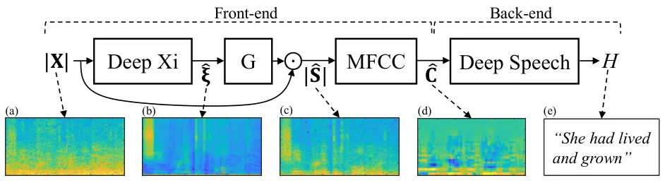

# Deep Xi as a Front-End for Robust Automatic Speech Recognition

Aaron Nicolson    Kuldip K. Paliwal

###### Abstract

Current front-ends for robust automatic speech recognition (ASR) include
masking- and mapping-based deep learning approaches to speech
enhancement. A recently proposed deep learning approach to a priori SNR
estimation, called Deep Xi, was able to produce enhanced speech at a
higher quality and intelligibility than current masking- and
mapping-based approaches. Motivated by this, we investigate Deep Xi as a
front-end for robust ASR. Deep Xi is evaluated using real-world
non-stationary and coloured noise sources at multiple SNR levels. Our
experimental investigation shows that Deep Xi as a front-end is able to
produce a lower word error rate than recent masking- and mapping-based
deep learning front-ends. The results presented in this work show that
Deep Xi is a viable front-end, and is able to significantly increase the
robustness of an ASR system.  
Availability: Deep Xi is available at:
[https://github.com/anicolson/DeepXi](https://github.com/anicolson/DeepXi)

###### Index Terms: 

Robust speech recognition, front-end, speech enhancement,
pre-processing, Deep Xi

^(†)^(†)address: Signal Processing Laboratory, Griffith University,
Brisbane, Australia

## 1 Introduction

Recently, an automatic speech recognition (ASR) system was able to
achieve human parity on the Switchboard speech recognition task \[1\].
This milestone demonstrates how far ASR research has come in 67 years
\[2\]. An example of a modern ASR system is Deep Speech \[3\] — an
end-to-end ASR system that uses a bidirectional recurrent neural network
(BRNN) as its acoustic model \[4\]. Despite their accuracy on ideal
conditions, modern ASR systems are still susceptible to performance
degradation when environmental noise is present. A popular method to
increase the robustness of an ASR system is to use a front-end to
pre-process noise corrupted speech. As the goal of a front-end is to
perform noise suppression, a speech enhancement algorithm is typically
employed.

Masking- and mapping-based deep learning approaches to speech
enhancement are currently the leading front-ends in the literature
\[5\]. They have the ability to produce enhanced speech that is highly
intelligible — an important attribute for ASR \[6\]. An example of a
masking-based approach is the long short-term memory network ideal ratio
mask (LSTM-IRM) estimator \[7\], which can produce intelligible enhanced
speech independent of the speaker. Examples of mapping-based approaches
include the fully-connected neural network that employs multi-objective
learning and binary mask post-processing to estimate the clean-speech
log-power spectra (LPS) (Xu2017) \[8\], and the time-domain clean-speech
estimator that uses encoder-decoder convolutional neural networks (CNNs)
as the generator and the discriminator of a generative adversarial
network (GAN), called SEGAN \[9\].

Previous generation front-ends include minimum mean-square error (MMSE)
approaches to speech enhancement and missing data approaches.
Cluster-based reconstruction is a prominent missing data approach, which
reconstructs the unreliable spectral components (components with an a
priori SNR of 0 dB or less \[10\]) based on their statistical
relationship to the reliable components \[11\]. MMSE approaches, such as
the MMSE short-time spectral amplitude (MMSE-STSA) estimator, rely on
the accurate estimation of the a priori SNR \[12\]. However, previous a
priori SNR estimators, like the decision-directed (DD) approach,
introduce a tracking delay and a large amount of bias \[12\].

A deep learning approach to a priori SNR estimation was recently
proposed, called Deep Xi \[13\]. It is able to produce an a priori SNR
estimate with negligible bias, and exhibits no tracking delay. Deep Xi
enabled MMSE approaches to achieve higher quality and intelligibility
scores than recent masking- and mapping-based deep learning approaches
to speech enhancement. As Deep Xi is able to produce more intelligible
enhanced speech than masking- and mapping-based deep learning approaches
to speech enhancement, we propose that Deep Xi can further be used as a
front-end for robust ASR.

Figure 1: Deep Xi-ResLSTM (top) and Deep Xi-ResBiLSTM (bottom).

Here, Deep Xi as a front-end is evaluated using real-world
non-stationary and coloured noise sources at multiple SNR levels. Deep
Speech is used to evaluate each of the front-ends. Deep Speech is
suitable for front-end evaluation as it is trained on multiple clean
speech corpora and has no implemented front- or back-end techniques. The
paper is organised as follows: an overview of Deep Xi is given in
Section 2; the proposed front-end is presented in Section 3; the
experiment setup is described in Section 4, including a description of
each front-end; the results and discussion are presented in Section 5;
conclusions are drawn in Section 6.

## 2 Overview of Deep Xi

In \[13\], the Deep Xi framework for estimating the a priori SNR was
proposed. The a priori SNR is given by:

```math
\xi[l,k]=\frac{\lambda_{s}[l,k]}{\lambda_{d}[l,k]}, \tag{1}
```

where $`l`$ is the time-frame index, $`k`$ is the discrete-frequency
index, $`\lambda_{s}[l,k]=\mathrm{E}\{|S[l,k]|^{2}\}`$ is the variance
of the clean speech spectral component, and
$`\lambda_{d}[l,k]=\mathrm{E}\{|D[l,k]|^{2}\}`$ is the variance of the
noise spectral component. A residual LSTM (ResLSTM) network and a
residual bidirectional LSTM (ResBiLSTM) network were used to estimate a
mapped version of the a priori SNR for each component of the $`l^{th}`$
time-frame, as shown in Figure 1. The mapped a priori SNR,
$`\bar{\boldsymbol{\xi}}_{l}`$, is described in Subsection 2.1. The
input to each network is the noisy speech magnitude spectrum for the
$`l^{th}`$ time-frame, $`|\textbf{X}_{l}|`$.

The hyperparameters for the ResLSTM and ResBLSTM networks in \[13\] were
chosen as a compromise between training time, memory usage, and speech
enhancement performance. The ResLSTM network, as shown in Figure 1
(top), consists of five residual blocks, with each block containing an
LSTM cell \[14\], F, with a cell size of 512. The residual connection is
from the input of the residual block to after the LSTM cell activation.
FC is a fully-connected layer with 512 nodes that employs layer
normalisation followed by ReLU activation \[15\]. The output layer, O,
is a fully-connected layer with sigmoidal units. The ResBiLSTM network,
as shown in Figure 1 (bottom), is identical to the ResLSTM network,
except that the residual blocks include both a forward and backward LSTM
cell (F and B, respectively) \[4\], each with a cell size of 512. The
residual connection is applied from the input of the residual block to
after the summation of the forward and backward cell activations.
Details about the training strategy for the ResLSTM and ResBiLSTM
networks are given in Subsection 4.2.

### 2.1 Mapped a priori SNR training target

The training target for the ResLSTM and ResBiLSTM networks is the mapped
a priori SNR, as described in \[13\]. The mapped a priori SNR is a
mapped version of the oracle (or instantaneous) a priori SNR. For the
oracle case, the clean speech and noise in Equation 1 are known
completely. This means that $`\lambda_{s}[l,k]`$ and
$`\lambda_{d}[l,k]`$ can be replaced with the squared magnitude of the
clean speech and noise spectral components, respectively. In \[13\], the
oracle a priori SNR (in dB),
$`\xi_{\rm dB}[l,k]=10\log_{10}(\xi[l,k])`$, was mapped to the interval
$`[0,1]`$ in order to improve the rate of convergence of the used
stochastic gradient descent algorithm. The cumulative distribution
function (CDF) of $`\xi_{\rm dB}[l,k]`$ was used as the map. As shown in
\[13\], the distribution of $`\xi_{\rm dB}`$ for a given frequency
component follows a normal distribution. It was thus assumed that
$`\xi_{\rm dB}[l,k]`$ is distributed normally with mean $`\mu_{k}`$ and
variance $`\sigma^{2}_{k}`$:
$`\xi_{\rm dB}[l,k]\sim\mathcal{N}(\mu_{k},\sigma^{2}_{k})`$. The map is
given by

```math
\bar{\xi}[l,k]=\frac{1}{2}\Bigg[1+\textrm{erf}\Bigg(\frac{\xi_{\rm dB}[l,k]-\mu_{k}}{\sigma_{k}\sqrt{2}}\Bigg)\Bigg], \tag{2}
```

where $`\bar{\xi}[l,k]`$ is the mapped a priori SNR. The statistics
found in \[13\] for each component of $`\xi_{\rm dB}[l,k]`$ are used in
this work. During inference, $`\hat{\xi}[l,k]`$ is found from
$`\hat{\xi}_{\text{dB}}[l,k]`$ as follows:
$`\hat{\xi}[l,k]=10^{(\hat{\xi}_{\text{dB}}[l,k]/10)},`$ where the a
priori SNR estimate in dB is computed from the mapped a priori SNR
estimate as follows:
$`\hat{\xi}_{\rm dB}[l,k]=\sigma_{k}\sqrt{2}\textrm{erf}^{-1}\big(2\hat{\bar{\xi}}[l,k]-1\big)+\mu_{k}.`$



Figure 2: Deep Xi as a front-end for robust ASR. The noisy speech
magnitude spectra, $`|\textbf{X}|`$, is shown in (a). Deep Xi then
estimates the a priori SNR, $`\boldsymbol{\hat{\xi}}`$, as shown in (b).
An MMSE approach is next used to compute a gain function,
$`G(\boldsymbol{\hat{\xi}})`$, which is then multiplied element-wise
with $`|\textbf{X}|`$ to produce the estimated clean speech magnitude
spectra, $`|\hat{\textbf{S}}|`$, as shown in (c). MFCCs are then
computed, producing the estimated clean speech cepstra,
$`\hat{\textbf{C}}`$, as shown in (d). Finally, the hypothesis
transcript, $`H`$, is found using Deep Speech, as shown in (e).

## 3 Deep Xi as a front-end

In this section, Deep Xi as a front-end for robust ASR is described.
Either Deep Xi-ResLSTM or Deep Xi-ResBiLSTM is used to pre-processes the
noisy speech before it is given to the back-end of the ASR system.
[Project DeepSpeech](https://github.com/mozilla/DeepSpeech)¹¹ 1 Project
DeepSpeech is available at:
[https://github.com/mozilla/DeepSpeech](https://github.com/mozilla/DeepSpeech)
(model 0.1.1 was used for this research). is used as the back-end of the
ASR system. It is an open source implementation of the Deep Speech ASR
system \[3\]. It uses 26 mel-frequency cepstral coefficients (MFCC) as
its input. The process of finding the hypothesis transcription, $`H`$,
is illustrated in Figure 2. The process includes the following four
steps:

1.  1.  The a priori SNR estimate, $`\boldsymbol{\hat{\xi}}`$, of the noisy
        speech magnitude spectra, $`|\textbf{X}|`$, is found using Deep Xi,
        $`\boldsymbol{\hat{\xi}}=\textrm{Deep Xi}(|\textbf{X}|)`$.
2.  2.  The estimated clean speech magnitude spectra,
        $`|\hat{\textbf{S}}|`$, is found by applying the gain function of an
        MMSE approach, $`G(\cdot)`$, to $`|\textbf{X}|`$:
        $`|\hat{\textbf{S}}|=|\textbf{X}|\odot G(\boldsymbol{\hat{\xi}})`$,
        where $`\boldsymbol{\hat{\xi}}`$ is used to compute
        $`G(\boldsymbol{\hat{\xi}})`$ ($`\odot`$ denotes the Hadamard
        product).
3.  3.  The input to Deep Speech is the estimated clean speech cepstra,
        $`\hat{\textbf{C}}`$, where $`\hat{\textbf{C}}`$ is computed from
        $`|\hat{\textbf{S}}|`$:
        $`\hat{\textbf{C}}=\textrm{MFCC}(|\hat{\textbf{S}}|)`$.
4.  4.  Deep Speech computes the hypothesised transcript, $`H`$, from
        $`\hat{\textbf{C}}`$: $`H=\textrm{Deep Speech}(\hat{\textbf{C}})`$.

Deep Xi attempts to match the observed noisy speech to the conditions
experienced by Deep Speech during training, i.e. the unobserved clean
speech is estimated from the noisy speech. Steps one, two, and three
form the front-end of the robust ASR system.

## 4 Experiment Setup

### 4.1 Training set

The train-clean-100 set from the Librispeech corpus \[16\], the CSTR
VCTK corpus \[17\], and the $`si^{*}`$ and $`sx^{*}`$ training sets from
the TIMIT corpus \[18\] were included in the training set ($`74\,250`$
clean speech recordings). $`5\%`$ of the clean speech recordings
($`3\,713`$) were randomly selected and used as the validation set. The
$`2\,382`$ recordings adopted in \[13\] were used here as the noise
training set. All clean speech and noise recordings were single-channel,
with a sampling frequency of 16 kHz. The noise corruption procedure for
the training set is described in the next subsection.

### 4.2 Training strategy

Cross-entropy was used as the loss function. The Adam algorithm \[19\]
with default hyperparameters was used for stochastic gradient descent
optimisation. A mini-batch size of $`10`$ noisy speech signals was used.
The noisy speech signals were generated as follows: each clean speech
recording selected for a mini-batch was mixed with a random section of a
randomly selected noise recording at a randomly selected SNR level (-10
to 20 dB, in 1 dB increments).

### 4.3 Test set

Four noise sources were included in the test set: voice babble, F16, and
factory from the RSG-10 noise dataset \[20\] and street music (recording
no. $`26\,270`$) from the Urban Sound dataset \[21\]. 25 clean speech
recordings were randomly selected (without replacement) from the
test-clean set of the Librispeech corpus \[16\] for each of the four
noise recordings. To generate the noisy speech, a random section of the
noise recording was mixed with the clean speech at the following SNR
levels: -5 to 15 dB, in 5 dB increments. This created a test set of 500
noisy speech signals. The noisy speech was single channel, with a
sampling frequency of 16 kHz.

| Method            | SNR level (dB) |      |      |      |      |              |      |      |      |      |       |      |      |      |      |         |      |      |      |      |
| ----------------- | -------------- | ---- | ---- | ---- | ---- | ------------ | ---- | ---- | ---- | ---- | ----- | ---- | ---- | ---- | ---- | ------- | ---- | ---- | ---- | ---- |
|                   | Voice babble   |      |      |      |      | Street music |      |      |      |      | F16   |      |      |      |      | Factory |      |      |      |      |
|                   | -5             | 0    | 5    | 10   | 15   | -5           | 0    | 5    | 10   | 15   | -5    | 0    | 5    | 10   | 15   | -5      | 0    | 5    | 10   | 15   |
| Noisy speech      | 95.1           | 91.1 | 70.6 | 36.7 | 11.0 | 92.9         | 78.2 | 51.1 | 21.1 | 11.0 | 100.0 | 98.7 | 82.5 | 39.2 | 18.1 | 97.7    | 89.0 | 59.8 | 29.2 | 10.5 |
| DD                | 94.9           | 87.8 | 70.4 | 32.0 | 10.4 | 88.5         | 72.4 | 47.6 | 24.6 | 14.0 | 98.4  | 82.1 | 43.2 | 18.8 | 11.6 | 94.6    | 83.6 | 52.7 | 26.2 | 13.8 |
| Clust. recon.     | 98.2           | 84.5 | 54.2 | 21.0 | 10.2 | 86.2         | 72.2 | 41.3 | 15.4 | 10.1 | 98.0  | 83.1 | 45.4 | 18.6 | 7.0  | 97.1    | 81.6 | 50.3 | 29.2 | 16.7 |
| Xu2017            | 95.0           | 78.1 | 54.3 | 31.3 | 13.0 | 90.0         | 75.4 | 45.2 | 28.6 | 17.1 | 93.8  | 81.7 | 51.2 | 25.1 | 21.7 | 97.4    | 90.7 | 67.1 | 35.4 | 18.3 |
| LSTM-IRM          | 94.1           | 88.9 | 54.2 | 22.5 | 9.6  | 89.6         | 67.5 | 39.8 | 16.2 | 7.2  | 97.1  | 79.3 | 45.2 | 21.4 | 12.9 | 94.5    | 73.8 | 43.2 | 18.1 | 10.9 |
| SEGAN             | 95.8           | 79.0 | 44.2 | 19.5 | 10.7 | 84.5         | 58.7 | 32.4 | 12.8 | 11.0 | 94.2  | 76.8 | 45.6 | 19.7 | 7.7  | 91.2    | 70.3 | 45.9 | 18.1 | 8.5  |
| Deep Xi-ResLSTM   | 92.9           | 73.3 | 37.1 | 11.7 | 12.0 | 85.5         | 58.1 | 25.2 | 11.5 | 6.4  | 95.6  | 69.3 | 30.8 | 16.4 | 7.2  | 93.0    | 69.5 | 36.2 | 17.9 | 9.1  |
| Deep Xi-ResBiLSTM | 95.0           | 66.0 | 27.1 | 10.7 | 10.4 | 73.0         | 43.0 | 23.7 | 10.3 | 7.0  | 88.7  | 56.6 | 21.4 | 12.7 | 4.2  | 84.9    | 51.5 | 29.5 | 16.8 | 8.8  |

Table 1: $`{\rm WER\%}`$ for Deep Speech using each front-end.
Real-world non-stationary (voice babble and street music) and coloured
(F16 and factory) noise sources were used. The lowest $`{\rm WER\%}`$
for each condition is shown in boldface.

### 4.4 Front-ends

The configuration of each front-end is described here:

Deep Xi-ResLSTM & Deep Xi-ResBiLSTM: The ResLSTM and ResBiLSTM networks
are trained using the training set for 10 epochs.

SEGAN: The implementation available at
[https://github.com/santi-pdp/segan](https://github.com/santi-pdp/segan)
was used. The available model is retrained using the training set for 50
epochs.

LSTM-IRM: The LSTM-IRM estimator from \[7\] is replicated here. The
noisy speech magnitude spectrum was used as the input and the training
set was used for 10 epochs of training.

Xu2017: The implementation available at:
[https://github.com/yongxuUSTC/DNN-for-speech-enhancement](https://github.com/yongxuUSTC/DNN-for-speech-enhancement)
is used.

Cluster-based reconstruction: A diagonal covariance Gaussian mixture
model (GMM) consisting of 128 clusters is trained using the k-means++
algorithm, and the expectation-maximisation algorithm \[22\]. $`7\,500`$
randomly selected clean speech recordings from the training set are used
for training. A BRNN ideal binary mask (IBM) estimator \[23\], which is
trained for 10 epochs using the training set, is used to identify the
unreliable spectral components \[11\].

DD: The MMSE-based noise estimator from \[24\] is used by the DD
approach a priori SNR estimator \[12\]. The DD approach estimates the a
priori SNR for the MMSE-STSA estimator \[12\].

### 4.5 Signal processing

The following hyperparameters were used to compute the inputs used by
the DD approach, cluster-based reconstruction, the LSTM-IRM estimator,
Deep Xi-ResLSTM, and Deep Xi-ResBiLSTM. A sampling frequency of 16 kHz
was used. The Hamming window function was used for analysis, with a
frame length of 32 ms (512 discrete-time samples) and a frame shift of
16 ms (256 discrete-time samples). For each frame of noisy speech, the
257-point single-sided magnitude spectrum was computed, which included
both the DC frequency component and the Nyquist frequency component.

## 5 Results and discussion

In Table 1, Deep Xi-ResLSTM and Deep Xi-ResBiLSTM are compared to both
current and previous generation front-ends using Deep Speech. The
current front-ends include Xu2017 \[8\], an LSTM-IRM estimator \[7\],
and SEGAN \[9\], all of which are either masking- or mapping-based deep
learning approaches to speech enhancement. The previous generation
front-ends include the DD approach, and cluster-based reconstruction.
Here, the square-root WF (SRWF) MMSE approach \[25\] is used by Deep
Xi-ResLSTM and Deep Xi-ResBiLSTM, as it attained the lowest word error
rate percentage ($`{\rm WER\%}`$) in preliminary testing (over other
MMSE approaches such as the MMSE-STSA estimator).

Deep Xi-ResBiLSTM demonstrates a significant performance improvement,
with an average $`{\rm WER\%}`$ reduction of $`9.3\%`$ over all
conditions when compared to SEGAN. Deep Xi-ResLSTM also demonstrated a
high performance, with an average $`{\rm WER\%}`$ reduction of $`3.4\%`$
over all conditions when compared to SEGAN. An explanation for the
performance of Deep Xi-ResLSTM and Deep Xi-ResBiLSTM as front-ends is
given by their speech enhancement performance. In \[13\], Deep
Xi-ResLSTM and Deep Xi-ResBiLSTM were both able to produce more
intelligible enhanced speech than recent masking- and mapping-based deep
learning approaches to speech enhancement. As more intelligible speech
improves speech recognition performance \[6\], Deep Xi-ResLSTM and Deep
Xi-ResBiLSTM are both suitable front-ends for ASR.

SEGAN and the LSTM-IRM estimator both performed poorly at lower SNR
levels when compared to the proposed front-ends. Deep Xi-ResBiLSTM
performed particularly well at an SNR level of 5 and 10 dB, with an
average $`{\rm WER\%}`$ reduction of $`16.9\%`$ and $`16.6\%`$,
respectively, over all noise sources when compared to SEGAN. SEGAN and
the LSTM-IRM estimator were both able to demonstrate a high performance
at an SNR level of 15 dB. However, Deep Xi-ResBiLSTM and Deep Xi-ResLSTM
were able to produce an average $`{\rm WER\%}`$ improvement of $`1.9\%`$
and $`0.8\%`$, respectively, over all noise sources at an SNR level of
15 dB when compared to SEGAN. In summary, Deep Xi-ResBiLSTM and Deep
Xi-ResLSTM demonstrate a high performance over all SNR levels,
especially at low SNR levels.

## 6 Conclusion

In this paper, we investigate the use of Deep Xi as a front-end for
robust ASR. Deep Xi was evaluated using both real-world non-stationary
and coloured noise sources, at multiple SNR levels. Deep Xi was able to
outperform recent front-ends, including masking- and mapping-based deep
learning approaches to speech enhancement. The results presented in this
work show that Deep Xi is able to significantly increase the robustness
of an ASR system.

## References

- \[1\] Wayne Xiong et al., “Achieving human parity in conversational
  speech recognition,” CoRR, vol. abs/1610.05256, 2016.
- \[2\] Douglas O’Shaughnessy, “Invited paper: Automatic speech
  recognition: History, methods and challenges,” Pattern Recognition,
  vol. 41, no. 10, pp. 2965 – 2979, 2008.
- \[3\] Awni Y. Hannun et al., “Deep speech: Scaling up end-to-end
  speech recognition,” CoRR, vol. abs/1412.5567, 2014.
- \[4\] M. Schuster and K. K. Paliwal, “Bidirectional recurrent neural
  networks,” IEEE Transactions on Signal Processing, vol. 45, no. 11,
  pp. 2673–2681, 1997.
- \[5\] Zixing Zhang et al., “Deep learning for environmentally robust
  speech recognition: An overview of recent developments,” ACM Trans.
  Intell. Syst. Technol., vol. 9, no. 5, pp. 1–28, Apr. 2018.
- \[6\] Nancy Thomas-Stonell et al., “Computerized speech recognition:
  influence of intelligibility and perceptual consistency on recognition
  accuracy,” Augmentative and Alternative Communication, vol. 14, no. 1,
  pp. 51–56, 1998.
- \[7\] Jitong Chen and DeLiang Wang, “Long short-term memory for
  speaker generalization in supervised speech separation,” The Journal
  of the Acoustical Society of America, vol. 141, no. 6, pp.
  4705–4714, 2017.
- \[8\] Yong Xu et al., “Multi-objective learning and mask-based
  post-processing for deep neural network based speech enhancement,”
  CoRR, vol. abs/1703.07172, 2017.
- \[9\] Santiago Pascual, Antonio Bonafonte, and Joan Serrà, “SEGAN:
  speech enhancement generative adversarial network,” CoRR, vol.
  abs/1703.09452, 2017.
- \[10\] DeLiang Wang, On ideal binary mask as the computational goal of
  auditory scene analysis, pp. 181–197, Springer US, Boston, MA, 2005.
- \[11\] Bhiksha Raj, Michael L. Seltzer, and Richard M. Stern,
  “Reconstruction of missing features for robust speech recognition,”
  Speech Communication, vol. 43, no. 4, pp. 275 – 296, 2004, Special
  Issue on the Recognition and Organization of Real-World Sound.
- \[12\] Y. Ephraim and D. Malah, “Speech enhancement using a
  minimum-mean square error short-time spectral amplitude estimator,”
  IEEE Transactions on Acoustics, Speech, and Signal Processing, vol.
  32, no. 6, pp. 1109–1121, 1984.
- \[13\] Aaron Nicolson and Kuldip K. Paliwal, “Deep learning for
  minimum mean-square error approaches to speech enhancement,” Speech
  Communication, vol. 111, pp. 44 – 55, 2019.
- \[14\] F. A. Gers, J. Schmidhuber, and F. Cummins, “Learning to
  forget: continual prediction with LSTM,” in ICANN, 1999, vol. 2, pp.
  850–855 vol.2.
- \[15\] Vinod Nair and Geoffrey E. Hinton, “Rectified linear units
  improve restricted boltzmann machines,” in ICML, USA, 2010, pp.
  807–814, Omnipress.
- \[16\] V. Panayotov, G. Chen, D. Povey, and S. Khudanpur,
  “Librispeech: An ASR corpus based on public domain audio books,” in
  ICASSP, 2015, pp. 5206–5210.
- \[17\] Christophe Veaux et al., “CSTR VCTK corpus: English
  multi-speaker corpus for CSTR voice cloning toolkit,” University of
  Edinburgh, CSTR, 2017.
- \[18\] J. S. Garofolo, L. F. Lamel, W. M. Fisher, J. G. Fiscus, and
  D. S. Pallett, “DARPA TIMIT acoustic-phonetic continuous speech corpus
  CD-ROM. NIST speech disc 1-1.1,” NASA STI/Recon Technical Report N,
  vol. 93, 1993.
- \[19\] Diederik P. Kingma and Jimmy Ba, “Adam: A method for stochastic
  optimization,” CoRR, vol. abs/1412.6980, 2014.
- \[20\] Herman JM Steeneken and Frank WM Geurtsen, “Description of the
  RSG-10 noise database,” Report IZF 1988-3, TNO Institute for
  Perception, Soesterberg, The Netherlands, 1988.
- \[21\] Justin Salamon, Christopher Jacoby, and Juan Pablo Bello, “A
  dataset and taxonomy for urban sound research,” in ICM, New York, NY,
  USA, 2014, pp. 1041–1044, ACM.
- \[22\] A. P. Dempster, N. M. Laird, and D. B. Rubin, “Maximum
  likelihood from incomplete data via the EM algorithm,” Journal of the
  Royal Statistical Society: Series B (Methodological), vol. 39, no. 1,
  pp. 1–22, 1977.
- \[23\] Aaron Nicolson and Kuldip K. Paliwal, “Bidirectional long-short
  term memory network-based estimation of reliable spectral component
  locations,” in Proc. Interspeech 2018, 2018, pp. 1606–1610.
- \[24\] T. Gerkmann and R. C. Hendriks, “Unbiased MMSE-based noise
  power estimation with low complexity and low tracking delay,” IEEE
  Transactions on Audio, Speech, and Language Processing, vol. 20, no.
  4, pp. 1383–1393, May 2012.
- \[25\] J. S. Lim and A. V. Oppenheim, “Enhancement and bandwidth
  compression of noisy speech,” Proceedings of the IEEE, vol. 67, no.
  12, pp. 1586–1604, 1979.
