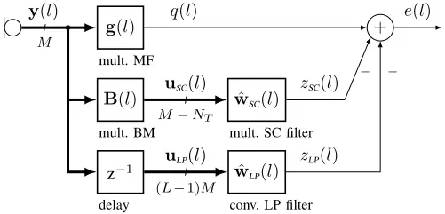
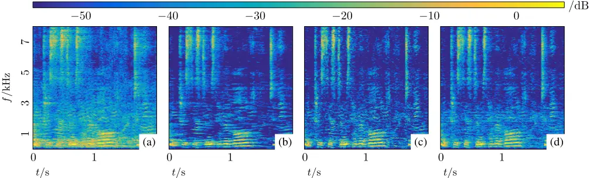
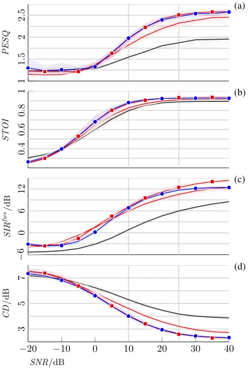
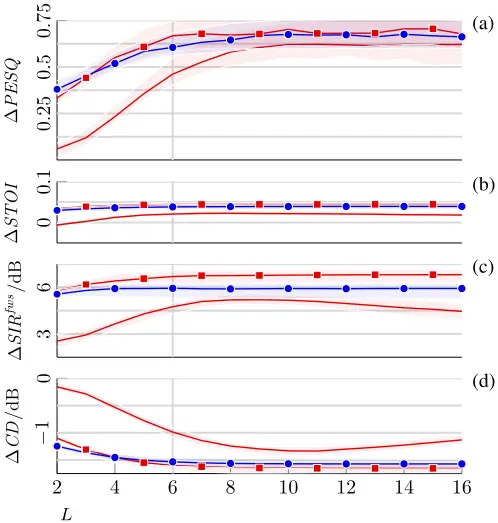
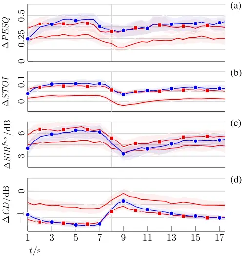
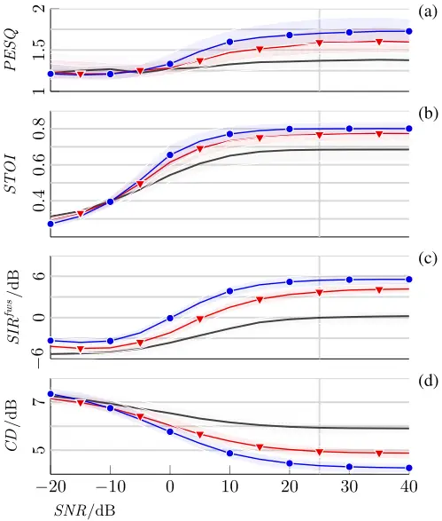
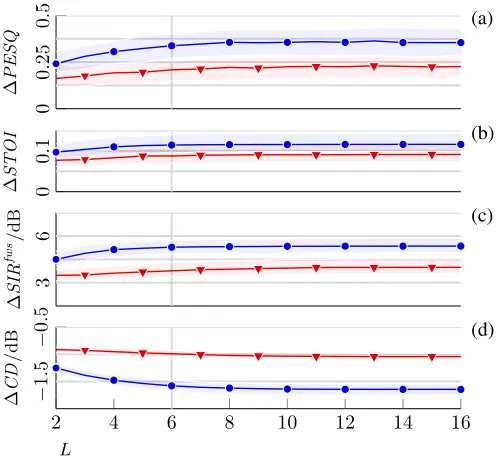

## Integrated Sidelobe Cancellation and Linear Prediction Kalman Filter for Joint MultiMicrophone Speech Dereverberation, Interfering Speech Cancellation, and Noise Reduction

Thomas Dietzen, Simon Doclo, Senior Member, Marc Moonen, Fellow, and Toon van Waterschoot Member

Abstract-In multi-microphone speech enhancement, reverberation as well as additive noise and/or interfering speech are commonly suppressed by deconvolution and spatial filtering, e.g., using multi-channel linear prediction (MCLP) on the one hand and beamforming, e.g., a generalized sidelobe canceler (GSC), on the other hand. In this paper, we consider several reverberant speech components, whereof some are to be dereverberated and others to be canceled, as well as a diffuse (e.g., babble) noise component to be suppressed. In order to perform both deconvolution and spatial filtering, we integrate MCLP and the GSC into a novel architecture referred to as integrated sidelobe cancellation and linear prediction (ISCLP), where the sidelobecancellation (SC) filter and the linear prediction (LP) filter operate in parallel, but on different microphone signal frames. Within ISCLP, we estimate both filters jointly by means of a single Kalman filter. We further propose a spectral Wiener gain post-processor, which is shown to relate to the Kalman filter's posterior state estimate. The presented ISCLP Kalman filter is benchmarked against two state-of-the-art approaches, namely first a pair of alternating Kalman filters respectively performing dereverberation and noise reduction, and second an MCLP+GSC Kalman filter cascade. While the ISCLP Kalman filter is roughly M 2 times less expensive than both reference algorithms, where M denotes the number of microphones, it is shown to perform similarly as compared to the former, and to outperform the latter.

Index Terms-Dereverberation, Interfering Speech Cancellation, Noise Reduction, Beamforming, Multi-Channel Linear Prediction, Kalman Filter

## I. INTRODUCTION

I N many wide-spread speech processing applications such as hands-free telephony and distant automatic speech recognition, reverberation as well as additive noise and/or interfering speech impinging on a microphone may deteriorate the quality and intelligibility of the speech recordings [1]. The demanding tasks of dereverberation, noise reduction and/or interfering speech cancellation, and in particular the conjunction of these therefore remain a subject of ongoing research, with multi-microphone-based approaches exploiting spatial diversity receiving particular interest [2]-[22]. In this context, we below briefly discuss two broad concepts in multimicrophone speech enhancement, namely spatial filtering and deconvolution.

T. Dietzen and T. van Waterschoot are with KU Leuven, Dept. of Electrical Engineering (ESAT), STADIUS Center for Dynamical Systems, Signal Processing and Data Analytics and ETC Technology Cluster Electrical Engineering, Leuven, Belgium. S. Doclo is with University of Oldenburg, Dept. of Medical Physics and Acoustics and the Cluster of Excellence Hearing4all, Oldenburg, Germany. M. Moonen is with KU Leuven, ESAT, STADIUS.

As a spatial filtering technique, beamforming is commonly used in noise reduction and interfering speech cancellation, but may as well be applied for dereverberation [2]-[4]. In order to perform both dereverberation and noise reduction, several beamforming schemes have been proposed. In [2], a cascaded approach is presented, using data-independent, super-directive beamforming for dereverberation, and datadependent, e.g., minimum-variance distortionless response (MVDR) beamforming, for noise reduction. The generalized sidelobe canceler (GSC), a popular implementation of the MVDR beamformer, has been applied in different constellations [3], [4]. In [3], joint dereverberation and noise reduction is performed using a single GSC, while in [4], a nested structure is proposed, employing an inner GSC for dereverberation and an outer GSC for noise reduction. The GSC is composed of two parallel signal paths: a reference path and a sidelobe-cancellation (SC) path. The reference path traditionally employs a matched filter (MF), while the SC path cascades a blocking matrix (BM), blocking either the entire or the early-reverberant speech component, and an SC filter, minimizing the output power and thereby suppressing residual nuisance components in the reference path, i.e. either residual noise or both residual noise and reverberation components.

As a deconvolution technique, multi-channel linear prediction (MCLP) [5]-[22] recently prevailed in blind speech dereverberation, while noise reduction is not targeted. As opposed to beamforming, MCLP does not require spatial information on the speech source. Instead, for each microphone, the reverberation component to be canceled is modeled as a linear prediction (LP) component, i.e. as a filtered version of the delayed microphone signals, with the LP filter to be estimated. Besides iterative LP filter estimation approaches such as [6], [8], [9], [11]-[13], also adaptive approaches based on recursive least squares (RLS) [7], [10], [16], [19] as well as the Kalman filter [14], [15], [17] have been proposed in the past years. In order to reduce noise after dereverberation, multiple-output MCLP has been cascaded with MVDR beamforming in [12], [13], which was seen to be a commonly adopted approach in the 2018 CHiME-5 challenge [23]. In [22], the cascade in [12], [13] is unified. In [18], joint MCLP-based dereverberation and noise reduction is performed using a pair of alternating Kalman filters respectively estimating the LP filter and the noise-free reverberant speech component.

In [21], we have presented a comparative analysis of the GSC and MCLP. In another previous paper [20], instead of cascading MCLP and beamforming or relying on beamforming only, we have proposed to integrate the GSC and MCLP by employing an SC path and LP path in parallel, resulting in an architecture we refer to as integrated sidelobe cancellation and linear prediction (ISCLP). Within this novel architecture, we have estimated the SC and LP filters jointly by means of a single Kalman filter. Here, the spatial preprocessing blocks MF and BM require an estimate of the relative early transfer functions (RETFs), cf. also [3], while the Kalman filter requires an estimate of the power spectral density (PSD) of the desired early speech component, cf. also [14], [15], [17]. In this paper, the work in [20] is extended in the following manner. We generalize the short-time Fourier transform (STFT) domain-based signal model, which now comprises several (spatio-temporally correlated) reverberant speech components, whereof some are to be dereverberated and others to be canceled, as well as a (spatially, but not temporally correlated) diffuse (e.g., babble) noise component to be suppressed. This generalized acoustic scenario necessitates (non-stationary) multi-source early PSD estimation and RETF updates, which is achieved by means of the algorithm recently proposed in [24]. We further augment the proposed approach by a spectral Wiener gain post-processor, which is shown to relate to the Kalman filter's posterior state estimate. In order to demonstrate the effectiveness of the ISCLP Kalman filter, we compare against two state-of-the-art approaches - first the previously mentioned alternating Kalman filters in [18], and second a MCLP+GSC Kalman filter cascade, conceptually relating to [12], [13]. As compared to these two reference algorithms, the ISCLP Kalman filter is computationally roughly M 2 times less expensive, where M denotes the number of microphones. Yet, the ISCLP Kalman filter is shown to perform similarly as compared to the alternating Kalman filters, and to outperform the MCLP+GSC Kalman filter cascade. AMATLAB implementation is available at [25].

The paper is organized as follows. In Sec. II, we present the signal model in the STFT domain. In Sec. III, the ISCLP Kalman filter is described. Implementational aspects are discussed in Sec. IV, followed by simulations in Sec. V.

## II. SIGNAL MODEL

Throughout the paper, we use the following notation: vectors are denoted by lower-case boldface letters, matrices by upper-case boldface letters, I and 0 denote an identity and zero matrix, 1 denotes a vector of ones, A∗ , AT , AH , and E[A] denote the complex conjugate, the transpose, the complex conjugate transpose or Hermitian, and the expected value of a matrix A. The operation Diag[a] creates a diagonal matrix with the elements of a on its diagonal, and tr[A] denotes the trace of A. Submatrices are referenced either by index ranges or alternatively by sets of indices, e.g., the submatrix of A spanning all rows and the columns j1 to j2 is denoted as [A]:,j1:j2 , and the submatrix composed of all rows and the columns of A with indices in the ordered set T is denoted as [A]:,∈T .

In the short-time Fourier transform (STFT) domain, with l and k indexing the frame and the frequency bin, respectively, let ym(l, k) with m = 1, . . . ,M denote the mth microphone signal, with M the number of microphones. In the following, we treat all frequency bins independently and hence omit the frequency index. We define the stacked microphone signal vector y(l) ∈ CM ,

<!-- formula-not-decoded -->

composed of the mutually uncorrelated reverberant speech components xn(l) with n = 1, . . . ,N originating from N &lt; M point speech sources and the noise component v(l), defined similarly to (1), i.e.

<!-- formula-not-decoded -->

Here, the reverberant speech components xn(l) may be decomposed into the early and late-reverberant speech components xn|e(l) and xn|ℓ(l), i.e.

<!-- formula-not-decoded -->

which are commonly parted by the arrival time of the therein contained reflections and assumed to have distinct spatio-temporal properties as outlined below. Let xe(l) = ∑Nn=1 xn|e(l) and xℓ(l) = ∑Nn=1 xn|ℓ(l) denote the sum of the early and late-reverberant speech components, respectively, such that y(l) in (2)-(3) may alternatively be written as

<!-- formula-not-decoded -->

Early reflections are assumed to arrive within the same frame, where the early components in xn|e(l) are related by the RETFs in hn(l) ∈ CM as xn|e(l) = hn(l)sn(l). Here, without loss of generality, the RETFs are assumed to be relative to the first microphone, i.e. [hn(l)]1 = 1, and sn(l) = [xn|e(l)]1 denotes the early component in the first microphone originating from the nth source, in the following referred to as early source image. We stack hn(l) and sn(l) into H(l) ∈ CM×N and s(l) ∈ CN , respectively, i.e.

<!-- formula-not-decoded -->

<!-- formula-not-decoded -->

such that xe(l) is expressed by

<!-- formula-not-decoded -->

In the following, let NT ≤ N early speech source images sn(l) be defined as the target source images, and let T denote the set of the corresponding |T| = NT target-source indices. Let T ′ denote the complement set to T, with |T ′ | = N-NT . In order to distinguish the target components in y(l) as well as their complements, we introduce the short-hand notations similar to (5)-(7),

<!-- formula-not-decoded -->

<!-- formula-not-decoded -->

<!-- formula-not-decoded -->

and HT ′(l), sT ′(l), and xe|T ′(l) similarly, such that xe(l) in (4) becomes

<!-- formula-not-decoded -->

Our objective is to estimate

<!-- formula-not-decoded -->

from y(l) by means of the ISCLP Kalman filter. To this end, we rely on assumptions on the spatio-temporal behavior of the individual microphone signal components. We assume that sn(l) is temporally uncorrelated across frames, i.e. we have E[sn(l-l′ )s∗n (l)] = 0 for l′ &gt; 0, and with xn|e(l) = hn(l)sn(l) consequently

<!-- formula-not-decoded -->

For speech signals, this assumption can be considered approximately justified if the STFT window length and window shift are sufficiently large. Within the limits defined by the reverberation time, we assume that the late-reverberant speech component xn|ℓ(l) is correlated to previous early source images sn(l-l′ ) with l′ &gt; 0, but not to the current early source image sn(l), i.e. we have

<!-- formula-not-decoded -->

<!-- formula-not-decoded -->

Note that (14) also implies E[xn|ℓ(l-l′ )xHn|ℓ (l)] ̸= 0 for all l′ . With (14), we may predict xn|ℓ(l) from xn(l-l′ ), which indeed is the fundamental assumption of MCLP-based dereverberation [5]-[19]. Assumptions (13) and (15) allow for unbiased filter estimation [21] in MCLP-based dereverberation [5]-[19] and GSC-based dereverberation and noise reduction [3], [4], respectively. Hence, all three assumptions (13)-(15) are equally essential in the derivation of the ISCLP Kalman filter, cf. Sec. III. Similarly to sn(l), the noise component v(l) is assumed to be temporally uncorrelated, i.e.

<!-- formula-not-decoded -->

and is therefore not predictable.

Within frame l, i.e. for l′ = 0, we further make assumptions on the spatial behavior of xn|ℓ(l) and v(l), namely that both may be modeled as spatially diffuse. However, as these assumptions are irrelevant in the derivation of the ISCLP Kalman filter itself, cf. Sec. III, but required only for parameter estimation based on [24], i.e. the estimation of the RETFs HT (l) and the PSD ϕsT (l) = E[sT (l)s∗T (l)], we treat them in the corresponding section only, cf. Sec. IV-B.

## III. INTEGRATED SIDELOBE CANCELLATION AND LINEAR PREDICTION KALMAN FILTER

We strive to estimate the target component sT (l) from the microphone signals y(l) defined in Sec. II. For this purpose, we introduce the ISCLP architecture. In Sec. III-A, we describe the SC and LP signal paths and filter constellations, which require spatio-temporal pre-processing of y(l). In Sec. III-B, striving for recursive filter estimation, we define an ISCLP state-space model for the SC and the LP filter, whereof a Kalman filter is deduced. The Kalman filter yields a (prior) estimate e(l) = ˆ sT (l) of sT (l), which may further be spectrally post-processed, as shown in Sec. III-C.

## A. ISCLP Signal Path Architecture

A block-diagram of the ISCLP architecture is depicted in Fig. 1. It integrates the GSC and MCLP and hence consists of three signal paths: a reference path employing an MF, an SC path, composed of a BM and an SC filter, and a LP path, composed of a delay and an LP filter. While the MF, the BM and the SC filter are multiplicative (mult.), i.e. they operate on a single frame, the LP filter is convolutive (conv.), i.e. it operates across frames. The MF and the BM perform spatial pre-processing, serving unconstrained estimation of the SC filter, while the delay may analogously be considered as temporal pre-processing, serving unconstrained estimation of the LP filter. Structurally, one may interpret ISCLP either as MCLP with the conventional reference channel selection replaced by a GSC, or alternatively as a GSC employing a generalized BM (composed of a traditional BM and a delay line), and a convolutive filter (composed of the SC and the LP filter). In the following, we formally discuss the individual signal paths.

In oder to maintain the target component sT (l) in (12), the MF g ∈ CM must satisfy [26], [27]

<!-- formula-not-decoded -->

where a commonly used [26], [27] choice for g(l) adhering to (17) is

<!-- formula-not-decoded -->

with HT (l)(HHT (l)HT (l))-1 the pseudoinverse of HHT (l). In practice, we hence require an estimate ˆHT (l) of HT (l), cf. also Sec. IV-B. With y(l) as in (4), combining (10)-(12), the MF output q(l) becomes

<!-- formula-not-decoded -->

The BM B(l) ∈ CM×M-NT must be orthogonal to HT (l), i.e.

<!-- formula-not-decoded -->

and with (18) hence BH (l)g(l) = 0. One may, e.g., choose B(l) based on the first M - NT columns of the rank(M-NT ) projection matrix to the null space of HT (l) [27],

<!-- formula-not-decoded -->

with HT (l)(HHT (l)HT (l))-1HHT (l) the projection matrix to the column space of HT (l). With y(l) as in (4), combining (10)-(11), the SC-filter input uSC(l) ∈ CM-NT is then given by

<!-- formula-not-decoded -->

Fig. 1: The integrated sidelobe cancellation and linear prediction (ISCLP) architecture.

whereby the target component xe|T (l) = HT (l)sT (l) is canceled. Using a delay of one 1 frame, the LP-filter input uLP(l) ∈ C(L-1)M is defined by stacking y(l) over the past L-1 frames, i.e.

<!-- formula-not-decoded -->

With the SC filter ˆwSC(l) ∈ CM-NT and the LP filter ˆwLP(l) ∈ C(L-1)M , the enhanced signal e(l) = ˆ sT (l) at the output of ISCLP, also referred to as error signal in the remainder, is given by

<!-- formula-not-decoded -->

<!-- formula-not-decoded -->

<!-- formula-not-decoded -->

At this point, given q(l), uSC(l), and uLP(l), our task consists in obtaining the filters ˆwSC(l) and ˆwLP(l) as estimates of some yet to be defined associated true states wSC(l) and wLP(l), cf. Sec III-B. In this respect, let us first discuss the mutual relations between the target component sT (l) in q(l) and the signals uSC(l) and uLP(l), as well as the consequences thereof for the filter estimation. Note that due to the delay in the LP path, the filter estimates ˆwSC(l) and ˆwLP(l) do not operate on the same input-data frame at the same time. The SC-filter input uSC(l) in (22) depends on the current frame y(l) only, such that ˆwSC(l) will exploit spatial correlations within the current frame. Due to the cancellation of xe|T (l) at the BM output and (15), we have E[uSC(l)s∗T (l)] = 0. This allows for unconstrained, recursive estimation of wSC(l), which is indeed the general incentive behind the usage of GSC-like structures [26], [27]. In contrast, the LP-filter input uLP(l) in (23) depends on the L-1 previous frames y(l-l′ ) with l′ = 1, . . . ,L-1, such that ˆwLP(l) will exploit spatio-temporal correlations between the current and the previous frames (but not within the current frame). Due to this delay and (13), we have E[uLP(l)s∗T (l)] = 0, likewise allowing for unconstrained, recursive estimation of wLP(l). However, with both uSC(l) and

1 In MCLP literature, delays of more than one frame are commonly used [8]-[13], [15], [16], [18], [19] in order to avoid temporal target component leakage due to overlapping windows in the STFT processing, cf. Sec. IV-A. As we here also consider interfering reverberant speech components to be canceled, larger delays in the LP filter path however call for a convolutive SC filter [21] instead. The here proposed design did not show to be sensitive to leakage effects, cf. Sec. IV-A and Sec. V.

uLP(l) containing (late-)reverberant components, the two inputs are not independent, i.e.

<!-- formula-not-decoded -->

cf. (14), and as a consequence also E[zLP(l)z∗ SC (l)] ̸= 0. In other words, a change in ˆwSC(l) requires a change in ˆwLP(l), and vice versa. We therefore strive to jointly estimate both filters.

## B. ISCLP State-Space Model and Kalman Filter Update

In order to recursively estimate the SC and LP filter, we employ a Kalman filter, which has also been applied successfully to MCLP in previous works [14], [15], [17], [18]. Hereby, we interpret ˆwSC(l) and ˆwLP(l) as estimates of the true states wSC(l) and wLP(l), which are defined by a state-space model comprising the so-called measurement equation and the process equation. In the following, we first define the statespace model, and then present the corresponding Kalman filter update equations, which recursively estimate the true state.

As we intend to estimate wSC(l) and wLP(l) jointly, cf. Sec. III-A, we stack the SC and LP filter path into u(l) ∈ CLM-NT and w(l) ∈ CLM-NT , i.e.

<!-- formula-not-decoded -->

<!-- formula-not-decoded -->

and ˆw(l) defined similarly to (29). The true state w(l) is considered a random variable with zero mean and correlation matrix Ψw(l) = E[w(l)wH (l)]. We assume that w(l) leads to complete cancellation 2 of gH (l)(xe|T ′(l)+xℓ(l)+v(l)), and therefore yielding e(l) = sT (l), cf. (19) and (24)-(26). Reformulating (24)-(26) using (28)-(29), inserting e(l) = sT (l) and rearranging yields the so-called measurement equation,

<!-- formula-not-decoded -->

In Kalman filter terminology, we refer to q∗ (l) as the measurement and to s∗T (l) as the (presumed zero-mean and temporally uncorrelated, cf. also Sec. II) measurement noise with PSD ϕsT (l) = E[sT (l)s∗T (l)]. In practice, in order to implement the Kalman filter update equations, an estimate ˆ ϕsT (l) of ϕsT (l) is required, cf. Sec. IV-B.

The true state w(l) is assumed time-varying, which accounts for potential time variations in the room impulse responses, e.g., caused by time-varying source and microphone-array positions, as well as time-varying activity of individual sources and noise powers. The so-called process equation models the evolution of the true state w(l) in the form of a first-order difference equation, i.e.

<!-- formula-not-decoded -->

where A(l) models the state transition from one frame to the next, and the process noise w∆(l) models a random (presumed zero-mean and temporally uncorrelated) variation component with correlation matrix Ψw∆ (l) = E[w∆(l)wH ∆ (l)]. Lacking deeper knowledge on the exact evolution of the true state, both A(l) and Ψw∆ (l) are commonly considered design parameters to be tuned [15], [17], [18], [28], cf. Sec. IV-C.

2 Note that complete cancellation may not necessarily be possible, e.g., if v(l) ̸= 0 [21], and so the true state does not necessarily exist. Nonetheless, lacking deeper knowledge on the true system, we assume that it lies in the model set.

The true state w(l) modeled by (30)-(31) may be estimated recursively by means of the Kalman filter update equations [29], [30], which are commonly presented as two distinct sets of updates per recursion, namely an a-priori time update reflecting the state evolution, cf. (31), and an a-posteriori measurement update reflecting the current measurement, cf. (30). Specifically, let ˆw(l) and ˆw+(l) denote the yet to be defined prior and posterior state estimates of w(l), respectively, and let ˜w(l) and ˜w+(l) denote the associated state estimation errors, i.e.

<!-- formula-not-decoded -->

<!-- formula-not-decoded -->

with the associated state estimation error correlation matrices Ψ˜w(l) and Ψ+˜w (l). Then, based upon (31) and (30), respectively, the prior and posterior state estimates ˆw(l) and ˆw+(l) shall recursively minimize the expected squared Euclidian norm of the associated state estimation error, i.e. E[‖˜w(l)‖2 ] = tr[Ψ˜w(l)] and E[‖˜w+(l)‖2 ] = tr[Ψ+˜w (l)]. This leads to the celebrated Kalman filter update equations [29], [30],

<!-- formula-not-decoded -->

<!-- formula-not-decoded -->

<!-- formula-not-decoded -->

<!-- formula-not-decoded -->

<!-- formula-not-decoded -->

<!-- formula-not-decoded -->

<!-- formula-not-decoded -->

where the time and the measurement update are given by (34)- (35) and (39)-(40), respectively. In the time update, cf. (34)- (35), the previously acquired posterior quantities ˆw+(l-1) and Ψ+˜w (l-1) are propagated according to the evolution of the state w(l), cf. (31), yielding the prior quantities ˆw(l) and Ψ˜w(l). Then, given ˆw(l) and Ψ˜w(l), the complex conjugate error signal e∗ (l), its PSD ϕe(l), and the Kalman gain k(l) are computed, cf. (36)-(38), thereby leveraging new information in terms of the measurement q∗ (l) and the measurement noise PSD ϕsT (l), cf. (30). Finally, in the measurement update, cf. (39)-(40), e∗ (l) and k(l) are utilized to update ˆw(l) and Ψ˜w(l), yielding the posterior quantities ˆw+(l) and Ψ+˜w (l). The error signal e(l) in (36) thereby represents the Kalman filter estimate of sT (l), cf. also (24)-(26). As the Kalman filter minimizes tr[Ψ˜w(l)] during convergence, it is easily seen that also ϕe(l) = E[|e(l)|2 ] in (36) is minimized. The Kalman filter requires initialization, which we consider in Sec. IV-C.

## C. Posterior-like Spectral Post-Processing

With ˆw(l) a prior estimate of w(l), we may consider e(l) = ˆ sT (l) in (36) a prior estimate of sT (l). After the measurement update in (39), yielding the posterior estimate ˆw+(l) of w(l), we may accordingly define a posterior estimate e+(l) = ˆ s+T (l) similar to (36) by

<!-- formula-not-decoded -->

Interestingly, e+(l) in (41) can be shown to be a spectrally post-processed version of e(l). Precisely, inserting (39) while using (36), inserting (38) and finally (37), we find

<!-- formula-not-decoded -->

where γ(l) = ϕsT (l)/ϕe(l) can be recognized as the spectral Wiener gain minimizing E[|sT (l) - γ(l)e(l)|2 ]. In practice, where we rely on potentially highly non-stationary estimates ˆ ϕsT (l), cf. Sec. IV-A and Sec. IV-B, one may prefer slowly decaying gains for perceptual reasons [31]. Therefore, instead of using (42), we propose to alternatively define γ(l) and e+(l) by

<!-- formula-not-decoded -->

<!-- formula-not-decoded -->

with the tuning parameter β ∈ [0, 1] limiting the gain decay. Note that (43)-(44) reduce to (42) for β = 0, and to (36) for β = 1 and γ(0) = 1 as initial gain, since ϕsT (l)/ϕe(l) ≤ 1 due to (37).

## IV. IMPLEMENTATIONAL ASPECTS

Kalman filters perform optimally if the assumed statespace model matches the true system [29], [30]. In a practical implementation, the here presented ISCLP Kalman filter derived from the ISCLP state-space model in (30)-(31) is subject to modeling errors, requires parameter estimation, and, where deeper knowledge on the underlying system dynamics is not available, parameter tuning. These implementational aspects are discussed in the following. In Sec. IV-A, we qualitatively discuss the potential target component leakage due to imperfect spatio-temporal pre-processing in ISCLP and its impact on the proposed ISCLP Kalman filter. In Sec. IV-B, we summarize a recently proposed approach to early PSD estimation and recursive RETF updating, which we employ in conjunction with the Kalman filter. In Sec. IV-C, we discuss the process equation parameter tuning and Kalman filter initialization.

## A. Spatio-Temporal Target Component Leakage

The previously made assumptions that E[uSC(l)s∗T (l)] = 0 and E[uLP(l)s∗T (l)] = 0, cf. Sec. III-A, may not be strictly satisfied in a practical implementation, which we refer to as target component leakage. Leakage may occur due to the following reasons. The spatial pre-processing components MF and BM rely on spatial information in terms of the RETFs HT (l), cf. (18) and (21), which needs to be estimated in practice. The estimate ˆHT (l) commonly contains estimation errors, i.e. we have ˆHT (l) ̸= HT (l). Further, the RETFbased data model in (7) itself may be erroneous, e.g., due to dependencies across frequency bins [32]. Finally, (15) may be violated, e.g., due to overlapping windows in the STFT processing. In general, these estimation and modeling errors cause incomplete blocking and therefore target component leakage through the BM, such that E[uSC(l)s∗T (l)] ̸= 0, cf. (19), (22). This may be referred to as spatial target component leakage. Similarly, if sT (l) is temporally correlated such that (13) is violated, e.g., due to overlapping windows in the STFT processing or to too small lengths and window shifts, we find E[uLP(l)s∗T (l)] ̸= 0, cf. (19), (23), which may be referred to as temporal target component leakage.

Potentially, spatial and temporal leakage cause a biased [21] filter estimate ˆw(l), which leads to partial suppression of sT (l), also referred to as speech cancellation in GSC terminology [26], [27], or excessive whitening in MCLP terminology [5]. However, note that the Kalman filter offers inherent robustness towards target-component leakage. To see this, consider the measurement update terms in (39)-(40), respectively given by k(l)e∗ (l) and k(l)uH (l)Ψ˜w(l). Using (30) and (32), we may express e∗ (l) in (36) in terms of s∗T (l), while using (37), we may similarly express k(l) in (38) in terms of ϕsT (l), i.e.

<!-- formula-not-decoded -->

<!-- formula-not-decoded -->

From (45)-(46), we note that ϕsT (l) = E[sT (l)s∗T (l)] acts as a regularization parameter in both update terms k(l)e∗ (l) and k(l)uH (l)Ψ˜w(l). Consequently, strong target powers inhibit the measurement update, while weak target powers promote it. Put differently, in terms of robustness towards targetcomponent leakage and convergence, the Kalman filter benefits from non-stationarities and sparsity in ϕsT (l) across time. Note that in recursive MCLP implementations based on the weighted prediction error (WPE) criterion and RLS [7], [10], [16], [19], the target-component PSD similarly appears as a regularization term in the update equations.

In practice, we rely on estimates ˆ ϕsT (l), which should hence maintain non-stationarities. In WPE RLS literature, the targetcomponent PSD estimate is obtained, e.g., directly from the plain microphone signals [7], based on a late-reverberant PSD estimate obtained by means of an exponential decay model [10], [16], or using a neural network [19]. Here, as we consider a more generic signal model comprising several reverberant speech components and diffuse noise, cf. Sec. II, we instead estimate ˆ ϕsT (l) by means of [24], cf. Sec. IV-B.

## B. Target PSD Estimation and RETF Update

We require an RETF estimate ˆHT (l) of HT (l), cf. (18) and (21), and a PSD estimate ˆ ϕsT (l) of ϕsT (l), cf. (37) and (43). To this end, we use an algorithm recently proposed in [24] by the authors of this paper, which computes early PSD estimates and recursively updates the RETF estimates for all N point sources. The algorithm [24] is summarized as follows.

Let Ψxe (l) = E[xe(l)xHe (l)] denote the correlation matrix of xe(l) within frame l, which generally has rank N and is given by

<!-- formula-not-decoded -->

<!-- formula-not-decoded -->

with ϕsn (l) denoting the PSD of the early speech source image sn(l). Instead of directly using the conventional early correlation matrix model in (47), the algorithm in [24] is based on its factorization, i.e. it relies on the square-root model

<!-- formula-not-decoded -->

where Ψ1/2 xe (l) ∈ CM×N and ϕ1/2 ∈ CN are some square roots of Ψxe (l) and ϕs(l) such that Ψ1/2 xe (l)ΨH/2 xe (l) =Ψxe (l) and Diag[ϕH/2 (l)]ϕ1/2 (l) = ϕs(l), respectively, and Ω(l) is a unitary matrix, i.e. Ω(l)ΩH (l) = I, which accounts for the non-uniqueness of both square-roots. Note that rightmultiplying each side of (49) with its Hermitian yields (47). In the estimation, we distinguish the prior and posterior RETF estimates ˆH(l) and ˆH+(l), respectively, and assume that initial RETF estimates ˆH(0) are available, which may be based on, e.g., initial single-source RETF estimates acquired from segments with distinctly active sources [33], or some initial knowledge or estimates of the associated dicrections of arrival (DoAs) [34], [35]. Given a (to be obtained) square-root estimate ˆΨ1/2 xe (l) and a prior RETF estimate ˆH(l), which is propagated from the previous posterior, i.e. ˆH(l) = ˆH+(l-1), we first obtain the unitary and diagonal estimates ˆΩ(l) and Diag[ ˆϕ1/2 ], yielding ˆϕs(l) = Diag[ ˆϕH/2 ] ˆϕ1/2 , and based on these estimates second update the RETF estimate, yielding the posterior ˆH+(l), whereat the recursion is closed. Here, both steps are based on approximation error minimization with respect to the square-root model in (49). Given ˆϕs(l) and ˆH+(l), we extract ˆ ϕsT (l) and ˆHT (l) as ˆ ϕsT (l) = 1T [ ˆϕs(l)]∈T and ˆHT (l) = [ ˆH+(l)]∈T , cf. Sec. II.

The said required square root Ψ1/2 xe (l) is estimated in the following manner. While xn|ℓ(l) and v(l) exhibit a fundamentally different temporal behavior across frames, cf. Sec. II, we assume that their spatial behavior within frame l is the same. Specifically, we model both xn|ℓ(l) and v(l) as spatially diffuse with coherence matrix Γ ∈ CM×M , which may be computed from the microphone array geometry [36], [37] and is therefore assumed to be known. For the late reverberant component xn|ℓ(l), this is a commonly made assumption [36], [38], [39]. For the noise component v(l), the assumption is commonly made for noise types such as, e.g., babble noise [40], which we use in our simulations, cf. Sec. V. Based on these assumptions, the microphone signal correlation matrix Ψy(l) = E[y(l)yH (l)] may be written as

<!-- formula-not-decoded -->

with ϕd(l) = ∑Nn=1 ϕxn|ℓ (l) + ϕv(l) and ϕxn|ℓ (l) and ϕv(l) denoting the PSDs of the late-reverberant speech components and the diffuse noise component, respectively. We obtain a subspace representation of (50) by means of the generalized eigenvalue decomposition (GEVD) of Ψy(l) and Γ. Based on the generalized eigenvectors and generalized eigenvalues,

Ψy(l) may be decomposed into a diffuse component, cf. also the diffuse PSD estimator in [39], and a factorized early rank-N component Ψxe (l) = Ψ1/2 xe (l)ΨH/2 xe (l). A temporally smooth estimate ˆΨy|sm(l) of Ψy(l) itself is obtained from the microphone signals by recursively averaging yH (l)y(l). In order to restore non-stationarities, we desmooth 3 the generalized eigenvalues of ˆΨy|sm(l) and Γ and thereby yield nonstationary PSD estimates in the subsequent processing steps, as as favored in the Kalman filter, cf. Sec IV-A. For further details, we refer the interested reader to [24].

Considering recursive averaging as an invertible recursive filtering operation, the generalized eigenvalues may be desmoothed by means of the corresponding inverse filter.

## C. Process Equation Parameter Tuning and Initialization

The tracking and convergence behavior of the Kalman filter depends on its process equation parameter tuning and initialization. The process equation models the evolution of the state by means of the parameters A(l) and Ψw∆ (l), cf. (31) and (34)-(35). In practice, only limited knowledge of the state evolution is available, such that A(l) and Ψw∆ (l) are commonly left to tuning [15], [17], [18], [28]. Typically, both A(l) and Ψw∆ (l) are chosen to be scaled identities, with A(l) commonly time-invariant [15], [17], [18], [28] and acting as a forgetting factor [17], [28], and Ψw∆ (l) either time-variant [15], [18], [28] or time-invariant [17]. Here, we set A(l) and Ψw∆ (l) based on the assumption that the state correlation matrix Ψw(l) is time-invariant, i.e. Ψw(l) =Ψw. Unfortunately, Ψw is unknown and not available in practice, however, we may define a rough guess ¯Ψw. Given such a guess ¯Ψw, by means of a forgetting factor α ∈ (0, 1), we may account for a steadily time-varying acoustic scenario and true state w(l) by setting

<!-- formula-not-decoded -->

<!-- formula-not-decoded -->

such that if ¯Ψw = Ψw, we rightly have Ψw = αΨw + (1 - α)Ψw from (31). While ¯Ψw may rather be defined by design than by truly estimating Ψw, the notion of ¯Ψw being a rough guess of Ψw may nonetheless guide its definition to some extent. Here, we choose a diagonal matrix with distinct diagonal elements. With ¯Ψw = Diag[ ¯ψw], let ¯ψwSC ∈ RM-NT and ¯ψwLP ∈ R(L-1)M denote the subvectors of ¯ψw associated to the SC and the LP filter, respectively, which we treat separately. Expecting lower values for later prediction coefficients in the LP filter, we choose the power of the diagonal elements in ¯ψwLP to drop exponentially each M elements, i.e. we set

<!-- formula-not-decoded -->

<!-- formula-not-decoded -->

with ¯ ψwSC &gt; 0 and ¯ ψwLP ∈ (0, 1) further adjustable.

3 Considering recursive averaging as an invertible recursive filtering operation, the generalized eigenvalues may be desmoothed by means of the corresponding inverse filter.

The matrix ¯Ψw may also be used to initialize the Kalman filter. With the commonly chosen initial state estimate ˆw(0) = 0, we have ˜w(0) =w(0) in (32), such that the true initial state estimation error correlation matrix Ψ˜w(0) becomes Ψ˜w(0) = Ψw(0) =Ψw. Therefore, we initialize the Kalman filter by

<!-- formula-not-decoded -->

<!-- formula-not-decoded -->

in (34)-(35), where ˆΨ˜w(0) in (56) is an estimate if ¯Ψw ̸=Ψw. Finally, note that the process equation parameter tuning in (51)-(52) may also be considered from a (re-)initialization perspective. In case of meaningful measurement updates, the Kalman filter tracks w(l), but otherwise tends to return to its initial condition due to (51)-(52), such that explicit reinitialization as, e.g., in case of a sudden change in the acoustic environment, is not necessary. To see this, consider the case where, e.g., u(l) = 0 for a period of time, such that no measurement update is performed. In this case, regardless of their current values, we have ˆw(l) slowly converging to 0 and ˆΨ˜w(l) slowly converging to ¯Ψw, cf. (34)-(35). Note that if desired, explicit re-initialization may still easily be incorporated in the proposed concept, namely by defining α time-variant and setting it to zero at the determined reinitialization point.

## V. SIMULATIONS

In order to demonstrate the effectiveness of the presented ISCLP Kalman filter, we define two case studies, case A and case B. In case A, we compare to the (computationally more demanding) alternating Kalman filters proposed in [18]. Here, we consider one reverberant speech and a babble noise component, x1(l) and v(l), with x1(l) containing the target component xe|T (l) = x1|e(l). In case B, we compare to a (computationally more demanding) MCLP+GSC Kalman filter cascade, which conceptually relates to [12], [13] in that it cascades linear prediction and beamforming. Here, we consider two reverberant speech components and a babble noise component, x1(l), x2(l), and v(l), with x1(l) again containing the target component xe|T (l) = x1|e(l), and x2(l) an interfering speech component to be canceled. In both cases, we investigate the algorithms' behavior depending on the signal-to-noise ratio, SNR, which is defined as the power ratio of x1(l) to v(l), and depending on the filter length L. In case A, we additionally investigate the convergence behavior.

In what follows, we describe the two reference algorithms in more detail in Sec. V-A, the performance measures in Sec. V-B, the acoustic scenario in Sec. V-C, the algorithmic settings in V-D, and finally the simulation results in Sec. V-E.

## A. Reference Algorithms

We discuss the alternating Kalman filters in Sec. V-A1 and the MCLP+GSC Kalman filter cascade in Sec. V-A2.

1. Case A: Alternating Kalman Filters: In [18], MCLPbased dereverberation and noise reduction is performed in each microphone channel using two alternating Kalman filters. The Kalman filter dedicated to dereverberation estimates a multiple-output LP filter, and the Kalman filter dedicated to noise reduction estimates the noise-free reverberant speech component. The enhanced signal is computed from the posterior state estimates of both Kalman filters. The two state vectors have dimensions M 2 (L- 1) and M(L- 1), respectively, while the ISCLP Kalman filter requires a single state vector with dimension ML - NT only with NT = 1 in case A, cf. (29). Since the Kalman filter in general exhibits a quadratic computational cost in the state vector dimension, the alternating Kalman filters are computationally roughly M 2 times as demanding as the ISCLP Kalman filter. The two state space models do not provide a spatial distinction between point sources (and therefore do not require RETF estimates, as opposed to the ISCLP Kalman filter) and further do not consider temporally correlated interference components such as interfering reverberant speech. We hence set x2(l) = 0 when comparing to [18], i.e. interfering speech is absent, cf. Sec. V-C2.

The alternating Kalman filters require correlation matrix estimates of the measurement and process noises, more precisely of the random variation of the multiple-output LP filter state, comparable to Ψw∆ (l) in the ISCLP Kalman filter, cf. (31), the early component Ψxe|T (l) =Ψxe (l), the early-plusnoise component Ψxe (l) +Ψv(l), and the noise component Ψv(l) [18]. In the original implementation in [18], a timeinvariant estimate ˆΨv is assumed to be available, which we here compute in an oracle fashion from v(l) directly, while the other correlation matrices are estimated based on the previous state estimates and error signals of the alternating Kalman filters. For the sake of a fair and more meaningful comparison, we implement two versions of [18]. The first version is implemented as proposed in [18] and discussed above, subsequently referred to as the original alternating Kalman filters. In the second version, we align the parameter estimation and tuning towards the proposed approach, i.e. Ψxe (l) is instead estimated based on [24], cf. Sec. IV-B, and the process equation parameters modeling the evolution of the multiple-output LP filter state are defined similarly to Sec. IV-C, subsequently referred to as the modified alternating Kalman filters.

2. Case B: MCLP+GSC Kalman Filter Cascade: In [12], [13], multiple-output MCLP based on the (iterative) WPE criterion [8], [9] is cascaded with MVDR beamforming in order to reduce noise after dereverberation, which became a popular approach in the CHiME-5 challenge [23]. For the sake of a close comparison, however, we here instead compare to a (recursive) multiple-output MCLP-based Kalman filter cascaded with a (recursive) GSC-based Kalman filter, subsequently referred to as MCLP+GSC. Herein, we estimate the LP and SC filters independently. The enhanced signal at the GSC output is computed using spectral post-processing of the same kind as in (43)-(44). The two state vectors have dimensions M 2 (L-1) and M-1, respectively, while the ISCLP Kalman filter requires a single state vector with dimension ML-NT only with NT = 1 in case B, cf. (29). Since the Kalman filter in general exhibits a quadratic computational cost in the state vector dimension, the MCLP+GSC Kalman filter cascade is computationally roughly M 2 times as demanding as the ISCLP Kalman filter. The GSC state space model does provide a spatial distinction between point sources (based on an RETF estimate, as the ISCLP Kalman filter). We hence set x2(l) ̸= 0 when comparing to the MCLP+GSC Kalman filter cascade, i.e. interfering speech is present, cf. Sec. V-C2.

The MCLP and GSC Kalman filters require correlation matrix estimates of their respective measurement and process noises, more precisely of the random variation of the multipleoutput LP filter and SC filter state, respectively, defined similarly to the corresponding SC and LP submatrices of Ψw∆ (l) in the ISCLP Kalman filter, cf. (31), and the early components Ψxe|T (l) and ϕsT (l), respectively, computed based on [24] as in the proposed ISCLP Kalman filter, cf. Sec. IV-B.

## B. Performance Measures

As performance measures, we choose the perceptual evaluation of speech quality [41], PESQ, with mean opinion scores of objective listening quality ∈ [1, 4.5], the shorttime objective intelligibility [42], STOI , with scores ∈ [0, 1], the frequency-weighted segmental signal-to-interference ratio [31], [43], SIR fws , in dB, and the cepstral distance [31], [43], CD, in dB. While high values are preferable for PESQ, STOI , and SIR fws , low values are preferred for CD. These intrusive measures require a clean reference signal ˜ sT (l), which approximates the target signal sT (l) in (12). In order to generate ˜ sT (l), we convolve the target speech source signal with the early part of the RIR to the first microphone, cf. Sec V-C, whereat we define the first NSTFT samples of the RIR as its early part, with NSTFT the analysis and synthesis window length of the STFT processing corresponding to 32ms, cf. Sec. V-D. Note that due to modeling errors in the RETF-model in (7), we generally have ˜ sT (l) ̸= sT (l). When investigating the dependency on SNR or L, we compute the measures from 4 s to 10 s, i.e. roughly after convergence. When investigating the convergence behavior, we compute the measures within sliding windows of 2 s each. The computed measures are averaged over several individual simulations, cf. Sec. V-C.

## C. Acoustic Scenario

We describe the acoustic scenarios without and with interfering speaker in Sec. V-C1 and Sec. V-C2, respectively.

1. Case A: Without Interfering Speech: In case A, the microphone signals are composed of one reverberant speech and a babble noise component, x1(l) and v(l), with x1(l) containing the target component xe|T (l) = x1|e(l). To generate x1(l), we use measured RIRs of 0.61 s reverberation time to a linear microphone array with M = 5 microphones and 8 cm inter-microphone distance [44]. When investigating the dependency on SNR or L, the speech source remains positioned in 2m distance of the microphone array at 0◦ relative to the broad-side direction during 10 s of simulation. When investigating the convergence behavior, the speech source remains positioned in 2m distance at 0◦ for the first 8 s, then jumping to 15◦ , where it remains for another 10 s. Both female and male speech [45] are used as speech source signals. The babble noise component is generated using [40], [46]. From the speech source signal files and the babble noise file [46], we randomly select individual segments, yielding individual simulations to be averaged in the performance evaluation, cf. Sec. V-B. In total, when investigating the dependency on SNR or L, we generate 64 individual simulations per condition. When investigating the convergence behavior, we generate 128 individual simulations.

Fig. 2: Exemplary spectrograms depicting 2 s of (a) the reference microphone signal y1(l), and the corresponding outputs of (b) the original alternating Kalman filters, (c) the modified alternating Kalman filters, and (d) the ISCLP Kalman filter for L = 6 at SNR = 10 dB.

2. Case B: With Interfering Speech: In case B, the microphone signals are composed of two reverberant speech components and a noise component, x1(l), x2(l), and v(l), with x1(l) again containing the target component xe|T (l) = x1|e(l), and x2(l) an interfering speech component. We investigate the dependency on SNR and L, and generate x1(l) and v(l) in the same manner as in case A, cf. Sec. V-C1. To generate x2(l), we use the same set of RIR measurements, where the associated source is positioned in 2m distance at either {30, 60, 90}◦ . If x1(l) contains female speech, then x2(l) contains male speech [45] and vice versa. On average, x1(l) and x2(l) have roughly the same power. From the speech source signal files and the babble noise file, we randomly select individual segments, generating 3 · 64 = 192 individual simulations per condition to be averaged in the performance evaluation, cf. Sec. V-B.

## D. Algorithmic Settings

In our simulations, the sampling frequency is fs = 16kHz, and the STFT analysis and synthesis uses square-root Hann windows of NSTFT = 512 samples with 50% overlap. When investigating the dependency on SNR and the convergence behavior, we set L = 6 in (23). The estimates ˆϕs(l) and ˆH+(l), required in (37) and (18), (21) are obtained by means of [24], cf. Sec. IV-B. In (51)-(52), we set α such that 10 log10(1-α) = -25dB. Expecting lower values for SC filter coefficients at higher frequencies due to generally reduced spatial correlations between individual microphones, we choose ¯ ψwSC in (53) to be frequency-dependent with 10 log10 ¯ ψwSC decreasing linearly from 0dB at 0kHz to -15dB at 8kHz. In (54), we set 10 log10 ¯ ψwLP = -4dB. In (43), we set β such that 20 log10 β = -2dB, and γ(0) = 1.

## E. Results

We discuss the results in case A and B in Sec. V-E1 and Sec. V-E2, respectively. Audio examples are available at [25]. 1) Case A: Consider the spectrograms in Fig. 2 depicting 2 s of (a) the reference microphone signal y1(l), and the corresponding outputs of (b) the original alternating Kalman filters, (c) the modified alternating Kalman filters, and (d) the ISCLP Kalman filter for L = 6 in an exemplary simulation at SNR = 10dB. As can be seen by comparison with (a), all three algorithms in (b)-(d) considerably reduce reverberation and noise. Yet, their spectrograms exhibit slightly different features. As opposed to the modified alternating Kalman filters and the ISCLP Kalman filter (c)-(d), the original alternating Kalman filters (b) show some amount of temporal smearing resembling musical noise [18]. This is due to errors in the correlation matrix estimates used to update the alternating Kalman filters, which in turn are computed recursively based on the alternating Kalman filters' previous state estimates and error signals [18]. In contrast, in the modified alternating Kalman filters and the ISCLP Kalman filter, the required correlation matrix estimates and PSD estimates are computed directly from the microphone signals while maintaining nonstationarities, cf. Sec. IV-B and Sec. V-A1. As compared to the modified alternating Kalman filters (c), the signal power in the ISCLP Kalman filter (d) decays somewhat less quickly after transient speech components, which is due to β &gt; 0 in (43), cf. Sec. V-D, resulting in a perceptually somewhat more pleasant sound image [25].

Fig. 3 shows the performance in terms of (a) PESQ, (b) STOI , (c) SIRfws , and (d) CD versus SNR for the reference microphone signal [ ], the original alternating Kalman filters [ ], the modified alternating Kalman filters [ ], and the ISCLP Kalman filter [ ] with L = 6. In this and the following figures, the graphs denote medians over all individual simulations, cf. Sec. V-C, and the shaded areas indicate the range from the first to the third quartile. Overall, the measures show a high degree of agreement. As expected, the reference microphone signal reaches better scores at higher SNR values in all measures. Above roughly SNR = -5dB, all three algorithms show a significant improvement over the reference microphone signal in all measures, least pronounced in STOI . The modified alternating Kalman filters generally outperform the original alternating Kalman filters, validating the modified parameter estimation and tuning aligned to the proposed ISCLP Kalman filter, cf. Sec. V-A1. In terms of PESQ, STOI , and CD, the ISCLP Kalman filter reaches very similar scores as compared to the modified alternating Kalman filters. In terms of SIRfws , the ISCLP Kalman filter performs somewhat worse than the modified alternating Kalman filters above SNR = 20dB, which is due to a small amount of speech cancellation caused by the SC filter, cf. Sec. IV-A. Note that in this SNR range, the babble noise component v(l) becomes negligible, i.e. reverberant interference is predominant, which can be handled by the LP filter only. The SC filter therefore becomes superfluous in this case. Further simulations showed that the ISCLP Kalman filter may reach similar SIRfws scores as compared to the modified alternating Kalman filters if the SC filter variance ¯ ψwSC in (53) is set depdending on the SNR, which allows to essentially switch off the SC filter at high SNR values, and thereby avoid unnecessary speech cancellation.

Fig. 3: (a) PESQ, (b) STOI , (c) SIRfws , and (d) CD versus SNR for the reference microphone signal [ ], the original alternating Kalman filters [ ], the modified alternating Kalman filters [ ], and the ISCLP Kalman filter [ ] with L = 6 if interfering speech is absent.

Fig. 4: (a) ∆PESQ, (b) ∆STOI , (c) ∆SIRfws , and (d) ∆CD versus L with respect to the reference microphone signal for the original alternating Kalman filters [ ], the modified alternating Kalman filters [ ], and the ISCLP Kalman filter [ ] at SNR = 25dB if interfering speech is absent.

Fig. 4 depicts the performance improvement in terms of (a) ∆PESQ, (b) ∆STOI , (c) ∆SIRfws , and (d) ∆CD versus L with respect to the reference microphone signal for the original alternating Kalman filters [ ], the modified alternating Kalman filters [ ], and the ISCLP Kalman filter [ ] at SNR = 25dB. Note that in Fig. 4 and in the following figures presenting performance improvements, the resolution of the vertical axes is twice as large as in Fig. 3. Again, the measures show a high degree of agreement. We find that in all measures, the original alternating Kalman filters generally yield less improvement and in addition show a stronger dependency on L as compared to the modified alternating Kalman filters and the ISCLP Kalman filter. The improvement for both the modified alternating Kalman filters and the ISCLP Kalman filter saturates at roughly L = 6. The original alternating Kalman filters reach the largest improvement between L = 8 and L = 10. In terms of (c) ∆SIRfws and (d) ∆CD, however, as opposed to the other two algorithms, its performance decays again for larger values of L [18]. Further simulations showed that for all three algorithms, the dependency on L decreases with decreasing SNR values. This is expected since at low SNR values, the babble noise component v(l) becomes predominant, which is temporally uncorrelated, cf. Sec. II, and may therefore not be suppressed by the LP filter.

Fig. 5 shows the performance improvement in terms of (a) ∆PESQ, (b) ∆STOI , (c) ∆SIRfws , and (d) ∆CD versus time t with respect to the reference microphone signal for the original alternating Kalman filters [ ], the modified alternating Kalman filters [ ], and the ISCLP Kalman filter [ ] with L = 6 at SNR = 10dB. Again, the measures largely agree. We find that after initialization, all algorithms converge after roughly 4 s. The speech source position changes at 8 s, cf. Sec. V-C1, such that the three algorithms have to re-adapt. In case of the ISCLP Kalman filter, this does not only require adaptation of ˆw(l), but also of the estimate ˆHT (l), cf. (18), (21), and Sec. IV-B. Note that none of the three algorithms is re-initialized after t = 8 s, but re-adapt themselves, cf. also Sec. IV-B for the ISCLP Kalman filter. However, we find that for all three algorithms, convergence speed after the speech source position change is somewhat reduced as compared to the initial convergence stage.

Fig. 5: (a) ∆PESQ, (b) ∆STOI , (c) ∆SIRfws , and (d) ∆CD versus t with respect to the reference microphone signal for the original alternating Kalman filters [ ], the modified alternating Kalman filters [ ], and the ISCLP Kalman filter [ ] with L = 6 at SNR = 10dB if interfering speech is absent.

2. Case B: Fig. 6 shows the performance in terms of (a) PESQ, (b) STOI , (c) SIRfws , and (d) CD versus SNR for the reference microphone signal [ ], the MCLP+GSC Kalman filter cascade [ ] and the ISCLP Kalman filter [ ] with L = 6. Also here, the measures show a high degree of agreement. As in case A, cf. Fig. 3, the reference microphone signal reaches better scores at higher SNR values in all measures. The curves are, however, generally flatter as compared to those in Fig. 3, which is due to the now additional interfering speech component x2(l), cf. Sec. V-C. Above roughly SNR = -5dB, both algorithms show a significant improvement over the reference microphone signal in all measures, with the ISCLP Kalman filter clearly outperforming the MCLP+GSC cascade. For the ISCLP Kalman filter, as compared to case A where x2(l) = 0, cf. Fig. 3, PESQ now predicts less improvement, while STOI predicts more improvement, indicating different sensitivity of both measures to the additional interfering speech component x2(l).

Fig. 6: (a) PESQ, (b) STOI , (c) SIRfws , and (d) CD versus SNR for the reference microphone signal [ ], the MCLP+GSC Kalman filter cascade [ ] and the ISCLP Kalman filter [ ] with L = 6 if interfering speech is present.

Fig. 7 depicts the performance improvement in terms of (a) ∆PESQ, (b) ∆STOI , (c) ∆SIRfws , and (d) ∆CD versus L with respect to the reference microphone signal for the MCLP+GSC Kalman filter cascade [ ] and the ISCLP Kalman filter [ ] at SNR = 25dB. Again, the ISCLP Kalman filter clearly outperforms the MCLP+GSC Kalman filter cascade in the simulated range. For the ISCLP Kalman filter, as compared to case A where x2(l) = 0, cf. Fig. 4, the improvement shows a stronger dependency on L and saturates somewhat later, indicating that longer filters are required in case of additional temporally correlated components such as x2(l), which is in line with the findings in [21]. As in case A, further simulations showed that for both algorithms, the dependency on L decreases with decreasing SNR values.

## VI. CONCLUSION

In this paper, in order to jointly perform deconvolution and spatial filtering, allowing for dereverberation, interfering speech cancellation and noise reduction, we have presented the ISCLP Kalman filter, which integrates MCLP and the GSC. Hereat, the SC filter and the LP filter operate in parallel but on different input-data frames, and are estimated jointly. We further have proposed a spectral Wiener gain post-processor, relating to the Kalman filter's posterior state estimate. Implementational aspects such as spatio-temporal target component leakage, target PSD estimation and RETF updates, as well as process equation parameter tuning and initialization have been discussed. The presented ISCLP Kalman filter has been benchmarked in terms of its dependency on the SNR and the filter length L, as well as in terms of its convergence behavior. With M the number of microphones, the ISCLP Kalman filter is roughly M 2 times less expensive than both reference algorithms, namely first a pair of alternating Kalman filters in an original and a modified version, and second an MCLP+GSC Kalman filter cascade. Nonetheless, simulation results indicate better or similar performance as compared to the original or modified version of the former, and better performance as compared to the latter.

Fig. 7: (a) ∆PESQ, (b) ∆STOI , (c) ∆SIRfws , and (d) ∆CD versus L with respect to the reference microphone signal for the MCLP+GSC Kalman filter cascade [ ] and the ISCLP Kalman filter [ ] at SNR = 25dB if interfering speech is present.

## ACKNOWLEDGMENTS

This research work was carried out at the ESAT Laboratory of KU Leuven, in the frame of KU Leuven internal funds C2-16-00449, Impulse Fund IMP/14/037; IWT O&amp;O Project nr. 150611; VLAIO O&amp;O Project no. HBC.2017.0358; EU FP7-PEOPLE Marie Curie Initial Training Network funded by the European Commission under Grant Agreement no. 316969; the European Union's Horizon 2020 research and innovation program/ERC Consolidator Grant no. 773268. This paper reflects only the authors' views and the Union is not liable for any use that may be made of the contained information.

## REFERENCES

- [1] R. Beutelmann and T. Brand, "Prediction of speech intelligibility in spatial noise and reverberation for normal-hearing and hearing-impaired listeners," J. Acoust. Soc. Amer., vol. 120, no. 1, pp. 331-342, Apr. 2006.
- [2] E. A. P. Habets and J. Benesty, "A two-stage beamforming approach for noise reduction and dereverberation," IEEE Trans. Audio, Speech, Lang. Process., vol. 21, no. 5, pp. 945-958, May 2013.
- [3] O. Schwartz, S. Gannot, and E. A. P. Habets, "Multi-microphone speech dereverberation and noise reduction using relative early transfer functions," IEEE/ACM Trans. Audio, Speech, Lang. Process., vol. 23, no. 2, pp. 240-251, Feb. 2015.
- [4] --, "Nested generalized sidelobe canceller for joint dereverberation and noise reduction," in Proc. 2015 IEEE Int. Conf. Acoust., Speech, Signal Process. (ICASSP 2015), Brisbane, Australia, Apr. 2015, pp. 106110.
- [5] M. Delcroix, T. Hikichi, and M. Miyoshi, "Precise dereverberation using multichannel linear prediction," IEEE Trans. Audio, Speech, Lang. Process., vol. 15, no. 2, pp. 430-440, Jan. 2007.
- [6] T. Nakatani, B. H. Juang, T. Yoshioka, K. Kinoshita, M. Delcroix, and M. Miyoshi, "Speech dereverberation based on maximum-likelihood estimation with time-varying Gaussian source model," IEEE Trans. Audio, Speech, Lang. Process., vol. 16, no. 8, pp. 1512-1527, Nov. 2008.
- [7] T. Yoshioka, H. Tachibana, T. Nakatani, and M. Miyoshi, "Adaptive dereverberation of speech signals with speaker-position change detection," in Proc. 2009 IEEE Int. Conf. Acoust., Speech, Signal Process. (ICASSP 2009), Taipei, Taiwan, Apr. 2009, pp. 3733-3736.
- [8] T. Yoshioka, T. Nakatani, M. Miyoshi, and H. G. Okuno, "Blind separation and dereverberation of speech mixtures by joint optimization," IEEE Trans. Audio, Speech, Lang. Process., vol. 19, no. 1, pp. 69-84, Jan. 2011.
- [9] T. Yoshioka and T. Nakatani, "Generalization of multi-channel linear prediction methods for blind MIMO impulse response shortening," IEEE Trans. Audio, Speech, Lang. Process., vol. 20, no. 10, pp. 2707-2720, July 2012.
- [10] T. Yoshioka, "Dereverberation for reverberation-robust microphone arrays," in Proc. 21st European Signal Process. Conf. (EUSIPCO 2013), Marrakech, Morocco, Sep. 2013, pp. 1-5.
- [11] A. Juki´c, T. van Waterschoot, T. Gerkmann, and S. Doclo, "Multichannel linear prediction-based speech dereverberation with sparse priors," IEEE/ACM Trans. Audio, Speech, Lang. Process., vol. 23, no. 9, pp. 1509-1520, June 2015.
- [12] M. Delcroix, T. Yoshioka, A. Ogawa, Y. Kubo, M. Fujimoto, N. Ito, K. Kinoshita, M. Espi, S. Araki, T. Hori, and T. Nakatani, "Strategies for distant speech recognition in reverberant environments," EURASIP J. Adv. Signal Process., pp. 1-15, Dec. 2015.
- [13] T. Yoshioka, N. Ito, M. Delcroix, A. Ogawa, K. Kinoshita, M. Fujimoto, C. Yu, W. J. Fabian, M. Espi, T. Higuchi, S. Araki, and T. Nakatani, "The NTT CHiME-3 system: Advances in speech enhancement and recognition for mobile multi-microphone devices," in Proc. 2015 IEEE Workshop Automatic Speech Recognition, Understanding (ASRU), Scottsdale, AZ, USA, Dec. 2015, pp. 436-443.
- [14] T. Dietzen, A. Spriet, W. Tirry, S. Doclo, M. Moonen, and T. van Waterschoot, "Partitioned block frequency domain Kalman filter for multi-channel linear prediction based blind speech dereverberation," in Proc. 2016 Int. Workshop Acoustic Signal Enhancement (IWAENC 2016), Xi'An, China, Sep. 2016, pp. 1-5.
- [15] S. Braun and E. A. P. Habets, "Online dereverberation for dynamic scenarios using a Kalman filter with an autoregressive model," IEEE Signal Process. Letters, vol. 23, no. 12, pp. 1741-1745, Dec. 2016.
- [16] A. Juki´c, T. van Waterschoot, and S. Doclo, "Adaptive speech dereverberation using constrained sparse multichannel linear prediction," IEEE Signal Process. Letters, vol. 24, no. 1, pp. 101-105, Jan. 2017.
- [17] T. Dietzen, S. Doclo, A. Spriet, W. Tirry, M. Moonen, and T. van Waterschoot, "Low complexity Kalman filter for multi-channel linear prediction based blind speech dereverberation," in Proc. 2017 IEEE Workshop Appl. Signal Process. Audio, Acoust. (WASPAA 2017), New Paltz, NY, USA, Oct. 2017.
- [18] S. Braun and E. A. P. Habets, "Linear prediction-based online dereverberation and noise reduction using alternating Kalman filters," IEEE/ACM Trans. Audio, Speech, Lang. Process., vol. 26, no. 6, pp. 240-251, June 2018.
- [19] J. Heymann, L. Drude, R. Haeb-Umbach, K. Kinoshita, and T. Nakatani, "Frame-online DNN-WPE dereverberation," in Proc. 2018 Int. Workshop Acoustic Signal Enhancement (IWAENC 2018), Tokyo, Japan, Sep. 2018, pp. 466-470.
- [20] T. Dietzen, S. Doclo, M. Moonen, and T. van Waterschoot, "Joint multimicrophone speech dereverberation and noise reduction using integrated sidelobe cancellation and linear prediction," in Proc. 2018 Int. Workshop Acoustic Signal Enhancement (IWAENC 2018), Tokyo, Japan, Sep. 2018, pp. 221-225.
- [21] T. Dietzen, A. Spriet, W. Tirry, S. Doclo, M. Moonen, and T. van Waterschoot, "Comparative analysis of generalized sidelobe cancellation and multi-channel linear prediction for speech dereverberation and noise

reduction," IEEE/ACM Trans. Audio, Speech, Lang. Process., vol. 27, no. 3, pp. 544-558, Mar. 2019.

- [22] T. Nakatani and K. Kinoshita, "A unified convolutional beamformer for simultaneous denoising and dereverberation," IEEE Signal Process. Letters, vol. 26, no. 6, pp. 903-907, June 2019.
- [23] J. Barker, S. Watanabe, E. Vincent, and J. Trmal, "The fifth 'CHiME' speech separation and recognition challenge: Dataset, task and baselines," in Proc. Interspeech 2018, Hyderabad, India, Sep. 2018, pp. 1561-1565.
- [24] T. Dietzen, S. Doclo, M. Moonen, and T. van Waterschoot, "Square rootbased multi-source early PSD estimation and recursive RETF update in reverberant environments by means of the orthogonal Procrustes problem," ESAT-STADIUS Tech. Rep. TR 19-69, KU Leuven, Belgium, submitted for publication, June 2019.
- [25] T. Dietzen, "GitHub repository: Integrated sidelobe cancellation and linear prediction Kalman filter for joint multi-microphone speech dereverberation, interfering speech cancellation, and noise reduction," https://github.com/tdietzen/ISCLP-KF, July 2019.
- [26] S. Doclo, S. Gannot, M. Moonen, and A. Spriet, "Acoustic beamforming for hearing aid applications," in Handbook on Array Processing and Sensor Networks. Wiley, 2010, pp. 269-302.
- [27] S. Gannot, E. Vincent, S. Markovich-Golan, and A. Ozerov, "A consolidated perspective on multimicrophone speech enhancement and source separation," IEEE/ACM Trans. Audio, Speech, Lang. Process, vol. 25, no. 4, pp. 692-730, Apr. 2017.
- [28] G. Enzner and P. Vary, "Frequency-domain adaptive Kalman filter for acoustic echo control in hands-free telephones," Signal Processing, vol. 86, no. 6, pp. 1140-1156, 2006.
- [29] S. Haykin, Adaptive Filter Theory, 4th ed. Prentice-Hall, 2002.
- [30] D. Simon, Optimal state estimation: Kalman, H infinity, and nonlinear approaches. Wiley, 2006.
- [31] P. C. Loizou, Speech enhancement: theory and practice. CRC press, 2007.
- [32] Y. Avargel and I. Cohen, "System identification in the short-time Fourier transform domain with crossband filtering," IEEE Trans. Audio, Speech, Lang. Process., vol. 15, no. 4, pp. 1305-1319, Apr. 2007.
- [33] S. Markovich, S. Gannot, and I. Cohen, "Multichannel eigenspace beamforming in a reverberant noisy environment with multiple interfering speech signals," IEEE Trans. Audio, Speech, Lang. Process., vol. 17, no. 6, pp. 1071-1086, Aug. 2009.
- [34] J. Scheuing and B. Yang, "Correlation-based tdoa-estimation for multiple sources in reverberant environments," in Speech and Audio Processing in Adverse Environments. Springer, 2008, pp. 381-416.
- [35] Z. Chen, G. Gokeda, and Y. Yu, Introduction to Direction-of-arrival Estimation. Artech House, 2010.
- [36] F. Jacobsen and T. Roisin, "The coherence of reverberant sound fields," J. Acoust. Soc. Amer., vol. 108, no. 1, pp. 204-210, July 2000.
- [37] N. Dal Degan and C. Prati, "Acoustic noise analysis and speech enhancement techniques for mobile radio applications," Signal Processing, vol. 15, pp. 43-56, July 1988.
- [38] S. Braun, A. Kuklasi´nski, O. Schwartz, O. Thiergart, E. A. P. Habets, S. Gannot, S. Doclo, and J. Jensen, "Evaluation and comparison of late reverberation power spectral density estimators," IEEE/ACM Trans. Audio, Speech, Lang. Process, vol. 26, no. 6, pp. 1056-1071, June 2018.
- [39] I. Kodrasi and S. Doclo, "Analysis of eigenvalue decomposition-based late reverberation power spectral density estimation," IEEE/ACM Trans. Audio, Speech, Lang. Process., vol. 26, no. 6, pp. 1102-1114, June 2018. [Online]. Available: https://doi.org/10.1109/TASLP.2018.2811184
- [40] E. A. P. Habets, I. Cohen, and S. Gannot, "Generating nonstationary multisensor signals under a spatial coherence constraint," J. Acoust. Soc. Amer., vol. 124, no. 5, pp. 2911-2917, Nov. 2008.
- [41] ITU-T, "Perceptual evaluation of of speech quality (PESQ): An objective method for end-to-end speech quality assessment of narrowband telephone networks and speech codecs," in ITU-T Recommendation P.862, Int. Telecommun. Union, Geneva, Switzerland, Feb. 2001.
- [42] C. H. Taal, R. C. Hendriks, R. Heusdens, and J. Jensen, "An algorithm for intelligibility prediction of time-frequency weighted noisy speech," IEEE Trans. Audio, Speech, Lang. Process, vol. 19, no. 7, pp. 21252136, Sep. 2011.
- [43] Y. Hu and P. C. Loizou, "Evaluation of objective quality measures for speech enhancement," IEEE Trans. Audio, Speech, Lang. Process., vol. 16, no. 1, pp. 229-238, Jan. 2008.
- [44] E. Hadad, F. Heese, P. Vary, and S. Gannot, "Multichannel audio database in various acoustic environments," in Proc. 2014 Int. Workshop Acoustic Signal Enhancement (IWAENC 2014), Antibes - Juan les Pins, France, Sept. 2014, pp. 313-317.
- [45] Bang and Olufsen, "Music for Archimedes," Compact Disc B&amp;O, 1992.
- [46] Auditec, "Auditory tests (revised)," Compact Disc Auditec, 1997.
