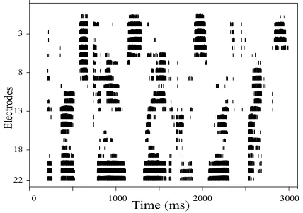
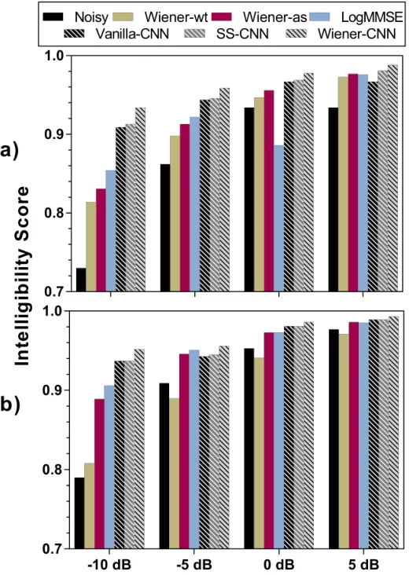
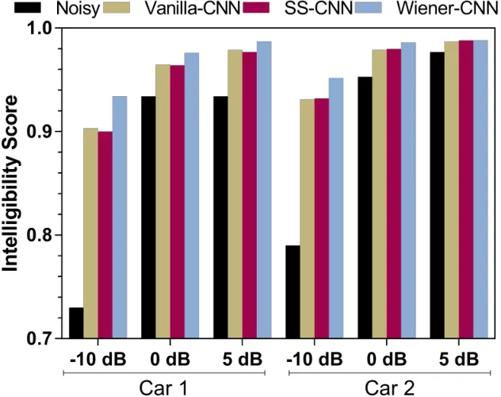

# Convolutional Neural Network-based Speech Enhancement for Cochlear Implant Recipients

###### Abstract

Attempts to develop speech enhancement algorithms with improved speech
intelligibility for cochlear implant (CI) users have met with limited
success. To improve speech enhancement methods for CI users, we propose
to perform speech enhancement in a cochlear filter-bank feature space, a
feature-set specifically designed for CI users based on CI auditory
stimuli. We leverage a convolutional neural network (CNN) to extract
both stationary and non-stationary components of environmental acoustics
and speech. We propose three CNN architectures: (1) vanilla CNN that
directly generates the enhanced signal; (2) spectral-subtraction-style
CNN (SS-CNN) that first predicts noise and then generates the enhanced
signal by subtracting noise from the noisy signal; (3) Wiener-style CNN
(Wiener-CNN) that generates an optimal mask for suppressing noise. An
important problem of the proposed networks is that they introduce
considerable delays, which limits their real-time application for CI
users. To address this, this study also considers causal variations of
these networks. Our experiments show that the proposed networks (both
causal and non-causal forms) achieve significant improvement over
existing baseline systems. We also found that causal Wiener-CNN
outperforms other networks, and leads to the best overall envelope
coefficient measure (ECM). The proposed algorithms represent a viable
option for implementation on the CCi-MOBILE research platform as a
pre-processor for CI users in naturalistic environments.

Nursadul Mamun, Soheil Khorram, John H.L. Hansen

Cochlear Implant Processing Laboratory, Center for Robust Speech Systems
(CRSS-CILab), Department of Electrical & Computer Engineering, The
University of Texas at Dallas

(nursadul.mamun,soheil.khorram,john.hansen)@utdallas.edu

Index Terms: Speech enhancement, convolutional neural network, cochlear
implants, hearing aids, CCi-MOBILE.

## 1 Introduction

A cochlear implant (CI) is an implantable electronic device that
provides the necessary sensation for hearing \[1, 2, 3\]; CI partially
restores hearing ability for subjects with sensorineural hearing loss
(generally profound hearing loss). According to a report by the U.S.
Food and Drug Administration, over 96000 people in US (324,000 people
worldwide) have received a CI device by the end of 2012 \[4\]. Over the
decade tremendous progress have been made in Hearing aid (HA) and CI
technologies, which have lead CI recipients to enjoy near-to-normal
speech intelligibility in quiet conditions \[5, 6\]. However, reduced
speech intelligibility in the presence of background noise such as
environmental sounds or competing talkers is a major complaint by CI
recipients \[7\]; speech enhancement (SE) systems \[8, 9, 10, 11\] can
be used to reduce noise and provide better speech understanding for CI
users.

CI users receive spectral information with a limited number of encoding
channels (normally 8 to 22 channels) which is far less than the
frequency bands leveraged by normal hearing (NH) subjects \[12\]. This
low-resolution representation of the speech signal increases the
sensitivity of CI users to noisy conditions \[13\]. Therefore, speech
enhancement algorithms have received growing attention in the CI
research community. This study proposes a class of convolutional neural
network (CNN)-based speech enhancement algorithms specifically designed
for CI users.

Various algorithms have been developed by the researchers to address
background noise for CI users. These SE algorithms can be broadly
classified into two categories: (1) unsupervised, and (2) supervised.

Unsupervised – These approaches are based on estimating the statistical
characteristics of both speech and noise signals.
Spectral-subtraction \[14\], Wiener filtering \[15\], and
signal-subspace \[16\] algorithms are well-known examples of this
category. In the spectral-subtraction method \[14\], clean speech
spectrum is obtained by subtracting an estimation of the noise spectrum
from the noisy spectrum. In the Wiener filtering method \[17\], an
optimal linear time-invariant filter that minimizes the
mean-square-error (MSE) is estimated. In the signal-subspace
method \[16\], the vector space of the noisy signal is decomposed into a
signal-plus-noise subspace; SE is accomplished by removing the noise
subspace. A major limitation of unsupervised methods is that they are
based on specific noise or environment assumptions that are not
necessary true for all domains and all noisy conditions.

Supervised -- These approaches consider the SE problem as a supervised
machine learning task in which we train a data-driven function¹¹ 1 In
many cases, we train a component of the SE pipeline. that takes noisy
signal and estimates clean speech signal. In contrast to unsupervised
techniques, these approaches require a training dataset that provides
adequate knowledge about the distributions of speech and noise. Neural
networks are general function approximators that have been widely used
for supervise SE. Neural network-based SE (NNSE) \[18\] and long-term
short-term memory recurrent neural network (LSTM-RNN)-based SE \[19\]
are two successful examples of supervised SE.

NNSE algorithm, introduced in \[18\], approximates frequency channels
with higher SNR; reduces noise-dominated components of the signal from
those channels and thus improves speech intelligibility for CI users.
DNN-based SE algorithm, proposed in \[20\], uses log-power spectral
features from speech data. The algorithm successfully reduces the
non-stationary noise components without generating considerable musical
artifacts. On the other hand, LSTM-RNN-based SE exploits a stack of LSTM
layers to provide a direct mapping from noisy speech features to clean
speech features \[19\]. This system has been reported to be more
effective than DNN-based regression technique in modeling long-term
acoustic context specifically in low SNR conditions. Although, existing
supervised SE methods have achieved considerable success, these
algorithms provide limited benefits for CI users due toseveral issues:
first, standard DNN-based SE algorithms are not efficient in
characterizing local temporal-spectral structures of speech signals;
second, these algorithms have not been designed to effectively leverage
feature space for CI users. Finally, they are only as effective as the
diversity of speech, speaker, and noisy data available for model
training.

To deal with the first issue, this study proposes a set of CNN-based SE
algorithms to improve the speech representation before the CI encoding
processor. CNN is originally designed to consider local patterns of
input signals by using a set of local connections \[21\]. CNN has been
reported to be more effective than standard feed-forward neural network
in many speech processing applications including speech emotion
recognition \[22\], speech enhancement \[23\] speech separation \[24\]
and speaker recognition \[25\]. It is because CNN is able to deal with
local temporal-spectral structures of speech and it can effectively
separate the speech and the noise components of the noisy signals.

We resolve the second issue by defining our feature space within the CI
auditory space. We explore three different CNN-based schemes using
knowledge of traditional SE methods. The vanilla CNN SE algorithm
directly extracts features of the speech signal from the noisy speech;
spectral-subtraction-style CNN (SS-CNN) SE algorithm estimates the noise
from the input signal, subtracts it from the noisy signal and obtains
the clean signal spectrum; Wiener-style CNN (Wiener-CNN) SE algorithm
generates a weighting mask first, applies the mask to the incoming noisy
signal and then generates the clean speech signal. This study also
explores the causal structures of the proposed CNN-based algorithms. The
causal CNNs use only previous samples of the signals and offer a viable
option for real-time implementations of CCi-Mobile research
platforms \[12\].

The paper is organized as follows. Sec. 2 explains the methodology of
the proposed algorithms. It also includes the feature extraction
technique leveraged in the proposed algorithms. Experimental setup and
results of the proposed CNN-based algorithms are described in Sec. 3. We
compare results of the proposed algorithms with results of the
traditional methods. Finally, Sec. 4 concludes this study.

## 2 Methodology

In this section, we first briefly introduce the CI pipeline. We then
explain details of the proposed SE algorithms. We also describe the
computation of the objective speech intelligibility score designed for
the CI users. We finally discuss existing baseline SE systems as well as
different components of the proposed algorithms.

### 2.1 Cochlear Implant Signal Processing Pipeline

The CI signal processing pipeline, used in our experiments contain the
following steps: (1) Speech sampled at $`16\ KHz`$ is pre-emphasized to
emphasize high frequency components of the signal. (2) A Hamming window
of length $`10\ ms`$ with an overlap of $`8.75\ ms`$ is applied to the
pre-emphasized signal. (3) A fast Fourier transform (FFT) of the
extracted frames are used to calculate the spectral energy of each
frequency bin. (4) The spectral energy signals are processed through a
22-channel filter-bank, that emulates the CI auditory system. This step
generates a sequence of 22-dimensional features; we refer to these as
_“CI auditory features’_ throughout this paper. (5) An ’n-of-m’ CI
signal processing strategy selects the 8 most important auditory
features employed with a CIS-Continuous Interleaved Sampling strategy.
(6) Finally, biphasic pulses are generated from the selected features
and sent to the UTDallas CCi-MOBILE research interface board through
electrical stimulations \[12\]. These electrical stimulations can be
visualized using electrodograms. An electrodogram (as shown in Fig. 1)
is a two-dimensional representation of time and electrode number (i.e.,
related to frequency bin over the auditory space).

### 2.2 Proposed Speech Enhancement Algorithm

We propose to perform speech enhancement in the _CI auditory feature
space_, because this space has been specifically designed for CI users.
To do so, we extract a set of 22-dimensional CI auditory features using
the first 4 steps of the CI pipeline (explained in Sec. 2.1). The
extracted features are passed to our proposed CNN-based SE algorithms to
perform noise/interference reduction in the CI auditory feature space.
Three different CNN architectures are introduced in this paper. All the
proposed architectures take noisy CI auditory features and estimate the
clean speech features. The estimated features can be directly used to
stimulate intracochlear electrodes in a CIS manner. In this paper, we
use an objective speech intelligibility metric, rigorously tested for CI
users, to evaluate speech intelligibility level in the CI auditory
feature space.

Figure 1: Cochlear implant electrode stimulation response shown as an
electrodogram.

#### 2.2.1 Proposed CNN-based Architectures

In this study, we propose three different network architectures:
Vanilla, SS-CNN and Wiener-CNN. We implement both the standard and the
causal CNNs for the proposed architectures. Figure 2 shows the details
of the proposed SE systems.

Figure 2: (a) Block diagram of the standard CNN used in this paper. (b)
Block diagram of the causal convolutional network (Causal CNN) that
leverages causal convolutional kernels in each layer. The causal kernels
consider only previous samples of the signals. (c) Various SE systems
proposed in this paper; we incorporate both CNN and causal CNN in three
different network architectures: Vanila, spectral-subtraction-style, and
Wiener-style architectures. We train all the networks in an end-to-end
manner.

Vanilla CNN – This system directly estimates the clean speech features
from the input noisy features. In this study, the input to the
convolutional layer is a sequence of 22-dimensional CI auditory
features. The CNN architecture consists of several convolution layers;
each layer applies a set of linear finite impulse response (FIR) filters
(kernels) to extract intermediate features; it also applies an
activation function that enables the network to provide sophisticated,
non-linear functionality. Parameters of the filters are trained during
the training phase of the system using a gradient-based optimization
algorithm.

Spectral-subtraction-style CNN – Spectral subtraction is a simple yet
effective method for SE \[14\]. This method estimates the clean signal
spectrum by subtracting estimated noise from the noisy signal spectrum.
Traditional spectral subtraction methods are able to handle only
stationary noises; however, in most real-life environments, background
noise is non-stationary. To deal with this issue, in this paper, we
propose a variation of spectral subtraction that uses CNNs to estimate
the noise components. CNNs are able to extract noise components from the
noisy signals which does not assume that the background noise is
stationary. Fig. 2 highlights the difference between the Vanilla and the
SS-Style systems. In the Vanilla system, the CNN directly estimates the
speech components, yet in the the SS-Style system, the CNN estimates the
noise components from the noisy part of the signal.

Wiener-style CNN – Conventional Wiener filter-based SE algorithm
calculates the priori SNR based on the noise spectrum from the silent
regions \[17, 15\]. It estimates an optimal filter (an optimal mask in
the frequency domain) to generate the power spectrum of the clean
speech. Similarly, the proposed system estimates an optimal mask using a
CNN. The de-noised output features are then obtained by multiplying the
incoming noisy features with the extracted mask.

Causal Convolutional Network – Conventional CNN based solutions use both
past and future inputs to generate its output. Therefore, to implement a
solution for real-time applications, we must store a buffer window of
the input and then produce the output result (the size of the window
must be at least half the size of the CNN receptive field \[26\]. This
process delay, which is a limiting factor for CI-related applications.
To deal with this limitation, we also use a causal variation of the CNN
(causal CNN) in our proposed architectures. In a causal CNN, each neuron
for any particular time does not receive information from future neurons
(Fig. 2(b)). Therefore, causal CNN estimates the current features based
on information obtained only from previous time frames and does not
introduce a considerable delay o the output signal.

### 2.3 Similarity Measure

Several objective intelligibility metrics have been proposed in last few
decades to measure speech intelligibility for hearing aids HA \[27, 28,
29\] and CI \[30\] users. This study uses the Envelope-based correlation
measure (ECM) to calculate the objective intelligibility score for CI
users. The ECM metric is a modulation-based index proposed for measuring
speech intelligibility for subjects with cochlear implants \[30\]. The
metric uses the low frequency envelope modulation to predict the
intelligibility score. Inputs to the ECM metric are the CI auditory
features, and the output is the estimated speech intelligibility score
which is a number between 0 and 1 ($`ECM=1`$ indicates the highest
intelligibility). It has been shown that ECM has the high correlation
with subjective intelligibility scores \[30\].

### 2.4 Baseline Algorithms

We compare the proposed methods with three conventional SE algorithms:
(1) Minimum mean-square error log-spectrum amplitude estimator
(Log-MMSE) \[31\], (2) Wiener filtering based on wavelet-threshold
(Wiener-wt) \[32\], and (3) Wiener filtering based on a priori SNR
estimation (Wiener-as) \[33\]. The Log-MMSE algorithm captures the
short-time spectral amplitude of the speech and utilizes MMSE to enhance
the noisy signal. On the other hand, Wiener-as address the musical noise
using wavelet thresholding and Wiener-as algorithm estimates the priori
SNR to enhance the noisy speech.

## 3 Experiments

In this section, we compare the performance of the proposed and the
baseline SE algorithms.

### 3.1 Dataset

We use _“UT-Drive”_ corpora to perform the experiments in this
study \[34\]. UT-Drive is a large-scale database of noise signals
collected across different vehicle platforms under a wide range of field
driving conditions. The database contains two different sessions:
off-road and on-road. In the off-road session, speech signals from the
TIMIT database \[35\] were combined with the noise generated from
different parts of a car including engine, wiper blade, right turn, left
turn, AC, honk, etc. In the on-road session, a similar set of noise
signals were collected, but when the car is driven with different speeds
(i.e., 40, 50, and 60 mph).

### 3.2 Experimental Setup

In our experiments, TIMIT signals are distorted with a part of the
UT-Drive database containing noise signals of a Mitsubishi Galant (2002)
and a Nissan Sentra (2008) cars. For both cars, AC is off and all
windows are closed during the recording process. We refer to the
Mitsubishi Galant and the Nissan Sentra as “Car 1” and “Car 2”,
respectively, throughout this paper. The TIMIT database includes 6300
utterances from different speakers. We split this dataset into three
non-overlapping sets: train, development, and test sets. Train set
includes 3150 utterance and is used to train our CNNs. Development set
contains 1575 utterances and is used to tune the network
hyper-parameters. Test set contains 1575 utterances and is used to
compare the performance of different systems.

We build our CNNs using Keras with a Tensor-Flow back-end. We train all
CNNs by optimizing the mean square error (MSE) metric through the Adam
optimizer \[36\]. Each network is trained for 300 epochs and the best
epoch is selected based on the development MSE. Parameter tuning
procedure results in a CNN architecture with 7 convolutional layers (6
hidden layers and 1 output layer). Each convolutional layer contains the
same number of neurons with 65 kernels. Finally, ’tanh’ and ’linear’
activation functions are used for the intermediate and output layers,
respectively.

Figure 3: Mean speech Intelligibility score based on the ECM measure as
a function of SNR for proposed Non-causal SE algorithms. Noise
environments: (a) Car 1: Mitsubishi Galant (2002) (b) Car 2:
Nissan-Sentra (2008).

### 3.3 Results

In this section, we use ECM to evaluate the performance of the proposed
systems. We consider four SNRs in our experiments: -10dB, -5dB, 0dB and
5dB. We note here that the majority of car noise resides at low
frequencies, so SNRs of -10dB and -5dB still have some intelligible
speech content. For each SNR value, we artificially add two types of
noises explained in the previous section (referred as Car1 and Car2
noises in our experiments). Noisy speech signals are enhanced with the
proposed and the baseline SE algorithms. Figures 3 and 4 summarize the
ECM results of our experiments.

Fig. 3 shows the performance of six different algorithms (three
non-causal versions of the proposed CNN and three baseline systems) in
two environments (Car 1 and Car 2). In general, all algorithms exhibit
similar performance (similar ECM intelligibility score) for the high SNR
value of 5dB; however, the proposed algorithms perform better than the
baseline systems for the lower SNR values (-10dB and -5dB). Moreover,
Wiener-CNN-based SE outperform other proposed systems and therefore it
is suggested that the Wiener-style architecture be used for CI users.

We also exploit causal versions of the proposed algorithm to enhance the
noisy speech signals. Fig. 4 shows results with causal CNN
architectures. Results show that causal versions of the proposed
algorithms are able to significantly improve speech intelligibility in
CI features domain. Moreover, the proposed Wiener-CNN SE (causal)
algorithm outperform other causal CNNs and baseline systems. Therefore,
we expect that the proposed Wiener-CNN SE algorithm to be a potential
option to enhance speech intelligibility for CI users in naturalistic
environments.

Figure 4: Denoising performance of the causal versions of the proposed
algorithms in Car 1 and Car 2 noise environments.

## 4 Conclusion

The main goal of this study has been to propose a set of CNN-based SE
algorithms that could be useful for CI users in naturalistic noisy
conditions. The contribution of this study is threefold. First, we
extracted speech features from noisy signal based on CI auditory
features. The extracted features were used in the proposed SE
algorithms. Second, we proposed a set of novel speech enhancement
algorithms based on CNN (both non-causal and causal versions), which
were designed to estimate clean auditory features from the noisy speech
for CI users. The reconstructed features were used to generate
electrodograms that reflect the actual CI auditory stimulation. Third,
our experimental results show that non-causal CNN-based SE algorithms
provides better speech enhancement compared to causal versions. The
results also show that the highest ECM score is obtained for the
non-causal Wiener-CNN algorithm. In this paper, we investigated three
different CNN-based architectures for SE in CI auditory feature space;
however, other neural network architectures such as recurrent networks
can also be applied and may provide better performance for some noise
types. In our future work, we plan to explore other network
architectures in CI auditory feature space.

## 5 Acknowledgement

This work was primarily supported by a National Institute on Deafness
and Other Communication Disorders (NIDCD) Grant (No. R01 DC016839-02).

## References

- \[1\] C. Lane, K. Zimmerman, S. Agrawal, and L. Parnes, “Cochlear
  implant failures and reimplantation: A 30-year analysis and literature
  review,” _The Laryngoscope_, 2019.
- \[2\] A. Dieter, C. J. Duque-Afonso, V. Rankovic, M. Jeschke, and
  T. Moser, “Near physiological spectral selectivity of cochlear
  optogenetics,” _Nature communications_, vol. 10, 2019.
- \[3\] H. Ali, N. Mamun, A. Bruggeman, R. C. M. Chandra Shekar, J. N.
  Saba, and J. H. L. Hansen, “The cci-mobile vocoder,” _The Journal of
  the Acoustical Society of America_, vol. 144, no. 3, pp.
  1872–1872, 2018.
- \[4\] NIDCD and NIH. (2014) National institute on deafness and other
  communication disorders, cochlear implants. \[Online\]. Available:
  http:////www.nidcd.nih.gov/health/hearing/pages/coch.aspx/
- \[5\] F.-G. Zeng, S. Rebscher, W. Harrison, X. Sun, and H. Feng,
  “Cochlear implants: system design, integration, and evaluation,” _IEEE
  reviews in biomedical engineering_, pp. 115–142, 2008.
- \[6\] A. Natarajan, J. H. L. Hansen, K. H. Arehart, and J. Rossi-Katz,
  “An auditory-masking-threshold-based noise suppression algorithm
  gmmse-amt \[erb\] for listeners with sensorineural hearing loss,”
  _EURASIP Journal on Advances in Signal Processing_, vol. 2005,
  no. 18, p. 678405, 2005.
- \[7\] L. M. Friesen, R. V. Shannon, D. Baskent, and X. Wang, “Speech
  recognition in noise as a function of the number of spectral channels:
  Comparison of acoustic hearing and cochlear implants,” _The Journal of
  the Acoustical Society of America_, vol. 110, no. 2, pp.
  1150–1163, 2001.
- \[8\] P. C. Loizou, _Speech enhancement: theory and practice_. CRC
  press, 2007.
- \[9\] D. Wang and J. H. L. Hansen, “Speech enhancement for cochlear
  implant recipients,” _The Journal of the Acoustical Society of
  America_, vol. 143, no. 4, pp. 2244–2254, 2018.
- \[10\] J. H. L. Hansen, V. Radhakrishnan, and K. H. Arehart, “Speech
  enhancement based on generalized minimum mean square error estimators
  and masking properties of the auditory system,” _IEEE Transactions on
  Audio, Speech, and Language Processing_, vol. 14, no. 6, pp.
  2049–2063, 2006.
- \[11\] A. Dieter, C. J. Duque-Afonso, V. Rankovic, M. Jeschke, and
  T. Moser, “Speech enhancement - an overview and recent advances,”
  _Encyclopedia of Electrical and Electronics Engineering_, vol. 20, pp.
  159–175, 1999.
- \[12\] J. H. L. Hansen, H. Ali, J. Saba, R. C. shekhar, N. Mamun,
  R. Ghosh, and A. Brueggeman, “Cci-mobile: Design and evaluation of a
  cochlear implant and hearing aid research platform for speech
  scientists and engineers.” _IEEE EMBS Inter Conf. Biomedical and
  health informatics (BHI-19), Chicago, IL_, May 19-22, 2019.
- \[13\] N. Mamun, R. Ghose, and J. H. Hansen, “Quantifying cochlear
  implant users’ ability for speaker identification using ci auditory
  stimuli.” in _Interspeech_, 2019.
- \[14\] S. Boll, “Suppression of acoustic noise in speech using
  spectral subtraction,” _IEEE Transactions on acoustics, speech, and
  signal processing_, vol. 27, no. 2, pp. 113–120, 1979.
- \[15\] S. Khorram, H. Sameti, and H. Veisi, “An optimum mmse
  post-filter for adaptive noise cancellation in automobile
  environment,” in _2012 11th International Conference on Information
  Science, Signal Processing and their Applications (ISSPA)_. IEEE,
  2012, pp. 431–435.
- \[16\] Y. Ephraim and H. L. Van Trees, “A signal subspace approach for
  speech enhancement,” _IEEE Transactions on speech and audio
  processing_, vol. 3, no. 4, pp. 251–266, 1995.
- \[17\] I. Almajai and B. Milner, “Visually derived wiener filters for
  speech enhancement,” _IEEE Transactions on Audio, Speech, and Language
  Processing_, vol. 19, no. 6, pp. 1642–1651, 2011.
- \[18\] T. Goehring, F. Bolner, J. J. Monaghan, B. van Dijk,
  A. Zarowski, and S. Bleeck, “Speech enhancement based on neural
  networks improves speech intelligibility in noise for cochlear implant
  users,” _Hearing research_, vol. 344, pp. 183–194, 2017.
- \[19\] L. Sun, J. Du, L.-R. Dai, and C.-H. Lee, “Multiple-target deep
  learning for lstm-rnn based speech enhancement,” in _2017 Hands-free
  Speech Communications and Microphone Arrays (HSCMA)_. IEEE, 2017, pp.
  136–140.
- \[20\] Y. Xu, J. Du, L.-R. Dai, and C.-H. Lee, “A regression approach
  to speech enhancement based on deep neural networks,” _IEEE/ACM
  Transactions on Audio, Speech, and Language Processing_, vol. 23,
  no. 1, pp. 7–19, 2015.
- \[21\] S.-W. Fu, Y. Tsao, and X. Lu, “Snr-aware convolutional neural
  network modeling for speech enhancement.” in _Interspeech_, 2016, pp.
  3768–3772.
- \[22\] S. Khorram, M. McInnis, and E. M. Provost, “Jointly aligning
  and predicting continuous emotion annotations,” _IEEE Transactions on
  Affective Computing_, 2019.
- \[23\] S.-W. Fu, Y. Tsao, X. Lu, and H. Kawai, “Raw waveform-based
  speech enhancement by fully convolutional networks,” in _2017
  Asia-Pacific Signal and Information Processing Association Annual
  Summit and Conference (APSIPA ASC)_, 2017, pp. 006–012.
- \[24\] M. Yousefi, S. Khorram, and J. H. L. Hansen, “Probabilistic
  permutation invariant training for speech separation,” _Proc.
  Interspeech_, 2019.
- \[25\] F. Bahmaninezhad and J. H. L. Hansen, “Compensation for domain
  mismatch in text-independent speaker recognition,” _Proc. Interspeech
  2018_, pp. 1071–1075, 2018.
- \[26\] S. Khorram, Z. Aldeneh, D. Dimitriadis, M. McInnis, and E. M.
  Provost, “Capturing long-term temporal dependencies with convolutional
  networks for continuous emotion recognition,” _Proc. Interspeech
  2017_, pp. 1253–1257, 2017.
- \[27\] N. Mamun, W. A. Jassim, and M. S. Zilany, “Prediction of speech
  intelligibility using a neurogram orthogonal polynomial measure
  (nopm),” _IEEE/ACM Transactions on Audio, Speech, and Language
  Processing_, vol. 23, no. 4, pp. 760–773, 2015.
- \[28\] K. Akter and N. Mamun, “Predicting speech intelligibility with
  the regeneration of envelope from tfs cues for hearing impaired
  listeners,” in _International Conference on Electrical, Computer and
  Communication Engineering (ECCE)_. IEEE, 2019, pp. 1–5.
- \[29\] N. Mamun, K. Akter, H. Ali, and J. H. L. Hansen, “Measuring
  speech perception with recovered envelope cues using the peripheral
  auditory model,” _The Journal of the Acoustical Society of America_,
  vol. 144, no. 3, pp. 1872–1872, 2018.
- \[30\] N. Yousefian and P. C. Loizou, “Predicting the speech reception
  threshold of cochlear implant listeners using an envelope-correlation
  based measure,” _The Journal of the Acoustical Society of America_,
  vol. 132, no. 5, pp. 3399–3405, 2012.
- \[31\] Y. Ephraim and D. Malah, “Speech enhancement using a minimum
  mean-square error log-spectral amplitude estimator,” _IEEE
  transactions on acoustics, speech, and signal processing_, vol. 33,
  no. 2, pp. 443–445, 1985.
- \[32\] Y. Hu and P. C. Loizou, “Speech enhancement based on wavelet
  thresholding the multitaper spectrum,” _IEEE transactions on Speech
  and Audio processing_, vol. 12, no. 1, pp. 59–67, 2004.
- \[33\] P. Scalart _et al._, “Speech enhancement based on a priori
  signal to noise estimation,” in _ICASSP_, vol. 2. IEEE, 1996, pp.
  629–632.
- \[34\] N. Krishnamurthy, R. Lubag, and J. H. L. Hansen, “In-vehicle
  speech and noise corpora,” in _Digital Signal Processing for
  In-Vehicle Systems and Safety_. Springer, 2012, pp. 145–157.
- \[35\] V. Zue, S. Seneff, and J. Glass, “Speech database development
  at mit: Timit and beyond,” _Speech communication_, vol. 9, no. 4, pp.
  351–356, 1990.
- \[36\] J. Gideon, S. Khorram, Z. Aldeneh, D. Dimitriadis, and E. M.
  Provost, “Progressive neural networks for transfer learning in emotion
  recognition,” _Interspeech 2017_, pp. 1098–1102, 2017.
