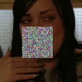
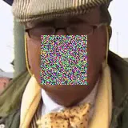

# My lips are concealed: Audio-visual speech enhancement through obstructions

###### Abstract

Our objective is an audio-visual model for separating a single speaker
from a mixture of sounds such as other speakers and background noise.
Moreover, we wish to hear the speaker even when the visual cues are
temporarily absent due to occlusion.

To this end we introduce a deep audio-visual speech enhancement network
that is able to separate a speaker’s voice by conditioning on both the
speaker’s lip movements and/or a representation of their voice. The
voice representation can be obtained by either (i) enrollment, or (ii)
by self-enrollment – learning the representation on-the-fly given
sufficient unobstructed visual input. The model is trained by blending
audios, and by introducing artificial occlusions around the mouth region
that prevent the visual modality from dominating.

The method is speaker-independent, and we demonstrate it on real
examples of speakers unheard (and unseen) during training. The method
also improves over previous models in particular for cases of occlusion
in the visual modality.

Triantafyllos Afouras¹, Joon Son Chung^(1,2), Andrew Zisserman¹

¹Visual Geometry Group, Department of Engineering Science, University of
Oxford  
²Naver Corporation

{afourast,joon,az}@robots.ox.ac.uk

Index Terms: audio-visual, speech enhancement, speech separation

## 1 Introduction

While there has been great progress in the field of automatic speech
recognition (ASR) in recent years, some key challenges remain,
particularly the understanding of speech in very noisy environments or
in cases where multiple people speak simultaneously. In this direction,
isolating voices in multi-speaker scenarios, increasing the
signal-to-noise ratio in noisy audio, or combinations of both are all
important tasks.

Until very recently, works in this area have only used the audio
modality for the task. However, recent works have shown that the use of
video can aid tremendously in solving the problem \[1, 2, 3\].

These audio-visual models have demonstrated impressive results, but
given their dependence on the visual input, they may fail when the mouth
area is occluded by the speaker’s hands, a microphone (e.g. Fig. 1), or
if the speaker turns their head away. Contemporaneously, it has been
shown that an embedding of the speaker’s voice can guide the separation
of simultaneous speech \[4\].

In this paper we propose combining the two approaches, i.e. conditioning
on both the video input containing the speaker’s lip movement and an
embedding of their voice, in order to make the audio-visual models
robust to occlusions. Our assumption is that the video provides
invaluable discriminative information when present, while the speaker
embedding can help the model when the video is absent due to occlusions.
In the simplest case, the voice embedding can be obtained from
pre-enrolled audio.

Figure 1: An audio-visual speech enhancement model may fail when the lip
region is occluded by e.g. a microphone. In such cases the input audio
is often entirely filtered out and the result is silent output over the
occluded frames. The aim of our method is to be robust to this kind of
occlusions.

While it is possible to separate simultaneous speakers using only the
audio \[5, 6\], the permutation issue in the time-domain remains an
unsolved problem. With our approach, even partially occluded video can
provide information on the voice characteristics of the speaker and
resolve the ambiguity of assigning the separated voice to the speaker.

We make the following contributions: (i) we show how speaker embedding
and visual cues can be combined to separate a single speaker from a
mixture of voices despite the visual stream (the lips) being occluded;
(ii) we propose a neural network model that can operate with video only,
enrollment data only, or both; and (iii) we introduce a recurrent model
that can bootstrap the computation of the speaker embedding under
temporary occlusions, without requiring a prior speaker embedding. We
term this self-enrollment.

### 1.1 Related Work

Audio-only enhancement and separation. Various methods have been
proposed to isolate multi-talker simultaneous speech, the majority of
which only use monaural audio, e.g. \[7, 8, 9, 10, 11\]. A number of
recent works have addressed the permutation problem to separate unseen
speakers. Deep clustering  \[5\] uses embeddings trained to yield a
low-rank approximation to an ideal pairwise affinity matrix, whilst
Yu et al. employ a permutation invariant-loss \[6\].

Audio-visual speech enhancement. Prior to the advent of deep learning,
numerous works have been developed for audio-visual speech
enhancement \[12, 13, 14, 15, 16, 17\]. Several recent methods have used
a deep learning framework for the same task – most notably \[18, 19,
20\]. However, these methods are limited in that they are only
demonstrated under constrained conditions (e.g. the utterances consist
of a fixed set of phrases), or for a small number of known speakers. Our
previous work \[1\] proposed a deep audio-visual speech enhancement
network that is able to separate a speaker’s voice given lip regions in
the corresponding video, by predicting both the magnitude and the phase
of the target signal. Ephrat et al. \[2\] designed a network that
conditions on the video input of all the source speakers and outputs
complex masks, thus also enhancing both magnitude and phase. Owens and
Efros \[3\] train a network on audio-visual synchronization and use the
learned features for speaker separation. These last works demonstrate
general results in-the-wild case.

Enhancement by conditioning on voice only. Wang et al. \[4\] develop a
method that separates voices conditioned on pre-learned speaker
embeddings, showing that voice characteristics alone can be enough to
determine the separation. This however relies on a pretrained model and
does not use video.

We propose to combine the two ideas: using both visual input and voice
embeddings from the target speaker; our method partially builds on  \[1,
2, 4\].

## 2 Method

Figure 2: The architecture of the audio-visual speech enhancement
network: There are 2 audio streams. The one processes the incoming noisy
audio, while the other takes as input an enrollment audio sample and
creates a speaker embedding that captures the speaker’s voice
characteristics. A visual stream extracts frame-wise representations
from the input video. The visual, speaker and audio embeddings are
combined and fed into the BLSTM which outputs a multiplicative mask that
filters the noisy spectrograms. When no enrollment audio is provided,
the enhanced magnitudes (created by a video-only pass) can be used as
the input to the speaker embedding network.

This section describes the architecture of the audio-visual speech
enhancement network, which is given in Figure 2. The network receives
three inputs: (i) the noisy audio to be enhanced; (ii) the corresponding
video frames; (iii) a reference audio containing speech from the target
speaker. We summarize the principal modules below. Details of the
architecture are provided in Table 1.

Layer \# filters K S P Out fc0 1536 1 1 1 $`\nicefrac{{T}}{{4}}`$ conv1
1536 5 1 2 $`\nicefrac{{T}}{{4}}`$ conv2 1536 5 1 2
$`\nicefrac{{T}}{{4}}`$ conv3 1536 5 ½ 2 $`\nicefrac{{T}}{{2}}`$ conv4
1536 5 1 2 $`\nicefrac{{T}}{{2}}`$ conv5 1536 5 1 2
$`\nicefrac{{T}}{{2}}`$ conv6 1536 5 1 2 $`\nicefrac{{T}}{{2}}`$ conv7
1536 5 ½ 2 T conv8 1536 5 1 2 T conv9 1536 5 1 2 T fc10 256 1 1 1 T

(a) Video Stream

Layer \# filters K S P Out fc0 1536 1 1 1 T conv1 1536 5 1 2 T conv2
1536 5 1 2 T conv3 1536 5 1 2 T conv4 1536 5 1 2 T conv5 1536 5 1 2 T
fc6 256 1 1 1 T

Layer \# filters Out BLSTM 400 T fc1 600 T fc2 600 T fc_mask F T

(b) Noisy Audio Stream

(c) AV Fusion

Table 1: Architecture details. a) The 1D ResNet that processes the video
features. b) The 1D ResNet that processes the noisy audio spectrogram.
c) The BLSTM and FC layers that perform the modality fusion. Notation:
K: Kernel width; S: Stride – fractional strides denote transposed
convolutions; P: Padding; Out: Temporal dimension of the layer’s output.
The non-transposed convolution layers are all depth-wise separable.
Batch Normalization, ReLU activation and a shortcut connection are added
after every convolutional layer.

Video representation. Input to the network is pre-cropped image frames,
such as the face crops found in the LRS datasets \[21, 22\]. Visual
features are extracted from the sequence of image frames using a
spatiotemporal residual network described in  \[23\]. The network
contains a 3D convolution layer, followed by a common 18-layer 2D
ResNet \[24\]. For every video frame it outputs a compact $`512`$
dimensional feature vector.

Audio representation. As acoustic features, we use the magnitude and
phase spectrograms extracted from the audio waveforms using a Short Time
Fourier Transform (STFT) with a 25ms window length and a 10ms hop length
at a sample rate of 16kHz. This results in spectrograms with a time
dimension four times the number of corresponding video frames. We use
$`T/4`$ and $`T`$ to denote the number of video frames and corresponding
time resolution of the spectrograms respectively.

Speaker embedding network. For embedding a reference audio clip into a
compact speaker representation, we use the method of Xie et al. \[25\].
To reduce the number of computations, we replace all 2D spatial
convolutions with 1D temporal ones which regard the frequency bins as
channels and pre-train the modified architecture on the VoxCeleb2 \[26\]
dataset following \[25\].

Modality combination. As shown in Figure 2, the noisy magnitude
spectrograms are encoded into audio feature vectors through a shallow
temporal ResNet. The video features are upsampled through a network
containing two transposed convolution layers to match the temporal
dimension of the spectrograms ($`4T`$). The speaker embedding extracted
from the reference audio is tiled temporally and added to the resulting
video embeddings to form the conditioning vector used for the
enhancement. This vector is then fed along with the noisy audio
embedding into a one-layer bidirectional LSTM, followed by two fully
connected layers. The output has spectrogram dimensions and is passed
through a sigmoid activation to produce the enhancement mask.

Phase sub-network. In order to adjust the noisy phases to the enhanced
magnitudes, we use the phase network of \[1\] without any changes.

Self-enrollment. For self-enrollment, the magnitude network is run
twice: on the first pass, no speaker embedding is added to the visual
one. The magnitudes that are output then serve as input to the speaker
embedding network, as indicated by the red feedback arrow, and the
network is run for a second time, with speaker embeddings this time.

We minimize the learning objective \[1\]:

```math
\mathcal{L}=||\hat{M}-M^{*}||_{1}\ -\ \ \frac{1}{TF}\sum_{t,f}M_{tf}^{*}<\hat{\Phi}_{tf},\Phi^{*}_{tf}>
```

where $`\hat{M}`$, $`\hat{\Phi}`$ and $`M^{*}`$, $`\Phi^{*}`$ are the
predicted and ground truth magnitude and phase spectrograms
respectively, and $`T`$ and $`F`$ their time and frequency resolutions.

## 3 Experimental Setup

Datasets. The network is trained on the MV-LRS \[27\], LRS2 \[21\], and
LRS3 \[22\] datasets, and tested on LRS3. MV-LRS and LRS2 contain
material from British television broadcasts, while LRS3 was created from
videos of TED talks. The speakers appearing in LRS3 are to the best of
our knowledge not seen in either of the other two datasets. The datasets
share the same format and pipeline including the face detection step,
therefore no pre-processing is required in order to utilise them
together for training. We remove from the LRS3 training set the few
speakers that also appear in the test set, so that there is no overlap
of identities between the two. Hence, the test set contains only
speakers unseen and unheard during training and is suitable for a
speaker-agnostic evaluation of our methods. Moreover, since the test set
of LRS3 contains relatively short sentences, for testing we extract some
longer sub-sequences from the original material used to make the LRS3
test set. We only use samples from speakers that appear in at least 2
different videos (TED talks), to enable enrollment with audio recorded
in a different setting than the target one. These extra videos, along
with the added noise and occlusions have been made publicly available on
the project website.

Synthetic data. We generate synthetic examples similarly to other works
\[1, 2, 4\] by first sampling one reference audio-visual utterance from
the training dataset and then mixing its audio with interfering audio
signals. We consider two scenarios: 2 speakers and 3 speakers, where one
and two interfering voices are added to the target signal respectively.

Enrollment. During training we do not know the identities of the
speakers. Therefore, we obtain the enrollment signal from the same video
but a different, non-overlapping time segment. This effectively reduces
the amount of data we can use as we need to discard shorter videos (e.g.
if we use 3 seconds, we can only use videos at least 6 seconds long). We
use this method for training on datasets where the speaker identities
are not known.

During evaluation we experiment with two enrollment methods: (i)
pre-enrollment – we sample an enrollment segment from a video of the
same speaker that is different from the one used to create the target
sample (we do have identity labels for the test set); (ii)
self-enrollment – we obtain the enrollment audio with a pass through our
network that does not use a speaker embedding, as explained in
Section 2.





(a) Training samples


(b) Test samples

Figure 3: Example frames of occluded videos used during training end
evaluation.

Occlusions. For training, we artificially add occlusions to the video
frames in the form of random patches as shown in Figure 3(a). We
randomly occlude sub-sequences of 15 to 25 contiguous frames,
maintaining the clear-to-occluded frames ratio at 1:3. This is more
realistic than simply zeroing out the incoming visual frames, as
occluded video frames still produce valid feature vectors. For
evaluation however, instead of random patches, we place jittering emojis
on the videos as shown in Figure 3(b). This type of visual noise has not
been seen during training. The emojis are used to occlude the video from
the start and the end, while the middle of the utterance is kept clear.

Training. The spatio-temporal visual front-end is pre-trained on a
word-level lip reading task \[23\]. We then freeze the front-end and
pre-compute the visual features. The features are extracted on a version
of the videos where we have added random occlusions.

Training is conducted in four phases. We first pre-train the magnitude
subnetwork only with speaker embedding inputs. For this we first use
mixtures of two and then three speakers. Second, the visual modality is
added and the magnitude network is trained on the saved visual features
for the three simultaneous speakers scenario; third the magnitude
network is frozen and the phase network is trained; finally the whole
network is trained end-to-end.

## 4 Experiments

### 4.1 Evaluation protocol

To evaluate the performance of our model we use the Signal to Distortion
Ration (SDR) \[28\], a common metric expressing the ratio between the
energy of the target signal and of the errors contained in the enhanced
output. Furthermore to assess the intelligibility of the output, we use
the Google Cloud ASR system – we compute the Word Error Rate (WER)
between the prediction of the ASR system on the enhanced audio and the
ground truth transcriptions of the utterances contained in the segments
used for evaluation. We evaluate on fixed length video segments of 8
seconds (200 frames). Some additional performance measures are reported
in the Appendix. Qualitative examples can be found on the project
website
[http://www.robots.ox.ac.uk/~vgg/research/concealed](http://www.robots.ox.ac.uk/~vgg/research/concealed).

|                                                                                                                                                                                                                                                                                                                                                                                                                                                                                                                                                                                                                 |          |         |      |          |      |         |      |
| --------------------------------------------------------------------------------------------------------------------------------------------------------------------------------------------------------------------------------------------------------------------------------------------------------------------------------------------------------------------------------------------------------------------------------------------------------------------------------------------------------------------------------------------------------------------------------------------------------------- | -------- | ------- | ---- | -------- | ---- | ------- | ---- |
|                                                                                                                                                                                                                                                                                                                                                                                                                                                                                                                                                                                                                 | Tr. Occ. | T. Occ. | Enr. | SDR (dB) |      | WER (%) |      |
|  |          |         |      | 2        | 3    | 2       | 3    |
| GT signal                                                                                                                                                                                                                                                                                                                                                                                                                                                                                                                                                                                                       | -        | -       | -    | -        | -    | 20.0    |      |
| Mixed signal                                                                                                                                                                                                                                                                                                                                                                                                                                                                                                                                                                                                    | -        | -       | -    | 0.0      | -3.7 | 82.6    | 93.2 |
| PIT \[6\]                                                                                                                                                                                                                                                                                                                                                                                                                                                                                                                                                                                                       | -        | -       | -    | 10.7     | 6.4  | 38.6    | 60.2 |
| VoiceFilter \[4\]                                                                                                                                                                                                                                                                                                                                                                                                                                                                                                                                                                                               | -        | -       | pre  | 11.7     | 5.7  | 31.6    | 56.0 |
| No occlusion during evaluation                                                                                                                                                                                                                                                                                                                                                                                                                                                                                                                                                                                  |          |         |      |          |      |         |      |
| V-Conv \[1\]                                                                                                                                                                                                                                                                                                                                                                                                                                                                                                                                                                                                    | ✗        | ✗       | -    | 12.7     | 9.1  | 24.9    | 33.7 |
| V-Conv \[1\]                                                                                                                                                                                                                                                                                                                                                                                                                                                                                                                                                                                                    | ✓        | ✗       | -    | 12.9     | 9.3  | 25.0    | 35.1 |
| V-BLSTM                                                                                                                                                                                                                                                                                                                                                                                                                                                                                                                                                                                                         | ✗        | ✗       | -    | 12.9     | 9.7  | 24.3    | 33.5 |
| V-BLSTM                                                                                                                                                                                                                                                                                                                                                                                                                                                                                                                                                                                                         | ✓        | ✗       | -    | 13.0     | 9.5  | 25.3    | 35.7 |
| VS                                                                                                                                                                                                                                                                                                                                                                                                                                                                                                                                                                                                              | ✓        | ✗       | pre  | 12.8     | 9.2  | 26.5    | 38.3 |
| VS                                                                                                                                                                                                                                                                                                                                                                                                                                                                                                                                                                                                              | ✓        | ✗       | self | 12.8     | 9.3  | 26.6    | 40.3 |
| 80% occlusion during evaluation                                                                                                                                                                                                                                                                                                                                                                                                                                                                                                                                                                                 |          |         |      |          |      |         |      |
| V-Conv \[1\]                                                                                                                                                                                                                                                                                                                                                                                                                                                                                                                                                                                                    | ✗        | ✓       | -    | 0.8      | -3.0 | 63.0    | 78.0 |
| V-Conv \[1\]                                                                                                                                                                                                                                                                                                                                                                                                                                                                                                                                                                                                    | ✓        | ✓       | -    | 2.7      | -1.6 | 54.4    | 74.1 |
| V-BLSTM                                                                                                                                                                                                                                                                                                                                                                                                                                                                                                                                                                                                         | ✗        | ✓       | -    | 5.8      | 2.4  | 49.3    | 67.1 |
| V-BLSTM                                                                                                                                                                                                                                                                                                                                                                                                                                                                                                                                                                                                         | ✓        | ✓       | -    | 11.6     | 6.3  | 31.3    | 54.3 |
| VS                                                                                                                                                                                                                                                                                                                                                                                                                                                                                                                                                                                                              | ✓        | ✓       | pre  | 12.1     | 7.3  | 30.7    | 50.0 |
| VS                                                                                                                                                                                                                                                                                                                                                                                                                                                                                                                                                                                                              | ✓        | ✓       | self | 12.2     | 7.2  | 30.3    | 50.3 |

Table 2: Evaluation of speech enhancement performance on samples from
the LRS3 dataset, for 2 and 3 simultaneous speakers. All the samples are
8 seconds long, of which 6 seconds are occluded (3 from either side)
when occlusions are used. Tr. Occ: (Train Occlusions) Denotes that the
model has been trained using artificial occlusions; T. Occ: (Test
Occlusions) Denotes evaluation with occlusions; pre: Pre-enrollment: the
enrollment audio is obtained from a different video of the target
speaker; self: Self-enrollment; SDR: Signal to Distortion Ratio (higher
is better); WER: Word Error Rate from off-the-shelf ASR system (lower is
better).

### 4.2 Baseline models

We compare our proposed approach to the following baselines and
ablations, which we train and evaluate both with and without visual
occlusions.

PIT. We implement a blind source separation model that uses only the
noisy audio input stream of Fig. 2 and is trained with a permutation
invariant loss following \[6\]. This model is tailored to a predefined
number of speakers.

V-Conv. This is the convolutional, visually conditioned baseline of
Afouras et al. \[1\]. The model uses a series of 1D convolutional blocks
for fusing the audio and video modalities instead of a BLSTM. Moreover,
the video features are not upsampled by the video stream as in our
proposed model, but the audio-visual fusion is performed at the temporal
resolution of the video frames. The 1D convolutional stack then
upsamples the fused input to the dimensions of the spectrograms.

V-BLSTM. This model is similar to our proposed architecture but
conditions only on video features.

VoiceFilter. This model conditions only on speaker embeddings and is
equivalent to the sub-network used during the first stage of the
training process. It is essentially a VoiceFilter \[4\] implementation
with a slightly modified architecture, trained on our dataset.

VS. Our proposed architecture, which receives both video and speaker
embedding inputs. As discussed in Section 2, we investigate two
variants, VS-pre and VS-self, that correspond to the different
enrollment methods employed during evaluation.

(a) 2 Speakers

(b) 3 Speakers

Figure 4: Enhancement performance when occluding varying amounts of the
visual input for the 2 Speakers and 3 Speakers scenarios. Model
notations are explained in the caption of Table 2.

### 4.3 Results

We summarize the results of our experiments in Table 2. When no
occlusions are used, the V-BLSTM model only slightly outperforms V-Conv.
When $`80\%`$ of the visual input frames are occluded, the models that
haven’t been trained with occlusions fail. Even when we include
occlusions during the training of V-Conv, it cannot deal with the
missing visual information, since its receptive field is limited (about
1 second to either side). On the contrary, V-BLSTM uses its memory and
learns to deal with local occlusions. Overall however, the proposed VS
models that explicitly condition on the expected speaker embedding give
the best performance.

The results furthermore verify that both the VoiceFilter and VS-pre
model perform well when evaluated using enrollment signals from sources
different from the target one, even though they have never been trained
in this setting.

The effect of occluding different amounts of the visual input is studied
in Fig. 4. The V-BLSTM model that has not been trained on occlusions
does not perform well when even small parts of the video input are
occluded. When trained with occlusions, V-BLSTM becomes much more
resilient, however it still gives bad results for high occlusion
percentages and completely fails when the entire video is occluded.

The VS-pre model outperforms V-BLSTM when half or more of the input is
occluded and gives similar results for cleaner inputs.

Self-enrollment. For very high occlusion levels, the initial enhanced
estimation of VS-self is bad and evidently unable to capture the target
voice characteristics. However, if more than $`20\%`$ of the frames are
clean, self-enrollment performs best. Therefore, apart from the higher
occlusion levels, VS with self-enrollment provides an advantage compared
to V-BLSTM.

## 5 Conclusion

In this paper, we proposed a deep audio-visual speech enhancement
network that is able to separate a speaker’s voice by conditioning on
both the speaker’s lip movements and/or a representation of their voice.
The network is robust to partial occlusions, and the voice
representation can be self-enrolled from the unoccluded part of the
input when it is not possible to obtain segments for pre-enrollment. The
methods are evaluated on the challenging LRS3 dataset, and demonstrate
performance that exceeds that of previous state-of-the-art \[1\] when
the video input is partially occluded.

Acknowledgements. Funding for this research is provided by the UK EPSRC
CDT in Autonomous Intelligent Machines and Systems, the Oxford-Google
DeepMind Graduate Scholarship, and the EPSRC Programme Grant Seebibyte
EP/M013774/1.

## References

- \[1\] T. Afouras, J. S. Chung, and A. Zisserman, “The conversation:
  Deep audio-visual speech enhancement,” in _Proc. Interspeech_, 2018.
- \[2\] A. Ephrat, I. Mosseri, O. Lang, T. Dekel, K. Wilson,
  A. Hassidim, W. T. Freeman, and M. Rubinstein, “Looking to listen at
  the cocktail party: A speaker-independent audio-visual model for
  speech separation,” _SIGGRAPH_, 2018.
- \[3\] A. Owens and A. A. Efros, “Audio-visual scene analysis with
  self-supervised multisensory features,” in _Proc. ECCV_, 2018, pp.
  631–648.
- \[4\] Q. Wang, H. Muckenhirn, K. Wilson, P. Sridhar, Z. Wu,
  J. Hershey, R. A. Saurous, R. J. Weiss, Y. Jia, and I. L. Moreno,
  “Voicefilter: Targeted voice separation by speaker-conditioned
  spectrogram masking,” in _Proc. Interspeech_, 2018.
- \[5\] J. R. Hershey, Z. Chen, J. Le Roux, and S. Watanabe, “Deep
  clustering: Discriminative embeddings for segmentation and
  separation,” in _Proc. ICASSP_. IEEE, 2016, pp. 31–35.
- \[6\] D. Yu, M. Kolbæk, Z. Tan, and J. Jensen, “Permutation invariant
  training of deep models for speaker-independent multi-talker speech
  separation,” in _Proc. ICASSP_, 2017.
- \[7\] A. M. Reddy and B. Raj, “Soft mask methods for single-channel
  speaker separation,” _IEEE Transactions on Audio, Speech, and Language
  Processing_, 2007.
- \[8\] Z. Jin and D. Wang, “A supervised learning approach to monaural
  segregation of reverberant speech,” _IEEE Transactions on Audio,
  Speech, and Language Processing_, 2009.
- \[9\] M. H. Radfar and R. M. Dansereau, “Single-channel speech
  separation using soft mask filtering,” _IEEE Transactions on Audio,
  Speech, and Language Processing_, 2007.
- \[10\] S. Makino, T.-W. Lee, and H. Sawada, _Blind speech
  separation_. Springer, 2007.
- \[11\] D. Wang and J. Chen, “Supervised speech separation based on
  deep learning: an overview,” _IEEE Transactions on Audio, Speech and
  Language Processing_, 2017.
- \[12\] F. Khan and B. Milner, “Speaker separation using
  visually-derived binary masks,” in _AVSP_, 2013.
- \[13\] W. Wang, D. Cosker, Y. Hicks, S. Saneit, and J. Chambers,
  “Video assisted speech source separation,” in _Proc. ICASSP_, 2005.
- \[14\] L. Girin, J.-L. Schwartz, and G. Feng, “Audio-visual
  enhancement of speech in noise,” _The Journal of the Acoustical
  Society of America_, 2001.
- \[15\] S. Deligne, G. Potamianos, and C. Neti, “Audio-visual speech
  enhancement with avcdcn (audio-visual codebook dependent cepstral
  normalization),” in _Sensor Array and Multichannel Signal Processing
  Workshop Proceedings_, 2002.
- \[16\] J. R. Hershey and M. Casey, “Audio-visual sound separation via
  hidden markov models,” in _NIPS_, 2002.
- \[17\] B. Rivet, W. Wang, S. M. Naqvi, and J. A. Chambers,
  “Audiovisual speech source separation: An overview of key
  methodologies,” _IEEE Signal Processing Magazine_, 2014.
- \[18\] A. Gabbay, A. Ephrat, T. Halperin, and S. Peleg, “Seeing
  through noise: Visually driven speaker separation and
  enhancement,” 2018.
- \[19\] A. Gabbay, A. Shamir, and S. Peleg, “Visual Speech Enhancement
  using Noise-Invariant Training,” _arXiv preprint
  arXiv:1711.08789_, 2017.
- \[20\] J.-C. Hou, S.-S. Wang, Y.-H. Lai, Y. Tsao, H.-W. Chang, and
  H.-M. Wang, “Audio-Visual Speech Enhancement Using Multimodal Deep
  Convolutional Neural Networks,” _IEEE Transactions on Emerging Topics
  in Computational Intelligence_, 2018.
- \[21\] T. Afouras, J. S. Chung, A. Senior, O. Vinyals, and
  A. Zisserman, “Deep audio-visual speech recognition,” _IEEE
  Transactions on Pattern Analysis and Machine Intelligence_, 2019.
- \[22\] T. Afouras, J. S. Chung, and A. Zisserman, “LRS3-TED: a
  large-scale dataset for visual speech recognition,” in _arXiv preprint
  arXiv:1809.00496_, 2018.
- \[23\] T. Stafylakis and G. Tzimiropoulos, “Combining residual
  networks with LSTMs for lipreading,” in _Proc. Interspeech_, 2017.
- \[24\] K. He, X. Zhang, S. Ren, and J. Sun, “Deep residual learning
  for image recognition,” in _Proc. CVPR_, 2016.
- \[25\] W. Xie, A. Nagrani, J. S. Chung, and A. Zisserman,
  “Utterance-level aggregation for speaker recognition in the wild,” in
  _Proc. ICASSP_, 2019.
- \[26\] J. S. Chung, A. Nagrani, and A. Zisserman, “VoxCeleb2: Deep
  speaker recognition,” in _Proc. Interspeech_, 2018.
- \[27\] J. S. Chung and A. Zisserman, “Lip reading in profile,” in
  _Proc. BMVC._, 2017.
- \[28\] C. Févotte, R. Gribonval, and E. Vincent, “BSS EVAL toolbox
  user guide,” _IRISA Technical Report 1706.
  http://www.irisa.fr/metiss/bss eval/._, 2005.
