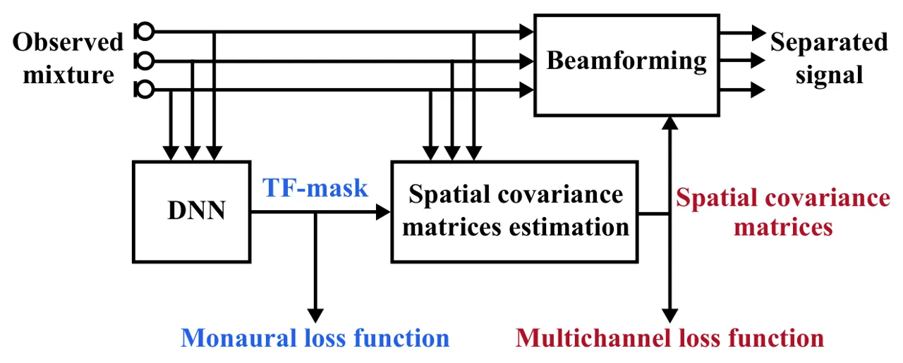
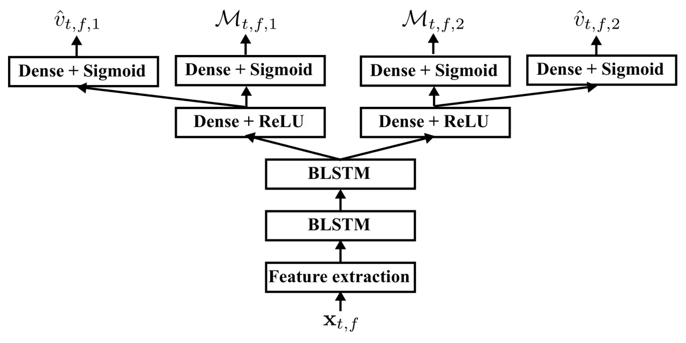

# Multichannel Loss Function for Supervised Speech Source Separation by Mask-based Beamforming

This work was done while Yoshiki Masuyama was an intern at LINE
Corporation. Paper accepted on Interspeech 2019.

###### Abstract

In this paper, we propose two mask-based beamforming methods using a
deep neural network (DNN) trained by multichannel loss functions.
Beamforming technique using time-frequency (TF)-masks estimated by a DNN
have been applied to many applications where TF-masks are used for
estimating spatial covariance matrices. To train a DNN for mask-based
beamforming, loss functions designed for monaural speech
enhancement/separation have been employed. Although such a training
criterion is simple, it does not directly correspond to the performance
of mask-based beamforming. To overcome this problem, we use multichannel
loss functions which evaluate the estimated spatial covariance matrices
based on the multichannel Itakura–Saito divergence. DNNs trained by the
multichannel loss functions can be applied to construct several
beamformers. Experimental results confirmed their effectiveness and
robustness to microphone configurations.

Yoshiki Masuyama^(1,2) , Masahito Togami², Tatsuya Komatsu²

¹Department of Intermedia Art and Science, Waseda University, Tokyo,
Japan  
²LINE Corpolation, Tokyo, Japan

mas-03151102@akane.waseda.jp, masahito.togami@linecorp.com

Index Terms: Speaker-independent multi-talker separation, neural
beamformer, multichannel Italura–Saito divergence

## 1 Introduction

Speech source separation is a fundamental technique with many
applications including automatic speech recognition (ASR) \[1, 2\] and
hearing aid \[3\]. Although speech source separation with a single
microphone is applicable \[4\], that with multiple microphones is more
effective because it can take advantage of spatial information \[5\].
There exist several unsupervised approaches for multichannel speech
source separation including independent component analysis based methods
\[6, 7, 8\] and local Gaussian model (LGM) based method \[9\].
Meanwhile, motivated by the strong capability of a deep neural network
(DNN) to model a spectrogram of a speech, supervised approaches have
been paid increasing attention \[10, 11, 12, 13\].

In supervised speech source separation, beamforming using a DNN have
been mainly studied \[10, 11, 12, 13\]. It has also been studied in
speech enhancement and noise-robust ASR \[14, 15, 16\]. One approach is
to estimate the complex-valued filter coefficients by a DNN \[17, 18\].
This approach can apply to only the same microphone configurations as in
its training. Another approach is called mask-based beamforming where a
TF-mask is used for estimating spatial covariance matrices \[14\]. After
estimating spatial covariance matrices, several beamformers such as
minimum variance distortion-less response (MVDR) beamformer \[19\],
generalized eigenvalue (GEV) beamformer \[20\], and time-invariant
multichannel Wiener filter (MWF) \[21\] can be constructed in accordance
with applications. This approach does not depend on microphone
configurations, and the effectiveness of the mask-based beamforming has
been shown in noise-robust ASR \[14, 15\].



Figure 1: Block diagram of mask-based beamforming. The proposed methods
use multichannel loss functions which evaluate spatial covariance
matrices (red) while conventional methods use monaural loss functions
(blue).

While mask-based beamforming for speech enhancement and noise-robust ASR
has been well studied, that for speaker-independent multi-talker
separation is still a challenging problem due to the utterance-level
permutation problem. In order to address this issue, permutation
invariant training (PIT) was proposed, which solves the permutation
problem so that its loss function takes the lowest value \[22, 23\]. In
contrast to other approaches to speaker-independent multi-talker
separation \[24, 25, 26\], PIT can freely design its loss function, and
thus the choice of the loss function is important.

Recently, using PIT, speaker-independent multi-talker separation by
mask-based beamforming was presented \[11, 10, 12\]. In these studies,
loss functions designed for monaural speech enhancement/separation, such
as the phase sensitive approximation (PSA) \[27\], are employed in the
training. However, monaural loss functions do not consider
inter-microphone information. A TF-mask considers the signal-to-noise
ratio (SNR) at each TF bin, which is not directly related to the spatial
covariance matrices. Meanwhile, the performance of beamforming
significantly depends on the estimated spatial covariance matrices.
Hence, the performance of monaural TF-masking does not directly
correspond to that of mask-based beamforming.

In this paper, we propose two mask-based beamforming methods with
multichannel loss functions. As illustrated in Fig. 1, the multichannel
loss functions evaluate the estimated spatial covariance matrices which
are used for constructing beamformers. A multichannel loss function was
originally proposed for the time-varying MWF based on the multichannel
Itakura–Saito divergence (MISD) \[28\]. We first import it for
time-invariant mask-based beamforming. Furthermore, since the loss
function presented in \[28\] is redundant for the time-invariant
mask-based beamforming, we also propose the mask-based beamforming with
the low-computational loss function. By using PIT, both proposed methods
can be easily applied to speaker-independent multi-talker separation.
Our main contributions are twofold: (1) proposing mask-based beamforming
with multichannel loss functions; (2) clarifying the effectiveness of
multichannel loss functions for several beamformers.

## 2 Preriminary

### 2.1 Mask-based beamforming

Let $`N`$ source signals be observed by $`M`$ microphones, $`x_{t,f,m}`$
be the observed mixture, and $`c_{t,f,n,m}`$ be the $`n`$th source
signal observed at the $`m`$th microphone where $`t=1,\ldots,T`$ and
$`f=1,\ldots,F`$ are time and frequency indices, respectively. A
separated source $`\hat{c}_{t,f,n}`$ obtained by beamforming is given as

```math
\hat{c}_{t,f,n}=\mathbf{w}_{f,n}^{H}\mathbf{x}_{t,f}, \tag{1}
```

where $`\mathbf{w}_{f,n}`$ is the time-invariant filter coefficients for
extracting $`n`$th source, and $`\mathbf{w}^{H}`$ is the Hermitian
transpose of $`\mathbf{w}`$. For constructing beamformers, the spatial
covariance matrices are required. Assuming the sparsity of the speeches
in TF domain, the spatial covariance matrix of $`n`$th speech source
$`\mathbf{R}_{f,n}`$ can be estimated as \[29\]

```math
\mathbf{R}_{f,n}=\frac{1}{\sum_{t}\mathcal{M}_{t,f,n}}\sum_{t}\mathcal{M}_{t,f,n}\mathbf{x}_{t,f}\mathbf{x}_{t,f}^{H}, \tag{2}
```

where $`\mathcal{M}_{t,f,n}\in[0,1]`$ is a TF-mask for extracting the
$`n`$th source,
$`\mathbf{x}_{t,f}=[x_{t,f,1},\ldots,x_{t,f,M}]^{\top}`$, and
$`\mathbf{x}^{\top}`$ is the transpose of $`\mathbf{x}`$. Thus, the
complex-valued spatial covariance estimation is substituted by the
real-valued TF-mask estimation which is independent of the number of
microphones.

### 2.2 Loss function for TF-mask estimation

To train a DNN for TF-mask estimation, several training criteria have
been presented such as PSA which minimizes the mean square error between
clean and estimated sources on the complex plane. PSA considers the
following loss function:

```math
\mathscr{L}_{\text{PSA}}=\frac{1}{TF}\sum_{t,f}|\mathcal{M}_{t,f,n}{x}_{t,f}-{c}_{t,f,n}|^{2}, \tag{3}
```

where the microphone index $`m`$ is omitted because PSA does not
requires multichannel observation. Note that the oracle phase sensitive
mask (PSM), achieves the highest SNR in real-valued TF-masking \[27\],
and it was recently applied to mask-based beamforming \[10\].

However, the performance of monaural speech enhancement/separation does
not directly correspond to that of the mask-based beamforming. This is
because such a monaural loss function does not consider inter-microphone
information. Furthermore, TF-mask considers SNR at each TF bin, but it
does not directly correspond to the accuracy of the time-invariant
spatial covariance matrix calculated by Eq. (2).

### 2.3 Beamformers

#### 2.3.1 MVDR beamformer

MVDR beamformer, which aims to minimize the total power of the extracted
source without distortion of the target, is one of the most popular
beamformers. Based on \[19\], it is given as

```math
\mathbf{w}_{f,n}=\frac{\mathbf{R}_{f,\bar{n}}^{-1}\mathbf{R}_{f,n}\mathbf{e}}{\mathrm{tr}(\mathbf{R}_{f,\bar{n}}^{-1}\mathbf{R}_{f,n})}, \tag{4}
```

where $`\mathbf{R}_{f,n}`$ and $`\mathbf{R}_{f,\bar{n}}`$ are the
spatial covariance matrices of the target and interference,
respectively, and $`\mathbf{e}=[1,0,\ldots,0]^{\top}`$.

#### 2.3.2 GEV beamformer

GEV beamformer, which aims to maximize SNR for each frequency sub-band,
is formulated as \[20\]:

```math
\mathbf{w}_{f,n}=\text{arg}\max_{\mathbf{w}}\frac{\mathbf{w}^{H}\mathbf{R}_{f,n}\mathbf{w}}{\mathbf{w}^{H}\mathbf{R}_{f,\bar{n}}\mathbf{w}}. \tag{5}
```

Note that there exists the ambiguity of complex value scalar
multiplication in $`\mathbf{w}_{f,n}`$. In \[30\], it was solved by
minimizing the difference between the estimated source and the
observation, which was used in the experiment.

#### 2.3.3 Multichannel Wiener filter

Assuming each source signal $`\mathbf{c}_{t,f,n}`$ independently follows
a zero-mean complex-valued Gaussian distribution \[9\]:

```math
\displaystyle\mathbf{c}_{t,f,n} \displaystyle\sim\mathcal{N}_{\mathbb{c}}(0,\mathbfcal{R}_{t,f,n}), \tag{6}
```

```math
\displaystyle\mathbfcal{R}_{t,f,n} \displaystyle=v_{t,f,n}\mathbf{R}_{f,n}, \tag{7}
```

where $`v_{t,f,n}\in\mathbb{R}_{+}`$ is the time-varying activation of
the $`n`$th source, the observed mixture
$`\mathbf{x}_{t,f,m}=\sum_{n}c_{t,f,n,m}`$ follows

```math
\mathbf{x}_{t,f}\sim\mathcal{N}_{\mathbb{c}}(0,\sum_{n}\mathbfcal{R}_{t,f,n}). \tag{8}
```

Then, time-varying MWF can be obtained in the minimum mean square error
sense as

```math
\mathbf{W}_{t,f,n}=\mathbfcal{R}_{t,f,n}\bigl(\sum_{l}\mathbfcal{R}_{t,f,l}\bigr)^{-1}. \tag{9}
```

While Eq. (9) is a time-varying filter, its time-invariant version can
calculate replacing $`\mathbfcal{R}_{t,f,n}`$ by $`\mathbf{R}_{f,n}`$
\[21, 31\].

## 3 Proposed mask-based beamforming with multichannel loss function

In this paper, we propose two mask-based beamforming methods using DNNs
trained by multichannel loss functions which evaluate the estimated
spatial covariance matrices as illustrated in Fig. 1. After reviewing a
multichannel loss function for time-varying MWF \[28\], the proposed
time-invariant mask-based beamforming is introduced, which is based on
the same loss function used in \[28\]. Since the loss function focuses
on the time-varying MWF, it requires the estimated time-varying
activation which is redundant for time-invariant beamforming. Hence, we
also propose a mask-based beamforming method based on another loss
function which does not require the estimation of the time-varying
activation.

### 3.1 Multichannel loss function for time-varying MWF \[28\]

For time-varying MWF, we proposed a multichannel loss function which
evaluates the estimated time-varying spatial covariance matrices
$`\hat{\mathbfcal{R}}_{t,f,n}`$. In \[28\], a DNN estimates the
time-varying activation and TF-mask. Based on DNN’s outputs, the
time-varying spatial covariance matrices are calculated as
$`\hat{\mathbfcal{R}}_{t,f,n}=\hat{v}_{t,f,n}\hat{\mathbf{R}}_{f,n}`$
where $`\hat{\mathbf{R}}_{f,n}`$ is given by Eq. (2). Then, the loss
function based on the MISD \[32\] between the clean source signal
$`\mathbf{c}_{t,f,n}`$ and estimated one $`\hat{\mathbf{c}}_{t,f,n}`$ is
given by

```math
\displaystyle\mathscr{L}_{1} \displaystyle=\sum_{t,f,n}\mathbf{d}_{t,f,n}^{H}\bm{\Psi}_{t,f,n}^{-1}\mathbf{d}_{t,f,n}+\log\text{det}(\bm{\Psi}_{t,f,n}), \tag{10}
```

```math
\displaystyle\mathbf{d}_{t,f,n} \displaystyle=\mathbf{c}_{t,f,n}-\hat{\mathbf{c}}_{t,f,n}, \tag{11}
```

```math
\displaystyle\hat{\mathbf{c}}_{t,f,n} \displaystyle=\mathbf{W}_{t,f,n}\mathbf{x}_{t,f}, \tag{12}
```

```math
\displaystyle\bm{\Psi}_{t,f,n} \displaystyle=(\mathbf{I}-\mathbf{W}_{t,f,n})\hat{\mathbfcal{R}}_{t,f,n}, \tag{13}
```

where $`\mathbf{I}\in\mathbb{R}^{M\times M}`$ is the identity matrix,
and time-varying MWF is calculated as in Eq. (9). Note that the
multichannel loss function given in Eq. (10) corresponds to the negative
log-likelihood of the posterior distribution
$`p(\mathbf{c}_{t,f,n}|\mathbf{x}_{t,f})`$.

### 3.2 Mask-based beamforming with multichannel loss function given in Eq. (10)

The effectiveness of the multichannel loss function given in Eq. (10)
was confirmed for time-varying MWF \[28\]. As a time-invariant version
of \[28\], we propose a mask-based beamforming method based on the
multichannel loss function given in Eq. (10). Specifically, the proposed
method uses the same DNN as in \[28\] where the DNN estimates both
time-varying activation and time-invariant spatial covariance matrices
in its training. In the testing phase, the DNN estimates only
time-invariant spatial covariance matrices for constructing several
time-invariant beamformers.

In conventional mask-based beamforming, a DNN is trained to maximize the
performance of monaural speech enhancement/separation. In contrast, the
proposed approach trains a DNN based on the model of multichannel signal
\[9\], and TF-masks are trained to estimate the accurate spatial
covariance matrices. The effectiveness of this approach was confirmed in
experiments in Section 4 where it is referred to as Prop. $`1`$.

### 3.3 Mask-based beamforming with low-computational multichannel loss function

In the aforementioned method, a DNN estimates both time-varying
activation and spatial covariance matrices, but the estimation of the
time-varying activation is redundant for mask-based beamforming because
it is not used for constructing time-invariant beamformers. In addition,
minimizing the loss function given in Eq. (10) requires huge computation
for estimating clean source $`\hat{\mathbf{c}}_{t,f,n}`$ by time-varying
MWF.

In order to address these problems, we propose a mask-based beamforming
method using another multichannel loss function given by

```math
\displaystyle\mathscr{L}_{2} \displaystyle=\sum_{t,f}\mathrm{tr}(\mathbf{X}_{t,f}\hat{\mathbf{X}}_{t,f}^{-1})+\log\text{det}(\hat{\mathbf{X}}_{t,f}), \tag{14}
```

```math
\displaystyle\hat{\mathbf{X}}_{t,f} \displaystyle=\sum_{n}v^{\star}_{t,f,n}\hat{\mathbf{R}}_{f,n}, \tag{15}
```

where $`\mathbf{X}_{t,f}=\mathbf{x}_{t,f}\mathbf{x}_{t,f}^{H}`$,
$`\hat{\mathbf{R}}_{f,n}`$ is calculated by Eq. (2) as in mask-based
beamforming, and $`v^{\star}_{t,f,n}`$ is the time-varying activation
calculated from the oracle multichannel signal as

```math
v^{\star}_{t,f,n}=\frac{1}{M}\sum_{m}\frac{|c_{t,f,n,m}|^{2}}{\sum_{t}|c_{t,f,n,m}|^{2}/T}, \tag{16}
```

which represents the fluctuation from the average power for each source.
While the loss function given in Eq. (10) considers the estimated clean
source, that in Eq. (14) corresponds to the MISD between
$`\mathbf{X}_{t,f}`$ and $`\hat{\mathbf{X}}_{t,f}`$, which corresponds
to the maximum likelihood estimation for $`p(\mathbf{x}_{t,f})`$ \[32\].
The proposed loss function given in Eq. (14) requires less computation
comparing to that in Eq. (10) thanks to avoiding time-varying MWF
calculation. In addition, by avoiding the estimation of the time-varying
activation, the redundant DNN parameters for mask-based beamforming are
eliminated. This approach will be referred to as Prop. $`2`$ in the
experiment.

When applying speaker-independent multi-talker separation, there exists
the permutation problem between the estimated spatial covariance
matrices and the oracle time-varying activation. In order to solve this
problem, we can use PIT \[23\]. That is, the permutation problem is
solved so that the loss function takes small value.

## 4 Experiment

In order to confirm the effectiveness of the multichannel loss
functions, DNNs trained by PSA in Eq. (3) \[10\] and by multichannel
loss functions were compared in speaker-independent multi-talker
separation by the mask-based beamforming. Based on the spatial
covariance matrices estimated by TF-masking, three beamformers (MVDR
beamformer in Eq. (4), GEV beamformer in Eq. (5), and time-invariant
MWF) were tested. In addition, we also evaluated \[28\] which uses
time-varying MWF and mask-based beamformers with oracle PSM.

|                 | Mic arrangement \[cm\]                    | Corpus | $`\text{RT}_{60}`$ \[ms\] |
| --------------- | ----------------------------------------- | ------ | ------------------------- |
| Train           | $`3`$-$`3`$-$`3`$-$`8`$-$`3`$-$`3`$-$`3`$ | Train  | $`160`$                   |
|                 | $`8`$-$`8`$-$`8`$-$`8`$-$`8`$-$`8`$-$`8`$ |        |                           |
| Condition $`1`$ | $`3`$-$`3`$-$`3`$-$`8`$-$`3`$-$`3`$-$`3`$ | Test   | $`160`$                   |
|                 | $`8`$-$`8`$-$`8`$-$`8`$-$`8`$-$`8`$-$`8`$ |        |                           |
| Condition $`2`$ | $`4`$-$`4`$-$`4`$-$`8`$-$`4`$-$`4`$-$`4`$ | Test   | $`160`$                   |
| Condition $`3`$ | $`4`$-$`4`$-$`4`$-$`8`$-$`4`$-$`4`$-$`4`$ | Test   | $`360`$                   |

Table 1: Details of datasets



Figure 2: Network architecture used in experiment. Mask-based
beamformers were calculated from TF-masks $`\mathcal{M}_{t,f,n}`$.
Time-varying activation $`v_{t,f,n}`$ was used in only Prop. $`1`$ and
\[28\] for calculating time-varying spatial covariance matrices.

### 4.1 Experimental conditions

|                     |                 |            |           |                |            |           |            |            |           |
| ------------------- | --------------- | ---------- | --------- | -------------- | ---------- | --------- | ---------- | ---------- | --------- |
|                     | MVDR beamformer |            |           | GEV beamformer |            |           | MWF        |            |           |
| Approaches          | SDR \[dB\]      | SIR \[dB\] | CD \[dB\] | SDR \[dB\]     | SIR \[dB\] | CD \[dB\] | SDR \[dB\] | SIR \[dB\] | CD \[dB\] |
| Mixed               | 0.20            | 0.91       | 4.44      | -              | -          | -         | -          | -          | -         |
| PSA \[10\]          | 6.87            | 7.63       | 3.68      | 7.57           | 9.12       | 3.44      | 5.79       | 6.21       | 3.93      |
| Prop. $`1`$         | 8.54            | 9.42       | 3.14      | 8.35           | 9.76       | 3.13      | 7.10       | 7.57       | 3.40      |
| Prop. $`2`$         | 7.86            | 8.92       | 3.25      | 7.83           | 9.35       | 3.16      | 6.76       | 7.37       | 3.56      |
| Time-varying \[28\] | -               | -          | -         | -              | -          | -         | 8.69       | 11.56      | 3.11      |
| Oracle PSM          | 10.75           | 11.87      | 2.84      | 10.75          | 12.15      | 2.82      | 10.43      | 11.04      | 3.09      |

|                     |                 |            |           |                |            |           |            |            |           |
| ------------------- | --------------- | ---------- | --------- | -------------- | ---------- | --------- | ---------- | ---------- | --------- |
|                     | MVDR beamformer |            |           | GEV beamformer |            |           | MWF        |            |           |
| Approaches          | SDR \[dB\]      | SIR \[dB\] | CD \[dB\] | SDR \[dB\]     | SIR \[dB\] | CD \[dB\] | SDR \[dB\] | SIR \[dB\] | CD \[dB\] |
| Mixed               | 0.20            | 0.86       | 4.48      | -              | -          | -         | -          | -          | -         |
| PSA \[10\]          | 6.31            | 6.93       | 3.78      | 6.82           | 8.26       | 3.58      | 5.40       | 5.80       | 4.00      |
| Prop. $`1`$         | 7.88            | 8.62       | 3.27      | 7.72           | 8.98       | 3.24      | 6.42       | 6.93       | 3.53      |
| Prop. $`2`$         | 7.05            | 7.94       | 3.43      | 7.07           | 8.45       | 3.37      | 6.17       | 6.78       | 3.69      |
| Time-varying \[28\] | -               | -          | -         | -              | -          | -         | 7.75       | 10.49      | 3.24      |
| Oracle PSM          | 10.52           | 11.47      | 2.96      | 10.47          | 11.74      | 2.94      | 10.36      | 10.98      | 3.18      |

|                     |                 |            |           |                |            |           |            |            |           |
| ------------------- | --------------- | ---------- | --------- | -------------- | ---------- | --------- | ---------- | ---------- | --------- |
|                     | MVDR beamformer |            |           | GEV beamformer |            |           | MWF        |            |           |
| Approaches          | SDR \[dB\]      | SIR \[dB\] | CD \[dB\] | SDR \[dB\]     | SIR \[dB\] | CD \[dB\] | SDR \[dB\] | SIR \[dB\] | CD \[dB\] |
| Mixed               | 0.18            | 0.90       | 4.05      | -              | -          | -         | -          | -          | -         |
| PSA \[10\]          | 3.69            | 4.32       | 3.74      | 3.82           | 5.54       | 3.68      | 3.68       | 4.04       | 3.84      |
| Prop. $`1`$         | 4.59            | 5.56       | 3.49      | 4.40           | 6.08       | 3.49      | 4.26       | 4.77       | 3.60      |
| Prop. $`2`$         | 4.09            | 4.94       | 3.56      | 4.02           | 5.64       | 3.54      | 4.26       | 4.79       | 3.68      |
| Time-varying \[28\] | -               | -          | -         | -              | -          | -         | 5.91       | 8.29       | 3.35      |
| Oracle PSM          | 6.45            | 7.80       | 3.26      | 6.32           | 8.30       | 3.25      | 7.21       | 7.94       | 3.38      |

Table 2: Results of speech separation in Condition $`1`$ (closed
mic-arrangement for $`\text{RT}_{60}`$ of $`160`$ \[ms\]).

Table 3: Results of speech separation in Condition $`2`$ (open
mic-arrangement for $`\text{RT}_{60}`$ of $`160`$ \[ms\]).

Table 4: Results of speech separation in Condition $`3`$ (open
mic-arrangement for $`\text{RT}_{60}`$ of $`360`$ \[ms\]).

#### 4.1.1 Datasets

In both training and testing phases, the measured impulse response in
Multichannel Impulse Response Database (MIRD) \[33\] and the clean
speech in TIMIT corpus \[34\] were used for making multichannel signals.
The training and $`3`$ testing conditions are summarized in Table 1. The
number of microphones and sources were set to $`2`$ where $`2`$
microphones were randomly selected for each sample from the microphone
arrangement shown in Table 1. For training, $`20000`$ speeches were
selected, and they were split into every $`100`$ frames in TF domain.
While Condition $`1`$ used the same microphone arrangement as training
in the testing phase, Condition $`2`$ employed different microphone
array. In Condition $`3`$, performances in longer reverberation case
were evaluated. In all conditions, the distance between speech sources
and microphones was set to $`1`$ m, and the azimuth of each talker is
randomly selected for each sample. All the speeches were resampled at
$`8`$ kHz, and the short-time Fourier transform was computed using the
Hann window whose length was $`32`$ ms with $`8`$ ms shift.

#### 4.1.2 DNN architecture and training setup

A DNN used in this experiment is illustrated in Fig. 2, which contains
two bidirectional long-short term memory (BLSTM) layers, each with
$`300`$ units in each direction, followed by $`2`$ parallel dense layers
where the estimation of the time-varying activation was used for only
Prop. $`1`$ and \[28\]. Dropout of $`0.3`$ was applied to the output of
each BLSTM. In all methods, input feature was calculated by

```math
\Phi_{t,f}=\mathscr{P}\left[\log\Bigl(\frac{1}{M}\sum_{m}|x_{t,f,m}|\Bigr)\right], \tag{17}
```

where $`\mathscr{P}`$ is the utterance-level mean and variance
normalization. DNN parameters were updated $`10000`$ times where the
batchsize is $`128`$, the Adam optimizer was used, and the learning rate
was $`0.001`$.

### 4.2 Experimental results

The performance of speech source separation was evaluated by the
signal-to-distortion ratio (SDR) and signal-to-interference ratio (SIR)
from BSS-EVAL \[35\], and cepstrum distortion (CD). The separation
results are summarized in Tables 4–4 where the scores of the unprocessed
mixed signal are omitted in GEV beamformer and MWF because they are the
same as in MVDR beamformer. Prop. $`1`$ achieved the highest scores in
mask-based beamforming, and Prop. $`2`$ also resulted in better scores
than PSM. In addition, MVDR beamformer with Prop. $`1`$ achieved
comparable SDR and CD with time-varying MWF when $`\text{RT}_{60}`$ is
$`160`$ \[ms\]. That is, the multichannel loss functions can be applied
to not only the time-varying MWF but also several time-invariant
beamformers. We stress that MVDR beamformer is more preferred in many
applications such as ASR because it does not cause artificial noise.
Comparing Tables 4 and 4, both proposed methods with multichannel loss
functions worked well even if the microphone arrangement is different
from training. That is, they can be applied to mask-based beamforming in
different microphone arrangements as the conventional monaural losses.
Furthermore, they also worked with longer reverberation as illustrated
in Table 4.

Prop. $`1`$ achieved better scores than Prop. $`2`$ in most cases. That
is, the joint estimation of the spatial covariance matrices with the
time-varying activation improved the quality of the estimated spatial
covariance matrices where the joint estimation can be interpreted as
multi-task training. However, training of Prop. $`1`$ takes $`3.1`$
times slower than that of Prop. $`2`$ with ”NVIDIA Tesla V100” because
Prop. $`1`$ requires the calculation of time-varying MWF as in Eq. (12).

## 5 Conclusion

In this paper, we proposed two mask-based beamforming methods using DNNs
trained by multichannel loss functions. Two multichannel loss functions,
used in the proposed methods, evaluate the spatial covariance matrices
based on two types of MISD. The experimental results indicate that the
mask-based beamforming with the multichannel loss functions outperformed
that with the monaural loss function regardless of the microphone
arrangements. Hence, we conclude the multichannel loss function is
effective for various mask-based beamforming techniques.

## 6 Acknowledgements

The authors would like to thank Dr. Kohei Yatabe for his valuable
comments and discussion.

## References

- \[1\] B. Li, T. N. Sainath, A. Narayanan, J. Caroselli, M. Bacchiani,
  A. Misra, I. Shafran, H. Sak, G. Pundak, K. Chin, K. C. Sim, R. J.
  Weiss, K. W. Wilson, E. Variani, C. Kim, O. Siohan, M. Weintraub,
  E. McDermott, R. Rose, and M. Shannon, “Acoustic modeling for google
  home,” in _Proc. Interspeech_, Aug. 2017, pp. 399–403.
- \[2\] S. Watanabe, M. Delcroix, F. Metze, and J. R. Hershey, Eds.,
  _New Era for Robust Speech Recognition: Exploiting Deep
  Learning_. Springer, 2017.
- \[3\] M. Sunohara, C. Haruta, and N. Ono, “Low-latency real-time blind
  source separation for hearing aids based on time-domain implementation
  of online independent vector analysis with truncation of non-causal
  components,” in _IEEE Int. Conf. on Acoust., Speech Signal Process.
  (ICASSP)_, Mar. 2017, pp. 216–220.
- \[4\] D. Wang and J. Chen, “Supervised speech separation based on deep
  learning: An overview,” _IEEE/ACM Trans. Audio, Speech, Lang.
  Process._, vol. 26, no. 10, pp. 1702–1726, Oct. 2018.
- \[5\] S. Gannot, E. Vincent, S. Markovich-Golan, and A. Ozerov, “A
  consolidated perspective on multimicrophone speech enhancement and
  source separation,” _IEEE/ACM Trans. Audio, Speech and Lang. Proc._,
  vol. 25, no. 4, pp. 692–730, Apr. 2017.
- \[6\] P. Smaragdis, “Blind separation of convolved mixtures in the
  frequency domain,” _Neurocomputing_, vol. 22, no. 1, pp. 21–34, 1998.
- \[7\] H. Saruwatari, T. Kawamura, T. Nishikawa, A. Lee, and
  K. Shikano, “Blind source separation based on a fast-convergence
  algorithm combining ICA and beamforming,” _IEEE Trans. Audio, Speech,
  Lang. Process._, vol. 14, no. 2, pp. 666–678, Mar. 2006.
- \[8\] K. Yatabe and D. Kitamura, “Determined blind source separation
  via proximal splitting algorithm,” in _IEEE Int. Conf. Acoust.,
  Speech, Signal Process. (ICASSP)_, Apr. 2018, pp. 776–780.
- \[9\] N. Q. K. Duong, E. Vincent, and R. Gribonval, “Under-determined
  reverberant audio source separation using a full-rank spatial
  covariance model,” _IEEE Trans Audio, Speech, Lang. Process._,
  vol. 18, no. 7, pp. 1830–1840, Sep. 2010.
- \[10\] L. Yin, Z. Wang, R. Xia, J. Li, and Y. Yan, “Multi-talker
  speech separation based on permutation invariant training and
  beamforming,” in _Interspeech_, Sep. 2018, pp. 851–855.
- \[11\] T. Yoshioka, H. Erdogan, Z. Chen, and F. Alleva,
  “Multi-microphone neural speech separation for far-field multi-talker
  speech recognition,” in _IEEE Int. Conf. on Acoust., Speech Signal
  Process. (ICASSP)_, Apr. 2018, pp. 5739–5743.
- \[12\] Z. Wang and D. Wang, “Combining spectral and spatial features
  for deep learning based blind speaker separation,” _IEEE/ACM Trans.
  Audio, Speech, Lang. Process._, vol. 27, no. 2, pp. 457–468,
  Feb. 2019.
- \[13\] L. Drude and R. Haeb-Umbach, “Tight integration of spatial and
  spectral features for BSS with deep clustering embeddings,” in
  _Interspeech_, Aug. 2017, pp. 2650–2654.
- \[14\] J. Heymann, L. Drude, and R. Haeb-Umbach, “Neural network based
  spectral mask estimation for acoustic beamforming,” in _IEEE Int.
  Conf. on Acoust., Speech Signal Process. (ICASSP)_, Mar. 2016, pp.
  196–200.
- \[15\] J. Heymann, L. Drude, C. Boeddeker, P. Hanebrink, and
  R. Haeb-Umbach, “Beamnet: End-to-end training of a
  beamformer-supported multi-channel ASR system,” in _IEEE Int. Conf. on
  Acoust., Speech Signal Process. (ICASSP)_, 2017.
- \[16\] T. Ochiai, S. Watanabe, T. Hori, J. R. Hershey, and X. Xiao,
  “Unified architecture for multichannel end-to-end speech recognition
  with neural beamforming,” _IEEE J. Selected Topics Signal Process._,
  vol. 11, no. 8, pp. 1274–1288, Dec. 2017.
- \[17\] B. Li, T. N. Sainath, R. J. Weiss, K. W. Wilson, and
  M. Bacchiani, “Neural network adaptive beamforming for robust
  multichannel speech recognition,” in _Interspeech_, 2016, pp.
  1976–1980.
- \[18\] X. Xiao, S. Watanabe, H. Erdogan, L. Lu, J. Hershey, M. L.
  Seltzer, G. Chen, Y. Zhang, M. Mandel, and D. Yu, “Deep beamforming
  networks for multi-channel speech recognition,” in _IEEE Int. Conf. on
  Acoust., Speech Signal Process. (ICASSP)_, 2016, pp. 5745–5749.
- \[19\] M. Souden, J. Benesty, and S. Affes, “On optimal
  frequency-domain multichannel linear filtering for noise reduction,”
  _IEEE Trans. Audio, Speech, Lang. Process._, vol. 18, no. 2, pp.
  260–276, Feb. 2010.
- \[20\] E. Warsitz and R. Haeb-Umbach, “Blind acoustic beamforming
  based on generalized eigenvalue decomposition,” _IEEE Trans. Audio,
  Speech, Language Process_, vol. 15, no. 5, pp. 1529–1539, 2007.
- \[21\] S. Doclo and M. Moonen, “GSVD-based optimal filtering for
  single and multimicrophone speech enhancement,” _IEEE Trans. Signal
  Process._, vol. 50, no. 9, pp. 2230–2244, Sep. 2002.
- \[22\] D. Yu, M. Kolbæk, Z. Tan, and J. Jensen, “Permutation invariant
  training of deep models for speaker-independent multi-talker speech
  separation,” in _IEEE Int. Conf. on Acoust., Speech Signal Process.
  (ICASSP)_, Mar. 2017, pp. 241–245.
- \[23\] M. Kolbæk, D. Yu, Z.-H. Tan, and J. Jensen, “Multitalker speech
  separation with utterance-level permutation invariant training of deep
  recurrent neural networks,” _IEEE/ACM Trans. Audio, Speech Lang.
  Proc._, vol. 25, no. 10, pp. 1901–1913, Oct. 2017.
- \[24\] J. R. Hershey, Z. Chen, J. Le Roux, and S. Watanabe, “Deep
  clustering: Discriminative embeddings for segmentation and
  separation,” in _IEEE Int. Conf. on Acoust., Speech Signal Process.
  (ICASSP)_, Mar. 2016, pp. 31–35.
- \[25\] Z. Chen, Y. Luo, and N. Mesgarani, “Deep attractor network for
  single-microphone speaker separation,” in _IEEE Int. Conf. on Acoust.,
  Speech Signal Process. (ICASSP)_, Mar. 2017, pp. 246–250.
- \[26\] Z. Wang, J. Le Roux, and J. R. Hershey, “Multi-channel deep
  clustering: Discriminative spectral and spatial embeddings for
  speaker-independent speech separation,” in _IEEE Int. Conf. on
  Acoust., Speech Signal Process. (ICASSP)_, Apr. 2018, pp. 1–5.
- \[27\] H. Erdogan, J. R. Hershey, S. Watanabe, and J. Le Roux,
  “Phase-sensitive and recognition-boosted speech separation using deep
  recurrent neural networks,” in _IEEE Int. Conf. on Acoust., Speech
  Signal Process. (ICASSP)_, Apr. 2015, pp. 708–712.
- \[28\] M. Togami, “Multi-channel itakura saito distance minimization
  with deep neural network,” in _IEEE Int. Conf. on Acoust., Speech
  Signal Process. (ICASSP)_, May 2019.
- \[29\] T. Higuchi, K. Kinoshita, N. Ito, S. Karita, and T. Nakatani,
  “Frame-by-frame closed-form update for mask-based adaptive MVDR
  beamforming,” in _IEEE Int. Conf. on Acoust., Speech Signal Process.
  (ICASSP)_, 2018, pp. 531–535.
- \[30\] S. Araki, H. Sawada, and S. Makino, “Blind speech separation in
  a meeting situation with maximum SNR beamformers,” in _IEEE Int. Conf.
  on Acoust., Speech Signal Process. (ICASSP)_, vol. 1, Apr. 2007, pp.
  41–44.
- \[31\] S. Sivasankaran, A. A. Nugraha, E. Vincent, J. A.
  Morales-Cordovilla, S. Dalmia, I. Illina, and A. Liutkus, “Robust ASR
  using neural network based speech enhancement and feature simulation,”
  in _IEEE Workshop Autom. Speech Recognit. Underst. (ASRU)_, Dec. 2015,
  pp. 482–489.
- \[32\] H. Sawada, H. Kameoka, S. Araki, and N. Ueda, “Multichannel
  extensions of non-negative matrix factorization with complex-valued
  data,” _IEEE Trans. Audio, Speech, Lang. Process._, vol. 21, no. 5,
  pp. 971–982, May 2013.
- \[33\] E. Hadad, F. Heese, P. Vary, and S. Gannot, “Multichannel audio
  database in various acoustic environments,” in _Int. Workshop Acoust.
  Signal Enhance. (IWAENC)_, Sep. 2014, pp. 31–317.
- \[34\] J. S. Garofolo, L. F. Lamel, W. M. Fisher, J. G. Fiscus, and
  D. S. Pallett, “DARPA TIMIT acoustic-phonetic continous speech corpus
  CD-ROM,” 1993.
- \[35\] E. Vincent, R. Gribonval, and C. Févotte, “Performance
  measurement in blind audio source separation,” _IEEE Trans. Audio,
  Speech, Lang. Process._, vol. 14, no. 4, pp. 1462–1469, 2006.
