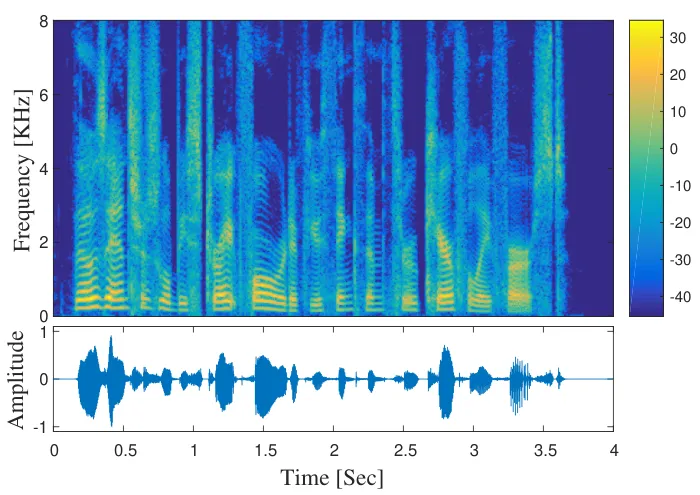
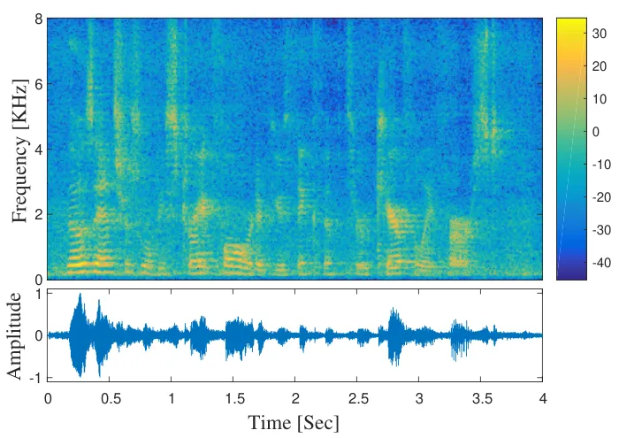
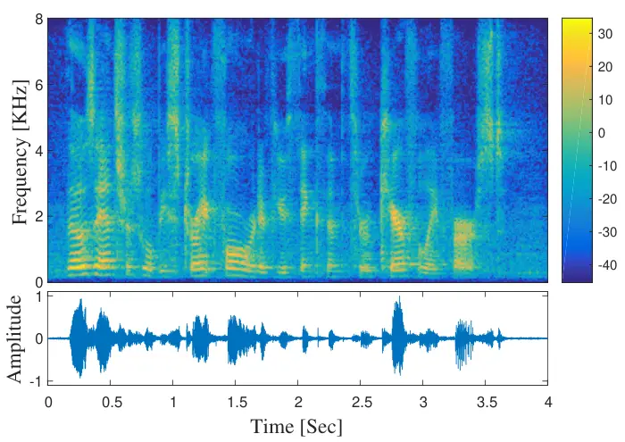
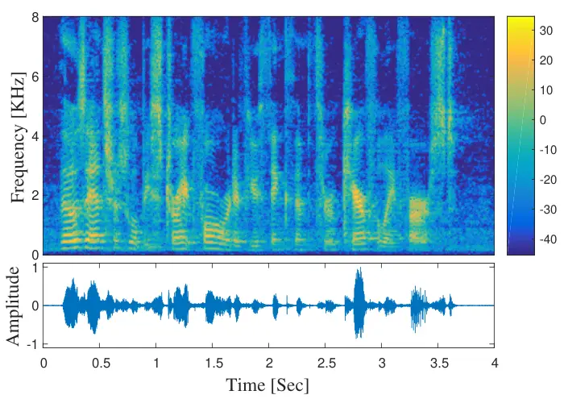

# ML Estimation and CRBs for Reverberation, Speech and Noise PSDs in Rank-Deficient Noise Field

Yaron Laufer    Bracha Laufer-Goldshtein    Sharon Gannot
^(†)^(†)thanks: The authors are with the Faculty of Engineering,
Bar-Ilan University, Ramat-Gan, 5290002, Israel (e-mail:
Yaron.Laufer@biu.ac.il, Bracha.Laufer@biu.ac.il,
Sharon.Gannot@biu.ac.il).

###### Abstract

Speech communication systems are prone to performance degradation in
reverberant and noisy acoustic environments. Dereverberation and noise
reduction algorithms typically require several model parameters,
e.g. the speech, reverberation and noise power spectral densities
(PSDs). A commonly used assumption is that the noise PSD (PSD) matrix is
known. However, in practical acoustic scenarios, the noise PSD matrix is
unknown and should be estimated along with the speech and reverberation
PSD. In this paper, we consider the case of rank-deficient noise PSD
matrix, which arises when the noise signal consists of multiple
directional noise sources, whose number is less than the number of
microphones. We derive two closed-form MLE. The first is a
non-blocking-based estimator which jointly estimates the speech,
reverberation and noise PSD, and the second is a blocking-based
estimator, which first blocks the speech signal and then jointly
estimates the reverberation and noise PSD. Both estimators are
analytically compared and analyzed, and MSE expressions are derived.
Furthermore, CRB on the estimated PSD are derived. The proposed
estimators are examined using both simulation and real reverberant and
noisy signals, demonstrating the advantage of the proposed method
compared to competing estimators.

###### Index Terms: 

Dereverberation, Noise reduction, Maximum likelihood estimation,
Cramér-Rao Bound.

## I Introduction

In many hands-free scenarios, the measured microphone signals are
corrupted by additive background noise, which may originate from both
environmental sources and from microphone responses. Apart from noise,
if the recording takes place in an enclosed space, the recorded signals
may also contain multiple sound reflections from walls and other objects
in the room, resulting in reverberation. As the level of noise and
reverberation increases, the perceived quality and intelligibility of
the speech signal deteriorate, which in turn affect the performance of
speech communication systems, as well as ASR (ASR) systems.

In order to reduce the effects of reverberation and noise, speech
enhancement algorithms are required, which aim at recovering the clean
speech source from the recorded microphone signals. Speech
dereverberation and noise reduction algorithms often require the power
spectral densities (PSDs) of the speech, reverberation and noise
components. In the multichannel framework, a commonly used assumption
(see e.g. in \[1, 2, 3, 4, 5, 6, 7, 8, 9, 10\]) is that the late
reverberant signal is modelled as a spatially homogeneous sound field,
with a time-varying PSD multiplied by a spherical diffuse time-invariant
spatial coherence matrix. As the spatial coherence matrix depends only
on the microphone geometry, it can be calculated in advance. However,
the reverberation PSD is an unknown parameter that should be estimated.
Numerous methods exist for estimating the reverberation PSD. They are
broadly divided into two classes, namely non-blocking-based estimators
and blocking-based estimators. The non-blocking-based approach jointly
estimates the PSD of the late reverberation and speech. The estimation
is carried out using the ML (ML) criterion \[3, 6\] or in the LS (LS)
sense, by minimizing the Frobenius norm of an error PSD matrix \[8\]. In
the blocking-based method, the desired speech signal is first blocked
using a BM (BM), and then the reverberation PSD is estimated. Estimators
in this class are also based on the ML approach \[1, 5, 7, 9\] or the LS
criteria \[2, 4\].

All previously mentioned methods do not include an estimator for the
noise PSD. In \[1, 3\], a noiseless scenario is assumed. In \[2, 4, 5,
6, 8, 7, 9, 10\], the noise PSD matrix is assumed to be known in
advance, or that an estimate is available. Typically, the noise PSD
matrix is assumed to be time-invariant, and therefore can be estimated
during speech-absent periods using a VAD (VAD). However, in practical
acoustic scenarios the spectral characteristics of the noise might be
time-varying, e.g. when the noise environment includes a background
radio or TV, and thus a VAD-based algorithm may fail. Therefore, the
noise PSD matrix has to be included in the estimation procedure.

Some papers in the field deal with performance analysis of the proposed
estimators. We give a brief review of the commonly used tools to assess
the quality of an estimator. Theoretical analysis of estimators
typically consists of calculating the bias and the MSE (MSE), which
coincides with the variance for unbiased estimators. The CRB (CRB) is an
important tool to evaluate the quality of any unbiased estimator, since
it gives a lower bound on the MSE. An estimator that is unbiased and
attains the CRB, is called efficient. The MLE (MLE) is asymptotically
efficient \[11\], namely attains the CRB when the amount of samples is
large.

Theoretical analysis of PSD estimators in the noise-free scenario was
addressed in \[12, 13\]. In \[12\], CRB were derived for the
reverberation and the speech MLE proposed in \[3\]. These MLE are
efficient, i.e. attain the CRB for any number of samples. In addition,
it was pointed out that the non-blocking-based reverberation MLE derived
in \[3\] is identical to the blocking-based MLE proposed in \[1\]. In
\[13\], it was shown that the non-blocking-based reverberation MLE of
\[3\] obtains a lower MSE compared to a noiseless version of the
blocking-based LS estimator derived in \[2\].

In the noisy case, quality assessment was discussed in \[9\] and \[14\].
In \[9\], it was numerically demonstrated that an iterative
blocking-based MLE yields lower MSE than the blocking-based LS estimator
proposed in \[2\]. In \[14\], closed-form CRB were derived for the two
previously proposed MLE of the reverberation PSD, namely the
blocking-based estimator in \[5\] and the non-blocking-based estimator
in \[6\]. The CRB for the non-blocking-based reverberation estimator was
shown to be lower than the CRB for the blocking-based estimator.
However, it was shown that in the noiseless case, both reverberation MLE
are identical and both CRB coincide.

As opposed to previous works, the assumption of known noise PSD matrix
is not made in \[15\]. The noise is modelled as a spatially homogeneous
sound field, with a time-varying PSD multiplied by a time-invariant
spatial coherence matrix. It is assumed that the spatial coherence
matrix of the noise is known in advance, while the time-varying PSD is
unknown. Two different estimators were developed, based on the LS
method. In the first one, a joint estimator for the speech, noise and
late reverberation PSD was developed. As an alternative, a
blocking-based estimator was proposed, in which the speech signal is
first blocked by a BM, and then the noise and reverberation PSD are
jointly estimated. This method was further extended in \[16\] to jointly
estimate the various PSD along with the RETF (RETF) vector, using an
alternating least-squares method. However, the model used in \[15\] and
\[16\] only fits spatially homogeneous noise fields that are
characterized by a full-rank covariance matrix. Moreover, in \[9\] it
was claimed that the ML approach is preferable over the LS estimation
procedure.

Recently, a confirmatory factor analysis was used in \[17\] to jointly
estimate the PSD and the RETF. The noise is modelled as a
microphone-self noise, with a time-invariant diagonal PSD matrix. A
closed-form solution is not available for this case, thus requiring
iterative optimization techniques.

In this paper, we treat the noise PSD matrix as an unknown parameter. We
assume that the noise PSD matrix is a rank-deficient matrix, as opposed
to the spatially homogeneous assumption considered in \[15\]. This
scenario arises when the noise signal consists of a set of directional
noise sources, whose number is smaller than the number of microphones.
We assume that the positions of the noise sources are fixed, while their
spectral PSD matrix is time-varying, e.g. when the acoustic environment
includes radio or TV. It should be emphasized that, in contrast to
\[15\] which estimates only a scalar PSD of the noise, in our model the
entire spectral PSD matrix of the noise is estimated, and thus the case
of multiple non-stationary noise sources, can be handled. We derive
closed-form MLE of the various PSD, for both the non-blocking-based and
the blocking-based methods. The proposed estimators are analytically
studied and compared, and the corresponding MSE expressions are derived.
Furthermore, CRB for estimating the various PSD are derived.

An important benefit of considering the rank-deficient noise as a
separated problem, is due to the form of the solution. In the ML
framework, a closed-form solution exists for the noiseless case \[1, 3\]
but not for the full-rank noise scenario, thus requiring iterative
optimization techniques \[5, 6, 9\] (as opposed to LS method that has
closed-form solutions in both cases). However, we show here that when
the noise PSD matrix is a rank-deficient matrix, closed-form MLE exists,
which yields simpler and faster estimation procedure with low
computational complexity, and is not sensitive to local maxima.

The remainder of the paper is organized as follows. Section II presents
the problem formulation, and describes the probabilistic model.
Section III derives the MLE for both the non-blocking-based and the
blocking-based methods, and Section IV presents the CRB derivation.
Section V demonstrates the performance of the proposed estimators by an
experimental study based on both simulated data and recorded RIR. The
paper is concluded in Section VI.

## II Problem Formulation

In this section, we formulate the dereverberation and noise reduction
problem. Scalars are denoted with regular lowercase letters, vectors are
denoted with bold lowercase letters and matrices are denoted with bold
uppercase letters. A list of notations used in our derivations is given
in Table I.

### II-A Signal Model

Consider a speech signal received by $`N`$ microphones, in a noisy and
reverberant acoustic environment. We work with the STFT (STFT)
representation of the measured signals. Let $`k\in[1,K]`$ denote the
frequency bin index, and $`m\in[1,M]`$ denote the time frame index. The
$`N`$-channel observation signal $`\mathbf{y}(m,k)\in\mathbb{C}^{N}`$
writes

```math
\mathbf{y}(m,k)=\mathbf{x}_{\text{e}}(m,k)+\mathbf{r}(m,k)+\mathbf{u}(m,k), \tag{1}
```

where $`\mathbf{x}_{\text{e}}(m,k)\in\mathbb{C}^{N}`$ denotes the direct
and early reverberation speech component,
$`\mathbf{r}(m,k)\in\mathbb{C}^{N}`$ denotes the late reverberation
speech component and $`\mathbf{u}(m,k)\in\mathbb{C}^{N}`$ denotes the
noise. The direct and early reverberation speech component is given by
$`\mathbf{x}_{\text{e}}(m,k)=\mathbf{g}_{d}(k)s(m,k)`$, where
$`s(m,k)\in\mathbb{C}`$ is the direct and early speech component as
received by the first microphone (designated as a reference microphone),
and
$`\mathbf{g}_{d}(k)=[1,g_{d,2}(k),\cdots,g_{d,N}(k)]^{\top}\in\mathbb{C}^{N}`$
is the time-invariant RETF (RETF) vector between the reference
microphone and all microphones. In this paper, we follow previous works
in the field, e.g. \[2, 13, 14, 15\], and neglect the early reflections.
Thus, the target signal $`s(m,k)`$ is approximated as the direct
component at the reference microphone, and $`\mathbf{g}_{d}(k)`$ reduces
to the RDTF (RDTF) vector. It is assumed that the noise signal consists
of $`T`$ noise sources, i.e.

```math
\mathbf{u}(m,k)=\mathbf{A}_{\mathbf{u}}(k)\mathbf{s}_{\mathbf{u}}(m,k), \tag{2}
```

where $`\mathbf{s}_{\mathbf{u}}(m,k)\in\mathbb{C}^{T}`$ denotes the
vector of noise sources and
$`\mathbf{A}_{\mathbf{u}}(k)\in\mathbb{C}^{N\times T}`$ is the noise ATF
(ATF) matrix, assumed to be time-invariant. It is further assumed that
$`T\leq N-2`$.

| Symbol                      |       | Meaning                                       |
| --------------------------- | ----- | --------------------------------------------- | --- | ----------------------- |
| $`(\cdot)^{\top}`$          |       | transpose                                     |
| $`(\cdot)^{\textrm{H}}`$    |       | conjugate transpose                           |
| $`\left(\cdot\right)^{*}`$  |       | complex conjugate                             |
| $`                          | \cdot | `$                                            |     | determinant of a matrix |
| $`\text{Tr}[\cdot]`$        |       | trace of a matrix                             |
| $`\otimes`$                 |       | Kronecker product                             |
| $`\text{vec}(\cdot)`$       |       | stacking the columns of a matrix on top of    |
|                             |       | one another                                   |
| $`N`$                       |       | No. of microphones, $`n\in\{1,\ldots,N\}`$    |
| $`M`$                       |       | No. of time frames, $`m\in\{1,\ldots,M\}`$    |
| $`K`$                       |       | No. of frequency bins, $`k\in\{1,\ldots,K\}`$ |
| $`T`$                       |       | No. of noise sources, $`t\in\{1,\ldots,T\}`$  |
| $`\mathbf{y}`$              |       | Observation signal                            |
| $`s`$                       |       | Direct speech component                       |
| $`\mathbf{g}_{d}`$          |       | Relative direct-path transfer function        |
| $`\mathbf{r}`$              |       | Late reverberation component                  |
| $`\mathbf{u}`$              |       | Noise signal                                  |
| $`\mathbf{A}_{\mathbf{u}}`$ |       | Noise ATF matrix                              |
| $`\mathbf{s}_{\mathbf{u}}`$ |       | Vector of noise sources                       |
| $`\phi_{S}`$                |       | Speech PSD                                    |
| $`\phi_{R}`$                |       | Reverberation PSD                             |
| $`\bm{\Gamma}_{R}`$         |       | Reverberation coherence matrix                |
| $`\bm{\Psi}_{\mathbf{u}}`$  |       | Noise PSD matrix                              |

TABLE I: Nomenclature

### II-B Probabilistic Model

The speech STFT coefficients are assumed to follow a zero-mean complex
Gaussian distribution¹¹ 1 The multivariate complex Gaussian PDF (PDF) is
given by
$`\mathcal{N}_{c}(\mathbf{a};\bm{\mu}_{a},\bm{\Phi}_{a})=\frac{1}{|\pi\bm{\Phi}_{a}|}\exp\big(-(\mathbf{a}-\bm{\mu}_{a})^{\textrm{H}}\bm{\Phi}_{a}^{-1}(\mathbf{a}-\bm{\mu}_{a})\big),`$
where $`\bm{\mu}_{a}`$ is the mean vector and $`\bm{\Phi}_{a}`$ is an
Hermitian positive definite complex covariance matrix \[18\]. with a
time-varying PSD $`\phi_{S}(m,k)`$. Hence, the PDF of the speech writes:

```math
p\big(s(m,k);\phi_{S}(m,k)\big)=\mathcal{N}_{c}\big(s(m,k);0,\phi_{S}(m,k)\big). \tag{3}
```

The late reverberation signal is modelled by a zero-mean complex
multivariate Gaussian distribution:

```math
p\big(\mathbf{r}(m,k);\bm{\Phi}_{\mathbf{r}}(m,k)\big)=\mathcal{N}_{c}\big(\mathbf{r}(m,k);\bm{0},\bm{\Phi}_{\mathbf{r}}(m,k)\big). \tag{4}
```

The reverberation PSD matrix is modelled as a spatially homogeneous and
isotropic sound field, with a time-varying PSD,
$`\bm{\Phi}_{\mathbf{r}}(m,k)=\phi_{R}(m,k)\bm{\Gamma}_{R}(k)`$. It is
assumed that the time-invariant coherence matrix $`\bm{\Gamma}_{R}(k)`$
can be modelled by a spherically diffuse sound field \[19\]:

```math
\Gamma_{R,ij}(k)=\text{sinc}\left(\frac{2\pi f_{s}k}{K}\frac{d_{ij}}{c}\right), \tag{5}
```

where $`\text{sinc}(x)=\sin(x)/x`$, $`d_{ij}`$ is the inter-distance
between microphones $`i`$ and $`j`$, $`f_{s}`$ denotes the sampling
frequency and $`c`$ is the sound velocity.

The noise sources vector is modelled by a zero-mean complex multivariate
Gaussian distribution with a time-varying PSD matrix
$`\bm{\Psi}_{\mathbf{u}}(m,k)\in\mathbb{C}^{T\times T}`$:

```math
\displaystyle\hskip-0.71114ptp\big(\mathbf{s}_{\mathbf{u}}(m,k);\bm{\Psi}_{\mathbf{u}}(m,k)\big)=\mathcal{N}_{c}\big(\mathbf{s}_{\mathbf{u}}(m,k);\bm{0},\bm{\Psi}_{\mathbf{u}}(m,k)\big). \tag{6}
```

Using (2) and (6), it follows that $`\mathbf{u}(m,k)`$ has a zero-mean
complex multivariate Gaussian distribution with a PSD matrix
$`\bm{\Phi}_{\mathbf{u}}(m,k)\in\mathbb{C}^{N\times N}`$, given by

```math
\bm{\Phi}_{\mathbf{u}}(m,k)=\mathbf{A}_{\mathbf{u}}(k)\bm{\Psi}_{\mathbf{u}}(m,k)\mathbf{A}_{\mathbf{u}}^{{\textrm{H}}}(k). \tag{7}
```

Note that
$`\text{rank}(\bm{\Phi}_{\mathbf{u}})=\text{rank}(\bm{\Psi}_{\mathbf{u}})=T\leq N-2`$,
i.e. $`\bm{\Phi}_{\mathbf{u}}`$ is a rank-deficient matrix. The PDF of
$`\mathbf{y}(m,k)`$ writes

```math
p\big(\mathbf{y}(m,k);\bm{\Phi}_{\mathbf{y}}(m,k)\big)=\mathcal{N}_{c}\big(\mathbf{y}(m,k);\bm{0},\bm{\Phi}_{\mathbf{y}}(m,k)\big), \tag{8}
```

where $`\bm{\Phi}_{\mathbf{y}}`$ is the PSD matrix of the input signals.
Assuming that the components in (1) are independent,
$`\bm{\Phi}_{\mathbf{y}}`$ is given by

```math
\displaystyle\bm{\Phi}_{\mathbf{y}}(m,k) \displaystyle=\phi_{S}(m,k)\mathbf{g}_{d}(k)\mathbf{g}_{d}^{\textrm{H}}(k)+\phi_{R}(m,k)\,\bm{\Gamma}_{R}(k)
```

```math
\displaystyle\quad+\mathbf{A}_{\mathbf{u}}(k)\bm{\Psi}_{\mathbf{u}}(m,k)\mathbf{A}_{\mathbf{u}}^{{\textrm{H}}}(k). \tag{9}
```

A commonly used dereverberation and noise reduction technique is to
estimate the speech signal using the multichannel MMSE (MMSE) estimator,
which yields the MCWF (MCWF), given by \[20\]:

```math
\hat{s}_{\text{MCWF}}(m,k)=\frac{\mathbf{g}_{d}^{\textrm{H}}(k)\bm{\Phi}_{i}^{-1}(m,k)}{\mathbf{g}_{d}^{\textrm{H}}(k)\bm{\Phi}_{i}^{-1}(m,k)\mathbf{g}_{d}(k)+\phi_{S}^{-1}(m,k)}\mathbf{y}(m,k), \tag{10}
```

where

```math
\bm{\Phi}_{i}(m,k)\triangleq\phi_{R}(m,k)\,\mathbf{\Gamma}_{R}(k)+\mathbf{A}_{\mathbf{u}}(k)\bm{\Psi}_{\mathbf{u}}(m,k)\mathbf{A}_{\mathbf{u}}^{{\textrm{H}}}(k) \tag{11}
```

denotes the total interference PSD matrix. For implementing (10), we
assume that the RDTF vector $`\mathbf{g}_{d}`$ and the spatial coherence
matrix $`\bm{\Gamma}_{R}`$ are known in advance. The RDTF depends only
on the DOA (DOA) of the speaker and the geometry of the microphone
array, and thus it can be constructed based on a DOA estimate. The
spatial coherence matrix is calculated using (5), based on the spherical
diffuseness assumption. It follows that estimators of the late
reverberation, speech and noise PSD are required for evaluating the
MCWF.

It should be noted that estimating directly the complete $`N\times N`$
time-varying noise PSD matrix $`\mathbf{\Phi}_{\mathbf{u}}(m,k)`$, along
with the speech and reverberation PSD, is a complex problem, and a
closed-form ML solution is not available. In this paper, we rely on the
decomposition of the noise PSD matrix in (7), along with the
rank-deficiency assumption. By utilizing the time-invariant ATF matrix
$`\mathbf{A}_{\mathbf{u}}(k)`$, we can construct a projection matrix
onto the subspace orthogonal to the noise subspace, which generates
nulls towards the noise sources. In the following section, we show that
this step enables the derivation of closed-form MLE for the various PSD.

The noise ATF matrix $`\mathbf{A}_{\mathbf{u}}(k)`$ is in general not
available, since the estimation of the individual ATF requires that each
noise is active separately. Instead, we only assume the availability of
a speech-absent segment, denoted by $`m_{0}`$, in which all noise
sources are concurrently active. Based on this segment, we compute a
basis for the noise subspace that can be used instead of the unknown ATF
matrix. To this end, we compute the noise PSD matrix
$`\mathbf{\Phi}_{\mathbf{u}}(m_{0},k)`$, and apply the EVD (EVD) to the
resulting matrix. Recall that the rank of $`\mathbf{\Phi}_{\mathbf{u}}`$
is $`T`$. Accordingly, a $`T`$-rank representation of the noise PSD
matrix is formed by the computed eigenvalues and eigenvectors:

```math
\bm{\Phi}_{\mathbf{u}}(m_{0},k)=\mathbf{V}(k)\bm{\Lambda}(m_{0},k)\mathbf{V}^{{\textrm{H}}}(k), \tag{12}
```

where $`\bm{\Lambda}(m_{0},k)\in\mathbb{C}^{T\times T}`$ is the
eigenvalues matrix (comprised of the non-zero eigenvalues) and
$`\mathbf{V}(k)=\left[\mathbf{v}_{1}(k),\cdots,\mathbf{v}_{T}(k)\right]\in\mathbb{C}^{N\times T}`$
is the corresponding eigenvectors matrix. $`\mathbf{V}(k)`$ is a basis
that spans the noise ATF subspace, and thus \[21\]

```math
\displaystyle\mathbf{A}_{\mathbf{u}}(k)=\mathbf{V}(k)\mathbf{G}(k), \tag{13}
```

where $`\mathbf{G}(k)\in\mathbb{C}^{T\times T}`$ consists of projection
coefficients of the original ATF on the basis vectors. Substituting (13)
into (2) and then into (1), yields

```math
\mathbf{y}(m,k)=\mathbf{g}_{d}(k)s(m,k)+\mathbf{r}(m,k)+\mathbf{V}(k)\mathbf{s}_{\mathbf{v}}(m,k), \tag{14}
```

where
$`\mathbf{s}_{\mathbf{v}}(m,k)\triangleq\mathbf{G}(k)\mathbf{s}_{\mathbf{u}}(m,k)`$.
It follows that the noise PSD matrix in (7) can be recast as

```math
\displaystyle\bm{\Phi}_{\mathbf{u}}(m,k)=\mathbf{V}(k)\bm{\Psi}_{\mathbf{v}}(m,k)\mathbf{V}^{{\textrm{H}}}(k), \tag{15}
```

where
$`\bm{\Psi}_{\mathbf{v}}(m,k)=\mathbf{G}(k)\bm{\Psi}_{\mathbf{u}}(m,k)\mathbf{G}^{{\textrm{H}}}(k)`$.
Using this basis change, the MCWF in (10) is now computed with

```math
\bm{\Phi}_{i}(m,k)=\phi_{R}(m,k)\,\mathbf{\Gamma}_{R}(k)+\mathbf{V}(k)\bm{\Psi}_{\mathbf{v}}(m,k)\mathbf{V}^{{\textrm{H}}}(k). \tag{16}
```

As a result, rather than requiring the knowledge of the exact noise ATF
matrix, we use $`\mathbf{V}`$ that is learned from a speech-absent
segment. Due to this basis change, we will need to estimate
$`\bm{\Psi}_{\mathbf{v}}`$ instead of $`\bm{\Psi}_{\mathbf{u}}`$.

To summarize, estimators of $`\phi_{R}`$, $`\phi_{S}`$ and
$`\bm{\Psi}_{\mathbf{v}}`$ are required. For the sake of brevity, the
frame index $`m`$ and the frequency bin index $`k`$ are henceforth
omitted whenever possible.

## III ML Estimators

We propose two ML-based methods: (i) Non-blocking-based estimation:
Simultaneous ML estimation of the reverberation, speech and noise PSD;
and (ii) Blocking-based estimation: Elimination of the speech PSD using
a BM (BM), and then joint ML estimation of the reverberation and noise
PSD. Both methods are then compared and analyzed.

### III-A Non-Blocking-Based Estimation

We start with the joint ML estimation of the reverberation, speech and
noise PSD. Based on the short-time stationarity assumption \[12, 9\], it
is assumed that the PSD are approximately constant across small number
of consecutive time frames, denoted by $`L`$. We therefore denote
$`\bar{\mathbf{y}}(m)\in\mathbb{C}^{LN}`$ as the concatenation of $`L`$
successive observations of $`\mathbf{y}(m)`$:

```math
\bar{\mathbf{y}}(m)\triangleq\left[\mathbf{y}^{\top}(m-L+1),\cdots,\mathbf{y}^{\top}(m)\right]^{\top}. \tag{17}
```

The set of unknown parameters is denoted by
$`\bm{\phi}(m)=\left[\phi_{R}(m),\phi_{S}(m),\bm{\psi}_{V}^{\top}(m)\right]^{\top}`$,
where $`\bm{\psi}_{V}`$ is a vector containing all elements of
$`\bm{\Psi}_{\mathbf{v}}`$,
i.e. $`\bm{\psi}_{V}=\text{vec}\left(\bm{\Psi}_{\mathbf{v}}\right)`$.
Assuming that the $`L`$ consecutive signals in $`\bar{\mathbf{y}}`$ are
i.i.d., the PDF of $`\bar{\mathbf{y}}`$ writes (see e.g. \[14\]):

```math
\displaystyle p\big(\bar{\mathbf{y}}(m);\bm{\phi}(m)\big)
```

```math
\displaystyle\quad=\left(\frac{1}{\pi^{N}|\bm{\Phi}_{\mathbf{y}}(m)|}\exp\Big(-\textrm{Tr}\left[\bm{\Phi}^{-1}_{\mathbf{y}}(m)\mathbf{R}_{\mathbf{y}}(m)\right]\Big)\right)^{L}, \tag{18}
```

where $`\mathbf{R}_{\mathbf{y}}`$ is the sample covariance matrix, given
by

```math
\mathbf{R}_{\mathbf{y}}(m)=\frac{1}{L}\sum^{m}_{\ell=m-L+1}\mathbf{y}(\ell)\mathbf{y}^{\textrm{H}}(\ell). \tag{19}
```

The MLE of the set $`\bm{\phi}(m)`$ is therefore given by

```math
\bm{\phi}^{\textrm{ML},\bar{\mathbf{y}}}(m)=\operatornamewithlimits{argmax}_{\bm{\phi}(m)}\log p\big(\bar{\mathbf{y}}(m);\bm{\phi}(m)\big). \tag{20}
```

To the best of our knowledge, for the general noisy scenario this
problem is considered as having no closed-form solution. However, we
will show that when the noise PSD matrix $`\bm{\Phi}_{\mathbf{u}}`$ is
rank-deficient, with $`T=\text{rank}(\bm{\Phi}_{\mathbf{u}})\leq N-2`$,
a closed-form solution exists. In the following, we present the proposed
estimators. The detailed derivations appear in the Appendices.

In Appendix A, it is shown that the MLE of $`\phi_{R}(m)`$ is given by:

```math
\displaystyle\phi^{\mathrm{ML},\bar{\mathbf{y}}}_{R}(m)=\frac{1}{N-(T+1)}\textrm{Tr}\big[\mathbf{Q}\mathbf{R}_{\mathbf{y}}(m)\mathbf{\Gamma}_{R}^{-1}\big], \tag{21}
```

where $`\mathbf{Q}\in\mathbb{C}^{N\times N}`$ is given by

```math
\displaystyle\mathbf{Q}=\mathbf{I}_{N}-\mathbf{A}\left(\mathbf{A}^{\textrm{H}}\bm{\Gamma}_{R}^{-1}\mathbf{A}\right)^{-1}\mathbf{A}^{\textrm{H}}\bm{\Gamma}_{R}^{-1}, \tag{22}
```

and $`\mathbf{A}\in\mathbb{C}^{N\times(T+1)}`$ is the speech-plus-noise
subspace

```math
\displaystyle\mathbf{A}=\left[\mathbf{g}_{d},\mathbf{v}_{1},\cdots,\mathbf{v}_{T}\right]. \tag{23}
```

The matrix $`\mathbf{Q}`$ is a projection matrix onto the subspace
orthogonal to the speech-plus-noise subspace. The role of $`\mathbf{Q}`$
is to block the directions of the desired speech and noise signals, in
order to estimate the reverberation level.

Once we obtain the MLE for the late reverberation PSD, the MLE for the
speech and noise PSD can be computed. In Appendix B, it is shown that
the MLE for the speech PSD writes

```math
\displaystyle\phi^{\mathrm{ML},\bar{\mathbf{y}}}_{S}(m)=\mathbf{w}_{s}^{\textrm{H}}\left(\mathbf{R}_{\mathbf{y}}(m)-\phi^{\mathrm{ML},\bar{\mathbf{y}}}_{R}(m)\bm{\Gamma}_{R}\right)\mathbf{w}_{s}, \tag{24}
```

where $`\mathbf{w}_{s}\in\mathbb{C}^{N}`$ is a MVDR (MVDR) beamformer
that extracts the speech signal while eliminating the noise, given by

```math
\mathbf{w}_{s}^{\textrm{H}}=\frac{\mathbf{g}_{d}^{\textrm{H}}\bm{P}_{v}^{\perp}\bm{\Gamma}_{R}^{-1}}{\mathbf{g}_{d}^{\textrm{H}}\bm{P}_{v}^{\perp}\bm{\Gamma}_{R}^{-1}\mathbf{g}_{d}}, \tag{25}
```

and $`\bm{P}_{v}^{\perp}\in\mathbb{C}^{N\times N}`$ is a projection
matrix onto the subspace orthogonal to the noise subspace, given by

```math
\bm{P}_{v}^{\perp}=\mathbf{I}_{N}-\bm{\Gamma}_{R}^{-1}\mathbf{V}\left(\mathbf{V}^{\textrm{H}}\bm{\Gamma}_{R}^{-1}\mathbf{V}\right)^{-1}\mathbf{V}^{\textrm{H}}. \tag{26}
```

Note that

```math
\displaystyle\mathbf{w}_{s}^{\textrm{H}}\mathbf{g}_{d}=1\hskip 2.84544pt,\hskip 2.84544pt\mathbf{w}_{s}^{\textrm{H}}\mathbf{V}=\mathbf{0}. \tag{27}
```

The estimator in (24) can be interpreted as the variance of the noisy
observations minus the estimated variance of the reverberation, at the
output of the MVDR beamformer \[12\].

In Appendix C, it is shown that the MLE of the noise PSD can be computed
with

```math
\displaystyle\bm{\Psi}_{\mathbf{v}}^{\mathrm{ML},\bar{\mathbf{y}}}(m)=\mathbf{W}_{\mathbf{u}}^{\textrm{H}}\left(\mathbf{R}_{\mathbf{y}}(m)-\phi^{\mathrm{ML},\bar{\mathbf{y}}}_{R}(m)\bm{\Gamma}_{R}\right)\mathbf{W}_{\mathbf{u}}, \tag{28}
```

where $`\mathbf{W}_{\mathbf{u}}\in\mathbb{C}^{N\times T}`$ is a
multi-source LCMV (LCMV) beamformer that extracts the noise signals
while eliminating the speech signal:

```math
\mathbf{W}_{\mathbf{u}}^{\textrm{H}}=\left(\mathbf{V}^{\textrm{H}}\bm{P}_{g}^{\perp}\bm{\Gamma}_{R}^{-1}\mathbf{V}\right)^{-1}\mathbf{V}^{\textrm{H}}\bm{P}_{g}^{\perp}\bm{\Gamma}_{R}^{-1}, \tag{29}
```

and $`\bm{P}_{g}^{\perp}\in\mathbb{C}^{N\times N}`$ is a projection
matrix onto the subspace orthogonal to the speech subspace, given by

```math
\bm{P}_{g}^{\perp}=\mathbf{I}_{N}-\frac{\bm{\Gamma}_{R}^{-1}\mathbf{g}_{d}\mathbf{g}_{d}^{\textrm{H}}}{\mathbf{g}_{d}^{\textrm{H}}\bm{\Gamma}_{R}^{-1}\mathbf{g}_{d}}. \tag{30}
```

Note that

```math
\displaystyle\mathbf{W}_{\mathbf{u}}^{\textrm{H}}\mathbf{g}_{d}=\bm{0}\hskip 2.84544pt,\hskip 2.84544pt\mathbf{W}_{\mathbf{u}}^{\textrm{H}}\mathbf{V}=\mathbf{I}_{T}. \tag{31}
```

Interestingly, the projection matrix $`\mathbf{Q}`$ can be recast as a
linear combination of the above beamformers (see Appendix D):

```math
\displaystyle\mathbf{Q}=\mathbf{I}_{N}-\mathbf{g}_{d}\mathbf{w}_{s}^{\textrm{H}}-\mathbf{V}\mathbf{W}_{\mathbf{u}}^{\textrm{H}}. \tag{32}
```

Using (27), (31) and (32), it can also be noted that $`\mathbf{Q}`$ is
orthogonal to both beamformers

```math
\displaystyle\mathbf{w}_{s}^{\textrm{H}}\mathbf{Q}=\mathbf{0}\hskip 2.84544pt,\hskip 2.84544pt\mathbf{W}_{\mathbf{u}}^{\textrm{H}}\mathbf{Q}=\mathbf{0}. \tag{33}
```

In the noiseless case, i.e. when $`T=0`$, $`\mathbf{Q}`$ reduces to

```math
\displaystyle\mathbf{Q}=\mathbf{I}_{N}-\mathbf{g}_{d}\mathbf{w}_{s_{0}}^{\textrm{H}}=\left(\bm{P}_{g}^{\perp}\right)^{\textrm{H}}, \tag{34}
```

where
$`\mathbf{w}_{s_{0}}^{\textrm{H}}=\frac{\mathbf{g}_{d}^{\textrm{H}}\bm{\Gamma}_{R}^{-1}}{\mathbf{g}_{d}^{\textrm{H}}\bm{\Gamma}_{R}^{-1}\mathbf{g}_{d}}`$,
leading to the same closed-form estimators as in \[3, Eq. (7)\]:

```math
\displaystyle\phi^{\mathrm{ML},\bar{\mathbf{y}}}_{R}(m) \displaystyle=\frac{1}{N-1}\textrm{Tr}\left[\left(\mathbf{I}_{N}-\mathbf{g}_{d}\mathbf{w}_{s_{0}}^{\textrm{H}}\right)\mathbf{R}_{\mathbf{y}}(m)\mathbf{\Gamma}_{R}^{-1}\right], \tag{35}
```

```math
\displaystyle\phi^{\mathrm{ML},\bar{\mathbf{y}}}_{S}(m) \displaystyle=\mathbf{w}_{s_{0}}^{\textrm{H}}\left(\mathbf{R}_{\mathbf{y}}(m)-\phi^{\mathrm{ML},\bar{\mathbf{y}}}_{R}(m)\bm{\Gamma}_{R}\right)\mathbf{w}_{s_{0}}. \tag{36}
```

### III-B Blocking-Based Estimation

As a second approach, we first block the speech component using a BM,
and then jointly estimate the PSD of the reverberation and noise. Let
$`\mathbf{B}\in\mathbb{C}^{N\times(N-1)}`$ denote the BM, which
satisfies $`\mathbf{B}^{\textrm{H}}\mathbf{g}_{d}=\mathbf{0}`$. The
output of the BM is given by

```math
\displaystyle\mathbf{z}(m)\triangleq\mathbf{B}^{\textrm{H}}\,\mathbf{y}(m)=\mathbf{B}^{\textrm{H}}\big(\mathbf{r}(m)+\mathbf{u}(m)\big). \tag{37}
```

The PDF of $`\mathbf{z}(m)\in\mathbb{C}^{N-1}`$ therefore writes:

```math
p\big(\mathbf{z}(m);\bm{\Phi}_{\mathbf{z}}(m)\big)=\mathcal{N}_{c}\big(\mathbf{z}(m);\bm{0},\bm{\Phi}_{\mathbf{z}}(m)\big), \tag{38}
```

with the PSD matrix
$`\bm{\Phi}_{\mathbf{z}}(m)\in\mathbb{C}^{(N-1)\times(N-1)}`$ given by

```math
\bm{\Phi}_{\mathbf{z}}(m)=\mathbf{B}^{\textrm{H}}\bm{\Phi}_{i}(m)\mathbf{B}, \tag{39}
```

where $`\bm{\Phi}_{i}`$ is the total interference matrix, defined in
(16). Multiplying (15) from left by $`\mathbf{B}^{\textrm{H}}`$ and from
right by $`\mathbf{B}`$, the noise PSD matrix at the output of the BM
writes

```math
\mathbf{B}^{\textrm{H}}\bm{\Phi}_{\mathbf{u}}(m)\mathbf{B}=\widetilde{\mathbf{V}}\bm{\Psi}_{\mathbf{v}}(m)\widetilde{\mathbf{V}}^{{\textrm{H}}}, \tag{40}
```

where $`\widetilde{\mathbf{V}}\in\mathbb{C}^{(N-1)\times T}`$ is the
reduced noise subspace:

```math
\displaystyle\widetilde{\mathbf{V}}\triangleq\mathbf{B}^{\textrm{H}}\mathbf{V}=\left[\tilde{\mathbf{v}}_{1},\cdots,\tilde{\mathbf{v}}_{T}\right]. \tag{41}
```

Substituting (16) into (39) and using (41), yields

```math
\bm{\Phi}_{\mathbf{z}}(m)=\phi_{R}(m)\mathbf{B}^{\textrm{H}}\mathbf{\Gamma}_{R}\mathbf{B}+\widetilde{\mathbf{V}}\bm{\Psi}_{\mathbf{v}}(m)\widetilde{\mathbf{V}}^{{\textrm{H}}}. \tag{42}
```

Under this model, the parameter set of interest is
$`\tilde{\bm{\phi}}(m)=\left[\phi_{R}(m),\bm{\psi}_{V}^{\top}(m)\right]^{\top}`$.
Let $`\bar{\mathbf{z}}\in\mathbb{C}^{L(N-1)}`$ be defined similarly to
$`\bar{\mathbf{y}}`$ in (17), as a concatenation of $`L`$
i.i.d. consecutive frames. Similarly to $`\bm{\Phi}_{\mathbf{y}}(m)`$,
it is assumed that $`\bm{\Phi}_{\mathbf{z}}(m)`$ is fixed during the
entire segment. The PDF of $`\bar{\mathbf{z}}`$ therefore writes

```math
\displaystyle p\big(\bar{\mathbf{z}}(m);\tilde{\bm{\phi}}(m)\big)
```

```math
\displaystyle\hskip 0.0pt=\left(\frac{1}{\pi^{N-1}|\bm{\Phi}_{\mathbf{z}}(m)|}\exp\Big(-\textrm{Tr}\left[\bm{\Phi}^{-1}_{\mathbf{z}}(m)\mathbf{R}_{\mathbf{z}}(m)\right]\Big)\right)^{L}, \tag{43}
```

where $`\mathbf{R}_{\mathbf{z}}(m)`$ is given by

```math
\mathbf{R}_{\mathbf{z}}(m)=\frac{1}{L}\sum^{m}_{\ell=m-L+1}\mathbf{z}(\ell)\mathbf{z}^{\textrm{H}}(\ell)=\mathbf{B}^{\textrm{H}}\mathbf{R}_{\mathbf{y}}(m)\mathbf{B}. \tag{44}
```

The MLE of $`\tilde{\bm{\phi}}(m)`$ is obtained by solving:

```math
\tilde{\bm{\phi}}^{\textrm{ML},\bar{\mathbf{z}}}(m)=\operatornamewithlimits{argmax}_{\tilde{\bm{\phi}}(m)}\log p\big(\bar{\mathbf{z}}(m);\,\tilde{\bm{\phi}}(m)\big). \tag{45}
```

To the best of our knowledge, this problem is also considered as having
no closed-form solution. Again, we argue that if the noise PSD matrix
satisfies $`T=\text{rank}(\bm{\Phi}_{\mathbf{u}})\leq N-2`$, then we can
obtain a closed-form solution. In Appendix E, the following MLE is
obtained:

```math
\displaystyle\phi^{\mathrm{ML},\bar{\mathbf{z}}}_{R}(m)=\frac{1}{N-1-T}\textrm{Tr}\left[\widetilde{\mathbf{Q}}\mathbf{R}_{\mathbf{z}}(m)\left(\mathbf{B}^{\textrm{H}}\bm{\Gamma}_{R}\mathbf{B}\right)^{-1}\right], \tag{46}
```

where $`\widetilde{\mathbf{Q}}\in\mathbb{C}^{(N-1)\times(N-1)}`$ is
given by

```math
\displaystyle\widetilde{\mathbf{Q}}=\mathbf{I}_{N-1}-\widetilde{\mathbf{V}}\left(\widetilde{\mathbf{V}}^{\textrm{H}}\left(\mathbf{B}^{\textrm{H}}\bm{\Gamma}_{R}\mathbf{B}\right)^{-1}\widetilde{\mathbf{V}}\right)^{-1}\widetilde{\mathbf{V}}^{\textrm{H}}\left(\mathbf{B}^{\textrm{H}}\bm{\Gamma}_{R}\mathbf{B}\right)^{-1}. \tag{47}
```

After the BM was applied, the remaining role of
$`\widetilde{\mathbf{Q}}`$ is to block the noise signals, in order to
estimate the reverberation level. Note that
$`\textrm{Tr}\left[\mathbf{Q}\right]=\textrm{Tr}\left[\widetilde{\mathbf{Q}}\right]=N-1-T`$.

Given $`\phi^{\mathrm{ML},\bar{\mathbf{z}}}_{R}`$, it is shown in
Appendix F that the MLE for the noise PSD writes

```math
\displaystyle\bm{\Psi}_{\mathbf{v}}^{\mathrm{ML},\bar{\mathbf{z}}}(m)=\widetilde{\mathbf{W}}_{\mathbf{u}}^{\textrm{H}}\left(\mathbf{R}_{\mathbf{z}}(m)-\phi^{\mathrm{ML},\bar{\mathbf{z}}}_{R}(m)\left(\mathbf{B}^{\textrm{H}}\bm{\Gamma}_{R}\mathbf{B}\right)\right)\widetilde{\mathbf{W}}_{\mathbf{u}}, \tag{48}
```

where
$`\widetilde{\mathbf{W}}_{\mathbf{u}}\in\mathbb{C}^{(N-1)\times T}`$ is
a multi-source LCMV beamformer, directed towards the noise signals after
the BM, given by

```math
\widetilde{\mathbf{W}}_{\mathbf{u}}^{\textrm{H}}=\left(\widetilde{\mathbf{V}}^{\textrm{H}}\left(\mathbf{B}^{\textrm{H}}\bm{\Gamma}_{R}\mathbf{B}\right)^{-1}\widetilde{\mathbf{V}}\right)^{-1}\widetilde{\mathbf{V}}^{\textrm{H}}\left(\mathbf{B}^{\textrm{H}}\bm{\Gamma}_{R}\mathbf{B}\right)^{-1}. \tag{49}
```

Note that with this notation, $`\widetilde{\mathbf{Q}}`$ in (47) can be
recast as

```math
\displaystyle\widetilde{\mathbf{Q}}=\mathbf{I}_{N-1}-\widetilde{\mathbf{V}}\widetilde{\mathbf{W}}_{\mathbf{u}}^{\textrm{H}}. \tag{50}
```

Since
$`\widetilde{\mathbf{W}}_{\mathbf{u}}^{\textrm{H}}\widetilde{\mathbf{V}}=\mathbf{I}_{T}`$,
it also follows that

```math
\displaystyle\widetilde{\mathbf{W}}_{\mathbf{u}}^{\textrm{H}}\widetilde{\mathbf{Q}}=\mathbf{0}. \tag{51}
```

Also, in Appendix G it is shown that

```math
\mathbf{W}_{\mathbf{u}}=\mathbf{B}\widetilde{\mathbf{W}}_{\mathbf{u}}, \tag{52}
```

namely the LCMV of (29), used in the non-blocking-based approach, can be
factorized into two stages: The first is a BM that blocks the speech
signal, followed by a modified LCMV, which recovers the noise signals at
the output of the BM.

### III-C Comparing the MLE

In this section, the obtained blocking-based and non-blocking-based MLE
are compared. We will use the following identity, that is proved in
\[14, Appendix A\]:

```math
\mathbf{B}\left(\mathbf{B}^{\textrm{H}}\mathbf{\Gamma}_{R}\mathbf{B}\right)^{-1}\mathbf{B}^{\textrm{H}}=\mathbf{\Gamma}_{R}^{-1}-\frac{\mathbf{\Gamma}_{R}^{-1}\mathbf{g}_{d}\mathbf{g}_{d}^{\textrm{H}}\mathbf{\Gamma}_{R}^{-1}}{\mathbf{g}_{d}^{\textrm{H}}\mathbf{\Gamma}_{R}^{-1}\mathbf{g}_{d}}. \tag{53}
```

Substituting (30) into (53) yields

```math
\mathbf{B}\left(\mathbf{B}^{\textrm{H}}\mathbf{\Gamma}_{R}\mathbf{B}\right)^{-1}\mathbf{B}^{\textrm{H}}=\bm{P}_{g}^{\perp}\mathbf{\Gamma}_{R}^{-1}. \tag{54}
```

#### III-C1 Comparing the reverberation PSD estimators

First, we compare the reverberation PSD estimators in (21) and (46).
Substituting (50) into (46) and then using (41), (44), (52) and (53),
yields the following equation:

```math
\displaystyle\phi^{\mathrm{ML},\bar{\mathbf{z}}}_{R}=\frac{1}{N-1-T}
```

```math
\displaystyle\times\textrm{Tr}\left[\left(\mathbf{I}_{N}-\frac{\mathbf{g}_{d}\mathbf{g}_{d}^{\textrm{H}}\bm{\Gamma}_{R}^{-1}}{\mathbf{g}_{d}^{\textrm{H}}\bm{\Gamma}_{R}^{-1}\mathbf{g}_{d}}\right)\left(\mathbf{I}_{N}-\mathbf{V}\mathbf{W}_{\mathbf{u}}^{\textrm{H}}\right)\mathbf{R}_{\mathbf{y}}(m)\bm{\Gamma}_{R}^{-1}\right]. \tag{55}
```

Using (32) and noting that
$`\mathbf{g}_{d}^{\textrm{H}}\bm{\Gamma}_{R}^{-1}\mathbf{Q}=\bm{0}`$,
yields (21). It follows that both estimators are identical:

```math
\displaystyle\phi^{\mathrm{ML},\bar{\mathbf{y}}}_{R}=\phi^{\mathrm{ML},\bar{\mathbf{z}}}_{R}. \tag{56}
```

It should be noted that in \[12, 14\] the two MLE of the reverberation
PSD were shown to be identical in the noiseless case. Here we extend
this result to the noisy case, when the noise PSD matrix is a
rank-deficient matrix.

#### III-C2 Comparing the noise PSD estimators

The noise PSD estimators in (28) and (48) are now compared. Substituting
(44) into (48) and then using (52) and (56), yields the same expression
as in (28), and therefore

```math
\displaystyle\bm{\Psi}_{\mathbf{v}}^{\mathrm{ML},\bar{\mathbf{y}}}=\bm{\Psi}_{\mathbf{v}}^{\mathrm{ML},\bar{\mathbf{z}}}. \tag{57}
```

### III-D MSE Calculation

In the sequel, the theoretical performance of the proposed PSD
estimators is analyzed. Since the non-blocking-based and the
blocking-based MLE were proved in section III-C to be identical for both
reverberation and noise PSD, it suffices to analyze the
non-blocking-based MLE.

#### III-D1 Theoretical performance of the reverberation PSD estimators

It is well known that for an unbiased estimator, the MSE is identical to
the variance. We therefore start by showing that the non-blocking-based
MLE in (21) is unbiased. Using (19), the expectation of (21) writes

```math
\displaystyle\mathbb{E}\left(\phi^{\mathrm{ML},\bar{\mathbf{y}}}_{R}(m)\right)=\frac{1}{N-1-T}\textrm{Tr}\left[\bm{\Phi}_{\mathbf{y}}(m)\mathbf{\Gamma}_{R}^{-1}\mathbf{Q}\right]. \tag{58}
```

Then, we use the following property (see (84d)):

```math
\mathbf{\Gamma}_{R}^{-1}\mathbf{Q}=\phi_{R}(m)\bm{\Phi}_{\mathbf{y}}^{-1}(m)\mathbf{Q}, \tag{59}
```

to obtain

```math
\displaystyle\mathbb{E}\left(\phi^{\mathrm{ML},\bar{\mathbf{y}}}_{R}(m)\right)=\frac{\phi_{R}(m)}{N-1-T}\textrm{Tr}\left[\mathbf{Q}\right]=\phi_{R}(m). \tag{60}
```

It follows that the reverberation MLE is unbiased, and thus the MSE is
identical to the variance. Using the i.i.d. assumption, the variance of
the non-blocking-based MLE in (21) is given by

```math
\displaystyle\text{var}\left(\phi^{\mathrm{ML},\bar{\mathbf{y}}}_{R}(m)\right)=\frac{1}{L}\frac{1}{\left(N-1-T\right)^{2}}\text{var}\big(\mathbf{y}^{\textrm{H}}(m)\mathbf{\Gamma}_{R}^{-1}\mathbf{Q}\mathbf{y}(m)\big). \tag{61}
```

In order to simplify (61), the following identity is used. For a
positive definite Hermitian form
$`\mathbf{x}^{\textrm{H}}\mathbf{Z}\mathbf{x}`$, where
$`\mathbf{x}\sim\mathcal{N}_{c}(\bm{0},\bm{\Phi}_{\mathbf{x}})`$ and
$`\mathbf{Z}`$ a Hermitian matrix, the variance is given by \[11,
p. 513, Eq. (15.30)\]:

```math
\displaystyle\text{var}\left(\mathbf{x}^{\textrm{H}}\mathbf{Z}\mathbf{x}\right) \displaystyle=\textrm{Tr}\left[\bm{\Phi}_{\mathbf{x}}\mathbf{Z}\bm{\Phi}_{\mathbf{x}}\mathbf{Z}\right]. \tag{62}
```

Since
$`\mathbf{y}(m)\sim\mathcal{N}_{c}\big(\bm{0},\bm{\Phi}_{\mathbf{y}}(m)\big)`$
and $`\mathbf{\Gamma}_{R}^{-1}\mathbf{Q}`$ is a Hermitian matrix (note
that
$`\mathbf{Q}^{\textrm{H}}=\mathbf{\Gamma}_{R}^{-1}\mathbf{Q}\mathbf{\Gamma}_{R}`$),
we obtain

```math
\displaystyle\text{var}\left(\phi^{\mathrm{ML},\bar{\mathbf{y}}}_{R}(m)\right) \displaystyle=\frac{1}{L}\frac{1}{\left(N-1-T\right)^{2}}
```

```math
\displaystyle\hskip 2.84544pt\times\textrm{Tr}\left[\bm{\Phi}_{\mathbf{y}}(m)\mathbf{\Gamma}_{R}^{-1}\mathbf{Q}\bm{\Phi}_{\mathbf{y}}(m)\mathbf{\Gamma}_{R}^{-1}\mathbf{Q}\right]. \tag{63}
```

Finally, using (59) and (84b), the variance writes

```math
\displaystyle\text{var}\left(\phi^{\mathrm{ML},\bar{\mathbf{y}}}_{R}(m)\right)=\frac{1}{L}\frac{\phi_{R}^{2}(m)}{N-1-T}. \tag{64}
```

Note that in the noiseless case, namely $`T=0`$, the variance reduces to
the one derived in \[12, 13\].

#### III-D2 Theoretical performance of the noise PSD estimators

Using (19), (9) and (31), and based on the unbiasedness of
$`\phi^{\mathrm{ML},\bar{\mathbf{y}}}_{R}(m)`$, it can be shown that
$`\bm{\Psi}_{\mathbf{v}}^{\mathrm{ML},\bar{\mathbf{y}}}(m)`$ in (28) is
an unbiased estimator of $`\bm{\Psi}_{\mathbf{v}}(m)`$.

Next, we calculate the variance of the diagonal terms of
$`\bm{\Psi}_{\mathbf{v}}^{\mathrm{ML},\bar{\mathbf{y}}}(m)`$. To this
end, we write the $`(i,j)`$ entry of
$`\bm{\Psi}_{\mathbf{v}}^{\mathrm{ML},\bar{\mathbf{y}}}(m)`$ in (28) as

```math
\displaystyle\left[\bm{\Psi}_{\mathbf{v}}^{\mathrm{ML},\bar{\mathbf{y}}}(m)\right]_{ij} \displaystyle=\mathbf{w}_{i}^{\textrm{H}}\left(\mathbf{R}_{\mathbf{y}}(m)-\phi^{\mathrm{ML},\bar{\mathbf{y}}}_{R}(m)\bm{\Gamma}_{R}\right)\mathbf{w}_{j}, \tag{65}
```

for $`i,j=1,\ldots,T`$, where $`\mathbf{w}_{i}`$ is the
$`i^{\text{th}}`$ column of the matrix $`\mathbf{W}_{\mathbf{u}}`$ in
(29). Using a partitioned matrix to simplify $`\mathbf{w}_{i}`$, it can
be shown that

```math
\mathbf{w}_{i}^{\textrm{H}}=\frac{\mathbf{v}_{i}^{\textrm{H}}\bm{P}_{\bar{\mathbf{V}}_{i}}^{\perp}\bm{P}_{g}^{\perp}\bm{\Gamma}_{R}^{-1}}{\mathbf{v}_{i}^{\textrm{H}}\bm{P}_{\bar{\mathbf{V}}_{i}}^{\perp}\bm{P}_{g}^{\perp}\bm{\Gamma}_{R}^{-1}\mathbf{v}_{i}}, \tag{66}
```

where $`\bar{\mathbf{V}}_{i}\in\mathbb{C}^{N\times T-1}`$ is composed of
all the vectors in $`\mathbf{V}`$ except $`\mathbf{v}_{i}`$, i.e.
$`\bar{\mathbf{V}}_{i}=\left[\mathbf{v}_{1},\cdots,\mathbf{v}_{i-1},\mathbf{v}_{i+1},\cdots,\mathbf{v}_{T}\right]`$,
and $`\bm{P}_{\bar{\mathbf{V}}_{i}}^{\perp}\in\mathbb{C}^{N\times N}`$
is the corresponding projection matrix onto the subspace orthogonal to
$`\bar{\mathbf{V}}_{i}`$

```math
\bm{P}_{\bar{\mathbf{V}}_{i}}^{\perp}=\mathbf{I}_{N}-\bm{P}_{g}^{\perp}\bm{\Gamma}_{R}^{-1}\bar{\mathbf{V}}_{i}\left(\bar{\mathbf{V}}_{i}^{\textrm{H}}\bm{P}_{g}^{\perp}\bm{\Gamma}_{R}^{-1}\bar{\mathbf{V}}_{i}\right)^{-1}\bar{\mathbf{V}}_{i}^{\textrm{H}}. \tag{67}
```

It can be verified that
$`\mathbf{w}_{i}^{\textrm{H}}\mathbf{v}_{j}=\delta_{ij}`$. Denote the
diagonal terms of $`\bm{\Psi}_{\mathbf{v}}`$ by
$`\{\psi_{i}\}_{i=1}^{T}`$. In Appendix H, it is shown that

```math
\displaystyle\text{var}\left(\psi_{i}^{\mathrm{ML},\bar{\mathbf{y}}}(m)\right)
```

```math
\displaystyle\quad=\frac{\psi_{i}^{2}(m)}{L}\left[\left(\frac{1+\xi_{i}(m)}{\xi_{i}(m)}\right)^{2}+\frac{1}{N-1-T}\frac{1}{\xi_{i}^{2}(m)}\right], \tag{68}
```

where $`\xi_{i}(m)`$ is defined as the noise-to-reverberation ratio at
the output of $`\mathbf{w}_{i}`$:

```math
\xi_{i}(m)\triangleq\frac{\psi_{i}(m)}{\mathbf{w}_{i}^{\textrm{H}}\phi_{R}(m)\bm{\Gamma}_{R}\mathbf{w}_{i}}=\frac{\psi_{i}(m)}{\phi_{R}(m)}\mathbf{v}_{i}^{\textrm{H}}\bm{P}_{\bar{\mathbf{V}}_{i}}^{\perp}\bm{P}_{g}^{\perp}\bm{\Gamma}_{R}^{-1}\mathbf{v}_{i}. \tag{69}
```

Note that

```math
\displaystyle\lim_{\xi_{i}(m)\rightarrow\infty}\text{var}\left(\psi_{i}^{\mathrm{ML},\bar{\mathbf{y}}}(m)\right)=\frac{\psi_{i}^{2}(m)}{L}. \tag{70}
```

#### III-D3 Theoretical performance of the speech PSD estimator

Using (19), (9) and (27) and based on the unbiasedness of
$`\phi^{\mathrm{ML},\bar{\mathbf{y}}}_{R}(m)`$, it can be shown that
$`\phi^{\mathrm{ML},\bar{\mathbf{y}}}_{S}(m)`$ is an unbiased estimator
of $`\phi_{S}(m)`$. In a similar manner to (68), the variance of (24)
can be shown to be

```math
\displaystyle\text{var}\left(\phi^{\mathrm{ML},\bar{\mathbf{y}}}_{S}(m)\right)
```

```math
\displaystyle\quad=\frac{\phi_{S}^{2}(m)}{L}\left[\left(\frac{1+\varepsilon(m)}{\varepsilon(m)}\right)^{2}+\frac{1}{N-1-T}\frac{1}{\varepsilon^{2}(m)}\right], \tag{71}
```

where $`\varepsilon(m)`$ is defined as the signal-to-reverberation ratio
at the output of $`\mathbf{w}_{s}`$:

```math
\varepsilon(m)\triangleq\frac{\phi_{S}(m)}{\mathbf{w}_{s}^{\textrm{H}}\phi_{R}(m)\bm{\Gamma}_{R}\mathbf{w}_{s}}=\frac{\phi_{S}(m)}{\phi_{R}(m)}\mathbf{g}_{d}^{\textrm{H}}\bm{P}_{v}^{\perp}\bm{\Gamma}_{R}^{-1}\mathbf{g}_{d}. \tag{72}
```

Note that

```math
\displaystyle\lim_{\varepsilon(m)\rightarrow\infty}\text{var}\left(\phi^{\mathrm{ML},\bar{\mathbf{y}}}_{S}(m)\right)=\frac{\phi_{S}^{2}(m)}{L}. \tag{73}
```

In the noiseless case, i.e. $`T=0`$, (71) becomes identical to the
variance derived in \[12, 13\].

## IV CRB Derivation

In this section, we derive the CRB on the variance of any unbiased
estimator of the various PSD.

### IV-A CRB for the Late Reverberation PSD

In Appendix I, it is shown that the CRB on the reverberation PSD writes

```math
\displaystyle\text{CRB}\left(\phi_{R}\right)=\frac{1}{L}\frac{\phi_{R}^{2}}{N-(T+1)}. \tag{74}
```

The resulting CRB is identical to the MSE derived in (64), and thus the
proposed MLE is an efficient estimator.

### IV-B CRB for the Speech and Noise PSDs

The CRB on the speech PSD is identical to the MSE derived in (71), as
outlined in Appendix J. The CRB on the noise PSD can be derived
similarly. We conclude that the proposed PSD estimators are efficient.

## V Experimental Study

In this section, the proposed MLE are evaluated in a synthetic
Monte-Carlo simulation as well as on measurements of a real room
environment. In Section V-A, a Monte-Carlo simulation is conducted in
which signals are generated synthetically based on the assumed
statistical model. The sensitivity of the proposed MLE is examined with
respect to the various model parameters, and the MSE of the proposed MLE
are compared to the corresponding CRB. In Section V-B, the proposed
estimators are examined in a real room environment, by utilizing them
for the task of speech dereverberation and noise reduction using the
MCWF.

### V-A Monte-Carlo Simulation

#### V-A1 Simulation Setup

In order to evaluate the accuracy of the proposed estimators, synthetic
data was generated according to the signal model in (1), by simulating
$`L`$ i.i.d. snapshots of single-tone signals, having a frequency of
$`f=2000`$ Hz. The signals are captured by a ULA (ULA) with $`N`$
microphones, and inter-distance $`d`$ between adjacent microphones. The
desired signal component $`s`$ was drawn according to a complex Gaussian
distribution with a zero-mean and a PSD $`\phi_{S}`$. The RDTF is given
by

```math
\mathbf{g}_{d}=\exp\left(-j2\pi f\bm{\tau}\right), \tag{75}
```

where $`\bm{\tau}\in\mathbb{R}^{N}`$ is the TDOA (TDOA) w.r.t. the
reference microphone, given by
$`\bm{\tau}=\frac{d\sin(\theta)}{c}\times\left[0,\cdots,N-1\right]^{\top}`$,
and $`\theta`$ is the DOA, defined as the broadside angle measured
w.r.t. the perpendicular to the array. The reverberation component
$`\mathbf{r}`$ was drawn according to a complex Gaussian distribution
with a zero-mean and a PSD matrix
$`\bm{\Phi}_{\mathbf{r}}=\phi_{R}\bm{\Gamma}_{R}`$, where
$`\bm{\Gamma}_{R}`$ is modelled as an ideal spherical diffuse sound
field, given by
$`\Gamma_{R,ij}=\text{sinc}\left(2\pi f\frac{d|i-j|}{c}\right),\,i,j\in{1,\ldots,N}`$.
The noise component was constructed as
$`\mathbf{u}=\mathbf{A}_{\mathbf{u}}\mathbf{s}_{\mathbf{u}}`$ where
$`\mathbf{s}_{\mathbf{u}}`$ denotes the $`T`$ noise sources, drawn
according to a zero-mean complex Gaussian distribution with a random PSD
matrix $`\bm{\Psi}_{\mathbf{u}}`$, and $`\mathbf{A}_{\mathbf{u}}`$ is an
$`N\times T`$ random ATF matrix. For the estimation procedure,
$`\mathbf{V}`$ is extracted by applying the EVD to a set of noisy
training samples, generated with different $`\bm{\Psi}_{\mathbf{u}}`$.

In the sequel, we examine the proposed estimators and bounds as a
function of the model parameters. Specifically, the influence of the
following parameters is examined: i) number of snapshots $`L`$;
ii) reverberation PSD value $`\phi_{R}`$; iii) speech PSD value
$`\phi_{S}`$; and iv) noise power $`P_{u}`$, which is defined as the
Frobenius norm of the noise PSD matrix,
i.e. $`P_{u}\triangleq\|\bm{\Phi}_{\mathbf{u}}\|_{\text{F}}=\sqrt{\textrm{Tr}\left[\bm{\Phi}_{\mathbf{u}}^{\textrm{H}}\bm{\Phi}_{\mathbf{u}}\right]}`$.
In each experiment, we changed the value of one parameter, while keeping
the rest fixed. The nominal values of the parameters are presented in
Table II.

```math
\begin{array}[]{|*{3}{c|}}\hline\cr\text{Definition}&\text{Symbol}&\text{Nominal value}\\
\hline\cr\hline\cr\text{Microphone number }&N&8\\
\hline\cr\text{Inter-microphone distance}&d&6~\text{cm}\\
\hline\cr\text{Direction of arrival }&\theta&0^{\circ}\\
\hline\cr\text{Frequency }&f&2~\text{kHz}\\
\hline\cr\text{Noise-\acs{PSD} rank}&T&2\\
\hline\cr\text{Number of Snapshots}&L&100\\
\hline\cr\text{Speech PSD }&\phi_{S}&0.5\\
\hline\cr\text{Rev. PSD }&\phi_{R}&0.5\\
\hline\cr\text{Noise Power }&P_{u}&0.5\\
\hline\cr\end{array}
```

TABLE II: Nominal Parameters

(a) Increasing $`L`$ (from left to right)

(b) Decreasing $`\phi_{R}`$ (from left to right)

(c) Increasing $`\phi_{S}`$ (from left to right)

(d) Decreasing $`P_{u}`$ (from left to right)

Fig. 1: Normalized MSE and CRB as a function of: (a) Number of
snapshots, (b) SRR, (c) SRNR and (d) SNR. The parameters trends are
depicted in the caption of each subfigure.

For each scenario, we carried out $`1000`$ Monte-Carlo trials. The
reverberation PSD $`\phi_{R}`$ was estimated in each trial with both
(21) and (46), the noise PSD was estimated with both (28) and (48) and
the speech PSD was estimated with (24). The accuracy of the estimators
was evaluated using the nMSE (nMSE), by averaging over the Monte-Carlo
trials and normalizing w.r.t. the square of the corresponding PSD value.
For each quantity, the corresponding normalized CRB was also computed,
in order to demonstrate the theoretical lower bound on the nMSE.

#### V-A2 Simulation Results

In Fig. 1(a), the nMSE are presented as a function of the number of
snapshots, $`L`$. Clearly, the nMSE of all the estimators decrease as
the number of snapshots increases. As expected from the analytical
study, it is evident that the non-blocking-based and the blocking-based
MLE yield the same nMSE, for both the reverberation and noise PSD.
Furthermore, for all quantities the nMSE coincide with the corresponding
CRB. It should be stressed that in practical applications of speech
processing, the PSD are highly time-varying, and thus will not remain
constant over a large number of snapshots. This experiment only serves
as a consistency check for the proposed estimators.

We now study the effect of varying the reverberation level. Let the SRR
(SRR) be defined as
$`\text{SRR}\triangleq 10\log\left(\frac{\phi_{S}}{\phi_{R}}\right)`$.
In this experiment, we change $`\phi_{R}`$ s.t. the resulting SRR ranges
between $`-20`$ dB and $`20`$ dB. In Fig. 1(b), the nMSE are presented
as a function of SRR. It is evident that the nMSE of the reverberation
PSD estimators are independent of $`\phi_{R}`$, and equal to
$`\frac{1}{L}\frac{1}{N-1-T}`$, as manifested by (64). On the other
hand, the nMSE of the noise and speech MLE decrease as the reverberation
level decreases, until reaching the limiting value of $`\frac{1}{L}`$,
which is inline with (70) and (73), respectively.

We now examine the effect of changing the speech PSD level. Let the SRNR
(SRNR) be defined as
$`\text{SRNR}\triangleq 10\log\left(\frac{\phi_{S}}{\phi_{R}+P_{u}}\right)`$.
We set $`\phi_{S}`$ to several values s.t. the SRNR ranges between
$`-20`$ dB and $`20`$ dB. In Fig. 1(c), the nMSE are presented as a
function of SRNR. It is shown that the speech PSD estimator is improved
as the speech level increases. For the reverberation and noise PSD
estimators, the performance is independent of $`\phi_{S}`$. Obviously,
the blocking-based estimators are not affected by the value of the
speech PSD. It is further shown that the non-blocking-based
reverberation and noise estimators also produce nMSE that are
independent of $`\phi_{S}`$, as implied by (64) and (68). This behaviour
can be explained as follows. Both the reverberation and the noise PSD
estimators apply a projection matrix onto the subspace orthogonal to the
speech subspace, i.e. eliminate the speech component by generating a
null towards its direction, as manifested by (22) and (29),
respectively. As a result, they are not affected by any change in the
speech level.

The effect of increasing the noise level is now examined. Let the SNR
(SNR) be defined as
$`\text{SNR}\triangleq 10\log\left(\frac{\phi_{S}}{P_{u}}\right)`$. We
change $`P_{u}`$ s.t. the SNR varies between $`-30`$ dB and $`30`$ dB.
In Fig. 1(d), the nMSE are presented as a function of SNR. It is evident
that the performance of the noise PSD estimators degrades as $`P_{u}`$
decreases. In contrast, the nMSE of the reverberation and speech MLE are
independent of the noise level, as manifested by (64) and (71),
respectively. This is due to the fact that the reverberation and speech
MLE eliminate the noise components by directing null towards the noise
subspace, as implied by (22) and (25), respectively.

### V-B Experiments with Recorded Room Impulse Responses

The performance of the proposed PSD estimators is now evaluated in a
realistic acoustic scenario, for the task of speech dereverberation and
noise reduction. In our experiments, microphone signals were synthesized
using real speech signals and measured RIR. The proposed PSD estimators
were used in order to calculate the MCWF.

#### V-B1 Competing Algorithms

The proposed method is compared to \[15\], in which the MCWF is
implemented using the blocking-based or the non-blocking-based LS
estimators. Therein, a spatially homogeneous noise sound field is
assumed, namely
$`\bm{\Phi}_{\mathbf{u}}(m,k)=\phi_{U}(m,k)\bm{\Gamma}_{U}(k)`$, where
$`\bm{\Gamma}_{U}(k)`$ is a known time-invariant spatial coherence
matrix, and $`\phi_{U}(m,k)`$ denotes the unknown time-varying PSD,
which has to be estimated, along with the speech and reverberation PSD.
Although this method considers a different noise model, it is chosen as
the baseline since this is the only work that estimates also the noise
PSD.

#### V-B2 Implementation of the MCWF

It is well-known that the MCWF can be decomposed into an MVDR beamformer
followed by a single-channel Wiener postfilter \[22, 23\]:

```math
\hat{s}_{\text{MCWF}}(m)=\underbrace{\frac{\hat{\gamma}(m)}{\hat{\gamma}(m)+1}}_{H_{W}(m)}\underbrace{\frac{\mathbf{g}_{d}^{\textrm{H}}\hat{\bm{\Phi}}_{i}^{-1}(m)}{\mathbf{g}_{d}^{\textrm{H}}\hat{\bm{\Phi}}_{i}^{-1}(m)\mathbf{g}_{d}}}_{\mathbf{w}^{\textrm{H}}_{\text{MVDR}}(m)}\mathbf{y}(m), \tag{76}
```

where

```math
\hat{\gamma}(m)=\frac{\hat{\phi}_{S}(m)}{\hat{\phi}_{RE}(m)} \tag{77}
```

denotes the SRNR at the output of the MVDR, and
$`\hat{\phi}_{RE}(m)\triangleq\left(\mathbf{g}_{d}^{\textrm{H}}\hat{\bm{\Phi}}_{i}^{-1}(m)\mathbf{g}_{d}\right)^{-1}`$
is the residual interference at the MVDR output.

The implementation of (77) requires the estimate of the speech PSD,
which is missing in the blocking-based framework. By substituting the
obtained blocking-based reverberation and noise estimates, namely
$`\phi_{R}^{\mathrm{ML},\bar{\mathbf{z}}}`$ and
$`\bm{\Psi}_{\mathbf{v}}^{\mathrm{ML},\bar{\mathbf{z}}}`$, into the
general likelihood function in (18), the maximization becomes a
one-dimensional optimization problem, and a closed-form solution is
available \[24, 9\]:

```math
\displaystyle\phi^{\mathrm{ML},\bar{\mathbf{z}}}_{S}(m) \displaystyle=\mathbf{w}^{\textrm{H}}_{\text{MVDR}}(m)\Big(\mathbf{R}_{\mathbf{y}}(m)-\phi^{\mathrm{ML},\bar{\mathbf{z}}}_{R}(m)\bm{\Gamma}_{R}
```

```math
\displaystyle\quad-\mathbf{V}\bm{\Psi}_{\mathbf{v}}^{\mathrm{ML},\bar{\mathbf{z}}}(m)\mathbf{V}^{\textrm{H}}\Big)\mathbf{w}_{\text{MVDR}}(m). \tag{78}
```

However, it was shown in \[15\] that rather than using (77), better
dereverberation performance is obtained by using the decision-directed
approach \[25\], where $`\gamma(m)`$ is estimated by

```math
\hat{\gamma}_{\text{DD}}(m)=\beta\frac{|\hat{s}(m-1)|^{2}}{\hat{\phi}_{RE}(m-1)}+(1-\beta)\frac{\hat{\phi}_{S_{i}}(m)}{\hat{\phi}_{RE}(m)}, \tag{79}
```

where $`\beta`$ is a weighting factor, and $`\hat{\phi}_{S_{i}}`$ is an
instantaneous estimate based on the MVDR output \[8\]:

```math
\hat{\phi}_{S_{i}}(m)=\text{max}\left(|\mathbf{w}^{\textrm{H}}_{\text{MVDR}}(m)\mathbf{y}(m)|^{2}-\hat{\phi}_{RE}(m),0\right). \tag{80}
```

In our experiments, the MCWF was implemented with the two variants of
computing $`\hat{\gamma}`$: i) The direct implementation in (77), which
will be referred to as Dir; and ii) the decision-directed implementation
in (79) with the speech PSD estimated as in (80), denoted henceforth as
DD.

#### V-B3 Performance Measures

The speech quality was evaluated in terms of three common objective
measures, namely PESQ (PESQ) \[26\], fwSNRseg (fwSNRseg) \[27\] and LLR
(LLR) \[27\]. The measures were computed by comparing
$`\hat{s}_{\text{MCWF}}(m)`$ with the direct speech signal as received
by the reference microphone, obtained by filtering the anechoic speech
with the direct path. In the sequel, we present the improvement in these
performance measures, namely $`\Delta\text{PESQ}`$,
$`\Delta\text{fwSNRseg}`$ and $`\Delta\text{LLR}`$, computed as the
measure difference between the output signal
(i.e. $`\hat{s}_{\text{MCWF}}`$) and the noisy and reverberant signal at
the reference microphone (i.e. $`y_{1}`$).

![](data:image/svg+xml;base64,PHN2ZyBpZD0iUzUuRjIucGljMSIgY2xhc3M9Imx0eF9waWN0dXJlIGx0eF9jZW50ZXJpbmciIGhlaWdodD0iMTQ2LjUxIiBvdmVyZmxvdz0idmlzaWJsZSIgdmVyc2lvbj0iMS4xIiB2aWV3Ym94PSIwIDAgMjc4Ljk1IDE0Ni41MSIgd2lkdGg9IjI3OC45NSI+PGcgc3R5bGU9Ii0tbHR4LXN0cm9rZS1jb2xvcjojMDAwMDAwOy0tbHR4LWZpbGwtY29sb3I6IzAwMDAwMDsiIGZpbGw9IiMwMDAwMDAiIHN0cm9rZT0iIzAwMDAwMCIgc3Ryb2tlLXdpZHRoPSIwLjRwdCIgdHJhbnNmb3JtPSJ0cmFuc2xhdGUoMCwxNDYuNTEpIG1hdHJpeCgxIDAgMCAtMSAwIDApIHRyYW5zbGF0ZSgxNDAuNTQsMCkgdHJhbnNsYXRlKDAsMTAuOTkpIj48ZyBzdHlsZT0iLS1sdHgtc3Ryb2tlLWNvbG9yOiNCM0IzQjM7LS1sdHgtZmlsbC1jb2xvcjojQjNCM0IzOyIgZmlsbD0iI0IzQjNCMyIgc3Ryb2tlPSIjQjNCM0IzIiBzdHJva2UtZGFzaGFycmF5PSIzLjBwdCwzLjBwdCIgc3Ryb2tlLWRhc2hvZmZzZXQ9IjAuMHB0Ij48cGF0aCBzdHlsZT0iZmlsbDpub25lIiBkPSJNIDExOC4xMSAwIEMgMTE4LjExIDY1LjIzIDY1LjIzIDExOC4xMSAwIDExOC4xMSBDIC02NS4yMyAxMTguMTEgLTExOC4xMSA2NS4yMyAtMTE4LjExIDAiIC8+PC9nPjxnIHN0eWxlPSItLWx0eC1zdHJva2UtY29sb3I6I0IzQjNCMzstLWx0eC1maWxsLWNvbG9yOiNCM0IzQjM7LS1sdHgtZmctY29sb3I6I0IzQjNCMzsiIGNvbG9yPSIjQjNCM0IzIiBmaWxsPSIjQjNCM0IzIiBzdHJva2U9IiNCM0IzQjMiIHN0cm9rZS1kYXNoYXJyYXk9IjMuMHB0LDMuMHB0IiBzdHJva2UtZGFzaG9mZnNldD0iMC4wcHQiIHN0cm9rZS13aWR0aD0iMC40cHQiPjxwYXRoIHN0eWxlPSJmaWxsOm5vbmUiIGQ9Ik0gMCAwIEwgMTIyLjg0IDAiIC8+PC9nPjxnIHN0eWxlPSItLWx0eC1maWxsLWNvbG9yOiMwMDAwMDA7IiBmaWxsPSIjMDAwMDAwIj48cGF0aCBkPSJNIDExOC4xMSAwIE0gMTE5LjI5IDAgQyAxMTkuMjkgMC42NSAxMTguNzYgMS4xOCAxMTguMTEgMS4xOCBDIDExNy40NiAxLjE4IDExNi45MyAwLjY1IDExNi45MyAwIEMgMTE2LjkzIC0wLjY1IDExNy40NiAtMS4xOCAxMTguMTEgLTEuMTggQyAxMTguNzYgLTEuMTggMTE5LjI5IC0wLjY1IDExOS4yOSAwIFogTSAxMTguMTEgMCIgLz48L2c+PGcgc3R5bGU9Ii0tbHR4LXN0cm9rZS1jb2xvcjojQjNCM0IzOy0tbHR4LWZpbGwtY29sb3I6I0IzQjNCMzstLWx0eC1mZy1jb2xvcjojQjNCM0IzOyIgY29sb3I9IiNCM0IzQjMiIGZpbGw9IiNCM0IzQjMiIHN0cm9rZT0iI0IzQjNCMyIgc3Ryb2tlLWRhc2hhcnJheT0iMy4wcHQsMy4wcHQiIHN0cm9rZS1kYXNob2Zmc2V0PSIwLjBwdCIgc3Ryb2tlLXdpZHRoPSIwLjRwdCI+PHBhdGggc3R5bGU9ImZpbGw6bm9uZSIgZD0iTSAwIDAgTCAxMTguNjUgMzEuNzkiIC8+PC9nPjxnIHN0eWxlPSItLWx0eC1maWxsLWNvbG9yOiMwMDAwMDA7IiBmaWxsPSIjMDAwMDAwIj48cGF0aCBkPSJNIDExNC4wOSAzMC41NyBNIDExNS4yNyAzMC41NyBDIDExNS4yNyAzMS4yMiAxMTQuNzQgMzEuNzUgMTE0LjA5IDMxLjc1IEMgMTEzLjQzIDMxLjc1IDExMi45MSAzMS4yMiAxMTIuOTEgMzAuNTcgQyAxMTIuOTEgMjkuOTIgMTEzLjQzIDI5LjM5IDExNC4wOSAyOS4zOSBDIDExNC43NCAyOS4zOSAxMTUuMjcgMjkuOTIgMTE1LjI3IDMwLjU3IFogTSAxMTQuMDkgMzAuNTciIC8+PC9nPjxnIHN0eWxlPSItLWx0eC1zdHJva2UtY29sb3I6I0IzQjNCMzstLWx0eC1maWxsLWNvbG9yOiNCM0IzQjM7LS1sdHgtZmctY29sb3I6I0IzQjNCMzsiIGNvbG9yPSIjQjNCM0IzIiBmaWxsPSIjQjNCM0IzIiBzdHJva2U9IiNCM0IzQjMiIHN0cm9rZS1kYXNoYXJyYXk9IjMuMHB0LDMuMHB0IiBzdHJva2UtZGFzaG9mZnNldD0iMC4wcHQiIHN0cm9rZS13aWR0aD0iMC40cHQiPjxwYXRoIHN0eWxlPSJmaWxsOm5vbmUiIGQ9Ik0gMCAwIEwgMTA2LjM4IDYxLjQyIiAvPjwvZz48ZyBzdHlsZT0iLS1sdHgtZmlsbC1jb2xvcjojMDAwMDAwOyIgZmlsbD0iIzAwMDAwMCI+PHBhdGggZD0iTSAxMDIuMjkgNTkuMDYgTSAxMDMuNDcgNTkuMDYgQyAxMDMuNDcgNTkuNzEgMTAyLjk0IDYwLjI0IDEwMi4yOSA2MC4yNCBDIDEwMS42NCA2MC4yNCAxMDEuMTEgNTkuNzEgMTAxLjExIDU5LjA2IEMgMTAxLjExIDU4LjQgMTAxLjY0IDU3Ljg3IDEwMi4yOSA1Ny44NyBDIDEwMi45NCA1Ny44NyAxMDMuNDcgNTguNCAxMDMuNDcgNTkuMDYgWiBNIDEwMi4yOSA1OS4wNiIgLz48L2c+PGcgc3R5bGU9Ii0tbHR4LXN0cm9rZS1jb2xvcjojQjNCM0IzOy0tbHR4LWZpbGwtY29sb3I6I0IzQjNCMzstLWx0eC1mZy1jb2xvcjojQjNCM0IzOyIgY29sb3I9IiNCM0IzQjMiIGZpbGw9IiNCM0IzQjMiIHN0cm9rZT0iI0IzQjNCMyIgc3Ryb2tlLWRhc2hhcnJheT0iMy4wcHQsMy4wcHQiIHN0cm9rZS1kYXNob2Zmc2V0PSIwLjBwdCIgc3Ryb2tlLXdpZHRoPSIwLjRwdCI+PHBhdGggc3R5bGU9ImZpbGw6bm9uZSIgZD0iTSAwIDAgTCA4Ni44NiA4Ni44NiIgLz48L2c+PGcgc3R5bGU9Ii0tbHR4LWZpbGwtY29sb3I6IzAwMDAwMDsiIGZpbGw9IiMwMDAwMDAiPjxwYXRoIGQ9Ik0gODMuNTIgODMuNTIgTSA4NC43IDgzLjUyIEMgODQuNyA4NC4xNyA4NC4xNyA4NC43IDgzLjUyIDg0LjcgQyA4Mi44NyA4NC43IDgyLjM0IDg0LjE3IDgyLjM0IDgzLjUyIEMgODIuMzQgODIuODcgODIuODcgODIuMzQgODMuNTIgODIuMzQgQyA4NC4xNyA4Mi4zNCA4NC43IDgyLjg3IDg0LjcgODMuNTIgWiBNIDgzLjUyIDgzLjUyIiAvPjwvZz48ZyBzdHlsZT0iLS1sdHgtc3Ryb2tlLWNvbG9yOiNCM0IzQjM7LS1sdHgtZmlsbC1jb2xvcjojQjNCM0IzOy0tbHR4LWZnLWNvbG9yOiNCM0IzQjM7IiBjb2xvcj0iI0IzQjNCMyIgZmlsbD0iI0IzQjNCMyIgc3Ryb2tlPSIjQjNCM0IzIiBzdHJva2UtZGFzaGFycmF5PSIzLjBwdCwzLjBwdCIgc3Ryb2tlLWRhc2hvZmZzZXQ9IjAuMHB0IiBzdHJva2Utd2lkdGg9IjAuNHB0Ij48cGF0aCBzdHlsZT0iZmlsbDpub25lIiBkPSJNIDAgMCBMIDYxLjQyIDEwNi4zOCIgLz48L2c+PGcgc3R5bGU9Ii0tbHR4LWZpbGwtY29sb3I6IzAwMDAwMDsiIGZpbGw9IiMwMDAwMDAiPjxwYXRoIGQ9Ik0gNTkuMDYgMTAyLjI5IE0gNjAuMjQgMTAyLjI5IEMgNjAuMjQgMTAyLjk0IDU5LjcxIDEwMy40NyA1OS4wNiAxMDMuNDcgQyA1OC40IDEwMy40NyA1Ny44NyAxMDIuOTQgNTcuODcgMTAyLjI5IEMgNTcuODcgMTAxLjY0IDU4LjQgMTAxLjExIDU5LjA2IDEwMS4xMSBDIDU5LjcxIDEwMS4xMSA2MC4yNCAxMDEuNjQgNjAuMjQgMTAyLjI5IFogTSA1OS4wNiAxMDIuMjkiIC8+PC9nPjxnIHN0eWxlPSItLWx0eC1zdHJva2UtY29sb3I6I0IzQjNCMzstLWx0eC1maWxsLWNvbG9yOiNCM0IzQjM7LS1sdHgtZmctY29sb3I6I0IzQjNCMzsiIGNvbG9yPSIjQjNCM0IzIiBmaWxsPSIjQjNCM0IzIiBzdHJva2U9IiNCM0IzQjMiIHN0cm9rZS1kYXNoYXJyYXk9IjMuMHB0LDMuMHB0IiBzdHJva2UtZGFzaG9mZnNldD0iMC4wcHQiIHN0cm9rZS13aWR0aD0iMC40cHQiPjxwYXRoIHN0eWxlPSJmaWxsOm5vbmUiIGQ9Ik0gMCAwIEwgMzEuNzkgMTE4LjY1IiAvPjwvZz48ZyBzdHlsZT0iLS1sdHgtZmlsbC1jb2xvcjojMDAwMDAwOyIgZmlsbD0iIzAwMDAwMCI+PHBhdGggZD0iTSAzMC41NyAxMTQuMDkgTSAzMS43NSAxMTQuMDkgQyAzMS43NSAxMTQuNzQgMzEuMjIgMTE1LjI3IDMwLjU3IDExNS4yNyBDIDI5LjkyIDExNS4yNyAyOS4zOSAxMTQuNzQgMjkuMzkgMTE0LjA5IEMgMjkuMzkgMTEzLjQzIDI5LjkyIDExMi45MSAzMC41NyAxMTIuOTEgQyAzMS4yMiAxMTIuOTEgMzEuNzUgMTEzLjQzIDMxLjc1IDExNC4wOSBaIE0gMzAuNTcgMTE0LjA5IiAvPjwvZz48ZyBzdHlsZT0iLS1sdHgtc3Ryb2tlLWNvbG9yOiNCM0IzQjM7LS1sdHgtZmlsbC1jb2xvcjojQjNCM0IzOy0tbHR4LWZnLWNvbG9yOiNCM0IzQjM7IiBjb2xvcj0iI0IzQjNCMyIgZmlsbD0iI0IzQjNCMyIgc3Ryb2tlPSIjQjNCM0IzIiBzdHJva2UtZGFzaGFycmF5PSIzLjBwdCwzLjBwdCIgc3Ryb2tlLWRhc2hvZmZzZXQ9IjAuMHB0IiBzdHJva2Utd2lkdGg9IjAuNHB0Ij48cGF0aCBzdHlsZT0iZmlsbDpub25lIiBkPSJNIDAgMCBMIDAgMTIyLjg0IiAvPjwvZz48ZyBzdHlsZT0iLS1sdHgtZmlsbC1jb2xvcjojMDAwMDAwOyIgZmlsbD0iIzAwMDAwMCI+PHBhdGggZD0iTSAwIDExOC4xMSBNIDEuMTggMTE4LjExIEMgMS4xOCAxMTguNzYgMC42NSAxMTkuMjkgMCAxMTkuMjkgQyAtMC42NSAxMTkuMjkgLTEuMTggMTE4Ljc2IC0xLjE4IDExOC4xMSBDIC0xLjE4IDExNy40NiAtMC42NSAxMTYuOTMgMCAxMTYuOTMgQyAwLjY1IDExNi45MyAxLjE4IDExNy40NiAxLjE4IDExOC4xMSBaIE0gMCAxMTguMTEiIC8+PC9nPjxnIHN0eWxlPSItLWx0eC1zdHJva2UtY29sb3I6I0IzQjNCMzstLWx0eC1maWxsLWNvbG9yOiNCM0IzQjM7LS1sdHgtZmctY29sb3I6I0IzQjNCMzsiIGNvbG9yPSIjQjNCM0IzIiBmaWxsPSIjQjNCM0IzIiBzdHJva2U9IiNCM0IzQjMiIHN0cm9rZS1kYXNoYXJyYXk9IjMuMHB0LDMuMHB0IiBzdHJva2UtZGFzaG9mZnNldD0iMC4wcHQiIHN0cm9rZS13aWR0aD0iMC40cHQiPjxwYXRoIHN0eWxlPSJmaWxsOm5vbmUiIGQ9Ik0gMCAwIEwgLTMxLjc5IDExOC42NSIgLz48L2c+PGcgc3R5bGU9Ii0tbHR4LWZpbGwtY29sb3I6IzAwMDAwMDsiIGZpbGw9IiMwMDAwMDAiPjxwYXRoIGQ9Ik0gLTMwLjU3IDExNC4wOSBNIC0yOS4zOSAxMTQuMDkgQyAtMjkuMzkgMTE0Ljc0IC0yOS45MiAxMTUuMjcgLTMwLjU3IDExNS4yNyBDIC0zMS4yMiAxMTUuMjcgLTMxLjc1IDExNC43NCAtMzEuNzUgMTE0LjA5IEMgLTMxLjc1IDExMy40MyAtMzEuMjIgMTEyLjkxIC0zMC41NyAxMTIuOTEgQyAtMjkuOTIgMTEyLjkxIC0yOS4zOSAxMTMuNDMgLTI5LjM5IDExNC4wOSBaIE0gLTMwLjU3IDExNC4wOSIgLz48L2c+PGcgc3R5bGU9Ii0tbHR4LXN0cm9rZS1jb2xvcjojQjNCM0IzOy0tbHR4LWZpbGwtY29sb3I6I0IzQjNCMzstLWx0eC1mZy1jb2xvcjojQjNCM0IzOyIgY29sb3I9IiNCM0IzQjMiIGZpbGw9IiNCM0IzQjMiIHN0cm9rZT0iI0IzQjNCMyIgc3Ryb2tlLWRhc2hhcnJheT0iMy4wcHQsMy4wcHQiIHN0cm9rZS1kYXNob2Zmc2V0PSIwLjBwdCIgc3Ryb2tlLXdpZHRoPSIwLjRwdCI+PHBhdGggc3R5bGU9ImZpbGw6bm9uZSIgZD0iTSAwIDAgTCAtNjEuNDIgMTA2LjM4IiAvPjwvZz48ZyBzdHlsZT0iLS1sdHgtZmlsbC1jb2xvcjojMDAwMDAwOyIgZmlsbD0iIzAwMDAwMCI+PHBhdGggZD0iTSAtNTkuMDYgMTAyLjI5IE0gLTU3Ljg3IDEwMi4yOSBDIC01Ny44NyAxMDIuOTQgLTU4LjQgMTAzLjQ3IC01OS4wNiAxMDMuNDcgQyAtNTkuNzEgMTAzLjQ3IC02MC4yNCAxMDIuOTQgLTYwLjI0IDEwMi4yOSBDIC02MC4yNCAxMDEuNjQgLTU5LjcxIDEwMS4xMSAtNTkuMDYgMTAxLjExIEMgLTU4LjQgMTAxLjExIC01Ny44NyAxMDEuNjQgLTU3Ljg3IDEwMi4yOSBaIE0gLTU5LjA2IDEwMi4yOSIgLz48L2c+PGcgc3R5bGU9Ii0tbHR4LXN0cm9rZS1jb2xvcjojQjNCM0IzOy0tbHR4LWZpbGwtY29sb3I6I0IzQjNCMzstLWx0eC1mZy1jb2xvcjojQjNCM0IzOyIgY29sb3I9IiNCM0IzQjMiIGZpbGw9IiNCM0IzQjMiIHN0cm9rZT0iI0IzQjNCMyIgc3Ryb2tlLWRhc2hhcnJheT0iMy4wcHQsMy4wcHQiIHN0cm9rZS1kYXNob2Zmc2V0PSIwLjBwdCIgc3Ryb2tlLXdpZHRoPSIwLjRwdCI+PHBhdGggc3R5bGU9ImZpbGw6bm9uZSIgZD0iTSAwIDAgTCAtODYuODYgODYuODYiIC8+PC9nPjxnIHN0eWxlPSItLWx0eC1maWxsLWNvbG9yOiMwMDAwMDA7IiBmaWxsPSIjMDAwMDAwIj48cGF0aCBkPSJNIC04My41MiA4My41MiBNIC04Mi4zNCA4My41MiBDIC04Mi4zNCA4NC4xNyAtODIuODcgODQuNyAtODMuNTIgODQuNyBDIC04NC4xNyA4NC43IC04NC43IDg0LjE3IC04NC43IDgzLjUyIEMgLTg0LjcgODIuODcgLTg0LjE3IDgyLjM0IC04My41MiA4Mi4zNCBDIC04Mi44NyA4Mi4zNCAtODIuMzQgODIuODcgLTgyLjM0IDgzLjUyIFogTSAtODMuNTIgODMuNTIiIC8+PC9nPjxnIHN0eWxlPSItLWx0eC1zdHJva2UtY29sb3I6I0IzQjNCMzstLWx0eC1maWxsLWNvbG9yOiNCM0IzQjM7LS1sdHgtZmctY29sb3I6I0IzQjNCMzsiIGNvbG9yPSIjQjNCM0IzIiBmaWxsPSIjQjNCM0IzIiBzdHJva2U9IiNCM0IzQjMiIHN0cm9rZS1kYXNoYXJyYXk9IjMuMHB0LDMuMHB0IiBzdHJva2UtZGFzaG9mZnNldD0iMC4wcHQiIHN0cm9rZS13aWR0aD0iMC40cHQiPjxwYXRoIHN0eWxlPSJmaWxsOm5vbmUiIGQ9Ik0gMCAwIEwgLTEwNi4zOCA2MS40MiIgLz48L2c+PGcgc3R5bGU9Ii0tbHR4LWZpbGwtY29sb3I6IzAwMDAwMDsiIGZpbGw9IiMwMDAwMDAiPjxwYXRoIGQ9Ik0gLTEwMi4yOSA1OS4wNiBNIC0xMDEuMTEgNTkuMDYgQyAtMTAxLjExIDU5LjcxIC0xMDEuNjQgNjAuMjQgLTEwMi4yOSA2MC4yNCBDIC0xMDIuOTQgNjAuMjQgLTEwMy40NyA1OS43MSAtMTAzLjQ3IDU5LjA2IEMgLTEwMy40NyA1OC40IC0xMDIuOTQgNTcuODcgLTEwMi4yOSA1Ny44NyBDIC0xMDEuNjQgNTcuODcgLTEwMS4xMSA1OC40IC0xMDEuMTEgNTkuMDYgWiBNIC0xMDIuMjkgNTkuMDYiIC8+PC9nPjxnIHN0eWxlPSItLWx0eC1zdHJva2UtY29sb3I6I0IzQjNCMzstLWx0eC1maWxsLWNvbG9yOiNCM0IzQjM7LS1sdHgtZmctY29sb3I6I0IzQjNCMzsiIGNvbG9yPSIjQjNCM0IzIiBmaWxsPSIjQjNCM0IzIiBzdHJva2U9IiNCM0IzQjMiIHN0cm9rZS1kYXNoYXJyYXk9IjMuMHB0LDMuMHB0IiBzdHJva2UtZGFzaG9mZnNldD0iMC4wcHQiIHN0cm9rZS13aWR0aD0iMC40cHQiPjxwYXRoIHN0eWxlPSJmaWxsOm5vbmUiIGQ9Ik0gMCAwIEwgLTExOC42NSAzMS43OSIgLz48L2c+PGcgc3R5bGU9Ii0tbHR4LWZpbGwtY29sb3I6IzAwMDAwMDsiIGZpbGw9IiMwMDAwMDAiPjxwYXRoIGQ9Ik0gLTExNC4wOSAzMC41NyBNIC0xMTIuOTEgMzAuNTcgQyAtMTEyLjkxIDMxLjIyIC0xMTMuNDMgMzEuNzUgLTExNC4wOSAzMS43NSBDIC0xMTQuNzQgMzEuNzUgLTExNS4yNyAzMS4yMiAtMTE1LjI3IDMwLjU3IEMgLTExNS4yNyAyOS45MiAtMTE0Ljc0IDI5LjM5IC0xMTQuMDkgMjkuMzkgQyAtMTEzLjQzIDI5LjM5IC0xMTIuOTEgMjkuOTIgLTExMi45MSAzMC41NyBaIE0gLTExNC4wOSAzMC41NyIgLz48L2c+PGcgc3R5bGU9Ii0tbHR4LXN0cm9rZS1jb2xvcjojQjNCM0IzOy0tbHR4LWZpbGwtY29sb3I6I0IzQjNCMzstLWx0eC1mZy1jb2xvcjojQjNCM0IzOyIgY29sb3I9IiNCM0IzQjMiIGZpbGw9IiNCM0IzQjMiIHN0cm9rZT0iI0IzQjNCMyIgc3Ryb2tlLWRhc2hhcnJheT0iMy4wcHQsMy4wcHQiIHN0cm9rZS1kYXNob2Zmc2V0PSIwLjBwdCIgc3Ryb2tlLXdpZHRoPSIwLjRwdCI+PHBhdGggc3R5bGU9ImZpbGw6bm9uZSIgZD0iTSAwIDAgTCAtMTIyLjg0IDAiIC8+PC9nPjxnIHN0eWxlPSItLWx0eC1maWxsLWNvbG9yOiMwMDAwMDA7IiBmaWxsPSIjMDAwMDAwIj48cGF0aCBkPSJNIC0xMTguMTEgMCBNIC0xMTYuOTMgMCBDIC0xMTYuOTMgMC42NSAtMTE3LjQ2IDEuMTggLTExOC4xMSAxLjE4IEMgLTExOC43NiAxLjE4IC0xMTkuMjkgMC42NSAtMTE5LjI5IDAgQyAtMTE5LjI5IC0wLjY1IC0xMTguNzYgLTEuMTggLTExOC4xMSAtMS4xOCBDIC0xMTcuNDYgLTEuMTggLTExNi45MyAtMC42NSAtMTE2LjkzIDAgWiBNIC0xMTguMTEgMCIgLz48L2c+PGcgc3R5bGU9Ii0tbHR4LXN0cm9rZS1jb2xvcjojMDAwMDAwOy0tbHR4LWZpbGwtY29sb3I6IzAwMDAwMDsiIGZpbGw9IiMwMDAwMDAiIHN0cm9rZT0iIzAwMDAwMCIgdHJhbnNmb3JtPSJtYXRyaXgoMC42IDAuMCAwLjAgMC42IDEyNC4yIC0yLjgzKSI+PGZvcmVpZ25vYmplY3Qgc3R5bGU9Ii0tbHR4LWZvLXdpZHRoOjEuNDllbTstLWx0eC1mby1oZWlnaHQ6MC43NGVtOy0tbHR4LWZvLWRlcHRoOjBlbTtmb250LXNpemU6OS4yNXB0OyIgaGVpZ2h0PSI5LjQ1IiBvdmVyZmxvdz0idmlzaWJsZSIgdHJhbnNmb3JtPSJtYXRyaXgoMSAwIDAgLTEgMCA5LjQ1KSIgd2lkdGg9IjE5LjA2Ij48c3BhbiBjbGFzcz0ibHR4X2ZvcmVpZ25vYmplY3RfY29udGFpbmVyIj48c3BhbiBjbGFzcz0ibHR4X2ZvcmVpZ25vYmplY3RfY29udGVudCI+PG1hdGggaWQ9IlM1LkYyLnBpYzEubTEiIGNsYXNzPSJsdHhfTWF0aCIgYWx0dGV4dD0iezkwfV57XGNpcmN9IiBkaXNwbGF5PSJpbmxpbmUiIGludGVudD0iOmxpdGVyYWwiPjxzZW1hbnRpY3M+PG1zdXA+PG1uIG1hdGhzaXplPSIwLjkwMGVtIj45MDwvbW4+PG1vIG1hdGhzaXplPSIwLjkwMGVtIj7iiJg8L21vPjwvbXN1cD48YW5ub3RhdGlvbiBlbmNvZGluZz0iYXBwbGljYXRpb24veC10ZXgiPns5MH1ee1xjaXJjfTwvYW5ub3RhdGlvbj48L3NlbWFudGljcz48L21hdGg+PC9zcGFuPjwvc3Bhbj48L2ZvcmVpZ25vYmplY3Q+PC9nPjxnIHN0eWxlPSItLWx0eC1zdHJva2UtY29sb3I6IzAwMDAwMDstLWx0eC1maWxsLWNvbG9yOiMwMDAwMDA7IiBmaWxsPSIjMDAwMDAwIiBzdHJva2U9IiMwMDAwMDAiIHRyYW5zZm9ybT0ibWF0cml4KDAuNiAwLjAgMC4wIDAuNiA4Ni4xNSA4OS4wMykiPjxmb3JlaWdub2JqZWN0IHN0eWxlPSItLWx0eC1mby13aWR0aDoxLjQ5ZW07LS1sdHgtZm8taGVpZ2h0OjAuNzRlbTstLWx0eC1mby1kZXB0aDowZW07Zm9udC1zaXplOjkuMjVwdDsiIGhlaWdodD0iOS40NSIgb3ZlcmZsb3c9InZpc2libGUiIHRyYW5zZm9ybT0ibWF0cml4KDEgMCAwIC0xIDAgOS40NSkiIHdpZHRoPSIxOS4wNiI+PHNwYW4gY2xhc3M9Imx0eF9mb3JlaWdub2JqZWN0X2NvbnRhaW5lciI+PHNwYW4gY2xhc3M9Imx0eF9mb3JlaWdub2JqZWN0X2NvbnRlbnQiPjxtYXRoIGlkPSJTNS5GMi5waWMxLm0yIiBjbGFzcz0ibHR4X01hdGgiIGFsdHRleHQ9Ins0NX1ee1xjaXJjfSIgZGlzcGxheT0iaW5saW5lIiBpbnRlbnQ9IjpsaXRlcmFsIj48c2VtYW50aWNzPjxtc3VwPjxtbiBtYXRoc2l6ZT0iMC45MDBlbSI+NDU8L21uPjxtbyBtYXRoc2l6ZT0iMC45MDBlbSI+4oiYPC9tbz48L21zdXA+PGFubm90YXRpb24gZW5jb2Rpbmc9ImFwcGxpY2F0aW9uL3gtdGV4Ij57NDV9XntcY2lyY308L2Fubm90YXRpb24+PC9zZW1hbnRpY3M+PC9tYXRoPjwvc3Bhbj48L3NwYW4+PC9mb3JlaWdub2JqZWN0PjwvZz48ZyBzdHlsZT0iLS1sdHgtc3Ryb2tlLWNvbG9yOiMwMDAwMDA7LS1sdHgtZmlsbC1jb2xvcjojMDAwMDAwOyIgZmlsbD0iIzAwMDAwMCIgc3Ryb2tlPSIjMDAwMDAwIiB0cmFuc2Zvcm09Im1hdHJpeCgwLjYgMC4wIDAuMCAwLjYgLTMuOCAxMjcuMDkpIj48Zm9yZWlnbm9iamVjdCBzdHlsZT0iLS1sdHgtZm8td2lkdGg6MC45OWVtOy0tbHR4LWZvLWhlaWdodDowLjc0ZW07LS1sdHgtZm8tZGVwdGg6MGVtO2ZvbnQtc2l6ZTo5LjI1cHQ7IiBoZWlnaHQ9IjkuNDUiIG92ZXJmbG93PSJ2aXNpYmxlIiB0cmFuc2Zvcm09Im1hdHJpeCgxIDAgMCAtMSAwIDkuNDUpIiB3aWR0aD0iMTIuNjYiPjxzcGFuIGNsYXNzPSJsdHhfZm9yZWlnbm9iamVjdF9jb250YWluZXIiPjxzcGFuIGNsYXNzPSJsdHhfZm9yZWlnbm9iamVjdF9jb250ZW50Ij48bWF0aCBpZD0iUzUuRjIucGljMS5tMyIgY2xhc3M9Imx0eF9NYXRoIiBhbHR0ZXh0PSJ7MH1ee1xjaXJjfSIgZGlzcGxheT0iaW5saW5lIiBpbnRlbnQ9IjpsaXRlcmFsIj48c2VtYW50aWNzPjxtc3VwPjxtbiBtYXRoc2l6ZT0iMC45MDBlbSI+MDwvbW4+PG1vIG1hdGhzaXplPSIwLjkwMGVtIj7iiJg8L21vPjwvbXN1cD48YW5ub3RhdGlvbiBlbmNvZGluZz0iYXBwbGljYXRpb24veC10ZXgiPnswfV57XGNpcmN9PC9hbm5vdGF0aW9uPjwvc2VtYW50aWNzPjwvbWF0aD48L3NwYW4+PC9zcGFuPjwvZm9yZWlnbm9iamVjdD48L2c+PGcgc3R5bGU9Ii0tbHR4LXN0cm9rZS1jb2xvcjojMDAwMDAwOy0tbHR4LWZpbGwtY29sb3I6IzAwMDAwMDsiIGZpbGw9IiMwMDAwMDAiIHN0cm9rZT0iIzAwMDAwMCIgdHJhbnNmb3JtPSJtYXRyaXgoMC42IDAuMCAwLjAgMC42IC05OS43MiA4OS4wMykiPjxmb3JlaWdub2JqZWN0IHN0eWxlPSItLWx0eC1mby13aWR0aDoyLjA0ZW07LS1sdHgtZm8taGVpZ2h0OjAuNzRlbTstLWx0eC1mby1kZXB0aDowZW07Zm9udC1zaXplOjkuMjVwdDsiIGhlaWdodD0iOS40NSIgb3ZlcmZsb3c9InZpc2libGUiIHRyYW5zZm9ybT0ibWF0cml4KDEgMCAwIC0xIDAgOS40NSkiIHdpZHRoPSIyNi4xNyI+PHNwYW4gY2xhc3M9Imx0eF9mb3JlaWdub2JqZWN0X2NvbnRhaW5lciI+PHNwYW4gY2xhc3M9Imx0eF9mb3JlaWdub2JqZWN0X2NvbnRlbnQiPjxtYXRoIGlkPSJTNS5GMi5waWMxLm00IiBjbGFzcz0ibHR4X01hdGgiIGFsdHRleHQ9InstNDV9XntcY2lyY30iIGRpc3BsYXk9ImlubGluZSIgaW50ZW50PSI6bGl0ZXJhbCI+PHNlbWFudGljcz48bXJvdz48bW8gbWF0aHNpemU9IjAuOTAwZW0iPuKIkjwvbW8+PG1zdXA+PG1uIG1hdGhzaXplPSIwLjkwMGVtIj40NTwvbW4+PG1vIG1hdGhzaXplPSIwLjkwMGVtIj7iiJg8L21vPjwvbXN1cD48L21yb3c+PGFubm90YXRpb24gZW5jb2Rpbmc9ImFwcGxpY2F0aW9uL3gtdGV4Ij57LTQ1fV57XGNpcmN9PC9hbm5vdGF0aW9uPjwvc2VtYW50aWNzPjwvbWF0aD48L3NwYW4+PC9zcGFuPjwvZm9yZWlnbm9iamVjdD48L2c+PGcgc3R5bGU9Ii0tbHR4LXN0cm9rZS1jb2xvcjojMDAwMDAwOy0tbHR4LWZpbGwtY29sb3I6IzAwMDAwMDsiIGZpbGw9IiMwMDAwMDAiIHN0cm9rZT0iIzAwMDAwMCIgdHJhbnNmb3JtPSJtYXRyaXgoMC42IDAuMCAwLjAgMC42IC0xMzcuNzcgLTIuODMpIj48Zm9yZWlnbm9iamVjdCBzdHlsZT0iLS1sdHgtZm8td2lkdGg6Mi4wNGVtOy0tbHR4LWZvLWhlaWdodDowLjc0ZW07LS1sdHgtZm8tZGVwdGg6MGVtO2ZvbnQtc2l6ZTo5LjI1cHQ7IiBoZWlnaHQ9IjkuNDUiIG92ZXJmbG93PSJ2aXNpYmxlIiB0cmFuc2Zvcm09Im1hdHJpeCgxIDAgMCAtMSAwIDkuNDUpIiB3aWR0aD0iMjYuMTciPjxzcGFuIGNsYXNzPSJsdHhfZm9yZWlnbm9iamVjdF9jb250YWluZXIiPjxzcGFuIGNsYXNzPSJsdHhfZm9yZWlnbm9iamVjdF9jb250ZW50Ij48bWF0aCBpZD0iUzUuRjIucGljMS5tNSIgY2xhc3M9Imx0eF9NYXRoIiBhbHR0ZXh0PSJ7LTkwfV57XGNpcmN9IiBkaXNwbGF5PSJpbmxpbmUiIGludGVudD0iOmxpdGVyYWwiPjxzZW1hbnRpY3M+PG1yb3c+PG1vIG1hdGhzaXplPSIwLjkwMGVtIj7iiJI8L21vPjxtc3VwPjxtbiBtYXRoc2l6ZT0iMC45MDBlbSI+OTA8L21uPjxtbyBtYXRoc2l6ZT0iMC45MDBlbSI+4oiYPC9tbz48L21zdXA+PC9tcm93Pjxhbm5vdGF0aW9uIGVuY29kaW5nPSJhcHBsaWNhdGlvbi94LXRleCI+ey05MH1ee1xjaXJjfTwvYW5ub3RhdGlvbj48L3NlbWFudGljcz48L21hdGg+PC9zcGFuPjwvc3Bhbj48L2ZvcmVpZ25vYmplY3Q+PC9nPjxnIHN0eWxlPSItLWx0eC1maWxsLWNvbG9yOiNGRkZGRkY7IiBmaWxsPSIjRkZGRkZGIj48cGF0aCBkPSJNIC0zMC4xNyAwIEMgLTMwLjE3IDEuNiAtMzEuNDcgMi45MSAtMzMuMDcgMi45MSBDIC0zNC42OCAyLjkxIC0zNS45OCAxLjYgLTM1Ljk4IDAgQyAtMzUuOTggLTEuNiAtMzQuNjggLTIuOTEgLTMzLjA3IC0yLjkxIEMgLTMxLjQ3IC0yLjkxIC0zMC4xNyAtMS42IC0zMC4xNyAwIFogTSAtMzMuMDcgMCBNIC0zNS45OCAyLjkxIEwgLTMwLjE3IDIuOTEiIC8+PC9nPjxnIHN0eWxlPSItLWx0eC1maWxsLWNvbG9yOiNGRkZGRkY7IiBmaWxsPSIjRkZGRkZGIj48cGF0aCBkPSJNIC0yMC43MiAwIEMgLTIwLjcyIDEuNiAtMjIuMDIgMi45MSAtMjMuNjIgMi45MSBDIC0yNS4yMyAyLjkxIC0yNi41MyAxLjYgLTI2LjUzIDAgQyAtMjYuNTMgLTEuNiAtMjUuMjMgLTIuOTEgLTIzLjYyIC0yLjkxIEMgLTIyLjAyIC0yLjkxIC0yMC43MiAtMS42IC0yMC43MiAwIFogTSAtMjMuNjIgMCBNIC0yNi41MyAyLjkxIEwgLTIwLjcyIDIuOTEiIC8+PC9nPjxnIHN0eWxlPSItLWx0eC1maWxsLWNvbG9yOiNGRkZGRkY7IiBmaWxsPSIjRkZGRkZGIj48cGF0aCBkPSJNIC0xMS4yNyAwIEMgLTExLjI3IDEuNiAtMTIuNTcgMi45MSAtMTQuMTcgMi45MSBDIC0xNS43OCAyLjkxIC0xNy4wOCAxLjYgLTE3LjA4IDAgQyAtMTcuMDggLTEuNiAtMTUuNzggLTIuOTEgLTE0LjE3IC0yLjkxIEMgLTEyLjU3IC0yLjkxIC0xMS4yNyAtMS42IC0xMS4yNyAwIFogTSAtMTQuMTcgMCBNIC0xNy4wOCAyLjkxIEwgLTExLjI3IDIuOTEiIC8+PC9nPjxnIHN0eWxlPSItLWx0eC1maWxsLWNvbG9yOiNGRkZGRkY7IiBmaWxsPSIjRkZGRkZGIj48cGF0aCBkPSJNIC0xLjgyIDAgQyAtMS44MiAxLjYgLTMuMTIgMi45MSAtNC43MiAyLjkxIEMgLTYuMzMgMi45MSAtNy42MyAxLjYgLTcuNjMgMCBDIC03LjYzIC0xLjYgLTYuMzMgLTIuOTEgLTQuNzIgLTIuOTEgQyAtMy4xMiAtMi45MSAtMS44MiAtMS42IC0xLjgyIDAgWiBNIC00LjcyIDAgTSAtNy42MyAyLjkxIEwgLTEuODIgMi45MSIgLz48L2c+PGcgc3R5bGU9Ii0tbHR4LWZpbGwtY29sb3I6I0ZGRkZGRjsiIGZpbGw9IiNGRkZGRkYiPjxwYXRoIGQ9Ik0gNy42MyAwIEMgNy42MyAxLjYgNi4zMyAyLjkxIDQuNzIgMi45MSBDIDMuMTIgMi45MSAxLjgyIDEuNiAxLjgyIDAgQyAxLjgyIC0xLjYgMy4xMiAtMi45MSA0LjcyIC0yLjkxIEMgNi4zMyAtMi45MSA3LjYzIC0xLjYgNy42MyAwIFogTSA0LjcyIDAgTSAxLjgyIDIuOTEgTCA3LjYzIDIuOTEiIC8+PC9nPjxnIHN0eWxlPSItLWx0eC1maWxsLWNvbG9yOiNGRkZGRkY7IiBmaWxsPSIjRkZGRkZGIj48cGF0aCBkPSJNIDE3LjA4IDAgQyAxNy4wOCAxLjYgMTUuNzggMi45MSAxNC4xNyAyLjkxIEMgMTIuNTcgMi45MSAxMS4yNyAxLjYgMTEuMjcgMCBDIDExLjI3IC0xLjYgMTIuNTcgLTIuOTEgMTQuMTcgLTIuOTEgQyAxNS43OCAtMi45MSAxNy4wOCAtMS42IDE3LjA4IDAgWiBNIDE0LjE3IDAgTSAxMS4yNyAyLjkxIEwgMTcuMDggMi45MSIgLz48L2c+PGcgc3R5bGU9Ii0tbHR4LWZpbGwtY29sb3I6I0ZGRkZGRjsiIGZpbGw9IiNGRkZGRkYiPjxwYXRoIGQ9Ik0gMjYuNTMgMCBDIDI2LjUzIDEuNiAyNS4yMyAyLjkxIDIzLjYyIDIuOTEgQyAyMi4wMiAyLjkxIDIwLjcyIDEuNiAyMC43MiAwIEMgMjAuNzIgLTEuNiAyMi4wMiAtMi45MSAyMy42MiAtMi45MSBDIDI1LjIzIC0yLjkxIDI2LjUzIC0xLjYgMjYuNTMgMCBaIE0gMjMuNjIgMCBNIDIwLjcyIDIuOTEgTCAyNi41MyAyLjkxIiAvPjwvZz48ZyBzdHlsZT0iLS1sdHgtZmlsbC1jb2xvcjojRkZGRkZGOyIgZmlsbD0iI0ZGRkZGRiI+PHBhdGggZD0iTSAzNS45OCAwIEMgMzUuOTggMS42IDM0LjY4IDIuOTEgMzMuMDcgMi45MSBDIDMxLjQ3IDIuOTEgMzAuMTcgMS42IDMwLjE3IDAgQyAzMC4xNyAtMS42IDMxLjQ3IC0yLjkxIDMzLjA3IC0yLjkxIEMgMzQuNjggLTIuOTEgMzUuOTggLTEuNiAzNS45OCAwIFogTSAzMy4wNyAwIE0gMzAuMTcgMi45MSBMIDM1Ljk4IDIuOTEiIC8+PC9nPjxwYXRoIHN0eWxlPSJmaWxsOm5vbmUiIGQ9Ik0gMzcuOCA0LjcyIEwgLTM3LjggNC43MiBMIC0zNy44IC00LjcyIEwgMzcuOCAtNC43MiBaIE0gLTM3LjggLTQuNzIiIC8+PGcgc3R5bGU9Ii0tbHR4LXN0cm9rZS1jb2xvcjojMDAwMDAwOy0tbHR4LWZpbGwtY29sb3I6IzAwMDAwMDsiIGZpbGw9IiMwMDAwMDAiIHN0cm9rZT0iIzAwMDAwMCIgdHJhbnNmb3JtPSJtYXRyaXgoMC42IDAuMCAwLjAgMC42IDExMi4zNSAtOC4yMikiPjxmb3JlaWdub2JqZWN0IHN0eWxlPSItLWx0eC1mby13aWR0aDoxLjVlbTstLWx0eC1mby1oZWlnaHQ6MC42M2VtOy0tbHR4LWZvLWRlcHRoOjBlbTtmb250LXNpemU6OS4yNXB0OyIgaGVpZ2h0PSI4LjAzIiBvdmVyZmxvdz0idmlzaWJsZSIgdHJhbnNmb3JtPSJtYXRyaXgoMSAwIDAgLTEgMCA4LjAzKSIgd2lkdGg9IjE5LjIiPjxzcGFuIGNsYXNzPSJsdHhfZm9yZWlnbm9iamVjdF9jb250YWluZXIiPjxzcGFuIGNsYXNzPSJsdHhfZm9yZWlnbm9iamVjdF9jb250ZW50Ij48c3BhbiBpZD0iUzUuRjIucGljMS4xIiBjbGFzcz0ibHR4X3RleHQiIHN0eWxlPSJmb250LXNpemU6OTAlOyI+MeKAiW08L3NwYW4+PC9zcGFuPjwvc3Bhbj48L2ZvcmVpZ25vYmplY3Q+PC9nPjwvZz48L3N2Zz4=)

Fig. 2: Geometric setup.

|                            | $`\Delta\text{PESQ}`$ |                |                 |                 |     | $`\Delta\text{fwSNRseg}`$ \[dB\] |                |                 |                 |     | $`\Delta\text{LLR}`$ \[dB\] |                |                 |                 |
| -------------------------- | --------------------- | -------------- | --------------- | --------------- | --- | -------------------------------- | -------------- | --------------- | --------------- | --- | --------------------------- | -------------- | --------------- | --------------- |
| Alg.\RSNR                  | $`0\text{dB}`$        | $`5\text{dB}`$ | $`10\text{dB}`$ | $`15\text{dB}`$ |     | $`0\text{dB}`$                   | $`5\text{dB}`$ | $`10\text{dB}`$ | $`15\text{dB}`$ |     | $`0\text{dB}`$              | $`5\text{dB}`$ | $`10\text{dB}`$ | $`15\text{dB}`$ |
| Blocking LS \[15\] Dir     | 0.56                  | 0.70           | 0.77            | 0.76            |     | 11.85                            | 11.02          | 9.80            | 8.67            |     | -0.55                       | -0.52          | -0.45           | -0.37           |
| Blocking LS \[15\] DD      | 0.60                  | 0.75           | 0.85            | 0.88            |     | 13.05                            | 11.67          | 10.23           | 8.88            |     | -0.50                       | -0.45          | -0.36           | -0.27           |
| Blocking ML Dir            | 0.74                  | 0.88           | 0.93            | 0.90            |     | 12.56                            | 11.77          | 10.61           | 9.39            |     | -0.74                       | -0.65          | -0.52           | -0.40           |
| Blocking ML DD             | 0.79                  | 0.93           | 0.99            | 0.99            |     | 15.57                            | 13.16          | 10.75           | 8.66            |     | -0.67                       | -0.50          | -0.30           | -0.12           |
| Non-blocking LS \[15\] Dir | 0.70                  | 0.81           | 0.85            | 0.81            |     | 13.52                            | 11.69          | 9.93            | 8.57            |     | -0.54                       | -0.49          | -0.41           | -0.33           |
| Non-blocking LS \[15\] DD  | 0.67                  | 0.79           | 0.89            | 0.89            |     | 13.56                            | 11.82          | 10.03           | 8.57            |     | -0.55                       | -0.48          | -0.38           | -0.28           |
| Non-blocking ML Dir        | 0.98                  | 1.12           | 1.15            | 1.12            |     | 15.59                            | 13.69          | 11.67           | 9.77            |     | -0.74                       | -0.61          | -0.46           | -0.32           |
| Non-blocking ML DD         | 0.79                  | 0.93           | 0.99            | 0.99            |     | 15.57                            | 13.16          | 10.75           | 8.66            |     | -0.67                       | -0.50          | -0.30           | -0.12           |

TABLE III: Speech Quality Measures, $`T_{60}=360`$ msec

|                            | $`\Delta\text{PESQ}`$ |                |                 |                 |     | $`\Delta\text{fwSNRseg}`$ \[dB\] |                |                 |                 |     | $`\Delta\text{LLR}`$ \[dB\] |                |                 |                 |
| -------------------------- | --------------------- | -------------- | --------------- | --------------- | --- | -------------------------------- | -------------- | --------------- | --------------- | --- | --------------------------- | -------------- | --------------- | --------------- |
| Alg.\RSNR                  | $`0\text{dB}`$        | $`5\text{dB}`$ | $`10\text{dB}`$ | $`15\text{dB}`$ |     | $`0\text{dB}`$                   | $`5\text{dB}`$ | $`10\text{dB}`$ | $`15\text{dB}`$ |     | $`0\text{dB}`$              | $`5\text{dB}`$ | $`10\text{dB}`$ | $`15\text{dB}`$ |
| Blocking LS \[15\] Dir     | 0.42                  | 0.50           | 0.54            | 0.56            |     | 10.78                            | 10.13          | 9.20            | 8.38            |     | -0.51                       | -0.49          | -0.44           | -0.37           |
| Blocking LS \[15\] DD      | 0.46                  | 0.54           | 0.62            | 0.67            |     | 12.49                            | 11.54          | 10.46           | 9.47            |     | -0.45                       | -0.41          | -0.36           | -0.30           |
| Blocking ML Dir            | 0.51                  | 0.59           | 0.63            | 0.63            |     | 10.10                            | 9.57           | 8.68            | 7.95            |     | -0.58                       | -0.53          | -0.46           | -0.38           |
| Blocking ML DD             | 0.61                  | 0.71           | 0.78            | 0.80            |     | 14.93                            | 13.10          | 11.30           | 9.67            |     | -0.57                       | -0.44          | -0.28           | -0.13           |
| Non-blocking LS \[15\] Dir | 0.56                  | 0.60           | 0.63            | 0.62            |     | 13.22                            | 11.49          | 9.93            | 8.70            |     | -0.51                       | -0.48          | -0.42           | -0.36           |
| Non-blocking LS \[15\] DD  | 0.51                  | 0.59           | 0.67            | 0.71            |     | 13.37                            | 12.07          | 10.66           | 8.73            |     | -0.51                       | -0.47          | -0.40           | -0.32           |
| Non-blocking ML Dir        | 0.69                  | 0.78           | 0.80            | 0.81            |     | 13.88                            | 12.39          | 10.81           | 9.47            |     | -0.62                       | -0.52          | -0.41           | -0.30           |
| Non-blocking ML DD         | 0.61                  | 0.71           | 0.78            | 0.80            |     | 14.93                            | 13.10          | 11.30           | 9.67            |     | -0.57                       | -0.44          | -0.28           | -0.13           |

TABLE IV: Speech Quality Measures, $`T_{60}=610`$ msec

#### V-B4 Experimental Setup

We used RIR from the database presented in \[28\]. The impulse responses
were recorded in the $`6\times 6\times 2.4`$ m acoustic lab of the
Engineering Faculty at BIU (BIU). The reverberation time was set to
$`T_{60}\in\{360,610\}`$ msec. The RIRs were recorded by a ULA of
$`N=8`$ microphones with inter-distances of $`8`$ cm. A loudspeaker was
positioned at a distance of $`1`$ m from the array, at angles
$`\{-90^{\circ},-75^{\circ},-60^{\circ},\ldots,90^{\circ}\}`$, as
illustrated in Fig. 2. The performance is evaluated on $`10`$
experiments with different speaker angles, which were randomly selected
from the given set of angles. The $`10`$ chosen RIR were convolved with
3-5 sec long utterances of $`5`$ male and $`5`$ female speakers that
were drawn from the TIMIT database \[29\].

For the additive noise, we used non-stationary directional noise
signals. Two non-stationary noise sources (with time-varying speech-like
spectrum) were positioned at a distance of $`1`$ m from the array. In
each experiment, the angles of the noise sources were randomly selected,
avoiding the angle of the speaker. The microphone signals were
synthesized by adding the noises to the reverberant speech signals with
several RSNR (RSNR) levels. Finally, a $`1`$ sec noise segment was
preceded to the reverberant speech signal. Based on this segment, a
sample noise covariance matrix is computed, and then the EVD is applied
in order to extract the spatial basis $`\mathbf{V}`$ that replaces the
noise ATF matrix $`\mathbf{A}_{\mathbf{u}}`$ (see (14)).

The following values of the parameters were used. The sampling rate was
set to $`16`$ KHz, the STFT was computed with windows of $`32`$ msec and
75% overlap between adjacent time frames. As the experiment consists of
real-life non-stationary speech signals, the sample covariance matrix
$`\mathbf{R}_{\mathbf{y}}(m)`$ was estimated using recursive averaging
\[9\] with a smoothing factor of $`\alpha=0.7`$, rather than the
moving-window averaging of (19). The same applies for
$`\mathbf{R}_{\mathbf{z}}(m)`$. The smoothing parameter for the
decision-directed in (79) was set to $`\beta=0.9`$. The gain of the
single channel postfilter was lower bounded by $`-15`$ dB.


(a)

(b)

(c)

Fig. 3: Results versus $`T`$, for $`T_{60}=360`$ msec, $`N=8`$,
$`\text{RSNR}=5\text{dB}`$: (a) $`\Delta\text{PESQ}`$, (b)
$`\Delta\text{fwSNR}`$, and (c) $`\Delta\text{LLR}`$.


(a)

(b)

(c)

Fig. 4: Results versus $`T`$, for $`T_{60}=610`$ msec, $`N=8`$,
$`\text{RSNR}=5\text{dB}`$: (a) $`\Delta\text{PESQ}`$, (b)
$`\Delta\text{fwSNR}`$, and (c) $`\Delta\text{LLR}`$.

#### V-B5 Experimental Results

First, we examine the performance obtained with various RSNR levels.
Tables III and IV summarize the results for both reverberation levels.
Note that negative $`\Delta\text{LLR}`$ indicates a performance
improvement. The best results are highlighted in boldface. It is evident
that the proposed ML methods outperform the baseline methods of \[15\]
for all the considered scenarios. The advantage of the proposed method
can be attributed to the fact that the full $`T\times T`$ noise PSD
matrix is estimated in each frame, and thus the non-stationarity of all
the noise sources can be tracked, whereas the baseline model of a
time-invariant spatial coherence matrix with a single controllable gain
parameter cannot track this dynamics.

In order to analyze the behaviour of the various ML implementations,
recall that the non-blocking-based and the blocking-based noise and
reverberation MLE were proved to be identical in Section III-C. Since
both the non-blocking ML DD and the blocking ML DD use also the same
speech PSD estimate in (80), it follows that both methods yield the same
performance. However, the non-blocking ML Dir and the blocking ML Dir
implementations differ, due to the fact that they use different speech
PSD estimators in (24) and (78), respectively.

From Tables III and IV, it is evident that the non-blocking-based ML Dir
method is preferable for its high and stable scores, as it obtains the
best $`\Delta\text{PESQ}`$ and $`\Delta\text{fwSNRseg}`$ scores in most
cases, and also yields high $`\Delta\text{LLR}`$ results. The advantage
of the non-blocking ML Dir over the blocking ML Dir can be attributed to
the fact that the non-blocking ML Dir uses the speech PSD estimate in
(24), which is independent of the estimated noise PSD. In contrast, the
blocking-based ML Dir estimates the speech PSD with (78), which depends
on the estimated noise PSD, and thus can be affected by estimation
errors of the noise PSD. Indeed, there is a slight disadvantage for the
non-blocking ML Dir in terms of $`\Delta\text{LLR}`$, which mainly
quantifies the performance due to speech distortion. This can be related
to the fact that the speech PSD estimate in (24) generates nulls towards
the noise sources, which in some cases can affect speech distortion, for
example when the speech and noise sources are not fully spatially
separated.

Comparing the direct and the DD implementations of the non-blocking ML
approach, it can be observed that there is a clear advantage for the
direct implementation in most cases. This can be explained by the fact
that the direct method optimally estimates the speech PSD by maximizing
the ML criterion, while the decision-directed approach estimates the
speech PSD using (79)–(80), which is derived in a more heuristic manner.
However, in adverse conditions of high noise and reverberation levels,
the DD has some advantage due to its use of a smoother estimator
compared to the instantaneous estimator of the direct form, thus
improving the robustness of the speech PSD estimate. To conclude, the
non-blocking ML Dir is the preferable method among the proposed
estimators.

Next, the performance is investigated as a function of the number of
noise sources. A representative scenario with $`\text{RSNR}=5`$ dB and
$`N=8`$ was inspected. Since our model assumes that $`T\leq N-2`$, the
following values of $`T`$ were examined: $`T\in\{1,\ldots,6\}`$. Figs. 3
and 4 depict the results for both reverberation levels, where NBB
denotes the non-blocking-based method, and BB refers to the
blocking-based method. It is shown that the proposed methods outperform
the baseline methods \[15\] in most cases, which is inline with the
results obtained in Tables III and IV, showing the advantage of the
proposed rank-deficient noise model. The baseline methods have an
advantage only for values of $`T`$ close to $`N-2`$. This can be
attributed to the fact that when the number of non-stationary noise
sources increases, their sum tends to be stationary, especially in high
reverberation conditions. In this case, it might be preferred to use the
simpler approximation of the noise PSD matrix, namely a time-invariant
spatial coherence matrix multiplied by a scalar time-varying PSD, rather
than the proposed model that tracks the non-stationarity of each of the
noises, and requires the estimation of a larger amount of parameters.

Finally, we test the influence of the number of microphones on the
performance. Figs. 5 and 6 depict the measures obtained with different
number of microphones, i.e. $`N\in\{4,6,8\}`$, for both reverberation
times, where $`T=2`$ and $`\text{RSNR}=5`$ dB. It is evident that the
proposed methods outperform the baseline methods in almost all cases.


(a)

(b)

(c)

Fig. 5: Results versus $`N`$, for $`T_{60}=360`$ msec, $`T=2`$,
$`\text{RSNR}=5\text{dB}`$: (a) $`\Delta\text{PESQ}`$, (b)
$`\Delta\text{fwSNR}`$, and (c) $`\Delta\text{LLR}`$.


(a)

(b)

(c)

Fig. 6: Results versus $`N`$, for $`T_{60}=610`$ msec, $`T=2`$,
$`\text{RSNR}=5\text{dB}`$: (a) $`\Delta\text{PESQ}`$, (b)
$`\Delta\text{fwSNR}`$, and (c) $`\Delta\text{LLR}`$.

Fig. 7 depicts several sonogram examples of the various signals at
$`T_{60}=610`$ msec and RSNR of $`15`$ dB. Fig. 7(a) shows $`s`$, the
direct speech signal as received by the first microphone. Fig. 7(b)
depicts $`y_{1}`$, the noisy and reverberant signal at the first
microphone. Figs. 7(c) and 7(d) show the MCWF output computed with (77),
using the proposed blocking-based and non-blocking-based MLE,
respectively. We conclude that the application of the MCWF, implemented
based on the proposed MLE, reduces significantly noise and
reverberation, while maintaining low speech distortion.



(a) Clean direct speech at microphone \#$`1`$.



(b) Noisy and Reverberant signal at microphone \#$`1`$.



(c) Output of the MCWF (direct implementation) using the proposed
blocking-based MLEs.



(d) Output of the MCWF (direct implementation) using the proposed
non-blocking-based MLEs.

Fig. 7: An example of audio sonograms, with $`T_{60}=610`$ msec and
$`\text{RSNR}=15\text{dB}`$.

## VI Conclusions

In this contribution, we discussed the problem of joint dereverberation
and noise reduction, in the presence of directional noise sources,
forming a rank-deficient noise PSD matrix. As opposed to
state-of-the-art methods which assume the knowledge of the noise PSD
matrix, we propose to estimate also the time-varying noise PSD matrix,
assuming that a basis that spans the noise ATF subspace is known. MLE of
the reverberation, speech and noise PSD are derived for both the
non-blocking-based and the blocking-based methods. The resulting MLE are
of closed-form and thus have low computational complexity. The proposed
estimators are theoretically analyzed and compared. For both the
reverberation and the noise PSD estimators, it is shown that the
non-blocking-based MLE and the blocking-based MLE are identical. The
estimators were shown to be unbiased, and the corresponding MSE were
calculated. Moreover, CRB on the various PSD were derived, and were
shown to be identical to the MSE of the proposed estimators. The
discussion is supported by an experimental study based on both simulated
data and real-life audio signals. It is shown that using the proposed
estimators yields a large performance improvement with respect to a
competing method.

## Appendix A

The proof follows the lines of \[24\]. First, we use (15) and rewrite
the PSD matrix of the microphone signals in (9) as

```math
\bm{\Phi}_{\mathbf{y}}(m)=\mathbf{A}\bm{\Phi}_{sv}(m)\mathbf{A}^{\textrm{H}}+\phi_{R}(m)\,\bm{\Gamma}_{R}, \tag{81}
```

where $`\mathbf{A}`$ is defined in (23) and
$`\bm{\Phi}_{sv}(m)\in\mathbb{C}^{(T+1)\times(T+1)}`$ is given by

```math
\bm{\Phi}_{sv}(m)=\left[\begin{array}[]{c|c}\phi_{S}(m)&\mathbf{0}^{\top}\\
\hline\cr\bm{0}&\bm{\Psi}_{\mathbf{v}}(m)\end{array}\right]. \tag{82}
```

Then, we define $`\mathbf{P}\in\mathbb{C}^{N\times N}`$ as an orthogonal
projection matrix onto the speech-plus-noise subspace

```math
\displaystyle\mathbf{P}=\mathbf{A}\left(\mathbf{A}^{\textrm{H}}\bm{\Gamma}_{R}^{-1}\mathbf{A}\right)^{-1}\mathbf{A}^{\textrm{H}}\bm{\Gamma}_{R}^{-1}, \tag{83}
```

and $`\mathbf{Q}=\mathbf{I}_{N}-\mathbf{P}`$ is the orthogonal
complement. We will make use of the following properties, which can be
easily verified:

```math
\displaystyle\mathbf{P} \displaystyle=\mathbf{P}\mathbf{P}, \tag{84a}
```

```math
\displaystyle\mathbf{Q} \displaystyle=\mathbf{Q}\mathbf{Q}, \tag{84b}
```

```math
\displaystyle\mathbf{Q}\bm{\Phi}_{\mathbf{y}}(m) \displaystyle=\phi_{R}(m)\mathbf{Q}\bm{\Gamma}_{R}, \tag{84c}
```

```math
\displaystyle\bm{\Phi}^{-1}_{\mathbf{y}}(m)\mathbf{Q} \displaystyle=\phi_{R}^{-1}(m)\bm{\Gamma}_{R}^{-1}\mathbf{Q}, \tag{84d}
```

```math
\displaystyle\bm{\Phi}^{-1}_{\mathbf{y}}(m)\mathbf{A} \displaystyle=\bm{\Gamma}_{R}^{-1}\mathbf{A}\left(\bm{\Phi}_{sv}(m)\mathbf{A}^{\textrm{H}}\bm{\Gamma}_{R}^{-1}\mathbf{A}+\phi_{R}(m)\mathbf{I}\right)^{-1}. \tag{84e}
```

Using \[11, Eq. (15.47-15.48)\], the derivative of the log of the
likelihood function in (18) w.r.t. $`\phi_{R}(m)`$ is given by

```math
\displaystyle{\cal{L}}\big(\phi_{R}(m)\big) \displaystyle\triangleq\frac{\partial\log p\big(\bar{\mathbf{y}}(m);\bm{\phi}(m)\big)}{\partial\phi_{R}(m)}
```

```math
\displaystyle\hskip-5.69046pt=L\;\textrm{Tr}\left[\left(\bm{\Phi}^{-1}_{\mathbf{y}}(m)\mathbf{R}_{\mathbf{y}}(m)-\mathbf{I}\right)\bm{\Phi}^{-1}_{\mathbf{y}}(m)\bm{\Gamma}_{R}\right]. \tag{85}
```

Using (84a) and (84b) it follows that

```math
\displaystyle{\cal{L}}\big(\phi_{R}(m)\big) \displaystyle=L\;\textrm{Tr}\Big[\mathbf{Q}\bm{\Gamma}_{R}\left(\bm{\Phi}^{-1}_{\mathbf{y}}(m)\mathbf{R}_{\mathbf{y}}(m)-\mathbf{I}\right)\bm{\Phi}^{-1}_{\mathbf{y}}(m)\mathbf{Q}
```

```math
\displaystyle\hskip 4.26773pt+\mathbf{P}\bm{\Gamma}_{R}\left(\bm{\Phi}^{-1}_{\mathbf{y}}(m)\mathbf{R}_{\mathbf{y}}(m)-\mathbf{I}\right)\bm{\Phi}^{-1}_{\mathbf{y}}(m)\mathbf{P}\Big]. \tag{86}
```

However, by substituting (83) into (86), it can be shown that the second
term vanishes (follows from setting the derivative of the log likelihood
w.r.t. $`\bm{\Phi}_{sv}`$ in (88) to zero). Hence,

```math
\displaystyle{\cal{L}}\big(\phi_{R}(m)\big) \displaystyle=L\;\textrm{Tr}\Big[\mathbf{Q}\bm{\Gamma}_{R}\bm{\Phi}^{-1}_{\mathbf{y}}(m)\big(\mathbf{R}_{\mathbf{y}}(m)-\bm{\Phi}_{\mathbf{y}}(m)\big)
```

```math
\displaystyle\hskip 28.45274pt\times\bm{\Phi}^{-1}_{\mathbf{y}}(m)\mathbf{Q}\Big]
```

```math
\displaystyle\hskip-28.45274pt\stackrel{{\scriptstyle(a)}}{{=}}L\phi_{R}^{-2}(m)\textrm{Tr}\left[\mathbf{Q}\big(\mathbf{R}_{\mathbf{y}}(m)-\bm{\Phi}_{\mathbf{y}}(m)\big)\bm{\Gamma}_{R}^{-1}\mathbf{Q}\right]
```

```math
\displaystyle\hskip-28.45274pt\stackrel{{\scriptstyle(b)}}{{=}}L\phi_{R}^{-2}(m)\textrm{Tr}\left[\mathbf{Q}\mathbf{R}_{\mathbf{y}}(m)\bm{\Gamma}_{R}^{-1}-\phi_{R}(m)\mathbf{Q}\right], \tag{87}
```

where (a) follows from (84c) and (84d), and (b) follows from (84b) and
(84c). Finally, using (22) we have
$`\textrm{Tr}\left[\mathbf{Q}\right]=N-(T+1)`$. Thus, setting (87) to
zero yields (21).

## Appendix B

Using \[24, Eq. (12)\], the derivative of the log likelihood function
$`\log p\big(\bar{\mathbf{y}}(m);\bm{\phi}(m)\big)`$
w.r.t. $`\bm{\Phi}_{sv}`$ is given by

```math
\displaystyle{\cal{L}}\big(\bm{\Phi}_{sv}(m)\big) \displaystyle\triangleq\frac{\partial\log p\big(\bar{\mathbf{y}}(m);\bm{\phi}(m)\big)}{\partial\bm{\Phi}_{sv}(m)}
```

```math
\displaystyle\hskip-14.22636pt=L\left(\mathbf{A}^{\textrm{H}}\left(\bm{\Phi}^{-1}_{\mathbf{y}}(m)\mathbf{R}_{\mathbf{y}}(m)-\mathbf{I}\right)\bm{\Phi}^{-1}_{\mathbf{y}}(m)\mathbf{A}\right)^{\top}. \tag{88}
```

Using (84e) and setting the result to zero yields

```math
\displaystyle\bm{\Phi}^{\mathrm{ML}}_{sv}(m)= \displaystyle\left(\mathbf{A}^{\textrm{H}}\bm{\Gamma}_{R}^{-1}\mathbf{A}\right)^{-1}\mathbf{A}^{\textrm{H}}\bm{\Gamma}_{R}^{-1}\left(\mathbf{R}_{\mathbf{y}}(m)-\phi^{\mathrm{ML},\bar{\mathbf{y}}}_{R}(m)\bm{\Gamma}_{R}\right)
```

```math
\displaystyle\times\bm{\Gamma}_{R}^{-1}\mathbf{A}\left(\mathbf{A}^{\textrm{H}}\bm{\Gamma}_{R}^{-1}\mathbf{A}\right)^{-1}. \tag{89}
```

In order to simplify the expression of (89), we define a partitioned
matrix

```math
\mathbf{A}^{\textrm{H}}\bm{\Gamma}_{R}^{-1}\mathbf{A}=\left[\begin{array}[]{c|c}\mathbf{g}_{d}^{\textrm{H}}\bm{\Gamma}_{R}^{-1}\mathbf{g}_{d}&\mathbf{g}_{d}^{\textrm{H}}\bm{\Gamma}_{R}^{-1}\mathbf{V}\\
\hline\cr\mathbf{V}^{\textrm{H}}\bm{\Gamma}_{R}^{-1}\mathbf{g}_{d}&\mathbf{V}^{\textrm{H}}\bm{\Gamma}_{R}^{-1}\mathbf{V}\end{array}\right]. \tag{90}
```

Using the formula of the inverse of a partitioned matrix and then taking
the $`(1,1)`$ entry of $`\bm{\Phi}^{\mathrm{ML}}_{sv}`$, the MLE of
$`\phi_{S}`$ in (24) is obtained.

## Appendix C

We note that $`\bm{\Psi}_{\mathbf{v}}(m)`$ is the $`T\times T`$
lower-right block of the full $`(T+1)\times(T+1)`$ matrix
$`\bm{\Phi}_{sv}(m)`$ in (82). Using again the formula for the inverse
of the partitioned matrix in (90) and taking the corresponding entries,
yields (28).

## Appendix D

The proof follows by substituting the inverse of the partitioned matrix
(90) into (22), and then using the definitions in (25) and (29).

## Appendix E

The PSD matrix of the BM output is given in (42) as

```math
\bm{\Phi}_{\mathbf{z}}(m)=\widetilde{\mathbf{V}}\bm{\Psi}_{\mathbf{v}}(m)\widetilde{\mathbf{V}}^{{\textrm{H}}}+\phi_{R}(m)\,\mathbf{B}^{\textrm{H}}\bm{\Gamma}_{R}\mathbf{B}, \tag{91}
```

where $`\widetilde{\mathbf{V}}`$ is defined in (41). The proof is now
similar to that of Appendix A, with the following changes:
$`\mathbf{A}`$, $`\bm{\Phi}_{sv}(m)`$, $`\bm{\Gamma}_{R}`$ and
$`\mathbf{R}_{\mathbf{y}}(m)`$ are replaced with
$`\widetilde{\mathbf{V}}`$, $`\bm{\Psi}_{\mathbf{v}}(m)`$,
$`\mathbf{B}^{\textrm{H}}\bm{\Gamma}_{R}\mathbf{B}`$ and
$`\mathbf{R}_{\mathbf{z}}(m)`$, respectively.

## Appendix F

Using (42), the MLE of $`\bm{\Psi}_{\mathbf{v}}(m)`$ can be calculated
in a similar manner to (89), with

```math
\displaystyle\bm{\Psi}_{\mathbf{v}}^{\mathrm{ML},\bar{\mathbf{z}}}(m)=\widetilde{\mathbf{W}}_{\mathbf{u}}^{\textrm{H}}\left(\mathbf{R}_{\mathbf{z}}(m)-\phi^{\mathrm{ML},\bar{\mathbf{z}}}_{R}(m)\left(\mathbf{B}^{\textrm{H}}\bm{\Gamma}_{R}\mathbf{B}\right)\right)\widetilde{\mathbf{W}}_{\mathbf{u}}, \tag{92}
```

where $`\widetilde{\mathbf{W}}_{\mathbf{u}}`$ is given in (49).

## Appendix G

Substituting (41) into (49), and then using (54), leads to

```math
\widetilde{\mathbf{W}}_{\mathbf{u}}^{\textrm{H}}=\left(\mathbf{V}^{\textrm{H}}\bm{P}_{g}^{\perp}\bm{\Gamma}_{R}^{-1}\mathbf{V}\right)^{-1}\mathbf{V}^{\textrm{H}}\mathbf{B}\left(\mathbf{B}^{\textrm{H}}\bm{\Gamma}_{R}\mathbf{B}\right)^{-1}. \tag{93}
```

Right multiplying (93) by $`\mathbf{B}^{\textrm{H}}`$, using again (54)
and then comparing to (29), yields (52).

## Appendix H

Using (19), (21) and the i.i.d. assumption, the variance of (65) can be
recast as

```math
\displaystyle\text{var}\left(\psi^{\mathrm{ML},\bar{\mathbf{y}}}_{i}(m)\right)
```

```math
\displaystyle=\frac{1}{L}\text{var}\Bigg[\mathbf{y}^{\textrm{H}}(m)\Big(\mathbf{w}_{i}\mathbf{w}_{i}^{\textrm{H}}-\frac{\mathbf{w}_{i}^{\textrm{H}}\bm{\Gamma}_{R}\mathbf{w}_{i}}{N-1-T}\bm{\Gamma}_{R}^{-1}\bm{Q}\Big)\mathbf{y}(m)\Bigg]. \tag{94}
```

To proceed, we use (62), (59), and (33) to obtain

```math
\displaystyle\text{var}\left(\psi^{\mathrm{ML},\bar{\mathbf{y}}}_{i}(m)\right)
```

```math
\displaystyle=\frac{1}{L}\Bigg[\left(\mathbf{w}_{i}^{\textrm{H}}\bm{\Phi}_{\mathbf{y}}(m)\mathbf{w}_{i}\right)^{2}+\frac{\left(\mathbf{w}_{i}^{\textrm{H}}\phi_{R}(m)\bm{\Gamma}_{R}\mathbf{w}_{i}\right)^{2}}{N-1-T}\Bigg]. \tag{95}
```

Finally, using (9) and (31) yields (68). The right hand side of (69) is
obtained by substituting (66) into the definition of $`\xi_{i}`$, and
noting that
$`\left(\bm{P}_{\bar{\mathbf{V}}_{i}}^{\perp}\bm{P}_{g}^{\perp}\right)^{\textrm{H}}=\bm{\Gamma}_{R}\bm{P}_{g}^{\perp}\bm{P}_{\bar{\mathbf{V}}_{i}}^{\perp}\bm{P}_{g}^{\perp}\bm{\Gamma}_{R}^{-1}`$.

## Appendix I

In this Appendix, the CRB on the reverberation PSD is derived. We will
make use of the following identities\[30\]:

```math
\displaystyle\textrm{Tr}\left[\mathbf{X}\mathbf{Y}\right] \displaystyle=\left(\text{vec}\left(\mathbf{X}^{\textrm{H}}\right)\right)^{\textrm{H}}\text{vec}\left(\mathbf{Y}\right), \tag{96}
```

```math
\displaystyle\text{vec}\left(\mathbf{X}\mathbf{Y}\mathbf{Z}\right) \displaystyle=\left(\mathbf{Z}^{\top}\otimes\mathbf{X}\right)\text{vec}\left(\mathbf{Y}\right), \tag{97}
```

```math
\displaystyle\left(\mathbf{W}\otimes\mathbf{X}\right)\left(\mathbf{Y}\otimes\mathbf{Z}\right) \displaystyle=\left(\mathbf{W}\mathbf{Y}\right)\otimes\left(\mathbf{X}\mathbf{Z}\right). \tag{98}
```

Using the definitions of $`\bm{\Phi}_{\mathbf{y}}`$ and
$`\bm{\Phi}_{sv}`$ in (81) and (82), we denote the set of unknown
parameters by
$`\bm{\alpha}\triangleq\left[\phi_{R},\bm{\phi}_{SV}^{\top}\right]^{\top}\in\mathbb{C}^{\left((T+1)^{2}+1\right)}`$,
where
$`\bm{\phi}_{SV}\triangleq\text{vec}\left(\bm{\Phi}_{sv}\right)\in\mathbb{C}^{(T+1)^{2}}`$.
As $`\bm{\Phi}_{\mathbf{y}}`$ is a PSD matrix of a Gaussian vector, the
Fisher information of each pair of parameters is given by \[31\]:

```math
\mathrm{I}^{\bar{\mathbf{y}}}_{ij}=L\;\textrm{Tr}\left[\bm{\Phi}^{-1}_{\mathbf{y}}\frac{\partial\bm{\Phi}_{\mathbf{y}}}{\partial\alpha_{i}}\bm{\Phi}^{-1}_{\mathbf{y}}\frac{\partial\bm{\Phi}_{\mathbf{y}}}{\partial\alpha_{j}}\right], \tag{99}
```

where $`\mathrm{I}^{\bar{\mathbf{y}}}_{ij}`$ is the Fisher information
of $`\alpha_{i}`$ and $`\alpha_{j}`$ and $`i,j=1,\ldots,(T+1)^{2}+1`$.
In order to facilitate the derivation, we use (97) and vectorize (81) to
obtain an $`N^{2}\times 1`$ vector:

```math
\bm{\phi}_{y}\triangleq\text{vec}\left(\bm{\Phi}_{\mathbf{y}}\right)=\left(\mathbf{A}^{*}\otimes\mathbf{A}\right)\text{vec}\left(\bm{\Phi}_{sv}\right)+\phi_{R}\,\text{vec}\left(\bm{\Gamma}_{R}\right). \tag{100}
```

Using (96), (97), (99) and (100), the full FIM (FIM) writes \[32, 33\]

```math
\frac{1}{L}\mathrm{I}^{\bar{\mathbf{y}}}=\left(\frac{\partial\bm{\phi}_{y}}{\partial\bm{\alpha}^{\top}}\right)^{\textrm{H}}\left(\bm{\Phi}^{-\top}_{\mathbf{y}}\otimes\bm{\Phi}^{-1}_{\mathbf{y}}\right)\left(\frac{\partial\bm{\phi}_{y}}{\partial\bm{\alpha}^{\top}}\right). \tag{101}
```

Next, we define the following partitioned matrix:

```math
\left[\mathbf{g}\middle|\bm{\Delta}\right]\triangleq\left(\bm{\Phi}^{-\top/2}_{\mathbf{y}}\otimes\bm{\Phi}^{-1/2}_{\mathbf{y}}\right)\left[\frac{\partial\bm{\phi}_{y}}{\partial\phi_{R}}\middle|\frac{\partial\bm{\phi}_{y}}{\partial\bm{\phi}_{SV}^{\top}}\right]. \tag{102}
```

Using (102) and (98), the FIM in (101) writes

```math
\displaystyle\frac{1}{L}\mathrm{I}^{\bar{\mathbf{y}}}=\left[\begin{array}[]{c}\mathbf{g}^{\textrm{H}}\\
\hline\cr\bm{\Delta}^{\textrm{H}}\end{array}\right]\left[\mathbf{g}\middle|\bm{\Delta}\right]=\left[\begin{array}[]{c|c}\mathbf{g}^{\textrm{H}}\mathbf{g}&\mathbf{g}^{\textrm{H}}\bm{\Delta}\\
\hline\cr\bm{\Delta}^{\textrm{H}}\mathbf{g}&\bm{\Delta}^{\textrm{H}}\bm{\Delta}\end{array}\right].
```

The CRB for $`\phi_{R}`$ is given by
$`\text{CRB}\left(\phi_{R}\right)=\left[\left(\mathrm{I}^{\bar{\mathbf{y}}}\right)^{-1}\right]_{1,1}`$.
Using the formula of the inverse of a partitioned matrix, the CRB writes

```math
\displaystyle\text{CRB}\left(\phi_{R}\right) \displaystyle=\frac{1}{L}\left(\mathbf{g}^{\textrm{H}}\mathbf{g}-\mathbf{g}^{\textrm{H}}\bm{\Delta}\left(\bm{\Delta}^{\textrm{H}}\bm{\Delta}\right)^{-1}\bm{\Delta}^{\textrm{H}}\mathbf{g}\right)^{-1}
```

```math
\displaystyle=\frac{1}{L}\left(\mathbf{g}^{\textrm{H}}\bm{\Pi}_{\bm{\Delta}}^{\perp}\mathbf{g}\right)^{-1}, \tag{107}
```

where
$`\bm{\Pi}_{\bm{\Delta}}^{\perp}\in\mathbb{C}^{N^{2}\times N^{2}}`$ is a
projection matrix onto the subspace orthogonal to $`\bm{\Delta}`$:

```math
\bm{\Pi}_{\bm{\Delta}}\triangleq\bm{\Delta}\left(\bm{\Delta}^{\textrm{H}}\bm{\Delta}\right)^{-1}\bm{\Delta}^{\textrm{H}}\hskip 4.26773pt,\hskip 4.26773pt\bm{\Pi}_{\bm{\Delta}}^{\perp}=\mathbf{I}_{N^{2}}-\bm{\Pi}_{\bm{\Delta}}. \tag{108}
```

We now simplify (107). First, we use (100) along with (97) to write
$`\mathbf{g}`$ as

```math
\displaystyle\mathbf{g} \displaystyle=\left(\bm{\Phi}^{-\top/2}_{\mathbf{y}}\otimes\bm{\Phi}^{-1/2}_{\mathbf{y}}\right)\text{vec}\left(\bm{\Gamma}_{R}\right)
```

```math
\displaystyle=\text{vec}\left(\bm{\Phi}^{-1/2}_{\mathbf{y}}\bm{\Gamma}_{R}\bm{\Phi}^{-1/2}_{\mathbf{y}}\right). \tag{109}
```

Similarly, $`\bm{\Delta}`$ is simplified by using (100) along with (98),

```math
\displaystyle\bm{\Delta} \displaystyle=\left(\bm{\Phi}^{-\top/2}_{\mathbf{y}}\otimes\bm{\Phi}^{-1/2}_{\mathbf{y}}\right)\left(\mathbf{A}^{*}\otimes\mathbf{A}\right)
```

```math
\displaystyle=\left(\bm{\Phi}^{-\top/2}_{\mathbf{y}}\mathbf{A}^{*}\right)\otimes\left(\bm{\Phi}^{-1/2}_{\mathbf{y}}\mathbf{A}\right). \tag{110}
```

In order to calculate $`\bm{\Pi}_{\bm{\Delta}}^{\perp}\mathbf{g}`$, the
following identity is used \[33\]:

```math
\bm{\Pi}_{\mathbf{X}\otimes\mathbf{Y}}^{\perp}=\mathbf{I}\otimes\bm{\Pi}_{\mathbf{Y}}^{\perp}+\bm{\Pi}_{\mathbf{X}}^{\perp}\otimes\mathbf{I}-\bm{\Pi}_{\mathbf{X}}^{\perp}\otimes\bm{\Pi}_{\mathbf{Y}}^{\perp} \tag{111}
```

Hence,

```math
\displaystyle\bm{\Pi}_{\bm{\Delta}}^{\perp}\mathbf{g} \displaystyle\stackrel{{\scriptstyle(a)}}{{=}}\bm{\Pi}^{\perp}_{\left(\bm{\Phi}^{-1/2}_{\mathbf{y}}\mathbf{A}\right)^{*}\otimes\left(\bm{\Phi}^{-1/2}_{\mathbf{y}}\mathbf{A}\right)}\text{vec}\left(\bm{\Phi}^{-1/2}_{\mathbf{y}}\bm{\Gamma}_{R}\bm{\Phi}^{-1/2}_{\mathbf{y}}\right)
```

```math
\displaystyle\hskip-14.22636pt\stackrel{{\scriptstyle(b)}}{{=}}\Big(\mathbf{I}\otimes\bm{\Pi}_{\bm{\Phi}^{-1/2}_{\mathbf{y}}\mathbf{A}}^{\perp}+\bm{\Pi}_{\left(\bm{\Phi}^{-1/2}_{\mathbf{y}}\mathbf{A}\right)^{*}}^{\perp}\otimes\mathbf{I}
```

```math
\displaystyle\hskip-14.22636pt\quad-\bm{\Pi}_{\left(\bm{\Phi}^{-1/2}_{\mathbf{y}}\mathbf{A}\right)^{*}}^{\perp}\otimes\bm{\Pi}_{\bm{\Phi}^{-1/2}_{\mathbf{y}}\mathbf{A}}^{\perp}\Big)\times\text{vec}\left(\bm{\Phi}^{-1/2}_{\mathbf{y}}\bm{\Gamma}_{R}\bm{\Phi}^{-1/2}_{\mathbf{y}}\right)
```

```math
\displaystyle\hskip-14.22636pt\stackrel{{\scriptstyle(c)}}{{=}}\text{vec}\Big(\bm{\Pi}_{\bm{\Phi}^{-1/2}_{\mathbf{y}}\mathbf{A}}^{\perp}\bm{\Phi}^{-1/2}_{\mathbf{y}}\bm{\Gamma}_{R}\bm{\Phi}^{-1/2}_{\mathbf{y}}
```

```math
\displaystyle\hskip-14.22636pt\hskip 28.45274pt+\bm{\Phi}^{-1/2}_{\mathbf{y}}\bm{\Gamma}_{R}\bm{\Phi}^{-1/2}_{\mathbf{y}}\bm{\Pi}_{\bm{\Phi}^{-1/2}_{\mathbf{y}}\mathbf{A}}^{\perp}
```

```math
\displaystyle\hskip-14.22636pt\hskip 28.45274pt-\bm{\Pi}_{\bm{\Phi}^{-1/2}_{\mathbf{y}}\mathbf{A}}^{\perp}\left(\bm{\Phi}^{-1/2}_{\mathbf{y}}\bm{\Gamma}_{R}\bm{\Phi}^{-1/2}_{\mathbf{y}}\right)\bm{\Pi}_{\bm{\Phi}^{-1/2}_{\mathbf{y}}\mathbf{A}}^{\perp}\Big), \tag{112}
```

where (a) follows by (109) and (110), (b) follows by (111) and (c)
follows by (97). Left multiplying (112) by $`\mathbf{g}^{\textrm{H}}`$
yields the reciprocal of the CRB in (107):

```math
\displaystyle\mathbf{g}^{\textrm{H}}\bm{\Pi}_{\bm{\Delta}}^{\perp}\mathbf{g} \displaystyle\stackrel{{\scriptstyle(a)}}{{=}}\left(\text{vec}\left(\bm{\Phi}^{-1/2}_{\mathbf{y}}\bm{\Gamma}_{R}\bm{\Phi}^{-1/2}_{\mathbf{y}}\right)\right)^{\textrm{H}}
```

```math
\displaystyle\hskip-42.67912pt\times\text{vec}\Big(\bm{\Pi}_{\bm{\Phi}^{-1/2}_{\mathbf{y}}\mathbf{A}}^{\perp}\bm{\Phi}^{-1/2}_{\mathbf{y}}\bm{\Gamma}_{R}\bm{\Phi}^{-1/2}_{\mathbf{y}}+\bm{\Phi}^{-1/2}_{\mathbf{y}}\bm{\Gamma}_{R}\bm{\Phi}^{-1/2}_{\mathbf{y}}\bm{\Pi}_{\bm{\Phi}^{-1/2}_{\mathbf{y}}\mathbf{A}}^{\perp}
```

```math
\displaystyle-\bm{\Pi}_{\bm{\Phi}^{-1/2}_{\mathbf{y}}\mathbf{A}}^{\perp}\left(\bm{\Phi}^{-1/2}_{\mathbf{y}}\bm{\Gamma}_{R}\bm{\Phi}^{-1/2}_{\mathbf{y}}\right)\bm{\Pi}_{\bm{\Phi}^{-1/2}_{\mathbf{y}}\mathbf{A}}^{\perp}\Big)
```

```math
\displaystyle\hskip-42.67912pt\stackrel{{\scriptstyle(b)}}{{=}}\textrm{Tr}\Bigg[2\bm{\Phi}^{-1/2}_{\mathbf{y}}\bm{\Gamma}_{R}\bm{\Phi}^{-1/2}_{\mathbf{y}}\bm{\Pi}_{\bm{\Phi}^{-1/2}_{\mathbf{y}}\mathbf{A}}^{\perp}\bm{\Phi}^{-1/2}_{\mathbf{y}}\bm{\Gamma}_{R}\bm{\Phi}^{-1/2}_{\mathbf{y}}
```

```math
\displaystyle\hskip-42.67912pt-\bm{\Phi}^{-1/2}_{\mathbf{y}}\bm{\Pi}_{\bm{\Phi}^{-1/2}_{\mathbf{y}}\mathbf{A}}^{\perp}\bm{\Phi}^{-1/2}_{\mathbf{y}}\bm{\Gamma}_{R}\bm{\Phi}^{-1/2}_{\mathbf{y}}\bm{\Pi}_{\bm{\Phi}^{-1/2}_{\mathbf{y}}\mathbf{A}}^{\perp}\bm{\Phi}^{-1/2}_{\mathbf{y}}\bm{\Gamma}_{R}\Bigg], \tag{113}
```

where (a) follows by (109) and (b) follows by (96). To proceed, let us
define $`\mathbf{E}\in\mathbb{C}^{N\times(N-T-1)}`$ as a matrix that
spans the nullspace of the matrix $`\mathbf{A}`$
s.t. $`\mathbf{E}^{\textrm{H}}\mathbf{A}=\mathbf{0}`$, i.e. a blocking
matrix of the speech-plus-noise signals. Since
$`\left(\bm{\Phi}^{1/2}_{\mathbf{y}}\mathbf{E}\right)^{\textrm{H}}\bm{\Phi}^{-1/2}_{\mathbf{y}}\mathbf{A}=\mathbf{0}`$,
it follows that \[33\]

```math
\bm{\Pi}_{\bm{\Phi}^{-1/2}_{\mathbf{y}}\mathbf{A}}^{\perp}=\bm{\Pi}_{\bm{\Phi}^{1/2}_{\mathbf{y}}\mathbf{E}}, \tag{114}
```

and thus

```math
\displaystyle\bm{\Phi}^{-1/2}_{\mathbf{y}}\bm{\Pi}_{\bm{\Phi}^{-1/2}_{\mathbf{y}}\mathbf{A}}^{\perp}\bm{\Phi}^{-1/2}_{\mathbf{y}}=\bm{\Phi}^{-1/2}_{\mathbf{y}}\bm{\Pi}_{\bm{\Phi}^{1/2}_{\mathbf{y}}\mathbf{E}}\bm{\Phi}^{-1/2}_{\mathbf{y}}
```

```math
\displaystyle\hskip 28.45274pt\stackrel{{\scriptstyle(a)}}{{=}}\mathbf{E}\left(\phi_{R}\mathbf{E}^{\textrm{H}}\bm{\Gamma}_{R}\mathbf{E}\right)^{-1}\mathbf{E}^{\textrm{H}}
```

```math
\displaystyle\hskip 28.45274pt=\phi_{R}^{-1}\bm{\Gamma}_{R}^{-1}\left(\bm{\Gamma}_{R}\mathbf{E}\left(\mathbf{E}^{\textrm{H}}\bm{\Gamma}_{R}\mathbf{E}\right)^{-1}\mathbf{E}^{\textrm{H}}\bm{\Gamma}_{R}\right)\bm{\Gamma}_{R}^{-1}
```

```math
\displaystyle\hskip 28.45274pt\stackrel{{\scriptstyle(b)}}{{=}}\phi_{R}^{-2}\bm{\Gamma}_{R}^{-1}\left(\bm{\Phi}_{\mathbf{y}}\mathbf{E}\left(\mathbf{E}^{\textrm{H}}\bm{\Phi}_{\mathbf{y}}\mathbf{E}\right)^{-1}\mathbf{E}^{\textrm{H}}\bm{\Phi}_{\mathbf{y}}\right)\bm{\Gamma}_{R}^{-1}
```

```math
\displaystyle\hskip 28.45274pt\stackrel{{\scriptstyle(c)}}{{=}}\phi_{R}^{-2}\bm{\Gamma}_{R}^{-1}\left(\bm{\Phi}_{\mathbf{y}}^{1/2}\bm{\Pi}_{\bm{\Phi}_{\mathbf{y}}^{-1/2}\mathbf{A}}^{\perp}\bm{\Phi}_{\mathbf{y}}^{1/2}\right)\bm{\Gamma}_{R}^{-1}, \tag{115}
```

where (a) and (b) follows since
$`\mathbf{E}^{\textrm{H}}\bm{\Phi}_{\mathbf{y}}=\phi_{R}\mathbf{E}^{\textrm{H}}\bm{\Gamma}_{R}`$
and (c) follows by (114). Substituting (115) into (113) and using the
property
$`\bm{\Pi}_{\mathbf{X}}^{\perp}\bm{\Pi}_{\mathbf{X}}^{\perp}=\bm{\Pi}_{\mathbf{X}}^{\perp}`$,
yields

```math
\displaystyle\mathbf{g}^{\textrm{H}}\bm{\Pi}_{\bm{\Delta}}^{\perp}\mathbf{g} \displaystyle=\phi_{R}^{-2}\textrm{Tr}\left[\bm{\Pi}_{\bm{\Phi}^{-1/2}_{\mathbf{y}}\mathbf{A}}^{\perp}\right]=\phi_{R}^{-2}\big(N-(T+1)\big). \tag{116}
```

Substituting (116) into (107) yields (74).

## Appendix J

We define the following partitioned matrix:

```math
\left[\mathbf{s}|\mathbf{W}\right]\triangleq\left(\bm{\Phi}^{-\top/2}_{\mathbf{y}}\otimes\bm{\Phi}^{-1/2}_{\mathbf{y}}\right)\left[\frac{\partial\bm{\phi}_{y}}{\partial\phi_{S}}\middle|\frac{\partial\bm{\phi}_{y}}{\partial\bm{\sigma}^{\top}},\frac{\partial\bm{\phi}_{y}}{\partial\phi_{R}}\right], \tag{117}
```

where
$`\bm{\sigma}\triangleq\text{vec}\left(\{\bm{\phi}_{SV}\}\setminus\{\phi_{S}\}\right)`$.
Similarly to (I)–(107), we use (117) to construct the FIM, and then
compute its inverse and take the corresponding component,

```math
\displaystyle\text{CRB}\left(\phi_{S}\right)=\frac{1}{L}\left(\mathbf{s}^{\textrm{H}}\bm{\Pi}_{\mathbf{W}}^{\perp}\mathbf{s}\right)^{-1}. \tag{118}
```

We define a partition of $`\mathbf{W}`$ as

```math
\mathbf{W}=\left(\bm{\Phi}^{-\top/2}_{\mathbf{y}}\otimes\bm{\Phi}^{-1/2}_{\mathbf{y}}\right)\left[\frac{\partial\bm{\phi}_{y}}{\partial\bm{\sigma}^{\top}}\middle|\frac{\partial\bm{\phi}_{y}}{\partial\phi_{R}}\right]\triangleq\left[\bm{\Sigma}|\mathbf{g}\right]. \tag{119}
```

Using the blockwise formula for projection matrices \[34\],

```math
\bm{\Pi}_{\mathbf{W}}^{\perp}=\bm{\Pi}_{\bm{\Sigma}}^{\perp}-\bm{\Pi}_{\bm{\Sigma}}^{\perp}\mathbf{g}\left(\mathbf{g}^{\textrm{H}}\bm{\Pi}_{\bm{\Sigma}}^{\perp}\mathbf{g}\right)^{-1}\mathbf{g}^{\textrm{H}}\bm{\Pi}_{\bm{\Sigma}}^{\perp}. \tag{120}
```

We note that $`\bm{\Sigma}`$ can be further partitioned as

```math
\displaystyle\bm{\Sigma} \displaystyle=\left(\bm{\Phi}^{-\top/2}_{\mathbf{y}}\otimes\bm{\Phi}^{-1/2}_{\mathbf{y}}\right)
```

```math
\displaystyle\quad\times\left[\mathbf{V}^{*}\otimes\mathbf{V}\big|\mathbf{g}_{d}^{*}\otimes\mathbf{V},\mathbf{V}^{*}\otimes\mathbf{g}_{d}\right]\triangleq\left[\mathbf{C}|\mathbf{D}\right]. \tag{121}
```

In a similar manner to (120), we obtain

```math
\bm{\Pi}_{\bm{\Sigma}}^{\perp}=\bm{\Pi}_{\mathbf{C}}^{\perp}-\bm{\Pi}_{\mathbf{C}}^{\perp}\mathbf{D}\left(\mathbf{D}^{\textrm{H}}\bm{\Pi}_{\mathbf{C}}^{\perp}\mathbf{D}\right)^{-1}\mathbf{D}^{\textrm{H}}\bm{\Pi}_{\mathbf{C}}^{\perp}. \tag{122}
```

Substituting (122) into (120) and then into (118), yields

```math
\displaystyle\text{CRB}\left(\phi_{S}\right) \displaystyle=\frac{1}{L}\left(\alpha_{s}-\bm{\alpha}_{ds}^{\textrm{H}}\bm{\Theta}_{d}^{-1}\bm{\alpha}_{ds}-\beta_{sg}^{2}\beta_{g}^{-1}\right)^{-1}, \tag{123}
```

where
$`\alpha_{s}=\mathbf{s}^{\textrm{H}}\bm{\Pi}_{\mathbf{C}}^{\perp}\mathbf{s}`$,
$`\bm{\alpha}_{ds}=\mathbf{D}^{\textrm{H}}\bm{\Pi}_{\mathbf{C}}^{\perp}\mathbf{s}`$,
$`\bm{\Theta}_{d}=\mathbf{D}^{\textrm{H}}\bm{\Pi}_{\mathbf{C}}^{\perp}\mathbf{D}`$,
$`\beta_{sg}=\alpha_{sg}-\bm{\alpha}_{ds}^{\textrm{H}}\bm{\Theta}_{d}^{-1}\bm{\alpha}_{dg}`$,
$`\beta_{g}=\alpha_{g}-\bm{\alpha}_{dg}^{\textrm{H}}\bm{\Theta}_{d}^{-1}\bm{\alpha}_{dg}`$,
and
$`\alpha_{sg}=\mathbf{s}^{\textrm{H}}\bm{\Pi}_{\mathbf{C}}^{\perp}\mathbf{g}`$,
$`\bm{\alpha}_{dg}=\mathbf{D}^{\textrm{H}}\bm{\Pi}_{\mathbf{C}}^{\perp}\mathbf{g}`$,
$`\alpha_{g}=\mathbf{g}^{\textrm{H}}\bm{\Pi}_{\mathbf{C}}^{\perp}\mathbf{g}`$.
These quantities can be computed using similar techniques to those used
in the derivation of (109)–(116). Due to space constraints, the detailed
derivation is omitted. Collecting all the terms and substituting into
(123), yields the same expression as the MSE in (71).

## References

- \[1\] U. Kjems and J. Jensen, “Maximum likelihood based noise
  covariance matrix estimation for multi-microphone speech enhancement,”
  in _Proceedings of the 20nd European Signal Processing Conference
  (EUSIPCO)_, 2012, pp. 295–299.
- \[2\] S. Braun and E. A. P. Habets, “Dereverberation in noisy
  environments using reference signals and a maximum likelihood
  estimator,” in _Proceedings of the 21st European Signal Processing
  Conference (EUSIPCO)_, 2013, pp. 1–5.
- \[3\] A. Kuklasinski, S. Doclo, S. H. Jensen, and J. Jensen, “Maximum
  likelihood based multi-channel isotropic reverberation reduction for
  hearing aids,” in _Proceedings of the 22nd European Signal Processing
  Conference (EUSIPCO)_, 2014, pp. 61–65.
- \[4\] S. Braun and E. A. Habets, “A multichannel diffuse power
  estimator for dereverberation in the presence of multiple sources,”
  _EURASIP J. Audio, Speech, Music Process._, vol. 2015, no. 34, pp.
  1–14, Dec. 2015.
- \[5\] O. Schwartz, S. Braun, S. Gannot, and E. A. Habets, “Maximum
  likelihood estimation of the late reverberant power spectral density
  in noisy environments,” in _IEEE Workshop on Applications of Signal
  Processing to Audio and Acoustics (WASPAA)_, 2015, pp. 1–5.
- \[6\] O. Schwartz, S. Gannot, and E. A. Habets, “Joint maximum
  likelihood estimation of late reverberant and speech power spectral
  density in noisy environments,” in _IEEE International Conference on
  Acoustics, Speech and Signal Processing (ICASSP)_, 2016, pp. 151–155.
- \[7\] A. Kuklasinski, S. Doclo, and J. Jensen, “Maximum likelihood psd
  estimation for speech enhancement in reverberant and noisy
  conditions,” in _IEEE International Conference on Acoustics, Speech
  and Signal Processing (ICASSP)_, 2016, pp. 599–603.
- \[8\] O. Schwartz, S. Gannot, and E. A. Habets, “Joint estimation of
  late reverberant and speech power spectral densities in noisy
  environments using frobenius norm,” in _24th European Signal
  Processing Conference (EUSIPCO)_, 2016, pp. 1123–1127.
- \[9\] A. Kuklasiński, S. Doclo, S. H. Jensen, and J. Jensen, “Maximum
  likelihood PSD estimation for speech enhancement in reverberation and
  noise,” _IEEE/ACM Transactions on Audio, Speech, and Language
  Processing_, vol. 24, no. 9, pp. 1599–1612, 2016.
- \[10\] S. Braun, A. Kuklasinski, O. Schwartz, O. Thiergart, E. A.
  Habets, S. Gannot, S. Doclo, and J. Jensen, “Evaluation and comparison
  of late reverberation power spectral density estimators,” _IEEE/ACM
  Transactions on Audio, Speech and Language Processing_, vol. 26,
  no. 6, pp. 1052–1067, 2018.
- \[11\] S. M. Kay, _Fundamentals of Statistical Signal Processing:
  Estimation Theory_. Upper Saddle River, NJ, USA: Prentice-Hall,
  Inc., 1993.
- \[12\] J. Jensen and M. S. Pedersen, “Analysis of beamformer directed
  single-channel noise reduction system for hearing aid applications,”
  in _IEEE International Conference on Acoustics, Speech and Signal
  Processing (ICASSP), Brisbane, Australia, Apr._, 2015.
- \[13\] A. Kuklasinski, S. Doclo, T. Gerkmann, S. Holdt Jensen, and
  J. Jensen, “Multi-channel PSD estimators for speech dereverberation-a
  theoretical and experimental comparison,” in _IEEE International
  Conference on Acoustics, Speech and Signal Processing (ICASSP)_, 2015,
  pp. 91–95.
- \[14\] O. Schwartz, S. Gannot, and E. A. Habets, “Cramér–Rao bound
  analysis of reverberation level estimators for dereverberation and
  noise reduction,” _IEEE/ACM Transactions on Audio, Speech, and
  Language Processing_, vol. 25, no. 8, pp. 1680–1693, 2017.
- \[15\] I. Kodrasi and S. Doclo, “Joint late reverberation and noise
  power spectal density estimation in a spatially homogenous noise
  field,” in _IEEE International Conference on Acoustics, Speech and
  Signal Processing (ICASSP)_, 2018.
- \[16\] M. Tammen, S. Doclo, and I. Kodrasi, “Joint estimation of RETF
  vector and power spectral densities for speech enhancement based on
  alternating least squares,” in _IEEE International Conference on
  Acoustics, Speech and Signal Processing (ICASSP)_, 2019, pp. 795–799.
- \[17\] A. I. Koutrouvelis, R. C. Hendriks, R. Heusdens, and J. Jensen,
  “Robust joint estimation of multimicrophone signal model parameters,”
  _IEEE/ACM Transactions on Audio, Speech, and Language Processing_,
  vol. 27, no. 7, pp. 1136–1150, 2019.
- \[18\] R. A. Wooding, “The multivariate distribution of complex normal
  variables,” _Biometrika_, vol. 43, no. 1/2, pp. 212–215, 1956.
- \[19\] B. F. Cron and C. H. Sherman, “Spatial-correlation functions
  for various noise models,” _The Journal of the Acoustical Society of
  America_, vol. 34, no. 11, pp. 1732–1736, 1962.
- \[20\] H. L. Van Trees, _Optimum array processing: Part IV of
  detection, estimation and modulation theory_. Wiley, 2002.
- \[21\] S. Markovich, S. Gannot, and I. Cohen, “Multichannel eigenspace
  beamforming in a reverberant noisy environment with multiple
  interfering speech signals,” _IEEE Tran. on Audio, Speech, and
  Language Processing_, vol. 17, no. 6, pp. 1071–1086, 2009.
- \[22\] K. U. Simmer, J. Bitzer, and C. Marro, “Post-filtering
  techniques,” in _Microphone arrays_. Springer, 2001, pp. 39–60.
- \[23\] R. Balan and J. Rosca, “Microphone array speech enhancement by
  Bayesian estimation of spectral amplitude and phase,” in _IEEE Sensor
  Array and Multichannel Signal Process. Workshop_, 2002, pp. 209–213.
- \[24\] H. Ye and R. D. DeGroat, “Maximum likelihood DOA estimation and
  asymptotic Cramér-Rao bounds for additive unknown colored noise,”
  _IEEE Transactions on Signal Processing_, vol. 43, no. 4, pp.
  938–949, 1995.
- \[25\] Y. Ephraim and D. Malah, “Speech enhancement using a
  minimum-mean square error short-time spectral amplitude estimator,”
  _IEEE Tran. on Acoustics, Speech, and Signal Processing_, vol. 32,
  no. 6, pp. 1109–1121, 1984.
- \[26\] Perceptual evaluation of speech quality (PESQ): An Objective
  Method for End-to-End Speech Quality Assessment of Narrow-Band
  Telephone Networks and Speech Codecs, Recommendation, International
  Telecommunications Union (ITU-T), Geneva, Switzerland, 2001, P. 862.
- \[27\] S. R. Quackenbush, T. P. Barnwell, and M. A. Clements,
  _Objective measures of speech quality_. Prentice Hall, 1988.
- \[28\] E. Hadad, F. Heese, P. Vary, and S. Gannot, “Multichannel audio
  database in various acoustic environments,” in _International Workshop
  on Acoustic Signal Enhancement (IWAENC)_, 2014, pp. 313–317.
- \[29\] J. S. Garofolo, L. F. Lamel, W. M. Fisher, J. G. Fiscus, and
  D. S. Pallett, “DARPA TIMIT acoustic-phonetic continous speech corpus
  CD-ROM.” Nat. Inst. Standards Technol., Gaithersburg, MD, USA, NIST
  speech disc 1-1.1, 1993.
- \[30\] A. Graham, _Kronecker products and matrix calculus with
  applications_. Courier Dover Publications, 2018.
- \[31\] W. J. Bangs, “Array processing with generalized beamformers,”
  Ph.D. dissertation, Yale University, New Haven, CT, 1972.
- \[32\] P. Stoica, E. G. Larsson, and A. B. Gershman, “The stochastic
  CRB for array processing: A textbook derivation,” _IEEE Signal
  Processing Letters_, vol. 8, no. 5, pp. 148–150, 2001.
- \[33\] A. Gershman, P. Stoica, M. Pesavento, and E. G. Larsson,
  “Stochastic Cramér–Rao bound for direction estimation in unknown noise
  fields,” _IEE Proceedings-Radar, Sonar and Navigation_, vol. 149,
  no. 1, pp. 2–8, 2002.
- \[34\] C. R. Rao and H. Toutenburg, _Linear models: least squares and
  alternatives_. Springer, 1999.
