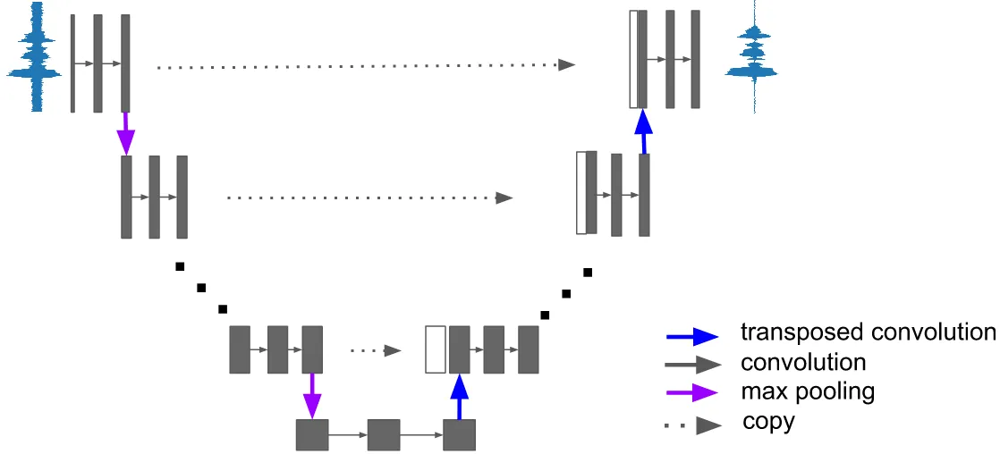
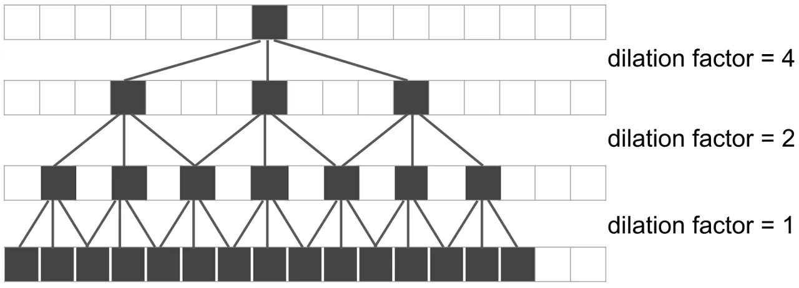
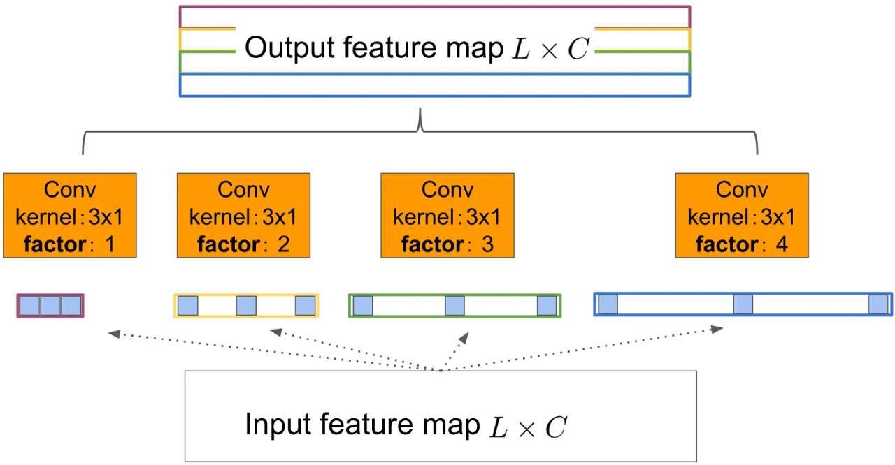
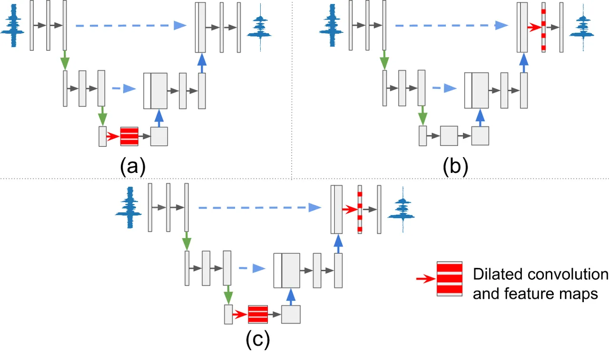
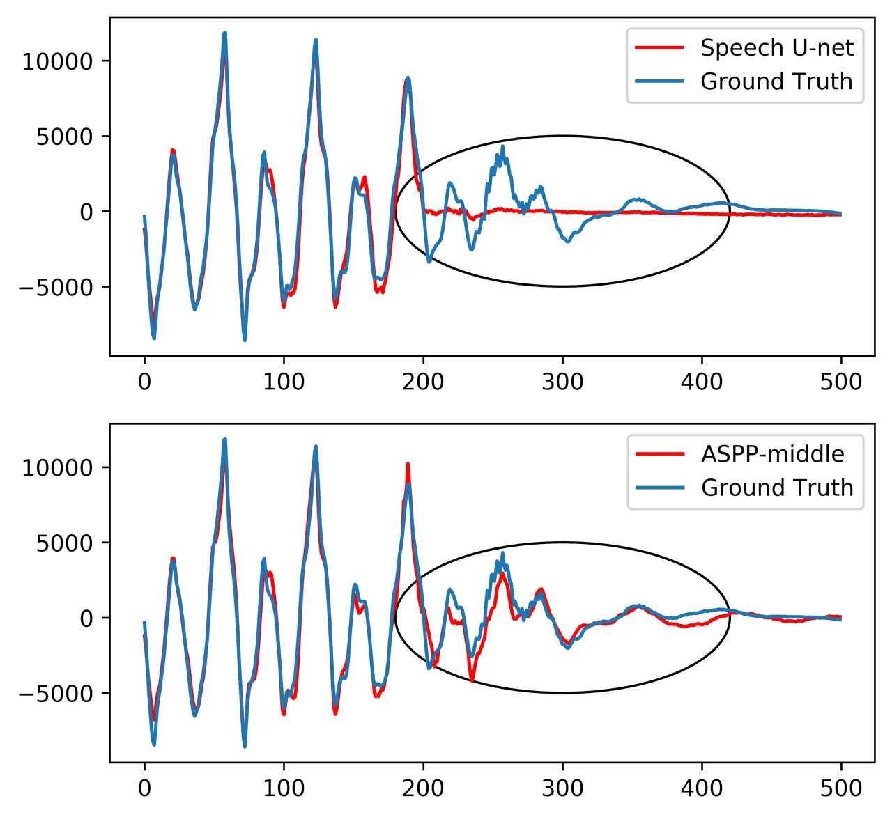

# Dilated FCN: Listening Longer to Hear Better

###### Abstract

Deep neural network solutions have emerged as a new and powerful
paradigm for speech enhancement (SE). The capabilities to capture long
context and extract multi-scale patterns are crucial to design effective
SE networks. Such capabilities, however, are often in conflict with the
goal of maintaining compact networks to ensure good system
generalization.

In this paper, we explore dilation operations and apply them to fully
convolutional networks (FCNs) to address this issue. Dilations equip the
networks with greatly expanded receptive fields, without increasing the
number of parameters. Different strategies to fuse multi-scale
dilations, as well as to install the dilation modules are explored in
this work. Using Noisy VCTK and AzBio sentences datasets, we demonstrate
that the proposed dilation models significantly improve over the
baseline FCN and outperform the state-of-the-art SE solutions.

| Shuyu Gong¹, Zhewei Wang¹, Tao Sun¹, Yuanhang Zhang¹, Charles D. Smith², Li Xu³, Jundong Liu¹ |
| --------------------------------------------------------------------------------------------- |
| ¹ School of EECS, Ohio University, Athens OH 45701                                            |
| ² Department of Neurology, University of Kentucky, Lexington KY 40506                         |
| ³ Department of Communication Disorders, Ohio University, Athens OH 45701                     |

Index Terms—  Speech enhancement, Fully convolutional network (FCN),
Dilation

## 1 Introduction

Enhancement of audio signals in noisy environments plays an important
role in many speech-related applications, such as speech recognition,
hearing aids, and cochlear implants. Traditional speech enhancement (SE)
techniques commonly operate on the spectral domain and rely on certain
high-level features to identify target audio patterns for noise
reduction. Spectral subtraction, spectral amplitude fitting, Wiener
filtering, and non-negative matrix factorization are among the
operations that have been extensively studied.

In recent years, deep neural network-based models (DNNs) have emerged as
a new and more powerful paradigm for many artificial intelligence (AI)
related applications, including speech enhancement. Unlike traditional
machine learning approaches, where certain hand-crafted features (such
as fundamental frequency, formants, MFCC, etc.) need to be defined and
extracted, DNN models carry out feature extraction in an automatic,
data-driven fashion, greatly simplifying the system design. DNN models
also facilitate a common platform for the solutions across different
application areas, including computer vision and speech signal
processing, to be effectively shared. Up to date, the DNN models that
have been explored for speech enhancement include autoencoder (AE)
\[1\], restricted Boltzmann machine (RBM) \[2, 3, 4\], multilayer
perceptron (MLP) \[5\], convolutional neural networks (CNN) \[6\],
recurrent neural networks (RNN) \[7\], generative adversarial network
(GAN) \[8\], and fully convolutional networks (FCN) \[9, 10\], among
others.

Many of the existing SE networks operate on certain time-frequency (T-F)
representation of audio signals, generated through short-time Fourier
transform (STFT) on fixed-length frames. T-F representations bring great
convenience to directly target on the frequency components of the audio
signals. The transformations from the waveform inputs to T-F
representations and back to the waveform outputs, however, impose a
structural constraint to the networks, which complicates the system
design and makes it difficult to predict the network performance.

FCNs on waveform provide a handy and powerful alternative. FCN models
were originally developed as image segmentation solutions \[11, 12, 13,
14\] and have since been successfully adopted for image modality
conversion, super-resolution and speech signal denoising \[9, 10\]. The
fundamental goal of FCNs is to find mappings, with certain desired
property, between paired signal sources; therefore they are well-suited
to extracting clean waveforms out of noisy inputs \[9, 10\]. The success
of FCNs, in great part, is due to their capability of processing input
data from multiple spatial or temporal scales. Further improvements over
the existing FCNs can be pushed forward by ensuring the models to
capture longer contextual information and/or to enhance multi-scale
processing. The former (longer context) can be easily achieved through
the utilization of larger filters, while making the network deeper
provides a solution for the latter. However, a simple combination of
these two strategies will lead to a significantly increased number of
parameters, which would potentially result in limited system
generalization and poor performance in handling diverse noise
conditions.

In this paper, we address this challenge by exploring dilated
convolution operation and applying it to FCNs. Dilated convolution was
originally developed for image segmentation, and its effectiveness to
the task has been demonstrated in a number of works \[15, 16\]. We
propose to adopt this operation to improve SE FCNs, by allowing the
networks to capture longer contexts, a.k.a., “listen longer”, as well as
to extract more diverse, multi-scale audio features. These features are
then combined through a pyramid pooling strategy. We also explore
different network locations to embed the new operations. All the
improvements are made without incorporating additional layers or
parameters. Using Noisy VCTK \[17, 18\] and AzBio sentences \[19\]
datasets, we are able to demonstrate our proposed dilated FCNs
outperform the state-of-the-art solutions.

## 2 Method

Our goal is to develop an FCN addition to advance the state-of-the-art
of speech enhancement. The design is based the consideration of allowing
the networks to listen longer without an increase of the number of
parameters. Our efforts are focused on the explorations of 1) dilation
convolutions to enlarge the receptive fields of neurons; 2) atrous
spatial pyramid pooling (ASPP) module to fuse the multi-scale feature
maps; and 3) different network locations in the baseline FCN to embed
the ASPP modules.

### 2.1 Baseline FCN model

Our baseline FCN model is adopted and modified from U-Net \[12\], which
was originally designed for segmentation of cell images. U-Net has an
encoder-decoder architecture: in the encoding path, input images are
processed through a number of convolution + pooling layers to generate
high-level latent features, which are then progressively upsampled along
the decoding path to reconstruct the target pixel labels.



Figure 1: Network structure of our Speech-U-Net. Picture is best viewed
in color.

To fit our data and task, we modified the original U-Net as follows.
First, as the inputs and outputs of our model are one-dimensional
waveforms, we replace all the two-dimensional convolution operations in
U-Net with one-dimensional convolutions. We keep the original U-Net
structure of two convolution layers followed by one pooling/upsampling
layer. The network is made deeper to enhance its capability to capture
the features in more scales. The encoding path of our modified U-Net now
has 6 convolution-pooling blocks of totally 18 layers. We also use
padding in convolution/deconvolution layers to maintain the spatial
dimension so that the skip connections can directly concatenate encoding
layers with the corresponding decoding layers. The $`L_{1}`$ distance
between network predictions (noise-reduced speech) and the ground-truth
(clean speech) is used as the objective function. We term our baseline
model Speech-U-Net, whose structure is shown in Fig. 1.

### 2.2 Dilation module

Noisy speech signals tend to contain components with diverse frequency
profiles. To capture them through convolutions, filters of varying sizes
would be required. Small filters work well in catching high-frequency
noise, but not so effectively for low-frequency sounds. Large filters
perform in an opposite way, keen to extract low-frequency components but
not high-frequency noise.

The receptive field (RF) at each layer decides the length of the audio
signal a neuron can hear. In convolution-based neural networks,
including FCNs, the RFs are increased along layers through both pooling
and convolutions. Let $`R_{k}`$ be the RF of neurons on layer $`l_{k}`$,
and it can be computed as:

```math
R_{k}=R_{k-1}+((f_{k}-1)\times\prod_{i=1}^{k-1}s_{i}) \tag{1}
```

where $`f_{i}`$ and $`s_{i}`$ are the sizes and strides of the filters
on layer $`l_{i}`$, respectively. It should be noted that a max pooling
of $`n\times 1`$, from the RF perspective, has the same effect of
convolutions of stride equal to $`n`$, and the standard convolutions
(stride equal to 1) increase the RFs in a linear fashion.

The neurons at the final layers of a network may have RFs that have been
enlarged multiple times (e.g., $`2^{5}=32`$ after 5 max pooling
operations). However, due to the high sampling rates of audio signals,
the feature maps in speech-enhancement FCNs tend to catch speech
segments with short durations. In our baseline model, which has 5
pooling layers and filters of size 30 at each convolution layer, each
neuron at the last layer of the encoding path covers 3686 sample points
from the input, which is a 0.23 second sound clip sampled at the rate of
$`16,000`$ per second (only $`0.077`$ second for the rate of $`48,000`$
per second), quite insufficient to grasp all types of audio patterns. To
gain long enough contextual information, one can simply add more pooling
layers to makes the network deeper, but that would inevitably lead to a
more complicated system with an increased number of parameters, as well
as longer training and inference times.



Figure 2: Illustration of dilated convolutions, where the dilation
factors are 1, 2 and 4, respectively. Refer to text for details.

Dilated Convolution Dilated convolutions, supporting exponentially
expanding RFs without the loss of resolution or coverage, can provide a
remedy. Also, such expansion can be achieved without the need to
increase the number of parameters. The basic idea of dilation is to
space out the elements to be summed in convolution by a dilation factor,
as illustrated in Fig. 2. The convolutions in the bottom layer are
regular $`3\times 1`$ convolutions. The middle layer has a dilation
factor of 2, so the effective RF at each neuron covers 7 audio samples.
The top layer convolutions are dilated by 4, producing a $`15\times 1`$
RF/coverage. In general, the receptive filed $`R_{k}`$ of a neuron on a
dilated convolution layer $`l_{k}`$ is enlarged to:

```math
R_{k}=R_{k-1}+((f_{k}-1)\times d_{k}\times\prod_{i=1}^{k-1}s_{i}) \tag{2}
```

where $`d_{i}`$ is the dilation factor of layer $`l_{i}`$. Comparing
with the standard version, dilated convolutions increase RFs without
introducing more parameters. In addition, dilated convolutions produce
exponentially expanding RFs with depth, which is in contrast to linear
expansion produced by standard convolutions.

Fusion of multiscale dilations through ASPP Dilated convolutions allow
us to listen longer. To extract audio patterns with great varieties,
however, multiple dilation factors should be involved. Fig. 3 shows an
example of applying dilation convolutions with 4 different factors. How
to integrate the extracted features is a practical issue. In this work,
we adopt a strategy similar to the Atrous Spatial Pyramid Pooling (ASPP)
scheme proposed in DeepLab \[16\]. More specifically, we conduct
dilation convolutions of 4 different factors in parallel and concatenate
the resulted feature maps into outputs. These 4 filters are called a
dilation group. Within each group, the filters have the same number of
parameters (3 in the example of Fig. 3), but cover different signal
ranges because of the varying filter lengths. For an input feature map
of dimension $`L\times C`$, where $`L`$ is the size of the map and $`C`$
is the number of channels, we set the number of the dilation groups to
$`C/4`$, to ensure the output feature maps to maintain the dimension of
$`L\times C`$. Comparing with directly utilizing $`C`$ filters in the
standard fashion, our dilated setup does not increase the number of
parameters, but enables the network to capture longer signals with
varying lengths.



Figure 3: Illustration of fusion of multiscale dilation through ASPP.
Refer to text for more details.

It should be noted that dilation has been utilized in a very recent work
by Tan et al. \[7\] in a CNN+RNN model. To the best of our knowledge,
our work is the first attempt to explore dilated convolution to improve
FCN models for speech enhancement.

### 2.3 Locations to add the dilation module

To exert the power of dilations + ASPP, the next step is to integrate
the proposed dilation module into our baseline FCN model. To set up a
proper ASPP installation, we run into two practical issues. The first
question is regarding how to set the dilation factors. Our answer is
based on the fact that the audio patterns to be captured in this work
are mainly human phonetic symbols, whose lengths and frequencies tend to
concentrate around certain ranges. It is necessary to have dilations of
different ratios, but the coverages do not have to be dramatically
diverging in scale. With this observation, we choose a relatively slow
growing sequence, 1, 2, 3 and 4, as the dilation factors of our ASPP
convolutions

The second question is where to install the ASPP replacement. While ASPP
can be installed anywhere in the network, we hope our dilated
convolutions filters, even with limited number of parameters, can cover
relatively long signal spans. In this regard, the end of the encoding
path would be an ideal place to add ASPP, as the neurons on this layer
have the largest RFs in the entire network. The further enlarged RFs by
ASPP would provide a best realization of our goal of “listening longer”.
This setup is illustrate in Fig. 4.(a).

An alternative place to explore the ASPP replacement could be around the
end of the decoding path, which consists of two convolution layers, as
shown in Fig. 4(b). Replacing the first of the two layers with an ASPP
would potentially allow the network to decompose the features into
different scales, before they will be finally merged to face the
ground-truth. Adding ASPP here would provide a (last) chance for the
network to correct the integration from previous layers. With the
analysis of these two choices, very naturally, another setup worth
exploring would be the combination of the both. In our experiments, all
three ASPP replacement schemes, as illustrated in Fig. 4, are examined.



Figure 4: Three ASPP replacement schemes: a) adding ASPP in the middle
layer of the network; b) adding ASPP around the end of the decoding
path; c) combination of a) and b).

## 3 Experiments and Results

Data sets To evaluate the effectiveness of the proposed dilation + ASPP
for speech enhancement, we conduct experiments on two groups of
datasets. The first experiment is based on the Noisy VCTK dataset by
Valentini et al. \[17, 18\], which consists of two training sets (28 and
56 speakers respectively) and a test set. We choose the 28-speaker set,
in which 14 males and 14 females were recorded with around 400 sentences
for each person. Noise of 10 different types, either synthetic or real,
have been added to the clean speech with 4 signal-to-noise (SNR) levels
(15 dB, 10 dB, 5 dB and 0 dB, respectively). Totally there are 11,571
sentences in the training set. The test dataset contains 824 sentences
from two new speakers (one male and one female). Five types of noise,
which are different from the 10 types in the training set, have been
added. The SNR values for test set are 17.5 dB, 12.5 dB, 7.5 dB and 2.5
dB, respectively. All audio clips are sampled at 48kHz, with each time
point represented as a 24-bit integer.

The second experiment was based on AzBio English sentences that were
developed by Spahr et al. \[19\]. The dataset consisted of 33 lists with
20 sentences in each list. The sentences ranged from 3 to 12 words
(median = 7) in length. All speech sentences were spoken by 2 male and 2
female adult speakers, sampled at 22,050 Hz \[19\]. Two types of masking
noise were added to the sentences to achieve the desired SNRs (3 dB and
6 dB): speech-spectrum-shaped noise (SSN) and two talker babble (TTB).

Preprocessing In both experiments, we apply a preprocessing step to
downsample all audio clips to 16kHz, and scale their amplitudes to
\[0,1\]. The training set are then split randomly into training,
validation and test sets with the ratio of 8:1:1. Each audio sentence is
cut into multiple clips of 1 second long, which are taken as the inputs
to the network. We extract the clips with a half second overlap as an
approach of data augmentation. End-of-sentence clips, if short than 0.5
second, are discarded and not included as training samples.

Evaluation metrics Four evaluation metrics are used in this work. They
are signal-to-noise ratio (SNR), segmental signal-to-noise ratio (SSNR),
perceptual evaluation of speech quality (PESQ) and short-time objective
intelligibility measure (STOI). SSNR calculates the average SNRs of
short segments (15 to 20 ms long). PESQ evaluate the speech quality
using the wide-band version recommended in ITU-T P.862.2 \[20\]. STOI
\[21\] produces indicators for the average intelligibility of the
degraded speech.

### 3.1 Results

Totally four models are evaluated in our experiments with the Noisy VCTK
dataset. They are the baseline model Speech-U-Net, and three dilation
models with the ASPP replacements at the middle of Speech-U-Net (bottom
layer), end of the network and both locations, respectively. The
evaluations were conducted on two test sets: the first one is the
held-out set, which is the $`10\%`$ of the training set; the other is
the official test available in the dataset.

|                 |                 |        |        |       |       |
| --------------- | --------------- | ------ | ------ | ----- | ----- |
| Dataset         | Model           | SNR    | SSNR   | PESQ  | STOI  |
|   Held-out Test | Input           | 6.040  | -0.092 | 1.467 | 0.838 |
|                 | Speech-U-Net    | 14.504 | 7.159  | 1.849 | 0.857 |
|                 | ASPP-middle     | 15.042 | 7.718  | 1.882 | 0.859 |
|                 | ASPP-end        | 14.389 | 7.181  | 1.827 | 0.873 |
|                 | ASPP-middle+end | 14.92  | 7.665  | 1.788 | 0.877 |
|   Official Test | Input           | 8.544  | 1.878  | 1.982 | 0.922 |
|                 | Speech-U-Net    | 17.454 | 7.955  | 2.338 | 0.900 |
|                 | ASPP-middle     | 18.418 | 8.862  | 2.361 | 0.902 |
|                 | ASPP-end        | 17.001 | 8.470  | 2.262 | 0.930 |
|                 | ASPP-middle+end | 17.529 | 6.521  | 2.152 | 0.928 |
|   Official Test | SEGAN           |        | 7.73   | 2.16  |       |

Table 1: Experimental results on Noisy VCTK dataset

The results are shown in Table 1. It is evident that the baseline
Speech-U-Net already performs rather impressively, achieving an average
enhancing performance of 9 dB. Among the three dilation models, ASPP
replacement at the middle (ASPP-middle) produces the best results,
significantly outperforming all other competing solution in SNR and
SSNR. ASPP-end model does not help, performing even worse than the
baseline model in SNR and SSNR. The combination of at-middle and at-end,
unsurprisingly, has performance in-between of the two installations.
Comparing the results on the held-out and official test sets, the
improvements made by ASPP-middle are more significant for the latter
(official test set). Considering that the official test data are
acquired from new speakers with different SNRs, therefore have different
data distributions than the training set, the comparison indicates that
the ASPP-middle is more robust and has a better generalization
capability than the baseline model. Such desired properties should be
attributed to the enhanced multi-scale processing brought by the
dilation operations. In other words, “listening longer” does make the
network hear better. Fig. 5 shows the comparison of ASPP-middle with
Speech-U-Net on a particular audio segment. Ground-truth waveforms are
shown in blue, and red lines are the predictions. For the highlighted
audio segment in the waveform pictures, Speech-U-Net makes rather flat
predictions, failing to capture the fluctuations. Our ASPP-middle, on
the other handle, makes accurate predictions for the entire segment.

For PESQ and STOI, none of the three ASPP models produces improvements
over the baseline. This can be in part explained by the choice of the
objective function in our models. The network updates in our models are
driven to minimize the $`L_{1}`$ difference between predictions and
ground-truth, which is highly related to SNR/SSNR, but does not directly
involve perception and intelligibility components. To replace the
$`L_{1}`$ distance with a STOI-based objective \[10\], our models are
expected to produce improved performance measured by PESQ and/or STOI.

It should be noted that our ASPP-middle model also has a higher average
SSNR value than the reported number from SEGAN \[8\], a state-of-the-art
speech enhancement solution. While we do not intend to make a
head-to-head quantitative comparison, as different experiment setups are
used in the studies, the significant improvements in SSNR can
nevertheless be regarded as a side evidence of the effectiveness of our
ASPP-middle model. In addition, our ASPP-middle network, working as a
generator, can be connected with a discriminator to make a full GAN
model for further improvements.



Figure 5: Comparison of Speech-U-Net (top row) and ASPP-middle (bottom
row) on a particular audio clip.

Based on the results and observation from the VCTK experiment, we chose
ASPP-middle as our proposed model. We further evaluate its capability
using the AzBio sentence dataset. Speech-U-Net is still taken as the
baseline model. The comparisons are shown in Table 2. Similar to the
first experiment, ASPP-middle produces larger speech enhancements than
the baseline, measured in SNR and SSNR. In summary, our proposed
ASPP-middle approach consistently improves over the baseline,
demonstrating the benefits of dilation convolutions, as well as the
fusion and installation setups we designed.

| Model        | SNR   | SSNR   | PESQ  | STOI  |
| ------------ | ----- | ------ | ----- | ----- |
|   Input      | 2.697 | -4.204 | 1.062 | 0.816 |
| Speech-U-Net | 9.091 | -1.534 | 1.334 | 0.834 |
| ASPP-middle  | 9.348 | -1.369 | 1.315 | 0.797 |

Table 2: Experimental results of Speech-U-Net and ASPP-middle on AzBio
dataset

## 4 Conclusions

The performance of Speech-U-Net indicates that FCN is a successful
architecture for waveform-based SE. The ASPP module with dilated
convolution expands the RFs of the network when mounted onto a proper
place of FCN. Meanwhile, it does not introduce extra parameters to the
network. These advantages lead to improved achievements in both datasets
we examined. We are currently working to link ASPP modules to develop
FCN + RNN-based \[22, 23\] solutions for short delay and quick response,
as well as to explore the integration with other deep neural networks,
e.g., GAN models.

## References

- \[1\] C. H. Taal, R. C. Hendriks, R. Heusdens, and J. Jensen, “An
  algorithm for intelligibility prediction of time–frequency weighted
  noisy speech,” _IEEE Transactions on Audio, Speech, and Language
  Processing_, vol. 19, no. 7, pp. 2125–2136, 2011.
- \[2\] Y. Wang and D. Wang, “Boosting classification based speech
  separation using temporal dynamics,” in _Thirteenth Annual Conference
  of the International Speech Communication Association_, 2012.
- \[3\] ——, “Cocktail party processing via structured prediction,” in
  _Advances in Neural Information Processing Systems_, 2012, pp.
  224–232.
- \[4\] Y. Xu, J. Du, L.-R. Dai, and C.-H. Lee, “An experimental study
  on speech enhancement based on deep neural networks,” _IEEE Signal
  processing letters_, vol. 21, no. 1, pp. 65–68, 2014.
- \[5\] Y. Wang, A. Narayanan, and D. Wang, “On training targets for
  supervised speech separation,” _IEEE/ACM transactions on audio,
  speech, and language processing_, vol. 22, no. 12, pp.
  1849–1858, 2014.
- \[6\] L. Hui, M. Cai, C. Guo, L. He, W.-Q. Zhang, and J. Liu,
  “Convolutional maxout neural networks for speech separation,” in _2015
  IEEE International Symposium on Signal Processing and Information
  Technology (ISSPIT)_. IEEE, 2015, pp. 24–27.
- \[7\] K. Tan, J. Chen, and D. Wang, “Gated residual networks with
  dilated convolutions for monaural speech enhancement,” _IEEE/ACM
  Transactions on Audio, Speech, and Language Processing_, vol. 27,
  no. 1, pp. 189–198, 2019.
- \[8\] S. Pascual, A. Bonafonte, and J. Serrà, “Segan: Speech
  enhancement generative adversarial network,” _arXiv preprint
  arXiv:1703.09452_, 2017.
- \[9\] S.-W. Fu, Y. Tsao, X. Lu, and H. Kawai, “Raw waveform-based
  speech enhancement by fully convolutional networks,” in _2017
  Asia-Pacific Signal and Information Processing Association Annual
  Summit and Conference (APSIPA ASC)_. IEEE, 2017, pp. 006–012.
- \[10\] S.-W. Fu, T.-W. Wang, Y. Tsao, X. Lu, and H. Kawai, “End-to-end
  waveform utterance enhancement for direct evaluation metrics
  optimization by fully convolutional neural networks,” _IEEE/ACM
  Transactions on Audio, Speech and Language Processing (TASLP)_,
  vol. 26, no. 9, pp. 1570–1584, 2018.
- \[11\] J. Long _et al._, “Fully convolutional networks for semantic
  segmentation,” in _Proceedings of CVPR_, 2015, pp. 3431–3440.
- \[12\] O. Ronneberger, P. Fischer, and T. Brox, “U-net: Convolutional
  networks for biomedical image segmentation,” in _MICCAI_. Springer,
  2015, pp. 234–241.
- \[13\] Y. Chen, B. Shi, Z. Wang, P. Zhang, C. D. Smith, and J. Liu,
  “Hippocampus segmentation through multi-view ensemble convnets,” in
  _2017 IEEE 14th International Symposium on Biomedical Imaging (ISBI 2017)_. IEEE, 2017, pp. 192–196.
- \[14\] Z. Wang, C. D. Smith, and J. Liu, “Ensemble of multi-sized fcns
  to improve white matter lesion segmentation,” in _Machine Learning in
  Medical Imaging (MLMI 2018), Proceedings_, 2018, pp. 223–232.
- \[15\] F. Yu and V. Koltun, “Multi-scale context aggregation by
  dilated convolutions,” in _International Conference on Learning
  Representations_, 2016.
- \[16\] L.-C. Chen, G. Papandreou, I. Kokkinos, K. Murphy, and A. L.
  Yuille, “Deeplab: Semantic image segmentation with deep convolutional
  nets, atrous convolution, and fully connected crfs,” _IEEE
  transactions on pattern analysis and machine intelligence_, vol. 40,
  no. 4, pp. 834–848, 2018.
- \[17\] C. Valentini-Botinhao, X. Wang, S. Takaki, and J. Yamagishi,
  “Investigating rnn-based speech enhancement methods for noise-robust
  text-to-speech.” in _SSW_, 2016, pp. 146–152.
- \[18\] C. Valentini-Botinhao _et al._, “Noisy speech database for
  training speech enhancement algorithms and tts models,” _University of
  Edinburgh. School of Informatics. Centre for Speech Technology
  Research (CSTR)_, 2017.
- \[19\] A. J. Spahr, M. F. Dorman, L. M. Litvak, S. Van Wie, R. H.
  Gifford, P. C. Loizou, L. M. Loiselle, T. Oakes, and S. Cook,
  “Development and validation of the azbio sentence lists,” _Ear and
  hearing_, vol. 33, no. 1, p. 112, 2012.
- \[20\] I. Rec, “P. 862.2: Wideband extension to recommendation p. 862
  for the assessment of wideband telephone networks and speech codecs,”
  _International Telecommunication Union, CH–Geneva_, 2005.
- \[21\] C. H. Taal, R. C. Hendriks, R. Heusdens, and J. Jensen, “A
  short-time objective intelligibility measure for time-frequency
  weighted noisy speech,” in _2010 IEEE International Conference on
  Acoustics, Speech and Signal Processing_. IEEE, 2010, pp. 4214–4217.
- \[22\] Y. Chen, B. Shi, Z. Wang, T. Sun, C. D. Smith, and J. Liu,
  “Accurate and consistent hippocampus segmentation through
  convolutional lstm and view ensemble,” in _International Workshop on
  Machine Learning in Medical Imaging_. Springer, 2017, pp. 88–96.
- \[23\] Z. Wang, W. Cai, C. D. Smith, N. Kantake, T. J. Rosol, and
  J. Liu, “Residual pyramid fcn for robust follicle segmentation,” in
  _2019 IEEE 16th International Symposium on Biomedical Imaging (ISBI 2019)_. IEEE, 2019, pp. 463–467.
