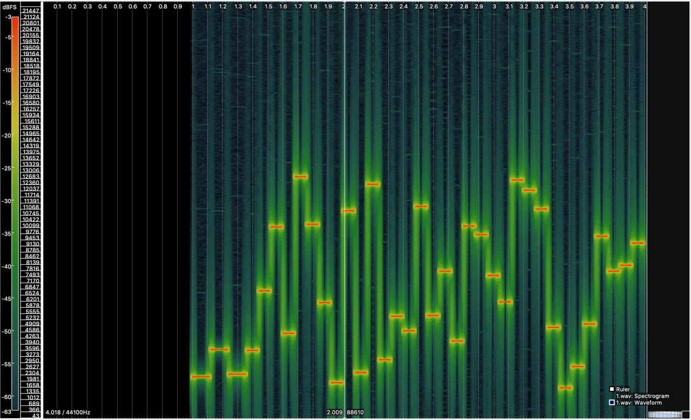
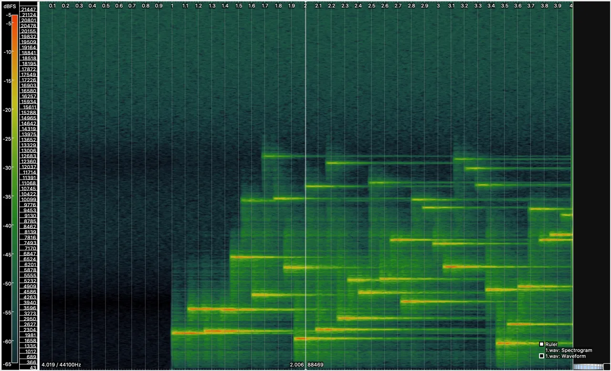
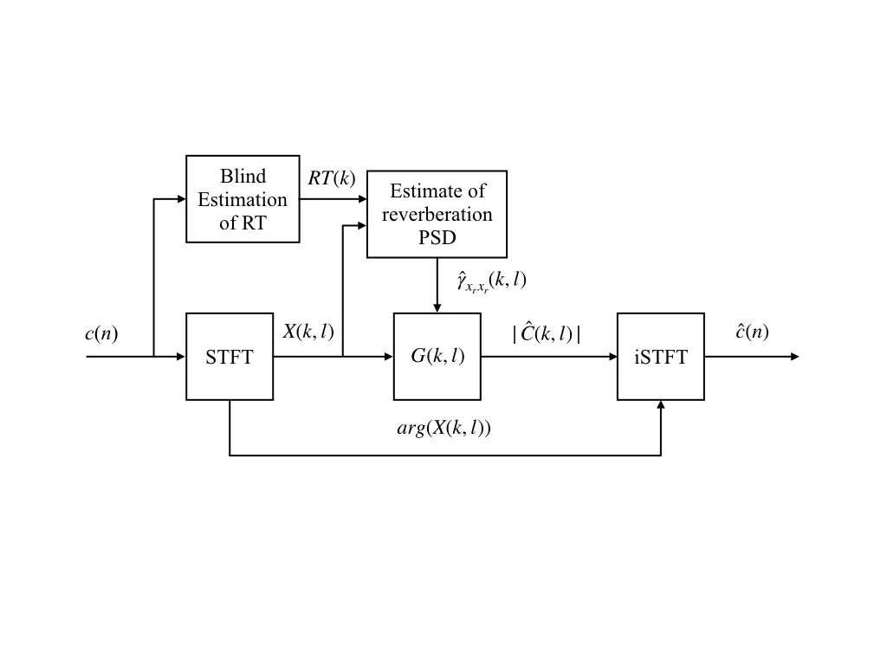
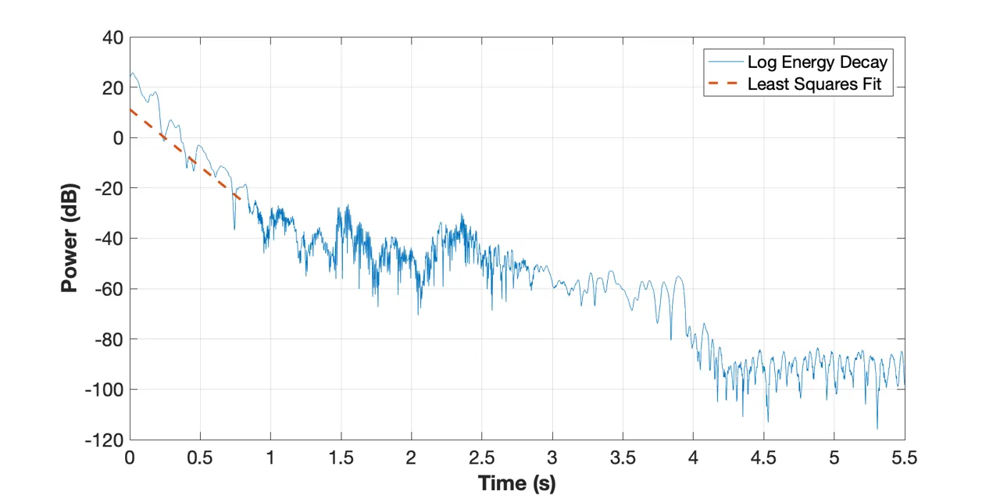
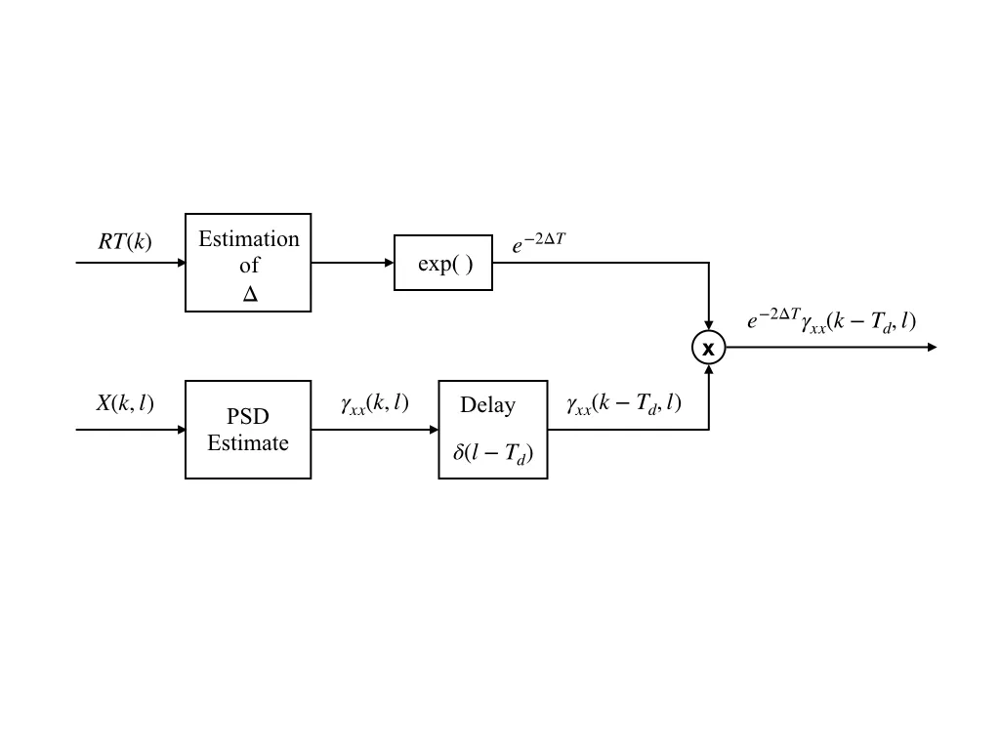
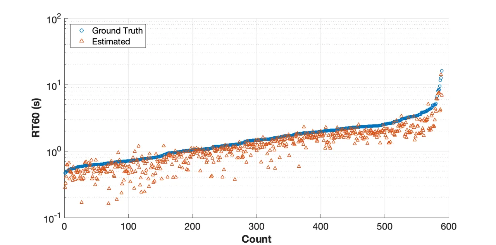
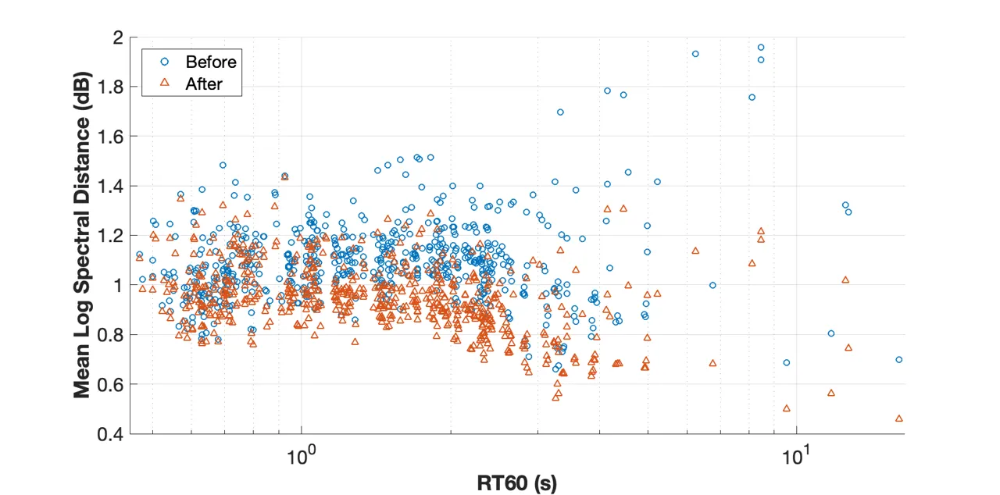
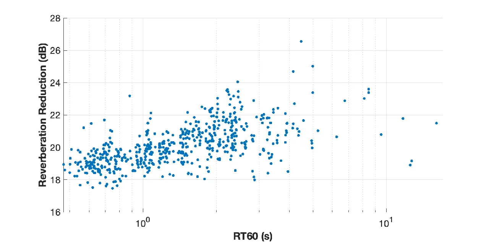

# Estimating & Mitigating the Impact of Acoustic Environments on Machine-to-Machine Signalling

Amogh Matt Affiliation: Machine Listening Lab, Centre for Digital
Music  
Queen Mary University of London  
London, England  
amogh.matt@gmail.com    Dan Stowell Affiliation: Machine Listening Lab,
Centre for Digital Music  
Queen Mary University of London  
London, England  
dan.stowell@qmul.ac.uk

###### Abstract

The advance of technology for transmitting Data-over-Sound in various
IoT and telecommunication applications has led to the concept of
machine-to-machine over-the-air acoustic signalling. Reverberation can
have a detrimental effect on such machine-to-machine signals while
decoding. Various methods have been studied to combat the effects of
reverberation in speech and audio signals, but it is not clear how well
they generalise to other sound types. We look at extending these models
to facilitate machine-to-machine acoustic signalling. This research
investigates dereverberation techniques to shortlist a single-channel
reverberation suppression method through a pilot test. In order to apply
the chosen dereverberation method a novel method of estimating acoustic
parameters governing reverberation is proposed. The performance of the
final algorithm is evaluated on quality metrics as well as the
performance of a real machine-to-machine decoder. We demonstrate a
dramatic reduction in error rate for both audible and ultrasonic
signals.

## I Introduction

Digital signal processing (DSP) techniques have led to systems that
allow us to use an audio signal as a medium to transfer data among
devices. There is a continuous growing demand for transmitting
Data-over-Sound for various IoT and telecommunication applications
\[1\]\[2\]\[3\]\[4\]\[5\]. Signals radiated across a room are often
corrupted by reverberation. Reverberation is the the dominant acoustic
characteristic of a space. The effect of reverberation depends on the
physical structure of the room and the objects present in it. At the
listener’s end, along with the clean signal the superpositions of many
delayed and attenuated copies of the clean signal are heard due to
multiple reflections from the surroundings. These corruptions degrade
the intelligibility of the audio signal. Multiple studies have been
carried out on the effect of reverberation on speech signals for
applications such as Automatic Speech Recognition \[6\]\[7\]\[8\]. There
exists a wide range of non-speech digital audio signals being used as a
carrier medium, for which it is desirable to remove these reverberant
parts to enhance the detection \[9\]. However, machine-machine (M2M)
signals can be very different from speech, and the decoding requirements
are also quite different. It is therefore important to investigate DSP
techniques to suppress the distortions caused by an acoustic environment
on such data carrying machine-to-machine acoustic signals. In this
research, we extend the work done on existing speech dereverberation
models to machine-to-machine acoustic signals.

## II Machine-to-Machine Signals

For the purpose of this research we focus on an M2M audio codec
developed by Chirp, a London based Data-over-Sound communication
company. Chirp (not to be confused with the conventional signal
processing term: chirp (sweep) tone) enables devices to share data among
them via sound. The transfer of data is done via a dynamically generated
monophonic/polyphonic audio signal referred to as a packet.
Frequency-shift-keying (FSK), a popular DSP modulation technique, is
used to encode the data. The encoded data can then be broadcast by a
speaker and received by a microphone. The decoding of the packet is done
via demodulation. A Chirp signal (comprised of packets) is designed to
be robust over distances of several metres, in noisy, everyday
environments.



Fig. 1: Spectrogram of an anechoic Chirp signal.

A single packet comprises of preamble tones, a payload length tone, the
payload tones and error correction tones. Figure 1 shows the spectrogram
of a Chirp packet with labels indicating these components. The sequence
of frequencies corresponding to each category is dynamically determined
by the data being transmitted. The preamble tones are fixed for all the
packets utilising a particular Chirp protocol. The audible protocol
generates a Chirp signal within the 1.7kHz to 10.5kHz band and the
inaudible protocol utilises the ultrasonic frequency band (18-20 kHz).
Each symbol byte of data is then converted into a monophonic tone with a
mapped frequency using FSK. Chirp packets employ Reed-Solomon (RS) error
correction algorithm. The RS encoder takes in the payload as input and
adds extra redundant bits. The decoder processes the body (payload + RS
codes) and attempts to correct the errors and erasures and recover the
original data.

There are many degradations along the signal path that impair the
ability of the decoder to decipher the transmission. These include
background noise, distortions, reverberation etc. The effect of
reverberation on a Chirp signal is to cause it to sound distant and
spectrally modified. This reduces the intelligibility of a Chirp signal
\[10\]. Figure 2 is a spectrogram illustrating the change in the Chirp
signal when convolved with the impulse response of a room impulse
response (RIR) having $`RT_{60}`$ of 1.2 seconds. Looking at the
spectrogram, we notice the presence of reverberation tails for each
note. It is evident that the energy decay of preceding tones interferes
with the subsequent one, leading to a strong risk of mis-detections.
Hence there is a need for a dereverberation algorithm that functions
across many different environments.



Fig. 2: Spectrogram of a reverberant Chirp signal.

## III Proposed dereverberation algorithm

The target applications for the proposed algorithm are often
single-channel audio, which means existing popular multichannel
dereverberation techniques cannot be used. Also, as we do not have any
prior knowledge of the RIR we cannot perform reverberation cancellation.
Hence, we focus on the dereverberation techniques that suppress the late
reflections. A popular single channel reverberation suppression
algorithm is spectral subtraction \[11\]. Figure 3 shows an overview of
the spectral subtraction algorithm. The main goal of this
dereverberation method is to find an appropriate gain function. The gain
function is tuned to minimise the error between the source signal and
the reverberant signal. This is done by estimating the power spectral
densities (PSD) of the reverberant signal.



Fig. 3: Schematic overview of the algorithm.

In general, there are 3 main stages of the algorithm. The first
estimates the RT of the reverberated Chirp signal, the second stage
computes the reverberant PSD. This is used to obtain the real valued
gain function G(k,l). In the last stage, the gain is multiplied with the
reverberant input to obtain the dereverberated output short-time
spectrum C(k,l). An inverse short-time Fourier transformation
synthesises the dereverberated signal.

### III-A Joint estimation of EDC and RT60

Polack models the RIR statistically as an exponentially decaying white
Gaussian noise which is based on the reverberation time $`RT_{60}`$
\[12\]. The energy decay of the RIR is given by (1).

```math
EDC(t)=\int_{\tau=t}^{\infty}h^{2}(\tau)d\tau \tag{1}
```

Since the parameters of this model are frequency independent, we can
extend this model of (1) into STFT discrete time and assume that the
decaying model is valid in each frequency bin. For frequency bin k this
results in

```math
EDC_{k}(t)=\int_{\tau=t}^{T}h_{k}^{2}(\tau)d\tau \tag{2}
```

Where $`h_{k}^{2}(t`$) is the energy envelope of frequency bin $`k`$.
Figure 4 shows the log-energy envelope of a subband of a reverberant
Chirp signal obtained through STFT. It is observed that after the
initial burst of energy (corresponding to the Chirp tone) the energy
decays in correlation with its RIR.

A peak picking algorithm is used to obtain the time of the energy peak
of the subband. The peak corresponds to the attack portion of the Chirp
tone envelope. The start of the EDC is offset from the peak by a
constant value as an estimated time of the end of the Chirp tone. Most
subbands decay to the noise floor and limit the dynamic range to less
than 60 dB. To account for this, the decay rate is estimated by a linear
least-squares regression of the measured decay curve from a level 5 dB
below the initial level to 35 dB. The linear least-square regression is
performed over the cumulative sum of the normalised energy envelope
values corresponding to -5 dB and -35 dB. Figure 4 also shows the fit of
the regression over the log-energy envelope of the subband. The value of
$`RT_{60,k}`$ is obtained by the x-intercept corresponding to 60 dB.



Fig. 4: Least-squares regression fit over the log-energy decay.

Subbands are thresholded before processing to ignore bands which do not
contain any meaningful information. The overall $`RT_{60}`$ is
calculated by averaging the nonzero $`RT_{60,k}`$ estimates

```math
RT_{60}=\sum_{k=1}^{K}\frac{RT_{60,k}}{K}\forall RT_{60,k}\neq 0 \tag{3}
```

### III-B Estimating the Reverberation PSD

A component view of the ’Estimate of Reverberation PSD block’ (from
Figure 3) is shown in Figure 5. The reverberant portion of the source
signal is estimated from the previous frames using the short-term power
spectrum of reverberated source. Due to the convolution of the RIR with
the Chirp signal, the reverberant Chirp signal exhibit the exponential
decaying envelope found in the RIR. The Chirp signals are stationary
over periods of time that are short compared to the $`RT_{60}`$. If
$`T_{c}`$ be the period where the Chirp signal is stationary. The
short-term power spectral densities are given as the auto-correlation at
time l by

```math
\gamma_{xx}(k,l)=\gamma_{x_{r}x_{r}}(k,l)+\gamma_{x_{d}x_{d}}(k,l) \tag{4}
```



Fig. 5: Schematic overview of the Reverberation PSD Estimation.

where $`x_{d}(t)`$ and $`x_{r}(t)`$ are the result from the convolution
of the Chirp signal $`c(t)`$ with the early (direct) part $`h_{d}(t)`$
and late reflection part $`h_{r}(t)`$ of the RIR. The short-term PSD of
the late reverberant signal from (4) is estimated using a delayed and
attenuated version of the short-term PSD.

```math
\gamma_{x_{r}x_{r}}(k,l)=e^{-2\Delta T}\gamma_{xx}(k,l-T) \tag{5}
```

where, $`Tc\leq T\ll RT_{60}`$

For our scenario, 80ms was found to be the best resulting value of T and
the reverberation estimate starts at frame $`l-T`$. This estimated
reverberation PSD is then subtracted from the reverberated Chirp signal
to suppress the reverb tail.

```math
|C(k,l)|=X(k,l)-\gamma{x_{r}x_{r}}^{\frac{1}{2}}(k,l) \tag{6}
```

### III-C Spectral Gain Function

A common feature of the spectral subtraction technique is that the
reverberation suppression process given in (6) can be estimated to be a
short-time spectral attenuation factor. In this last block, a real
valued spectral attenuation (gain) factor $`G(k,l)`$ is calculated to
suppress the reverberant portions of the Chirp signal $`X(k,l)`$.

```math
|C(k,l)|=|X(k,l)|G(k,l) \tag{7}
```

The short-term spectral attenuation factor according to \[11\] is given
by

```math
G(k,l)=1-\frac{1}{\sqrt{SNR_{post}(k,l)}} \tag{8}
```

Where, $`SNR_{post}(k,l)`$ is the A-posteriori Signal to Noise Ratio
which is calculated by

```math
SNR_{post}(k,l)=\frac{|X(k,l)|^{2}}{\gamma_{x_{r}x_{r}}(k,l)} \tag{9}
```

This fails for scenarios where the estimated reverberant noise amplitude
is greater than the instantaneous amplitude of the reverberant Chirp
spectrum $`|X(k,l)|`$. Such scenarios lead to a negative estimate for
the amplitude of the clean Chirp spectrum $`|C(k,l)|`$. For these bins,
a half-wave rectification is performed and the gain function $`G(k,l)`$
is set to 0. This rectification however leads to a residual noise
problem, which is alleviated by performing the following modifications.

#### III-C1 Averaging the instantaneous SNR during the calculation of the gain.

The instantaneous SNR is defined by

```math
SNR_{inst}(k,l)=SNR_{post}(k,l)-1 \tag{10}
```

The averaged SNR is an estimate of the a priori SNR which is calculated
using a moving average of $`SNR_{inst}`$. This reduces the random
variations introduced by late reverberation.

```math
\displaystyle SNR_{prio}(k,l)=\beta SNR_{prio}(k,l-1) \tag{11}
```

```math
\displaystyle+(1-\beta)H(SNR_{inst}(k,l))
```

Where $`H()`$ denotes the half-wave rectification and $`\beta`$ is set
to 0.9.

#### III-C2 Modifying the half-wave rectification to lead to a non-zero threshold rather than nullifying it.

```math
G(k,l)=\begin{cases}1-\frac{1}{\sqrt{SNR_{post}(k,l)}},&\text{if $|C(k,l)|\geq\lambda|X(k,l)|$}.\\
\lambda,&\text{otherwise}.\end{cases} \tag{12}
```

Where $`\lambda`$ is chosen as 0.1.

## IV EVALUATION

### IV-A Evaluation of RT Estimation

The $`RT_{60}`$ estimation algorithm was tested on audible Chirp signals
convolved with the 590 RIRs from AcouSP Database\[13\]. These consisted
of RIRs with $`RT_{60}`$ ranging from 0.4s to 16s. Figure 6 shows a
graph of the known $`RT_{60}`$ versus the estimated $`RT_{60}`$ values
obtained using this approach. We find overall that the estimates have a
mean error of 0.34s and a mean absolute error of 0.38s.

For real-world scenarios (RT $`<`$ 2s) the mean error is 0.11s and mean
absolute error is 0.19s. We use this estimate of RT in the first block
of the spectral subtraction based dereverberation method.



Fig. 6: Actual vs estimated reverberation time.

### IV-B Evaluation of Dereverberation Algorithm

#### IV-B1 Log Spectral Distortion

To evaluate the efficiency of the algorithm, the log spectral distortion
(LSD) also known as log spectral distance, has been one of the most
straightforward and longstanding speech distortion measures \[10\]. LSD
is the root mean square (RMS) of the difference of the log spectra of
the original clean Chirp signal $`c(n)`$ and the signal $`x(n)`$ which
is the output of the dereveberation model. The LSD is calculated for
each time frame on the STFT signals $`C(k,l)`$ and $`X(k,l)`$ with $`l`$
denoting the time frame and $`k`$ denoting the frequency. The LSD is
given by

```math
LSD(l)=(\frac{2}{K}\sum_{k=0}^{\frac{K}{2}-1}|\Gamma\{X(k,l)\}-\Gamma\{S(k,l)\}|^{2})^{\frac{1}{2}}\ \mathrm{dB} \tag{13}
```

where $`\Gamma\{X(k,l)\}=max\{20log_{10}(|X(k,l|),\delta\}`$ is the log
spectrum confined to 50 dB dynamic range, and
$`\delta=max_{l,k}{20log_{10}(|X(k,l|)}-50`$ and likewise for
$`\Gamma\{S(k,l)\}`$ \[11\]. The mean LSD is obtained by averaging (13)
over all the frames containing Chirps.

#### IV-B2 Reverberation Reduction

Reverberation reduction (RR) is another metric that is used to evaluate
the quality of the reverberation model \[11\]. RR is the ratio of the
sum of the log power on subbands without Chirp tones between the
reverberant Chirp signal $`c_{r}(n)`$ and the resulting Chirp signal
output from the dereverberation model x(n). The RR is calculated for
each subband on the STFT signals $`C_{r}(k,l)`$ and $`X(k,l)`$ with
$`l`$ denoting the time frame and $`k`$ denoting the frequency band. The
RR is given by

```math
RR(k)=10log_{10}(\frac{\sum_{t=silence}|Cr(k,l)|^{2}}{\sum_{t=silence}|X(k,l)|^{2}})\ \mathrm{dB} \tag{14}
```

The mean RR is obtained by averaging (14) over all the subbands. The
subbands with silence were determined by thresholding.

#### IV-B3 Evaluation based on the Chirp Decoder

One hundred audible and another 100 inaudible (ultrasonic) Chirp signals
with random packets are generated using the Chirp python SDK. Each of
these Chirp signals are convolved with the 590 RIRs from AcouSP database
\[13\], resulting in 59000 audible and 59000 inaudible (ultrasonic)
Chirp signals. The 118000 reverberant Chirp signals are decoded to
obtain the base decoder performance. Next the spectral subtraction
algorithm with the parameter estimation implemented in Matlab is applied
on the 118000 Chirp signals. The 118000 dereverbed Chirp signals are
then passed to the Chirp python SDK to decode.

#### IV-B4 Comparison with popular Single Channel Reverberation Suppression Algorithms

Two Chirp signals (1 audible and 1 inaudible) with a single packet were
each convolved with the 590 RIRs, yielding 1180 (590 audible and 590
inaudible) reverberant Chirp signals. Due to constraints in
computational complexity Spectral subtraction, LP residual cepstrum and
the Source Enhancement algorithms (available as spendred.m in the Matlab
Voicebox Toolbox) were chosen for comparison. Each of the
dereverberation methods were programmed on Matlab and applied on these
reverberant Chirp signals, the resulting waveforms were then decoded
using the Chirp decoder.

## V RESULTS

#### V-1 Technical Quality Metrics

An STFT with a 46ms Hann window with 93.75% overlap is used for
calculating LSD and RR. 59000 audible Chirp signals (100 for each IR)
are used for the evaluation tests. The mean log spectral distances of
the reverberant Chirp signals and the dereverbed Chirp signals from the
anechoic Chirp signals averaged over each RIR are shown in Figure 7.



Fig. 7: Mean log spectral distance.

It is found that for each RIR, the dereverbed Chirp (shown in red) has a
lower LSD than its reverberant counterpart (shown in blue). This
signifies that the Chirp signal after dereverberation is closer to the
raw Chirp signal than its reverberant counterpart. Figure 8 shows the
reverberation reduction in dB for the 590 RIRs between the reverberant
Chirp signals and the dereverbed output. A positive correlation is
noticed between the RR and the $`RT_{60}`$. As the RIRs with increasing
$`RT_{60}`$ values have more reverberant parts, an increase in the
reverberation portion is noticed.



Fig. 8: Reverberation Reduction for RIRs with increasing RT.

#### V-2 Evaluation based on the Chirp Decoder

Table I shows the overall results of the dereverberation algorithm. The
dereverberation method results in a  25 percentage points increase in
the decode rate of audible Chirp signals and  6 percentage points
increase in inaudible Chirp signals. In the audible results, it is found
that for low $`RT_{60}`$($`<`$0.6s) there is a short decrease in the
decode rate and an increase in the decode rate for other
$`RT_{60}`$values. For inaudible results, the percentage point increase
in result is quite small as the decode rates are significantly high over
all. This is expected as the effect of reverberation in the ultrasonic
frequency range is comparably less as to that of the audible spectrum
\[9\].

#### V-3 Comparison with popular Single Channel Reverberation Suppression Algorithms

Table II shows the performance of the dereverberation algorithms for the
audible and inaudible Chirp signals. It was found that our proposed
spectral subtraction gave by far the best result, and also the fastest
processing time.

| Chirp Signal           | Decode Rate (%) |       |
| ---------------------- | --------------- | ----- |
|                        | Before          | After |
| Audible                | 54.53           | 79.78 |
| Inaudible (Ultrasonic) | 86.15           | 92.11 |

TABLE I: Decode rate of Chirp signals

[TABLE]

TABLE II: Comparison of dereverberation algorithms

## VI CONCLUSIONS

Similar to speech and other digital signals, reverberation is shown to
degrade the intelligibility of the source sounds for decoding of M2M
signals. The main goal of this project was to investigate and propose a
dereverberation model with suitable parameter estimation to suppress
such unwanted influences and therefore increase the decode rate of M2M
signals. A pilot study was performed to validate the accurateness of
simulating an environment and it is found to be a viable option to test
the performance of M2M signals. Since Chirp signals fall in the single
channel signal, the single channel reverberation suppression techniques
were found to be best suited. Spectral subtraction with a novel
parameter estimation algorithm is found to be the best dereverberation
method for M2M signals. Reverberation parameters required for the
dereverberation method are estimated by extending the energy decay
algorithm. The evaluation of the model shows that the estimates of the
reverberation parameters have a mean error of $`\pm 0.11s`$ for the
common real-world environments $`(RT_{60}<2s).`$ The overall result of
the algorithm combining reverberation estimation model and spectral
subtraction show good dereverberation while preserving the packet data.
The improvement in decode rate is found to be  25 percentage points for
audible and  6 percentage points for inaudible Chirp signals.

## VII Acknowledgement

The work of AM was carried out during a placement with
[chirp.io](https://chirp.io). AM thanks Adib Mehrabi for discussions
which informed the work. DS was supported by EPSRC Early Career research
fellowship EP/L020505/1.

## References

- \[1\] A. Madhavapeddy, D. Scott, and R. Sharp, “Context-aware
  computing with sound,” Lecture Notes in Computer Science, vol. 2864,
  12 2003.
- \[2\] J. Fürst, K. Chen, M. Aljarrah, and P. Bonnet, “Leveraging
  physical locality to integrate smart appliances in non-residential
  buildings with ultrasound and bluetooth low energy,” IEEE First
  International Conference on Internet-of-Things Design and
  Implementation (IoTDI), 04 2016.
- \[3\] R. Nandakumar, K. K. Chintalapudi, V. Padmanabhan, and
  R. Venkatesan, “Dhwani: Secure peer-to-peer acoustic nfc,” in
  Proceedings of the ACM SIGCOMM 2013 Conference on SIGCOMM, SIGCOMM
  ’13, (New York, NY, USA), pp. 63–74, ACM, 2013.
- \[4\] J. Pearson, S. Robinson, M. Jones, A. A. Nanavati, and
  N. Rajput, “Acqr: acoustic quick response codes for content sharing on
  low end phones with no internet connectivity,” in Mobile HCI, 2013.
- \[5\] C. S. J. Doire, M. Brookes, P. A. Naylor, C. M. Hicks, D. Betts,
  M. A. Dmour, and S. H. Jensen, “Single-channel online enhancement of
  speech corrupted by reverberation and noise,” IEEE/ACM Transactions on
  Audio, Speech, and Language Processing, vol. 25, pp. 572–587,
  March 2017.
- \[6\] M. Wroblewski, D. E. Lewis, D. L. Valente, and P. G.
  Stelmachowicz, “Effects of reverberation on speech recognition in
  stationary and modulated noise by school-aged children and young
  adults,” Ear Hear, vol. 33, no. 6, pp. 731–744, 2012.
- \[7\] O. Hazrati and P. C. Loizou, “The combined effects of
  reverberation and noise on speech intelligibility by cochlear implant
  listeners,” Int J Audiol, vol. 51, pp. 437–443, Jun 2012.
- \[8\] M. Klatte, T. Lachmann, and M. Meis, “Effects of noise and
  reverberation on speech perception and listening comprehension of
  children and adults in a classroom-like setting,” Noise Health,
  vol. 12, no. 49, pp. 270–282, 2010.
- \[9\] S. Ka, T. Hyun Kim, J. Ha, S. Hong Lim, S. Cheol Shin, J. Choi,
  C. Kwak, and S. Choi, “Near-ultrasound communication for tv’s 2nd
  screen services,” 22nd Annual International Conference, pp. 42–54,
  10 2016.
- \[10\] P. A. Naylor and N. D. Gaubitch, Speech Dereverberation.
  Springer Publishing Company, Incorporated, 1st ed., 2010.
- \[11\] E. Habets, “Single-channel speech dereverberation based on
  spectral subtraction,” Proceedings of the 15th Annual Workshop on
  Circuits, Systems and Signal Processing (ProRISC), 01 2004.
- \[12\] J. D. Polack, La transmission de l’energie sonore dans les
  salles. Ph.D. dissertation, Université du Maine, Le Mans, 1988.
- \[13\] W. Kellermann, S. Makino, P. A. Naylor, and M. Omologo, “The
  acousp recommendation for annotation of acoustic data collections.
  (version 1.0),” 2010. \[On-line\].
  Available:www.commsp.ee.ic.ac.uk/ acousp Accessed: 02-07-2018.
