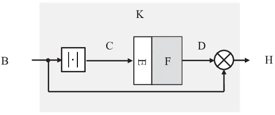
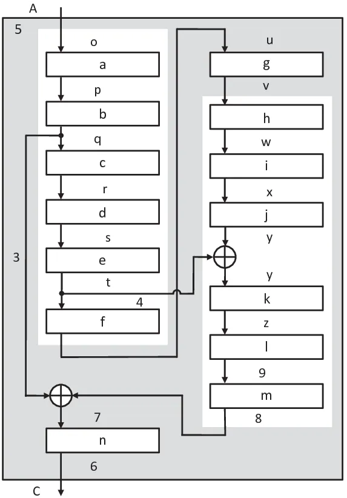
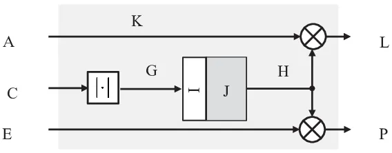
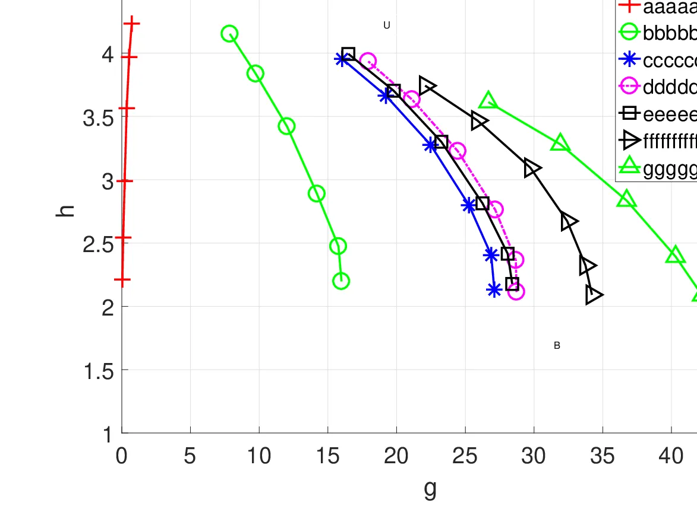
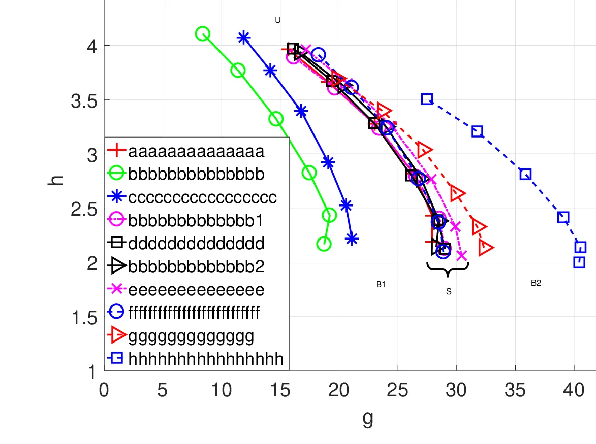
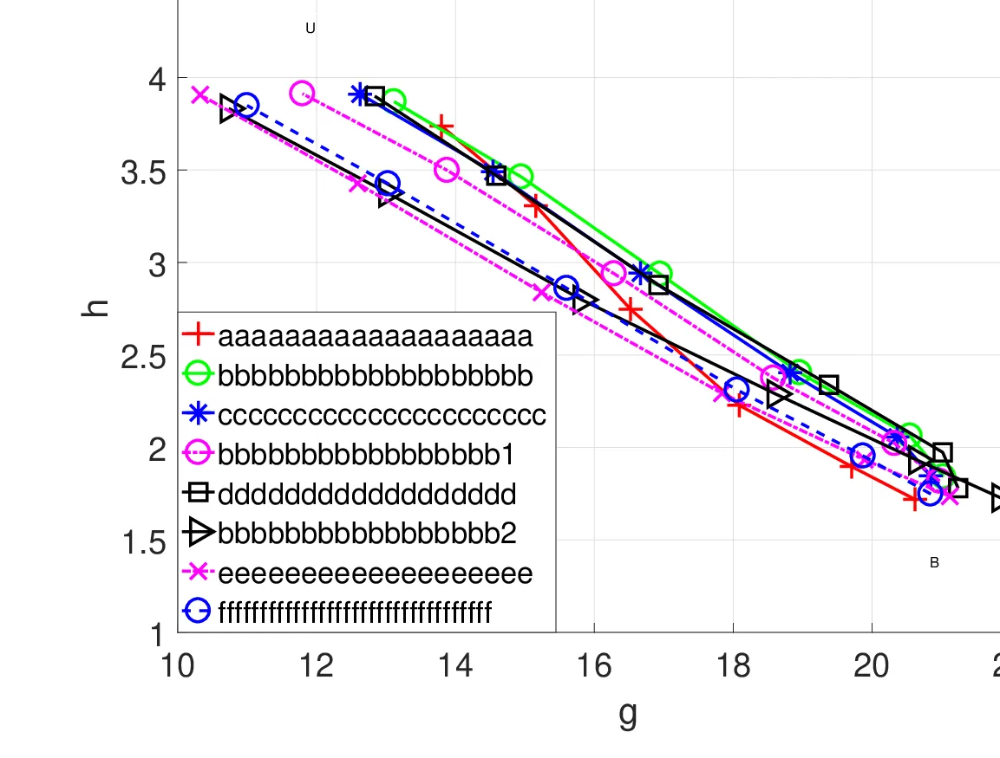

# Components Loss for Neural Networks in Mask-Based Speech Enhancement

Ziyi Xu    Samy Elshamy    Ziyue Zhao    Tim Fingscheidt ^(†)^(†)thanks:
Z. Xu, S. Elshamy, Z. Zhao, and T. Fingscheidt are with the Institute
for Communications Technology, Technische Universität Braunschweig,
38106 Braunschweig, Germany (e-mails: \${ ziyi.xu, s.elshamy,
ziyue.zhao, t.fingscheidt }\$@tu-bs.de)

###### Abstract

Estimating time-frequency domain masks for single-channel speech
enhancement using deep learning methods has recently become a popular
research field with promising results. In this paper, we propose a novel
components loss (CL) for the training of neural networks for mask-based
speech enhancement. During the training process, the proposed CL offers
separate control over preservation of the speech component quality,
suppression of the residual noise component, and preservation of a
naturally sounding residual noise component. We illustrate the potential
of the proposed CL by evaluating a standard convolutional neural network
(CNN) for mask-based speech enhancement. The new CL obtains a better and
more balanced performance in almost all employed instrumental quality
metrics over the baseline losses, the latter comprising the conventional
mean squared error (MSE) loss and also auditory-related loss functions,
such as the perceptual evaluation of speech quality (PESQ) loss and the
recently proposed perceptual weighting filter loss. Particularly,
applying the CL offers better speech component quality, better overall
enhanced speech perceptual quality, as well as a more naturally sounding
residual noise. On average, an at least 0.1 points higher PESQ score on
the enhanced speech is obtained while also obtaining a higher SNR
improvement by more than 0.5 dB, for seen noise types. This improvement
is stronger for unseen noise types, where an about 0.2 points higher
PESQ score on the enhanced speech is obtained, while also the output SNR
is ahead by more than 0.5 dB. The new proposed CL is easy to implement
and code is provided at
[https://github.com/ifnspaml/Components-Loss](https://github.com/ifnspaml/Components-Loss).

###### Index Terms: 

Mask-based speech enhancement, noise reduction, components loss, CNN.

## I Introduction

Speech enhancement aims at improving the intelligibility and perceived
quality of a speech signal that has been degraded, e.g., by additive
noise. This task becomes very challenging when only a single-channel
microphone mixture signal is available without any knowledge about the
individual components. Single-channel speech enhancement has attracted a
lot of research attention due to its importance in real-world
applications, including telephony, hearing aids devices, and robust
speech recognition. Numerous speech enhancement methods were proposed in
the past decades. The classical method for single-channel speech
enhancement is to estimate a time-frequency (TF) domain mask, or, more
specifically, to calculate a spectral weighting rule \[1, 2, 3, 4, 5\].
To obtain the TF domain coefficients for a spectral weighting rule, the
estimation of the noise power, the a priori signal-to-noise ratio (SNR)
\[1, 6, 7, 8, 9, 10\], and sometimes also the a posteriori SNR is
required. Finally, the spectral weighting rule is applied to obtain the
enhanced speech. Thereby it is still common practice to enhance only the
amplitudes and leave the noisy phase untouched. However, the performance
of these classical methods degrades significantly in low SNR conditions
and also in the presence of non-stationary noise \[11\]. To mitigate
this problem, e.g., a data-driven ideal mask-based approach has been
proposed in \[12, 13\]. Therein, Fingscheidt et al. use a simple
regression for estimating the coefficients of the spectral weighting
rules, which reduces the speech distortion while retaining a high noise
attenuation. Interestingly, as with neural networks, this approach
already allowed the definition of arbitrary loss functions. Note that
Erkelens et al. published briefly afterwards on data-driven speech
enhancement \[14, 15\].

In recent years, deep learning methods have been developed and used for
weighting rule-based (now widely called mask-based) speech enhancement
pushing performance limits even further, also in the presence of
non-stationary noise \[16, 17, 18, 19, 20, 21, 22\]. The powerful
modeling capability of deep learning enables the direct estimation of TF
masks without any intermediate steps. Wang et al. \[16, 23\] illustrate
that the ideal ratio mask-based approach, in general, performs
significantly better than spectral envelope-based methods for supervised
speech enhancement. Williamson et al. \[21\] propose to use a complex
ratio mask which is estimated from the single-channel mixture to enhance
both, the amplitude spectrogram and also the phase of the speech.
Different from other methods that directly estimate the TF mask, an
approach that predicts the clean speech signal while estimating the TF
mask inside the network is proposed in \[17, 18\]. Therein the TF mask
is applied to the noisy speech amplitude spectrum inside the network in
an additional multiplication layer. Thus, the output of the network is
already the enhanced speech spectrum, and not a mask which is instead
learned implicitly. The authors in \[17\] demonstrate that the new
method outperforms the conventional approach, where the TF mask is the
training target and hence learned explicitly. In this paper, we estimate
the mask implicitly by using convolutional neural networks (CNNs).

For the training of deep learning architectures for both, mask-based
\[16, 17, 18, 19, 20, 21\], and regression-based \[24\] speech
enhancement, most networks use the mean squared error (MSE) as a loss
function. The parameters of the deep learning architectures are then
optimized by minimizing the MSE between the inferred results and their
corresponding targets. In reality, optimization of the MSE loss in
training does not guarantee any perceptual quality of the speech
component and of the residual noise component, respectively, which leads
to limited performance \[25, 26, 27, 28, 29, 30, 31, 32, 33, 34\]. This
effect is even more evident when the level of the noise component is
significantly higher than that of the speech component in some regions
of the noisy speech spectrum, which explains the bad performance at
lower SNR conditions when training with MSE. To minimize the global MSE
during training, the network may learn to completely attenuate such TF
regions \[25\], a muting effect that is well-known from error
concealment under bad channel SNR conditions \[35, 36\]. This can lead
to insufficient quality of the speech component and very unnatural
sounding residual noise. To keep more speech component details and to
constrain the speech distortion to an acceptable level, Shivakumar et
al. \[25\] assigned a high penalty against speech component removal in
the conventional MSE loss function during training, which results in an
improvement in speech quality metrics. A perceptually-weighted loss
function that emphasizes important TF regions has recently been proposed
in \[26, 27\], improving speech intelligibility.

A more straightforward direction is to utilize the short-time objective
intelligibility (STOI) \[37\] and the perceptual evaluation of speech
quality (PESQ) \[38\] metrics as a loss function, which could be used to
optimize for speech intelligibility and speech quality, respectively,
during training \[31, 32, 34, 33, 29, 30\]. Using STOI as an
optimization criterion has been studied in \[31, 33, 34\]. Fu et al.
\[34\] proposed a waveform-based utterance enhancement method to
optimize the STOI score. They also show that combining STOI with the
conventional MSE as an optimization criterion can further increase the
speech intelligibility. Using PESQ as an optimization criterion is
proposed and studied in \[33, 29, 30\]. In \[29\], the authors have
amended the MSE loss by integrating parts of the PESQ metric. This
proposed loss achieved a significant gain in speech perceptual quality
compared to the conventional MSE loss. Zhang et al. \[33\] integrated
both STOI and PESQ into the loss function, thereby improving speech
separation performance.

However, both, original STOI and PESQ, are non-differentiable functions
which cannot be used as an optimization criterion for gradient-based
learning directly. A common solution is to use differentiable
approximations for STOI or PESQ instead of the original expressions
\[29, 30, 31, 34\]. Yet, how to find the best approximated expression is
still an open question. In \[33\], the authors propose a gradient
approximation method to estimate the gradients of the original STOI and
PESQ metrics. Still, these perceptual loss functions do not offer the
flexibility of separate control over noise suppression and preservation
of the speech component.

In this paper, we propose a novel so-called components loss (CL) for
deep learning applications in speech enhancement. The newly proposed
components loss is inspired by the merit of separately measuring the
performance of speech enhancement systems on the speech component and
the residual noise component, which is the so-called white-box approach
\[39\], \[40\], \[41\], \[10\]. The white-box approach allows to measure
the performance of mask-based speech enhancement w.r.t. three major
aspects: (1) noise attenuation, (2) naturalness of residual noise, and
(3) distortion of the speech component. Note that such component-wise
quality metrics have also been adopted in ITU-T Rec. P.1100 \[42\],
P.1110 \[43\], and P.1130 \[44\] to evaluate the performance of
hands-free systems. We utilize a CNN structure adapted from \[45\] to
illustrate the new components loss in the context of speech enhancement.
However, the new loss function is not restricted to any specific network
topology or application.

Compared to the use of perceptual losses such as PESQ and STOI \[29,
31\], our proposed components loss (CL) is naturally differentiable for
gradient-based learning. In practice, the new loss function does not
need any additional training material or extensive computational effort
compared to other auditory-related loss functions \[25, 26\], which
makes it very easy to implement and also to integrate into existing
systems. A further merit is that the new CL not only focuses on offering
a strong noise attenuation and a good speech component quality, but also
allows for a more natural residual noise, where the trade-off can be
controlled directly. Note that highly distorted residual noise can be
even more disturbing than the original unattenuated noise signal for
human listeners \[41\]. To the best of our knowledge, such a loss
function has not yet been proposed before.

The rest of the paper is structured as follows: In Section II we
describe the investigated speech enhancement task and introduce our
mathematical notations. The baseline methods used as reference for
evaluation are also introduced in this section. Next, we present our
proposed components loss function for mask-based speech enhancement in
Section III. The experimental setup is provided in Section IV, followed
by the results and discussion in Section V. Our work is concluded in
Section VI.

## II Notations and Baselines

### II-A Notations

We assume an additive single-channel model for the time-domain
microphone mixture $`y(n)=s(n)+d(n)`$ of the clean speech signal
$`s(n)`$ and the added noise signal $`d(n)`$, with $`n`$ being the
discrete-time sample index. Since mask-based speech enhancement
typically operates in the TF domain, we transfer all the signals to the
frequency domain by applying a discrete Fourier transform (DFT).
Therefore, let $`Y_{\ell}(k)=S_{\ell}(k)+D_{\ell}(k)`$ be the respective
DFT, and $`\left|Y_{\ell}(k)\right|`$, $`\left|S_{\ell}(k)\right|`$, and
$`\left|D_{\ell}(k)\right|`$ be their DFT magnitudes, with frame index
$`\ell\in\mathcal{L}=\left\{1,2,\ldots,L\right\}`$ and frequency bin
index $`k\in\mathcal{K}=\left\{0,1,\ldots,K\!-\!1\right\}`$ with $`K`$
being the DFT size. In this paper, we only estimate the real-valued mask
$`M_{\ell}\left(k\right)\in\mathbb{R}`$ to enhance the magnitude
spectrogram of the noisy speech and use the untouched noisy speech phase
for reconstruction, obtaining the predicted enhanced speech spectrum

```math
\hat{S}_{\ell}\left(k\right)=Y_{\ell}(k)\cdot M_{\ell}\left(k\right). \tag{1}
```

It is then transformed back to the time domain signal $`\hat{s}(n)`$
with IFFT followed by overlap add (OLA).

### II-B Baseline Network Topology

As proposed in \[17, 18\], we predict the clean speech signal while
estimating the TF mask inside the network as shown in Fig. 1. The NORM
box in Fig. 1 represents a zero-mean and unit-variance normalization
based on statistics collected on the training set. The CNNs used in this
work have exactly the same structure as in \[45, Fig. 6\] but with
different parameter settings, which will be explained later. This CNN
topology has shown great success in coded speech enhancement \[45\], and
is capable of improving speech intelligibility \[46\]. Although more
complex deep learning architectures could be used, we choose this CNN
structure for simple illustration. Note that any other network topology
could be used instead.



Fig. 1: Schematic of the mask-based CNN for speech spectrum enhancement,
used for both the baseline CNN (baseline losses) and the new CNN
(components loss). Details of the CNN can be seen in Fig. 2.

The input of the CNN is a normalized noisy magnitude spectrogram matrix
$`\mathbf{Y^{\prime}_{\ell}}`$ with the dimensions
$`K_{\rm in}\times L_{\rm in}`$ as shown in Fig. 2, where $`K_{\rm in}`$
represents the number of input and output frequency bins, and
$`L_{\rm in}=5`$ being the number of normalized context frames centered
around the normalized frame $`\ell`$. Due to the conjugate symmetry of
the DFT, it is not necessary to choose $`K_{\rm in}`$ equal to the DFT
size $`K`$.

The convolutional layers are represented by the Conv$`(f,h\times w)`$
operation in Fig. 2. The number of filter kernels is given by
$`f\in\left\{F,2F\right\}`$ and thus automatically defines also the
number of output feature maps which are concatenated horizontally after
each convolutional layer. The dimension of the filter kernel is defined
by $`h\times w`$, where $`h=H`$ is the height and
$`w\in\left\{L_{\rm in},F,2F\right\}`$ is the width. The width of the
kernel is always corresponding to the width of the respective input to
that layer, so that the actual convolution is operating only in vertical
(frequency) direction. In the convolution layers, the stride is set to
1, and zero-padding is implemented to guarantee that the first dimension
of the layer output is the same as that for the layer input. The
maxpooling and upsampling layers have a kernel size of $`(2\times 1)`$.
The stride of the maxpooling layers is set to $`2`$. The number of the
input and output frequency bins $`K_{\rm in}`$ must be compatible with
the two times maxpooling and upsampling operations. All possible forward
residual skip connections are added to the layers with matched
dimensions to ease any vanishing gradient problems during training
\[47\].



Fig. 2: Topology details of the employed CNN in Fig. 1 (adopted from
\[45, Fig. 6\]). The operation Conv$`(f,h\times w)`$ stands for
convolution, with $`F`$ or $`2F`$ representing the number of filter
kernels in each layer, and $`(h\times w)`$ represents the kernel size.
The maxpooling and upsampling layers have a kernel size of
$`(2\times 1)`$. The stride of maxpooling layers is set to $`2`$. The
gray areas contain two symmetric procedures. All possible forward
residual skip connections are added to the layers with matched
dimensions.

### II-C Baseline Losses

Baseline MSE: The conventional approach to train a mask-based CNN for
speech enhancement uses the MSE loss. In the training process, the input
of the network is the normalized noisy magnitude spectrogram matrix
$`\mathbf{Y^{\prime}_{\ell}}`$ as above, and the training target is the
corresponding amplitude spectrum of the clean speech
$`\left|S_{\ell}(k)\right|`$ at frame $`\ell`$, $`k\in\mathcal{K}`$. The
implicitly estimated mask is applied to the noisy speech amplitude
spectrum inside the network as shown in Fig. 1. The MSE loss function
for each frame $`\ell`$ is measured between the clean and the predicted
enhanced speech amplitude spectrum, and is defined as

```math
J_{\ell}^{\text{MSE}}=\sum_{k\in\mathcal{K}}\left(\left|\hat{S}_{\ell}\left(k\right)\right|-\left|S_{\ell}\left(k\right)\right|\right)^{2}. \tag{2}
```

As can be observed, all frequency bins have equal importance without any
perceptual considerations, such as the masking property of the human ear
\[27\], or the loudness difference \[29\]. Furthermore, as the MSE loss
is optimized in a global fashion, the network may learn to completely
attenuate some regions of the noisy spectrum, where the noise component
is significantly higher compared to the speech component. This behavior
can lead to insufficient performance at lower SNR conditions.

Baseline PW-FILT: In order to obtain better perceptual quality of the
enhanced speech, instead of the MSE loss a so-called perceptual
weighting filter loss PW-FILT is used \[27\]. In this loss, the
perceptual weighting filter from code-excited linear prediction (CELP)
speech coding is applied to effectively weight the error between the
network output and the target. This loss has shown superior performance
compared to the MSE loss in speech enhancement \[27\], as well as for
quantized speech reconstruction \[28\]. Some more detail is given in
Appendix A.

Baseline PW-PESQ: Another option is to adapt PESQ \[38\], which is one
of the best-known metrics for speech quality evaluation, to be used as a
loss function. Since PESQ is a complex and non-differentiable function
which cannot be directly used as an optimization criterion for
gradient-based learning, a simplified and differentiable approximation
of the standard PESQ has been derived and used as a loss function in
\[29\]. The proposed PESQ loss is calculated frame-wise from the
loudness spectra of the target and the enhanced speech signals. The two
distortion terms in the PESQ loss, which consider both auditory masking
and threshold effects, are combined with standard MSE to introduce the
perceptual criteria. More details are given in Appendix A.

Baseline PW-STOI: The maximization of STOI \[37\] during training is
also the target in several publications \[29, 30, 31, 32, 33, 34\]. In
\[31\], Kolbcek et al. derive a differentiable approximation of STOI,
which considers the frequency selectivity of the human ear, for the
training of a mask-based speech enhancement DNN. Some more detail is
given in Appendix A.

Interestingly, the authors find that no improvement in STOI can be
obtained by using the proposed loss function (16), compared to the
conventional network trained using the standard MSE loss function
\[31\]. They conclude in their work that “the traditional MSE-based
speech enhancement networks may be close to optimal from an estimated
speech intelligibility perspective” \[31\].

Note that PW-STOI is not calculated frame-wise compared to other
baseline losses, which makes it very difficult to implement in our setup
and to allow a fair comparison. In \[31\], the trained network needs to
estimate 30 frames of enhanced speech at once, which is represented by
$`N`$ in (14) to calculate the PW-STOI loss. To meet this large output
size, the input size can be quite large and unpractical both in our
implementation, but due to latency requirements also in practice. Due to
the above-cited conclusion from \[31\] and the large output size
requirement, we will not implement PW-STOI loss in our setup.

## III New Components Loss Functions for Mask-Based Speech Enhancement

The newly proposed components loss (CL) is inspired by the so-called
white-box approach \[39\], which utilizes the filtered clean speech
spectrum $`\tilde{S}_{\ell}(k)`$ and the filtered noise component
spectrum $`\tilde{D}_{\ell}(k)`$ to train the mask-based CNN for speech
enhancement as shown in Fig. 3. We first motivate the use of the
white-box approach in the following and then introduce the new
components loss.

### III-A White-Box Approach

Since our work is inspired by the so-called white-box approach (\[39\],
see also \[40, 41\]), we introduce the filtered speech spectrum, which
is obtained by

```math
\tilde{S}_{\ell}(k)=S_{\ell}(k)\cdot M_{\ell}\left(k\right), \tag{3}
```

while the filtered noise spectrum is estimated by

```math
\tilde{D}_{\ell}(k)=D_{\ell}(k)\cdot M_{\ell}\left(k\right). \tag{4}
```

The filtered speech component spectrum
$`\tilde{S}_{\ell}\left(k\right)`$ and the filtered noise component
spectrum $`\tilde{D}_{\ell}\left(k\right)`$ are transformed back to the
time domain signals $`\tilde{s}(n)`$ and $`\tilde{d}(n)`$, respectively,
with IFFT followed by overlap add (OLA).

Speech enhancement systems aim to provide a strong noise attenuation, a
naturally sounding residual noise, and an undistorted speech component.
Thus, the evaluation of a speech enhancement algorithm ideally needs to
measure the performance w.r.t. all three aspects. The white-box
approach, which allows to measure the performance based on the filtered
speech component $`\tilde{s}(n)`$ and the filtered residual noise
component $`\tilde{d}(n)`$, has been originally proposed in \[39\]. A
white-box based measure does not employ the enhanced speech signal
$`\hat{s}(n)`$, but only utilizes the filtered and unfiltered components
with the unfiltered ones as a reference \[39, 40, 41\]. Due to its
usefulness, this component-wise white-box measurement has been widely
adopted in ITU-T Recs. P.1100 \[42\], P.1110 \[43\], and P.1130 \[44\]
to evaluate the performance of hands-free systems. One might ask whether
there is a price to pay with component-wise quality evaluation, since
masking effects of human perception are not at all exploited.
Accordingly, we will have to use also perceptual quality metrics in the
evaluation Sections IV and V. Interestingly, supporting the adoption of
components metrics in ITU-T recommendations, our newly proposed
components loss (CL) turns out to be superior both in PESQ and POLQA
(perceptual objective listening quality prediction).

### III-B New Components Loss With 2 Components



Fig. 3: Proposed CNN training setup for speech enhancement according to
the white-box approach. The hereby applied components loss (CL) is given
in (5) and (6).

New 2CL: The core innovative step of this work is as follows: Since we
assume an additive single-channel model, both, the amplitude spectrum of
the clean speech $`\left|S_{\ell}(k)\right|`$, and the additive noise
$`\left|D_{\ell}(k)\right|`$ are accessible during the training phase,
and thus can be used as training targets. First, the filtered components
$`\left|\tilde{S}_{\ell}(k)\right|`$ and
$`\left|\tilde{D}_{\ell}(k)\right|`$ in Fig. 3 are obtained by (3) and
(4), respectively. Then, we define our proposed components loss (CL) for
each frame $`\ell`$ as

```math
J_{\ell}^{\text{2CL}}=(1-\alpha)\cdot\sum_{k\in\mathcal{K}}\left(\left|\tilde{S}_{\ell}\left(k\right)\right|\!-\!\left|S_{\ell}\left(k\right)\right|\right)^{2}+\alpha\cdot\sum_{k\in\mathcal{K}}\left|\tilde{D}_{\ell}\left(k\right)\right|^{2}, \tag{5}
```

with $`\alpha\in\left[0,1\right]`$ being the weighting factor that can
be used to control the trade-off between noise suppression and speech
component quality.

This proposed CL (5) dubbed as “2CL” is the combination of two
independent loss contributions, where the first term represents the loss
function for the filtered clean speech component, and the second term
represents the power of the filtered noise component. Both of the two
losses are calculated frame-wise. Minimizing the first term of the loss
function is supposed to preserve detailed structures of the speech
spectrum, so the perceptual quality of the speech component will be
maintained. Any distortion or attenuation being present in the filtered
speech spectrum will be punished by this loss term. The second term of
2CL representing the residual noise power should also be as low as
possible. Thus, minimizing the second loss term is responsible for the
actual noise attenuation (NA), which is not at all enforced by the first
term.

The first and the second term in (5) are combined by the weighting
factor $`\alpha`$. Compared to conventional training using the standard
MSE loss function as shown in Fig. 1, our newly proposed training with
2CL offers more information to the network to learn which part of the
noisy spectrum belongs to the speech component that should be untouched,
and which part is the added noise that should be attenuated. By tuning
$`\alpha`$ close to $`1`$, 2CL will penalize high residual noise power
stronger than severe speech component distortion. Thus, the trained
network tends to suppress more noise but maybe at the cost of more
speech distortions. When $`\alpha`$ is close to $`0`$, the trained
network will behave conversely, so that it will offer better speech
component quality and may not provide much noise attenuation.
Controlling the trade-off between speech component quality and noise
attenuation is impossible when using the conventional single-target MSE
loss function (2). Note that the enhanced speech $`\hat{S}_{\ell}(k)`$
is not part of the loss anymore, only implicitly, keeping in mind that
$`\hat{S}_{\ell}(k)=\tilde{S}_{\ell}(k)+\tilde{D}_{\ell}(k)`$.

### III-C New Components Loss With 3 Components

New 3CL: For a speech enhancement algorithm, a highly distorted residual
noise can be even more disturbing than the original unattenuated noise
signal for human listeners \[41\]. The conventional networks trained
with MSE tend to have a strong noise distortion because of the TF bin
attenuation behavior as mentioned before. Conversely, the network
trained by the proposed 2CL may have less TF bin attenuation, because
the TF bin attenuation is also harmful to the speech component and will
be penalized by the first term of 2CL. As a consequence, the networks
trained by the proposed 2CL are likely to offer more natural residual
noise, even though the residual noise quality is not considered in (5).

However, to explicitly put the residual noise quality into consideration
during training, we also propose an advanced CL, which is defined as

```math
\displaystyle J_{\ell}^{\text{3CL}} \displaystyle=(1-\alpha-\beta)\cdot\sum_{k\in\mathcal{K}}\left(\left|\tilde{S}_{\ell}\left(k\right)\right|\!-\!\left|S_{\ell}\left(k\right)\right|\right)^{2} \tag{6}
```

```math
\displaystyle+\alpha\cdot\!\sum_{k\in\mathcal{K}}\left|\tilde{D}_{\ell}\left(k\right)\right|^{2}
```

```math
\displaystyle+\beta\cdot\!\sum_{k\in\mathcal{K}}\left(\frac{\left|\tilde{D}_{\ell}(k)\right|}{\sqrt{\sum_{\kappa\in\mathcal{K}}\left|\tilde{D}_{\ell}(\kappa)\right|^{2}}}-\frac{\left|D_{\ell}(k)\right|}{\sqrt{\sum_{\kappa\in\mathcal{K}}\left|D_{\ell}(\kappa)\right|^{2}}}\right)^{2},
```

with $`\alpha\in\left[0,1\right]`$ and $`\beta\in\left[0,1\right]`$
being the weighting factors to control the speech component quality, the
noise suppression, and now also the residual noise quality. In order to
have stable training and not to enlarge (!) the speech component MSE
(first term in (6)) during training, we limit the tuning range of the
weighting factors to $`0\leq\alpha+\beta\leq 1`$. This CL with three
terms (dubbed “3CL”) is also used to train the speech enhancement neural
network as shown in Fig. 3, without requiring any additional training
material compared to when using 2CL.

The first two terms of the 3CL in (6) are the same as in (5), and the
additional third term is the loss between the normalized spectra of the
filtered and the unfiltered noise component, and is supposed to preserve
residual noise quality. In order to decouple noise attenuation and
residual noise quality, firstly, this additional term is not directly
calculated from the filtered and the unfiltered noise spectra, but
utilizing the normalized ones. Secondly, both positive and negative
differences between the filtered and the unfiltered noise spectra are
punished equally, which means this loss should be non-negative. So this
additional term can have the form of the standard MSE, which is shown in
(6). This additional loss aims to preserve the residual noise quality
even more, enforcing a similarity of residual noise and the original
noise component. Note that many alternative definitions of the residual
noise quality loss term are possible, however, it should always be
ensured that a fullband attenuation
($`\tilde{D}_{\ell}\left(k\right)=\rho\cdot D_{\ell}(k),\rho<1`$) should
lead to a zero loss contribution, since it perfectly preserves residual
noise quality.

## IV Experimental Setup

### IV-A Databases and Experimental Setup

#### IV-A1 Database

The used clean speech data in this work is taken from the Grid corpus
\[48\]. The Grid corpus is particularly useful for our experiments,
since it provides clean speech samples from many different speakers in a
sufficient amount of data for our experiments, which is critical for
speaker-independent training. To make our trained CNN
speaker-independent, we randomly select 16 speakers, containing 8 male
and 8 female speakers, and use 200 sentences per speaker for the CNN
training. The superimposed noises used in this paper are obtained from
the CHiME-3 dataset \[49\]. Both the clean speech and the additive noise
signals have a sampling rate of $`16\,\text{kHz}`$. To generalize the
network and also to increase the amount of training data, the noisy
speech always contains multiple SNR conditions and includes various
noise types. We use pedestrian noise (PED), café noise (CAFE), and
street noise (STR) to generate the training data. We simulate six SNR
conditions from $`-5\,\text{dB}`$ to $`20\,\text{dB}`$ with a step size
of $`5\,\text{dB}`$. The SNR level is adjusted according to ITU-T P.56
\[50\]. Thus, the training material consists of
$`16\times 200\times 3\times 6=57,600`$ sentences. From the complete
training material, $`20\%`$ of the data is used for validation and
$`80\%`$ is used for actual training.

During the test phase, the clean speech data is taken from four further
Grid speakers, two male and two female, with 10 sentences each neither
seen during training nor during validation. The used test noise contains
both seen and unseen noise types. The seen test noise includes PED and
CAFE noise, but extracted from different files, which have not been used
during training and validation. To perform a noise type-independent
test, we additionally create noisy test data using unseen bus noise
(BUS), which is also taken from CHiME-3 and is not seen during training
and validation. The test data also contains the six SNR conditions.

#### IV-A2 Experimental Setup

Speech and noise signals are subject to an FFT size of $`K=256`$, using
a periodic Hann window, and $`50\%`$ overlap. We use the CNN illustrated
in Fig. 2 for the mask estimation. Although more complex deep learning
architectures could be used, we choose this CNN structure to illustrate
our concept. The number of the input and output frequency bins
$`K_{\rm in}`$ is set to $`129+3=132`$ for each frame’s DFT, as shown in
Fig. 2. The additional $`3`$ frequency bins are taken from the redundant
bins (from $`k=129`$ to $`k=131`$), which are used to make it compatible
with the two times maxpooling and upsampling operation in the CNN. The
input context is $`L_{\rm in}=5`$. The number of filters in each
convolutional layer represented by $`F`$ in Fig. 2 is set to $`60`$. The
used height of the filter kernels is $`h=H=15`$. In the test phase, we
only extract the first $`129`$ frequency bins from the $`132`$ output
frequency bins to reconstruct the complete spectrum, which is used to
obtain the time domain signal by IFFT with OLA. Furthermore, a minibatch
size of 128 is used during training. The learning rate is initialized to
$`2\cdot 10^{-4}`$ and is halved once the validation loss does not
decrease for two epochs. The CNN activation functions are exactly the
same as used in \[45\].

In the baseline training for the perceptual weighting filter loss
PW-FILT the linear prediction order represented by $`N_{\rm p}`$ in (8)
is set to $`16`$. The perceptual weighting factors $`\gamma_{1}`$ and
$`\gamma_{2}`$ in (8) are set to $`0.92`$ and $`0.6`$, respectively.

### IV-B Quality Measures

We use both the white-box approach \[39\] which provides the filtered
clean speech component $`\tilde{s}(n)`$ and the filtered noise component
$`\tilde{d}(n)`$, as well as standard measures operating on the
predicted enhanced speech signal $`\hat{s}(n)`$. In this paper, we use
the following measures \[10\]:

#### IV-B1 Delta SNR

$`\Delta\text{SNR}=\text{SNR}_{\text{out}}-\text{SNR}_{\text{in}}`$,
measured in dB. $`\text{SNR}_{\text{out}}`$ and
$`\text{SNR}_{\text{in}}`$ are the SNR levels of the enhanced speech and
the noisy input speech, respectively, and are measured after ITU-T P.56
\[50\], based on $`\tilde{s}(n)`$, $`\tilde{d}(n)`$ and $`s(n)`$,
$`d(n)`$, respectively. This measurement should be as high as possible.

#### IV-B2 PESQ MOS-LQO

This measure uses $`s(n)`$ as reference signal and either the filtered
clean speech component $`\tilde{s}(n)`$ or the enhanced speech
$`\hat{s}(n)`$ as test signal according to \[51, 43\], being referred to
as PESQ$`(\tilde{\mathbf{s}})`$ and PESQ$`(\hat{\mathbf{s}})`$,
respectively. A high PESQ score indicates better speech (component)
perceptual quality.

#### IV-B3 Perceptual objective listening quality prediction (POLQA)

This metric is one of the newest objective metrics for speech quality
\[52\]. POLQA is measured between the reference signal $`s(n)`$ and the
predicted clean speech $`\hat{s}(n)`$ according to \[52\], and is
denoted as POLQA$`(\hat{\mathbf{s}})`$. Same as with PESQ, a higher
POLQA score is favored.

#### IV-B4 Segmental speech-to-speech-distortion ratio

```math
\text{SSDR}=\frac{1}{\left|\mathcal{L}_{1}\right|}\sum_{\ell\in\mathcal{L}_{1}}\text{SSDR}(\ell)\qquad[\text{dB}]\vskip-4.2679pt
```

with $`\mathcal{L}_{1}`$ denoting the set of speech-active frames
\[10\], and using
$`\text{SSDR}(\ell)=\max\left\{\min\left\{\text{SSDR}^{\prime}(\ell),30\,\text{dB}\right\},-10\,\text{dB}\right\},\text{with}`$
$`\text{SSDR}^{\prime}\!(\ell)\!=\!10\log_{10}\!\big(\!\big(\sum\limits_{n\in\mathcal{N}_{\ell}}\!s(n)^{2}\big)\!/\!(\sum\limits_{n\in\mathcal{N}_{\ell}}\!\left[\!\tilde{s}(n+\Delta)\!-\!s(n)\right]^{2}\big)\!\big),`$

with $`\mathcal{N}_{\ell}`$ denoting the sample indices $`n`$ in frame
$`\ell`$, and $`\Delta`$ being used to perform time alignment of the
filtered signal $`\tilde{s}(n)`$. A low distortion of the filtered
speech components leads to a high SSDR.

#### IV-B5 Segmental noise attenuation ($`\text{NA}_{\text{seg}}`$)

```math
\text{NA}_{\text{seg}}=10\log_{10}\left[\frac{1}{\left|\mathcal{L}\right|}\sum_{\ell\in\mathcal{L}}\text{NA}_{\text{frame}}(\ell)\right],\qquad[\text{dB}] \tag{7}
```

with

```math
\text{NA}_{\text{frame}}(\ell)=\frac{\begin{matrix}\sum_{n\in\mathcal{N}_{\ell}}d^{2}(n)\end{matrix}}{\begin{matrix}\sum_{n\in\mathcal{N}_{\ell}}\tilde{d}^{2}(n+\Delta)\end{matrix}}.
```

We measure $`\text{NA}_{\text{seg}}`$ for the purpose of parameter
optimization, so we can easily choose the weighting factors that offer a
strong noise attenuation as well as a good speech component perceptual
quality. In the test phase, we use the $`\Delta\text{SNR}`$ metric to
reflect the overall SNR improvement caused by noise suppression instead
of using a single $`\text{NA}_{\text{seg}}`$ metric.

#### IV-B6 The weighted log-average kurtosis ratio (WLAKR)

This metric measures the noise distortion (especially penalizing musical
tones) using $`d(n)`$ as reference signal and the filtered noise
component $`\tilde{d}(n)`$ as test signal according to ITU-T P.1130
\[44\]. A WLAKR score that is closer to zero indicates less noise
distortion \[41, 53\]. Accordingly, in our analysis we will show
averaged absolute WLAKR values.

#### IV-B7 STOI

We use STOI to measure the intelligibility of the enhanced speech, which
has a value between zero and one \[37\]. A STOI score close to one
indicates high intelligibility.

We group these measurements to noise component measures ($`\Delta`$SNR
and WLAKR), speech component measures (SSDR and
PESQ$`(\tilde{\mathbf{s}})`$), and total performance measures
(PESQ$`(\hat{\mathbf{s}})`$, POLQA$`(\hat{\mathbf{s}})`$, and STOI).

## V Results and Discussion

### V-A Hyperparameter Optimization

To allow for an efficient hyperparameter search, we optimize the
weighting factors for our proposed components loss functions by using
only $`12.5\%`$ of the validation set data. The total performance
measures PESQ$`(\hat{\mathbf{s}})`$, POLQA$`(\hat{\mathbf{s}})`$, and
STOI are averaged over all training noise types and all SNR conditions.

#### V-A1 2CL hyperparameter $`\alpha`$

The performance for different weighting factors $`\alpha`$ for 2CL (5)
is shown in Table I. The baseline MSE in Table I represents the
conventional mask-based CNN as shown in Fig. 1 and is trained using the
MSE loss function. It becomes obvious that a choice of $`\alpha`$ in (5)
being far away from $`0.5`$ leads to either bad perceptual speech
quality or low speech intelligibility. This behavior is expected, since
speech enhancement requires a sufficiently strong noise attenuation as
well as an almost untouched speech component. To choose the best
weighting factor $`\alpha`$ from Table I, we first discard all columns
where at least one measure is below or equals the baseline MSE and
subsequently select from the remaining values
$`\alpha\in\left\{0.45,0.5,0.55\right\}`$ the best performing, which is
$`\alpha=0.5`$. The selected setting is grey-shaded as shown in Table I.

In Fig. 4, we plot the obtained $`\text{NA}_{\text{seg}}`$ vs.
PESQ$`(\tilde{\mathbf{s}})`$ values for the various combinations of
hyperparameters as shown in Table I. Here, from top to bottom, each
marker depicts a certain SNR condition varying from $`20\,\text{dB}`$ to
$`-5\,\text{dB}`$ in steps of $`5\,\text{dB}`$. The further a curve is
to the right and to the top, the better the overall performance. We can
see that the performance for the selected hyperparameter $`\alpha=0.5`$
(dot-dashed pink line, circle markers) is a quite balanced choice.

|                             |          |                                       |      |      |      |      |      |      |      |
| --------------------------- | -------- | ------------------------------------- | ---- | ---- | ---- | ---- | ---- | ---- | ---- |
|                             | Baseline | New $`J_{\ell}^{\text{2CL}}(\alpha)`$ |      |      |      |      |      |      |      |
|                             | MSE      | $`\alpha=`$                           | 0    | 0.1  | 0.45 | 0.5  | 0.55 | 0.75 | 0.9  |
| PESQ$`(\hat{\mathbf{s}})`$  | 2.21     |                                       | 1.78 | 2.10 | 2.48 | 2.50 | 2.41 | 2.60 | 2.59 |
| POLQA$`(\hat{\mathbf{s}})`$ | 1.91     |                                       | 2.11 | 1.86 | 2.21 | 2.23 | 2.22 | 2.39 | 2.26 |
| STOI                        | 0.72     |                                       | 0.72 | 0.74 | 0.73 | 0.73 | 0.73 | 0.70 | 0.68 |

TABLE I: Optimization of hyperparameter $`\alpha`$ for the new 2CL (5)
on $`\mathbf{12.5\%}`$ of the validation set. The selected setting is
grey-shaded.



Fig. 4: Noise attenuation $`(\text{NA}_{\text{seg}})`$ vs. speech
component quality $`(\text{PESQ}(\tilde{\mathbf{s}}))`$ for different
parameters $`\alpha`$ for the new 2CL (5) on $`\mathbf{12.5\%}`$ of the
validation set. From top to bottom, the markers are corresponding to six
SNR conditions from $`20\,\text{dB}`$ to $`-5\,\text{dB}`$ with a step
size of $`5\,\text{dB}`$. The selected setting $`\alpha=0.5`$ is
grey-shaded in the legend.

#### V-A2 3CL hyperparameters $`\alpha`$, $`\beta`$

We also optimize the combination of the weighting factors $`\alpha`$ and
$`\beta`$ for 3CL in (6) as shown in Table II. The baseline MSE in
Table II is the same as the one in Table I. Interestingly, a good
performance is achieved mostly¹¹ 1 Note that the case of $`\alpha=0.6`$
and $`\beta=0.2`$ is also quite good on PESQ and POLQA, but performs
poorly on STOI. when the weighting factors for speech component quality
$`(1\!-\!\alpha\!-\!\beta)`$ and noise attenuation $`(\alpha)`$ are
equal or very close to each other — as is the case for our 2CL choice of
$`\alpha=0.5`$ in Table I. This is the case for 3CL when
$`\alpha\in\left\{0.05,0.1,0.15,0.2,0.3,0.4\right\}`$ and the
corresponding (in that order)
$`\beta\in\left\{0.9,0.8,0.7,0.6,0.4,0.2\right\}`$, as shown in Table II
marked by $`\bm{*}`$. Thus, tuning the weighting factors for speech
component quality and noise attenuation in an unbalanced way will
degrade the overall performance, especially for STOI or PESQ as shown in
Table II. As the best combination in Table II we select $`\alpha=0.1`$
and $`\beta=0.8`$, highlighted by a grey-shaded font. The additional
term of 3CL (6), weighted with $`\beta`$, is supposed to preserve the
residual noise quality. It can further improve the overall performance
of PESQ and POLQA as can be seen when comparing the grey-shaded columns
of Tables I and II. The reason could be that PESQ and POLQA measures
favor natural residual noise.

|                             |          |                                             |                                       |      |      |                                      |                                       |                                      |                                      |                                      |      |      |
| --------------------------- | -------- | ------------------------------------------- | ------------------------------------- | ---- | ---- | ------------------------------------ | ------------------------------------- | ------------------------------------ | ------------------------------------ | ------------------------------------ | ---- | ---- |
|                             | Baseline | New $`J_{\ell}^{\text{3CL}}(\alpha,\beta)`$ |                                       |      |      |                                      |                                       |                                      |                                      |                                      |      |      |
|                             | MSE      | $`\alpha=`$                                 | $`0.05^{{\color[rgb]{0,1,0}\bm{*}}}`$ | 0.1  | 0.1  | $`0.1^{{\color[rgb]{0,1,0}\bm{*}}}`$ | $`0.15^{{\color[rgb]{0,1,0}\bm{*}}}`$ | $`0.2^{{\color[rgb]{0,1,0}\bm{*}}}`$ | $`0.3^{{\color[rgb]{0,1,0}\bm{*}}}`$ | $`0.4^{{\color[rgb]{0,1,0}\bm{*}}}`$ | 0.6  | 0.8  |
|                             |          | $`\beta=`$                                  | $`0.9^{{\color[rgb]{0,1,0}\bm{*}}}`$  | 0.4  | 0.6  | $`0.8^{{\color[rgb]{0,1,0}\bm{*}}}`$ | $`0.7^{{\color[rgb]{0,1,0}\bm{*}}}`$  | $`0.6^{{\color[rgb]{0,1,0}\bm{*}}}`$ | $`0.4^{{\color[rgb]{0,1,0}\bm{*}}}`$ | $`0.2^{{\color[rgb]{0,1,0}\bm{*}}}`$ | 0.2  | 0.1  |
| PESQ$`(\hat{\mathbf{s}})`$  | 2.21     |                                             | 2.47                                  | 2.19 | 2.24 | 2.54                                 | 2.50                                  | 2.49                                 | 2.47                                 | 2.51                                 | 2.59 | 2.60 |
| POLQA$`(\hat{\mathbf{s}})`$ | 1.91     |                                             | 2.25                                  | 1.88 | 1.97 | 2.28                                 | 2.23                                  | 2.23                                 | 2.20                                 | 2.26                                 | 2.34 | 2.24 |
| STOI                        | 0.72     |                                             | 0.73                                  | 0.74 | 0.74 | 0.73                                 | 0.73                                  | 0.73                                 | 0.73                                 | 0.73                                 | 0.71 | 0.68 |

TABLE II: Optimization of hyperparameters $`\alpha`$ and $`\beta`$ for
the new 3CL (6) on $`\mathbf{12.5\%}`$ of the validation set. The
selected setting is grey-shaded.



Fig. 5: Noise attenuation $`(\text{NA}_{\text{seg}})`$ vs. speech
component quality $`(\text{PESQ}(\tilde{\mathbf{s}}))`$ for different
parameters $`\alpha`$ and $`\beta`$ for the new 3CL (6) on
$`\mathbf{12.5\%}`$ of the validation set. From top to bottom, the
markers are corresponding to six SNR conditions from $`20\,\text{dB}`$
to $`-5\,\text{dB}`$ with a step size of $`5\,\text{dB}`$. The selected
setting is grey-shaded in the legend. All curves marked by $`\bm{*}`$
fulfill $`\alpha=1\!-\!\alpha\!-\!\beta`$, meaning that the noise
attenuation and the speech distortion contribute equally to the 3CL loss
(6).

For the combinations of hyperparameters in Table II, we also plot
$`\text{NA}_{\text{seg}}`$ vs. PESQ$`(\tilde{\mathbf{s}})`$ as shown in
Fig. 5. All curves marked by $`\bm{*}`$ fulfill
$`\alpha=1\!-\!\alpha\!-\!\beta`$, meaning that the noise attenuation
and the speech distortion contribute equally to the 3CL loss (6).
Obviously, these curves show a comparably good speech component quality
as well as a strong noise attenuation at the same time. The overall
difference between these curves are very small, which is also reflected
in Table II. In Fig. 5, the curve for $`\alpha=0.8`$ and $`\beta=0.1`$
shows very strong noise attenuation, but with quite low
PESQ$`(\tilde{\mathbf{s}})`$. This is expected since the contribution of
the noise attenuation in 3CL loss (6), which is controlled by
$`\alpha`$, is the strongest from the investigated values. On the
contrary, when $`\alpha=0.1`$ and the corresponding
$`\beta\in\left\{0.4,0.6\right\}`$, we obtain the highest
PESQ$`(\tilde{\mathbf{s}})`$ and the weakest noise attenuation. Our
selected hyperparameter combination (dot-dashed pink line, circle
markers) is among the curves marked by $`\bm{*}`$ showing quite balanced
performance.

#### V-A3 PW-PESQ hyperparameters $`\lambda_{1}`$, $`\lambda_{2}`$

|                             |          |                                                                 |      |      |      |      |      |      |      |      |
| --------------------------- | -------- | --------------------------------------------------------------- | ---- | ---- | ---- | ---- | ---- | ---- | ---- | ---- |
|                             | Baseline | Baseline $`J_{\ell}^{\text{PW-PESQ}}(\lambda_{1},\lambda_{2})`$ |      |      |      |      |      |      |      |      |
|                             | MSE      | $`\lambda_{1}=`$                                                | 0.01 | 0.1  | 0.2  | 0.4  | 0.5  | 0.6  | 0.8  | 0.9  |
|                             |          | $`\lambda_{2}=`$                                                | 0.99 | 0.9  | 0.8  | 0.6  | 0.5  | 0.4  | 0.2  | 0.1  |
| PESQ$`(\hat{\mathbf{s}})`$  | 2.21     |                                                                 | 2.22 | 2.22 | 2.23 | 2.18 | 2.18 | 2.15 | 2.12 | 2.21 |
| POLQA$`(\hat{\mathbf{s}})`$ | 1.91     |                                                                 | 1.90 | 1.87 | 1.89 | 1.84 | 1.87 | 1.81 | 1.84 | 1.85 |
| STOI                        | 0.72     |                                                                 | 0.71 | 0.72 | 0.72 | 0.73 | 0.73 | 0.72 | 0.72 | 0.72 |

TABLE III: Optimization of hyperparameters $`\lambda_{1}`$ and
$`\lambda_{2}`$ for baseline PW-PESQ (12) on $`\mathbf{12.5\%}`$ of the
validation set. The selected setting is grey-shaded.



Fig. 6: Noise attenuation $`(\text{NA}_{\text{seg}})`$ vs. speech
component quality $`(\text{PESQ}(\tilde{\mathbf{s}}))`$ for different
parameters $`\lambda_{1}`$ and $`\lambda_{2}`$ for the baseline PW-PESQ
(12) on $`\mathbf{12.5\%}`$ of the validation set. From top to bottom,
the markers are corresponding to six SNR conditions from
$`20\,\text{dB}`$ to $`5\,\text{dB}`$ with a step size of
$`-5\,\text{dB}`$. The selected setting is grey-shaded in the legend.

For the baseline loss function $`J_{\ell}^{\text{PW-PESQ}}`$, to allow a
fair comparison, the weighting factors $`\lambda_{1}`$ and
$`\lambda_{2}`$ in (12) are also optimized, and the results are shown in
Table III. To limit the range of tuning parameters, we define
$`\lambda_{1}+\lambda_{2}\leqslant 1`$. Since optimizing
$`J_{\ell}^{\text{PW-PESQ}}`$ during training aims to improve the
perceptual quality of the enhanced speech, we choose the optimal
weighting factors, with which the best PESQ$`(\hat{\mathbf{s}})`$ is
achieved. Furthermore, we discard the settings that offer a STOI lower
than the baseline MSE. The selected setting $`\lambda_{1}=0.2`$,
$`\lambda_{2}=0.8`$ in Table III provides a balanced performance and is
also grey-shaded.

We plot $`\text{NA}_{\text{seg}}`$ vs. PESQ$`(\tilde{\mathbf{s}})`$ for
Table III as shown in Fig. 6. It can be seen that our selected
hyperparameter combination (solid blue line, asterisk markers) offers
mostly very good (among the two best) PESQ$`(\tilde{\mathbf{s}})`$ and a
strong noise attenuation, yielding a balanced performance.

### V-B Experimental Results and Discussion

We report the experimental results on the test data for seen noises
types (PED and CAFE), and unseen BUS noise separately. We investigate a
CNN trained with the baseline losses, which are the conventional MSE,
PW-FILT, and PW-PESQ, and with the newly proposed 2CL and 3CL losses.
The measures on the seen noise types are shown in Tables IV(a) (all SNRs
averaged) and IV(b) ($`-5`$ dB SNR), the results on unseen BUS noise are
shown in Tables V(a) (all SNRs averaged) and V(b) ($`-5`$ dB SNR). The
performance is averaged over all test speakers and if applicable all SNR
conditions. In each column, the scheme offering the best performance is
in boldface. For the CNN trained with 2CL and 3CL, the selected settings
are grey-shaded, as shown in Tables I and II, respectively.

#### V-B1 Seen Noise Types

First, we look at the performance on the seen noise types as shown in
Table IV(a). It becomes obvious that the CNN trained by our proposed 2CL
and 3CL offers mostly better SNR improvement than the CNN trained by the
other baseline losses, reflected by a higher $`\Delta`$SNR. Among the
CLs, 3CL offers the highest $`\Delta`$SNR on average. This is supposed
to be attributed to the second term of both 2CL (5) and 3CL (6) weighted
by $`\alpha`$, representing the filtered noise component power, which is
explicitly forced to be low during the training process. The CNN trained
by PW-FILT loss also offers quite good noise attenuation, but with a
poor residual noise quality, which is reflected by a very high WLAKR
score. The proposed 3CL offers a very good, for CAFE also the best
residual noise quality, as well as the strongest noise attenuation at
the same time. This is expected, and is likely from the contribution of
the third term in 3CL (6), which is supposed to preserve residual noise
quality. During training, this term is explicitly forced to be low to
keep a naturally sounding residual noise, by enforcing a similarity of
the residual noise and the original noise component. Among the baseline
methods, the CNN trained by PW-PESQ always shows the best residual noise
quality. Surprisingly, the proposed 2CL also offers a better residual
noise quality compared to the CNN trained with conventional MSE, even
though the residual noise quality is not considered in the 2CL
definition (5).

As introduced before, the CNN trained with conventional MSE tends to
attenuate regions with very low SNR to optimize the global MSE \[25\],
which may lead to strong noise distortion and speech component
distortion. The proposed 2CL penalizes this speech component distortion
by the first term of (5), weighted by $`1\!-\!\alpha`$, which is not
only good for preserving the speech component quality, but also for
maintaining a naturally sounding residual noise. The CNNs trained by our
proposed 2CL and 3CL by far provide the best speech component quality,
which is reflected by at least 0.5 dB higher SSDR and about 0.1 higher
PESQ$`(\tilde{\mathbf{s}})`$ on average. This is attributed to the first
term of 2CL (5) and 3CL (6), which is the loss function for the filtered
speech component, and is supposed to preserve detailed structures of the
speech signal and punishes the attenuation of the speech component.
Among the CNNs trained by the components losses, 2CL offers slightly
better PESQ$`(\tilde{\mathbf{s}})`$ and about 0.1 dB higher SSDR
compared to 3CL. One possible reason is that the weight for speech
distortion in 3CL (6) represented by $`1\!-\!0.1\!-\!0.8\!=\!0.1`$ is
less compared to the one in 2CL (5) represented by
$`1\!-\!0.5\!=\!0.5`$. Our proposed 2CL and 3CL losses provide the best
overall enhanced speech quality, which is reflected by obtaining the
highest PESQ$`(\hat{\mathbf{s}})`$ and POLQA$`(\hat{\mathbf{s}})`$
scores. In addition to that, 2CL and 3CL obtain slightly better speech
intelligibility reflected by 0.01 higher STOI score for seen noise types
on average. Among the CL-based CNNs, 3CL is better by offering a
stronger noise attenuation, a more natural residual noise, and the best
enhanced speech quality, yielding a more balanced performance.

|       |                                  |                 |       |              |                              |                            |                             |      |
| ----- | -------------------------------- | --------------- | ----- | ------------ | ---------------------------- | -------------------------- | --------------------------- | ---- |
| Noise | Method                           | Noise Component |       | Speech Comp. |                              | Total                      |                             |      |
|       |                                  | $`\Delta`$SNR   | WLAKR | SSDR         | PESQ$`(\tilde{\mathbf{s}})`$ | PESQ$`(\hat{\mathbf{s}})`$ | POLQA$`(\hat{\mathbf{s}})`$ | STOI |
| PED   | Baseline MSE                     | 5.84            | 0.24  | 11.70        | 2.94                         | 2.42                       | 1.92                        | 0.70 |
|       | Baseline PW-FILT                 | 6.37            | 0.45  | 11.52        | 2.87                         | 2.53                       | 1.91                        | 0.70 |
|       | Baseline PW-PESQ                 | 5.81            | 0.16  | 11.84        | 2.96                         | 2.47                       | 1.89                        | 0.70 |
|       | 2CL ($`\alpha=0.5`$)             | 6.18            | 0.22  | 12.34        | 3.04                         | 2.67                       | 2.11                        | 0.71 |
|       | 3CL ($`\alpha=0.1,\,\beta=0.8`$) | 7.05            | 0.18  | 12.21        | 3.00                         | 2.67                       | 2.13                        | 0.71 |
| CAFE  | Baseline MSE                     | 5.76            | 0.26  | 11.44        | 2.87                         | 2.33                       | 1.90                        | 0.69 |
|       | Baseline PW-FILT                 | 6.32            | 0.60  | 11.42        | 2.84                         | 2.45                       | 1.93                        | 0.69 |
|       | Baseline PW-PESQ                 | 5.78            | 0.21  | 11.57        | 2.90                         | 2.35                       | 1.90                        | 0.69 |
|       | 2CL ($`\alpha=0.5`$)             | 7.22            | 0.13  | 12.20        | 3.05                         | 2.60                       | 2.12                        | 0.70 |
|       | 3CL ($`\alpha=0.1,\,\beta=0.8`$) | 7.30            | 0.13  | 12.10        | 3.03                         | 2.62                       | 2.17                        | 0.70 |

(a) Performance for seen noise types (PED and CAFE) on the test set; All
SNRs averaged. Best approaches from Tables I and II are grey-shaded;
Best scheme is in boldface.

|       |                                  |                 |       |              |                              |                            |                             |      |
| ----- | -------------------------------- | --------------- | ----- | ------------ | ---------------------------- | -------------------------- | --------------------------- | ---- |
| Noise | Method                           | Noise Component |       | Speech Comp. |                              | Total                      |                             |      |
|       |                                  | $`\Delta`$SNR   | WLAKR | SSDR         | PESQ$`(\tilde{\mathbf{s}})`$ | PESQ$`(\hat{\mathbf{s}})`$ | POLQA$`(\hat{\mathbf{s}})`$ | STOI |
| PED   | Baseline MSE                     | 6.10            | 0.24  | 3.03         | 1.83                         | 1.44                       | 1.07                        | 0.49 |
|       | Baseline PW-FILT                 | 8.17            | 0.30  | 2.73         | 1.76                         | 1.46                       | 1.14                        | 0.50 |
|       | Baseline PW-PESQ                 | 6.43            | 0.11  | 3.00         | 1.85                         | 1.45                       | 1.35                        | 0.51 |
|       | 2CL ($`\alpha=0.5`$)             | 8.25            | 0.21  | 3.10         | 2.09                         | 1.58                       | 1.28                        | 0.50 |
|       | 3CL ($`\alpha=0.1,\,\beta=0.8`$) | 8.58            | 0.21  | 2.97         | 2.05                         | 1.58                       | 1.23                        | 0.50 |
| CAFE  | Baseline MSE                     | 7.56            | 0.13  | 2.74         | 1.76                         | 1.39                       | 1.22                        | 0.49 |
|       | Baseline PW-FILT                 | 8.99            | 0.41  | 2.46         | 1.71                         | 1.42                       | 1.07                        | 0.49 |
|       | Baseline PW-PESQ                 | 7.74            | 0.12  | 2.75         | 1.81                         | 1.42                       | 1.22                        | 0.51 |
|       | 2CL ($`\alpha=0.5`$)             | 10.15           | 0.11  | 2.88         | 2.04                         | 1.57                       | 1.16                        | 0.50 |
|       | 3CL ($`\alpha=0.1,\,\beta=0.8`$) | 9.93            | 0.10  | 2.84         | 2.06                         | 1.54                       | 1.17                        | 0.50 |

(b) Performance for seen noise types (PED and CAFE) on the test set;
SNR$`\mathbf{=-5}`$ dB. Best approaches from Tables I and II are
grey-shaded; Best scheme is in boldface.

The performance on the seen noise types at SNR$`=-5`$ dB is shown in
Table IV(b). Both our proposed CLs and the baseline PW-FILT loss offer
good noise attenuation, but the proposed CLs perform better. For CAFE
noise, the proposed 2CL shows higher $`\Delta`$SNR compared to 3CL.
Again, the baseline PW-FILT loss shows the worst residual noise quality
reflected by very high WLAKR scores. Same as in Table IV(a), the
proposed 3CL and the baseline PW-PESQ provide the best residual noise
quality for CAFE and PED noise, respectively. The proposed 2CL and 3CL
offer the best speech component quality
$`(\text{PESQ}(\tilde{\mathbf{s}}))`$ and overall enhanced speech
quality $`(\text{PESQ}(\hat{\mathbf{s}}))`$. At SNR$`=-5`$ dB, the CNN
trained by the PW-PESQ loss offers slightly better speech
intelligibility reflected by 0.01 higher STOI score compared to the CNNs
trained by other losses. For seen noise types, our proposed 2CL and 3CL
also provide the best enhanced speech quality in very harsh SNR
conditions reflected by at least 0.1 points higher
PESQ$`(\hat{\mathbf{s}})`$.

#### V-B2 Unseen Noise

|       |                                  |                 |       |              |                              |                            |                             |      |
| ----- | -------------------------------- | --------------- | ----- | ------------ | ---------------------------- | -------------------------- | --------------------------- | ---- |
| Noise | Method                           | Noise Component |       | Speech Comp. |                              | Total                      |                             |      |
|       |                                  | $`\Delta`$SNR   | WLAKR | SSDR         | PESQ$`(\tilde{\mathbf{s}})`$ | PESQ$`(\hat{\mathbf{s}})`$ | POLQA$`(\hat{\mathbf{s}})`$ | STOI |
| BUS   | Baseline MSE                     | 4.50            | 0.20  | 13.14        | 3.03                         | 2.39                       | 2.39                        | 0.71 |
|       | Baseline PW-FILT                 | 5.56            | 0.39  | 13.43        | 3.12                         | 2.50                       | 2.35                        | 0.75 |
|       | Baseline PW-PESQ                 | 4.73            | 0.19  | 13.27        | 3.00                         | 2.42                       | 2.34                        | 0.75 |
|       | 2CL ($`\alpha=0.5`$)             | 5.60            | 0.18  | 14.30        | 3.38                         | 2.63                       | 2.64                        | 0.74 |
|       | 3CL ($`\alpha=0.1,\,\beta=0.8`$) | 6.28            | 0.18  | 14.23        | 3.35                         | 2.68                       | 2.64                        | 0.75 |

(a) Performance for unseen noise (BUS) on the test set; All SNRs
averaged. Best approaches from Tables I and II are grey-shaded; Best
scheme is in boldface.

|       |                                  |                 |       |              |                              |                            |                             |      |
| ----- | -------------------------------- | --------------- | ----- | ------------ | ---------------------------- | -------------------------- | --------------------------- | ---- |
| Noise | Method                           | Noise Component |       | Speech Comp. |                              | Total                      |                             |      |
|       |                                  | $`\Delta`$SNR   | WLAKR | SSDR         | PESQ$`(\tilde{\mathbf{s}})`$ | PESQ$`(\hat{\mathbf{s}})`$ | POLQA$`(\hat{\mathbf{s}})`$ | STOI |
| BUS   | Baseline MSE                     | 6.99            | 0.22  | 4.92         | 2.11                         | 1.55                       | 1.59                        | 0.61 |
|       | Baseline PW-FILT                 | 8.03            | 0.24  | 5.07         | 2.17                         | 1.58                       | 1.40                        | 0.64 |
|       | Baseline PW-PESQ                 | 7.05            | 0.16  | 4.86         | 2.05                         | 1.55                       | 1.58                        | 0.64 |
|       | 2CL ($`\alpha=0.5`$)             | 8.31            | 0.20  | 5.66         | 2.57                         | 1.73                       | 1.63                        | 0.63 |
|       | 3CL ($`\alpha=0.1,\,\beta=0.8`$) | 8.56            | 0.21  | 5.67         | 2.60                         | 1.77                       | 1.61                        | 0.63 |

(b) Performance for unseen noise (BUS) on the test set;
SNR$`\mathbf{=-5}`$ dB. Best approaches from Tables I and II are
grey-shaded; Best scheme is in boldface.

The performance on the unseen BUS noise is shown in Tables V(a) and
V(b). Same as before, 2CL and 3CL provide very good noise attenuation
and residual noise quality. The CNN trained by 3CL offers the highest
$`\Delta`$SNR compared to the ones trained by other losses. Again, among
the baselines, the PW-FILT loss always provides the highest
$`\Delta`$SNR and the worst residual noise quality (high WLAKR). The
PW-PESQ loss offers very good residual noise quality, sometimes even
ranking best. Again, the proposed CLs clearly offer the best speech
component quality $`(\text{SSDR, PESQ}(\tilde{\mathbf{s}}))`$ and total
enhanced speech quality
$`(\text{PESQ}(\hat{\mathbf{s}}),\text{POLQA}(\hat{\mathbf{s}}))`$.
Especially, the proposed 3CL provides obviously better overall enhanced
speech quality reflected by an about 0.2 points higher
PESQ$`(\hat{\mathbf{s}})`$ compared to the other baseline losses. Except
for the baseline MSE, the remaining baseline losses and our proposed CLs
provide very comparable speech intelligibility as shown in the last
column of Tables V(a) and V(b). As before, the proposed 3CL performs
best by offering good and balanced results.

In total, the CNN trained by our proposed components loss offers the
best speech component quality for both seen and unseen noise types, in
both averaged and very harsh noise conditions. At the same time, the two
proposed CLs also offer the best $`\Delta`$SNR as well as a very good,
in some cases even the best residual noise quality. So the CNN trained
by our CLs show both a strong and a balanced performance by not only
providing a strong noise attenuation, but also providing a naturally
sounding residual noise, and a less distorted speech component. Likely
from the contribution of all these aspects, our proposed CLs also
provide the best enhanced speech quality and speech intelligibility in
almost all experiments. Surprisingly, compared to the 2CL results, the
additional third term in 3CL (6), which is supposed to preserve good
residual noise quality, not only provides the same, sometimes even a
better residual quality, but also indirectly increases noise attenuation
during training. In total, the CNN trained by our 3CL offers the best
and the most balanced performance.

## VI Conclusion

In this paper we illustrated the benefits of a components loss (CL) for
mask-based speech enhancement. We introduced the 2-components loss
(2CL), which controls speech component distortion and noise suppression
separately, and also the 3-components loss (3CL), which includes an
additional term to control the residual noise quality. Our proposed 2CL
and 3CL are naturally differentiable for gradient-based learning, and do
not need any additional training material or extensive computational
effort compared to other auditory-related loss functions. Furthermore,
we point out that these new loss functions are not limited to any
specific network topology or application. In the context of a speech
enhancement framework that uses a convolutional neural network (CNN) to
estimate a spectral mask, the 3CL shows improvement over the baseline
loss functions including the conventional MSE, the perceptual weighting
filter loss, and the PESQ loss. On average, an at least 0.1 points
higher PESQ score on the enhanced speech is obtained while also
obtaining a higher SNR improvement by more than 0.5 dB, for seen noise
types. This improvement is even stronger for unseen noise types, where
an about 0.2 points higher PESQ score is obtained on the enhanced speech
while also the output SNR is ahead by more than 0.5 dB. The new 2CL and
3CL loss functions are easy to implement and example code is provided at
[https://github.com/ifnspaml/Components-Loss](https://github.com/ifnspaml/Components-Loss).

## Appendix A

Baseline PW-FILT: The perceptual weighting filter applied in this loss
function is borrowed from CELP speech coding, e.g., the adaptive
multi-rate (AMR) codec \[54\], in order to shape the coding
noise / quantization error to be less audible by the human ear. This
weighting filter is calculated according to \[54\] as

```math
W_{\ell}(z)=\frac{1-A_{\ell}(z/\gamma_{1})}{1-A_{\ell}(z/\gamma_{2})}, \tag{8}
```

with the predictor polynomial
$`A_{\ell}(z/\gamma)\!=\!\sum_{i=1}^{N_{\rm p}}\!a_{\ell}(i)\gamma^{i}z^{-i}`$,
$`a_{\ell}(i)`$ are the linear prediction (LP) coefficients of frame
$`\ell`$, $`N_{\rm p}`$ is the prediction order, and $`\gamma_{1}`$,
$`\gamma_{2}`$ are the perceptual weighting factors. During the search
of the codebooks in CELP encoding, the error between the clean speech
and the coded speech is weighted by the weighting filter and
subsequently minimized. As a result, the weighted error becomes
spectrally white, meaning that the final (unweighted) quantization error
has a frequency distribution that is proportional to the frequency
characteristics of the inverse weighting filter $`1/W_{\ell}(z)`$, which
has similarities to the shape of the clean speech spectral envelope.
This property of the weighting filter allows to exploit the masking
effect of the human ear: More energy of the quantization error will be
placed in the speech formant region, where $`1/W_{\ell}(z)`$ is at some
level below the spectral envelope \[27\].

After the original CELP weighting filter has been revisited, the
corresponding perceptual weighting filter loss is now straightforward,
which can be expressed as

```math
J_{\ell}^{\text{PW-FILT}}=\sum_{k\in\mathcal{K}}\left|W_{\ell}(k)\right|^{2}\cdot\left(\left|\hat{S}_{\ell}(k)\right|-\left|S_{\ell}(k)\right|\right)^{2}, \tag{9}
```

where both $`\hat{S}_{\ell}`$ and $`S_{\ell}(k)`$ are effectively
weighted by the weighting filter frequency response

```math
W_{\ell}(k)=W_{\ell}(z)\!\Bigm|_{z=e^{j\!\frac{2\pi k}{K}}}. \tag{10}
```

Similar to the original application of the weighting filter in speech
coding, where the quantization error becomes less audible, the residual
noise is also expected to be less audible compared to using the MSE
loss. As a result, improved perceptual quality of the enhanced speech
has been reported in \[27\].

Baseline PW-PESQ: As with the standard PESQ, the PESQ loss as proposed
in \[29\] consists of a symmetrical and an asymmetrical distortion, both
are computed frame-by-frame in the loudness spectrum domain, which is
closer to human perception \[29\]. The authors of \[29\] adopt the
transformation operations from the amplitude spectrum domain to the
loudness spectrum domain for the target and enhanced speech signals
directly from the PESQ standard \[38\]. The symmetrical distortion
$`L_{\ell}^{(s)}`$ for frame $`\ell`$ is obtained directly from the
difference between the target and enhanced speech loudness spectra.
Auditory masking effects should also be considered in calculating
$`L_{\ell}^{(s)}`$. The corresponding asymmetrical distortion
$`L_{\ell}^{(a)}`$ is computed based on the symmetrical distortion
$`L_{\ell}^{(s)}`$, but weighting the positive and negative loudness
differences differently. Because human perceptions of the positive and
negative loudness differences are not the same. Thus, different auditory
masking effects must be considered, respectively. Then the PESQ loss is
defined as

```math
J_{\ell}^{\text{PESQ}}=\theta_{1}\cdot L_{\ell}^{(s)}+\theta_{2}\cdot L_{\ell}^{(a)}, \tag{11}
```

where $`\theta_{1}`$ and $`\theta_{2}`$ are weighting factors, and are
set to $`0.1`$ and $`0.0309`$, respectively \[29\]. Since
$`J_{\ell}^{\text{PESQ}}`$ is highly non-linear and not fully
differentiable, the authors propose to combine the PESQ loss with the
conventional MSE that is fully differentiable as the final loss to make
the gradient-based learning more stable. Thus, the used loss function
for training is defined as \[29\]

```math
J_{\ell}^{\text{PW-PESQ}}=\lambda_{1}\cdot J_{\ell}^{\text{MSE}}+\lambda_{2}\cdot J_{\ell}^{\text{PESQ}}, \tag{12}
```

with $`J_{\ell}^{\text{MSE}}`$ directly calculated from (2),
$`\lambda_{1}\in\left[0,1\right]`$ and
$`\lambda_{2}\in\left[0,1\right]`$ being the weighting factors for the
MSE loss and the PESQ loss, respectively. The network trained by this
loss function not only aims at a low MSE loss, but also needs to
decrease the distortions.

Baseline PW-STOI: To mimic the frequency selectivity of the human ear,
the amplitude spectra of the target clean speech and the predicted
speech need to be framewise transformed to one-third octave bands, as
proposed in \[31\]. Therefore, let $`S_{\ell}^{\text{oct}}(b)`$ and
$`\hat{S}^{\text{oct}}_{\ell}(b)`$ be the one-third octave band
decompositions for the clean speech and the enhanced speech,
respectively, with $`\ell`$ being the frame index and the one-third
octave band index $`b\in\mathcal{B}=\left\{0,1,\ldots,B\!-\!1\right\}`$.
The $`b\text{th}`$ decomposition of the target clean speech can be
obtained by

```math
S_{\ell}^{\text{oct}}(b)=\sqrt{\sum_{k\in\mathcal{K}_{b}}\left|S_{\ell}(k)\right|^{2}}, \tag{13}
```

where $`\mathcal{K}_{b}`$ denotes the set of DFT frequency bin indices
of the $`b\text{th}`$ one-third octave band, which are specified in
\[31\]. Similarly, $`\hat{S}_{\ell}^{\text{oct}}(b)`$ is obtained by the
same operation as (13), just replacing $`S_{\ell}(k)`$ by the predicted
one $`\hat{S}_{\ell}(k)`$. A number of $`B=15`$ one-third octave bands
are used \[31\]. Then, a target speech short-time temporal envelope
vector

```math
\mathbf{S}_{\ell}^{\text{oct}}(b)=\left[S_{\ell-N+1}^{\text{oct}}(b),S_{\ell-N+2}^{\text{oct}}(b),\ldots,S_{\ell}^{\text{oct}}(b)\right]^{\intercal} \tag{14}
```

for the $`b\text{th}`$ one-third octave band is generated, with $`N=30`$
to capture the important modulation frequencies \[31\], and
$`\left[\cdot\right]^{\intercal}`$ being the transpose. The vector
$`\mathbf{\hat{S}}_{\ell}^{\text{oct}}(b)`$ is obtained analogously. The
differentiable STOI approximation for the $`b\text{th}`$ band is finally
defined as

```math
L_{\ell}^{\text{STOI}}(b)=\frac{\left(\mathbf{S}_{\ell}^{\text{oct}}(b)-\bm{\mu}_{\ell}^{\text{oct}}(b)\right)^{\intercal}\cdot\left(\mathbf{\hat{S}}_{\ell}^{\text{oct}}(b)-\bm{\hat{\mu}}_{\ell}^{\text{oct}}(b)\right)}{\left\|\mathbf{S}_{\ell}^{\text{oct}}(b)-\bm{\mu}_{\ell}^{\text{oct}}(b)\right\|\cdot\left\|\mathbf{\hat{S}}_{\ell}^{\text{oct}}(b)-\bm{\hat{\mu}}_{\ell}^{\text{oct}}(b)\right\|}, \tag{15}
```

with $`\left\|\cdot\right\|`$ being the $`\ell^{2}`$-norm operation,
$`\cdot`$ being the dot product, and $`\bm{\mu}_{\ell}^{\text{oct}}(b)`$
and $`\bm{\hat{\mu}}_{\ell}^{\text{oct}}(b)`$ being the sample means of
the vectors $`\mathbf{S}_{\ell}^{\text{oct}}(b)`$ and
$`\mathbf{\hat{S}}_{\ell}^{\text{oct}}(b)`$, respectively.

During training, the network should maximize this STOI approximation. So
the STOI loss is defined as the negative of
$`L_{\ell}^{\text{STOI}}(j)`$ which needs to be minimized in the
training phase:

```math
J_{\ell}^{\text{PW-STOI}}=-\frac{1}{B}\cdot{\sum_{b\in\mathcal{B}}L_{\ell}^{\text{STOI}}(b)}. \tag{16}
```

## References

- \[1\] Y. Ephraim and D. Malah, “Speech Enhancement Using a Minimum
  Mean-Square Error Short-Time Spectral Amplitude Estimator,” _IEEE
  T-ASSP_, vol. 32, no. 6, pp. 1109–1121, Dec. 1984.
- \[2\] ——, “Speech Enhancement Using a Minimum Mean-Square Error
  Log-Spectral Amplitude Estimator,” _IEEE T-ASSP_, vol. 33, no. 2, pp.
  443–445, Apr. 1985.
- \[3\] P. Scalart and J. V. Filho, “Speech Enhancement Based on A
  Priori Signal to Noise Estimation,” in _Proc. of ICASSP_, Atlanta, GA,
  USA, May 1996, pp. 629–632.
- \[4\] T. Lotter and P. Vary, “Speech Enhancement by MAP Spectral
  Amplitude Estimation Using a Super-Gaussian Speech Model,” _EURASIP
  Journal on Applied Signal Processing_, vol. 2005, no. 7, pp.
  1110–1126, May 2005.
- \[5\] B. Fodor and T. Fingscheidt, “Speech Enhancement Using a Joint
  Map Estimator with Gaussian Mixture Model for (Non)-Stationary Noise,”
  in _Proc. of ICASSP_, Prague, Czech Republic, May 2011, pp. 4768–4771.
- \[6\] I. Cohen, “Speech Enhancement Using Super-Gaussian Speech Models
  and Noncausal A Priori SNR Estimation,” _Speech Commun._, vol. 47,
  no. 3, pp. 336–350, Nov. 2005.
- \[7\] T. Gerkmann, C. Breithaupt, and R. Martin, “Improved A
  Posteriori Speech Presence Probability Estimation Based on a
  Likelihood Ratio with Fixed Priors,” _IEEE T-ASLP_, vol. 16, no. 5,
  pp. 910–919, Jul. 2008.
- \[8\] S. Suhadi, C. Last, and T. Fingscheidt, “A Data-Driven Approach
  to A Priori SNR Estimation,” _IEEE T-ASLP_, vol. 19, no. 1, pp.
  186–195, Jan. 2011.
- \[9\] S. Elshamy, N. Madhu, W. J. Tirry, and T. Fingscheidt, “An
  Iterative Speech Model-Based A Priori SNR Estimator,” in _Proc. of
  Interspeech_, Dresden, Germany, Sep. 2015, pp. 1740–1744.
- \[10\] S. Elshamy, N. Madhu, W. Tirry, and T. Fingscheidt,
  “Instantaneous A Priori SNR Estimation by Cepstral Excitation
  Manipulation,” _IEEE/ACM T-ASLP_, vol. 25, no. 8, pp. 1592–1605,
  Aug. 2017.
- \[11\] D. Malah, R. V. Cox, and A. J. Accardi, “Tracking
  Speech-presence Uncertainty to Improve Speech Enhancement in
  Non-stationary Noise Environments,” in _Proc. of ICASSP_, Phoenix, AZ,
  USA, Mar. 1999, pp. 789–792.
- \[12\] T. Fingscheidt and S. Suhadi, “Data-Driven Speech Enhancement,”
  in _Proc. of ITG Conf. on Speech Communication_, Kiel, Germany, Apr.
  2006, pp. 1–4.
- \[13\] T. Fingscheidt, S. Suhadi, and S. Stan, “Environment-Optimized
  Speech Enhancement,” _IEEE T-ASLP_, vol. 16, no. 4, pp. 825–834,
  May 2008.
- \[14\] J. Erkelens, J. Jensen, and R. Heusdens, “A general
  Optimization Procedure for Spectral Speech Enhancement Methods,” in
  _Proc. of EUSIPCO_, Florence, Italy, Sep. 2006, pp. 1–5.
- \[15\] ——, “A Data-Driven Approach to Optimizing Spectral Speech
  Enhancement Methods for Various Error Criteria,” _Speech
  Communication_, vol. 49, no. 7-8, pp. 530–541, Jul. 2007.
- \[16\] Y. Wang, A. Narayanan, and D. L. Wang, “On Training Targets for
  Supervised Speech Separation,” _IEEE/ACM T-ASLP_, vol. 22, no. 12, pp.
  1849–1858, Dec. 2014.
- \[17\] F. Weninger, J. R. Hershey, J. Le Roux, and B. Schuller,
  “Discriminatively Trained Recurrent Neural Networks for Single-Channel
  Speech Separation,” in _Proc. of 2nd IEEE GlobalSIP_, Atlanta, GA,
  USA, May 2014, pp. 577–581.
- \[18\] P. S. Huang, M. Kim, M. H. Johnson, and P. Smaragdis, “Deep
  Learning for Monaural Speech Separation,” in _Proc. of ICASSP_,
  Florence, Italy, May 2014, pp. 1562–1566.
- \[19\] H. Erdogan, J. R. Hershey, S. Watanabe, and J. Le Roux,
  “Phase-Sensitive and Recognition-Boosted Speech Separation Using Deep
  Recurrent Neural Networks,” in _Proc. of ICASSP_, Brisbane, QLD,
  Australia, Aug. 2015, pp. 708–712.
- \[20\] Y. Wang and D. L. Wang, “A Deep Neural Network for Time-Domain
  Signal Reconstruction,” in _Proc. of ICASSP_, Brisbane, QLD,
  Australia, Aug. 2015, pp. 4390–4394.
- \[21\] D. S. Williamson, Y. Wang, and D. L. Wang, “Complex Ratio
  Masking for Monaural Speech Separation,” _IEEE/ACM T-ASLP_, vol. 24,
  no. 3, pp. 483–492, Mar. 2016.
- \[22\] F. Bao and W. H. Abdulla, “A New Ratio Mask Representation for
  CASA-Based Speech Enhancement,” _IEEE/ACM TASLP_, vol. 27, no. 1, pp.
  7–19, Jan. 2019.
- \[23\] D. L. Wang and J. T. Chen, “Supervised Speech Separation Based
  on Deep Learning: An Overview,” _IEEE/ACM T-ASLP_, vol. 26, no. 10,
  pp. 1702–1726, Oct. 2018.
- \[24\] J. Du, Y. Tu, L. R. Dai, and C. H. Lee, “A Regression Approach
  to Single-Channel Speech Separation via High-Resolution Deep Neural
  Networks,” _IEEE/ACM T-ASLP_, vol. 24, no. 8, pp. 1424–1437,
  Apr. 2016.
- \[25\] P. G. Shivakumar and P. G. Georgiou, “Perception Optimized Deep
  Denoising Autoencoders for Speech Enhancement.” in _Proc. of
  Interspeech_, San Francisco, CA, USA, Sep. 2016, pp. 3743–3747.
- \[26\] Q. J. Liu, W. Wang, P. J. B. Jackson, and Y. Tang, “A
  Perceptually-Weighted Deep Neural Network for Monaural Speech
  Enhancement in Various Background Noise Conditions,” in _Proc. of
  EUSIPCO_, Kos, Greece, Aug. 2017, pp. 1270–1274.
- \[27\] Z. Zhao, S. Elshamy, and T. Fingscheidt, “A Perceptual
  Weighting Filter Loss for DNN Training in Speech Enhancement,” _arXiv
  preprint arXiv:1905.09754_, May 2019.
- \[28\] C. Brauer, Z. Zhao, D. Lorenz, and T. Fingscheidt, “Learning to
  Dequantize Speech Signals by Primal-Dual Networks: An Approach for
  Acoustic Sensor Networks,” in _Proc. of ICASSP_, Brighton, UK, May
  2019, pp. 7000–7004.
- \[29\] J. M. Martín Doñas, A. M. Gomez, J. A. Gonzalez, and A. M.
  Peinado, “A Deep Learning Loss Function Based on the Perceptual
  Evaluation of the Speech Quality,” _IEEE SPL_, vol. 25, no. 11, pp.
  1680–1684, Nov. 2018.
- \[30\] Y. Koizumi, K. Niwa, Y. Hioka, K. Kobayashi, and Y. Haneda,
  “DNN-Based Source Enhancement to Increase Objective Sound Quality
  Assessment Score,” _IEEE/ACM T-ASLP_, vol. 26, no. 10, pp. 1780–1792,
  Oct. 2018.
- \[31\] M. Kolbcek, Z. H. Tan, and J. Jensen, “Monaural Speech
  Enhancement Using Deep Neural Networks by Maximizing a Short-Time
  Objective Intelligibility Measure,” in _Proc. of ICASSP_, Calgary, AB,
  Canada, Apr. 2018, pp. 5059–5063.
- \[32\] G. Naithani, J. Nikunen, L. Bramslow, and T. Virtanen, “Deep
  Neural Network Based Speech Separation Optimizing an Objective
  Estimator of Intelligibility for Low Latency Applications,” in _Proc.
  of IWAENC_, Tokyo, Japan, Sep. 2018, pp. 386–390.
- \[33\] H. Zhang, X. L. Zhang, and G. L. Gao, “Training Supervised
  Speech Separation System to Improve STOI and PESQ Directly,” in _Proc.
  of ICASSP_, Calgary, AB, Canada, Apr. 2018, pp. 5374–5378.
- \[34\] S. W. Fu, T. W. Wang, Y. Tsao, X. Lu, and H. Kawai, “End-to-End
  Waveform Utterance Enhancement for Direct Evaluation Metrics
  Optimization by Fully Convolutional Neural Networks,” _IEEE/ACM
  T-ASLP_, vol. 26, no. 9, pp. 1570–1584, Sep. 2018.
- \[35\] T. Fingscheidt and P. Vary, “Error Concealment by Softbit
  Speech Decoding,” in _Proc. of ITG-Fachtagung ”Sprachkommunikation”_,
  Frankfurt a.M., Germany, Sep. 1996, pp. 7–10.
- \[36\] ——, “Softbit Speech Decoding: A New Approach to Error
  Concealment,” _IEEE T-SAP_, vol. 9, no. 3, pp. 240–251, Mar. 2001.
- \[37\] C. H. Taal, R. C. Hendriks, R. Heusdens, and J. Jensen, “A
  Short-Time Objective Intelligibility Measure for Time-Frequency
  Weighted Noisy Speech,” in _Proc. of ICASSP_, Dallas, TX, USA, Jun.
  2010, pp. 4214–4217.
- \[38\] ITU, _Rec. P.862: Perceptual Evaluation of Speech Quality
  (PESQ): An Objective Method for End-To-End Speech Quality Assessment
  of Narrow-Band Telephone Networks and Speech Codecs_, International
  Telecommunication Standardization Sector (ITU-T), Feb. 2001.
- \[39\] S. Gustafsson, R. Martin, and P. Vary, “On the Optimization of
  Speech Enhancement Systems Using Instrumental Measures,” in _Proc. of
  Workshop on Qual. Assess. in Speech, Audio, and Image Commun._,
  Darmstadt, Germany, Mar. 1996, pp. 36–40.
- \[40\] T. Fingscheidt and S. Suhadi, “Quality Assessment of Speech
  Enhancement Systems by Separation of Enhanced Speech, Noise, and
  Echo,” in _Proc. of Interspeech_, Antwerp, Belgium, Aug. 2007, pp.
  818–821.
- \[41\] H. Yu and T. Fingscheidt, “A Figure of Merit for Instrumental
  Optimization of Noise Reduction Algorithms,” in _Proc. of 5th Biennial
  Workshop on DSP for In-Vehicle Systems_, Kiel, Germany, Sep. 2011, pp.
  1–8.
- \[42\] ITU, _Rec. P.1100: Narrowband Hands-Free Communication in Motor
  Vehicles_, International Telecommunication Standardization Sector
  (ITU-T), Jan. 2019.
- \[43\] ——, _Rec. P.1110: Wideband Hands-Free Communication in Motor
  Vehicles_, International Telecommunication Standardization Sector
  (ITU-T), Jan. 2015.
- \[44\] ——, _Rec. P.1130: Subsystem Requirements for Automotive Speech
  Services_, International Telecommunication Standardization Sector
  (ITU-T), Jun. 2015.
- \[45\] Z. Zhao, H. J. Liu, and T. Fingscheidt, “Convolutional Neural
  Networks to Enhance Coded Speech,” _IEEE/ACM T-ASLP_, vol. 27, no. 4,
  pp. 663–678, Apr. 2019.
- \[46\] S. Z. Fu, C. F. Liao, Y. Tsao, and S. D. Lin, “MetricGAN:
  Generative Adversarial Networks Based Black-Box Metric Scores
  Optimization for Speech Enhancement,” _arXiv preprint
  arXiv:1905.04874_, May 2019.
- \[47\] A. Veit, M. J. Wilber, and S. Belongie, “Residual Networks
  Behave Like Ensembles of Relatively Shallow Networks,” in _Proc. of
  NIPS_, Barcelona, Spain, Dec. 2016, pp. 550–558.
- \[48\] M. Cooke, J. Barker, S. Cunningham, and X. Shao, “An
  Audio-Visual Corpus for Speech Perception and Automatic Speech
  Recognition,” _The Journal of the Acoustical Society of America_, vol.
  120, no. 5, pp. 2421–2424, Jun. 2006.
- \[49\] J. Barker, R. Marxer, E. Vincent, and S. Watanabe, “The Third
  ‘CHiME’ Speech Separation and Recognition Challenge: Dataset, Task and
  Baselines,” in _Proc. of ASRU_, Scottsdale, AZ, USA, Feb. 2015, pp.
  504–511.
- \[50\] ITU, _Rec. P.56: Objective Measurement of Active Speech Level_,
  International Telecommunication Standardization Sector (ITU-T),
  Dec. 2011.
- \[51\] ——, _Rec. P.862.2: Corrigendum 1, Wideband Extension to
  Recommendation P.862 for the Assessment of Wideband Telephone Networks
  and Speech Codecs_, International Telecommunication Standardization
  Sector (ITU-T), Oct. 2017.
- \[52\] ——, _Rec. P.863: Perceptual Objective Listening Quality
  Prediction (POLQA)_, International Telecommunication Union,
  Telecommunication Standardization Sector (ITU-T), Mar. 2018.
- \[53\] H. Yu and T. Fingscheidt, “Black Box Measurement of Musical
  Tones Produced by Noise Reduction Systems,” in _Proc. of ICASSP_,
  Kyoto, Japan, Aug. 2012, pp. 4573–4576.
- \[54\] 3GPP, _Mandatory Speech Codec Speech Processing Functions;
  Adaptive Multi-Rate (AMR) Speech Codec; Transcoding Functions (3GPP TS
  26.090, Rel. 14)_, 3GPP; TSG SA, Mar. 2017.
