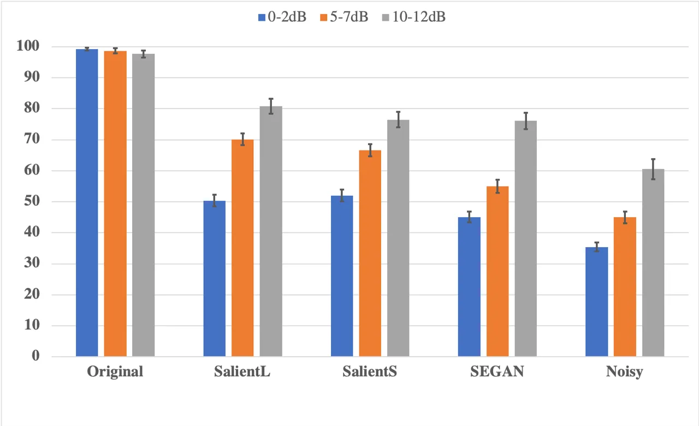
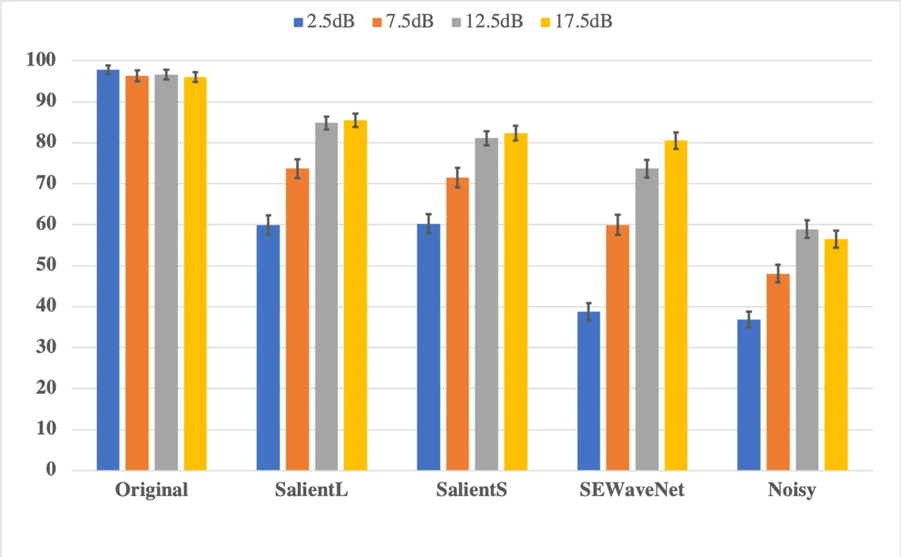
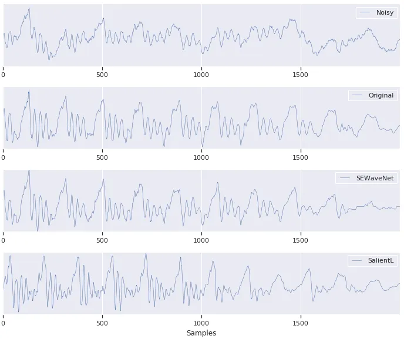

# GENERATIVE SPEECH ENHANCEMENT BASED ON CLONED NETWORKS

###### Abstract

We propose to implement speech enhancement by the regeneration of clean
speech from a ‘salient’ representation extracted from the noisy signal.
The network that extracts salient features is trained using a set of
weight-sharing clones of the extractor network. The clones receive
mel-frequency spectra of different noisy versions of the same speech
signal as input. By encouraging the outputs of the clones to be similar
for these different input signals, we train a feature extractor network
that is robust to noise. At inference, the salient features form the
input to a WaveNet network that generates a natural and clean speech
signal with the same attributes as the ground-truth clean signal. As the
signal becomes noisier, our system produces natural sounding errors that
stay on the speech manifold, in place of traditional artifacts found in
other systems. Our experiments confirm that our generative enhancement
system provides state-of-the-art enhancement performance within the
generative class of enhancers according to a MUSHRA-like test. The
clones based system matches or outperforms the other systems at each
input signal-to-noise (SNR) range with statistical significance.

| Michael Chinen,¹ W. Bastiaan Kleijn,^(1,2) Felicia S. C. Lim,¹ Jan Skoglund¹                 |
| -------------------------------------------------------------------------------------------- |
| ¹ Google LLC, USA                                                                            |
| ² School of Engineering and Computer Science, Victoria University of Wellington, New Zealand |

Index Terms—  speech enhancement, learned representations, generative
model

## 1 Introduction

The performance of speech enhancement has leaped significantly with the
introduction of deep neural networks (DNNs) in recent years, e.g., \[1,
2, 3, 4, 5, 6, 7, 8, 9, 10, 11, 12\]. This advance can be attributed to
DNNs being unencumbered by explicit or implicit constraints on relevant
data probability distributions, replacing these distributions with
empirical observations, and by the ability of DNNs to capture complex
relationships that cannot be expressed analytically. The goal of this
paper is to explore a new class of enhancement, where the clean signal
is generated from features that are extracted from contaminated signals
using an extraction network.

In most work on enhancement, e.g., \[13, 14, 15, 16\], the observed
signal is considered to be an additive mixture of a clean speech signal
$`{\bf x}`$ and additional noise sources:

```math
{\bf y}={\bf x}+\sum_{j=1}^{J}{\bf n}_{j}. \tag{1}
```

It follows from (1) that a natural objective for enhancement is to find
a good approximation of the clean speech waveform $`{\bf x}`$ based on
the noisy observations $`\bf{y}`$ and available prior knowledge.
Optimizing a network to minimize a measure of error between a clean
signal estimate $`\hat{\bf x}`$ and the ground-truth $`{\bf x}`$ is a
common approach that has yielded state of the art results based on DNN
approaches operating in the time-frequency domain \[2, 3, 4, 5, 6, 7,
8\] or time-only domain \[10\]. Typically, a feed-forward or Recurrent
Neural Network (RNN) is used.

Instead of feed-forward networks, generative networks have also been
used. Recent generative systems such as WaveNet \[17\] and Generative
Adversarial Networks (GAN) \[18\] have shown excellent results for
speech synthesis and image generation. It is natural to exploit these
advanced signal models in speech enhancement. Examples of this approach
are a WaveNet for speech denoising \[11\], SEGAN \[12\], and related
GAN-based approaches \[19, 20\]. These applications borrow the
architecture from the generative systems they are named after. However,
they are at least in part optimized to reconstruct the ground-truth
waveform, thus restricting the generative aspect of the system.

Typical speech enhancement systems tend to degrade into characteristic
artifacts that sound unnatural as the noise level increases. Wiener
filters do go quiet; it is their uneven way of doing this that enhances
and also causes distortion. Generative systems have the property that
they are restricted to producing natural speech, which may be
interpreted as being restricted to a “speech manifold”, and provides an
interesting solution to this problem. For example, WaveNets trained to
produce speech should have difficulty reproducing non-speech sounds and
will tend to produce phoneme or inebriation-like errors in place of
artifacts as noise levels increase.

Generative models can use a stochastic process to generate complex
details that are perceptually irrelevant instead of trying to reproduce
the input signal exactly. There may be many plausible solutions that
differ considerably from the ground truth but are equivalent to it. For
example, the phase in noisy signals, prosody in text-to-speech, or the
texture of sand in imaging may have many acceptable solutions that a
generative system can model and exploit with a more compact
representation. Traditional enhancement metrics for evaluation,
including signal-to-noise ratio (SNR) and
source-to-distortion/interference/artifacts ratios (SDR/SIR/SAR) \[21\]
use a reference, hence discouraging many plausible solutions, and will
therefore not be effective metrics for generative models. Perceptual
speech models such as PESQ \[22\] and ViSQOL \[23\] are more flexible in
this regard, but still rely too heavily on the degraded signal matching
a provided reference. As a result, human evaluation is the standard
metric we propose for true generative enhancement \[24\].

Our contribution is to use cloned networks trained on many noisy copies
of a given utterance to extract a representation of speech, which is
similar across all clones and contains only the information needed to
reconstruct the shared speech utterance, discarding information about
the noise. These features are used as conditioning to a generative
network. To encourage the network to find useful information we use a
decoder network with a loss targeting the clean, mel-frequency spectra.
This deterministic decoder network mirrors the extractor, and is
independent of the WaveNet network used for inference. The method can
function without a decoder, but the decoder boosts performance
significantly \[25\].

The outline of this paper is as follows. In section 2 we provide a
detailed motivation for generative enhancement and describe the
clone-based training procedure. Section 3 describes the experiments and
their outcomes. Finally section 4 provides conclusions drawn from our
work.

## 2 CLONE-BASED ENHANCEMENT

In this section we first provide our motivation for generative
enhancement. We then outline the architecture of the extraction network
and discuss in more detail the clone-based training setup.

### 2.1 Generative Enhancement

The enhancement of single-channel speech has long been aimed at finding
an approximation of the clean signal waveform, typically measured with
an objective function that can be interpreted as a Bayes risk. Early
approaches used a Wiener filter to this purpose, which meant that noise
reduction was associated with signal distortion. More recent methods are
based on models of the speech and/or noise signals. The prior knowledge
implicit in the models facilitates a better trade-off between noise
reduction and signal distortion. It can be argued that the waveform
distortion resulting from classical methods is a direct result of
attempting to extract the clean signal waveform based on a Bayes risk:
waveform components that cannot be rendered accurately are reduced in
amplitude.

Recently, machine-learning has enabled the rendering of natural sounding
speech based only on a parameter sequence with an information rate that
is near the rate of the linguistic message conveyed. This suggests a new
enhancement paradigm. If a suitable parameter sequence can be extracted
from the noisy signal, then an equivalent natural-sounding speech signal
can be constructed. This synthesized signal is, in general, not a
reconstruction of the original clean signal waveform; it has a high
distortion according to conventional measures. A characteristic of the
generative approach is that, with current methods, the waveform of the
rendered signal is not unique, relying on the drawing of samples from a
statistical distribution that can be interpreted as an information
generating step.

Perhaps surprisingly, enhancement methods based on generative networks
generally are either based solely on attempting to reconstruct the
signal waveform or rely on this objective at least in part. That is,
these methods exploit the sophistication of the generative network model
to find a better approximation of the clean signal waveform. For
example, \[26\] approximates the clean signal waveform using a Bayesian
formalism that incorporates the structure of WaveNet. \[11\] uses a
WaveNet structure to create a deterministic mapping from the noisy
waveform to the clean waveform approximation. The SEGAN approach \[12\]
combines a generative adversarial approach with an L1 criterion that
encourages reconstruction of the signal waveform. The SEGAN
reconstruction is further facilitated by skip connections that allow
information about the waveform to be passed directly to the decoder.

In this paper we explore generative enhancement without attempting to
approximate the clean signal waveform. Our aim is (i) to show that this
approach is a practical enhancement method and (ii) to explore the
behavior of a generative system. We would expect that the degradation
with decreasing SNR is different from methods that attempt to
approximate the clean waveform. When the clean waveform is approximated,
the reconstruction will become increasingly unnatural and decreases in
energy with decreasing SNR. In contrast, we expect that the generative
system will generate increasingly unintelligible speech with decreasing
SNR, with errors in phones that are obscured by the noise to appear
first. We will confirm this behavior in section 3.

### 2.2 Network Architecture

The basic architecture of our network, as used for inference, consists
of a feature extraction network, which extracts a time sequence of
salient-feature vectors. It can be used as the conditioning for a
conventional WaveNet generative network \[17\]. The salient features are
selected in a training process, but based on qualitative designer input.

Figure 1: The basic architecture of our system. Red lines show where
only the first clone is used.

Before the training process is started, the system designer selects a
set of equivalent signals that share only the salient features. For
example, the designer might add different noise to the same speech
utterance. Alternatively, the same utterance could be passed through
different all-pass filters and/or be subjected to random delays.

The salient features are found by encouraging clones of the extraction
network to extract the same feature vectors from different equivalent
signals. This leads to the training setup shown in Fig. 1. To ensure
that the individual features are distinct, we encourage the feature
vector components to be independent and have unit variance. We
additionally encourage the components to be sparse. To improve
performance further, we add a decoder that attempts to reconstruct a
target signal derived from a clean equivalent signal.

Our global loss function used for training has three terms. They relate
to equivalence, the triple independence, unit-variance and sparsity, and
target signal reconstruction, respectively:

```math
D_{\mathrm{global}}=D_{E}+\lambda_{\mathrm{MMD}}D_{\mathrm{MMD}}+\lambda_{D}D_{D}, \tag{2}
```

where $`\lambda_{\mathrm{MMD}}`$ and $`\lambda_{D}`$ are weightings. Let
the encoder network $`g_{\psi}:\mathbb{R}^{N}\rightarrow\mathbb{R}^{L}`$
be the deep network based mapping from a block of data of dimensionality
$`N`$ to the feature vector $`z\in\mathbb{R}^{L}`$ with parameters
(weights) $`\psi`$ and
$`f_{\phi}:\mathbb{R}^{L}\rightarrow\mathbb{R}^{N}`$ is the decoder
network with learned parameters $`\phi`$ . Then our objective is to
minimize $`D_{\mathrm{global}}`$ by selecting a suitable set $`\psi`$
and $`\phi`$. It is natural to define the loss $`D_{\mathrm{global}}`$
as an expectation over the data distribution. For a practical
application, we instead write $`D_{\mathrm{global}}`$ as an average over
observed batch of $`m`$ data. We then use stochastic gradient descent
over the batches to optimize over the empirical distribution associated
with the database at hand.

The term that encourages the extraction of the same feature set from
equivalent input signals is then:

```math
D_{E}=\sum_{i=1}^{m}\sum_{q=2}^{q=Q}\|z_{i}^{(1)}-z_{i}^{(q)}\|^{2}, \tag{3}
```

where $`z_{i}^{(q)}\in\mathbb{R}^{L}`$ is the feature set of clone
$`q`$, $`m`$ is the data batch cardinality, $`\|\cdot\|`$ is the 2-norm,
and where we elected to use the first clone as reference to reduce
computational effort. An alternative is to compare all clones with all
other clones.

The second term of the global loss function is to encourage independence
of the features, unit variance, and sparsity. We implement this
objective by encouraging the features vectors to have a suitable
distribution: a multivariate Laplacian with independent components and
unit variance. For the second term we selected the maximum mean
discrepancy (MMD) measure \[27\]. MMD is a measure of the difference
between two distributions. For a batch of $`m`$ training data blocks¹¹ 1
A training data entry corresponds to a data block (frame). For example
40 ms of speech. with $`y_{i}`$ drawn from the desired Laplacian
distribution and $`x_{i}`$ the observed data, the square of the MMD
measure can be approximated as

```math
D_{\mathrm{MMD}}=\frac{1}{m(m-1)}\sum_{i\neq j}^{m}\left(k(z_{i},z_{j})+\ k(y_{i},y_{j})\right)\\
-\frac{2}{m^{2}}\sum_{i,j}^{m,m}k(z_{i},y_{j}), \tag{4}
```

where $`k(\cdot,\cdot)`$ is a kernel with suitably selected scale and
shape. We use the multiquadratic kernel \[28\] and generally operate the
MMD measure on only one clone. Note that $`m`$ must be sufficiently
large to make the MMD perform correctly, even for a slow learning rate.

The third term of the global loss function relates to the reconstruction
of a target signal derived from a clean equivalent signal. To remain
consistent with our notion of generative enhancement, we must, in
general, not attempt to approximate the signal waveform directly.
However, it is consistent to train our feature extraction clones in
tandem with the WaveNet training structure. In practice, it is more
straightforward to use a target signal that characterizes the short-term
spectral characteristic of the signal as that requires lower
computational effort. We use a L2 norm for this purpose; the decoder
loss function is:

```math
D_{D}=\sum_{i=1}^{m}\sum_{q=1}^{Q}\|f_{\phi}(z_{i}^{(q)})-v_{i}\|^{2}, \tag{5}
```

where $`v_{i}\in\mathbb{R}^{N}`$ is a suitable signal representation for
a block of clean data, $`f_{\phi}`$ is the decoder network, and where
the summation is over the $`m`$ batch elements.

The deterministic decoder loss is only used to help extract the salient
features in the clones network, and should not limit the generative
capacity of WaveNet. Additionally, equivalent clean signals in the noisy
mixture may not be identical for each clone (e.g., they may differ by
time-shifts, or even be from different recordings of the same utterance
spoken in an equivalent manner). The decoder loss target has no single
or specific ground truth, and this term can be viewed as a metric for
determining if the information to reconstruct a particular solution
exists in the salient features from any equivalent clean signal.

The SNR of the speech signals that are used for training is of critical
importance for the performance of the feature extraction. If the signals
provided to the clones are too noisy, then the objective (3) will
encourage the removal of speech attributes that are perceived by humans
and relevant to comprehension and/or quality. On the other hand, if the
signals provided to the clones are insufficiently noisy, then the
extraction procedure will result in features that are sensitive to
noise.

## 3 EXPERIMENTS

In this section we first describe the experimental setup of the
listening test, then the configuration of the networks, and finally the
experimental results.

### 3.1 Experimental setup

#### 3.1.1 Network Parameters

The scale of the kernel in (4) was selected as 1.0. The weightings
$`\lambda_{\mathrm{MMD}}`$ and $`\lambda_{D}`$ in (2) were set to 1.0
and 18.0, respectively.

We trained two sizes of models that encoded the features. The small
model used two layers of Long Short-Term Memory \[29\] (LSTM) cells
followed by one fully connected layer, each with 800 nodes, and the
large model used three layers of LSTMs and two layers of fully connected
nodes, also with 800 nodes per layer. A final fully-connected layer in
both models used linear activation to avoid saturation and to reduce the
dimensionality to the desired size. A mirror of this was used for the
decoder.

Each training step processed a sequence from $`16`$ kHz input of six
40-ms dual-window mel-frequency frames that overlapped by 50 percent.
Each of the dual-window frames consist of 80 mel-frequency bins from one
window of 40 ms and two windows of $`20`$ ms (located at 5-$`25`$ ms,
and 15-$`45`$ ms of the 40 ms window) for a total of 240 mel-frequency
bins per frame. The dual-window approach was used because it was found
to produce less consonant phoneme confusion.

The encoder network used 32 clones and a batch size of 64. Each clone
was constructed of a clean utterance, plus a different noise (from
within the dataset). The encoder network outputs 12 salient features per
frame. The salient features were then inferred on full utterances from
the training set to create the conditioning training data for WaveNet,
using the clean speech for teacher forcing and negative log-likelihood
loss.

#### 3.1.2 Dataset

We chose to use the VoiceBank-DEMAND speech enhancement dataset provided
by Valentini et al. \[6\], because it is public and because other
systems have been evaluated on it, providing a useful benchmark. Because
of the relatively small size of the the data, to prevent overfitting we
trained our models and picked the checkpoint with the smallest loss. We
trained for approximately 200,000 steps for the clones model and 129,000
steps for our WaveNet models.

#### 3.1.3 Listening Test

We conducted MUSHRA-like listening tests with 100 listeners per example
to evaluate the performance of our system. The reference was the
original clean utterance, and the noisy signals were used as anchors.

We conducted separate tests to evaluate our models against SEGAN and a
WaveNet for Denoising (labeled as SEWaveNet). We applied our system to
the noisy signals from the public examples from both systems to allow a
fair comparison. Both SEWaveNet and SEGAN provided 20 utterances (which
did not overlap enough to conduct a single test). The utterances for
each system were provided in different input-SNR ranges. As additional
perspective, both SEGAN and SEWaveNet were shown to outperform a Wiener
filter in their respective studies.

### 3.2 Results



Figure 2: Results comparing clone-based enhancement to SEGAN \[12\].
Different colors are used for different input-SNR ranges.



Figure 3: Results comparing clone-based enhancement to SEWaveNet \[11\].



Figure 4: Waveforms comparing the generated speech by our system to the
reference, noisy and SEWavenet \[11\]. The referential L1 loss from
SEWaveNet requires that it match the phase of the reference, unlike our
system, which produces significantly different waveforms.

The results for the experiment against SEGAN and SEWaveNet can be seen
in Fig. 2 and Fig. 3. Our models trained only on the Valentini dataset
are labeled as SalientL for the large model and SalientS for the small
model. The provided data fell into distinct input SNR ranges, so we
analyzed them accordingly.

The results show that the clones-extracted salient features outperform
SEWaveNet at each input SNR range. The results match or exceed the
performance for SEGAN at each input SNR range as well.

The speech generated by our system does not attempt to minimize the
error with the ground truth and as such, creates significantly different
waveforms, shown in Fig. 4. As the noise level increases, our system
produces phoneme errors and speech-like perturbations from the ground
truth instead of ‘traditional’ artifacts that are outside of the speech
manifold. The results indicate that these were preferable to the
listeners to the ‘traditional’-sounding artifacts produced by SEWaveNet
or SEGAN, as well as the noisy signal itself.

## 4 CONCLUSION

We proposed and evaluated a generative enhancement system based on
cloned networks that matched or exceeded the performance of more
restrictive generative systems. The generated output has a particular
type of degradation that avoids unnatural-sounding artifacts by being
trained to produce only speech-like sounds.

There are many possibilities for future work. As decreasing SNR results
in phoneme errors in generative systems, it may be desirable to
introduce signal augmentation that, at very low SNR, signals to the
listener that the input quality is poor. One approach would be to
introduce synthesized background noise with an agreeable and perhaps
accurate character. Along with exploring other architectures, we can
also consider the unsupervised case without a decoder.

## References

- \[1\] T. Yoshioka, N. Ito, M. Delcroix, A. Ogawa, K. Kinoshita,
  M. Fujimoto, C. Yu, W. J. Fabian, M. Espi, T. Higuchi, _et al._, “The
  NTT CHiME-3 system: Advances in speech enhancement and recognition for
  mobile multi-microphone devices,” in _2015 IEEE Workshop on Automatic
  Speech Recognition and Understanding (ASRU)_. IEEE, 2015, pp. 436–443.
- \[2\] H. Erdogan, J. R. Hershey, S. Watanabe, and J. Le Roux,
  “Phase-sensitive and recognition-boosted speech separation using deep
  recurrent neural networks,” in _2015 IEEE International Conference on
  Acoustics, Speech and Signal Processing (ICASSP)_. IEEE, 2015, pp.
  708–712.
- \[3\] Y. Xu, J. Du, L.-R. Dai, and C.-H. Lee, “A regression approach
  to speech enhancement based on deep neural networks,” _IEEE/ACM
  Transactions on Audio, Speech, and Language Processing_, vol. 23,
  no. 1, pp. 7–19, 2015.
- \[4\] A. Kumar and D. Florencio, “Speech enhancement in multiple-noise
  conditions using deep neural networks,” _Interspeech 2016_, pp.
  3738–3742, 2016.
- \[5\] S. R. Park and J. W. Lee, “A fully convolutional neural network
  for speech enhancement,” _Proc. Interspeech 2017_, pp.
  1993–1997, 2017.
- \[6\] C. Valentini-Botinhao, X. Wang, S. Takaki, and J. Yamagishi,
  “Investigating RNN-based speech enhancement methods for noise-robust
  text-to-speech.” in _SSW_, 2016, pp. 146–152.
- \[7\] K. Wilson, M. Chinen, J. Thorpe, B. Patton, J. Hershey, R. A.
  Saurous, J. Skoglund, and R. F. Lyon, “Exploring tradeoffs in models
  for low-latency speech enhancement,” in _2018 16th International
  Workshop on Acoustic Signal Enhancement (IWAENC)_. IEEE, 2018, pp.
  366–370.
- \[8\] S. Wisdom, J. R. Hershey, K. Wilson, J. Thorpe, M. Chinen,
  B. Patton, and R. A. Saurous, “Differentiable consistency constraints
  for improved deep speech enhancement,” in _ICASSP 2019-2019 IEEE
  International Conference on Acoustics, Speech and Signal Processing
  (ICASSP)_. IEEE, 2019, pp. 900–904.
- \[9\] H. Zhao, S. Zarar, I. Tashev, and C.-H. Lee,
  “Convolutional-recurrent neural networks for speech enhancement,” in
  _2018 IEEE International Conference on Acoustics, Speech and Signal
  Processing (ICASSP)_. IEEE, 2018, pp. 2401–2405.
- \[10\] Y. Luo and N. Mesgarani, “TasNet: Surpassing ideal
  time-frequency masking for speech separation,” _arXiv preprint
  arXiv:1809.07454_, 2018.
- \[11\] D. Rethage, J. Pons, and X. Serra, “A WaveNet for speech
  denoising,” in _2018 IEEE International Conference on Acoustics,
  Speech and Signal Processing (ICASSP)_. IEEE, 2018, pp. 5069–5073.
- \[12\] S. Pascual, A. Bonafonte, and J. Serrà, “SEGAN: Speech
  enhancement generative adversarial network,” _arXiv preprint
  arXiv:1703.09452_, 2017.
- \[13\] P. C. Loizou, _Speech enhancement: theory and practice_. CRC
  press, 2007.
- \[14\] J. Benesty, S. Makino, and J. Chen, _Speech
  enhancement_. Springer Science & Business Media, 2006.
- \[15\] S. Gannot, D. Burshtein, and E. Weinstein, “Signal enhancement
  using beamforming and nonstationarity with applications to speech,”
  _IEEE Transactions on Signal Processing_, vol. 49, no. 8, pp.
  1614–1626, 2001.
- \[16\] N. Mohammadiha, P. Smaragdis, and A. Leijon, “Supervised and
  unsupervised speech enhancement using nonnegative matrix
  factorization,” _IEEE Transactions on Audio, Speech, and Language
  Processing_, vol. 21, no. 10, pp. 2140–2151, 2013.
- \[17\] A. Van Den Oord, S. Dieleman, H. Zen, K. Simonyan, O. Vinyals,
  A. Graves, N. Kalchbrenner, A. W. Senior, and K. Kavukcuoglu,
  “WaveNet: A generative model for raw audio,” _SSW_, vol. 125, 2016.
- \[18\] I. Goodfellow, J. Pouget-Abadie, M. Mirza, B. Xu,
  D. Warde-Farley, S. Ozair, A. Courville, and Y. Bengio, “Generative
  adversarial nets,” in _Advances in neural information processing
  systems_, 2014, pp. 2672–2680.
- \[19\] D. Michelsanti and Z.-H. Tan, “Conditional generative
  adversarial networks for speech enhancement and noise-robust speaker
  verification,” _arXiv preprint arXiv:1709.01703_, 2017.
- \[20\] C. Donahue, B. Li, and R. Prabhavalkar, “Exploring speech
  enhancement with generative adversarial networks for robust speech
  recognition,” in _2018 IEEE International Conference on Acoustics,
  Speech and Signal Processing (ICASSP)_. IEEE, 2018, pp. 5024–5028.
- \[21\] E. Vincent, R. Gribonval, and C. Févotte, “Performance
  measurement in blind audio source separation,” _IEEE transactions on
  audio, speech, and language processing_, vol. 14, no. 4, pp.
  1462–1469, 2006.
- \[22\] A. W. Rix, J. G. Beerends, M. P. Hollier, and A. P. Hekstra,
  “Perceptual evaluation of speech quality (PESQ)-a new method for
  speech quality assessment of telephone networks and codecs,” in _2001
  IEEE International Conference on Acoustics, Speech, and Signal
  Processing. Proceedings (Cat. No. 01CH37221)_, vol. 2. IEEE, 2001, pp.
  749–752.
- \[23\] A. Hines, J. Skoglund, A. Kokaram, and N. Harte, “ViSQOL: The
  virtual speech quality objective listener,” in _IWAENC 2012;
  International Workshop on Acoustic Signal Enhancement_. VDE, 2012, pp.
  1–4.
- \[24\] W. B. Kleijn, F. S. C. Lim, A. Luebs, J. Skoglund, F. Stimberg,
  Q. Wang, and T. C. Walters, “Wavenet based low rate speech coding,” in
  _2018 IEEE International Conference on Acoustics, Speech and Signal
  Processing (ICASSP)_. IEEE, 2018, pp. 676–680.
- \[25\] W. B. Kleijn, F. S. C. Lim, M. Chinen, and J. Skoglund,
  “Salient speech representations based on cloned networks,” in
  _Interspeech 2019_, 2019.
- \[26\] K. Qian, Y. Zhang, S. Chang, X. Yang, D. Florêncio, and
  M. Hasegawa-Johnson, “Speech enhancement using Bayesian WaveNet.” in
  _Interspeech_, 2017, pp. 2013–2017.
- \[27\] K. M. Borgwardt, A. Gretton, M. J. Rasch, H.-P. Kriegel,
  B. Schölkopf, and A. J. Smola, “Integrating structured biological data
  by kernel maximum mean discrepancy,” _Bioinformatics_, vol. 22,
  no. 14, pp. e49–e57, 2006.
- \[28\] I. Tolstikhin, O. Bousquet, S. Gelly, and B. Schoelkopf,
  “Wasserstein auto-encoders,” _arXiv preprint arXiv:1711.01558_, 2017.
- \[29\] S. Hochreiter and J. Schmidhuber, “Long short-term memory,”
  _Neural computation_, vol. 9, no. 8, pp. 1735–1780, 1997.
