# Spoken Speech Enhancement using EEG

Gautam Krishna Affiliation: Brain Machine Interface Lab  
The University of Texas at Austin  
Austin, Texas    Co Tran Affiliation: Brain Machine Interface Lab  
The University of Texas at Austin  
Austin, Texas    Yan Han Affiliation: Brain Machine Interface Lab  
The University of Texas at Austin  
Austin, Texas    Mason Carnahan Affiliation: Brain Machine Interface
Lab  
The University of Texas at Austin  
Austin, Texas    Ahmed H Tewfik Affiliation: Brain Machine Interface
Lab  
The University of Texas at Austin  
Austin, Texas

###### Abstract

In this paper we demonstrate spoken speech enhancement using
electroencephalography (EEG) signals using a generative adversarial
network (GAN) based model, gated recurrent unit (GRU) regression based
model, temporal convolutional network (TCN) regression model and finally
using a mixed TCN GRU regression model.

We compare our EEG based speech enhancement results with traditional log
minimum mean-square error (MMSE) speech enhancement algorithm and our
proposed methods demonstrate significant improvement in speech
enhancement quality compared to the traditional method. Our overall
results demonstrate that EEG features can be used to clean speech
recorded in presence of background noise. To the best of our knowledge
this is the first time a spoken speech enhancement is demonstrated using
EEG features recorded in parallel with spoken speech.

###### Index Terms: 

electroencephalography (EEG), speech enhancement, deep learning

## I Introduction

Speech enhancement is the process of improving the quality of speech
whose quality was degraded due to additive noise. Speech enhancement is
a critical preprocessing method used to improve the performance of
automatic speech recognition (ASR) systems operating in presence of
background noise. Noisy speech is first fed into a speech enhancement
system to produce enhanced speech which is then fed into the ASR model.
Speech enhancement systems also plays critical role in improving the
quality of speech used in devices like hearing aids and cochlear
implants.

In references \[1, 2\] authors demonstrated speech enhancement using
classical methods. Recently researchers have started applying deep
learning methods for performing speech enhancement as indicated in the
following references \[3, 4\]. In references \[5\] authors demonstrated
speech enhancement using generative adversarial networks (GAN)\[6\].

Electroencephalography (EEG) is a non invasive way of measuring
electrical activity of human brain. In \[7\] authors demonstrated that
EEG features can be used to overcome the performance loss of ASR systems
in presence of background noise. Though references \[8, 9, 7\]
demonstrated isolated and continuous speech recognition using EEG
signals for various experimental conditions, they didn’t specifically
study the speech enhancement problem. In this paper we demonstrate that
EEG features can be used to improve the quality of speech recorded in
presence of background noise. We make use of GAN, gated recurrent unit
(GRU) \[10\], temporal convolutional (TCN) \[11\] networks to
demonstrate speech enhancement using EEG features. We further compare
our obtained results with traditional log minimum mean-square error
(MMSE) speech enhancement algorithm and our results demonstrate
significant improvement in speech enhancement quality compared to the
traditional method.

In \[12\] authors demonstrated EEG based attention driven speech
enhancement using wiener filters where EEG was used to detect auditory
attention where as in this paper we demonstrate speech enhancement for
”Spoken” speech using EEG features and auditory attention detection
module is not required for performing speech enhancement. Our idea is
mainly inspired by the results demonstrated in \[7\] where authors
demonstrated EEG features are less affected by external background
noise. To the best of our knowledge this is the first time a spoken
speech enhancement is demonstrated using EEG features recorded in
parallel with spoken speech.

## II Design of Experiments for building Training and Test Set

We used Data set A used by authors in \[8\] as training set. The Data
set A consists of simultaneous speech and EEG recordings from 10
subjects. This data was recorded in absence of externally created
background noise but a background noise of 40 dB due to the sound of lab
ventilation fan was observed. For the sake of the simplicity of the
study we would neglect this 40 dB noise effect and would consider
training data set as clean.

We used Data set B used by authors in \[8\] as test set. The Data set B
consists of simultaneous speech and EEG recordings from 8 subjects
recorded in presence of external background noise of 65 dB. For
collecting data for training and test set, among the total number of
subjects, five subjects took part in both the experiments for Data sets.

We used Brain product’s ActiChamp EEG recording hardware. Our EEG cap
had 32 wet EEG electrodes including one electrode as ground as shown in
Figure 1. We used EEGLab to obtain the EEG sensor location mapping. It
is based on standard 10-20 EEG sensor placement method for 32
electrodes.

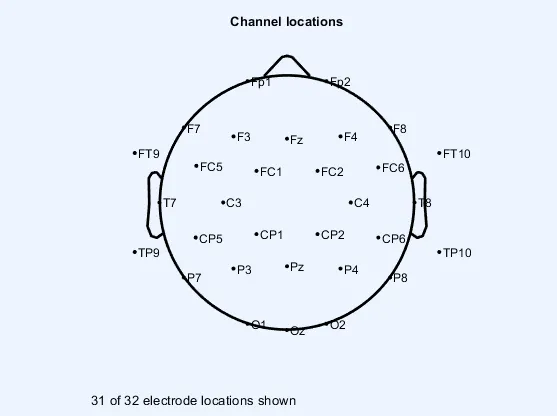

Fig. 1: EEG channel locations for the cap used in our experiments

## III EEG and Speech feature extraction details

We followed the same methodology used by authors in references \[8, 7\]
for EEG and speech preprocessing. EEG signals were sampled at 1000Hz and
a fourth order IIR band pass filter with cut off frequencies 0.1Hz and
70Hz was applied. A notch filter with cut off frequency 60 Hz was used
to remove the power line noise. EEGlab’s Independent component analysis
(ICA) toolbox was used to remove other biological signal artifacts like
electrocardiography (ECG), electromyography (EMG), electrooculography
(EOG) etc from the EEG signals. We extracted five statistical features
for EEG, namely root mean square, zero crossing rate,moving window
average,kurtosis and power spectral entropy \[7, 8, 13\]. So in total we
extracted 31(channels) X 5 or 155 features for EEG signals. The EEG
features were extracted at a sampling frequency of 100Hz for each EEG
channel.

The recorded speech signal was sampled at 16KHz frequency. We extracted
Mel-frequency cepstrum coefficients (MFCC) as features for speech
signal. We extracted MFCC 13 features and the MFCC features were also
sampled at 100Hz same as the sampling frequency of EEG features

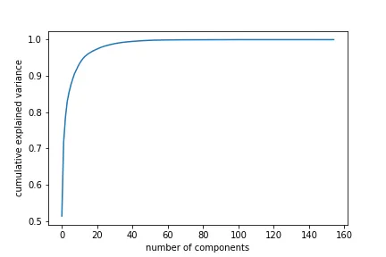

Fig. 2: Explained variance plot

## IV EEG Feature Dimension Reduction Algorithm Details

We reduced the 155 EEG features to a dimension of 30 by applying Kernel
Principle Component Analysis (KPCA) to denoise the EEG feature space as
demonstrated by authors in \[8, 9\]. We plotted cumulative explained
variance versus number of components to identify the right feature
dimension as shown in Figure 2. We used KPCA with polynomial kernel of
degree 3 \[7, 8, 13\].

## V Speech Enhancement models

We used four different types of model for performing speech enhancement
using EEG features. We first performed experiments using a simple gated
recurrent units (GRU) \[10\] regression model followed by speech
enhancement experiments using a generative adversarial networks (GAN)
\[6\] model, followed by speech enhancement experiments using temporal
convolutional network (TCN) \[11\] regression model and finally we
performed speech enhancement using a mixture of TCN, GRU regression
model.

In the below sub sections we explain the architecture of our models and
experiment set up details. Our GAN model architecture is different from
the ones used by authors in references \[5\]. We added Gaussian noise
with zero mean and standard deviation 10 to the recorded MFCC features
from training set to generate noisy MFCC features. These noisy MFCC
features will be used during training of the models as explained in
below sub sections. The gaussian noise was not added to the EEG features
from training set as our hypothesis was effect of background noise on
EEG features is negligible \[7\]. The gaussian noise was not added to
the test set data as it was already collected in presence of externally
created background noise.

### V-A GRU Regression Model

Our GRU regression model consists of two layers of GRU with 128 hidden
units in first layer and with 64 hidden units in second layer followed
by a time distributed dense layer with 13 hidden units. The GRU
regression model architecture is shown in Figure 3. The model was
trained for 1000 epochs to observe loss convergence and adam optimizer
was used. The Batch size was set to 200. Mean squared error (MSE) was
used as the loss function. The validation split was set to 0.1. The
Figure 4 shows training and validation loss convergence of the model.

During training time, we concatenate the generated noisy MFCC features
(after adding gaussian noise) and recorded EEG features from the
training set and feed it as a single vector input to the GRU regression
model and corresponding clean MFCC features from training set of
dimension 13 are set as targets.

During test time, we concatenate the MFCC and EEG features from test set
and feed it as a single vector input to the trained GRU regression model
to output corresponding enhanced MFCC. Griffin Lim reconstruction \[14\]
algorithm is used to convert enhanced MFCC to speech.

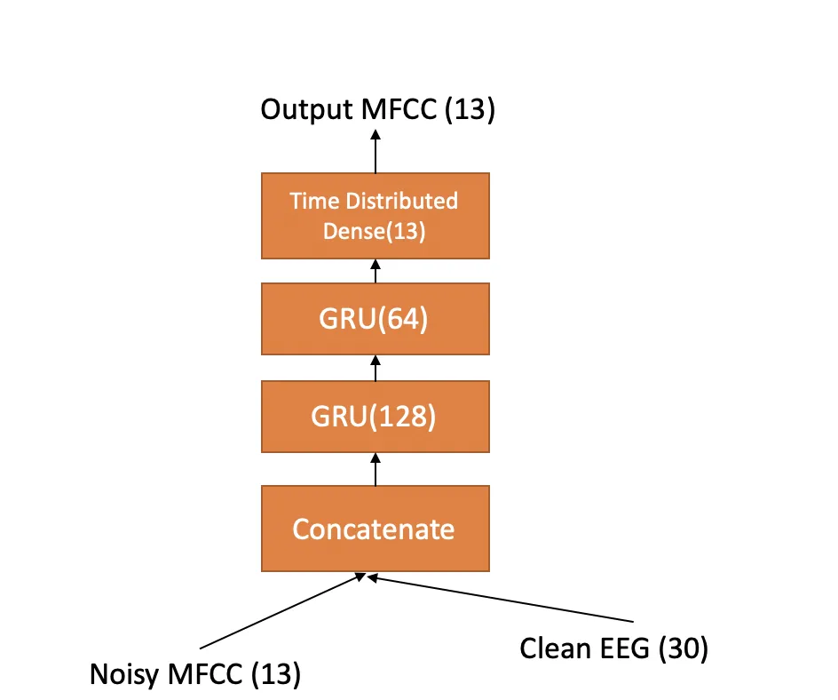

Fig. 3: GRU regression model

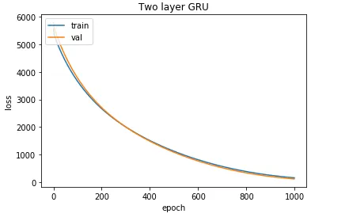

Fig. 4: GRU regression model training loss convergence

### V-B TCN Regression Model

Our TCN regression model consists of a single layer of TCN with 128
filters followed by a time distributed dense layer with 13 hidden units.
The TCN regression model architecture is shown in Figure 5. The model
was trained for 1000 epochs to observe loss convergence and adam
optimizer \[15\] was used. The Batch size was set to 200. Mean squared
error (MSE) was used as the loss function. The validation split was set
to 0.1.

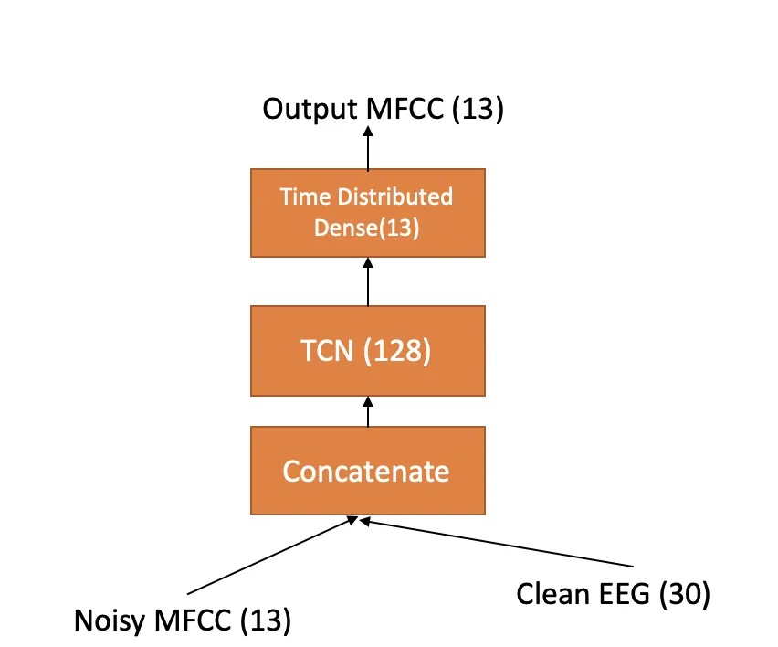

Fig. 5: TCN regression model

### V-C GRU-TCN Regression Model

Our GRU -TCN regression model consists of two layers of GRU with 128
hidden units in first layer and with 64 hidden units in second layer
followed by a single layer of TCN with 32 filters followed by a time
distributed dense layer with 13 hidden units. A dropout regularization
\[16\] with dropout rate 0.2 is applied between the TCN and GRU layer.
The GRU-TCN regression model architecture is shown in Figure 6. The
model was trained for 1000 epochs to observe loss convergence and adam
optimizer \[15\] was used. The Batch size was set to 200. Mean squared
error (MSE) was used as the loss function. The validation split was set
to 0.1. The Figure 7 shows training and validation loss convergence of
the model.

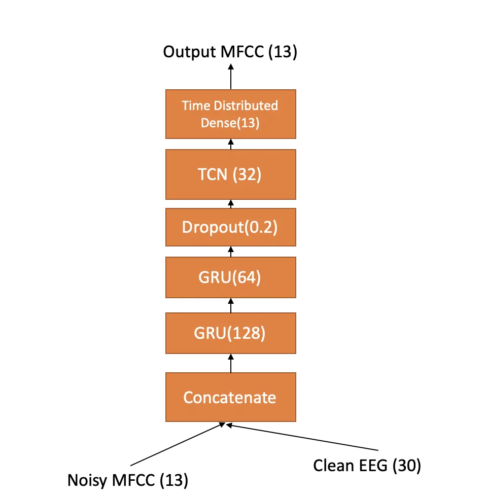

Fig. 6: GRU-TCN regression model

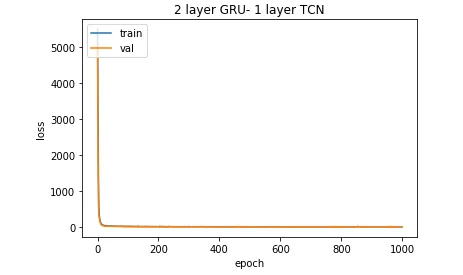

Fig. 7: GRU-TCN regression model training loss convergence

### V-D GAN Model

Generative Adversarial Network (GAN) consists of two networks namely the
generator model and the discriminator model which are trained
simultaneously. The generator model learns to generate data from a
latent space and the discriminator model evaluates whether the data
generated by the generator is fake or is from true data distribution.
The training objective of the generator is to fool the discriminator.

Our main motivation behind using GAN model was in the case of GAN, the
loss function is learned during training of the model instead of using a
fixed loss function in the case of GRU or TCN or GRU-TCN regression
model ( ie: MSE).

Our generator model consists of two parallel GRU’s with 128 and 64
hidden units in each layer. The outputs of the two parallel GRU’s are
concatenated and fed into TCN layer with 32 filters followed by a time
distributed dense layer of 13 hidden units. The architecture of
discriminator model is similar to that of the generator model but
instead of the time distributed dense layer, a dense layer with single
hidden unit sigmoid activation is used. The last time step output of the
preceding TCN layer is fed into the dense layer.

During training time, the generator always takes noisy MFCC ( obtained
after adding gaussian noise to clean MFCC from training set) and clean
EEG ( from training set) as input pairs and outputs fake MFCC. The
Generator model architecture is shown in Figure 8. The discriminator can
take three possible pairs of inputs during training. Let $`P_{f}`$ be
the sigmoid output of the discriminator for (fake MFCC, clean EEG) pair
input, $`P_{c}`$ be the sigmoid output of the discriminator for (clean
MFCC, clean EEG) pair input and $`P_{n}`$ be the sigmoid output of the
discriminator for (noisy MFCC, clean EEG) pair input, then we can define
the loss function of the generator as $`-\log(P_{f})`$ and loss function
of the discriminator as $`-\log(1-P_{f})-\log(1-P_{n})-\log(P_{c})`$ for
speech enhancement. The model was trained for 100 epochs using adam
optimizer with a batch size of 32. The Discriminator model architecture
is shown in Figure 9. Input 1, Input 2 in the figure refers to the three
possible pairs of input for the discriminator during training. Figures
10 and 11 shows the training loss for the generator and discriminator
models.

During test time, the trained generator model takes (MFCC, EEG) input
pair from the test set and outputs enhanced MFCC and we use griffin lim
reconstruction algorithm to convert enhanced MFCC to speech.

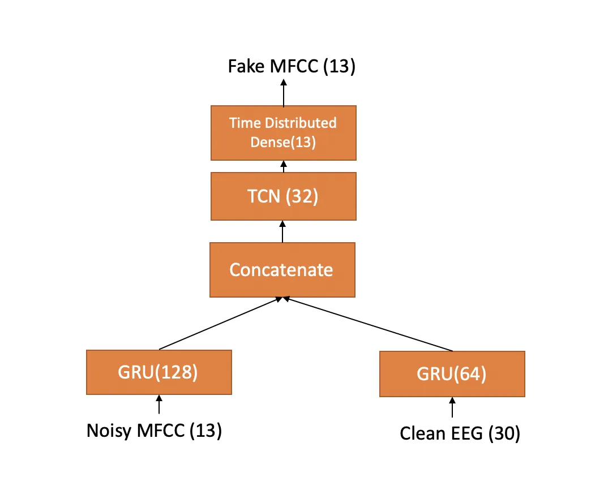

Fig. 8: Generator in GAN model

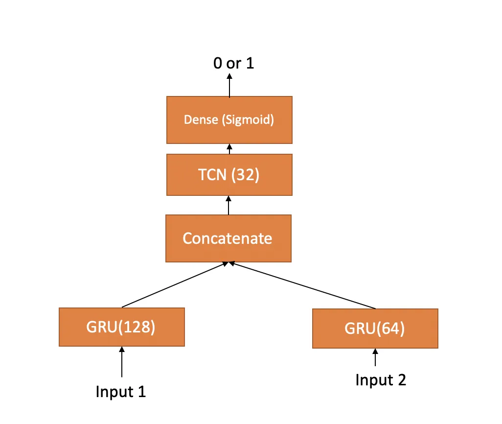

Fig. 9: Discriminator in GAN model

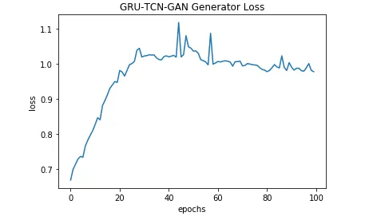

Fig. 10: Generator training loss convergence

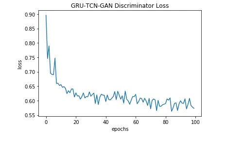

Fig. 11: Discriminator training loss convergence

## VI Results

To evaluate the quality of the enhanced speech we computed Perceptual
evaluation of speech quality (PESQ) as the major performance metric
\[17\] for test set speech data and corresponding enhanced speech
outputted by the models when the test set data was given as input. We
observed that the PESQ value was higher for enhanced speech output
compared to that of the test set speech data as shown in Table 1
indicating the enhanced speech output was of better quality than the
corresponding test set speech data.

Since PESQ calculation involve the use of a clean audio signal as
reference we computed PESQ values only for five subjects data from test
set as only five subjects were common in test set and training set EEG
data collection experiments, hence we had a clean reference speech
signal only for these five common subjects from the training data set.
The average PESQ values for all the test, corresponding enhanced
utterances of the five subjects are shown in Table 1. We also observed
that our EEG based speech enhancement regression and GAN models
outperformed the baseline log MMSE model in terms of PESQ value as seen
from Table 1 excpet for TCN regression model where it’s test time
average PESQ value was similar to the log MMSE model test time PESQ
value. The EEG features are not used with log MMSE model, the log MMSE
model takes only noisy speech as input and outputs enhanced speech. We
observed that GRU regression model demonstrated highest PESQ value
during test time even though our initial hypothesis was GAN model should
demonstrate best results. It shows the difficulty of training GAN
models.

However we computed one more metric namely signal to noise ratio (SNR)
for all the test set speech data for the eight subjects and for the
enhanced speech outputted by the GRU regression model for all the eight
subjects test data input. There are multiple definitions of computing
SNR in literature, in our case we computed SNR as ratio of mean to
standard deviation of the speech signal. We observed an average SNR
value of -8.42e-07 for the test set speech data and average SNR of
2.62e-06 for enhanced speech outputted by GRU regression model. We can
observe that the enhanced speech outputted by the model had higher SNR
value compared to the test set data, indicating the enhanced speech
outputted was of better quality than the test set speech data.

We also tried computing another performance metric namely Short Term
Objective Intelligibility (STOI) \[18\] for the five subjects and we
observed average STOI value of 0.020 for test set speech data, 0.0201
with log MMSE model and a highest value of 0.022 with GRU regression
model. The higher STOI value indicates better speech enhancement
quality.

Our overall results demonstrate that EEG features can be used to clean
speech recorded in presence of background noise.

[TABLE]

TABLE I: Speech Enhancement Results

## VII Conclusion and Future work

In this paper we demonstrated cleaning of noisy spoken speech using EEG
features recorded in parallel with spoken speech. We make use of
state-of-the-art deep learning models like GAN, GRU, TCN regression and
EEG signal processing principles to derive our results. To the best of
our knowledge this is the first time a spoken speech enhancement using
EEG features is demonstrated using deep learning models.

## VIII Acknowledgement

We would like to thank Kerry Loader and Rezwanul Kabir from Dell,
Austin, TX for donating us the GPU to train the models used in this
work.

## References

- \[1\] M. Berouti, R. Schwartz, and J. Makhoul, “Enhancement of speech
  corrupted by acoustic noise,” in _ICASSP’79. IEEE International
  Conference on Acoustics, Speech, and Signal Processing_, vol. 4. IEEE,
  1979, pp. 208–211.
- \[2\] Y. Ephraim, “Statistical-model-based speech enhancement
  systems,” _Proceedings of the IEEE_, vol. 80, no. 10, pp.
  1526–1555, 1992.
- \[3\] S. Parveen and P. Green, “Speech enhancement with missing data
  techniques using recurrent neural networks,” in _2004 IEEE
  International Conference on Acoustics, Speech, and Signal Processing_,
  vol. 1. IEEE, 2004, pp. I–733.
- \[4\] F. Weninger, H. Erdogan, S. Watanabe, E. Vincent, J. Le Roux,
  J. R. Hershey, and B. Schuller, “Speech enhancement with lstm
  recurrent neural networks and its application to noise-robust asr,” in
  _International Conference on Latent Variable Analysis and Signal
  Separation_. Springer, 2015, pp. 91–99.
- \[5\] S. Pascual, A. Bonafonte, and J. Serra, “Segan: Speech
  enhancement generative adversarial network,” _arXiv preprint
  arXiv:1703.09452_, 2017.
- \[6\] I. Goodfellow, J. Pouget-Abadie, M. Mirza, B. Xu,
  D. Warde-Farley, S. Ozair, A. Courville, and Y. Bengio, “Generative
  adversarial nets,” in _Advances in neural information processing
  systems_, 2014, pp. 2672–2680.
- \[7\] G. Krishna, C. Tran, J. Yu, and A. Tewfik, “Speech recognition
  with no speech or with noisy speech,” in _Acoustics, Speech and Signal
  Processing (ICASSP), 2019 IEEE International Conference
  on_. IEEE, 2019.
- \[8\] G. Krishna, C. Tran, M. Carnahan, and A. Tewfik, “Advancing
  speech recognition with no speech or with noisy speech,” in _2019 27th
  European Signal Processing Conference (EUSIPCO)_. IEEE, 2019.
- \[9\] G. Krishna, Y. Han, C. Tran, M. Carnahan, and A. H. Tewfik,
  “State-of-the-art speech recognition using eeg and towards decoding of
  speech spectrum from eeg,” _arXiv preprint arXiv:1908.05743_, 2019.
- \[10\] J. Chung, C. Gulcehre, K. Cho, and Y. Bengio, “Empirical
  evaluation of gated recurrent neural networks on sequence modeling,”
  _arXiv preprint arXiv:1412.3555_, 2014.
- \[11\] S. Bai, J. Z. Kolter, and V. Koltun, “An empirical evaluation
  of generic convolutional and recurrent networks for sequence
  modeling,” _arXiv preprint arXiv:1803.01271_, 2018.
- \[12\] N. Das, S. Van Eyndhoven, T. Francart, and A. Bertrand,
  “Eeg-based attention-driven speech enhancement for noisy speech
  mixtures using n-fold multi-channel wiener filters,” in _2017 25th
  European Signal Processing Conference (EUSIPCO)_. IEEE, 2017, pp.
  1660–1664.
- \[13\] G. Krishna, C. Tran, Y. Han, M. Carnahan, and A. H. Tewfik,
  “Speech recognition with no speech or with noisy speech beyond
  english,” _arXiv preprint arXiv:1906.08045_, 2019.
- \[14\] D. Griffin and J. Lim, “Signal estimation from modified
  short-time fourier transform,” _IEEE Transactions on Acoustics,
  Speech, and Signal Processing_, vol. 32, no. 2, pp. 236–243, 1984.
- \[15\] D. P. Kingma and J. Ba, “Adam: A method for stochastic
  optimization,” _arXiv preprint arXiv:1412.6980_, 2014.
- \[16\] N. Srivastava, G. Hinton, A. Krizhevsky, I. Sutskever, and
  R. Salakhutdinov, “Dropout: a simple way to prevent neural networks
  from overfitting,” _The journal of machine learning research_,
  vol. 15, no. 1, pp. 1929–1958, 2014.
- \[17\] A. W. Rix, J. G. Beerends, M. P. Hollier, and A. P. Hekstra,
  “Perceptual evaluation of speech quality (pesq)-a new method for
  speech quality assessment of telephone networks and codecs,” in _2001
  IEEE International Conference on Acoustics, Speech, and Signal
  Processing. Proceedings (Cat. No. 01CH37221)_, vol. 2. IEEE, 2001, pp.
  749–752.
- \[18\] C. H. Taal, R. C. Hendriks, R. Heusdens, and J. Jensen, “An
  algorithm for intelligibility prediction of time–frequency weighted
  noisy speech,” _IEEE Transactions on Audio, Speech, and Language
  Processing_, vol. 19, no. 7, pp. 2125–2136, 2011.
