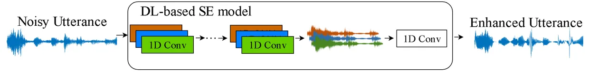
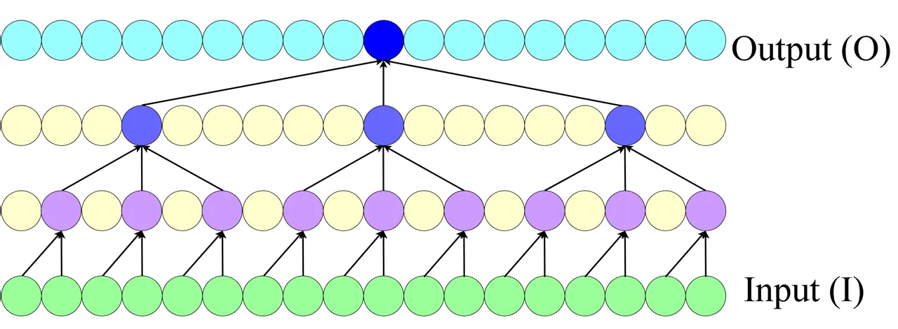
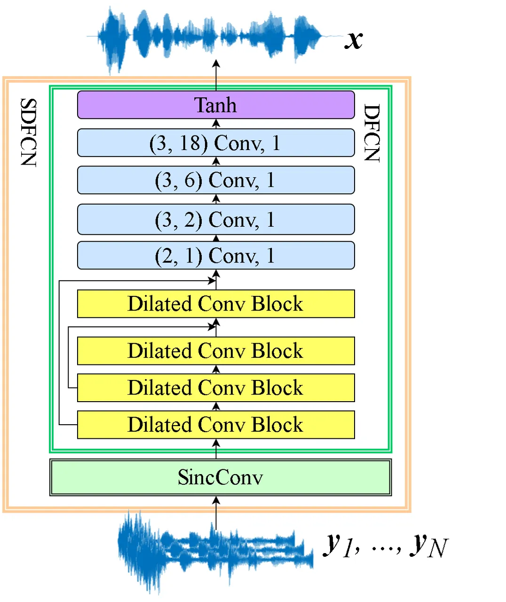
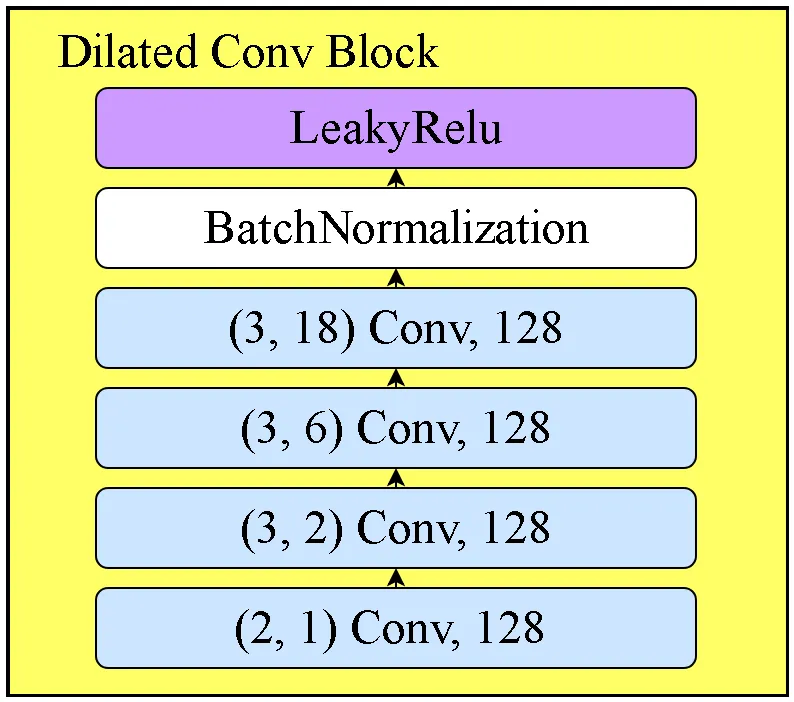
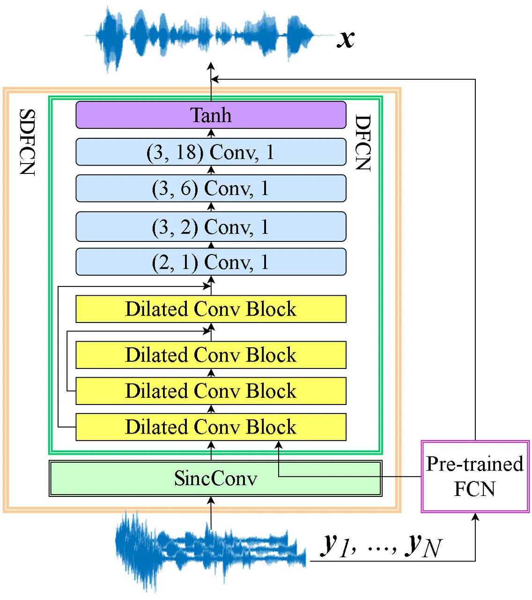
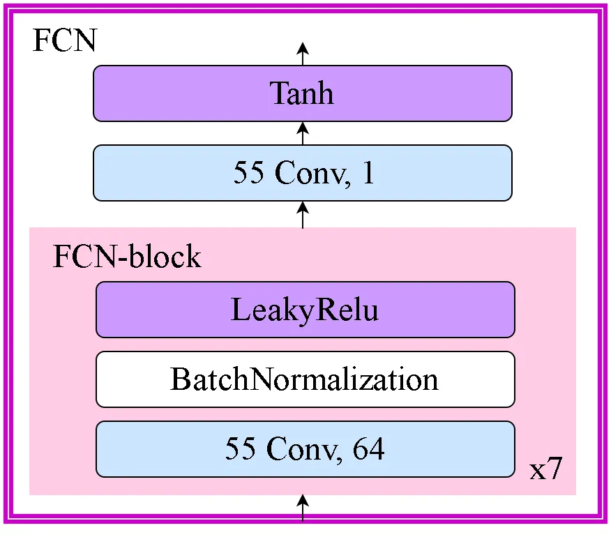
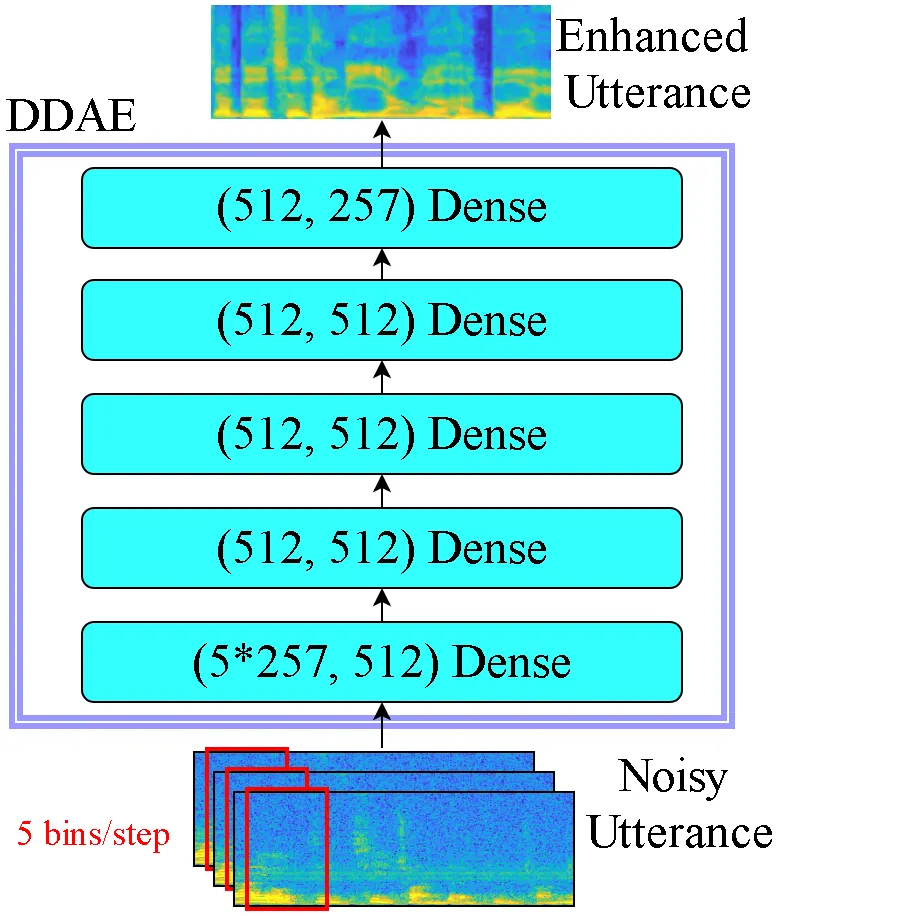

# Multichannel Speech Enhancement by Raw Waveform-mapping using Fully Convolutional NetworksThanks: Manuscript received August 24, 2026; revised August 24, 2026.

Chang-Le Liu¹, Sze-Wei Fu², You-Jin Li², Jen-Wei Huang³, Hsin-Min Wang⁴,
Yu Tsao² Affiliation: Affiliation: ¹Department of Electrical
Engineering, National Taiwan University, Taipei, Taiwan Affiliation:
Affiliation: ²Research Center for Information Technology Innovation at
Academia Sinica, Taipei, Taiwan Affiliation: Affiliation: ³Department of
Electrical Engineering, National Cheng-Kung University, Tainan, Taiwan
Affiliation: Affiliation: ⁴Institute of Information Science, Academia
Sinica, Taipei, Taiwan Affiliation:

###### Abstract

In recent years, waveform-mapping-based speech enhancement (SE) methods
have garnered significant attention. These methods generally use a deep
learning model to directly process and reconstruct speech waveforms.
Because both the input and output are in waveform format, the
waveform-mapping-based SE methods can overcome the distortion caused by
imperfect phase estimation, which may be encountered in
spectral-mapping-based SE systems. So far, most waveform-mapping-based
SE methods have focused on single-channel tasks. In this paper, we
propose a novel fully convolutional network (FCN) with Sinc and dilated
convolutional layers (termed SDFCN) for multichannel SE that operates in
the time domain. We also propose an extended version of SDFCN, called
the residual SDFCN (termed rSDFCN). The proposed methods are evaluated
on three multichannel SE tasks, namely the dual-channel inner-ear
microphones SE task, the distributed microphones SE task, and the
CHiME-3 dataset. The experimental results confirm the outstanding
denoising capability of the proposed SE systems on the three tasks and
the benefits of using the residual architecture on the overall SE
performance.

###### Index Terms:

Multichannel speech enhancement, raw waveform mapping, fully
convolutional network, inner-ear microphones, distributed microphones.

## I Introduction

Speech -related applications for both human-human and human-machine
interfaces have garnered significant attention in recent years. However,
speech signals are easily distorted by additive or convolutional noises
or recording devices, and such distortion constrains the achievable
performance of these applications. To address this issue, numerous
speech enhancement (SE) algorithms have been derived to improve the
quality and intelligibility of distorted speech and are widely used as a
preprocessor in speech-related applications, such as speech coding
\[2\], \[3\], assistive hearing devices \[4\], \[5\], and automatic
speech recognition (ASR) \[6\]. Generally speaking, SE methods can be
divided into two categories. The first category adopts a single channel
(also termed monaural) while the second category uses multiple
microphones (also termed multichannel) to perform SE.

Traditional single-channel-based SE methods were derived based on the
characteristics and statistical assumptions of clean speech and noise
signals. Well-known approaches include spectral-subtraction \[7\], the
Wiener filter \[8\], \[9\], and the minimum mean square error (MMSE)
\[10\]. Another category of successful SE approaches is subspace-based
methods, which aim to separate noisy speech into two subspaces, one for
clean speech and the other for noise components. The clean speech is
then restored based on the information in the clean-speech subspace.
Notable subspace techniques include generalized subspace approaches with
prewhitening \[11\], the Karhunen-Loeve transform \[12\], and principal
component analysis (PCA) \[13\].

In recent years, machine-learning-based algorithms have been popularly
used in the SE field. Unlike traditional methods, a
machine-learning-based SE approach generally prepares a denoising model
in a data-driven manner without imposing strong statistical constraints.
Well-known machine-learning-based models include non-negative matrix
factorization \[14\], compressive sensing \[15\], sparse coding \[16\],
and robust principal component analysis (RPCA) \[17\]. More recently,
deep learning models have been applied to the SE field. Owing to their
outstanding nonlinear mapping capability, deep-learning-based SE methods
have demonstrated notable performance improvements over traditional
statistical methods and other machine-learning-based methods. Well-known
deep-learning-based models include the deep de-noising autoencoder
(DDAE) \[18\], \[19\], deep fully connected networks \[20, 21, 22, 23\],
recurrent neural networks \[24\], \[25\], convolutional neural networks
\[26\], \[27\], and long short-term memory \[28, 29, 30, 31\].

Different from single-channel SE methods, the multichannel ones utilize
information from plural channels to enhance the target speech signal.
Among the multichannel SE methods, beamforming \[32, 33, 34\] is a
popular method that exploits spatial information from multiple
microphones to attenuate inference and noise signals. In addition to
beamforming, other effective methods are based on a coherence algorithm
that calculates the correlation of two input signals to estimate a
filter to attenuate the interference components \[35, 36\]. Meanwhile,
Li et al. proposed a method of using distributed-microphones for
in-vehicle SE \[36\]. They argued the clean speech signals acquired by
distributed-microphones are similar to each other while the noise
signals acquired by distributed-microphones are irrelevant to each
other. Therefore, the RPCA algorithm \[17\] is applied to the matrix
formed by the acquired noisy signals from multiple channels to separate
clean speech and noise components \[37\].

More recently, deep learning-based models also exhibit encouraging
performance in multichannel SE tasks. Araki et al. showed that
multichannel audio features can effectively improve the performance of
the denoising auto-encoder (DAE) \[38\] based SE approach \[39\]. Wang
and Wang proposed a deep learning-based time-frequency (T-F) masking SE
method that estimates robust time delay of arrival over multiple
singly-enhanced speech signals to obtain directional features and hence
the beam-formed signals. The enhancement is carried out by combining
spectral and directional features \[40\]. Although the above-mentioned
multichannel SE approaches have been able to provide satisfactory
performance, they are performed in the frequency domain, i.e., they
typically use the phase from the noisy input and require additional
processing to convert the speech waveform into spectral features. To
avoid imperfect phase estimation and reduce online processing,
waveform-mapping-based audio signal processing methods have been
developed. For example, in \[26, 42, 43, 44, 45\], a fully convolutional
network (FCN) model was used to enhance on the noisy waveform to
generate an enhanced waveform, and in \[46, 47\], the FCN model was used
to separate a singing voice from mono or stereo music.

In the present work, we propose a novel fully convolutional network that
incorporates Sinc convolutional filters (termed SincConv) and dilated
convolutional filters, to perform multichannel SE in the time domain.
Therefore, the model is called Sinc dilated FCN (termed SDFCN). In
addition, we derive an extended system from the SDFCN system. The
extended system structures a residual architecture in which SDFCN is
used to estimate and compensate for the residual components of the
enhanced speech from a primary SE model. Therefore, it is named residual
SDFCN (termed rSDFCN). We evaluate the proposed models on three
multichannel SE tasks: inner-ear microphones (termed the IEM-SE task),
distributed-microphones (termed the DM-SE task), and the CHiME-3 dataset
\[66\]. For these tasks, the proposed SE models take inputs from
multiple channels to generate a single-channel waveform with higher
quality and intelligibility than individual noisy inputs. Two
standardized metrics are used in the evaluation: short-time objective
intelligibility (STOI) \[48, 49\] and perceptual estimation of speech
quality (PESQ) \[50\]. In addition, we conduct subjective listening and
speech recognition tests with the enhanced speech signals. Our
experimental results confirm the outstanding denoising capability of the
proposed SDFCN and rSDFCN models in all three multichannel SE tasks,
demonstrating the benefits of using the residual architecture on the
overall SE performance.

The remainder of this paper is organized as follows. Section 2 reviews
the related works. Section 3 presents the concept and architectures of
the proposed SDFCN and rSDFCN models. Section 4 presents the
experimental setup and results. Finally, Section 5 concludes this work.

## II RELATED WORKS

Given a clean speech signal $`\mathbf{x}`$, the degraded signal can be
formulated as $`\mathbf{y}=g(\mathbf{x})`$, where $`g`$ denotes the
degradation function. The goal of SE is to find a function that maps y
to $`\mathbf{\hat{x}}`$ that approximates $`\mathbf{x}`$ as close as
possible. In this section, we review related works, including the
FCN-based waveform-mapping-based SE method, SincConv filters, and
dilated convolutional filters.

### II-A Waveform-mapping-based SE

Previous studies have shown that the FCN model is suitable for
waveform-mapping-based SE because the convolutional layers can more
effectively characterize the local information of neighboring input
regions \[41\]. FCN is a modified convolutional neural network (CNN)
model in which the fully connected layers in CNN are completely replaced
by the convolutional layers, as shown in Fig. 1. In FCN, the relation
between each sample point $`\mathbf{\hat{x}}_{t}`$ of the output
$`\mathbf{\hat{x}}`$ and the last connected hidden nodes
$`\mathbf{h_{t}}\in R^{L\times 1}`$ can be represented by

```math
\mathbf{\hat{x}}_{t}=\mathbf{v}^{T}\mathbf{h}_{t}+b, \tag{1}
```

where $`\mathbf{v}\in R^{L\times 1}`$ denotes a convolutional filter,
$`b`$ is a bias term, and $`L`$ is the size of the filter. Note that
$`\mathbf{v}`$ and $`b`$ are shared in the convolution operation and are
fixed for every output. Because the pooling step may reduce the
precision of speech signal reconstruction, we did not apply any pooling
operations (e.g., WaveNet \[51\]) to perform SE when using FCN. For more
details about the structure of the FCN model applied to
waveform-mapping-based SE, please refer to previous works \[41, 42,
51\].



Figure 1: A waveform-mapping-based SE system.

### II-B SincConv Filters

As mentioned above, convolutional filters are often used to process
raw-waveforms. When the CNN model is too deep or the training data is
insufficient, the filters of the first few layers may not be well
learned because of the vanishing gradient issue. To overcome this issue,
Ravanelli et al. \[52\] recently proposed a novel convolutional
architecture, called SincNet. Unlike conventional CNN models that learn
all filters based on training data, SincNet predefines the filters of
the first few layers to model the rectangular band-pass filter-banks in
the frequency domain. Specifically, assuming that the filter function of
the first layer is $`\mathbf{v}`$, which will be convolved with the
input signal $`\mathbf{y}`$, then $`\mathbf{v}`$ can be written as
follows:

```math
\displaystyle\mathbf{v} \displaystyle=\mathbf{s}\circ\mathbf{w}
```

```math
\displaystyle\mathbf{s}_{t} \displaystyle=2f_{low}\mathrm{sinc}(2\pi f_{low}t)-2f_{high}\mathrm{sinc}(2\pi f_{high}t)
```

```math
\displaystyle\mathbf{w}_{t} \displaystyle=0.54-0.46\mathrm{cos}(\frac{\pi t}{L})
```

where $`\circ`$ is component-wise multiplication, $`L`$ is the filter
length, and $`f_{low}`$ and $`f_{high}`$ are the low and high cutoff
frequencies learned during training, respectively. Obviously, this
architecture is much more efficient because each filter in the first
layer only consists of two coefficients rather than $`L`$ (the original
filter length) coefficients. In \[51\], it was shown that SincNet
converged faster in training and performed better in testing than CNN on
a speaker recognition task when the input was raw speech waveform.The
smaller number of neurons enables SincNet to be well trained even on a
limited training dataset \[52\].

### II-C Dilated Convolution

Previous works, such as WaveNet \[51\], Conv-TasNet \[53\], and WaveGAN
\[54\] have shown that using a large temporal context window is
important in waveform modeling. To efficiently take advantage of the
long-range dependency of speech signals, dilated convolution was
proposed in \[55\]. In \[44, 51, 55\], the effectiveness of the dilated
convolutional layers was shown to expand the receptive field
exponentially (rather than linearly) with depth. Fig. 2 shows an example
that demonstrates the concept of dilated fully convolutional filters.
The input signal (I) is processed by a dilated convolutional block to
generate the output signal (O).

The input sequence has 18 points. When using a one-dimensional fully
convolutional filter to process the input signal, the number of
receptive fields is 18. On the other hand, when using a dilated fully
convolutional block with filter sizes of 2, 3, and 3 and dilated rates
of 1, 2, and 6, the receptive field is also 18. Compared to a
single-layered FCN block, with the same size of receptive fields, the
dilated fully convolutional block requires only half the number of
parameters but four times the depth, suggesting that the dilated fully
convolutional block can have a deeper architecture than the conventional
fully convolutional filter when the total number of parameters is fixed.



Figure 2: Input (I) and output (O) with two-layered dilated
convolutional filters.

## III THE PROPOSED MULTICHANNEL SE SYSTEM

In this section, we first introduce the proposed SDFCN multichannel SE
system. Then, we explain the extended system, rSDFCN. The design concept
and architectures of SDFCN and rSDFCN are presented in detail.



Figure 3: Architecture of the SDFCN multichannel SE system. Each of four
blue rectangles denotes one dilated convolutional layer, and the
parameters are denoted as follows: ($`p1`$, $`p2`$) Conv $`p3`$, where
$`p1`$ is the kernel size, $`p2`$ is the dilated rate, and $`p3`$ is the
number of filters (channels).



Figure 4: Architecture of the dilated convolutional block in the SDFCN
model.

### III-A The SDFCN System

Fig. 3 shows the architecture of the proposed SDFCN multichannel SE
system, which consists of a SincConv layer and a dilated FCN (termed
DFCN) module. The DFCN module consists of four layers of dilated
convolutional blocks (Dilated Conv Block in Fig. 3), four dilated
convolutional layers, and a tanh activation function layer. A
skip-connection scheme is adopted to provide additional low-level
information to the higher-level process. From our preliminary
experimental results, we note that with such a skip-connection scheme,
the SDFCN model can be trained more efficiently. Given the multichannel
inputs:
$`\mathbf{Y}=[\mathbf{y}_{1},\mathbf{y}_{2},\dots,\mathbf{y}_{N}]`$,
where $`N`$ denotes the number of channels, we have

```math
\mathbf{\hat{x}}=f_{DFCN}(f_{SincConv}(\mathbf{Y})), \tag{2}
```

where $`f_{SincConv}(\cdot)`$ and $`f_{DFCN}(\cdot)`$ denote the mapping
functions of the SincCnov layer and the DFCN module, respectively. Fig.
4 shows the architecture of the dilated convolutional blocks (Dilated
Conv Block in Fig. 3) in the SDFCN model. The block consists of four
dilated convolutional layers (the four blue rectangles) followed by
batch normalization and LeakyRelu. The receptive field of the dilated
convolutional block is 54 ($`2\times 3\times 3\times 3`$), which is
designed to approximate the kernel size of a Conv layers in FCN \[42\].



Figure 5: Architecture of the rSDFCN multichannel SE system, which
consists of a primary SE module (pre-trained FCN) and a SDFCN system.

### III-B The Residual SDFCN (rSDFCN) System

Recently, residual structures have been popularly used in neural network
models to attain better classification and regression efficacy. In
speech signal generation tasks, residual connections also provide
promising performance because the residual connection provides a linear
shortcut, and the non-linear part of the network only needs to deal with
the residuals (differences) of the estimated and reference signals,
which are usually easier to model. In this work, we also explore the
combination of the residual structures with SDFCN. This combined model
is termed the residual SDFCN (rSDFCN). The architecture of an rSDFCN
multichannel SE system is shown in Fig. 5.

As can be seen from the figure, an additional SE module (the pre-trained
FCN in Fig. 5) is used. This SE module is treated as the primary SE
module, and the output of the primary SE module is combined with the
output of the SDFCN system to form the final enhanced output. The
formulation of the rSDFCN can be represented as:

```math
\mathbf{\hat{x}}=f_{DFCN}(f_{SincConv}(\mathbf{Y}),f_{Pr}(\mathbf{Y}))+f_{Pr}(\mathbf{Y}), \tag{3}
```

where $`f_{Pr}(\cdot)`$ is the mapping function of the primary SE
module. When implementing the rSDFCN system, we first pre-train the
primary SE module and then train the SDFCN system. In this way, the
SDFCN system learns the residual components (or differences) of the
clean reference and the enhanced output of the primary SE module. More
specifically, the SDFCN system is trained with the aim of minimizing the
following loss function:

```math
\|f_{DFCN}(f_{SincConv}(\mathbf{Y}),f_{Pr}(\mathbf{Y}))-[\mathbf{x}-f_{Pr}(\mathbf{Y})]\|^{2}. \tag{4}
```

In this paper, we use a pre-trained FCN model as the primary SE module.
Its architecture is shown in Fig. 6. The module consists of seven layers
of convolution blocks, a convolutional layer, and a tanh activation
function layer. Each convolution block consists of a convolutional layer
(with length = 55 and channel = 64), batch normalization, and LeakyRelu.
Please note that the architectures of the FCN, SDFCN, and rSDFCN
presented above are designed based on the datasets used in this study.
The parameters, including the numbers of layers and channel filters and
the kernel size can be adjusted according to the target task.



Figure 6: Architecture of the FCN model that is used as the primary SE
module in the proposed rSDFCN system. We use $`p_{1}`$ Conv $`p_{2}`$ to
represent a convolutional layer with $`p_{2}`$ filters and kernel size
of $`p_{1}`$.

## IV EXPERIMENTAL SETUP AND RESULTS

In this section, we first introduce the experimental setup for the
IEM-SE and DM-SE tasks¹¹ 1 Speech samples and codes can be found via:
https://yu-tsao.github.io/MCSE/. Then, we present the results of the
proposed SDFCN and rSDFCN systems for these two tasks. Finally, we
discuss the performance of the rSDFCN system on several subsets of the
CHiME-3 dataset with different subset size. For IEM-SE and CHiME-3 task,
we also discuss the effectiveness of dilated convolution and SincConv
layer.

### IV-A Experimental Setup

We evaluated the SE performance in terms of two standard objective
metrics: STOI \[48, 49\] and PESQ \[50\]. The STOI score ranges from 0
to 1, and the PESQ score ranges from 0.5 to 4.5. For STOI and PESQ, a
higher score indicates that the enhanced speech signal has higher
intelligibility and better quality, respectively, with reference to the
speech signal recorded by the near-field high-quality microphone. In
addition, we also conducted listening tests and evaluated the speech
recognition performance of enhanced speech in terms of the Chinese
character error rate (CER) using Google Speech Recognition \[56\]. For
comparison, we implemented a DDAE-based multichannel SE system \[18,
19\]. In previous studies, the single-channel DDAE approach has shown
outstanding performance in noise reduction \[57\], dereverberation
\[58\], and bone-conducted speech enhancement \[58\]. Here, we extended
the original single-channel DDAE approach to form a multichannel DDAE
system. Fig. 7 shows the architecture of the multichannel DDAE system,
which consists of five dense layers. The input is multiple sequences of
noisy spectral features (log-power spectrogram (LPS) in this study) from
the multiple channels, and the output is a sequence of enhanced spectral
features. The phase of one of the noisy speech utterances was used as
the phase to reconstruct the enhanced waveform. All neural network
models were trained using the Adam optimizer \[60\] with a learning rate
of 0.001. The $`\alpha`$ value of LeakyReLU was set to 0.3.



Figure 7: Architecture of the DDAE multichannel SE system.

## V CONCLUSION

In this paper, we proposed the SDFCN waveform-mapping-based multichannel
SE system and an extended version, rSDFCN, to further improve the
performance. We tested the proposed SE systems on three multichannel SE
tasks: IEM-SE, DM-SE and CHiME-3. The experimental results for the three
tasks confirmed the effectiveness of the proposed systems in achieving
higher STOI and PESQ scores, as well as providing higher subjective
listening scores and improved ASR performance. Meanwhile, the proposed
waveform-based rSDFCN SE system outperformed the spectral-mapping-based
DDAE SE system, which confirms that phase information is important for
multichannel SE.

To the best of our knowledge, this study is one of the first works that
adopt the concept of waveform mapping based on neural network models to
enhance multichannel speech signals. In this work, both IEM-SE and DM-SE
tasks simulated a “virtual” high-performance and near-field microphone
to overcome the distortion caused by channel effects and spatial fading,
and to attain improved speech quality (PESQ), speech intelligibility
(STOI), subjective listening scores, and ASR performance. The proposed
system also shows promising performance on the standardized CHiME-3
dataset. Please note that different from the beamforming methods that
require spatial and time-delay information, this study investigates the
scenario where the speech signals are recorded by multiple microphones
simultaneously. In the future, we will extend the proposed systems to
multichannel tasks where multiple distortion factors including noise,
interference, and reverberation are involved. Meanwhile, we will explore
the possibility of combining the advantages of waveform-mapping and
spectral-mapping-based multichannel SE methods to further improve our
current systems.

## Acknowledgment

The authors would like to thank the financial support pro-vided by
Ministry of Science and Technology, Taiwan (106-2221-E-001-017-MY2 and
107-2221-E-001-012-MY2).

## References

- \[2\] Z. Zhao, H. Liu, and T. Fingscheidt, “Convolutional neural
  networks to enhance coded speech,” _arXiv:1806.09411 \[cs, eess\]_, 6
  2018, arXiv: 1806.09411. \[Online\]. Available:
  http://arxiv.org/abs/1806.09411
- \[3\] J. Li, L. Yang, J. Zhang, Y. Yan, Y. Hu, M. Akagi, and P. C.
  Loizou, “Comparative intelligibility investigation of single-channel
  noise-reduction algorithms for chinese, japanese, and english,” _The
  Journal of the Acoustical Society of America_, vol. 129, no. 5, pp.
  3291–3301, 5 2011.
- \[4\] J. Chen, Y. Wang, S. E. Yoho, D. Wang, and E. W. Healy,
  “Large-scale training to increase speech intelligibility for
  hearing-impaired listeners in novel noises,” _The Journal of the
  Acoustical Society of America_, vol. 139, no. 5, p. 2604, 2016, pMID:
  27250154 PMCID: PMC5392064.
- \[5\] Y.-H. Lai, F. Chen, S.-S. Wang, X. Lu, Y. Tsao, and C.-H. Lee,
  “A deep denoising autoencoder approach to improving the
  intelligibility of vocoded speech in cochlear implant simulation,”
  _IEEE Transactions on Biomedical Engineering_, vol. 64, no. 7, pp.
  1568–1578, 7 2017.
- \[6\] J. Li, L. Deng, R. Haeb-Umbach, and Y. Gong, _Robust automatic
  speech recognition: a bridge to practical applications_. Academic
  Press, 2015.
- \[7\] S. Boll, “Suppression of acoustic noise in speech using
  spectral subtraction,” _IEEE Transactions on Acoustics, Speech, and
  Signal Processing_, vol. 27, no. 2, pp. 113–120, 4 1979.
- \[8\] H. Krishnamoorthi, A. Spanias, V. Berisha, H. Kwon, and H.
  Thornburg, “An auditory-domain based speech enhancement
  algorithm.” 2010 IEEE International Conference on Acoustics, Speech
  and Signal Processing, 3 2010, pp. 4786–4789.
- \[9\] R. McAulay and M. Malpass, “Speech enhancement using a
  soft-decision noise suppression filter,” _IEEE Transactions on
  Acoustics, Speech, and Signal Processing_, vol. 28, no. 2, pp.
  137–145, 4 1980.
- \[10\] Y. Ephraim and D. Malah, “Speech enhancement using a
  minimum-mean square error short-time spectral amplitude estimator,”
  _IEEE Transactions on Acoustics, Speech, and Signal Processing_, vol.
  32, no. 6, pp. 1109–1121, 12 1984.
- \[11\] Loizou and P. C., “A generalized subspace approach for
  enhancing speech corrupted by colored noise,” _IEEE Transactions on
  Speech and Audio Processing_, vol. 11, no. 4, pp. 334–341, 7 2003.
- \[12\] A. Rezayee and S. Gazor, “An adaptive klt approach for speech
  enhancement,” _IEEE Transactions on Speech and Audio Processing_, vol.
  9, no. 2, pp. 87–95, 2 2001.
- \[13\] R. Vetter, N. Virag, P. Renevey, and J.-M. Vesin, “Single
  channel speech enhancement using principal component analysis and mdl
  subspace selection,” 1999.
- \[14\] N. Mohammadiha, P. Smaragdis, and A. Leijon, “Supervised and
  unsupervised speech enhancement using nonnegative matrix
  factorization,” _IEEE Transactions on Audio, Speech, and Language
  Processing_, vol. 21, no. 10, pp. 2140–2151, 10 2013, arXiv:
  1709.05362.
- \[15\] J. Wang, Y. Lee, C. Lin, S. Wang, C. Shih, and C. Wu,
  “Compressive sensing-based speech enhancement,” _IEEE/ACM Transactions
  on Audio, Speech, and Language Processing_, vol. 24, no. 11, pp.
  2122–2131, 11 2016.
- \[16\] C. D. Sigg, T. Dikk, and J. M. Buhmann, “Speech enhancement
  with sparse coding in learned dictionaries.” 2010 IEEE International
  Conference on Acoustics, Speech and Signal Processing, 3 2010, pp.
  4758–4761.
- \[17\] P. Huang, S. D. Chen, P. Smaragdis, and M. Hasegawa-Johnson,
  “Singing-voice separation from monaural recordings using robust
  principal component analysis.” 2012 IEEE International Conference on
  Acoustics, Speech and Signal Processing (ICASSP), 3 2012, pp. 57–60.
- \[18\] X. Lu, Y. Tsao, S. Matsuda, and C. Hori, “Ensemble modeling of
  denoising autoencoder for speech spectrum restoration,” 2014.
- \[19\] ——, “Speech enhancement based on deep denoising
  autoencoder,” 2013.
- \[20\] M. Kolbæk, Z. Tan, and J. Jensen, “Speech intelligibility
  potential of general and specialized deep neural network based speech
  enhancement systems,” _IEEE/ACM Transactions on Audio, Speech, and
  Language Processing_, vol. 25, no. 1, pp. 153–167, 1 2017.
- \[21\] D. Liu, P. Smaragdis, and M. Kim, “Experiments on deep
  learning for speech denoising,” p. 5.
- \[22\] Y. Xu, J. Du, L. Dai, and C. Lee, “An experimental study on
  speech enhancement based on deep neural networks,” _IEEE Signal
  Processing Letters_, vol. 21, no. 1, pp. 65–68, 1 2014.
- \[23\] ——, “A regression approach to speech enhancement based on deep
  neural networks,” _IEEE/ACM Transactions on Audio, Speech, and
  Language Processing_, vol. 23, no. 1, pp. 7–19, 1 2015.
- \[24\] P. Campolucci, A. Uncini, F. Piazza, and B. D. Rao, “On-line
  learning algorithms for locally recurrent neural networks,” _IEEE
  Transactions on Neural Networks_, vol. 10, no. 2, pp. 253–271, 3 1999.
- \[25\] F. Weninger, F. Eyben, and B. Schuller, “Single-channel speech
  separation with memory-enhanced recurrent neural networks.” 2014 IEEE
  International Conference on Acoustics, Speech and Signal Processing
  (ICASSP), 5 2014, pp. 3709–3713.
- \[26\] S.-W. Fu, T.-y. Hu, Y. Tsao, and X. Lu, “Complex spectrogram
  enhancement by convolutional neural network with multi-metrics
  learning,” _arXiv:1704.08504 \[cs, stat\]_, 4 2017, arXiv: 1704.08504.
  \[Online\]. Available: http://arxiv.org/abs/1704.08504
- \[27\] S.-W. Fu, Y. Tsao, and X. Lu, “Snr-aware convolutional neural
  network modeling for speech enhancement.” Interspeech 2016, 9 2016,
  pp. 3768–3772, \[Online; accessed 2018-10-26\]. \[Online\]. Available:
  http://www.isca-speech.org/archive/Interspeech_2016/abstracts/0211.html
- \[28\] F. Eyben, F. Weninger, S. Squartini, and B. Schuller,
  “Real-life voice activity detection with lstm recurrent neural
  networks and an application to hollywood movies.” 2013 IEEE
  International Conference on Acoustics, Speech and Signal Processing, 5
  2013, pp. 483–487.
- \[29\] F. Weninger, H. Erdogan, S. Watanabe, E. Vincent, J. Le
  Roux, J. R. Hershey, and B. Schuller, “Speech enhancement with lstm
  recurrent neural networks and its application to noise-robust asr,” in
  _Latent Variable Analysis and Signal Separation_, E. Vincent, A.
  Yeredor, Z. Koldovský, and P. Tichavský, Eds. Cham: Springer
  International Publishing, 2015, vol. 9237, pp. 91–99, dOI:
  10.1007/978-3-319-22482-4_11. \[Online\]. Available:
  http://link.springer.com/10.1007/978-3-319-22482-4_11
- \[30\] Z. Chen, S. Watanabe, H. Erdogan, and J. R. Hershey, “Speech
  enhancement and recognition using multi-task learning of long
  short-term memory recurrent neural networks,” 2015.
- \[31\] L. Sun, J. Du, L. Dai, and C. Lee, “Multiple-target deep
  learning for lstm-rnn based speech enhancement.” 2017 Hands-free
  Speech Communications and Microphone Arrays (HSCMA), 3 2017, pp.
  136–140.
- \[32\] J. Bitzer, K. U. Simmer, and K.-d. Kammeyer, _Multi-Microphone
  Noise Reduction Techniques For Hands-Free Speech Recognition - A
  Comparative Study_, 1999.
- \[33\] Q. Liu, B. Champagne, and P. Kabal, “Room speech
  dereverberation via minimum-phase and all-pass component processing of
  multi-microphone signals.” IEEE Pacific Rim Conference on
  Communications, Computers, and Signal Processing. Proceedings, 5 1995,
  pp. 571–574.
- \[34\] O. Hoshuyama, A. Sugiyama, and A. Hirano, “A robust adaptive
  beamformer for microphone arrays with a blocking matrix using
  constrained adaptive filters,” _IEEE Transactions on Signal
  Processing_, vol. 47, no. 10, pp. 2677–2684, 10 1999.
- \[35\] N. Yousefian and P. Loizou, “A dual-microphone speech
  enhancement algorithm based on the coherence function,” _IEEE
  Transactions on Audio, Speech, and Language Processing_, 2011,
  \[Online; accessed 2018-10-19\]. \[Online\]. Available:
  http://ieeexplore.ieee.org/document/5957265/
- \[36\] Kailath and T., “Adaptive beamforming for coherent signals and
  interference,” _IEEE Transactions on Acoustics, Speech, and Signal
  Processing_, vol. 33, no. 3, pp. 527–536, 6 1985.
- \[37\] X. Li, M. Fan, L. Liu, and W. Li, “Distributed-microphones
  based in-vehicle speech enhancement via sparse and low-rank
  spectrogram decomposition,” _Speech Communication_, vol. 98, pp.
  51–62, 4 2018.
- \[38\] P. Vincent, H. Larochelle, Y. Bengio, and P.-A. Manzagol,
  “Extracting and composing robust features with denoising
  autoencoders,” the 25th international conference. Helsinki, Finland:
  ACM Press, 2008, pp. 1096–1103, \[Online; accessed 2018-10-26\].
  \[Online\]. Available:
  http://portal.acm.org/citation.cfm?doid=1390156.1390294
- \[39\] S. Araki, T. Hayashi, M. Delcroix, M. Fujimoto, K. Takeda,
  and T. Nakatani, “Exploring multi-channel features for
  denoising-autoencoder-based speech enhancement.” 2015 IEEE
  International Conference on Acoustics, Speech and Signal Processing
  (ICASSP), 4 2015, pp. 116–120.
- \[40\] Z.-Q. Wang and D. Wang, “All-neural multi-channel speech
  enhancement,” Interspeech 2018. ISCA, 9 2018, pp. 3234–3238, \[Online;
  accessed 2018-10-26\]. \[Online\]. Available:
  http://www.isca-speech.org/archive/Interspeech_2018/abstracts/1664.html
- \[41\] S.-W. Fu, Y. Tsao, X. Lu, and H. Kawai, “Raw waveform-based
  speech enhancement by fully convolutional networks,” _Proceedings -
  9th Asia-Pacific Signal and Information Processing Association Annual
  Summit and Conference, APSIPA ASC 2017_, vol. 2018-Febru, pp.
  6–12, 2017.
- \[42\] S.-W. Fu, T.-W. Wang, Y. Tsao, X. Lu, and H. Kawai, “End-to-end
  waveform utterance enhancement for direct evaluation metrics
  optimization by fully convolutional neural networks,” _IEEE/ACM
  Transactions on Audio, Speech, and Language Processing_, vol. 26, no.
  9, pp. 1570–1584, 9 2018.
- \[43\] S. Pascual, A. Bonafonte, and J. Serra, “Segan: Speech
  enhancement generative adversarial network,” vol. 2017-Augus, no. D,
  2017, pp. 3642–3646.
- \[44\] D. Rethage, J. Pons, and X. Serra, “A wavenet for speech
  denoising,” 2017.
- \[45\] K. Qian, Y. Zhang, S. Chang, X. Yang, D. Florêncio, and M.
  Hasegawa-Johnson, “Speech enhancement using bayesian wavenet,”
  Interspeech 2017. ISCA, 8 2017, pp. 2013–2017, \[Online; accessed
  2019-04-24\]. \[Online\]. Available:
  http://www.isca-speech.org/archive/Interspeech_2017/abstracts/1672.html
- \[46\] E. M. Grais, H. Wierstorf, D. Ward, and M. D. Plumbley,
  “Multi-resolution fully convolutional neural networks for monaural
  audio source separation,” _arXiv:1710.11473 \[cs, eess\]_, 10 2017,
  arXiv: 1710.11473. \[Online\]. Available:
  http://arxiv.org/abs/1710.11473
- \[47\] E. M. Grais, D. Ward, and M. D. Plumbley, “Raw multi-channel
  audio source separation using multi-resolution convolutional
  auto-encoders,” _arXiv:1803.00702 \[cs\]_, 3 2018, arXiv: 1803.00702.
  \[Online\]. Available: http://arxiv.org/abs/1803.00702
- \[48\] C. H. Taal, R. C. Hendriks, R. Heusdens, and J. Jensen, “A
  short-time objective intelligibility measure for time-frequency
  weighted noisy speech.” IEEE, 2010, pp. 4214–4217, \[Online; accessed
  2018-07-31\]. \[Online\]. Available:
  http://ieeexplore.ieee.org/document/5495701/
- \[49\] ——, “An algorithm for intelligibility prediction of
  time–frequency weighted noisy speech,” _IEEE Transactions on Audio,
  Speech, and Language Processing_, vol. 19, no. 7, pp. 2125–2136,
  9 2011.
- \[50\] A. W. Rix, J. G. Beerends, M. P. Hollier, and A. P. Hekstra,
  “Perceptual evaluation of speech quality (pesq)-a new method for
  speech quality assessment of telephone networks and codecs,” p. 4.
- \[51\] v. d. A. Oord, S. Dieleman, H. Zen, K. Simonyan, O.
  Vinyals, A. Graves, N. Kalchbrenner, A. Senior, and K. Kavukcuoglu,
  “Wavenet: A generative model for raw audio,” _arXiv:1609.03499
  \[cs\]_, 9 2016, arXiv: 1609.03499. \[Online\]. Available:
  http://arxiv.org/abs/1609.03499
- \[52\] M. Ravanelli and Y. Bengio, “Speaker recognition from raw
  waveform with sincnet,” _arXiv:1808.00158 \[cs, eess\]_, 7 2018,
  arXiv: 1808.00158. \[Online\]. Available:
  http://arxiv.org/abs/1808.00158
- \[53\] Y. Luo and N. Mesgarani, “Tasnet: Surpassing ideal
  time-frequency masking for speech separation,” _arXiv:1809.07454 \[cs,
  eess\]_, 9 2018, arXiv: 1809.07454. \[Online\]. Available:
  http://arxiv.org/abs/1809.07454
- \[54\] C. Donahue, J. McAuley, and M. Puckette, “Adversarial audio
  synthesis,” _arXiv:1802.04208 \[cs\]_, 2 2018, arXiv: 1802.04208.
  \[Online\]. Available: http://arxiv.org/abs/1802.04208
- \[55\] F. Yu and V. Koltun, “Multi-scale context aggregation by
  dilated convolutions,” _arXiv:1511.07122 \[cs\]_, 11 2015, arXiv:
  1511.07122. \[Online\]. Available: http://arxiv.org/abs/1511.07122
- \[56\] A. Zhang, _Speech Recognition (Version 3.8) \[Software\].
  Available from https://github.com/Uberi/speech_recognition._, 2017,
  original-date: 2014-04-23T04:53:54Z. \[Online\]. Available:
  https://github.com/Uberi/speech_recognition
- \[57\] Y.-H. Lai, Y. Tsao, X. Lu, F. Chen, Y.-T. Su, K.-C. Chen, Y.-H.
  Chen, L.-C. Chen, L. Po-Hung Li, and C.-H. Lee, “Deep learning–based
  noise reduction approach to improve speech intelligibility for
  cochlear implant recipients:,” _Ear and Hearing_, vol. 39, no. 4, pp.
  795–809, 2018.
- \[58\] W.-J. Lee, S.-S. Wang, F. Chen, X. Lu, S.-Y. Chien, and Y.
  Tsao, “Speech dereverberation based on integrated deep and ensemble
  learning algorithm,” _2018 IEEE International Conference on Acoustics,
  Speech and Signal Processing (ICASSP)_, pp. 5454–5458, 2018.
- \[59\] H.-P. Liu, Y. Tsao, and C.-S. Fuh, “Bone-conducted speech
  enhancement using deep denoising autoencoder,” _Speech Communication_,
  vol. 104, pp. 106–112, 11 2018.
- \[60\] D. P. Kingma and J. Ba, “Adam: A method for stochastic
  optimization,” _arXiv:1412.6980 \[cs\]_, 12 2014, arXiv: 1412.6980.
  \[Online\]. Available: http://arxiv.org/abs/1412.6980
- \[61\] K. Kondo, T. Fujita, and K. Nakagawa, “On equalization of bone
  conducted speech for improved speech quality.” 2006 IEEE International
  Symposium on Signal Processing and Information Technology, 8 2006, pp.
  426–431.
- \[62\] R. E. Bouserhal, T. H. Falk, and J. Voix, “In-ear microphone
  speech quality enhancement via adaptive filtering and artificial
  bandwidth extension,” _The Journal of the Acoustical Society of
  America_, vol. 141, no. 3, pp. 1321–1331, 3 2017.
- \[63\] L. L. N. Wong, S. D. Soli, S. Liu, N. Han, and M.-W. Huang,
  “Development of the mandarin hearing in noise test (mhint):,” _Ear and
  Hearing_, vol. 28, no. Supplement, pp. 70S–74S, 4 2007.
- \[64\] “Pga181 - side-address cardioid condenser microphone,”
  \[Online; accessed 2019-04-29\]. \[Online\]. Available:
  https://www.shure.com/en-US/products/microphones/pga181
- \[65\] “Sanlux hmt-11,” \[Online; accessed 2019-04-29\]. \[Online\].
  Available: http://www.sanyo.com.tw/s1504/sanyo_in_b.asp?model=2033
- \[66\] J. Barker, R. Marxer, E. Vincent, and S. Watanabe, “The third
  ‘chime’speech separation and recognition challenge: Dataset, task and
  baselines,” in _2015 IEEE Workshop on Automatic Speech Recognition and
  Understanding (ASRU)_. IEEE, 2015, pp. 504–511.
- \[67\] J. Garofalo, D. Graff, D. Paul, and D. Pallett, “Csr-i (wsj0)
  complete,” _Linguistic Data Consortium, Philadelphia_, 2007.
- \[68\] Y. Koizumi, K. Niwa, Y. Hioka, K. Kobayashi, and Y. Haneda,
  “Dnn-based source enhancement to increase objective sound quality
  assessment score,” _IEEE/ACM Transactions on Audio, Speech, and
  Language Processing_, vol. 26, no. 10, pp. 1780–1792, 2018.
- \[69\] S. Mittermaier, L. Kürzinger, B. Waschneck, and G. Rigoll,
  “Small-footprint keyword spotting on raw audio data with
  sinc-convolutions,” _arXiv preprint arXiv:1911.02086_, 2019.
- \[70\] S. Gong, Z. Wang, T. Sun, Y. Zhang, C. D. Smith, L. Xu, and J.
  Liu, “Dilated fcn: Listening longer to hear better,” in _2019 IEEE
  Workshop on Applications of Signal Processing to Audio and Acoustics
  (WASPAA)_. IEEE, 2019, pp. 254–258.
- \[71\] K. Paliwal, K. Wójcicki, and B. Shannon, “The importance of
  phase in speech enhancement,” _speech communication_, vol. 53, no. 4,
  pp. 465–494, 2011.
- \[72\] J. Le Roux, “Phase-controlled sound transfer based on
  maximally-inconsistent spectrograms,” _Signal_, vol. 5, p. 10, 2011.
- \[73\] T. Gerkmann, M. Krawczyk-Becker, and J. Le Roux, “Phase
  processing for single-channel speech enhancement: History and recent
  advances,” _IEEE Signal Processing Magazine_, vol. 32, no. 2, pp.
  55–66, 2015.

|                                                                                |                                                                                                                                                                                                                                                                                                                                                                                                                  |
| ------------------------------------------------------------------------------ | ---------------------------------------------------------------------------------------------------------------------------------------------------------------------------------------------------------------------------------------------------------------------------------------------------------------------------------------------------------------------------------------------------------------- |
| ![[Uncaptioned image]](arxiv-1909-11909v3--fa3828112760.figures/figure-8.webp) | Chang-Le Liu is currently working toward the B.S. degree in electrical engineering in National Taiwan University, Taipei, Taiwan, from 2016. He was a intern as a research assistant with the Research Center for Information Technology Innovation, Academia Sinica, Taipei, Taiwan, and was involved in research in speech enhancement. His current research topic includes audio and image signal processing. |

|                                                                                |                                                                                                                                                                                                                                                                                                                                                                                                                                                                                                                                                                                                                                      |
| ------------------------------------------------------------------------------ | ------------------------------------------------------------------------------------------------------------------------------------------------------------------------------------------------------------------------------------------------------------------------------------------------------------------------------------------------------------------------------------------------------------------------------------------------------------------------------------------------------------------------------------------------------------------------------------------------------------------------------------ |
| ![[Uncaptioned image]](arxiv-1909-11909v3--fa3828112760.figures/figure-9.webp) | Sze-Wei Fu received the B.S. and M.S. degrees in Department of Engineering Science and Ocean Engineering and Graduate Institute of Communication Engineering from National Taiwan University, Taipei, Taiwan, in 2012 and 2014, respectively. He is currently pursuing the Ph.D. degree with the Department of Computer Science and Information Engineering, National Taiwan University, Taipei and he is also a Research Assistant in the Research Center for Information Technology Innovation, Academia Sinica, Taiwan. His research interests include speech processing, speech enhancement, machine learning and deep learning. |

|                                                                                 |                                                                                                                                                                                                                                                                                                                                                                                                                                                                                                                                                                   |
| ------------------------------------------------------------------------------- | ----------------------------------------------------------------------------------------------------------------------------------------------------------------------------------------------------------------------------------------------------------------------------------------------------------------------------------------------------------------------------------------------------------------------------------------------------------------------------------------------------------------------------------------------------------------- |
| ![[Uncaptioned image]](arxiv-1909-11909v3--fa3828112760.figures/figure-10.webp) | You-Jin Li received the B.S. degree in Department of electronic engineering from the National Ilan University, Ilan, Taiwain, in 2014, and the M.S. degree in Department of electrical engineering with communications from the National Ilan University, Ilan, Taiwain, in 2016. He is currently pursuing the Ph.D. degree with the Graduate Institute of Communication Engineering, National Taiwan University, Taipei, Taiwain. His research interests cover signal processing, speech enhancement, beamforming, deep learning, and multi-channel compression. |

|                                                                                 |                                                                                                                                                                                                                                                                                                                                                                                                                                                                                                                                                                                                                                                                                                                                                                                                                                                                                                                                                                                                                                     |
| ------------------------------------------------------------------------------- | ----------------------------------------------------------------------------------------------------------------------------------------------------------------------------------------------------------------------------------------------------------------------------------------------------------------------------------------------------------------------------------------------------------------------------------------------------------------------------------------------------------------------------------------------------------------------------------------------------------------------------------------------------------------------------------------------------------------------------------------------------------------------------------------------------------------------------------------------------------------------------------------------------------------------------------------------------------------------------------------------------------------------------------- |
| ![[Uncaptioned image]](arxiv-1909-11909v3--fa3828112760.figures/figure-11.webp) | Jen-Wei Hunag received the BS and PhD degree in electrical engineering from National Taiwan University, Taiwan in 2002 and 2009 respectively. He was a visiting scholar in IBM Almaden Research Center from 2008 to 2009, an assistant professor in Yuan Ze University from 2009 to 2012, and a visiting scholar in University of Chicago in 2016. He is now an associate professor in the Department of Electrical Engineering, National Cheng Kung University, Taiwan. He serves as the Director of Taiwanese Association of Artificial Intelligence. He was the committee member of IEEE CIS Member Activities committee from 2017 to 2018 and the secretary of IEEE Tainan Section CIS Chapter from 2015 to 2017. His major research topics are Data Mining, Machine Learning and Artificial Intelligence. Among these, social network analysis, spatial-temporal data mining, text mining and multimedia information retrieval are his special interests. In addition, some of his research are on FinTech and bioinformatics. |

|                                                                                 |                                                                                                                                                                                                                                                                                                                                                                                                                                                                                                                                                                                                                                                                                                                                                                                                                                                                                                                                                                                                                                                                                                                                                                                                                                                                             |
| ------------------------------------------------------------------------------- | --------------------------------------------------------------------------------------------------------------------------------------------------------------------------------------------------------------------------------------------------------------------------------------------------------------------------------------------------------------------------------------------------------------------------------------------------------------------------------------------------------------------------------------------------------------------------------------------------------------------------------------------------------------------------------------------------------------------------------------------------------------------------------------------------------------------------------------------------------------------------------------------------------------------------------------------------------------------------------------------------------------------------------------------------------------------------------------------------------------------------------------------------------------------------------------------------------------------------------------------------------------------------- |
| ![[Uncaptioned image]](arxiv-1909-11909v3--fa3828112760.figures/figure-12.webp) | Hsin-Min Wang (S’92–M’95–SM’04) received the B.S. and Ph.D. degrees in electrical engineering from National Taiwan University, Taipei, Taiwan, in 1989 and 1995, respectively. In October 1995, he joined the Institute of Information Science, Academia Sinica, Taipei, Taiwan, where he is currently a Research Fellow. He also holds a joint appointment as a Professor in the Department of Computer Science and Information Engineering at National Cheng Kung University. He currently serves an Editorial Board Member of IEEE/ACM Transactions on Audio, Speech and Language Processing and APSIPA Transactions on Signal and Information Processing. His major research interests include spoken language processing, natural language processing, multimedia information retrieval, machine learning and pattern recognition. He was a General Co-Chair of ISCSLP2016 and ISCSLP2018 and a Technical Co-Chair of ISCSLP2010, O-COCOSDA2011, APSIPAASC2013, ISMIR2014, and ASRU2019. He received the Chinese Institute of Engineers Technical Paper Award in 1995 and the ACM Multimedia Grand Challenge First Prize in 2012. He was an APSIPA distinguished lecturer for 2014–2015. He is a member of the International Speech Communication Association and ACM. |

|                                                                                 |                                                                                                                                                                                                                                                                                                                                                                                                                                                                                                                                                                                                                                                                                                                                                                                                                                                                                                                                                                                                                                                                                                                                                                                                                          |
| ------------------------------------------------------------------------------- | ------------------------------------------------------------------------------------------------------------------------------------------------------------------------------------------------------------------------------------------------------------------------------------------------------------------------------------------------------------------------------------------------------------------------------------------------------------------------------------------------------------------------------------------------------------------------------------------------------------------------------------------------------------------------------------------------------------------------------------------------------------------------------------------------------------------------------------------------------------------------------------------------------------------------------------------------------------------------------------------------------------------------------------------------------------------------------------------------------------------------------------------------------------------------------------------------------------------------ |
| ![[Uncaptioned image]](arxiv-1909-11909v3--fa3828112760.figures/figure-13.webp) | Yu Tsao (M’09) received the B.S. and M.S. degrees in electrical engineering from National Taiwan University, Taipei, Taiwan, in 1999 and 2001, respectively, and the Ph.D. degree in electrical and computer engineering from the Georgia Institute of Technology, Atlanta, GA, USA, in 2008. From 2009 to 2011, he was a Researcher with the National Institute of Information and Communications Technology, Tokyo, Japan, where he engaged in research and product development in automatic speech recognition for multilingual speech-to-speech translation. He is currently an Associate Research Fellow with the Research Center for Information Technology Innovation, Academia Sinica, Taipei, Taiwan. His research interests include speech and speaker recognition, acoustic and language modeling, audio coding, and bio-signal processing. He is currently an Associate Editor of the IEEE/ACM Transactions on Audio, Speech, and Language Processing and IEICE transactions on Information and Systems. Dr. Tsao received the Academia Sinica Career Development Award in 2017, National Innovation Award in 2018 and 2019, and Outstanding Elite Award, Chung Hwa Rotary Educational Foundation 2019-2020. |
