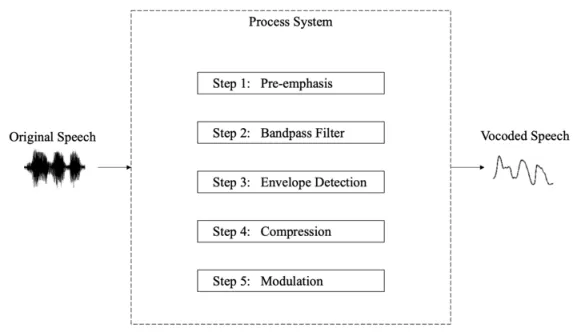
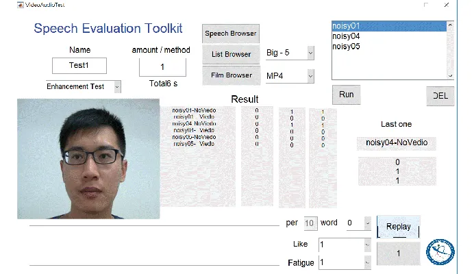
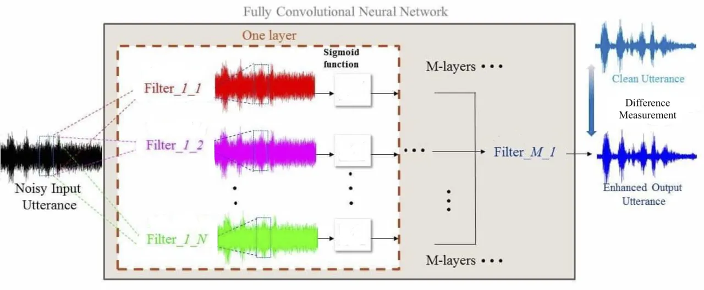
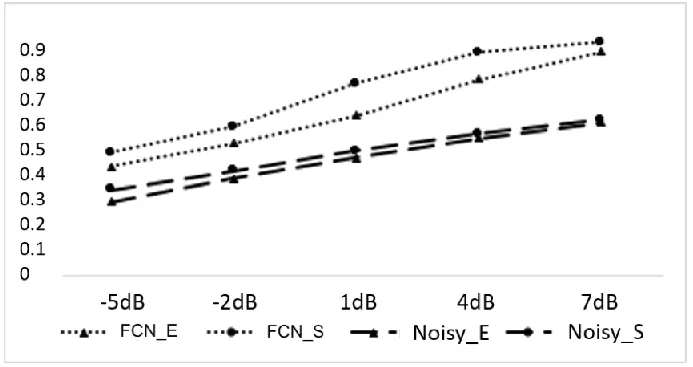
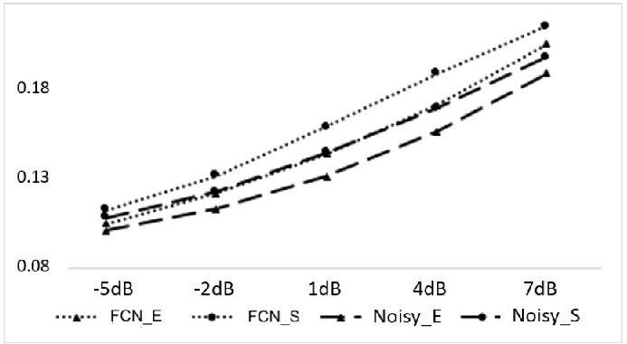
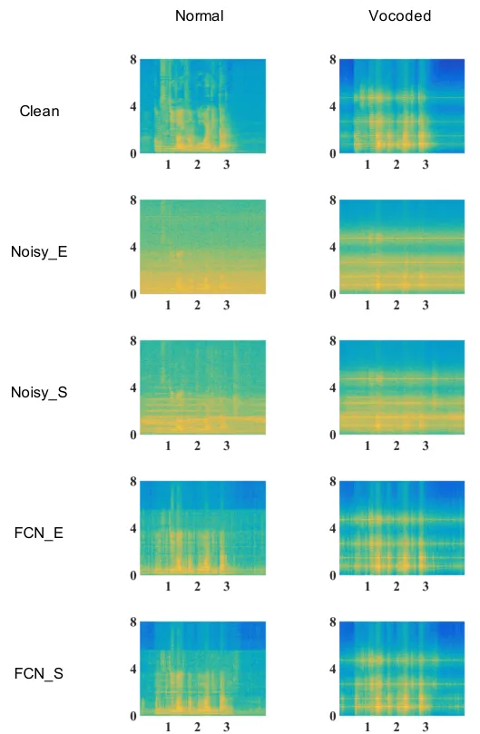
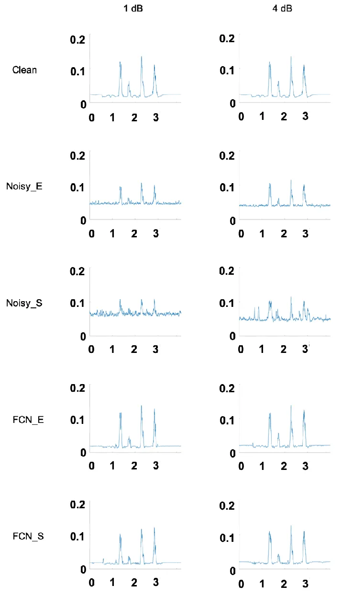
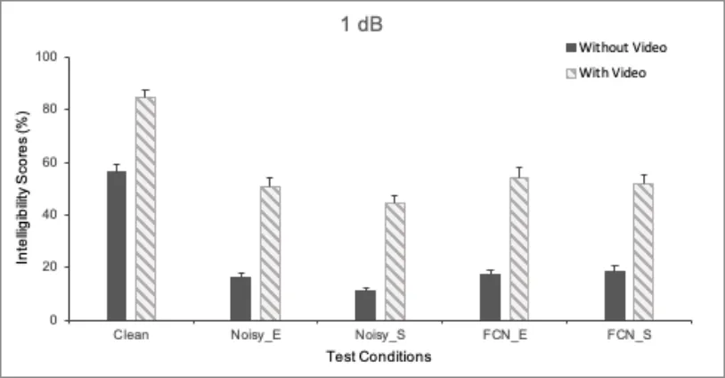
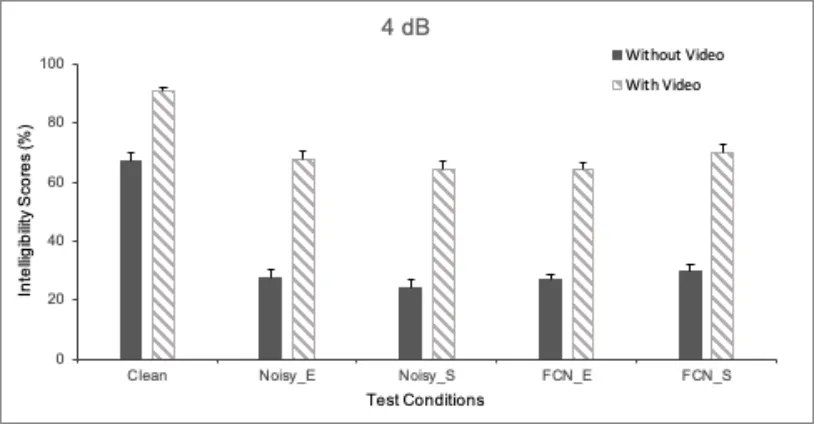
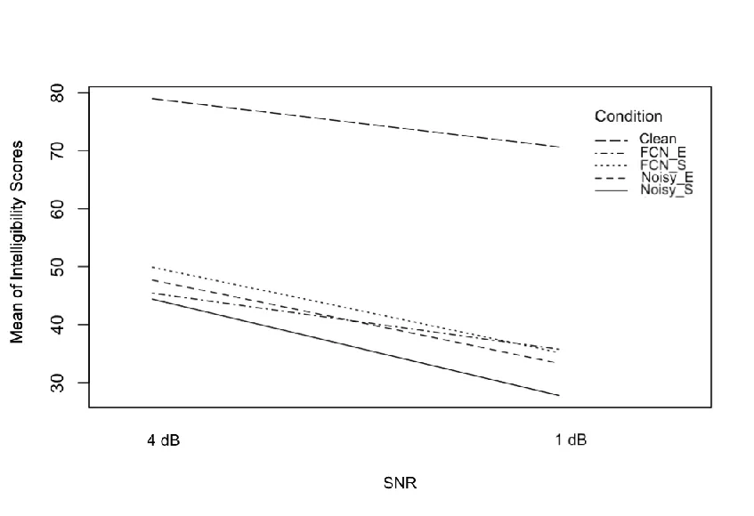

# A Study of Joint Effect on Denoising Techniques and Visual Cues to Improve Speech Intelligibility in Cochlear Implant Simulation

Rung-Yu Tseng    Tao-Wei Wang    Szu-Wei Fu    Chia-Ying Lee    Yu Tsao
^(†)^(†)thanks: Rung-Yu Tseng, Tao-Wei Wang, Szu-Wei Fu, and Yu Tsao are
with Research Center for Information Technology Innovation, Academia
Sinica, Taipei, Taiwan, corresponding e-mail:
(yu.tsao@citi.sinica.edu.tw). ^(†)^(†)thanks: Szu-Wei Fu is with
Department of Computer Science and Information Engineering, National
Taiwan University, Taipei, Taiwan.^(†)^(†)thanks: Chia-Ying Lee is with
Institute of Linguistics, Academia Sinica, Taipei,
Taiwan.^(†)^(†)thanks:

###### Abstract

Speech perception is key to verbal communication. For people with
hearing loss, the capability to recognize speech is restricted,
particularly in a noisy environment or the situations without visual
cues, such as lip-reading unavailable via phone call. This study aimed
to understand the improvement of vocoded speech intelligibility in
cochlear implant (CI) simulation through two potential methods: Speech
Enhancement (SE) and Audiovisual Integration. A fully convolutional
neural network (FCN) using an intelligibility-oriented objective
function was recently proposed and proven to effectively facilitate the
speech intelligibility as an advanced denoising SE approach.
Furthermore, audiovisual integration is reported to supply better speech
comprehension compared to audio-only information. An experiment was
designed to test speech intelligibility using tone-vocoded speech in CI
simulation with a group of normal-hearing listeners. Experimental
results confirmed the effectiveness of the FCN-based denoising SE and
audiovisual integration on vocoded speech. Also, it positively
recommended that these two methods could become a blended feature in a
CI processor to improve the speech intelligibility for CI users under
noisy conditions.

###### Index Terms: 

Speech Intelligibility, Cochlear Implant, Denoising, Speech Enhancement,
Audiovisual Integration, Fully Convolutional Neural Network (FCN).

## I Introduction

COMMUNICATION is an essential tool that people employ to achieve
particular goals, from primary needs to higher-level satisfactions
\[1\]. Verbal communication is among the most efficient means to deliver
messages people would like to share. The nature of language acquisition
in humans remains fuzzy, but theories from Skinner \[2\] and Chomsky
\[3\] to relatively modern studies \[4, 5, 6\] have touched base to
depict the speech production in humankind. Using language to
communicate, it is easier for people to understand as well as predict
others’ actions. Verbal communication, therefore, becomes a crucial
process for people to gain social reward in their everyday life \[7\].
Most importantly, valid verbal communication makes people feel not
alone.

Verbal communication relies on two aspects: being able to generate and
recognize the speech. Speech perception in humans involves both the
internal brain process and external environmental conditions. It had
been considered that auditory processing dominates the speech perception
until Sumby and Pollack \[8\] revealed the visual contributions on oral
speech intelligibility. In the following decade, the effect of
audiovisual integration was tested and proved by Erber \[9\]. Further,
McGurk \[10\] demonstrated the details on how visual information affects
speech recognition. Current research \[11, 12, 13\] regarding speech
perception has validated that the primary auditory cortex also processes
visual information and officially claimed that speech perception was no
longer merely hearing. A higher audiovisual gain has been found in
speech perception and generation in hearing-impaired children \[14\].
This implies that the brain process of audiovisual integration could be
the key for language acquisition and development to support the verbal
communication.

The surroundings where people receive sound crucially affects speech
perception as well. The speech environment which might cause variability
in speech perception is defined by the transmission, such as phones or
speakers with accents, and noise conditions \[15\]. Challenges to the
clarity of the acoustic speech signals increase the cognitive demands
for understanding, and types and levels of background noise are crucial
elements causing acoustic difficulties \[16\]. As a result, studies in
speech enhancement (SE) steps in the investigation of speech perception.
To improve the recognition accuracy under noisy speech environments, the
aim is to minimize the mismatching environmental factors interfering
with listeners by enhancing the quality and intelligibility of speech as
well as reducing the irrelevant background noise.

Distorted or degraded speech signals were used as the experimental tool
in previous studies \[17, 18, 19, 20\] to understand the process of
speech recognition in noise . The so-called “unnatural” speech signal
plays the role in the system of speech perception to increase the
mismatch between acoustic information and the environmental factors, and
forces listeners to locate the most reliable components at processing to
understand the speech. Meanwhile, distorted speech has shown the level
of endurance in human audiences when facing changes in speech structure
\[21, 22, 23\]. The success of research using distorted speech to study
speech generation and recognition has been extended from normal hearing
(NH) groups to individuals with hearing loss, such as people wearing the
cochlear implant (CI) devices\[24, 25, 26, 27, 28, 29, 30, 31, 32\].

Individuals with hearing loss are limited in their communication, and
according to the World Health Organization \[33\], hearing loss is the
fourth highest cause of disability globally. The current estimated
population with hearing loss is 466 million worldwide and the number in
2050 is expected to be greater than 900 million if no further action is
taken. Under WHO’s grades of hearing impairment \[34\], people with
severe-to-profound hearing loss were recommended to wear the hearing
aids and CI devices serve as a proved treatment option for them (12
months of age or older) by the Food and Drug Administration (FDA)
guidelines. To prevent hearing loss requires controlling risk factors.
The Centers for Disease Control and Prevention (CDC) highlights three
focus areas: early screening and diagnosis for infants and children,
protecting of hearing by recognizing harmful sound levels at home and
community, and preventing from occupational noise exposure. From the
information provided by the WHO and CDC, hearing loss is an undeniable
issue in need of the interference, and noise reduction could be a
convincing strategy to slow the growth of hearing loss.

Since speech is a complex representation, speech perception requires
higher-level cognitive processing. The feature of noise-vocoding
distorted speech \[35\] has allowed researchers destroying the entire
intelligibility in the speech to focus on structurally acoustic stimuli.
This makes the vocoded materials a promising tool in studying speech
perception. Caldwell et al. \[36\] also found that the acoustic
challenge caused by spectrally degraded speech could be used to
understand the experience of sound quality in CI users. The result could
be employed to improve the design of CI devices and further to mitigate
relatively poor speech perception for people wearing CI.

The SE process consists of two parts: to enhance the intelligibility and
quality of processed speech, and to reduce the noises in the background.
Previous well-established algorithms have helped improve the SE in CI
users \[37, 38, 29, 39, 40, 41, 42, 43\] but there are only few studies
with a newly upgrading deep-learning-based algorithm. Traditional SE
methods are based on identifying the difference between clean and noisy
speech \[44, 45, 46, 47, 48, 49\]. Emerging deep-learning-based models
could more accurately match the training and testing conditions to both
theoretically and practically optimize the SE performance. For their
multi-layered architecture, deep-learning-based models take advantages
on extracting representative features to achieve better performance in
classification or regression tasks. Speech recognition has become among
the typical processes that would benefit from this model \[50\].

The importance to include the visual information in speech perception
for CI users could be noticed through the recommendation from the WHO.
Other than hearing aids for people with severe-to-profound level of
hearing loss, the WHO also advises to at least have lip-reading or
signing essential to facilitate the communication \[34\]. Experimental
results, further, in children with CI devices have demonstrated to be
better multisensory integrators to incorporate visual and audio
information at word recognition in speechreading tasks \[51\]. The
greater audiovisual involvement in speech recognition is expected to
advance CI users’ speech perception. Comparing to CI patients, NH
participants have exhibited less variation in characteristics of
biological, surgical, and device-related elements at performing the
tasks \[52\]. Assuming similar auditory encoding and processing for both
CI and NH groups, the simulated vocoded result by the NH group is able
to get nearer the core of cognitive process beyond the unavoidable
individual differences.

This study intended to evaluate how speech intelligibility could be
improved under denoising SE technology by simulated vocoded corpus on an
NH group. A more efficient deep-learning-based denoising algorithm was
the main SE process using in current research work. As a pilot study,
the experiment was also conducted to test the effectiveness of visual
cues in speech perception. In addition, it was anticipated that the
cutting-edge deep-learning-based denoising algorithm targets different
background noise to help improve human hearing. The task additionally
includes two levels of signal-to-noise ratios (SNRs) to understand the
threshold of speech perception in noise for listeners. Furthermore, the
results from this study could shed light on the possible outcome in the
group with hearing loss, particularly for people wearing CI devices.

## II Material & Methods

Forty participants with gender balance were recruited from the Academia
Sinica community to take part in the experiment with the monetary
compensation for their time. The group ages were between 20 and 39 with
a mean age of 29.38 years old (Standard Deviation, SD, =4.63). All
participants were native Mandarin speakers with normal or
corrected-to-normal vision as well as normal hearing to perceive the
stimuli well during the experiment. Except for one left-handed male
participant, all others were right-handed. All 40 participants did not
report a history of neurological diseases or sensational problems.
Written informed consent approved by the Academia Sinica Institutional
Review Board for this study was obtained from each participant before
conducting the experiment.

The stimuli for this study were video and audio recordings of Mandarin
sentences spoken by a native speaker. The source of recordings was based
on the Taiwan Mandarin Hearing in Noise Test (Taiwan MHINT, TMHINT,
\[53\]). All TMHINT materials were unique and each consisted of 10
Chinese characters with the length about three to four seconds. Also,
they were specifically designed to have similar phonetic characteristics
across the dataset. Among the total of 320 TMHINT utterances, 200
utterances were randomly selected for the SE training set and the
remaining 120 utterances for the testing set. The utterances for
training and testing sets had no overlap between as well as the types of
noise.

The utterances were recorded in a quiet room with sufficient light and
the speaker in the video was captured from the front view. Videos were
filmed at 30 frames per second (fps) with a resolution of 1920 pixels
$`\times`$ 1080 pixels. Stereo audio channels were recorded at 48 kHz
which is precisely the same recording environmental setting as that in
Hou et al. \[54\]. The complete experiment included the practice stage
and followed by the official testing session with 20 and 100 sentences,
respectively. Both selected numbers of utterances for each session were
randomly displayed during its part. Each participant was wearing BOSE
Triport OE On-Ear Headphone at participating in the experiment.



Fig. 1: Block diagram of the four-channel tone-vocoder implementation.
The first step of speech input is to be processed by the pre-emphasis
filter. Then it is filtered by the third-order bandpass filters, and
follows to be extracted by a full-wave rectifier. Right after, there
comes a second-order lowpass filter, and the strategy ACE is used to
compress the envelope of each band. Finally, the modulated compression
generates the vocoded speech.

The experiment employed a tone-vocoder (Figure 1) as the sound generator
to present the stimulus for participants with normal hearing. In the
block diagram of a four-channel tone-vocoder, the input signal was first
processed through the pre-emphasis filter. Then the third-order
Butterworth bandpass filters filtered the emphasized signal into four
frequency bands between 400 and 6000 Hz (with cutoff frequencies of 400,
887, 1750, 3282, and 6000 Hz). The temporal envelope of each spectral
channel was extracted by a full-wave rectifier followed by a
second-order Butterworth lowpass filter. The envelope of each band was
then compressed by the advanced combinational encoder (ACE) strategy in
this study.

The ACE strategy continuously varied its compression ratio (CR) on a
frame-by-frame basis, with the maximum and minimum values of the
compressed amplitude limited within a preset range. The compressed
envelopes then modulated the amplitudes of a set of sine waves with
frequencies equal to the center frequencies (643, 1319, 2516, and 4641
Hz) of the bandpass filters. Finally, the amplitude-modulated sine waves
of the four bands were summed, and the level of the summed signal was
adjusted to produce a root-mean-square (RMS) value equal to that of the
original input signal.

Using vocoder simulations for the NH listeners under various background
noise, speech maskers or numbers of electrodes were found in many
previous studies as the proven strategy to understand and further
provide basic information on the speech processing in CI users \[55, 56,
57, 58, 59, 25, 60\]. However, vocoder simulations were not used for
estimating the precise level of performance for each single CI user.
This strategy was used to access the performance given particular
changing parameters and it allows vocoder simulations to be a valuable
tool in CI-related research. Therefore, the tone-vocoder simulation was
adapted for NH participants in the current study to understand the
possible sound processing in CI users.

To understand the intelligibility of sound processing in a noise
environment, three different conditions were used during the listening
test: without noise maskers (Clean), with noise maskers (Noisy, masking
materials came from the online dataset ’PNL 100 Nonspeech Sounds’
\[61\]), and the SE upon noise maskers. This experiment covered two
noise maskers street and engine to represent different noise types
(nonstationary and stationary), respectively. The stationary noise means
that the whole spectrum of a signal has relatively stable power within
any equal interval of frequencies, which is time-independent; while the
non-stationary noise owns the opposite characteristics.



Fig. 2: Experimental software. The experimental software is run by using
MATLAB. Figure 3 represents the condition with video information. (This
experimental toolkit is available via
https://github.com/JasonSWFu/VideoAudio)

In the experiment, all participants were randomly assigned into two
different SNR groups, 1 and 4 dB, with equal numbers of participants in
each group. In each SNR group, the testing order for different
conditions were put in random for every participants. The 120 TMHNIT
utterances in the testing set were prepared with the order of simple
randomization into each condition. Test conditions were labelled in all
figures throughout this paper as Clean (without any noise masker), FCN_E
(the FCN denoising algorithm targeting the engine noise masker), FCN_S
(the FCN denoising algorithm targeting the street noise masker), Noisy_E
(engine noising masker), and Noisy_S (street noise masker).



Fig. 3: Architecture of utterance-based raw waveform enhancement by the
deep-learning-based FCN algorithm. It provides the progress of SE that
how noisy input is filtered by multi-layered FCN denoising process.

The interface of the experimental software is shown in Figure 2, and all
participants were well instructed to perform the computer-based
experiment. During both practice and formal experimental stages,
participants were asked to focus on the stimuli by listening to the
sound and reading the lips in the video. The stimuli were presented with
the sound level of 60 dB, while the level would be adjusted within upper
or lower 5 dB upon participants’ request. After the stimuli were
displayed, participants had to repeat what they recognized accordingly.
If they accidentally did not hear or see during the presentation of
stimuli, such as clearing the throat or blinking, they would have one
more opportunity to re-take it. Once they made the final repetition, the
correct answer would be displayed on the screen for checking the
accuracy of speech recognition. The accurate character counts were then
recorded by choosing the number from zero to ten on the interface.

The fully convolutional neural network (FCN), a deep-learning-based
model, was the main algorithm for the SE \[50, 62\] in this study (the
codes for FCN denoising algorithm is available at
https://github.com/JasonSWFu/End-to-end-waveform-utterance-enhancement).
The FCN was a waveform- and utterance-based denoising SE system. The FCN
model could effectively preserve features from local structures with a
relatively smaller number of weights for its convolution-layers-only
architecture. In addition, FCN convolved the time-domain signal with
filters instead of multiplying the frequency representation of a signal
by the frequency response of the filter. A feature in the time domain
carried much less corresponding energy information than that in the
frequency domain, but mainly utilized the relation with its neighbors to
represent the frequency concept. This crucial independency stood out
that FCN was able to become a more effective denoising algorithm than
other conventional fully-connected deep neural networks (DNNs) for
waveform-based denoising SE \[63, 64, 50\].

Most traditional deep-learning models have been designed for a
frame-wise process; the result would be less accurate for their problem
of incontinuity. The FCN denoising algorithm could fix this by achieving
utterance-based enhancement. Furthermore, an FCN could address not
merely fixed-length utterances as all fully connected layers were
removed in the FCN. This meant, in the FCN denoising algorithm, that
input features from different lengths would not have to fit in the
matrix multiplication. Assuming that the filter length was l and the
length of input signal was L (without padding), the length of the
filtered output would be L - l + 1. For that FCN contained only
convolutional layers, the filters in the operation of the convolution
could process inputs with different lengths. More specifically, during
the training stage, the FCN-based SE modelcan be trained in an
end-to-end utterance-wise manner; while in the testing period, this FCN
model can be carried out in a segment-wise form.

In this study, the FCN denoisng algorithm was built to try to
incorporate both the mean square error (MSE) and the short-time
objective intelligibility (STOI) into the objective function. This aim
is to minimize the loss during the training of FCN. The process could be
represented by the equation below:

```math
\displaystyle O(w_{u}(t),\hat{w}_{u}(t)) \displaystyle=(\frac{\alpha}{L_{u}}||w_{u}(t)-\hat{w}_{u}(t)||_{2}^{2} \tag{1}
```

```math
\displaystyle-stoi(w_{u}(t),\hat{w}_{u}(t)))
```

where $`w_{u}(t)`$ and $`\hat{w}_{u}(t)`$ are the clean and estimated
utterance with index $`u`$, respectively. $`L_{u}`$ is the length of
$`w_{u}(t)`$ (note that each utterance has a different length), and
$`\alpha`$ is the weighting factor of the two targets (which is set the
same as used in our previous work \[50\]). $`stoi(.)`$ is the function
that calculates the STOI value of the noisy/processed utterance given
the clean one. Hence, the weights in FCN could be updated by gradient
descent as follows:

```math
f_{i,j,k}^{(n+1)}=f_{i,j,k}^{(n)}+\frac{\lambda}{B}\sum_{u=1}^{B}{\frac{\partial O(w_{u}(t),\hat{w}_{u}(t))}{\partial\hat{w}_{u}(t)}\frac{\partial\hat{w}_{u}(t)}{\partial f_{i,j,k}^{(n)}}} \tag{2}
```

Where $`f_{i,j,k}^{(n+1)}`$ is the i-th layer, j-th filter, k-th filter
coefficient in FCN. n is the index of the iteration number, B is the
batch size, and $`\lambda`$ is the learning rate.

The structure of the overall proposed FCN for utterance-based waveform
enhancement was shown in Figure 3, where Filter_m_n denoted the nth
filter in layer m. Each filter coiled together all generated waveforms
from the previous layer and then created one further filtered waveform
utterance. The goal of SE was to produce one clean utterance, in which
the last layer only contained one final filter, Filter_M_1. This
completed end-to-end framework indicated again the efficiency of the FCN
denoising algorithm to process the utterance-based enhancement without
additional pre- or post-processing.

Compared to other deep-learning-based SE models, FCN provided a better
SE result with reduced model sizes \[64\]. Meanwhile, FCN was proven to
more effectively enhance speech on non-stationary noises \[65\]. The
STOI was among the major evaluation methods used in related SE studies
\[66, 67\]. The STOI measure for FCN indicated a better result than the
Noisy condition, particularly for the non-stationary noise type (Figure
4a). In addition, the normalized covariance measure (NCM) was adopted to
understand the performance in processing the speech utterances \[68, 69,
70\]. The NCM was based on the covariance between the probing and
responsive envelope signals. This metric required only a small number of
bands (not limited to a contiguous set) and used simple binary (1 or 0)
weighting functions. It was therefore frequently employed to measure the
speech intelligibility of vocoded speech \[71\]. In addition, NCM
measure in predicting reliably the intelligibility of noise-suppressed
speech was demonstrated its success by Ma et. al. \[68\]. The NCM
measure in this study showed consistently higher scores under FCN
conditions, especially when targeting a non-stationary noise type
(Figure 4b) as STOI did.



(a) STOI Scores



(b) NCM scores

Fig. 4: FCN evaluation scores: STOI (a) and NCM (b). Along with the
change in SNRs, the FCN received higher scores for both STOI and NCM
compared to Noisy conditions, regardless of the types of noise (engine
and street); this indicated that the FCN could better facilitate the
speech recognition.

Not only were the STOI and NCM scores able to quantitatively specify the
enhancement resulting from the FCN denoising algorithm in the speech
intelligibility, but spectrogram plots and amplitude envelopes also
qualitatively showed the advantage of the FCN denoising algorithm.
According to Haykin \[72\], when studying array processing and signal
detection, a time-varying signal could be spectrally represented as a
spectrogram. A spectrogram could reveal how noise is reduced to
highlight the acoustic characteristics of utterances.





Fig. 5: Spectrograms of an utterance under different conditions (x axis:
time in second, y axis: frequency in kHz). The spectrograms show that
FCN denoising algorithm helped reconstruct better utterances under two
distinguished types of noise, engine and street, for both original and
vocoded speech.

Fig. 6: Amplitude envelopes from the second-channel frequency band (x
axis: time in second, y axis: amplitude). The amplitude envelops from
the FCN denoising algorithm resemble to the original clean target
sentence, and it indicates the processed speech of better speech
intelligibility.

As shown in Figure 5, sentences of Clean condition are arranged in the
top row of the spectrograms, and other four conditions are followed from
the second to bottom rows. With the help of FCN denoising algorithm, the
noise maskers were reduced to represent a similar spectral plots as that
of the normal utterances (left panel in Figure 5). In addition, the
features of each utterance were highlighted under conditions with the
FCN denoising algorithm, particularly in vocoded CI (right panel in
Figure 5) compared to Normal ones. The spectrogram results demonstrated
that the FCN denoising algorithm was able to diminish the noise
distortion with less noise residual as shown in the plots. This implied
more promising improvement of speech intelligibility via FCN modeling.

From a past research result (American National Standard: Methods for
Calculation of the Speech Intelligibility Index \[73\]), the
middle-frequency band has a crucial position in the speech
intelligibility process. In this study, the four-channel tone-vocoded
speech was used to generate sentences as the experimental stimuli to
construct a more challenging condition for CI simulation. Given the
circumstances, the amplitude envelopes from the second channel were
plotted as comparisons for two different SNR tasks, 1 and 4 dBs, under
each condition.

The amplitude envelopes provided strong evidence as shown in Figure 6
that after applying FCN denoising algorithm to the target sentence, the
waveform was nearer the original shape (a clean condition; the top row
for both SNR tasks). The amplitude of each peak was more similar to the
source sentence than sentences of the Noisy conditions. In addition, the
smaller amplitude could be more clearly represented while it remained
distorted under the Noisy conditions. The results of the amplitude
envelopes suggest that better speech intelligibility could be achieved
using the FCN denoising algorithm.

## III Results

The descriptive statistic of the listening test showed that the entire
performance (mean of 46.91 and SD of 26.34) with the aid of video was
better than the audio-only conditions. Participants showed a rather
diverse level at conducting different SNR tasks with the separate SD of
25.87 for 1-dB and 25.32 for 4-dB. When working on conditions
manipulated as video-aided and audio-only, people’s hearing exhibited a
relatively smaller variation in the SD of 19.38 and 20.18, respectively.

|                     |     |        |         |         |            |
| ------------------- | --- | ------ | ------- | ------- | ---------- |
|                     | df  | Sum Sq | Mean Sq | F value | Pr($`>`$F) |
| SNR                 | 1   | 16154  | 16154   | 108.923 | $`<`$2e-16 |
| Video               | 1   | 121104 | 121104  | 816.556 | $`<`$2e-16 |
| Condition           | 4   | 79604  | 19901   | 134.184 | $`<`$2e-16 |
| SNR:Video           | 1   | 237    | 237     | 1.599   | 0.2068     |
| SNR:Condition       | 4   | 1006   | 252     | 1.696   | 0.1501     |
| Video:Condition     | 4   | 1916   | 479     | 3.229   | 0.0126     |
| SNR:Video:Condition | 4   | 493    | 123     | 0.831   | 0.5061     |

TABLE I: ANOVA statistical testing proved that each experimental
manipulations (SNR, Video, and Condition) functioned in a statistically
significant manner in affecting participants’ performance. In addition,
across different conditions, visual aids greatly facilitated to improve
the listening test results.

The Analysis of Variance (ANOVA, in Table I) indicated that three
variables, SNR, Video, and Conditions, used in this study were
individually reaching the statistical significance to facilitate the
performance of listening test. Notably, the p-value of 0.0126 for Video
versus Conditions showed the statistically significant effect on visual
facilitation. This confirmed that visual cues were having effect on
conditions, but specific aids for each condition were in need of looking
into the difference. The paired T-Tests were then conducted to examine
the detailed visual aids across different conditions and the effect from
the rest of variables, SNR and Conditions, under two SNR groups.

| Video | Noise  | Condition | Mean  | SD    | t       | df  | p-value  |
| ----- | ------ | --------- | ----- | ----- | ------- | --- | -------- |
| Yes   | Street | FCN       | 51.90 | 16.28 | 2.3664  | 19  | 0.02874  |
|       |        | Noisy     | 44.60 | 12.98 |         | 19  |          |
|       | Engine | FCN       | 53.95 | 18.02 | 1.2257  | 19  | 0.2353   |
|       |        | Noisy     | 50.60 | 16.38 |         | 19  |          |
| No    | Street | FCN       | 18.50 | 9.74  | 3.8595  | 19  | 0.001056 |
|       |        | Noisy     | 11.00 | 6.18  |         | 19  |          |
|       | Engine | FCN       | 17.55 | 7.92  | 0.64491 | 19  | 0.5267   |
|       |        | Noisy     | 16.10 | 8.46  |         | 19  |          |

TABLE II: Paired T-Test results for 1 dB. For tasks involving the
non-stationary noise type, street, FCN showed better facilitation
compared to Noisy conditions, particularly when there were no visual
cues to further help people’s hearing.

The paired T-Test results provided more information regarding how the
FCN denoising algorithm facilitates human’s listening performance
compared to the Noisy condition. In Table II, the T-Test results for the
lower-SNR tasks indicated that particularly under the non-stationary
noise type, street, the FCN better helped people during the listening
test. Regardless of visual aids, conditions of FCN targeting street
noise both reached the statistical significance with p-values of 0.02874
(with video) and 0.001056 (without video), respectively. It was
noteworthy that when lacking visual aids for people’s hearing, the
benefit from FCN became more recognizable as the p-value reached its
most practical statistical significance ($`<`$ 0.01). The result of
higher-SNR tasks was listed on the Table III. It was similar to the
lower-SNR results, yet only one statistical significance, as p-value of
0.02611, had been reported on the condition FCN targeting street noise
when there was no visual aids.

| Video | Noise  | Condition | Mean  | SD    | t        | df  | p-value |
| ----- | ------ | --------- | ----- | ----- | -------- | --- | ------- |
| Yes   | Street | FCN       | 70.10 | 12.68 | 1.7302   | 19  | 0.09981 |
|       |        | Noisy     | 64.50 | 12.39 |          | 19  |         |
|       | Engine | FCN       | 64.10 | 12.29 | -1.4236  | 19  | 0.1708  |
|       |        | Noisy     | 67.65 | 12.36 |          | 19  |         |
| No    | Street | FCN       | 29.70 | 9.71  | 2.4127   | 19  | 0.02611 |
|       |        | Noisy     | 24.25 | 11.75 |          | 19  |         |
|       | Engine | FCN       | 26.70 | 9.99  | -0.33007 | 19  | 0.745   |
|       |        | Noisy     | 27.70 | 13.12 |          | 19  |         |

TABLE III: Paired T-Test results for 4 dB. The overall tendency had
similar results as 1 dB but with higher p-values. This confirmed again
that FCN functioned as a reliable facilitator, especially when having
background noise such as the non-stationary noise type, street, and the
lack of other aids such as visual cues.

The higher- and lower-SNR tasks had resembled results in the paired
T-Test. It was only that greater difference between the FCN and Noisy
conditions under the non-stationary noise type, street, to be proved
statistically significant for the 1-dB task regardless of visual aids
and 4-dB task without video. However, the performance of FCN targeting
engine noise was not differentiated from the Noisy condition
statistically.

The insignificant T-Test results for these two distinct SNR tasks
suggested that there might be some preference for FCN targeting engine
noise. When it came without the visual aid, the p-values of FCN
targeting engine noise were 0.745 for 4-dB versus 0.5267 for 1-dB tasks.
Another set of outcome for the tasks with the visual aid were 0.1708 for
4-dB versus 0.2353 for 1-dB tasks. In statistics, lower p-value means
stronger evidence in favor of alternative hypothesis to imply the effect
of experimental manipulation. In conditions with video aids, lower
p-value reasonably appeared in 4-dB tasks. For the conditions without
video aids, however, lower p-value fell in the 1-dB tasks to hint that
FCN better helped the hearing during lower-SNR even with no additional
visual information. For the condition of FCN targeting engine noise, the
variation of p-values in different SNR groups might reveal a tendency
about the degree of improvement by FCN.

The percentage of accuracy in listening test was drawn in Figure 7, and
the provided results were alike as for the statistical testing.
According to the Figure 7a, results of lower-SNR tasks showed generally
greater scores in the FCN compared to the Noisy conditions, regardless
of the types of noise masker. However, taking the visual information
into consideration, participants was doing better in FCN targeting
engine noise; while without visual aids, the higher accuracy fell in the
condition of FCN targeting street noise. The performance for higher-SNR
tasks unveiled another tendency in Figure 7b. The highest accuracy still
occurred at the condition FCN targeting the non-stationary noise masker,
street. However, the results here showed that not both FCN conditions
dominated in the 4-dB tasks as them did in the lower-SNR tasks.



(a) 1 dB



(b) 4 dB

Fig. 7: Listening test results: performance of (a) 1-dB tasks and (b)
4-dB tasks. Conditions with video are marked in a diagonal pattern for
both SNRs while solidly filled bars indicate conditions without visual
information.

The analysis of the ANOVA and the paired T-Test presented no
statistically significant indication for the FCN targeting the
stationary noise type, engine, but the improved performance through the
facilitation by FCN did exist. The interaction plot was to show that two
independent variables interact if the effect of one of the variables
varies depending on the level of the other variable. Figure 8 displayed
the interaction between variables Condition and SNR. During the
higher-SNR task, which were relatively clear for human hearing, the FCN
targeting engine noise was merely in the third spot of all the effective
conditions. As tasks moved toward lower-SNR, however, the FCN targeting
engine noise became a better performer while the other three conditions
remained the same ranking. This matched the paired T-Test results that
there might be a possible preference for FCN targeting engine noise to
step in the facilitation of human hearing.



Fig. 8: Interaction plot between two distinct SNRs over different
conditions. FCN targeting engine noise better facilitated human hearing
during the lower-SNR tasks while the other three conditions remained the
same ranking in spite of the change of different SNR tasks.

Both inferential and descriptive statistics in different SNR tasks
suggested the ease of a higher-SNR sound to be caught by people’s
hearing. In general, for both SNRs, the Clean condition without any
noise masking took participants the least effort to hear the sounds;
however, visual information helping improve hearing was overwhelmingly
across every single condition, no matter which SNR tasks were involved.

The listening test scores and statistical results of ANOVA and the
paired T-Test all demonstrated that the FCN was able to serve as an
effective denoising algorithm and helped enhance the intelligibility of
speech recognition. Furthermore, the paired T-Test results and the
interaction plot provided more clues regarding how the FCN contributed
to human hearing and what conditions might be the best fit for FCN
involvement.

## IV Discussion

Consistent with past research \[74, 75, 76\], visual information is of
great help in facilitating people’s hearing. In current listening test
results, the performance was improved with the aid of visual cues across
various conditions. However, the level of facilitation differs. First,
the visual information works well even as background noise appeared and
helps particularly better in tasks with specific types of noise maskers.
For higher-SNR tasks, with the help of visual information, listeners are
able to considerably improve their performance under the non-stationary
noise type, street, with the FCN denoising process. The effectiveness of
visual cues shows the most extent compared to other conditions.

The performance of both lower- and higher-SNR tasks reveals that there
might be a critical threshold for listeners to detect the sound in
noise. In the result of lower-SNR tasks, the support from the FCN
denoising is manifest for both types of noise maskers. The possible
reason could be that 1 dB is too challenging for listeners to
differentiate the background noise from the targeting sounds; both
background noise and targeting sounds become homogeneous during sound
processing. Visual cues and FCN help sharpen the targeting sounds for
listeners to distinguish them from the background noise. Alternatively,
the higher SNR task allows participants to rather effortlessly hear both
the sound and noise; therefore, the boundary of the noise and targeting
sound emerges. People with normal hearing can more easily process the
target-perceiving and denoising in higher-SNR tasks. The threshold for
the NH and CI groups might not be the same, but the critical threshold
is an important clue to enhance the speech intelligibility.

This study also collected evidence from the post-analysis to reconsider
the function of the FCN denoising algorithm for different SNR tasks. The
listening test scores and the interaction plot revealed the FCN
targeting engine noise was slightly higher than the FCN targeting street
noise within lower-SNR tasks. The result implied that in spite of the
effect of the FCN targeting engine noise was not universally observed
across different conditions, the weighting of FCN effectiveness could
become more obvious once people have less cues or more interrupting
background noise for them to understand the targeting sounds. As a
result, the listening test performance indicates that the FCN denoising
algorithm works differently toward alternative types of noise in
higher-SNR tasks but dominates in lower-SNR tasks as participants need
the enhancement to detect the comparatively weaker line between
targeting sounds and background noises as the phenomenon of stochastic
resonance \[77, 78, 79\]. That is, the FCN denoising algorithm works
particularly competent in a noisy listening environment.

The FCN denoising algorithm plays a role to potentially improve
participants’ performance in the listening test. Given the noise
interference, participants’ performance under FCN conditions was the
best among the test results, for both lower- or higher-SNR tasks. In
addition, the accuracy rate of the FCN conditions is generally higher
when involving background noise such as street sounds, a non-stationary
noise type. This matches the results of Tsai \[65\]’s previous study
that the FCN extracts cleaner speech to achieve an improved listening
test result, particularly for a non-stationary noise type. Comparing to
purely Noisy conditions, listeners hear better under the stationary
noise type. The listening test results provide more confidence to record
the effectiveness of the FCN denoising algorithm in enhancing the speech
perception.

## V Conclusions

The FCN algorithm is demonstrated as a better denoising SE model as it
is similar to a traditional CNN but not limited to process fixed-length
inputs \[50\]. Given the flexibility that FCN can contribute, the
denoising technology has been leveled up and the listening test results
in this study further prove the effectiveness of FCN in vocoded speech
intelligibility. In addition, under specified noise maskers, conditions
with FCN were able to provide listeners more enhanced speech perception
to obtain higher accuracy in scores. Since the preliminary result in CI
simulation is positive in verifying the superiority of the FCN, having
CI users participate in the future investigation is the most empirical
means to determine the real effect on the group with hearing loss.

The future implement based on the results from this paper will be
anticipating in two levels. First step is to transform the finding about
the joint effect onto audiovisual SE. Hou et al. \[54\] have reported an
audiovisual SE model using CNN to generate enhanced speech and then
reconstruct to images. In current study, the SE model was based on FCN
and the following work should be to build the fused encoder-decoder
FCN-based SE model for audiovisual SE. After completing the audiovisual
SE, during the next stage, it should be to apply the ready audiovisual
integration algorithm onto multi-devices for both ears and eyes.

As all might be aware that most CI users have only hearing impairment
with no dysfunctions for other senses, such as sight, smell or touch,
and it seems reasonable that wearing aids for users are mainly to
facilitate their hearing. However, as our brain process the information
in the way of sensory integration, the vision of CI users is used to
help their weakened auditory sense. In addition, during the situations
that CI users receive less or none visual information, for instance,
conversations during the phone call, it is necessary for them to have
the help from multi-devices. CI users are able to expect better hearing
from both the FCN denoising algorithm within their CI processor and
converted images to show enhanced speech visually on their wearing
goggles. This study expects to further provide the scientific evidence
to include the visual information in the assistive auditory devices with
better help for CI users.

As a pilot study for audiovisual-aided vocoded speech intelligibility,
the listening test results have successfully demonstrated its
improvement. The performance in the experiment validates the power of
audiovisual integration to enhance vocoded speech intelligibility by the
much better accuracy rate under conditions with visual aid. This
experimental evidence strongly implies the possibility of an updated
audiovisual CI system. Applying the human process of audiovisual
information onto current operating algorithm in CI processors is a means
to better the speech perception for people wearing CI devices. In
addition, given this encouraging listening test results in CI
simulation, one can envision an advanced fusion system joining
deep-learning-based FCN denoising algorithm and audiovisual integration
to further boost the speech intelligibility for the hearing-loss group.

To consolidate the updated fusion system, functional optimization of the
FCN denoising modeling is a necessary future work as current CI devices
remain multiple engineering issues on the speech processor \[80, 81\].
The deep structure, however, still requires more computational hardware
needs and higher costs than those of traditional models. To properly
allocate these resources, developing quantization techniques were used
to compress the model \[82\]. With the help of quantized
deep-learning-based model, speech intelligibility would display a more
progressive improvement in its reduced processing time \[83\]. The
fusion of audiovisual integration and denoising SE modeling could be
working competently in CI devices as the revamped hardware is evolved
progressively in the near future.

Speech intelligibility is crucial for both NH and hearing-loss groups to
manage the conversations in social interaction, and denoising technology
serves as a tool to improve the interpersonal communication by enhancing
the quality of hearing. Beneficial from the development of a
deep-learning technique, the FCN denoising algorithm makes progress
based on the advantages of conventional modelings to advance towards a
more promising enhancement for speech intelligibility. In addition, the
impact of visual cues on enhancing the vocoded speech is clearly proven
through the experiment. The listening test results in this CI simulation
provide solid evidence that both audiovisual integration and SE
technology could greatly facilitate people’s hearing even in a noisy
environment. To the final goal to contribute to a hearing-loss group,
applying both audiovisual information and FCN in a future investigation
involving CI users is a foreseeable process to determine the true value
of deep-learning-based modeling for SE and the influence of audiovisual
integration.

## Acknowledgment

This work was supported in part by the Ministry of Science and
Technology of Taiwan under Grant MOST 106-2221-E-001-017-MY2,
107-2221-E-001-012-MY2, 108-2628-E-001-002-MY3, and 108-2811-E-001-501-.
The authors would also like to sincerely thank Dr. Kevin Chun-Hsien Hsu
from the Institute of Cognitive Neuroscience, National Central
University, and Dr. Hao Ho from the Institute of Statistical Science,
Academia Sinica, for providing insight and expertise that greatly
assisted this research.

## References

- \[1\] R. B. Rubin and M. M. Martin, Interpersonal communication
  motives, pp. 287–307, Hampton Press, Cresskill, NJ, 1998.
- \[2\] B.F. Skinner, Verbal Behavior, Copley Publishing Group, Acton ,
  MA, 1957.
- \[3\] N. Chomsky, Aspects of the Theory of Syntax, MIT Press,
  Cambridge, MA, 1965.
- \[4\] M. Tomasello, Constructing a language: A usage-based theory of
  language acquisition, Harvard University Press, Cambridge, MA, 2003.
- \[5\] B. Ambridge and E.V.M. Lieven, Child Language Acquisition:
  Contrasting theoretical approaches, Cambridge University Press,
  London, 2011.
- \[6\] A.M. Glenberg and V. Gallese, “Action-based language: a theory
  of language acquisition, comprehension and production,” Cortex, vol.
  48, no. 7, pp. 905–922, 2012.
- \[7\] M. E Roloff, Interpersonal Communication: The Social Exchange
  Approach, Sage, Beverly Hills, CA, 1981.
- \[8\] W. H. Sumby and I. Pollack, “Visual contribution to speech
  intelligibility in noise,” J. Acoust. Soc. Am., vol. 26, no. 2, pp.
  212–215, 1954.
- \[9\] N.P. Erber, “Interaction of audition and vision in the
  recognition of oral speech stimuli,” J. Speech Hear. Res., vol. 12,
  no. 2, pp. 423–425, 1969.
- \[10\] H. McGurk and J. MacDonald, “Hearing lips and seeing voices,”
  Nature, vol. 264, no. 5588, pp. 746–748, 1976.
- \[11\] K. Okada, J.H. Venezia, W. Matchin, K. Saberi, and G. Hickok,
  “An fmri study of audiovisual speech perception reveals multisensory
  interactions in auditory cortex,” PLoS One, vol. 8, no. 6, pp.
  e68959, 2013.
- \[12\] J. Shinozaki, N. Hiroe, M. Sato, T. Nagamine, and K. Sekiyama,
  “Impact of language on functional connectivity for audiovisual speech
  integration,” Sci Rep, vol. 6, pp. 31388, 2016.
- \[13\] B.L. Giordano, R.A. Ince, J. Gross, P.G. Schyns, S. Panzeri,
  and C. Kayser, “Contributions of local speech encoding and functional
  connectivity to audio-visual speech perception,” Elife, 2017,
  (published online).
- \[14\] L. Lachs, D.B. Pisoni, and K.I. Kirk, “Use of audiovisual
  information in speech perception by prelingually deaf children with
  cochlear implants: a first report,” Ear Hear, vol. 22, no. 3, pp.
  236–251, 2001.
- \[15\] Y. Gong, “Speech recognition in noisy environments: A survey,”
  Speech Commun, vol. 16, no. 3, pp. 261–291, 1995.
- \[16\] J.E. Peelle, “Listening effort: How the cognitive consequences
  of acoustic challenge are reflected in brain and behavior,” Ear Hear,
  vol. 39, no. 2, pp. 204–214, 2018.
- \[17\] E. Foulke and T. Sticht, “Review of research on intelligibility
  and comprehension of accelerated speech,” Psychol Bull, vol. 72, no.
  1, pp. 50–62, 1969.
- \[18\] H. Dehaan, “The relationship of estimated comprehensibility to
  the rate of connected speech,” Percept Psychophys, vol. 32, no. 1, pp.
  27–31, 1982.
- \[19\] G. Heiman, R. Leo, G. Leighbody, and K. Bowler, “Word
  intelligibility decrements and the comprehension time-compressed
  speech,” Percept Psychophys, vol. 40, no. 6, pp. 407–411, 1986.
- \[20\] P. W. Dawson, A. A. Hersbach, and B. A. Swanson, “An adaptive
  australian sentence test in noise (austin),” Ear Hear, vol. 34, no. 5,
  pp. 592–600, 2013.
- \[21\] R.E. Remez, P.E. Rubin, D.B. Pisoni, and T.D. Carrell, “Speech
  perception without traditional speech cues,” Science, vol. 212, no.
  4497, pp. 947–950, 1981.
- \[22\] G. Altmann and D. Young, “Factors affecting adaptation to
  time-compressed speech,” in EUROSPEECH 1993, Berlin, Germany,
  September 22–25, 1993, pp. 333–336.
- \[23\] R.V. Shannon, “Understanding hearing through deafness,” Proc
  Natl Acad Sci U S A, vol. 104, no. 17, pp. 6883–6884, 2007.
- \[24\] B. L. Fetterman and E. H. Domico, “Speech recognition in
  background noise of cochlear implant patients,” Otolaryngol. Head Neck
  Surg., vol. 126, no. 3, pp. 257–263, 2002.
- \[25\] G. Stickney, F. Zeng, R.A. Litovsky, and P.F. Assmann,
  “Cochlear implant speech recognition with speech maskers,” J. Acoust.
  Soc. Am., vol. 116, no. 2, pp. 1081–1091, 2004.
- \[26\] L. Xu, Y. Li, J. Hao, X. Chen, S. A. Xue, and D. Han, “Tone
  production in mandarin-speaking children with cochlear implants: A
  preliminary study,” Acta oto-laryngologica, vol. 124, no. 4, pp.
  363–367, 2004.
- \[27\] C. Wei, K. Cao, X. Jin, X. Chen, and F. Zeng, “Psychophysical
  performance and mandarin tone recognition in noise by cochlear implant
  users,” Ear Hear, vol. 28, no. 2 Suppl, pp. 62S, 2007.
- \[28\] L. Xu and Y. Zheng, “Spectral and temporal cues for phoneme
  recognition in noise,” J. Acoust. Soc. Am., vol. 122, no. 3, pp.
  1758–1764, 2007.
- \[29\] F. Chen, Y. Hu, and M. Yuan, “Evaluation of noise reduction
  methods for sentence recognition by mandarin-speaking cochlear implant
  listeners,” Ear Hear, vol. 36, no. 1, pp. 61–71, 2015.
- \[30\] Y. Mao and L. Xu, “Lexical tone recognition in noise in
  normal-hearing children and prelingually deafened children with
  cochlear implants,” Int. J. Audiol., vol. 56, no. sup2, pp.
  S23–S30, 2017.
- \[31\] B. Qi, Y. Mao, J. Liu, B. Liu, and L. Xu, “Relative
  contributions of acoustic temporal fine structure and envelope cues
  for lexical tone perception in noise,” J. Acoust. Soc. Am., vol. 141,
  no. 5, pp. 3022–3029, 2017.
- \[32\] C. Ren, J. Yang, D. Zha, Y. Lin, H. Liu, Y. Kong, S. Liu, and
  L. Xu, “Spoken word recognition in noise in mandarin-speaking
  pediatric cochlear implant users,” Int J Pediatr Otorhinolaryngol.,
  vol. 113, pp. 124–130, 2018.
- \[33\] WHO, Addressing the Rising Prevalence of Hearing Loss, World
  Health Organization, Geneva, 2018.
- \[34\] B.O. Olusanya, A.C. Davis, and H.J. Hoffman, “Hearing loss
  grades and the international classification of functioning, disability
  and health,” World Health Organization. Bulletin of the World Health
  Organization, vol. 97, no. 10, pp. 725–728, 2019.
- \[35\] S. Scott, C. Blank, S. Rosen, and R. Wise, “Identification of a
  pathway for intelligible speech in the left temporal lobe,” Brain,
  vol. 123, no. Pt. 12, pp. 2400–2406, 2000.
- \[36\] M.T. Caldwell, N.T. Jiam, and C.J. Limb, “Assessment and
  improvement of sound quality in cochlear implant users,” Laryngoscope
  Investig Otolaryngol, vol. 2, no. 3, pp. 119–124, 2017.
- \[37\] P. W. Dawson, S. J. Mauger, and A. A. Hersbach, “Clinical
  evaluation of signal-to-noise ratio–based noise reduction in nucleus®
  cochlear implant recipients,” Ear Hear, vol. 32, no. 3, pp.
  382–390, 2011.
- \[38\] S. J. Mauger, K. Arora, and P. W. Dawson, “Cochlear implant
  optimized noise reduction,” Journal of Neural Engineering, vol. 9, no.
  6, pp. 065007, 2012.
- \[39\] T. Goehring, F. Bolner, J. J. Monaghan, van Dijk, A. Zarowski,
  and S. Bleeck, “Speech enhancement based on neural networks improves
  speech intelligibility in noise for cochlear implant users,” Hear
  Res., vol. 344, pp. 183–194, 2017.
- \[40\] D. Wang and J. Chen, “Supervised speech separation based on
  deep learning: An overview,” IEEE Trans. Acoust., Speech, Signal
  Process, vol. 26, no. 10, pp. 1702–1726, 2018.
- \[41\] Y. Zhao, D. Wang, E. M. Johnson, and E. W. Healy, “A deep
  learning based segregation algorithm to increase speech
  intelligibility for hearing-impaired listeners in reverberant-noisy
  conditions,” J. Acoust. Soc. Am., vol. 144, no. 3, pp.
  1627–1637, 2018.
- \[42\] T. Goehring, M. Keshavarzi, R. P. Carlyon, and B. C. Moore,
  “Using recurrent neural networks to improve the perception of speech
  in non-stationary noise by people with cochlear implants,” PsyArXiv,
  2019, (published online).
- \[43\] N. Mamun, S. Khorram, and J. H. Hansen, “Convolutional neural
  network-based speech enhancement for cochlear implant recipients,”
  arXiv:1907.02526, 2019, (published online).
- \[44\] S. Boll, “Suppression of acoustic noise in speech using
  spectral subtraction,” IEEE Trans. Acoust., Speech, Signal Process,
  vol. 27, no. 2, pp. 113–120, 1979.
- \[45\] Y. Ephraim and D. Malah, “Speech enhancement using a
  minimum-mean square error short-time spectral amplitude estimator,”
  IEEE Trans. Acoust., Speech, Signal Process, vol. 32, no. 6, pp.
  1109––1121, 1984.
- \[46\] P. Scalart and J.V. Filho, “Speech enhancement based on a
  priori signal to noise estimation,” in ICASSP 1996, Atlanta, GA, USA,
  May 9–9, 1996, pp. 629–632.
- \[47\] A. Rezayee and S. Gazor, “An adaptive klt approach for speech
  enhancement,” IEEE Speech Audio Process, vol. 9, no. 2, pp.
  87–95, 2001.
- \[48\] Y. Xu, J. Du, L. Dai, and C. Lee, “A regression approach to
  speech enhancement based on deep neural networks,” IEEE Trans.
  Acoust., Speech, Signal Process, vol. 23, no. 1, pp. 7–19, 2015.
- \[49\] A. Pandey and D. Wang, “A new framework for cnn-based speech
  enhancement in the time domain,” IEEE Trans. Acoust., Speech, Signal
  Process, vol. 27, no. 7, pp. 1179–1188, 2019.
- \[50\] S. Fu, T. Wang, Y. Tsao, X. Lu, and H. Kawai, “End-to-end
  waveform utterance enhancement for direct evaluation metrics
  optimization by fully convolutional neural networks,” IEEE/ACM Trans.
  Audio, Speech, Language Process, vol. 26, no. 9, pp. 1570–1584, 2018.
- \[51\] J. Rouger, S. Lagleyre, B. Fraysse, S. Denéve, O. Déguine, and
  P.M. Barone, “Evidence that cochlear-implanted deaf patients are
  better multisensory integrators,” Proc Natl Acad Sci U S A, vol. 104,
  no. 17, pp. 7295–7300, 2007.
- \[52\] A.N. Waked, S. Dougherty, and M.J. Goupell, “Vocoded speech
  perception with simulated shallow insertion depths in adults and
  children,” J. Acoust. Soc. Am., vol. 141, no. 1, pp. EL45–EL50, 2017.
- \[53\] M. W. Huang, “Development of taiwan mandarin hearing in noise
  test,” M.S. thesis, Department of Speech Language Pathology and
  Audiology, National Taipei University of Nursing and Health
  Science, 2005.
- \[54\] J. Hou, S. Wang, Y. Lai, Y. Tsao, H. Chang, and H. Wang,
  “Audio-visual speech enhancement using multimodal deep convolutional
  neural networks,” IEEE Trans. Emerg. Topics Comput. Intell., vol. 2,
  no. 2, pp. 117–128, 2018.
- \[55\] R.V. Shannon, F. Zeng, V. Kamath, J. Wygonski, and M. Ekelid,
  “Speech recognition with primarily temporal cues,” Science, vol. 270,
  no. 5234, pp. 303–304, 1995.
- \[56\] Dorman MF, Loizou PC, and Rainey D., “Speech intelligibility as
  a function of the number of channels of stimulation for signal
  processors using sine-wave and noise-band outputs,” J. Acoust. Soc.
  Am., vol. 102, no. 4, pp. 2403–2411, 1997a.
- \[57\] M.F. Dorman, P.C. Loizou, and D. Rainey, “Simulating the effect
  of cochlear-implant electrode insertion depth on speech
  understanding,” J. Acoust. Soc. Am., vol. 102, no. 5 Pt 1, pp.
  2993–2996, 1997b.
- \[58\] Q.J. Fu, R.V. Shannon, and X. Wang, “Effects of noise and
  spectral resolution on vowel and consonant recognition: Acoustic and
  electric hearing,” J. Acoust. Soc. Am., vol. 104, no. 6, pp.
  3586–3596, 1998.
- \[59\] L.M. Friesen, R.V. Shannon, D. Baskent, and X. Wang, “Speech
  recognition in noise as a function of the number of spectral channels:
  comparison of acoustic hearing and cochlear implants,” J. Acoust.
  Soc. Am., vol. 110, no. 2, pp. 1150–1163, 2001.
- \[60\] Y. Lai, Y. Tsao, and F. Chen, “Effects of adaptation rate and
  noise suppression on the intelligibility of compressed-envelope based
  speech,” PLoS One, vol. 10, no. 7, pp. e0133519, 2015.
- \[61\] G. Hu and D.L. Wang, “A tandem algorithm for pitch estimation
  and voiced speech segregation,” IEEE Trans. Audio, Speech, Language
  Process, vol. 18, no. 8, pp. 2067–2079, 2010.
- \[62\] S. Gong, Z. Wang, T. Sun, Y. Zhang, C. D. Smith, L. Xu, and
  J. Liu, “Dilated fcn: Listening longer to hear better,” in IEEE
  Workshop on Applications of Signal Processing to Audio and Acoustics
  (WASPAA) 2019, New Paltz, NY, USA, 2019, pp. 254–258.
- \[63\] J. Long, E. Shelhamer, and T. Darrell, “Fully convolutional
  networks for semantic segmentation,” in Proceeding of IEEE Conference
  on Computer Vision and Pattern Recognition (CVPR) 2015, Boston, MA,
  USA, June 7–12, 2015, pp. 3431–3440.
- \[64\] S. Fu, Y. Tsao, X. Lu, and H. Kawai, “Raw waveform-based speech
  enhancement by fully convolutional networks,” in APSIPA ASC 2017,
  Kuala Lumpur, Malaysia, December 12–15, 2017, pp. 006–012.
- \[65\] Y. Tsai and L.D. Liao, “Fully convolutional network (fcn) model
  to extract clear speech signals on non-stationary noises of human
  conversations for cochlear implants,” in IEEE MIT Undergraduate
  Research Technology Conference (URTC) 2017, Cambridge, MA, USA,
  November 3–5, 2017, pp. 1–4.
- \[66\] C.H. Taal, R.C. Hendriks, R. Heusdens, and J. Jensen, “An
  algorithm for intelligibility prediction of time–frequency weighted
  noisy speech,” IEEE Trans. Audio, Speech, Language Process, vol. 19,
  no. 7, pp. 2125–2136, 2011.
- \[67\] T. Gao, J. Du, L. Dai, and C. Lee, “Snr-based progressive
  learning of deep neural network for speech enhancement,” in
  INTERSPEECH 2016, San Francisco, CA, USA, September 8–12, 2016, pp.
  3713–3717.
- \[68\] J. Ma, Y. Hu, and P.C. Loizou, “Objective measures for
  predicting speech intelligibility in noisy conditions based on new
  band-importance functions,” J. Acoust. Soc. Am., vol. 125, no. 5, pp.
  3387–3405, 2009.
- \[69\] F. Chen and P.C. Loizou, “Analysis of a simplified normalized
  covariance measure based on binary weighting functions for predicting
  the intelligibility of noise-suppressed speech,” J. Acoust. Soc. Am.,
  vol. 128, no. 6, pp. 3715–3723, 2010.
- \[70\] Y. Lai, F. Chen, S. Wang, X. Lu, Y. Tsao, and C. Lee, “A deep
  denoising autoencoder approach to improving the intelligibility of
  vocoded speech in cochlear implant simulation,” IEEE Trans. Biomed.
  Eng., vol. 64, no. 7, pp. 1568–1578, 2017.
- \[71\] F. Chen and P.C. Loizou, “Predicting the intelligibility of
  vocoded and wideband mandarin chinese,” J. Acoust. Soc. Am., vol.
  129, no. 5, pp. 3281–3290, 2011.
- \[72\] S. Haykin, Ed., Advances in Spectrum Analysis and Array
  Processing (vol. III), pp. 404–509, Prentice-Hall, Inc., New Jersey,
  NJ, 1995.
- \[73\] ANSI, American National Standard Methods for Calculation of the
  Speech Intelligibility Index, S3.5. Acoustical Society of America, New
  York, 1997.
- \[74\] T.H. Chen and D.W. Massaro, “Seeing pitch: visual information
  for lexical tones of mandarin-chinese,” J. Acoust. Soc. Am., vol.
  123, no. 4, pp. 2356–2366, 2008.
- \[75\] S. Desai, G. Stickney, and F. Zeng, “Auditory-visual speech
  perception in normal-hearing and cochlear-implant listeners,” J.
  Acoust. Soc. Am., vol. 123, no. 1, pp. 428–440, 2008.
- \[76\] C. Tremblay, F. Champoux, F. Lepore, and H. Théoret,
  “Audiovisual fusion and cochlear implant proficiency,” Restor Neurol
  Neurosci, vol. 28, no. 2, pp. 283–291, 2010.
- \[77\] L. Gammaitoni, P. Hänggi, P. Jung, and F. Marchesoni,
  “Stochastic resonance,” Reviews of modern physics, vol. 70, no. 1, pp.
  223, 1998.
- \[78\] F. Zeng, Q. J. Fu, and R. Morse, “Human hearing enhanced by
  noise,” Brain research, vol. 869, no. 1-2, pp. 251–255, 2000.
- \[79\] S. E. Behnam and F. Zeng, “Noise improves suprathreshold
  discrimination in cochlear-implant listeners,” Hearing Research, vol.
  186, no. 1-2, pp. 91–93, 2003.
- \[80\] F. Zeng, “Trends in cochlear implants,” Trends Amplif., vol. 8,
  no. 1, pp. 1–34, 2004.
- \[81\] F. Zeng, S. Rebscher, W. Harrison, X. Sun, and H. Feng,
  “Cochlear implants: system design, integration and evaluation,” IEEE
  Rev. Biomed. Eng., vol. 1, pp. 115–142, 2008.
- \[82\] Y.T. Hsu, Y. Lin, S. Fu, Y. Tsao, and T. Kuo, “A study on
  speech enhancement using exponent-only floating point quantized neural
  network (eofp-qnn),” in IEEE Spoken Language Technology Workshop (SLT)
  2018, Athens, Greece, December 18–21, 2018, pp. 566–573.
- \[83\] J.H. Ko, J. Fromm, M. Philipose, I. Tashev, and S. Zarar,
  “Precision scaling of neural networks for efficient audio processing,”
  arXiv:1712.01340, 2017, (published online).
