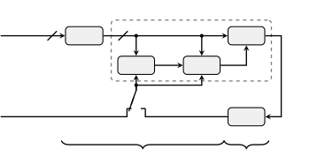
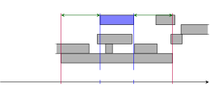
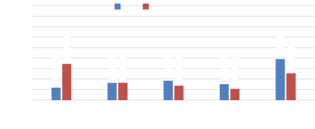
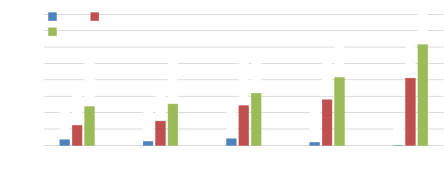
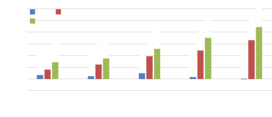
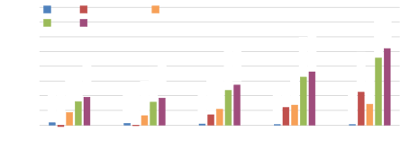
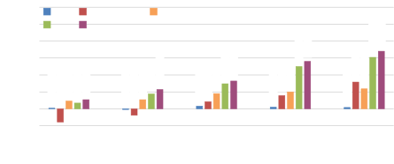

# An Investigation into the Effectiveness of Enhancement in ASR Training and Test for CHiME-5 Dinner Party Transcription

Catalin Zorila    Christoph Boeddeker    Rama Doddipatla    Reinhold
Haeb-Umbach ^(†)^(†)thanks: ©2019 IEEE. Accepted for ASRU 2019.

###### Abstract

Despite the strong modeling power of neural network acoustic models,
speech enhancement has been shown to deliver additional word error rate
improvements if multi-channel data is available. However, there has been
a longstanding debate whether enhancement should also be carried out on
the ASR training data. In an extensive experimental evaluation on the
acoustically very challenging CHiME-5 dinner party data we show that:
(i) cleaning up the training data can lead to substantial error rate
reductions, and (ii) enhancement in training is advisable as long as
enhancement in test is at least as strong as in training. This approach
stands in contrast and delivers larger gains than the common strategy
reported in the literature to augment the training database with
additional artificially degraded speech. Together with an acoustic model
topology consisting of initial CNN layers followed by factorized TDNN
layers we achieve with $`41.6\text{\,}\%`$ and $`43.2\text{\,}\%`$ WER
on the DEV and EVAL test sets, respectively, a new single-system
state-of-the-art result on the CHiME-5 data. This is a $`8\text{\,}\%`$
relative improvement compared to the best word error rate published so
far for a speech recognizer without system combination.

###### Index Terms: 

multi-talker speech recognition, guided source separation, deep
learning, CHiME-5

^(†)^(†)address: ¹ Toshiba Cambridge Research Laboratory, Cambridge,
United Kingdom  
² Paderborn University, Department of Communications Engineering,
Paderborn, Germany

## 1 Introduction

Neural networks have outperformed earlier Gaussian Mixture Model (GMM)
based acoustic models in terms of modeling power and increased
robustness to acoustic distortions. Despite that, speech enhancement has
been shown to deliver additional word error rate (WER) improvements, if
multi-channel data is available. This is due to their ability to exploit
spatial information, which is reflected by phase differences of
microphone channels in the Short Time Fourier Transform (STFT) domain.
This information is not accessible by the Automatic Speech Recognition
(ASR) system, at least not if it operates on the common log mel spectral
or cepstral feature sets. Also, dereverberation algorithms have been
shown to consistently improve ASR results, since the temporal dispersion
of the signal caused by reverberation is difficult to capture by an ASR
acoustic model \[1\].

However, there has been a long debate whether it is advisable to apply
speech enhancement on data used for ASR training, because it is
generally agreed upon that the recognizer should be exposed to as much
acoustic variability as possible during training, as long as this
variability matches the test scenario \[2, 3, 4\]. Multi-channel speech
enhancement, such as acoustic beamforming (BF) or source separation,
would not only reduce the acoustic variability, it would also result in
a reduction of the amount of training data by a factor of $`M`$, where
$`M`$ is the number of microphones \[5\]. Previous studies have shown
the benefit of training an ASR on matching enhanced speech \[6, 7\] or
on jointly training the enhancement and the acoustic model \[8\].
Alternatively, the training data is often artificially increased by
adding even more degraded speech to it. For instance, Ko et al. \[9\]
found that adding simulated reverberated speech improves accuracy
significantly on several large vocabulary tasks. Similarly, Manohar et
al. \[10\] improved the WER of the baseline CHiME-5 system by relative
$`5.5\text{\,}\%`$ by augmenting the training data with approx.
$`160\text{\,}\mathrm{h}\mathrm{r}\mathrm{s}`$ of simulated reverberated
speech. However, not only can the generation of new training data be
costly and time consuming, the training process itself is also prolonged
if the amount of data is increased.

In this contribution we advocate for the opposite approach. Although we
still believe in the argument that ASR training should see sufficient
variability, instead of adding degraded speech to the training data, we
clean up the training data. We make, however, sure that the remaining
acoustic variability is at least as large as on the test data. By
applying a beamformer to the multi-channel input, we even reduce the
amount of training data significantly. Consequently, this leads to
cheaper and faster acoustic model training.

We perform experiments using data from the CHiME-5 challenge which
focuses on distant multi-microphone conversational ASR in real home
environments \[11\]. The CHiME-5 data is heavily degraded by
reverberation and overlapped speech. As much as $`23\text{\,}\%`$ of the
time more than one speaker is active at the same time \[12\]. The
challenge’s baseline system poor performance
(about $`80\text{\,}\%`$ WER) is an indication that ASR training did not
work well. Recently, Guided Source Separation (GSS) enhancement on the
test data was shown to significantly improve the performance of an
acoustic model, which had been trained with a large amount of
unprocessed and simulated noisy data \[13\]. GSS is a spatial mixture
model based blind source separation approach which exploits the
annotation given in the CHiME-5 database for initialization and, in this
way, avoids the frequency permutation problem \[14\].

We conjectured that cleaning up the training data would enable a more
effective acoustic model training for the CHiME-5 scenario. We have
therefore experimented with enhancement algorithms of various strengths,
from relatively simple beamforming over single-array GSS to a quite
sophisticated multi-array GSS approach, and tested all combinations of
training and test data enhancement methods. Furthermore, compared to the
initial GSS approach in \[14\], we describe here some modifications,
which led to improved performance. We also propose an improved neural
acoustic modeling structure compared to the CHiME-5 baseline system
described in \[10\]. It consists of initial Convolutional Neural Network
(CNN) layers followed by factorized TDNN (TDNN-F) layers, instead of a
homogeneous TDNN-F architecture.

Using a single acoustic model trained with
$`308\text{\,}\mathrm{h}\mathrm{r}\mathrm{s}`$ of training data, which
resulted after applying multi-array GSS data cleaning and a three-fold
speed perturbation, we achieved a WER of $`41.6\text{\,}\%`$ on the
development (DEV) and $`43.2\text{\,}\%`$ on the evaluation (EVAL) test
set of CHiME-5, if the test data is also enhanced with multi-array GSS.
This compares very favorably with the recently published top-line in
\[13\], where the single-system best result, i.e., the WER without
system combination, was $`45.1\text{\,}\%`$ and $`47.3\text{\,}\%`$ on
DEV and EVAL, respectively, using an augmented training data set of
$`4500\text{\,}\mathrm{h}\mathrm{r}\mathrm{s}`$ total.

The rest of this paper is structured as follows. Section 2 describes the
CHiME-5 corpus, Section 3 briefly presents the guided source separation
enhancement method, Section 4 shows the ASR experiments and the results,
followed by a discussion in Section 5. Finally, the paper is concluded
in Section 6.

## 2 CHiME-5 corpus description

The CHiME-5 corpus comprises twenty dinner party recordings (sessions)
lasting for approximately $`2\text{\,}\mathrm{h}\mathrm{r}\mathrm{s}`$
each. A session contains the conversation among the four dinner party
participants. Recordings were made in kitchen, dining and living room
areas with each phase lasting for a minimum of
$`30\text{\,}\mathrm{m}\mathrm{i}\mathrm{n}\mathrm{s}`$. 16 dinner
parties were used for training, 2 were used for development, and 2 were
used for evaluation.

There were two types of recording devices collecting CHiME-5 data:
distant 4-channels (linear) Microsoft Kinect arrays (referred to as
units or ‘U’) and in-ear Soundman OKM II Classic Studio binaural
microphones (referred to as worn microphones or ‘W’). Six Kinect arrays
were used in total and they were placed such that at least two units
were able to capture the acoustic environment in each recording area.
Each dinner party participant wore in-ear microphones which were
subsequently used to facilitate human audio transcription of the data.
The devices were not time synchronized during recording. Therefore, the
W and the U signals had to be aligned afterwards using a correlation
based approach provided by the organizers. Depending on how many arrays
were available during test time, the challenge had a single (reference)
array and a multiple array track. For more details about the corpus, the
reader is referred to \[11\].

## 3 Guided source separation

GSS enhancement is a blind source separation technique originally
proposed in \[14\]¹¹ 1
[https://github.com/fgnt/pb_chime5](https://github.com/fgnt/pb_chime5)
to alleviate the speaker overlap problem in CHiME-5. Given a mixture of
reverberated overlapped speech, GSS aims to separate the sources using a
pure signal processing approach. An Expectation Maximization (EM)
algorithm estimates the parameters of a spatial mixture model and the
posterior probabilities of each speaker being active are used for mask
based beamforming.

An overview block diagram of this enhancement by source separation is
depicted in Fig. 1. It follows the approach presented in \[13\], which
was shown to outperform the baseline version. The system operates in the
STFT domain and consists of two stages: (1) a dereverberation stage, and
(2) a guided source separation stage. For the sake of simplicity, the
overall system is referred to as GSS for the rest of the paper.
Regarding the first stage, the multiple input multiple output version of
the Weighted Prediction Error (WPE) method was used for dereverberation
($`M`$ inputs and $`M`$ outputs) \[15, 16\]²² 2
[https://github.com/fgnt/nara_wpe](https://github.com/fgnt/nara_wpe)
and, regarding the second stage, it consists of a spatial Mixture Model
(MM) \[17\] and a source extraction (SE) component. The model has five
mixture components, one representing each speaker, and an additional
component representing the noise class.

Figure 1: Overview of speech enhancement system with Weighted Prediction
Error (WPE) dereverberation, Mixture Model (MM) estimation, Source
Extractor (SE) and Automatic Speech Recognition (ASR).

Figure 2: Visualization of time annotations on a fragment of the CHiME-5
data. The grey bars indicate source activity, the inner vertical blue
lines denote the utterance boundaries of a segment of speaker P01, and
the outer vertical red lines the boundaries of the extended utterance,
consisting of the segment and the “context”, on which the mixture model
estimation algorithm operates.

The role of the MM is to support the source extraction component for
estimating the target speech. The class affiliations computed in the
E-step of the EM algorithm are employed to estimate spatial covariance
matrices of target signals and interferences, from which the
coefficients of an Minimum Variance Distortionless Response (MVDR)
beamformer are computed \[18\]. The reference channel for the beamformer
is estimated based on an SNR criterion\[19\]. The beamformer is followed
by a postfilter to reduce the remaining speech distortions  \[20\],
which in turn is followed by an additional (optional) masking stage to
improve crosstalk suppression. Those masks are also given by the
mentioned class affiliations. For the single array (CHiME-5) track,
simulations have shown that multiplying the beamformer output with the
target speaker mask improves the performance on the U data, but the same
approach degrades the performance in the multiple array track \[14\].
This is because the spatial selectivity of a single array is very
limited in CHiME-5: the speakers’ signals arrive at the array, which is
mounted on the wall at some distance, at very similar impinging angles,
rendering single array beamforming rather ineffective. Consequently,
additional masking has the potential to improve the beamformer
performance. Conversely, the MM estimates are more accurate in the
multiple array case since they benefit from a more diverse spatial
arrangement of the microphones, and the signal distortions introduced by
the additional masking rather degrade the performance. Consequently, for
our experiments we have used the masking approach for the single array
track, but not for the multiple array one.

GSS exploits the baseline CHiME-5 speaker diarization information
available from the transcripts (annotations) to determine when multiple
speakers talk simultaneously (see Fig. 2). This crosstalk information is
then used to guide the parameter estimation of the MM both during EM
initialization (posterior masks set to one divided by the number of
active speakers for active speakers’ frames, and zero for the non-active
speakers) and after each E-step (posterior masks are clamped to zero for
non-active speakers).

The initialization of the EM for each mixture component is very
important for the correct convergence of the algorithm. If the EM
initialization is close enough to the final solution, then it is
expected that the algorithm will correctly separate the sources and
source indices are not permuted across frequency bins. This has a major
practical application, since frequency permutation solvers like \[21\]
become obsolete.

Temporal context also plays an important role in the EM initialization.
Simulations have shown that a large context of 15 seconds left and right
of the considered segment improves the mixture model estimation
performance significantly for CHiME-5 \[14\]. However, having such a
large temporal context may become problematic when the speakers are
moving, because the estimated spatial covariance matrix can become
outdated due to the movement \[13\]. Alternatively, one can run the EM
first with a larger temporal context until convergence, then drop the
context and re-run it for some more iterations. As shown later in the
paper, this approach did not improve ASR performance. Therefore, the
temporal context was only used for dereverberation and the mixture model
parameter estimation, while for the estimation of covariance matrices
for beamforming the context was dropped and only the original segment
length was considered \[13\].

Another avenue we have explored for further source separation
improvement was to refine the baseline CHiME-5 annotations using ASR
output (see Fig. 1). A first-pass decoding using an ASR system is used
to predict silence intervals. Then this information is used to adjust
the time annotations, which are used in the EM algorithm as described
above. When the ASR decoder indicates silence for a speaker, the
corresponding class posterior in the MM is forced to zero.

Depending on the number of available arrays for CHiME-5, two flavours of
GSS enhancement were used in this work. In the single array track, all 4
channels of the array are used as input ($`M=4`$), and the system is
referred to as GSS1. In the multi array track, all six arrays are
stacked to form a 24 channels super-array ($`M=24`$), and this system is
denoted as GSS6. The baseline time synchronization provided by the
challenge organizers was sufficient to align the data for GSS6.

## 4 Experiments

### 4.1 General configuration

Experiments were performed using the CHiME-5 data. Distant microphone
recordings (U data) during training and/or testing were processed using
the speech enhancement methods depicted in Table 1. Speech was either
left unprocessed, enhanced using a weighted delay-and-sum beamformer
(BFIt) \[22\] with or without dereverberation (WPE), or processed using
the guided source separation (GSS) approach described in Section 3. In
Table 1, the strength of the enhancement increases from top to bottom,
i.e., GSS6 signals are much cleaner than the unprocessed ones.

The standard CHiME-5 recipes were used to: (i) train GMM-HMM alignment
models, (ii) clean up the training data, and (iii) augment the training
data using three-fold speed perturbation. The acoustic feature vector
consisted of 40-dimensional MFCCs appended with 100-dimensional
i-vectors. By default, the acoustic models were trained using the
Lattice-Free Maximum Mutual Information (LF-MMI) criterion and a 3-gram
language model was used for decoding \[11\]. Discriminative training
(DT) \[23\] and an additional RNN-based language model (RNN-LM) \[24\]
were applied to improve recognition accuracy for the best performing
systems.

| Enhancement                        | Array        | Label    |
| ---------------------------------- | ------------ | -------- |
| Unprocessed                        | Single/Multi | None     |
| BeamformIt \[22\]                  | Single       | BFIt     |
| WPE + BeamformIt \[10\]            | Single       | WPE+BFIt |
| WPE + GSS1 + BF w/o Context \[14\] | Single       | GSS1     |
| WPE + GSS6 + BF w/o Context \[14\] | Multi        | GSS6     |

Table 1: Naming of the speech enhancement methods.

### 4.2 Acoustic model

The initial baseline system \[11\] of the CHiME-5 challenge uses a Time
Delay Neural Network (TDNN) acoustic model (AM). However, recently it
has been shown that introducing factorized layers into the TDNN
architecture facilitates training deeper networks and also improves the
ASR performance \[25\]. This architecture has been employed in the new
baseline system for the challenge \[10\]. The TDNN-F has 15 layers with
a hidden dimension of 1536 and a bottleneck dimension of 160; each layer
also has a resnet-style bypass-connection from the output of the
previous layer, and a “continuous dropout” schedule \[10\]. In addition
to the TDNN-F, the newly released baseline³³ 3
[https://github.com/kaldi-asr/kaldi/tree/master/egs/chime5/s5b](https://github.com/kaldi-asr/kaldi/tree/master/egs/chime5/s5b)
also uses simulated reverberated speech from worn microphone recordings
for augmenting the training set, it employes front-end speech
dereverberation and beamforming (WPE+BFIt), as well as robust i-vector
extraction using 2-stage decoding.

CNNs have been previously shown to improve ASR robustness \[26\].
Therefore, combining CNN and TDNN-F layers is a promising approach to
improve the baseline system of \[10\]. To test this hypothesis, a
CNN-TDNNF AM architecture⁴⁴ 4
[https://github.com/kaldi-asr/kaldi/tree/master/egs/swbd/s5c](https://github.com/kaldi-asr/kaldi/tree/master/egs/swbd/s5c)
consisting of 6 CNN layers followed by 9 TDNN-F layers was compared
against an AM having 15 TDNN-F layers. All TDNN-F layers have the
topology described above.

| AM           | Enh. in trng / $`\mathrm{h}\mathrm{r}\mathrm{s}`$ | Enh. in test | WER ($`\%`$)        |
| ------------ | ------------------------------------------------- | ------------ | ------------------- |
| TDNNF \[10\] | None / $`1416`$                                   | WPE+BFIt     | $`69.6`$ ($`61.7`$) |
| CNN-TDNNF    | None / $`1416`$                                   | WPE+BFIt     | 67.2 (58.7)         |
| CNN-TDNNF    | None / $`316`$                                    | BFIt         | $`68.7`$ ($`61.3`$) |

Table 2: Comparison of baseline TDNN-F \[10\] and proposed CNN-TDNNF AM
s in terms of WER for the DEV (EVAL) set.

ASR results are given in Table 2. The first two rows show that replacing
the TDNN-F with the CNN-TDNNF AM yielded more than $`2\text{\,}\%`$
absolute WER reduction. We also trained another CNN-TDNNF model using
only a small subset (worn + 100k utterances from arrays) of training
data (about $`316\text{\,}\mathrm{h}\mathrm{r}\mathrm{s}`$ in total)
which has produced slightly better WER s compared with the baseline
TDNN-F trained on a much larger dataset (roughly
$`1416\text{\,}\mathrm{h}\mathrm{r}\mathrm{s}`$ in total). For
consistency, 2-stage decoding was used for all results in Table 2. We
conclude that the CNN-TDNNF model outperforms the TDNNF model for the
CHiME-5 scenario and, therefore, for the remainder of the paper we only
report results using the CNN-TDNNF AM.

### 4.3 Enhancement effectiveness for ASR training and test

An extensive set of experiments was performed to measure the WER impact
of enhancement on the CHiME-5 training and test data. We test
enhancement methods of varying strengths, as described in Section 4.1,
and the results are depicted in Table 3. In all cases, the (unprocessed)
worn dataset was also included for AM training since it was found to
improve performance (supporting therefore the argument that data
variability helps ASR robustness).

| Enh. in trng ($`\mathrm{h}\mathrm{r}\mathrm{s}`$) | Enhancement in test |                     |                     |                     |
| ------------------------------------------------- | ------------------- | ------------------- | ------------------- | ------------------- |
|                                                   | None                | BFIt                | GSS1                | GSS6                |
| None ($`2046`$)                                   | $`69.3`$ ($`59.9`$) | $`69.1`$ ($`59.7`$) | $`62.2`$ ($`58.2`$) | $`51.8`$ ($`51.6`$) |
| BFIt ($`680`$)                                    | $`68.9`$ ($`59.1`$) | $`68.5`$ ($`58.5`$) | $`59.9`$ ($`57.3`$) | $`48.8`$ ($`49.9`$) |
| GSS1 ($`791`$)                                    | $`74.3`$ ($`67.5`$) | $`73.7`$ ($`66.4`$) | $`53.0`$ ($`49.6`$) | $`48.0`$ ($`47.5`$) |
| GSS6 ($`308`$)                                    | $`78.5`$ ($`73.1`$) | $`76.9`$ ($`69.2`$) | $`58.0`$ ($`56.1`$) | 45.4 (45.7)         |

Table 3: WER results on the DEV (EVAL) set and various combinations of
speech enhancement for ASR training and test (CNN-TDNNF AM). Amount of
training data ($`\mathrm{h}\mathrm{r}\mathrm{s}`$) is also specified.

In Table 3, in each row the recognition accuracy improves monotonically
from left to right, i.e., as the enhancement strategy on the test data
becomes stronger. Reading the table in each column from top to bottom,
one observes that accuracy improves with increasing power of the
enhancement on the training data, however, only as long as the
enhancement on the training data is not stronger than on the test data.
Compared with unprocessed training and test data (None-None), GSS6-GSS6
yields roughly $`35\text{\,}\%`$ ($`24\text{\,}\%`$) relative WER
reduction on the DEV (EVAL) set, and $`12\text{\,}\%`$
($`11\text{\,}\%`$) relative WER reduction when compared with the
None-GSS6 scenario. Comparing the amount of training data used to train
the acoustic models, we observe that it decreases drastically from no
enhancement to the GSS6 enhancement.

### 4.4 State-of-the-art single-system for CHiME-5

To facilitate comparison with the recently published top-line in \[13\]
(H/UPB), we have conducted a more focused set of experiments whose
results are depicted in Table 4. As explained in Section 5.1, we opted
for \[13\] instead of \[14\] as baseline because the former system is
stronger. The experiments include refining the GSS enhancement using
time annotations from ASR output (GSS w/ ASR), performing discriminative
training on top of the AMs trained with LF-MMI and performing RNN LM
rescoring. All the above helped further improve ASR performance. We
report performance of our system on both single and multiple array
tracks. To have a fair comparison, the results are compared with the
single-system performance reported in\[13\].

For the _single array track_, the proposed system without RNN LM
rescoring achieves $`16\text{\,}\%`$ ($`11\text{\,}\%`$) relative WER
reduction on the DEV (EVAL) set when compared with System8 in \[13\]
(row one in Table 4). RNN LM rescoring further helps improve the
proposed system performance.

For the _multi array track_, the proposed system without RNN LM
rescoring achieved $`6\text{\,}\%`$ ($`7\text{\,}\%`$) relative WER
reduction on the DEV (EVAL) set when compared with System16 in \[13\]
(row six in Table 4).

|          |              |              |                |                |                |                               |
| -------- | ------------ | ------------ | -------------- | -------------- | -------------- | ----------------------------- |
| Track    | System       | Enh. in trng | Enh. in        |                |                |                               |
| test     | DT           | RNN-LM       | WER ($`\%`$)   |                |                |                               |
| Single   | H/UPB \[13\] | None         | GSS1 w/ ASR    | $`\checkmark`$ |                | $`58.3`$ ($`53.1`$)           |
|          | Proposed     | GSS1         | GSS1 w/ ASR    |                |                | $`50.2`$ ($`48.4`$)           |
|          | Proposed     | GSS1         | GSS1 w/ ASR    | $`\checkmark`$ |                | $`49.1`$ ($`47.3`$)           |
|          | Proposed     | GSS1         | GSS1 w/ ASR    | $`\checkmark`$ | $`\checkmark`$ | $`\bf{48.6}`$ ($`\bf{46.7}`$) |
|          | Proposed     | GSS1         | GSS1 w/ oracle | $`\checkmark`$ | $`\checkmark`$ | $`47.3`$ ($`46.1`$)           |
| Multiple | H/UPB \[13\] | None         | GSS6 w/ ASR    | $`\checkmark`$ |                | $`45.1`$ ($`47.3`$)           |
|          | Proposed     | GSS6         | GSS6 w/ ASR    |                |                | $`43.2`$ ($`44.2`$)           |
|          | Proposed     | GSS6         | GSS6 w/ ASR    | $`\checkmark`$ |                | $`42.3`$ ($`43.9`$)           |
|          | Proposed     | GSS6         | GSS6 w/ ASR    | $`\checkmark`$ | $`\checkmark`$ | $`\bf{41.6}`$ ($`\bf{43.2}`$) |
|          | Proposed     | GSS6         | GSS6 w/ oracle | $`\checkmark`$ | $`\checkmark`$ | $`39.9`$ ($`42.0`$)           |

Table 4: Comparison of reference \[13\] and proposed (single) systems in
terms of WER for the DEV (EVAL) set. Test data enhancement was refined
using ASR alignments or oracle alignments.

We also performed a test using GSS with the oracle alignments (GSS w/
oracle) to assess the potential of time annotation refinement (gray
shade lines in Table 4). It can be seen that there is some, however not
much room for improvement.

Finally, cleaning up the training set not only boosted the recognition
performance, but managed to do so using a fraction of the training data
in \[13\], as shown in Table 5. This translates to significantly faster
and cheaper training of acoustic models, which is a major advantage in
practice.

| Track    | System       | Amount trng data ($`\mathrm{h}\mathrm{r}\mathrm{s}`$) | WER ($`\%`$)                  |
| -------- | ------------ | ----------------------------------------------------- | ----------------------------- |
| Single   | H/UPB \[13\] | $`4500`$                                              | $`58.3`$ ($`53.1`$)           |
|          | Proposed     | $`791`$                                               | $`\bf{48.6}`$ ($`\bf{46.7}`$) |
| Multiple | H/UPB \[13\] | $`4500`$                                              | $`45.1`$ ($`47.3`$)           |
|          | Proposed     | $`308`$                                               | $`\bf{41.6}`$ ($`\bf{43.2}`$) |

Table 5: Comparison of the reference \[13\] and proposed systems in
terms of amount of training data.

## 5 Discussion

### 5.1 Temporal context configuration for GSS

Our experiments have shown that the temporal context of some GSS
components has a significant effect on the WER. Two cases are
investigated: (i) partially dropping the temporal context for the EM
stage, and (ii) dropping the temporal context for beamforming. The
evaluation was conducted with an acoustic model trained on unprocessed
speech and the enhancement was applied during test only. Results are
depicted in Table 6.

The first row corresponds to the GSS configuration in \[14\] while the
second one corresponds to the GSS configuration in \[13\]. First two
rows show that dropping the temporal context for estimating statistics
for beamforming improves ASR accuracy. For the last row, the EM
algorithm was run 20 iterations with temporal context, followed by
another 10 without context. Since the performance decreased, we
concluded that the best configuration for the GSS enhancement in CHiME-5
scenario is using full temporal context for the EM stage and dropping it
for the beamforming stage. Consequently, we have chosen system \[13\] as
baseline in this study since is using the stronger GSS configuration.

| EM iterations          | BF          | WER ($`\%`$)                  |
| ---------------------- | ----------- | ----------------------------- |
| 20 w/ context \[14\]   | w/ context  | $`54.7`$ ($`52.3`$)           |
| 20 w/ context \[13\]   | w/o context | $`\bf{51.8}`$ ($`\bf{51.6}`$) |
| 20 w/ + 10 w/o context | w/o context | $`52.2`$ ($`52.5`$)           |

Table 6: WER results using CNN-TDNNF AM trained on unprocessed (None)
when some GSS enhancement (test) components ignore the temporal context.

### 5.2 Analysis of speaker overlap effect on WER accuracy

The results presented so far were overall accuracies on the test set of
CHiME-5. However, since speaker overlap is a major issue for these data,
it is of interest to investigate the methods’ performance as a function
of the amount of overlapped speech. Employing the original CHiME-5
annotations, the word distribution of overlapped speech was computed for
DEV and EVAL sets (silence portions were not filtered out). The five-bin
normalized histogram of the data is plotted in Fig. 3. Interestingly,
the percentage of segments with low overlapped speech is significantly
higher for the EVAL than for the DEV set, and, conversely, the number of
words with high overlapped speech is considerably lower for the EVAL
than for the DEV set. This distribution may explain the difference in
performance observed between the DEV and EVAL sets.

Figure 3: Word distribution of overlapped speech for the DEV and EVAL
sets of CHiME-5.

| Enh. (trng+test) | Amount of overlap ($`\%`$) |                     |                     |                     |                     |
| ---------------- | -------------------------- | ------------------- | ------------------- | ------------------- | ------------------- |
|                  | $`0-20`$                   | $`20-40`$           | $`40-60`$           | $`60-80`$           | $`80-100`$          |
| None             | $`48.3`$ ($`47.2`$)        | $`49.0`$ ($`49.5`$) | $`56.9`$ ($`57.4`$) | $`64.5`$ ($`67.4`$) | $`89.5`$ ($`84.1`$) |
| BFIt             | $`46.6`$ ($`45.6`$)        | $`47.8`$ ($`48.4`$) | $`54.9`$ ($`55.0`$) | $`63.6`$ ($`66.7`$) | $`89.5`$ ($`84.2`$) |
| GSS1             | $`42.2`$ ($`43.3`$)        | $`41.6`$ ($`43.4`$) | $`44.8`$ ($`47.8`$) | $`50.6`$ ($`55.3`$) | $`69.0`$ ($`67.6`$) |
| GSS6             | $`36.5`$ ($`40.1`$)        | $`36.4`$ ($`40.8`$) | $`41.0`$ ($`44.6`$) | $`43.8`$ ($`49.9`$) | $`58.8`$ ($`62.0`$) |

Table 7: Breakdown of absolute WER results on the DEV (EVAL) set for the
same training and test enhancement (matched case, CNN-TDNNF AM).

| Enh. (test) | Amount of overlap ($`\%`$) |                     |                     |                     |                     |
| ----------- | -------------------------- | ------------------- | ------------------- | ------------------- | ------------------- |
|             | $`0-20`$                   | $`20-40`$           | $`40-60`$           | $`60-80`$           | $`80-100`$          |
| None        | $`48.3`$ ($`47.2`$)        | $`49.0`$ ($`49.5`$) | $`56.9`$ ($`57.4`$) | $`64.5`$ ($`67.4`$) | $`89.5`$ ($`84.1`$) |
| BFIt        | $`47.5`$ ($`47.0`$)        | $`48.4`$ ($`49.7`$) | $`56.5`$ ($`56.6`$) | $`64.3`$ ($`66.9`$) | $`89.3`$ ($`83.7`$) |
| GSS1        | $`48.8`$ ($`51.1`$)        | $`49.2`$ ($`51.4`$) | $`53.4`$ ($`55.3`$) | $`58.5`$ ($`63.5`$) | $`78.3`$ ($`76.2`$) |
| GSS1        |                            |                     |                     |                     |                     |
| w/o Mask    | $`44.0`$ ($`44.9`$)        | $`45.8`$ ($`46.8`$) | $`51.5`$ ($`52.9`$) | $`57.7`$ ($`62.4`$) | $`82.4`$ ($`78.2`$) |
| GSS6        | $`40.3`$ ($`45.5`$)        | $`41.2`$ ($`45.1`$) | $`45.1`$ ($`50.0`$) | $`48.2`$ ($`54.9`$) | $`66.7`$ ($`68.9`$) |
| GSS6        |                            |                     |                     |                     |                     |
| w/ ASR      | $`38.8`$ ($`44.5`$)        | $`39.8`$ ($`43.8`$) | $`43.3`$ ($`49.2`$) | $`46.4`$ ($`53.4`$) | $`63.5`$ ($`67.1`$) |

Table 8: Breakdown of absolute WER results on the DEV (EVAL) set for
unprocessed training data and various test enhancements (mismatched
case, CNN-TDNNF AM).

Based on the distributions in Fig. 3, the test data was split. Two cases
were considered: (a) same enhancement for training and test data
(matched case, Table 7), and (b) unprocessed training data and enhanced
test data (mismatched case, Table 8). As expected, the WER increases
monotonically as the amount of overlap increases in both scenarios, and
the recognition accuracy improves as the enhancement method becomes
stronger.

(a) DEV

(b) EVAL

Figure 4: Relative WER gain for the matched case vs unprocessed, Table 7
row one (CNN-TDNNF AM).

(a) DEV

(b) EVAL

Figure 5: Relative WER gain for the mismatched case vs unprocessed,
Table 8 row one (CNN-TDNNF AM trained on unprocessed).

Graphical representations of WER gains (relative to the unprocessed
case) in Tables 7 and 8 are given in Figs. 4 and 5. The plots show that
as the amount of speaker overlap increases, the accuracy gain (relative
to the unprocessed case) of the weaker signal enhancement (BFIt) drops.
This is an expected result since BFIt is not a source separation
algorithm. Conversely, as the amount of speaker overlap increases, the
accuracy gain (relative to None) of the stronger GSS enhancement
improves quite significantly. A rather small decrease in accuracy is
observed in the mismatched case (Fig. 5) for GSS1 in the lower overlap
regions. As already mentioned in Section 3, this is due to the masking
stage. It has previously been observed that using masking for speech
enhancement without a cross talker decreases ASR recognition
performance. We have also included in Fig. 5 the GSS1 version without
masking (GSS w/o Mask), which indeed yields significant accuracy gains
on segments with little overlap. However, since the overall accuracy of
GSS1 with masking is higher than the overall gain of GSS1 without
masking, GSS w/o mask was not included in the previous experiments.

## 6 Conclusions

In this paper we performed an extensive experimental evaluation on the
acoustically very challenging CHiME-5 dinner party data showing that:
(i) cleaning up training data can lead to substantial word error rate
reduction, and (ii) enhancement in training is advisable as long as
enhancement in test is at least as strong as in training. This approach
stands in contrast and delivers larger accuracy gains at a fraction of
training data than the common data simulation strategy found in the
literature. Using a CNN-TDNNF acoustic model topology along with GSS
enhancement refined with time annotations from ASR, discriminative
training and RNN LM rescoring, we achieved a new single-system
state-of-the-art result on CHiME-5, which is $`41.6\text{\,}\%`$
($`43.2\text{\,}\%`$) on the development (evaluation) set, which is a
$`8\text{\,}\%`$ relative improvement of the word error rate over a
comparable system reported so far.

## 7 Acknowledgments

Parts of computational resources required in this study were provided by
the Paderborn Center for Parallel Computing.

## References

- \[1\] M. Delcroix, T. Yoshioka, A. Ogawa, Y. Kubo, M. Fujimoto,
  N. Ito, K. Kinoshita, M. Espi, T. Hori, T. Nakatani, and A. Nakamura,
  “Linear prediction-based dereverberation with advanced speech
  enhancement and recognition technologies for the REVERBED challenge,”
  in Proc. of REVERB Workshop, 2014.
- \[2\] R.-D. Bippus, A. Fischer, and V. Stahl, “Domain adaptation for
  robust automatic speech recognition in car environments,” in Proc.
  Eurospeech, 1999, vol. 5, pp. 1943–1946.
- \[3\] J. Barker, R. Marxer, E. Vincent, and S. Watanabe, “The third
  ‘CHiME’ speech separation and recognition challenge: dataset, task and
  baselines,” in Proc. ASRU, 2015, pp. 504–511.
- \[4\] E. Vincent, S. Watanabe, A.-A. Nugraha, JonBarker, and
  RicardMarxer, “An analysis of environment, microphone and data
  simulation mismatches in robust speech recognition,” Comput. Speech
  Lang., vol. 46, pp. 535–557, Nov 2016.
- \[5\] T. Menne, J. Heymann, A. Alexandridis, K. Irie, A. Zeyer,
  M. Kitza, P. Golik, I. Kulikov, L. Drude, R. Schlüter, H. Ney,
  R. Haeb-Umbach, and A. Mouchtaris, “The RWTH /UPB/FORTH system
  combination for the 4th CHiME challenge evaluation,” in Proc. of
  CHiME-4 Workshop, 2016, pp. 49–51.
- \[6\] L. Deng, A. Acero, M. Plumpe, and X. Huang, “Large-vocabulary
  speech recognition under adverse acoustic environments,” in Proc.
  ICSLP, 2000, pp. 806–809.
- \[7\] M. Delcroix, Y. Kubo, T. Nakatani, and A. Nakamura, “Is speech
  enhancement pre-processing still relevant when using deep neural
  networks for acoustic modeling?,” in Proc. Interspeech, 2013, pp.
  2992–2996.
- \[8\] B. Li, T. N. Sainath, R. J. Weiss, K. W. Wilson, and
  M. Bacchiani, “Neural network adaptive beamforming for robust
  multichannel speech recognition,” in Proc. Interspeech, 2016, pp.
  1976–1980.
- \[9\] T. Ko, V. Peddinti, D. Povey, M. Seltzer, and S. Khudanpur, “A
  study on data augmentation of reverberant speech for robust speech
  recognition,” in Proc. ICASSP, 2017, pp. 5520–5224.
- \[10\] V. Manohar, S.-J. Chen, Z. Wang, Y. Fujita, S. Watanabe, and
  S. Khudanpur, “Acoustic modeling for overlapping speech recognition:
  JHU Chime-5 Challenge system,” in Proc. ICASSP, May 2019, pp.
  6665–6669.
- \[11\] J. Barker, S. Watanabe, E. Vincent, and J. Trmal, “The fifth
  CHiME speech separation and recognition challenge: Dataset, task and
  baselines,” in Proc. Interspeech, 2018, pp. 1561–1565.
- \[12\] C. Zorilă and R. Doddipatla, “On reducing the effect of speaker
  overlap for CHiME-5,” in Proc. ICASSP, April 2019, pp. 6645–6649.
- \[13\] N. Kanda, C. Boeddeker, J. Heitkaemper, Y. Fujita,
  S. Horiguchi, K. Nagamatsu, and R. Haeb-Umbach, “Guided source
  separation meets a strong ASR backend: Hitachi/Paderborn University
  joint investigation for dinner party ASR,” in Proc. Interspeech,
  Sep 2019.
- \[14\] C. Boeddecker, J. Heitkaemper, J. Schmalenstroeer, L. Drude,
  J. Heymann, and R. Haeb-Umbach, “Front-end processing for the CHiME-5
  dinner party scenario,” in Proc. of CHiME-5 Workshop, 2018.
- \[15\] T. Yoshioka and T. Nakatani, “Generalization of multi-channel
  linear prediction methods for blind MIMO impulse response shortening,”
  IEEE/ACM Trans. Audio, Speech, Lang. Process., vol. 20, no. 10, pp.
  2707–2720, 2012.
- \[16\] L. Drude, J. Heymann, C. Boeddeker, and R. Haeb-Umbach,
  “NARA-WPE: A Python package for weighted prediction error
  dereverberation in Numpy and Tensorflow for online and offline
  processing,” in Proc. of ITG Fachtagung Sprachkommunikation, Oct 2018.
- \[17\] N. Ito, S. Araki, and T. Nakatani, “Complex angular central
  Gaussian mixture model for directional statistics in mask-based
  microphone array signal processing,” in Proc. of European Signal
  Processing Conference (EUSIPCO). IEEE, 2016, pp. 1153–1157.
- \[18\] M. Souden, J. Benesty, and S. Affes, “On optimal
  frequency-domain multichannel linear filtering for noise reduction,”
  IEEE/ACM Trans. Audio, Speech, Lang. Process., vol. 18, no. 2, pp.
  260–276, 2010.
- \[19\] H. Erdogan, J. R. Hershey, S. Watanabe, M. I. Mandel, and
  J. Le Roux, “Improved MVDR beamforming using single-channel mask
  prediction networks.,” in Proc. Interspeech, 2016, pp. 1981–1985.
- \[20\] E. Warsitz and R. Haeb-Umbach, “Blind acoustic beamforming
  based on generalized eigenvalue decomposition,” IEEE/ACM Trans. Audio,
  Speech, Lang. Process., vol. 15, no. 5, pp. 1529–1539, 2007.
- \[21\] H. Sawada, R. Mukai, S. Araki, and S. Makino, “A robust and
  precise method for solving the permutation problem of frequency-domain
  blind source separation,” IEEE Trans. Speech Audio Process., vol. 12,
  no. 5, pp. 530–538, 2004.
- \[22\] X. Anguera, C. Wooters, and J. Hernando, “Acoustic beamforming
  for speaker diarization of meetings,” IEEE/ACM Trans. Audio, Speech,
  Lang. Process., vol. 15, no. 7, pp. 2011–2023, 2007.
- \[23\] A. Ghoshal and D. Povey, “Sequence-discriminative training of
  deep neural networks,” in Proc. Interspeech, 2013, pp. 2345–2349.
- \[24\] T. Mikolov, M. Karafiát, L. Burget, J. Černocký, and
  S. Khudanpur, “Recurrent neural network based language model,” in
  Proc. Interspeech, 2010, pp. 1045–1048.
- \[25\] D. Povey, G. Cheng, Y. Wang, K. Lia, H. Xu, M. Yarmohammadi,
  and S. Khudanpur, “Semi-orthogonal low-rank matrix factorization for
  deep neural networks,” in Proc. Interspeech, Sep 2018, pp. 3743–3747.
- \[26\] O. Abdel-Hamid, A.-R. Mohamed, H. Jiang, L. Deng, G. Penn, and
  D. Yu, “Convolutional neural networks for speech recognition,”
  IEEE/ACM Trans. Audio, Speech, Lang. Process., vol. 22, no. 10, pp.
  1533–1545, Oct 2014.
