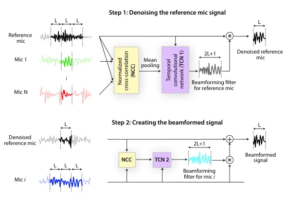
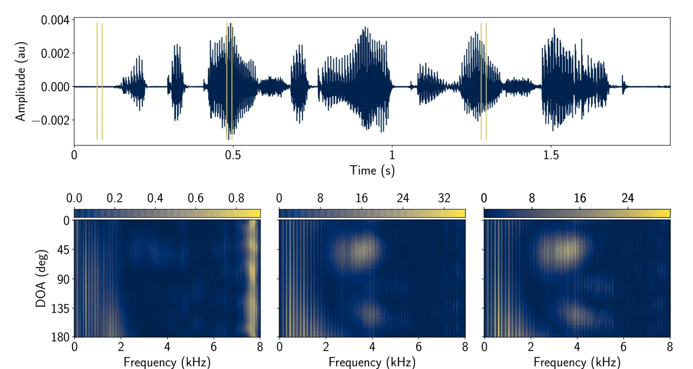
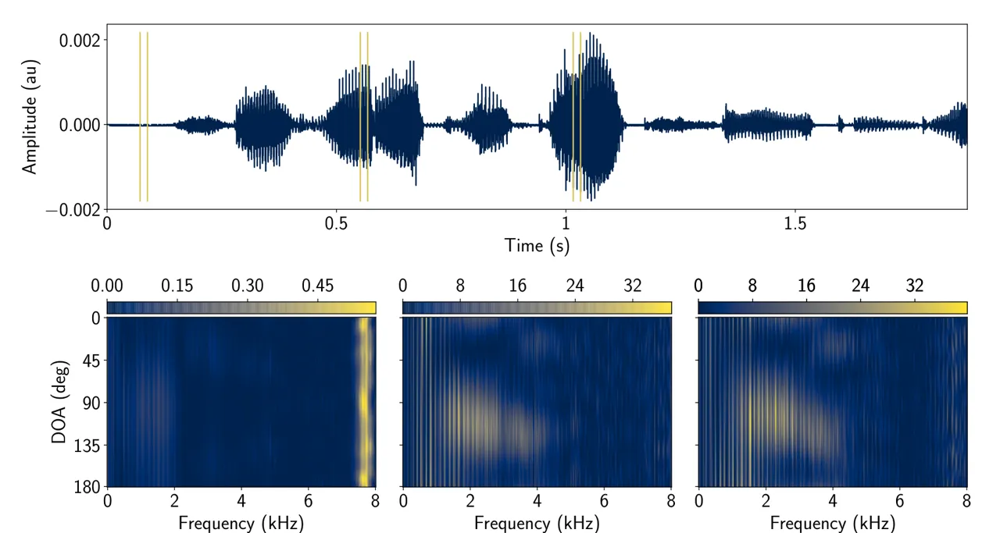

# FaSNet: LOW-LATENCY ADAPTIVE BEAMFORMING FOR MULTI-MICROPHONE AUDIO PROCESSING

Yi Luo\*    Cong Han    Nima Mesgarani Affiliation: Columbia University
Affiliation: Department of Electrical Engineering Affiliation: USA   
Enea Ceolini\* ^(†)^(†)thanks: \* These authors contributed equally to
this work.    Shih-Chii Liu Affiliation: University of Zurich and ETH
Zurich Affiliation: Institute of Neuroinformatics
Affiliation: Switzerland

###### Index Terms: 

Beamforming, multi-channel, audio processing, deep learning, low-latency

## 1 Abstract

Beamforming has been extensively investigated for multi-channel audio
processing tasks. Recently, learning-based beamforming methods,
sometimes called neural beamformers, have achieved significant
improvements in both signal quality (e.g. signal-to-noise ratio (SNR))
and speech recognition (e.g. word error rate (WER)). Such systems are
generally non-causal and require a large context for robust estimation
of inter-channel features, which is impractical in applications
requiring low-latency responses. In this paper, we propose
filter-and-sum network (FaSNet), a time-domain, filter-based beamforming
approach suitable for low-latency scenarios. FaSNet has a two-stage
system design that first learns frame-level time-domain adaptive
beamforming filters for a selected reference channel, and then calculate
the filters for all remaining channels. The filtered outputs at all
channels are summed to generate the final output. Experiments show that
despite its small model size, FaSNet is able to outperform several
traditional oracle beamformers with respect to scale-invariant
signal-to-noise ratio (SI-SNR) in reverberant speech enhancement and
separation tasks. Moreover, when trained with a frequency-domain
objective function on the CHiME-3 dataset, FaSNet achieves 14.3%
relative word error rate reduction (RWERR) compared with the baseline
model. These results show the efficacy of FaSNet particularly in
reverberant and noisy signal conditions.

## 2 Introduction

Beamforming, also known as spatial filtering, is a powerful microphone
array processing technique that extracts the signal-of-interest in a
particular direction and reduces the effect of noise and reverberation
from a multi-channel signal \[1\]. With the dominance of deep learning
methods in almost all audio processing tasks, deep learning-based
beamformers, sometimes called neural beamformers, have also proven
effective especially when jointly trained together with backend models
for tasks such as ASR (ASR) \[2\].

Most neural beamformers can be broadly categorized into three main
categories. The first category, which we refer to as the filtering-based
(FB) approach, aims at learning a set of beamforming filters to perform
FaS (FaS) beamforming in either the time domain \[3, 4, 5\] or frequency
domain \[6, 7, 8, 9\]. FaS beamforming applies the beamforming filters
to each channel and then sums them up to generate a single-channel
output, within which the filters can be either fixed or adaptive
depending on the model design. The second category, which we refer to as
the masking-based (MB) beamforming, estimates the FaS beamforming
filters in frequency domain by estimating T-F (T-F) masks for the
sources of interest \[10, 11, 12, 13, 14, 15, 16, 17, 18, 19, 20, 21,
22, 23\]. The T-F masks specify the dominance of each T-F bin and are
used to calculate the spatial covariance features required to obtain
optimal weights for beamformers such as MVDR (MVDR) \[24\] and GEV (GEV)
beamformer \[25\]. The third category, which we refer to as the
regression-based (RB) approach, implicitly incorporates beamforming
within a neural network without explicitly generating the beamforming
filters \[26, 27\]. In this framework, the input channels are directly
passed to a neural network (typically a convolutional neural network)
and the training objective is to learn a mapping between the
multi-channel inputs and the target source of interest. The beamforming
operation is thus assumed to be implicitly included in the mapping
function defined by the model. Other methods that are not part of these
three main categories include ones that combine neural networks and
beamforming in different ways. For example, \[28\] uses a single-channel
speech enhancement network to first estimate the source of interest and
then applies time-domain Wiener-filtering based beamforming.

Previous studies have shown that frequency-domain neural beamformers
significantly outnumber time-domain neural beamformers for several
reasons. First, neural beamformers are typically designed and applied to
ASR tasks in which frequency-domain methods are still the most common
approaches. Second, frequency-domain beamformers are known to be more
robust and effective than time-domain beamformers in various tasks \[29,
30\]. However, in applications and devices where online, low-latency
processing is required, frequency-domain methods have the disadvantage
that the frequency resolution and the input signal length needed for a
reasonable performance might result in a large, perceivable system
latency. For example, MB (MB) beamforming methods rely on the efficacy
of the mask estimation network whose performance will typically degrade
in online or causal scenarios \[22, 21\].

To address the limitation of previous neural beamformers, here we
propose FaSNet (FaSNet), a time-domain adaptive FaS beamforming
framework suitable for realtime, low-latency applications. FaSNet
consists of two stages where the first stage estimates the beamforming
filter for a selected reference channel, and the second stage utilizes
the output from the first stage to estimate beamforming filters for all
remaining channels. The input for both stages consists of the target
channel to be beamformed as well as the use of the NCC (NCC) between
channels as the inter-channel feature. Both stages make use of the
temporal convolutional networks ( TCN (TCN) \[31\]) for low-resource,
low-latency processing. Moreover, depending on the actual task to solve,
the training objective of FaSNet can be either a signal-level criterion
(e.g. SNR (SNR)) or ASR-level criterion (e.g. mel-spectrogram), which
makes FaSNet a flexible framework for various scenarios.

The remainder of the paper is organized as follows. We introduce the
proposed FaSNet model in Section 3, describe the experiment
configurations in Section 4, report the experiment results in Section 5,
and conclude the paper in Section 6.

## 3 Filter-and-sum Network (FaSNet)



Figure 1: System flowchart for the proposed FaSNet system. The first
stage estimates the frame-level beamforming filters for the reference
microphone based on the normalized correlation correlation coefficient
(NCC) feature, and the second stage uses the cleaned reference
microphone signal to estimate the beamforming filters for all remaining
microphones. Cosine similarity is used as the NCC feature, and the
temporal convolutional network (TCN) is selected as the filter
estimation module.

### 3.1 Problem definition

The problem of time-domain FaS beamforming is defined as estimating a
set of time-domain filters for a microphone array of $`N\geq 2`$
microphones, such that the summation of the filtered signals of all
microphones provides the best estimation of a signal of interest in a
selected reference microphone. We first split the signals
$`\bm{\mathrm{x}}^{i}`$ at each microphone into frames of $`L`$ samples
with a hop size of $`H\in[0,L-1]`$ samples

```math
\displaystyle\bm{\mathrm{x}}_{t}^{i}=\bm{\mathrm{x}}^{i}[tH:tH+L-1],\quad t\in\mathbb{Z},\quad i=1,\ldots,N \tag{1}
```

where $`t`$ is the frame index, $`i`$ is the index of the microphone and
the operation $`\bm{\mathrm{x}}[a:b]`$ selects the values of vector
$`\bm{\mathrm{x}}`$ from index $`a`$ to index $`b`$. To account for the
TDOA (TDOA) of the signal of interest at different microphones, the FaS
operation is applied on a context window around frame $`t`$ for each
microphone to generate the beamformed output at frame $`t`$

```math
\displaystyle\hat{\bm{\mathrm{y}}}_{t}=\sum_{i=1}^{N}\bm{\mathrm{h}}^{i}_{t}\circledast\hat{\bm{\mathrm{x}}}^{i}_{t} \tag{2}
```

where $`\hat{\bm{\mathrm{y}}}_{t}\in\mathbb{R}^{1\times L}`$ is the
beamformed signal at frame $`t`$,
$`\hat{\bm{\mathrm{x}}}^{i}_{t}=\bm{\mathrm{x}}^{i}[tH-L:tH+2L-1]\in\mathbb{R}^{1\times 3L}`$
is the context window around $`\bm{\mathrm{x}}_{t}`$ for microphone
$`i`$, $`\bm{\mathrm{h}}^{i}_{t}\in\mathbb{R}^{1\times(2L+1)}`$ is the
beamforming filter to be learned for microphone $`i`$, and
$`\circledast`$ represents the convolution operation. For frames where
$`tH<L`$ or $`tH+2L>l`$ where $`l`$ is the total length of the signal,
zero is padded to the context windows. The use of context window
$`\hat{\bm{\mathrm{x}}}^{i}_{t}`$ is to make sure the model can capture
cross-microphone delays of $`\pm L`$ samples, since the directions of
the sources are always unknown. As shown in \[4\], the use of the
context window incorporates the estimation of cross-microphone delay
into the learning process of $`\bm{\mathrm{h}}^{i}_{t}`$. The problem of
FaS beamforming thus becomes estimating $`\bm{\mathrm{h}}^{i}_{t}`$
given the observations of $`\bm{\mathrm{x}}^{i}`$. For simplicity, we
drop the frame index $`t`$ in the following discussions where there is
no ambiguity.

### 3.2 Reference channel processing

The first stage in FaSNet is to calculate the beamforming filter for the
reference microphone which is randomly selected from the array (the
first channel in all our experiments). Motivated by the GCC-PHAT feature
\[32, 33\] in other frequency-domain beamformers and tasks such as DOA
(DOA) and TDOA estimation, we use frame-level normalized
cross-correlation (NCC) as the inter-channel feature. To be specific,
let $`\hat{\bm{\mathrm{x}}}^{1}\in\mathbb{R}^{1\times 3L}`$ be the
context window of the signal in the reference microphone, and
$`\bm{\mathrm{x}}^{i}\in\mathbb{R}^{1\times L},i=2,\ldots,N`$ be the
corresponding center frame of all the other microphones with same index,
then the NCC feature, which we defined as the cosine similarity in our
case, is calculated between $`\hat{\bm{\mathrm{x}}}^{1}`$ and
$`\bm{\mathrm{x}}^{i}`$:

```math
\displaystyle\begin{cases}\hat{\bm{\mathrm{x}}}^{1}_{j}=\hat{\bm{\mathrm{x}}}^{1}[j:j+L-1]\\
f^{i}_{j}=\frac{\hat{\bm{\mathrm{x}}}^{1}_{j}(\bm{\mathrm{x}}^{i})^{T}}{\left\|\hat{\bm{\mathrm{x}}}^{1}_{j}\right\|_{2}\left\|\bm{\mathrm{x}}^{i}\right\|_{2}}\end{cases},\quad j=1,\ldots,2L+1 \tag{3}
```

where $`\bm{\mathrm{f}}^{i}\in\mathbb{R}^{1\times(2L+1)}`$ is the cosine
similarity between reference microphone and microphone $`i`$. The NCC
feature contains both the TDOA information and the content-dependent
information of the signal of interest in the reference microphone and
the other microphones. In order to combine the $`N-1`$ such features
$`\bm{\mathrm{f}}^{i},i=2,\ldots,N`$ for all non-reference microphones
in a permutation-free manner (i.e. independent from microphone indexes),
we simply apply mean-pooling to them

```math
\displaystyle\bar{\bm{\mathrm{f}}}^{i}=\frac{1}{N-1}\sum_{i=2}^{N}\bm{\mathrm{f}}^{i} \tag{4}
```

For channel-specific feature, a linear layer is applied on
$`\bm{\mathrm{x}}^{1}\in\mathbb{R}^{1\times L}`$, the center frame of
$`\hat{\bm{\mathrm{x}}}^{1}`$, to create a $`K`$-dimensional embedding
$`\bm{\mathrm{R}}^{1}\in\mathbb{R}^{1\times K}`$

```math
\displaystyle\bm{\mathrm{R}}^{1}=\bm{\mathrm{x}}^{1}\bm{\mathrm{U}} \tag{5}
```

where $`\bm{\mathrm{U}}\in\mathbb{R}^{L\times K}`$ is the weight matrix.
$`\bm{\mathrm{R}}^{1}`$ is then concatenated with
$`\bar{\bm{\mathrm{f}}}^{i}`$ and passed to a TCN with the same design
as \[31\] followed by a gated output layer to generate $`C`$ beamforming
filters
$`\bm{\mathrm{h}}^{1}_{c}\in\mathbb{R}^{1\times(2L+1)},\,c=1,\ldots,C`$
where $`C`$ is the number of sources of interest:

```math
\displaystyle\bm{\mathrm{p}}^{1}_{1,\ldots,C} \displaystyle=\mathcal{H}_{1}\big([\bm{\mathrm{R}}^{1},\bar{\bm{\mathrm{f}}}]\big) \tag{6}
```

```math
\displaystyle\bm{\mathrm{h}}^{1}_{c} \displaystyle=tanh(\bm{\mathrm{p}}^{1}_{c}\bm{\mathrm{W}}^{1}+\bm{\mathrm{b}}^{1})\odot\sigma(\bm{\mathrm{p}}^{1}_{c}\bm{\mathrm{V}}^{1}+\bm{\mathrm{q}}^{1}) \tag{7}
```

where $`\mathcal{H}_{1}(\cdot)`$ is the mapping function defined by the
TCN, $`\bm{\mathrm{p}}^{1}_{c}\in\mathbb{R}^{1\times K}`$ is the output
of TCN,
$`\bm{\mathrm{W}}^{1},\bm{\mathrm{V}}^{1}\in\mathbb{R}^{K\times(2L+1)}`$
and
$`\bm{\mathrm{b}}^{1},\bm{\mathrm{q}}^{1}\in\mathbb{R}^{1\times(2L+1)}`$
are weight and bias parameters of the gated output layer respectively,
$`tanh(\cdot)`$ and $`\sigma(\cdot)`$ denote the hyperbolic tangent and
sigmoid functions respectively, and $`\odot`$ represents the Hadamard
product. $`\bm{\mathrm{h}}^{1}_{c}`$ is then convolved with
$`\hat{\bm{\mathrm{x}}}^{1}`$ to generate the beamformed output of
source $`c`$,
$`\hat{\bm{\mathrm{y}}}^{1}_{c}\in\mathbb{R}^{1\times L}`$, for the
reference microphone

```math
\displaystyle\hat{\bm{\mathrm{y}}}^{1}_{c}=\hat{\bm{\mathrm{x}}}^{1}\circledast\bm{\mathrm{h}}^{1}_{c}. \tag{8}
```

### 3.3 Remaining channel processing

The second stage in FaSNet is to estimate the beamforming filters
$`\bm{\mathrm{h}}^{i}_{c},i=2,\ldots,N`$ for all remaining microphones.
Using the output of each estimated sources of interest from the first
step $`\hat{\bm{\mathrm{y}}}^{1}_{c}`$ as the cue, we apply the similar
procedure as above to all the remaining microphones. For microphone
$`i`$ with context window
$`\hat{\bm{\mathrm{x}}}^{i}\in\mathbb{R}^{1\times 3L}`$, the NCC feature
is calculated between it and $`\hat{\bm{\mathrm{y}}}^{1}_{c}`$:

```math
\displaystyle\begin{cases}\hat{\bm{\mathrm{x}}}^{i}_{j}=\hat{\bm{\mathrm{x}}}^{i}[j:j+L-1]\\
g^{i}_{c,j}=\frac{\hat{\bm{\mathrm{x}}}^{i}_{j}(\hat{\bm{\mathrm{y}}}^{1}_{c})^{T}}{\left\|\hat{\bm{\mathrm{x}}}^{i}_{j}\right\|_{2}\left\|\hat{\bm{\mathrm{y}}}^{1}_{c}\right\|_{2}}\end{cases},\quad j=1,\ldots,2L+1 \tag{9}
```

Another TCN with its corresponding mapping function
$`\mathcal{H}_{2}(\cdot)`$ is used to generate $`\bm{\mathrm{h}}^{i}`$
given $`\bm{\mathrm{g}}^{i}_{c}\in\mathbb{R}^{1\times(2L+1)}`$ and the
linear transformation
$`\bm{\mathrm{R}}^{i}=\bm{\mathrm{x}}^{i}\bm{\mathrm{U}}`$:

```math
\displaystyle\bm{\mathrm{p}}^{i}_{c} \displaystyle=\mathcal{H}_{2}\big([\bm{\mathrm{R}}^{i},\bm{\mathrm{g}}^{i}_{c}]\big) \tag{10}
```

```math
\displaystyle\bm{\mathrm{h}}^{i}_{c} \displaystyle=tanh(\bm{\mathrm{p}}^{i}_{c}\bm{\mathrm{W}}^{2}+\bm{\mathrm{b}}^{2})\odot\sigma(\bm{\mathrm{p}}^{i}_{c}\bm{\mathrm{V}}^{2}+\bm{\mathrm{q}}^{2}) \tag{11}
```

where
$`\bm{\mathrm{W}}^{2},\bm{\mathrm{V}}^{2}\in\mathbb{R}^{K\times(2L+1)}`$
and
$`\bm{\mathrm{b}}^{2},\bm{\mathrm{q}}^{2}\in\mathbb{R}^{1\times(2L+1)}`$
are weight and bias parameters of the gated output layer respectively.
Note that all remaining microphones share the same TCN and gated output
layer. The filters $`\bm{\mathrm{h}}^{i}_{c}`$ are then convolved with
$`\hat{\bm{\mathrm{x}}}^{i}`$ and summed up to
$`\hat{\bm{\mathrm{y}}}^{1}_{c}`$ to generate the final beamformed
output of source $`c`$

```math
\displaystyle\hat{\bm{\mathrm{y}}_{c}}=\hat{\bm{\mathrm{y}}}^{1}_{c}+\sum_{i=2}^{N}\hat{\bm{\mathrm{x}}}^{i}\circledast\bm{\mathrm{h}}^{i}_{c} \tag{12}
```

Finally, all segments in $`\hat{\bm{\mathrm{y}}}_{c}`$ are transformed
back to the full utterance
$`\bm{\mathrm{y}}^{*}_{c}\in\mathbb{R}^{1\times l}`$ through the
overlap-and-add operation. Figure 1 shows the full diagram of the
system.

### 3.4 Combination with single-channel systems

The output of FaSNet can also be passed to any single-channel
enhancement system for further performance improvement. As FaSNet
directly generates waveforms, the tandem system can still be trained
end-to-end for either time-domain or frequency-domain objectives.
Section 5 shows that the tandem configuration leads to improved
performance compared to both the single-channel system and FaSNet-only
system.

### 3.5 Training objectives

The training objective can either be in time- or frequency-domain
depending on the actual task to solve. For tasks that take signal
quality as an evaluation measure, we use the SI-SNR (SI-SNR) \[34, 35\]
as the training objective:

```math
\displaystyle\mathcal{L}_{obj}=\frac{1}{C}\sum_{c=1}^{C}\text{SI-SNR}(\bm{\mathrm{y}}_{c},\bm{\mathrm{y}}^{*}_{c}). \tag{13}
```

For tasks where frequency-domain output is favored (e.g. ASR), we use
mel-spectrogram with SI-MSE (SI-MSE) as the training objective:

```math
\displaystyle\begin{cases}\bm{\mathrm{Y}}_{c}=\left|\text{STFT}\left(\frac{\bm{\mathrm{y}}_{c}}{\left\|\bm{\mathrm{y}}_{c}\right\|_{2}}\right)\right|\\
\bm{\mathrm{Y}}^{*}_{c}=\left|\text{STFT}\left(\frac{\bm{\mathrm{y}}^{*}_{c}}{\left\|\bm{\mathrm{y}}^{*}_{c}\right\|_{2}}\right)\right|\\
\end{cases} \tag{14}
```

```math
\displaystyle\mathcal{L}_{obj}=\frac{1}{C}\sum_{c=1}^{C}\text{MSE}(\bm{\mathrm{Y}}_{c}\bm{\mathrm{M}},\bm{\mathrm{Y}}^{*}_{c}\bm{\mathrm{M}}) \tag{15}
```

where
$`\bm{\mathrm{Y}}_{c},\bm{\mathrm{Y}}^{*}_{c}\in\mathbb{R}^{T\times F}`$
are the magnitude spectrograms of the target and estimated signals
respectively, and $`\bm{\mathrm{M}}\in\mathbb{R}^{F\times D}`$ is the
mel-filterbank. Utterance-level permutation invariant training (uPIT) is
always applied to address the output permutation problem \[36, 37\].

## 4 Experiment configurations

We evaluate the proposed FaSNet on various types of multi-microphone
audio processing tasks. To be specific, we design three different
experiments:

1.  1.  ESE (ESE): We jointly perform speech denoising and dereverberation
        in an echoic environment;
2.  2.  ESS (ESS): We separate the direct path of two speakers in a noisy,
        echoic environment;
3.  3.  Multichannel noisy ASR: We use the 3rd CHiME challenge dataset
        \[38\] for ASR task.

The direct-path speech signals for all sources of interest are always
used as the target.

### 4.1 Data generation

For ESE and ESS tasks, we assume a circular omni-directional microphone
array with a maximum of 4 microphones evenly distributed. The diameter
of the array is fixed to 10 cm. The positions of the sources (speakers
and the noise) and the center of the microphone array are randomly
sampled, with the constraint that all sources should be at least 0.5 m
away from the room walls. The height for all sources is fixed to 1 m. We
then simulate the RIR (RIR) filters with the image method \[39\], and
specifically with the gpuRIR toolbox \[40\]. We randomize the length and
the width of the rooms within the range $`\left[3,8\right]`$ m and fix
the height to 3 m.

We then generate a dataset for simulated ESS and ESE scenarios with the
TIMIT dataset \[41\]. We first randomly split each speaker’s utterance
into 7 training, 2 validation and 1 test samples, and then generate the
training, validation and test sets within the corresponding categories
that contain 20000, 5000 and 3000 rooms respectively. Each room contains
two speakers and one noise source, within which the noise is randomly
sampled from first 80 samples in \[42\] for training and validation sets
and all 100 samples for the test set. For ESE, the relative SNR between
the speaker and the noise is randomly sampled between
$`\left[-5,15\right]`$ dB. In ESS, the relative SNR between the two
speakers is randomly sampled between $`\left[-5,5\right]`$ dB and the
noise is randomly sampled between $`\left[-5,15\right]`$ dB with respect
to the low energy speaker.

### 4.2 Hyperparameters setting

Table 1 shows the symbols for the hyperparameters in the system. Each
TCN has an identical design to \[31\] and contains $`R`$ repeats of the
1-D convolutional blocks with $`P`$ blocks in each repeat. In all
experiments, we set $`R=2`$ and $`P=5`$. The size of the 1-D
convolutional kernel in each 1-D convolutional block is 3, and the input
and hidden channels in each block are set to 64 and 320 respectively.
The embedding dimension $`K`$ is set to 64. The number of parameters in
each TCN is thus 0.76M. The effect of different frame length $`L`$ is
discussed in Section 5.2. For tandem systems with a single-channel
system for second-stage enhancement, we adopt the Conv-TasNet
configuration \[31\] but change the masking layer into a direct
regression layer. The model size of the single-output Conv-TasNet is
1.9M.

|        |                                                      |
| ------ | ---------------------------------------------------- |
|        |                                                      |
| Symbol | Description                                          |
|        |                                                      |
| $`L`$  | Frame size (in samples)                              |
| $`P`$  | Number of convolutional blocks in each repeat in TCN |
| $`R`$  | Number of repeats in TCN                             |
| $`K`$  | Dimension of embeddings as well as the output of TCN |
|        |                                                      |

Table 1: Hyperparameters in the proposed system.

In the ASR and ESE tasks, each TCN estimates one beamforming filter at
each frame, while in the ESS task, each TCN estimates two beamforming
filters corresponding to the two speakers.

### 4.3 Traditional beamformers

In order to show the advantages and performance of the proposed
approach, FaSNet is compared against a variety of classical beamformers.
Both beamformers in the time- and frequency-domain are considered. The
comparison on the time-domain beamformers is carried out since it
represents a fairer comparison to FaSNet which is also based on the time
domain. This comparison is extended to more traditional and more robust
frequency-domain beamformers which are vastly used in practice.

Four classes of beamformers are considered in the comparison. The first
class is time-domain beamformers and comprises TD (TD) MWF (MWF) and TD
MVDR beamformers \[43\]. The second class is FD (FD) beamformers and
considers the SDW-MWF (SDW-MWF) and MVDR \[44\] beamformers. For both
these classes the eigendecomposition method is used in order to estimate
the steering vector \[45\] from the estimated spatial covariance. The
third class comprises MB beamformers, specifically MVDR \[13\] and GEV
\[10\] beamformers. Both these MB beamformers use the IBM (IBM) to
estimate the beamforming filters. In the interest of space, the exact
formulation of each of the beamformers is omitted. We direct the
interested reader to the original formulations, which are referenced in
table 2, and the open source implementation¹¹ 1
[https://pypi.org/project/beamformers/](https://pypi.org/project/beamformers/).

## 5 Results and Discussion

### 5.1 Benchmarking oracle beamforming techniques on signal quality measurement

All the beamformers described in Section 4.3 are tested on both ESE and
ESS tasks and evaluated with signal quality measurement (i.e. SI-SNR).
Both time- and frequency-domain beamformers use the full utterance to
estimate the spatial covariance and consequently calculate the steering
vector. Similarly, MB beamformers use the oracle IBM on the full
utterance to calculate the spatial covariance matrices. Table 2 provides
the SI-SNR improvement of all described traditional beamformers. Among
the time-domain beamformers, TD-MVDR shows better performance in the ESS
task while TD-MWF is better in the ESE task. Even though the differences
are minimal, we confirm the statement in \[43\] that for speech
enhancement in time domain, MVDR is typically better than MWF. Among the
frequency-domain beamformers, the SDW-MWF beamformer is significantly
better than MVDR, given the fact that by design SDW-MWF also leads to
better dereverberation. For mask-based beamformers, MVDR shows
significantly better performance than GEV. This confirms the observation
in \[10\] that GEV suffers from phase adjustment problems which can
significantly decrease signal quality. The overall performance of
frequency-domain beamformers is significantly better than time-domain
beamformers especially with an increasing number of microphones \[30\].

As FaSNet has a fixed receptive field defined by the TCNs, we also
conduct another experiment where the spatial covariances and masks are
estimated based on short segments of length $`s\in\{100,250,500\}`$ ms
with two possible ways for the estimation: the spatial covariance is
calculated over time for every non-overlapping segment, or only
estimated once based on a segment randomly selected within the
utterance. We found empirically that the two ways lead to results
lacking significant differences, so here we only report the results from
the former configuration. Table 3 shows the comparison of the best
performing oracle beamformers in Table 2 with different segment sizes.
For the widely-used MB-MVDR, a large enough receptive field is crucial
for a reasonable performance which makes it harder to apply in rapid
changing conditions.

|                   |            |              |      |      |      |
| ----------------- | ---------- | ------------ | ---- | ---- | ---- |
|                   |            |              |      |      |      |
| Method            | \# of mics | SI-SNRi (dB) |      |      |      |
|                   |            | ESE          |      | ESS  |      |
| CC                |            | OC           | CC   | OC   |      |
|                   |            |              |      |      |      |
| TD-MVDR \[43\]    | 2          | 2.1          | 2.6  | 3.2  | 3.4  |
|                   | 3          | 2.5          | 2.9  | 4.2  | 4.3  |
|                   | 4          | 2.8          | 3.2  | 3.9  | 4.3  |
| TD-MWF \[43\]     | 2          | 1.6          | 1.8  | 3.1  | 3.2  |
|                   | 3          | 2.1          | 2.5  | 3.9  | 4.2  |
| 4                 | 2.5        | 2.7          | 4.4  | 4.5  |      |
|                   |            |              |      |      |      |
| FD-MVDR \[44\]    | 2          | 2.1          | 2.0  | 2.1  | 2.1  |
|                   | 3          | 3.2          | 3.0  | 3.5  | 3.5  |
|                   | 4          | 4.1          | 3.9  | 4.6  | 4.5  |
| FD-SDW-MWF \[44\] | 2          | 3.7          | 3.6  | 3.3  | 3.1  |
|                   | 3          | 6.4          | 6.2  | 5.9  | 5.9  |
| 4                 | 8.1        | 7.9          | 7.6  | 7.5  |      |
|                   |            |              |      |      |      |
| MB-MVDR \[13\]    | 2          | 3.9          | 3.8  | 4.1  | 3.3  |
|                   | 3          | 5.8          | 5.7  | 6.2  | 5.1  |
|                   | 4          | 6.7          | 6.6  | 7.5  | 6.3  |
| MB-GEV \[10\]     | 2          | -4.8         | -5.7 | -4.1 | -3.6 |
|                   | 3          | 0.8          | 0.9  | 1.1  | 0.6  |
| 4                 | 2.5        | 2.5          | 2.9  | 2.3  |      |
|                   |            |              |      |      |      |

Table 2: Performance of oracle beamformers. SI-SNR improvement is
reported. CC: close-condition (development) set. OC: open-condition
(evaluation) set.

|                   |                   |            |              |      |
| ----------------- | ----------------- | ---------- | ------------ | ---- |
|                   |                   |            |              |      |
| Method            | Segment size (ms) | \# of mics | SI-SNRi (dB) |      |
| ESE               |                   |            | ESS          |      |
|                   |                   |            |              |      |
| FD-SDW-MWF \[44\] | 100               | 4          | 4.5          | 4.0  |
|                   | 250               | 4          | 5.7          | 5.3  |
| 500               | 4                 | 6.5        | 6.1          |      |
|                   |                   |            |              |      |
| MB-MVDR \[13\]    | 100               | 4          | -0.3         | -1.2 |
|                   | 250               | 4          | 3.0          | 2.7  |
| 500               | 4                 | 4.7        | 4.6          |      |
|                   |                   |            |              |      |

Table 3: Performance of oracle beamformers with different segment sizes
for spatial covariance estimation. SI-SNR improvement is reported only
on the OC set.





Figure 2: Beampattern examples for two different utterances in the ESS
task.

### 5.2 Results of FaSNet on various tasks

We first investigate the effect of frame size $`L`$ in FaSNet while
fixing other hyperparameters. Table 4 shows how different frame sizes
affect the system performance. We can see that a longer frame size leads
to constantly better performance, which is expected as higher frequency
resolution can be achieved. As the system latency of FaSNet is $`2L`$,
tradeoff between performance and frame size needs to be considered for
applications that strictly require low-latency processing. In this
paper, we select the best performing system, i.e. $`L=16`$, for all
following experiments.

|     |            |     |     |     |
| --- | ---------- | --- | --- | --- |
|     |            |     |     |     |
|     | Frame (ms) |     |     |     |
| 2   | 4          | 8   | 16  |     |
|     |            |     |     |     |
| CC  | 1.6        | 2.4 | 3.3 | 4.0 |
| OC  | 1.4        | 2.2 | 3.0 | 3.7 |
|     |            |     |     |     |

Table 4: Dependence of SI-SNR improvement on frame size for a 2-ch
FaSNet in ESE task.

We then compare FaSNet with a single-channel time-domain method, the
Conv-TasNet \[31\], on both tasks with various configurations. We choose
this comparison as both models are based on the same TCN modules and
have similar model design paradigm. Table 5 provides the comparison
across different number of microphones and causality settings. We can
observe that in a non-causal setting, FaSNet achieves on par performance
with the single-channel Conv-TasNet baseline of 4 microphones, while in
a causal setting, it outperforms Conv-TasNet even with only 2
microphones. Moreover, adding a post single-channel enhancement network
constantly improves the performance across almost all configurations on
both tasks. The 4-channel tandem system is able to achieve on par
performance with an MB-MVDR system with oracle IBM, and is significantly
better than the segment-level oracle MB-MVDR. This shows that when
comparing with frequency-domain beamformers which highly rely on a long
segment for robust spatial covariance estimation, FaSNet has better
potential for low-latency processing on much shorter segments.

|             |            |        |            |              |     |     |     |
| ----------- | ---------- | ------ | ---------- | ------------ | --- | --- | --- |
|             |            |        |            |              |     |     |     |
| Method      | Model size | Causal | \# of mics | SI-SNRi (dB) |     |     |     |
|             |            |        |            | ESE          |     | ESS |     |
| CC          |            |        |            | OC           | CC  | OC  |     |
|             |            |        |            |              |     |     |     |
| Conv-TasNet | 1.9M       | ×      | 1          | 5.3          | 5.0 | 4.1 | 4.1 |
| ✓           |            | 3.5    |            | 3.3          | 2.7 | 2.6 |     |
|             |            |        |            |              |     |     |     |
| FaSNet      | 1.5M       | ×      | 2          | 4.0          | 3.7 | 3.7 | 3.6 |
|             |            |        | 3          | 4.4          | 4.1 | 4.0 | 3.9 |
|             |            |        | 4          | 5.3          | 5.0 | 4.7 | 4.6 |
|             |            | ✓      | 2          | 3.8          | 3.5 | 3.2 | 3.1 |
|             |            |        | 3          | 4.1          | 3.8 | 3.5 | 3.4 |
| 4           |            |        | 4.5        | 4.3          | 3.9 | 3.8 |     |
|             |            |        |            |              |     |     |     |
| Tandem      | 3.4M       | ×      | 2          | 5.8          | 5.5 | 4.5 | 4.4 |
|             |            |        | 3          | 5.4          | 5.0 | 5.5 | 5.5 |
|             |            |        | 4          | 6.7          | 6.4 | 6.2 | 6.1 |
|             |            | ✓      | 2          | 4.8          | 4.5 | 3.9 | 3.8 |
|             |            |        | 3          | 5.3          | 5.0 | 4.1 | 4.0 |
| 4           |            |        | 4.7        | 4.4          | 4.5 | 4.4 |     |
|             |            |        |            |              |     |     |     |

Table 5: Performance of FaSNet and tandem system in both ESE and ESS
tasks.

We also evaluate FaSNet on CHiME-3 dataset to investigate its potential
as the front-end for speech recognition systems. Table 6 shows the
performance of FaSNet with respect to signal quality measure. Two
different training targets, the reverberant clean signal or the original
clean signal, are applied during training. Note that the original clean
source has an unknown shift with the oracle direct path signal in the
reference microphone, so we adopt shift invariant training (SIT) where
we calculate the maximum SI-SNR between the system output and the
original clean signal with $`\pm 2`$ ms of shift. We can see that FaSNet
is significantly better than the Conv-TasNet baseline with both targets,
further proving its effectiveness on real-world recordings.

Table 7 compares the WER (WER) of FaSNet and the official CHiME-3
baseline system on the recognition task. We use the officially provided
DNN baseline recognizer as our backend ASR system, although more
advanced systems with fully end-to-end training may further boost the
performance. We can see from the table that when training with the
original clean source as target and SI-SNR as objective, FaSNet is able
to achieve 9.3% RWERR (RWERR) compared with the MVDR baseline, and when
training with the mel-spectrogram of the original clean signal as target
with SI-MSE as objective, FaSNet achieves a 14.3% RWERR. This result
proves that when training with a frequency-domain objective that favors
ASR backends, FaSNet can also serve as an effective ASR front-end.

|                   |             |        |              |
| ----------------- | ----------- | ------ | ------------ |
|                   |             |        |              |
| Target            | Method      | Causal | SI-SNRi (dB) |
|                   |             |        |              |
| Reverberant clean | Conv-TasNet | ×      | 8.7          |
|                   | FaSNet      | ×      | 12.2         |
| ✓                 |             | 10.6   |              |
|                   |             |        |              |
| Clean source      | Conv-TasNet | ×      | 7.5          |
|                   | FaSNet      | ×      | 11.6         |
| ✓                 |             | 11.1   |              |
|                   |             |        |              |

Table 6: Performance of FaSNet on CHiME-3 evaluation dataset. SI-SNR
improvement is reported.

|                 |                   |         |
| --------------- | ----------------- | ------- |
|                 |                   |         |
| Method          | Target            | WER (%) |
|                 |                   |         |
| Noisy           | -                 | 32.53   |
|                 |                   |         |
| Baseline        | -                 | 32.48   |
|                 |                   |         |
| FaSNet          | Reverberant clean | 32.23   |
|                 | Clean source      | 29.47   |
| Mel-spectrogram | 27.89             |         |
|                 |                   |         |

Table 7: Performance of FaSNet on CHiME-3 evaluation dataset of real
recordings. WER is reported.

### 5.3 Visualization of FaSNet filters

To better understand the beampatterns of the time-domain filters
generated by FaSNet, Fig. 2 visualizes them for two example utterances
in the ESS task. The figure shows the beampatterns estimated by FasNet
at different frames of the utterances. The beampatterns are shown as a
function of frequency and DOA. As we can see, FasNet learns specific
beampatterns which are content-dependent within each utterance, where
different regions have different beampatterns. Specifically, nonspeech
regions receive filters with null pattern for both utterances, further
proving the adaptation ability of FaSNet across the utterance.

## 6 Conclusion

In this paper, we proposed FaSNet, a time-domain adaptive beamforming
method especially suitable for online, low-latency applications. FaSNet
was designed as a two-stage system, where the first stage estimated the
beamforming filter for a randomly selected reference microphone, and the
second stage used the output of the first stage to calculate the filters
for all the remaining microphones. FaSNet can also be concatenated with
any other single-channel system for further performance improvement.
Experimental results showed that FaSNet achieved better or on par
performance than several oracle traditional beamformers on both echoic
noisy speech enhancement (ESE) and echoic noisy speech separation (ESS)
tasks. Moreover, when training with a frequency-domain objective that is
favored by backend systems for speech recognition, FaSNet improved the
word error rate on CHiME-3 by 14.3% compared with a baseline model.
Visualization on the beampatterns generated by FaSNet showed that it can
estimate content-dependent adaptive filters for speech and nonspeech
regions. Future work include investigations into the system performance
on more diverse environments, e.g. with nonstationary speakers, and the
evaluation of the system performance when trained with an ASR backend in
a fully end-to-end manner.

## 7 Acknowledgments

This work was partially supported by the EU H2020 grant No. 644732; the
SNSF grant No. 20002$`\_`$1172553, a grant from the National Institute
of Health, NIDCD, DC014279; a National Science Foundation CAREER Award;
and the Pew Charitable Trusts.

## References

- \[1\] Sharon Gannot, Emmanuel Vincent, Shmulik Markovich-Golan, and
  Alexey Ozerov, “A consolidated perspective on multimicrophone speech
  enhancement and source separation,” IEEE/ACM Transactions on Audio,
  Speech, and Language Processing, vol. 25, no. 4, pp. 692–730, 2017.
- \[2\] Xiong Xiao, Chenglin Xu, Zhaofeng Zhang, Shengkui Zhao, Sining
  Sun, Shinji Watanabe, Longbiao Wang, Lei Xie, Douglas L Jones,
  Eng Siong Chng, et al., “A study of learning based beamforming methods
  for speech recognition,” in CHiME 2016 workshop, 2016, pp. 26–31.
- \[3\] Tara N Sainath, Ron J Weiss, Kevin W Wilson, Arun Narayanan,
  Michiel Bacchiani, et al., “Speaker location and microphone spacing
  invariant acoustic modeling from raw multichannel waveforms,” in
  Automatic Speech Recognition and Understanding (ASRU), 2015 IEEE
  Workshop on. IEEE, 2015, pp. 30–36.
- \[4\] Bo Li, Tara N Sainath, Ron J Weiss, Kevin W Wilson, and Michiel
  Bacchiani, “Neural network adaptive beamforming for robust
  multichannel speech recognition.,” in Proc. Interspeech, 2016, pp.
  1976––1980.
- \[5\] Tara N Sainath, Ron J Weiss, Kevin W Wilson, Bo Li, Arun
  Narayanan, Ehsan Variani, Michiel Bacchiani, Izhak Shafran, Andrew
  Senior, Kean Chin, et al., “Multichannel signal processing with deep
  neural networks for automatic speech recognition,” IEEE/ACM
  Transactions on Audio, Speech, and Language Processing, vol. 25, no.
  5, pp. 965–979, 2017.
- \[6\] Xiong Xiao, Shinji Watanabe, Hakan Erdogan, Liang Lu, John
  Hershey, Michael L Seltzer, Guoguo Chen, Yu Zhang, Michael Mandel, and
  Dong Yu, “Deep beamforming networks for multi-channel speech
  recognition,” in Acoustics, Speech and Signal Processing (ICASSP),
  2016 IEEE International Conference on. IEEE, 2016, pp. 5745–5749.
- \[7\] Xiong Xiao, Shinji Watanabe, Eng Siong Chng, and Haizhou Li,
  “Beamforming networks using spatial covariance features for far-field
  speech recognition,” in Signal and Information Processing Association
  Annual Summit and Conference (APSIPA), 2016 Asia-Pacific. IEEE, 2016,
  pp. 1–6.
- \[8\] Zhong Meng, Shinji Watanabe, John R Hershey, and Hakan Erdogan,
  “Deep long short-term memory adaptive beamforming networks for
  multichannel robust speech recognition,” arXiv preprint
  arXiv:1711.08016, 2017.
- \[9\] Moon Ju Jo, Geon Woo Lee, Jung Min Moon, Choongsang Cho, and
  Hong Kook Kim, “Estimation of mvdr beamforming weights based on deep
  neural network,” in Audio Engineering Society Convention 145. Audio
  Engineering Society, 2018.
- \[10\] Jahn Heymann, Lukas Drude, Aleksej Chinaev, and Reinhold
  Haeb-Umbach, “Blstm supported gev beamformer front-end for the 3rd
  chime challenge,” in Automatic Speech Recognition and Understanding
  (ASRU), 2015 IEEE Workshop on. IEEE, 2015, pp. 444–451.
- \[11\] Jahn Heymann, Lukas Drude, and Reinhold Haeb-Umbach, “Neural
  network based spectral mask estimation for acoustic beamforming,” in
  Acoustics, Speech and Signal Processing (ICASSP), 2016 IEEE
  International Conference on. IEEE, 2016, pp. 196–200.
- \[12\] Hakan Erdogan, Tomoki Hayashi, John R Hershey, Takaaki Hori,
  Chiori Hori, Wei-Ning Hsu, Suyoun Kim, Jonathan Le Roux, Zhong Meng,
  and Shinji Watanabe, “Multi-channel speech recognition: Lstms all the
  way through,” in CHiME-4 workshop, 2016.
- \[13\] Hakan Erdogan, John R Hershey, Shinji Watanabe, Michael I
  Mandel, and Jonathan Le Roux, “Improved mvdr beamforming using
  single-channel mask prediction networks.,” in Proc. Interspeech, 2016,
  pp. 1981–1985.
- \[14\] Xiong Xiao, Shengkui Zhao, Douglas L Jones, Eng Siong Chng, and
  Haizhou Li, “On time-frequency mask estimation for mvdr beamforming
  with application in robust speech recognition,” in Acoustics, Speech
  and Signal Processing (ICASSP), 2017 IEEE International Conference on.
  IEEE, 2017, pp. 3246–3250.
- \[15\] Tsubasa Ochiai, Shinji Watanabe, Takaaki Hori, and John R
  Hershey, “Multichannel end-to-end speech recognition,” arXiv preprint
  arXiv:1703.04783, 2017.
- \[16\] Tsubasa Ochiai, Shinji Watanabe, Takaaki Hori, John R Hershey,
  and Xiong Xiao, “Unified architecture for multichannel end-to-end
  speech recognition with neural beamforming,” IEEE Journal of Selected
  Topics in Signal Processing, vol. 11, no. 8, pp. 1274–1288, 2017.
- \[17\] Lukas Pfeifenberger, Matthias Zöhrer, and Franz Pernkopf,
  “Dnn-based speech mask estimation for eigenvector beamforming,” in
  Acoustics, Speech and Signal Processing (ICASSP), 2017 IEEE
  International Conference on. IEEE, 2017, pp. 66–70.
- \[18\] Christoph Boeddeker, Patrick Hanebrink, Lukas Drude, Jahn
  Heymann, and Reinhold Haeb-Umbach, “Optimizing neural-network
  supported acoustic beamforming by algorithmic differentiation,” in
  Acoustics, Speech and Signal Processing (ICASSP), 2017 IEEE
  International Conference on. IEEE, 2017, pp. 171–175.
- \[19\] Jahn Heymann, Lukas Drude, Christoph Boeddeker, Patrick
  Hanebrink, and Reinhold Haeb-Umbach, “Beamnet: End-to-end training of
  a beamformer-supported multi-channel asr system,” in Acoustics, Speech
  and Signal Processing (ICASSP), 2017 IEEE International Conference on.
  IEEE, 2017, pp. 5325–5329.
- \[20\] Xueliang Zhang, Zhong-Qiu Wang, and DeLiang Wang, “A speech
  enhancement algorithm by iterating single-and multi-microphone
  processing and its application to robust asr,” in Acoustics, Speech
  and Signal Processing (ICASSP), 2017 IEEE International Conference on.
  IEEE, 2017, pp. 276–280.
- \[21\] Christoph Boeddeker, Hakan Erdogan, Takuya Yoshioka, and
  Reinhold Haeb-Umbach, “Exploring practical aspects of neural
  mask-based beamforming for far-field speech recognition,” in 2018 IEEE
  International Conference on Acoustics, Speech and Signal Processing
  (ICASSP). IEEE, 2018, pp. 6697–6701.
- \[22\] Yutaro Matsui, Tomohiro Nakatani, Marc Delcroix, Keisuke
  Kinoshita, Nobutaka Ito, Shoko Araki, and Shoji Makino, “Online
  integration of dnn-based and spatial clustering-based mask estimation
  for robust mvdr beamforming,” in 2018 16th International Workshop on
  Acoustic Signal Enhancement (IWAENC). IEEE, 2018, pp. 71–75.
- \[23\] Jahn Heymann, Michiel Bacchiani, and Tara N Sainath,
  “Performance of mask based statistical beamforming in a smart home
  scenario,” in 2018 IEEE International Conference on Acoustics, Speech
  and Signal Processing (ICASSP). IEEE, 2018, pp. 6722–6726.
- \[24\] Jack Capon, “High-resolution frequency-wavenumber spectrum
  analysis,” Proceedings of the IEEE, vol. 57, no. 8, pp.
  1408–1418, 1969.
- \[25\] Ernst Warsitz and Reinhold Haeb-Umbach, “Blind acoustic
  beamforming based on generalized eigenvalue decomposition,” IEEE
  Transactions on audio, speech, and language processing, vol. 15, no.
  5, pp. 1529–1539, 2007.
- \[26\] Daniel Stoller, Sebastian Ewert, and Simon Dixon, “Wave-u-net:
  A multi-scale neural network for end-to-end audio source separation,”
  arXiv preprint arXiv:1806.03185, 2018.
- \[27\] Emad M Grais, Dominic Ward, and Mark D Plumbley, “Raw
  multi-channel audio source separation using multi-resolution
  convolutional auto-encoders,” arXiv preprint arXiv:1803.00702, 2018.
- \[28\] Kaizhi Qian, Yang Zhang, Shiyu Chang, Xuesong Yang, Dinei
  Florencio, and Mark Hasegawa-Johnson, “Deep learning based speech
  beamforming,” arXiv preprint arXiv:1802.05383, 2018.
- \[29\] Michael E Lockwood, Douglas L Jones, Robert C Bilger,
  Charissa R Lansing, William D O’Brien Jr, Bruce C Wheeler, and
  Albert S Feng, “Performance of time-and frequency-domain binaural
  beamformers based on recorded signals from real rooms,” The Journal of
  the Acoustical Society of America, vol. 115, no. 1, pp. 379–391, 2004.
- \[30\] Umar Hamid, Rahim Ali Qamar, and Kashif Waqas, “Performance
  comparison of time-domain and frequency-domain beamforming techniques
  for sensor array processing,” in Proceedings of 2014 11th
  International Bhurban Conference on Applied Sciences & Technology
  (IBCAST) Islamabad, Pakistan, 14th-18th January, 2014. IEEE, 2014, pp.
  379–385.
- \[31\] Yi Luo and Nima Mesgarani, “Tasnet: Surpassing ideal
  time-frequency masking for speech separation,” arXiv preprint
  arXiv:1809.07454, 2018.
- \[32\] Charles Knapp and Glifford Carter, “The generalized correlation
  method for estimation of time delay,” IEEE transactions on acoustics,
  speech, and signal processing, vol. 24, no. 4, pp. 320–327, 1976.
- \[33\] Michael S Brandstein and Harvey F Silverman, “A robust method
  for speech signal time-delay estimation in reverberant rooms,” in
  Acoustics, Speech, and Signal Processing, 1997. ICASSP-97., 1997 IEEE
  International Conference on. IEEE, 1997, vol. 1, pp. 375–378.
- \[34\] Yi Luo, Zhuo Chen, and Nima Mesgarani, “Speaker-independent
  speech separation with deep attractor network,” IEEE/ACM Transactions
  on Audio, Speech, and Language Processing, vol. 26, no. 4, pp.
  787–796, 2018.
- \[35\] Jonathan Le Roux, Scott Wisdom, Hakan Erdogan, and John R.
  Hershey, “Sdr – half-baked or well done?,” in 2019 IEEE International
  Conference on Acoustics, Speech and Signal Processing (ICASSP), May
  2019, pp. 626–630.
- \[36\] D. Yu, M. Kolbæk, Z. Tan, and J. Jensen, “Permutation invariant
  training of deep models for speaker-independent multi-talker speech
  separation,” in 2017 IEEE International Conference on Acoustics,
  Speech and Signal Processing (ICASSP), March 2017, pp. 241–245.
- \[37\] Morten Kolbæk, Dong Yu, Zheng-Hua Tan, Jesper Jensen, Morten
  Kolbaek, Dong Yu, Zheng-Hua Tan, and Jesper Jensen, “Multitalker
  speech separation with utterance-level permutation invariant training
  of deep recurrent neural networks,” IEEE/ACM Transactions on Audio,
  Speech and Language Processing (TASLP), vol. 25, no. 10, pp.
  1901–1913, 2017.
- \[38\] Jon Barker, Ricard Marxer, Emmanuel Vincent, and Shinji
  Watanabe, “The third ‘chime’ speech separation and recognition
  challenge: Dataset, task and baselines,” 2015 IEEE Workshop on
  Automatic Speech Recognition and Understanding (ASRU), pp.
  504–511, 2015.
- \[39\] Jont B Allen and David A Berkley, “Image method for efficiently
  simulating small-room acoustics,” The Journal of the Acoustical
  Society of America, vol. 65, no. 4, pp. 943–950, 1979.
- \[40\] David Diaz-Guerra, Antonio Miguel, and Jose R Beltran, “gpurir:
  A python library for room impulse response simulation with gpu
  acceleration,” arXiv preprint arXiv:1810.11359, 2018.
- \[41\] John S Garofolo, Lori F Lamel, William M Fisher, Jonathan G
  Fiscus, and David S Pallett, “Timit acoustic-phonetic continous speech
  corpus cd-rom. nist speech disc 1-1.1,” NASA STI/Recon technical
  report n, vol. 93, 1993.
- \[42\] Guoning Hu, “100 Nonspeech Sounds,”
  [http://web.cse.ohio-state.edu/pnl/corpus/HuNonspeech/HuCorpus.html](http://web.cse.ohio-state.edu/pnl/corpus/HuNonspeech/HuCorpus.html).
- \[43\] Mingsian Bai, Jeong-Guon Ih, and Jacob Benesty, Time-Domain
  MVDR Array Filter for Speech Enhancement, chapter 7, pp. 287–314,
  IEEE, 2013.
- \[44\] Simon Doclo, Sharon Gannot, Marc Moonen, and Ann Spriet,
  “Acoustic beamforming for hearing aid applications,” Handbook on array
  processing and sensor networks, pp. 269–302, 2010.
- \[45\] Ennes Sarradj, “A fast signal subspace approach for the
  determination of absolute levels from phased microphone array
  measurements,” Journal of Sound and Vibration, vol. 329, no. 9, pp.
  1553 – 1569, 2010.
