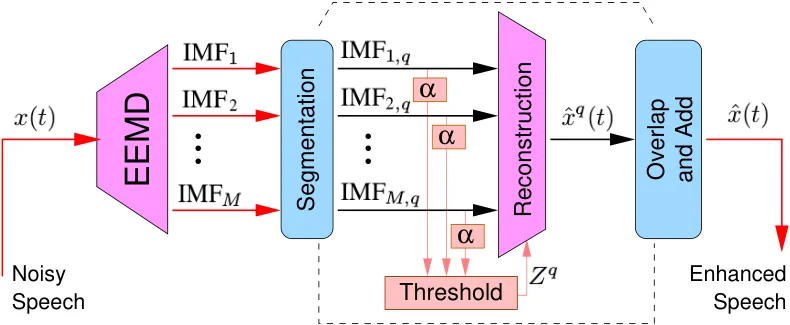
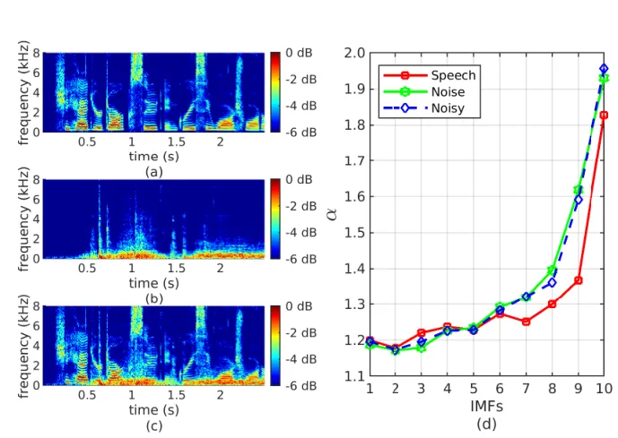
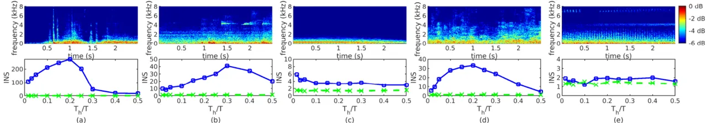

\IEEELSENSarticlesubject

\IEEEtitleabstractindextext

{IEEEkeywords}

speech enhancement, impulsive noises, Hilbert-Huang Transform,
non-stationary acoustic noises.

# Impulsive Noise Detection for Intelligibility and Quality Improvement of Speech Enhancement Methods Applied in Time-Domain

\IEEEauthorblockNC. Medina and R. Coelho\IEEEauthorieeemembermark1
\IEEEauthorblockALaboratory of Acoustic Signal Processing, Military
Institute of Engineering, Rio de Janeiro, 22290-270, Brazil  
\IEEEauthorieeemembermark1Senior Member, IEEE ^(†)^(†)thanks:
Corresponding author: R. Coelho (e-mail: coelho@ime.eb.br)

###### Abstract

This letter introduces a novel speech enhancement method in the
Hilbert-Huang Transform domain to mitigate the effects of acoustic
impulsive noises. The estimation and selection of noise components is
based on the impulsiveness index of decomposition modes. Speech
enhancement experiments are conducted considering five acoustic noises
with different impulsiveness index and non-stationarity degrees under
various signal-to-noise ratios. Three speech enhancement algorithms are
adopted as baseline in the evaluation analysis considering spectral and
time domains. The proposed solution achieves the best results in terms
of objective quality measures and similar speech intelligibility rates
to the competitive methods.

## 1 Introduction

\IEEEPARstart

Impulsive background noisy condition may cause severe impact on the
accuracy of acoustic classification systems and applications. Impulsive
noises (slamming doors, industrial machinery, falling objects) are
encountered in real environments. They are commonly characterized by
almost instantaneous sharp sounds with high acoustic energy and wide
spectral bandwidth. Impulsive sample sequences are generally defined in
the literature by heavy-tail distributions tailored by its impulsiveness
degree. Due to this impulsive nature, a key element of the research area
includes accurate estimation of noise components especially from real
acoustic noisy signals.

In recent years, many studies have been dedicated to mitigate the effect
of non-stationary acoustic noise in different domains \[1, 2, 3\].
Particularly, speech enhancement solutions have been applied in the
Hilbert-Huang Transform (HHT) domain. These techniques adopt the
Empirical Mode Decomposition (EMD) \[4\] or one of its variations to
analyze the noisy speech signal. This powerful decomposition has also
become interesting for processing and analyze other signals, e.g.
electroencephalogram signals \[5\], and multimodal sensing data \[6\].
HHT-based approaches have achieved interesting speech quality
improvement in noisy scenarios \[3, 7, 8\]. Impulsive noises may be
considered as a different kind of non-stationary sources.

This letter introduces an HHT-domain method to enhance speech signals
corrupted by impulsive acoustic noises. The proposed HHT-$`\alpha`$
solution applies the Ensemble EMD (EEMD) \[9\] to decompose a target
noisy signal into a series of intrinsic mode functions (IMF). The noise
components of each IMF are identified and selected based on the
impulsiveness index $`\alpha`$ \[10\] on a frame-by-frame basis. The
speech signal is reconstructed excluding frames that are mainly composed
by noise. In HHT-$`\alpha`$, no assumption is considered for speech and
noise distributions.

Several experiments are conducted to examine the effectiveness of the
proposed solution. HHT-$`\alpha`$ is evaluated considering three quality
and two intelligibility objective measures that present high correlation
with subjective listening tests. Five real acoustic noises with
different impulsiveness degrees are used to corrupt speech utterances.
Five values of signal-to-noise ratio (SNR) are considered in this work:
-10 dB, -5 dB, 0 dB, 5 dB, and 10 dB. Three speech enhancement
techniques are adopted as baseline: the spectral Wiener filtering with
unbiased minimum mean-square error estimator (UMMSE) \[1\], and the time
domain EMD-based filtering (EMDF) \[8\] and EMD-Hurst-based (EMDH) \[3\]
approaches. Experiments demonstrate that the HHT-$`\alpha`$ method
achieves interesting speech quality results, especially for highly
impulsive noises. HHT-$`\alpha`$ also shows similar average
intelligibility rate when compared to the competitive techniques.

## 2 HHT-$`\alpha`$: Speech Enhancement Scheme

The HHT-$`\alpha`$ speech enhancement includes three main steps: noisy
signal decomposition, estimation and selection of noise components, and
speech signal reconstruction. Fig. 1 illustrates the block diagram of
the proposed method.

### 2.1 Noisy Signal Decomposition

HHT \[4\] is a nonlinear adaptive approach that locally analyzes a
signal $`x(t)`$ to define a local high-frequency part, also called
detail $`d(t)`$, and a local trend $`a(t)`$, such that
$`x(t)=d(t)+a(t)`$. An oscillatory IMF is derived from the detail
function $`d(t)`$. The high versus low-frequency separation procedure is
iteratively repeated over the residual $`a(t)`$, leading to a new detail
and a new residual. Thus, the decomposition leads to a series of IMFs
and a residual, such that $`x(t)=\sum_{m=1}^{M}\mbox{IMF}_{m}(t)+r(t)`$,
where $`\mbox{IMF}_{m}(t)`$ is the $`m`$-th mode of $`x(t)`$ and
$`r(t)`$ is the residual. As opposed to other kinds of signal
decomposition, a set of basis functions is not demanded for the HHT. In
fact, HHT results in fully data-driven decomposition modes and does not
require the stationarity of the target signal.

The EEMD was introduced in \[9\] to overcome the mode mixing problem
that generally occurs in the original EMD. The key idea is to average
IMFs obtained after corrupting the original signal using several
realizations of white Gaussian noise (WGN). Thus, EEMD algorithm can be
described as:

1.  1.  Generate $`x^{n}(t)=x(t)+w^{n}(t)`$, where $`w^{n}(t)`$,
        $`n=1,\ldots,N`$, are different realizations of WGN;
2.  2.  Apply EMD to decompose $`x^{n}(t)`$, $`n=1,\ldots,N`$, into a series
        of components $`\mbox{IMF}_{m}^{n}(t)`$, $`m=1,\ldots,M`$;
3.  3.  Assign the $`m`$-th mode of $`x(t)`$ as
        $`\mbox{IMF}_{m}(t)=\frac{1}{N}\sum_{n=1}^{N}\mbox{IMF}_{m}^{n}(t)\,;`$
4.  4.  Finally, $`x(t)=\sum_{m=1}^{M}\mbox{IMF}_{m}(t)+r(t)`$, where
        $`r(t)`$ is the residual.

### 2.2 Estimation and Selection of Noise Components

In the literature, impulsive signals and noises are generally defined by
a sequence of random samples with symmetric heavy-tail distribution,
i.e., $`P[X>x]\sim C|x|^{-\alpha}`$, where $`C`$ is a positive constant
and $`0<\alpha\leq 2`$ is the impulsiveness index. The $`\alpha`$
exponent is also related to $`\alpha`$-stable distribution and may be
described as the characteristic exponent \[10\].

In \[11\] authors showed that for $`\alpha`$-stable noises the EMD
behaves like a quase-dyadic filterbank for $`\alpha\in\,]1.2,2.0]`$.
Speech signals investigated in this work are impulsive and present
heavy-tails with $`\alpha`$ values in the range $`[0.9,1.2]`$. On the
other hand, acoustic noises commonly encountered in real urban scenarios
have values in the range $`[1.2,2.0]`$ \[11\]. Thus, in this letter the
EMD is applied to highlight the noise impulsiveness of the corrupted
speech signal. The estimator proposed by McCulloch in \[12, 13\] is here
adopted for the $`\alpha`$ index estimation.

Figure 1: Block diagram of the HHT-$`\alpha`$ speech enhancement method.

Fig. 2(a)-(c) show spectrograms of a clean speech signal collected from
the TIMIT database \[14\], an impulsive Sliding Door Closing noise with
$`\alpha=1.21`$, and also the corrupted signal with $`\mbox{SNR}=0`$ dB.
Note from Fig. 2(b) that the noise energy is mostly concentrated at low
frequencies and the spectrogram has sharp wide band components around
$`0.6`$, $`1.0`$ and $`1.5`$ seconds. Fig. 2(d) presents average values
of the impulsiveness index $`\alpha`$ estimated from IMFs of clean
speech, impulsive noise, and noisy speech signals. It can be seen that
as the mode index increases, the $`\alpha`$ values of all signals
approach $`2`$. For the highest IMF indexes, e.g., $`7-10`$, the
acoustic noise and the noisy speech signal have similar $`\alpha`$
values. These values are greater than those obtained from the clean
speech signal. This indicates that these IMFs are more noise-like, which
corroborates with previous works (for example, refer to \[3\]).

Similar behavior can be observed in Fig. 3, where the estimated values
of $`\alpha`$ from different IMFs are shown for the other four impulsive
noises: Train ($`\alpha=1.46`$), Horn ($`\alpha=1.59`$), Babble
($`\alpha=1.79`$), and Helicopter ($`\alpha=1.98`$). Once again,
$`\alpha`$ values indicate that IMFs with high indices are mostly
composed by noise. Note from Fig. 2(d) and Fig. 3 that for medium IMF
indexes, i.e., $`3-5`$, $`\alpha`$ values of the noisy signal generally
vary between those estimated from the noise and from the clean speech
signal. This demonstrates that the impulsiveness index is an appropriate
identification criterion to select the IMFs with more speech-like
characteristics and reject the noise-like components.

Figure 2: Spectrograms of (a) clean speech (b) Sliding Door Closing
noise ($`\alpha=1.21`$), and (c) noisy speech (SNR=$`0`$ dB). (d) The
average values of $`\alpha`$ estimated from the IMFs.

Figure 3: Average values of $`\alpha`$ estimated from the IMFs of
impulsive noise sources: (a) Train, (b) Horn, (c) Babble, and (d)
Helicopter.

Figure 4: Spectrograms and INS obtained for 2.4-seconds segments of the
acoustic impulsive noises: (a) Sliding Door Closing, (b) Train, (c) Horn
(d) Babble and (e) Helicopter. Dashed lines indicate the value for the
stationarity test threshold.

The selection of noise components is performed as follows. After the
decomposition of the target noisy signal with the EEMD algorithm, each
mode $`\mbox{IMF}_{m}`$ is segmented into a set of $`Q`$ overlapping
short-time frames $`\mbox{IMF}_{m,q}`$, $`q\in\{1,\ldots,Q\}`$, with
$`T_{d}`$ samples each. In this proposal, the selection of noisy
components is based on $`\alpha`$ parameters of each windowed IMF. For
each frame $`q`$, the impulsiveness index is estimated from the
decomposition modes $`\mbox{IMF}_{m,q}(t)`$ leading to a set of values
$`\alpha_{1}^{q},\ldots,\alpha_{M}^{q}`$. The next step is to determine
the index $`Z^{q}`$ of the last IMF whose impulsiveness index is bellow
a given threshold, $`\rho_{\alpha}`$, i.e.,
$`\alpha_{Z}^{q}\leq\rho_{\alpha}`$. IMFs whose $`\alpha`$ values exceed
the threshold are considered as noise-like components.

### 2.3 Speech Signal Reconstruction

If $`\hat{x}(t)`$ represents the enhanced speech signal, then each frame
is reconstructed by
$`\hat{x}^{q}(t)=\sum_{m=1}^{Z^{q}}w(t)\,\mbox{IMF}_{m,q}(t),q=1,\ldots,Q,`$
where $`Z^{q}`$ is the index of the last mode considered as speech and
$`w(t)`$ is a window function used to avoid discontinuities in the
reconstructed signal (for more details see \[3\]). Finally,
$`\hat{x}(t)`$ is reconstructed by overlapping and adding all frames as
$`\hat{x}(t)=\frac{1}{P}\sum_{q=1}^{Q}\hat{x}^{q}(t-qS_{d})\,,`$ where
$`P`$ is a normalization factor that depends on the window function
$`w(t)`$, the frame length $`T_{d}`$, and the step size $`S_{d}`$.

## 3 Evaluation Experiments

Extensive speech enhancement experiments are conducted with a subset of
$`183`$ speech segments of the TIMIT speech database \[14\]. Speech
utterances have sampling rate of $`16`$ kHz and average time duration of
$`2.4`$ seconds. Five impulsive non-stationary acoustic noises are used
to corrupt the speech utterances: Sliding Door Closing, Train, Horn, and
Helicopter are selected from Freesound.org¹¹ 1 Available at
https://freesound.org., while Babble is obtained from the RSG-10 \[15\]
database. These files are also available at lasp.ime.eb.br.

Fig. 4 presents the spectrogram and the index of non-stationarity (INS)
\[16\] obtained from segments of five acoustic noises. The INS value is
here shown to objectively examine the non-stationarity of impulsive
noises. The time scale $`T_{h}/T`$ is the ratio of the length of the
short-time spectral analysis ($`T_{h}`$) and the total time duration
($`T=2.4`$ seconds) of noise sample sequences. For each window length
$`T_{h}`$, a threshold is defined to guarantee the stationarity
assumption with a confidence degree of $`95`$%. Thus, if
$`\mbox{INS}\leq\gamma`$ then the noise is considered as stationary.
Otherwise, it is designated as non-stationary. The $`\gamma`$ values are
also exhibited in Fig. 4.

Sliding Door Closing, Train, and Babble noises are here classified as
highly non-stationary since their INS achieves values greater than
$`200`$, $`40`$, and $`30`$, respectively. Horn noise presents INS
results in the range $`\left[3,6\right]`$ and thus, it is defined as
moderately non-stationary. Helicopter noise is considered as stationary
since the INS values are quite similar to the stationarity threshold for
all time scales.

The performance of the proposed and baseline methods are examined using
five objective measures. Perceptual evaluation of speech quality (PESQ),
log-likelihood ratio (LLR), and frequency-weighted segmental SNR
(fwSNRseg) \[17\] are used to evaluate enhanced speech signals in terms
of quality. These measures present high correlation with subjective
overall quality and signal distortion results \[17\]. Coherence speech
intelligibility index (CSII) \[18\] and short-time objective
intelligibility measure (STOI) \[19\] are adopted for speech
intelligibility assessment. Intelligibility prediction scores are
obtained according to the mapping function
$`f(d)=\frac{100}{1+{\sf exp}\left(a\,d+b\right)}`$, where $`d`$ refers
to the objective measure. In this work, it is adopted $`a=-10.09`$ and
$`b=4.65`$ for the CSII, and $`a=-13.45`$ and $`b=9.36`$ for the STOI.

For the HHT-$`\alpha`$ method, the EEMD algorithm is applied considering
50 different realizations of WGN with SNR of 30 dB to obtain 10 IMFs.
The decision threshold $`\rho_{\alpha}`$ is crucial to determine the
components to be removed from each corrupted speech frame. In this
letter, an adaptive threshold is introduced, such that
$`\rho_{\alpha}=\min(\mu\alpha^{q}_{u},\alpha_{\text{min}})`$, where
$`\mu=0.8`$, $`\alpha^{q}_{u}`$ is the estimate of $`\alpha`$ for the
corrupted speech windowed signal, and $`\alpha_{\text{min}}`$ is the
minimum value allowed for $`\rho_{\alpha}`$. In this work, $`\mu`$ is
adopted to adjust the amount of noise components to be removed, while
$`\alpha_{\text{min}}=1.1`$ is used to avoid excessive component removal
in speech dominant segments of the signal. The selection of noise
components considers $`T_{d}=10240`$ samples per frame and step size of
$`S_{d}=128`$ samples.

Tab. 1 shows the PESQ results obtained with the proposed and baseline
speech enhancement techniques for different impulsive acoustic noises
and SNR values. Note that HHT-$`\alpha`$ outperforms the competing time
domain approaches for most of the noisy scenarios. Particularly for the
Sliding Door Closing noise, which presents the lowest $`\alpha`$ value,
the HHT-$`\alpha`$ achieves the highest average PESQ result, including
the spectral UMMSE method. On average, the overall PESQ obtained with
the proposed solution is 1.93, which is 0.04 and 0.10 higher than EMDH
and EMDF, respectively. The spectral UMMSE achieved an overall PESQ of
2.11.

| Noise                                | SNR     | UMMSE          | EMDF     | EMDH         | HHT-$`\alpha`$ |
| ------------------------------------ | ------- | -------------- | -------- | ------------ | -------------- |
| Sliding Door Closing $`\alpha=1.21`$ | $`-10`$ | $`1.19`$       | $`1.17`$ | $`\bf 1.21`$ | $`1.20`$       |
|                                      | $`-5`$  | $`1.58`$       | $`1.51`$ | $`1.58`$     | $`1.58`$       |
|                                      | $`0`$   | $`2.00`$       | $`1.90`$ | $`1.98`$     | $`{\bf 2.03}`$ |
|                                      | $`5`$   | $`2.37`$       | $`2.22`$ | $`2.35`$     | $`{\bf 2.44}`$ |
|                                      | $`10`$  | $`2.69`$       | $`2.53`$ | $`2.68`$     | $`{\bf 2.78}`$ |
| Train $`\alpha=1.46`$                | $`-10`$ | $`{\bf 1.21}`$ | $`1.04`$ | $`1.08`$     | $`0.99`$       |
|                                      | $`-5`$  | $`{\bf 1.74}`$ | $`1.47`$ | $`1.50`$     | $`1.48`$       |
|                                      | $`0`$   | $`{\bf 2.18}`$ | $`1.90`$ | $`1.92`$     | $`1.93`$       |
|                                      | $`5`$   | $`{\bf 2.56}`$ | $`2.29`$ | $`2.31`$     | $`2.34`$       |
|                                      | $`10`$  | $`{\bf 2.89}`$ | $`2.61`$ | $`2.67`$     | $`2.67`$       |
| Horn $`\alpha=1.59`$                 | $`-10`$ | $`{\bf 1.75}`$ | $`1.35`$ | $`1.42`$     | $`1.44`$       |
|                                      | $`-5`$  | $`{\bf 2.12}`$ | $`1.61`$ | $`1.70`$     | $`1.84`$       |
|                                      | $`0`$   | $`\bf{2.46}`$  | $`1.95`$ | $`2.05`$     | $`2.23`$       |
|                                      | $`5`$   | $`{\bf 2.78}`$ | $`2.25`$ | $`2.38`$     | $`2.59`$       |
|                                      | $`10`$  | $`{\bf 3.09}`$ | $`2.56`$ | $`2.69`$     | $`2.85`$       |
| Babble $`\alpha=1.79`$               | $`-10`$ | $`0.91`$       | $`0.91`$ | $`0.91`$     | $`0.86`$       |
|                                      | $`-5`$  | $`\bf 1.33`$   | $`1.24`$ | $`1.25`$     | $`1.22`$       |
|                                      | $`0`$   | $`{\bf 1.76}`$ | $`1.58`$ | $`1.60`$     | $`1.61`$       |
|                                      | $`5`$   | $`{\bf 2.17}`$ | $`1.94`$ | $`1.99`$     | $`1.97`$       |
|                                      | $`10`$  | $`{\bf 2.54}`$ | $`2.27`$ | $`2.35`$     | $`2.28`$       |
| Helicopter $`\alpha=1.98`$           | $`-10`$ | $`{\bf 1.51}`$ | $`1.17`$ | $`1.18`$     | $`1.26`$       |
|                                      | $`-5`$  | $`{\bf 1.92}`$ | $`1.52`$ | $`1.54`$     | $`1.62`$       |
|                                      | $`0`$   | $`{\bf 2.30}`$ | $`1.91`$ | $`1.93`$     | $`1.99`$       |
|                                      | $`5`$   | $`{\bf 2.66}`$ | $`2.29`$ | $`2.31`$     | $`2.35`$       |
|                                      | $`10`$  | $`{\bf 2.99}`$ | $`2.61`$ | $`2.66`$     | $`2.65`$       |

Table 1: PESQ results with the proposed and baseline methods.

Fig. 5 exhibits the average fwSNRseg improvement obtained by the
proposed and baseline methods for the five noises. Once again,
HHT-$`\alpha`$ achieves the best results for the highly impulsive
Sliding Door Closing noise. It is interesting to mention that, for this
noise, UMMSE does not improve the speech signals in terms of fwSNRseg.
For the other noise sources, HHT-$`\alpha`$ outperforms the time domain
EMDF and EMDH techniques. Moreover, the fwSNRseg gain of HHT-$`\alpha`$
is slightly superior than that obtained with UMMSE for the Babble and
Helicopter noises.

Figure 5: Average fwSNRseg gain obtained for different noise sources.

Figure 6: Average LLR results obtained for different noise sources.

| Noise                                | SNR     | UMMSE        | EMDF         | EMDH         | HHT-$`\alpha`$ |
| ------------------------------------ | ------- | ------------ | ------------ | ------------ | -------------- |
| Sliding Door Closing $`\alpha=1.21`$ | $`-10`$ | $`15.6`$     | $`\bf 16.7`$ | $`16.5`$     | $`15.0`$       |
|                                      | $`-5`$  | $`35.4`$     | $`\bf 37.2`$ | $`36.7`$     | $`34.8`$       |
|                                      | $`0`$   | $`59.3`$     | $`\bf 60.8`$ | $`60.5`$     | $`60.1`$       |
|                                      | $`5`$   | $`77.8`$     | $`78.6`$     | $`78.3`$     | $`\bf 78.9`$   |
|                                      | $`10`$  | $`88.6`$     | $`\bf 88.9`$ | $`88.7`$     | $`88.6`$       |
| Train $`\alpha=1.46`$                | $`-10`$ | $`12.2`$     | $`12.8`$     | $`\bf 13.8`$ | $`10.1`$       |
|                                      | $`-5`$  | $`32.8`$     | $`33.8`$     | $`\bf 34.4`$ | $`28.9`$       |
|                                      | $`0`$   | $`60.6`$     | $`\bf 61.9`$ | $`61.8`$     | $`57.2`$       |
|                                      | $`5`$   | $`81.1`$     | $`\bf 82.1`$ | $`81.5`$     | $`78.9`$       |
|                                      | $`10`$  | $`91.3`$     | $`\bf 91.4`$ | $`91.2`$     | $`89.7`$       |
| Horn $`\alpha=1.59`$                 | $`-10`$ | $`47.6`$     | $`\bf 53.6`$ | $`53.4`$     | $`37.0`$       |
|                                      | $`-5`$  | $`60.6`$     | $`\bf 65.1`$ | $`65.0`$     | $`55.8`$       |
|                                      | $`0`$   | $`72.1`$     | $`\bf 74.8`$ | $`74.5`$     | $`71.9`$       |
|                                      | $`5`$   | $`82.3`$     | $`\bf 83.1`$ | $`82.7`$     | $`82.6`$       |
|                                      | $`10`$  | $`\bf 90.4`$ | $`89.9`$     | $`89.8`$     | $`89.1`$       |
| Babble $`\alpha=1.79`$               | $`-10`$ | $`3.0`$      | $`4.9`$      | $`4.9`$      | $`3.8`$        |
|                                      | $`-5`$  | $`11.1`$     | $`\bf 15.1`$ | $`14.9`$     | $`14.8`$       |
|                                      | $`0`$   | $`35.4`$     | $`\bf 40.1`$ | $`39.4`$     | $`39.7`$       |
|                                      | $`5`$   | $`69.3`$     | $`\bf 70.9`$ | $`70.2`$     | $`68.5`$       |
|                                      | $`10`$  | $`\bf 88.4`$ | $`88.2`$     | $`88.0`$     | $`85.3`$       |
| Helicopter $`\alpha=1.98`$           | $`-10`$ | $`\bf 20.4`$ | $`15.0`$     | $`16.8`$     | $`16.7`$       |
|                                      | $`-5`$  | $`\bf 45.6`$ | $`37.7`$     | $`39.1`$     | $`41.8`$       |
|                                      | $`0`$   | $`\bf 72.1`$ | $`66.0`$     | $`66.0`$     | $`67.6`$       |
|                                      | $`5`$   | $`\bf 87.9`$ | $`84.6`$     | $`84.5`$     | $`83.3`$       |
|                                      | $`10`$  | $`\bf 94.4`$ | $`93.2`$     | $`93.1`$     | $`91.4`$       |

Table 2: STOI Intelligibility rate prediction (%).

Figure 7: CSII intelligibility prediction rates obtained for (a) Sliding
Door Closing, (b) Train, (c) Horn, (d) Babble, and (e) Helicopter
acoustic noises.

Fig. 6 depicts the average LLR values obtained for each impulsive noise.
Note that the proposed solution again achieves the highest LLR for four
noise sources. The only exception is the Horn noise. However,
HHT-$`\alpha`$ outperforms the spectral UMMSE for this noise source. The
overall LLR obtained with HHT-$`\alpha`$ is 0.73, which is 0.04, 0.05
and 0.09 higher than results achieved with EMDH, EMDF and UMMSE,
respectively.

Tab. 2 presents intelligibility prediction rates obtained with STOI.
Note that HHT-$`\alpha`$ and competitive solutions achieve quite close
results, especially for SNR $`\geq 0`$ dB. On average, intelligibility
prediction rates vary in at most 2.2 percentage points, i.e., from 57.0%
with HHT-$`\alpha`$ to 59.2% with EMDH. This similar behavior in terms
of speech intelligibility is reinforced by CSII results depicted in Fig. 7. Once again, the proposed and baseline algorithms show similar speech
intelligibility prediction values.

## 4 Conclusion

This letter introduced the HHT-$`\alpha`$ speech enhancement technique
based on the Hilbert-Huang Transform. The EEMD algorithm is used to
decompose the noisy speech signal in time domain. The estimation and
selection of noise components is performed frame-by-frame based on the
impulsiveness index of the decomposition modes. The enhanced version of
the speech signal is finally reconstructed using the IMFs that are
mainly composed of speech. Several experiments were conducted using five
non-stationary acoustic noises with different values of the
impulsiveness index $`\alpha`$. Particularly for the most impulsive
noise, the proposed solution outperformed the three competing approaches
in terms of PESQ, fwSNRseg, and LLR objective quality measures. In terms
of speech intelligibility, HHT-$`\alpha`$ is similar to other
state-of-the-art methods for all the impulsive noise sources.

## Acknowledgment

R. Coelho is partially supported by the National Council for Scientific
and Technological Development (CNPq) 307866/2015 and Fundação de Amparo
à Pesquisa do Estado do Rio de Janeiro (FAPERJ) 203075/2016 research
grants.

## References

- \[1\] T. Gerkmann and R. Hendriks, “Unbiased MMSE-based noise power
  estimation with low complexity and low tracking delay,” _IEEE
  Transactions on Audio, Speech and Language Processing_, vol. 20, no.
  4, pp. 1383–1393, 2012.
- \[2\] R. Tavares and R. Coelho, “Speech enhancement with
  nonstationary acoustic noise detection in time domain,” _IEEE Signal
  Processing Letters_, vol. 23, no. 1, pp. 6–10, 2016.
- \[3\] L. Zão, R. Coelho, and P. Flandrin, “Speech enhancement with
  EMD and hurst-based mode selection,” _IEEE/ACM Transactions on Audio,
  Speech and Language Processing_, vol. 22, no. 5, pp. 899–911, 2014.
- \[4\] N. Huang, Z. Shen, S. Long, M. Wu, H. Shih, Q. Zheng, N.
  Yen, C. Tung, and H. Liu, “The empirical mode decomposition and the
  hilbert spectrum for nonlinear and non-stationary time series
  analysis,” in _Proc. R. Soc. London. Ser. A: Math., Phys., Eng. Sci._,
  no. 1971, 1998, pp. 903–995.
- \[5\] V. Bajaj, S. Taran, E. Tanyildizi, and A. Sengur, “Robust
  approach based on convolutional neural networks for identification of
  focal EEG signals,” _IEEE Sensors Letters_, vol. 3, no. 5, pp. 1–4,
  May 2019.
- \[6\] A. Shamsan, W. Dan, and C. Cheng, “Multimodal data fusion using
  multivariate empirical mode decomposition for automatic process
  monitoring,” _IEEE Sensors Letters_, vol. 3, no. 1, pp. 1–4,
  January 2019.
- \[7\] R. Coelho and L. Zão, “Empirical mode decomposition theory
  applied to speech enhancement,” in _Signals and Images: Advances and
  Results in Speech, Estimation, Compression, Recognition, Filtering and
  Processing_, R. Coelho, V. Nascimento, R. Queiroz, J. Romano, and C.
  Cavalcante, Eds. Boca Raton, Florida: CRC Press, 2015.
- \[8\] N. Chatlani and J. Soraghan, “EMD-based filtering (EMDF) of low
  frequency noise for speech enhancement,” _IEEE Transactions on Audio,
  Speech and Language Processing_, vol. 20, no. 4, pp. 1158–1166,
  May 2012.
- \[9\] M. E. Torres, M. A. Colominas, G. Schlotthauer, and P.
  Flandrin, “A complete ensemble empirical mode decomposition with
  adaptive noise,” in _Proc. IEEE International Conference on Acoustics,
  Speech and Signal Processing (ICASSP)_, 2011.
- \[10\] C. Nikias and M. Shao, _Signal Processing with Alpha-Stable
  Distributions and Applications_. Wiley, 1995.
- \[11\] A. Komaty, A. Boudraa, J. Nolan, and D. Dare, “On the behavior
  of EMD and MEMD in presence of symmetric alpha-stable noise,” _IEEE
  Signal Processing Letters_, vol. 22, no. 7, pp. 818–822, 2015.
- \[12\] J. H. McCulloch, “Simple consistent estimators of stable
  distribution parameters,” _Communications in Statistics - Simulation
  and Computation_, vol. 15, no. 5, pp. 1109–1136, 1986.
- \[13\] ——, “Maximum likelihood estimation of symmetric stable
  parameters,” Ohio State University, Department of Economics, Tech.
  Rep., 1998.
- \[14\] J. Garofolo, L. Lamel, W. Fisher, J. Fiscus, D. Pallett, N.
  Dahlgren, and V. Zue, “Timit acoustic-phonetic continuous speech
  corpus,” in _Linguistic Data Consortium, Philadelphia, PA, USA_, 1993.
- \[15\] H. Steeneken and F. Geurtsen, “Description of the RSG-10 noise
  database,” _report IZF_, vol. 3, p. 1988, 1988.
- \[16\] P. Borgnat, P. Flandrin, P. Honeine, C. Richard, and J. Xiao,
  “Testing stationarity with surrogates: A time-frequency approach,”
  _IEEE Transactions on Signal Processing_, vol. 58, no. 7, pp.
  3459–3470, July 2010.
- \[17\] Y. Hu and P. Loizou, “Evaluation of objective quality measures
  for speech enhancement,” _IEEE Transactions on Audio, Speech and
  Language Processing_, vol. 16, no. 1, pp. 229–238, 2008.
- \[18\] J. Kates, “Coherence and the speech intelligibility index,”
  _Journal of the Acoustical Society of America_, vol. 4, pp.
  2224–2237, 2005.
- \[19\] C. Taal, R. Hendriks, R. Heusdens, and J. Jensen, “An
  algorithm for intelligibility prediction of time-frequency weighted
  noisy speech,” _IEEE Transactions on Audio, Speech and Language
  Processing_, vol. 19, pp. 2125–2136, 2011.
