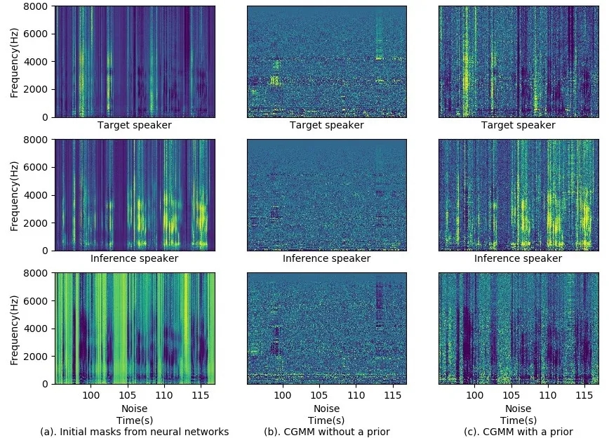

# Multi-Talker MVDR Beamforming Based on Extended Complex Gaussian Mixture Model

Hangting Chen    Pengyuan Zhang    and Yonghong Yan ^(†)^(†)thanks:
Hangting Chen, Pengyuan Zhang and Yonghong Yan are with Key Laboratory
of Speech Acoustics and Content Understanding, Institute of Acoustics,
Chinese Academy of Sciences, Beijing 100190, China, email:
chenhangting@hccl.ioa.ac.cn, zhangpengyuan@hccl.ioa.ac.cn,
yanyonghong@hccl.ioa.ac.cn ^(†)^(†)thanks: Pengyuan Zhang is the
corresponding author.

###### Abstract

In this letter, we present a novel multi-talker minimum variance
distortionless response (MVDR) beamforming as the front-end of an
automatic speech recognition (ASR) system in a dinner party scenario.
The CHiME-5 dataset is selected to evaluate our proposal for overlapping
multi-talker scenario with severe noise. A detailed study on beamforming
is conducted based on the proposed extended complex Gaussian mixture
model (CGMM) integrated with various speech separation and speech
enhancement masks. Three main changes are made to adopt the original
CGMM-based MVDR for the multi-talker scenario. First, the number of
Gaussian distributions is extended to $`3`$ with an additional inference
speaker model. Second, the mixture coefficients are introduced as a
supervisor to generate more elaborate masks and avoid the permutation
problems. Moreover, we reorganize the MVDR and mask-based speech
separation to achieve both noise reduction and target speaker
extraction. With the official baseline ASR back-end, our front-end
algorithm gained an absolute WER reduction of $`13.87\%`$ compared with
the baseline front-end.

###### Index Terms: 

MVDR, CGMM, CHiME-5, single-channel mask

## I Introduction

After deep learning has been introduced in automatic speech recognition
(ASR) \[1\]\[2\], modern systems have already achieved considerable
recognition accuracies on the clean close-talk data \[3\]. However,
speaker overlap, noise, and reverberation remains some of the biggest
challenges. The CHiME challenges are targeting distant multiple
microphone speech recognition in everyday listening environments \[4\].
In the recent CHiME-5, the speech data is recorded in a party scenario,
which presents extreme speech overlap and unrestrained speaking style
\[5\]. As a result, the word error rate (WER) of the official baseline
system was $`81.1\%`$.

Beamforming strengthens a signal in a specific direction while
attenuating it in other directions \[6\], resulting in the reduction of
noise and reverberation with controllable speech signal distortion
\[7\]. The minimum variance distortionless response (MVDR) beamforming
minimizes the power of the output signal while keep the original speech
signal undistorted \[8\]. However, the spatial correlation matrices of
noise/speech signals are required for its implementation. A common
method to obtain the correlation matrix is from time-frequency masks,
which is averaged (or maximized) along all channels \[9\]. Recently,
deep neural networks combined with ideal ratio masks (IRMs) have shown
to generate considerably more elaborate separation masks
\[9\]\[10\]\[11\]. Several training losses, such as regression of IRM
and indirect mapping (IM), were proposed and compared in \[12\].
Additionally, network architectures like progressively learning training
are more effective than fully-connected feed-forward networks
\[13\]\[14\]. On the other hand, the complex Gaussian mixture model
(CGMM) proposed in \[15\] can generate masks as well as correlation
matrices without any pairwise training samples. Some research attempts
have been made to compare \[16\] and integrate the neural network-based
and CGMM-based methods \[17\].

In a cocktail party, however, beamforming cannot separate speaker
sources owing to the close gathering of people in most scenarios. In
this letter, a novel extended CGMM-based MVDR framework, which
simultaneously removes inference speaker as well as noise, is designed
to overcome the difficulties of speech overlap and noise in CHiME-5.

Our main contributions are two-fold. First, an extended CGMM algorithm
is proposed by unifying speech separation (SS) and speech enhancement
(SE) into one MVDR framework. Note that an extended CGMM algorithm was
also proposed in the CHiME-5 submission \[18\], but our algorithm does
not require other front-end techniques or suffer from permutation
problem. This simple, flexible algorithm integrated with single-channel
masks is derived from the recent CGMM-based MVDR algorithm with $`3`$
main changes. An ablation study of proposed components is presented to
make a detailed analysis of the algorithm. Second, different masks are
compared to gain insight on the further improvement of this method. Our
front-end, MVDR based on the extend CGMM integrated with single-channel
SS and SE masks achieved a WER of $`67.23\%`$ under the baseline ASR,
indicating the best front-end performance for Rank-A in CHiME-5.

## II CGMM-based MVDR Beamforming

This section briefly formulates the problem of multiple sources and
multichannel observation, and the corresponding CGMM-based approach to
estimate speech masks, which follows the notation in \[15\].

### II-A MVDR Beamforming

Let $`k\in{1,...,K}`$ be a source index, $`m\in{1,...,M}`$ be a
microphone index, $`f\in{1,...,F}`$ be a frequency index after the
short-time Fourier transform (STFT). The signals received by the $`m`$th
microphone in the time-frequency domain, $`y_{m}`$, can be represented
as,

```math
y_{m}(f,t)=\sum_{k}h_{m}^{(k)}(f)s^{(k)}(f,t)+n_{m}(f,t),\vskip-4.26773pt \tag{1}
```

where $`s^{(k)}`$, $`n_{m}`$ and $`h_{m}^{(k)}`$ denote the $`k`$-th
source signal, the noise received by $`m`$-th microphone, the impulse
response between the $`k`$-th source and the $`m`$-th microphone,
respectively. The Equation (1) can be rewritten in a vector notation as,

```math
\mathbf{y}(f,t)=\sum_{k}\mathbf{h}^{(k)}(f)s^{(k)}(f,t)+\mathbf{n}(f,t).\vskip-4.26773pt \tag{2}
```

A beamforming based on the linear model applies a linear filter
$`\mathbf{w}^{(k)}_{f}`$ on the microphone array signal $`\mathbf{y}`$,

```math
\hat{s}^{(k)}(f,t)=\mathbf{w}^{(k)^{H}}_{f}\mathbf{y}(f,t).\vskip-4.26773pt \tag{3}
```

The MVDR minimizes the variance of $`\hat{s}^{(k)}`$ subject to
$`\mathbf{w}^{(k)^{H}}\mathbf{h}^{(k)}(f)=1`$. Thus the
$`\mathbf{w}^{(k)}_{f}`$ can be written as,

```math
\mathbf{w}^{(k)}_{f}=\frac{R_{f}^{(y)^{(-1)}}\mathbf{h}_{f}^{(k)}}{\mathbf{h}_{f}^{(k)^{H}}R_{f}^{(y)^{-1}}\mathbf{h}_{f}^{(k)}},\vskip-4.26773pt \tag{4}
```

where $`R_{f}^{(y)}`$ denotes the covariance matrix of noisy signal,
calculated by
$`R_{f}^{(y)}=\frac{1}{T}\sum_{t}\mathbf{y}_{f,t}\mathbf{y}_{f,t}^{H}`$.
The room transfer function $`\mathbf{h}_{f}^{(k)}`$ can be estimated as
the eigenvector corresponding to the maximum eigenvalue of
$`R_{f}^{(k)}`$, and it is determined by

```math
R_{f}^{(k)}=\frac{1}{\sum_{t}\lambda_{f,t}^{(k)}}\sum_{t}\lambda_{f,t}^{(k)}\mathbf{y}_{f,t}\mathbf{y}_{f,t}^{H},\vskip-4.26773pt \tag{5}
```

where $`\lambda_{f,t}^{(k)}`$ represents how the target source $`k`$
dominates the time-frequency bin. In practice, IRMs can be regarded
equal to $`\lambda_{f,t}^{(k)}`$, which serves an external knowledge of
target source to implement the MVDR. The algorithm of Equation (3), (4)
and (5) is denoted as MVDR($`X`$,$`masks`$) with multichannel STFT
spectrum and target source masks as input.

### II-B Complex Gaussian Mixture Model

The CGMM has been proposed to cluster time-frequency bins into acoustic
sources as well as noise, then to estimate spatial correlation matrices.
Based on the observation model, the multichannel signal from a source
can be modeled in a complex Gaussian distribution,

```math
\mathbf{y}_{f,t}|k\sim\mathcal{N}_{c}(0,\phi_{f,t}^{(k)}\mathbf{R}_{f}^{(k)}),\vskip-4.26773pt \tag{6}
```

where $`k`$ indicates the condition of the specific source,
$`\phi_{f,t}^{(k)}`$ is the variance of signal in the time-frequency bin
and $`\mathbf{R}_{f}^{(k)}`$ corresponds to
$`\mathbf{h}_{f}^{(k)}\mathbf{h}_{f}^{(k)^{H}}`$. Introducing the
mixture model for different sources, the multichannel observed signal
can be modeled as,

```math
\mathbf{y}_{f,t}\sim\sum_{k}\mathcal{N}_{c}(0,\phi_{f,t}^{(k)}\mathbf{R}_{f}^{(k)}),\vskip-4.26773pt \tag{7}
```

where the mixture coefficients are set to $`1`$. Thus, the
log-likelihood function maximized by the Expectation-Maximization (EM)
algorithm is defined as,

```math
log\ p(y|\Theta)=\sum_{f,t}log\sum_{k}\mathcal{N}_{c}(\mathbf{y}_{f,t}|0,\phi_{f,t}^{(k)}\mathbf{R}_{f}^{(k)}),\vskip-4.26773pt \tag{8}
```

In the E step, the masks of each source can be estimated as,

```math
\lambda_{f,t}^{(k)}\leftarrow\frac{\mathcal{N}_{c}(\mathbf{y}_{f,t}|0,\phi_{f,t}^{(k)}\mathbf{R}_{f}^{(k)})}{\sum_{k}\mathcal{N}_{c}(\mathbf{y}_{f,t}|0,\phi_{f,t}^{(k)}\mathbf{R}_{f}^{(k)})}.\vskip-4.26773pt \tag{9}
```

In the M step, the parameters are updated as follows,

```math
\phi_{f,t}^{(k)}\leftarrow\frac{1}{M}tr(\mathbf{y}_{f,t}\mathbf{y}_{f,t}^{H}\mathbf{R}_{f}^{(k)^{-1}}), \tag{10}
```

```math
\mathbf{R}_{f}^{(k)}\leftarrow\frac{1}{\sum_{t}\lambda_{f,t}^{(k)}}\sum_{t}\frac{\lambda_{f,t}^{(k)}}{\phi_{f,t}^{(k)}}\mathbf{y}_{f,t}\mathbf{y}_{f,t}^{H}. \tag{11}
```

## III Proposed Methods

$`X`$: Multichannel STFT spectrum  
  $`Y`$: STFT spectrum after beamforming

1: Split the whole spectrum into $`blocks`$, whose length is
$`T_{block}(ms)`$

2: for $`block`$ do

3:   if Applying multichannel SS masks then

4:    Early-SS($`X`$,$`masks`$)

5:   end if

6:   if Applying multichannel SE masks then

7:    Early-SE($`X`$,$`masks`$)

8:   end if

9:   if Delay-and-sum then

10:    BeamformIT($`X`$)

11:   else if MVDR then

12:    if CGMM then

13:      if 2CGMM then

14:       2CGMM-ini($`X`$,$`masks`$,$`Prior`$)/

15:       2CGMM-w/o-ini($`X`$)

16:      else if 3CGMM then

17:       3CGMM($`X`$,$`masks`$,$`Prior`$)

18:      end if

19:    end if

20:    MVDR($`X`$,$`masks`$)

21:    if Applying single-channel SS masks then

22:      Later-SS($`Y`$,$`masks`$)

23:    end if

24:   end if

25: end for

26: Concatenate processed $`blocks`$ into the STFT spectrum

27: return STFT spectrum

Algorithm 1 The Beamforming Framework

In this section, we mainly focus on a multi-talker CGMM-based MVDR
algorithm. To implement this algorithm, a knowledge of masks of the
target speaker and noise is required at first. The method of obtaining
these masks is described in Section IV.

### III-A Reorganize CGMM-based MVDR

The talking style of natural conversation causes extremely overlapped
speech in CHiME-5, considered as one of the biggest challenges \[19\].
Unfortunately, the speakers in CHiME-5 can not be modeled simply as
separated signal sources. In most cases, a multichannel microphone array
receives the unidirectional signal from the gathered speakers, resulting
in the failure of blind speaker separation. In other words, utilizing
the MVDR algorithm by considering the target and inference speakers as
different sources can not solve the problem of speech overlap.

To separate different speakers, a speaker separation mask is first
required, which can be generated by neural network-based methods like
\[19\]\[20\]. A straightforward approach, named Early-SS/Later-SS in the
letter, is to reduce noise and reverberation with MVDR and apply the SS
mask before/after the beamforming.

Another concern is the iteration of the 3CGMM when using target,
inference and noise masks simultaneously. In our practice, the masks can
be iterated directly using EM algorithm in Equation (9), (10), (11) with
a number of $`k`$ equal to $`3`$.

### III-B Introduce Mixture Coefficients



Fig. 1: The masks of the target speaker, inference speaker and noise for
session S02 from $`95s`$ to $`116s`$, generated by (a) neural networks,
(b) CGMM without a prior, (c) CGMM with a prior. The target speaker is
P05 and the inference speakers are P06, P07, P08.

The EM algorithm for iterating the CGMM depends on the initialization of
the $`k`$th source’s mask $`\lambda_{k}`$. With a mask estimated by the
neural networks, the CGMM’s parameters can be initialized in a more
accurate way. Nevertheless, in our CHiME-5 experiments, initialization
(sophisticated neural network-based initialization or identity/random
correlation matrices) leads to negligible divergence of final results.
As shown in Figure 1(b), after sufficient iterations, the clustering
pattern collapsed without contrast. The reason might be small divergence
of the probability density computed by Gaussian models in Equation (6).
For audios with high signal-to-noise ratios (SNRs), the likelihood from
different sources displays high contrast, leading to distinguishable
masks. For low-SNR audios, the likelihood is low in all source CGMMs,
resulting in indistinguishable estimated masks.

To solve the failure of clustering, a prior probability is introduced in
Equation (8),

```math
log\ p(y|\Theta)=\sum_{f,t}log\sum_{k}\alpha_{f,t}^{(k)}\mathcal{N}_{c}(\mathbf{y}_{f,t}|0,\phi_{f,t}^{(k)}\mathbf{R}_{f}^{(k)}),\vskip-4.26773pt \tag{12}
```

which served as mixture coefficients in the CGMM. Different from \[15\],
the mixture coefficients here are not scalar. It shares the same
dimension with the STFT spectrum and is fixed among iterations. Only the
update rules of Equation (9) are rewritten as follows,

```math
\lambda_{f,t}^{(k)}\leftarrow\frac{\alpha_{f,t}^{(k)}\mathcal{N}_{c}(\mathbf{y}_{f,t}|0,\phi_{f,t}^{(k)}\mathbf{R}_{f}^{(k)})}{\sum_{k}\alpha_{f,t}^{(k)}\mathcal{N}_{c}(\mathbf{y}_{f,t}|0,\phi_{f,t}^{(k)}\mathbf{R}_{f}^{(k)})}.\vskip-4.26773pt \tag{13}
```

Note that using the mixture coefficients, the permutation problem are
unobserved in most cases. The prior serves as a supervisor so that the
only thing Gaussian models (Equation (6)) need to do is to add
perturbation on it.

### III-C The Complete Algorithm

An extended 3CGMM-based MVDR is proposed here to alienate the
difficulties of speaker overlap and noise corruption in CHiME-5. Here
$`3`$ main changes are made to adapt the algorithm for the multi-talker
condition,

1.  1.  Prior=True. Introduce the mixture coefficient as a prior for CGMM,
        which equals to the input mask.
2.  2.  3CGMM. The extended CGMM algorithm which iterates the target
        speaker, inference speaker and noise masks simultaneously.
3.  3.  Early-SS/Later-SS. The target speaker mask is applied before/after
        beamforming to ensure that the processed audio contains only the
        target speaker. The masks can be averaged multichannel masks or the
        ones after 3CGMM iteration.

Other components of experiments are also listed for comparison,

1.  1.  Early-SE. Apply the denosing mask on the spectrum.
2.  2.  BeamformIT. The delay-and-sum beamforming with BeamformIT
        \[21\]\[22\].
3.  3.  MVDR. The MVDR beamforming in Section II-A.
4.  4.  2CGMM-ini/2CGMM-w/o-ini. The 2CGMM algorithm described in Section
        II-B with/without initialized correlation matrices and masks.

The entire setup is given in Algorithm 1. We underline the main changes
with code names, which will be carefully studied in Section IV-C.

## IV Experiments and Results

### IV-A Experiment Settings

| System ID | Beamforming | Components of Algorithm 1                                                | WER(%)             |
| --------- | ----------- | ------------------------------------------------------------------------ | ------------------ |
| A0        | BeamformIT  | BeamformIT                                                               | $`80.59`$          |
| A1        | BeamformIT  | BeamformIT+Early-SE(masks=RT)                                            | $`80.77`$          |
| A2        | BeamformIT  | BeamformIT+Early-SS(mask=SS1)                                            | $`\mathbf{75.83}`$ |
| A3        | BeamformIT  | BeamformIT+Early-SS(mask=SS1)+Early-SE(masks=RT)                         | $`76.59`$          |
| B1        | MVDR        | MVDR(masks=RT)                                                           | $`80.74`$          |
| B2        | MVDR        | MVDR(masks=SS1)                                                          | $`85.09`$          |
| B3        | MVDR        | MVDR(masks=RT)+Early-SS(mask=SS1)                                        | $`74.38`$          |
| B4        | MVDR        | MVDR(masks=RT)+Later-SS(mask=SS1)                                        | $`\mathbf{73.68}`$ |
| C0        | 2CGMM-MVDR  | MVDR(masks=2CGMM-w/o-ini)+2CGMM-w/o-ini                                  | $`81.35`$          |
| C1        | 2CGMM-MVDR  | MVDR(masks=2CGMM-ini)+2CGMM-ini(masks=RT,Prior=false)                    | $`81.49`$          |
| C2        | 2CGMM-MVDR  | MVDR(masks=2CGMM-ini)+2CGMM-ini(masks=RT,Prior=false)+Early-SS(mask=SS1) | $`77.27`$          |
| C3        | 2CGMM-MVDR  | MVDR(masks=2CGMM-ini)+2CGMM-ini(masks=RT,Prior=false)+Later-SS(mask=SS1) | $`74.64`$          |
| C4        | 2CGMM-MVDR  | MVDR(masks=2CGMM-ini)+2CGMM-ini(masks=RT,Prior=true)+Later-SS(mask=SS1)  | $`\mathbf{73.14}`$ |
| D1        | 3CGMM-MVDR  | MVDR(masks=3CGMM)+3CGMM(masks=RT&SS1,Prior=false)+Later-SS(masks=SS1)    | $`75.05`$          |
| D2        | 3CGMM-MVDR  | MVDR(masks=3CGMM)+3CGMM(masks=RT&SS1,Prior=true)+Later-SS(masks=SS1)     | $`70.66`$          |
| D3        | 3CGMM-MVDR  | MVDR(masks=3CGMM)+3CGMM(masks=RT&SS1,Prior=true)+Later-SS(mask=3CGMM)    | $`\mathbf{67.90}`$ |

TABLE I: The ablation study of the beamforming framework in algorithm 1

Our experiments adopted the official baseline of CHiME-5 as the back-end
ASR module \[23\]. It was trained using worn data and $`100k`$ randomly
selected far-field utterances under an architecture of time-delay neural
networks in lattice-free MMI criterion. The performance test was
conducted on the development set (Single Device Track, constrained LM,
ranking A) \[5\]. The baseline WER was $`80.59\%`$ under our machines
with BeamformIT (A0 in Table I).

For all the front-end experiments described in this letter, the STFT
spectrum was extracted every $`16ms`$ over $`32ms`$ hamming windows. The
length of each block processed by the MVDR beamforming was set to
$`T_{blokcks}=8208ms`$ equal to $`512`$ frames. The number of iterations
for 2CGMM/3CGMM was $`10`$, which could achieve an average real-time
factor of $`0.51`$/$`0.81`$ with a $`2.20`$GHz CPU.

### IV-B Speech Separation and Enhancement Models

| Approach    | WER(%)             |
| ----------- | ------------------ |
| Raw         | $`80.63`$          |
| $`1`$-stage | $`75.83`$          |
| $`2`$-stage | $`\mathbf{75.46}`$ |

TABLE II: The results of speaker separation models using BeamformIT

Our speech separation model is speaker-dependent, i.e., the models were
trained for each speaker in each session individually. The training data
was simulated from non-overlapping parts of records. This feed-forward
DNN had $`3`$ layers and $`2048`$ units in each. The inputs were
extended to a context of $`7`$ frames. The same models were used for
$`2`$-stage separation, but little improvement was observed in our
experiments using BeamformIT and the baseline ASR back-end (Table II).
More details on the $`2`$-stage speech separation could be found in
\[19\].

| Approach | PESQ               | WER(%)             |
| -------- | ------------------ | ------------------ |
| Raw      | $`2.543`$          | $`\mathbf{80.63}`$ |
| RT       | $`2.664`$          | $`80.77`$          |
| PLT      | $`\mathbf{2.675}`$ | $`80.84`$          |

TABLE III: The results of denoising approaches using BeamformIT

Our speech enhancement model was trained using the original far-field
records. Without additional front-end denoising modules, the training of
the neural network was aimed at mapping the original far-field noisy
speech mixed with the far-field noise to the original one. In practice,
the SS model utilized regression training (RT) or progressively learning
training (PLT) of IRM. The RT used the same architecture of the SS
model, updated by the mean square loss of the IRM. The PLT architecture
also adopted the fully-connected layers with an input extended to a
context of $`7`$. It learned $`5`$ targets, and did not do post
processing \[14\]. Without the presence of original clean data and due
to the limitation of the single-channel denoising method, the network
could not achieve any WER reduction but did promote the perceptual
evaluation of speech quality (PESQ) on the simulated audios (Table III).

### IV-C The Ablation Study of Algorithm 1

To analyze the beamforming framework in detail, we further conducted
ablation studies of different collections of components in Algorithm 1
(Table I). The masks are marked as ”SS1, RT” if they are from the
1-stage SS models and the RT models (Section IV-B), and are marked as
”2CGMM, 3CGMM” if they are equal to those in Equation (9)/(13) after
iterations.

From A0-A3 and B1-B2, the SS masks seemed to play a more positive role
than the SE masks. The results of B2 indicated that the straight-forward
using of SS masks in the MVDR algorithm could not remove inference
speakers. However, an alternative way of applying the SS masks
before/after MVDR beamforming dramatically improved the performance
(B1-B4, C0-C3), and the Later-SS is more preferred (B3-B4, C2-C3). In
contrast with MVDR (B4), the 2CGMM-MVDR (C3) as well as 3CGMM-MVDR (D1)
did not exhibit superiority until a prior was introduced as mixture
coefficients (C4, D2). The prior led to a more elaborate mask compared
with the neural network-based mask and no pattern collapse occurred
(Figure 1). At last, the initial SS masks were replaced by the ones
after 3CGMM iterations (D3), leading to a further improvement of
performance.

### IV-D Study of Different Masks

| SS          | SE  | WER(%)             |
| ----------- | --- | ------------------ |
| $`1`$-stage | RT  | $`67.90`$          |
| $`1`$-stage | PLT | $`67.70`$          |
| $`2`$-stage | RT  | $`67.45`$          |
| $`2`$-stage | PLT | $`\mathbf{67.23}`$ |

TABLE IV: The results of the proposed 3CGMM-MVDR integrated with various
masks

Another study of the impact of different masks as the prior was
conducted using various SS and SE masks on System D3 (Table IV). The
experiments implied that a better prior mask led to a better
performance, indicating that for further performance improvement,
research should be conducted to obtain more accurate masks.

## V Conclusion

In this letter, we propose a multi-talker MVDR beamforming based on an
extended CGMM. A detailed study of the algorithm and the influence of
different masks was conducted on the CHiME-5 dataset. Our best
3CGMM-MVDR system achieved a WER of $`67.23\%`$ without other front-end
techniques compared with the $`80.59\%`$ WER of the official baseline
system.

## References

- \[1\] G. E. Dahl, D. Yu, L. Deng, and A. Acero, “Context-dependent
  pre-trained deep neural networks for large-vocabulary speech
  recognition,” _IEEE Transactions on Audio, Speech, and Language
  Processing_, vol. 20, no. 1, pp. 30–42, 2012.
- \[2\] G. E. Hinton, L. Deng, D. Yu, G. E. Dahl, A. Mohamed, N. Jaitly,
  A. W. Senior, V. Vanhoucke, P. Nguyen, T. N. Sainath _et al._, “Deep
  neural networks for acoustic modeling in speech recognition: The
  shared views of four research groups,” _IEEE Signal Processing
  Magazine_, vol. 29, no. 6, pp. 82–97, 2012.
- \[3\] W. Xiong, J. Droppo, X. Huang, F. Seide, M. L. Seltzer,
  A. Stolcke, D. Yu, and G. Zweig, “Achieving human parity in
  conversational speech recognition,” _arXiv: Computation and
  Language_, 2016.
- \[4\] J. Barker, R. Marxer, E. Vincent, and S. Watanabe, “The third
  ‘chime’ speech separation and recognition challenge: Dataset, task and
  baselines,” pp. 504–511, 2015.
- \[5\] J. Barker, S. Watanabe, E. Vincent, and J. Trmal, “The fifth
  ’chime’ speech separation and recognition challenge: Dataset, task and
  baselines,” pp. 1561–1565, 2018.
- \[6\] B. D. Van Veen and K. M. Buckley, “Beamforming: a versatile
  approach to spatial filtering,” _IEEE Assp Magazine_, vol. 5, no. 2,
  pp. 4–24, 1988.
- \[7\] A. Spriet, M. Moonen, and J. Wouters, “Spatially pre-processed
  speech distortion weighted multi-channel wiener filtering for noise
  reduction,” _Signal Processing_, vol. 84, no. 12, pp. 2367–2387, 2004.
- \[8\] I. Cohen, J. Benesty, S. Gannot, and Kommunikationstechnik,
  “Chapter 9, speech processing in modern communication,” _Springer
  Topics in Signal Processing_, vol. 129, no. 1, pp. 535–535, 2010.
- \[9\] H. Erdogan, J. R. Hershey, S. Watanabe, M. I. Mandel, and J. L.
  Roux, “Improved mvdr beamforming using single-channel mask prediction
  networks,” pp. 1981–1985, 2016.
- \[10\] X. Xiao, S. Zhao, D. L. Jones, E. S. Chng, and H. Li, “On
  time-frequency mask estimation for mvdr beamforming with application
  in robust speech recognition,” pp. 3246–3250, 2017.
- \[11\] J. Heymann, L. Drude, and R. Haebumbach, “Neural network based
  spectral mask estimation for acoustic beamforming,” pp. 196–200, 2016.
- \[12\] L. Sun, J. Du, L. R. Dai, and C. H. Lee, “Multiple-target deep
  learning for lstm-rnn based speech enhancement,” in _Hands-free Speech
  Communications & Microphone Arrays_, 2017.
- \[13\] T. Gao, J. Du, L. Dai, and C. Lee, “Snr-based progressive
  learning of deep neural network for speech enhancement.” pp.
  3713–3717, 2016.
- \[14\] T. Gao, J. Du, L. R. Dai, and C. H. Lee, “Densely connected
  progressive learning for lstm-based speech enhancement,” 2018, pp.
  5054–5058.
- \[15\] T. Higuchi, N. Ito, S. Araki, T. Yoshioka, M. Delcroix, and
  T. Nakatani, “Online mvdr beamformer based on complex gaussian mixture
  model with spatial prior for noise robust asr,” _IEEE/ACM Transactions
  on Audio Speech & Language Processing_, vol. PP, no. 99, pp.
  1–1, 2017.
- \[16\] T. Higuchi, K. Kinoshita, N. Ito, S. Karita, and T. Nakatani,
  “Frame-by-frame closed-form update for mask-based adaptive mvdr
  beamforming,” pp. 531–535, 2018.
- \[17\] T. Nakatani, N. Ito, T. Higuchi, S. Araki, and K. Kinoshita,
  “Integrating dnn-based and spatial clustering-based mask estimation
  for robust mvdr beamforming,” pp. 286–290, 2017.
- \[18\]
  http://spandh.dcs.shef.ac.uk/chime_workshop/papers/CHiME_2018_paper_du.pdf.
- \[19\] L. Sun, J. Du, T. Gao, Y. Fang, F. Ma, J. Pan, and C. Lee, “A
  two-stage single-channel speaker-dependent speech separation approach
  for chime-5 challenge,” 2019.
- \[20\] J. Wu, Y. Xu, S. Zhang, L. Chen, M. Yu, L. Xie, and D. Yu,
  “Improved speaker-dependent separation for chime-5 challenge.” _arXiv:
  Audio and Speech Processing_, 2019.
- \[21\] X. Anguera Miró, _Robust speaker diarization for
  meetings_. Universitat Politècnica de Catalunya, 2006.
- \[22\] X. Anguera, C. Wooters, and J. Hernando, “Acoustic beamforming
  for speaker diarization of meetings,” _IEEE Transactions on Audio,
  Speech, and Language Processing_, vol. 15, no. 7, pp. 2011–2022, 2007.
- \[23\] https://github.com/kaldi-asr/kaldi/tree/master/egs/chime5/s5.
