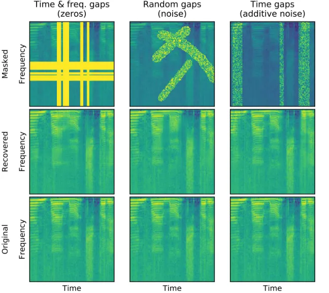

# Deep Speech Inpainting of Time-frequency Masks

$`{\star}`$-These authors contributed equally to this work.

###### Abstract

Transient loud intrusions, often occurring in noisy environments, can
completely overpower speech signal and lead to an inevitable loss of
information. While existing algorithms for noise suppression can yield
impressive results, their efficacy remains limited for very low
signal-to-noise ratios or when parts of the signal are missing. To
address these limitations, here we propose an end-to-end framework for
speech inpainting, the context-based retrieval of missing or severely
distorted parts of time-frequency representation of speech. The
framework is based on a convolutional U-Net trained via deep feature
losses, obtained using speechVGG, a deep speech feature extractor
pre-trained on an auxiliary word classification task. Our evaluation
results demonstrate that the proposed framework can recover large
portions of missing or distorted time-frequency representation of
speech, up to 400 ms and 3.2 kHz in bandwidth. In particular, our
approach provided a substantial increase in STOI & PESQ objective
metrics of the initially corrupted speech samples. Notably, using deep
feature losses to train the framework led to the best results, as
compared to conventional approaches.

Mikolaj Kegler^(⋆,1,2)   Pierre Beckmann^(⋆,1,3)   Milos Cernak¹

¹Logitech Europe S.A., 1015, Lausanne, Switzerland  
²Imperial College London, SW7 2AZ, London, UK  
³Swiss Federal Institute of Technology Lausanne, 1015, Lausanne,
Switzerland

mak616@ic.ac.uk, pierre.beckmann@epfl.ch, milos.cernak@ieee.org

Index Terms: Speech inpainting, speech retrieval, speech enhancement,
deep learning, deep feature loss

## 1 Introduction

Recent major achievements in the field of speech enhancement (SE) have
been mainly attributed to deep learning \[1, 2, 3\]. In particular,
these new approaches tend to outperform traditional statistical SE
systems, especially for high-variance noises \[4, 5\]. SE algorithms
based on deep neural networks (DNNs) typically belong to one of the
following groups: (i) causal systems that maintain the conventional
approach of speech and noise estimation for spectral subtraction
methods \[6, 7, 8\] and (ii) end-to-end systems, including generative
approaches, that are usually non-causal and require longer temporal
integration windows  \[9, 10, 11\]. Both approaches are capable of
suppressing non-stationary noise, even at relatively low signal-to-noise
ratios (SNRs). However, they rarely consider cases involving transient
high-amplitude noise intrusions, which may completely overpower the
speech signal. In such cases, the corrupted portion of the signal is
inevitably lost and can only be restored.

To address the existing knowledge gap, here, we consider the task of
speech inpainting, the context-based recovery of missing or severely
degraded information in time-frequency representation of natural speech.
The problem of generative, context-based, information recovery has been
traditionally investigated in the field of computer vision, whereby it’s
referred to as image completion or inpainting \[12, 13, 14\]. A similar
problem was formulated in the field of audio processing and named, by
analogy, audio inpainting. The problem was originally studied with only
short time gaps \[15\]. More recent approaches reported new promising
results but only with music and musical instruments \[16, 17\], not
natural speech. Building on the existing audio inpainting, here, we
introduce an end-to-end speech inpainting system for recovering missing
or severely degraded parts of time-frequency representation of speech.

We simulated the degradation of speech signals by masking their
time-frequency representations. The applied masks represented either (i)
time gaps, similar to packet loss \[18, 19\], but with long intrusions
of up to 400 ms in duration, (ii) frequency gaps, related to the
bandwidth extension problem \[20, 21\] but with missing frequency bins
summing up to 3200 Hz in bandwidth or (iii) irregular, random gaps
disrupting up to 40% of the overall time-frequency representation of
1-second-long speech segments. According to the authors’ knowledge, this
problem, at such scale, was not investigated in the past. Notably, a SE
system that could recover missing or severely degraded parts of
time-frequency representations of speech, of arbitrary shapes, has not
been proposed to date.

To tackle the problem of speech inpainting we used an end-to-end DNN
with the U-Net architecture \[22\]. According to recent studies, the use
of deep feature losses for training SE systems can improve their overall
performance, depending on the feature extraction approach \[23, 24,
25\]. We hypothesized that a specialized feature extractor, tailored
specifically for speech processing, would provide the best performance
of the trained system. Thus, we employed speechVGG \[26\], a deep speech
feature extractor based on the classic VGG-16 architecture \[27\] and
pre-trained on an auxiliary word classification task. We considered two
configurations of the framework for informed and blind inpainting,
depending on the availability of masks indicating missing or degraded
parts of time-frequency representation of speech. In the case of blind
speech inpainting, we evaluated the system using different types of
intrusions, by replacing or adding high-amplitude noise to the masked
parts of time-frequency representation of speech. Performance of the
proposed approach was compared to a baseline based on the linear
predictive coding (LPC) extrapolation algorithm \[28\].

## 2 Materials & methods

### 2.1 Data & preprocessing

We performed all of our experiments using LibriSpeech corpus, the open
dataset of read English speech sampled at 16 kHz \[29\]. We used the
train-clean-100 subset to train, test-clean subset to monitor the
training performance and dev-clean, as a held-off data to evaluate all
the models explored in this work. All available speech recordings were
chunked into 1024-ms-long segments, without overlap. The time-frequency
representation of each segment was obtained using a complex short-time
Fourier transform (STFT, 256 samples window with 128 samples overlap,
128 frequency bins), resulting in a 128 x 128 matrix. The log-magnitude
of each time-frequency bin was obtained by taking an absolute value of a
complex number and computing its natural logarithm, and the phase, by
computing its angle. Log-magnitude of each frequency channel was
normalized using the mean and standard deviation obtained from the
training data.

### 2.2 Speech inpainting task

In the task of speech inpainting, we simulated the degradation of speech
signal by applying masks to the STFTs, obtained as specified in
section 2.1. We considered three types of masks covering a specific
portion of time-, time & frequency information, or a random arbitrary
combination of the two (Fig. 1). For time and time & frequency masks,
the percentage indicated the masked portions of time and frequency bins,
and in the random case, the overall mask coverage (i.e. area of the
STFT). Each mask was randomly distributed between 1 to 4 blocks covering
time and frequency bins, none shorter than 3 bins (24 ms or 187.5 Hz
bandwidth). Number of blocks and their placement were each time drawn
from uniform distributions. The mask was applied equivalently to the
STFT magnitude and phase.

We trained our speech inpainting system to recover speech samples (from
train-clean-100) distorted using time & frequency or random masks. For
each training sample, the type of mask was assigned randomly with equal
probability. Size of each mask used in training was drawn from the
normal distribution $`N(\mu=29.4\%,\sigma=9.9\%)`$. The speech
inpainting performance of the trained system was evaluated using the
held-off dev-clean data and mask sizes ranging from 10% (total: 100 ms,
800 Hz bandwidth), up to 40% (total: 400 ms, 3200 Hz bandwidth). Speech
samples from the held-off evaluation data were masked, processed through
the trained speech inpainting system and reconstructed back to
time-domain (i.e. waveform). The short term objective intelligibility
(STOI) \[30\] and perceptual evaluation of speech quality (PESQ) \[31\],
measured between the processed and the original (i.e. non-masked) speech
samples, were used to quantify the inpainting performance.



Figure 1: Examples of speech inpainting. Masked parts of STFT
log-magnitudes of speech are either removed (left) or replaced (middle),
as well as, mixed with high-amplitude noise (right).

Figure 2: The speech inpainting framework is composed of the U-Net for
speech inpainting (left, see 2.3 for details) and VGG-like deep feature
extractor (right). Deep feature losses $`L_{DF}`$ for training the U-Net
are obtained by computing the $`L_{1}`$ distance between the
representations of the recovered and the actual STFT log-magnitudes at
pooling layers concluding each block of the feature extractor (see 2.4
for details).

### 2.3 U-Net for speech inpainting

The main part of the proposed speech inpainting framework was an
end-to-end DNN with a U-Net architecture \[22\]. The DNN was applied to
restore missing or degraded parts of the log-magnitude of speech STFTs
(Fig. 1), obtained, as describe in sections 2.1 & 2.2. The phase
information was discarded and not used by our model. To reconstruct the
processed sample back to time domain, its phase was estimated directly
from the magnitudes via the local weighted sums algorithm \[32, 33\].

The diagram of the system is presented in Fig. 2. Our U-Net was composed
of six encoding (blue, Fig. 2) and seven decoding blocks (green,
Fig. 2). Each encoding block consisted of a 2D convolution layer with a
stride 2 and ReLU activation. In turn, each decoding block upsampled its
input through a 2D upsampling layer with a kernel size 2, effectively
doubling its size. Such upsampled input was subsequently concatenated
with the input to the corresponding encoding block. The concatenated set
of features was then processed through a 2D convolution (stride 1) with
leaky ReLU activation ($`\alpha=0.2`$) \[34\]. Batch
normalization \[35\] was applied after each 2D convolution layer across
the network. The final decoding block was a 1D convolution with a linear
activation function returning the restored version of the distorted
input speech sample. Parameters of our U-Net’s convolution layers are
listed in Table 1.

We considered two versions of the framework: performing informed and
blind speech inpainting. In the informed case, the mask corrupting the
input was known and all 2D convolutions in the network were replaced
with partial convolutions (PC) \[14\], which processed only valid
(non-masked) parts of their input and ignored the rest. We also wanted
to explore whether the framework can simultaneously identify and restore
missing or degraded parts of the input. In such case, all convolution
layers in the U-Net performed standard, full, 2D convolutions (FC) and
we refer to such setup as the blind speech inpainting. Other than that,
the two configurations of the network were identical.

|       | (kernel size, number of filters) |                  |
| ----- | -------------------------------- | ---------------- |
| Block | Encoding - conv                  | Decoding - dconv |
| 0     | -                                | (1,1)            |
| 1     | (7, 16)                          | (3, 1)           |
| 2     | (5, 32)                          | (3, 16)          |
| 3     | (5, 64)                          | (3, 32)          |
| 4     | (3, 128)                         | (3, 64)          |
| 5     | (3, 128)                         | (3, 128)         |
| 6     | (3, 128)                         | (3, 128)         |

Table 1: Parameters of the model’s convolution layers. All 2D
convolutions across the model employed zero-padding (i.e. ’same’ mode).
Block 0 represents the final 1D convolution.

### 2.4 Deep feature loss training

We used speechVGG \[26\] as a deep feature extractor for training the
speech inpainting framework. The extractor was based on the VGG-16
convolutional DNN architecture \[27\] and consisted of five main blocks
(Fig. 2, yellow), each concluded by a max-pooling layer. We pre-trained
the speechVGG to classify 1000 most frequent, at least
four-letters-long, words from the training data. The samples for
pre-training were processed as specified in section 2.1, augmented using
SpecAugment \[36\] and randomly padded with zeros to a size of 128 x 128.

We trained the framework for speech inpainting using deep feature losses
$`L_{DF}`$ \[23, 24, 25\] (Fig. 2, grey), computed via the pre-trained
speechVGG feature extractor. For each training sample, the U-Net was
applied to recover the degraded input. The reconstructed ($`\hat{Y}`$)
and the original ($`Y`$) log-magnitude STFTs were then processed through
the speechVGG extractor. Activation of all five of the extractor’s
pooling layers $`E`$, one at the end of each block (Fig. 2, yellow) were
obtained for the reconstructed $`E(\hat{Y})`$ and actual $`E(Y)`$
samples. Subsequently, the deep feature loss $`L_{DF}`$ was computed as
the $`L_{1}`$ loss between the two representations:

```math
L_{DF}=L_{1}(E(Y),E(\hat{Y})) \tag{1}
```

We compared the performance of the inpainting framework trained with
deep feature losses obtained through: (i) the pre-trained speechVGG
extractor (speechVGG), (ii) the original VGG-16 network pre-trained to
classify images from the ImageNet dataset \[27, 37\] (imgVGG) or (iii)
without deep feature losses, but the direct $`L_{1}`$, per-pixel loss,
between the original and the recovered STFT log-magnitudes:
$`L_{1}(Y,\hat{Y})`$ (noVGG).

### 2.5 Linear predictive coding baseline

Inspired by Marafioti, et al. \[17\], we compared the performance of
different configurations of the proposed deep speech inpainting
framework (see section 2.4) to the well-established LPC extrapolation
algorithm \[28\]. The LPC was applied in the time domain, to recover
missing parts of speech samples, given the signal surrounding each
intrusion. While the LPC method was suitable for known and well-defined,
temporal intrusions, we couldn’t find a meaningful way to apply it for
recovering samples distorted with random irregular masks of arbitrary
shapes. This highlights the flexibility of our end-to-end system, as
compared to conventional time-domain approaches \[17, 19, 28\].

### 2.6 Implementation details

The speechVGG was pre-trained using cross-entropy loss for 50 epochs
with a fixed learning rate set to $`5\times 10^{-5}`$. Each considered
configuration of the U-Net for speech inpainting was trained for 30
epochs using either deep feature- ($`L_{DF}`$) or per-pixel- ($`L_{1}`$)
loss with a fixed learning rate of $`2\times 10^{-4}`$. ADAM
optimizer \[38\] was used in all the training routines.

## 3 Results

### 3.1 Informed speech inpainting

|              |      | Gaps  |       | Noise |       | LPC   |       | noVGG |       | imgVGG |       | speechVGG |       |
| ------------ | ---- | ----- | ----- | ----- | ----- | ----- | ----- | ----- | ----- | ------ | ----- | --------- | ----- |
| Intrusion    | Size | STOI  | PESQ  | STOI  | PESQ  | STOI  | PESQ  | STOI  | PESQ  | STOI   | PESQ  | STOI      | PESQ  |
| Time         | 10%  | 0.893 | 2.561 | 0.901 | 2.802 | 0.921 | 2.798 | 0.926 | 3.118 | 0.917  | 3.117 | 0.938     | 3.240 |
|              | 20%  | 0.772 | 1.872 | 0.800 | 2.260 | 0.842 | 2.483 | 0.879 | 2.755 | 0.860  | 2.713 | 0.887     | 2.809 |
|              | 30%  | 0.641 | 1.476 | 0.688 | 1.919 | 0.750 | 2.233 | 0.805 | 2.428 | 0.779  | 2.382 | 0.811     | 2.450 |
|              | 40%  | 0.536 | 1.154 | 0.598 | 1.665 | 0.669 | 2.015 | 0.724 | 2.171 | 0.695  | 2.109 | 0.730     | 2.179 |
| Time + Freq. | 10%  | 0.869 | 2.423 | 0.873 | 2.575 | 0.887 | 2.692 | 0.905 | 2.921 | 0.899  | 2.915 | 0.920     | 3.034 |
|              | 20%  | 0.729 | 1.790 | 0.746 | 2.010 | 0.780 | 2.378 | 0.845 | 2.518 | 0.829  | 2.491 | 0.853     | 2.566 |
|              | 30%  | 0.598 | 1.391 | 0.629 | 1.653 | 0.668 | 2.128 | 0.765 | 2.158 | 0.743  | 2.134 | 0.772     | 2.178 |
|              | 40%  | 0.484 | 1.053 | 0.520 | 1.329 | 0.566 | 1.907 | 0.672 | 1.840 | 0.644  | 1.809 | 0.680     | 1.845 |
| Random       | 10%  | 0.880 | 2.842 | 0.892 | 3.063 | N/A   |       | 0.941 | 3.477 | 0.927  | 3.399 | 0.944     | 3.496 |
|              | 20%  | 0.809 | 2.233 | 0.830 | 2.543 |       |       | 0.912 | 3.079 | 0.897  | 3.040 | 0.918     | 3.114 |
|              | 30%  | 0.713 | 1.690 | 0.745 | 2.085 |       |       | 0.872 | 2.702 | 0.856  | 2.680 | 0.878     | 2.735 |
|              | 40%  | 0.644 | 1.355 | 0.682 | 1.802 |       |       | 0.837 | 2.443 | 0.823  | 2.422 | 0.846     | 2.479 |

Table 2: Informed speech inpainting (section 3.1). STOI & PESQ were
computed between the recovered and the actual speech segments from the
validation set and averaged. The best scores were denoted in bold. See
section 2.4 for training configurations.

The first experiment assessed the performance of the proposed framework
in the informed speech inpainting task when the exact masks were known.
Here, masked parts of the inputs were replaced with zeros, reflecting
missing information and the system was using partial
convolutions \[14\], which ignored masked parts of their inputs.
Unprocessed, corrupted speech samples (Gaps) and the case when their
masked parts were filled with speech-shaped noise (Noise), derived from
the original speech signal, served as a reference to compare other
methods against.

The complete evaluation results are presented in Table 2. Each
configuration of the proposed framework improved both STOI and PESQ for
all the considered shapes and sizes of intrusions, as compared to the
distorted case with either zeros- or noise-filled gaps. The use of deep
feature losses in training yielded better results, as compared to the
case when the U-Net was trained via direct, per-pixel, $`L_{1}`$ loss
(noVGG). However, only the speechVGG (speechVGG), not the VGG-16
pre-trained on the ImageNet data (imgVGG), led to particularly notable
improvements in STOI & PESQ. The proposed framework trained with the
speechVGG consistently outperformed the baseline LPC algorithm (LPC) in
terms of STOI, suggesting better recovery of speech intelligibility. For
PESQ scores, the advantage of our method was consistent but smaller.
Surprisingly, for the largest time-frequency masking (40%) the LPC
achieved substantially lower STOI, but it was the only case when it
yielded slightly higher PESQ, as compared to our approach.

### 3.2 Blind speech inpainting

|              |      | Gaps  |       | Noise |       | PC - gaps |       | FC - gaps |       | FC - noise |       | FC - additive |       |
| ------------ | ---- | ----- | ----- | ----- | ----- | --------- | ----- | --------- | ----- | ---------- | ----- | ------------- | ----- |
| Intrusion    | Size | STOI  | PESQ  | STOI  | PESQ  | STOI      | PESQ  | STOI      | PESQ  | STOI       | PESQ  | STOI          | PESQ  |
| Time         | 10%  | 0.893 | 2.561 | 0.901 | 2.802 | 0.938     | 3.240 | 0.930     | 3.191 | 0.919      | 3.066 | 0.933         | 3.216 |
|              | 20%  | 0.772 | 1.872 | 0.800 | 2.260 | 0.887     | 2.809 | 0.875     | 2.725 | 0.863      | 2.677 | 0.906         | 2.971 |
|              | 30%  | 0.641 | 1.476 | 0.688 | 1.919 | 0.811     | 2.450 | 0.798     | 2.384 | 0.792      | 2.374 | 0.882         | 2.788 |
|              | 40%  | 0.536 | 1.154 | 0.598 | 1.665 | 0.730     | 2.179 | 0.714     | 2.086 | 0.707      | 2.072 | 0.854         | 2.617 |
| Time + Freq. | 10%  | 0.869 | 2.423 | 0.873 | 2.575 | 0.920     | 3.034 | 0.911     | 3.000 | 0.896      | 2.859 | 0.912         | 3.023 |
|              | 20%  | 0.729 | 1.790 | 0.746 | 2.010 | 0.853     | 2.566 | 0.840     | 2.490 | 0.828      | 2.411 | 0.885         | 2.759 |
|              | 30%  | 0.598 | 1.391 | 0.629 | 1.653 | 0.772     | 2.178 | 0.757     | 2.108 | 0.743      | 2.041 | 0.854         | 2.562 |
|              | 40%  | 0.484 | 1.053 | 0.520 | 1.329 | 0.680     | 1.845 | 0.665     | 1.772 | 0.659      | 1.787 | 0.828         | 2.413 |
| Random       | 10%  | 0.880 | 2.842 | 0.892 | 3.063 | 0.944     | 3.496 | 0.932     | 3.442 | 0.917      | 3.272 | 0.932         | 3.435 |
|              | 20%  | 0.809 | 2.233 | 0.830 | 2.543 | 0.918     | 3.114 | 0.904     | 3.061 | 0.887      | 2.897 | 0.910         | 3.117 |
|              | 30%  | 0.713 | 1.690 | 0.745 | 2.085 | 0.878     | 2.735 | 0.869     | 2.701 | 0.853      | 2.596 | 0.891         | 2.893 |
|              | 40%  | 0.644 | 1.355 | 0.682 | 1.802 | 0.846     | 2.479 | 0.832     | 2.412 | 0.813      | 2.307 | 0.868         | 2.664 |

Table 3: Blind speech inpainting (section 3.2). STOI & PESQ were
computed between the recovered and the actual speech segments from
validation set and averaged. The best scores were denoted in bold. PC -
informed (partial conv.), FC - blind (full conv.) inpainting.

In the blind speech inpainting, the masks disrupting the input speech
were not known and the system was trained to simultaneously identify and
recover distorted portions of the input. We considered three different
scenarios by setting the masked values of the input STFT log-magnitudes
to either zero (-gaps, Fig. 1, left), white noise (-noise, Fig. 1,
middle) or a mixture of the original information and the noise
(-additive, Fig. 1, right). The noise was added directly to the STFT
log-magnitudes and its amplitude was set to provide transient mixtures
at the very low SNRs, below -10 dB (i.e. very disruptive noise level).

In this experiment, we used the best overall configuration of the system
from the previous experiment, namely speechVGG. The network setup
remained the same, expect all partial convolutions (PC) were replaced
with regular, full 2D convolutions (FC), as specified in section 2.3.
The framework was re-trained and re-evaluated separately for each type
of intrusion (-gaps, -noise, -additive). Other than that, the training
and evaluation routines remained the same as in the informed case.

The complete evaluation results are presented in Table 3. All of the
considered framework configurations successfully recovered missing or
degraded parts of the input speech resulting in improved STOI and PESQ
scores. The framework for the informed inpainting (PC-gaps) yielded
better results, as compared to its blind counterpart, when the masked
parts of the input were set to either zeros or random noise (FC -gaps,
-noise, respectively). Notably, when input speech was mixed with, not
replaced by, the high-amplitude noise, the framework operating in the
blind setup (FC-additive) led to the best results for larger intrusions
of all the considered shapes. These results suggest that the framework
for the blind speech inpainting takes advantage of the original
information underlying the noisy intrusions, even when the transient SNR
is very low (below -10 dB).

## 4 Discussion

The proposed framework is capable of recovering missing or degraded
parts of time-frequency representations of speech, as indicated by the
substantial improvements in STOI and PESQ scores. Notably, intrusions
used in the evaluation were as large as 400 ms (i.e. the duration of a
syllable or a short word) and 3.2 kHz in bandwidth. We showed that
employing deep feature losses in training leads to better results as
compared to conventional methods. However, only the speech-specific
feature extractor speechVGG applied to obtain deep feature losses,
unlike imgVGG pre-trained on a visual task, led to the improved
performance. Our results suggest that the proposed system can
simultaneously identify degraded parts of the input speech and recover
them. In particular, our system for blind speech inpainting improved
STOI and PESQ scores of degraded speech, both when parts of the
time-frequency representation were missing, as well as, distorted by the
additive noise.

Importantly, our experiments employing additive noise represented only a
simplified scenario. In future experiments, a broader range of
ecological noises shall be considered to assess the framework
performance in the joint speech denoising and inpainting task. Our
approach could further benefit from incorporating phase information as
an additional input feature for the DNN. We indeed experimented in this
domain but none of our several attempts of utilizing the STFT phase in
the framework outperformed the proposed approach. The limited phase
reconstruction capacity may be underlying the only case when the
LPC-based algorithm yielded higher PESQ score than our approach. Despite
low STOI, the time-domain LPC reinforced phase consistency and although
the recovered speech was unintelligible, its quality was quantified as
disproportionately better.

## 5 Conclusion

We introduced a novel end-to-end framework for recovering large portions
of missing or degraded time-frequency representation of natural speech.
Our system provided substantial improvements in STOI & PESQ metrics,
both when the position of intrusions in time and frequency were known
(informed-) or not (blind inpainting). The DNN at the core of our system
benefited from being trained via deep feature losses. Computing the loss
through speechVGG, a pre-trained speech feature extractor, led to the
best results. We believe that the proposed approach can be integrated
with the existing SE systems and contribute to the development of the
next-generation general-purpose SE.

Demo of the deep speech inpainting is available at^(†)^(†)
[https://mkegler.github.io/SpeechInpainting](https://mkegler.github.io/SpeechInpainting).
Python implementation of the speechVGG and pre-trained models are openly
available at^(†)^(†)
[https://github.com/bepierre/SpeechVGG](https://github.com/bepierre/SpeechVGG).

## 6 Acknowledgements

This work was funded by Logitech & Imperial College London.

## References

- \[1\] Y. Xu, J. Du, L.-R. Dai, and C.-H. Lee, “An experimental study
  on speech enhancement based on deep neural networks,” _IEEE Signal
  processing letters_, vol. 21, no. 1, pp. 65–68, 2013.
- \[2\] Y. Wang, A. Narayanan, and D. Wang, “On training targets for
  supervised speech separation,” _IEEE/ACM transactions on audio,
  speech, and language processing (TASLP)_, vol. 22, no. 12, pp.
  1849–1858, 2014.
- \[3\] F. Weninger, H. Erdogan, S. Watanabe, E. Vincent, J. Le Roux,
  J. R. Hershey, and B. Schuller, “Speech enhancement with lstm
  recurrent neural networks and its application to noise-robust asr,” in
  _International Conference on Latent Variable Analysis and Signal
  Separation_. Springer, 2015, pp. 91–99.
- \[4\] A. Kumar and D. Florencio, “Speech enhancement in multiple-noise
  conditions using deep neural networks,” in _Proc. Interspeech 2016_,
  2016, pp. 3738–3742.
- \[5\] D. Wang and J. Chen, “Supervised speech separation based on deep
  learning: An overview,” _IEEE/ACM Transactions on Audio, Speech and
  Language Processing (TASLP)_, vol. 26, no. 10, pp. 1702–1726, 2018.
- \[6\] Y. Xu, J. Du, L.-R. Dai, and C.-H. Lee, “A regression approach
  to speech enhancement based on deep neural networks,” _IEEE/ACM
  Transactions on Audio, Speech and Language Processing (TASLP)_,
  vol. 23, no. 1, pp. 7–19, 2015.
- \[7\] S. Mirsamadi and I. Tashev, “Causal speech enhancement combining
  data-driven learning and suppression rule estimation,” in _Proc.
  Interspeech 2016_, 2016, pp. 2870–2874.
- \[8\] J.-M. Valin, “A hybrid dsp/deep learning approach to real-time
  full-band speech enhancement,” in _2018 IEEE 20th International
  Workshop on Multimedia Signal Processing (MMSP)_. IEEE, 2018, pp. 1–5.
- \[9\] S. Pascual, A. Bonafonte, and J. Serrà, “Segan: Speech
  enhancement generative adversarial network,” in _Proc. Interspeech
  2017_, 2017, pp. 3642–3646.
- \[10\] S. Pascual, J. Serrà, and A. Bonafonte, “Towards generalized
  speech enhancement with generative adversarial networks,” _arXiv
  preprint arXiv:1904.03418_, 2019.
- \[11\] Y. Liu and D. Wang, “Divide and conquer: A deep casa approach
  to talker-independent monaural speaker separation,” _IEEE/ACM
  Transactions on Audio, Speech, and Language Processing (TASLP)_,
  vol. 27, no. 12, pp. 2092–2102, 2019.
- \[12\] S. Iizuka, E. Simo-Serra, and H. Ishikawa, “Globally and
  locally consistent image completion,” _ACM Transactions on Graphics_,
  vol. 36, no. 4, pp. 1–14, 2017.
- \[13\] J. Yu, Z. Lin, J. Yang, X. Shen, X. Lu, and T. Huang,
  “Generative image inpainting with contextual attention,” in
  _Proceedings of the IEEE Conference on Computer Vision and Pattern
  Recognition_, 2018, pp. 5505–5514.
- \[14\] G. Liu, F. Reda, K. Shih, T.-C. Wang, A. Tao, and B. Catanzaro,
  “Image inpainting for irregular holes using partial convolutions,” in
  _Proceedings of the European Conference on Computer Vision (ECCV)_,
  2018, pp. 85–100.
- \[15\] A. Adler, V. Emiya, M. Jafari, M. Elad, R. Gribonval, and
  M. Plumbley, “Audio inpainting,” _IEEE/ACM Transactions on Audio,
  Speech, and Language Processing (TASLP)_, vol. 20, no. 3, pp.
  922–932, 2011.
- \[16\] N. Perraudin, N. Holighaus, P. Majdak, and P. Balazs,
  “Inpainting of long audio segments with similarity graphs,” _IEEE/ACM
  Transactions on Audio, Speech, and Language Processing (TASLP)_,
  vol. 26, no. 6, pp. 1083–1094, 2018.
- \[17\] A. Marafioti, N. Perraudin, N. Holighaus, and P. Majdak, “A
  context encoder for audio inpainting,” _IEEE/ACM Transactions on
  Audio, Speech, and Language Processing (TASLP)_, vol. 27, no. 12, pp.
  2362–2372, 2019.
- \[18\] C. Perkins, O. Hodson, and V. Hardman, “A survey of packet loss
  recovery techniques for streaming audio,” _IEEE network_, vol. 12,
  no. 5, pp. 40–48, 1998.
- \[19\] B.-K. Lee and J.-H. Chang, “Packet Loss Concealment Based on
  Deep Neural Networks for Digital Speech Transmission,” _IEEE/ACM
  Transactions on Audio, Speech, and Language Processing (TASLP)_,
  vol. 24, no. 2, pp. 378–387, 2016.
- \[20\] B. Iser, W. Minker, and G. Schmidt, _Bandwidth extension of
  speech signals_. Springer, 2008.
- \[21\] F. Nagel and S. Disch, “A harmonic bandwidth extension method
  for audio codecs,” in _2009 IEEE International Conference on
  Acoustics, Speech and Signal Processing_. IEEE, 2009, pp. 145–148.
- \[22\] O. Ronneberger, P. Fischer, and T. Brox, “U-net: Convolutional
  networks for biomedical image segmentation,” in _International
  Conference on Medical image computing and computer-assisted
  intervention_. Springer, 2015, pp. 234–241.
- \[23\] C.-F. Liao, Y. Tsao, X. Lu, and H. Kawai, “Incorporating
  Symbolic Sequential Modeling for Speech Enhancement,” in _Proc.
  Interspeech 2019_, 2019, pp. 2733–2737.
- \[24\] F. Germain, Q. Chen, and V. Koltun, “Speech Denoising with Deep
  Feature Losses,” in _Proc. Interspeech 2019_, 2019, pp. 2723–2727.
- \[25\] A. Sahai, R. Weber, and B. McWilliams, “Spectrogram feature
  losses for music source separation,” in _27th European Signal
  Processing Conference (EUSIPCO)_, 2019, pp. 1–5.
- \[26\] P. Beckmann, M. Kegler, H. Saltini, and M. Cernak, “Speech-vgg:
  A deep feature extractor for speech processing,” _arXiv preprint
  arXiv:1910.09909_, 2019.
- \[27\] K. Simonyan and A. Zisserman, “Very deep convolutional networks
  for large-scale image recognition,” in _International Conference on
  Learning Representations_, 2015.
- \[28\] I. Kauppinen and K. Roth, “Audio signal extrapolation–theory
  and applications,” in _Proc. International Conference on Digital Audio
  Effects (DAFx)_, 2002, pp. 105–110.
- \[29\] V. Panayotov, G. Chen, D. Povey, and S. Khudanpur,
  “Librispeech: An ASR corpus based on public domain audio books,” in
  _2015 IEEE International Conference on Acoustics, Speech and Signal
  Processing (ICASSP)_. IEEE, 2015, pp. 5206–5210.
- \[30\] C. Taal, R. Hendriks, R. Heusdens, and J. Jensen, “A short-time
  objective intelligibility measure for time-frequency weighted noisy
  speech,” in _2010 IEEE International Conference on Acoustics, Speech
  and Signal Processing (ICASSP)_. IEEE, 2010, pp. 4214–4217.
- \[31\] “Methods for subjective determination of transmission quality,”
  _ITU-T Rec. P.800_, 1998.
- \[32\] J. L. Roux, H. Kameoka, N. Ono, and S. Sagayama, “Fast signal
  reconstruction from magnitude STFT spectrogram based on spectrogram
  consistency,” in _Proc. International Conference on Digital Audio
  Effects (DAFx)_, 2010, pp. 397–403.
- \[33\] ——, “Phase initialization schemes for faster
  spectrogram-consistency-based signal reconstruction,” in _Proc.
  Acoustical Society of Japan Autumn Meeting (ASJ)_, no. 3-10-3, 2010.
- \[34\] B. Xu, N. Wang, T. Chen, and M. Li, “Empirical evaluation of
  rectified activations in convolutional network,” _arXiv preprint
  arXiv:1505.00853_, 2015.
- \[35\] S. Ioffe and C. Szegedy, “Batch normalization: Accelerating
  deep network training by reducing internal covariate shift,” in
  _Proceedings of the 32nd International Conference on Machine
  Learning_, 2015, pp. 448–456.
- \[36\] D. S. Park, W. Chan, Y. Zhang, C.-C. Chiu, B. Zoph, E. D.
  Cubuk, and Q. V. Le, “Specaugment: A simple augmentation method for
  automatic speech recognition,” in _Proc. Interspeech 2019_, 2019.
- \[37\] J. Deng, W. Dong, R. Socher, L.-J. Li, K. Li, and L. Fei-Fei,
  “Imagenet: A large-scale hierarchical image database,” in _2009 IEEE
  conference on computer vision and pattern recognition_. IEEE, 2009,
  pp. 248–255.
- \[38\] D. P. Kingma and J. Ba, “Adam: A method for stochastic
  optimization,” in _3rd International Conference on Learning
  Representations_, 2015.
