# Joint spatial filter and time-varying MCLP for dereverberation and interference suppression of a dynamic/static speech source

Srikanth Raj Chetupalli    Thippur V. Sreenivas Affiliation: Dept. of
ECE, Indian Institute of Science, Bangalore, 560012.

###### Abstract

Dereverberation of a moving speech source in the presence of other
directional interferers, is a harder problem than that of stationary
source and interference cancellation. We explore joint multi channel
linear prediction (MCLP) and relative transfer function (RTF)
formulation in a stochastic framework and maximum likelihood estimation.
We found that the combination of spatial filtering with distortion-less
response constraint, and time-varying complex Gaussian model for the
desired source signal at a reference microphone does provide better
signal estimation. For a stationary source, we consider batch
estimation, and obtain an iterative solution. Extending to a moving
source, we formulate a linear time-varying dynamic system model for the
MCLP coefficients and RTF based online adaptive spatial filter. For the
case of tracking a desired source in the presence of interfering
sources, the same formulation is used by specifying the RTF. Simulated
experimental results show that the proposed scheme provides better
spatial selectivity and dereverberation than the traditional methods,
for both stationary and dynamic sources even in the presence of
interfering sources.

###### Index Terms: 

Dereverberation, Multi channel linear prediction, Spatial filtering,
Linear dynamical system, Relative transfer function.

## I Introduction

For tele-communication, the natural speech inside an enclosure is
adversely affected by reverberation due to multiple reflections of the
source signal by the walls and other rigid surfaces in the enclosure.
This affects hands-free telephony and other man-machine interaction
tasks such as HuBot (Human-Robot) interaction, assisted hearing devices
and voice assistants relying on distant speech recognition \[1, 2, 3, 4,
5, 6, 7\]. Enhancement of reverberant speech is a challenging problem
due to the long impulse response of enclosure ($`0.5-1~s`$ typically)
and the time varying nature of speech signal properties. The problem is
further compounded in the presence of ambient acoustic or recording
noise, or interfering sources, and also a dynamic scenario where the
source may be moving changing its position over time. In this paper, we
consider enhancement of reverberant speech of a static or dynamic
source, and also the desired source signal selection in the presence of
other directional interferers.

In spatial filtering methods such as beamforming, the acoustic
propagation between the source and the microphone positions is described
using an acoustic transfer function (ATF) or ratio transfer function
(RTF) \[8\] and the late reverb component is treated as noise \[9, 10\].
The spatial selective filtering is essential for the suppression of
directional interferers and the estimation of source from a desired
spatial direction. However, since the diffuse (late reverb) component in
the direction of desired source is not suppressed by the spatial filter,
it limits dereverberation and interference suppression performance.
Blind inverse filtering through delayed multi-channel linear prediction
(MCLP) \[11, 12, 13\] in the short-time Fourier transform (STFT) domain
is an effective approach to reduce reverberation. But MCLP has no
spatial selectivity, and the presence of noise and directional
interferers causes degradation of prediction filter estimation due to
the single source assumption. Hence, a combination of MCLP and spatial
filtering with RTF (RTF-MCLP) is considered in this paper, which would
be better for dereverberation as well as interference suppression. The
RTF can also be estimated, or specified to correspond to a particular
direction, to spatially select a desired source in the enclosure.

In MCLP, the prediction filters are estimated using a maximum likelihood
(ML) criterion with a time-varying power spectral density (PSD)
assumption for the prediction residual \[11, 13, 14, 15, 16\]. The
spatial filters are often designed with a distortion-less response
constraint for the desired source direction \[17, 18, 10\]. In the
stationary source case, we consider ML estimation with the
distortion-less response constraint along with time-domain short-time
auto-regressive (AR) model PSD constraint for the desired source. We
formulate an iterative solution involving MCLP reverberation
cancellation followed by minimum variance distortion-less response
(MVDR) spatial filtering, and time-domain AR model based PSD estimation
of the spatial filter output (desired signal). In the single source case
(no interference), the source RTF is estimated within the iterations of
the RTF-MCLP algorithm. Whereas in multi-source (interferer) case, we
consider the desired source RTF as known a-priori in the present
formulation. It is also possible to estimate the individual source RTFs
using constraints such as the direction of arrival, or by restricting
RTF estimation to desired source active STFT regions only.

We find that MCLP and spatial filtering can aid each other through the
iterative estimation, where MCLP can provide reduced late-reverb noise
in the estimated early component signal, the spatial filter can avoid
interfering sources from other directions. We extend the joint RTF-MCLP
formulation to dynamic sources through the linear dynamical system model
for MCLP filters, along with online MVDR spatial filtering. The MCLP
filters are estimated using ML criterion in each time frame, and the
time-dependent spatial filter for the source RTF is estimated using the
output of MCLP. In the single source case, the source RTF is also
estimated in each time frame using the MCLP residual.

### I-A Related works

A single stationary source in a noiseless reverberant environment is
considered in the early MCLP formulation of \[12, 11\], using a
time-varying complex Gaussian model and maximum likelihood estimation of
the source PSD. Several further works focused on improving the
prediction filter estimation using better desired signal models \[13,
14, 15, 16\], and prediction filter models \[19, 16\]. An extension of
the method to noisy measurement case is considered in \[13\], and a
multi-source case using the blind source separation approach of
independent component analysis in \[20, 21\]. Cascaded spatial filtering
is used as a post filter to reduce the residual reverberation in the
MCLP enhanced signal in \[22, 23\]. Though different formulations exist
to design a spatial filter \[24, 9, 18, 25, 10\], among them MVDR
beamformer \[9, 10\] is a simple and popular approach. Spatial filtering
provides spatial selectivity, and allows for desired source estimation
in recordings with multiple sources. Yet the MCLP dereverberation gets
adversely affected in a multi-source case, which results in excess
residual reverberation, and hence the post filtering is less effective.
Similar to the present work, spatial filtering with in the MCLP
iterations using a neural-network (NN) based speech mask \[26\] is
considered in \[27\], as a pre-processing step, for an ASR task in noisy
recordings. However, no justification is available for the NN mask based
approach. Instead, we develop the scheme as a maximum likelihood
solution to the joint RTF-MCLP model of reverberant multi microphone
signals.

The MCLP speech dereverberation for a dynamic source scenario has been
considered in the literature \[28, 29, 30, 31\]. A recursive least
squares (RLS) formulation is proposed in \[28\] with source position
change detection. Further, it has been extended using a Kalman filter
approach and shown to be more effective \[31\]. Adaptive estimation of
time-varying channel condition is considered in \[29, 30\]. However,
MCLP dereverberation for dynamic sources in the presence of interferers
is not considered in the literature. We consider RTF-MCLP along with the
Kalman filter based linear dynamical system model for both interference
reduction and desired source tracking. We show that the RTF-MCLP is
readily extended to dynamic sources, and directional interferences, as
online adaptive spatial filtering \[32\] of signal enhanced through the
time-varying MCLP.

## II RTF-MCLP Formulation

Consider an acoustic recording scenario using an $`M`$ element
microphone array and a single sound source inside a reverberant
enclosure with no other noise. The signal recorded at the $`m^{th}`$
microphone $`x_{m}[t]`$ can be related to the source signal $`s[t]`$
using the room impulse response (RIR) relation,

```math
x_{m}[t]=h_{m}[t]\circledast s[t]. \tag{1}
```

$`h_{m}[t]`$ being the RIR between source and the $`m^{th}`$ microphone
position and $`t`$ is the discrete time index. The convolution
relationship can be expressed approximately in the STFT domain (ignoring
the cross band effects) \[33\] as

```math
\displaystyle x_{m}[n,k] \displaystyle\approx\sum\limits_{p=0}^{P-1}h_{m}[p,k]s[n-p,k], \tag{2}
```

```math
\displaystyle=\sum\limits_{p=0}^{D-1}h_{m}[p,k]s[n-p,k]+\sum\limits_{p=D}^{P-1}h_{m}[p,k]s[n-p,k],
```

where $`n`$ denotes the discrete time index, $`0\leq k\leq K-1`$ is the
discrete frequency bin index, and $`P`$ is the length of the RIR in STFT
domain, which is equal to the ratio of the duration of time domain
impulse response and the window shift used for STFT analysis. Blind
estimation of the STFT domain reverb filters
$`\{h_{m}[n,k],~\forall~m,k\}`$ is difficult, due to the continuous
spectro-temporal variation of the speech signal. However, we can split
the RIR into two parts: the first part in (2) modeling the direct
component and early reflections, where as the second part models the
diffuse late reverb component. We can parameterize the late reverb
component using a delayed multi channel linear prediction (MCLP)
model\[12\] as below:

```math
x_{m}[n,k]=\underbrace{\sum\limits_{m^{\prime}=1}^{M}\sum\limits_{l=1}^{L}g_{m,m^{\prime}}^{*}[l,k]x_{m^{\prime}}[n-D-l,k]}_{r_{m}[n,k]}+d_{m}[n,k], \tag{3}
```

where the delay $`D\geq 1`$ is chosen to avoid over fitting to speech
correlations between successive STFT frames; $`D`$ controls the duration
of the early reflection component retained in prediction residual
$`d_{m}[n,k]`$.

The late reverb component does vary due to microphone position and hence
multi-microphone prediction helps in predicting out the diffuse
component. The predicted component $`r_{m}[n,k]`$ in (3) at the
$`m^{th}`$ microphone can be expressed compactly in vector form as,

```math
r_{m}[n,k]={\bf g}_{m}[k]^{H}\boldsymbol{\phi}[n,k]. \tag{4}
```

The vector of predictor STFT samples is:

```math
\boldsymbol{\phi}[n,k]=\left[x_{1}[n-D-1,k],\dots,x_{1}[n-D-L,k],\right.\\
\left.\dots,x_{M}[n-D-1,k],\dots,x_{M}[n-D-L,k]\right]^{T}, \tag{5}
```

and the vector of MCLP coefficients is given by

```math
{\bf g}_{m}[k]=\left[g_{m,1}[0,k],\dots,g_{m,1}[L-1,k],\right.\\
\left.\dots,g_{m,M}[0,k],\dots,g_{m,M}[L-1,k]\right]^{T}. \tag{6}
```

Let $`{\bf r}[n,k]=\left[r_{1}[n,k],\dots,r_{M}[n,k]\right]^{T}`$ be the
vector form for the late reverb component at all the $`M`$ microphones,
which can be written as,

```math
\displaystyle{\bf r}[n,k]={\bf G}[k]^{H}\boldsymbol{\phi}[n,k],~{\bf G}[k]=\left[{\bf g}_{1}[k]~\dots{\bf g}_{M}[k]\right]. \tag{7}
```

The MCLP parameters $`\{{\bf G}[k]\}`$ can be estimated jointly using a
stochastic formulation.

Now, to include the directionality of desired source, we approximate the
desired early component (first component in eqn. (2)) using a
multiplicative transfer function (for a small $`D`$) as

```math
d_{m}[n,k]\approxeq H_{m}[k]s[n,k],~\forall~m. \tag{8}
```

In vector notation, we can write,

```math
{\bf d}[n,k]\approxeq{\bf h}[k]s[n,k] \tag{9}
```

where $`{\bf h}[k]=[H_{1}[k]\dots H_{M}[k]]^{T}`$ is the stack of each
mic-to-source transfer function (only early reflections), and $`s[n,k]`$
is the scalar signal STFT.

Using (9) and (7), we can write the total signal model as,

```math
{\bf x}[n,k]={\bf h}[k]s[n,k]+{\bf G}[k]^{H}\boldsymbol{\phi}[n,k], \tag{10}
```

comprising early reflection part, and the predictable late reverb
component. Since we need to estimate the source signal $`s[n,k]`$, and
we don’t known $`{\bf h}[k]`$ also, we can resort to a relative transfer
function (RTF) approach using a reference microphone. i.e., the first
part of (10) can be expressed using the RTF with respect to a reference
microphone say $`r=1`$:

```math
{\bf x}[n,k]={\bf a}[k]d_{1}[n,k]+{\bf G}[k]^{H}\boldsymbol{\phi}[n,k], \tag{11}
```

where

```math
{\bf a}[k]=\left[1~\frac{H_{2}[k]}{H_{1}[k]}\dots\frac{H_{M}[k]}{H_{1}[k]}\right]^{T}. \tag{12}
```

Let us choose a weight vector $`{{\bf w}[k]}`$ (spatial filter) such
that $`{{\bf w}}[k]^{H}{\bf a}[k]=1`$. We can re-write (11) as,

```math
{{\bf w}}[k]^{H}{\bf x}[n,k]=d_{1}[n,k]+{{\bf w}}[k]^{H}{\bf G}[k]^{H}\boldsymbol{\phi}[n,k]. \tag{13}
```

Now, we can consider the estimation of signal component $`d_{1}[n,k]`$
(desired signal) at the reference microphone. Using the multi channel
observations $`\{x_{m}[n,k],~0\leq n\leq N-1,~1\leq m\leq M\}`$, a batch
method is presented in sec. III, which is further extended to online
estimation in sec. IV. For the ML solution, we consider the frequency
bins to be statistically independent and the cross-frequency effects be
considered negligible. Thus, the frequency bin index $`k`$ is omitted
for brevity in the formulation below.

## III Static Source Batch Estimation

### III-A Gaussian model of early reflection component

Consider $`d_{1}[t]`$, which is the inverse STFT of $`d_{1}[n,k]`$, to
be the speech signal with early reflections. Let $`d_{1}[t]`$ be the
output of a quasi-stationary auto regressive model of order $`Q`$, and
let $`\left\{\gamma_{nk},~\forall~k\right\}`$ denote the time-varying
power spectral density (PSD) of $`d_{1}[t]`$ at the STFT frame index
$`n`$ and frequency index $`k`$. We consider the signal
$`\{d_{1}[n,k],\forall~k\}`$ to be independent (across the time and
frequency indices $`n,k`$), circularly symmetric complex Gaussian random
variable with variance $`\gamma_{nk}`$; i.e.,
$`\mathbb{P}\left({\bf d}_{1}[k]\right)=\prod\limits_{n=1}^{N}\mathbb{P}\left(d_{1}[n,k]\right)`$,
and

```math
\mathbb{P}\left(d_{1}[n,k]\right)=\mathcal{N}_{c}\left(d_{1}[n,k];{0},\gamma_{nk}\right). \tag{14}
```

The independence ignores time dependence of speech PSD, but the
frequency dependence is imposed using time domain AR model. The
discussion below is similar for each frequency bin $`k`$, and hence we
have omitted the index $`k`$ for brevity.

Using (13) and (14), we can express the stochastic model of
$`{\bf x}[n]`$ as:

```math
\mathbb{P}\left({\bf x}[n]\left|\right.{{\bf w}},{\bf G},\boldsymbol{\phi}[n],{\gamma}_{n}\right)=\\
\frac{1}{\pi{\gamma}_{n}}\exp\left(-{\gamma}_{n}^{-1}\left|{{\bf w}}^{H}\left({\bf x}[n]-{\bf G}^{H}\boldsymbol{\phi}[n]\right)\right|^{2}\right), \tag{15}
```

and

```math
\mathbb{P}\left({\bf X}\left|\right.\boldsymbol{\Theta}\right)=\prod\limits_{n=0}^{N-1}\mathbb{P}\left({\bf x}[n]\left|\right.{{\bf w}},{\bf G},\boldsymbol{\phi}[n],{\gamma}_{n}\right), \tag{16}
```

where
$`\boldsymbol{\Theta}=\{{\bf w},{\bf G},\boldsymbol{\gamma}=\{{\gamma}_{n},~\forall~n\}\}`$
is the set of all parameters to be estimated given the multi-microphone
signals $`{\bf X}=\left[{\bf x}[0],\dots,{\bf x}[N-1]\right]`$.

### III-B Parameter Estimation

Using the above stochastic formulation of $`{\bf x}[n]`$, we consider
maximum likelihood (ML) parameter estimation:

```math
\hat{\boldsymbol{\Theta}}=\underset{\boldsymbol{\Theta}}{\arg\max}~~\mathbb{P}\left({\bf X}\left|\right.\boldsymbol{\Theta}\right). \tag{17}
```

Equivalently, negative logarithm of the likelihood function can be
minimized. i.e.,
$`\mathcal{L}(\boldsymbol{\Theta})\propto-\log p({\bf X}|\boldsymbol{\Theta})`$,
where

```math
\displaystyle\hskip-4.0pt\mathcal{L}(\boldsymbol{\Theta})\triangleq\sum\limits_{n=0}^{N-1}\left[\log\gamma_{n}+\gamma_{n}^{-1}\left|{{\bf w}}^{H}\left({\bf x}[n]-{\bf G}^{H}\boldsymbol{\phi}[n]\right)\right|^{2}\right]. \tag{18}
```

Direct minimization of $`\mathcal{L}(\boldsymbol{\Theta})`$ with respect
to the variables $`\{\gamma_{n},~\forall~n\}`$, $`{\bf w}`$ and
$`{\bf G}`$ is not possible, because of the inter-dependencies between
them. Instead, we consider a coordinate descent approach, in which the
variables are successively optimized in a sequential, iterative manner.

#### III-B1 Estimation of MCLP filters ($`{\bf G}`$)

The part of cost function $`\mathcal{L}(\boldsymbol{\Theta})`$ relevant
for the estimation of $`{\bf G}`$ is,

```math
\mathcal{L}({\bf G})=\sum\limits_{n=0}^{N-1}\hat{\gamma}_{n}^{-1}\left|\hat{{\bf w}}^{H}\left({\bf x}[n]-{\bf G}^{H}\boldsymbol{\phi}[n]\right)\right|^{2}. \tag{19}
```

Since we are estimating the parameters sequentially, let
$`\hat{\gamma}_{n}`$ and $`\hat{{\bf w}}`$ be the estimates from
previous iteration. Using the following definitions

```math
\displaystyle{\bf R}_{\phi\phi}\triangleq\sum\limits_{n=0}^{N-1}\hat{\gamma}_{n}^{-1}\boldsymbol{\phi}[n]\boldsymbol{\phi}[n]^{H},~{\bf R}_{\phi x}\triangleq\sum\limits_{n=0}^{N-1}\hat{\gamma}_{n}^{-1}\boldsymbol{\phi}[n]{\bf x}[n]^{H}, \tag{20}
```

and $`{\bf W}\triangleq{{\bf w}}{{\bf w}}^{H}`$, the term dependent on
MCLP filter $`{\bf G}`$ in the likelihood function of eqn. (19) can be
written, using the trace notation, as:

```math
\mathcal{L({\bf G})}=tr\left(\left[{\bf G}^{H}{\bf R}_{\phi\phi}{\bf G}-{\bf R}_{\phi x}^{H}{\bf G}-{\bf G}^{H}{\bf R}_{\phi x}\right]{\bf W}\right). \tag{21}
```

Taking the derivative of eqn. (21) with respect to the matrix variable
$`{\bf G}`$ and equating to zero, we get

```math
{\bf W}\left[{\bf G}^{H}{\bf R}_{\phi\phi}-{\bf R}_{\phi x}^{H}\right]={\bf 0}. \tag{22}
```

The solution for this is not unique, since
$`{\bf W}={\bf w}{\bf w}^{H}`$ is a rank-one matrix, and any matrix in
the null space of $`{\bf W}`$ will satisfy the above equality. However,
since it is iterative optimization, we can consider an approximate
solution of

```math
\left[{\bf G}^{H}{\bf R}_{\phi\phi}-{\bf R}_{\phi x}^{H}\right]={\bf 0}, \tag{23}
```

to lead to a useful solution through the iterations. The MCLP filter
matrix $`{\bf G}`$ solution is obtained as,

```math
\hat{{\bf G}}={\bf R}_{\phi\phi}^{-1}{\bf R}_{\phi x}. \tag{24}
```

i.e., the estimate for $`\hat{{\bf G}}`$ is obtained similar to the WPE
method \[11\], but as we show later in sec. III-B4, solution for the
weight parameter $`{\gamma}_{n}`$ is different in the present approach.

#### III-B2 Steering Vector $`({\bf a})`$

Consider the prediction residual computed using the estimate for
$`{\bf G}`$,

```math
\hat{{\bf d}}[n]={\bf x}[n]-\hat{{\bf G}}^{H}\boldsymbol{\phi}[n]. \tag{25}
```

We note that, the estimate $`\hat{{\bf d}}[n]`$ comprises of the desired
early component signal $`{\bf d}[n]={\bf a}d_{1}[n]`$ and also the
residual reverberation $`\tilde{{\bf r}}[n]`$. Assuming the two
components to be uncorrelated, we can write,

```math
\displaystyle{\bf R}_{{\bf d}{\bf d}} \displaystyle=\mathbb{E}\left\{\hat{{\bf d}}[n]\hat{{\bf d}}[n]^{H}\right\}
```

```math
\displaystyle\approx{\bf a}{\bf a}^{H}\mathbb{E}\left\{|d_{1}[n]|^{2}\right\}+\mathbb{E}\left\{\tilde{{\bf r}}[n]\tilde{{\bf r}}[n]^{H}\right\}. \tag{26}
```

Because the energy of residual reverberation $`\tilde{{\bf r}}[n]`$ is
smaller than that of desired signal, we can ignore it and we can
estimate the RTF $`{\bf a}`$ from first column of the correlation matrix
\[8\]:

```math
\hat{{\bf a}}=\frac{{\bf R}_{{\bf d}{\bf d}}{\bf e}_{1}}{{\bf e}_{1}^{H}{\bf R}_{{\bf d}{\bf d}}{\bf e}_{1}}, \tag{27}
```

where $`{\bf e}_{1}`$ is the first column of the $`M\times M`$ identity
matrix. A different estimate based on the eigen vector corresponding to
largest eigen value of $`{\bf R}_{{\bf d}{\bf d}}`$ can also be used
\[34\]. (Different methods of computing RTF are not considered at
present).

#### III-B3 Estimation of Spatial Filter $`({\bf w})`$

The term dependent on spatial filter $`{\bf w}`$ in the likelihood
function (18) is,

```math
\mathcal{L}({\bf w})={\bf w}^{H}\left[\sum\limits_{n=1}^{N}\hat{\gamma}_{n}^{-1}\hat{{\bf d}}[n]\hat{{\bf d}}[n]^{H}\right]{\bf w}\triangleq{\bf w}^{H}{\bf R}_{\hat{{\bf d}}\hat{{\bf d}}}{\bf w}. \tag{28}
```

Using the distortion-less response constraint of (13), the ML estimation
problem can be stated as,

```math
\displaystyle\mbox{minimize}~\left\{{\bf w}^{H}{\bf R}_{\hat{{\bf d}}\hat{{\bf d}}}{\bf w}\right\},\mbox{ s.t. }{\bf w}^{H}\hat{{\bf a}}=1. \tag{29}
```

This is similar to the MVDR formulation, where
$`{\bf R}_{\hat{{\bf d}}\hat{{\bf d}}}`$ denotes the spatial covariance
matrix of the filter input. Solution to (29) can be obtained as \[10\],

```math
\hat{{\bf w}}=\frac{{\bf R}_{\hat{{\bf d}}\hat{{\bf d}}}^{-1}\hat{{\bf a}}}{\hat{{\bf a}}^{H}{\bf R}_{\hat{{\bf d}}\hat{{\bf d}}}^{-1}\hat{{\bf a}}}. \tag{30}
```

As noted earlier, the estimated early reflection signal component
$`\hat{{\bf d}}[n]`$ also includes some amount of residual reverberation
$`\tilde{{\bf r}}[n]`$ (since it is diffuse). Using the model in (11),
the optimization criterion (29) can be re-stated as,

```math
\displaystyle\mbox{minimize}~\left\{{\bf w}^{H}{\bf R}_{\tilde{{\bf r}}\tilde{{\bf r}}}{\bf w}\right\},\mbox{ s.t. }{\bf w}^{H}\hat{{\bf a}}=1. \tag{31}
```

We assume the spatial correlation matrix of the residual reverberation
component $`{\bf R}_{\tilde{{\bf r}}\tilde{{\bf r}}}`$ to be
proportional to the spatial correlation matrix of the predicted
reverberation component
$`\hat{{\bf r}}[n]=\hat{{\bf G}}^{H}\boldsymbol{\phi}[n]`$, i.e.,

```math
{\bf R}_{\tilde{{\bf r}}\tilde{{\bf r}}}\propto{\bf R}_{\hat{{\bf r}}\hat{{\bf r}}}=\sum\limits_{n=1}^{N}\hat{\gamma}_{n}^{-1}\hat{{\bf r}}[n]\hat{{\bf r}}[n]^{H}. \tag{32}
```

The above assumption is justified since the reverberation component and
the residual reverberation component are both assumed to be diffuse and
spatially homogeneous \[22\], in general sound fields. Thus, the
corresponding spatial filter solution is,

```math
\hat{{\bf w}}=\frac{{\bf R}_{\hat{{\bf r}}\hat{{\bf r}}}^{-1}\hat{{\bf a}}}{\hat{{\bf a}}^{H}{\bf R}_{\hat{{\bf r}}\hat{{\bf r}}}^{-1}\hat{{\bf a}}}. \tag{33}
```

We use the spatial filter in (33) for experimentation in this paper,
since the solution in (30) is found to be sensitive to errors in RTF
estimation $`\hat{{\bf a}}`$.

#### III-B4 Estimation of Desired Signal Variance $`(\gamma_{n})`$

The part of objective function of (18) dependent on the STFT signal
variance $`\gamma_{n}`$ is,

```math
\mathcal{L}(\gamma_{n})=\log\gamma_{n}+\gamma_{n}^{-1}|\hat{d}_{1}[n]|^{2},~\forall n, \tag{34}
```

where
$`\hat{d}_{1}[n]=\hat{{\bf w}}^{H}\left({\bf x}[n]-\hat{{\bf G}}^{H}\boldsymbol{\phi}[n]\right)`$
is the spatial filtered MCLP residual. Minimizer of the objective
function is the energy of signal $`\hat{d}_{1}[n]`$, i.e.,
$`|\hat{d}_{1}[n]|^{2}`$. This is an instantaneous estimate for each
STFT bin $`k`$. We can make the variance estimate more consistent by
exploiting the correlation across frequency bins, i.e., estimating a
smoothed PSD of $`d_{1}[n]`$. We resort to time-domain low-order AR
modeling of the residual signal $`\hat{d}_{1}[n,k]`$, which is obtained
after computing the spatial filtered residue signal for each frequency
bin $`k`$. We choose a fixed predictor order of $`Q=21`$ for the AR
model, and the estimated PSD at time index $`n`$ is given by \[35\]

```math
H_{n}[z]=\frac{G_{n}}{1-\sum\limits_{q=1}^{Q}a_{pn}z^{-p}}. \tag{35}
```

The frequency response of the time domain AR model $`H_{n}[z]`$ is used
to derive the estimate for $`\gamma_{n}`$ as

```math
\hat{\gamma}_{nk}={\left|H_{n}[z_{k}]\right|^{2}},~z_{k}=e^{-j2\pi k/K}. \tag{36}
```

We found that this estimate is better than the direct ML estimate
$`\left|\hat{d}_{1}[n,k]\right|^{2}`$ for $`\gamma_{nk}`$.

### III-C Iterative Parameter Estimation of RTF-MCLP

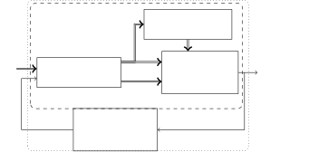

Fig. 1: Block diagram of the RTF-MCLP algorithm

A block diagram of the joint estimation of MCLP and RTF, iteratively, is
shown in Fig. 1. At iteration $`i`$, we utilize the past estimate of
desired speech PSD $`\hat{\gamma}_{nk}`$ and compute the MCLP filter
using (24). Then the prediction residual $`\hat{d}_{m}[n,k]`$ for each
microphone $`m`$ is computed for each frequency bin $`k`$. This
prediction residual is then used to estimate the RTF $`{\bf a}[k]`$, and
the spatial filter $`{\bf w}[k]`$ and desired signal
$`\hat{d}_{1}[n,k]`$ are obtained. The output of spatial filter
$`\hat{d}_{1}[n,k]`$ is then used to compute the desired signal PSD for
the next iteration. The reverberant signal $`{\bf x}[n,k]`$ itself is
considered as initialization of $`\hat{{\bf d}}[n,k]`$ for the first
iteration, and the initial estimates for steering vector and the spatial
filter are computed. Output of the spatial filter is then used to
compute initial estimate of desired signal PSD $`\gamma_{nk}`$.

### III-D Desired Source Selection of Multiple Sources

In (11), we have considered a single source and a spatial filter to
enhance the MCLP performance. Let us now consider multiple sources
$`s=1,2,\dots,S`$ contributing to the $`M`$ microphone signals. However,
the diffuse late reverb component due to all the $`S`$ sources is
predictable by MCLP \[20\], the prediction residual contains early
reflection components due to all the sources. Thus,

```math
{\bf x}[n,k]=\sum_{s=1}^{S}{\bf a}_{s}[k]d_{s1}[n,k]+{\bf r}[n,k], \tag{37}
```

where $`{\bf a}_{s}[k]`$ is the RTF vector for the source $`s`$. When we
want to estimate a desired source ($`s^{*}`$) among the multiple
sources, we assume the corresponding RTF to be known a-priori, i.e.,
$`{\bf a}_{s^{*}}[k]`$ is known¹¹ 1 It is possible to select a desired
source using other criteria such as dominant energy, etc.. Using the
algorithm described in sec. III-C, the desired signal is estimated
subject to the constraint $`{\bf w}[k]^{H}{\bf a}_{s^{*}}[k]=1`$. Since
the PSD $`\gamma_{nk}`$ is estimated after spatial filtering, it
corresponds to the desired source through successive iterations. MCLP
estimation with the constraint of desired source signal PSD as the
estimate for $`\gamma_{nk}`$ improves estimation of the early component
iteratively. The noise spatial covariance matrix computed for spatial
filtering in (31) includes the late reverb components of desired source
and the interferers. Hence, minimization of noise power in spatial
filtering suppresses the interfering sources along with the residual
reverberation of the desired source.

## IV Dynamic Source Online Estimation

The batch method described earlier can be considered as comprising of
two stages: the MCLP dereverberation and distortion-less response
spatial filtering. The two stages aid each other through the iterations,
one reducing the effect of diffuse reverb component and the other
reducing the effect of interfering source/noise. The advantage of this
joint optimization can be exploited for spatial filtering of a moving
source also. But, the moving source based MCLP filtering requires a
time-varying MCLP model, so that the predictors are optimally adapted.
The issue to be resolved for a moving source is that of changing the RTF
with respect to microphones and further its effect on the MCLP itself.

Since our static analysis is based on STFT, even for the moving source
case, the same linear signal model is used with a slight generalization:

```math
x_{m}[n,k]=d_{m}[n,k]+{\bf g}_{m,n}[k]^{H}\boldsymbol{\phi}[n,k], \tag{38}
```

where the MCLP coefficients $`{\bf g}_{m,n}[k]`$ are dependent on the
STFT frame index $`n`$. In vector form, we can express the RTF-MCLP
model as

```math
{\bf x}[n,k]={\bf a}_{n}[k]d_{1}[n,k]+{\bf G}_{n}[k]^{H}\boldsymbol{\phi}[n,k]. \tag{39}
```

We note that the direct ML estimation using the distortion-less response
constraint for the spatial filter, and a linear dynamical system model
for MCLP will be intractable. Hence, we consider the desired signal
component $`{\bf d}[n,k]={\bf a}_{n}[k]d_{1}[n,k]`$ to be an isotropic
complex Gaussian random variable,
$`\mathbb{P}\left({\bf d}[n,k]\right)=\mathcal{N}_{c}\left({\bf 0},\gamma_{nk}{\bf I}\right)`$,
and hence

```math
\mathbb{P}\left({\bf x}[n,k]\right)=\mathcal{N}_{c}\left({\bf G}_{n}[k]^{H}\boldsymbol{\phi}[n,k],\gamma_{nk}{\bf I}\right). \tag{40}
```

Now we formulate an optimum time-varying MCLP using a linear dynamic
system approach and also perform online spatial filtering; we can then
estimate the variable $`\gamma_{nk}`$ using the spatial filter output
similar to the batch method.

### IV-A Time-varying MCLP

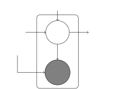

Fig. 2: Graphical model of the $`M`$ microphone observations.

We consider a Gaussian innovation model for the time-varying MCLP
coefficients $`\{{\bf g}_{m,n}[k],~\forall~m\}`$ given by

```math
{\bf g}_{m,n}[k]={\bf g}_{m,n-1}[k]+{\bf i}_{m,n}[k],~\forall~m\in\left[1~M\right], \tag{41}
```

where the innovation term $`{\bf i}_{m,n}[k]`$ is a complex Gaussian
distributed random variable with mean zero and covariance matrix
$`\boldsymbol{\Lambda}_{nk}`$. The innovation is i.i.d (independent and
identically distributed) across all the microphones, i.e.,
$`{\bf i}_{m,n}[k]=\mathcal{N}_{c}({\bf i}_{m,n}[k];{\bf 0},\boldsymbol{\Lambda}_{nk}),~\forall~m`$.
We consider a diagonal covariance matrix for the innovation term, for
the sake of simplicity
$`\boldsymbol{\Lambda}_{nk}\triangleq diag(\lambda_{n,k,i})`$. Thus, the
prediction coefficients can vary independently for each frequency bin,
each microphone $`m`$ and time frame $`n`$. As earlier, the frequency
bin index $`k`$ is omitted below for brevity.

We consider maximum likelihood criterion for estimating the time-varying
parameters. At time frame $`n`$, we consider the optimization problem,

```math
\mbox{maximize}~\left\{\log\mathbb{P}\left({\bf X}_{0:n}\left|\right.\boldsymbol{\Theta}_{n}\right)\right\}, \tag{42}
```

where $`{\bf X}_{0:n}=\left[{\bf x}[0],\dots,{\bf x}[n]\right]`$,
$`\boldsymbol{\Theta}_{n}=\boldsymbol{\theta}_{0:n}`$, where
$`\boldsymbol{\theta}_{n}=\{\boldsymbol{\Lambda}_{n},{\gamma}_{n}\}`$.
We consider a time recursive solution,

```math
\mbox{maximize}~\left\{\log\mathbb{P}\left({\bf x}[n]\left|\right.{\bf X}_{0:n-1},\hat{\boldsymbol{\Theta}}_{n-1},\boldsymbol{\theta}_{n}\right)\right\}. \tag{43}
```

The problem can be solved sequentially using the EM algorithm \[36\].
The E-step requires computation of the posterior distribution
$`\mathbb{P}\left({\bf G}_{n}\left|\right.{\bf X}_{0:n},\boldsymbol{\Theta}_{n}\right)`$.
Using the i.i.d assumption in (40), (41) over the microphone index
$`m`$, we can show that

```math
\mathbb{P}\left({\bf G}_{n}\left|\right.{\bf X}_{0:n},\boldsymbol{\Theta}_{n}\right)=\prod_{m=1}^{M}\mathbb{P}\left({\bf g}_{m,n}\left|\right.{\bf X}_{0:n},\boldsymbol{\Theta}_{n}\right),\mbox{where}
```

```math
\mathbb{P}\left({\bf g}_{m,n}\left|\right.{\bf X}_{0:n},\boldsymbol{\Theta}_{n}\right)\propto\mathbb{P}\left(x_{m}[n],{\bf g}_{m,n}\left|\right.{\bf X}_{0:n-1},\boldsymbol{\Theta}_{n}\right), \tag{44}
```

and

```math
\mathbb{P}\left(x_{m}[n],{\bf g}_{m,n}\left|\right.{\bf X}_{0:n-1},\boldsymbol{\Theta}_{n}\right)=\\
\mathbb{P}\left(x_{m}[n]\left|\right.{\bf g}_{m,n},\gamma_{n}\right)\mathbb{P}\left({\bf g}_{m,n}\left|\right.{\bf X}_{0:n-1},\boldsymbol{\Theta}_{n}\right). \tag{45}
```

The distribution
$`\mathbb{P}\left({\bf g}_{m,n}\left|\right.{\bf X}_{0:n-1},\boldsymbol{\Theta}_{n}\right)`$
is obtained after marginalizing over the random variable
$`{\bf g}_{m,n-1}`$, and it corresponds to a Gaussian distribution. Let

```math
\mathbb{P}\left({\bf g}_{m,n}\left|\right.{\bf X}_{0:n-1},\boldsymbol{\Theta}_{n}\right)=\mathcal{N}_{c}\left(\boldsymbol{\mu}_{m,n|n-1},\boldsymbol{\Sigma}_{n|n-1}\right), \tag{46}
```

using (41), we can show that

```math
\displaystyle\boldsymbol{\mu}_{m,n\left|\right.n-1}=\boldsymbol{\mu}_{m,n-1\left|\right.n-1},~\boldsymbol{\Sigma}_{n\left|\right.n-1}=\boldsymbol{\Sigma}_{n-1\left|\right.n-1}+\boldsymbol{\Lambda}_{n}, \tag{47}
```

i.e., mean is unchanged but the covariance is getting corrected.
Similarly, we have the posterior distribution

```math
\displaystyle\mathbb{P}\left({\bf g}_{m,n}\left|\right.{\bf X}_{0:n},\boldsymbol{\Theta}_{n}\right)=\mathcal{N}_{c}\left(\boldsymbol{\mu}_{m,n|n},\boldsymbol{\Sigma}_{n|n}\right), \tag{48}
```

```math
\displaystyle\mbox{where}~\boldsymbol{\Sigma}_{n\left|\right.n}=\left[\boldsymbol{\Sigma}_{n\left|\right.n-1}^{-1}+\gamma_{n}^{-1}\boldsymbol{\phi}[n]\boldsymbol{\phi}[n]^{H}\right]^{-1},~\mbox{and}
```

```math
\displaystyle\boldsymbol{\mu}_{m,n\left|\right.n}=\boldsymbol{\Sigma}_{n\left|\right.n}\left[\boldsymbol{\Sigma}_{n\left|\right.n-1}^{-1}\boldsymbol{\mu}_{m,n\left|\right.n-1}+\gamma_{n}^{-1}x_{m}^{*}[n]\boldsymbol{\phi}[n]\right],
```

where $`x_{m}^{*}[n]`$ is the complex conjugate of the scalar
$`x_{m}[n]`$. The equations in (48) can be simplified and rewritten
\[37\] as,

```math
\displaystyle{e}_{m}[n]\triangleq x_{m}[n]-\boldsymbol{\mu}_{m,n|n-1}^{H}\boldsymbol{\phi}[n],~\forall~m \tag{49}
```

```math
\displaystyle{\bf K}[n]=\frac{\boldsymbol{\Sigma}_{n|n-1}\boldsymbol{\phi}[n]}{\gamma_{n}+\boldsymbol{\phi}[n]^{H}\boldsymbol{\Sigma}_{n|n-1}\boldsymbol{\phi}[n]}, \tag{50}
```

```math
\displaystyle\boldsymbol{\Sigma}_{n|n}=\left[{\bf I}-{\bf K}[n]\boldsymbol{\phi}[n]^{H}\right]\boldsymbol{\Sigma}_{n|n-1}, \tag{51}
```

```math
\displaystyle\boldsymbol{\mu}_{m,n|n}=\boldsymbol{\mu}_{m,n|n-1}+{\bf K}[n]{e}_{m}^{*}[n],~\forall~m. \tag{52}
```

The computational expressions are similar to the traditional Kalman
filter estimation, for each $`m`$. The posterior mean is taken as the
estimated prediction filter at time frame $`n`$,

```math
\hat{{\bf g}}_{m,n}\triangleq\boldsymbol{\mu}_{m,n|n},~\forall~m, \tag{53}
```

and the estimates of early and the late reverb components are computed
as:

```math
\displaystyle\hat{{r}}_{m}[n]=\hat{{\bf g}}_{m,n}^{H}\boldsymbol{\phi}[n],~\mbox{and }\hat{{d}}_{m}[n]={x}_{m}[n]-\hat{{r}}_{m}[n]. \tag{54}
```

The computations in (47), (49) require estimates of the parameters
$`\gamma_{n},\boldsymbol{\Lambda}_{n}`$. We use the estimate
$`\hat{\boldsymbol{\Lambda}}_{n-1}`$ of the previous time step in the
computations of (47), and the parameter $`\gamma_{n}`$ is computed after
online spatial filtering similar to eqn. (36).

### IV-B Online spatial filtering

The optimization problem in eqn. (31) can be modified for the online
estimation case as,

```math
\displaystyle\hat{{\bf w}}_{n}=\underset{{\bf w}_{n}}{\arg\min}~{\bf w}_{n}^{H}{\bf R}_{\hat{{\bf r}}\hat{{\bf r}}}[n]{\bf w}_{n}, \tag{55}
```

subject to the constraint $`{\bf w}_{n}^{H}{\bf a}_{n}=1`$. A running
estimate of the covariance matrix
$`{\bf R}_{\hat{{\bf r}}\hat{{\bf r}}}[n]`$ is computed using recursive
averaging with smoothing constant $`\alpha_{1}`$ as,

```math
{\bf R}_{\hat{{\bf r}}\hat{{\bf r}}}[n]=(1-\alpha_{1}){\bf R}_{\hat{{\bf r}}\hat{{\bf r}}}[n-1]+\alpha_{1}\gamma_{n}^{-1}\hat{{\bf r}}[n]\hat{{\bf r}}[n]^{H}. \tag{56}
```

The solution to (55) is computed similar to (33),

```math
\hat{{\bf w}}_{n}=\frac{{\bf R}_{\hat{{\bf r}}\hat{{\bf r}}}[n]^{-1}{\bf a}_{n}}{{\bf a}_{n}^{H}{\bf R}_{\hat{{\bf r}}\hat{{\bf r}}}[n]^{-1}{\bf a}_{n}}. \tag{57}
```

### IV-C Parameter Estimation

#### IV-C1 Gaussian Innovation Covariance

The matrix $`\boldsymbol{\Lambda}_{n}=diag({{\lambda}}_{n,i})`$ is the
covariance of innovations in MCLP coefficients, which can be estimated
as

```math
{{\lambda}}_{n,i}=\frac{1}{M}\sum\limits_{m=1}^{M}\mathbb{E}\left\{\left|{\bf g}_{m,n}[i]-{\bf g}_{m,n-1}[i]\right|^{2}\right\}, \tag{58}
```

where $`{\bf g}_{m,n}[i]`$ is the $`i^{th}`$ entry of the vector
$`{\bf g}_{m,n}`$, and the expectation is taken with respect to the
joint distribution
$`\mathbb{P}\left({\bf G}_{n},{\bf G}_{n-1}\left|\right.{\bf X}_{0:n},\boldsymbol{\Theta}_{n}\right)`$.
To avoid the computation of joint distribution, which requires backward
recursion \[37\], we consider a simpler estimate based on the changing
mean vector:

```math
\hat{{\lambda}}_{n,i}=\frac{1}{M}\sum_{m=1}^{M}\left|\boldsymbol{\mu}_{m,n|n}[i]-\boldsymbol{\mu}_{m,n-1|n-1}[i]\right|^{2}+\epsilon, \tag{59}
```

where $`\epsilon`$ is a small positive constant.

#### IV-C2 Desired Signal Variance

$`\gamma_{nk}`$ is related to the PSD of the desired signal
$`d_{1}[n,k]`$. However, estimation of $`\hat{{d}}_{1}[n,k]`$ requires
an estimate of $`{\bf\gamma}_{nk}`$. To avoid this dependence, the
a-priori desired signal estimate

```math
\tilde{d}_{1}[n,k]=\hat{{\bf w}}_{n-1}[k]^{H}\left({\bf x}[n,k]-\hat{{\bf G}}_{n-1}[k]^{H}\boldsymbol{\phi}[n,k]\right), \tag{60}
```

is used to compute the time domain AR model (35) and the desired signal
PSD estimate is obtained using (36).

#### IV-C3 Relative transfer function $`({\bf a}_{n})`$

The time dependent RTF is computed using the estimated early reflection
component $`\hat{{\bf d}}[n]`$. The spatial cross correlation matrix,
similar to (26), is computed using recursive averaging with a smoothing
parameter $`\alpha_{2}`$,

```math
\displaystyle{\bf R}_{\hat{{\bf d}}\hat{{\bf d}}}[n]=(1-\alpha_{2}){\bf R}_{\hat{{\bf d}}\hat{{\bf d}}}[n-1]+\alpha_{2}\hat{{\bf d}}[n]\hat{{\bf d}}[n]^{H}. \tag{61}
```

The estimate for RTF is computed similar to (27)

```math
\hat{{\bf a}}_{n}=\frac{{\bf R}_{\hat{{\bf d}}\hat{{\bf d}}}[n]{\bf e}_{1}}{{\bf e}_{1}^{H}{\bf R}_{\hat{{\bf d}}\hat{{\bf d}}}[n]{\bf e}_{1}}. \tag{62}
```

Care must be taken in updating the RTF, since STFT bins with silence or
dominant diffuse component in the estimated early reflection component
can drift the RTF from the actual signal source. We determine the RTF
update based on ratio of the average energies of $`\hat{{\bf d}}[n]`$
and $`\hat{{\bf r}}[n]`$, when it is greater than $`0.1`$.

### IV-D Online RTF-MCLP Algorithm

The algorithm for online RTF-MCLP is shown in Alg. 1. The spatial
filter, and the MCLP prediction filter computed at the time index
$`n-1`$ are used to obtain the a-priori desired signal estimate, which
is then used to compute the desired signal variance. Given the desired
signal variance, the posterior distribution parameters of the MCLP
filters are computed and estimates of the multi channel early component
and late reverberation component are computed. The estimated early
reflection component is then used to update the RTF, and the late reverb
component is used to update the noise covariance matrix. The spatial
filter is then recomputed and the filter output is taken as the desired
signal.

1: Initialize $`\hat{{\bf w}}_{-1}[k]={\bf 1}/\sqrt{M},~\forall~k`$,
$`\{\boldsymbol{\mu}_{m,-1|-1}[k]={\bf 0},~\forall m,k\}`$,
$`\boldsymbol{\Sigma}_{-1|-1}[k]=\eta{\bf I}`$, $`\eta=10^{-3}`$.

2: for $`n=0:N-1`$ do

3:   Compute the a-priori signal estimate using (60) $`\forall k`$.

4:   Compute the desired signal variance $`\hat{\gamma}_{nk}`$ using
(36).

5:   for $`k=0:K/2`$ do

6:    Compute
$`\mathbb{P}\left({\bf g}_{m,n}[k]\left|\right.{\bf X}_{0:n-1}[k]\right),\forall~m`$
using (47).

7:    Compute
$`\mathbb{P}\left({\bf g}_{m,n}[k]\left|\right.{\bf X}_{0:n}[k]\right),\forall~m`$
using (49).

8:    Update the prediction filter using (53).

9:    Compute $`\hat{{\bf d}}[n,k]`$, and $`\hat{{\bf r}}[n,k]`$ using
(54).

10:    Update the RTF $`\hat{{\bf a}}_{n}[k]`$ using (62).

11:    Update the noise covariance matrix using (56).

12:    Compute the spatial filter $`\hat{{\bf w}}_{n}[k]`$ using (57).

13:    Compute the spatial filtered signal

```math
\hat{{d}}_{1}[n,k]=\hat{{\bf w}}_{n}[k]^{H}\hat{{\bf d}}[n,k] \tag{63}
```

14:   end for

15: end for

Algorithm 1 Online joint spatial filtering and MCLP

## V Experiments and Results

First we study the performance of the joint RTF-MCLP model for signal
estimation in a batch mode (static sources but non-stationary speech),
and later present the results for a dynamic source. We consider the
recording setup shown in Fig. 3; we generate simulated room impulse
responses, using the image method \[38, 39\], for each of the mics. A
uniform circular array (UCA) with $`4`$ microphones and of radius
$`0.1~m`$ is considered for the recording. Center of the array is placed
at coordinates $`[2.3,2.45,1.1]~m`$ with respect to the lower left
corner of the enclosure. Desired source is assumed to be at the position
$`[2.3,3.45,1.1]~m`$, and an interferer at $`[3.007,3.157,1.1]~m`$ (both
at a distance of $`1~m`$ from the center of array), and the
reverberation time of the enclosure is $`RT60=0.6~s`$, unless otherwise
stated.

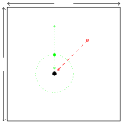

(a)

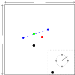

(b)

Fig. 3: Room setup for simulated impulse responses. (a) Stationary
source case, (b) Dynamic source case. Black: UCA mics located at
$`[2.3,2.45,1.1]~m`$ for both cases.

Clean signals from the TIMIT database \[40\] are convolved with the
simulated RIRs to generate the reverberant microphone signals. Ten
signals ($`5`$ each from male and female speakers) are used for the
evaluation. Interference signal is also speech signal from different
from the target signal. STFT analysis of mic signal is carried out using
a Hann window of size $`32~ms`$, and a successive frame overlap of
$`75\%`$. We consider the size of discrete Fourier transform in STFT to
be the same as window size (equal to $`512`$ for the signal sampling
rate of $`16~KHz`$).

We study the performance of the proposed dereverberation approach using
the objective measure of frequency weighted signal-to-noise ratio
(FwSNR) \[41\], and subjective performance measures of “perceptual
evaluation of speech quality” (PESQ) \[42\] and the “short-time
objective intelligibility” (STOI) \[43\]. PESQ is bounded between
$`[1-5]`$ with $`5`$ being closest to clean speech. STOI lies between
$`[0-1]`$ with $`1`$ indicating best intelligibility. FwSNR is computed
using the evaluation toolbox provided in \[44\], and STOI is computed
using the auditory modeling toolbox \[45\]. Processed speech examples
are available online at www.ece.iisc.ernet.in/~sraj/dMCLP.html.

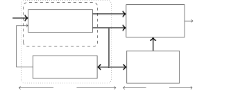

Fig. 4: Cascaded MCLP and RTF based spatial filtering scheme \[22, 23\]
for performance comparison with RTF-MCLP.

We compare the performance of the new RTF-MCLP with (i) MCLP method with
AR source prior \[13\] (first block in Fig.4), (ii) a separate cascade
of the MVDR beamformer for the MCLP output \[23, 22\] (C-RTF-MCLP) as
shown in Fig.4, and (iii) the super directive beamformer (SDB) \[9,
46\]. For the MCLP method, the autocorrelation function required for
source AR estimation is computed by averaging the autocorrelation
function of the multi-channel prediction residual signals. For the MVDR
beamformer post filter, the noise covariance matrix is computed using
the reverberation component estimated using the MCLP, and the RTF is
estimated using (27). SDB is implemented assuming free field RTF
$`{\bf a}`$ (vector $`{\bf a}`$ corresponds to the direct path only) and
the microphone placement (diffuse noise spatial covariance matrix) is
assumed known a-priori.

### V-A Stationary source, batch processing

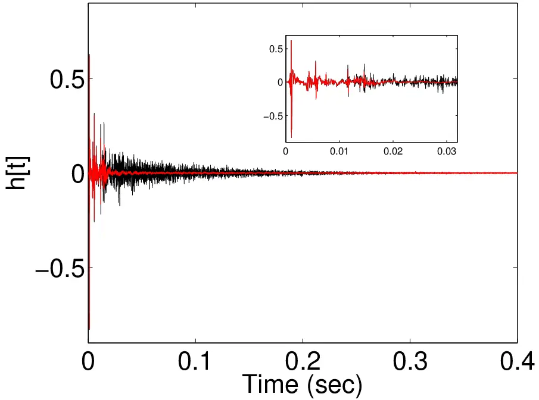

(a)

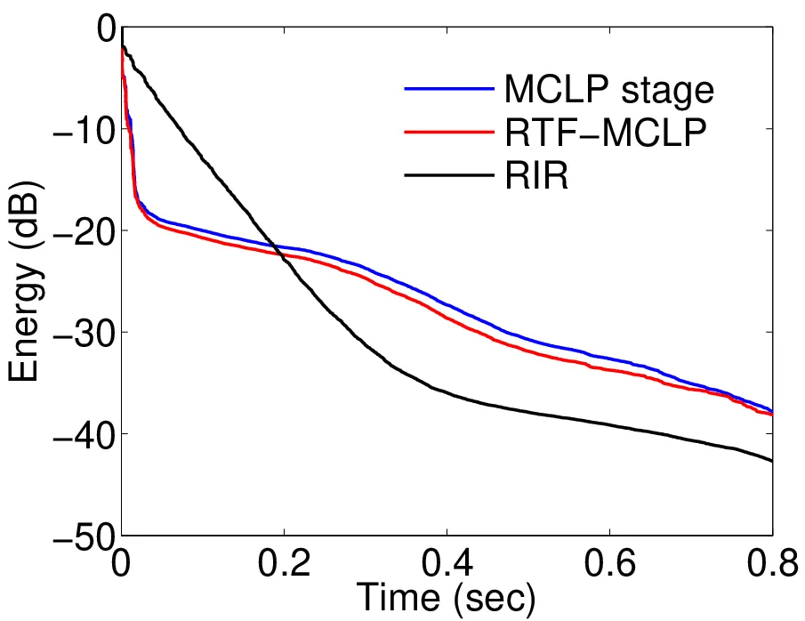

(b)

Fig. 5: Room impulse response illustration.

Fig. 5(a) shows the output of the MCLP filters in RTF-MCLP scheme with
RIR as the input, in time domain. The filters are estimated first using
a speech signal, and then used to obtain the output RIR considering it
as the microphone signal. We see from estimated RIR that the direct
component and the first few early reflection peaks are retained; they
also match the input RIR in amplitude and time-location. The reflection
components beyond $`\approx 16~ms`$ are suppressed significantly after
the MCLP filtering, i.e., the effective duration of RIR after the MCLP
filter stage is $`\approx 16~ms`$. Since the window size chosen for the
STFT analysis is $`32~ms`$, we can see that the RTF approximation in the
STFT domain is valid, only with some residual reverberation noise. Fig.
5(b) shows the corresponding energy decay curve (EDC), we can see that
the room reflection components over long-term of $`16-220~ms`$ are
suppressed. However, there is an increase in the reflection component
energy beyond $`\approx 220~ms`$, but it is below $`-20~dB`$ level. Fig.
5(b) also shows EDC for the effective RIR after the spatial filter. We
see that the level of residual reverberation decreases after the spatial
filter, and we found that there is a small improvement near the early
reflection components also.

#### V-A1 RTF-MCLP Algorithm Parameters

The order of the MCLP filter $`L`$ and the delay parameter $`D`$ are the
parameters of the algorithm, and we explore each parameter individually
by fixing the other. We fix the baseline experimental parameters as {max
iterations$`=5`$, $`L=12`$, $`M=4`$, $`D=2`$}. The acoustic room setup
is fixed as {source distance$`=1.0~m`$, source angle$`=90^{o}`$,
$`RT60=0.6~s`$}, shown in Fig. 3.

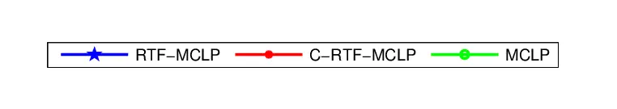

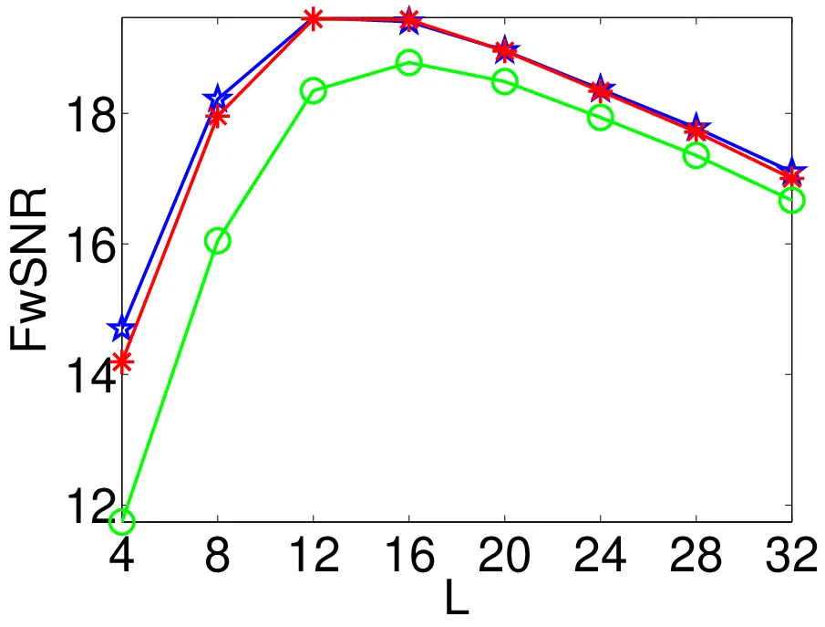

(a)

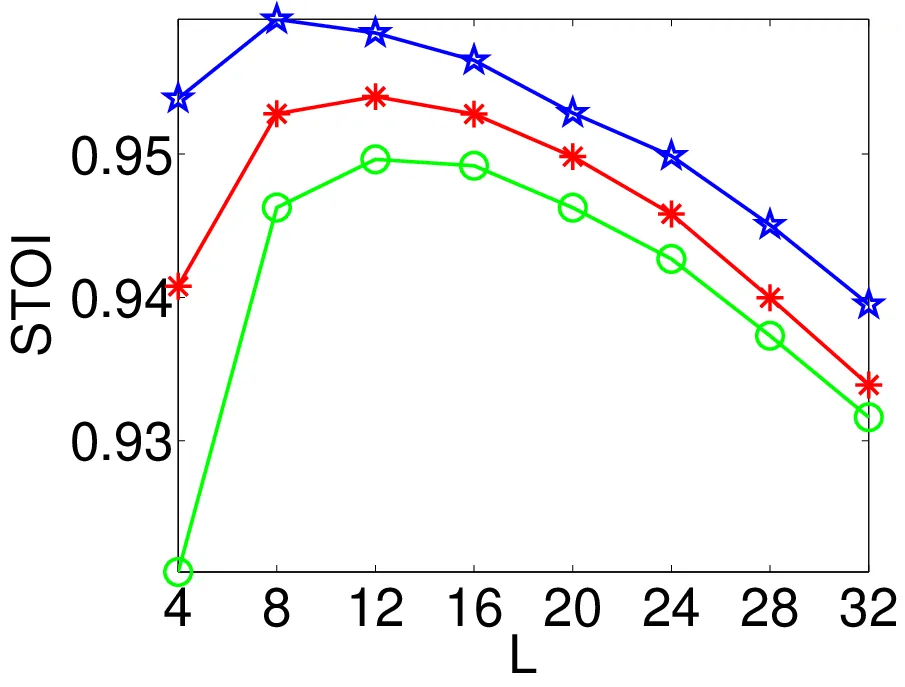

(b)

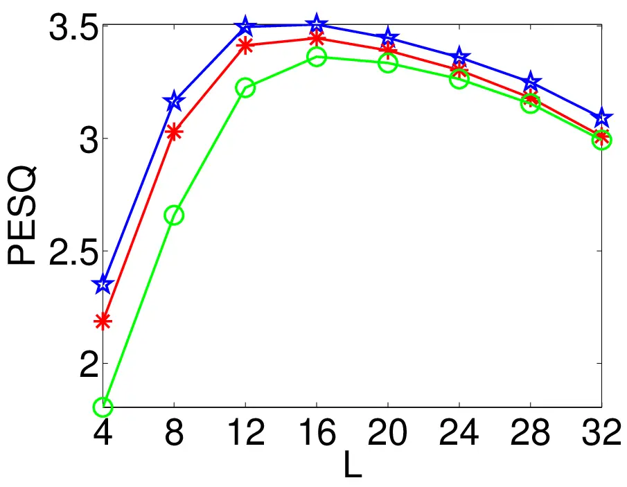

(c)

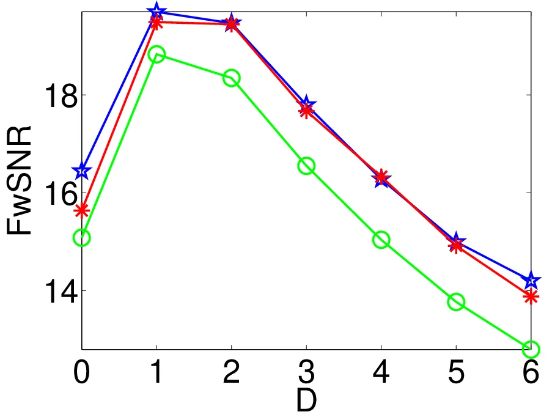

(d)

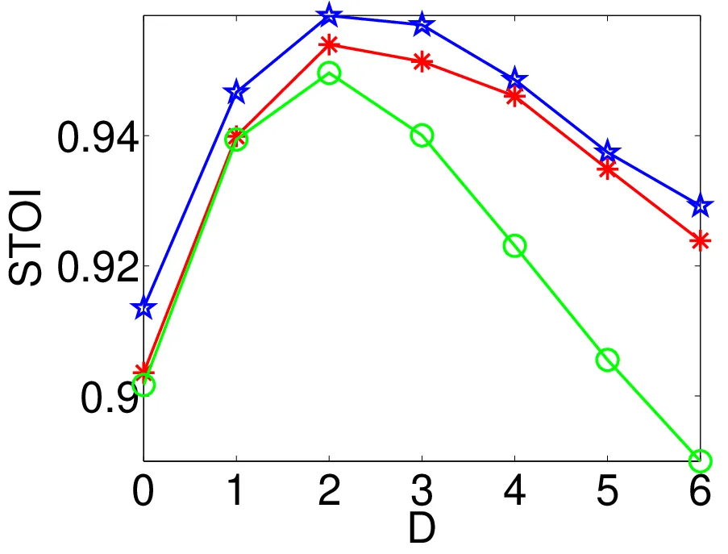

(e)

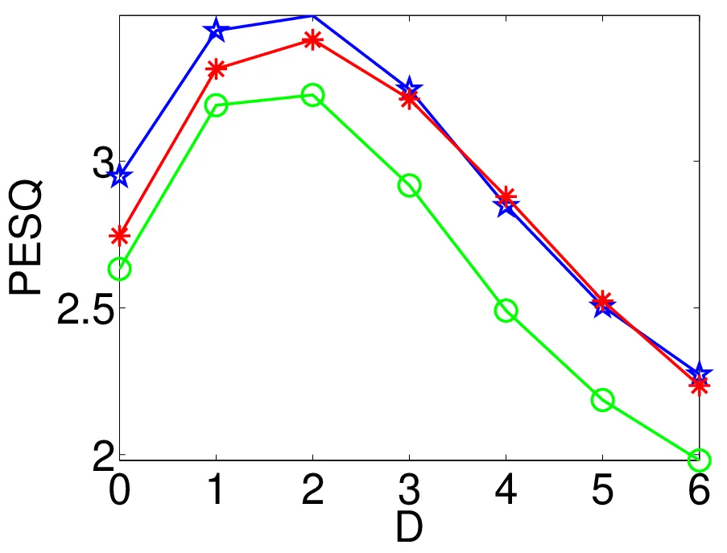

(f)

Fig. 6: Dereverberation performance for different algorithm conditions.
The rows show the results for MCLP Order ($`L`$), and delay parameter
($`D`$) variation respectively. The three columns show the performance
measures average FwSNR, STOI and PESQ. Average FwSNR, STOI and PESQ for
reverberant input signal are {$`7.37~dB`$, $`0.81`$ and $`1.38`$}
respectively. For the super directive beamformer output
$`\{10.76~dB,~0.91,~\mbox{and}~1.63\}`$ respectively.

Fig. 6 shows the performance measures for different algorithm
parameters. We see that (i) spatial filter in combination with the MCLP
filter improves the MCLP performance, and (ii) the joint estimation in
RTF-MCLP performs better than the cascade approach of C-RTF-MCLP,
particularly for the perceptual measures of PESQ and STOI, though
minimal for FwSNR. Fig. 6(a-c) show the performance measures for
increasing value of prediction order $`L`$. We see that peak performance
is obtained for $`L=12\mbox{ to }16`$, indicating the structure of
diffuse component in the STFT domain. Performance for different values
of $`D`$ is shown in Fig. 6(d-f). Again there is a peak performance for
$`D=1`$ and $`D=2`$. $`D=0`$ case uses immediate past value for
prediction, which results in degradation of the estimated signal due to
the high correlation between successive STFT frames. Higher values of
$`D`$ retains more of the diffuse component in the desired signal, hence
the degradation in performance compared to the clean signal. Also, for
higher $`D`$, the RTF approximation does not hold good resulting in
performance degradation. Yet the performance is found to be better than
using only MCLP in all the cases.

#### V-A2 RIR conditions

RIR is a function of the distance and angular position of the source
with respect to the microphones, and $`RT60`$ value of the enclosure.
These parameters are studied individually by fixing the other two
parameters. The source distance and the angular position are varied as
shown in Fig. 3 (dotted line and circle in green), and the RT60 is
varied from $`0.3~s`$ to $`1.2~s`$. The baseline values for the
parameters are {source distance$`=1.0~m`$, source angle$`=90^{o}`$,
$`RT60=0.6~s`$}. The algorithm parameters are fixed as {max
iterations$`=5`$, $`L=12`$, $`M=4`$, $`D=2`$}.

Fig. 7 shows the performance comparison for different RIR conditions. We
can see that, (i) spatial filtering aids MCLP and hence improves the
dereverberation performance of MCLP method, (ii) joint spatial filtering
and MCLP based dereverberation in RTF-MCLP is slightly better compared
to the cascaded approach of MCLP dereverberation followed by spatial
filtering in C-RTF-MCLP, (iii) STOI value is more than $`0.9`$ for all
the acoustic conditions in all three MCLP methods indicating good
intelligibility of enhanced speech, and (iv) SDB performance is poor
compared to the MCLP based methods. Although all techniques deteriorate
with increasing $`RT60`$, the advantage of RTF-MCLP method is higher for
higher $`RT60`$ than MCLP (Fig. 7(a-c)). We see that the good
performance of RTF-MCLP is over an RT60 range upto $`0.7~s`$. The
performance as a function of source distance, shown in 7(d-f), decreases
approximately linearly with increasing distance. Increasing the source
distance decreases the SRR (signal to reverberation ratio), which can be
akin to increasing $`RT60`$. In terms of STOI, a source distance of
$`2.5~m`$ has a similar effect as $`RT60=1.2~s`$. The angular
performance plots in 7(g-i) show that the improvement is approximately
uniform for all angular positions of the source, because of the
omni-directional microphones assumed.


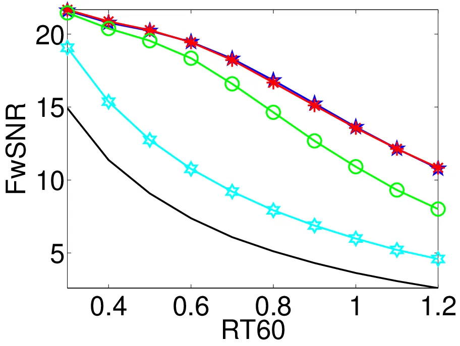

(a)

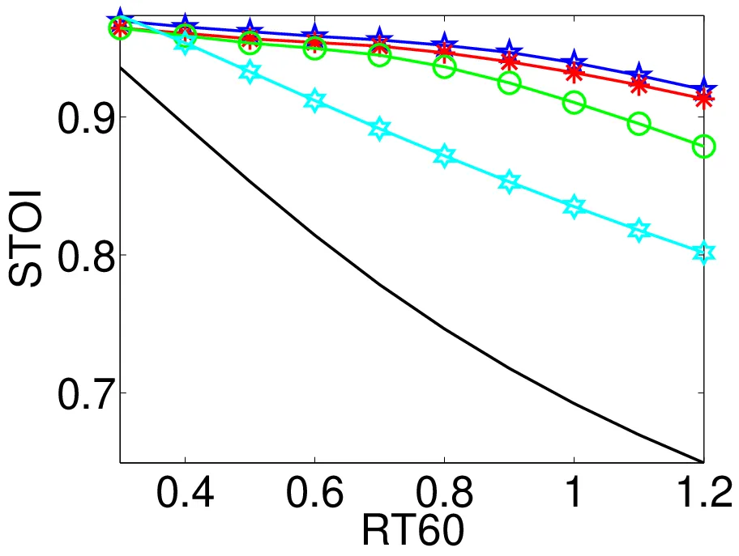

(b)

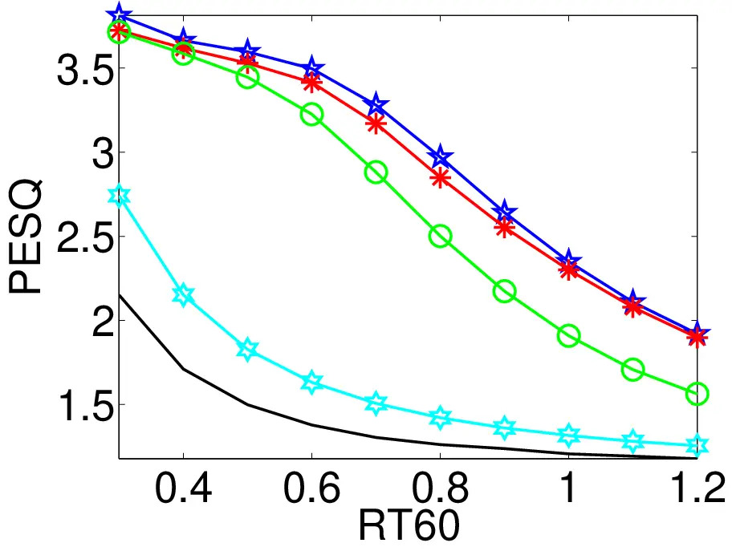

(c)

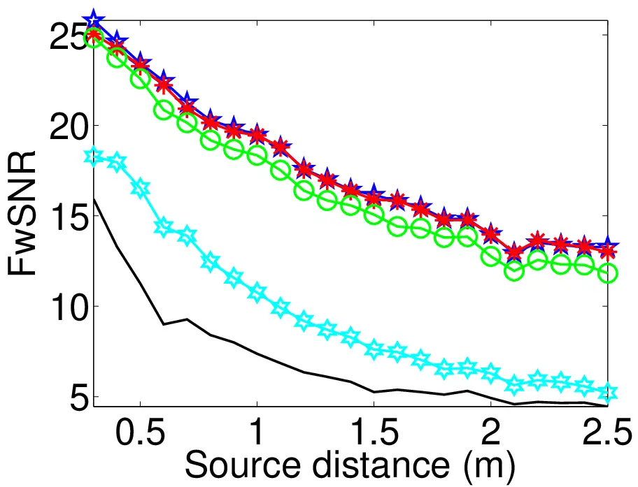

(d)

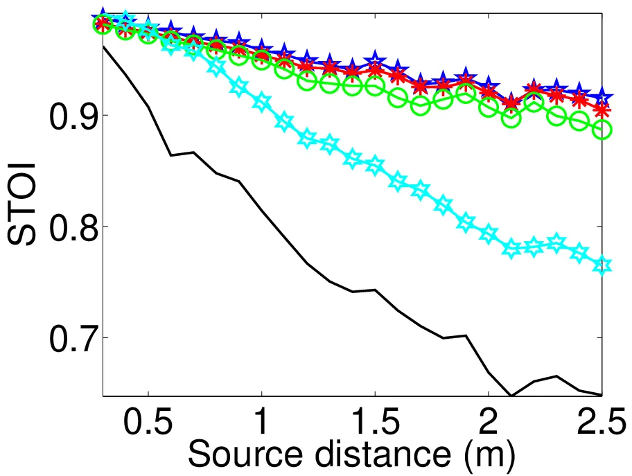

(e)

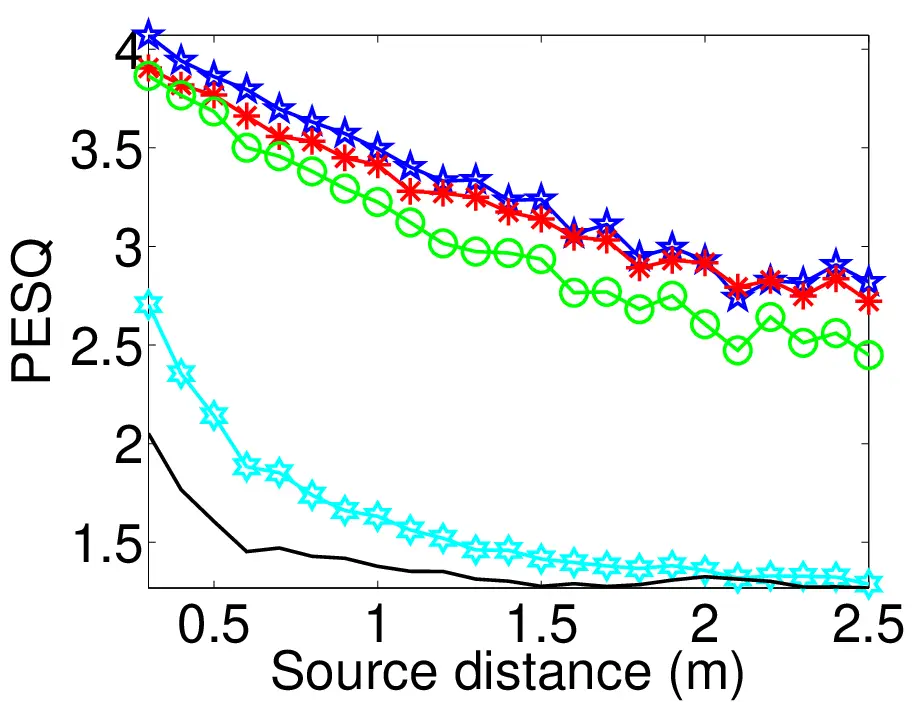

(f)

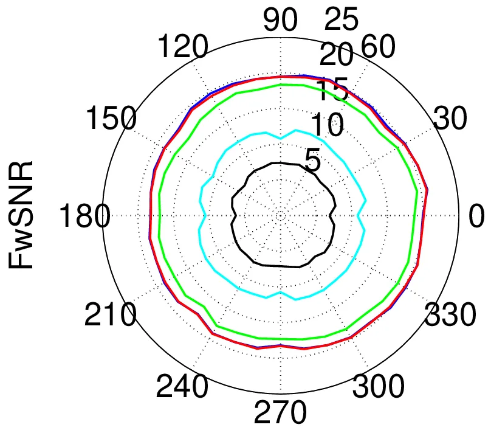

(g)

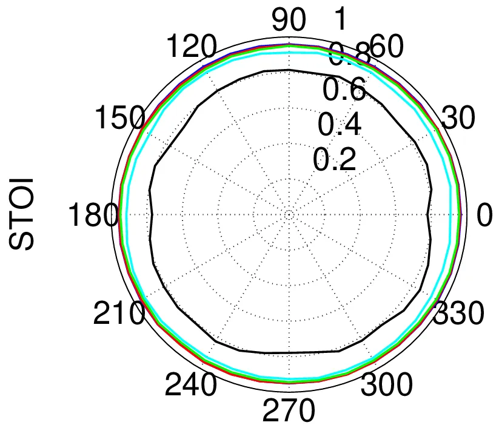

(h)

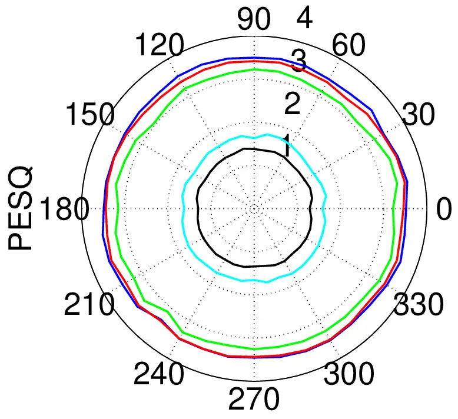

(i)

Fig. 7: Dereverberation performance for (a-c) changing $`RT60`$, (d-f)
changing source distance, and (g-i) changing source direction. In (g-i)
performance measures are mapped to radial distance. The three columns
show the performance measures average FwSNR, STOI and PESQ.

#### V-A3 Directional speech interference

Next, we study the performance of the RTF-MCLP method in the presence of
an interfering speech source, with $`0~dB`$ signal to interference ratio
(SIR), at $`45^{o}`$ angular position. For this experiment we assume the
RTF vector of the desired speech source to be known a-priori. It is
computed using the discrete Fourier transform of the initial $`8~ms`$
after the direct component of the desired source RIR. Fig. 8 shows the
performance measures FwSNR, residual energy of the interferer (IE) in
dB, PESQ and STOI, as a function of the distance of the interferer from
the center of the array. The quantum of residual inference at the output
is determined by passing the known interference signal through the MCLP
and MVDR filters estimated using the mixture microphone signal. At a
$`0.5~m`$ distance, the interferer is near to the array than the source
and also to the reference microphone at $`0^{o}`$ (the source is at
$`1~m`$ distance and $`90^{o}`$ angular position). In Fig. 8, we can see
that (i) MCLP performance gets severely degraded in the presence of
interference, (ii) the super directive beamformer performance is better
than MCLP for nearer source positions, i.e., when the direct component
is stronger than the reverb components, (iii) cascaded MVDR beamformer
at the output of the MCLP filter (C-RTF-MCLP) improves the performance
by $`3-4~dB`$ compared to the beamformer or the MCLP filter alone, (iv)
the new RTF-MCLP scheme further improves by about $`1~dB`$. The PESQ
performance is poor for all techniques, but intelligibility is good in
terms of STOI, close to $`0.9`$. The interferer suppression is found to
be slightly better in the C-RTF-MCLP approach.

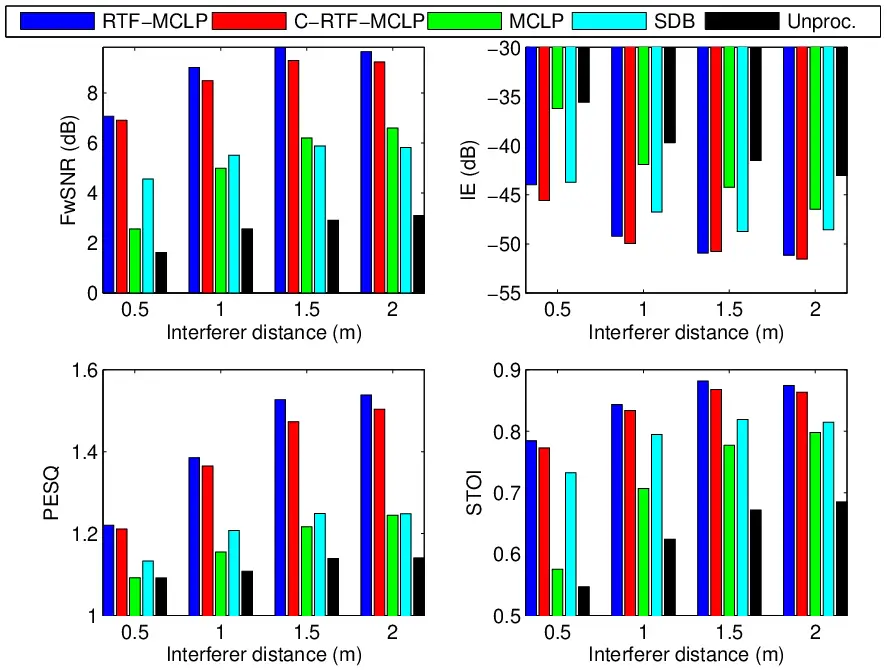

Fig. 8: Dereverberation performance for interfering speech source at
$`45^{o}`$.

### V-B Dynamic source dereverberation

We consider the experimental scenario shown in Fig. 3(b). Both the
adaptation parameters $`\alpha_{1},\alpha_{2}`$ are fixed at $`0.1`$,
and $`\epsilon=10^{-6}`$. We evaluate the signal estimation performance
using segment-wise FwSNR measure. The restoration of short time spectrum
is quantified by the segment-wise LLR measure. The segment measures
shown are computed every $`10~ms`$ with $`25~ms`$ windows and smoothed
using triangular window with $`1~s`$ ($`100`$ segments) temporal
context. We compare results of the online RTF-MCLP approach to the
Kalman filter method of \[31\]. Time-varying MCLP in the RTF-MCLP method
is different from \[31\] in the following assumptions: in \[31\], (i)
the desired signal spatial covariance matrix is full rank
$`{\bf d}[n,k]\sim\mathcal{N}_{c}\left({\bf 0},\boldsymbol{\Phi}_{d}[n,k]\right)`$,
and (ii) the distribution of $`{\bf i}_{m,n}[k]`$ is an isotropic
Gaussian, identically distributed for each $`m`$,
$`{\bf g}_{m,n}[k]\sim\mathcal{N}_{c}\left({\bf 0},\lambda{\bf I}\right)`$.
Because of assumption-(i), the Kalman filter approach requires
computation of a matrix inverse for each STFT index $`n,k`$, hence
computationally more expensive. Average per frame computation time on a
laptop with Intel (R) Core(TM) i5-4210U CPU @ 1.7 GHz processor is found
to be $`1.07~sec`$ and $`0.18~sec`$ for the Kalman filter approach and
the RTF-MCLP respectively providing a ten-fold reduction. We examine
three experimental scenarios in the following, single source with
position change, two simultaneous sources and a moving source. Two BBC
news clips of duration $`\approx 18~s`$ are used as test signals.

#### V-B1 Single source with position switch

In this experiment, we consider the source to switch from position-A to
position-B in Fig. 3 at $`18.6~s`$. This example is to test the
adaptation of the online RTF-MCLP to the switched source position. The
objective performance measures are shown in Fig. 9. We see that, the
performance of RTF-MCLP is better in-terms of both LLR and FwSNR
measures than the Kalman filter approach, during the steady-state
portions. But, the performance does degrade at the source change point
(transient response). It is found to be slightly poorer than the Kalman
filter approach, probably due to the choice of parameters
$`\{\alpha_{1},\alpha_{2},\epsilon\}`$, which result in a trade-off
between the transient and steady-state performances.

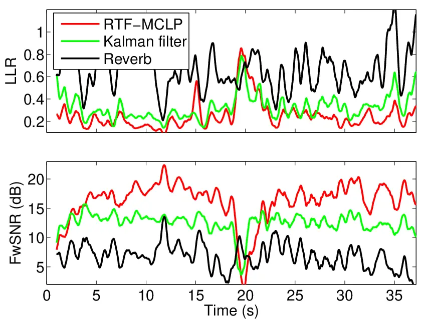

Fig. 9: LLR and FwSNR measures for the source position change scenario.

#### V-B2 Stationary, two simultaneous sources

The performance of estimating a desired source in a two source scenario
is shown in Fig. 10. Two different BBC news clips are played
simultaneously with equal strength ($`0~dB`$ signal to interference
ratio) from positions A and B, shown in Fig. 3(b). The source at
position-A is considered as the desired source. RTF estimated from the
first $`8~ms`$ (after direct path) of the RIR is specified for the
RTF-MCLP(k) method (i.e., RTF of desired source is known a-priori). The
objective performance measures in Fig. 10 show that, the MCLP based
methods are effective even in multi source scenario. The performance of
RTF-MCLP is similar to the Kalman filter approach, and shows improvement
compared to reverberant speech. The prior fixing of RTF in RTF-MCLP(k)
improves the desired signal estimation by $`\approx~5~dB`$, which can be
seen distinctly in the suppression of interference signal energy, FwSNR,
and also LLR improvement.

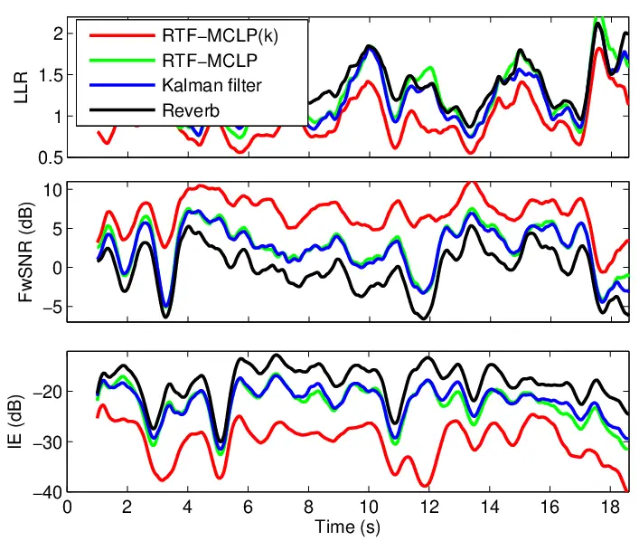

Fig. 10: LLR, FwSNR, and interference energy measures for two
simultaneous sources case; RTF-MCLP(k) shows results for the case with
RTF of the desired source known a-priori.

#### V-B3 Moving source

We consider a single source moving from position-D to position-C in Fig.
3(b) along a linear path ($`2.5~m`$ distance) with a fixed speed in
$`18~s`$. The moving source recording is simulated by convolving the
source signal with the RIR changing every $`5~ms`$ (for the chosen
positions and duration, this corresponds to $`\approx 0.7~mm`$
separation between successive positions). For dereverberation, the
constants $`\alpha_{1},\alpha_{2}`$ are set to $`0.01`$, instead of
$`0.1`$ as in earlier fixed source position case. The results in Fig. 11
show that time-varying MCLP is effective for moving source case as well,
and the RTF-MCLP method is better than the Kalman filter approach in
terms of both FwSNR and LLR measures. As the distance of source to
reference microphone is decreasing with time, we can see that FwSNR
improves with time, in both the methods. However, the performance
improvement over Kalman filter is less for the moving source case
compared to the stationary source cases discussed in the previous
section.

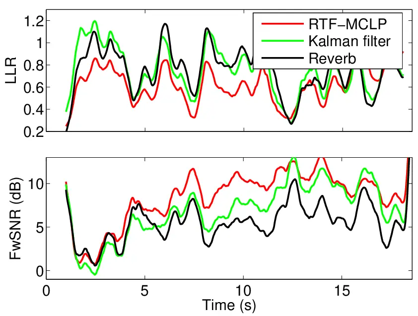

Fig. 11: LLR, and FwSNR measures for moving source experiment.

## VI Conclusions

Joint spatial filtering and multi channel linear prediction in the STFT
domain is developed for dereverberation of static or dynamic speech
sources in a single source and multiple source applications. For a
static source case, batch estimation is considered assuming stochastic
time-independence of speech STFT coefficients. The joint formulation of
spatial filtering and MCLP is found to provide effective
dereverberation, as well as interference suppression with minimum prior
knowledge of the source RTF. The extension of the joint formulation to
the moving source case is found to be equally effective because of
online spatial filtering and a linear dynamic system model for the MCLP.
The interferer suppression is good even at $`0~dB`$ SIR for a
directional separation of $`45^{o}`$.

## References

- \[1\] H. Kuttruff, _Room acoustics_. Crc Press, 2016.
- \[2\] P. Assmann and Q. Summerfield, “The perception of speech under
  adverse conditions,” in _Speech processing in the auditory
  system_. Springer, 2004, pp. 231–308.
- \[3\] J. Bradley _et al._, “On the importance of early reflections for
  speech in rooms,” _The Journal of the Acoustical Society of America_,
  vol. 113, no. 6, pp. 3233–3244, 2003.
- \[4\] M. B. Gardner, “A study of talking distance and related
  parameters in hands-free telephony,” _Bell Labs Technical Journal_,
  vol. 39, no. 6, pp. 1529–1551, 1960.
- \[5\] R. Petrick _et al._, “The harming part of room acoustics in
  automatic speech recognition,” in _Eighth Annual Conference of the
  International Speech Communication Association_, 2007.
- \[6\] R. P. Lippmann, “Speech recognition by machines and humans,”
  _Speech communication_, vol. 22, no. 1, pp. 1–15, 1997.
- \[7\] A. K. Nabelek and J. M. Pickett, “Monaural and binaural speech
  perception through hearing aids under noise and reverberation with
  normal and hearing-impaired listeners,” _Journal of Speech, Language,
  and Hearing Research_, vol. 17, no. 4, pp. 724–739, 1974.
- \[8\] S. Gannot _et al._, “Signal enhancement using beamforming and
  nonstationarity with applications to speech,” _IEEE Trans. Signal
  Process._, vol. 49, no. 8, pp. 1614–1626, Aug 2001.
- \[9\] J. Capon, “High-resolution frequency-wavenumber spectrum
  analysis,” _Proc. IEEE_, vol. 57, no. 8, pp. 1408–1418, Aug 1969.
- \[10\] E. A. P. Habets _et al._, “New insights into the MVDR
  beamformer in room acoustics,” _IEEE Trans. Audio, Speech, Lang.
  Process._, vol. 18, no. 1, pp. 158–170, Jan 2010.
- \[11\] T. Nakatani _et al._, “Speech dereverberation based on
  variance-normalized delayed linear prediction,” _IEEE Trans. Audio,
  Speech, Lang. Process._, vol. 18, no. 7, pp. 1717–1731, Sept 2010.
- \[12\] K. Kinoshita _et al._, “A linear prediction-based microphone
  array for speech dereverberation in a realistic sound field,” in
  _Proc. AES_, vol. 7, 2007.
- \[13\] T. Yoshioka _et al._, “Integrated speech enhancement method
  using noise suppression and dereverberation,” _IEEE Trans. Audio,
  Speech, Lang. Process._, vol. 17, no. 2, pp. 231–246, Feb 2009.
- \[14\] A. Jukic _et al._, “Multi-channel linear prediction-based
  speech dereverberation with low-rank power spectrogram approximation,”
  in _Proc. Int. Conf. Acoust., Speech, Signal Process. (ICASSP)_, April
  2015, pp. 96–100.
- \[15\] ——, “Multi-channel linear prediction-based speech
  dereverberation with sparse priors,” _IEEE Trans. Audio, Speech, Lang.
  Process._, vol. 23, no. 9, pp. 1509–1520, Sept 2015.
- \[16\] S. R. Chetupalli and T. V. Sreenivas, “Late reverberation
  cancellation using bayesian estimation of multi-channel linear
  predictors and student’s t-source prior,” _IEEE/ACM Trans. Audio,
  Speech, Lang. Process._, vol. 27, no. 6, pp. 1007–1018, June 2019.
- \[17\] H. Cox _et al._, “Robust adaptive beamforming,” _IEEE Trans.
  Acoust., Speech, Signal Process._, vol. 35, no. 10, pp. 1365–1376,
  Oct 1987.
- \[18\] O. L. Frost, “An algorithm for linearly constrained adaptive
  array processing,” _Proc. IEEE_, vol. 60, no. 8, pp. 926–935,
  Aug 1972.
- \[19\] N. Lopez _et al._, “Reverberation suppression based on sparse
  linear prediction in noisy environments,” _REVERB workshop 2014_,
  May 2014.
- \[20\] T. Yoshioka _et al._, “Blind separation and dereverberation of
  speech mixtures by joint optimization,” _IEEE Trans. Audio, Speech,
  Lang. Process._, vol. 19, no. 1, pp. 69–84, Jan 2011.
- \[21\] T. Otsuka _et al._, “Multichannel sound source dereverberation
  and separation for arbitrary number of sources based on bayesian
  nonparametrics,” _IEEE Trans. Audio, Speech, Lang. Process._, vol. 22,
  no. 12, pp. 2218–2232, Dec 2014.
- \[22\] A. Cohen _et al._, “Combined weighted prediction error and
  minimum variance distortionless response for dereverberation,” in
  _Proc. Int. Conf. Acoust., Speech, Signal Process. (ICASSP)_, March
  2017, pp. 446–450.
- \[23\] M. Delcroix _et al._, “Linear prediction-based dereverberation
  with advanced speech enhancement and recognition technologies for the
  reverb challenge,” in _Proc. REVERB challenge workshop_, May 2014.
  \[Online\]. Available:
  https://reverb2014.dereverberation.com/workshop/reverb2014-papers/1569897299.pdf
- \[24\] B. D. Van Veen and K. M. Buckley, “Beamforming: a versatile
  approach to spatial filtering,” _IEEE ASSP Magazine_, vol. 5, no. 2,
  pp. 4–24, April 1988.
- \[25\] E. Warsitz and R. Haeb-Umbach, “Blind acoustic beamforming
  based on generalized eigenvalue decomposition,” _IEEE Trans. Audio,
  Speech, Lang. Process._, vol. 15, no. 5, pp. 1529–1539, July 2007.
- \[26\] J. Heymann _et al._, “Neural network based spectral mask
  estimation for acoustic beamforming,” in _Proc. Int. Conf. Acoust.,
  Speech, Signal Process. (ICASSP)_, March 2016, pp. 196–200.
- \[27\] L. Drude _et al._, “Integrating neural network based
  beamforming and weighted prediction error dereverberation,” in _Proc.
  INTERSPEECH_, Sep. 2018.
- \[28\] T. Yoshioka _et al._, “Adaptive dereverberation of speech
  signals with speaker-position change detection,” in _Proc. Int. Conf.
  Acoust., Speech, Signal Process. (ICASSP)_, April 2009, pp. 3733–3736.
- \[29\] M. Togami _et al._, “Optimized speech dereverberation from
  probabilistic perspective for time varying acoustic transfer
  function,” _IEEE Trans. Audio, Speech, Lang. Process._, vol. 21,
  no. 7, pp. 1369–1380, July 2013.
- \[30\] A. Jukic _et al._, “Adaptive speech dereverberation using
  constrained sparse multichannel linear prediction,” _IEEE Signal
  Processing Letters_, vol. 24, no. 1, pp. 101–105, Jan 2017.
- \[31\] S. Braun and E. A. Habets, “Online dereverberation for dynamic
  scenarios using a kalman filter with an autoregressive model,” _IEEE
  Signal Processing Letters_, vol. 23, no. 12, pp. 1741–1745, 2016.
- \[32\] T. Higuchi _et al._, “Online MVDR beamformer based on complex
  gaussian mixture model with spatial prior for noise robust ASR,”
  _IEEE/ACM Trans. Audio, Speech, Lang. Process._, vol. 25, no. 4, pp.
  780–793, April 2017.
- \[33\] Y. Avargel and I. Cohen, “System identification in the
  short-time fourier transform domain with crossband filtering,” _IEEE
  Trans. Audio, Speech, Lang. Process._, vol. 15, no. 4, pp. 1305–1319,
  May 2007.
- \[34\] S. Markovich _et al._, “Multichannel eigenspace beamforming in
  a reverberant noisy environment with multiple interfering speech
  signals,” _IEEE Trans. Audio, Speech, Lang. Process._, vol. 17, no. 6,
  pp. 1071–1086, Aug 2009.
- \[35\] J. Makhoul, “Linear prediction: A tutorial review,”
  _Proceedings of the IEEE_, vol. 63, no. 4, pp. 561–580, April 1975.
- \[36\] A. P. Dempster _et al._, “Maximum likelihood from incomplete
  data via the em algorithm,” _Journal of the royal statistical society.
  Series B (methodological)_, pp. 1–38, 1977.
- \[37\] C. M. Bishop, _Pattern recognition and machine
  learning_. Springer, 2006.
- \[38\] J. B. Allen _et al._, “Image method for efficiently simulating
  small-room acoustics,” _The Journal of the Acoustical Society of
  America_, vol. 65, no. 4, pp. 943–950, 1979.
- \[39\] E. A. P. Habets, “Room impulse response (RIR) generator,” 2010.
- \[40\] J. S. Garofolo _et al._, “DARPA TIMIT acoustic phonetic
  continuous speech corpus cdrom,” 1993.
- \[41\] Y. Hu and P. C. Loizou, “Evaluation of objective quality
  measures for speech enhancement,” _IEEE Trans. Audio, Speech, Lang.
  Process._, vol. 16, no. 1, pp. 229–238, Jan 2008.
- \[42\] A. W. Rix _et al._, “Perceptual evaluation of speech quality
  (PESQ)-a new method for speech quality assessment of telephone
  networks and codecs,” in _Proc. Int. Conf. Acoust., Speech, Signal
  Process. (ICASSP)_, vol. 2, 2001, pp. 749–752 vol.2.
- \[43\] C. H. Taal _et al._, “A short-time objective intelligibility
  measure for time-frequency weighted noisy speech,” in _Proc. Int.
  Conf. Acoust., Speech, Signal Process. (ICASSP)_, March 2010, pp.
  4214–4217.
- \[44\] K. Kinoshita _et al._, “A summary of the reverb challenge:
  state-of-the-art and remaining challenges in reverberant speech
  processing research,” _EURASIP Journal on Advances in Signal
  Processing_, vol. 2016, no. 1, p. 7, Jan 2016.
- \[45\] P. Søndergaard and P. Majdak, “The auditory modeling toolbox,”
  in _The Technology of Binaural Listening_, J. Blauert, Ed. Berlin,
  Heidelberg: Springer, 2013, pp. 33–56.
- \[46\] M. Brandstein and D. Ward, _Microphone arrays: signal
  processing techniques and applications_. Springer Science & Business
  Media, 2013.
