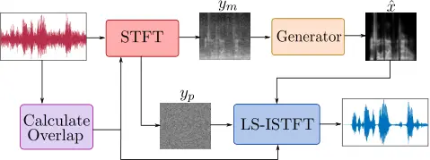
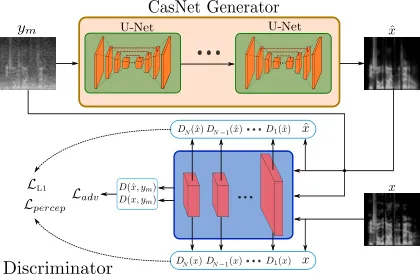

# AeGAN: Time-Frequency Speech Denoising via Generative Adversarial Networks

Sherif Abdulatif$`\,{}^{\star}`$, Karim Armanious^(⋆), Karim Guirguis,
Jayasankar T. Sajeev, Bin Yang ^(†)^(†)thanks: \$ˆ⋆\$These authors
contributed to this work equally.
Affiliation: University of Stuttgart, Institute of Signal Processing and System Theory, Stuttgart, Germany

###### Abstract

Automatic speech recognition (ASR) systems are of vital importance
nowadays in commonplace tasks such as speech-to-text processing and
language translation. This created the need for an ASR system that can
operate in realistic crowded environments. Thus, speech enhancement is a
valuable building block in ASR systems and other applications such as
hearing aids, smartphones and teleconferencing systems. In this paper, a
generative adversarial network (GAN) based framework is investigated for
the task of speech enhancement, more specifically speech denoising of
audio tracks. A new architecture based on CasNet generator and an
additional feature-based loss are incorporated to get realistically
denoised speech phonetics. Finally, the proposed framework is shown to
outperform other learning and traditional model-based speech enhancement
approaches.

###### Index Terms: 

Speech enhancement, generative adversarial networks, automatic speech
recognition, deep learning.

## I Introduction

In a noisy environment, a typical speech signal is perceived as a
mixture between clean speech and an intrusive background noise.
Accordingly, speech denoising is interpreted as a source separation
problem, where the goal is to separate the desired audio signal from the
intrusive noise. The background noise type and the signal-to-noise ratio
(SNR) have a direct influence on the quality of the denoised speech. For
instance, some common background noise types can be very similar to the
desired speech such as cafe or food court noise. In these cases,
estimating the desired speech from the corrupted signal is challenging
and sometimes impossible in low SNR situations because the noise occupy
the same frequency bands as the desired speech. This process of
eliminating background noise from noisy speech signal is constructive
for applications such as automatic speech recognition (ASR) systems,
hearing aids and teleconferencing systems.

Previously, traditional approaches were adopted for speech enhancement
such as spectral subtraction \[1, 2\] and binary masking techniques \[3,
4\]. Moreover, statistical approaches based on Wiener filters and
Bayesian estimators were applied to speech enhancement \[5, 6\].
However, most of these approaches require a prior estimation of the SNR
based on an initial silent period and can only operate well on limited
non-speech like noise types in high SNR situations. This is attributed
to the lack of a precise signal model describing the distinction between
the speech and noise signals.

To overcome such limitations, data driven approaches based on deep
neural networks (DNNs) are widely used in literature to learn deep
underlying features of either the desired speech or the intrusive
background noise from the given data without a signal model. For
instance, denoising autoencoders (AE) were used in \[7, 8\] to estimate
a clean track from a noisy input based on the L1-loss. Long short-term
memory (LSTM) networks have also been utilized to incorporate temporal
speech structure in the denoising process \[9, 10\]. Also, an adaptation
of the autoregressive generative WavNet was used in \[11\] where a
denoised sample is generated based on the previous input and output
samples.

In 2014, generative adversarial networks (GANs) were introduced as the
state-of-the-art for deep generative models \[12\]. In GANs, a generator
is trained adversarially with a discriminator to generate images
belonging to the same joint distribution of the training data.
Afterwards, variants of GANs such as conditional generative adversarial
networks (cGANs) were introduced for image-to-image translation tasks
\[13, 14, 15\]. The pix2pix model introduced in \[16\] is one of the
first attempts to map natural images from an input source domain to a
certain target domain. Henceforth, cGANs were used for speech
enhancement either by utilizing the raw 1D speech tracks or the 2D
log-Mel time-frequency (TF) magnitude representation. For instance,
speech enhancement GAN (SEGAN) is a 1D adaptation of the pix2pix model
operating on 1D raw speech tracks \[17\]. This model was further adapted
to operate on 2D TF-magnitude representations via the frequency SEGAN
(FSEGAN) framework \[18\]. Due to the TF-magnitude representation being
used as an implicit feature extractor, an improved speech denoising was
reported. However, both models suffer from multiple limitations. They
rely mainly on pixel-wise losses, which have been reported to produce
inconsistencies and output artifacts \[16\]. Additionally, both models
were utilized to denoise speech tracks of fixed durations and under
relatively mild noise conditions with an average SNR of 10 dB.

In this work, a new adversarial approach, inspired by \[19\], is
proposed for denoising speech tracks by operating on 2D TF-magnitude
representations of noisy speech inputs. The proposed framework
incorporates a cascaded architecture in addition to a non-adversarial
feature-based loss which penalizes the discrepancies in the feature
space between the outputs and the targets. This enhances the robustness
of speech denoising with respect to harsh SNR conditions and speech-like
background noise types.

Additionally, we propose a new dynamic time resolution technique to
embed variable track lengths in a fixed TF representation by adapting
the time overlap according to the track length. To illustrate the
performance of the proposed approach, quantitative comparison is carried
out against SEGAN \[17\], FSEGAN \[18\] and two traditional model-based
variants of Wiener filters and Bayesian estimators \[5, 6\] under
different noise types and SNR levels. Furthermore, the word error rate
(WER) of a pre-trained automatic speech recognition (ASR) model is
evaluated.

    


(a) Track duration $`=1.4\,s`$.


(b) Track duration $`=4\,s`$.

Fig. 1: Examples of variable duration tracks embedded in a fixed
$`256\times 256`$ TF-magnitude representation.

## II Dynamic Time Resolution

Previously proposed architectures are designed to work on speech tracks
of fixed durations. This is due to the architectural limitation of
having to operate on inputs of fixed pixel dimensionality or number of
samples for FSEGAN and SEGAN, respectively. In order to accommodate this
constraint, the input track length was fixed to 1 s. Accordingly, a
track of arbitrary length should be first divided into 1 s intervals and
then the denoising is applied sequentially on each interval.

In our proposed framework, the input 2D TF-magnitude representation is
fixed to $`256\times 256`$ pixels. However, the time resolution per
pixel is variable according to the length of the 1D track as shown in
Fig. 1. The TF-magnitude representation is computed based on short time
Fourier transform (STFT) where a window function followed by FFT is
applied to overlapping segments of the 1D track. In our case, we will
consider tracks of 16 kHz sampling frequency. A hamming window of
$`S=512`$ samples is used to get a one-sided spectrum of $`N_{F}=256`$
frequency bins. To fix the time dimension to $`N_{T}=256`$ time bins,
the overlapping parameter $`O`$ of the 1D segments is adjusted based on
the input track length $`L`$ according to the following relation:

```math
O=S-\bigg\lceil\frac{L}{N_{T}}\bigg\rceil \tag{1}
```

Finally, the track length $`L`$ is modified either by omitting samples
or padding a silent signal based on the following constraint:

```math
L=N_{T}(S-O)+O \tag{2}
```



Fig. 2: General block diagram of the proposed system. The log-magnitude
is passed to the network and the output of the network is used with the
input noisy phase for reconstruction.

After applying the denoising to the input TF-magnitude representation,
getting back to the time domain is mandatory. For this we choose to use
the least square inverse short time Fourier transform (LS-ISTFT)
proposed in \[20\]. Based on this implementation, an acceptable
signal-to-distortion ratio (SDR) reconstruction can be achieved with an
overlap of at least 25%. By substituting this overlap ratio in Eq. 1,
the longest track length that can be embedded in a $`256\times 256`$
TF-magnitude representation should not exceed 6.1 s. Otherwise the track
will be split into multiple suitable durations. The LS-ISTFT requires
both magnitude and phase of the TF representation for reconstruction.
However, the phonetic information of speech is mostly available in the
magnitude. Therefore, only this magnitude $`y_{m}`$ is passed as input
to the denoising network. For reconstruction, the noisy phase $`y_{p}`$
of the TF representation is used together with the denoised magnitude as
shown in Fig. 2.

## III Method

In this section, the proposed adversarial approach for speech
enhancement will be described. First, a brief explanation of traditional
cGANs will be outlined, followed by the proposed framework titled
acoustic-enhancement GAN (AeGAN). However, in this initial work the
AeGAN will be applied on a speech denoising task. An overview of the
proposed approach is presented in Fig. 3.

### III-A Conditional Generative Adversarial Networks

In general, adversarial frameworks are a game-theoretical approach which
pits multiple networks in direct competition with each other. More
specifically, a cGAN framework consists of two deep convolutional neural
networks (DCNNs), a generator $`G`$ and a discriminator $`D`$ \[16\].
The generator receives as input the magnitude of the 2D TF
representation of the noisy speech. It attempts to eliminate the
intrusive background noise by outputting the denoised TF-magnitude
$`\hat{x}=G(y_{m})`$. The main goal of the generator is to render
$`\hat{x}`$ to be indistinguishable from the target ground-truth clean
speech TF-magnitude $`x`$. Parallel to this process, the discriminator
network is trained to directly oppose the generator. $`D`$ acts as a
binary classifier receiving $`y_{m}`$ and either $`x`$ or $`\hat{x}`$ as
inputs and classifying which of them is synthetically generated and
which is real. In other words, $`G`$ attempts to produce a realistically
enhanced TF-magnitude to fool $`D`$, while conversely $`D`$ constantly
improves it’s performance to better detect the generator’s output as
fake. This adversarial training setting drives both networks to improve
their respective performance until Nash’s equilibrium is reached. This
training procedure is expressed via the following min-max optimization
task over the adversarial loss function
$`\mathcal{L}_{\small\textrm{adv}}`$:

```math
\begin{split}\min_{G}\max_{D}\mathcal{L}_{\small\textrm{adv}}=\min_{G}\max_{D}&\;\mathbb{E}_{x,y_{m}}\left[\textrm{log}D(x,y_{m})\right]+\\
&\;\mathbb{E}_{\hat{x},y_{m}}\left[\textrm{log}\left(1-D\left(\hat{x},y_{m}\right)\right)\right]\end{split} \tag{3}
```

To further improve the output of the generator and avoid visual
artifacts, an additional L1 loss is utilized to enforce pixel-wise
consistency between the generator output $`\hat{x}`$ and the
ground-truth target \[16\]. The L1 loss is given by

```math
\mathcal{L}_{\small\textrm{L1}}=\mathbb{E}_{x,\hat{x}}\left[\lVert{x-\hat{x}}\rVert_{1}\right] \tag{4}
```

### III-B Feature-Based Loss

The magnitude component of the speech TF representation has rich
patterns directly reflecting human speech phonetics. A straightforward
minimization of the pixel-wise discrepancy via L1 loss will result in a
blurry TF-magnitude reconstruction which in turns will deteriorate the
speech phonetics.

To overcome this issue, we propose the utilization of the feature-based
loss inspired by \[19\] to regularize the generator network to produce
globally consistent results by focusing on wider feature representations
rather than individual pixels. This is achieved by utilizing the
discriminator $`D`$ as a trainable feature extractor to extract low and
high-level feature representations. The feature-based loss is then
calculated as the weighted average of the mean absolute error (MAE) of
the extracted feature maps:

```math
\mathcal{L}_{\small\textrm{Percep}}=\sum_{i=1}^{N}\lambda_{n}\lVert{D_{n}\left(x\right)-D_{n}\left(\hat{x}\right)}\rVert_{1} \tag{5}
```

where $`D_{n}`$ is the feature map extracted from the $`n^{th}`$ layer
of the discriminator. $`N`$ and $`\lambda_{n}`$ are the total number of
layers and the individual weights given to each layer, respectively.

### III-C Architectural Details

In our proposed AeGAN framework, a CasNet generator and a patch
discriminator architecture are utilized \[19\]. CasNet concatenates
three U-blocks in an end-to-end manner, whereas each U-block consists of
a encoder-decoder architecture joint together via skip connections.
These connections avoid the excessive loss of information due to the
bottleneck layer. The output TF-magnitude representations are
progressively refined as they propagate through the multiple
encoder-decoder pairs. The architecture of each U-block is identical to
that proposed in \[16\]. Regarding the patch discriminator, it divides
the input TF-magnitude representations into smaller patches before
proceeding with classifying each patch as real or fake. For the final
classification score, all patch scores are averaged out. However, unlike
the $`70\times 70`$ pixel patches recommended in \[16\], a patch size of
$`16\times 16`$ was found to produce better output results in our case.



Fig. 3: An overview of the proposed adversarial architecture for speech
TF-magnitude denoising with relevant losses.

## IV Experiments


Fig. 4: Qualitative comparison on the TF-magnitude of different
learning-based speech denoising techniques.  
(

) illustrates the frequency bands of different noise types. (

) and (

) shows the advantages of our model under cafe noise.

| Model       | Noisy input |      |      | Wiener filter \[5\] |      |      | Bayesian est. \[6\] |      |      | FSEGAN \[18\] |      |      | SEGAN \[17\] |      |      | AeGAN    |      |      | Target |
| ----------- | ----------- | ---- | ---- | ------------------- | ---- | ---- | ------------------- | ---- | ---- | ------------- | ---- | ---- | ------------ | ---- | ---- | -------- | ---- | ---- | ------ |
|             | SNR (dB)    |      |      | SNR (dB)            |      |      | SNR (dB)            |      |      | SNR (dB)      |      |      | SNR (dB)     |      |      | SNR (dB) |      |      |        |
|             | 0           | 5    | 10   | 0                   | 5    | 10   | 0                   | 5    | 10   | 0             | 5    | 10   | 0            | 5    | 10   | 0        | 5    | 10   |        |
| PESQ        | 1.43        | 1.69 | 2.03 | 1.46                | 1.79 | 2.20 | 1.45                | 1.79 | 2.21 | 1.57          | 1.99 | 2.47 | 1.79         | 2.18 | 2.59 | 2.17     | 2.64 | 3.04 | 4.5    |
| CSIG        | 2.23        | 2.75 | 3.29 | 1.79                | 2.43 | 3.04 | 1.81                | 2.41 | 2.98 | 2.50          | 3.12 | 3.69 | 2.83         | 3.34 | 3.78 | 3.36     | 3.86 | 4.28 | 5.0    |
| CBAK        | 1.64        | 2.03 | 2.49 | 1.58                | 2.06 | 2.58 | 1.66                | 2.10 | 2.59 | 2.11          | 2.54 | 2.97 | 2.26         | 2.65 | 3.01 | 2.59     | 3.00 | 3.35 | 5.0    |
| COVL        | 1.72        | 2.14 | 2.61 | 1.45                | 1.98 | 2.53 | 1.47                | 1.98 | 2.51 | 1.97          | 2.52 | 3.06 | 2.23         | 2.71 | 3.16 | 2.74     | 3.24 | 3.66 | 5.0    |
| STOI        | 0.65        | 0.77 | 0.86 | 0.63                | 0.76 | 0.86 | 0.60                | 0.73 | 0.83 | 0.72          | 0.82 | 0.89 | 0.79         | 0.86 | 0.91 | 0.82     | 0.89 | 0.93 | 1.0    |
| ASR WER (%) | 90.0        | 70.4 | 46.3 | 89.6                | 70.0 | 49.6 | 87.7                | 71.3 | 49.0 | 85.9          | 66.4 | 44.7 | 73.8         | 53.7 | 35.8 | 64.6     | 42.9 | 29.7 | 20.0   |

TABLE I: Quantitative comparison of speech denoising techniques on test
dataset with speech-like noise types.

| Model       | Noisy Input |      |      | Wiener filter \[5\] |      |      | Bayesian est. \[6\] |      |      | FSEGAN \[18\] |      |      | SEGAN \[17\] |      |      | AeGAN    |      |      | Target |
| ----------- | ----------- | ---- | ---- | ------------------- | ---- | ---- | ------------------- | ---- | ---- | ------------- | ---- | ---- | ------------ | ---- | ---- | -------- | ---- | ---- | ------ |
|             | SNR (dB)    |      |      | SNR (dB)            |      |      | SNR (dB)            |      |      | SNR (dB)      |      |      | SNR (dB)     |      |      | SNR (dB) |      |      |        |
|             | 0           | 5    | 10   | 0                   | 5    | 10   | 0                   | 5    | 10   | 0             | 5    | 10   | 0            | 5    | 10   | 0        | 5    | 10   |        |
| PESQ        | 1.46        | 1.73 | 2.13 | 1.72                | 2.11 | 2.58 | 1.81                | 2.22 | 2.69 | 1.72          | 2.19 | 2.70 | 1.81         | 2.22 | 2.64 | 2.47     | 2.90 | 3.27 | 4.5    |
| CSIG        | 2.40        | 2.93 | 3.49 | 2.52                | 3.11 | 3.63 | 2.54                | 3.11 | 3.60 | 2.73          | 3.40 | 3.99 | 3.00         | 3.51 | 3.93 | 3.81     | 4.24 | 4.59 | 5.0    |
| CBAK        | 1.55        | 1.97 | 2.49 | 1.83                | 2.34 | 2.88 | 1.99                | 2.48 | 2.98 | 2.25          | 2.71 | 3.16 | 2.29         | 2.71 | 3.09 | 2.84     | 3.22 | 3.57 | 5.0    |
| COVL        | 1.79        | 2.23 | 2.75 | 1.96                | 2.50 | 3.03 | 2.03                | 2.56 | 3.08 | 2.16          | 2.76 | 3.33 | 2.32         | 2.81 | 3.26 | 3.12     | 3.56 | 3.94 | 5.0    |
| STOI        | 0.72        | 0.80 | 0.87 | 0.72                | 0.80 | 0.88 | 0.70                | 0.78 | 0.85 | 0.75          | 0.84 | 0.89 | 0.81         | 0.88 | 0.92 | 0.86     | 0.90 | 0.94 | 1.0    |
| ASR WER (%) | 85.6        | 64.7 | 45.4 | 78.0                | 58.2 | 38.9 | 75.5                | 56.8 | 40.5 | 81.2          | 62.3 | 43.0 | 70.2         | 51.3 | 34.7 | 50.1     | 39.4 | 27.1 | 20.0   |

TABLE II: Quantitative results for generalization on city-street noise.

The proposed speech denoising framework is evaluated on the TIMIT
dataset \[21\]. This dataset consists of 10 phonetically rich sentences
spoken by 630 speakers with 8 different American English dialects. All
tracks are sampled at 16 kHz and the track durations are between 0.9 s
to 7 s. The majority of the tracks satisfies the aforementioned track
length constraint in Sec. II. Only 15 tracks were found to exceed the
6.1 s limit and were excluded from the dataset for simplicity.

In the training procedure, three different noise types were utilized
(cafe, food court and home kitchen) from the QUT-TIMIT proposed in
\[22\]. The background noise was added to the clean speech in order to
create a paired training set. Additionally, different total SNR levels
were used for each noise type (0, 5 and 10 dB). Thus, the total training
dataset consists of 36,000 paired tracks from 462 speakers of 6
different dialects. For validation, two different experiments were
conducted. In the first experiment, the trained network was validated on
a test set of 5000 tracks utilizing the same training noise types albeit
from different 168 individuals using the whole 8 available dialects. In
the second experiment, the generalization capability of the network was
investigated by validating on a dataset of 500 tracks from the test set
corrupted by a new noise type, the city street noise. Both experiments
were conducted using the same SNR values used in training.

To compare the performance of the proposed approach, quantitative
comparisons were conduced against the FSEGAN and SEGAN \[18, 17\].
Additionally, traditional model-based approaches, Wiener filter \[5\]
and an optimized weighted-Euclidean Bayesian estimator \[6\], were
utilized in the comparative study based on their open-source
implementations¹¹ 1
[https://www.crcpress.com/downloads/K14513/K14513_CD_Files.zip](https://www.crcpress.com/downloads/K14513/K14513_CD_Files.zip).
All trainable models were trained using the same hyperparameters for 50
epochs to ensure a fair comparison. Multiple metrics were used for the
comparison in order to give a wider scope of interpretation for the
results. The utilized metrics are the perceptual evaluation of speech
quality (PSEQ) \[23\], the mean opinion score (MOS) prediction of the
signal distortion (CSIG), the MOS prediction of background noise (CBAK)
and the overall MOS prediction score (COVL) \[24\]. To give an
indication of human speech intelligibility, the short-time objective
intelligibility measure (STOI) was utilized \[25\]. Additionally, the
WER was evaluated using the Deep Speech pre-trained ASR model \[26\].

## V Results and Discussion

First a qualitative comparison of the TF-magnitude representation of
different methods is illustrated. As shown in Fig. 4, the AeGAN is
superior in cancelling the low power components of the background noise
in comparison to FSEGAN as annotated by (

). In contrast to the AeGAN, the SEGAN model shows a clear elimination
of some speech intervals as annotated by (

).

Regarding the quantitative analysis, we present the metric scores of the
noisy input tracks as a comparison baseline. Also the metric scores of
the ground-truth target clean tracks are presented as an indicator of
the maximal achievable performance. All scores are averaged over the
different noise types. In Table I, the results of the first experiment
is presented. In this experiment, the test tracks were based on
speech-like noise types (cafe and food-court noise). Hence, the noise
distribution is difficult to distinguish from the target speech
segments. The model-based approaches resulted in minor or no speech
improvements compared to the baseline noisy input. We hypothesize that
this is due to the fact that the distribution of the speech-like noise
occupies the same frequency bands as the speech signals. Thus, the
model-based approaches fail to distinguish the speech from the noisy
background in case of speech-like corruption. Regarding the
learning-based approaches, the proposed AeGAN framework outperforms both
the FSEGAN and SEGAN models. For instance, AeGAN results in a WER of
29.7% for SNR 10 dB compared to 35.8% and 44.7% for SEGAN and FSEGAN,
respectively.

To illustrate the generalization capability of the proposed framework,
an additional comparative study is presented in Table II based on
validating the trained models on a new noise type (city-street noise).
This noise can be considered as a less challenging noise compared to the
aforementioned speech-like noises because it occupies a narrower
frequency band as annotated by (

) in Fig. 4. Accordingly, the model-based approaches resulted in a more
noticeable improvement compared to the noisy input baseline. More
specifically, the more recent Bayesian estimator outperformed the
traditional Wiener filter across the objective metrics. FSEGAN resulted
in an enhanced performance in the objective metrics with slight
deterioration in the PESQ and WER compared to the model-based
approaches. Finally, the SEGAN and AeGAN are quantitatively superior
across all utilized metrics with AeGAN enhancing the WER by 20.1%
compared to SEGAN in the 0 dB case. This illustrates that the
learning-based approaches result in a significant improvement in speech
denoising performance with robust generalization to never seen noise
types, especially SEGAN and the proposed AeGAN.

Conventionally, deep-learning approaches face a significant challenge in
collecting a large enough number of labeled training samples, i.e.
paired (clean and noisy) samples. However, in the case of speech
denoising this is easily bypassed by the availability of accessible
audio and noise datasets that can be superimposed with the required SNR.

It must also be pointed that in literature the FSEGAN authors claim a
better performance in WER over the SEGAN model. However, this has not
been observed in the above results. We hypothesize that this is the
result of FSEGAN now having to deal with variable time resolution input
TF-magnitude representations, due to the utilized dynamic time
resolution, which posses a challenge compared to the SEGAN.

However, this work is not without limitation. In the future, we plan to
extend the current comparative studies to include more recent
model-based approaches for speech denoising such as \[27, 28\]. In
addition to applying some subjective evaluation tests.We also plan to
extend the AeGAN framework to accommodate different non-speech audio
signals (e.g. music denoising) and other enhancement tasks such as
dereverberation and interference cancellation.

## VI Conclusion

In this work, an adversarial speech denoising technique is introduced to
operate on speech TF-magnitude representations. The proposed approach
involves an additional feature-based loss and a CasNet generator
architecture to enhance detailed local features of speech in the TF
domain. Moreover, to improve the inference efficiency, time-domain
tracks with variable durations are embedded in a fixed TF-magnitude
representation by changing the corresponding time resolution.

Challenging speech-like noise types, e.g. cafe and food court noise,
were involved in training under low SNR conditions. To evaluate the
generalization capability of our model, two experiments were conducted
on different speakers and noise types. The proposed approach exhibits a
significantly enhanced performance in comparison to the previously
introduced GAN-based and traditional model-based approaches.

## References

- \[1\] M. Berouti et al., “Enhancement of speech corrupted by acoustic
  noise,” in IEEE International Conference on Acoustics, Speech, and
  Signal Processing (ICASSP), April 1979, vol. 4, pp. 208–211.
- \[2\] S. Kamath and P. Loizou, “A multi-band spectral subtraction
  method for enhancing speech corrupted by colored noise,” in IEEE
  International Conference on Acoustics, Speech, and Signal Processing
  (ICASSP), May 2002, vol. 4, pp. 4164–4164.
- \[3\] N. Li et al., “Factors influencing intelligibility of ideal
  binary-masked speech: Implications for noise reduction,” The Journal
  of the Acoustical Society of America, vol. 123, no. 3, pp.
  1673–1682, 2008.
- \[4\] D. Wang, “Time-frequency masking for speech separation and its
  potential for hearing aid design,” Trends in amplification, vol. 12,
  no. 4, pp. 332–353, 2008.
- \[5\] P. Scalart and J. V. Filho, “Speech enhancement based on a
  priori signal to noise estimation,” in IEEE International Conference
  on Acoustics, Speech, and Signal Processing Conference Proceedings
  (ICASSP), May 1996, vol. 2, pp. 629–632.
- \[6\] P. C. Loizou, “Speech enhancement based on perceptually
  motivated bayesian estimators of the magnitude spectrum,” IEEE
  Transactions on Speech and Audio Processing, vol. 13, no. 5, pp.
  857–869, Sep. 2005.
- \[7\] X. Lu et al., “Speech enhancement based on deep denoising
  autoencoder,” in Interspeech, Aug. 2013, pp. 436–440.
- \[8\] X. Feng, Y. Zhang, and J. Glass, “Speech feature denoising and
  dereverberation via deep autoencoders for noisy reverberant speech
  recognition,” in IEEE International Conference on Acoustics, Speech
  and Signal Processing (ICASSP), May 2014, pp. 1759–1763.
- \[9\] F. Weninger et al., “Speech enhancement with lstm recurrent
  neural networks and its application to noise-robust asr,” in
  International Conference on Latent Variable Analysis and Signal
  Separation. Springer, Aug. 2015, pp. 91–99.
- \[10\] Y. Tu et al., “A hybrid approach to combining conventional and
  deep learning techniques for single-channel speech enhancement and
  recognition,” in IEEE International Conference on Acoustics, Speech
  and Signal Processing (ICASSP), April 2018, pp. 2531–2535.
- \[11\] D. Rethage, J. Pons, and X. Serra, “A WaveNet for speech
  denoising,” in IEEE International Conference on Acoustics, Speech and
  Signal Processing (ICASSP), April 2018, pp. 5069–5073.
- \[12\] I. Goodfellow et al., “Generative adversarial nets,” in
  Advances in Neural Information Processing Systems, pp.
  2672–2680. 2014.
- \[13\] M. Mirza and S. Osindero, “Conditional generative adversarial
  nets,” CoRR, vol. abs/1411.1784, 2014.
- \[14\] K. Armanious et al., “Unsupervised Medical Image Translation
  Using Cycle-MedGAN,” in 27th European Signal Processing Conference
  (EUSIPCO), Sep. 2019, pp. 3642–3646.
- \[15\] K. Armanious et al., “An Adversarial Super-Resolution Remedy
  for Radar Design Trade-offs,” in 27th European Signal Processing
  Conference (EUSIPCO), Sep. 2019, pp. 3642–3646.
- \[16\] P. Isola et al., “Image-to-Image translation with conditional
  adversarial networks,” in IEEE Conference on Computer Vision and
  Pattern Recognition (CVPR), July 2017, pp. 5967–5976.
- \[17\] S. Pascual, A. Bonafonte, and J. Serrà, “SEGAN: Speech
  enhancement generative adversarial network,” in Interspeech, 2017, pp.
  3642–3646.
- \[18\] C. Donahue, B. Li, and R. Prabhavalkar, “Exploring speech
  enhancement with generative adversarial networks for robust speech
  recognition,” in IEEE International Conference on Acoustics, Speech
  and Signal Processing (ICASSP), April 2018, pp. 5024–5028.
- \[19\] K. Armanious et al., “MedGAN: Medical image translation using
  gans,” Computerized Medical Imaging and Graphics, vol. 79, 2020.
- \[20\] B. Yang, “A study of inverse short-time Fourier transform,” in
  IEEE International Conference on Acoustics, Speech and Signal
  Processing (ICASSP), March 2008, pp. 3541–3544.
- \[21\] J. S. Garofolo et al., “TIMIT acoustic-phonetic continuous
  speech corpus,” Linguistic Data Consortium, 1992.
- \[22\] D. B. Dean et al., “The QUT-NOISE-TIMIT corpus for the
  evaluation of voice activity detection algorithms,” in Interspeech,
  Sep. 2010.
- \[23\] A. W. Rix et al., “Perceptual evaluation of speech quality
  (PESQ)-a new method for speech quality assessment of telephone
  networks and codecs,” in IEEE International Conference on Acoustics,
  Speech, and Signal Processing (ICASSP), May 2001, vol. 2, pp. 749–752.
- \[24\] Y. Hu and P. C. Loizou, “Evaluation of objective quality
  measures for speech enhancement,” IEEE Transactions on Audio, Speech,
  and Language Processing, vol. 16, no. 1, pp. 229–238, Jan. 2008.
- \[25\] C. H. Taal et al., “A short-time objective intelligibility
  measure for time-frequency weighted noisy speech,” in IEEE
  International Conference on Acoustics, Speech and Signal Processing,
  March 2010, pp. 4214–4217.
- \[26\] A. Hannun et al., “Deep speech: Scaling up end-to-end speech
  recognition,” 2014.
- \[27\] M. Fujimoto, S. Watanabe, and T. Nakatani, “Noise suppression
  with unsupervised joint speaker adaptation and noise mixture model
  estimation,” in IEEE International Conference on Acoustics, Speech and
  Signal Processing (ICASSP), March 2012, pp. 4713–4716.
- \[28\] G. Enzner and P. Thüne, “Bayesian MMSE filtering of noisy
  speech by SNR marginalization with global PSD priors,” IEEE/ACM
  Transactions on Audio, Speech, and Language Processing, vol. 26, no.
  12, pp. 2289–2304, Dec. 2018.
