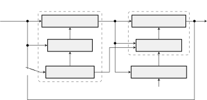
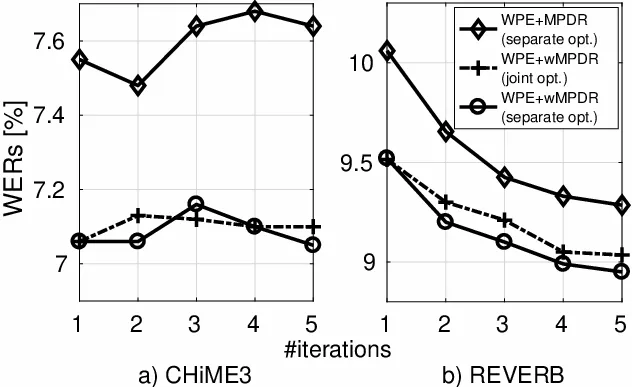

# Jointly optimal dereverberation and beamforming

Christoph Boeddeker    Tomohiro Nakatani    Keisuke Kinoshita   
Reinhold Haeb-Umbach

###### Abstract

We previously proposed an optimal (in the maximum likelihood sense)
convolutional beamformer that can perform simultaneous denoising and
dereverberation, and showed its superiority over the widely used cascade
of a Weighted Prediction Error (WPE) dereverberation filter and a
conventional Minimum-Power Distortionless Response (MPDR) beamformer.
However, it has not been fully investigated which components in the
convolutional beamformer yield such superiority. To this end, this paper
presents a new derivation of the convolutional beamformer that allows us
to factorize it into a WPE dereverberation filter, and a special type of
a (non-convolutional) beamformer, referred to as a weighted MPDR (wMPDR)
beamformer, without loss of optimality. With experiments, we show that
the superiority of the convolutional beamformer in fact comes from its
wMPDR part.

###### Index Terms: 

Dereverberation, beamforming, speech enhancement

^(†)^(†)address: ¹ Paderborn University, Department of Communications
Engineering, Paderborn, Germany  
² NTT Communication Science Laboratories, NTT Corporation, Kyoto, Japan

## 1 Introduction

In many speech processing applications the microphone signal is degraded
both by reverberation and by noise. Reverberation is caused by the
signal traveling from source to the sensor via multiple paths with
different lengths and attenuations, causing a temporal smearing. While
early reflections which arrive with up to roughly
$`50\text{\,}\mathrm{m}\mathrm{s}`$ delay compared to the direct signal
are actually beneficial for human perception and even for Automatic
Speech Recognition (ASR), late reverberation degrades both of them.
Furthermore, if microphones are located at a distance to the speaker, it
is likely that they capture other signals, here denoted as noise for
simplicity, in addition to the desired speech signal.

For improving the quality of recorded speech, a number of techniques has
been developed for dereverberation and denoising. Dereverberation
techniques can be broadly categorized \[1\] into spectral magnitude
manipulation \[2\] and linear filtering techniques \[3, 4\]. Among the
latter, the WPE method \[4, 5\], has been shown to be very effective
both for improving signal quality for human perception and for ASR
\[6\]. A very effective mean to remove noise is acoustic beamforming
based on microphone arrays \[7, 8\], which can enhance the desired
source signal while attenuating signals with different propagation
patterns. Furthermore, for performing dereverberation and denoising at
the same time, their cascade configuration has been widely studied. Its
effectiveness was shown by top scoring systems developed for recent
distant speech recognition challenges, such as the REVERB and the
CHiME-3/4/5 challenges \[6, 9, 10\]. Iterative optimization of the
cascade configuration is also investigated as extension of this approach
\[11, 12\].

One issue of the conventional cascade approach \[12, 13\] was that the
overall optimality was not guaranteed. The approach performs the
optimization separately for dereverberation and beamforming. Moreover,
different optimization criteria are adopted for the respective problems:
The WPE technique estimates the dereverberation filter based on maximum
likelihood estimation with a time-varying Gaussian source assumption
\[4\], while most beamformers are estimated based on a noise power
minimization criterion \[7\]. As a consequence, what is optimized by the
cascaded approach was even not clear. Also, it was not well investigated
what optimization criterion is preferable for simultaneous denoising and
dereverberation.

To address this issue, a convolutional beamformer has been recently
proposed \[14\]. It unifies the WPE dereverberation filter and a
beamformer into a single linear convolutional filter, called weighted
power minimization distortionless response (WPD) beamformer. The filter
coefficients are optimized based on a single criterion, namely the
likelihood maximization with a time-varying Gaussian source assumption
\[15\]. The WPD beamformer was compared with a conventional cascade
configuration, consisting of a WPE Multiple Input Multiple Output (MIMO)
dereverberation filter \[5\] followed by an MPDR beamformer. Experiments
carried out on the REVERB challenge data set showed a performance
advantage in terms of word error rate (WER) of the WPD over the cascade
structure.

However, it remains unclear what makes the WPD beamformer superior to
the conventional cascade configuration, and if at all there is an
essential difference between the unified and cascade structures. This
paper answers these questions and shows the equivalence between the WPD
convolutional beamforming and the cascade configuration of MIMO-WPE
dereverberation followed by a variant of MPDR beamforming, namely
weighted MPDR (wMPDR) beamforming. We theoretically derive their strict
equivalence under the assumption that the two are jointly optimized
based on the maximum likelihood criterion. The factorizability of the
convolutional beamforming has some practical advantages due to its
modularity. For example, signal parameters, such as the spatial
covariance matrix of the vector of microphone signals and the time
variant clean speech power, need to be estimated from the data. In
\[15\], this was done with the help of additional WPE preprocessing.
With the result given here, this WPE component can be a part of the
enhancement chain, thus simplifying the overall structure.

We further show that the performance advantage obtained by the WPD
beamforming or its equivalent cascaded structure over the conventional
cascade structure comes from the wMPDR beamforming over conventional
beamforming.

The paper is organized as follows: After the signal model is introduced
in Sec. 2, unified and factorized versions of the convolutional
beamformer are derived in Secs. 3 and 4. Sec. 5 discusses the
characteristics of the factorized and unifed structure referring to its
equivalence shown in the Appendix. Experimental validation of the theory
and concluding remarks are given in Secs. 6 and 7.

## 2 Signal Model

We assume that a single speech signal is captured by $`M`$ microphones
in a noisy and reverberant environment. In the Short Time Fourier
Transform (STFT) domain the vector of microphone signals
$`\boldsymbol{\mathbf{y}}_{t}=\begin{bmatrix}y_{1,t}&\ldots&y_{M,t}\end{bmatrix}^{\mathrm{T}}`$
can be written as the convolution of the source signal $`s_{t}`$ with
the vector of the convolutive transfer function
$`\boldsymbol{\mathbf{a}}_{\tau}=\begin{bmatrix}a_{1,\tau}&\ldots&a_{M,\tau}\end{bmatrix}^{\mathrm{T}}`$
plus an additive noise vector $`\boldsymbol{\mathbf{n}}_{t}`$:

```math
\displaystyle\boldsymbol{\mathbf{y}}_{t} \displaystyle=\sum_{\tau=0}^{L_{a}-1}\boldsymbol{\mathbf{a}}_{\tau}s_{t-\tau}+\boldsymbol{\mathbf{n}}_{t} \tag{1}
```

```math
\displaystyle=\boldsymbol{\mathbf{x}}_{t}+\boldsymbol{\mathbf{n}}_{t}=\boldsymbol{\mathbf{d}}_{t}+\boldsymbol{\mathbf{r}}_{t}+\boldsymbol{\mathbf{n}}_{t}. \tag{2}
```

Here, $`t`$ is the time frame index. The frequency bin index has been
dropped for ease of notation. $`L_{a}`$ is the length of the transfer
function in number of frames. The term $`\boldsymbol{\mathbf{x}}_{t}`$
is called the image of the source signal $`s_{t}`$ at the microphones,
which is further decomposed in the direct signal plus early reflections
$`\boldsymbol{\mathbf{d}}_{t}`$, and late reverberation
$`\boldsymbol{\mathbf{r}}_{t}`$:

```math
\displaystyle\boldsymbol{\mathbf{d}}_{t} \displaystyle=\sum_{\tau=0}^{b-1}\boldsymbol{\mathbf{a}}_{\tau}s_{t-\tau}\approx\boldsymbol{\mathbf{v}}s_{t}=\tilde{\boldsymbol{\mathbf{v}}}d_{1,t} \tag{3}
```

```math
\displaystyle\boldsymbol{\mathbf{r}}_{t} \displaystyle=\sum_{\tau=b}^{L_{a}-1}\boldsymbol{\mathbf{a}}_{\tau}s_{t-\tau}, \tag{4}
```

where the frame index $`b`$ separates the early reflections from the
late reverberation. A typical value for $`b`$ is 2 to 4 frames,
corresponding to $`30`$ to $`50\text{\,}\mathrm{m}\mathrm{s}`$. In (3)
we approximated $`\boldsymbol{\mathbf{d}}_{t}`$ by the product of a
time-invariant (non-convolutive) acoustic transfer function (ATF) vector
$`\boldsymbol{\mathbf{v}}`$ with the clean speech signal $`s_{t}`$.
Furthermore we introduced the relative transfer function (RTF)
$`\tilde{\boldsymbol{\mathbf{v}}}=\boldsymbol{\mathbf{v}}/v_{1}`$, and
$`d_{1,t}=v_{1}s_{t}`$.

We now define the vector of the past $`L_{w}`$ microphone signals,
including the current observation $`\boldsymbol{\mathbf{y}}_{t}`$, but
excluding the most recent $`b-1`$ frames:

```math
\displaystyle\bar{\boldsymbol{\mathbf{y}}}_{t} \displaystyle=\begin{bmatrix}\boldsymbol{\mathbf{y}}_{t}^{\mathrm{T}}&\boldsymbol{\mathbf{y}}_{t-b}^{\mathrm{T}}&\ldots&\boldsymbol{\mathbf{y}}_{t-L_{w}+1}^{\mathrm{T}}\end{bmatrix}^{\mathrm{T}}\in\mathbb{C}^{M(L_{w}-b+1)\times 1} \tag{5}
```

```math
\displaystyle=\begin{bmatrix}\boldsymbol{\mathbf{y}}_{t}^{\mathrm{T}}&\tilde{\boldsymbol{\mathbf{y}}}_{t}^{\mathrm{T}}\end{bmatrix}^{\mathrm{T}} \tag{6}
```

where $`\tilde{\boldsymbol{\mathbf{y}}}`$ captures the observations from
$`b`$ frames in the past until $`L_{w}-1`$ frames in the past. Our goal
is to determine the coefficients $`\bar{\boldsymbol{\mathbf{w}}}`$ of a
spatial filter such that

```math
\displaystyle z_{t}=\bar{\boldsymbol{\mathbf{w}}}^{\mathrm{H}}\bar{\boldsymbol{\mathbf{y}}}_{t} \tag{7}
```

is an estimate of the desired signal $`d_{1,t}`$. Here,
$`\bar{\boldsymbol{\mathbf{w}}}`$ is the vector

```math
\displaystyle\bar{\boldsymbol{\mathbf{w}}} \displaystyle=\begin{bmatrix}\boldsymbol{\mathbf{w}}_{0}^{\mathrm{T}}&\boldsymbol{\mathbf{w}}_{b}^{\mathrm{T}}&\ldots&\boldsymbol{\mathbf{w}}_{L_{w}-1}^{\mathrm{T}}\end{bmatrix}^{\mathrm{T}}, \tag{8}
```

which has the same dimension as $`\bar{\boldsymbol{\mathbf{y}}}`$.
Because this beamformer is based on the convolutional signal model of
eq. (1) we call it convolutional beamformer \[14\].

## 3 Unified solution

In \[15\], the output $`z_{t}`$ is modeled as a zero mean complex
Gaussian with a time varying variance. This output distribution was used
to define the maximum likelihood (ML) objective for the estimation of
the coefficients $`\bar{\boldsymbol{\mathbf{w}}}`$. Under a
distortionless response constraint that is often introduced into
beamforming the ML objective can be replaced with:

```math
\displaystyle\mathcal{L}(\bar{\boldsymbol{\mathbf{w}}}) \displaystyle\propto\frac{1}{T}\sum_{t=1}^{T}\left(-\ln(\lambda_t)-\frac{\left|z_{t}\right|^{2}}{\lambda_{t}}\right) \tag{9}
```

```math
\displaystyle\propto-\bar{\boldsymbol{\mathbf{w}}}^{\mathrm{H}}\left(\frac{1}{T}\sum_{t=1}^{T}\frac{\bar{\boldsymbol{\mathbf{y}}}_{t}\bar{\boldsymbol{\mathbf{y}}}_{t}^{\mathrm{H}}}{\lambda_{t}}\right)\bar{\boldsymbol{\mathbf{w}}}=-\bar{\boldsymbol{\mathbf{w}}}^{\mathrm{H}}\bar{\boldsymbol{\mathbf{R}}}_{\boldsymbol{\mathbf{y}}}\bar{\boldsymbol{\mathbf{w}}}, \tag{10}
```

where $`\lambda_{t}=\ExpOp[\left|d_{1,t}\right|^{2}]`$,
$`\bar{\boldsymbol{\mathbf{R}}}_{\boldsymbol{\mathbf{y}}}=\frac{1}{T}\sum_{t}\bar{\boldsymbol{\mathbf{y}}}_{t}\bar{\boldsymbol{\mathbf{y}}}_{t}^{\mathrm{H}}/\lambda_{t}`$,
and where $`T`$ is the number of frames over which the beamformer
coefficients are estimated. The distortionless response constraint
introduced for the ML estimation was:

```math
\displaystyle\boldsymbol{\mathbf{w}}_{0}^{\mathrm{H}}\tilde{\boldsymbol{\mathbf{v}}}=1. \tag{11}
```

This can be reformulated by introducing
$`\bar{\boldsymbol{\mathbf{w}}}`$ as follows:

```math
\displaystyle\bar{\boldsymbol{\mathbf{w}}}^{\mathrm{H}}\bar{\boldsymbol{\mathbf{v}}}=1, \tag{12}
```

where
$`\bar{\boldsymbol{\mathbf{v}}}=\begin{bmatrix}\boldsymbol{\mathbf{v}}^{\mathrm{T}}/v_{1}&\boldsymbol{\mathbf{0}}^{\mathrm{T}}\end{bmatrix}^{\mathrm{T}}`$,
and where $`\boldsymbol{\mathbf{0}}`$ is a vector of zeros of dimension
$`(M\cdot(L_{w}-b)\times 1)`$. A constrained optimization problem

```math
\displaystyle\mathcal{L}(\bar{\boldsymbol{\mathbf{w}}}) \displaystyle=-\bar{\boldsymbol{\mathbf{w}}}^{\mathrm{H}}\bar{\boldsymbol{\mathbf{R}}}_{\boldsymbol{\mathbf{y}}}\bar{\boldsymbol{\mathbf{w}}}\quad\text{s.t.}\quad\bar{\boldsymbol{\mathbf{w}}}^{\mathrm{H}}\bar{\boldsymbol{\mathbf{v}}}=1 \tag{13}
```

of this kind is well-known from minimum variance/power distortionless
beamforming, and the solution is given by

```math
\displaystyle\bar{\boldsymbol{\mathbf{w}}} \displaystyle=\frac{\bar{\boldsymbol{\mathbf{R}}}_{\boldsymbol{\mathbf{y}}}^{-1}\bar{\boldsymbol{\mathbf{v}}}}{\bar{\boldsymbol{\mathbf{v}}}^{\mathrm{H}}\bar{\boldsymbol{\mathbf{R}}}_{\boldsymbol{\mathbf{y}}}^{-1}\bar{\boldsymbol{\mathbf{v}}}}. \tag{14}
```

This is the WPD beamformer proposed in \[14\].

## 4 Factorized solution

Now we assume that $`\bar{\boldsymbol{\mathbf{w}}}`$ factorizes into a
$`(M(L_{w}-b+1)\times M)`$-dimensional MIMO dereverberation matrix
$`\bar{\boldsymbol{\mathbf{G}}}`$ and a beamforming vector
$`\boldsymbol{\mathbf{q}}`$ of size $`(M\times 1)`$

```math
\displaystyle\bar{\boldsymbol{\mathbf{w}}}=\bar{\boldsymbol{\mathbf{G}}}\boldsymbol{\mathbf{q}}. \tag{15}
```

Using this in the objective function (10) we obtain

```math
\displaystyle\mathcal{L}(\bar{\boldsymbol{\mathbf{G}}},\boldsymbol{\mathbf{q}}) \displaystyle\propto-\boldsymbol{\mathbf{q}}^{\mathrm{H}}\bar{\boldsymbol{\mathbf{G}}}^{\mathrm{H}}\bar{\boldsymbol{\mathbf{R}}}_{\boldsymbol{\mathbf{y}}}\bar{\boldsymbol{\mathbf{G}}}\boldsymbol{\mathbf{q}}. \tag{16}
```

Note that $`\bar{\boldsymbol{\mathbf{G}}}`$ has a particular structure,
because we have to make sure that the direct signal and early
reflections remain unmodified by the derevereberation matrix:

```math
\displaystyle\bar{\boldsymbol{\mathbf{G}}}=\begin{bmatrix}\boldsymbol{\mathbf{I}}_{M}\\
-\tilde{\boldsymbol{\mathbf{G}}}\end{bmatrix}. \tag{17}
```

Here, $`\boldsymbol{\mathbf{I}}_{M}`$ is the $`(M\times M)`$-dimensional
identity matrix, and $`\tilde{\boldsymbol{\mathbf{G}}}`$ is of dimension
$`(M(L_{w}-b)\times M)`$. Similarly, we factorize
$`\bar{\boldsymbol{\mathbf{R}}}_{\boldsymbol{\mathbf{y}}}`$:

```math
\displaystyle\bar{\boldsymbol{\mathbf{R}}}_{\boldsymbol{\mathbf{y}}}=\begin{bmatrix}\boldsymbol{\mathbf{R}}_{\boldsymbol{\mathbf{y}}}&\boldsymbol{\mathbf{P}}_{\boldsymbol{\mathbf{y}}}^{\mathrm{H}}\\
\boldsymbol{\mathbf{P}}_{\boldsymbol{\mathbf{y}}}&\tilde{\boldsymbol{\mathbf{R}}}_{\boldsymbol{\mathbf{y}}}\end{bmatrix} \tag{18}
```

where
$`\boldsymbol{\mathbf{R}}_{\boldsymbol{\mathbf{y}}}=\frac{1}{T}\sum_{t=1}^{T}\boldsymbol{\mathbf{y}}_{t}\boldsymbol{\mathbf{y}}_{t}^{\mathrm{H}}/\lambda_{t}`$,
$`\boldsymbol{\mathbf{P}}_{\boldsymbol{\mathbf{y}}}=\frac{1}{T}\sum_{t=1}^{T}\tilde{\boldsymbol{\mathbf{y}}}_{t}\boldsymbol{\mathbf{y}}_{t}^{\mathrm{H}}/\lambda_{t}`$,
and
$`\tilde{\boldsymbol{\mathbf{R}}}_{\boldsymbol{\mathbf{y}}}=\frac{1}{T}\sum_{t=1}^{T}\tilde{\boldsymbol{\mathbf{y}}}_{t}\tilde{\boldsymbol{\mathbf{y}}}_{t}^{\mathrm{H}}/\lambda_{t}`$.
Using this in (16), we arive at

```math
\displaystyle\mathcal{L}(\tilde{\boldsymbol{\mathbf{G}}},\boldsymbol{\mathbf{q}})\propto-\boldsymbol{\mathbf{q}}^{\mathrm{H}}\begin{bmatrix}\boldsymbol{\mathbf{I}}\\
-\tilde{\boldsymbol{\mathbf{G}}}\end{bmatrix}^{\mathrm{H}}\begin{bmatrix}\boldsymbol{\mathbf{R}}_{\boldsymbol{\mathbf{y}}}&\boldsymbol{\mathbf{P}}_{\boldsymbol{\mathbf{y}}}^{\mathrm{H}}\\
\boldsymbol{\mathbf{P}}_{\boldsymbol{\mathbf{y}}}&\tilde{\boldsymbol{\mathbf{R}}}_{\boldsymbol{\mathbf{y}}}\end{bmatrix}\begin{bmatrix}\boldsymbol{\mathbf{I}}\\
-\tilde{\boldsymbol{\mathbf{G}}}\end{bmatrix}\boldsymbol{\mathbf{q}}
```

```math
\displaystyle=-\boldsymbol{\mathbf{q}}\boldsymbol{\mathbf{R}}_{\boldsymbol{\mathbf{y}}}\boldsymbol{\mathbf{q}}+\boldsymbol{\mathbf{q}}^{\mathrm{H}}\tilde{\boldsymbol{\mathbf{G}}}^{\mathrm{H}}\boldsymbol{\mathbf{P}}_{\boldsymbol{\mathbf{y}}}\boldsymbol{\mathbf{q}}+\boldsymbol{\mathbf{q}}^{\mathrm{H}}\boldsymbol{\mathbf{P}}_{\boldsymbol{\mathbf{y}}}^{\mathrm{H}}\tilde{\boldsymbol{\mathbf{G}}}\boldsymbol{\mathbf{q}}-\boldsymbol{\mathbf{q}}^{\mathrm{H}}\tilde{\boldsymbol{\mathbf{G}}}^{\mathrm{H}}\tilde{\boldsymbol{\mathbf{R}}}_{\boldsymbol{\mathbf{y}}}\tilde{\boldsymbol{\mathbf{G}}}\boldsymbol{\mathbf{q}}. \tag{19}
```

To calculate the derivative w.r.t. the dereverberation matrix we use eq.
(70), (71) and (82) from \[16\] and the property
$`\tilde{\boldsymbol{\mathbf{R}}}_{\boldsymbol{\mathbf{y}}}=\tilde{\boldsymbol{\mathbf{R}}}_{\boldsymbol{\mathbf{y}}}^{\mathrm{H}}`$.
Setting the derivative to zero gives

```math
\displaystyle\partialderivative{\mathcal{L}(\Gpast,\bfonly)}{\Gpast} \displaystyle=2\boldsymbol{\mathbf{P}}_{\boldsymbol{\mathbf{y}}}\boldsymbol{\mathbf{q}}\boldsymbol{\mathbf{q}}^{\mathrm{H}}-2\tilde{\boldsymbol{\mathbf{R}}}_{\boldsymbol{\mathbf{y}}}\tilde{\boldsymbol{\mathbf{G}}}\boldsymbol{\mathbf{q}}\boldsymbol{\mathbf{q}}^{\mathrm{H}}\stackrel{{\scriptstyle!}}{{=}}\boldsymbol{\mathbf{0}}. \tag{20}
```

This equation has obviously multiple solutions. A solution, which allows
separate estimation of $`\tilde{\boldsymbol{\mathbf{G}}}`$ and
$`\boldsymbol{\mathbf{q}}`$ is

```math
\displaystyle\tilde{\boldsymbol{\mathbf{G}}} \displaystyle=\tilde{\boldsymbol{\mathbf{R}}}_{\boldsymbol{\mathbf{y}}}^{-1}\boldsymbol{\mathbf{P}}_{\boldsymbol{\mathbf{y}}}. \tag{21}
```

This solution is identical to the WPE solution \[5, 17, 18\] (Scaled
Identity Matrix assumption:
$`\breve{\boldsymbol{\mathbf{d}}}\sim\mathcal{N}(\boldsymbol{\mathbf{0}},\lambda_{t}\boldsymbol{\mathbf{I}})`$).
It allows to obtain a first estimate the dereverberated signal from the
current observation via

```math
\displaystyle\breve{\boldsymbol{\mathbf{d}}}_{t}=\bar{\boldsymbol{\mathbf{G}}}^{\mathrm{H}}\bar{\boldsymbol{\mathbf{y}}}_{t}. \tag{22}
```

Next we optimize (16) w.r.t. the beamforming vector. This is analog to
eq. 13, if $`\bar{\boldsymbol{\mathbf{w}}}`$ and
$`\bar{\boldsymbol{\mathbf{R}}}_{\boldsymbol{\mathbf{y}}}`$ are replaced
by $`\boldsymbol{\mathbf{q}}`$ and
$`\boldsymbol{\mathbf{R}}_{\boldsymbol{\mathbf{d}}}=\bar{\boldsymbol{\mathbf{G}}}^{\mathrm{H}}\bar{\boldsymbol{\mathbf{R}}}_{\boldsymbol{\mathbf{y}}}\bar{\boldsymbol{\mathbf{G}}}`$,
respectively. Thus, using the constraint
$`\boldsymbol{\mathbf{q}}^{\mathrm{H}}\tilde{\boldsymbol{\mathbf{v}}}=1`$
gives the solution:

```math
\displaystyle\boldsymbol{\mathbf{q}} \displaystyle=\frac{\boldsymbol{\mathbf{R}}_{\boldsymbol{\mathbf{d}}}^{-1}\tilde{\boldsymbol{\mathbf{v}}}}{\tilde{\boldsymbol{\mathbf{v}}}^{\mathrm{H}}\boldsymbol{\mathbf{R}}_{\boldsymbol{\mathbf{d}}}^{-1}\tilde{\boldsymbol{\mathbf{v}}}}. \tag{23}
```

$`\boldsymbol{\mathbf{R}}_{\boldsymbol{\mathbf{d}}}`$ can be estimated
just like we estimated
$`\bar{\boldsymbol{\mathbf{R}}}_{\boldsymbol{\mathbf{y}}}`$ above:

```math
\displaystyle\boldsymbol{\mathbf{R}}_{\boldsymbol{\mathbf{d}}}=\frac{1}{T}\sum_{t}\bar{\boldsymbol{\mathbf{G}}}^{\mathrm{H}}\frac{\bar{\boldsymbol{\mathbf{y}}}_{t}\bar{\boldsymbol{\mathbf{y}}}_{t}^{\mathrm{H}}}{\lambda_{t}}\bar{\boldsymbol{\mathbf{G}}}=\frac{1}{T}\sum_{t}\frac{\breve{\boldsymbol{\mathbf{d}}}_{t}\breve{\boldsymbol{\mathbf{d}}}_{t}^{\mathrm{H}}}{\lambda_{t}}. \tag{24}
```

This beamformer is similar to the MPDR beamformer, but the denominator
in eq. (24) makes this beamformer a wMPDR. It is worth noting that this
beamformer can be derived as a special case of WPD by assuming the
absence of reverberation and setting the length of the convolutional
beamformer in (1)-(14) to $`L_{w}=1`$. This beamformer was independently
proposed as a Maximum Likelihood Distortionless Response (MLDR) in
\[19\].

## 5 Discussion

In the appendix we show that the unified (WPD) beamformer and factorized
solution, which consists of the cascade of WPE dereverberation and wMPDR
beamforming, are identical. Instead of estimating the coefficient vector
of the convolutional beamformer, it is thus equivalent to first
dereverberate the vector of microphone signals using the MIMO-WPE method
and then applying a wMPDR beamformer resting on the narrowband
assumption to the result. This cascaded solution may have some practical
advantages, because it allows to treat dereverberation and beamforming
separately. Although the equivalence has only been derived for the ML
convolutional beamformer, it may still be seen as an indication, that a
cascade of dereverberation with a beamformer optimized under another
criterion is a legitimate solution as done in \[12\].

Comparing the constrained optimization problem (13) with the classical
MPDR, the difference is the scaling of the beamformer output power by
the variance of the clean speech signal. This scaling in the objective
function accounts for the time-varying nature of the speech power.
Observations with large speech variance are downscaled, while
observations with a low variance are emphasized for spatial covariance
estimation for beamforming coefficient computation. This makes sense
because we do not want to destroy the speech signal and only suppress
the distortions.

In practice the parameters of the statistical models involved have to be
estimated from the data. This includes the RTF
$`\tilde{\boldsymbol{\mathbf{v}}}`$ and the time-variant power spectral
density of the desired speech component $`\lambda_{t}`$, which will be
discussed in the next section.

## 6 Experiments



Figure 1: Proposed factorisation of WPD in WPE and wMPDR with RTF
estimation and power estimation (joint optimization).


(a) Separate optimization


(b) Joint optimization

Figure 2: Separate and joint optimization schemes.

In this section, we experimentally confirm the equivalence of the
unified and factorized solutions, and present detailed analysis of the
factorized solution.

### 6.1 Equivalence experiment

We first show the equivalence of the unified and factorized solution
experimentally by applying both to a CHiME3 utterance \[9\]. The RTF is
estimated with the help of oracle energy ratio masks (Wiener like
\[8\]), and the Power Spectral Density (PSD) of the source,
$`\lambda_{t}`$, is determined as the power of the observation. Using
these values we obtain an estimate for the factorized solution
$`z_{t}^{\mathrm{factorized}}`$ and for the unified solution
$`z_{t}^{\mathrm{unified}}`$ for each frequency. Then, to verify the
equivalence, we tested that the following inequality holds for every
time-frequency point in the STFT:

```math
\displaystyle\frac{\left\lVert z_{t}^{\mathrm{factorized}}-z_{t}^{\mathrm{unified}}\right\rVert}{\left\lVert z_{\tilde{t}}^{\mathrm{factorized}}\right\rVert}\leq 10^{-9} \tag{25}
```

A maximum relative difference of $`10^{-9}`$ is reasonable for
double-precision floating-point values, where different mathematical
calculations are used (e.g. in both solutions a linear system of
equations has to be solved, but in the unified solution there are more
linear equations: (14) vs (21)).

### 6.2 Experimental analysis of proposed factorization

In the following, we present an experimental analysis of the proposed
factorization (WPE+wMPDR) by comparing it with the conventional cascade
configuration (WPE+MPDR) and various beamforming configurations,
including MPDR, MVDR, and wMPDR.

#### 6.2.1 Dataset, evaluation metrics, and analysis conditions

|                        |               |        |
| ---------------------- | ------------- | ------ |
|                        | Real eval set |        |
|                        | CHiME3        | REVERB |
| Obs                    | 17.83         | 18.61  |
| MPDR                   | 7.47          | 13.14  |
| MVDR                   | 7.50          | 12.87  |
| wMPDR                  | 6.99          | 12.65  |
| WPE                    | 13.95         | 13.24  |
| WPE+MPDR (joint opt.)  | 7.55          | 10.06  |
| WPE+wMPDR (joint opt.) | 7.07          | 9.52   |

Table 1: WERs (%) of enhanced speech obtained after 1st iteration.
Boldface indicates the best score for each condition.

For the analysis, we used the REVERB Challenge dataset (REVERB) \[6\]
and the CHiME3 challenge dataset (CHiME3) \[9\]. Each utterance in
REVERB was recorded in reverberant environments with a little stationary
additive noise, while that in CHiME3 was recorded in public areas with
relatively high level non-stationary ambient noise and a little
reverberation. Separate optimization of WPE and MVDR/MPDR has been shown
to be very effective as frontend of ASR for both dataset \[6, 9\].

For the performance evaluation, we used baseline ASR systems recently
developed using Kaldi \[20\], respectively, for REVERB and CHiME3. They
are fairly competitive systems composed of a TDNN acoustic model trained
using lattice-free MMI, online i-vector extraction, and a trigram
language model.

A Hann window was used for a short-time analysis with the sampling
frequency being 16 kHz. $`M=8`$ and $`M=6`$ microphones were used,
respectively, for REVERB and CHiME3. The prediction delay was set at
$`b=4`$, and the length of the prediction filter was set at
$`L_{w}=12,10`$, and $`6`$, respectively, for frequency ranges of $`0`$
to $`0.8`$ kHz, $`0.8`$ to $`1.5`$ kHz, $`1.5`$ to $`8`$ kHz, for
REVERB, and $`L_{w}=7`$ for CHiME3.

#### 6.2.2 Estimation of power spectral density and RTF

Figure 1 illustrates the overall processing flow of the estimation,
where we jointly estimate the PSD, $`\lambda_{t}`$, and the RTF,
$`\tilde{\mathbf{v}}`$. The PSD $`\lambda_{t}`$ is estimated with the
same ML objective, but since no closed-form solution is known, the PSD
$`\lambda_{t}`$ and the convolutional beamformer are estimated
alternatingly based on iterative optimization \[15\]. Maximizing (9)
w.r.t. $`\lambda_{t}`$ will yield

```math
\displaystyle\lambda_{t}=\left|z_{t}\right|^{2}=\left|\bar{\boldsymbol{\mathbf{w}}}^{\mathrm{H}}\bar{\boldsymbol{\mathbf{y}}}_{t}\right|^{2}. \tag{26}
```

This parameter estimation is referred to as joint optimization scheme
shown in fig. 2(b). In the experiments, we also test a separate
optimization scheme shown in (fig. 2(a)), where the WPE and beamforming
are optimized separately and the PSD is estimated using iterative
optimization of respective processing blocks.

For the estimation of the RTF $`\tilde{\mathbf{v}}`$, we used a method
based on eigenvalue decomposition with noise covariance whitening \[21,
22\], and apply it to the output of WPE dereverberation, to reduce the
effect of reverberation and noise from the estimation. For estimation of
noise spatial covariance matrices, we assumed that each utterance had
noise-only periods of 225 ms and 75 ms, respectively, at its beginning
and ending parts, for REVERB, and we used noise masks estimated by a
BLSTM network \[23\] for CHiME3.

#### 6.2.3 Evaluation results

Table 1 summarizes the WERs of the observed signals (Obs) and the
enhanced signals obtained after the first estimation iteration. Here, we
used the joint optimization scheme for WPE+wMPDR. In the table,
WPE+wMPDR was the best among all the methods. When we compare wMPDR with
MPDR/MVDR, and compare WPE+wMPDR with WPE+MPDR, wMPDR and WPE+wMPDR
consistently outperformed MPDR/MVDR and WPE+MPDR, respectively. This
shows that the superiority of the convolutional beamformer is surely
derived from the superiority of wMPDR embedded into it.



Figure 3: WERs (%) obtained with \# of estimation iterations by WPE+MPDR
and WPE+wMPDR with joint and separate optimization schemes

Figure  3 shows the WERs obtained by iterative estimation. In addition
to the joint optimization scheme for the estimation of $`\lambda_{t}`$,
we used the separate optimization scheme. With the separate
optimization, a specified number of iterations is first performed by WPE
and then performed by beamforming. We test this configuration as a
simpler alternative of WPE+wMPDR. As shown in the figure, with both
joint and separate optimization schemes, the proposed factorization,
WPE+wMPDR, achieved almost the same WERs, and they are consistently
better than the conventional cascade configuration, WPE+MPDR, with the
separate optimization.

## 7 Conclusions

In this contribution we factorized the WPD convolutional beamformer in
WPE dereverberation and wMPDR beamforming and displayed practical
advantages. The equivalence is verified mathematically and numerically.
In experiments on real data we showed that the strength of the WPD
convolutional beamformer has its origin in the wMPDR beamformer. A
comparison of a simple separate optimization with a joint optimization
of WPE and wMPDR yielded similar WERs.

## 8 Appendix: Unified versus factorized solution

We now show that the two solutions, Sec. 3 and Sec. 4 , are identical.
Starting with the factorized solution, note first that
$`\boldsymbol{\mathbf{R}}_{\boldsymbol{\mathbf{d}}}=\bar{\boldsymbol{\mathbf{G}}}^{\mathrm{H}}\bar{\boldsymbol{\mathbf{R}}}_{\boldsymbol{\mathbf{y}}}\bar{\boldsymbol{\mathbf{G}}}`$
can be expressed as

```math
\displaystyle\boldsymbol{\mathbf{R}}_{\boldsymbol{\mathbf{d}}}=\left(\boldsymbol{\mathbf{R}}_{\boldsymbol{\mathbf{y}}}-\boldsymbol{\mathbf{P}}_{\boldsymbol{\mathbf{y}}}^{\mathrm{H}}\tilde{\boldsymbol{\mathbf{R}}}_{\boldsymbol{\mathbf{y}}}^{-1}\boldsymbol{\mathbf{P}}_{\boldsymbol{\mathbf{y}}}\right) \tag{27}
```

using (17), (18) and (21). Employing this in (15) we can express the
convolutional beamformer coefficients as

```math
\displaystyle\bar{\boldsymbol{\mathbf{w}}} \displaystyle=\bar{\boldsymbol{\mathbf{G}}}\boldsymbol{\mathbf{q}}
```

```math
\displaystyle=\begin{bmatrix}\boldsymbol{\mathbf{I}}\\
-\tilde{\boldsymbol{\mathbf{R}}}_{\boldsymbol{\mathbf{y}}}^{-1}\boldsymbol{\mathbf{P}}_{\boldsymbol{\mathbf{y}}}\end{bmatrix}\frac{\left(\boldsymbol{\mathbf{R}}_{\boldsymbol{\mathbf{y}}}-\boldsymbol{\mathbf{P}}_{\boldsymbol{\mathbf{y}}}^{\mathrm{H}}\tilde{\boldsymbol{\mathbf{R}}}_{\boldsymbol{\mathbf{y}}}^{-1}\boldsymbol{\mathbf{P}}_{\boldsymbol{\mathbf{y}}}\right)^{-1}\tilde{\boldsymbol{\mathbf{v}}}}{\tilde{\boldsymbol{\mathbf{v}}}^{\mathrm{H}}\left(\boldsymbol{\mathbf{R}}_{\boldsymbol{\mathbf{y}}}-\boldsymbol{\mathbf{P}}_{\boldsymbol{\mathbf{y}}}^{\mathrm{H}}\tilde{\boldsymbol{\mathbf{R}}}_{\boldsymbol{\mathbf{y}}}^{-1}\boldsymbol{\mathbf{P}}_{\boldsymbol{\mathbf{y}}}\right)^{-1}\tilde{\boldsymbol{\mathbf{v}}}} \tag{28}
```

where we expressed $`\bar{\boldsymbol{\mathbf{G}}}`$ using (17) and
(21), and $`\boldsymbol{\mathbf{q}}`$ using (23).

On the other hand, we take the unified solution (14) and plug in the
definition of
$`\bar{\boldsymbol{\mathbf{R}}}_{\boldsymbol{\mathbf{y}}}`$, eq. (18).
Employing the the $`(2\times 2)`$ block matrix inversion rule, we
exactly obtain (28). Thus, the solutions (14) and (28) are identical!

## References

- \[1\] J. Li, L. Deng, R. Haeb-Umbach, and Y. Gong, Robust Automatic
  Speech Recognition; ch. 9: Reverberant Speech Recognition, Elsevier,
  Oct 2015.
- \[2\] K. Lebart, J. M. Boucher, and P. Denbigh, “A new method based on
  spectral subtraction for speech dereverberation,” Acta Acoustica, vol.
  87, no. 3, pp. 359–366, 2001.
- \[3\] O. Schwartz, S. Gannot, and E. A. P. Habets, “Multi-microphone
  speech dereverberation and noise reduction using relative early
  transfer function,” IEEE/ACM Trans. Audio, Speech, Lang. Process.,
  vol. 23, no. 2, pp. 240–251, 2015.
- \[4\] T. Nakatani, T. Yoshioka, K. Kinoshita, M. Miyoshi, and B.-H.
  Juang, “Speech dereverberation based on variance-normalized delayed
  linear prediction,” IEEE/ACM Trans. Audio, Speech, Lang. Process.,
  vol. 18, no. 7, pp. 1717–1731, 2010.
- \[5\] T. Yoshioka and T. Nakatani, “Generalization of multi-channel
  linear prediction methods for blind MIMO impulse response shortening,”
  IEEE/ACM Trans. Audio, Speech, Lang. Process., 2012.
- \[6\] K. Kinoshita, M. Delcroix, S. Gannot, E. Habets, R. Haeb-Umbach,
  W. Kellermann, V. Leutnant, R. Maas, T. Nakatani, B. Raj, A. Sehr, and
  T. Yoshioka, “A summary of the REVERB challenge: state-of-the-art and
  remaining challenges in reverberant speech processing research,”
  EURASIP Journal on Advances in Signal Processing, 2016.
- \[7\] B. D. Van Veen and K. M. Buckley, “Beamforming: A versatile
  approach to spatial filtering,” IEEE ASSP Magazine, vol. 5, no. 2, pp.
  4–24, April 1988.
- \[8\] H. Erdogan, J. R. Hershey, S. Watanabe, and J. Le Roux,
  “Phase-sensitive and recognition-boosted speech separation using deep
  recurrent neural networks,” in 2015 IEEE International Conference on
  Acoustics, Speech and Signal Processing (ICASSP). IEEE, 2015, pp.
  708–712.
- \[9\] J. Barker, R. Marxer, E. Vincent, and S. Watanabe, “The third
  ‘CHiME’ speech separation and recognition challenge: Dataset, task and
  baselines,” in 2015 IEEE Workshop on Automatic Speech Recognition and
  Understanding (ASRU). IEEE, 2015, pp. 504–511.
- \[10\] N. Kanda, C. Boeddeker, J. Heitkaemper, Y. Fujita,
  S. Horiguchi, K. Nagamatsu, and R. Haeb-Umbach, “Guided source
  separation meets a strong ASR backend: Hitachi/Paderborn University
  joint investigation for dinner party ASR,” in Proc. Interspeech,
  Sep 2019.
- \[11\] S. Braun and E. A. P. Habets, “Linear prediction-based online
  dereverberation and noise reduction using alternating Kalman filter,”
  IEEE/ACM Trans. Audio, Speech, Lang. Process., vol. 28, no. 6, pp.
  1119–1129, 2018.
- \[12\] L. Drude, C. Boeddeker, J. Heymann, R. Haeb-Umbach,
  K. Kinoshita, M. Delcroix, and T. Nakatani, “Integrating neural
  network based beamforming and weighted prediction error
  dereverberation.,” in Interspeech, 2018, pp. 3043–3047.
- \[13\] M. Delcroix, T. Yoshioka, A. Ogawa, Y. Kubo, M. Fujimoto,
  I. Nobutaka, K. Kinoshita, M. Espi, T. Hori, and T. Nakatani,
  “Strategies for distant speech recognition in reverberant
  environments,” EURASIP Journal on Advances in Signal Processing, 2015.
- \[14\] T. Nakatani and K. Kinoshita, “A unified convolutional
  beamformer for simultaneous denoising and dereverberation,” IEEE
  Signal Processing Letters, vol. 26, pp. 903–907, April 2019.
- \[15\] T. Nakatani and K. Kinoshita, “Maximum likelihood convolutional
  beamformer for simultaneous denoising and dereverberation,” in Proc.
  EUSIPCO, A Coruna, Spain, Sep. 2019.
- \[16\] K. B. Petersen, M. S. Pedersen, et al., “The matrix cookbook,”
  Technical University of Denmark, vol. 7, no. 15, pp. 510, 2008.
- \[17\] L. Drude, J. Heymann, C. Boeddeker, and R. Haeb-Umbach,
  “NARA-WPE: A Python package for weighted prediction error
  dereverberation in Numpy and Tensorflow for online and offline
  processing,” in Speech Communication; 13th ITG-Symposium. VDE, 2018,
  pp. 1–5.
- \[18\] C. Boeddeker, L. Drude, and R. Haeb-Umbach, “Optimization of
  multi-channel dereverberation techniques for noisy reverberant speech
  recognition,” M.S. thesis, Paderborn University, 2018.
- \[19\] B. J. Cho, J. Lee, and H. Park, “A beamforming algorithm based
  on maximum likelihood of a complex Gaussian distribution with
  time-varying variances for robust speech recognition,” IEEE Signal
  Processing Letters, vol. 26, no. 9, pp. 1398–1402, Sep. 2019.
- \[20\] D. Povey, A. Ghoshal, G. Boulianne, L. Burget, O. Glembek,
  N. Goel, M. Hannemann, P. Motlicek, Y. Qian, P. Schwarz, J. Silovsky,
  G. Stemmer, and K. Vesely, “The Kaldi speech recognition toolkit,” in
  IEEE 2011 Workshop on Automatic Speech Recognition and Understanding.
  Dec. 2011, IEEE Signal Processing Society, IEEE Catalog No.:
  CFP11SRW-USB.
- \[21\] N. Ito, S. Araki, M. Delcroix, and T. Nakatani, “Probabilistic
  spatial dictionary based online adaptive beamforming for meeting
  recognition in noisy and reverberant environments,” in 2017 IEEE
  International Conference on Acoustics, Speech and Signal Processing
  (ICASSP).
- \[22\] S. Markovich-Golan and S. Gannot, “Performance analysis of the
  covariance subtraction method for relative transfer function
  estimation and comparison to the covariance whitening method,” in 2015
  IEEE International Conference on Acoustics, Speech and Signal
  Processing (ICASSP). IEEE, 2015, pp. 544–548.
- \[23\] J. Heymann, L. Drude, C. Boeddeker, P. Hanebrink, and
  R. Haeb-Umbach, “Beamnet: End-to-end training of a
  beamformer-supported multi-channel ASR system,” in 2017 IEEE
  International Conference on Acoustics, Speech and Signal Processing
  (ICASSP). IEEE, 2017, pp. 5325–5329.
