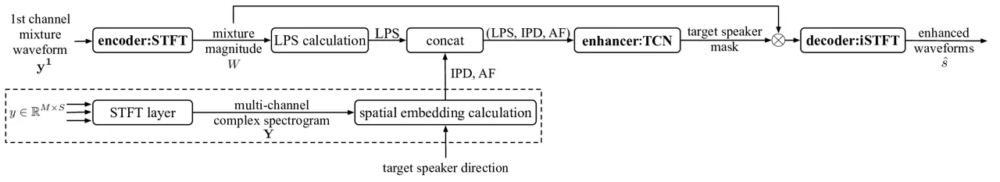
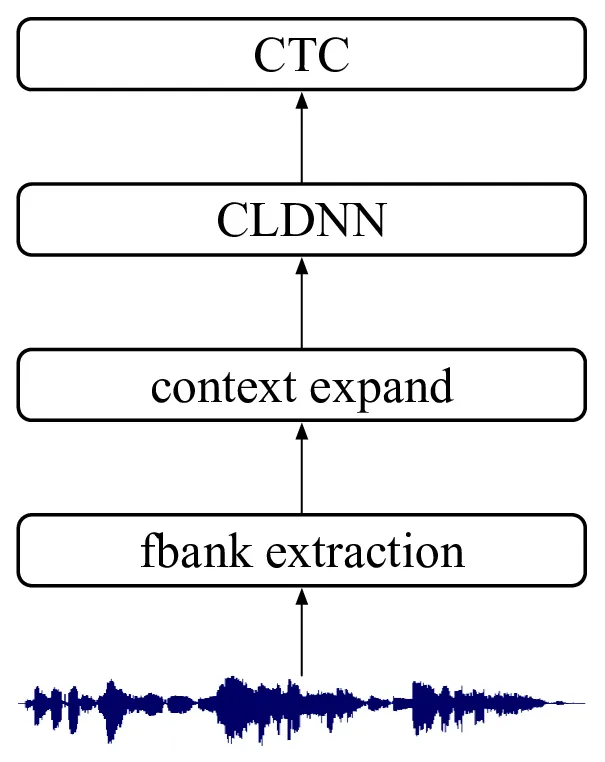
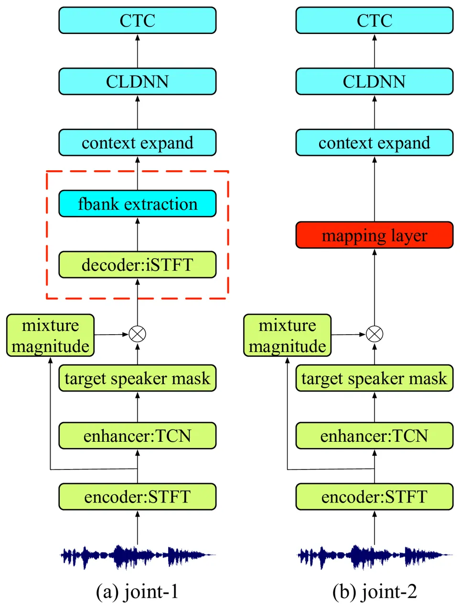
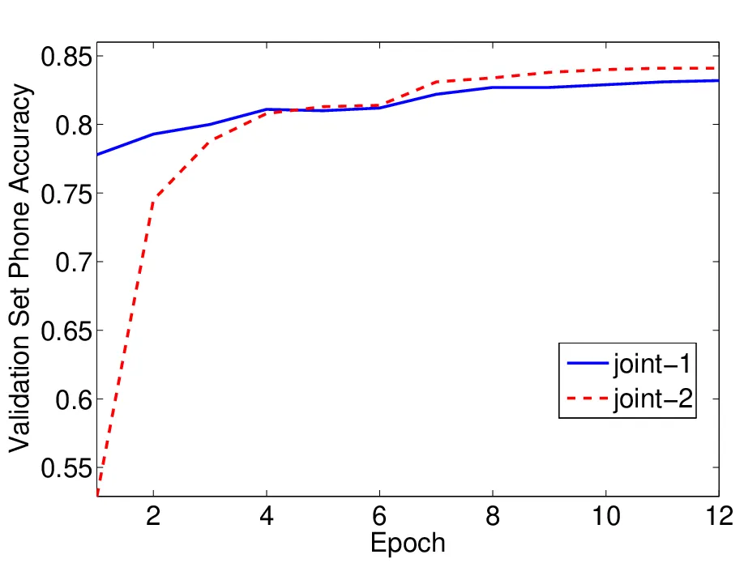

# OVERLAPPED SPEECH RECOGNITION FROM A JOINTLY LEARNED MULTI-CHANNEL NEURAL SPEECH EXTRACTION AND REPRESENTATION

Bo Wu, Meng Yu, Lianwu Chen, Chao Weng, Dan Su, and Dong Yu

###### Abstract

We propose an end-to-end joint optimization framework of a multi-channel
neural speech extraction and deep acoustic model without mel-filterbank
(FBANK) extraction for overlapped speech recognition. First, based on a
multi-channel convolutional TasNet with STFT kernel, we unify the
multi-channel target speech enhancement front-end network and a
convolutional, long short-term memory and fully connected deep neural
network (CLDNN) based acoustic model (AM) with the FBANK extraction
layer to build a hybrid neural network, which is thus jointly updated
only by the recognition loss. The proposed framework achieves 28% word
error rate reduction (WERR) over a separately optimized system on
AISHELL-1 and shows consistent robustness to signal to interference
ratio (SIR) and angle difference between overlapping speakers. Next, a
further exploration shows that the speech recognition is improved with a
simplified structure by replacing the FBANK extraction layer in the
joint model with a learnable feature projection. Finally, we also
perform the objective measurement of speech quality on the reconstructed
waveform from the enhancement network in the joint model.

###### Index Terms: 

End-to-end, joint training, multi-channel TasNet, FBANK, overlapped
speech recognition

^(†)^(†)address: ¹Tencent AI Lab, Shenzhen, China  
²Tencent AI Lab, Bellevue, WA, USA  
{lambowu, raymondmyu, lianwuchen, cweng, dansu, dyu}@tencent.com

## 1 Introduction

In the presence of interfering speakers, target speech is usually
distorted by competing speech signals, causing degradation on speech
quality and intelligibility. Such deterioration can severely affect
automatic speech recognition (ASR). Despite the great progress in deep
learning techniques, conventional ASR systems usually fail in these
adverse conditions. Although many techniques have been developed for
speech enhancement/separation and recognition under these circumstances
\[1, 2, 3, 4\], it still remains one of the most challenging problems in
ASR to date.

Existing literature typically divides the problem into
enhancement/separation and recognition stages, allowing modular research
to be separately conducted. One straightforward approach is to train
separation and recognition models separately in a stage-wise manner, and
in a testing phase, the waveforms or features enhanced by the
enhancement/separation model are then passed to the acoustic model for
recognition \[2, 5\]. Several deep learning based enhancement/separation
methods have been proposed, such as deep clustering \[6\], deep
attractor network \[7\], permutation invariant training \[8\] and TasNet
\[9\]. Additional improvement can be obtained with microphone array
signal processing which utilizes spatial information for source
discrimination. For instance, an end-to-end multi-channel convolutional
TasNet with short-time Fourier transform (STFT) kernel is proposed to
leverage spatial cues for speech separation \[10\]. However, a large
gain in speech quality does not necessarily lead to improvement in
speech recognition due to the speech distortion and damage in the
enhancement stage.

Jointly modeling the front-end enhancement and acoustic model is
therefore a desirable solution for improving speech quality and thus
recognition accuracy in noisy and multi-talker environments. The work in
\[11\] stacks up the separation network, mel-filterbank feature
extraction and acoustic model to construct a deeper and larger DNN in a
monaural setup. Other studies attempt to jointly train enhancement and
acoustic deep models with microphone array speech input signals. For
example, researchers in \[12, 13\] design an architecture for speech
acoustic modeling from raw multi-channel noisy waveform. The work in
\[14, 15\] propose to jointly train a neural beamformer and acoustic
model for noise robust ASR. Nevertheless, overlapped speech is not
considered.



Figure 1: Block diagram of the multi-channel target speech enhancement
network.

In this study, we aim to provide an integrated end-to-end paradigm by
jointly learning multi-channel enhancement and acoustic models for
overlapped speech recognition. Our contribution is two-fold: First,
based on the multi-channel TasNet with STFT kernel \[10\], we present a
joint optimization architecture of multi-channel target speech
enhancement and acoustic model. It has been shown that the model
architecture with objective loss function in convolutional TasNet
improves the speech separation quality significantly \[10\]. More
importantly, this joint learning scheme significantly outperforms the
separately optimized systems. Second, we further replace the decoder
layer for waveform reconstruction and fbank layer for acoustic model
feature extraction by a linear projection layer, i.e., acoustic model
directly takes enhanced signal in STFT domain. This change leads to
improved recognition accuracy and smaller model size, which makes it a
real end-to-end multi-channel acoustic model.

The rest of this paper is organized as follows. We describe the
multi-channel target speech enhancement model and CLDNN based acoustic
model in Section 2. We present two joint model architectures in Section 3. Experimental results are next provided and analyzed in Section 4. We
summarize this paper in Section 5.

## 2 Multi-Channel Enhancement and Acoustic Models

The proposed joint learning consists of two modules: enhancement and
acoustic models, respectively. Our previous work on multi-channel
convolutional TasNet with STFT kernel based target speech enhancement
\[10\] is adopted to recover target speaker’s voice from the
reverberant, noisy and multi-talker mixed signal. A CLDNN based acoustic
model is utilized to predict context-independent phonemes.

### 2.1 Multi-channel target speech enhancement model

The front-end multi-channel enhancement framework is illustrated in Fig.

1. It contains three major parts: an encoder (a fixed STFT convolution
   1-D layer) for encoding input waveform into STFT domain, an enhancer for
   estimating the target speaker mask, and a decoder (a fixed iSTFT
   convolution 1-D layer) for waveform reconstruction. Specifically, (i) A
   reference channel, usually 1st channel waveform $`\bf{y}^{1}`$ is
   transformed to spectral magnitude $`W`$ by encoder layer with STFT
   kernel, which is converted to log-power spectral (LPS) feature. The LPS
   feature vector is then concatenated with inter-channel phase differences
   (IPDs) and target speaker-dependent angle feature (AF) \[16\]. AF
   feature measures the cosine distance between the steering vector of a
   desired direction and IPD:

```math
\text{AF}_{\theta}(t,f)=\overset{K}{\underset{k=1}{\sum}}\frac{\mathbf{e}_{\theta,k}(f)\frac{\mathbf{Y}_{k1}(t,f)}{\mathbf{Y}_{k2}(t,f)}}{\left|\mathbf{e}_{\theta,k}(f)\frac{\mathbf{Y}_{k1}(t,f)}{\mathbf{Y}_{k2}(t,f)}\right|} \tag{1}
```

where $`\mathbf{e}_{\theta,k1}(f)`$ is the steering vector coefficient
for target speaker from $`\theta`$ at frequency _f_, and
$`\mathbf{Y}_{k1}(t,f)/\mathbf{Y}_{k2}(t,f)`$ computes the IPD between
microphone $`k1`$ and $`k2`$. As a result, AF indicates if a speaker
from a desired direction dominates in each time-frequency bin, which
drives the network to extract the target speaker from the mixture. (ii)
A temporal fully-convolutional network (TCN) \[9\] is adopted in the
enhancement network which infers the target speaker mask. (iii) A
decoder is used to reconstruct a single-channel waveform from the
multiplication between mixture magnitude $`W`$ and target speaker mask.

Furthermore, the scale-invariant signal-to-distortion (SI-SNR) is used
as the objective function to optimize the enhancement network which is
defined as:

```math
\text{SI-SNR}:=10\log_{10}\frac{\left\|\mathbf{s}_{\sf target}\right\|_{2}^{2}}{\left\|\mathbf{e}_{\sf noise}\right\|_{2}^{2}} \tag{2}
```

where
$`\mathbf{s}_{\sf target}=\left(\left<\hat{\mathbf{s}},\mathbf{s}\right>\mathbf{s}\right)/\left\|\mathbf{s}\right\|_{2}^{2}`$,
$`\mathbf{e}_{\sf noise}=\hat{\mathbf{s}}-\mathbf{s}_{\sf target}`$, and
$`\hat{\mathbf{s}}`$ and $`\mathbf{s}`$ are the estimated and
reverberant target speech waveforms, respectively. The zero-mean
normalization is applied to $`\hat{\mathbf{s}}`$ and $`\mathbf{s}`$ for
scale invariance. We refer the readers to \[10\] for more details about
the implementation of the multi-channel target speech enhancement model.



Figure 2: Block diagram of the CLDNN acoustic model.

### 2.2 CLDNN acoustic model

Fig. 2 shows the adopted CLDNN acoustic model \[17\]. The waveform-in
system starts with a non-learnable feature extraction network to compute
the single-channel input waveform’s fbanks, and followed with an expand
layer where the central frame is spliced with left and right contextual
frames to leverage acoustic context information. For the architecture of
CLDNN, the concatenated fbank features are first fed into two
convolutional layers each of which contains 180 filters with filter size
of 5. Both convolution and pooling are performed only in frequency axis.
After frequency modeling with convolutional layers is performed, the
outputs are passed to 4 LSTM layers for temporal modeling where each
layer contains 512 hidden dimensions. Finally, we pass the outputs from
LSTMs to two fully connected layers and a softmax layer to predict
context-independent phonemes with the connectionist temporal
classification (CTC) loss function \[18\].

## 3 End-to-End Joint Training

The end-to-end design paradigm \[18\] is of growing interest in several
research areas, such as speech recognition \[4, 19\] and keyword
spotting \[20\]. An integrated end-to-end paradigm by jointly modeling
the front-end enhancement and back-end acoustic model is therefore a
desirable solution for improving ASR robustness in reverberant and
multi-talker environments, since the target speech enhancement is
directly optimized based on the speech recognition loss.

In this paper, we adopt a hybrid deep learning framework to perform
joint training of enhancement network and acoustic modeling for
multi-channel overlapped speech recognition. Two integrated end-to-end
paradigms are depicted in Fig. 3. In line with a recent effort in
end-to-end-modeling \[4\], the front-end enhancement model and acoustic
model can be stacked back-to-back. Therefore, we directly stack the
fbank extraction layer of the CLDNN acoustic model on top of the
enhancement network’s decoder layer in Fig. 3 (a). The output layer of
enhancement model becomes the input layer for acoustic modeling, which
is also a hidden layer of the whole network. The same CTC object
function used to train the acoustic model in Section 2.2 is used to
fine-tune the weights of the joint model. We name this joint model as
joint-1. In Fig. 3 (b), by skipping waveform reconstruction and fbank
calculation, the decoder and feature extraction in the red dash box are
replaced with a linear mapping layer. The projection layer projects the
257 dimensional masked output to a 40 dimensional vector, being
consistent with the conventional fbank dimension. Therefore, this
architecture frees the conventional feature extraction for acoustic
model and realizes a truly end-to-end joint model with trainable
acoustic features which we denote as joint-2 in the following
discussion.



Figure 3: Block diagrams of the proposed joint models.

## 4 Experimental results

### 4.1 Dataset

We simulated a multi-channel reverberant version of two-speaker mixture
data set by AISHELL-1 corpus, which is a public data set for Mandarin
speech recognition \[21\]. A 6-element uniform circular array is used as
the signal receiver, the radius of which is 0.035 m. The target speaker
with known direction of arrival is mixed with a interfering speaker
randomly at signal to interference ratio (SIR) -6, 0 or 6 dB. The
classic image method \[22\] is used to add multi-channel room impulse
response (RIR) to each source in the mixture and reverberation time
(RT60) ranges from 0.05 to 0.5 s. The room configuration
(length-width-height) is randomly sampled from 3-3-2.5 m to 8-10-6 m.
The microphone array and speakers are at least 0.3 m away from the wall.
The distance between microphone array and speakers ranges from 1 m to
5 m. We do not apply any constraints on the direction-of-arrival
differences between speakers, so that our data set contains samples with
the angle difference of two speakers ranging from 0 to 180 degrees.
Moreover, the train, validation and test sets consist 340, 40 and 20
speakers, respectively. There is no overlapping speakers among the three
sets. All data is sampled at 16 kHz.

### 4.2 Feature extraction and system setup

#### 4.2.1 Multi-channel target speech enhancement model

For the encoder and decoder settings, the kernel size and stride are 512
and 256 samples, respectively. The kernel weights are set according to
STFT/iSTFT operation. 257-dimensional LPS feature is extracted based on
the output of STFT kernel from the first channel mixture. 6 IPDs are
extracted between microphone pairs (1, 4), (2, 5), (3, 6), (1, 2), (3, 4) and (5, 6). The target speaker’s direction is assumed to be known for
computing the angle feature (AF), which is feasible particularly with
visual information \[23\].

| AM  | initialized | training data  |                |                |                | test data |         |       |
| --- | ----------- | -------------- | -------------- | -------------- | -------------- | --------- | ------- | ----- |
|     |             | cln.           | rev.           | mix-ch1        | enh            | cln.      | mix-ch1 | enh   |
| A1  | $`\times`$  | $`\checkmark`$ | $`\times`$     | $`\times`$     | $`\times`$     | 11.97     | 88.70   | 38.66 |
| A2  | A1          | $`\checkmark`$ | $`\checkmark`$ | $`\checkmark`$ | $`\times`$     | 13.25     | 76.20   | 37.40 |
| A3  | A1          | $`\times`$     | $`\times`$     | $`\times`$     | $`\checkmark`$ | 16.76     | 91.68   | 30.69 |
| A4  | A1          | $`\checkmark`$ | $`\checkmark`$ | $`\checkmark`$ | $`\checkmark`$ | 13.76     | 83.80   | 29.15 |

Table 1: WER of clean and multi-condition training of CLDNN acoustic
models

#### 4.2.2 CLDNN acoustic model

The architecture of CLDNN is described in Section 2.2. Specifically, a
linear connection layer with 257-dimensional input and 40-dimensional
output is used to extract fbank feature from single-channel waveforms
with 25-ms window length and 10-ms hop size. After global normalization,
the feature vector of the current frame is concatenated with that of the
10 preceding frames and 10 subsequent frames. The CLDNN model starts
with two convolutional layers and then four LSTM layers, each with 512
hidden units, and then two full-connection linear layer plus a softmax
layer. We use context-independent phonemes as the modeling units, which
form 218 classes in our Chinese ASR system.

#### 4.2.3 ASR decoder

A tri-gram language model (LM) is estimated on AISHELL-1 text and
compiled into $`G`$ transducer. The whole decoding graph building
procedure closely follows EESEN \[24\] where $`TLG`$ cascade is a
composition of the token transducer $`T`$ (used to remove the blank and
repeating labels), the lexicon transducer $`L`$ and $`G`$. The ASR
decoder is based on Kaldi \[25\] toolkit with minor modifications to
support CTC acoustic models. The beam width is set to 18 and we use 7000
as maximum number of active tokens during decoding.

### 4.3 Separated training results

First, to obtain an optimal separated system, we train the acoustic
models using different training data and evaluate them on 3 test sets in
Table 1. “cln.”, “rev.”, “mix-ch1” and “enh” denote dry clean signal of
target speaker, reverberant signal of target speaker, first channel of
input signal and enhanced signal, respectively. The front-end
multi-channel target speech enhancement network, denoted as S0, infers a
single-channel output signal “enh” based on 6-channel overlapped noisy
speech. A competitive WER of 11.97% is attained on clean set “cln.” by
acoustic model A1 trained on clean set only. Multi-condition acoustic
models A2, A3 and A4 are initialized with A1. For test on enhanced data
“enh”, we first obtain a WER of 38.66% with clean model A1. Second, by
adding “rev.” and “mix-ch1” into the multi-condition training set, the
WER is slightly improved to 37.40% by A2. Next, the matched acoustic
model A3 trained on “enh” significantly decreases the WER to 30.69%.
Finally, the WER is drastically reduced from the initial 38.66% attained
with A1 down to the best one 29.15% using A4 trained on all
multi-condition sets. 29.15% is considered as the best baseline for the
comparison with joint training approaches.

| system  | SIR (dB) |       |       | angle difference (degree) |       |       |        | avg   |
| ------- | -------- | ----- | ----- | ------------------------- | ----- | ----- | ------ | ----- |
|         | -6       | 0     | 6     | 0-15                      | 15-45 | 45-90 | 90-180 |       |
| sept-A4 | 36.92    | 27.88 | 22.74 | 38.15                     | 28.81 | 27.29 | 26.19  | 29.15 |
| joint-1 | 26.19    | 20.15 | 16.52 | 29.84                     | 20.33 | 18.96 | 18.40  | 20.94 |
| joint-2 | 26.11    | 19.57 | 16.40 | 29.77                     | 20.28 | 18.63 | 18.22  | 20.77 |

Table 2: WER of joint training models

### 4.4 Joint training results

Next, we compare our joint models with the best separated trained system
sept-A4 on data sets with different SIRs and angle differences between
the two overlapping speakers in Table 2. Both joint-1 and joint-2 are
initialized with the above well-trained enhancement model S0 and
acoustic model A4. Batch normalization is applied before context expand
to accelerate convergence and improve model generalization. A
significant WER decrement is achieved from 29.15% in sept-A4 to 20.94%
using joint-1, showing a relative improvement of about 28%. It
demonstrates our proposed joint model’s significant superiority.
Moreover, joint-1 shows stable performances and consistently outperforms
sept-A4 in all SIR and angle difference categories. More importantly, by
replacing waveform reconstruction and fbank extraction in joint-1 with a
linear projection layer in joint-2, WER can be further boosted to
20.77%, even with less model parameters. It implies that the acoustic
features commonly used in acoustic model training is not necessary in
joint training. A detailed comparison between the proposed two joint
models in terms of validation set phone accuracy is also provided in
Fig. 4. It is clear that joint-2 with skipping fbank feature extraction
is worse than joint-1 at the beginning epochs, but converges quickly and
exceeds joint-1.



Figure 4: Validation set phone accuracy of joint training models.

|    wav     |    PESQ |    STOI  |
| ---------- | ------- | -------- |
|    mix-ch1 |    1.85 |    0.699 |
|    enh     |    2.72 |    0.882 |
|    joint-1 |    2.71 |    0.846 |
|    joint-2 |    2.32 |    0.798 |

Table 3: PESQ and STOI results

Finally, we present objective measures on input noisy signal, enhanced
speech, and intermediate enhanced waveform outputs extracted from joint
models in Table 3. For joint-1, the output waveform of the decoder layer
is directly used. For joint-2, although waveform reconstruction is
skipped, we still can apply an external iSTFT operation on the target
speaker masked output to obtain the waveform. Compared with unprocessed
input channel “mix-ch1”, front-end enhancement “enh” significantly
boosts perceptual evaluation of speech quality (PESQ) \[26\] and
short-time objective intelligibility (STOI) \[27\] by 0.87 and 0.183,
respectively. Moreover, although with a slight degradation of speech
quality relative to “enh”, joint-1 can obtain a relative recognition
improvement of about 28% illustrated in Table 2. Furthermore, it is
reasonable that enhanced output from joint-2 shows the worst score,
because no waveform reconstruction constraint exists during the
training. It shows that the optimal ASR loss does not necessarily lead
to the best objective speech quality.

## 5 Conclusions

We propose an integrated end-to-end ASR paradigm by joint training of
multi-channel target speech enhancement and CLDNN based acoustic model
for overlapped speech recognition. Firstly, we directly stack these two
models and jointly adjust their weights with recognition loss. This
joint learning scheme achieves a WER reduction of 28% against a
separately optimized system. Next, recognition accuracy can be further
improved by replacing the decoder and fbank extraction layers with a
linear mapping layer, achieving an end-to-end acoustic model with
trainable enhanced features.

## 6 Acknowledgements

We would like to thank our colleagues Shixiong Zhang, Jun Wang and Yong
Xu for their valuable suggestions and thank the interns Rongzhi Gu, Jian
Wu and Max W.Y. Lam for their code assist.

## References

- \[1\] Chao Weng, Dong Yu, Michael L Seltzer, and Jasha Droppo, “Deep
  neural networks for single-channel multi-talker speech recognition,”
  IEEE/ACM Transactions on Audio, Speech and Language Processing, vol.
  23, no. 10, pp. 1670–1679, 2015.
- \[2\] Jon Barker, Ricard Marxer, Emmanuel Vincent, and Shinji
  Watanabe, “The third CHiME speech separation and recognition
  challenge: dataset, task and baselines,” in IEEE Workshop on Automatic
  Speech Recognition and Understanding (ASRU), 2015, pp. 504–511.
- \[3\] DeLiang Wang and Jitong Chen, “Supervised speech separation
  based on deep learning: an overview,” IEEE/ACM Transactions on Audio,
  Speech, and Language Processing, vol. 26, no. 10, pp. 1702–1726, 2018.
- \[4\] Bo Wu, Kehuang Li, Fengpei Ge, Zhen Huang, Minglei Yang,
  Sabato Marco Siniscalchi, and Chin-Hui Lee, “An end-to-end deep
  learning approach to simultaneous speech dereverberation and acoustic
  modeling for robust speech recognition,” IEEE Journal of Selected
  Topics in Signal Processing, vol. 11, no. 8, pp. 1289–1300, 2017.
- \[5\] Jun Du, Qing Wang, Tian Gao, Yong Xu, Li-Rong Dai, and Chin-Hui
  Lee, “Robust speech recognition with speech enhanced deep neural
  networks,” in Proc. INTERSPEECH, 2014.
- \[6\] John R Hershey, Zhuo Chen, Jonathan Le Roux, and Shinji
  Watanabe, “Deep clustering: Discriminative embeddings for segmentation
  and separation,” in Proc. ICASSP, 2016, pp. 31–35.
- \[7\] Yi Luo, Zhuo Chen, and Nima Mesgarani, “Speaker-independent
  speech separation with deep attractor network,” IEEE/ACM Transactions
  on Audio, Speech, and Language Processing, vol. 26, no. 4, pp.
  787–796, 2018.
- \[8\] Dong Yu, Morten Kolbæk, Zheng-Hua Tan, and Jesper Jensen,
  “Permutation invariant training of deep models for speaker-independent
  multi-talker speech separation,” in Proc. ICASSP, 2017, pp. 241–245.
- \[9\] Yi Luo and Nima Mesgarani, “Conv-tasnet: Surpassing ideal
  time–frequency magnitude masking for speech separation,” IEEE/ACM
  Transactions on Audio, Speech, and Language Processing, vol. 27, no.
  8, pp. 1256–1266, 2019.
- \[10\] Fahimeh Bahmaninezhad, Jian Wu, Rongzhi Gu, Shi-Xiong Zhang,
  Yong Xu, Meng Yu, and Dong Yu, “A comprehensive study of speech
  separation: spectrogram vs waveform separation,” arXiv preprint
  arXiv:1905.07497, 2019.
- \[11\] Zhong-Qiu Wang and DeLiang Wang, “A joint training framework
  for robust automatic speech recognition,” IEEE/ACM Transactions on
  Audio, Speech, and Language Processing, vol. 24, no. 4, pp.
  796–806, 2016.
- \[12\] Yedid Hoshen, Ron J Weiss, and Kevin W Wilson, “Speech acoustic
  modeling from raw multichannel waveforms,” in Proc. ICASSP, 2015, pp.
  4624–4628.
- \[13\] Tara N Sainath, Ron J Weiss, Kevin W Wilson, Arun Narayanan,
  and Michiel Bacchiani, “Factored spatial and spectral multichannel raw
  waveform cldnns,” in Proc. ICASSP, 2016, pp. 5075–5079.
- \[14\] Tsubasa Ochiai, Shinji Watanabe, Takaaki Hori, John R Hershey,
  and Xiong Xiao, “Unified architecture for multichannel end-to-end
  speech recognition with neural beamforming,” IEEE Journal of Selected
  Topics in Signal Processing, vol. 11, no. 8, pp. 1274–1288, 2017.
- \[15\] Yong Xu, Chao Weng, Like Hui, Jianming Liu, Meng Yu, Dan Su,
  and Dong Yu, “Joint training of complex ratio mask based beamformer
  and acoustic model for noise robust asr,” in Proc. ICASSP, 2019, pp.
  6745–6749.
- \[16\] Rongzhi Gu, Lianwu Chen, Shi-Xiong Zhang, Jimeng Zheng, Yong
  Xu, Meng Yu, Dan Su, Yuexian Zou, and Dong Yu, “Neural spatial filter:
  target speaker speech separation assisted with directional
  information,” in Proc. INTERSPEECH, 2019, pp. 4290–4294.
- \[17\] Tara N Sainath, Oriol Vinyals, Andrew Senior, and Haşim Sak,
  “Convolutional, long short-term memory, fully connected deep neural
  networks,” in Proc. ICASSP, 2015, pp. 4580–4584.
- \[18\] Alex Graves, Santiago Fernández, Faustino Gomez, and Jürgen
  Schmidhuber, “Connectionist temporal classification: labelling
  unsegmented sequence data with recurrent neural networks,” in Proc.
  ICML, 2006, pp. 369–376.
- \[19\] Dzmitry Bahdanau, Jan Chorowski, Dmitriy Serdyuk, Philemon
  Brakel, and Yoshua Bengio, “End-to-end attention-based large
  vocabulary speech recognition,” in Proc. ICASSP, 2016, pp. 4945–4949.
- \[20\] Kartik Audhkhasi, Andrew Rosenberg, Abhinav Sethy, Bhuvana
  Ramabhadran, and Brian Kingsbury, “End-to-end asr-free keyword search
  from speech,” IEEE Journal of Selected Topics in Signal Processing,
  vol. 11, no. 8, pp. 1351–1359, 2017.
- \[21\] Hui Bu, Jiayu Du, Xingyu Na, Bengu Wu, and Hao Zheng,
  “AISHELL-1: An open-source mandarin speech corpus and a speech
  recognition baseline,” in Proc. O-COCOSDA, 2017, pp. 1–5.
- \[22\] E.A. Lehmann and A.M. Johansson, “Prediction of energy decay in
  room impulse responses simulated with an image-source model,” The
  Journal of the Acoustical Society of America, vol. 124, no. 1, pp.
  269–277, 2008.
- \[23\] Stéphane Dupont and Juergen Luettin, “Audio-visual speech
  modeling for continuous speech recognition,” IEEE Transactions on
  Multimedia, vol. 2, no. 3, pp. 141–151, 2000.
- \[24\] Yajie Miao, Mohammad Gowayyed, and Florian Metze, “Eesen:
  End-to-end speech recognition using deep rnn models and wfst-based
  decoding,” in Proc. ASRU, 2015, pp. 167–174.
- \[25\] Daniel Povey, Arnab Ghoshal, Gilles Boulianne, Lukas Burget,
  Ondrej Glembek, Nagendra Goel, Mirko Hannemann, Petr Motlicek, Yanmin
  Qian, Petr Schwarz, et al., “The kaldi speech recognition toolkit,” in
  Proc. ASRU, 2011.
- \[26\] ITU-T, Rec. P.862, “Perceptual evaluation of speech quality
  (PESQ): An objective method for end-to-end speech quality assessment
  of narrow-band telephone networks and speech codecs,” Int. Telecommun.
  Union-Telecommun. Stand. Sector, 2001.
- \[27\] Cees H Taal, Richard C Hendriks, Richard Heusdens, and Jesper
  Jensen, “An algorithm for intelligibility prediction of time–frequency
  weighted noisy speech,” IEEE Transactions on Audio, Speech and
  Language Processing, vol. 19, no. 7, pp. 2125–2136, 2011.
