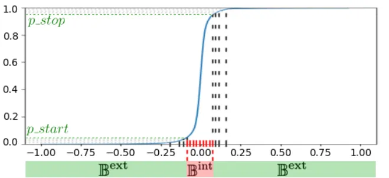
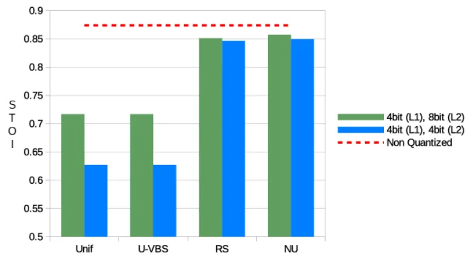

# Memory Requirement Reduction of Deep Neural Networks Using Low-bit Quantization of Parameters

Niccolò Nicodemo^(†)    Gaurav Naithani^(‡)    Konstantinos Drossos^(‡)
Affiliation: Tuomas Virtanen^(‡), and Roberto Saletti^(†)
Affiliation: ^(†){n.nicodemo1@studenti., r.saletti@}unipi.it,
Affiliation: University of Pisa, Italy
Email: [^(‡){firstname.lastname}@tuni.fi,](mailto:%7Bfirstname.lastname%7D@tuni.fi,)
Affiliation: Audio Research Group, Tampere University, Finland

###### Abstract

Effective employment of deep neural networks (DNNs) in mobile devices
and embedded systems is hampered by requirements for memory and
computational power. This paper presents a non-uniform quantization
approach which allows for dynamic quantization of DNN parameters for
different layers and within the same layer. A virtual bit shift (VBS)
scheme is also proposed to improve the accuracy of the proposed scheme.
Our method reduces the memory requirements, preserving the performance
of the network. The performance of our method is validated in a speech
enhancement application, where a fully connected DNN is used to predict
the clean speech spectrum from the input noisy speech spectrum. A DNN is
optimized and its memory footprint and performance are evaluated using
the short-time objective intelligibility, STOI, metric. The application
of the low-bit quantization allows a 50% reduction of the DNN memory
footprint while the STOI performance drops only by 2.7%.

Keywords: neural network quantization, memory footprint reduction, FPGA,
hardware accelerators

## 1 Introduction

Field programmable gate arrays (FPGAs) are widely used in mobile devices
as they allow for the design of highly efficient systems, with
low-latency and low-power requirements. FPGAs are particularly useful
for speeding up signal processing by using specific designed hardware
(called hardware accelerators) to be run in parallel with main CPUs,
usually embedded in the FPGA itself. Deep neural networks (DNNs) often
set the state-of-the-art in many signal processing tasks, e.g., speech
separation \[1, 2, 3\], speech recognition \[4\], etc. However, memory
footprint, memory bandwidth requirements, and the associated power
consumption of DNNs are a issue to be solved for the deployment of a DNN
on an FPGA.

Two main approaches have been used to decrease the memory requirements
for neural networks: i) changing the architecture of the network in
order to reduce the parameter number, and ii) quantizing the parameters
of the network to directly reduce the amount of memory needed for
storing them (i.e. reducing the memory footprint) and the memory
bandwidth needed to read them. The first approach involves methods like
parameter pruning and sharing \[5\], i.e., removing redundant weights or
layers, knowledge distillation \[6\], i.e., retrieving a smaller network
from a pretrained bigger one, and the use of low-rank factorization
\[7\] or specific convolutional filters \[8\]. All these methods produce
networks with less computational needs but require a modification in the
architecture of the network itself. This is less desirable from the
perspective of hardware deployment, since each change in the
architecture affects the hardware design and may mean to design a
specific hardware for a specific architecture. Additionally, all the
above mentioned methods require the optimization of the new DNN
architecture.

The second approach may lead to quantizing the network parameters from
floating-point (e.g. 32-bit) to a $`n`$-bit fixed-point representation.
In FPGAs the parameters of a DNN are usually stored in external memories
(i.e. flash memories). The access time for a flash memory can be a
bottleneck and severely slow down the corresponding calculations for the
DNN. Reducing the number of bits needed to store each DNN parameter
reduces memory requirements and improves the execution speed.
Furthermore, smaller, slower, and cheaper memories can be used by
employing low-bit fixed point arithmetic, resulting in a reduction of
the power consumption also \[9\]. However, the parameter quantization
can lead to a degradation of the DNN performance and very poor results
if too few bits are used (i.e. less than 8) \[10\]. Several quantization
strategies have been tried like normalization \[11\], uniform and
non-uniform quantization for different ranges of values \[12\], using
Minimum Mean Squared Error \[10\], weights clipping and bias
correction \[13\], and per-channel or per-layer different scaling \[13,
14, 15\]. Mixed approaches came up too, like binarized neural
network \[16\], in which weights and activations are forced to -1 and +1
values, requiring a specific architecture and a specific training for
the network.

In this paper we consider the quantization of the weights of a DNN, we
focus on the use-case of FPGAs, and we propose a low-bit quantization
method based on the non-uniform and dynamic quantization methods \[12,
14, 17, 18, 19\]. Our approach distinguishes itself from earlier similar
works by introduction of a virtual bit shift (VBS) scheme that allows
for dynamically adjusting parameter representation for parameter ranges
within the same layer as well as for different layers. VBS mitigates the
drawbacks of fixed-point quantization scheme and increases the accuracy
thereby reducing performance loss. Our method encodes the parameters of
the DNN employing a probabilistic-based and hardware-oriented approach,
using codes that can be stored in slow, external memories, while the
actual values can be kept in FPGA-mapped lookup tables (LUT).
Specifically, we apply a quantization which stores 4-bit codes of the
parameters in external memory, thus reducing the memory footprint up to
50%, if compared to an 8-bit fixed point representation of the
parameters. The quantization technique is applied to a speech separation
task, achieving the aforementioned footprint reduction with a
performance reduction of only 2.7% in terms of STOI. Furthermore, using
4-bit codes reduces the bandwidth requirement too. In fact, halving the
bitwidth of the stored weights halves the bandwidth of the memory
accesses, which often represents a bottleneck of the whole system.

## 2 Proposed Quantization Method

Our method consists in taking as an input the set of parameters
$`\Theta`$ of a deep neural network (DNN), quantizing them with fixed
point values of $`m`$-bit width by applying a non-uniform quantization,
and then encoding the $`m`$-bit values using codes of a $`n`$-bit lookup
table (LUT) that associates the $`n`$-bit wide codes to the $`m`$-bit
wide values. The $`n`$-bit wide codes are stored in an external, slow,
memory and the fixed-point $`m`$-bit wide values of the parameters of
the network are kept in the FPGA memory and are retrieved using the LUT.

### 2.1 Quantization of parameters $`\boldsymbol{\Theta}`$

Any quantization scheme that converts the DNN parameters $`\Theta`$ from
floating to fixed point values leads to quantization errors and
subsequent performance losses. The aim of any such scheme is to reduce
this error to a minimum. As $`\Theta`$ is generally non-uniformly
distributed, it seems appropriate to use a non-uniform scheme. Given
$`\Theta`$, its range can be expressed as $`A=[a^{l},a^{h}]`$, where
$`a^{l}\leq\theta\leq a^{h},\,\theta\in\Theta`$. We can use an $`n`$-bit
encoding scheme for quantizing the range $`A`$ into discrete intervals,
resulting into $`2^{n}`$ intervals
$`\mathbb{B}=\{B_{i}\}_{i=1}^{2^{n}}`$, with
$`B_{i}=[b^{l}_{i},b^{u}_{i}]`$, and
$`b^{u}_{i-1}<b^{l}_{i}<b^{u}_{i}`$. For the purpose of illustration, we
will from now on consider the cumulative distribution of parameters
$`\phi`$, shown in Figure 1, as example of a feedforward network where
the parameter values are clamped to the range $`[-1,1]`$. The
quantization error corresponding to each interval is directly related to
the interval $`\Delta_{i}=b^{u}_{i}-b^{l}_{i}`$. We divide $`A`$ into
two partitions: $`\mathbb{B}^{\text{int}}\subset\mathbb{B}`$ termed as
the _internal_ partition, where the parameters are densely concentrated,
and $`\mathbb{B}^{\text{ext}}\subset\mathbb{B}`$, termed as the
_external_ partition, where the parameters are sparsely concentrated.
The interval span in the $`\mathbb{B}^{\text{ext}}`$ is larger than the
interval span in $`\mathbb{B}^{\text{int}}`$, i.e.
$`B_{i}\in\mathbb{B}^{\text{int}},\,B_{e}\in\mathbb{B}^{\text{ext}}\Rightarrow\Delta_{i}<\Delta_{e}`$,
and $`\mathbb{B}^{\text{int}}\cap\mathbb{B}^{\text{ext}}=\emptyset`$.



Figure 1: Cumulative distribution and partitions

We use uniform quantization in $`\mathbb{B}^{\text{int}}`$ and
non-uniform quantization in $`\mathbb{B}^{\text{ext}}`$. We can define
the ratio of number of intervals in the internal and external partitions
$`R_{\text{B}}=|\mathbb{B}^{\text{int}}|/|\mathbb{B}^{\text{ext}}|`$,
where $`|\cdot|`$ is the number of elements in a set, and the
probability values $`p_{\text{start}}`$ and $`p_{\text{stop}}`$ denoting
the lower and upper boundaries of $`\mathbb{B}^{int}`$, respectively. We
define the number of intervals $`|\mathbb{B}^{\text{int}}|`$ and
$`|\mathbb{B}^{\text{ext}}|`$ as

```math
\displaystyle|\mathbb{B}^{\text{ext}}| \displaystyle=\left\lfloor{\frac{2^{n}}{1+R_{\text{B}}}}\right\rfloor+c\text{, and} \tag{1}
```

```math
\displaystyle|\mathbb{B}^{\text{int}}| \displaystyle=2^{n}-|\mathbb{B}^{\text{ext}}|\text{, \hskip 5.69054pt where} \tag{2}
```

```math
\displaystyle c \displaystyle=\begin{cases}1,&\text{if }\left\lfloor{\frac{2^{n}}{1+R_{\text{B}}}}\right\rfloor\text{ is odd}\\[6.0pt]
0,&\text{if }\left\lfloor{\frac{2^{n}}{1+R_{\text{B}}}}\right\rfloor\text{ is even.}\end{cases} \tag{3}
```

For the external partition, we uniformly split the range of $`\phi`$ and
invert it back to get the set of intervals $`B_{i}^{ext}`$ as

```math
B^{\text{ext}}_{i}=\left[\phi^{-1}(i\cdot\Delta^{\phi}_{i}),\phi^{-1}([i+1]\cdot\Delta^{\phi}_{i})~\right), \tag{4}
```

where
$`\Delta^{\phi}_{i}=\frac{2\cdot p_{\text{start}}}{|\mathbb{B}^{\text{ext}}|}`$
is the interval span in the range of $`\phi`$ and hence the
corresponding $`\Delta_{i}`$ is non uniform. Finally, we uniformly
divide $`\mathbb{B}^{\text{int}}`$ with step
$`\Delta_{i}=\frac{\phi^{-1}(p_{\text{stop}})-\phi^{-1}(p_{{\text{start}}})}{|\mathbb{B}^{\text{int}}|}`$
, thereby obtaining a set of intervals $`B_{i}^{int}`$ as

```math
\begin{split}B^{\text{int}}_{i}=\left[\phi^{-1}(p_{\text{start}})+i\cdot\Delta_{i},\right.\\
~~~~~\left.\phi^{-1}(p_{{start}})+\left(i+1\right)\cdot\Delta_{i}\right).\end{split} \tag{5}
```

For any such interval $`B_{i}`$, the quantized level
$`\tilde{\theta}_{i}`$ can be computed as the $`m`$-bit quantized mean
of the parameters lying in the $`B_{i}`$ interval as,

```math
\displaystyle\tilde{\theta}_{i}={\frac{\sum_{\theta\in\Theta}\mathbbm{1}_{\theta\in B_{i}}\theta}{\sum_{\theta\in\Theta}\mathbbm{1}_{\theta\in B_{i}}}}\Big\arrowvert_{m\text{-bit}}\text{, \hskip 5.69054pt where} \tag{6}
```

```math
\displaystyle\mathbbm{1}_{\Xi}=\begin{cases}1,&\text{if~~}\Xi,\\
0,&\text{otherwise,}\end{cases} \tag{7}
```

and $`\cdot\arrowvert_{m\text{-bit}}`$ means the $`m`$-bit
representation. Using $`\tilde{\theta}_{i}`$ from Eq. (6), we can
quantize the parameters $`\Theta`$ of a DNN with an $`m`$-bit
representation. The finite amount of values assumed by
$`\tilde{\theta}_{i}`$, enables the reduction of the memory word length
from $`m`$ to $`n`$, with $`n<m`$. This is achieved through a lookup
table (LUT) which stores the relationship between the $`n`$-bit code and
its corresponding $`m`$-bit value and partition (i.e. external or
internal). An example of such a LUT is shown in Table 1.

Figure 2: Example with the resolution of quantization $`\Delta_{i}`$
being smaller than the resolution of $`m`$-bit encoding $`\delta_{i}`$.

| Code $` | \_{10}`$   | $`\tilde{\theta}_{i}`$ | Partition |
| ------- | ---------- | ---------------------- | --------- |
| 0000    | -0.3359375 | ext                    |
| 0001    | -0.15625   | ext                    |
| 0100    | -0.0703125 | int                    |
| ⋮       | ⋮          | ⋮                      |

Table 1: LUT of the $`n`$-bit code, the $`m`$-bit wide
$`\tilde{\theta}_{i}`$, and the corresponding partition.

### 2.2 Virtual bit shift

The encoding scheme using $`\mathbb{B}`$ is heavily dependent on the
choice of the parameters $`p_{\text{start}}`$ and $`p_{\text{stop}}`$
(boundaries of $`\mathbb{B}^{\text{int}}`$). The smallest number that
can be represented using signed $`m`$-bit encoding, i.e., the resolution
of the encoding scheme $`\delta_{i}`$, is $`2^{-(m-1)}`$ and hence is
dependent on the bit-width. If the span from $`p_{\text{start}}`$ to
$`p_{\text{stop}}`$ is very narrow, we may end up to an interval span
$`\Delta_{i}`$ smaller than $`\delta_{i}`$. In that case, the adjacent
intervals will map to the same $`m`$-bit value as the resolution of
encoding scheme $`\delta_{i}`$ is less accurate than the interval
partition $`\Delta_{i}`$ . The Figure 2 depicts such a situation, where
$`\tilde{\theta}_{i}`$ and $`\tilde{\theta}_{i+1}`$ are the values for
quantized parameters corresponding to the $`i^{th}`$ and $`i+1^{th}`$
interval, respectively, and that share the same $`m`$-bit
representation. To avoid this there should be,
$`\delta_{i}<\Delta_{i}`$.

We propose a different quantization scheme for
$`\mathbb{B}^{\text{int}}`$. Since $`\delta_{i}`$ depends on the
bit-width of the encoding, a higher resolution can in principle be
achieved by quantizing $`\tilde{\theta}_{i}`$ using $`m+k`$ bits. Since
for all $`\tilde{\theta}_{i}\in\mathbb{B}^{\text{int}}`$, we have
$`\tilde{\theta}_{i}\leq max(abs(\phi^{-1}(p_{start}),\phi^{-1}(p_{stop})))`$,
and variable $`k\in\mathbb{N}`$ can be found so that
$`\tilde{\theta}_{i}<2^{-k}`$. This implies that the $`k`$ most
significant bits will contain either zeros or the sign bit and can be
considered redundant for storage purposes. The sign bit can be stored in
the $`n`$ bit indexing code itself. Storing only $`m`$ least significant
bits from a $`m+k`$-bit representation of $`\tilde{\theta}_{i}`$ can be
thought of as shift of $`k`$ bits to the left which implies
multiplication by $`2^{k}`$ in binary arithmetic. Let us denote $`m`$
least significant bits for $`\tilde{\theta}_{i}`$ as
$`\tilde{\theta}_{i}^{m}`$, so that we have,

```math
\tilde{\theta}^{m}_{i}=\tilde{\theta}_{i}\cdot 2^{k}\text{.} \tag{8}
```

We can store $`\bar{\theta}_{i}^{m}`$, from which the actual parameter
values $`\tilde{\theta}_{i}`$ can be retrieved using Eq. (8). Basically
we perform a range adjustment by virtual bit shift of actual parameter
values. An example of the same is shown in Table 2. The resolution error
can now be avoided by observing a lesser stringent condition than
before, namely, $`\delta_{i}^{m+k}<\Delta_{i}`$, where
$`\delta_{i}^{m+k}`$ is the resolution of $`m+k`$ bit encoding. Thus
absolute values, signs and representation range information can be
stored in the same code and conversion table mapped in a FPGA-embedded
LUT. A $`n`$-bit quantization is obtained in which actual parameter
values are not bounded to uniformly quantized values, but can be chosen
in a proper way in order to reduce errors.

| Code | value      | $`\text{binary value}^{12bit}`$ | LUT value |
| ---- | ---------- | ------------------------------- | --------- |
| 0100 | 0.02099609 | .000001010110                   | 01010110  |

Table 2: An example of LUT with virtual bit shift for $`n`$ = 4, $`m`$ =
8, and $`k`$ = 4.

## 3 DNN-based speech enhancement

We apply the proposed quantization scheme on a speech enhancement task
using a feedforward DNN. Input noisy mixtures are represented using the
magnitude short-time Fourier transform (STFT) and then scaled in order
to properly calculate their magnitude and phase by using a coordinate
rotation digital computer (CORDIC) algorithm \[20\] based on integer
arithmetic. $`N`$ frames,
$`\{\tilde{\mathbf{x}}_{t-N+1},\tilde{\mathbf{x}}_{t-N},\tilde{\mathbf{x}}_{t-N-1}\ldots,\tilde{\mathbf{x}}_{t}\}`$
of these features are first stacked together and then fed to the DNN to
estimate denoised/clean speech magnitude spectrum $`\mathbf{x}_{t}`$.
The stacking of features is done to allow the DNN to implicitly model
temporal dependencies. The CORDIC algorithm is then applied again on
$`\mathbf{x}_{t}`$ to restore phase information extracted from the
mixture features. The values thus obtained are scaled back and converted
back to time domain speech via inverse fast Fourier transform (IFFT) and
overlap-add.

## 4 Evaluation

For evaluation, synthetic mixtures are created using Wall Street Journal
(WSJ0) dataset for speech and TUT Acoustic scenes 2016 development
dataset \[21\] for noise. The latter consists of sound recordings from
15 real-world environments, e.g., cafe, train, metro station, etc. A
random speech signal is selected and an equal-length noise segment is
sampled from the noise signal. The training and validation data consist
of about 12,000 (around 20 hours) and 5000 mixtures ( around 8 hours),
respectively. Similarly, the test data consists of about 2800 mixtures
(around 5 hours). The speech and noise signals are mixed with a randomly
chosen signal to noise ratio (SNR) from the set {0, 5} dB. The native
sampling rate for noise signals is 44.1 kHz which is down-sampled to 8
kHz, the native sampling rate of WSJ0 audio.The short term objective
intelligibility (STOI) \[22\] metric is used as a measure of
intelligibility of enhanced speech.

The STFT features are extracted with Hann window of 128 sample (16 ms)
with 50% overlap. Eight input frames are stacked and fed to a two-layer
feedforward network with 256 and 129 neurons in input and hidden layer,
respectively. The rectified linear unit is used as non-linearity for
each layer. The Adam optimization \[23\] with default parameters is
used. For training networks, PyTorch \[24\] library is used, and for
audio processing, Librosa \[25\] library is used. Since our focus is
fixed point arithmetic devices, the network weights and biases are
clamped to the range (-1, +1) in order to avoid overflow and reduce the
number of bits needed for correct numeric representation in network’s
operations. The DNN weights have been quantized using $`n=4`$, $`m=8`$,
and $`k_{1^{st}layer}=3,`$ $`k_{2^{nd}layer}=2,`$ obtained by choosing
$`ratio=1`$, $`p_{\text{start}}=0.04`$ and $`p_{\text{stop}}=0.96`$. The
$`ratio`$, $`p_{\text{start}}`$ and $`p_{\text{stop}}`$ have been chosen
empirically after optimizing for the test data. The biases used are the
8-bit-uniform quantized values.

|                     |              |                     |                                 |
| ------------------- | ------------ | ------------------- | ------------------------------- |
| Quantization scheme |              |                     |                                 |
| 1^(st) layer        | 2^(nd) layer | STOI/STOI Loss      | Memory usage (bytes) /reduction |
| 8-U                 | 8-U          | 0.87/-0.002 (00.2%) | 297216/    –                    |
| 4-U                 | 4-U          | 0.63/-0.246 (28.2%) | 148608/ -50.0%                  |
| 4-NU                | 4-NU         | 0.85/-0.024 (02.7%) | 148608/ -50.0%                  |
| 4-NU                | 8-U          | 0.86/-0.016 (01.8%) | 165120/ -44.4%                  |
| No quantization     |              | 0.87/    –          |                                 |
| Mix                 |              | 0.84/    –          |                                 |

Table 3: Evaluation results in terms of STOI and memory reduction.
$`m`$-U is for $`m`$-bit uniform and $`m`$-NU for $`m`$-bit non-uniform
quantization. Memory reduction is with respect to 8 bit fixed-point
uniform quantization as reference.


Figure 3: Comparison in terms of STOI performance of different
quantization approaches being swept on first/second DNN layer keeping
the other with 8-bit uniform quantization.

## 5 Results

Table 3 compares the STOI values obtained with different approaches over
2800 noisy samples. 8-bit-uniform quantization gives good results with a
very small degradation in STOI (0.21%) compared to non-quantized
network, while 4-bit-uniform quantization led to a drastic fall in the
performance, obtaining a result that is less intelligible than even the
input noisy signal. On the other hand, the 4-bit non-uniform
quantization proposed in this paper yields better STOI than noisy
mixtures and only 2.7% worse as compared to the non-quantized network
and halving the memory footprint in comparison to the 8-bit uniform
quantization while simultaneously decreasing the memory bandwidth
requirement.

Figure 3 compares the different approaches by using 8-bit quantization
(uniform and non uniform) for different layers, and how the proposed
quantization scheme consisting of range split (RS) and virtual bit shift
(VBS) affects the performance. For each simulation, one of the two layer
is kept at 8-bit uniform quantization while the other is swept between
the following four approaches: uniform quantization (U), uniform
quantization with virtual bit shift (UVBS), range split (RS), and range
split with virtual bit shift (RSVB). It can easily be noticed that for
the first layer sweep, when no VBS is used, how the performance suffers
as $`\delta_{i}>\Delta_{i}`$. Figure 4 shows the effect of these
approaches for two cases: 4-bit quantization for both layers, and, 4-bit
for the first and 8 bit for the second layer.



Figure 4: Comparison in terms of STOI performance of different
quantization approaches with 4/8-bit quantization for first and second
layer.

## 6 Conclusions

This work proposes a low-bit quantization method inspired by the
companding approach that allows the achievement of a good trade-off
between performance and resource requirements in a hardware
implementation of a DNN and is thus very appealing for FPGA
applications. The method does not require any change or pruning of the
network, so no retrain is needed. The case studied shows a two-layer
feed-forward neural network, from which it emerges that a dramatic
reduction of the memory requirements is obtained (50%) with only a
slight reduction of the performance. Further research should concern the
application of the method to deeper networks and the usage of non
symmetrical range split or of a custom multiplying architecture for the
weighting of the input values.

## Acknowledgement

The authors wish to acknowledge CSC-IT Center for Science, Finland, for
computational resources.

## References

- \[1\] Y. Luo and N. Mesgarani, “Conv-tasnet: Surpassing ideal
  time–frequency magnitude masking for speech separation,” _IEEE/ACM
  Transactions on Audio, Speech, and Language Processing_, vol. 27,
  no. 8, pp. 1256–1266, 2019.
- \[2\] D. Wang and J. Chen, “Supervised speech separation based on deep
  learning: An overview,” _IEEE/ACM Transactions on Audio, Speech, and
  Language Processing_, vol. 26, no. 10, pp. 1702–1726, 2018.
- \[3\] Z.-Q. Wang, J. Le Roux, and J. R. Hershey, “Alternative
  objective functions for deep clustering,” in _Proc. IEEE International
  Conference on Acoustics, Speech and Signal Processing (ICASSP)_, 2018,
  pp. 686–690.
- \[4\] C.-C. Chiu, T. N. Sainath, Y. Wu, R. Prabhavalkar, P. Nguyen,
  Z. Chen, A. Kannan, R. J. Weiss, K. Rao, E. Gonina _et al._,
  “State-of-the-art speech recognition with sequence-to-sequence
  models,” in _2018 IEEE International Conference on Acoustics, Speech
  and Signal Processing (ICASSP)_. IEEE, 2018, pp. 4774–4778.
- \[5\] S. Han, H. Mao, and W. J. Dally, “Deep compression: Compressing
  deep neural networks with pruning, trained quantization and huffman
  coding,” _arXiv preprint arXiv:1510.00149_, 2015.
- \[6\] C. Buciluǎ, R. Caruana, and A. Niculescu-Mizil, “Model
  compression,” in _Proceedings of the 12th ACM SIGKDD international
  conference on Knowledge discovery and data mining_. ACM, 2006, pp.
  535–541.
- \[7\] T. N. Sainath, B. Kingsbury, V. Sindhwani, E. Arisoy, and
  B. Ramabhadran, “Low-rank matrix factorization for deep neural network
  training with high-dimensional output targets,” in _2013 IEEE
  international conference on acoustics, speech and signal
  processing_. IEEE, 2013, pp. 6655–6659.
- \[8\] Y. Cheng, D. Wang, P. Zhou, and T. Zhang, “A survey of model
  compression and acceleration for deep neural networks,” _arXiv
  preprint arXiv:1710.09282_, 2017.
- \[9\] W. Dally, “High-performance hardware for machine learning,”
  _NIPS Tutorial_, 2015.
- \[10\] Y. Choukroun, E. Kravchik, and P. Kisilev, “Low-bit
  quantization of neural networks for efficient inference,” _arXiv
  preprint arXiv:1902.06822_, 2019.
- \[11\] R. A. Solovyev, A. A. Kalinin, A. G. Kustov, D. V. Telpukhov,
  and V. S. Ruhlov, “FPGA implementation of convolutional neural
  networks with fixed-point calculations,” _arXiv preprint
  arXiv:1808.09945_, 2018.
- \[12\] E. Park, S. Yoo, and P. Vajda, “Value-aware quantization for
  training and inference of neural networks,” in _Proceedings of the
  European Conference on Computer Vision (ECCV)_, 2018, pp. 580–595.
- \[13\] R. Banner, Y. Nahshan, E. Hoffer, and D. Soudry, “Post training
  4-bit quantization of convolution networks for rapid-deployment,”
  _CoRR, abs/1810.05723_, vol. 1, p. 2, 2018.
- \[14\] J. Qiu, J. Wang, S. Yao, K. Guo, B. Li, E. Zhou, J. Yu,
  T. Tang, N. Xu, S. Song _et al._, “Going deeper with embedded fpga
  platform for convolutional neural network,” in _Proceedings of the
  2016 ACM/SIGDA International Symposium on Field-Programmable Gate
  Arrays_. ACM, 2016, pp. 26–35.
- \[15\] P. Judd, J. Albericio, T. Hetherington, T. Aamodt, N. E.
  Jerger, R. Urtasun, and A. Moshovos, “Reduced-precision strategies for
  bounded memory in deep neural nets,” _arXiv preprint
  arXiv:1511.05236_, 2015.
- \[16\] M. Courbariaux, I. Hubara, D. Soudry, R. El-Yaniv, and
  Y. Bengio, “Binarized neural networks: Training deep neural networks
  with weights and activations constrained to+ 1 or-1,” _arXiv preprint
  arXiv:1602.02830_, 2016.
- \[17\] S. Seo and J. Kim, “Efficient weights quantization of
  convolutional neural networks using kernel density estimation based
  non-uniform quantizer,” _Applied Sciences_, vol. 9, p. 2559, 06 2019.
- \[18\] N. Liss, C. Baskin, A. Mendelson, A. M. Bronstein, and
  R. Giryes, “Efficient non-uniform quantizer for quantized neural
  network targeting reconfigurable hardware,” _arXiv preprint
  arXiv:1811.10869_, 2018.
- \[19\] H. Tann, S. Hashemi, R. I. Bahar, and S. Reda,
  “Hardware-software codesign of accurate, multiplier-free deep neural
  networks,” in _2017 54th ACM/EDAC/IEEE Design Automation Conference
  (DAC)_, June 2017, pp. 1–6.
- \[20\] J. E. Volder, “The cordic trigonometric computing technique,”
  _IRE Transactions on Electronic Computers_, no. 3, pp. 330–334, 1959.
- \[21\] A. Mesaros, T. Heittola, and T. Virtanen, “TUT acoustic scenes
  2016, development dataset,” Feb 2016.
- \[22\] C. H. Taal, R. C. Hendriks, R. Heusdens, and J. Jensen, “A
  short-time objective intelligibility measure for time-frequency
  weighted noisy speech,” in _2010 IEEE International Conference on
  Acoustics, Speech and Signal Processing_. IEEE, 2010, pp. 4214–4217.
- \[23\] D. Kingma and J. Ba, “Adam: A method for stochastic
  optimization,” in _Proc. International Conference on Learning
  Representations_, 2014.
- \[24\] A. Paszke, S. Gross, S. Chintala, G. Chanan, E. Yang,
  Z. DeVito, Z. Lin, A. Desmaison, L. Antiga, and A. Lerer, “Automatic
  differentiation in PyTorch,” in _NIPS Autodiff Workshop_, 2017.
- \[25\] B. McFee _et al._, “librosa 0.5.0,” Feb. 2017. \[Online\].
  Available: https://doi.org/10.5281/zenodo.293021
