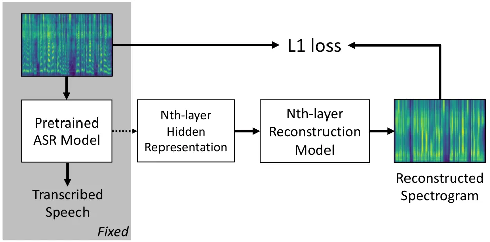
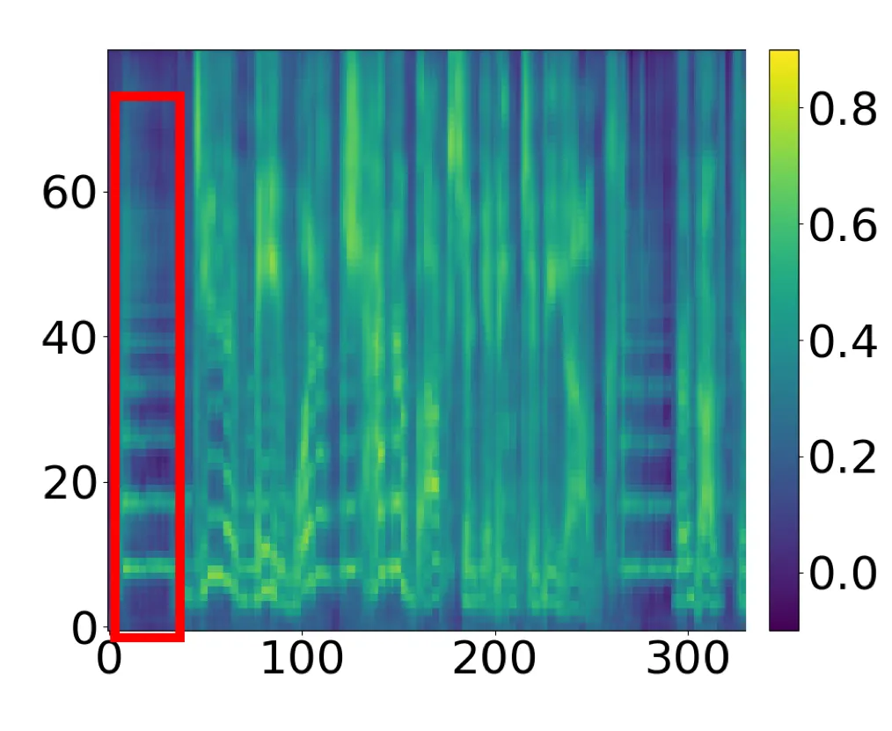
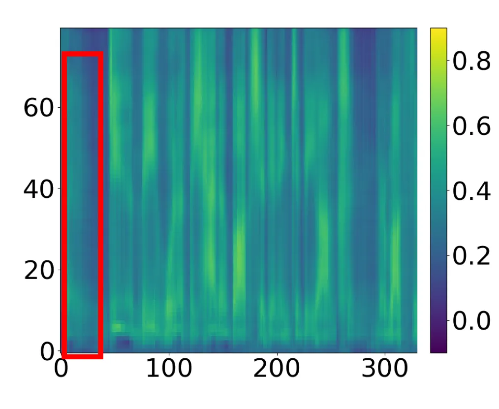
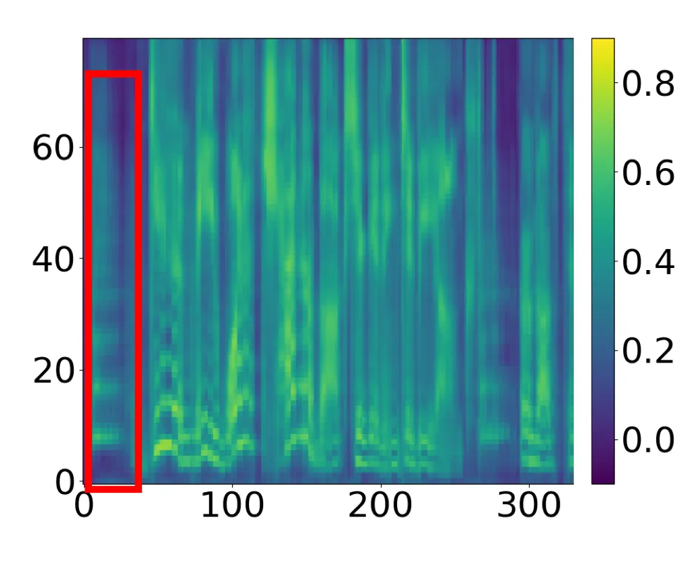
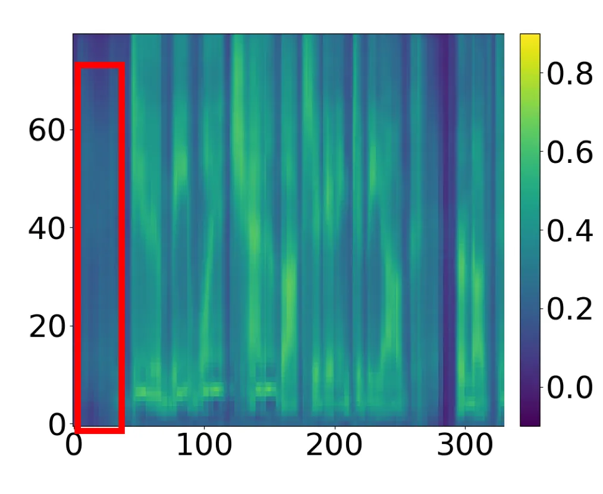
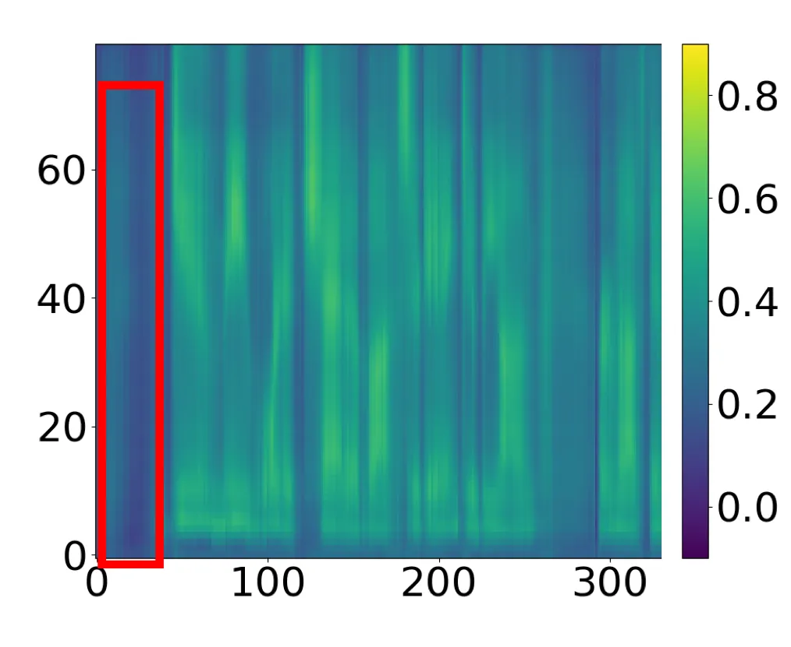

# What does a network layer hear? Analyzing hidden representations of End-to-end ASR through speech synthesis

Chung-Yi Li^(⋆)    Pei-Chieh Yuan^(⋆) ^(†)^(†)thanks: ^(⋆) Two authors
contribute equally.    Hung-Yi Lee

###### Abstract

End-to-end speech recognition systems have achieved competitive results
compared to traditional systems. However, the complex transformations
involved between layers given highly variable acoustic signals are hard
to analyze. In this paper, we present our ASR probing model, which
synthesizes speech from hidden representations of end-to-end ASR to
examine the information maintain after each layer calculation. Listening
to the synthesized speech, we observe gradual removal of speaker
variability and noise as the layer goes deeper, which aligns with the
previous studies on how deep network functions in speech recognition.
This paper is the first study analyzing the end-to-end speech
recognition model by demonstrating what each layer hears. Speaker
verification and speech enhancement measurements on synthesized speech
are also conducted to confirm our observation further.

###### Index Terms: 

automatic speech recognition, end-to-end, analysis, interpretability

^(†)^(†)address: College of Electrical Engineering and Computer Science,
National Taiwan University  
{r07942080,r07922072,hungyilee}@ntu.edu.tw

## 1 Introduction

Traditional ASR systems consist of multiple modules: an acoustic model,
a language model, and a pronunciation lexicon. Each of them is trained
separately and then composed together to perform speech recognition.
Complex training procedures are required to obtain state-of-the-art
results. End-to-end systems, on the other hand, enjoy several benefits
over traditional hybrid systems. The training pipeline is often more
straightforward, and each submodule can be optimized jointly to avoid
error propagation. State-of-the-art results have also been reported
given the vast amount of training data \[1\].

However, the black-box nature of end-to-end systems prohibits
researchers from analyzing the functionality of every single module,
e.g., in what layer does the network perform denoising, remove speaker
information, or extract linguistic features? This has led the community
to develop various techniques to dissect end-to-end systems, with the
hope of better comprehending the complex, highly nonlinear
transformations inside the network. Previous research analyzing
end-to-end ASR involves investigating the underlying phonetic
representations learned in the course of training \[2, 3, 4\].
Interpretable filters with SincNet \[5\] is proposed and shown capable
of removing noise after training.

Visualization of model internals is a widely considered way to analyze
deep networks. Examples include visualizing filters in CNNs \[6\],
plotting saliency maps \[7\], or drawing alignments learned by
attention-based sequence-to-sequence models in end-to-end ASR \[8\].
Visualization of convolutional kernels is natural for image-related
tasks, which led us to wonder whether we can ”audify” hidden layers in a
similar way, namely, to hear what the layers hear. While the studies
above provide fruitful insight regarding the working mechanism of
end-to-end systems, approaches utilizing perception other than vision
have yet to be discovered.



Figure 1: Illustration of the proposed speech reconstruction method
applied on hidden representations of the ASR model.

We propose an intuitive and interpretable method of studying what
network layers in end-to-end ASR ”hear” when transcribing speech. This
is done via reconstructing the input speech from hidden layers of a
trained end-to-end ASR system, as shown in figure 1. The experimental
results show that the information of speaker characteristics and noise
is gradually discarded in each layer, and representations of the same
linguistic content spoken by different speakers and under various
recording conditions are normalized, which is in line with previous
findings \[2\].

To the best of our knowledge, this is the first study to analyze the
behavior inside end-to-end ASR models with speech reconstruction from
the hidden representations of the network. We strongly recommend the
readers to listen to the recovered samples on the demo page ¹¹ 1
https://yuanpj.github.io/Voice-in-ASR/.

## 2 Methodology

### 2.1 End-to-end ASR Systems

To describe our proposed method, we first introduce an end-to-end
automatic speech recognition paradigm to be analyzed and define
notations in use.

With the goal of investigating different aspect of input signal
preserved by the end-to-end ASR in mind, we denote the speech data $`x`$
to be composed of three different components: the linguistic content
$`z`$, the identity of the speaker $`s`$ and any other information
present in the audio signal $`n`$ such as recording conditions. Given
the paired training data $`x`$ and $`z`$, an end-to-end ASR model can be
treated as a function $`z=ASR(x)`$ which transcribes speech to text.
Further more, for the $`k`$-th layer of our interest to synthesize
speech, we denote the hidden representation $`h_{k}=ASR_{k}(x)`$.

### 2.2 Probing Model

In this section, we present our approach of probing model internals
through reconstruction.

With hidden representations $`h_{k}`$ extracted from the $`k`$-th layer
of ASR, our probing model is trained to recover the input speech using
simple feed-forward networks. Formally, let the probing model be
$`D_{k}`$ and $`\tilde{x}`$ being the synthesized speech, our
synthesizer can be trained with the standard reconstruction loss:

```math
\mathcal{L_{\text{recon}}}=\|\tilde{x}-x\|,\quad\tilde{x}=D_{k}(h_{k}). \tag{1}
```

Since ASR models extract only the linguistic content $`z`$ inside the
input speech, speaker characteristics $`s`$ and noises $`n`$ are
discarded in the hidden representations $`h_{k}`$. The reconstruction
loss thus acts as a surrogate for measuring the loss of $`s`$ and $`n`$.
Let $`\tilde{s}_{k}`$ and $`\tilde{n}_{k}`$ be the amount of information
left in $`h_{k}`$. $`\mathcal{L}_{recon}`$ is therefore a proxy of the
difference between $`\{s,n\}`$ and $`\{\tilde{s}_{k},\tilde{n}_{k}\}`$.

Note that our probing model are made non-contextual, and observe simply
the current frame representation. We avoid using attention-based models
like Tacotron \[9\] where every output frame has access to the whole
input signal. This ensures that our probing model faithfully convey
information left in the intermediate representations learned by the
speech-to-text model.

### 2.3 Measuring the voice of each layer

Once we are able to synthesize speech using probing model, we can
directly adopt various metrics evaluated on the raw waveform to analyze
the intermediate representations of end-to-end ASR. For instance,
speaker verification can be conducted to measure the amount of speaker
information present in the hidden layers; metrics evaluating performance
of speech enhancement models such as perceptual evaluation of speech
quality(PESQ)\[10\] and short-time objective intelligibility(STOI)
\[11\] can also be employed to determine the denoising capability of
noise-robust ASR.

## 3 Experiments

### 3.1 Experimental Setup

Data sets We use the train-clean-100 subset of LibriSpeech \[12\] as our
clean set for training and the dev-clean and test-clean subset is used
for development and evaluation. We also augment the clean training set
with MUSAN\[13\] corpus in the settings roughly following that of
X-Vector\[14\] as our noisy set and mix the test-clean set with noises
at fixed SNR ratio (20, 10, 0dB).

| Model    | Augmentation | WER (%)   |            |
| -------- | ------------ | --------- | ---------- |
|          |              | dev-clean | test-clean |
| LSTM     | No           | $`30.72`$ | $`30.98`$  |
| LSTM     | Yes          | $`25.23`$ | $`25.45`$  |
| VGG-LSTM | No           | $`29.02`$ | $`29.55`$  |
| VGG-LSTM | Yes          | $`22.64`$ | $`22.51`$  |

Table 1: Speech recognition word error rates on LibriSpeech with 100
hours of training data.

E2E ASR Models We explore two ASR architectures in the experiments. One
is a VGG-LSTM model similar to \[15\], which is comprised of 4
convolutional layers and 5 bidirectional long short-term memory (LSTM)
layers. Each convolutional layer is followed by a ReLU activation layer
and max-pooing is applied every 2 convolutional layers. The other one is
a pure-LSTM model, which has only 5 bidirectional LSTM layers, with
downsampling performed after 2, 3 and 4-th layer. The input to the
models is 80-dimensional mel-spectrograms. Deltas and accelerations are
added and stacked along the channel dimension. Both models are trained
with Connectionist Temporal Classification(CTC) loss. Table 1 shows the
achieved WER(%) of the models. We take the models trained on clean set
without augmentation data as our baseline ASR models, and the ones
trained on noisy set are our noise-robust ASR models.

Probing Model A 4-layered Highway network is used for probing model of
all hidden layers. Hidden states of downsampled layers are first
up-sampled back by a linear projection then fed into the Highway
network. The model is trained to minimize L1 loss between the
synthesized and the original mel-spectrograms.

|       |       |          | VGG-LSTM |       |       |        |        |        | pure-LSTM |        |        |        |        |
| ----- | ----- | -------- | -------- | ----- | ----- | ------ | ------ | ------ | --------- | ------ | ------ | ------ | ------ |
|       | SNR   | type     | cnn1     | cnn2  | cnn4  | blstm1 | blstm3 | blstm5 | blstm1    | blstm2 | blstm3 | blstm4 | blstm5 |
| \(a\) | clean | robust   | 4.38     | 4.68  | 7.18  | 16.48  | 30.03  | 48.07  | 6.92      | 12.63  | 23.92  | 33.55  | 46.85  |
| \(b\) |       | baseline | 4.47     | 4.72  | 6.76  | 16.20  | 32.87  | 48.12  | 7.03      | 13.97  | 23.26  | 34.55  | 47.49  |
| \(c\) | 20 dB | robust   | 5.80     | 6.27  | 9.23  | 18.11  | 30.40  | 47.75  | 8.44      | 14.97  | 24.98  | 33.80  | 47.07  |
| \(d\) |       | baseline | 5.80     | 6.19  | 9.21  | 18.85  | 33.28  | 47.82  | 8.84      | 17.65  | 25.37  | 35.53  | 47.54  |
| \(e\) | 10 dB | robust   | 9.81     | 10.75 | 13.87 | 20.87  | 30.49  | 47.37  | 13.89     | 19.66  | 25.93  | 33.79  | 46.85  |
| \(f\) |       | baseline | 9.89     | 10.92 | 15.00 | 24.00  | 36.75  | 47.48  | 14.64     | 24.31  | 30.06  | 37.83  | 47.03  |
| \(g\) | 0 dB  | robust   | 23.15    | 24.63 | 28.62 | 31.50  | 34.91  | 46.22  | 29.14     | 33.15  | 33.69  | 38.46  | 46.21  |
| \(h\) |       | baseline | 23.18    | 25.27 | 29.80 | 37.66  | 44.56  | 48.13  | 30.54     | 39.90  | 42.10  | 45.41  | 47.89  |

Table 2: EER results obtained by the ThinResNet\[16\] on the
reconstructed speech utterances.

For post-processing, we obtain linear spectrograms by applying
pseudo-inverse on generated mel-filterbanks, and then use the
Griffin-Lim reconstruction algorithm to generate speech waveform.

### 3.2 Speaker Information

Objective evaluation. Two speaker verification systems in the previous
study are implemented to quantify the amount of speaker information of
recovered speech. The first model, following \[17\], which is a
LSTM-based neural architecture, maps a sequence of variable-length
mel-spectrogram frames to a fixed-dimensional embedding and is trained
using the generalized end-to-end(GE2E) loss function. The second model,
ThinResNet\[16\] is composed of a modified ResNet architecture, which
extracts the features from the spectrogram of a speech utterance, and a
NetVLAD/GhostVLAD\[18\] layer to aggregate the features along the
temporal axis to an embedding.

Both models are trained on the VoxCeleb2\[19\] dataset, which is
comprised of 1 million utterances from 6000 different speakers, and can
achieve 4.51%, 3.34% EER respectively on the test-clean split of
LibriSpeech\[12\] dataset.

We reconstruct a bunch of speech utterances from every layer of the 4
kinds of ASR models. Then we randomly sample the same number of positive
and negative pairs to test the above two speaker verification models to
estimate the amount of speaker information. The results are shown in
Table 2 (We only present the results from ThinResNet because the results
from two speaker verification models are quite similar.) The two big
columns represent the ASR network architectures, and from left to right
is from the top layer to the deepest layer. Rows(a, c, e, g) mean that
we take the speech at different SNR ratio as the robust VGG-LSTM or
pure-LSTM inputs, while rows(b, d, f, h) are to feed the baseline ASR
models. If we listen to the recovered speech, we can directly recognize
that utterances of different speakers from the deeper layer become more
indistinguishable from each other than shallower layer. Meanwhile, the
EER values are increased along the layers of all models, meaning that
the speaker characteristics are gradually removed out steps by steps.

In comparison between the EER of two network architecture, we found that
the cnn part of VGG-LSTM slightly influences the speaker information of
hidden representation, while the lstm parts of both architecture
seriously wipe out the speaker information.

It’s worth noting that although both the baseline and robust ASR models
have similar EER when the inputs are clean, robust ASR can achieve
better EER under noisy conditions. This could be attributed to the
ability of robust models to remove the interference of other speakers in
noisy speech.

(a) Speaker Verification

(b) Human Test

Figure 2: Evaluation on robust VGG-LSTM ASR

Subjective evaluation. We also perform a human evaluation test to ensure
that the measurement of speaker verification models on the reconstructed
speech is consistent with that performed by human beings. The recovered
speech is reconstructed from the hidden representations of well-trained
robust VGG-LSTM ASR model. For the speaker verification measurements, we
sample the same number of positive and negative reconstructed speech
utterance pairs out of 6 layers, to test the two speaker verification
models which will be described in the section 3.2. For the human
evaluation test, we randomly sample 10 recovered speech utterance
triplets (two from the same speaker, one from another) of 6 layers.
Subjects first listen to two speech utterances from different speakers,
and then listen to the third one and answer which speaker is same as the
third one. Human error rate(HER) calculates subjects’ mean error rate of
the triplets from same layers. Figure 2 shows the result of the robust
VGG-LSTM ASR model. In Figure 2(a), the EER of both the speaker
verification measurement remain low before blstm1, but then the values
are dramatically increased at blstm3 and blstm5.

Results of subjective test Figure 2(b) are consistent with that of
speaker verification models. Most people can verify the correct speaker
before blstm1. However, the reconstruct utterances from deeper layers
are also hard for people to verify, so the HER also greatly rises after
blstm1.


(a) Reference Speech



(b) Baseline (blstm1)



(c) Baseline (blstm3)


(d) Baseline (blstm5)


(e) Corrupted Speech



(f) Noise-Robust (blstm1)



(g) Noise-Robust (blstm3)



(h) Noise-Robust (blstm5)

Figure 3: 80-dimensional mel-spectrograms generated by the probing model
of (b)(c)(d) baseline VGG-LSTM and (f)(g)(h) noise-robust VGG-LSTM.
Removal of noises (piano music) are most prominent in layer blstm1,
highlighted by red bounding boxes. As observed in the figure, noises are
still present in (b), but are mostly wiped out in (f).

Figure 4: Speech quality measurement of synthesized speech using STOI.

### 3.3 Noise Information

In this section, we compare intermediate representations learnt by
baseline models and that of their noise-robust counterparts trained on
noise-augmented samples. \[20, 21\] proposed learning noise-invariant
representation for automatic speech recognition, which makes us curious
about whether models trained with distorted audio samples automatically
learns to draw noisy and clean inputs closer together in the hidden
layers. In Figure 4 we report STOI on baseline and robust ASR. We
observe an inevitable drop of STOI in both baseline and robust VGG-LSTM.
This can be attributed to the loss of speaker information and subsequent
degradation of intelligibility. However, the gap of STOI between
baseline and robust ASR widens starting from blstm1 all the way to
blstm5. We suspect that in our models, first few layers of LSTM serves
the purpose of removing the background noise information. Visualization
of the mel-spectrograms generated by our probing model further supports
the claim. In Figure 3, our probing model, taking the blstm1 layer of
noise-robust VGG-LSTM as input, which is asked to reconstruct both noisy
and clean speech, failed to recover the corrupted speech in figure 3(e),
demonstrating that noise-robust ASR successfully eliminates added noise
in its hidden representation.

## 4 Conclusion

In this paper, we seek to answer the question of what a neural network
layer hear through directly recovering speech from hidden
representations of end-to-end ASR model. We demonstrate that properties
of hidden layers can be interpreted and synthesized into the form
perceptible by human other than vision, thanks to the task nature of
ASR. Various measures including subjective and objective test are
conducted on synthesized speech, and evaluation of speaker variability
and noise robustness show findings highly consistent with the
literature, demonstrating the effectiveness of the proposed approach.

## References

- \[1\] Daniel S. Park, William Chan, Yu Zhang, Chung-Cheng Chiu, Barret
  Zoph, Ekin D. Cubuk, and Quoc V. Le, “SpecAugment: A Simple Data
  Augmentation Method for Automatic Speech Recognition,” in Proc.
  Interspeech 2019, 2019, pp. 2613–2617.
- \[2\] Abdel rahman Mohamed, Geoffrey E. Hinton, and Gerald Penn,
  “Understanding how deep belief networks perform acoustic modelling,”
  2012 IEEE International Conference on Acoustics, Speech and Signal
  Processing (ICASSP), pp. 4273–4276, 2012.
- \[3\] Tasha Nagamine, Michael L Seltzer, and Nima Mesgarani,
  “Exploring how deep neural networks form phonemic categories,” in
  Sixteenth Annual Conference of the International Speech Communication
  Association, 2015.
- \[4\] Yonatan Belinkov, Ahmed Ali, and James Glass, “Analyzing
  Phonetic and Graphemic Representations in End-to-End Automatic Speech
  Recognition,” in Proc. Interspeech 2019, 2019, pp. 81–85.
- \[5\] Mirco Ravanelli and Yoshua Bengio, “Interpretable convolutional
  filters with sincnet,” arXiv preprint arXiv:1811.09725, 2018.
- \[6\] Matthew D Zeiler and Rob Fergus, “Visualizing and understanding
  convolutional networks,” in European conference on computer vision.
  Springer, 2014, pp. 818–833.
- \[7\] Karen Simonyan, Andrea Vedaldi, and Andrew Zisserman, “Deep
  inside convolutional networks: Visualising image classification models
  and saliency maps,” CoRR, vol. abs/1312.6034, 2013.
- \[8\] William Chan, Navdeep Jaitly, Quoc Le, and Oriol Vinyals,
  “Listen, attend and spell: A neural network for large vocabulary
  conversational speech recognition,” in 2016 IEEE International
  Conference on Acoustics, Speech and Signal Processing (ICASSP). IEEE,
  2016, pp. 4960–4964.
- \[9\] Yuxuan Wang, R.J. Skerry-Ryan, Daisy Stanton, Yonghui Wu, Ron J.
  Weiss, Navdeep Jaitly, Zongheng Yang, Ying Xiao, Zhifeng Chen, Samy
  Bengio, Quoc Le, Yannis Agiomyrgiannakis, Rob Clark, and Rif A.
  Saurous, “Tacotron: Towards end-to-end speech synthesis,” in Proc.
  Interspeech 2017, 2017, pp. 4006–4010.
- \[10\] Antony W Rix, John G Beerends, Michael P Hollier, and Andries P
  Hekstra, “Perceptual evaluation of speech quality (pesq)-a new method
  for speech quality assessment of telephone networks and codecs,” in
  2001 IEEE International Conference on Acoustics, Speech, and Signal
  Processing. IEEE, 2001, vol. 2, pp. 749–752.
- \[11\] Cees H Taal, Richard C Hendriks, Richard Heusdens, and Jesper
  Jensen, “An algorithm for intelligibility prediction of time–frequency
  weighted noisy speech,” IEEE Transactions on Audio, Speech, and
  Language Processing, vol. 19, no. 7, pp. 2125–2136, 2011.
- \[12\] Vassil Panayotov, Guoguo Chen, Daniel Povey, and Sanjeev
  Khudanpur, “Librispeech: an asr corpus based on public domain audio
  books,” in 2015 IEEE International Conference on Acoustics, Speech and
  Signal Processing (ICASSP). IEEE, 2015, pp. 5206–5210.
- \[13\] David Snyder, Guoguo Chen, and Daniel Povey, “Musan: A music,
  speech, and noise corpus,” arXiv preprint arXiv:1510.08484, 2015.
- \[14\] David Snyder, Daniel Garcia-Romero, Gregory Sell, Daniel Povey,
  and Sanjeev Khudanpur, “X-vectors: Robust dnn embeddings for speaker
  recognition,” in 2018 IEEE International Conference on Acoustics,
  Speech and Signal Processing (ICASSP). IEEE, 2018, pp. 5329–5333.
- \[15\] Takaaki Hori, Shinji Watanabe, Yu Lin Zhang, and William Chan,
  “Advances in joint ctc-attention based end-to-end speech recognition
  with a deep cnn encoder and rnn-lm,” in INTERSPEECH, 2017.
- \[16\] J. S. Chung A. Zisserman W. Xie, A. Nagrani, “Utterance-level
  aggregation for speaker recognition in the wild.,” in ICASSP,
  2019, 2019.
- \[17\] L. Wan, Q. Wang, A. Papir, and I. L. Moreno, “Generalized
  end-to-end loss for speaker verification,” in 2018 IEEE International
  Conference on Acoustics, Speech and Signal Processing (ICASSP), April
  2018, pp. 4879–4883.
- \[18\] Y. Zhong, R. Arandjelović, and A. Zisserman, “GhostVLAD for
  set-based face recognition,” in Asian Conference on Computer
  Vision, 2018.
- \[19\] A. Zisserman J. S. Chung\*, A. Nagrani\*, “Voxceleb2: Deep
  speaker recognition.,” in INTERSPEECH, 2018, 2018.
- \[20\] Dmitriy Serdyuk, Kartik Audhkhasi, Philémon Brakel, Bhuvana
  Ramabhadran, Samuel Thomas, and Yoshua Bengio, “Invariant
  representations for noisy speech recognition,” arXiv preprint
  arXiv:1612.01928, 2016.
- \[21\] Davis Liang, Zhiheng Huang, and Zachary C Lipton, “Learning
  noise-invariant representations for robust speech recognition,” in
  2018 IEEE Spoken Language Technology Workshop (SLT). IEEE, 2018, pp.
  56–63.
