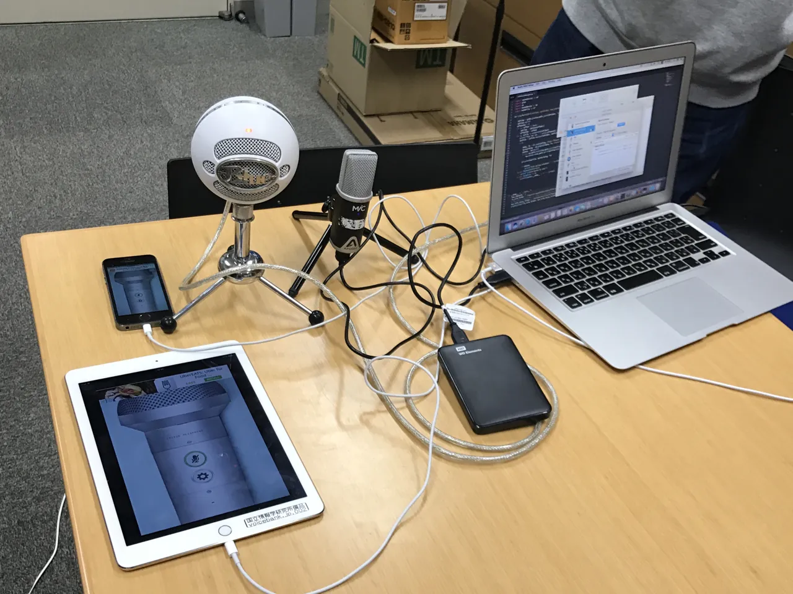

# Transformation of low-quality device-recorded speech to high-quality speech using improved SEGAN model

###### Abstract

Nowadays vast amounts of speech data are recorded from low-quality
recorder devices such as smartphones, tablets, laptops, and
medium-quality microphones. The objective of this research was to study
the automatic generation of high-quality speech from such low-quality
device-recorded speech, which could then be applied to many
speech-generation tasks. In this paper, we first introduce our new
device-recorded speech dataset then propose an improved end-to-end
method for automatically transforming the low-quality device-recorded
speech into professional high-quality speech. Our method is an extension
of a generative adversarial network (GAN)-based speech enhancement model
called speech enhancement GAN (SEGAN), and we present two modifications
to make model training more robust and stable. Finally, from a
large-scale listening test, we show that our method can significantly
enhance the quality of device-recorded speech signals.

###### Index Terms: 

Audio transformation, speech enhancement, generative adversarial
network, speech synthesis

^(†)^(†)address: ¹Özyeğin University, Turkey, ²National Institute of
Informatics, Japan, ³University of Edinburgh, UK  
saeed.sarfjoo@ozu.edu.tr,
{wangxin,gustav,jaime,takaki,jyamagis}@nii.ac.jp

## 1 Introduction

Using high-quality speech recordings is essential in various
speech-generation tasks such as speech synthesis and voice conversion.
Currently, a large amount of speech-content sources, such as YouTube,
podcasts, lecture videos, and audio stories, is available on the Web.
Typically, such content is recorded in non-professional acoustic
environments such as homes and offices. Moreover, the recordings are
often carried out using consumer devices such as smartphones, tablets,
and laptops. Therefore, the speech recordings of the content are of
typically poor quality and contain a large amount of ambient noise and
room reverberation. Even if the recordings are done under quiet
conditions, they may still present low-quality standards due to using
recording hardware with bad frequency characteristics and/or
inappropriate bandwidth settings. In real applications, such as speaker
adaptation of speech synthesis or voice conversion, we have to handle
such non-ideal data in the wild; thus, we have to generate high-quality
speech outputs. This objective may sound contradictory; however, there
is a strong demand to achieve it. In this paper, we call this
low-quality speech recorded using consumer devices “device-recorded
speech”.

One possible solution is the transformation from device-recorded speech
to high-quality speech before voice conversion occurs or before the
speech-synthesis models are trained, and this may be approached from two
different directions \[1\]. One direction of handling device-recorded
speech is to apply speech-enhancement techniques for denoising \[2, 3,
4\], dereverbration \[5, 6\], decoloration \[7\], or bandwidth expansion
\[8\].

However, speech-enhancement techniques do not always handle quality
degradation caused by hardware with bad frequency characteristics. We
have to enhance clean but poor-quality speech recordings using hardware
with bad frequency characteristics to high-fidelity speech. Therefore,
the second direction is data-driven, non-linear, direct mapping from
device-recorded speech to high-fidelity speech using machine-learning
techniques such as deep learning \[9\].

In this paper, we propose a deep-learning-based method to transform
low-quality device-recorded speech to high-quality speech. To that end,
we recorded a new variant of the voice cloning toolkit (VCTK) dataset
\[10\]: device-recorded VCTK (DR-VCTK), where the high-quality speech
signals recorded in a semi-anechoic chamber using professional audio
devices are played back and re-recorded in office environments using
relatively inexpensive consumer devices. Using the parallel database of
the original VCTK and DR-VCTK, we can try the mapping between
device-recorded and high-quality audio. Since the VCTK database includes
a sufficient amount of speech data and we hypothesize that degradation
due to frequency characteristics of microphones and loudness speakers,
as well as degradation due to noise and reverberation, is beyond what is
assumed with normal speech enhancement, we use deep-learning techniques
for the new mapping problem instead of signal-processing techniques such
as Wiener filtering \[11\].

The chosen neural-network-mapping model is the recently proposed speech
enhancement generative adversarial network (SEGAN) \[12\], which is an
end-to-end model for directly enhancing the noisy speech in the time
domain. This is in contrast to previous DNN-based speech-enhancement
techniques, which are based on short-time Fourier analysis/synthesis.
Rethage’s speech denoising model \[13\] and WaveMedic \[14\] are other
time domain-based speech enhancers that use the WaveNet model \[15\] for
enhancing the degraded speech signal. However, unlike Wavenet, SEGAN is
a regression model and consists of a convolutional network architecture
trained using the GAN criterion \[16\]. Using this time domain-based
architecture, we can expect that the phase spectrum of the noisy signal
may be transformed into the clean phase spectrum, and that it may have a
good effect in improving speech quality \[17\]. The use of a GAN may
also alleviate the over-smoothing problem and improve the quality of
enhanced speech.

In our preliminary experiments, however, we found that even the recent
SEGAN is negatively affected when mapping from device-recorded speech to
high-quality speech recorded in a semi-anechoic chamber using
professional devices. Therefore, we propose a new training procedure for
the SEGAN model to improve the final quality of enhanced speech. The key
of the proposed method is to use directed references for training SEGAN
at the initial training epochs. By using this directed reference for
training the generator model, we can achieve better weight
initialization; thus, we were able to robustly and quickly train the
generator model. We also found that this method significantly reduces
the appearance of annoying artifacts called “musical noise”, something
that conventional-speech-enhancement methods are commonly affected by.
The performance of the proposed method was evaluated through objective
and subjective experiments.

This paper is structured as follows: We introduce the new DR-VCTK
dataset in Section 2. In Section 3, we describe SEGAN model for speech
enhancement. We describe the proposed training procedure of SEGAN in
Section 4 and the experimental setup and objective and subjective
evaluation results in Section 5. Finally, we give conclusions and
discuss future work in Section 6.

## 2 Device-recorded VCTK

We used the centre for speech technology research (CSTR) VCTK corpus
\[10\] as the clean speech-signal source for the device-recorded
signals, as it was recorded at high-quality using professional audio
devices. This dataset contains recordings of 109 English speakers with
different accents. There are around 400 sentences available from each
speaker.

Audio signals included in the CSTR VCTK corpus were played back from a
loudspeaker and re-recorded using relatively inexpensive consumer
devices in office environments. We used eight different microphones for
the recording of device-recorded speech signals (MacBookAir’s two
microhpones, Apogee MiC, Blue Snowball, iPhone 5S’s two microphones, and
iPad’s two microphones). The setup for device-recording is shown in Fig.

1. Bose 404600 SoundLink speaker III was used as a high-quality speaker
   and was set 2 meters from the microphones. Recording was done in a
   medium-sized office under two background-noise conditions (i.e. windows
   either opened or closed). We recorded device-recorded signals under 16
   conditions (8 microphones x 2 background noise conditions). All data
   were sampled at 48 kHz.



Figure 1: Setup for device-recording in office. The clean studio
recordings were played through loudspeaker and recorded on either iPad,
iPhone 5S, Mac Book Air, Blue Snowball, or Apogee Mic microphones. This
setup captured noise and reverberation of room as well as limitations of
recording hardware.

Among the 109 speakers, we selected 28 speakers (14 male and 14 female
with British received pronunciation accent) for training and selected 2
speakers (1 male and 1 female) who had the same accent for testing.
Twelve out of the 16 recording conditions were used for training and the
remaining 4 recording conditions were used for testing. Half of the
recording conditions in the training set (6 out of 12 sets) and half of
those in the test sets (2 out of 4 sets) were selected from the
windows-open background-noise condition. In other words, there was
neither overlapped speakers nor recording conditions between training
and test sets. However, each of the training and test sets included
speech data under both windows-open and windows-closed background-noise
conditions.

We used auto-correlation for removing the delay between clean and
playback data. Silence segments longer than 200 ms were trimmed from the
beginning and end of each sentence. To have a suitable input-chunk size
in training, we down-sampled the dataset to 16 kHz.¹¹ 1 This processed
subset \[18\] is publicly available from
https://doi.org/10.7488/ds/2316.

We also used a publicly available noisy-speech dataset \[19\] for fair
comparison of our proposed method with previous methods under wider type
and noisy conditions. This dataset is a collection of artificially
corrupted noisy speech based on the CSTR VCTK corpus, publicly available
in the DataShare repository of University of Edinburgh²² 2
http://datashare.is.ed.ac.uk/handle/10283/1942. We call this dataset the
Edinburgh noisy speech dataset. Since both datasets are based on the
CSTR VCTK corpus, speakers and utterances of the Edinburgh noisy speech
dataset are similar to those of the DR-VCTK dataset presented above. For
the training set, 40 different conditions were considered \[19\]: 10
types of noise (2 artificial and 8 from the Demand database) with 4
signal-to-noise ratios (SNR) each (15, 10, 5, and 0 dB). There were
around ten different sentences for each condition per training speaker.
To make the test set, a total of 20 different conditions were considered
\[19\]: five types of noise (all from the Demand database) with four
SNRs each (17.5, 12.5, 7.5, and 2.5 dB). There were around 20 different
sentences for each condition per test speaker. For this experiment, we
down-sampled the dataset to 16 kHz.

## 3 GAN-based Waveform Enhancement

Generative adversarial nets were introduced as a novel way to train a
generative model. They consist of two “adversarial” models: a generative
model $`G`$ that captures the data distribution and a discriminative
model $`D`$ that estimates the probability that a sample came from the
training data rather than $`G`$. To learn the generator distribution
$`p_{g}`$ over data $`\bm{x}`$, the generator builds a mapping function
from a prior noise distribution $`p_{z}(\bm{z})`$ to the data space as
$`G(\bm{z};\theta_{g})`$. The discriminator $`D(\bm{x};\theta_{d})`$
outputs a single scalar representing the probability that $`\bm{x}`$
came from training data rather than $`p_{g}`$ \[16\].

The $`G`$ and $`D`$ are both trained simultaneously. The parameters for
$`G`$ are adjusted to minimize $`\log(1-D(G(\bm{z})))`$ and parameters
for $`D`$ are adjusted to maximize $`\log(D(\bm{x}))`$, as if they were
following the two-player min-max game with value function $`V(D,G)`$:

```math
\begin{split}\underset{G}{\operatorname{min}}\;\underset{D}{\operatorname{max}}\;V(D,G)=\mathbb{E}_{\bm{x}\sim p_{\textsf{data}}(\bm{x})}[\log(D(\bm{x}))]+\\
\mathbb{E}_{\bm{z}\sim p_{\textsf{z}}(\bm{z})}[\log(1-D(G(\bm{z})))].\end{split} \tag{1}
```

This model can be extended with a conditioned version of a GAN, where we
have extra information in $`G`$ and $`D`$ to execute mapping and
classification \[20\]. In this case, we added an extra input
$`\bm{x}_{c}`$ from which we change the objective function to

```math
\begin{split}\underset{G}{\operatorname{min}}\;\underset{D}{\operatorname{max}}\;V(D,G)=\mathbb{E}_{\bm{x}\sim p_{\textsf{data}}(\bm{x},\bm{x}_{c})}[\log(D(\bm{x},\bm{x}_{c}))]+\\
\mathbb{E}_{\bm{x}_{c}\sim p_{\textsf{data}}(\bm{x}_{c}),\bm{z}\sim p_{\textsf{z}}(\bm{z})}[\log(1-D(G(\bm{z},\bm{x}_{c})))].\end{split} \tag{2}
```

The original GAN approach was affected by the vanishing gradient problem
due to the sigmoid cross-entropy loss function that was used to compute
the cost. To solve this, the least-squares GAN (LSGAN) approach was
proposed \[21\], which substitutes the cost function by the
least-squares function with binary coding (1 is real, 0 is fake). With
this approach, the formulation in Eq. 2 changes to

```math
\displaystyle\underset{D}{\operatorname{min}}\;V^{\prime}(D)= \displaystyle\frac{1}{2}\mathbb{E}_{\bm{x}\sim p_{\textsf{data}}(\bm{x},\bm{x}_{c})}[(D(\bm{x},\bm{x}_{c})-1)^{2}]+ \tag{3}
```

```math
\displaystyle\frac{1}{2}\mathbb{E}_{\bm{x}_{c}\sim p_{\textsf{data}}(\bm{x}_{c}),\bm{z}\sim p_{\textsf{z}}(\bm{z})}[D(G(\bm{z},\bm{x}_{c}))^{2}]
```

```math
\displaystyle\underset{G}{\operatorname{min}}\;V^{\prime}(G)= \displaystyle\mathbb{E}_{\bm{x}_{c}\sim p_{\textsf{data}}(\bm{x}_{c}),\bm{z}\sim p_{\textsf{z}}(\bm{z})}[(D(G(\bm{z},\bm{x}_{c}))-1)^{2}]. \tag{4}
```

Based on the criterion of LSGAN, SEGAN model \[12\] has been proposed
for the task of speech enhancement. The generator in SEGAN $`G(.)`$
adopts a decoder-encoder structure to convert the degraded speech
waveform $`\tilde{\bm{x}}`$ and a random vector $`\bm{z}`$ into an
enhanced waveform $`\hat{\bm{x}}`$, which can be written as
$`\hat{\bm{x}}=G(\tilde{\bm{x}},\bm{z})`$. Specifically, the encoder in
$`G(.)`$ uses multiple strided convolution layers to transform
$`\tilde{\bm{x}}`$ into an embedded vector $`\bm{c}`$. After
concatenating $`\bm{c}`$ and $`\bm{z}`$, the decoder part uses several
fractional-strided convolution layers to produce $`\hat{\bm{x}}`$. Note
that skip connections are added to connect each encoding layer to its
homologous decoding layer, which is expected to facilitate the feature
propagation between the encoder and decoder. The discriminator in SEGAN
$`D(.)`$ takes $`\tilde{\bm{x}}`$ or the clean natural waveform as the
input then outputs a real-valued number that can be used to evaluate the
least-square criterion in Eqs. (3) and (4). The $`D(.)`$ has a similar
convolutional structure as the encoder in $`G(.)`$, however, it includes
an additional $`1\times 1`$ convolution layer and a fully connected
output layer with a linear activation function. Although SEGAN can be
directly trained on the basis of LSGAN’s criterion, it was found that
SEGAN performed better when an the $`L_{1}`$ norm term was added to
Eq. (4), which becomes

```math
\begin{split}\underset{G}{\operatorname{min}}\;V^{\prime\prime}(G)=&\mathbb{E}_{\bm{x}_{c}\sim p_{\textsf{data}}(\bm{x}_{c}),\bm{z}\sim p_{\textsf{z}}(\bm{z})}[(D(G(\bm{z},\bm{x}_{c}))-1)^{2}]\\
&+\lambda\left\lVert G(\bm{z},\tilde{\bm{x}})-\bm{x}\right\rVert_{1}.\end{split} \tag{5}
```

Here the $`L_{1}`$ norm is weighted by a hyper-parameter $`\lambda`$.

## 4 Robust SEGAN training

In this study, we started with SEGAN \[12\]; however, it was found that
the training process was sensitive to the noise levels in the input
speech. To make the training process more robust and stable, we
introduce a modified training strategy for the generator of SEGAN.
Suppose a baseline speech-enhancement model $`B(.)`$, either a simple
signal processing module or an unsophisticated neural network, is
available for generating enhanced waveforms $`B(\tilde{\bm{x}})`$. The
proposed strategy is to replace the clean signal $`\bm{x}`$ in Eq. (5)
with $`B(\tilde{\bm{x}})`$ at the initial training phase. In this model,
after K iterations in discriminator \[16\], we have J iterations in
generator. Accordingly, Eq. (5) can be re-written as

```math
\displaystyle\underset{G}{\operatorname{min}}\;V^{\prime\prime\prime}_{i}(G)= \displaystyle\mathbb{E}_{\bm{x}_{c}\sim p_{\textsf{data}}(\bm{x}_{c}),\bm{z}\sim p_{\textsf{z}}(\bm{z})}[(D(G(\bm{z},\bm{x}_{c}))-1)^{2}] \tag{6}
```

```math
\displaystyle+\lambda\left\lVert G(\bm{z},\tilde{\bm{x}})-\bm{r}_{i}\right\rVert_{1},
```

where $`i`$ is the index of J iterations for $`G(.)`$ and $`\bm{r}_{i}`$
is specified according to the schedule

```math
\displaystyle\begin{split}\bm{r}_{i}=\begin{cases}B(\tilde{\bm{x}})&\text{if }1-\frac{i}{J}\leq P_{J},~~~~0\leq i<J\\
\bm{x},&\text{otherwise},\end{cases}\end{split}. \tag{7}
```

In the above schedule, $`P_{J}`$ is the predefined probability for
selecting $`B(\tilde{\bm{x}})`$ instead of $`\bm{x}`$. By using the
above criterion, with $`P_{J}`$ probability, $`B(\tilde{\bm{x}})`$
rather than $`\bm{x}`$ is used for weight initialization in the initial
training epochs. We hypothesize that SEGAN can be trained more stably as
the pre-enhanced sample $`B(\tilde{\bm{x}})`$ is less stochastic than
$`\bm{x}`$; however, it still sounds relatively clean. The modified
SEGAN training strategy is illustrated in Fig. 2.

Figure 2: Steps of the modified SEGAN training strategy.

For further improving SEGAN training, an additional skip-connection was
added around the generator $`G(.)`$. Differing from the original
skip-connections between the encoder and decoder in $`G(.)`$, the
proposed skip-connection directly delivers the input $`\tilde{\bm{x}}`$
to the output side of $`G(.)`$. Accordingly, the generated enhanced
speech becomes $`\hat{\bm{x}}=G(\tilde{\bm{x}},\bm{z})+\tilde{\bm{x}}`$.
In this way, the task of $`G(\tilde{\bm{x}},\bm{z})`$ is not to generate
enhanced speech from scratch but to generate a residual signal that
refines the input speech \[22\]. By replacing
$`G(\tilde{\bm{x}},\bm{z})`$ in Eq. 6 with
$`G(\tilde{\bm{x}},\bm{z})+\tilde{\bm{x}}`$, the proposed method
encourages the generator to learn the detailed differences between clean
and enhanced speech waveforms.

## 5 Experiments and Results

Similar to the original SEGAN training strategy, we extracted chunks of
waveforms with a sliding window of $`2^{14}`$ samples at every
$`2^{13}`$ samples (i.e. 50% overlap). At testing time, we concatenated
the results at the end of the stream without overlapping. For the last
chunk, instead of zero padding, we pre-padded it with the previous
samples. For batch optimization, RMSprop \[23\] with 0.0002 learning
rate and batch size of 100 was used. The modified SEGAN model converged
at 120 epochs, and we set $`J`$ to 2 and $`P_{J}`$ to 50% for the first
50 epochs.

For selecting the pre-enhancement method, we compared Wiener \[11\],
harmonic regeneration noise reduction (HRNR) \[24\], and Postfish \[25\]
algorithms. In our preliminary experiments, applying Postfish and HRNR
sequentially showed better quality enhanced samples. We used this
compound method to generate $`B(\tilde{\bm{x}})`$ in Eq. 7.

Based on our initial experiments, we fixed the $`\lambda`$ in Eq. 6 to 100. With this configuration, we observed equilibrium behavior in the
adversarial training and obtained samples with better quality. Like the
generator in original SEGAN, we used 22 one-dimensional strided
convolution layers with a filter width of 31 and stride of 2. The
encoder part of the generator used 11 strided convolution layers. If the
size of each layer’s output feature matrix is denoted by length
$`\times`$dimension, then this size changes as 8192$`\times`$16,
4096$`\times`$32, 2048$`\times`$32, 1024$`\times`$64, 512$`\times`$64,
256$`\times`$128, 128$`\times`$128, 64$`\times`$256, 32$`\times`$256,
16$`\times`$512, and 8$`\times`$1024. The output of the encoder is then
concatenated with the latent vector $`\bm{z}`$, which was drawn from a
normal distribution of dimension 8$`\times`$1024. The decoder part was a
mirror of the encoder part, except for the additional skip connections
and input latent vector, which doubled the number of feature maps in
every layer.

The discriminator network is like the encoder part of the generator
network; however, it uses virtual batch-norm \[26\] before LeakyReLU
non-linearities with $`\alpha=0.3`$ followed by $`1\times 1`$
convolution and one fully connected layer with a linear activation
function. The implementation of the improved SEGAN is publicly
available³³ 3 https://github.com/ssarfjoo/improvedsegan.

### 5.1 Objective Evaluation

We first objectively compared the performance of SEGAN and other
baseline models with that of the proposed model. Even if transformation
of low-quality device-recorded speech to high-quality speech is a
different task from conventional speech enhancement, the objective
measures are still relevant. Therefore, we discuss the objective
measures used for speech enhancement in addition to other objective
measures. Using the following objective measures (the higher the
better), this evaluation was done on both DR-VCTK and Edinburgh
datasets:

- •
  CSIG: Mean opinion score (MOS) prediction of the signal distortion
  attending only to the speech signal (from 1 to 5).
- •
  CBAK: MOS prediction of the intrusiveness of background noise (from 1
  to 5).
- •
  COVL: MOS prediction of the overall effect (from 1 to 5).
- •
  PESQ: Perceptual evaluation of speech quality, a metric used in
  telecommunications for estimating the perceived quality of speech
  audio. Five-point scale in MOS-LQO (from -0.5 to 4.5).
- •
  SSNR: Segmental SNR (from -10dB to 35dB). See \[27\].
- •
  DAU: Prediction of speech intelligibility based on an auditory
  pre-processing model (from 0 to 1).
- •
  STOI: An algorithm for intelligibility predicting time-frequency
  weighted noisy speech (from 0 to 1).

|           |                |      |      |      |      |       |      |      |
| --------- | -------------- | ---- | ---- | ---- | ---- | ----- | ---- | ---- |
|           |                | CSIG | CBAK | COVL | PESQ | SSNR  | DAU  | STOI |
| DR-VCTK   | Noisy          | 2.17 | 1.43 | 1.58 | 1.24 | -3.66 | 0.71 | 0.72 |
|           | Postfish+HRNR  | 1.62 | 1.63 | 1.31 | 1.27 | -1.66 | 0.69 | 0.72 |
|           | Original SEGAN | 1.66 | 1.60 | 1.32 | 1.24 | -1.09 | 0.58 | 0.65 |
|           | Proposed SEGAN | 1.96 | 1.60 | 1.50 | 1.28 | -1.72 | 0.72 | 0.73 |
| Edinburgh | Noisy          | 3.34 | 2.44 | 2.63 | 1.97 | 1.73  | 0.90 | 0.92 |
|           | Postfish+HRNR  | 2.11 | 2.38 | 1.95 | 1.93 | 6.26  | 0.87 | 0.90 |
|           | Original SEGAN | 3.00 | 2.65 | 2.55 | 2.14 | 8.21  | 0.92 | 0.93 |
|           | Proposed SEGAN | 2.32 | 2.49 | 2.07 | 1.94 | 6.33  | 0.89 | 0.91 |

Table 1: Objective evaluation on DR-VCTK and Edinburgh datasets

The evaluation results are listed in Table 1. In the DR-VCTK dataset,
quality (PESQ) and intelligibility (DAU and STOI) measures of the
improved SEGAN model were better than those of the original SEGAN and a
combination of Postfish and HRNR. On the other hand, in the Edinburgh
dataset, in which the energy of noise is clearly lower than the DR-VCTK
dataset, the original SEGAN had better scores than the other models in
terms of PESQ, SSNR, DAU, and STOI.

### 5.2 Subjective Evaluation

We also carried out a crowdsourced subjective evaluation to rate the
end-user impact of the proposed enhancement models . The evaluation was
aimed to rate the subjective listener’s perception in a 1-to-5 MOS
framework, as is commonly done in speech-synthesis evaluations \[28\].
To make the question clearer to the evaluators, we modified the wording
to explicitly ask them to rate each sample in terms of the degree of
noise and sound-quality degradation, ranging from 1 (noise and/or
quality degradation are clearly audible) to 5 (there is no
speech-quality degradation or noise).

The evaluation was carried by means of a web interface, where the
listeners were presented with a set of two blocks, each consisting of
nine screens. Each block contained one screen for each of the nine
evaluated conditions (i.e., 4 models $`\times`$ 2 datasets plus the
clean speech reference), always using the same evaluation utterance,
randomly selected from the test-sentence pool. That is, all nine
conditions were rated before listening to them again in a second
different utterance. The ordering of the systems in each block was also
randomized. Each screen then contained one evaluation sample and one
evaluation question. The samples could be played as many times as
desired by the evaluators, and they were not allowed to proceed to the
next system until the current one was played to completion and rated. A
total of 107 native Japanese speakers took part in the evaluation, for a
total of 1236 sets, i.e., 22248 evaluation samples or 2472 per
condition. The evaluation results are listed in Table 2.

|           |          | Postfish | SEGAN    |          |
| --------- | -------- | -------- | -------- | -------- |
|           | Noisy    | +HRNR    | Original | Proposed |
| DR-VCTK   | $`2.54`$ | $`2.78`$ | $`1.14`$ | 2.80     |
| Edinburgh | $`2.84`$ | $`3.29`$ | $`3.40`$ | 3.44     |

Table 2: Subjective evaluation results on DR-VCTK and Edinburgh
datasets. MOS score for clean speech was $`4.34`$.

To study the significance of the subjective results, we carried out
unpaired t-test comparisons for a 95% confidence with Holm-Bonferroni
compensation to take into account the multiple pairwise comparisons. The
analysis showed that our proposed SEGAN method is comparable to a
combination method of postfish and HRNR on the DR-VCTK dataset
($`p`$-value = 0.39691); however, both were significantly better than
the original SEGAN ($`p`$-value $`<2e^{-16}`$). Also, the proposed SEGAN
was comparable to the original SEGAN in the Edinburgh dataset
($`p`$-value = 0.39691); however, it was significantly better than the
combination method of postfish and HRNR ($`p`$-value = 0.00011). This
means that the proposed method is more noise-robust and stable than the
original version. We also hypothesize that the contrast between the
objective measures and subjective results might be due to the SEGAN
samples not having musical noise artifacts.

## 6 Conclusions and Future Work

We proposed a method for automatically transforming low-quality
device-recorded speech to high-quality speech. To that end, we recorded
the low-quality device-recorded version of the VCTK corpus, DR-VCTK. We
also proposed an improved SEGAN training algorithm using pre-enhanced
samples instead of clean data as ground truth data. From a large-scale
listening test, we confirmed that our method can enhance the perceptual
quality of speech signals on both DR-VCTK and Edinburgh datasets. Our
future work includes studying SEGAN-based transformation of low-quality
sounds such as device-recorded musical sounds.

## References

- \[1\] G.J. Mysore, “Can we automatically transform speech recorded on
  common consumer devices in real-world environments into professional
  production quality speech?—a dataset, insights, and challenges,” IEEE
  Signal Processing Letters, vol. 22, no. 8, pp. 1006–1010, 2015.
- \[2\] Y. Ephraim and D. Malah, “Speech enhancement using a
  minimum-mean square error short-time spectral amplitude estimator,”
  IEEE Transactions on Acoustics, Speech, and Signal Processing, vol.
  32, no. 6, pp. 1109–1121, 1984.
- \[3\] P. Scalart and J.V. Filho, “Speech enhancement based on a priori
  signal to noise estimation,” in Acoustics, Speech, and Signal
  Processing, 1996. ICASSP-96. Conference Proceedings., 1996 IEEE
  International Conference on. IEEE, 1996, vol. 2, pp. 629–632.
- \[4\] Z. Duan, G.J. Mysore, and P. Smaragdis, “Speech enhancement by
  online non-negative spectrogram decomposition in nonstationary noise
  environments,” in Thirteenth Annual Conference of the International
  Speech Communication Association, 2012.
- \[5\] P. Naylor and N.D. Gaubitch, Speech dereverberation, Springer
  Science & Business Media, 2010.
- \[6\] K. Kinoshita, M. Delcroix, T. Yoshioka, T. Nakatani, A. Sehr,
  W. Kellermann, and R. Maas, “The REVERB challenge: A common evaluation
  framework for dereverberation and recognition of reverberant speech,”
  in Applications of Signal Processing to Audio and Acoustics (WASPAA),
  2013 IEEE Workshop on. IEEE, 2013, pp. 1–4.
- \[7\] D. Liang, D.P. Ellis, M.D. Hoffman, and G.J. Mysore, “Speech
  decoloration based on the product-of-filters model,” in Acoustics,
  Speech and Signal Processing (ICASSP), 2014 IEEE International
  Conference on. IEEE, 2014, pp. 2400–2404.
- \[8\] N. Enbom and W.B. Kleijn, “Bandwidth expansion of speech based
  on vector quantization of the mel frequency cepstral coefficients,” in
  Speech Coding Proceedings, 1999 IEEE Workshop on. IEEE, 1999, pp.
  171–173.
- \[9\] Y. Bengio, A. Courville, and P. Vincent, “Representation
  learning: A review and new perspectives,” IEEE transactions on pattern
  analysis and machine intelligence, vol. 35, no. 8, pp.
  1798–1828, 2013.
- \[10\] C. Veaux, J. Yamagishi, and S. King, “The voice bank corpus:
  Design, collection and data analysis of a large regional accent speech
  database,” in Oriental COCOSDA held jointly with 2013 Conference on
  Asian Spoken Language Research and Evaluation (O-COCOSDA/CASLRE), 2013
  International Conference. IEEE, 2013, pp. 1–4.
- \[11\] J.S. Lim and A.V. Oppenheim, “Enhancement and bandwidth
  compression of noisy speech,” Proceedings of the IEEE, vol. 67, no.
  12, pp. 1586–1604, 1979.
- \[12\] S. Pascual, A. Bonafonte, and J. Serrà, “SEGAN: Speech
  enhancement generative adversarial network,” arXiv preprint
  arXiv:1703.09452, 2017.
- \[13\] D. Rethage, J. Pons, and X. Serra, “A wavenet for speech
  denoising,” arXiv preprint arXiv:1706.07162, 2017.
- \[14\] K. Fisher and A. Scherlis, “Wavemedic: Convolutional neural
  networks for speech audio enhancement,” Stanford University, 2016.
- \[15\] A.V.D. Oord, S. Dieleman, H. Zen, K. Simonyan, O. Vinyals,
  A. Graves, N. Kalchbrenner, A. Senior, and K. Kavukcuoglu, “Wavenet: A
  generative model for raw audio,” arXiv preprint
  arXiv:1609.03499, 2016.
- \[16\] I. Goodfellow, J. Pouget-Abadie, M. Mirza, B. Xu,
  D. Warde-Farley, S. Ozair, A. Courville, and Y. Bengio, “Generative
  adversarial nets,” in Advances in neural information processing
  systems, 2014, pp. 2672–2680.
- \[17\] K. Paliwal, K. Wójcicki, and B. Shannon, “The importance of
  phase in speech enhancement,” speech communication, vol. 53, no. 4,
  pp. 465–494, 2011.
- \[18\] Seyyed Saeed Sarfjoo and Junichi Yamagishi, “Device recorded
  VCTK (small subset version),” 2018.
- \[19\] C. Valentini-Botinhao, X. Wang, S. Takaki, and J. Yamagishi,
  “Speech enhancement for a noise-robust text-to-speech synthesis system
  using deep recurrent neural networks.,” in INTERSPEECH, 2016, pp.
  352–356.
- \[20\] M. Mirza and S. Osindero, “Conditional generative adversarial
  nets,” arXiv preprint arXiv:1411.1784, 2014.
- \[21\] X. Mao, Q. Li, H. Xie, R.Y. Lau, Z. Wang, and S.P. Smolley,
  “Least squares generative adversarial networks,” arXiv preprint
  ArXiv:1611.04076, 2016.
- \[22\] T. Kaneko, H. Kameoka, N. Hojo, Y. Ijima, K. Hiramatsu, and
  K. Kashino, “Generative adversarial network-based postfilter for
  statistical parametric speech synthesis,” in Proc. 2017 IEEE
  International Conference on Acoustics, Speech and Signal Processing
  (ICASSP2017), 2017, pp. 4910–4914.
- \[23\] T. Tieleman and G. Hinton, “Lecture 6.5-rmsprop: Divide the
  gradient by a running average of its recent magnitude,” COURSERA:
  Neural networks for machine learning, vol. 4, no. 2, 2012.
- \[24\] C. Plapous, C. Marro, and P. Scalart, “Improved signal-to-noise
  ratio estimation for speech enhancement,” IEEE Transactions on Audio,
  Speech, and Language Processing, vol. 14, no. 6, pp. 2098–2108, 2006.
- \[25\] M. Montgomery, “Postfish by Xiph.org, Available:
  https://svn.xiph.org/trunk/postfish/README,” 2005.
- \[26\] T. Salimans, I. Goodfellow, W. Zaremba, V. Cheung, A. Radford,
  and X. Chen, “Improved techniques for training GANs. nips, 2016,”
  Yan, Y. Ding, P. Li, Q. Wang, Y. Xu, W. Zuo, Mind the Class Weight
  Bias: Weighted Maximum Mean Discrepancy for Unsupervised Domain
  Adaptation, CVPR, 2017.
- \[27\] P.E. Papamichalis, Practical approaches to speech coding,
  Prentice-Hall, Inc., 1987.
- \[28\] S. King and V. Karaiskos, “The Blizzard Challenge 2011,” in
  Proc. Blizzard Challenge Workshop, 2011, pp. 1–10.
