# Joint NN-Supported Multichannel Reduction of Acoustic Echo, Reverberation and Noise

Guillaume Carbajal    Romain Serizel    Emmanuel Vincent   
and Eric Humbert ^(†)^(†)thanks: M. Carbajal and E. Humbert are with
Invoxia SAS, 8 Esplanade de la Manufacture, 92130 Issy-les-Moulineaux,
France (email: guillaume.carbajal@invoxia.com,
eric.humbert@invoxia.com). R. Serizel and E. Vincent are with Université
de Lorraine, CNRS, Inria, LORIA, F-54000 Nancy, France (email:
romain.serizel@loria.fr, emmanuel.vincent@inria.fr).

###### Abstract

We consider the problem of simultaneous reduction of acoustic echo,
reverberation and noise. In real scenarios, these distortion sources may
occur simultaneously and reducing them implies combining the
corresponding distortion-specific filters. As these filters interact
with each other, they must be jointly optimized. We propose to model the
target and residual signals after linear echo cancellation and
dereverberation using a multichannel Gaussian modeling framework and to
jointly represent their spectra by means of a neural network. We develop
an iterative block-coordinate ascent algorithm to update all the
filters. We evaluate our system on real recordings of acoustic echo,
reverberation and noise acquired with a smart speaker in various
situations. The proposed approach outperforms in terms of overall
distortion a cascade of the individual approaches and a joint reduction
approach which does not rely on a spectral model of the target and
residual signals.

###### Index Terms: 

Acoustic echo, reverberation, background noise, joint distortion
reduction, expectation-maximization, recurrent neural network.

## I Introduction

In hands-free telecommunications, a speaker from a near-end point
interacts with another speaker at a far-end point. The near-end speaker
can be a few meters away from the microphones and the interactions can
be subject to several distortion sources such as background noise,
acoustic echo and near-end reverberation. Each of these distortion
sources degrades speech quality, intelligibility and listening comfort,
and must be reduced.

Single- and multichannel filters have been used to reduce each of these
distortion sources independently. They can be categorized into short
nonlinear filters that vary quickly over time and long linear filters
that are time-invariant (or slowly time-varying). Short nonlinear
filters are generally used for noise reduction \[1\]. They are robust to
the fluctuations and nonlinearities inherent to real signals. Long
linear filters can be required for dereverberation \[2\] and echo
reduction \[3\]. They are able to reduce most of the distortion sources
in time-invariant conditions without introducing any artifact, or
musical noise, in the near-end signal.

When several distortion sources occur simultaneously, reducing them
requires cascading the distortion-specific filters. However, as these
filters interact with each other, tuning them independently can be
suboptimal and even lead to additional distortions. Several joint
approaches that handle two distortion sources have been proposed, namely
for joint dereverberation and source separation/noise reduction \[4, 5,
6, 7, 8, 9\], for joint echo and noise reduction \[10, 11, 12, 13, 14,
15\], and for joint echo reduction and dereverberation \[16, 17\].

A joint approach for single-channel echo reduction, dereverberation and
noise reduction was proposed by Habets et al. \[18\]. However, the
linear echo cancellation filter was ignored in the optimization process.
To the best of our knowledge, only Togami et al. proposed a solution
optimizing two linear filters and a nonlinear postfilter for reducing
echo, reverberation and noise \[19\]. They represented the filter
interactions by modeling the target and residual signals after echo
cancellation and dereverberation within a multichannel Gaussian
framework. However, no model was proposed for the short term spectra of
these signals. This results in misestimation of the linear filters and
the nonlinear postfilter.

Recently, neural networks (NN) have shown promising results to estimate
the short term spectra of speech and distortion sources for joint
dereverberation and source separation/noise reduction \[20, 21\], and
for joint echo and noise reduction \[22, 23\]. However, these approaches
have only focused on reducing two distortion sources.

In this article, we propose an NN-supported approach for joint
multichannel reduction of echo, reverberation and noise. We
simultaneously model the spatial and spectral parameters of the target
and residual signals within a multichannel Gaussian framework and we
derive an iterative a block-coordinate ascent (BCA) algorithm to update
the echo cancellation, dereverberation and noise/residual reduction
filters. We evaluate our system on real recordings of acoustic echo,
near-end reverberation and background noise acquired with a smart
speaker in various situations. We experimentally show the effectiveness
of our proposed approach compared with a cascade of individual
approaches and Togami et al.’s joint reduction approach \[19\].

The rest of this article is organized as follows. In Section II, we
describe existing enhancement methods designed for the separate
reduction of echo, reverberation or noise, and Togami et al.’s approach.
We explain our joint approach using an NN spectral model within a BCA
algorithm in Section III. In Section IV we detail our NN-based joint
spectral model. Section V describes the experimental settings for the
training and evaluation of our approach. Section VI shows the results of
our approach compared to the cascade of individual approaches and Togami
et al.’s approach. Finally Section VII concludes the article and
provides future directions.

## II Background

In this section, we first describe multichannel approaches for the
separate reduction of echo, reverberation or noise. These approaches
will be used as building blocks for our solution and a basis for
comparison in our experiments. We then describe Togami et al.’s joint
approach. We adopt the following notations through the article: scalars
are represented by plain letters, vectors by bold lowercase letters, and
matrices by bold uppercase letters. The symbol $`(\cdot)^{*}`$ refers to
complex conjugation, $`(\cdot)^{T}`$ to matrix transposition,
$`(\cdot)^{H}`$ to Hermitian transposition, $`\text{tr}(\cdot)`$ to the
trace of a matrix, $`\rVert\cdot\rVert`$ to the Euclidean norm and
$`\otimes`$ to the Kronecker product. The identity matrix is denoted as
$`\mathbf{I}`$. Its dimension is either implied by the context or
explicitly specified by a subscript.

### II-A Echo reduction

The echo reduction problem is defined as follows. Denoting by $`M`$ the
number of channels (microphones), the mixture
$`\mathbf{d}^{\text{echo}}(t)\in\mathbb{R}^{M\times 1}`$ observed at the
microphones at time $`t`$ is the sum of the near-end signal
$`\mathbf{s}(t)\in\mathbb{R}^{M\times 1}`$ and the acoustic echo
$`\mathbf{y}(t)\in\mathbb{R}^{M\times 1}`$:

```math
\mathbf{d}^{\text{echo}}(t)=\mathbf{s}(t)+\mathbf{y}(t). \tag{1}
```

The acoustic echo $`\mathbf{y}(t)`$ is a nonlinearly distorted version
of the observed far-end signal $`x(t)\in\mathbb{R}`$ played by the
loudspeaker, which is assumed to be single-channel. The echo signal can
be expressed as

```math
\mathbf{y}(t)=\sum_{\tau=0}^{\infty}\mathbf{a}_{\text{y}}(\tau)x(t-\tau){\color[rgb]{0,0,0}+\mathbf{y}_{\text{nl}}(t)}. \tag{2}
```

The linear part corresponds to the linear convolution of $`x(t)`$ and
the $`M`$-dimensional room impulse response (RIR)
$`\mathbf{a}_{\text{y}}(\tau)\in\mathbb{R}^{M\times 1}`$, or echo path,
modeling the acoustic path from the loudspeaker (including the
loudspeaker response) to the microphones. The nonlinear part is denoted
by $`\mathbf{y}_{\text{nl}}(t)\in\mathbb{R}^{M\times 1}`$. The signals
are transformed into the time-frequency domain by the short-time Fourier
transform (STFT)

```math
\mathbf{d}^{\text{echo}}(n,f)=\mathbf{s}(n,f)+\mathbf{y}(n,f), \tag{3}
```

at time frame index $`n\in[0,N-1]`$ and frequency bin index
$`f\in[0,F-1]`$, where $`F`$ is the number of frequency bins and $`N`$
the number of time frames of the utterance. As the far-end signal
$`x(n,f)\in\mathbb{C}`$ is known, the goal is to recover the
$`M`$-dimensional near-end speech
$`\mathbf{s}(n,f)\in\mathbb{C}^{M\times 1}`$ from the mixture
$`\mathbf{d}^{\text{echo}}(n,f)\in\mathbb{C}^{M\times 1}`$ by
identifying the echo path $`\{\mathbf{a}_{\text{y}}(n,f)\}_{n,f}`$. The
underlying idea is to estimate
$`\mathbf{y}(n,f)\in\mathbb{C}^{M\times 1}`$ with a long, multiframe
linear echo cancellation filter
$`\mathbf{\underline{H}}(f)=[\mathbf{h}(0,f)\ldots\mathbf{h}(K-1,f)]\in\mathbb{C}^{M\times K}`$
applied on the $`K`$ previous frames of the far-end signal $`x(n,f)`$,
and to subtract the resulting signal $`\mathbf{\widehat{y}}(n,f)`$ from
$`\mathbf{d}^{\text{echo}}(n,f)`$:

```math
\mathbf{e}^{\text{echo}}(n,f)=\mathbf{d}^{\text{echo}}(n,f)-\underbrace{\sum_{k=0}^{K-1}\mathbf{{h}}(k,f)x(n-k,f)}_{=\mathbf{\widehat{y}}(n,f)}. \tag{4}
```

where $`\mathbf{h}(k,f)\in\mathbb{C}^{M\times 1}`$ is the
$`M`$-dimensional vector corresponding to the $`k`$-th tap of
$`\mathbf{\underline{H}}(f)`$. Note that the tap $`k`$ is measured in
frames and the underscore notation in $`\mathbf{\underline{H}}(f)`$
denotes the concatenation of the $`K`$ taps of $`\mathbf{h}(k,f)`$.
Since the far-end signal $`x(n,f)`$ is known, the filter
$`\mathbf{\underline{H}}(f)`$ is usually estimated adaptively in the
minimum mean square error (MMSE) sense \[3\]. Adaptive MMSE optimization
typically relies on adaptive algorithms such as least mean squares (LMS)
which adjust the filter $`\mathbf{\underline{H}}(f)`$ in an online
manner by stochastic gradient descent with a time-varying step size
\[3\]. These algorithms have low complexity and fast convergence, which
makes them particularly suitable for time-varying conditions. Yang et
al. provide a comprehensive review of optimal step size selection for
echo reduction \[24\].

In practice, the output signal $`\mathbf{e}^{\text{echo}}(n,f)`$ is not
equal to the near-end speech $`\mathbf{s}(n,f)`$, not only because of
the estimation error, but also because of the smaller length of
$`\mathbf{\underline{H}}(f)`$ compared to the true echo path and of
nonlinearities $`\mathbf{y}_{\text{nl}}(n,f)`$ that cannot be modeled by
$`\mathbf{\underline{H}}(f)`$ \[18\]. As a result, a residual echo
$`\mathbf{z}(n,f)`$ remains that can be expressed as \[3\]

```math
\mathbf{e}^{\text{echo}}(n,f)-\mathbf{s}(n,f)=\underbrace{\mathbf{y}(n,f)-\mathbf{\widehat{y}}(n,f)}_{=\mathbf{z}(n,f)}. \tag{5}
```

To overcome this limitation, a (nonlinear) residual echo suppression
postfilter $`\mathbf{W}^{\text{echo}}(n,f)\in\mathbb{C}^{M\times M}`$ is
typically applied:

```math
\mathbf{\widehat{s}}(n,f)=\mathbf{W}^{\text{echo}}(n,f)\mathbf{e}^{\text{echo}}(n,f). \tag{6}
```

There exist multiple approaches to derive
$`\mathbf{W}^{\text{echo}}(n,f)`$ \[3\]. Recently, direct estimation of
$`\mathbf{W}^{\text{echo}}(n,f)`$ using an NN has shown good performance
in the single-channel case \[25, 26\]. However, when
$`\mathbf{\underline{H}}(f)`$ changes, $`\mathbf{z}(n,f)`$ also changes
and the postfilter $`\mathbf{W}^{\text{echo}}(n,f)`$ must be adapted
consequently. Estimating $`\mathbf{\underline{H}}(f)`$ and
$`\mathbf{W}^{\text{echo}}(n,f)`$ separately is thus suboptimal. Joint
optimization of $`\mathbf{\underline{H}}(f)`$ and
$`\mathbf{W}^{\text{echo}}(n,f)`$ was investigated in the MMSE and the
maximum likelihood (ML) sense \[27, 28\].

In Section V, we will use adaptive MMSE optimization for estimating the
echo cancellation filter $`\mathbf{\underline{H}}(f)`$ as a part of the
cascade of the individual approaches to which we compare our joint
approach.

### II-B Near-end dereverberation

The near-end dereverberation problem is defined as follows. The signal
$`\mathbf{d}^{\text{rev}}(t)`$ observed at the microphones at time $`t`$
is just the reverberant near-end signal $`\mathbf{s}(t)`$, which is
obtained by linear convolution of the anechoic near-end signal
$`u(t)\in\mathbb{R}`$ and the $`M`$-dimensional RIR
$`\mathbf{a}_{\text{s}}(\tau)\in\mathbb{R}^{M\times 1}`$:

```math
\mathbf{d}^{\text{rev}}(t)=\mathbf{s}(t)=\sum_{\tau=0}^{\infty}\mathbf{a}_{\text{s}}(\tau)u(t-\tau). \tag{7}
```

This signal can be decomposed as

```math
\mathbf{s}(t)=\underbrace{\sum_{0\leq\tau\leq t_{\text{e}}}\mathbf{a}_{\text{s}}(\tau)u(t-\tau)}_{=\mathbf{s}_{\text{e}}(t)}+\underbrace{\sum_{\tau>t_{\text{e}}}\mathbf{a}_{s}(\tau)u(t-\tau)}_{=\mathbf{s}_{\text{l}}(t)}, \tag{8}
```

where $`\mathbf{s}_{\text{e}}(t)`$ denotes the early near-end signal
component, $`\mathbf{s}_{\text{l}}(t)`$ the late reverberation
component, and $`t_{\text{e}}`$ is the mixing time. The component
$`\mathbf{s}_{\text{e}}(t)`$ comprises the main peak of the RIR (the
direct path) and the early reflections within a delay $`t_{e}`$ which
contribute to speech quality and intelligibility. The component
$`\mathbf{s}_{\text{l}}(t)`$ comprises all the later reflections which
degrade intelligibility. In the time-frequency domain, the reverberant
near-end speech can thus be expressed as

```math
\mathbf{s}(n,f)=\mathbf{s}_{\text{e}}(n,f)+\mathbf{s}_{\text{l}}(n,f). \tag{9}
```

The goal is to recover the early near-end component
$`\mathbf{s}_{\text{e}}(n,f)`$ from the reverberant near-end signal
$`\mathbf{s}(n,f)`$. Naylor et al. provided a comprehensive review of
dereverberation approaches \[2\]. Among them, the weighted prediction
error (WPE) method \[29\] estimates $`\mathbf{s}_{\text{l}}(n,f)`$ by
inverse filtering with a long, multiframe linear filter
$`\mathbf{\underline{G}}(f)=[\mathbf{G}(\Delta,f)\ldots\mathbf{G}(\Delta+L-1,f)]\in\mathbb{C}^{M\times ML}`$
applied on the $`L`$ previous frames of the mixture signal
$`\mathbf{s}(n-\Delta,f)`$ defined in (7). The delay $`\Delta`$ is
introduced to avoid over-whitening of the near-end speech. The resulting
signal $`\mathbf{\widehat{s}}_{\text{l}}(n,f)`$ is then subtracted from
the mixture signal $`\mathbf{s}(n,f)`$ defined in (7):

```math
\mathbf{r}^{\text{rev}}(n,f)=\mathbf{s}(n,f)-\underbrace{\sum_{l=\Delta}^{\Delta+L-1}\mathbf{G}(l,f)\mathbf{s}(n-l,f)}_{\mathbf{\widehat{s}}_{\text{l}}(n,f)}. \tag{10}
```

where
$`\mathbf{G}(l,f)=[\mathbf{g}_{1}(l,f)\ldots\mathbf{g}_{M}(l,f)]\in\mathbb{C}^{M\times M}`$
is the $`M\times M`$-dimensional matrix corresponding to the $`l`$-th
tap of $`\mathbf{\underline{G}}(f)`$, and
$`\mathbf{g}_{m}(l,f)\in\mathbb{C}^{M\times 1}`$ is the $`m`$-th channel
vector of $`\mathbf{G}(l,f)`$. As the component
$`\mathbf{s}_{\text{e}}(n,f)`$ is not an observed signal, Nakatani et
al. estimated the filter $`\mathbf{\underline{G}}(f)`$ in the ML sense
by modeling $`\mathbf{s}_{\text{e}}(n,f)`$ as a directional source
\[29\]. However, they did not impose any constraint on its short-term
spectrum which results in limited dereverberation \[29, 30\]. Other
authors have assumed a model of the short-term spectrum. Yoshioka et al.
used an all-pole model \[8\], Kagami et al. used nonnegative matrix
factorization (NMF) \[9\], Jukić et al. used sparse priors \[31\], and
Kinoshita et al. used an NN \[32\].

For several reasons, including the smaller length of the filter compared
to true near-end RIR and potentially time-varying conditions, a residual
late reverberation component $`\mathbf{s}_{\text{r}}(n,f)`$ remains
\[33, 34, 35\] that can be expressed as

```math
\mathbf{r}^{\text{rev}}(n,f)-\mathbf{s}_{\text{e}}(n,f)=\underbrace{\mathbf{s}_{\text{l}}(n,f)-\mathbf{\widehat{s}}_{\text{l}}(n,f)}_{=\mathbf{s}_{\text{r}}(n,f)}. \tag{11}
```

To overcome this limitation, a (nonlinear) residual reverberation
suppression postfilter
$`\mathbf{W}^{\text{rev}}(n,f)\in\mathbb{C}^{M\times M}`$ is applied on
the signal $`\mathbf{r}^{\text{rev}}(n,f)`$:

```math
\mathbf{\widehat{s}}_{\text{e}}(n,f)=\mathbf{W}^{\text{rev}}(n,f)\mathbf{r}^{\text{rev}}(n,f). \tag{12}
```

There are multiple approaches to derive $`\mathbf{W}^{\text{rev}}(n,f)`$
\[33, 35\]. However, when $`\mathbf{\underline{G}}(f)`$ changes,
$`\mathbf{s}_{\text{r}}(n,f)`$ also changes and the postfilter
$`\mathbf{W}^{\text{rev}}(n,f)`$ must be adapted consequently.
Estimating $`\mathbf{\underline{G}}(f)`$ and
$`\mathbf{W}^{\text{rev}}(n,f)`$ separately is thus suboptimal. Joint
optimization of $`\mathbf{\underline{G}}(f)`$ and
$`\mathbf{W}^{\text{rev}}(n,f)`$ was investigated in the ML sense
\[34\].

In section V, we will use WPE for estimating the dereverberation filter
$`\mathbf{\underline{G}}(f)`$ as a part of the cascade of the individual
approaches to which we compare our joint approach.

### II-C Noise reduction

The noise reduction problem is defined as follows. In the time-frequency
domain, the $`M`$-channel mixture $`\mathbf{d}^{\text{noise}}(n,f)`$
observed at the microphones is the sum of the near-end signal
$`\mathbf{s}(n,f)`$ and a noise signal
$`\mathbf{b}(n,f)\in\mathbb{C}^{M\times 1}`$:

```math
\mathbf{d}^{\text{noise}}(n,f)=\mathbf{s}(n,f)+\mathbf{b}(n,f). \tag{13}
```

Note that the noise signal $`\mathbf{b}(n,f)`$ can be either spatially
diffuse or localized. The goal is to recover the near-end speech
$`\mathbf{s}(n,f)`$ from the mixture $`\mathbf{d}^{\text{noise}}(n,f)`$.
This is typically achieved by applying a short nonlinear filter
$`\mathbf{W}^{\text{noise}}_{s}(n,f)\in\mathbb{C}^{M\times M}`$ on
$`\mathbf{d}^{\text{noise}}(n,f)`$:

```math
\widehat{\mathbf{s}}(n,f)=\mathbf{W}^{\text{noise}}(n,f)\mathbf{d}^{\text{noise}}(n,f). \tag{14}
```

The filter can be estimated in the MMSE or ML sense. Gannot el al.
provide a comprehensive review of spatial filtering solutions \[36\].
One family of solutions relies on multichannel time-varying Wiener
filtering, where the filter is derived from a local Gaussian model of
the target and noise sources \[37\]. The spectral parameters (short term
power spectra) and the spatial parameters (spatial covariance matrices)
of this model are estimated in the ML sense. Since there is no closed
form solution, the ML parameters are estimated using an EM algorithm.
When no constraint is imposed on the spectral or spatial parameters, the
EM algorithm operates in each frequency bin $`f`$ independently which
results in a permutation ambiguity in the separated components at each
frequency bin $`f`$ and requires additional permutation alignment.
Alternatively, the spectral parameters can be estimated with a model.
Ozerov et al. used NMF \[38\], Nugraha et al. used an NN \[39\], and
recently variational autoencoders were used \[40\].

In Section V, we will use multichannel time-varying Wiener filtering as
a part of the cascade of the individual approaches to which we compare
our joint approach.

### II-D Joint reduction of echo, reverberation and noise

Fig. 1: Acoustic echo, reverberation and noise problem.

In real scenarios, all the distortions introduced above can be
simultaneously present as illustrated in Fig. 1. The mixture
$`\mathbf{d}(n,f)`$ observed at the microphones is thus the sum of the
acoustic echo $`\mathbf{y}(n,f)`$, the reverberant near-end signal
$`\mathbf{s}(n,f)`$ and the noise $`\mathbf{b}(n,f)`$

```math
\displaystyle\mathbf{d}(n,f) \displaystyle=\mathbf{s}(n,f)+\mathbf{y}(n,f)+\mathbf{b}(n,f) \tag{15}
```

```math
\displaystyle=\mathbf{s}_{\text{e}}(n,f)+\mathbf{s}_{\text{l}}(n,f)+\mathbf{y}(n,f)+\mathbf{b}(n,f). \tag{16}
```

The goal is to recover the early near-end component
$`\mathbf{s}_{\text{e}}(n,f)`$ from the mixture $`\mathbf{d}(n,f)`$.

Togami et al. proposed a joint approach combining an echo cancellation
filter $`\mathbf{\underline{H}}(f)`$ (see Section II-A), a
dereverberation filter $`\mathbf{\underline{G}}(f)`$ (see Section II-B),
and a nonlinear multichannel Wiener postfilter
$`\mathbf{W}_{s_{\text{e}}}(n,f)`$ (see Section II-C)\[19\]. The
approach is illustrated in Fig. 2. In the first step, they apply the
echo cancellation filter $`\mathbf{\underline{H}}(f)`$ as in (4) and
subtract the resulting echo estimate $`\mathbf{\widehat{y}}(n,f)`$ from
the mixture signal $`\mathbf{d}(n,f)`$. In parallel, the authors apply
the dereverberation filter $`\mathbf{\underline{G}}(f)`$ on the mixture
signal $`\mathbf{d}(n,f)`$ as in (10) and subtract the resulting late
reverberation estimate $`\mathbf{\widehat{d}}_{\text{l}}(n,f)`$ from
$`\mathbf{d}(n,f)`$. The resulting signal $`\mathbf{r}(n,f)`$ after echo
cancellation and dereverberation is then

```math
\mathbf{r}(n,f)=\mathbf{d}(n,f)-\mathbf{\widehat{y}}(n,f)-\underbrace{\sum_{\mathclap{l=\Delta}}^{\mathclap{\Delta+L-1}}\mathbf{G}(l,f)\mathbf{d}(n-l,f)}_{=\mathbf{\widehat{d}}_{\text{l}}(n,f)}. \tag{17}
```

Due to the reasons mentioned in Sections II-A and II-B, and to the
presence of the noise signal $`\mathbf{b}(n,f)`$, undesired residual
signals remain and can be expressed as

```math
\mathbf{r}(n,f)-\mathbf{s}_{\text{e}}(n,f)=\mathbf{z}_{\text{e}}(n,f)+\mathbf{\widetilde{b}}_{\text{r}}(n,f)+\mathbf{b}_{\text{r}}(n,f). \tag{18}
```

The signals $`\mathbf{z}_{\text{e}}(n,f)`$,
$`\mathbf{\widetilde{b}}_{\text{r}}(n,f)`$ and
$`\mathbf{b}_{\text{r}}(n,f)`$ are defined as

```math
\displaystyle\mathbf{z}_{\text{e}}(n,f) \displaystyle=\mathbf{y}_{\text{e}}(n,f)-\mathbf{\widehat{y}}(n,f), \tag{19}
```

```math
\displaystyle\mathbf{\widetilde{b}}_{\text{r}}(n,f) \displaystyle=\mathbf{s}_{\text{l}}(n,f)-\mathbf{\widehat{d}}_{\text{l},s}(n,f)+\mathbf{y}_{\text{l}}(n,f)-\mathbf{\widehat{d}}_{\text{l},y}(n,f), \tag{20}
```

```math
\displaystyle\mathbf{b}_{\text{r}}(n,f) \displaystyle=\mathbf{b}(n,f)-\mathbf{\widehat{d}}_{\text{l},b}(n,f), \tag{21}
```

where the signals $`\mathbf{y}_{\text{e}}(n,f)`$ and
$`\mathbf{y}_{\text{l}}(n,f)`$ denote the early component and the late
reverberation of the echo $`\mathbf{y}(n,f)`$, respectively,
$`\mathbf{\widehat{d}}_{\text{l},s}(n,f)=\sum_{l=\Delta}^{\Delta+L-1}\mathbf{G}(l,f)\mathbf{s}(n-l,f)`$,
$`\mathbf{\widehat{d}}_{\text{l},y}(n,f)=\sum_{l=\Delta}^{\Delta+L-1}\mathbf{G}(l,f)\mathbf{y}(n-l,f)`$
and
$`\mathbf{\widehat{d}}_{\text{l},b}(n,f)=\sum_{l=\Delta}^{\Delta+L-1}\mathbf{G}(l,f)\mathbf{b}(n-l,f)`$
are the latent components of $`\mathbf{\widehat{d}}_{\text{l}}(n,f)`$
resulting from (17), and $`\mathbf{b}_{\text{r}}(n,f)`$ is the
dereverberated noise signal. The term dereverberated means ”after
applying the dereverberation filter”.

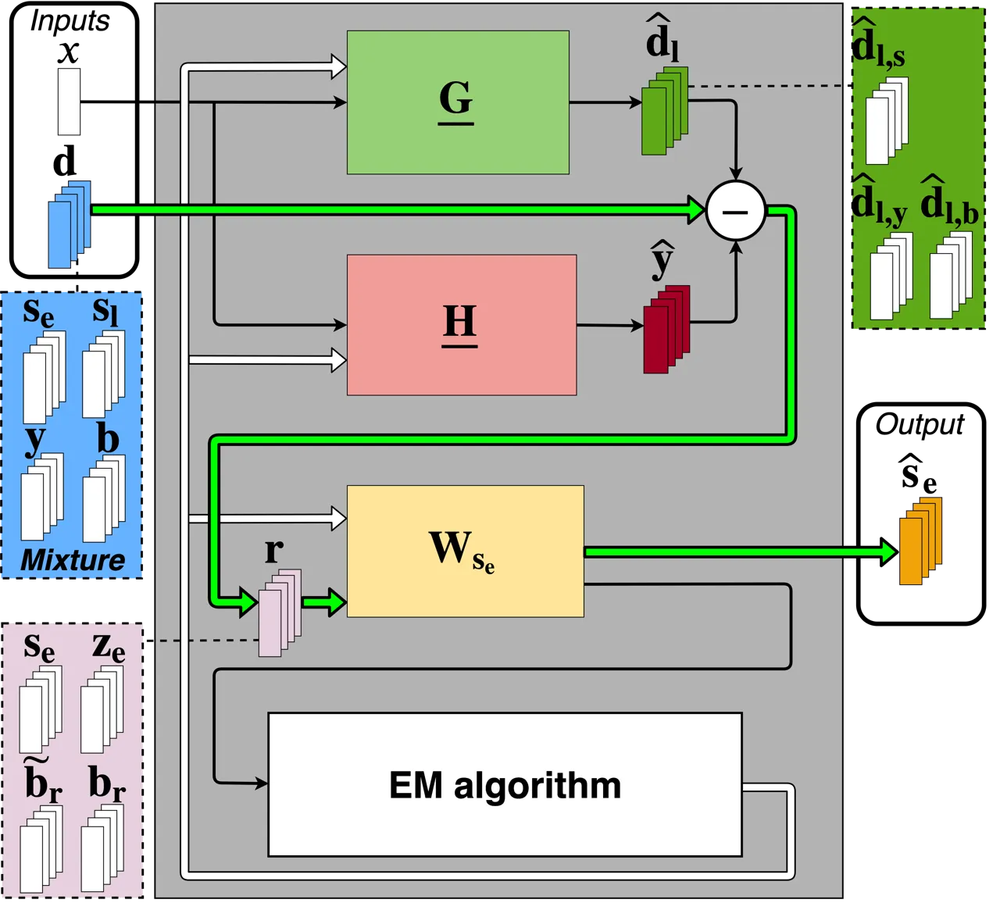

Fig. 2: Togami et al.’s approach for joint reduction of echo,
reverberation and noise \[19\]. The bold green arrows denote the
filtering steps. The dashed lines denote the latent signal components.
The thin black arrows denote the signals used for the filtering steps
and for the joint update. The bold white arrows denote the filter
updates.

To recover the early near-end signal component
$`\mathbf{s}_{\text{e}}(n,f)`$ from the signal $`\mathbf{r}(n,f)`$, the
authors applied a multichannel Wiener postfilter
$`\mathbf{W}_{s_{\text{e}}}(n,f)\in\mathbb{C}^{M\times M}`$ on the
signal $`\mathbf{r}(n,f)`$:

```math
\mathbf{\widehat{s}}_{\text{e}}(n,f)=\mathbf{W}_{s_{\text{e}}}(n,f)\mathbf{r}(n,f). \tag{22}
```

The authors estimated $`\mathbf{\underline{H}}(f)`$,
$`\mathbf{\underline{G}}(f)`$ and $`\mathbf{{W}}_{s_{\text{e}}}(n,f)`$
by modeling $`\mathbf{s}_{\text{e}}(n,f)`$ and $`\mathbf{b}_{r}(n,f)`$
as zero-mean multichannel Gaussian variables, and
$`\mathbf{z}_{\text{e}}(n,f)`$ and $`\mathbf{\widetilde{b}}_{r}(n,f)`$
as nonzero-mean multichannel Gaussian variables \[19\]. They used an EM
algorithm to jointly optimize the spectral and spatial parameters of
this model in the ML sense.

However, their approach suffers from several limitations. First, they
did not impose any constraint on the spectral parameters of the target
$`\mathbf{s}_{\text{e}}(n,f)`$ and the dereverberated noise signal
$`\mathbf{b}_{\text{r}}(n,f)`$. Secondly, the signal components
$`\mathbf{s}_{\text{l}}(n,f)`$ and $`\mathbf{y}_{\text{l}}(n,f)`$ in
$`\mathbf{\widetilde{b}}_{\text{r}}(n,f)`$ are not separately modeled,
i.e. these components share the same spatial parameters, which is not
the case in practice. These two limitations result in misestimation of
the filters $`\mathbf{\underline{H}}(f)`$, $`\mathbf{\underline{G}}(f)`$
and the postfilter $`\mathbf{W}_{s_{\text{e}}}(n,f)`$. Thirdly, because
the filters $`\mathbf{\underline{H}}(f)`$ and
$`\mathbf{\underline{G}}(f)`$ operate independently on the mixture
signal $`\mathbf{d}(n,f)`$, their respective components
$`\mathbf{\widehat{y}}(n,f)`$ and
$`\mathbf{\widehat{d}}_{\text{l},y}(n,f)`$ subtracted from the echo
$`\mathbf{y}(n,f)`$ in (19) and (20) might interfere with each other.
Finally, since the echo $`\mathbf{y}(n,f)`$ is often much louder than
the near-end speech $`\mathbf{s}(n,f)`$ and the noise signal
$`\mathbf{b}(n,f)`$ in $`\mathbf{d}(n,f)`$, the dereverberation filter
$`\mathbf{\underline{G}}(f)`$ here mainly reduces the late reverberation
of the echo $`\mathbf{y}_{\text{l}}(n,f)`$ instead of the reverberation
of the near-end speech $`\mathbf{s}_{\text{l}}(n,f)`$.

## III NN-supported BCA algorithm for joint reduction of echo, reverberation and noise

In this section, we propose a joint NN-supported model to estimate the
spectral parameters of the target and the residual signals. We derive an
NN-supported BCA algorithm for joint reduction of echo, reverberation
and noise that exploits these estimated spectral parameters for an
accurate derivation of the echo cancellation and dereverberation filters
and the nonlinear postfilter.

### III-A Model

The approach is illustrated in Fig. 3. In the first step, we apply the
echo cancellation filter $`\mathbf{\underline{H}}(f)`$ as in (4) and
subtract the resulting echo estimate $`\mathbf{\widehat{y}}(n,f)`$ from
$`\mathbf{d}(n,f)`$:

```math
\mathbf{e}(n,f)=\mathbf{d}(n,f)-\underbrace{\sum_{k=0}^{K-1}\mathbf{{h}}(k,f)x(n-k,f)}_{=\mathbf{\widehat{y}}(n,f)}. \tag{23}
```

The resulting signal $`\mathbf{e}(n,f)`$ contains the near-end signal
$`\mathbf{s}(n,f)`$, the residual echo $`\mathbf{z}(n,f)`$ and the noise
signal $`\mathbf{b}(n,f)`$. Unlike Togami et al. \[19\], we do not apply
the dereverberation filter $`\mathbf{\underline{G}}(f)`$ on the mixture
signal $`\mathbf{d}(n,f)`$, but on the signal $`\mathbf{e}(n,f)`$ and
subtract the resulting late reverberation estimate
$`\mathbf{\widehat{e}}_{\text{l}}(n,f)`$ from $`\mathbf{e}(n,f)`$. To
the best of our knowledge, this is the first work where the
dereverberation filter $`\mathbf{\underline{G}}(f)`$ is applied after
the echo cancellation filter $`\mathbf{\underline{H}}(f)`$ in the
context of joint echo reduction of echo, reverberation and noise. The
resulting signal $`\mathbf{r}(n,f)`$ is thus expressed as

```math
\mathbf{r}(n,f)=\mathbf{e}(n,f)-\underbrace{\sum_{l=\Delta}^{\Delta+L-1}\mathbf{G}(l,f)\mathbf{e}(n-l,f)}_{=\mathbf{\widehat{e}}_{\text{l}}(n,f)}. \tag{24}
```

Since the linear filters $`\mathbf{\underline{H}}(f)`$ and
$`\mathbf{\underline{G}}(f)`$ are causal, we make the assumption that
the observed signals $`\mathbf{d}(n,f)`$ and $`x(n,f)`$ are equal to
zero for $`n<0`$. Since the residual echo $`\mathbf{z}(n,f)`$ in
$`\mathbf{e}(n,f)`$ is a reduced version of the echo $`\mathbf{y}(n,f)`$
in $`\mathbf{d}(n,f)`$, the dereverberation filter
$`\mathbf{\underline{G}}(f)`$ should achieve a greater reduction of the
near-end late reverberation $`\mathbf{s}_{\text{l}}(n,f)`$ than in
Togami et al.’s approach \[19\]. Due to the reasons mentioned in
Sections II-A and II-B, and to the presence of the noise signal
$`\mathbf{b}(n,f)`$, undesired residual signals remain and can be
expressed as

```math
\mathbf{r}(n,f)-\mathbf{s}_{\text{e}}(n,f)=\mathbf{s}_{\text{r}}(n,f)+\mathbf{z}_{\text{r}}(n,f)+\mathbf{b}_{\text{r}}(n,f), \tag{25}
```

where $`\mathbf{s}_{\text{r}}(n,f)`$ is the residual late reverberation
near-end component (see Section II-B), $`\mathbf{z}_{\text{r}}(n,f)`$ is
the dereverberated residual echo which represents the residual echo
remaining after linear dereverberation reduced its linear component (see
Section II-A), and $`\mathbf{b}_{\text{r}}(n,f)`$ is the dereverberated
noise which represents the residual noise remaining after linear
dereverberation reduced its stationary component. The signals
$`\mathbf{s}_{\text{r}}(n,f)`$, $`\mathbf{z}_{\text{r}}(n,f)`$ and
$`\mathbf{b}_{\text{r}}(n,f)`$ are defined as

```math
\displaystyle\mathbf{s}_{\text{r}}(n,f) \displaystyle=\mathbf{s}_{\text{l}}(n,f)-\mathbf{\widehat{e}}_{\text{l},s}(n,f), \tag{26}
```

```math
\displaystyle\mathbf{z}_{\text{r}}(n,f) \displaystyle=\mathbf{{z}}(n,f)-\mathbf{\widehat{e}}_{\text{l},z}(n,f), \tag{27}
```

```math
\displaystyle\mathbf{b}_{\text{r}}(n,f) \displaystyle=\mathbf{b}(n,f)-\mathbf{\widehat{e}}_{\text{l},b}(n,f), \tag{28}
```

where the signals
$`\mathbf{\widehat{e}}_{\text{l},s}(n,f)=\sum_{l=\Delta}^{\Delta+L-1}\mathbf{G}(l,f)\mathbf{s}(n-l,f)`$,
$`\mathbf{\widehat{e}}_{\text{l},z}(n,f)=\sum_{l=\Delta}^{\Delta+L-1}\mathbf{G}(l,f)\mathbf{z}(n-l,f)`$
and
$`\mathbf{\widehat{e}}_{\text{l},b}(n,f)=\sum_{l=\Delta}^{\Delta+L-1}\mathbf{G}(l,f)\mathbf{b}(n-l,f)`$
are the latent components of $`\mathbf{\widehat{e}}_{\text{l}}(n,f)`$
resulting from (24). To recover the signal
$`\mathbf{s}_{\text{e}}(n,f)`$ from the signal $`\mathbf{r}(n,f)`$, we
apply a multichannel Wiener postfilter
$`\mathbf{W}_{s_{\text{e}}}(n,f)\in\mathbb{C}^{M\times M}`$ on the
signal $`\mathbf{r}(n,f)`$ as

```math
\mathbf{\widehat{s}}_{\text{e}}(n,f)=\mathbf{W}_{s_{\text{e}}}(n,f)\mathbf{r}(n,f). \tag{29}
```

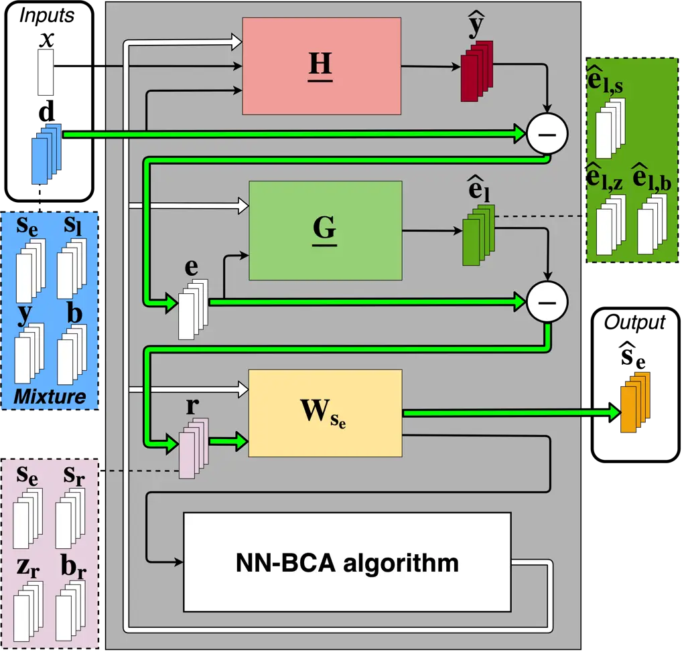

Fig. 3: Proposed approach. Arrows and lines have the same meaning as in
Fig. 2.

Inspired by WPE for dereverberation \[29\], we estimate
$`\mathbf{\underline{H}}(f)`$, $`\mathbf{\underline{G}}(f)`$ and
$`\mathbf{W}_{s_{\text{e}}}(n,f)`$ by modeling the target
$`\mathbf{s}_{\text{e}}(n,f)`$ and the three residual signals
$`\mathbf{s}_{\text{r}}(n,f)`$, $`\mathbf{z}_{\text{r}}(n,f)`$ and
$`\mathbf{b}_{\text{r}}(n,f)`$ with a multichannel local Gaussian
framework. In the following we use the general notation
$`\mathbf{c}(n,f)`$ to denote each one of these four signals, and
consider them as _sources_ to be separated. Each of these four sources
is modeled as

```math
\mathbf{c}(n,f)\sim\mathcal{N}_{\mathbb{C}}\left(\mathbf{0},v_{c}(n,f)\mathbf{R}_{c}(f)\right), \tag{30}
```

where $`v_{c}(n,f)\in\mathbb{R}_{+}`$ and
$`\mathbf{R}_{c}(f)\in\mathbb{C}^{M\times M}`$ denote the power spectral
density (PSD) and the spatial covariance matrix (SCM) of the source,
respectively \[37\]. The multichannel Wiener filter for the source
$`\mathbf{c}(n,f)`$ is formulated as

```math
\mathbf{W}_{c}(n,f)=v_{c}(n,f)\mathbf{R}_{c}(f)\Bigg(\sum_{\mathclap{c^{\prime}\in\mathcal{C}}}v_{c^{\prime}}(n,f)\mathbf{R}_{c^{\prime}}(f)\Bigg)^{-1}, \tag{31}
```

where
$`\mathcal{C}=\{\mathbf{s}_{\text{e}},\mathbf{s}_{\text{r}},\mathbf{z}_{\text{r}},\mathbf{b}_{\text{r}}\}`$
denotes all four sources in signal $`\mathbf{r}(n,f)`$. The postfilter
$`\mathbf{W}_{s_{\text{e}}}(n,f)`$ is a specific case of (31) where
$`\mathbf{c}(n,f)=\mathbf{s}_{\text{e}}(n,f)`$.

### III-B Likelihood

In order to estimate the parameters of this model, we must first express
its likelihood. Following (23), (24), (25) and (30), the log-likelihood
of the observed sequence
$`\mathcal{O}=\{\mathbf{d}(n,f),x(n,f)\}_{n,f}`$ is given by

```math
\displaystyle\begin{split}\mathcal{L}&\Big(\mathcal{O};\Theta_{H},\Theta_{G},\Theta_{c}\Big)\\
&=\sum_{f=0}^{F-1}\sum_{n=0}^{N-1}\log p\Big(\mathbf{d}(n,f)\Big|\mathbf{d}(n-1,f),\ldots,\mathbf{d}(0,f),\\
&\qquad\qquad\qquad\qquad\qquad\quad x(n,f),\ldots,x(0,f)\Big),\end{split} \tag{32}
```

```math
\displaystyle=\sum_{f=0}^{F-1}\sum_{n=0}^{N-1}\log\mathcal{N}_{\mathbb{C}}\Big(\mathbf{d}(n,f);\bm{\mu}_{\mathbf{d}}(n,f),\mathbf{R}_{\mathbf{d}\mathbf{d}}(n,f)\Big), \tag{33}
```

where

```math
\bm{\mu}_{\mathbf{d}}(n,f)=\sum_{\mathclap{k=0}}^{\mathclap{K-1}}\mathbf{{h}}(k,f)x(n-k,f)+\sum_{\mathclap{l=\Delta}}^{\mathclap{\Delta+L-1}}\mathbf{G}(l,f)\mathbf{e}(n-l,f), \tag{34}
```

```math
\displaystyle\mathbf{R}_{\mathbf{d}\mathbf{d}}(n,f)=\sum_{c^{\prime}\in\mathcal{C}}v_{c^{\prime}}(n,f)\mathbf{R}_{c^{\prime}}(f), \tag{35}
```

and $`\Theta_{H}=\{\mathbf{\underline{H}}(f)\}_{f}`$,
$`\Theta_{G}=\{\mathbf{\underline{G}}(f)\}_{f}`$ and
$`\Theta_{c}=\{v_{c}(n,f),\mathbf{R}_{c}(f)\}_{c,n,f}`$ are the
parameters to be estimated. The resulting ML optimization problem has no
closed form solution, hence we need to estimate the parameters via an
iterative procedure.

### III-C Iterative optimization algorithm

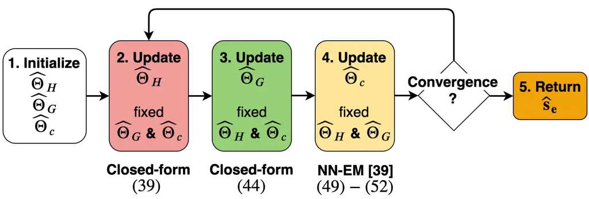

Fig. 4: Flowchart of the proposed BCA algorithm.

We propose a BCA algorithm for likelihood optimization. Each iteration
$`i`$ comprises the following three maximization steps:

```math
\displaystyle\widehat{\Theta}_{H} \displaystyle\leftarrow\argmax_{\Theta_{H}}\mathcal{L}\left(\mathcal{O};\Theta_{H},\widehat{\Theta}_{G},\widehat{\Theta}_{c}\right), \tag{36}
```

```math
\displaystyle\widehat{\Theta}_{G} \displaystyle\leftarrow\argmax_{\Theta_{G}}\mathcal{L}\left(\mathcal{O};\widehat{\Theta}_{H},\Theta_{G},\widehat{\Theta}_{c}\right), \tag{37}
```

```math
\displaystyle\widehat{\Theta}_{c} \displaystyle\leftarrow\argmax_{\Theta_{c}}\mathcal{L}\left(\mathcal{O};\widehat{\Theta}_{H},\widehat{\Theta}_{G},\Theta_{c}\right). \tag{38}
```

The solutions of (36) and (37) are closed-form. As there is no
closed-form solution for (38), we propose to use a modified version of
Nugraha et al.’s NN-EM algorithm \[39\]. The overall flowchart of the
proposed algorithm is shown in Fig. 4. Note that it is also possible to
optimize the parameters $`{\Theta}_{H}`$, $`{\Theta}_{G}`$ and
$`{\Theta}_{c}`$ with the EM algorithm by adding a nuisance term to (25)
\[38\]. However, this approach would be less efficient to derive the
filter parameters $`{\Theta}_{H}`$ and $`{\Theta}_{G}`$. In the next
subsections, we provide the initialization and the update rules for
steps (36)–(38) of our proposed algorithm at iteration $`i`$. The
derivation of these update rules is detailed in our companion technical
report \[41, Sec. 3\]. At each iteration $`i`$, we use the
dereverberation filter parameters $`{\Theta}_{G}`$ and the source
parameters $`{\Theta}_{c}`$ of the previous iteration $`i-1`$.

#### III-C1 Initialization

We initialize the linear filters $`\mathbf{\underline{H}}(f)`$ and
$`\mathbf{\underline{G}}(f)`$ to $`\mathbf{\underline{H}}_{0}(f)`$ and
$`\mathbf{\underline{G}}_{0}(f)`$, respectively. The PSDs $`v_{c}(n,f)`$
of the four sources are jointly initialized using a pretrained NN
denoted as $`\text{NN}_{0}`$ and the SCMs $`\mathbf{R}_{c}(f)`$ as the
identity matrix $`\mathbf{I}_{M}`$. The inputs, the targets and the
architecture of $`\text{NN}_{0}`$ are described in Section IV below.

#### III-C2 Echo cancellation filter parameters $`\Theta_{H}`$

The echo cancellation filter $`\mathbf{\underline{H}}(f)`$ is updated as

```math
\underline{\mathbf{h}}(f)=\mathbf{P}(f)^{-1}\mathbf{p}(f), \tag{39}
```

where

```math
\displaystyle\mathbf{P}(f) \displaystyle=\sum_{n=0}^{N-1}\mathbf{\underline{X}}_{\text{r}}(n,f)^{H}\mathbf{R}_{\mathbf{d}\mathbf{d}}(n,f)^{-1}\mathbf{\underline{X}}_{\text{r}}(n,f), \tag{40}
```

```math
\displaystyle\mathbf{p}(f) \displaystyle=\sum_{n=0}^{N-1}\mathbf{\underline{X}}_{\text{r}}(n,f)^{H}\mathbf{R}_{\mathbf{d}\mathbf{d}}(n,f)^{-1}\mathbf{r}_{d}(n,f). \tag{41}
```

$`\mathbf{\underline{h}}(f)=[\mathbf{h}(0,f)^{T}\ldots\mathbf{h}(K-1,f)^{T}]^{T}\in\mathbb{C}^{MK\times 1}`$
is a vectorized version of $`\mathbf{\underline{H}}(f)`$,
$`\mathbf{\underline{X}}_{\text{r}}(n,f)=\left[\mathbf{{X}}_{\text{r}}(n,f)\ldots\mathbf{{X}}_{\text{r}}(n-K+1,f)\right]\in\mathbb{C}^{M\times MK}`$
results from the $`K`$ taps
$`\mathbf{{X}}_{\text{r}}(n-k,f)\in\mathbb{C}^{M\times M}`$. The $`K`$
taps $`\mathbf{{X}}_{\text{r}}(n-k,f)`$ are _dereverberated_ versions of
$`x(n-k,f)`$ obtained by applying the dereverberation filter
$`\mathbf{\underline{G}}(f)`$ on $`x(n-k,f)`$:

```math
\mathbf{{X}}_{\text{r}}(n-k,f)=x(n-k,f)\mathbf{I}_{M}-\sum_{l=\Delta}^{\Delta+L-1}x(n-k-l,f)\mathbf{G}(l,f). \tag{42}
```

$`\mathbf{r}_{d}(n,f)`$ is a _dereverberated_ version of
$`\mathbf{d}(n,f)`$ obtained by applying the dereverberation filter
$`\mathbf{\underline{G}}(f)`$ on $`\mathbf{d}(n,f)`$ without prior echo
cancellation:

```math
\mathbf{r}_{d}(n,f)=\mathbf{d}(n,f)-\sum_{k=\Delta}^{\Delta+L-1}\mathbf{G}(k,f)\mathbf{d}(n-k,f) \tag{43}
```

Note that the update of the echo cancellation filter
$`\mathbf{\underline{H}}(f)`$ is influenced by the dereverberation
filter $`\mathbf{\underline{G}}(f)`$ through the terms
$`\mathbf{\underline{X}}_{\text{r}}(n,f)`$ and $`\mathbf{r}_{d}(n,f)`$.
This update prevents the echo cancellation filter
$`\mathbf{\underline{H}}(f)`$ from reducing the component of the echo
$`\mathbf{y}(n,f)`$ already reduced by the dereverberation filter
$`\mathbf{\underline{G}}(f)`$.

The update of the echo cancellation filter $`\mathbf{\underline{H}}(f)`$
also depends on the PSDs $`v_{c}(n,f)`$ and the SCMs
$`\mathbf{R}_{c}(f)`$ through the term
$`\mathbf{R}_{\mathbf{d}\mathbf{d}}(n,f)`$ defined in (35). As the
post-filter $`\mathbf{W}_{c}(n,f)`$ is used for the updates of both of
the PSDs $`v_{c}(n,f)`$ (see Section IV-B below) and the SCMs
$`\mathbf{R}_{c}(f)`$ (see Section III-C4 below), the update of the echo
cancellation filter $`\mathbf{\underline{H}}(f)`$ is also influenced by
the post-filter $`\mathbf{W}_{c}(n,f)`$.

#### III-C3 Dereverberation filter parameters $`\Theta_{G}`$

Similarly to WPE for dereverberation \[30\], the dereverberation filter
$`\mathbf{\underline{G}}(f)`$ is updated as

```math
\underline{\mathbf{g}}(f)=\mathbf{Q}(f)^{-1}\mathbf{q}(f), \tag{44}
```

where

```math
\displaystyle\mathbf{Q}(f) \displaystyle=\sum_{n=0}^{N-1}\mathbf{\underline{E}}(n,f)^{H}\mathbf{R}_{\mathbf{d}\mathbf{d}}(n,f)^{-1}\mathbf{\underline{E}}(n,f), \tag{45}
```

```math
\displaystyle\mathbf{q}(f) \displaystyle=\sum_{n=0}^{N-1}\mathbf{\underline{E}}(n,f)^{H}\mathbf{R}_{\mathbf{d}\mathbf{d}}(n,f)^{-1}\mathbf{e}(n,f). \tag{46}
```

$`\mathbf{\underline{g}}(f)=[\mathbf{g}_{1}(\Delta,f)^{T}\ldots\mathbf{g}_{M}(\Delta,f)^{T}\ldots\ldots\mathbf{g}_{1}(\Delta+L-1,f)^{T}\ldots\mathbf{g}_{M}(\Delta+L-1,f)^{T}]^{T}\in\mathbb{C}^{M^{2}L\times 1}`$
is a vectorized version of $`\mathbf{\underline{G}}(f)`$, and
$`\mathbf{\underline{E}}(n,f)=\left[\mathbf{{E}}(n-\Delta,f)\ldots\mathbf{{E}}(n-\Delta-L+1,f)\right]\in\mathbb{C}^{M\times M^{2}L}`$
results from the $`L`$ taps
$`\mathbf{E}(n-l,f)\in\mathbb{C}^{M\times M^{2}}`$ obtained as

```math
\mathbf{E}(n-l,f)=\mathbf{I}_{M}\otimes\mathbf{e}(n-l,f)^{T}. \tag{47}
```

The update of the dereverberation filter $`\mathbf{\underline{G}}(f)`$
is influenced by the echo cancellation filter
$`\mathbf{\underline{H}}(f)`$ through the terms $`\mathbf{e}(n,f)`$.
Similarly to the echo cancellation filter $`\mathbf{\underline{H}}(f)`$,
the update of the dereverberation filter $`\mathbf{\underline{G}}(f)`$
is also influenced by the post-filter $`\mathbf{W}_{c}(n,f)`$ through
the PSDs $`v_{c}(n,f)`$ and the SCMs $`\mathbf{R}_{c}(f)`$ used in the
term $`\mathbf{R}_{\mathbf{d}\mathbf{d}}(n,f)`$ defined in (35).

#### III-C4 Variance and spatial covariance parameters $`\Theta_{c}`$

As there is no closed-form solution for the log-likelihood optimization
with respect to $`\Theta_{c}`$, we estimate the variance and spatial
covariance parameters using an EM algorithm. Given the past sequence of
the mixture signal $`\mathbf{d}(n,f)`$, the far-end signal $`x(n,f)`$
and its past sequence, and the linear filters
$`\underline{\mathbf{H}}(f)`$ and $`\underline{\mathbf{G}}(f)`$, the
residual mixture signal $`\mathbf{r}(n,f)`$ is conditionally distributed
as

```math
\begin{split}\mathbf{r}(n,f)\Big|\mathbf{d}(n-1&,f),\ldots,\mathbf{d}(0,f),x(n,f),\ldots,x(0,f),\\
&\underline{\mathbf{H}}(f),\underline{\mathbf{G}}(f)\sim\mathcal{N}_{\mathbb{C}}\Big(\mathbf{0},\mathbf{R}_{\mathbf{d}\mathbf{d}}(n,f)\Big).\end{split} \tag{48}
```

The signal model is conditionally identical to the local Gaussian
modeling framework for source separation \[37\]. However, this framework
does not constrain the PSDs or the SCMs which results in a permutation
ambiguity (see Section II-C). Instead, after each update of the linear
filters $`\mathbf{\underline{H}}(f)`$ and $`\mathbf{\underline{G}}(f)`$,
we propose to use one iteration of Nugraha et al.’s NN-EM algorithm to
update the PSDs and the SCMs of the target and residual signals
$`\mathbf{s}_{\text{e}}(n,f)`$, $`\mathbf{s}_{\text{r}}(n,f)`$,
$`\mathbf{z}_{\text{r}}(n,f)`$ and $`\mathbf{b}_{\text{r}}(n,f)`$
\[39\]. In the E-step, each of these four sources $`\mathbf{c}(n,f)`$ is
estimated as

```math
\mathbf{\widehat{c}}(n,f)=\mathbf{W}_{c}(n,f)\mathbf{r}(n,f), \tag{49}
```

and its second-order posterior moment $`\mathbf{\widehat{R}}_{c}(n,f)`$
as

```math
\mathbf{\widehat{R}}_{c}(n,f)=\mathbf{\widehat{c}}(n,f)\mathbf{\widehat{c}}(n,f)^{H}+\Big(\mathbf{I}-\mathbf{W}_{c}(n,f)\Big)v_{c}(n,f)\mathbf{R}_{c}(f). \tag{50}
```

In the M-step, we consider a weighted form of update for the SCMs
$`\mathbf{R}_{c}(f)`$ \[42\]

```math
\mathbf{{R}}_{c}(f)=\left(\sum_{n=0}^{N-1}w_{c}(n,f)\right)^{-1}\sum_{n=0}^{N-1}\frac{w_{c}(n,f)}{v_{c}(n,f)}\mathbf{\widehat{R}}_{c}(n,f), \tag{51}
```

where $`w_{c}(n,f)`$ denotes the weight of the source
$`\mathbf{c}(n,f)`$. When $`w_{c}(n,f)=1`$ , (51) reduces to the exact
EM algorithm \[37\]. Here, we use $`w_{c}(n,f)=v_{c}(n,f)`$ \[43, 42\].
Experience shows that this weighting trick mitigates inaccurate
estimates in certain time-frequency bins and increases the importance of
the bins for which $`v_{c}(n,f)`$ is large. As the PSDs are constrained,
we also need to constrain $`\mathbf{{R}}_{c}(f)`$ so as to encode only
the spatial information of the sources. We modify (51) by normalizing
$`\mathbf{{R}}_{c}(f)`$ after each update \[42\]:

```math
\mathbf{{R}}_{c}(f)\leftarrow\frac{M}{\text{tr}\left(\mathbf{R}_{c}(f)\right)}\mathbf{R}_{c}(f). \tag{52}
```

The PSDs $`v_{c}(n,f)`$ of the four sources are jointly updated using a
pretrained NN denoted as $`\text{NN}_{i}`$, with $`i\geq 1`$ the
iteration index. The inputs, the targets and the architecture of
$`\text{NN}_{i}`$ are described in Section IV below.

#### III-C5 Estimation of the final early near-end component $`\mathbf{s}_{\text{e}}(n,f)`$

Once the proposed iterative optimization algorithm has converged after
$`I`$ iterations, we have estimates of the PSDs $`v_{c}(n,f)`$, the SCMs
$`\mathbf{R}_{c}(f)`$ and the dereverberation filter
$`\mathbf{\underline{G}}(f)`$. We can perform one more iteration of the
NN-supported BCA algorithm to derive the final filters
$`\mathbf{\underline{H}}(f)`$, $`\mathbf{\underline{G}}(f)`$ and
$`\mathbf{W}_{s_{\text{e}}}(n,f)`$. Ultimately, we obtain the target
estimate $`\mathbf{\widehat{s}}_{\text{e}}(n,f)`$ using (23), (24) and
(49). For the detailed pseudo-code of the algorithm, please refer to the
supporting document \[41, Sec.3.5\].

## IV NN spectral model

In this section, we define the inputs, the targets and the architecture
of the NN used to initialize and update the target and residual PSDs.

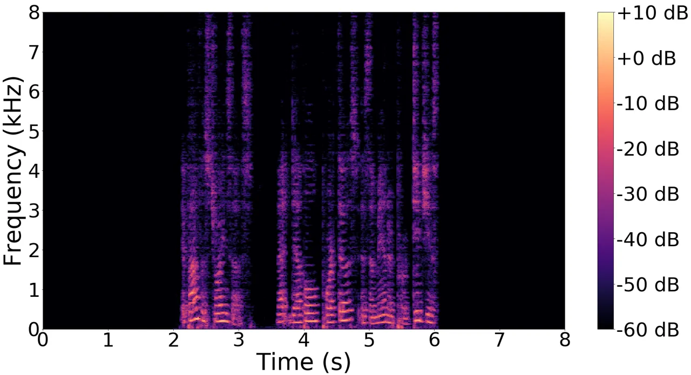

(a)

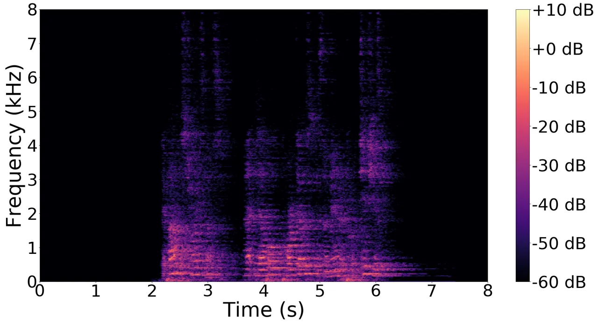

(b)

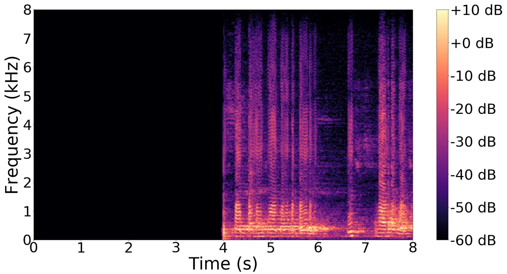

(c)

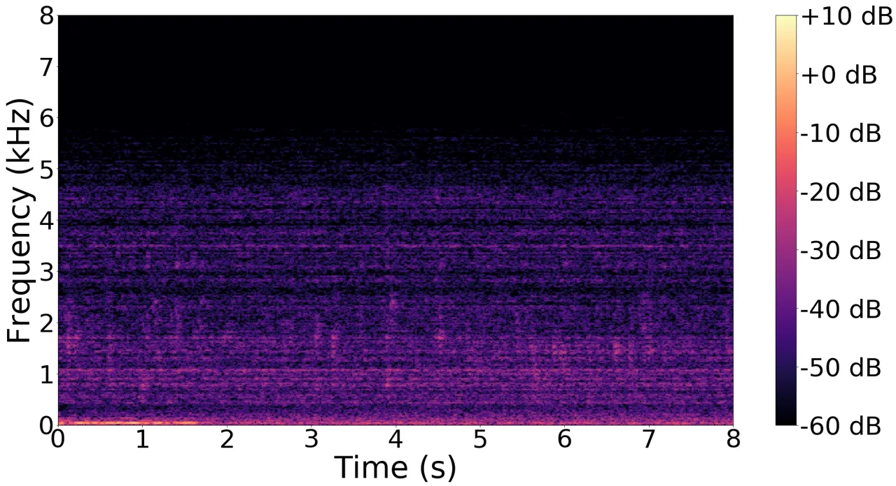

(d)

Fig. 5: Example ground truth target and residual signal PSDs in the
training set.

### IV-A Targets

Estimating $`\sqrt{v_{c}(n,f)}`$ has been shown to provide better
results than estimating the power spectra $`v_{c}(n,f)`$, as the square
root compresses the signal dynamics \[39\]. Therefore we define
$`\Big[\sqrt{v_{{s}_{\text{e}}}(n,f)}\sqrt{v_{s_{\text{r}}}(n,f)}\sqrt{v_{z_{\text{r}}}(n,f)}\sqrt{v_{b_{\text{r}}}(n,f)}\Big]`$
as the targets for the NN. Nugraha et al. defined the ground truth PSDs
as $`v_{c}(n,f)=\frac{1}{M}\rVert\mathbf{c}(n,f)\rVert^{2}`$ \[39\]. We
thus need to know the ground truth source signals $`\mathbf{c}(n,f)`$.

The ground truth latent signals $`\mathbf{s}_{\text{r}}(n,f)`$,
$`\mathbf{z}_{\text{r}}(n,f)`$ and $`\mathbf{b}_{\text{r}}(n,f)`$ are
unkown. However, in the training and validations sets, we can know the
ground truth early near-end signal $`\mathbf{s}_{\text{e}}(n,f)`$ and
the signals $`\mathbf{s}_{\text{l}}(n,f)`$, $`\mathbf{y}(n,f)`$ and
$`\mathbf{b}(n,f)`$ (see Section V-B). These last three signals
correspond to the values of $`\mathbf{s}_{\text{r}}(n,f)`$,
$`\mathbf{z}_{\text{r}}(n,f)`$ and $`\mathbf{b}_{\text{r}}(n,f)`$,
respectively, when the linear filters $`\mathbf{\underline{H}}(f)`$ and
$`\mathbf{\underline{G}}(f)`$ are equal to zero. To derive the ground
truth latent signals $`\mathbf{s}_{\text{r}}(n,f)`$,
$`\mathbf{z}_{\text{r}}(n,f)`$ and $`\mathbf{b}_{\text{r}}(n,f)`$, we
propose to use an iterative procedure similar to the NN-supported BCA
algorithm (see Fig. 4), where the linear filters
$`\mathbf{\underline{H}}(f)`$ and $`\mathbf{\underline{G}}(f)`$ are
initialized to zero.

At each iteration, we derive the linear filters
$`\mathbf{\underline{H}}(f)`$ and $`\mathbf{\underline{G}}(f)`$ as in
steps 2 and 3 of Fig. 4, respectively. We update
$`\mathbf{s}_{\text{r}}(n,f)`$, $`\mathbf{z}_{\text{r}}(n,f)`$ and
$`\mathbf{b}_{\text{r}}(n,f)`$ by applying the linear filters
$`\mathbf{\underline{H}}(f)`$ and $`\mathbf{\underline{G}}(f)`$ to each
of the signals $`\mathbf{s}_{\text{l}}(n,f)`$, $`\mathbf{y}(n,f)`$ and
$`\mathbf{b}(n,f)`$ as in (26), (27) and (28). To obtain the ground
truth PSDs $`{v_{c}(n,f)}`$, we replace NN-EM at step 4 of Fig. 4 by an
_oracle_ estimation using Duong et al.’s EM algorithm \[37\]. For the
detailed pseudo-code of the iterative procedure, please refer to the
supporting document \[41, Sec. 4.1\]. After a few iterations, we
observed the convergence of the latent variables
$`\mathbf{s}_{\text{r}}(n,f)`$, $`\mathbf{z}_{\text{r}}(n,f)`$ and
$`\mathbf{b}_{\text{r}}(n,f)`$. In particular, we found that the
_dereverberated_ residual echo $`\mathbf{z}_{\text{r}}(n,f)`$ decreases
over the iterations. Fig. 5 shows an example of the PSD spectrograms
after convergence.

### IV-B Inputs

We use magnitude spectra as inputs for $`\text{NN}_{\text{0}}`$ and
$`\text{NN}_{i}`$ rather than power spectra, since they have been shown
to provide better results when the targets are the magnitude spectra
$`\sqrt{v_{c}(n,f)}`$ \[39\]. We concatenate these spectra to obtain the
inputs. The different inputs are summarized in Fig. 6. We consider first
the far-end signal magnitude $`|x(n,f)|`$ and a single-channel signal
magnitude $`|\widetilde{d}(n,f)|`$ obtained from the corresponding
multichannel mixture signal $`\mathbf{d}(n,f)`$ as \[42\]

```math
|\widetilde{d}(n,f)|=\sqrt{\frac{1}{M}\rVert\mathbf{d}(n,f)\rVert^{2}}. \tag{53}
```

Additionally we use the magnitude spectra $`|\widetilde{y}(n,f)|`$,
$`|\widetilde{e}(n,f)|`$, $`|\widetilde{e}_{\text{l}}(n,f)|`$ and
$`|\widetilde{r}(n,f)|`$ obtained from the corresponding multichannel
signals after each linear filtering step $`\mathbf{\widehat{y}}(n,f)`$,
$`\mathbf{e}(n,f)`$, $`\mathbf{\widehat{e}}_{\text{l}}(n,f)`$,
$`\mathbf{r}(n,f)`$. Indeed in our previous work on single-channel echo
reduction, using the estimated echo magnitude as an additional input was
shown to improve the estimation \[26\]. We refer to the above inputs as
type-I inputs. We consider additional inputs to improve the estimation.
In particular, we use the magnitude spectra
$`\sqrt{v_{c}^{\text{unc}}(n,f))}`$ of the source unconstrained PSDs
obtained as

```math
v_{c}^{\text{unc}}(n,f)=\frac{1}{M}\text{tr}\left(\mathbf{{R}}_{c}(f)^{-1}\mathbf{\widehat{R}}_{c}(n,f)\right). \tag{54}
```

Indeed these inputs partially contain the spatial information of the
sources and have been shown to improve results in source separation
\[39\]. We refer to the inputs obtained from (54) as type-II inputs. For
$`\text{NN}_{0}`$, we only use type-I inputs, as type-II inputs are not
available at initialization. For $`\text{NN}_{i}`$ with $`i\geq 1`$, we
use both type-I and type-II inputs.

### IV-C Cost function

Let $`|\widetilde{c}(n,f)|`$ denote the NN output for source
$`\mathbf{c}(n,f)`$. As mentioned above, we use $`\text{NN}_{0}`$ and
$`\text{NN}_{i}`$ to jointly predict the $`4`$ spectral parameters
$`\Big[|\widetilde{s}_{\text{e}}(n,f)||\widetilde{s}_{\text{r}}(n,f)||\widetilde{z}_{\text{r}}(n,f)||\widetilde{b}_{\text{r}}(n,f)|\Big]`$
(see Fig. 6). We use the Kullback-Leibler divergence as the training
loss, which has shown to provide the best results for NN training among
several other losses \[39\]:

```math
\begin{split}\mathcal{D}_{KL}=\frac{1}{4FN}\sum_{c,n,f}\Big(&\sqrt{v_{c}(n,f)}\log\frac{\sqrt{v_{c}(n,f)}}{|\widetilde{c}(n,f)|}\\
&-\sqrt{v_{c}(n,f)}+|\widetilde{c}(n,f)|\Big).\end{split} \tag{55}
```

### IV-D Architecture

The neural network follows a long-short-term-memory (LSTM) network
architecture. We consider $`2`$ LSTM layers (see Fig. 6). The number of
inputs is $`6F`$ for $`\text{NN}_{0}`$ and $`10F`$ for
$`\text{NN}_{i}`$. The number of outputs is $`4F`$. Other network
architectures are not considered here as the performance comparison
between different architectures is beyond the scope of this article.

## V Experimental protocol

Fig. 6: Architecture of $`\text{NN}_{i}`$ with a sequence length of
$`32`$ timesteps and $`F=513`$ frequency bins.

In this section we describe the datasets, the metrics, the baselines and
the hyperparameter settings used to evaluate the proposed algorithm.

### V-A Scenario

We consider the scenario where a near-end speaker interacts with a
far-end speaker using a hands-free communication system at a distance of
$`1.5`$ m in a noisy environment. Each utterance has $`8`$-s duration
and contains $`4`$ s of near-end speech and $`4`$ s of far-end speech
overlapping for $`2`$ s. Background noise is present during the whole
utterance. Each utterance is hence composed of $`4`$ periods of $`2`$ s
as shown in Fig. 7: 1) noise only, 2) noise and near-end speech, 3)
noise, near-end and far-end speech, 4) noise and far-end speech.

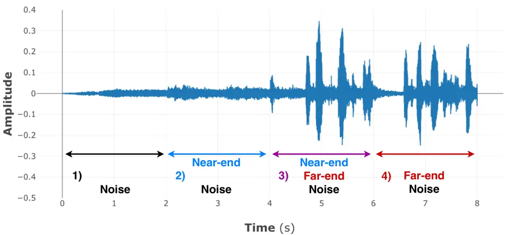

Fig. 7: Example utterance (only one channel shown).

### V-B Datasets

#### V-B1 Overall description

We created three disjoint datasets for training, validation and test,
whose characteristics are summarized in Table I. We considered $`M=3`$
microphones. For each dataset, we separately recorded or simulated the
acoustic echo $`\mathbf{y}(t)`$, the near-end speech $`\mathbf{s}(t)`$
and the noise $`\mathbf{b}(t)`$ using clean speech and noise signals as
base material and we computed the mixture signal $`\mathbf{d}(t)`$ as in
(15). This protocol is required to obtain the ground truth target and
residual signals for training and evaluation, which is not possible with
real-world recordings for which these ground truth signals are unknown.
The training and validation sets correspond to time-invariant acoustic
conditions, while the test set includes both a time-invariant and a
time-varying subset. The recording and simulation parameters (e.g.
simulated room charateristics, position of the sources) are detailed in
our companion technical report\[41, Sec. 7.1\].

|                  |                |                              |              |               |
| ---------------- | -------------- | ---------------------------- | ------------ | ------------- |
| Dataset          |                | Training                     | Validation   | Test          |
| Signals          | $`\mathbf{y}`$ | recorded                     |              | recorded      |
|                  | $`\mathbf{s}`$ | simulated $`\mathbf{a}_{s}`$ |              |               |
|                  | $`\mathbf{b}`$ | simulated                    |              |               |
| Rooms            |                | $`1`$-$`2`$-$`3`$            | $`1`$-$`2`$  | $`4`$         |
| \# speaker pairs |                | $`79`$                       | $`27`$       | $`25`$        |
| \# utterances    |                | $`13true572`$                | $`4true536`$ | $`4true500`$  |
| \# noise samples |                | $`36`$                       | $`36`$       | $`6`$         |
| SER range (dB)   |                | $`[-45,+6]`$                 |              | $`[-45,-7]`$  |
| SNR range (dB)   |                | $`[-21,+24]`$                |              | $`[-20,+13]`$ |

TABLE I: Dataset characteristics.

##### Clean speech and noise signals

Clean speech signals were taken from the train-clean-360 subset of the
Librispeech corpus \[44\], which consists of $`921`$ speakers reading
books for $`25`$ min each on average. We selected $`262`$ speakers and
grouped them into $`131`$ disjoint pairs for training, validation, and
test. We alternately considered each speaker as near-end or far-end and
picked several non-overlapping $`4`$-s speech samples for each pair.
Each $`4`$-s sample was used only once in the whole dataset. Regarding
the noise signals, we considered $`6`$ types of domestic noise: babble,
dishwasher, fridge, microwave, vacuum cleaner and washing machine. We
randomly selected $`78`$ non-overlapping $`8`$-s noise samples from
$`1.7`$ h of YouTube videos and grouped them into disjoint subsets for
training, validation, and test.

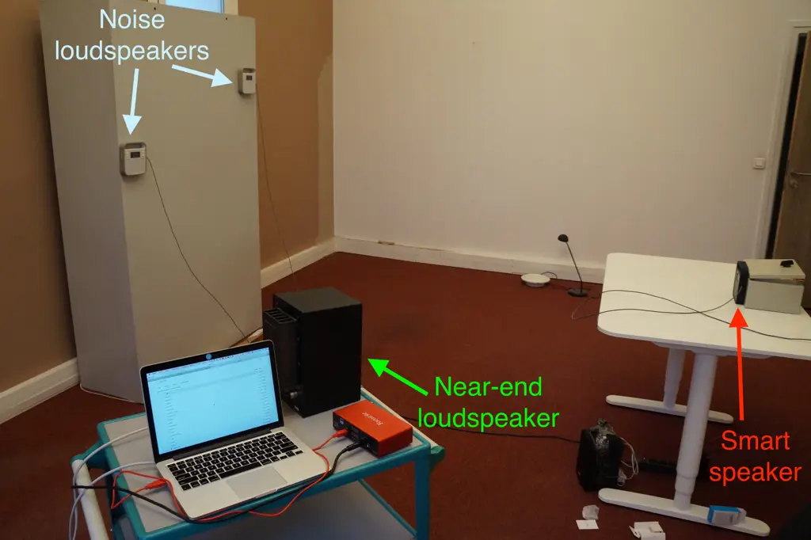

Fig. 8: Recording setup for the test set.

##### Real echo recordings

To create the acoustic echo $`\mathbf{y}(t)`$, Togami et al. convolved
far-end speech signals $`x(t)`$ with simulated echo paths
$`\mathbf{a}_{y}(\tau)`$ which do not include any nonlinearity \[19\].
In real hands-free systems, the acoustic echo contains nonlinearities
caused by the nonlinear response of the loudspeaker, enclosure
vibrations and hard clipping effects due to amplification (see Section
II-A). In order to achieve more realistic test conditions, we created
the acoustic echo by recording the acoustic feedback from the
loudspeaker to the microphones of a real hands-free system. The far-end
speech was played and recorded at a rate of $`16`$ kHz with a Triby, a
smart speaker device developed by Invoxia. A configuration of the echo
recording setup is given in Fig. 8. The recordings were done with the
same Triby in 4 rooms with different size and reverberation time
($`\text{RT}_{60}`$) listed in Table II.

| Room  | Size (m)                    | $`\textbf{RT}_{60}`$ (s) |
| ----- | --------------------------- | ------------------------ |
| $`1`$ | $`4.4\times 4.2\times 4`$   | $`1.0`$                  |
| $`2`$ | $`3.8\times 2.5\times 3.5`$ | $`0.5`$                  |
| $`3`$ | $`3.4\times 2.1\times 3.3`$ | $`0.8`$                  |
| $`4`$ | $`5.9\times 4.6\times 4`$   | $`1.3`$                  |

TABLE II: Room characteristics.

##### Reverberant near-end speech and noise

The creation procedures for $`\mathbf{s}(t)`$ and $`\mathbf{b}(t)`$
differ for each dataset and are described in the following subsections.

#### V-B2 Training set

For the training set, the echo recordings were done in rooms $`1`$,
$`2`$ and $`3`$ (see Table II). To create the reverberant near-end
speech $`\mathbf{s}(t)`$, we convolved anechoic near-end speech $`u(t)`$
with near-end RIRs $`\mathbf{a}_{s}(\tau)`$ simulated to match the echo
recording properties using the Roomsimove toolbox \[45\] \[41, Sec.
7.1\]. Among the $`79`$ pairs of speakers used for training, $`54`$ were
used in rooms $`1`$ and $`2`$. We played and recorded $`4true536`$
far-end signals and we simulated $`4true536`$ near-end RIRs in each of
these $`2`$ rooms. The remaining $`25`$ pairs were used in room $`3`$.
We played and recorded $`4true500`$ far-end signals and we simulated
$`4true500`$ near-end RIRs in this room.

To create the noise signal $`\mathbf{b}(t)`$, we convolved a randomly
chosen noise sample among the $`36`$ noise samples ($`6`$ per noise
type) used for training with the average of the late tail of two
distinct RIRs randomly picked among $`42`$ measured RIRs. This procedure
approximates a spatially diffuse noise signal. To obtain the $`42`$
measured RIRs, we measured $`14`$ RIRs in each of the rooms $`1`$, $`2`$
and $`3`$.

The levels of the recorded far-end, the near-end speech and the noise
signal were chosen randomly such that the signal-to-echo ratio (SER)
varied from $`-45`$ dB to $`+6`$ dB and the signal-to-noise ratio (SNR)
varied from $`-21`$ dB to $`+24`$ dB. These conditions are very
challenging, especially as reverberation dominates in the reverberant
near-end speech $`\mathbf{s}(t)`$. In total, we obtained $`13true572`$
utterances which amount to roughly $`32`$ h of audio.

#### V-B3 Validation set

The validation set was generated in a similar way as the training set,
using $`27`$ speaker pairs and $`36`$ noise samples that are not in the
training set. The echo recordings were done in rooms $`1`$ and $`2`$,
and the near-end RIRs were simulated similarly to the training set
procedure. We played and recorded $`4true536`$ far-end signals and we
simulated $`4true536`$ near-end RIRs in each room. To create the diffuse
noise, we used the same $`42`$ measured RIRs as in the training set. The
levels of the recorded far-end speech, the near-end speech and the noise
signal were chosen in the same range as the training set, resulting in
the same challenging SER and SNR conditions. In total, we obtained
$`4true536`$ utterances which amount to roughly $`10`$ h of audio.

#### V-B4 Time-invariant test set

The time-invariant test set was built from real recordings only, using
$`25`$ speaker pairs and $`6`$ noise samples that are neither in the
training nor in the validation sets. The echo, the near-end speech and
the noise were all recorded in room $`4`$ (see Table II) using the setup
shown in Fig. 8. The reverberant near-end speech $`\mathbf{s}(t)`$ was
obtained by playing anechoic speech with a Yamaha MSP5 Studio
loudspeaker at a single loudness level. The noise signal
$`\mathbf{b}(t)`$ was obtained by picking a random original noise signal
and playing it through $`4`$ Triby loudspeakers simutaneously. The noise
signals resulting from this procedure are less diffuse than in the
training and validation sets. The recorded levels were such that the
resulting SER varied from $`-45`$ dB to $`-7`$ dB and the SNR varied
from $`-20`$ dB to $`+13`$ dB. These challenging conditions are
comprised within those of the training and validation sets. We played
and recorded $`4true500`$ far-end speech, near-end speech, and noise
signals, hence we obtained a total of $`4true500`$ $`8`$-s utterances
amounting to $`10`$ h of audio.

#### V-B5 Time-varying test set

In order to evaluate our approach in time-varying acoustic conditions,
we also considered the scenario when the near-end speaker speaks for
$`4`$ s, moves to a different position, and speaks for $`4`$ s again. To
do so, we concatenated pairs of $`8`$-s near-end and echo recordings
from the time-invariant test set corresponding to the same near-end and
far-end speakers and microphone array positions, but to two different
positions of the loudspeaker playing the near-end speech. The two
recordings summed with an $`16`$ s recorded noise signal. This resulted
in $`2true250`$ $`16`$-s utterances or roughly $`10`$ h of audio.

### V-C Evaluation metrics

#### V-C1 Early near-end components

|            |        |                                                                                                                                                                                            |
| ---------- | ------ | ------------------------------------------------------------------------------------------------------------------------------------------------------------------------------------------ |
| Overall    | SI-SDR | $`10\log_{10}\displaystyle\frac{\rVert s_{\text{e}}^{\text{post}}\rVert^{2}}{\rVert{s}_{\text{l}}^{\text{post}}+{y}^{\text{post}}+{b}^{\text{post}}+s_{\text{e}}^{\text{art}}\rVert^{2}}`$ |
| distortion |        |                                                                                                                                                                                            |
| Echo       | ERLE   | $`10\log_{10}\displaystyle\frac{\rVert y\rVert^{2}}{\rVert y^{\text{post}}\rVert^{2}}`$                                                                                                    |
|            | SER    | $`10\log_{10}\displaystyle\frac{\rVert s_{\text{e}}^{\text{post}}\rVert^{2}}{\rVert y^{\text{post}}\rVert^{2}}`$                                                                           |
| Rever-     | ELR    | $`10\log_{10}\displaystyle\frac{\rVert s_{\text{e}}^{\text{post}}\rVert^{2}}{\rVert s_{\text{l}}^{\text{post}}\rVert^{2}}`$                                                                |
| beration   |        |                                                                                                                                                                                            |
| Noise      | SNR    | $`10\log_{10}\displaystyle\frac{\rVert s_{\text{e}}^{\text{post}}\rVert^{2}}{\rVert b^{\text{post}}\rVert^{2}}`$                                                                           |
| Artifacts  | SI-SAR | $`10\log_{10}\displaystyle\frac{\rVert s_{\text{e}}^{\text{post}}\rVert^{2}}{\rVert s_{\text{e}}^{\text{art}}\rVert^{2}}`$                                                                 |

TABLE III: Evaluation metrics. The formulas are given in the
single-channel case ($`M=1`$) and the channel index $`m`$ is omitted for
conciseness.

The estimated early near-end signal
$`\mathbf{\widehat{s}}_{\text{e}}(t)`$ has $`5`$ components

```math
\mathbf{\widehat{s}}_{\text{e}}(t)=\mathbf{{s}}_{\text{e}}^{\text{post}}(t)+\mathbf{{s}}_{\text{l}}^{\text{post}}(t)+\mathbf{{y}}^{\text{post}}(t)+\mathbf{{b}}^{\text{post}}(t)+\mathbf{{s}}_{\text{e}}^{\text{art}}(t), \tag{56}
```

where $`\mathbf{s}_{\text{e}}^{\text{post}}(t)`$ is the potentially
attenuated early near-end signal,
$`\mathbf{s}_{\text{l}}^{\text{post}}(t)`$,
$`\mathbf{{y}}^{\text{post}}(t)`$ and $`\mathbf{{b}}^{\text{post}}(t)`$
are the post-residual distortion sources that are ideally equal to zero
vectors, and $`\mathbf{{s}}_{\text{e}}^{\text{art}}(t)`$ denotes the
artifacts introduced in the early near-end signal
$`\mathbf{s}_{\text{e}}(t)`$. This definition of the $`5`$ components of
the estimated target $`\mathbf{\widehat{s}}_{\text{e}}(t)`$ is an
extension of Le Roux et al.’s component definition in noise reduction to
multiple distorsion sources \[46\]. For a detailed derivation of the
components, please refer to the supporting document \[41, Sec. 7.2\]

#### V-C2 Definition of the metrics

The objective metrics are summarized in Table III in the single channel
case ($`M=1`$). In the multichannel case ($`M>1`$), we compute each
metric on each channel $`m`$ separately and we average the results over
the $`M`$ channels.

We evaluate the proposed joint approach in terms of the overall
distortion, which is measured with the scale-invariant
signal-to-distortion ratio (SI-SDR) \[46\]. The overall distortion takes
the three distortion sources and the artifacts into account. To analyze
the distribution of the overall distortion over the distortion sources
and the artifacts, we use $`5`$ additional metrics. For echo reduction,
we use the SER and the echo return loss enhancement (ERLE) \[3\].
Dereverberation is assessed by the early-to-late reverberation ratio
(ELR) \[2\]. We use this metric instead of the direct-to-reverberant
ratio (DRR) \[2\] since early reflections are part of the target signal
to be estimated. For noise reduction, we use the SNR. The artifacts are
measured with the scale-invariant signal-to-artifacts ratio (SI-SAR)
\[46\].

#### V-C3 Evaluation period

The SI-SDR, ELR, SNR and SI-SAR are evaluated during both single-talk
(near-end speech only) and double-talk (simultaneous near-end and
far-end speech). The SER is only evaluated during double-talk, while the
ERLE is evaluated during both double-talk and far-end talk (far-end
speech only).

Since the performance may vary depending on the presence of acoustic
echo which is the loudest signal, we compute the metrics separately for
near-end talk, double-talk and far-end talk. In particular, each metric
depends on a scaling factor $`\gamma_{c}`$ \[41\]. We assume that
$`\gamma_{c}`$ is constant during each near-end talk, double-talk or
far-end talk period. However, $`\gamma_{c}`$ may vary from one period to
another. Finally, we average each metric over all periods in the fashion
of the segmental SNR \[47\].

#### V-C4 Ground truth signals

All the above metrics are based on the ground truth signals
$`\mathbf{s}_{\text{e}}(t)`$, $`\mathbf{s}_{\text{l}}(t)`$,
$`\mathbf{y}(t)`$ et $`\mathbf{b}(t)`$ (see Table III). The dataset
generation procedure readily provides ground truth signals for the echo
$`\mathbf{y}(t)`$ and the noise $`\mathbf{b}(t)`$. To define the ground
truth signals of the target $`\mathbf{s}_{\text{e}}(t)`$ and late
reverberation $`\mathbf{s}_{\text{l}}(t)`$, we set the mixing time as
$`t_{\text{e}}=64`$ ms. We computed these two components using (8) which
requires the ground truth near-end RIR $`\mathbf{a}_{s}(\tau)`$. In the
test set, since the ground truth near-end RIR $`\mathbf{a}_{s}(\tau)`$
is unknown, we derive it using the evaluation procedure proposed by
Yoshioka et al. for ELR¹¹ 1 The authors denoted this metric by DRR
instead of ELR. when $`\mathbf{a}_{s}(\tau)`$ is unknown \[8, Sec.
VII.A\] \[30, Sec. VI.A\]. This evaluation procedure determines the
ground truth $`\mathbf{a}_{s}(\tau)`$ by performing MMSE optimization
between the reverberant near-end speech $`\mathbf{s}(t)`$ (output
signal) and the anechoic near-end speech $`u(t)`$ (input signal).

### V-D Baselines

Hereafter we denote our joint NN-supported approach as NN-joint. We
compare it with four baselines:

1.  1.  Togami: our implementation of Togami et al.’s approach \[19\],
2.  2.  Cascade: a cascade approach where the echo cancellation filter
        $`\mathbf{\underline{H}}(f)`$, the dereverberation filter
        $`\mathbf{\underline{G}}(f)`$ and the Wiener postfilter
        $`\mathbf{W}_{s_{\text{e}}}(n,f)`$ are estimated and applied one
        after another. Echo cancellation relies on SpeexDSP²² 2
        https://github.com/xiph/speexdsp, which implements Valin’s adaptive
        approach and is particularly suitable for time-varying conditions
        \[48\] (see Section II-A). Dereverberation relies on our
        implementation of WPE \[29, 30\] (see Section II-B). The
        multichannel Wiener postfilter is computed using our implementation
        of Nugraha et al.’s NN-EM approach \[39\] (see Section II-C).
3.  3.  NN-parallel: a variant of _NN-joint_ where the echo cancellation
        filter $`\mathbf{\underline{H}}(f)`$ and the dereverberation filter
        $`\mathbf{\underline{G}}(f)`$ are applied in parallel as Togami et
        al.’s approach (see Fig. 2),
4.  4.  NN-cascade: a variant of Cascade where the echo cancellation filter
        $`\mathbf{\underline{H}}(f)`$ is estimated using an NN-supported
        approach similar to _NN-joint_ instead of Valin’s adaptive approach.
        As WPE dereverberates similarly to its NN-supported counterpart in
        the multichannel case \[32\], _NN-cascade_ corresponds to a cascade
        variant of _NN-joint_ which estimates each filter separately using
        NN-supported optimization algorithms.

For the detailed description of the model and optimization algorithm of
NN-parallel and NN-cascade, please refer to the supporting document
\[41, Sec. 5 and 6\].

### V-E Hyperparameter settings

The hyperparameters of the three approaches are set as follows.

#### V-E1 Initialization of the linear filters

For echo cancellation, we compute $`\mathbf{\underline{H}}_{0}(f)`$ by
applying SpeexDSP on each channel of $`\mathbf{d}(n,f)`$. Since SpeexDSP
relies on half-overlapping rectangular STFT windows, we use a window of
length $`512`$ and hopsize $`256`$. We set the filter length to
$`0.208`$ s in the time domain, that is $`K=13`$ frames. As SpeexDSP is
an online algorithm, we apply it twice to each utterance to ensure
convergence. For dereverberation, we compute
$`\mathbf{\underline{G}}_{0}(f)`$ by performing $`3`$ iterations of WPE
on the signal $`\mathbf{e}(t)`$ output by SpeexDSP. We use the STFT with
a Hanning window of length $`1true024`$ and hopsize $`256`$. We set the
filter length to $`0.208`$ s in the time domain, that is $`L=10`$
frames, and the delay to $`\Delta=3`$ frames.

#### V-E2 Hyperparameters of the NNs

We consider $`1026`$ units for the hidden layer of the LSTM structure.
Regarding the activation functions, we use rectified linear units (ReLU)
for the cell state of the layers and sigmoids for the gates. NN training
is done by backpropagation with a minibatch size of $`16`$ sequences, a
fixed sequence length of $`32`$ frames and the Adam parameter update
algorithm with default settings \[49\]. To avoid gradient explosion with
long sequences, we use gradient clipping with a threshold of $`1.0`$.
Training is stopped when the loss on the validation set stops decreasing
for $`5`$ epochs.

#### V-E3 Hyperparameters of NN-joint

The STFT coefficients are computed with a Hanning window of length
$`1true024`$ and hopsize $`256`$ resulting in $`F=513`$ frequency bins.
The length of the echo cancellation filter $`\mathbf{\underline{H}}(f)`$
($`0.208`$ s in the time domain) now corresponds to $`K=10`$ frames. The
hyperparameters of the dereverberation filter
$`\mathbf{\underline{G}}(f)`$ are identical to those of WPE. At training
time, we perform $`3`$ iterations of the iterative procedure to derive
the ground truth PSDs (see Section IV-A) \[41\]. At test time, we perfom
$`I=3`$ iterations of the proposed NN-supported BCA algorithm with $`1`$
spatial and $`1`$ spectral update for each iteration $`i`$ (see Fig. 4).

#### V-E4 Hyperparameters of Togami

_Togami_ requires the initial values for the linear filters
$`\mathbf{\underline{H}}(f)`$ and $`\mathbf{\underline{G}}(f)`$, and for
the PSDs of the reverberant near-end speech
$`v_{s}(n,f)=\frac{1}{M}\rVert\mathbf{s}(n,f)\rVert^{2}`$ and the noise
signal $`v_{b}(n,f)=\frac{1}{M}\rVert\mathbf{b}(n,f)\rVert^{2}`$. We
initialize $`\mathbf{\underline{H}}(f)`$ and
$`\mathbf{\underline{G}}(f)`$ by applying SpeexDSP and WPE on
$`\mathbf{d}(n,f)`$, respectively, with the same hyperparameters as
above. Since the authors did not specify how to initialize the PSDs
\[19\], we estimate them using an NN similar to $`\text{NN}_{0}`$ where
the type-I input for $`|\widetilde{e}_{\text{l}}(n,f)|`$ is replaced by
$`|\widetilde{d}_{\text{l}}(n,f)|`$ obtained similarly to (53) from the
corresponding multichannel signal
$`\mathbf{\widehat{d}}_{\text{l}}(n,f)=\sum_{l=\Delta}^{\Delta+L-1}\mathbf{G}(l,f)\mathbf{d}(n-l,f)`$
(see Fig. 2). All the SCMs are initialized to $`\mathbf{I}_{M}`$. We
perform $`I=3`$ iterations of _Togami_’s EM algorithm using the same
STFT hyperparameters and values of $`K`$, $`L`$ and $`\Delta`$ as for
our approach.

#### V-E5 Hyperparameters of Cascade

We compute and fix the linear filters to
$`\mathbf{\underline{H}}(f)=\mathbf{\underline{H}}_{0}(f)`$ and
$`\mathbf{\underline{G}}(f)=\mathbf{\underline{G}}_{0}(f)`$ with the
same hyperparameters as _NN-joint_. Using
$`\mathbf{\underline{H}}_{0}(f)`$ for echo cancellation is particularly
efficient in time-varying conditions (see Section II-A). The NN
architecture and inputs are identical to those in _NN-joint_, and the
ground truth PSDs are computed using the same procedure where the linear
filters are fixed to
$`\mathbf{\underline{H}}(f)=\mathbf{\underline{H}}_{0}(f)`$ and
$`\mathbf{\underline{G}}(f)=\mathbf{\underline{G}}_{0}(f)`$ (see Section
IV-A). Note that the type-I inputs for $`|\widetilde{y}(n,f)|`$,
$`|\widetilde{e}(n,f)|`$, $`|\widetilde{e}_{\text{l}}(n,f)|`$ and
$`|\widetilde{r}(n,f)|`$ remain fixed over the EM iterations because of
the fixed linear filters.

#### V-E6 Hyperparameters of NN-parallel

We compute the linear filters $`\mathbf{\underline{H}}(f)`$ and
$`\mathbf{\underline{G}}(f)`$ with the same hyperparameters as
_NN-joint_. The NN architecture and inputs are identical to those in
_NN-joint_, except for the type-I input for
$`|\widetilde{e}_{\text{l}}(n,f)|`$ which is replaced by
$`|\widetilde{d}_{\text{l}}(n,f)|`$ (see Section V-E4). The ground truth
PSDs are computed using the same procedure as _NN-joint_ but where the
linear filters are applied in parallel \[41\]. We initialize
$`\mathbf{\underline{H}}(f)`$ and $`\mathbf{\underline{G}}(f)`$
similarly to _Togami_.

#### V-E7 Hyperparameters of NN-cascade

All the filters are computed with the same hyperparameters as _Cascade_.
For echo cancellation, we compute $`\mathbf{\underline{H}}_{0}(f)`$ by
applying the echo-only variant of _NN-joint_. To estimate
$`\mathbf{\underline{H}}_{0}(f)`$, the NN architecture and inputs are
identical to those in _NN-joint_, without the type-I inputs
$`|\widetilde{e}_{\text{l}}(n,f)|`$ and $`|\widetilde{r}(n,f)|`$ related
to dereverberation. We initialize the echo-only variant for estimating
$`\mathbf{\underline{H}}_{0}(f)`$ by applying SpeexDSP on
$`\mathbf{d}(n,f)`$ with the same hyperparameters as above. The ground
truth PSDs of the echo-only variant for estimating
$`\mathbf{\underline{H}}_{0}(f)`$ are computed using the same procedure
as _NN-joint_ without linear dereverberation. At test time, we perform
$`I=3`$ iterations of the echo-only variant for estimating
$`\mathbf{\underline{H}}_{0}(f)`$ with $`1`$ spatial and $`1`$ spectral
update for each iteration $`i`$.

#### V-E8 Regularization

In order to avoid numerical instabilities and ill-conditioned matrices,
we add a regularization scalar $`\epsilon`$ to the denominator in (51)
and a regularization matrix $`\epsilon\mathbf{I}`$ to the matrix to be
inverted in (31), (39) and (44). We also regularize the training loss in
(55) similarly to Nugraha et al. \[39\]. We regularize likewise the four
baseline approaches. The regularization hyperparameter is fixed to
$`\epsilon=10^{-5}`$.

## VI Results and discussion

In this section, _NN-joint_ is compared to _Togami_, _Cascade_,
_NN-parallel_ and _NN-cascade_. First, we investigate the influence of
NN inputs on the performance of _NN-joint_. Secondly, we analyze the
results of the five approaches in time-invariant conditions. Finally, we
discuss their results in time-varying conditions and we compare their
computation time. Audio examples are provided online³³ 3
[https://guillaumecarbajal.github.io/](https://guillaumecarbajal.github.io/).

### VI-A Analysis of NN inputs

Fig. 9 shows the average SI-SDR of two NN input configurations of
_NN-joint_ 1) both type-I and type-II inputs are used, 2) only type-I
inputs are used. In time-invariant conditions, configuration 1)
outperforms configuration 2) in terms of SI-SDR starting from $`2`$
iterations of the NN-supported BCA algorithm. This confirms that the
type-II inputs improve the performance in source separation \[39\]. Note
that for iteration $`i=0`$, the two configurations are the same as
type-II inputs are not available at initialization (see Fig. 6).

In time-varying conditions, the two configurations perform similarly in
terms of SI-SDR, except for iteration $`i=1`$. Indeed, the type-II
inputs are computed with fixed SCMs $`\mathbf{R}_{c}(f)`$ while the
spatial properties of target $`\mathbf{s}_{\text{e}}`$ and the near-end
residual reverberation $`\mathbf{s}_{\text{r}}`$ vary over time. As a
result, the type-II inputs do not improve NN estimation in configuration
1).

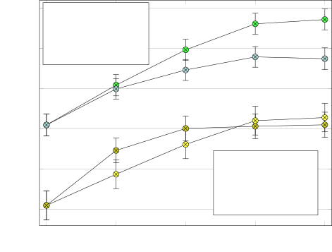

Fig. 9: Average overall distorsion results of _NN-joint_ (in dB) w.r.t.
NN inputs.

### VI-B Time-invariant conditions

#### VI-B1 Average performance

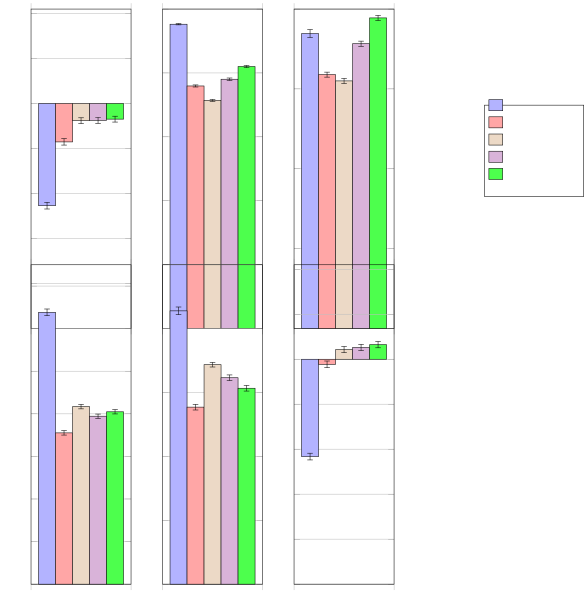

Fig. 10: Average results (in dB) in time-invariant conditions

| SI-SDR                    | ERLE    | SER              | ELR             | SNR             |
| ------------------------- | ------- | ---------------- | --------------- | --------------- |
| $`\mathbf{-16.2\pm 0.2}`$ | $`0.0`$ | $`-25.8\pm 0.3`$ | $`-1.1\pm 0.1`$ | $`-2.6\pm 0.2`$ |

TABLE IV: Metrics (in dB) related to the mixture signal $`\mathbf{d}`$
in the test set. The metrics are computed using the decomposition in
(15). ERLE $`=0`$ dB since there is no echo reduction. The SI-SAR is not
computed since there is no artifacts in the unprocessed target
$`\mathbf{s}_{\text{e}}`$.

Table IV shows the metrics related to the mixture $`\mathbf{d}`$. Fig.
10 shows the average results in time-invariant conditions. All
approaches have a negative SI-SDR, which is caused by the challenging
test set conditions.

_NN-joint_ outperforms _Togami_ by $`3.8`$ dB in terms of SI-SDR.
_NN-parallel_ provides information about this difference in performance
since it applies the linear filters $`\mathbf{\underline{H}}(f)`$ and
$`\mathbf{\underline{G}}(f)`$ in the same order as in _Togami_, but uses
a similar signal model and optimization algorithm as _NN-joint_ (see
Section II-D). _NN-parallel_ also outperforms _Togami_ by $`3.8`$ dB in
terms of SI-SDR. Therefore our proposed signal model and optimization
algorithm explain the SI-SDR difference with _Togami_. Although the
parallel variant achieves lower reduction of echo, reverberation and
noise than _Togami_, it introduces lower degradation in the target
$`\mathbf{s}_{\text{e}}`$. Regarding _NN-joint_ and _NN-parallel_,
applying the linear filters $`\mathbf{\underline{H}}(f)`$ and
$`\mathbf{\underline{G}}(f)`$ one after another only modifies the
distribution of the overall distortion over the echo (greater
reduction), reverberation (greater reduction) and noise (lower
reduction).

_NN-joint_ outperforms _Cascade_ $`1.0`$ dB in terms of SI-SDR.
_NN-cascade_ provides information about this difference in performance
since it also uses an NN-supported echo cancellation as in _NN-joint_,
but estimates each filter separately. _NN-cascade_ also outperforms
_Cascade_ by $`1.0`$ dB in terms of SI-SDR. Therefore the proposed
NN-supported echo cancellation in _NN-joint_ explains the SI-SDR
difference with _Cascade_. Regarding the optimization of the filters,
jointly optimizing them modifies the distribution of the overall
distortion over the echo (greater reduction), reverberation (lower
reduction) and noise (lower reduction).

From informal listening tests, we can state that the estimated target
speech $`\mathbf{\widehat{s}}_{\text{e}}`$ is often highly attenuated
and distorted during double-talk for all approaches when
$`\text{SER}\leq-20`$ dB. Regarding _Togami_, a slight reverberation
remains, but noise and echo seem completely removed. However, the
estimated target speech $`\mathbf{\widehat{s}}_{\text{e}}`$ is much more
attenuated and distorted than with the other approaches, especially
during _double-talk_ where the estimated target speech
$`\mathbf{\widehat{s}}_{\text{e}}`$ can never be heard. Regarding the
other approaches, post-residual distortions seem louder than with
_Togami_, but a comparison between these approaches is difficult to
make.

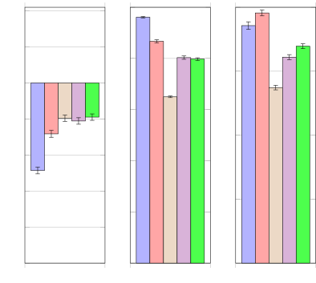

Fig. 11: Average results (in dB) in time-varying conditions.

#### VI-B2 Interactions of system components

While the above results show the performance averaged over all periods
(near-end talk, far-end talk and double-talk), we need further
performance analysis when only noise and reverberation are present, i.e.
during near-end talk, and when echo, reverberation and noise are present
simultaneously, i.e. during double-talk, to investigate how the system
components interact with each other. We discard the analysis of far-end
talk as the target $`\mathbf{s}_{\text{e}}`$ is absent in this scenario.

Fig. 12 shows the results during near-end talk. SER and ERLE are not
evaluated as echo is absent. All approaches have a positive SI-SDR. The
SI-SAR is also positive for all approaches. The trend in performance
between _NN-joint_, _NN-parallel_ and _Togami_ is similar to the results
averaged over all periods. _NN-cascade_ outperforms _Cascade_ by
$`+0.6`$ dB in terms of SI-SDR. This is due to greater dereverberation
and noise reduction with comparable degradation of the target
$`\mathbf{s}_{\text{e}}`$. This might be due to the performance before
post-filtering \[41, Sec. 8.1\]: linear dereverberation in _NN-cascade_
also achieves greater dereverberation and noise reduction than
_Cascade_. This results from echo cancellation: since the
dereverberation filter $`\mathbf{\underline{G}}(f)`$ is time-invariant,
its performance during _near-end talk_ is also affected by echo
cancellation during _double-talk_. In _NN-cascade_, the NN-supported
echo cancellation achieves greater echo reduction than Valin’s echo
cancellation in _Cascade_. As a result, linear dereverberation in
_NN-cascade_ is able to achieve greater reduction of the other
distortion signals, i.e. reverberation and noise.

_NN-cascade_ also outperforms _NN-joint_ in terms of SI-SDR during
_near-end talk_. Indeed, joint estimation of the filters in _NN-joint_
implies a performance compromise during all periods in order to reduce
all the distortion signals. In the case of _NN-cascade_, there is no
performance compromise as the filters are estimated separately. Thus
_NN-cascade_ might better perform when one distortion source is absent.
Hence the greater performance of _NN-cascade_ during _near-end talk_
where echo is absent. All in all, _NN-joint_ does not improve
performance when only reverberation and noise are present, but does not
degrade it either compared to _Cascade_.

Fig. 13 shows the results during double-talk. The trend in performance
between _NN-joint_, _NN-parallel_ and _Togami_ is similar to the results
averaged over all periods. _NN-cascade_ outperforms _Cascade_ by
$`1.2`$ dB in terms of SI-SDR. _NN-joint_ outperforms _NN-cascade_ by
$`0.6`$ dB in terms of SI-SDR. Therefore, during _double-talk_, both
joint optimization of the filters and the proposed NN-supported echo
cancellation in _NN-joint_ explain the SI-SDR improvement between
_NN-joint_ and _Cascade_. Although _NN-joint_ achieves lower
dereverberation and noise reduction than _NN-cascade_, it achieves
greater echo reduction with lower degradation of the target
$`\mathbf{s}_{\text{e}}`$. As a result, _NN-joint_ improves performance
when echo, reverberation and noise are present simultaneously.

From near-end talk to double-talk, the SI-SDR decreases by $`4.5`$ dB
for _NN-joint_, by $`5.7`$ dB for _NN-cascade_ and by $`6.2`$ dB for
_Cascade_. We conclude that _NN-joint_ improves robustness in terms of
SI-SDR when echo, reverberation and noise are present simultaneously,
while not degrading performance when only reverberation and noise are
present.

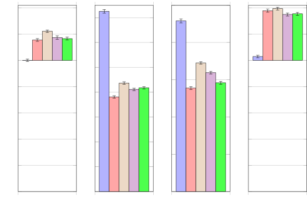

Fig. 12: Results (in dB) during near-end talk in time-invariant
conditions.

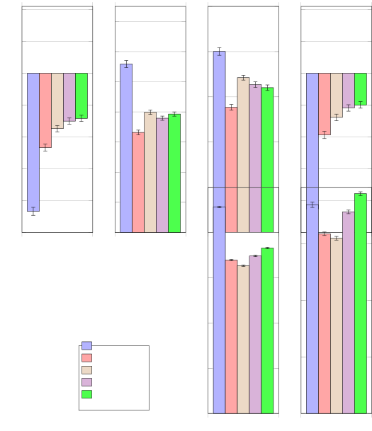

Fig. 13: Results (in dB) during double-talk in time-invariant
conditions.

### VI-C Time-varying conditions

Fig. 11 shows the average results in time-varying conditions. As the
trend in ELR, SNR and SAR is similar to the average results in
time-invariant conditions for all approaches, we discard these metrics
from the analysis and we provide them in the supporting document \[41,
Sec. 8.2\]. The SI-SDR is lower than in time-invariant conditions for
all approaches (see Fig. 10) since the spatial properties of target
$`\mathbf{s}_{\text{e}}`$ and the near-end residual reverberation
$`\mathbf{s}_{\text{r}}`$ vary over time while their SCMs
$`\mathbf{R}_{c}(f)`$ remain fixed. This also explains the drop in
SI-SDR for the two NN input configurations of _NN-joint_ in time-varying
conditions (see Fig. 9). Informal listening tests provide the same
observations as in time-invariant conditions.

The trend in performance between _NN-joint_, _NN-parallel_ and _Togami_
is similar to the average performance in time-invariant conditions. The
trend in SI-SDR between _NN-joint_, _NN-cascade_ and _Cascade_ is also
similar to the average SI-SDR in time-invariant conditions. However,
_Cascade_ achieves here the greatest echo reduction. _Cascade_ also
systematically achieves the greatest echo reduction after echo
cancellation, and also after echo cancellation and dereveberation \[41,
Sec. 8.1\]. This is explained by Valin’s adaptive approach for echo
cancellation which is designed for time-varying conditions \[48\] (see
Section II-A).

### VI-D Computation time

| Togami             | NN-cascade | NN-parallel | NN-joint  |
| ------------------ | ---------- | ----------- | --------- |
| $`\mathbf{-42\%}`$ | $`+56\%`$  | $`+7\%`$    | $`+16\%`$ |

TABLE V: Computation time of the approaches compared to _Cascade_ (in
percentage).

We discard the initialization as it is the same for all $`5`$ approaches
(see Section V-E). We compute the target $`\mathbf{\widehat{s}}_{e}`$
for a $`8`$ s utterance with a $`2.7`$ GHz Intel Core i5 CPU. Table V
shows the computation time of the approaches compared to the cascade
approach. _NN-joint_ is much faster than _NN-cascade_. Therefore joint
optimization of the filters significantly reduces the computation time.
In addition, _NN-parallel_ is slightly faster than _NN-joint_. Since
_Cascade_ is one of the approaches implemented in today’s industrial
devices, we conclude that both _NN-joint_ and _NN-parallel_ could be
implemented in real time.

## VII Conclusion

We proposed an NN-supported BCA algorithm for joint multichannel
reduction of acoustic echo, reverberation and noise. The approach
jointly models the spectra of the target and residual signals after echo
cancellation and dereverberation with an NN. We evaluated our system on
real recordings of acoustic echo, reverberation and noise acquired with
a smart speaker in various situations. When echo, reverberation and
noise are present simultaneously, the proposed approach outperforms the
cascade approach and Togami et al.’s joint reduction approach in terms
of overall distortion reduction while not degrading performance when
only reverberation and noise are present. Future work will focus on a
recursive version of the approach in order to better handle time-varying
conditions.

## References

- \[1\] E. Vincent, T. Virtanen, and S. Gannot, _Audio Source Separation
  and Speech Enhancement_. Wiley, 2018.
- \[2\] P. A. Naylor and N. D. Gaubitch, Eds., _Speech
  Dereverberation_. Springer, 2010.
- \[3\] E. Hänsler and G. Schmidt, _Acoustic Echo and Noise Control: a
  Practical Approach_. Wiley-Interscience, 2004.
- \[4\] J. S. Erkelens and R. Heusdens, “Correlation-based and
  model-based blind single-channel late-reverberation suppression in
  noisy time-varying acoustical environments,” _IEEE Transactions on
  Audio, Speech, and Language Processing_, vol. 18, no. 7, pp.
  1746–1765, 2010.
- \[5\] I. Kodrasi and S. Doclo, “Joint dereverberation and noise
  reduction based on acoustic multi-channel equalization,” _IEEE/ACM
  Transactions on Audio, Speech, and Language Processing_, vol. 24,
  no. 4, pp. 680–693, 2016.
- \[6\] O. Schwartz, S. Gannot, and E. A. P. Habets, “Multi-microphone
  speech dereverberation and noise reduction using relative early
  transfer functions,” _IEEE/ACM Transactions on Audio, Speech, and
  Language Processing_, vol. 23, no. 2, pp. 240–251, 2015.
- \[7\] T. Dietzen, S. Doclo, M. Moonen, and T. van Waterschoot, “Joint
  multi-microphone speech dereverberation and noise reduction using
  integrated sidelobe cancellation and linear prediction,” in _Proc.
  IWAENC_, 2018, pp. 221–225.
- \[8\] T. Yoshioka, T. Nakatani, M. Miyoshi, and H. G. Okuno, “Blind
  separation and dereverberation of speech mixtures by joint
  optimization,” _IEEE Transactions on Audio, Speech, and Language
  Processing_, vol. 19, no. 1, pp. 69–84, 2011.
- \[9\] H. Kagami, H. Kameoka, and M. Yukawa, “Joint separation and
  dereverberation of reverberant mixtures with determined multichannel
  non-negative matrix factorization,” in _Proc. ICASSP_, 2018, pp.
  31–35.
- \[10\] R. Le Bouquin Jeannès, P. Scalart, G. Faucon, and C. Beaugeant,
  “Combined noise and echo reduction in hands-free systems: a survey,”
  _IEEE Transactions on Speech and Audio Processing_, vol. 9, no. 8, pp.
  808–820, 2001.
- \[11\] S. Gustafsson, R. Martin, P. Jax, and P. Vary, “A
  psychoacoustic approach to combined acoustic echo cancellation and
  noise reduction,” _IEEE Transactions on Speech and Audio Processing_,
  vol. 10, no. 5, pp. 245–256, 2002.
- \[12\] W. Herbordt, S. Nakamura, and W. Kellermann, “Joint
  optimization of LCMV beamforming and acoustic echo cancellation for
  automatic speech recognition,” in _Proc. ICASSP_, 2005, pp. III–77–80.
- \[13\] G. Reuven, S. Gannot, and I. Cohen, “Joint noise reduction and
  acoustic echo cancellation using the transfer-function generalized
  sidelobe canceller,” _Speech Communication_, vol. 49, no. 7–8, pp.
  623–635, 2007.
- \[14\] M. Togami, Y. Kawaguchi, and R. Takashima, “Frequency domain
  acoustic echo reduction based on Kalman smoother with time-varying
  noise covariance matrix,” in _Proc. ICASSP_, 2014, pp. 5909–5913.
- \[15\] K. Nathwani, “Joint acoustic echo and noise cancellation using
  spectral domain Kalman filtering in double talk scenario,” in _Proc.
  IWAENC_, 2018, pp. 326–330.
- \[16\] R. Takeda, K. Nakadai, T. Takahashi, K. Komatani, T. Ogata, and
  H. G. Okuno, “ICA-based efficient blind dereverberation and echo
  cancellation method for barge-in-able robot audition,” in _Proc.
  ICASSP_, 2009, pp. 3677–3680.
- \[17\] M. Togami and Y. Kawaguchi, “Speech enhancement combined with
  dereverberation and acoustic echo reduction for time varying systems,”
  in _Proc. SSP_, 2012, pp. 357–360.
- \[18\] E. A. P. Habets, S. Gannot, I. Cohen, and P. C. Sommen, “Joint
  dereverberation and residual echo suppression of speech signals in
  noisy environments,” _IEEE Transactions on Audio, Speech, and Language
  Processing_, vol. 16, no. 8, pp. 1433–1451, 2008.
- \[19\] M. Togami and Y. Kawaguchi, “Simultaneous optimization of
  acoustic echo reduction, speech dereverberation, and noise reduction
  against mutual interference,” _IEEE/ACM Transactions on Audio, Speech,
  and Language Processing_, vol. 22, no. 11, pp. 1612–1623, 2014.
- \[20\] D. S. Williamson and D. Wang, “Speech dereverberation and
  denoising using complex ratio masks,” in _Proc. ICASSP_, 2017, pp.
  5590–5594.
- \[21\] Y. Zhao, Z.-Q. Wang, and D. Wang, “A two-stage algorithm for
  noisy and reverberant speech enhancement,” in _Proc. ICASSP_, 2017,
  pp. 5580–5584.
- \[22\] H. Seo, M. Lee, and J.-H. Chang, “Integrated acoustic echo and
  background noise suppression based on stacked deep neural networks,”
  _Applied Acoustics_, vol. 133, pp. 194–201, 2018.
- \[23\] H. Zhang and D. Wang, “Deep learning for acoustic echo
  cancellation in noisy and double-talk scenarios,” in _Interspeech_,
  2018, pp. 3239–3243.
- \[24\] F. Yang, G. Enzner, and J. Yang, “Statistical convergence
  analysis for optimal control of DFT-domain adaptive echo canceler,”
  _IEEE/ACM Transactions on Audio, Speech, and Language Processing_,
  vol. 25, no. 5, pp. 1095–1106, 2017.
- \[25\] C. M. Lee, J. W. Shin, and N. S. Kim, “DNN-based residual echo
  suppression,” in _Interspeech_, 2015, pp. 316–320.
- \[26\] G. Carbajal, R. Serizel, E. Vincent, and E. Humbert,
  “Multiple-input neural network-based residual echo suppression,” in
  _Proc. ICASSP_, 2018, pp. 231–235.
- \[27\] G. Enzner and P. Vary, “Frequency-domain adaptive Kalman filter
  for acoustic echo control in hands-free telephones,” _Signal
  Processing_, vol. 86, no. 6, pp. 1140–1156, 2006.
- \[28\] M. Togami and K. Hori, “Multichannel semi-blind source
  separation via local Gaussian modeling for acoustic echo reduction,”
  in _Proc. EUSIPCO_, 2011, pp. 496–500.
- \[29\] T. Nakatani, T. Yoshioka, K. Kinoshita, M. Miyoshi, and B. H.
  Juang, “Speech dereverberation based on variance-normalized delayed
  linear prediction,” _IEEE Transactions on Audio, Speech, and Language
  Processing_, vol. 18, no. 7, pp. 1717–1731, 2010.
- \[30\] T. Yoshioka and T. Nakatani, “Generalization of multi-channel
  linear prediction methods for blind MIMO impulse response shortening,”
  _IEEE Transactions on Audio, Speech, and Language Processing_,
  vol. 20, no. 10, pp. 2707–2720, 2012.
- \[31\] A. Jukic, T. van Waterschoot, T. Gerkmann, and S. Doclo,
  “Multi-Channel Linear Prediction-Based Speech Dereverberation With
  Sparse Priors,” _IEEE/ACM Transactions on Audio, Speech, and Language
  Processing_, vol. 23, no. 9, pp. 1509–1520, 2015.
- \[32\] K. Kinoshita, M. Delcroix, H. Kwon, T. Mori, and T. Nakatani,
  “Neural network-based spectrum estimation for online WPE
  dereverberation,” in _Interspeech_, 2017, pp. 384–388.
- \[33\] K. Furuya and A. Kataoka, “Robust speech dereverberation using
  multichannel blind deconvolution with spectral subtraction,” _IEEE
  Transactions on Audio, Speech and Language Processing_, vol. 15,
  no. 5, pp. 1579–1591, 2007.
- \[34\] M. Togami, Y. Kawaguchi, R. Takeda, Y. Obuchi, and N. Nukaga,
  “Optimized speech dereverberation from probabilistic perspective for
  time varying acoustic transfer function,” _IEEE Transactions on Audio,
  Speech, and Language Processing_, vol. 21, no. 7, pp. 1369–1380, 2013.
- \[35\] A. Cohen, G. Stemmer, S. Ingalsuo, and S. Markovich-Golan,
  “Combined weighted prediction error and minimum variance
  distortionless response for dereverberation,” in _Proc. ICASSP_, 2017,
  pp. 446–450.
- \[36\] S. Gannot, E. Vincent, S. Markovich-Golan, and A. Ozerov, “A
  consolidated perspective on multimicrophone speech enhancement and
  source separation,” _IEEE/ACM Transactions on Audio, Speech, and
  Language Processing_, vol. 25, no. 4, pp. 692–730, 2017.
- \[37\] N. Q. K. Duong, E. Vincent, and R. Gribonval, “Under-determined
  reverberant audio source separation using a full-rank spatial
  covariance model,” _IEEE Transactions on Audio, Speech, and Language
  Processing_, vol. 18, no. 7, pp. 1830–1840, 2010.
- \[38\] A. Ozerov and C. Févotte, “Multichannel nonnegative matrix
  factorization in convolutive mixtures for audio source separation,”
  _IEEE Transactions on Audio, Speech, and Language Processing_,
  vol. 18, no. 3, pp. 550–563, 2010.
- \[39\] A. A. Nugraha, A. Liutkus, and E. Vincent, “Multichannel audio
  source separation with deep neural networks,” _IEEE/ACM Transactions
  on Audio, Speech, and Language Processing_, vol. 24, no. 9, pp.
  1652–1664, 2016.
- \[40\] S. Leglaive, L. Girin, and R. Horaud, “Semi-supervised
  multichannel speech enhancement with variational autoencoders and
  non-negative matrix factorization,” in _Proc. ICASSP_, 2019, pp.
  101–105.
- \[41\] G. Carbajal, R. Serizel, E. Vincent, and E. Humbert, “Joint
  DNN-based multichannel reduction of echo, reverberation and noise:
  Supporting document,” Inria, Tech. Rep. RR-9284, 2019. \[Online\].
  Available:
  [https://hal.inria.fr/hal-02372431](https://hal.inria.fr/hal-02372431)
- \[42\] A. A. Nugraha, A. Liutkus, and E. Vincent, “Multichannel music
  separation with deep neural networks,” in _Proc. EUSIPCO_, 2016, pp.
  1748–1752.
- \[43\] A. Liutkus, D. Fitzgerald, and Z. Rafii, “Scalable audio
  separation with light kernel additive modelling,” in _Proc. ICASSP_,
  2015, pp. 76–80.
- \[44\] V. Panayotov, G. Chen, D. Povey, and S. Khudanpur,
  “Librispeech: an ASR corpus based on public domain audio books,” in
  _Proc. ICASSP_, 2015, pp. 5206–5210.
- \[45\] E. Vincent and D. R. Campbell, “Roomsimove,” 2008. \[Online\].
  Available:
  [http://homepages.loria.fr/evincent/software/Roomsimove_1.4.zip](http://homepages.loria.fr/evincent/software/Roomsimove_1.4.zip)
- \[46\] J. Le Roux, S. Wisdom, H. Erdogan, and J. R. Hershey, “SDR —
  half-baked or well done?” in _Proc. ICASSP_, 2019, pp. 626–630.
- \[47\] P. C. Loizou, _Speech Enhancement: Theory and Practice_. CRC
  Press, 2007.
- \[48\] J. M. Valin, “On adjusting the learning rate in frequency
  domain echo cancellation with double-talk,” _IEEE Transactions on
  Audio, Speech, and Language Processing_, vol. 15, no. 3, pp.
  1030–1034, 2007.
- \[49\] D. P. Kingma and J. Ba, “Adam: A method for stochastic
  optimization,” in _Proc. ICLR_, 2015.

|                                                                                 |                                                                                                                                                                                                                                                                                                                                                                                                                                                                                                                                                                                                                                                                                                 |
| ------------------------------------------------------------------------------- | ----------------------------------------------------------------------------------------------------------------------------------------------------------------------------------------------------------------------------------------------------------------------------------------------------------------------------------------------------------------------------------------------------------------------------------------------------------------------------------------------------------------------------------------------------------------------------------------------------------------------------------------------------------------------------------------------- |
| ![[Uncaptioned image]](arxiv-1911-08934v4--d2a27432d2bb.figures/figure-10.webp) | Guillaume Carbajal received the M.Sc. degree in machine learning from the Université Paris-Saclay (Paris, France) in 2016 and the State Engineering from Ecole Nationale des Ponts et Chaussées (Paris, France) in 2017. He worked as an audio research engineer at Invoxia (Issy-les-Moulineaux, France) from 2017 to 2020 and obtained the Ph.D. degree in informatics from the Université de Lorraine and Inria Nancy–Grand-Est (Nancy, France) in 2020. He is currently a postdoctoral researcher at the computer science department of the Universität Hamburg (Hamburg, Germany). His research interests include speech enhancement, audio-visual signal processing and machine learning. |

|                                                                                 |                                                                                                                                                                                                                                                                                                                                                                                                                                                                                                                                                                                                                                                                                                                                              |
| ------------------------------------------------------------------------------- | -------------------------------------------------------------------------------------------------------------------------------------------------------------------------------------------------------------------------------------------------------------------------------------------------------------------------------------------------------------------------------------------------------------------------------------------------------------------------------------------------------------------------------------------------------------------------------------------------------------------------------------------------------------------------------------------------------------------------------------------- |
| ![[Uncaptioned image]](arxiv-1911-08934v4--d2a27432d2bb.figures/figure-11.webp) | Romain Serizel received the M.Eng. degree in Automatic System Engineering from ENSEM (Nancy, France) in 2005 and the M.Sc. degree in Signal Processing from Université Rennes 1 (Rennes, France) in 2006. He received the Ph.D. degree in Engineering Sciences from the KU Leuven (Leuven, Belgium) in June 2011. From 2011 till 2016 he was a postdoctoral researcher at KU Leuven (Leuven, Belgium), FBK (Trento, Italy), and at Télécom ParisTech (Paris, France). He is now an Associate Professor with Université de Lorraine (Nancy, France) doing research on robust speech communications and ambient sound detection and classification. Since 2019, he is coordinating the DCASE challenge series together with Annamaria Mesaros. |

|                                                                                 |                                                                                                                                                                                                                                                                                                                                                                                                                                                                                                                                                                                                                                                                                                                                                                                     |
| ------------------------------------------------------------------------------- | ----------------------------------------------------------------------------------------------------------------------------------------------------------------------------------------------------------------------------------------------------------------------------------------------------------------------------------------------------------------------------------------------------------------------------------------------------------------------------------------------------------------------------------------------------------------------------------------------------------------------------------------------------------------------------------------------------------------------------------------------------------------------------------- |
| ![[Uncaptioned image]](arxiv-1911-08934v4--d2a27432d2bb.figures/figure-12.webp) | Emmanuel Vincent is a Senior Research Scientist with Inria (Nancy, France). He received the Ph.D. degree in music signal processing from the Institut de Recherche et Coordination Acoustique/Musique (Ircam, Paris, France) in 2004 and worked as a Research Assistant with the Centre for Digital Music at Queen Mary, University of London (United Kingdom), from 2004 to 2006. His research focuses on statistical machine learning for speech and audio signal processing, with application to audio source localization and separation, speech enhancement, and robust speech and speaker recognition. He is a founder of the series of CHiME, SiSEC and VoicePrivacy challenges. He was an associate editor for IEEE TRANSACTIONS ON AUDIO, SPEECH, AND LANGUAGE PROCESSING. |

|                                                                                 |                                                                                                                                                                                                                                                                                                                                                                                                                                                                                                       |
| ------------------------------------------------------------------------------- | ----------------------------------------------------------------------------------------------------------------------------------------------------------------------------------------------------------------------------------------------------------------------------------------------------------------------------------------------------------------------------------------------------------------------------------------------------------------------------------------------------- |
| ![[Uncaptioned image]](arxiv-1911-08934v4--d2a27432d2bb.figures/figure-13.webp) | Eric Humbert received the State Engineering from Centrale-Supélec (Paris, France) in 2002 and the M.Sc. degree in acoustics, computer science and signal processing applied to music (ATIAM) from the Université Pierre et Marie Curie (Paris, France) in 2003. He worked as an audio software engineer at Inventel (Paris, France) from 2003 to 2005, at Thomson (Paris, France) from 2005 to 2009 and at Technicolor from 2009 to 2010. He is currently the AI director at Invoxia (Paris, France). |
