# Narrow-band Deep Filtering for Multichannel Speech Enhancement

Xiaofei Li    Radu Horaud ^(†)^(†)thanks: X. Li is with Westlake
University, China, and R. Horaud is with Inria Grenoble Rhône-Alpes and
with Univ. Grenoble Alpes, France.

###### Abstract

In this paper we address the problem of multichannel speech enhancement
in the short-time Fourier transform (STFT) domain. A long short-time
memory (LSTM) network takes as input a sequence of STFT coefficients
associated with a frequency bin of multichannel noisy-speech signals.
The network’s output is the corresponding sequence of single-channel
cleaned speech. We propose several clean-speech network targets, namely,
the magnitude ratio mask, the complex STFT coefficients and the
(smoothed) spatial filter. A prominent feature of the proposed model is
that the same LSTM architecture, with identical parameters, is trained
across frequency bins. The proposed method is referred to as narrow-band
deep filtering. This choice stays in contrast with traditional wide-band
speech enhancement methods. The proposed deep filtering is able to
discriminate between speech and noise by exploiting their different
temporal and spatial characteristics: speech is non-stationary and
spatially coherent while noise is relatively stationary and weakly
correlated across channels. This is similar in spirit with unsupervised
techniques, such as spectral subtraction and beamforming. We describe
extensive experiments with both mixed signals (noise is added to clean
speech) and real signals (live recordings). We empirically evaluate the
proposed architecture variants using speech enhancement and speech
recognition metrics, and we compare our results with the results
obtained with several state of the art methods. In the light of these
experiments we conclude that narrow-band deep filtering has very good
speech enhancement and speech recognition performance, and excellent
generalization capabilities in terms of speaker variability and noise
type.

###### Index Terms: 

Speech enhancement, narrow-band, deep fitlering, LSTM.

## I Introduction

This paper addresses the problem of multichannel speech
enhancement/denoising using deep learning. In recent years, speech
enhancement based on deep neural networks has been thoroughly and
successfully investigated, see \[1\] for an overview. These methods are
often conducted in the time-frequency (TF) domain, and can be broadly
categorized into either monaural or multichannel techniques. The
monaural techniques use a neural network to map noisy-speech spectral
features onto clean speech targets. The input features, e.g. (logarithm)
signal spectra, cepstral coefficients, or linear prediction based
features, generally represent the frame-wise full-band spectral
structure associated with noisy speech. The target consists of either
clean speech spectral features or of ideal binary/ratio masks (IBM/IRM)
which are subsequently applied to the noisy-speech input. Recovering the
clean phase is beneficial for improving the perceptual quality, which
however is difficult due to the lack of a clear structure for phase
spectra. Alternatively, the real and image part of the speech spectra
both show a clear spectral structure, which are thus used either to
construct a complex IRM (cIRM) \[2\] or directly as the target \[3, 4\].
Widely used neural architectures for speech enhancement include
feed-forward neural networks (FNNs), convolutional neural networks
(CNNs) and recurrent neural networks (RNNs). The temporal dynamics of
speech can be modeled by stacking context frames in the FNN input, or by
dilated CNN \[5\], while they are automatically modeled by RNNs. In \[6,
7\], the memory-enhanced RNN, i.e. LSTM, is used to learn the long-term
dependencies of signals. There are only a handful of methods that
process frequency bands separately, e.g. \[8, 9\], namely a neural
network is trained for each subband: these subband spectral features are
mapped onto subband targets.

As for multichannel speech enhancement, it is popular to combine
supervised monaural approaches with unsupervised beamforming methods,
e.g. \[10, 11\]. The output of the former, i.e. a TF mask, is used to
discriminate between speech and noisy TF units, based on which the
steering vector of desired speech and noise covariance matrices are
computed by the latter. These approaches don’t learn the spatial
information. To exploit the spatial information, interchannel features
(sometimes combined with spectral features), e.g. interaural time-,
phase-, and level-difference (ITD, IPD and ILD) and the
cross-correlation function (CCF), are input to a neural network either
for full-band TF mask prediction, e.g. \[12, 13, 14\], or for subband TF
mask prediction, e.g. \[9, 15\]. Due to the use of the interchannel
features, these methods are sensitive to the position of the speech
source. Therefore, they consider the position of the speech source to be
fixed or to be known. In \[16\], the magnitude and phase of the
short-time Fourier transform (STFT) coefficients of all frequency bands
and microphones are directly input to a convolutional recurrent neural
network (CRNN), and predict the monaural full-band TF masks, where the
convolutional layers extract the inter-channel information and the
recurrent layers learn the temporal dynamics. This method is designed to
discriminate between the spatial characteristics of directional speech
sources and diffuse or uncorrelated sources, i.e. noise, and it is not
sensitive to the position of the speech source. In the above
multichannel techniques, TF masks serve as a preliminary of a
beamformer-based estimator. Even though TF masking is able to improve
the speech perceptual quality, it is widely accepted that the signal
artifacts created by masking, more specifically by the nonlinear
operation of masking, is harmful for automatic speech recognition (ASR).
Therefore, beamforming is generally used as an interface between the
speech enhancement/separation front-end and the ASR back-end. There are
several attempts to skip the masking step, and directly predict the
beamformer using network. In \[17\], an FNN is designed to learn the
frequency-domain beamformers from the time-domain generalized cross
correlation (GCC) function. In \[18\], the time-domain spatial filters
are adaptively predicted by inputting the network a segment of
multichannel raw waveforms. The beamforming network proposed in \[19\]
takes as input the full-band multichannel STFT coefficients and predicts
the beamformers for all the frequency bands.

In this work, we propose a LSTM-based multichannel speech denoising
method. Unlike the vast majority of existing approaches that perform
full-band speech enhancement, the proposed method processes each STFT
frequency bin separately: this is referred to as narrow-band (or
frequency-wise) deep filtering. The proposed LSTM training is performed
with input and target sequences of noisy- and clean-speech,
respectively. Each input is a sequence of multichannel STFT coefficients
associated with a single frequency bin. Correspondingly, the target is a
sequence of clean speech taken at the same frequency for the reference
channel. Importantly, the network weights are shared across frequency
bins, which encourages the network to learn common information accross
frequency bins, and also leads to a dramatic reduction in the complexity
and computational burden of the training process. Our approach is
grounded by the fact that a large number of unsupervised speech
enhancement methods exploit frequency-wise narrow-band information. More
precisely, the proposed method is motivated on the following grounds:

- •
  The frequency-wise temporal evolution of the STFT magnitude is
  informative due to the non-stationary nature of speech against the
  stationarity of noise, which stands at the foundation of unsupervised
  single-channel noise power estimation, e.g. \[20, 21\], as well as
  multichannel relative transfer function (RTF) estimation \[22, 23\].
  Recently it was demonstrated that a LSTM network is able to accomplish
  monaural frequency-wise noise power estimation \[24\];
- •
  The frequency-wise spatial characteristics of the STFT coefficients
  fully reflect both the directionality of speech and the diffusion of
  noise and reverberation. This is the foundation of speech enhancement
  methods such as the coherent-to-diffuse power ratio method \[25\] and
  beamforming techniques \[22, 26\]. Moreover, the temporal dynamics of
  frequency-wise spatial correlation contain motion information
  associated with a speech source;
- •
  The frequency-wise representation is informative for clean-speech
  estimation. Indeed, with proper parameter estimation, single-channel
  spectral subtraction (Bayesian filtering) \[27, 28\], and multichannel
  spatial filtering, e.g. beamforming \[22\] and multichannel Wiener
  filtering \[29\], are performed independently across frequencies.

Overall, the proposed LSTM architecture is expected to fully exploit the
frequency-wise information, not only by learning a regression from the
input sequence to the output sequence, but also by learning a group of
functions for clean speech estimation. By sharing the network weights
across frequencies, the network is encouraged not to learn the subband
spectral structure of siganls, but to learn the narrow-band information
mentioned above, and to perform narrow-band deep filtering. The proposed
method is similar to \[16\] in that the network learns how to
discriminate between the spatial characteristics of directional speech
sources and the diffuse/uncorrelated nature of noise, hence the method
is agnostic to the position of the speech source.

Compared to full-band techniques \[2, 3, 4, 5, 6, 7, 10, 11, 12, 13, 14,
15, 16, 19\], the proposed method ignores cross-band information, and
focuses on learning narrow-band information. On one hand, this indeed
loses some useful informations, such as the spectral information. On the
other hand, it has the following advantages: (i) it is questionable
whether full-band models are able to learn the narrow-band information
mentioned above. As shown below, by focusing on the narrow-band signal
representations, the proposed method is able to learn long-term temporal
dependencies, e.g. on the order of 150 STFT frames; (ii) due to the
reduced dimension of both the input and the output, the proposed network
has a smaller number of parameters than full-band models, and hence it
requires much less training data and both training and prediction have a
lower computational cost; (iii) the proposed method is not sensitive to
the wide-band spectral pattern of signals, since it only exploits the
narrow-band information. As a result, the proposed network has a very
good generalization capability in terms of speaker variability and noise
type, and (iv) experiments demonstrate that the enhanced speech obtained
with the proposed method can be directly used for ASR, which means the
signal artifacts caused by the prediction error of the proposed
narrow-band network are not detrimental for ASR.

This paper is an extended version of a recently published conference
paper \[30\], in which we proposed a narrow-band LSTM architecture for
speech enhancement and we demonstrated its effectiveness when using the
magnitude ratio mask as a network target. The contributions of this work
over \[30\] include:

- •
  In addition to the magnitude ratio mask, we evaluate other targets,
  namely the STFT complex coefficient and a spatial filter. These two
  targets are not new on their own, as the complex STFT coefficient has
  been used in \[3, 4\], and beamformer in \[17, 18, 19\]. However, the
  theoretical bases for estimating them in this work are completely
  different from the ones in other works: (i) the prediction of the
  complex STFT coefficient in \[3, 4\] is based on the fact that the
  real and image spectrograms both have a clear structure being similar
  to the magnitude spectrogram, and thus can be predicted based on
  supervised regression. In contrast, in the proposed narrow-band
  method, the spectrogram structure obviously does not exist. Instead,
  we aim to exploit the spatial features of signals to estimate the
  complex STFT coefficient of clean speech; (ii) in the previous deep
  beamforming techniques \[17, 18, 19\], the beamformer of all the
  frequencies are predicted together by one single network. However,
  such setup has never been testified, as the unsupervised beamformer
  \[22, 26\] is usually estimated frequency-wise. The beamforming
  techniques consists of two components, i.e. parameter (such as RTF and
  noise covariance matrix) estimation and beamformer computation.
  Narrow-band has rich information for parameter estimation as discussed
  above, and beamformer computation is naturally conducted
  frequency-wise. Therefore, the proposed narrow-band spatial filtering
  technique appears to be a supervised deep-learning implementation of
  unsupervised beamforming techniques.
- •
  The proposed method is extensively evaluated with more experiments in
  terms of the speaker/noise-generalization capability and speech
  enhancement. In addition, we evaluate the automatic speech recognition
  (ASR) performance of the proposed method. We do have an important new
  finding, namely the proposed narrow-band framework is more suitable
  for ASR compared to the full-band techniques, although the latter may
  achieve better speech enhancement evaluation scores. Different speech
  enhancement methods would bring different types of processing
  artifacts \[31\]. Our experiments demonstrate that the wide-band
  artifacts or cross-band structured artifacts, brought by the full-band
  methods are more harmful than the narrow-band artifacts brought by the
  proposed method.
- •
  As for the spatial filter target, to incorporate one important
  characteristic of beamforming, i.e. beamformer is somehow temporally
  smoothed, we propose a new training loss to impose the temporal
  smoothing on the predicted spatial filter. This keeps the temporal
  consistence of both the enhanced speech and the residual noise, and
  thus improves the ASR performance, although the speech enhancement
  performance degrades.

Overall, this work comprehensively presents and evaluates the
narrow-band deep filtering method. Different targets are evaluated,
which is important and necessary since the theoretical bases for
estimating each target in narrow-band are different from the ones in
wide-band. It is also important to evaluate the ASR performance of the
proposed method, since state-of-the-art speech enhancement networks do
not necessarily improve ASR performance.

The remainder of this paper is organized as follows. Section II
describes the proposed narrow-band deep filtering model and the adopted
LSTM architecture. Section III describes the experimental setup, the
LSTM network training characteristics, the speech enhancement and speech
recognition experimental results. Section IV concludes the paper.
Supplemental material (examples of processed noisy speech utterances)
are available at https://team.inria.fr/perception/research/mse-lstm/.

## II Narrow-band Speech Enhancement Networks

Let the multichannel signals be represented in the STFT domain:

```math
x_{i}(k,t)=s_{i}(k,t)+u_{i}(k,t), \tag{1}
```

where $`x_{i}(k,t)`$, $`s_{i}(k,t)`$ and $`u_{i}(k,t)`$ are the
complex-valued STFT coefficients of the microphone, speech and noise
signals, respectively, and where $`i\in\{1\dots I\}`$,
$`k\in\{0\dots K-1\}`$ and $`t\in\{1\dots T\}`$ denote the channel
(microphone), frequency-bin and frame indices, respectively. In this
paper the focus is on signal denoising task and hence the reverberation
effect is not addressed. Therefore, the objective is to recover the
(possibly reverberant) speech signal of one reference channel, e.g.
$`s_{r}(k,t)`$, where $`r`$ denotes the reference channel. In the
proposed method and as already mentioned, a single network is trained
using the narrow-band sequences over all frequency bins, and the trained
network is then used to predict a sequence at each frequency bin.
Thence, for the sake of clarity, the frequency-bin index $`k`$ will be
omitted hereafter.

### II-A Input Features

For each TF bin, the real and imaginary parts, $`\mathcal{R}(\cdot)`$,
$`\mathcal{I}(\cdot)`$ of the multichannel STFT coefficients are
concatenated into the vector:

```math
\displaystyle\mathbf{x}(t)=\big(\mathcal{R}(x_{1}(t)),\mathcal{I}(x_{1}(t)),\dots,\mathcal{R}(x_{I}(t)),\mathcal{I}(x_{I}(t))\big)^{\top}, \tag{2}
```

where ^(⊤) denotes vector transpose. $`\mathbf{x}(t)\in\mathbb{R}^{2I}`$
contains information associated with one TF bin. The input sequence of
LSTM is a temporal sequence of such vectors at each frequency bin,
namely:

```math
\tilde{\mathbf{X}}=\big(\mathbf{x}(1),\dots,\mathbf{x}(t),\dots,\mathbf{x}(T)\big), \tag{3}
```

where $`T`$ denotes the number of time steps of the LSTM network. To
facilitate network training, the input sequence has to be normalized to
equalize the input levels across channels and across time. We
empirically set to $`1`$ the STFT magnitude of the reference channel,
namely:

```math
\begin{cases}\mathbf{X}=\tilde{\mathbf{X}}/\mu\\
\mathrm{with:}\quad\mu=\frac{1}{T}\sum_{t=1}^{T}|x_{r}(t)|.\end{cases} \tag{4}
```

### II-B Output Target and Training Loss

As already mentioned, we want to recover the clean speech signal of the
reference channel, e.g. $`s_{r}(t)`$. To this end, we test the following
network targets.

#### II-B1 Magnitude Ratio Mask (MRM)

For each TF bin, the rectified STFT magnitude ratio mask

```math
\displaystyle M(t)=\text{min}\left(\frac{|s_{r}(t)|}{|x_{r}(t)|},1\right) \tag{5}
```

is the target, where the function $`\text{min}(\cdot)`$ rectifies the
mask to fall in the range $`[0,1]`$. For each frequency bin, the target
sequence is

```math
\mathbf{M}=\big(M(1),\dots,M(t)\dots,M(T)\big). \tag{6}
```

The mean squared error (MSE) of MRM, i.e. $`({M}(t)-\hat{M}(t))^{2}`$,
is taken as the training loss, where $`\hat{M}(t)`$ denotes the MRM
network prediction. At test, the MRM prediction $`\hat{M}(t)`$ is used
to estimate the module of the STFT coefficient while its phase is the
phase of the reference channel:

```math
\displaystyle|\hat{s}(t)| \displaystyle=\hat{M}(t)|x_{r}(t)|, \tag{7}
```

```math
\displaystyle\arg(\hat{s}(t)) \displaystyle=\arg(x_{r}(t)) \tag{8}
```

It was demonstrated in \[32\] that, in the framework of monaural
full-band masking, the MRM achieves the best performance among various
magnitude-based masks, such as IBM or IRM. Our preliminary experiments
within the present framework also demonstrate that this target performs
slightly better than IRM. The magnitude mask performs as a spectral
subtraction gain for denoising in \[27, 28\] and for dereverberation in
\[25\]. Many narrow-band informations can be used to estimate the gain,
such as the stationarity and diffuseness of signals.

#### II-B2 STFT Complex Coefficient (CC)

In the monaural full-band speech enhancement techniques, cIRM \[2\] and
real/image spectra \[3, 4\] are taken as the training targets to
estimate the complex spectra, since both real and image spectrograms
have a clear structure and thus can be predicted by supervised
regression. In this work, the narrow-band network does not exploit the
spectral structure of the signal. Instead, we estimate the speech STFT
coefficient from the multi-microphone signals, which is possible: the
speech images in the multi-microphone signals are actually the source
speech multiplied by the acoustic transfer functions, alternatively the
speech image at the reference channel multiplied by the RTFs. The RTFs
are time-invariant (resp. slowly time-varying) for the static (resp.
moving) speaker case, and can be (adaptively) estimated. Then, the
speech STFT coefficient of the reference channel can be estimated by
such as beamforming. Note that this RTF-based beamforming technique just
serves here as an example to show that, at one frequency bin, it is
possible to estimate the speech STFT coefficient from the
multi-microphone signals. We let the network automatically learn a
function to do this, by exploiting the spatial features of speech and
noise. We have compared CC and cIRM with some preliminary experiments,
while similar performance were achieved.

Formally, the real and imaginary parts of $`s_{r}(t)`$ for one TF bin,
i.e.

```math
\displaystyle\mathbf{s}(t)=(\mathcal{R}(s_{r}(t)),\mathcal{I}(s_{r}(t)))\in\mathbb{R}^{2} \tag{9}
```

are directly used as the network target. For each frequency bin, the
target sequence is

```math
\mathbf{S}=\big(\mathbf{s}(1),\dots,\mathbf{s}(t)\dots,\mathbf{s}(T)\big). \tag{10}
```

According to the input sequence normalization, i.e. (4), the target
signal is also normalized with $`\mu`$, like $`s_{r}(k,t)/\mu`$.
However, we keep to use $`s_{r}(k,t)`$ to denote the normalized signal
for notational simplicity. The training loss is the MSE between the STFT
coefficient of clean speech and the network prediction, i.e.
$`\|\mathbf{s}(t)-\hat{\mathbf{s}}(t)\|^{2}`$.

At test, $`\hat{\mathbf{s}}(t)`$ is the predicted enhanced signal. The
signal normalization is conducted for each frequency independently,
thence the enhanced signal $`\hat{\mathbf{s}}(t)`$ should be multiplied
by $`\mu`$ to keep the level consistency across frequencies.

#### II-B3 Spatial Filtering

The combination of TF masking and beamforming techniques often achieve
state-of-the-art ASR performance. The beamforming techniques consists of
two components, i.e. parameter estimation and beamformer computation.
For each frequency, parameters, e.g. speech RTF and noise covariance
matrix, are estimated using the speech-dominant and noise-dominant TF
bins, respectively, and then beamformer is derived based on some
criteria. In the techniques of combining TF masking and beamforming, the
monaural full-band TF masking provides an accurate classification of
speech-dominant and noise-dominant TF bins, which make a great
contribution to the success of these techniques. This success motivates
the development of deep beamforming techniques \[17, 18, 19\], which
leverage one single network to directly predict the beamformer for all
the frequencies. Considering that beamforming is actually a narrow-band
method, namely its parameter estimation and beamformer computation are
both conducted frequency-wise, it seems not reasonable to predict the
beamformer for all the frequencies together. In contrast, we think the
present narrow-band framework is naturally consistent to beamforming. As
discussed above, narrow-band also provides rich pieces of information
for speech/noise TF bins classification, such as the stationarity and
spatial characteristics of signals. To explicitly mimic the
beamforming-like techniques, we let the network output a multichannel
spatial filter.

Formally, for each TF bin, define the multichannel spatial filter
$`\mathbf{w}(t)\in\mathbb{R}^{2I}`$ by:

```math
\displaystyle\mathbf{w}(t)=\big(\mathcal{R}(w_{1}(t)),\mathcal{I}(w_{1}(t)),\dots,\mathcal{R}(w_{I}(t)),\mathcal{I}(w_{I}(t))\big)^{\top}. \tag{11}
```

The output is then used to estimate the clean speech,

```math
\hat{\mathbf{s}}_{\text{sf}}(t)=(\mathcal{R}(\hat{s}_{\text{sf}}(t)),\mathcal{I}(\hat{s}_{\text{sf}}(t)))^{T}, \tag{12}
```

by applying the following complex-valued spatial filtering to the input:

```math
\displaystyle\mathcal{R}(\hat{s}_{\text{sf}}(t)) \displaystyle=\sum_{i=1}^{I}\big(\mathcal{R}(w_{i}(t))\mathcal{R}(x_{i}(t))-\mathcal{I}(w_{i}(t))\mathcal{I}(x_{i}(t))\big),
```

```math
\displaystyle\mathcal{I}(\hat{s}_{\text{sf}}(t)) \displaystyle=\sum_{i=1}^{I}\big(\mathcal{R}(w_{i}(t))\mathcal{I}(x_{i}(t))+\mathcal{I}(w_{i}(t))\mathcal{R}(x_{i}(t))\big).
```

For each frequency bin, the sequence of spatial filter is

```math
\mathbf{W}=\big(\mathbf{w}(1),\dots,\mathbf{w}(t)\dots,\mathbf{w}(T)\big). \tag{13}
```

The major goal of deep spatial filtering is to make the enhanced signal
more suitable for ASR. It is difficult to set the training target and
loss for the speech enhancement network, since the ASR preference on the
enhanced signal is not very clear. One promising way is to optimize the
speech enhancement network directly by the ASR loss, as is done in \[17,
18, 19\]. One difficulty for this is the joint training of the speech
enhancement network and ASR network, which suffers from the local optima
problem. To mitigate this problem, the speech enhancement network can be
first pre-trained, such as with the target of delay and sum beamformer
(DSB) and log-magnitude spectra in \[17\], or with the target of DSB
enhanced signal in \[19\]. In this work, we focus on the narrow-band
speech enhancement network itself, and its joint training with ASR
network is left for future work. We set the training loss to a regular
speech enhancement loss, i.e. the MSE loss of the STFT coefficient
$`\|\mathbf{s}(t)-\hat{\mathbf{s}}(t)\|^{2}`$ (the one also used for the
CC target). In the present spatial filtering framework, this loss is in
the same spirit as the multichannel Wiener filter. We refer to this loss
simply as spatial filter (SF).

This loss is optimal in the speech enhancement sense, which however is
not necessarily optimal for ASR. We think one important characteristic
of beamforming that makes it good at ASR is that: the parameters, e.g.
RTF and noise covariance matrix, are normally estimated with a long-term
temporal smoothing, thence the beamformer is just slowly time-varying as
well, which keeps the temporal consistence of both the enhanced speech
and the residual noise. In other words, beamforming does not cause
abrupt artifacts. Based on this assertion, we revise the training loss
to smooth the spatial filter as:

```math
\|\mathbf{s}(t)-\hat{\mathbf{s}}(t)\|^{2}+\lambda\|\mathbf{w}(t)-{\mathbf{w}}(t-1)\|^{2} \tag{14}
```

where $`\lambda`$ denotes the weight for the smoothing loss. This loss
will be referred to as smoothed spatial filter (SSF).

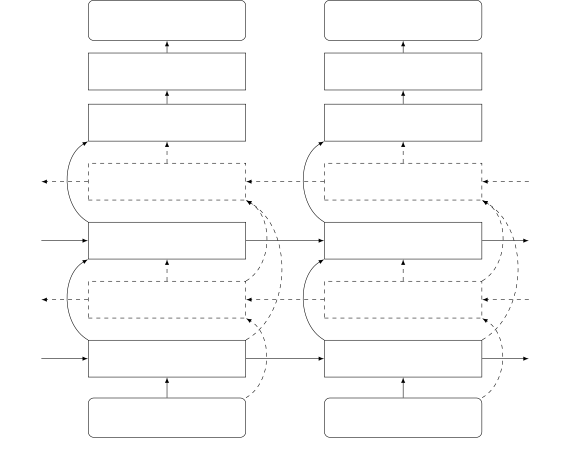

Fig. 1: Diagram of the proposed architecture. The unidirectional
(forward) LSTM is represented with solid-lines blocks and arrows, while
the additional blocks and arrows needed for BLSTM are represented with
dashed lines.

### II-C Network Architectures

The architectures of the proposed LSTM and bidirectional LSTM (BLSTM)
networks are shown on Fig. 1. It maps the input sequence onto the output
sequence. Two LSTM layers are stacked. Through a dense layer, the output
vector of the second LSTM layer is mapped onto the output vector. Then
an activation is applied to obtain the network output. The output size
of LSTM layers are set based on preliminary experiments. Notice that
this figure summarizes three networks with three different targets and
associated outputs, namely MRM, CC, and SF. While the input sequence at
frequency bin $`k`$ is the same for all three networks, namely
$`\mathbf{X}(k)`$ defined in (4), the network outputs and the output
dimensions are different. The output sequences $`\mathbf{M}(k)`$,
$`\mathbf{S}(k)`$ and $`\mathbf{W}(k)`$, defined by (6), (10) and (13),
are of dimension 1, 2, and $`2I`$, respectively.

Moreover, we chose different activation functions for each one of these
networks, namely _sigmoid_, _identity_ and _tanh_, respectively. We
remind that the same network (same parameters) is trained for all the
frequency bins $`k\in\{0\dots K-1\}`$. The number of parameters to be
learned slightly varies with the number of microphones and with the
dimension of the output. On an average, the LSTM and BLSTM networks have
$`470,000`$ and $`1,200,000`$ parameters, respectively.

## III Experiments

### III-A Experimental Setup

|                  |                                      |                     |                     |                  |
| ---------------- | ------------------------------------ | ------------------- | ------------------- | ---------------- |
|                  | WB-CRNN-MRM \[16\]                   | WB-BLSTM1-SF \[19\] | WB-BLSTM2-SF \[19\] | BLSTM-SF (prop.) |
| Input dimension  | $`4\times 129\times 2`$              | 2056                | 2056                | 8                |
| Network          | 3 CNN ($`2\times 1`$, 64, out: 8259) | 1 BLSTM (256)       | 2 BLSTM (1024)      | 1 BLSTM (256)    |
|                  | 1 BLSTM (128)                        | 1 BLSTM (128)       | 1 Dense (2056)      | 1 BLSTM (128)    |
|                  | 1 Dense (512) + 1 Dense (129)        | 1 Dense (2056)      |                     | 1 Dense (8)      |
| Output dimension | 129                                  | 2056                | 2056                | 8                |
| \# Parameters    | 8.8 M                                | 5.9 M               | 54.6 M              | 1.2 M            |
| Training data    | 19 hours                             | 11 hours            | 56 hours            | 11 hours         |

TABLE I: Network summary of WB-CRNN-MRM, WB-BLSTM1-SF, WB-BLSTM2-SF and
the proposed BLSTM-SF, for the 4CH case.

#### III-A1 Data Generation

We use the CHiME4 dataset \[33\], which was recorded with six
microphones embedded in a tablet device. CHiME4 toolkit provides a
method to simulate the multichannel data. However, instead of using the
multichannel frequency responses, this method only simulates the
multichannel time delays. Our preliminary experiments show that training
the network with this type of simulated data performs poorly with real
test data. Therefore, we use real data both for training and for testing
purposes. The noise-free multichannel speech data were recorded in a
booth (BTH) and the training, development and evaluation data were
recorded by three different groups of four speakers. The multichannel
background noise were recorded with four noisy environments, namely bus
(BUS), cafe (CAF), pedestrian area (PED), and street junction (STR). For
each type of noise, four to five sessions were recorded at different
times, with a duration of about 0.5 hours per session.

The four speakers in BTH training set (399 utterances) are used for
network training, and the eight speakers in BTH development (410
utterances) and evaluation (330 utterances) sets are used for test. Each
noise session is split into two sub-sessions used for training (60%) and
for test (40%), respectively, which means that different noise instances
are used for training and for test. To generate the training data, noise
segments randomly extracted from the training sub-sessions are mixed
with BTH training utterances, with signal-to-noise-ratios (SNRs)
randomly selected from the interval$`[-5,10]`$ dB. Each training
utterance is mixed with fifteen different randomly selected noise
segments, and a total of about 11 hours of training data are generated.

Two groups of data are tested, (i) MIXED data: background noise segments
randomly extracted from the test sub-sessions are mixed with BTH test
utterances, with SNRs in $`\{-4,0,4,8\}`$ dB. For each noise type and
SNR, about 200 test utterances are generated; (ii) REAL data: the
development (Dev) and evaluation (Eval) sets from CHiME4 real data were
recorded in the four noisy locations by the same speakers in both
development and evaluation BTH sets.

The signals are transformed to the STFT domain using a 512-sample
(32 ms) Hanning window with a frame step of 256 samples. The sequence
length for training is set to $`T=192`$ frames (about 3 s), which means
the LSTM network is trained to learn 192 time steps of memory. The
training sequences are picked out from the utterance-level signals with
50% overlap for two adjacent sequences. In total, about 6.55 millions of
training sequences are generated. For test, the utterances are not cut
into sequences with length of $`192`$ frames but, instead, the entire
utterances are directly used for sequence-to-sequence prediction.

#### III-A2 Training Configuration

We found that the microphone \#1 recording in the evaluation set has a
much larger volume than the volume used in other recording sets. The
issue of microphone array mismatch is beyond the scope of this work,
thus microphone \#1 is not used. Microphone \#2 is not used as well, due
to its low availability. We conducted experiments with two microphone
configurations, i.e. microphones \#3, \#4, \#5 and \#6 (4CH), and
microphones \#5 and \#6 (2CH). Microphone \#6 is taken as the reference
channel. The network variants are named based on the network type, i.e.
LSTM or BLSTM, on the output target, i.e. MRM, CC, SF or SSF. For
example, BLSTM-SSF refers to BLSTM with smoothed spatial filter as
target. Based on some preliminary experiments, we set the weight
$`\lambda`$ in (14) for BLSTM-SSF to 1. All these network variants are
trained individually from scratch.

We use the Keras environment \[34\] to implement the proposed
architectures and associated methods. The Adam optimizer \[35\] is used
with a learning rate of 0.001. The batch size is set to 512. The
training sequences were shuffled. Based on some preliminary experiments,
all the networks are trained with ten epochs.

#### III-A3 Performance Metrics

To evaluate and benchmark the speech enhancement performance for the
MIXED data, three intrusive metrics are used, (i) the perceptual
evaluation of speech quality (PESQ) \[36\] which evaluates the quality
of the enhanced signal in terms of both noise reduction and speech
distortion, (ii) the short-time objective intelligibility (STOI) \[37\],
a metric that highly correlates with noisy speech intelligibility; and
(iii) the signal-to-distortion ratio (SDR) \[38\] in dB measures the
level of noise reduction. For all the metrics, the larger the better.
The BTH clean signal is taken as the reference signal.

For REAL data, these intrusive metrics are not used because the
close-talk signals provided in the CHiME4 dataset are not reliable.
Instead, a non-intrusive metric is used to measure the speech
enhancement performance, i.e. the normalized speech-to-reverberation
modulation energy ratio (SRMR) \[39\], which measures the amount of
noise, and also reflects the speech intelligibility. In addition, we
tested the performance of automatic speech recognition (ASR) obtained
with the enhanced signals. The ASR of \[40\], with already-trained ASR
models and decoding recipe provided in CHiME4 is taken as the baseline
system.¹¹ 1
http://spandh.dcs.shef.ac.uk/chime_challenge/chime2016/download.html
This system uses mel-frequency cepstral coefficients (MFCC), a DNN-HMM
acoustic model and an RNN language model. The DNN-HMM acoustic model is
trained using the single-channel noisy multi-condition CHiME4 training
data. The ASR performance is measured with the word error rate (WER),
the lower the better.

#### III-A4 Comparison Methods

We compare with the following four multichannel speech enhancement
methods:

- •
  The BeamformIt method of \[41\], based on an unsupervised
  filter-and-sum beamforming technique;
- •
  The neural-network based generalized eigenvalue beamformer (NN-GEV)
  method of \[10\]. A BLSTM network is used to estimate a spectral mask,
  based on which a generalized-eigenvalue beamformer is computed and
  applied to speech denoising. We use the toolkit provided by the
  authors of \[10\],²² 2 https://github.com/fgnt/nn-gev in which the
  BLSTM parameters had already been trained using the CHiME4 training
  dataset;
- •
  The CRNN method of \[16\] takes as input multichannel full-band STFT
  coefficients and predicts single-channel full-band MRM, i.e. (5).
  Several CNN layers are employed for each STFT frame to extract the
  inter-channel information, then followed by one BLSTM layer to learn
  the inter-frame information, where two past frames and two future
  frames are taken as the context for each frame. Since the authors’
  implementation is not publicly available, we implemented the method
  and used the CHiME4 dataset to train and evaluate \[16\]. About 19
  hours of training data were used, from which 9.14 millions of training
  samples were generated. The STFT is conducted with 256-sample frame
  length and 128-sample frame step. We refer to this method as wide-band
  CRNN-MRM (WB-CRNN-MRM);
- •
  The full-band deep beamforming network of \[19\]. A BLSTM network
  takes as input the multichannel full-band (real and image parts of)
  STFT coefficients with dimension of $`2KI`$, and predicts the
  full-band (real and image parts of) beamformer with the same dimension
  as input. To have a fair comparison, we don’t follow the training
  setup presented in \[19\] – that trains the speech enhancement network
  with an ASR loss. Instead, we follow the way presented in this work
  that uses the MSE loss of the enhanced STFT coefficients. The same
  STFT configuration with the proposed method is taken. We implemented
  two networks: (i) the one presented in Fig. 1, namely two BLSTM layers
  are stacked, each layer has 256 and 128 hidden units, respectively.
  This network is trained using the same amount of data with the
  proposed method, i.e. about 11 hours. The training sequences with
  $`192`$ frames are picked out from the utterance-level signals with
  50% overlap for two adjacent sequences. This generates about
  $`25,000`$ training sequences. This network is referred to as
  WB-BLSTM1-SF; (ii) the previous network is obviously too small
  relative to the input/output dimension. We trained a more appropriate
  network with two layers stacked, and with 1024 hidden units per layer.
  About 56 hours of training data were used. This network is referred to
  as WB-BLSTM2-SF. Both networks are trained with a batch size of 32.

Table I briefly summarizes the four networks, i.e. WB-CRNN-MRM,
WB-BLSTM1-SF, WB-BLSTM2-SF and the proposed BLSTM-SF. Note that the
proposed networks with other targets are very close to BLSTM-SF only
with a slight difference due to the different output dimensions. One
important characteristic of the proposed narrow-band network is the
small network size and the low training data demand.

### III-B Evaluation of Generalization Capability

The default training setup presented in Section III-A1 is speaker
independent and noise-type dependent (SID-ND): even though training and
test use different noise instances, they both use all the four noise
types. To evaluate the generalization capability in terms of speaker
identity and of noise type, two extra training setups are also tested :
(i)  speaker independent and noise-type independent (SID-NID): four
speakers are used for training and the other eight speakers are used for
test, and three noise types are used for training and the other noise
type is used for test, and (ii) speaker dependent and noise-type
dependent (SD-ND): all twelve speakers and all four noise types are used
to generate training data. For each method, a similar amount of training
data were generated for all these three configurations.

Fig. 2 shows the speech enhancement results obtained with the MIXED data
for these three training configurations. For the wide-band methods, i.e.
WB-CRNN-MRM, WB-BLSTM1-SF and WB-BLSTM2-SF, the speaker dependent case,
i.e. SD-ND, noticeably outperforms the speaker independent case, i.e.
SID-ND. The noise-type dependent/independent configurations, i.e. SID-ND
and SID-NID, achieve similar performance. The wide-band methods takes as
input the full-band multichannel STFT coefficients, which include all
the spectral, temporal and spatial informations. Inevitably, the network
will learn the spectral pattern of signals, and thus it has the problem
to generalize to unseen speakers that have new spectral patterns. These
methods generalize well in term of noisy type, possibly since the
spectral pattern of each CHiME4 noise type can be well covered by the
other three noise types.

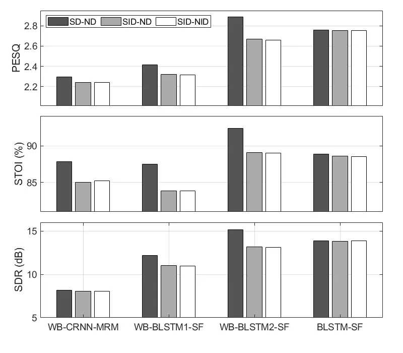

Fig. 2: Speech enhancement results for the MIXED data with three
different training configurations, _speaker independent and noise-type
dependent_ (SID-ND), _speaker independent and noise-type independent_
(SID-NID), and _speaker dependent and noise-type dependent_ (SD-ND).
These results are the averaged scores over the four environments, with a
SNR of 0 dB, and for the 4CH case. The PESQ, STOI and SDR of the
unprocessed signals are 1.60, 73.8% and 0.4 dB, respectively.

We here only show the results for BLSTM-SF, and the proposed network
with other targets behave similarly as BLSTM-SF. The proposed
narrow-band network achieves comparable performance for all the three
configurations, which means it has good generalization capabilities in
terms of both speaker and noise type. The network is trained using
narrow frequency bands, hence the wide-band spectral-pattern differences
between the training and test samples, of both speech and noise, are not
taken into account and hence they shouldn’t have an impact on the
generalization capabilities of the proposed model. The network is
actually trained to learn some functions based on the temporal and
spatial characteristics of speech and noise, which are independent with
respect to their spectral content. In addition, in the CHiME4 data, the
microphone-to-speaker relative positions are time-varying for both the
training and test data, which means that the proposed method also
generalizes well in terms of moving speakers. Overall, the proposed
model learn features that are suitable across frequency bins, as well as
for unseen speakers and noise types.

The wide-band methods have the speaker generalization problem when using
only four training speakers, which can be mitigated by increasing the
number of training speakers. To fully compare the speech enhancement
capabilities regardless of speaker generalization, we report the SD-ND
results for the wide-band methods in the following experiments.

|     |                     |                   |      |      |      |         |                       |      |      |      |         |                       |      |      |      |         |
| --- | ------------------- | ----------------- | ---- | ---- | ---- | ------- | --------------------- | ---- | ---- | ---- | ------- | --------------------- | ---- | ---- | ---- | ------- |
|     |                     | PESQ $`\uparrow`$ |      |      |      |         | STOI (%) $`\uparrow`$ |      |      |      |         | SDR (dB) $`\uparrow`$ |      |      |      |         |
|     |                     | BUS               | CAF  | PED  | STR  | Average | BUS                   | CAF  | PED  | STR  | Average | BUS                   | CAF  | PED  | STR  | Average |
|     | unproc.             | 1.93              | 1.47 | 1.43 | 1.57 | 1.60    | 82.6                  | 69.5 | 67.2 | 76.0 | 73.8    | 0.3                   | 0.6  | 0.1  | 0.6  | 0.4     |
|     | BeamformIt \[41\]   | 2.03              | 1.55 | 1.51 | 1.66 | 1.69    | 83.7                  | 71.6 | 70.1 | 77.1 | 75.7    | 0.1                   | 0.5  | 0.5  | 0.4  | 0.4     |
|     | NN-GEV \[10\]       | 2.12              | 1.57 | 1.61 | 1.76 | 1.77    | 86.7                  | 75.1 | 74.9 | 81.8 | 79.6    | 1.8                   | 1.9  | 2.1  | 2.3  | 2.0     |
|     | WB-CRNN-MRM \[16\]  | 2.59              | 1.88 | 1.80 | 2.14 | 2.10    | 89.6                  | 81.4 | 79.6 | 86.0 | 84.2    | 9.6                   | 6.8  | 5.6  | 8.1  | 7.5     |
|     | WB-BLSTM1-SF \[19\] | 2.80              | 1.99 | 1.96 | 2.38 | 2.28    | 90.7                  | 80.8 | 79.9 | 86.8 | 84.6    | 13.7                  | 9.0  | 8.3  | 11.3 | 10.6    |
|     | WB-BLSTM2-SF \[19\] | 3.22              | 2.41 | 2.39 | 2.84 | 2.72    | 94.7                  | 87.8 | 87.2 | 92.2 | 90.4    | 16.9                  | 11.8 | 11.0 | 14.0 | 13.4    |
| 2CH | BLSTM-MRM           | 2.85              | 2.15 | 2.08 | 2.44 | 2.38    | 89.4                  | 80.1 | 78.3 | 85.1 | 83.2    | 12.5                  | 9.2  | 8.1  | 10.4 | 10.1    |
|     | BLSTM-CC            | 2.92              | 2.14 | 2.10 | 2.48 | 2.41    | 90.5                  | 80.4 | 78.9 | 85.8 | 83.9    | 14.1                  | 10.0 | 9.4  | 11.6 | 11.3    |
|     | BLSTM-SF            | 2.93              | 2.15 | 2.11 | 2.49 | 2.42    | 90.4                  | 80.4 | 79.0 | 85.9 | 83.9    | 14.3                  | 10.0 | 9.5  | 11.7 | 11.4    |
|     | BLSTM-SSF           | 2.62              | 2.00 | 1.91 | 2.23 | 2.19    | 88.9                  | 79.5 | 77.5 | 84.4 | 82.6    | 12.4                  | 9.6  | 8.6  | 10.7 | 10.3    |
|     | BeamformIt \[41\]   | 2.07              | 1.60 | 1.56 | 1.68 | 1.72    | 85.0                  | 74.2 | 72.5 | 78.1 | 77.4    | 0.4                   | 0.5  | 1.0  | 0.2  | 0.5     |
|     | NN-GEV \[10\]       | 2.37              | 1.77 | 1.79 | 2.00 | 1.98    | 90.6                  | 83.3 | 82.9 | 89.0 | 86.4    | 3.6                   | 4.2  | 4.8  | 4.4  | 4.3     |
|     | WB-CRNN-MRM \[16\]  | 2.77              | 2.11 | 1.97 | 2.34 | 2.30    | 91.4                  | 86.4 | 84.5 | 89.1 | 87.9    | 8.0                   | 9.7  | 7.6  | 6.4  | 8.4     |
|     | WB-BLSTM1-SF \[19\] | 2.92              | 2.15 | 2.10 | 2.49 | 2.41    | 92.3                  | 84.8 | 83.7 | 89.1 | 87.5    | 15.0                  | 10.7 | 10.2 | 12.9 | 12.2    |
|     | WB-BLSTM2-SF \[19\] | 3.39              | 2.60 | 2.56 | 3.00 | 2.89    | 95.7                  | 90.4 | 89.6 | 93.8 | 92.4    | 18.3                  | 13.6 | 12.8 | 16.0 | 15.2    |
| 4CH | BLSTM-MRM           | 3.10              | 2.42 | 2.32 | 2.71 | 2.64    | 91.3                  | 85.3 | 83.0 | 88.8 | 87.1    | 13.1                  | 10.2 | 9.1  | 11.1 | 10.9    |
|     | BLSTM-CC            | 3.28              | 2.53 | 2.41 | 2.87 | 2.77    | 92.3                  | 86.2 | 83.9 | 90.5 | 88.3    | 16.6                  | 13.0 | 12.0 | 14.9 | 14.1    |
|     | LSTM-SF             | 3.01              | 2.28 | 2.17 | 2.63 | 2.52    | 90.7                  | 83.1 | 81.0 | 88.4 | 85.8    | 14.5                  | 10.9 | 10.0 | 12.9 | 12.1    |
|     | BLSTM-SF            | 3.23              | 2.52 | 2.41 | 2.85 | 2.76    | 91.7                  | 85.6 | 83.4 | 89.7 | 88.6    | 16.1                  | 12.8 | 11.8 | 14.9 | 13.9    |
|     | BLSTM-SSF           | 3.04              | 2.40 | 2.28 | 2.66 | 2.60    | 91.7                  | 85.6 | 83.4 | 89.7 | 87.6    | 15.1                  | 12.2 | 11.3 | 13.8 | 13.1    |

TABLE II: Speech enhancement results obtained with the MIXED data. SNR
is of 0 dB.

### III-C Unidirectional versus Bidirectional LSTM

As presented in Section III-A, we perform sequence-to-sequence network
training using fixed-length sequences with $`T=192`$ frames, which means
the back propagation (through time) of gradients is truncated at 192
time steps. In other words, the network is trained to learn 192 time
steps of memory. At test, the network predicts length-varying
utterances. Utterances with different lengths have different memory
lengths, moreover, different time steps in one utterance have differrent
forward/backward memories. To analyze how the memories work, and how
many time steps could be memorized in the proposed narrow-band LSTM
framework, Fig. 3 shows the MSEs as a function of time step. To obtain
this plot, we generated one extra group of data (we used the same data
generation protocol as with the MIXED test data), which includes 1.3
million sequences with a fixed length of $`T=375`$ frames (six seconds).
The MSEs averaged over all the sequences are shown in Fig. 3. The MSE of
LSTM quickly drops from 0.3 to 0.1 in a few time steps, which means a
few past frames are already very effective to reduce the loss. The MSE
of LSTM then slowly converges to 0.077 in about 150 time steps, which
means that, for one time step, the frames earlier than about 150 time
steps do not contribute anymore. This is due to one of the following
reasons (or the combination of them): (i) the LSTM network is only able
to learn the memory of about 150 time steps, and (ii) about 150 time
steps already provide enough context information in terms of the
temporal and spatial properties of the signal.

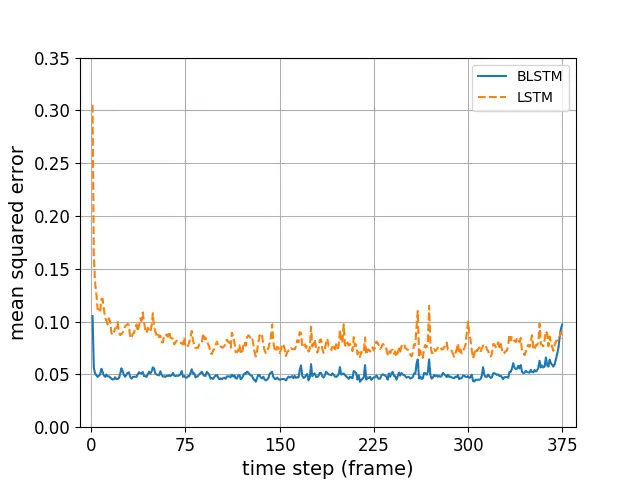

Fig. 3: The loss evolution, i.e. MSE, as a function of time step, for
the proposed BLSTM-SF (blue) and LSTM-SF (orange) methods (with 4CH).

When future frames are used, the MSE drops from 0.077 for LSTM to about
0.05 for BLSTM. At the two ends, BLSTM has a larger MSE due to the
insufficient past or future context. At the end part, BLSTM has enough
past context. The MSE is reduced from 0.097 at the 375-th frame to 0.06
at the 369-th frame, and to 0.05 at the 350-th frame. This indicates
that, when enough past context is being used, about six future frames
are already very effective to reduce the loss, and about 25 future
frames provide sufficient information to further reduce the loss to a
satisfactory value. For an online application, past information is
always available. The amount of future frames to be used can be chosen
as a trade-off between performance and processing latency: (i) 25 future
frames can be used to have the best prediction performance that BLSTM
can achieve, which however leads to a 400 ms latency, (ii) 6 future
frames can be chosen to have a good performance with 96 ms latency,
which is not a problem from a practical point of view.

Tables II and III show the experimental results obtained with the MIXED
and REAL data, respectively. Comparing the results of LSTM-SF and of
BLSTM-SF, one can see that BLSTM performs, indeed, noticeably better
than LSTM in terms of both speech enhancement and speech recognition. A
larger error obtained with LSTM than with BLSTM would lead to a larger
speech distortion and to less noise reduction. The difference in
performance between LSTM and BLSTM can easily be perceived by listening
to the enhanced signals. The comparison between LSTM and BLSTM, based on
the performance of LSTM-SF and BLSTM-SF (with 4CH), also holds for other
proposed targets and numbers of channels. In the following, we will only
analyze the performance of BLSTM networks.

### III-D Speech Enhancement Results with MIXED Data

Table II shows the speech enhancement results obtained with the MIXED
data and with an SNR of 0 dB. It is not surprising that the 4CH cases
outperform the 2CH ones, due to the use of richer spatial information.
In the following, we will mainly compare the 4CH performance scores (the
comparison is equally valid for the 2CH cases).

Over the unprocessed signals, BeamformIt improves the scores to a
certain extent. NN-GEV, which uses a deep neural network to classify the
speech and noise TF bins, performs much better than Beamformit. It was
demonstrated in \[10\] that the speech enhancement performance of NN-GEV
is quite close to the performance of an oracle beamformer, while the
oracle one uses the true speech/noise classification for the beamformer
estimation. All the other methods prominently outperforms these two
beamformers. This indicates that the techniques that directly predict
the clean speech with neural network have a better noise reduction
capability than the beamforming techniques.

WB-CRNN-MRM and the proposed BLSTM-MRM both predict the magnitude ratio
masks (MRMs), while the latter achieves similar STOI scores and better
PESQ and SDR scores. Better PESQ and SDR scores indicate more noise
reduction. In \[16\], it was stated that WB-CRNN-MRM mainly exploits the
wide-band spatial characteristics to distinguish between speech and
noise, by first extracting the inter-channel (spatial) information with
CNNs and then exploiting its short-term (five frames) temporal dynamics
with BLSTM. We can see from this comparison that, compared to using the
wide-band spatial information, fully exploiting the narrow-band
temporal-spatial information is more powerful for speech/noise
discrimination.

WB-BLSTM1-SF, WB-BLSTM2-SF and the proposed BLSTM-SF all predict a
spatial filter and minimize the MSE loss of the STFT coefficients.
WB-BLSTM1-SF (and WB-BLSTM2-SF) takes as input the full-band STFT
coefficients of the multichannel noisy signals, which attempt to fully
exploit temporal-spectral-spatial information. This wide-band method
requires a big network and a large amount of training data to tackle the
very high input/output dimensions, as WB-BLSTM2-SF (with 54.6 M
parameters and 56 hours of training data) achieves far better
performance measures than WB-BLSTM1-SF (with 5.9 M parameters and 11
hours of training data). With the similar networks and the same amount
of training data, the proposed BLSTM-SF noticeably outperforms
WB-BLSTM1-SF, since BLSTM-SF adequately learns the narrow-band
information. When the wide-band network is well trained, compared to
BLSTM-SF, WB-BLSTM2-SF indeed achieves higher performance measures, but
at the cost of using a much larger network and more training data, and
the cost of suffering the speaker generalization problem.

BLSTM-CC and BLSTM-SF both target the STFT coefficients, and achieve
comparable speech enhancement performance. This indicates that the use
of spatial filter does not have a significant impact on speech
enhancement performance. BLSTM-CC (and BLSTM-SF) improves the
performance over BLSTM-MRM by recovering the complex spectra of clean
speech. As already mentioned in Section II-B2, to estimate the complex
spectra of clean speech in narrow-band, what we expect to use is the
spatial features of signals. This expectation is verified by the
experimental results: when using more microphones, the prediction of the
complex spectra is more reliable, and correspondingly the superiority of
BLSTM-CC over BLSTM-MRM is more prominent. For example, for the 2CH
case, the PESQ (resp. SDR) score of BLSTM-MRM and BLSTM-CC are 2.38
(resp. 10.1 dB) versus 2.41 (11.3 dB), while these scores for the 4CH
case are 2.64 (resp. 10.9 dB) versus 2.77 (resp. 14.1 dB). BLSTM-SSF
smooths the spatial filter to keep the temporal consistence of the
enhanced signal, which however violates the optimal estimation of clean
speech. As a result, the speech enhancement scores are degraded relative
to the ones of BLSTM-SF.

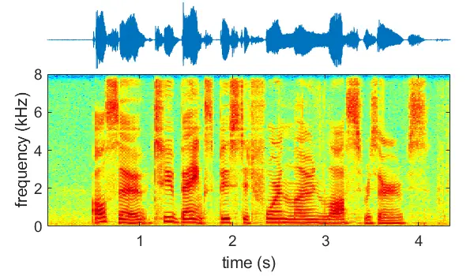

(a) clean speech

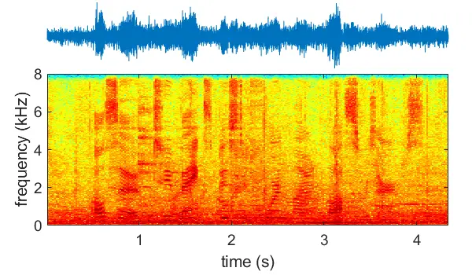

(b) noisy (unproc.)

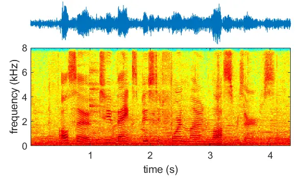

(c) BeamformIt

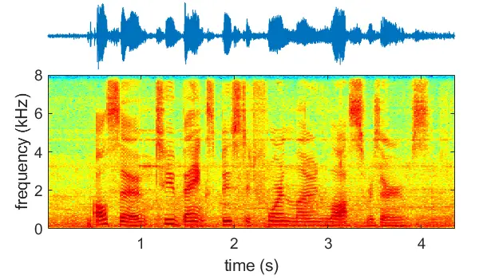

(d) NN-GEV

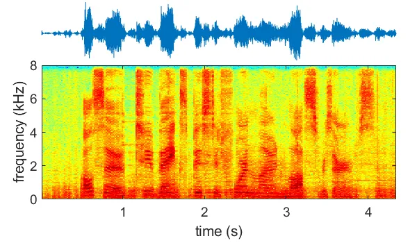

(e) WB-CRNN-MRM

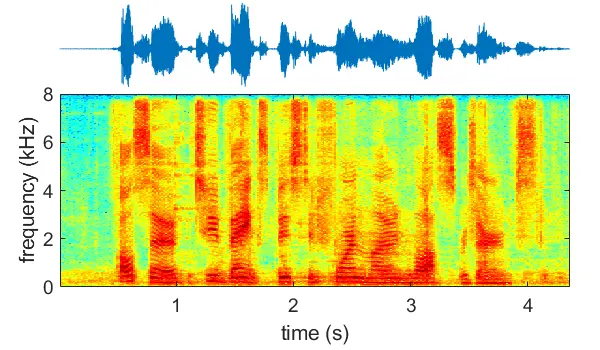

(f) WB-BLSTM1-SF

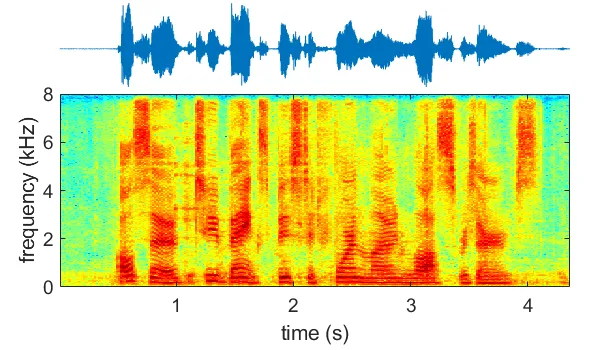

(g) WB-BLSTM2-SF

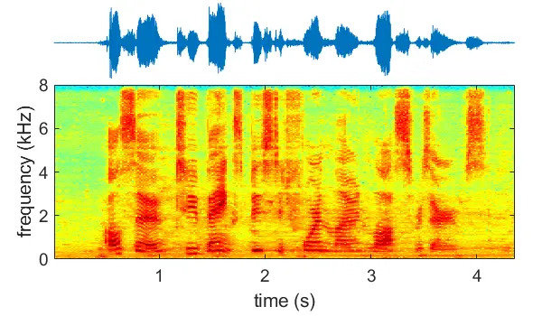

(h) BLSTM-MRM

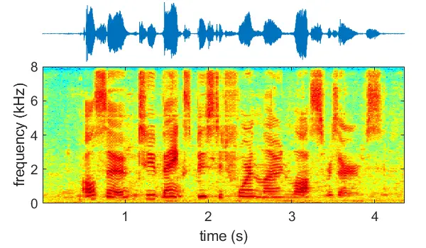

(i) BLSTM-CC

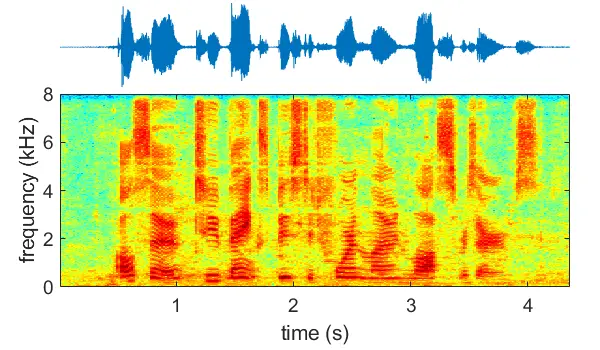

(j) BLSTM-SF

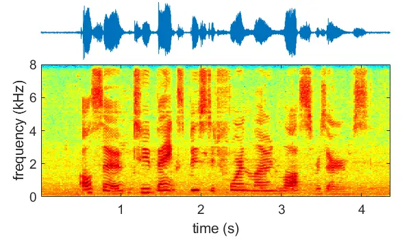

(k) BLSTM-SSF

Fig. 4: Waveforms and spectrograms of the clean-speech input, of the
added noise and of the results obtained with state of the art methods
and with the proposed BLSTM models, associated with one utterance from
the MIXED dataset using four channels (4CH). In this example, CAF noise
is added to the clean speech signal and the SNR is of 0 DB.

Fig. 4 shows waveforms and spectrograms associated with one example. It
can be seen that two beamformers (Fig. 4 (c) and (d)) well preserve the
speech spectra, while a large amount of noise still remain, which
corresponds to the low speech enhancement scores presented in Table II.
Three wide-band methods, i.e. WB-CRNN-MRM, WB-BLSTM1-SF and WB-BLSTM2-SF
(Fig. 4 (e), (f) and (g)) largely remove the noise and recover the
speech structure. However, the recovered speech spectra look somewhat
blurred along the frequency axis, and some wide-band spectra are wrongly
deleted or inserted. These types of wide-band prediction error are
caused by that: for high-dimensional (full-band) regression, the
networks are not fully capable of recovering the details of the
high-dimensional output vector, and prediction errors are highly
correlated between vector elements (frequencies). The wide-band
prediction errors lead to some audible abrupt distortions/interferences
by listening to the enhanced signals. In contrast, the proposed
narrow-band methods (Fig. 4 (h)-(k)) don’t produce the wide-band
distortions, due to the untied frequencies. It is consistent to the
results of Table II that BLSTM-CC and BLSTM-SF perform similarly, and
remove more noise than BLSTM-MRM and BLSTM-SSF. In the very low
frequency region, the proposed methods failed to properly predict the
speech spectra due to the very low SNR in this region. For this case,
the wide-band networks work well by predicting all the frequencies
together.

Results obtained with other SNR values are shown in Fig. 5. For the sake
of clarity of illustration, the curves of WB-BLSTM1-SF, BLSTM-CC and
BLSTM-SSF are not shown. It can be seen that the conclusions drawn above
hold for a wide range of SNR values, except that Beamformit and NN-GEV
don’t improve the SDR of unprocessed signals for the high SNR case.

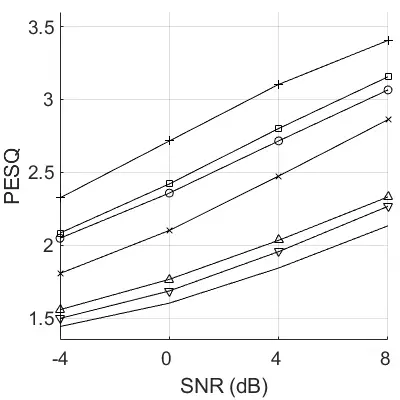

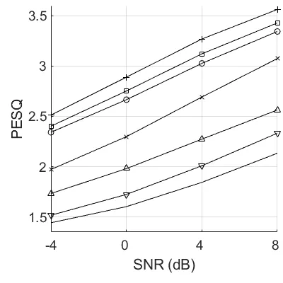

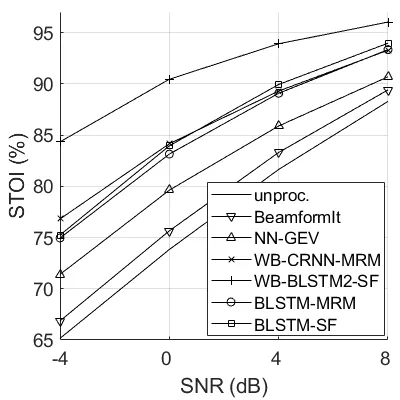

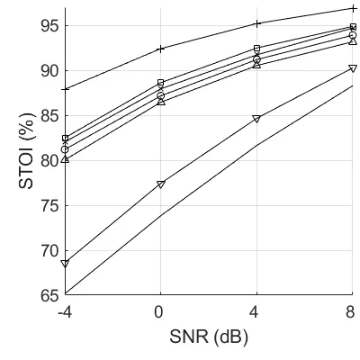

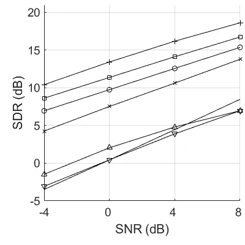

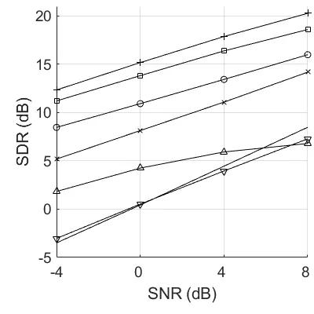

Fig. 5: Speech enhancement results obtained with the MIXED data,
averaged over all noise types, as a function of SNR, for the 2CH case
(left) and the 4CH case (right).

### III-E Results with REAL Data

Table III shows the speech enhancement and speech recognition scores
obtained with the REAL data. The speech enhancement results, i.e. the
SRMR scores, are broadly consistent to the results of MIXED data:
WB-BLSTM2-SF performs the best, while the proposed methods perform not
as good as WB-BLSTM2-SF, but still achieve very high SRMR scores.

As already mentioned, all the proposed networks were trained with ten
epochs, which achieves approximately the best speech enhancement
performance, and a few more or less epochs don’t lead to a notable
performance change. However, this is not true for the ASR performance.
For ASR, we take the network that achieves the smallest Dev WER, from
the networks trained with 6 to 10 epochs. In addition, the WER
performance is not very stable from one trial to another. Therefore, we
run five trials for each of the proposed networks, and the averaged
scores are reported in Table III. Even though formal significance test
has not been conducted, these WER scores are quite reliable.

BeamformIt largely reduces the WERs obtained with unprocessed signals.
The ASR performance of the wide-band methods, i.e. WB-CRNN-MRM,
WB-BLSTM1-SF and WB-BLSTM2-SF, don’t exceed the ones of BeamformIt.
WB-BLSTM1-SF performs the worst, and for the 2CH case even degrades the
performance of the unprocessed signals. It was demonstrated in \[31\]
that the processing errors of one speech enhancement method have a big
impact on the ASR performance. The unsatisfactory ASR performance of the
wide-band methods is may caused by their wide-band prediction errors,
i.e. the blurred and wrongly deleted/inserted wide-band spectra. This
type of wide-band error has not been seen by the ASR training data, and
thus causes the mismatch between the training and test data. The WERs of
WB-BLSTM2-SF reported here are consistent with the ones presented in
\[19\] that the wide-band deep beamformer does not perform as well as
BeamformIt, even when it is jointly trained with the ASR acoustic model.

NN-GEV and the proposed methods process frequencies independently, and
thence significantly outperform the wide-band methods. NN-GEV averagely
performs the best for the 4CH case, while performs worse than the
proposed methods for the 2CH case. The prossible reason for this is: a
good beam-pattern of the microphone array is critical for the
beamforming techniques, which however requires a large number of
microphones. For the 2CH case, BLSTM-MRM performs better than BLSTM-CC
and BLSTM-SF, especially achieves the smallest Eval WERs. As already
analyzed, the estimation of the clean complex spectra in narrow-band
relies on the spatial features of signals, and thus the estimation error
is highly related to the number of microphones. When using only two
microphones, the high estimation error may degrade the ASR performance.
In addition, considering that ASR normally takes the (log-)magnitude
feature, the recovery of clean phase may be not really helpful for
improving the ASR performance. Even for the 4CH case, BLSTM-MRM achieves
a comparable performance as BLSTM-CC. For both the 2CH and 4CH cases,
BLSTM-SF consistently (across all the conditions) performs better than
BLSTM-CC, even though the performance gap is small. This indicates that,
to a certain extent ASR indeed benefits from the use of a spatial
filter. By further smoothing the spatial filter, BLSTM-SSF notably
improves the ASR performance over BLSTM-SF, which verifies our analysis
about the beamforming techniques that the temporal smoothness of
beamformer is important for its good ASR performance. For the 2CH case,
BLSTM-SSF achieves the best Dev WERs, and slightly worse Eval WERs than
BLSTM-MRM. For the 4CH Eval data, BLSTM-SSF achieves comparable average
WERs with NN-GEV, especially the WER of BUS, CAF and STR of BLSTM-SSF
are all smaller than the ones of NN-GEV.

From these experiments, regarding ASR, we would like to emphasize the
following important observations: (i) for both wide-band and narrow-band
methods, one way to improve the ASR performance is to reduce the level
of the network prediction error. However, with comparable error levels,
the narrow-band processing artifacts is much less harmful for ASR than
the wide-band one, and (ii) the TF masking plus beamforming technique,
i.e. NN-GEV, is powerful for ASR. However, one problem for this type of
methods is that its maximum ASR performance is actually
determined/limited by the performance of oracle beamformers. As
demonstrated in \[10\] that NN-GEV already performs closely to the
oracle beamformer, improving the TF masking performance will no longer
lead to ASR improvement. In contrast, the proposed methods directly
interface the speech enhancement network and the ASR module, thus the
ASR performance can be improved by reinforcing the speech enhancement
network, or by performing joint end-to-end training. This means the
proposed methods still have a large potential to be explored, which is
left for future work.

|     |                     |                   |      |      |      |         |                            |       |      |       |         |                             |       |       |       |         |
| --- | ------------------- | ----------------- | ---- | ---- | ---- | ------- | -------------------------- | ----- | ---- | ----- | ------- | --------------------------- | ----- | ----- | ----- | ------- |
|     |                     | SRMR $`\uparrow`$ |      |      |      |         | WER $`\downarrow`$ (%) Dev |       |      |       |         | WER $`\downarrow`$ (%) Eval |       |       |       |         |
|     |                     | BUS               | CAF  | PED  | STR  | Average | BUS                        | CAF   | PED  | STR   | Average | BUS                         | CAF   | PED   | STR   | Average |
|     | unproc.             | 1.75              | 2.00 | 2.18 | 1.97 | 1.98    | 14.77                      | 10.74 | 6.83 | 10.54 | 10.72   | 36.08                       | 23.35 | 18.24 | 15.37 | 23.26   |
|     | BeamformIt \[41\]   | 1.74              | 2.10 | 2.24 | 2.04 | 2.03    | 14.12                      | 7.55  | 5.04 | 8.44  | 8.79    | 25.97                       | 16.85 | 14.01 | 12.57 | 17.35   |
|     | NN-GEV \[10\]       | 2.04              | 2.26 | 2.38 | 2.24 | 2.23    | 11.30                      | 6.55  | 4.71 | 7.52  | 7.52    | 21.20                       | 12.94 | 9.92  | 9.39  | 13.36   |
|     | WB-CRNN-MRM \[16\]  | 2.63              | 2.77 | 2.75 | 2.69 | 2.71    | 13.78                      | 10.35 | 7.11 | 10.22 | 10.37   | 25.50                       | 21.26 | 18.11 | 11.21 | 19.02   |
|     | WB-BLSTM1-SF \[19\] | 2.92              | 2.95 | 2.92 | 2.88 | 2.92    | 18.16                      | 13.86 | 8.87 | 13.63 | 13.63   | 39.76                       | 31.17 | 26.55 | 15.37 | 28.21   |
|     | WB-BLSTM2-SF \[19\] | 3.02              | 3.02 | 2.97 | 2.94 | 2.99    | 12.94                      | 10.47 | 7.30 | 9.29  | 10.00   | 27.24                       | 20.27 | 16.11 | 11.11 | 18.68   |
| 2CH | BLSTM-MRM           | 2.77              | 2.81 | 2.82 | 2.77 | 2.79    | 10.60                      | 5.68  | 5.12 | 6.33  | 6.93    | 18.46                       | 10.52 | 9.59  | 7.71  | 11.57   |
|     | BLSTM-CC            | 2.90              | 2.94 | 2.93 | 2.89 | 2.91    | 11.70                      | 6.10  | 5.26 | 6.51  | 7.39    | 20.88                       | 10.85 | 10.97 | 8.32  | 12.75   |
|     | BLSTM-SF            | 2.88              | 2.94 | 2.88 | 2.86 | 2.89    | 11.45                      | 6.06  | 5.18 | 6.23  | 7.23    | 20.66                       | 10.54 | 10.18 | 7.97  | 12.33   |
|     | BLSTM-SSF           | 2.75              | 2.78 | 2.79 | 2.74 | 2.77    | 10.97                      | 5.46  | 4.86 | 6.13  | 6.86    | 19.37                       | 10.36 | 9.68  | 8.07  | 11.87   |
|     | BeamformIt \[41\]   | 1.77              | 2.19 | 2.31 | 2.10 | 2.09    | 9.01                       | 6.30  | 4.41 | 6.99  | 6.68    | 19.61                       | 11.84 | 11.64 | 10.52 | 13.40   |
|     | NN-GEV \[10\]       | 2.36              | 2.56 | 2.61 | 2.52 | 2.51    | 5.41                       | 4.03  | 3.60 | 4.32  | 4.34    | 11.39                       | 6.57  | 7.32  | 6.95  | 8.06    |
|     | WB-CRNN-MRM \[16\]  | 2.65              | 2.82 | 2.75 | 2.74 | 2.74    | 10.55                      | 6.67  | 5.72 | 7.52  | 7.61    | 15.67                       | 12.92 | 17.21 | 9.39  | 13.80   |
|     | WB-BLSTM1-SF \[19\] | 2.82              | 2.93 | 2.88 | 2.85 | 2.87    | 13.32                      | 10.60 | 7.27 | 10.66 | 10.46   | 30.53                       | 24.34 | 20.95 | 13.30 | 22.28   |
|     | WB-BLSTM2-SF \[19\] | 2.93              | 2.99 | 2.92 | 2.93 | 2.94    | 10.28                      | 7.57  | 6.33 | 8.21  | 8.10    | 21.91                       | 17.58 | 15.92 | 10.57 | 16.49   |
| 4CH | BLSTM-MRM           | 2.81              | 2.88 | 2.82 | 2.81 | 2.83    | 7.41                       | 4.07  | 4.24 | 4.59  | 5.08    | 10.44                       | 6.77  | 11.29 | 6.55  | 8.76    |
|     | BLSTM-CC            | 2.91              | 2.96 | 2.89 | 2.87 | 2.91    | 6.62                       | 4.34  | 4.22 | 4.72  | 4.97    | 11.31                       | 6.97  | 10.33 | 6.40  | 8.75    |
|     | LSTM-SF             | 2.71              | 2.78 | 2.76 | 2.74 | 2.75    | 7.26                       | 4.62  | 4.39 | 5.32  | 5.40    | 11.92                       | 7.48  | 11.11 | 6.80  | 9.32    |
|     | BLSTM-SF            | 2.89              | 2.93 | 2.89 | 2.86 | 2.89    | 6.50                       | 4.29  | 4.16 | 4.65  | 4.90    | 10.93                       | 6.80  | 10.22 | 6.26  | 8.55    |
|     | BLSTM-SSF           | 2.82              | 2.87 | 2.82 | 2.81 | 2.83    | 6.40                       | 4.03  | 3.92 | 4.53  | 4.72    | 11.23                       | 6.17  | 9.59  | 5.81  | 8.20    |

TABLE III: Speech enhancement and ASR results obtained with the REAL
data, where the SRMR scores are averaged over the developement and
evaluation datasets.

## IV Conclusions

In this paper we proposed a narrow-band deep filtering method to address
the problem of multichannel speech enhancement. Unsupervised methods,
such as spectral subtraction or spatial filtering, have shown some
advantages of narrow-band processing for discriminating between speech
and noise. The proposed LSTM-based method is able to exploit rich
narrow-band features and it outperforms the methods mentioned above.
Interestingly, narrow-band LSTM preserves one of the most prominent
merits of unsupervised models, namely it is agnostic to speaker identity
and to noise type.

Four targets were used for training: the magnitude ratio mask (MRM), the
complex coefficients (CC), the spatial filter (SF) and the smoothed SF
(SSF). Most of these targets had already been studied in the wide-band
speech enhancement framework. However, estimating these targets in
narrow-band has completely different theoretical bases and behaviours
from the wide-band cases. We evaluated the proposed narrow-band deep
filtering method in terms of both speech enhancement and speech
recognition. CC and SF achieve better speech enhancement performance
than MRM by recovering the complex spectra. This superiority is more
prominent for the 4CH case, since which provides more spatial features
that the estimation of complex spectra can rely on. As for ASR, compared
to CC and SF, MRM performs better for the 2CH case and slightly worse
for the 4CH case, which shows that MRM is a proper target since ASR
normally uses the (log-)magnitude feature. SSF notably improves the ASR
performance over SF by temporally smoothing the spatial filter, while at
the cost of worse speech enhancement performance. Compared with the
state-of-the-art methods, the proposed methods achieve much better
speech enhancement performance than the beamformers and the wide-band
methods with relative small networks, i.e. WB-CRNN-MRM \[16\] and
WB-BLSTM1-SF \[19\]. The wide-band method takes as input/output the
high-dimensional full-band spectra, and needs a much larger network to
properly learn useful informations, e.g. WB-BLSTM2-SF \[19\] with 54.6 M
parameters (for reference the proposed network has 1.2 M parameters)
achieves better speech enhancement performance than the proposed method,
but the performance gap is not very big for the 4CH case. The wide-band
methods don’t work well for ASR due to their wide-band processing
artifacts. The proposed methods achieve lower WERs than other methods
for the 2CH case. The proposed BLSTM-SSF network achieves comparable
WERs with the advanced beamforming technique, i.e. NN-GEV \[10\],
especially for the Eval data.

It is interesting to note that by ignoring wide-band patterns, the
proposed model has several merits: there is a large reduction in both
the number of network parameters and the amount of training dataset, it
has excellent generalization capabilities, and it avoids wide-band
processing artifacts. It is however true that wide-band patterns contain
interesting features that are not used with narrow-band models and which
are worth to be included in order to further improve the performance of
the proposed model. Therefore, it would be interesting to investigate
new architectures that can incorporate wide-band features while
preserving the advantages of narrow-band models, most notably their
excellent generalization capabilities and their robustness against
wide-band processing artifacts.

## References

- \[1\] D. Wang and J. Chen, “Supervised speech separation based on deep
  learning: An overview,” _IEEE/ACM Transactions on Audio, Speech, and
  Language Processing_, vol. 26, no. 10, pp. 1702–1726, 2018.
- \[2\] D. S. Williamson, Y. Wang, and D. Wang, “Complex ratio masking
  for monaural speech separation,” _IEEE/ACM Transactions on Audio,
  Speech, and Language Processing_, vol. 24, no. 3, pp. 483–492, 2016.
- \[3\] S.-W. Fu, T.-y. Hu, Y. Tsao, and X. Lu, “Complex spectrogram
  enhancement by convolutional neural network with multi-metrics
  learning,” in _International Workshop on Machine Learning for Signal
  Processing (MLSP)_. IEEE, 2017, pp. 1–6.
- \[4\] Z.-Q. Wang, P. Wang, and D. Wang, “Complex spectral mapping for
  single-and multi-channel speech enhancement and robust asr,” _IEEE/ACM
  Transactions on Audio, Speech, and Language Processing_, vol. 28, pp.
  1778–1787, 2020.
- \[5\] K. Tan, J. Chen, and D. Wang, “Gated residual networks with
  dilated convolutions for monaural speech enhancement,” _IEEE
  Transactions on Audio, Speech, and Language Processing_, vol. 27,
  no. 1, pp. 189–198, 2019.
- \[6\] F. Weninger, F. Eyben, and B. Schuller, “Single-channel speech
  separation with memory-enhanced recurrent neural networks,” in _IEEE
  International Conference on Acoustics, Speech and Signal Processing
  (ICASSP)_, 2014, pp. 3709–3713.
- \[7\] J. Chen and D. Wang, “Long short-term memory for speaker
  generalization in supervised speech separation,” _The Journal of the
  Acoustical Society of America_, vol. 141, no. 6, pp. 4705–4714, 2017.
- \[8\] Y. Wang, K. Han, and D. Wang, “Exploring monaural features for
  classification-based speech segregation,” _IEEE Transactions on Audio,
  Speech, and Language Processing_, vol. 21, no. 2, pp. 270–279, 2013.
- \[9\] Y. Jiang, D. Wang, R. Liu, and Z. Feng, “Binaural classification
  for reverberant speech segregation using deep neural networks,”
  _IEEE/ACM Transactions on Audio, Speech and Language Processing_,
  vol. 22, no. 12, pp. 2112–2121, 2014.
- \[10\] J. Heymann, L. Drude, and R. Haeb-Umbach, “Neural network based
  spectral mask estimation for acoustic beamforming,” in _IEEE
  International Conference on Acoustics, Speech and Signal Processing
  (ICASSP)_, 2016, pp. 196–200.
- \[11\] C. Boeddeker, H. Erdogan, T. Yoshioka, and R. Haeb-Umbach,
  “Exploring practical aspects of neural mask-based beamforming for
  far-field speech recognition,” in _IEEE International Conference on
  Acoustics, Speech and Signal Processing (ICASSP)_, 2018, pp.
  6697–6701.
- \[12\] X. Zhang and D. Wang, “Deep learning based binaural speech
  separation in reverberant environments,” _IEEE/ACM transactions on
  audio, speech, and language processing_, vol. 25, no. 5, pp.
  1075–1084, 2017.
- \[13\] Z.-Q. Wang and D. Wang, “Combining spectral and spatial
  features for deep learning based blind speaker separation,” _IEEE/ACM
  Transactions on Audio, Speech, and Language Processing_, vol. 27,
  no. 2, pp. 457–468, 2019.
- \[14\] T. Yoshioka, Z. Chen, C. Liu, X. Xiao, H. Erdogan, and
  D. Dimitriadis, “Low-latency speaker-independent continuous speech
  separation,” in _International Conference on Acoustics, Speech and
  Signal Processing (ICASSP)_. IEEE, 2019, pp. 6980–6984.
- \[15\] P. Pertilä and J. Nikunen, “Distant speech separation using
  predicted time–frequency masks from spatial features,” _Speech
  communication_, vol. 68, pp. 97–106, 2015.
- \[16\] S. Chakrabarty and E. A. Habets, “Time-frequency masking based
  online multi-channel speech enhancement with convolutional recurrent
  neural networks,” _IEEE Journal of Selected Topics in Signal
  Processing_, vol. 13, no. 4, pp. 787–799, 2019.
- \[17\] X. Xiao, S. Watanabe, H. Erdogan, L. Lu, J. Hershey, M. L.
  Seltzer, G. Chen, Y. Zhang, M. Mandel, and D. Yu, “Deep beamforming
  networks for multi-channel speech recognition,” in _International
  Conference on Acoustics, Speech and Signal Processing (ICASSP)_. IEEE,
  2016, pp. 5745–5749.
- \[18\] B. Li, T. N. Sainath, R. J. Weiss, K. W. Wilson, and
  M. Bacchiani, “Neural network adaptive beamforming for robust
  multichannel speech recognition,” in _Interspeech_, 2016.
- \[19\] Z. Meng, S. Watanabe, J. R. Hershey, and H. Erdogan, “Deep long
  short-term memory adaptive beamforming networks for multichannel
  robust speech recognition,” in _International Conference on Acoustics,
  Speech and Signal Processing (ICASSP)_. IEEE, 2017, pp. 271–275.
- \[20\] X. Li, L. Girin, S. Gannot, and R. Horaud, “Non-stationary
  noise power spectral density estimation based on regional statistics,”
  in _IEEE International Conference on Acoustics, Speech and Signal
  Processing (ICASSP)_, 2016, pp. 181–185.
- \[21\] T. Gerkmann and R. C. Hendriks, “Unbiased MMSE-based noise
  power estimation with low complexity and low tracking delay,” _IEEE
  Transactions on Audio, Speech, and Language Processing_, vol. 20,
  no. 4, pp. 1383–1393, 2012.
- \[22\] S. Gannot, D. Burshtein, and E. Weinstein, “Signal enhancement
  using beamforming and nonstationarity with applications to speech,”
  _IEEE Transactions on Signal Processing_, vol. 49, no. 8, pp.
  1614–1626, 2001.
- \[23\] X. Li, L. Girin, R. Horaud, and S. Gannot, “Estimation of
  relative transfer function in the presence of stationary noise based
  on segmental power spectral density matrix subtraction,” in _IEEE
  International Conference on Acoustics, Speech and Signal Processing
  (ICASSP)_, 2015, pp. 320–324.
- \[24\] X. Li, S. Leglaive, L. Girin, and R. Horaud, “Audio-noise power
  spectral density estimation using long short-term memory,” _IEEE
  Signal Processing Letters_, 2019.
- \[25\] A. Schwarz and W. Kellermann, “Coherent-to-diffuse power ratio
  estimation for dereverberation,” _IEEE/ACM Transactions on Audio,
  Speech, and Language Processing_, vol. 23, no. 6, pp. 1006–1018, 2015.
- \[26\] S. Gannot, E. Vincent, S. Markovich-Golan, and A. Ozerov, “A
  consolidated perspective on multimicrophone speech enhancement and
  source separation,” _IEEE/ACM Transactions on Audio, Speech, and
  Language Processing_, vol. 25, no. 4, pp. 692–730, 2017.
- \[27\] Y. Ephraim and D. Malah, “Speech enhancement using a
  minimum-mean square error short-time spectral amplitude estimator,”
  _IEEE Transactions on Acoustics, Speech and Signal Processing_,
  vol. 32, no. 6, pp. 1109–1121, 1984.
- \[28\] I. Cohen and B. Berdugo, “Speech enhancement for non-stationary
  noise environments,” _Signal processing_, vol. 81, no. 11, pp.
  2403–2418, 2001.
- \[29\] M. Brandstein and D. Ward, _Microphone arrays: signal
  processing techniques and applications_. Springer Science & Business
  Media, 2013.
- \[30\] X. Li and R. Horaud, “Multichannel speech enhancement based on
  time-frequency masking using subband long short-term memory,” in _IEEE
  Workshop on Applications of Signal Processing to Audio and
  Acoustics_, 2019.
- \[31\] P. Wang, K. Tan _et al._, “Bridging the gap between monaural
  speech enhancement and recognition with distortion-independent
  acoustic modeling,” _IEEE/ACM Transactions on Audio, Speech, and
  Language Processing_, vol. 28, pp. 39–48, 2019.
- \[32\] Y. Wang, A. Narayanan, and D. Wang, “On training targets for
  supervised speech separation,” _IEEE/ACM Transactions on Audio,
  Speech, and Language Processing_, vol. 22, no. 12, pp.
  1849–1858, 2014.
- \[33\] J. Barker, R. Marxer, E. Vincent, and S. Watanabe, “The third
  ‘CHiME’ speech separation and recognition challenge: Dataset, task and
  baselines,” in _IEEE Workshop on Automatic Speech Recognition and
  Understanding (ASRU)_, 2015, pp. 504–511.
- \[34\] F. Chollet _et al._, “Keras,”
  https://github.com/fchollet/keras, 2015.
- \[35\] D. P. Kingma and J. Ba, “Adam: A method for stochastic
  optimization,” in _International Conference on Learning
  Representations_, 2015.
- \[36\] A. W. Rix, J. G. Beerends, M. P. Hollier, and A. P. Hekstra,
  “Perceptual evaluation of speech quality (PESQ)-a new method for
  speech quality assessment of telephone networks and codecs,” in
  _International Conference on Acoustics, Speech, and Signal Processing
  (ICASSP)_, vol. 2. IEEE, 2001, pp. 749–752.
- \[37\] C. H. Taal, R. C. Hendriks, R. Heusdens, and J. Jensen, “An
  algorithm for intelligibility prediction of time–frequency weighted
  noisy speech,” _IEEE Transactions on Audio, Speech, and Language
  Processing_, vol. 19, no. 7, pp. 2125–2136, 2011.
- \[38\] E. Vincent, R. Gribonval, and C. Févotte, “Performance
  measurement in blind audio source separation,” _IEEE Transactions on
  Audio, Speech, and Language Processing_, vol. 14, no. 4, pp.
  1462–1469, 2006.
- \[39\] J. F. Santos, M. Senoussaoui, and T. H. Falk, “An improved
  non-intrusive intelligibility metric for noisy and reverberant
  speech,” in _International Workshop on Acoustic Signal Enhancement
  (IWAENC)_. IEEE, 2014, pp. 55–59.
- \[40\] T. Hori, Z. Chen, J. R. Hershey, J. Le Roux, V. Mitra, and
  S. Watanabe, “The MERL/SRI system for the 3RD CHiME challenge using
  beamforming, robust feature extraction, and advanced speech
  recognition,” in _IEEE Workshop on Automatic Speech Recognition and
  Understanding (ASRU)_. IEEE, 2015, pp. 475–481.
- \[41\] X. Anguera, C. Wooters, and J. Hernando, “Acoustic beamforming
  for speaker diarization of meetings,” _IEEE Transactions on Audio,
  Speech, and Language Processing_, vol. 15, no. 7, pp. 2011–2022, 2007.
