# Speech Enhancement based on Denoising Autoencoder with Multi-branched EncodersThanks: Cheng Yu, Ryandhimas E. Zezario, Syu-Siang Wang, and Yu Tsao are with Research Center for Information Technology Innovation, Academia Sinica, Taipei, Taiwan, corresponding e-mail: (yu.tsao@sinica.edu.tw). Thanks: Jonathan Sherman is with Taiwan International Graduate Program (TIGP), Academia Sinica, Taipei, Taiwan.Thanks: Yi-Yen Hsieh is with Graduate Institute of Electronics Engineering (GIEE), National Taiwan University, Taipei, Taiwan.Thanks: Xugang Lu is with the National Institute of Information and Communications Technology, Tokyo, Japan.Thanks: Hsin-Min Wang is with Institute of Information Science, Academia Sinica, Taipei, Taiwan.Thanks: \* The first two authors contributed equally to this work Thanks: 

Cheng Yu\*    Ryandhimas E. Zezario\*    Syu-Siang Wang    Jonathan
Sherman    Yi-Yen Hsieh Affiliation: Xugang Lu, Hsin-Min Wang,   and Yu
Tsao,  

###### Abstract

Deep learning-based models have greatly advanced the performance of
speech enhancement (SE) systems. However, two problems remain unsolved,
which are closely related to model generalizability to noisy conditions:
(1) mismatched noisy condition during testing, i.e., the performance is
generally sub-optimal when models are tested with unseen noise types
that are not involved in the training data; (2) local focus on specific
noisy conditions, i.e., models trained using multiple types of noises
cannot optimally remove a specific noise type even though the noise type
has been involved in the training data. These problems are common in
real applications. In this paper, we propose a novel denoising
autoencoder with a multi-branched encoder (termed DAEME) model to deal
with these two problems. In the DAEME model, two stages are involved:
training and testing. In the training stage, we build multiple component
models to form a multi-branched encoder based on a decision tree (DSDT).
The DSDT is built based on prior knowledge of speech and noisy
conditions (the speaker, environment, and signal factors are considered
in this paper), where each component of the multi-branched encoder
performs a particular mapping from noisy to clean speech along the
branch in the DSDT. Finally, a decoder is trained on top of the
multi-branched encoder. In the testing stage, noisy speech is first
processed by each component model. The multiple outputs from these
models are then integrated into the decoder to determine the final
enhanced speech. Experimental results show that DAEME is superior to
several baseline models in terms of objective evaluation metrics,
automatic speech recognition results, and quality in subjective human
listening tests.

###### Index Terms: 

Deep Neural Networks, Ensemble Learning, Dynamically-Sized Decision
Tree, Generalizability, Speech Enhancement.

## I Introduction

SPEECH enhancement (SE) aims to improve the quality and intelligibility
of distorted speech signals, which may be caused by background noises,
interference and recording devices. SE approaches are commonly used as
pre-processing in various audio-related applications, such as speech
communication \[1\], automatic speech recognition (ASR) \[2, 3, 4, 5\],
speaker recognition \[6, 7\], hearing aids \[8, 9, 10\], and cochlear
implants \[11, 12, 13\]. Traditional SE algorithms design the denoising
model based on statistical properties of speech and noise signals. One
class of SE algorithms computes a filter to generate clean speech by
reducing noise components from the noisy speech signals. Essential
approaches include spectral subtraction \[14\], Wiener filtering \[15\],
and minimum mean square error (MMSE) \[16, 17\]. Another class of SE
algorithms adopts a subspace structure to separate the noisy speech into
noise and clean speech subspaces, and the clean speech is restored based
on the information in the clean speech subspace. Well-known approaches
belonging to this category include singular value decomposition (SVD),
generalized subspace approach with pre-whitening \[18\], Karhunen-Loeve
transform (KLT) \[19\], and principal component analysis (PCA) \[20\].
Despite being able to yield satisfactory performance under stationary
noise conditions, the performance of these approaches is generally
limited under non-stationary noise conditions. A major reason is that
traditional signal processing-based solutions cannot accurately estimate
noise components, consequently causing musical noises and suffering
significant losses in both quality and intelligibility of enhanced
speech.

Recent work has seen the emergence of machine learning and deep
learning-based SE methods. Different from traditional methods, machine
learning-based SE methods prepare a model based on training data in a
data-driven manner without imposing strong statistical constraints. The
prepared model is used to transform noisy speech signals to clean speech
signals. Well-known machine learning-based models include non-negative
matrix factorization \[21, 22, 23\], compressive sensing \[24\], sparse
coding \[25\], \[26\], and robust principal component analysis (RPCA)
\[27\]. Deep learning models have drawn great interest due to their
outstanding nonlinear mapping capabilities. Based on the training
targets, deep learning-based SE models can be divided into two
categories: masking-based and mapping-based. The masking-based methods
compute masks describing the time-frequency relationships of clean
speech and noise components. Various types of masks have been derived,
e.g., ideal binary mask (IBM) \[28\], ideal ratio mask (IRM) \[29\],
target binary mask \[30\], spectral magnitude mask \[31\] and phase
sensitive mask \[32\]. The mapping-based methods, on the other hand,
treat the clean spectral magnitude representations as the target and aim
to calculate a transformation function to map noisy speech directly to
the clean speech signal. Well-known examples are the fully connected
neural network \[33, 34\], deep denoising auto-encoder (DDAE) \[35,
36\], convolutional neural network (CNN) \[37, 38, 39\], and
long-short-term memory (LSTM) along with their combinations \[40, 41\].

Although deep learning-based methods can provide outstanding performance
when dealing with seen noise types (the noise types involved in the
training data), the denoising ability is notably reduced when unseen
noise types (the noise types not involved in the training data) are
encountered. In real-world applications, it is not guaranteed that an SE
system always deals with seen noise types. This may limit the
applicability of deep learning-based SE methods. Moreover, a single and
universal model, trained with the entire set of training data consisting
of multiple conditions, may have constrained capability to perform well
in specific condition, even though the condition has been involved in
the training set. In SE tasks, the enhancement performance for a
particular noise type (even if involved in the training data) can thus
be weakened. This problem, caused by variances between different
clusters of training data has been reported in many previous works \[42,
43, 44\]. In this study, we intend to design a new framework to increase
deep learning SE model generalizability, i.e., to improve the
enhancement performance for both seen and unseen noise types.

Ensemble learning algorithms have proven to effectively improve the
generalization capabilities of different machine learning tasks.
Examples include acoustic modeling \[45\], image classification \[46\],
and bio-medical analysis \[47\]. Ensemble learning algorithms have also
been used for speech signal processing, e.g., speech dereverberation
\[48\] and SE. Lu et al. investigated ensemble learning using
unsupervised partitioning of training data \[49\]. Kim, on the other
hand, proposed an online selection from trained models. The modular
neural network (MNN) consists of two consecutive DNN modules: the expert
module that learns specific information (e.g. SNRs, noise types,
genders) and the arbitrator module that selects the best expert module
in the online phase \[50\]. In \[51\], the authors investigated a
mixture-of-experts algorithm for SE, where the expert models enhance
specific speech types corresponding to speech phonemes. Additionally, in
\[52, 53\], the authors proposed a joint estimation of different targets
with enhanced speech as the primary task to improve the SE performance.

Despite the aforementioned ensemble learning models having achieved
notable improvements, a set of component models is generally prepared
for a specific data set and may not be suitable when applied to
different large or small data sets with different characteristics.
Therefore, it is desirable to build a system that can dynamically
determine the complexity of the ensemble structure using a common prior
knowledge of speech and noise characteristics or attributes. In this
study, we propose a novel denoising autoencoder with multi-branched
encoder (DAEME) model for SE. A dynamically-sized decision tree (DSDT)
is used to guide the DAEME model, thereby improving the generalizability
of the model to various speech and noise conditions. The DSDT is built
based on prior knowledge of speech and noise characteristics from a
training data set. In building the DSDT, we regard the speaker gender
and signal-to-noise ratio (SNR) as the utterance-level attributes and
the low and high frequency components as the signal-level attributes.
Based on these definitions, the training data set is partitioned into
several clusters based on the degree of attributes desired. Then, each
cluster is used to train a corresponding SE model (termed component
model) that performs spectral mapping from noisy to clean speech. After
the first phase of training, each SE model is considered to be a branch
of the encoder in the DAEME model. Finally, a decoder is trained on top
of the multiple component models. In the testing stage, noisy speech is
first processed by each component model. The multiple outputs from these
models are then integrated into the decoder to determine the final
enhanced speech. That is, we intend to prepare multiple “matched” SE
components models, and thus a decoder can incorporate “local” and
“matched” information from the component models to perform SE for each
specific noise condition. When the amount of training data is limited or
the hardware resources for online processing are constrained, we can
select fewer component models based on the DSDT tree (i.e., component
models corresponding to the upper nodes of the DSDT tree) to train with
the decoder. Therefore, the system complexity can be determined
dynamically in the training stage.

Experimental results show that DAEME is superior to conventional deep
learning-based SE models not only in objective evaluations, but also in
the ASR and subjective human listening tests. We also investigated
different types of decoders and tested performance using both English
and Mandarin datasets. The results indicate that DAEME has a better
generalization ability to unseen noise types than other models compared
in this paper. Meanwhile, extending from our previous work \[49\], this
paper further verifies the effectiveness of the signal-level attribute
tree and knowledge-based decision tree.

The rest of this paper is organized as follows. We first review several
related learning-based SE approaches in Section II as our comparative
baseline models. Then, we elaborate the proposed DAEME algorithm in
Section III. In Section IV, we describe the experimental setup, report
the experimental results, and discuss our findings. Finally, we conclude
our work in Section V.

## II RELATED WORKS

Typically, in a learning-based SE task, a set of paired training data
(noisy speech and clean speech) is used to train the model. For example,
given the noisy speech $`S_{\textit{y}}`$, the clean speech
$`S_{\textit{x}}`$ can be denoted as
$`S_{\textit{x}}=g(S_{\textit{y}})`$, where $`g(.)`$ is a mapping
function. The objective is to derive the mapping function that
transforms $`S_{\textit{y}}`$ to $`S_{\textit{x}}`$, which can be
formulated as a regression function. Generally, a regression function
can be linear or non-linear. As mentioned earlier, numerous deep
learning models have been used for SE, e.g., deep fully connected neural
network \[33\], DDAE \[35, 36\], RNN \[32\], LSTM \[40, 41\], CNN \[37,
39\], and the combination of these models \[54, 55\]. In this section,
we first review some of these nonlinear mapping models along with a
pseudo-linear transform, which will be used as independent and combined
models for baseline comparisons in the experiments. Then, we review the
main concept and algorithms of ensemble learning.

### II-A SE using a linear regression function

In the linear model, the predicted weights are calculated based on a
linear function of the input data with respect to the target data. In
spectral-mapping based SE approaches, we first convert a speech waveform
into a sequence of acoustic features (the log-power-spectrogram (LPS)
was used in this study). The spectral features for the clean speech and
the noisy speech are denoted as X and Y, respectively, where
$`\textbf{X}=[\textbf{x}_{1},\textbf{x}_{2},...,\textbf{x}_{T}]`$ and
$`\textbf{Y}=[\textbf{y}_{1},\textbf{y}_{2},...,\textbf{y}_{T}]`$, with
$`{T}`$ feature vectors. When applying linear regression to SE, we
assume that the correlation of the noisy spectral features, Y, and the
clean spectral features, X, can be modeled by
$`\textbf{X}=\textbf{W}\textbf{Y}`$, where W denotes the affine
transformation. The Moore-Penrose pseudo inverse \[56\], which can be
calculated using an orthogonal projection method, is commonly involved
to solve the large size matrix multiplication. Thus, we can have

```math
\textbf{W}=(\textbf{C}+\textbf{Y}\textbf{Y}^{T})^{-1}\textbf{Y}^{T}\textbf{X},\\
 \tag{1}
```

where C denotes a scalar matrix.

On the other hand, neural network-based methods aim to minimize
reconstruction errors of predicted data and reference data based on a
non-linear mapping function. We will briefly describe some models
adopted in this study below.

### II-B SE using non-linear regression functions: DDAE and BLSTM

The DDAE \[35, 36\] has shown impressive performance in SE. In \[35\],
the encoder of DDAE first converts the noisy spectral features to latent
representations, and then the decoder transforms the representations to
fit the spectral features of the target clean speech. For example, given
the noisy spectral features
$`\textbf{Y}=[\textbf{y}_{1},\textbf{y}_{2},...,\textbf{y}_{T}]`$, we
have:

```math
\\
\begin{array}[]{l}q^{1}(\textbf{y}_{t})=\sigma(\textbf{W}^{1}\textbf{y}_{t}+\textbf{b}^{1})\\
q^{2}(\textbf{y}_{t})=\sigma(\textbf{W}^{2}q^{1}(\textbf{y}_{t})+\textbf{b}^{2})\\
\cdot\cdot\cdot\\
q^{L}(\textbf{y}_{t})=\sigma(\textbf{W}^{L}q^{L-1}(\textbf{y}_{t})+\textbf{b}^{L})\\
\\
\hat{\textbf{x}}_{t}=\textbf{W}^{L+1}q^{L}(\textbf{y}_{t})+\textbf{b}^{L+1},\end{array} \tag{2}
```

where $`\sigma(.)`$ is a non-linear activation function,
$`\textbf{W}^{l}`$ and $`\textbf{b}^{l}`$ represent the weight matrix
and bias vector for the $`l`$-th layer. From $`q^{1}`$(.) to
$`q^{L}`$(.), the encoding-decoding process forms a non-linear
regression function. The model parameters are estimated by minimizing
the difference between the enhanced spectral features,
$`\hat{\textbf{X}}=[\hat{\textbf{x}}_{1},\hat{\textbf{x}}_{2},...,\hat{\textbf{x}}_{T}]`$,
and the clean spectral features,
$`\textbf{X}=[\textbf{x}_{1},\textbf{x}_{2},...,\textbf{x}_{T}]`$. As
reported in \[48\], the DDAE with a highway structure, termed HDDAE, is
more robust than the conventional DDAE, and thus we will focus on the
HDDAE model in this study. This HDDAE model includes a link that copies
the front hidden layers to the later hidden layers to incorporate
low-level information into the supervised stage.

BLSTM models \[40, 41\] provide bilateral information exchange between
series of parallel neurons, proving effective for dealing with temporal
signals. The output activation from the previous layer
$`\textbf{h}^{l-1}_{t}`$ and the activation of the previous time frame
$`\textbf{h}^{l}_{t-1}`$ are concatenated as the input vector
$`\textbf{{m}}^{l}_{t}=[(\textbf{h}^{l-1}_{t})^{T},(\textbf{h}^{l}_{t-1})^{T}]^{T}`$
for the $`l`$-th layer at time frame $`t`$. The equations within a
memory block, according to \[57\], can then be derived as follows:

```math
\begin{array}[]{lcl}\\
\textrm{forget gate:}\ \ \textbf{{f}}^{l}_{t}=\sigma_{g}(\textbf{W}^{l}_{f}\textbf{{m}}^{l}_{t}+\textbf{U}^{l}_{f}\textbf{{c}}^{l}_{t-1}+\textbf{b}^{l}_{f})\\
\textrm{input gate:}\ \ \textbf{{i}}^{l}_{t}=\sigma_{g}(\textbf{W}^{l}_{i}\textbf{{m}}^{l}_{t}+\textbf{U}^{l}_{i}\textbf{{c}}^{l}_{t-1}+\textbf{b}^{l}_{i})\\
\textrm{cell vector:}\ \ \textbf{{c}}^{l}_{t}=\textbf{{f}}^{l}_{t}\circ\textbf{{c}}^{l}_{t-1}+\textbf{{i}}^{l}_{t}\circ\sigma_{c}(\textbf{W}^{l}_{c}\textbf{{m}}^{l}_{t}+\textbf{b}^{l}_{c})\\
\textrm{output gate:}\ \ \textbf{{o}}^{l}_{t}=\sigma_{g}(\textbf{W}^{l}_{o}\textbf{{m}}^{l}_{t}+\textbf{U}^{l}_{o}\textbf{{c}}^{l}_{t}+\textbf{b}^{l}_{o})\\
\textrm{output activation:}\ \ \textbf{h}^{l}_{t}=\textbf{{o}}^{l}_{t}\circ\sigma_{h}(\textbf{{c}}^{l}_{t}),\end{array} \tag{3}
```

where $`\sigma_{g}`$, $`\sigma_{c}`$, and $`\sigma_{h}`$ are activation
functions; $`\circ`$ denotes the Hadamard product (element-wise
product). Finally, an affine transformation is applied to the final
activation $`\overrightarrow{\textbf{h}_{t}^{L}}`$ and
$`\overleftarrow{\textbf{h}_{t}^{L}}`$ of the $`L`$-th layer in both
directions on the time axis as:

```math
\hat{\textbf{x}}_{t}=\overrightarrow{\textbf{W}^{L+1}}\overrightarrow{\textbf{h}_{t}^{L}}+\overleftarrow{\textbf{W}^{L+1}}\overleftarrow{\textbf{h}_{t}^{L}}+\textbf{b}^{L+1}, \tag{4}
```

where $`\overrightarrow{\textbf{W}^{L+1}}`$ and
$`\overleftarrow{\textbf{W}^{L+1}}`$ are transformation matrices.

### II-C Ensemble learning

Ensemble learning algorithms learn multiple component models along with
a fusion model that combines the complementary information from the
component models. Ensemble learning has been confirmed as an effective
machine learning algorithm in various regression and classification
tasks \[58\]. In the speech signal processing field, various ensemble
learning algorithms have been derived. These algorithms can be roughly
divided into three categories. For the first category, the whole
training set is partitioned into subsets, and each of component models
is trained by a subset of the training data. Notable examples include
\[45, 49, 50, 59\]. The second category of approaches build multiple
models based on different types of acoustic features. Well-known
approaches include \[52, 60\]. The third category constructs multiple
models using different model types or structures. Successful approaches
belonging to this category include \[53, 61\]. By exploiting
complementary information from multiple models, ensemble learning
approaches can yield more robust performance compared to conventional
machine learning algorithms.

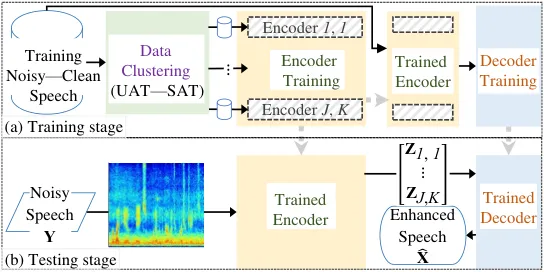

Fig. 1: The overall architecture of the DAEME approach.

Despite the impressive performance in speech signal processing tasks,
there are three possible limitations to implementing a typical ensemble
learning model in a real-world SE application: First, it is difficult to
tell the contribution of each component model. Second, the amount of
training data for training multiple models may not be sufficient since
the training data for each component model is a subset of all training
data. Third, it is not easy to dynamically determine which component
models should be kept and which should be removed.

To overcome the above three limitations, we propose a novel DAEME SE
algorithm, which comprises training and testing stages. In the training
stage, a DSDT is constructed based on the attributes of speech and noise
acoustic features. Since the DSDT is constructed in a top-down manner, a
node in a higher layer consists of speech data with broad attribute
information. On the other hand, a node in a lower layer denotes the
speech data with more specific attribute information. An SE model is
built for each node in the tree. The models corresponding to higher
layers of the DSDT tree are trained with more training data and can be
used as initial models to estimate component models corresponding to
lower layers of the DSDT tree. These SE models are then used as
component models in the multi-branched encoder. Next, a decoder is
trained in order to combine the results of the multiple models. In the
testing stage, a testing utterance is first processed by the component
models; the outputs of these models are then combined by the decoder to
generate the final output. Since the DSDT has a clear physical
structure, it becomes easy to analyze the SE property of each component
model. Moreover, based on the DSDT, we may dynamically determine the
number of SE models according to the amount of training data and the
hardware limitation in the training stage. Last but not least, in
\[62\], the authors proposed a special “overfitting” strategy to
interpret the effectiveness of a component model. When training ensemble
models, we intend to implement a “conditional overfitting” strategy,
which aims to train each component model to overfit to (or perfectly
match) its training data (i.e., the training data corresponding to each
node in the tree in our work). The DAEME algorithm has better
interpretability by using attribute-fit regressions based on the DSDT.

## III Proposed DAEME Algorithm

The overall architecture of the proposed DAEME approach is depicted in
Fig. 1. In this section, we will detail the training and testing stages.

### III-A Training stage

In the training stage, we first build a tree based on the attributes of
the training utterances in a top-down manner. The root of the tree
includes the entire set of training data. Then, based on the
utterance-level attributes, we create the branches from the root node.
As the layers increase, the nodes represent more specific
utterance-level attribute information. Next, we process signal-level
attributes to create branches upon the nodes. Finally, we have a tree
with multiple branches. As shown in Fig. 2, based on the utterance-level
and signal-level attributes, we build UAT and SAT, respectively. In the
following subsection, we will introduce the UAT and SAT in more detail.

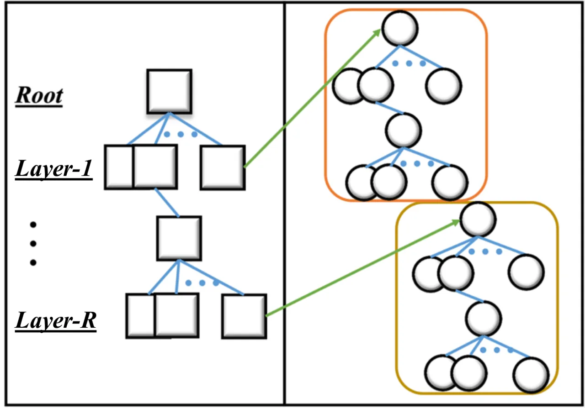

Fig. 2: The tree built on the utterance-level attribute (UAT) and
signal-level attribute (SAT).

#### III-A1 Utterance-level attribute tree (UAT)

The utterance-level attributes include speaker and speaking environment
factors, such as the gender, age, accent, or identity for the speaker
factor, and the signal-to-noise ratio (SNR), noise type, and acoustic
environment for the environment factor. As reported in \[63\], three
major factors that affect the SE performance are the noise type,
speaker, and SNR. In real-world scenarios, the noise type is usually
inaccessible beforehand. Accordingly, we only consider the speaker and
SNR factors when building the attribute tree in this study. The root
node includes all the training utterances. Next, we create two branches
from the root node for male and female speakers. Therefore, each node in
the second layer contains the training utterances of male or female
speakers. Then, the two nodes in the second layer are further divided to
four nodes in the third layer, each containing the training data of
“male with high SNR”, “male with low SNR”, “female with high SNR” or
“female with low SNR”.

#### III-A2 Signal-level attribute tree (SAT)

For the signal-level attributes, we segment the acoustic features into
several groups, each with similar properties. For SE, it has been
reported that considering low and high frequency properties can give
improved performance \[64\]. In this study, we segment the acoustic
features into high-frequency and low-frequency parts by two methods:
spectral segmentation (SS) and wavelet decomposition (WD). With the
signal-level attributes, we can create an additional layer for each node
of the tree constructed using the utterance-level attributes, forming
final binary branches from each node.

#### III-A3 Models of multi-branched encoder and decoder

The overall procedure of the training stage is shown in Fig. 1 (a). We
estimate a component model for each node in the tree. The input and
output of the model is paired by noisy and clean features, and the
objective is to estimate the mapping function between the paired
features. We reason that the model at the highest layer (the root node)
characterizes the mapping function globally, rather than considering
specific local information. In our case, the local information includes
the speaker attributes and environment features segmented by each layer
and node in the DSDT. On the other hand, the model corresponding to a
node in a lower layer characterizes a more localized mapping of paired
noisy and clean features. More specifically, each model characterizes a
particular mapping in the overall acoustic space. Given the component SE
models, we then estimate a decoder. Note that by using the component
models to build multiple SE mapping functions, we can factorize the
global mapping function (the mapping of the root node in our system)
into several local mapping functions; the decoder uses the complementary
information provided by the local mappings to obtain improved
performance as compared to the global mapping. This also follows the
main concept of ensemble learning: building multiple over-trained
models, each specializing in a particular task, and then computing a
fusion model to combine the complementary information from the multiple
models. Assume that we have $`J\times K`$ component models built by UAT
and SAT, the SE can be derived with the component models as

```math
\\
\begin{array}[]{c}\textbf{Z}_{1,1}\ =\ F_{1,1}^{(E)}\ (\textbf{Y})\\
\textbf{Z}_{1,2}\ =\ F_{1,2}^{(E)}\ (\textbf{Y})\\
..\\
\textbf{Z}_{j,k}\ =\ F_{j,k}^{(E)}\ (\textbf{Y})\\
..\\
\textbf{Z}_{J,K}\ =\ F_{J,K}^{(E)}\ (\textbf{Y})\end{array} \tag{5}
```

and the decoder as

```math
\\
\begin{array}[]{c}\hat{\textbf{X}}\ =\ F_{\theta}^{(D)}\ (\textbf{Z}_{1,1},\textbf{Z}_{1,2},...,\textbf{Z}_{J,K}),\end{array} \tag{6}
```

where j and k represents the UAT node index and the SAT node index,
respectively. $`F_{j,k}^{(E)}`$ denotes the transformation of the
$`j,k`$-th component model, $`\textbf{Z}_{j,k}`$ is the corresponding
output, and $`F_{\theta}^{(D)}`$ denotes the transformation of the
decoder. The parameter, $`\theta`$, is estimated by:

```math
\hat{\theta}=\mathop{\arg\min}_{\theta}D_{iff}(\mathbf{X},\hat{\mathbf{X}}). \tag{7}
```

where $`D_{iff}(\cdot)`$ denotes a function that measures the difference
of paired inputs. In this study, we adopted the mean-square-error (MSE)
function for $`D_{iff}(\cdot)`$.

### III-B Testing stage

The testing stage of the DAEME algorithm is shown in Fig. 1 (b). The
input speech is first converted to acoustic features, and each component
model processes these features separately. The outputs are then combined
with a decoder. Finally, the enhanced acoustic features are
reconstructed to form the speech waveform. As mentioned earlier, based
on the tree structure, we may dynamically determine the number of
ensemble models according to the online processing hardware limitation
or the amount of training data available. Note that, the system
complexity is determined in the training stage.

It is important to note that one can use different types of models and
different types of acoustic features to form the component models in the
multi-branched encoder. In this study, we intend to focus on comparing
the effects caused by different attributes of the speech utterances, so
the same neural network model architecture was used for all components
in the multi-branched encoder. Additionally, we adopted different types
of models to form encoders and decoders to investigate the correlation
between the model types and the overall performance. Please note that
the knowledge, such as gender and SNR information, is only used in the
training stage for building the component models. Such prior knowledge
is not used in the testing stage.

## IV EXPERIMENTS & RESULTS

We used two datasets to evaluate the proposed algorithm, namely the Wall
Street Journal (WSJ) corpus \[65\] and the Taiwan Mandarin version of
the hearing in noise test (TMHINT) sentences \[66\]. In this section, we
present the experimental setups for the two datasets and discuss the
evaluation results.

### IV-A Evaluation metrics

To evaluate the performance of SE algorithms, we used Perceptual
Evaluation of Speech Quality (PESQ) \[67\] and Short-Time Objective
Intelligibility (STOI) \[68\]. PESQ and STOI have been widely used as
standard objective measurement metrics in many related tasks \[33, 69,
70\]. PESQ specifically aims to measure the speech quality of the
utterances, while STOI aims to evaluate the speech intelligibility. The
PESQ score ranges from -0.5 to 4.5, a higher score indicating better
speech quality. The STOI score ranges from 0.0 to 1.0, a higher score
indicating higher speech intelligibility.

### IV-B Experiments on the WSJ dataset

The WSJ corpus is a large vocabulary continuous speech recognition
(LVCSR) benchmark corpus, which consists of 37,416 training and 330 test
clean speech utterances. The utterances were recorded at a sampling rate
of 16Khz. We prepared the noisy training data by artificially
contaminating the clean training utterances with 100 noise types \[71\]
at 31 SNR levels (20dB to -10dB, with a step of 1dB). Each clean
training utterance was contaminated by one randomly selected noise
condition; therefore, the entire training set consisted of 37,416
noisy-clean utterance pairs. To prepare the noisy test data, four types
of noises, including two stationary types (i.e., car and pink) and two
non-stationary types (i.e., street and babble), were added to the clean
test utterances at six SNR levels (-10 dB, -5dB, 0 dB, 5 dB, 10 dB, and
15 dB). Note that the four noise types used to prepare the test data
were not involved in preparing the training data. We extracted acoustic
features by applying 512-point Short-time Fourier Transform (STFT) with
a Hamming window size of 32 ms and a hop size of 16 ms on training and
test utterances, creating 257-point STFT log-power-spectrum (LPS)
features. For the baseline SE system, we used a BLSTM model with two
bidirectional LSTM layers of 300 nodes followed by a fully connected
output layer \[32\]. For DAEME, similar to the baseline system, we used
two bidirectional LSTM layers with 300 nodes and one fully connected
output layer to form the components in the multi-branched encoder. Since
an essential objective of DAEME is to provide sufficient information to
be able to generalize the SE models, multiple models are created, each
learning the particular mapping function. A CNN composed of three
convolutional layers and two fully connected layers, each convolutional
layer containing 64 channels and each fully connected layers containing
1024 neurons, was used to form the decoder. For a fair comparison, all
of the component and decoder models are trained using the same number of
epochs.

### IV-C Prior knowledge of speech and noise structures

Recent monaural SE studies have mentioned the importance of attributive
generalizability in SE systems. For example, in \[63\], Morten et al.
compared noise types, speaker, and SNR level and their potential to
enhance the intelligibility of SE systems. To build the DSDT and the
corresponding DAEME system, we first qualitatively analyzed the acoustic
properties of speech attributes. As mentioned earlier, we assumed that
the noise type is inaccessible and conducted the T-SNE analysis \[72\]
on the training data of the WSJ dataset. T-SNE performs nonlinear
dimensionality reduction on the original data, and the T-SNE plot has
been popularly used for data representation and analysis. Like other
dimensionality reduction techniques, such as PCA, the two axes may not
have physical meanings. Nevertheless, we can determine the clusters by
associating the axes with physical attributes. The analysis results are
shown in Fig. 3, where in Fig. 3 (a), we analyzed the gender attributes,
and in Fig. 3 (b) and (c), we analyzed the SNR attributes.

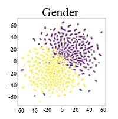

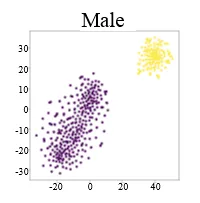

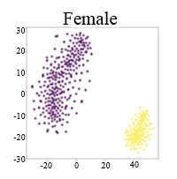

Fig. 3: T-SNE analysis on the utterance-level attributes. (a) Gender:
male (yellow dots) vs. female (purple dots). (b) Male: high SNR (yellow
dots) vs. low SNR (purple dots). (c) Female: high SNR (yellow dots) vs.
low SNR (purple dots). Note that we used the LPS features to draw the
T-SNE plots.

From Fig. 3 (a), we can note a clear separation between male (yellow
dots) and female (purple dots). In Figs. 3 (b) (i.e., male data of
different SNR levels) and 3 (c) (i.e., female data of different SNR
levels), the T-SNE analysis also shows a clear separation between high
SNR (10dB and above, yellow dots) and low SNR (below 10dB, purple dots)
in both gender partitions.

On the other hand, from the signal point of view, most real-world noises
were non-stationary in the time-frequency domain. This suggests that
noise pollution is unlikely to occur in all frequency bands at the same
time even under low SNR conditions. In our previous studies \[59\],
segmental frequency bands were proposed to enhance speaker adaptation.
In this study, the signal-level attribute is used to consider the low
and high frequency bands. With the signal-level attribute, the SE
algorithm can obtain more speech structure information even under noisy
conditions.

#### IV-C1 The effectiveness of the UAT

We first analyzed the DAEME model with a tree built with the
utterance-level attributes. As mentioned in Section III-A-1), the root
node of the UAT included the entire set of 37,416 noisy-clean utterance
pairs for training. The entire training set was divided into male and
female in the first layer, each with 18,722 (male) and 18,694 (female)
noisy-clean training pairs, respectively. For the next layer, the
gender-dependent training data was further divided into low and high SNR
conditions. Finally, there were four leaf nodes in the tree, each with
6,971 (female with high SNR), 11,723 (female with low SNR), 7,065 (male
with high SNR), and 11,657 (male with low SNR) noisy-clean training
pairs. We investigated the performance of DAEME with different numbers
of components in the multi-branched encoder, and thus built three
systems. The first system had two component models: male and female. The
second system had four component models: female with high SNR, female
with low SNR, male with high SNR, and male with low SNR. The third
system had six component models: female, male, female with high SNR,
female with low SNR, male with high SNR, and male with low SNR. The
three systems are termed DAEME-UAT₍₂₎, DAEME-UAT₍₄₎, and DAEME-UAT₍₆₎,
respectively.

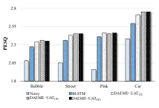

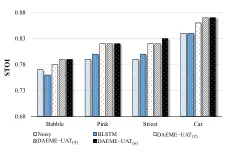

Fig. 4: Performance comparison of DAEME-UAT\_((i)), $`i=2,4,6`$, and a
single model BLSTM SE method in terms of the PESQ score. The results of
unprocessed noisy speech, denoted as Noisy, are also listed for
comparison.

Fig. 5: Performance comparison of DAEME-UAT\_((i)), $`i=2,4,6`$, and a
single model BLSTM SE method in terms of the STOI score. The results of
unprocessed noisy speech, denoted as Noisy, are also listed for
comparison.

In the first set of experiments, we examined the effectiveness of the
UAT-based DAEME systems versus single model SE algorithms. We selected a
single model BLSTM for the benchmark performance. This BLSTM model was
trained with the entire set of 37,416 noisy-clean utterance pairs. Fig.
5 shows the PESQ scores of the proposed systems (DAEME-UAT₍₂₎,
DAEME-UAT₍₄₎, DAEME-UAT₍₆₎) and the single BLSTM model. Fig. 5 shows the
STOI scores. In these two figures, each bar indicates an average score
over six SNR levels for a particular noise type. From the results in
Figs. 4 and 5, we note that all the DAEME-UAT models outperform the
single BLSTM model methods in all noise types. More specifically, using
only the UAT, the DAEME systems already surpasses the performance of the
single model SE methods by a notable margin. This result justifies the
tree-based data partitioning in training the DAEME method.

To further verify the effectiveness of the UAT, we constructed another
tree. The root node also contained the entire set of 37,416 noisy-clean
utterance pairs. The training utterance pairs were randomly divided into
two groups to form two nodes in the second layer, where each node
contained 18,694 and 18,722 noisy-clean utterance pairs, respectively.
In the third layer, the training utterance pairs of each node in the
second layer were further divided into two groups randomly to form four
nodes in the third layer. Since the tree was built by randomly assigning
training utterances to each node, this tree is termed random tree (RT)
in the following discussion. Based on this RT, we built three systems,
termed DAEME-RT₍₂₎, DAEME-RT₍₄₎, and DAEME-RT₍₆₎, each consisting of 2,
4, and 6 component models, respectively. Figs. 6 and 7 compare the PESQ
and STOI scores of different DAEME systems (including DAEME-UAT₍₂₎,
DAEME-UAT₍₄₎, DAEME-UAT₍₆₎, DAEME-RT₍₂₎, DAEME-RT₍₄₎, and DAEME-RT₍₆₎)
based UAT or RT. From the figures, we can draw two observations. First,
DAEME-UAT₍₆₎ achieve a better performance than their respective
counterparts with less component models. Since the same decoder is used,
the performance improvements are mainly contributed by the specific
designs of component models. Based on the performance improvements, we
can also see the advantage of using the tree structures to design
component models in the DAEME framework. Second, the results of
DAEME-UAT*((i)) are consistently better than DAEME-RT*((i)) for
$`i=2,4,6`$. The result confirms the effectiveness of the UAT over RT.
For ease of further comparison, we list the detailed PESQ and STOI
scores of DAEME-UAT₍₆₎ (the best system in Figs 6 and 7) in Tables II
and II.

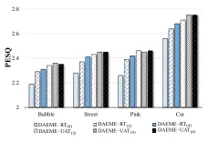

Fig. 6: Performance comparison of DAEME-UAT*((i)) and DAEME-RT*((i)),
$`i=2,4,6`$ in terms of the PESQ score.

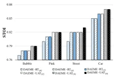

Fig. 7: Performance comparison of DAEME-UAT*((i)) and DAEME-RT*((i)),
$`i=2,4,6`$ in terms of the STOI score.

 

DAEME-UAT₍₆₎

|        |      |      |      |      |      |       |      |
| ------ | ---- | ---- | ---- | ---- | ---- | ----- | ---- |
|        | 15dB | 10dB | 5dB  | 0dB  | -5dB | -10dB | Avg. |
| CAR    | 3.21 | 3.11 | 2.96 | 2.72 | 2.41 | 2.06  | 2.75 |
| PINK   | 3.16 | 2.98 | 2.73 | 2.39 | 1.96 | 1.56  | 2.46 |
| STREET | 3.15 | 2.98 | 2.73 | 2.37 | 1.92 | 1.55  | 2.45 |
| BABBLE | 3.15 | 2.93 | 2.63 | 2.20 | 1.74 | 1.43  | 2.35 |
| Avg.   | 3.17 | 3.00 | 2.76 | 2.42 | 2.01 | 1.65  | 2.50 |

 

 

DAEME-UAT₍₆₎

|        |      |      |      |      |      |       |      |
| ------ | ---- | ---- | ---- | ---- | ---- | ----- | ---- |
|        | 15dB | 10dB | 5dB  | 0dB  | -5dB | -10dB | Avg. |
| CAR    | 0.93 | 0.92 | 0.90 | 0.87 | 0.82 | 0.76  | 0.87 |
| PINK   | 0.94 | 0.92 | 0.90 | 0.84 | 0.74 | 0.59  | 0.82 |
| STREET | 0.94 | 0.92 | 0.89 | 0.81 | 0.68 | 0.51  | 0.79 |
| BABBLE | 0.94 | 0.92 | 0.90 | 0.84 | 0.75 | 0.62  | 0.83 |
| Avg.   | 0.94 | 0.92 | 0.90 | 0.84 | 0.75 | 0.62  | 0.83 |

 

TABLE I: PESQ scores of the DAEME-UAT₆ system at four noise types and
six SNRs. Avg. denotes the average scores.

TABLE II: STOI scores of the DAEME-UAT₆ system at four noise types and
six SNRs. Avg. denotes the average scores

#### IV-C2 The effectiveness of the SAT

As introduced in Section III-A-2), we can use the SS and WD approaches
to build the SAT. To compare the SS and WD approaches, we used the SAT
on top of DAEME-UAT₍₆₎, which achieved the best performance in Fig. 6
(PESQ) and Fig. 7 (STOI), to build two systems: DAEME-USAT*((SS)(12))
and DAEME-USAT*((WD)(12)), where USAT denotes the system using the
“UA+SA” tree. Because the SA tree was built into each node of the UA
tree, the total number of component models for an DAEME-USAT system is
the number of nodes in the UA tree multiplied by the number of nodes in
the SA tree. We applied the SS and WD approaches to segment the
frequency bands. For SS, we directly separated the low and high
frequency parts based on the spectrograms. Among the 257 dimensional
spectral vector, we used \[1:150\] and \[108:257\] coefficients as the
low- and high-frequency parts, respectively. For WD, we used the
Biorthogonal 3.7 wavelet \[73\], which was directly applied on the
speech waveforms to obtain the low- and high-frequency parts. In either
way, the SA tree had two nodes. Therefore, we obtained
DAEME-USAT*((SS)(12)) and DAEME-USAT*((WD)(12)), respectively, based on
DAEME-UAT₍₆₎ after applying the SA trees constructed by the SS and WD
approaches.

The PESQ and STOI scores of DAEME-USAT*((SS)(12)) and
DAEME-USAT*((WD)(12)) are listed in Tables IV and IV, respectively. From
these two tables, we observe that DAEME-USAT*((WD)(12)) outperformed
DAEME-USAT*((SS)(12)) in terms of the PESQ score across 15dB to -10dB
SNR conditions, while the two systems achieved comparable performance in
terms of the STOI score. Comparing the results in Tables I and II and
the results in Tables III and IV, we note that both
DAEME-USAT*((SS)(12)) and DAEME-USAT*((WD)(12)) achieved better PESQ and
STOI scores than DAEME-UAT₍₆₎. In addition to the average PESQ and STOI
scores, we adopted a statistical hypothesis test, the dependent t-test,
to verify the significance of performance improvements \[74\], \[75\].
We compared two methods by testing the individual average PESQ/STOI
scores of 24 matched pairs (4 noise types and 6 SNR levels) and
estimated the $`p`$-value. For the t-test, we considered $`H_{0}`$ as
“method-II is not better than method-I,” and $`H_{1}`$ as “method-II is
better than method-I.” Small $`p`$-values imply significant improvements
of method-II over method-I across the 24 matched pairs. A threshold of
0.01 was used to determine whether the improvements were statistically
significant. For the PESQ scores, the improvements of DAEME-UAT₍₆₎,
DAEME-USAT*((SS)(12)) and DAEME-USAT*((WD)(12)) over BLSTM are
significant with very small $`p`$-values. In addition, the improvements
of DAEME-USAT*((SS)(12)) and DAEME-USAT*((WD)(12)) over DAEME-UAT₍₆₎ are
significant with very small $`p`$-values. For the STOI scores, the
improvements of DAEME-UAT₍₆₎, DAEME-USAT*((SS)(12)) and
DAEME-USAT*((WD)(12)) over BLSTM are significant with very small
$`p`$-values. However, the differences of DAEME-USAT*((SS)(12)) over
DAEME-USAT*((WD)(12)) are not significant. The results first confirm the
effectiveness of the DAEME model in providing better speech quality and
intelligibility. The results also confirm the effectiveness of the SA
tree in enabling DAEME to generate enhanced speech with better quality.

 

DAEME-USAT\_((SS)(12))

|        |      |      |      |      |      |       |      |
| ------ | ---- | ---- | ---- | ---- | ---- | ----- | ---- |
|        | 15dB | 10dB | 5dB  | 0dB  | -5dB | -10dB | Avg. |
| CAR    | 3.34 | 3.23 | 3.05 | 2.79 | 2.46 | 2.09  | 2.83 |
| PINK   | 3.27 | 3.08 | 2.82 | 2.46 | 2.02 | 1.60  | 2.54 |
| STREET | 3.27 | 3.09 | 2.81 | 2.43 | 1.97 | 1.58  | 2.53 |
| BABBLE | 3.25 | 3.02 | 2.69 | 2.24 | 1.75 | 1.44  | 2.40 |
| Avg.   | 3.28 | 3.11 | 2.84 | 2.48 | 2.05 | 1.68  | 2.57 |

 

 

DAEME-USAT\_((WD)(12))

|        |      |      |      |      |      |       |      |
| ------ | ---- | ---- | ---- | ---- | ---- | ----- | ---- |
|        | 15dB | 10dB | 5dB  | 0dB  | -5dB | -10dB | Avg. |
| CAR    | 3.49 | 3.36 | 3.17 | 2.88 | 2.52 | 2.13  | 2.93 |
| PINK   | 3.34 | 3.12 | 2.84 | 2.48 | 2.03 | 1.59  | 2.57 |
| STREET | 3.39 | 3.18 | 2.89 | 2.49 | 2.00 | 1.58  | 2.59 |
| BABBLE | 3.37 | 3.12 | 2.77 | 2.30 | 1.78 | 1.44  | 2.46 |
| Avg.   | 3.40 | 3.20 | 2.92 | 2.54 | 2.08 | 1.69  | 2.64 |

 

 

DAEME-USAT\_((SS)(12))

|        |      |      |      |      |      |       |      |
| ------ | ---- | ---- | ---- | ---- | ---- | ----- | ---- |
|        | 15dB | 10dB | 5dB  | 0dB  | -5dB | -10dB | Avg. |
| CAR    | 0.94 | 0.93 | 0.91 | 0.87 | 0.83 | 0.77  | 0.88 |
| PINK   | 0.94 | 0.93 | 0.90 | 0.85 | 0.75 | 0.60  | 0.83 |
| STREET | 0.94 | 0.93 | 0.90 | 0.85 | 0.76 | 0.64  | 0.84 |
| BABBLE | 0.94 | 0.93 | 0.89 | 0.82 | 0.69 | 0.51  | 0.80 |
| Avg.   | 0.94 | 0.93 | 0.90 | 0.85 | 0.76 | 0.63  | 0.83 |

 

 

DAEME-USAT\_((WD)(12))

|        |      |      |      |      |      |       |      |
| ------ | ---- | ---- | ---- | ---- | ---- | ----- | ---- |
|        | 15dB | 10dB | 5dB  | 0dB  | -5dB | -10dB | Avg. |
| CAR    | 0.94 | 0.93 | 0.91 | 0.88 | 0.83 | 0.77  | 0.88 |
| PINK   | 0.95 | 0.93 | 0.90 | 0.84 | 0.74 | 0.59  | 0.83 |
| STREET | 0.95 | 0.93 | 0.90 | 0.85 | 0.75 | 0.62  | 0.83 |
| BABBLE | 0.95 | 0.93 | 0.90 | 0.82 | 0.68 | 0.50  | 0.80 |
| Avg.   | 0.95 | 0.93 | 0.90 | 0.85 | 0.75 | 0.62  | 0.83 |

 

TABLE III: PESQ scores of the DAEME-USAT*((SS)(12)) and
DAEME-USAT*((WD)(12)) systems at four noise types and six SNRs. Avg.
denotes the average scores.

TABLE IV: STOI scores of the DAEME-USAT*((SS)(12)) and
DAEME-USAT*((WD)(12)) systems at four noise types and six SNRs. Avg.
denotes the average scores.

### IV-D Experiments on the TMHINT dataset

The TMHINT corpus consists of speech utterances of eight speakers (four
male and four female), each utterance corresponding to a sentence of ten
Chinese characters. The speech utterances were recorded in a recording
studio at a sampling rate of 16 kHz. Among the recorded utterances,
1,200 utterances pronounced by three male and three female speakers
(each providing 200 utterances) were used for training. 120 utterances
pronounced by another two speakers (one male and one female) were used
for testing. There is no overlap between the training and testing
speakers and speech contents. We used 100 different noise types \[76\]
to prepare the noisy training data at 31 SNR levels (from -10dB to 20
dB, with a step of 1 dB). Each clean utterance was contaminated by
several randomly selected noise conditions (one condition corresponds to
a specific noise type and an SNR level). Finally, we collected 120,000
noisy-clean utterance pairs for training. For the testing data, four
types of noises, including two stationary types (i.e., car and pink) and
two non-stationary types (i.e., street and babble), were used to
artificially generate noisy speech utterances at six SNR levels (-10 dB,
-5dB, 0 dB, 5 dB, 10 dB, and 15 dB). As with the setup for the WSJ task,
these four noise types were not included in preparing the training set.

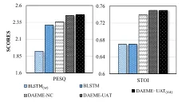

Fig. 8: Average PESQ and STOI scores of BLSTM*((w)), BLSTM, DAEME-NC,
DAEME-UAT, and DAEME-UAT*((SA)).

As we have evaluated the DAEME systems in several different aspects in
the previous subsection, we will examine the DAEME algorithm in other
aspects (including the achievable performance by incorporating other
knowledge, for seen noise types, different component model types,
different decoder model types, and the ASR and listening test results)
in this subsection.

#### IV-D1 Incorporating noise type and speaker identity information

First, we implemented the DAEME by incorporating other knowledge, namely
the noise type and speaker identity. In previous experiments, we assume
that the gender and SNR information is available for each training
utterance, and the UAT tree can be built based on such information. To
compare, we built a DAEME system that prepares the component models
without using the gender and SNR information. In this comparative
system, we first built an utterance-based noise-type classifier by using
a 2-layered BLSTM followed by one fully-connected layer. The input and
output to the noise-type classifier, respectively, were a sequence of
257-dimensional LPS vectors and a 100-dimensional one-hot-vector
(corresponding to the 100 noise types in the training set). Given an
utterance, the noise-type classifier predicted the noise type of the
utterance. We fed the entire set of training utterances into this
noise-type classifier and collected the latent representations (each
with 200 dimensions) of all of the training utterances. The entire set
of latent representations were then clustered into $`J`$ clusters. Each
cluster represented a particular cluster of training utterances and was
used to train a component model. Finally, a fusion network was trained.
Because a noise-classifier is used to partition the training data, this
model is termed DAEME-NC. Different from the DAEME systems presented
earlier, DAEME-NC prepared the component models in a data-driven manner
without using the gender and SNR information. Because we intended to
compare this approach with the UAT, we used 6 component models here for
a fair comparison. The results of DAEME-NC are shown in Fig. 8. The
results of BLSTM and DAEME-UAT are also listed for comparison. From the
figure, we can note that DAEME with knowledge-based UAT outperforms
DAEME-NC, while DAEME-NC provides better performance than a single BLSTM
model, in terms of both STOI and PESQ. All the improvements have been
confirmed significant with very small $`p`$-values.

In \[77\], a speaker-aware SE system was proposed and shown to provide
improved performance. In this work, we conducted an additional set of
experiments that integrate the speaker-aware techniques into the DAEME
(termed DAEME-UAT*((SA))). For DAEME-UAT*((SA)), we included the speaker
information in the decoder used on the same approach proposed in \[77\].
More specifically, we first extracted embedded speaker identity features
using a pre-trained DNN model, which was trained to classify a
frame-wise speech feature into a certain speaker identity. Then, the
decoder of DAEME took augmented inputs (a combination of the outputs
from the multi-branched encoder and the identity features) to generate
enhanced spectral features. With the additional identity features, the
overall enhancement system can be guided to generate the outputs
considering the speaker identity. The results of DAEME-UAT*((SA)) are
also listed in Fig. 8. DAEME-UAT*((SA)) yields better performance than
DAEME-UAT. The improvements are significant with very small
$`p`$-values. The result confirms the effectiveness of incorporating the
speaker information into the DAEME system.

We further investigated the advantage of the ensemble learning used in
DAEME and thus trained a very wide and complex BLSTM model, which has
exactly the same number of parameters as DAEME-UAT. The wide and complex
BLSTM is termed BLSTM*((W)), and the results are also reported in Fig. 8. From the figure, we note that the performance of BLSTM*((W)) is much
worse than DAEME-UAT and other systems. The results well present a major
advantage of the ensemble learning concept: to implement the target
task, it is not needed to train a very wide, big, and complex model,
which may take a lot of computation power and resource, yet difficult to
train. Instead, we can train a set of simpler (weak) component models
and a fusion network, which combines the outputs of these simple
component models. Moreover, in terms of incorporating new knowledge, the
ensemble learning approach has much more flexibility than a universal
and complex model.

#### IV-D2 Evaluation under seen noise types

Next, we examine the DAEME effectiveness under seen noise conditions. We
prepared testing data that involved two noise types (Cafeteria and
Crowd) that were included in the training set. Then, we tested the
enhancement performance of DAEME on the above testing noisy data. The
PESQ and STOI results are listed in Tables VI and VI, respectively. For
comparison, we also listed the scores of BLSTM. The results in the
tables show that DAEME outperforms the single BLSTM model with a clear
margin. The improvements have been confirmed significant with very small
$`p`$-values. The result confirms that DAEME, which preserves local
information of the training data, can yield better performance than
BLSTM, in which the local information may be averaged out, for seen
noise types.

|           |       |       |       |
| --------- | ----- | ----- | ----- |
|           | Noisy | BLSTM | DAEME |
| CAFETERIA | 2.01  | 2.56  | 2.70  |
| CROWD     | 1.99  | 2.55  | 2.70  |
| Avg.      | 2.00  | 2.56  | 2.70  |

|           |       |       |       |
| --------- | ----- | ----- | ----- |
|           | Noisy | BLSTM | DAEME |
| CAFETERIA | 0.65  | 0.71  | 0.72  |
| CROWD     | 0.66  | 0.72  | 0.74  |
| Avg.      | 0.65  | 0.71  | 0.73  |

TABLE V: PESQ scores of seen data of BLSTM and DAEME.

TABLE VI: STOI scores of seen data of BLSTM and DAEME.

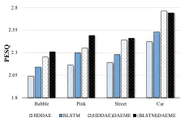

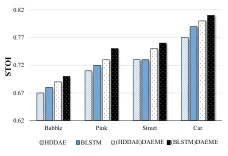

Fig. 9: PESQ scores of SE systems using different component models in
the multi-branched encoder. The scores of unprocessed noisy speech are
1.94, 1.78, 1.95, and 2.36 for Babble, Pink, Street, and Car,
respectively.

Fig. 10: STOI scores of SE systems using different component models in
the multi-branched encoder. The scores of unprocessed noisy speech are
0.69, 0.71, 0.72, and 0.79 for Babble, Pink, Street, and Car,
respectively.

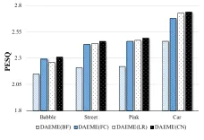

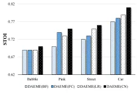

Fig. 11: PESQ scores of DAEME-based ensemble SE systems using different
types of decoder.

Fig. 12: STOI scores of DAEME-based ensemble SE systems using different
types of decoder.

#### IV-D3 The component models of DAEME

We analyzed the compatibility of the DAEME algorithm with different
component models. In the previous experiments, we used BLSTM to build
the multi-branched encoder and CNN as the decoder. First, we followed
the setup of the best model DAEME-USAT\_((WD)(12)) and adopted HDDAE in
addition to BLSTM as the architecture of a component model. The
BLSTM-based component model consisted of two layers, with 300 memory
cells in each layer, and the HDDAE-based component model consisted of
five hidden layers, each containing 2,048 neurons, and one highway layer
\[48\]. Figs. 9 and 10 present the PESQ and STOI scores of different
systems, including two single model SE systems (HDDAE, and BLSTM) and
two DAEME-based ensemble systems, (BLSTM)DAEME, and (HDDAE)DAEME, where
BLSTM, and HDDAE were used to build the component models in the
multi-branched encoder, respectively. From the figures, we can note that
(HDDAE)DAEME, and (BLSTM)DAEME outperform their single model
counterparts (HDDAE and BLSTM). It is also shown that among the two
single model-based systems, BLSTM outperformed HDDAE. Among the two
DAEME-based systems, (BLSTM)DAEME achieves the best performance,
suggesting that the architecture of the component model of DAEME indeed
affects the overall performance.

#### IV-D4 The architecture of decoder

Next, we investigated the decoder in the DAEME-based systems. In this
set of experiments, BLSTM with the same architecture as in the previous
experiments was used to build the component SE models. We compared four
types of decoder: the CNN model used in the previous experiments and the
linear regression as shown in Eq.(1). We used another nonlinear mapping
function based on a fully connected network. Finally, we used the BF
approach, which selects the most suitable output from the component
models as the final output. More specifically, we assume that the gender
and SNR information were accessible for each testing utterance, and the
BF approach simply selected the ”matched” output without further
processing. The results of using different decoder types are listed in
Figs. 11 and 12, which report the PESQ and STOI scores, respectively.
For DAEME(LR), the decoder is formed by a linear regression function,
for DAEME(FC) and DAEME(CN), the decoder is formed by a nonlinear
mapping function based on a fully connected network and CNN,
respectively, and for DAEME(BF), the decoder is formed by the BF
approach. Please note that the way to combine multiple outputs of
encoders depends on the type of decoder. When using BF as the decoder,
only one output from the multi-branched encoder is used. When using LR,
FC, or CN as the decoder, we first concatenate the encoded feature maps,
and then compute the enhanced speech. We followed Eq. (1) to implement
LR. For FC, we used 2 dense layers, each with 1024 nodes. For CNN, we
used 3 layers of 1-D convolution, each with kernel size 11, stride 1,
and 64 channels, followed by 2 dense layers, each with 1024 nodes. No
pooling layer was used for CNN.

From Figs. 11 and 12, it is clear that DAEME(CN) outperforms DAEME(FC),
DAEME(LR), and DAEME(BF) consistently. The results confirm that when
using a decoder that has more powerful nonlinear mapping capability, the
DAEME can achieve better performance. We also conducted the dependent
t-test to verify whether the improvements are significance. It is
confirmed that the improvements of DAEME(CN) over BLSTM are significant
in terms of both PESQ and STOI scores with very small $`p`$-values,
again verifying the effectiveness of the DAEME model for providing
better speech quality and intelligibility over a single model.

#### IV-D5 ASR performance

The previous experiments have demonstrated the ability of the DAEME
methods to enhance the PESQ and STOI scores. Here, we evaluated the
applicability of DAEME as a denoising front end for ASR under noisy
conditions. Google ASR \[78, 4\] was adopted to test the character error
rate (CER) with the correct transcription reference. The best setup of
DAEME for the TMHINT dataset, i.e., DAEME-USAT\_((WD)(12)), was used to
pre-process the input noisy speech, and the enhanced speech was sent to
Google ASR. The unprocessed noisy speech and the enhanced speech by a
single BLSTM model were also tested for comparison. The CER results for
these three experimental setups are demonstrated in Fig. 13. It is clear
that the single-model BLSTM SE system is not always helpful. The
enhanced speech tends to yield higher CERs than the unprocessed noisy
speech while tested under higher SNR conditions (0 to 15dB) and achieve
only slightly lower CERs under relatively noisier conditions (-10 to
0dB). On the other hand, the proposed DAEME system achieves lower CERs
under lower SNR conditions (-10 to 0dB) and maintains the recognition
performance under higher SNR conditions (0 to 15dB) as compared to the
noisy speech. The average CERs of noisy, BLSTM-enhanced, and
DAEME-enhanced speech across 15dB to -10dB SNR levels are 15.85%,
16.05%, and 11.4%, accordingly. DAEME achieved a relative CER reduction
of 28.07% (from 15.85% to 11.4%) over the unprocessed noisy speech.

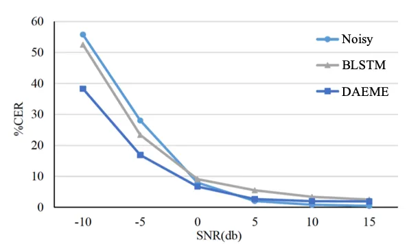

Fig. 13: CERs of Google ASR applied to noisy and enhanced speech.

#### IV-D6 Listening test

In addition to the objective evaluations and ASR tests, we also invited
15 volunteers to conduct subjective listening tests. The testing
conditions included two types of noises, car noise (stationary noise)
and babble noise (non-stationary noise), under two different SNR levels
(car: -5dB, -10dB, babble: 0dB, 5dB). We selected different SNRs for
these two noise types because the car noise is more stationary and thus
easier understood as compared to the babble noise; accordingly a lower
SNR should be specified for the car noise than the babble noise.

First, we asked each subject to register their judgment based on the
five-point scale of signal distortion (SIG) \[79\]. In the SIG test,
each subject was asked to provide the natural (no degradation) level
after listening to an enhanced speech utterance processed by either
BLSTM or DAEME. A higher score indicates that the speech signals are
more natural. The results shown in Fig. 14(a) demonstrate that DAEME can
yields a higher SIG score than BLSTM. We also asked the subjects to
judge the background intrusiveness (BAK) \[79\] after listening to an
utterance. The BAK score ranges from 1 to 5, and a higher BAK score
indicates a lower level of noise artifact perceived. The BLSTM and DAEME
enhanced utterances were tested for comparison. The results shown in
Fig. 14(b) clearly demonstrate that DAEME outperforms BLSTM in terms of
BAK. Finally, we conducted an AB preference test \[80\] to compare the
BLSTM-enhanced speech and the DAEME-enhanced speech. Each subject
listened to a pair of enhanced speech utterances and gave a preference
score. As shown in Fig. 14(c), the DAEME notably outperforms BLSTM in
the preference test. The results in Fig. 14(a), 14(b), and 14(c)
demonstrate that, compared to BLSTM, the speech enhanced by DAEME is
more natural, less noisy, and with higher quality.

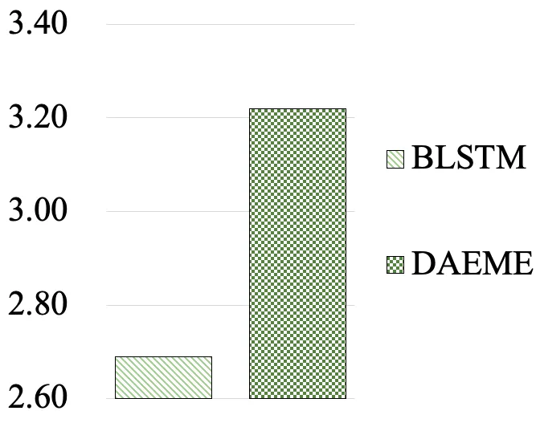

(a) SIG scores.

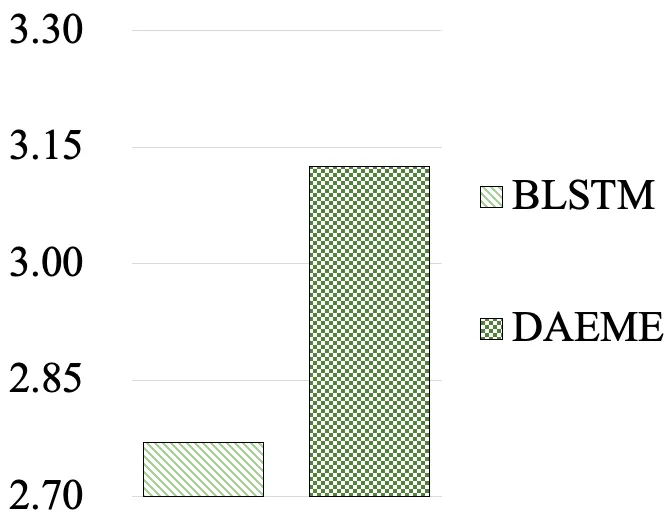

(b) BAK scores.

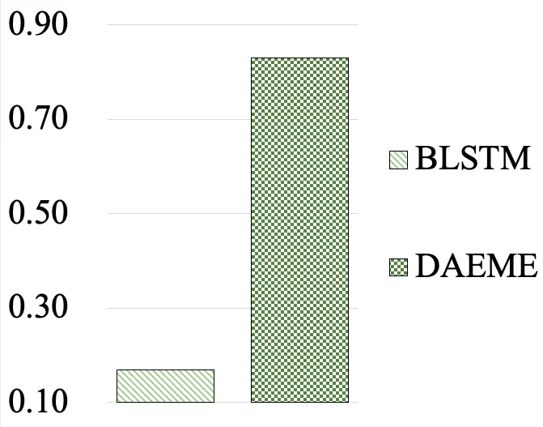

(c) Preference scores.

Fig. 14: Listening test results in terms of SIG, BAK, and AB preference.

## V Conclusions

This paper proposed a novel DAEME SE approach. By considering the
ensemble concept, the proposed method first exploits the complimentary
information based on the multi-branched encoder, and then uses a decoder
to combine the complementary information for SE. We also analyzed and
confirmed that the decoder using CNN-based non-linear transformation
yielded better SE performance than the decoder using 2-layered fully
connected network, linear transformation and the BF approach. Compared
to other learning-based SE approaches, the proposed DAEME approach has
the following three advantages:

#### V-1 The DAEME approach yields a better enhancement performance under both seen and unseen noise types than its baseline single model counterparts

As presented in Section III-A, the DSDT was built based on the
utterance-level attributes (UA) and signal-level attributes (SA) of
speech signals. The DSDT is subsequently used to establish the
multi-branched encoder in the DAEME framework. From the PESQ and STOI
scores, we confirmed the effectiveness of the UA tree and the USAT
(UA+SA) tree over traditional deep-learning-based approaches and the
system using a random tree (RT in Figs. 6 and 7). The experimental
results also confirm that the proposed DAEME has effectively
incorporated the prior knowledge of speech signals to attain improved
enhancement performance as compared to single model counterparts under
both seen and unseen noise types.

#### V-2 The DAEME architecture with a DSDT has better interpretability and can be designed according to the amount of training data and computation resource constraints

Pre-analyzing the speech attributes of the target domain using a
regression tree provides informative insights into the development of
the DAEME system. By using the tree map that categorized data through
speech attributes, we can optimally design the architecture of the
multi-branched encoder in the DAEME to strike a good balance between the
achievable performance, training data, and the system complexity. The
component models can be trained in parallel using respective training
subsets. Because multiple component models can handle different noise
conditions well, a simple decoder that is easy to train can already
provide satisfactory performance. This is confirmed by the experimental
results Figs. 11 and 12. Therefore, the training of the fusion layer
(decoder) will not require much training time. Compared to BLSTM, CNN
can be much simplified in terms of hardware and computation costs.
Therefore, BLSTM plays a major part in the total complexity of DAEME.
According to \[81\], the time complexity of BLSTM can be derived as
$`O((CH)^{2})`$, where $`H`$ is the basic number of cells and $`C`$ is
the width factor. We can arrange the computation of component models in
a parallel manner that further lowers complexity. For example, the time
complexity of a 6x wider BLSTM model is high ($`C`$=6), while that of
DAEME can be much reduced by a parallel computation.

#### V-3 The DAEME system can incorporate noise-type and speaker identity information to further improve the performance

As presented in Section IV-D-1, we can build the component models based
on the clustering results of latent representations of the training
utterances. In this way, data clustering is implemented in a data-driven
manner without the need of gender and SNR level information. Moreover,
we have tried to incorporate the speaker identity information into DAEME
(cf. Section IV-D-1)). The results also show that the SE capability can
be further improved by incorporating the speaker identity information.
As compared to a big and complex universal model, DAEME has more
flexibility to incorporate new data-driven or acoustic information.

In the future, we will explore to apply the proposed DAEME to other
speech signal processing tasks, such as speech dereverberation and audio
separation. Meanwhile, in the present study, we did not consider to
automatically determine a suitable number of models based on the testing
scenarios. That is, the number of component models must be specified in
the training stage. An algorithm that can online determine the optimal
encoder architecture based on the complexity and performance also
deserves further investigations. Finally, we will implement the proposed
DAEME system on practical devices for real-world speech-related
applications.

## References

- \[1\] S. V. Kuyk, W. B. Kleijn, and R. C. Hendriks, “Intelligibility
  metric based on a simple model of speech communication,” in Proc.
  IWAENC, 2016.
- \[2\] J. Li, L. Deng, R. Haeb-Umbach, and Y. Gong, “Robust automatic
  speech recognition: A bridge to practical applications,” Elsevier,
  Orlando, FL, USA: Academic, 2015.
- \[3\] Z.-Q. Wang and D. Wang, “A joint training framework for robust
  automatic speech recognition,” IEEE/ACM Transactions on Audio, Speech,
  and Language Processing, vol. 24, no. 4, pp. 796–806, 2016.
- \[4\] C. Donahue, B. Li, and R. Prabhavalkar, “Exploring speech
  enhancement with generative adversarial networks for robust speech
  recognition,” in Proc. ICASSP, 2018, pp. 5024–5028.
- \[5\] T. Ochiai, S. Watanabe, T. Hori, and J. R. Hershey,
  “Multichannel end-to-end speech recognition,” in Proc. ICML, 2017, pp.
  2632–2641.
- \[6\] D. Michelsanti and Z.-H. Tan, “Conditional generative
  adversarial networks for speech enhancement and noise-robust speaker
  verification,” in Proc. INTERSPEECH, 2017.
- \[7\] S. Shon, H. Tang, and J. Glass, “Voiceid loss: Speech
  enhancement for speaker verification,” in Proc. INTERSPEECH, 2019.
- \[8\] D. Wang, “Deep learning reinvents the hearing aid,” IEEE
  Spectrum, vol. March Issue, pp. 32–37 (Cover Story), 2017.
- \[9\] Y. Zhao, D. Wang, E. M. Johnson, and E. W. Healy, “A deep
  learning based segregation algorithm to increase speech
  intelligibility for hearing-impaired listeners in reverberant-noisy
  conditions,” The Journal of the Acoustical Society of America, vol.
  144, no. 3, pp. 1627–1637, 2018.
- \[10\] H. Puder, “Hearing aids: an overview of the state-of-the-art,
  challenges, and future trends of an interesting audio signal
  processing application,” in Proc. ISPA, 2009, pp. 1–6.
- \[11\] P. C. Loizou, “Signal-processing techniques for cochlear
  implants,” IEEE Engineering in Medicine and Biology magazine, vol. 18,
  no. 3, pp. 34–46, 1999.
- \[12\] P. C. Loizou, “Speech processing in vocoder-centric cochlear
  implants,” in Cochlear and brainstem implants, vol. 64, pp. 109–143.
  Karger Publishers, 2006.
- \[13\] S.-S. Wang, Y. Tsao, H.-L. S. Wang, Y.-H. Lai, and L. P.-H. Li,
  “A deep learning based noise reduction approach to improve speech
  intelligibility for cochlear implant recipients in the presence of
  competing speech noise,” in Proc. APSIPA, 2017.
- \[14\] S. Boll, “Suppression of acoustic noise in speech using
  spectral subtraction,” IEEE Transactions on Acoustics, Speech, and
  Signal Processing, vol. 27, no. 2, pp. 113–120, 1979.
- \[15\] P. Scalart and J. Vieira Filho, “Speech enhancement based on a
  priori signal to noise estimation,” in Proc. ICASSP, 1996.
- \[16\] Y. Ephraim and D. Malah, “Speech enhancement using a
  minimum-mean square error short-time spectral amplitude estimator,”
  IEEE Transactions on Acoustics, Speech, and Signal Processing, vol.
  32, no. 6, pp. 1109–1121, 1984.
- \[17\] Y. Ephraim and D. Malah, “Speech enhancement using a minimum
  mean-square error log-spectral amplitude estimator,” IEEE transactions
  on acoustics, speech, and signal processing, vol. 33, no. 2, pp.
  443–445, 1985.
- \[18\] Y. Hu and P. C. Loizou, “A subspace approach for enhancing
  speech corrupted by colored noise,” IEEE Transactions on Speech and
  Audio Processing, vol. 11, no. 4, 2002.
- \[19\] A. Rezayee and S. Gazor, “An adaptive klt approach for speech
  enhancement,” IEEE Transactions on Speech and Audio Processing, vol.
  9, no. 2, pp. 87–95, 2001.
- \[20\] P. S. Huang, S. D. Chen, P. Smaragdis, and M. A.
  Hasegawa-Johnson, “Singing-voice separation from monaural recordings
  using robust principal component analysis,” in Proc. ICASSP, 2012,
  vol. 11.
- \[21\] D. D. Lee and H. S. Seung, “Algorithms for non-negative matrix
  factorization,” in Proc. NIPS, 2001.
- \[22\] K. W Wilson, B. Raj, P. Smaragdis, and A. Divakaran, “Speech
  denoising using nonnegative matrix factorization with priors,” in
  Proc. ICASSP, 2008.
- \[23\] N. Mohammadiha, P. Smaragdis, and A. Leijon, “Supervised and
  unsupervised speech enhancement using nonnegative matrix
  factorization,” IEEE Transactions on Audio, Speech, and Language
  Processing, vol. 21, no. 10, pp. 2140–2151, 2013.
- \[24\] J.-C. Wang, Y.-S. Lee, C.-H. Lin, S.-F. Wang, C.-H. Shih, and
  C.-H. Wu, “Compressive sensing-based speech enhancement,” IEEE/ACM
  Transactions on Audio, Speech, and Language Processing, vol. 24, no.
  11, pp. 2122–2131, 2016.
- \[25\] J. Eggert and E. Korner, “Sparse coding and nmf,” in Proc.
  IJCNN, 2004.
- \[26\] Y.-H. Chin, J.-C. Wang, C.-L. Huang, K.-Y. Wang, and C.-H. Wu,
  “Speaker identification using discriminative features and sparse
  representation,” IEEE Transactions on Information Forensics and
  Security, vol. 12, pp. 1979–1987, 2017.
- \[27\] E. J. Candès, X. Li, Y. Ma, and J. Wright, “Robust principal
  component analysis?,” Journal of the ACM, vol. 58, no. 3, pp.
  11, 2011.
- \[28\] G. Hu and D. Wang, “Speech segregation based on pitch tracking
  and amplitude modulation,” in Proc. WASPAA, 2001.
- \[29\] G. Hu and D. Wang, “Complex ratio masking for monaural speech
  separation,” IEEE/ACM Transactions on Audio, Speech and Language
  Processing, vol. 14, pp. 774–784, 2006.
- \[30\] S. Gonzalez and M. Brookes, “Mask-based enhancement for very
  low quality speech,” in Proc. ICASSP, 2014.
- \[31\] Y. Wang, A. Narayanan, and D. Wang, “On training targets for
  supervised speech separation,” IEEE/ACM Transactions on Audio Speech
  and Language Processing, vol. 22, pp. 1849–1858, 2014.
- \[32\] H. Erdogan, J. R. Hershey, S. Watanabe, and J. Le Roux,
  “Phase-sensitive and recognition-boosted speech separation using deep
  recurrent neural networks,” in Proc. ICASSP, 2015.
- \[33\] Y. Xu, J. Du, L.-R. Dai, and C.-H. Lee, “An experimental study
  on speech enhancement based on deep neural networks,” IEEE Signal
  Processing Letters, vol. 21, no. 1, pp. 65–68, 2014.
- \[34\] D. Liu, P. Smaragdis, and M. Kim, “Experiments on deep learning
  for speech denoising,” in Proc. INTERSPEECH, 2014.
- \[35\] X. Lu, Y. Tsao, S. Matsuda, and C. Hori, “Speech enhancement
  based on deep denoising autoencoder,” in Proc. INTERSPEECH, 2013.
- \[36\] P. G. Shivakumar and P. G. Georgiou, “Perception optimized deep
  denoising autoencoders for speech enhancement,” in Proc. INTERSPEECH,
  2016, pp. 3743–3747.
- \[37\] S.-W. Fu, Y. Tsao, and X. Lu, “Snr-aware convolutional neural
  network modeling for speech enhancement,” in Proc. INTERSPEECH, 2016.
- \[38\] S.-W. Fu, T.-W. Wang, Y. Tsao, X. Lu, and H. Kawai, “End-to-end
  waveform utterance enhancement for direct evaluation metrics
  optimization by fully convolutional neural networks,” IEEE/ACM
  Transactions on Audio, Speech and Language Processing, vol. 26, no. 9,
  pp. 1570–1584, 2018.
- \[39\] A. Pandey and D. Wang, “A new framework for cnn-based speech
  enhancement in the time domain,” IEEE/ACM Transactions on Audio,
  Speech and Language Processing, vol. 27, no. 7, pp. 1179–1188, 2019.
- \[40\] L. Sun, J. Du, L.-R. Dai, and C.-H. Lee, “Multiple-target deep
  learning for lstm-rnn based speech enhancement,” in Proc. HSCMA, 2017.
- \[41\] Z. Chen, S. Watanabe, H. Erdogan, and J. R. Hershey, “Speech
  enhancement and recognition using multi-task learning of long
  short-term memory recurrent neural networks,” in Proc.
  INTERSPEECH, 2015.
- \[42\] Y. Bengio, J. Louradour, R. Collobert, and J. Weston,
  “Curriculum learning,” in Proc. ICML, 2009.
- \[43\] M. P. Kumar, B. Packer, and D. Koller, “Self-paced learning for
  latent variable models,” in Proc. NIPS, 2010.
- \[44\] H. Chang, E. Learned-Miller, and A. McCallum, “Active bias:
  Training more accurate neural networks by emphasizing high variance
  samples,” in Proc. NIPS, 2017.
- \[45\] Y. Tsao and C.-H. Lee, “An ensemble speaker and speaking
  environment modeling approach to robust speech recognition,” IEEE/ACM
  Transactions on Audio, Speech and Language Processing, vol. 17, no. 5,
  pp. 1025–1037, 2009.
- \[46\] S. Paisitkriangkrai, C. Shen, and A. van den Hengel,
  “Pedestrian detection with spatially pooled features and structured
  ensemble learning,” IEEE Transactions on Pattern Analysis and Machine
  Intelligence, vol. 38, pp. 1243–1257, 2015.
- \[47\] S. Oh, M. S. Lee, and B.-T. Zhang, “Ensemble learning with
  active example selection for imbalanced biomedical data
  classification,” IEEE/ACM Transactions on Computational Biology and
  Bioinformatics, vol. 8, pp. 316–325, 2011.
- \[48\] W.-J. Lee, S.-S. Wang, F. Chen, X. Lu, S.-Y. Chien, and
  Y. Tsao, “Speech dereverberation based on integrated deep and ensemble
  learning algorithm,” in Proc. ICASSP, 2018.
- \[49\] X. Lu, Y. Tsao, S. Matsuda, and C. Hori, “Ensemble modeling of
  denoising autoencoder for speech spectrum restoration,” in Proc.
  INTERSPEECH, 2014.
- \[50\] M. Kim, “Collaborative deep learning for speech enhancement: A
  run-time model selection method using autoencoders,” in Proc.
  ICASSP, 2017.
- \[51\] S. E. Chazan, J. Goldberger, and S. Gannot, “Deep recurrent
  mixture of experts for speech enhancement,” in Proc. WASPAA, 2017.
- \[52\] Y. Xu, J. Du, Z. Huang, L.-R. Dai, and C.-H. Lee,
  “Multi-objective learning and mask-based post-processing for deep
  neural network based speech enhancement,” in Proc. INTERSPEECH, 2015.
- \[53\] X.-L. Zhang and D. Wang, “A deep ensemble learning method for
  monaural speech separation,” IEEE/ACM Transactions on Audio, Speech
  and Language Processing, vol. 24, no. 5, pp. 967–977, 2016.
- \[54\] K. Tan and D. Wang, “Learning complex spectral mapping with
  gated convolutional recurrent networks for monaural speech
  enhancement,” IEEE/ACM Transactions on Audio, Speech, and Language
  Processing, vol. 28, pp. 380–390, 2019.
- \[55\] H. Zhao, S. Zarar, I. Tashev, and C.-H. Lee,
  “Convolutional-recurrent neural networks for speech enhancement,” in
  Proc. ICASSP, 2018.
- \[56\] G.-B. Huang, H. Zhou, X. Ding, and R. Zhang, “Extreme learning
  machine for regression and multiclass classification,” IEEE
  Transactions on Systems, Man, and Cybernetics, Part B (Cybernetics),
  vol. 42, no. 2, pp. 513––529, 2012.
- \[57\] François Chollet et al., Keras, 2015.
- \[58\] T. G. Dietterich, “Ensemble methods in machine learning,” in
  Proc. International Workshop on Multiple Classifier Systems, Lecture
  Notes in Computer Science, 2000.
- \[59\] Y. Tsao, S.-M Lee, and L.-S Lee, “Segmental eigenvoice with
  delicate eigenspace for improved speaker adaptation,” IEEE
  Transactions on Speech and Audio Processing, vol. 3, pp.
  399–411, 2005.
- \[60\] Q. Wang, J. Du, L.-R. Dai, and C.-H. Lee, “A multiobjective
  learning and ensembling approach to high-performance speech
  enhancement with compact neural network architectures,” IEEE/ACM
  Transactions on Audio, Speech and Language Processing, vol. 26, no. 7,
  pp. 1181–1193, 2018.
- \[61\] Le Roux, J., S. Watanabe, and J. R. Hershey, “Ensemble learning
  for speech enhancement,” in Proc. WASPAA, 2013, pp. 1–4.
- \[62\] P. Sollich and A. Krogh, “Learning with ensembles: How
  overfitting can be useful,” in Proc. NIPS, 1995.
- \[63\] M. Kolbæk, Z.-H. Tan, and J. Jensen, “Speech intelligibility
  potential of general and specialized deep neural network based speech
  enhancement systems,” IEEE/ACM Transactions on Audio, Speech and
  Language Processing, vol. 25, pp. 153–167, 2017.
- \[64\] S.-S. Wang, A. Chern, Y. Tsao, J.-W. Hung, X. Lu, Y.-H. Lai,
  and B. Su, “Wavelet speech enhancement based on nonnegative matrix
  factorization,” IEEE Signal Processing Letters, vol. 23, no. 8, pp.
  1101––1105, August 2016.
- \[65\] D. Paul and J. Baker, “The design for the wall street
  journal-based csr corpus,” in Proc. ISCSLP, 1992.
- \[66\] M. Huang, “Development of taiwan mandarin hearing in noise
  test,” Department of speech language pathology and audiology, National
  Taipei University of Nursing and Health Science, 2005.
- \[67\] A. W. Rix, J. G. Beerends, M. P. Hollier, and A. P. Hekstra,
  “Perceptual evaluation of speech quality (pesq), an objective method
  for end-to-end speech quality assessment of narrowband telephone
  networks and speech codecs,” Int. Telecommun. Union, T Recommendation,
  , no. 862, pp. 708––712, 2001.
- \[68\] C. H. Taal, R. C. Hendriks, R. Heusdens, and J. Jensen, “An
  algorithm for intelligibility prediction of time–frequency weighted
  noisy speech,” IEEE/ACM Transactions on Audio, Speech and Language
  Processing, vol. 19, no. 7, pp. 2125–2136, 2011.
- \[69\] B. Xia and C. Bao, “Wiener filtering based speech enhancement
  with weighted denoising auto-encoder and noise classification,” Speech
  Communication, vol. 60, pp. 13–29, 2014.
- \[70\] B. Xia and C. Bao, “Perception optimized deep denoising
  autoencoders for speech enhancement,” in Proc. INTERSPEECH, 2016.
- \[71\] Y. Wang and D. Wang, “Towards scaling up classification-based
  speech separation,” IEEE Transactions on Audio, Speech, and Language
  Processing, vol. 21, no. 7, pp. 1381–1390, 2013.
- \[72\] A. Gisbrecht, B. Mokbel, and B. Hammer, “Linear basis-function
  t-sne for fast nonlinear dimensionality reduction,” in Proc.
  IJCNN, 2012.
- \[73\] M. Vetterli and J. J. Kovačević, Wavelets and subband coding,
  vol. 87, Prentice Hall PTR Englewood Cliffs, New Jersey, 1995.
- \[74\] A. J. Hayter, Probability and statistics for engineers and
  scientists, Nelson Education, 2012.
- \[75\] A. Agresti and C. A. Franklin, “Statistics: The art and science
  of learning from data (mystatlab series),” 2008.
- \[76\] D. Hu, “100nonspeechenvironmentalsounds2004\[online\],”
  http://www.cse.ohio-state.edu/pnl/corpus/HuCorpus.html, 2004.
- \[77\] F-K. Chuang, S.-S. Wang, J.-w. Hung, Y. Tsao, and S.-H. Fang,
  “Speaker-aware deep denoising autoencoder with embedded speaker
  identity for speech enhancement,” Proc. Interspeech 2019, pp.
  3173–3177, 2019.
- \[78\] A. Zhang, “Speech recognition (version 3.6) \[software\],
  available: https://github.com/uberi/speech_recognition#readme,” in
  Proc. ICCC, 2017.
- \[79\] Y. Hu and P. C. Loizou, “Evaluation of objective quality
  measures for speech enhancement,” IEEE Transactions on Audio, Speech,
  and Language Processing, vol. 16, no. 1, pp. 229–238, 2007.
- \[80\] P. C. Loizou, Speech Enhancement: Theory and Practice, CRC
  Press, Inc., Boca Raton, FL, USA, 2nd edition, 2013.
- \[81\] E. Tsironi, P. Barros, C. Weber, and S. Wermter, “An analysis
  of convolutional long short-term memory recurrent neural networks for
  gesture recognition,” Neurocomputing, vol. 268, pp. 76–86, 2017.

## VI Appendix

We summarize the abbreviations used in this article:

- •
  DAEME: denoising autoencoder with multi-branched encoders.
- •
  HDDAE: DDAE with a highway structure.
- •
  UAT: utterance-level attribute.
- •
  SAT: signal-level attribute.
- •
  USAT: utterance- and signal-level attribute.
- •
  DSDT: dynamically-sized decision tree.
- •
  RT: random tree.
- •
  SS: spectral segmentation.
- •
  WD: wavelet decomposition.
- •
  BF: the best first based decoder in DAEME.
- •
  FC: the fully-connected network based decoder in DAEME.
- •
  LR: the linear regression based decoder in DAEME.
- •
  CN: the CNN based decoder in DAEME.
