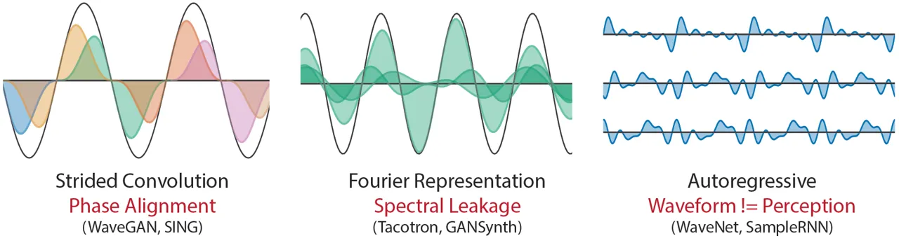
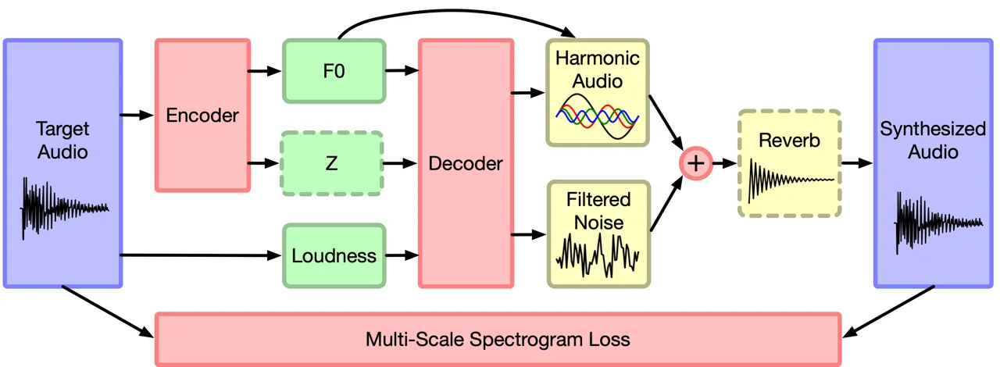
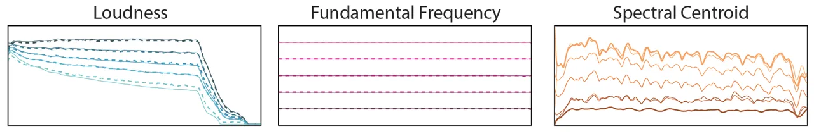
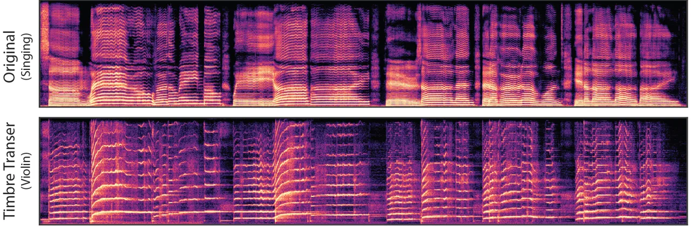
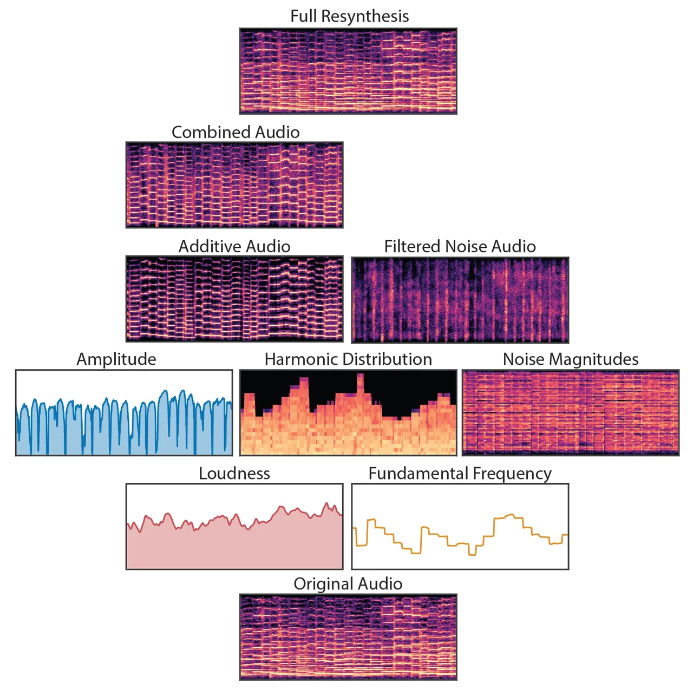
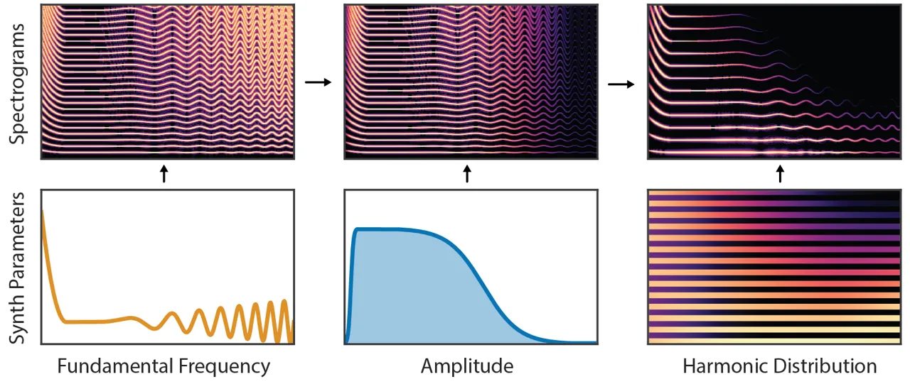
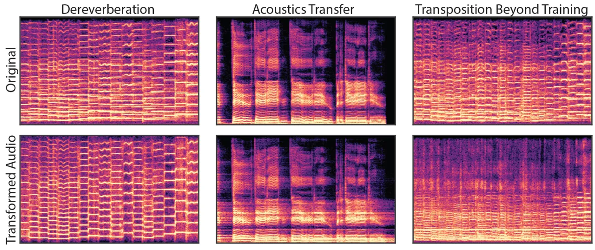
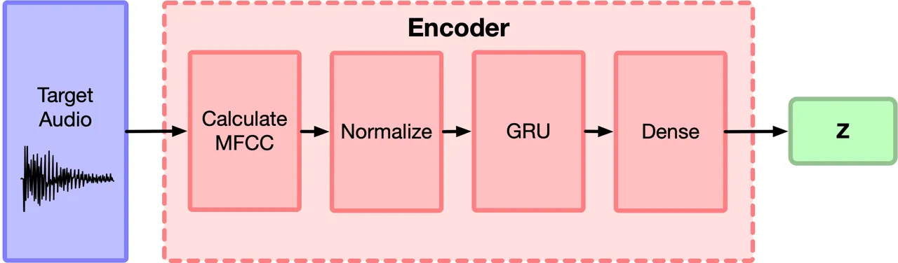
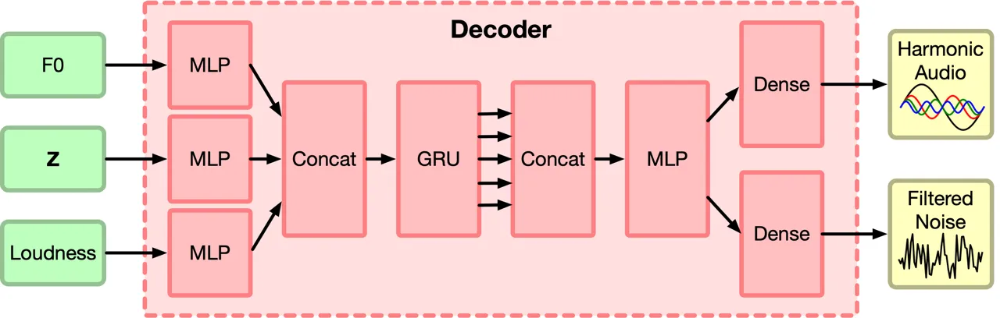
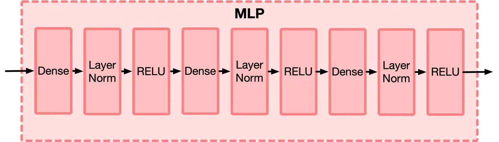

# DDSP: Differentiable Digital Signal Processing

Jesse Engel    Lamtharn Hantrakul    Chenjie Gu    & Adam Roberts
Affiliation: Google Research, Brain Team Affiliation: Mountain View, CA
94043, USA Email: [{jesseengel,hanoih,gcj,adarob}@google.com](mailto:)

###### Abstract

Most generative models of audio directly generate samples in one of two
domains: time or frequency. While sufficient to express any signal,
these representations are inefficient, as they do not utilize existing
knowledge of how sound is generated and perceived. A third approach
(vocoders/synthesizers) successfully incorporates strong domain
knowledge of signal processing and perception, but has been less
actively researched due to limited expressivity and difficulty
integrating with modern auto-differentiation-based machine learning
methods. In this paper, we introduce the Differentiable Digital Signal
Processing (DDSP) library, which enables direct integration of classic
signal processing elements with deep learning methods. Focusing on audio
synthesis, we achieve high-fidelity generation without the need for
large autoregressive models or adversarial losses, demonstrating that
DDSP enables utilizing strong inductive biases without losing the
expressive power of neural networks. Further, we show that combining
interpretable modules permits manipulation of each separate model
component, with applications such as independent control of pitch and
loudness, realistic extrapolation to pitches not seen during training,
blind dereverberation of room acoustics, transfer of extracted room
acoustics to new environments, and transformation of timbre between
disparate sources. In short, DDSP enables an interpretable and modular
approach to generative modeling, without sacrificing the benefits of
deep learning. The library is publicly available¹¹ 1 Online Resources:  
Code:
[https://github.com/magenta/ddsp](https://github.com/magenta/ddsp)  
Audio Examples:
[https://goo.gl/magenta/ddsp-examples](https://goo.gl/magenta/ddsp-examples)  
Colab Demo:
[https://goo.gl/magenta/ddsp-demo](https://goo.gl/magenta/ddsp-demo) and
we welcome further contributions from the community and domain experts.

|     |
| --- |
|     |

## 1 Introduction

Neural networks are universal function approximators in the asymptotic
limit (Hornik et al., 1989), but their practical success is largely due
to the use of strong structural priors such as convolution (LeCun
et al., 1989), recurrence (Sutskever et al., 2014; Williams & Zipser,
1990; Werbos, 1990), and self-attention (Vaswani et al., 2017). These
architectural constraints promote generalization and data efficiency to
the extent that they align with the data domain. From this perspective,
end-to-end learning relies on structural priors to scale, but the
practitioner’s toolbox is limited to functions that can be expressed
differentiably. Here, we increase the size of that toolbox by
introducing the Differentiable Digital Signal Processing (DDSP) library,
which integrates interpretable signal processing elements into modern
automatic differentiation software (TensorFlow). While this approach has
broad applicability, we highlight its potential in this paper through
exploring the example of audio synthesis.

Objects have a natural tendency to periodically vibrate. Small shape
displacements are usually restored with elastic forces that conserve
energy (similar to a canonical mass on a spring), leading to harmonic
oscillation between kinetic and potential energy (Smith, 2010).
Accordingly, human hearing has evolved to be highly sensitive to
phase-coherent oscillation, decomposing audio into spectrotemporal
responses through the resonant properties of the basilar membrane and
tonotopic mappings into the auditory cortex (Moerel et al., 2012; Chi
et al., 2005; Theunissen & Elie, 2014). However, neural synthesis models
often do not exploit this periodic structure for generation and
perception.

### 1.1 Challenges of Neural Audio Synthesis

As shown in Figure 1, most neural synthesis models generate waveforms
directly in the time domain, or from their corresponding Fourier
coefficients in the frequency domain. While these representations are
general and can represent any waveform, they are not free from bias.
This is because they often apply a prior over generating audio with
aligned wave packets rather than oscillations. For example, strided
convolution models–such as SING (Defossez et al., 2018), MCNN (Arik
et al., 2019), and WaveGAN (Donahue et al., 2019)–generate waveforms
directly with overlapping frames. Since audio oscillates at many
frequencies, all with different periods from the fixed frame hop size,
the model must precisely align waveforms between different frames and
learn filters to cover all possible phase variations. This challenge is
visualized on the left of Figure 1.

Fourier-based models–such as Tacotron (Wang et al., 2017) and
GANSynth (Engel et al., 2019)–also suffer from the phase-alignment
problem, as the Short-time Fourier Transform (STFT) is a representation
over windowed wave packets. Additionally, they must contend with
spectral leakage, where sinusoids at multiple neighboring frequencies
and phases must be combined to represent a single sinusoid when Fourier
basis frequencies do not perfectly match the audio. This effect can be
seen in the middle diagram of Figure 1.

Autoregressive waveform models–such as WaveNet (Oord et al., 2016),
SampleRNN (Mehri et al., 2016), and WaveRNN (Kalchbrenner et al.,
2018)–avoid these issues by generating the waveform a single sample at a
time. They are not constrained by the bias over generating wave packets
and can express arbitrary waveforms. However, they require larger and
more data-hungry networks, as they do not take advantage of a bias over
oscillation (size comparisons can be found in Table 3). Furthermore, the
use of teacher-forcing during training leads to exposure bias during
generation, where errors with feedback can compound. It also makes them
incompatible with perceptual losses such as spectral features (Defossez
et al., 2018), pretrained models (Dosovitskiy & Brox, 2016), and
discriminators (Engel et al., 2019). This adds further inefficiency to
these models, as a waveform’s shape does not perfectly correspond to
perception. For example, the three waveforms on the right of Figure 1
sound identical (a relative phase offset of the harmonics) but would
present different losses to an autoregressive model.



Figure 1: Challenges of neural audio synthesis. Full description
provided in Section 1.1.

### 1.2 Oscillator Models

Rather than predicting waveforms or Fourier coefficients, a third model
class directly generates audio with oscillators. Known as vocoders or
synthesizers, these models are physically and perceptually motivated and
have a long history of research and applications (Beauchamp, 2007;
Morise et al., 2016). These “analysis/synthesis” models use expert
knowledge and hand-tuned heuristics to extract synthesis parameters
(analysis) that are interpretable (loudness and frequencies) and can be
used by the generative algorithm (synthesis).

Neural networks have been used previously to some success in modeling
pre-extracted synthesis parameters (Blaauw & Bonada, 2017; Chandna
et al., 2019), but these models fall short of end-to-end learning. The
analysis parameters must still be tuned by hand and gradients cannot
flow through the synthesis procedure. As a result, small errors in
parameters can lead to large errors in the audio that cannot propagate
back to the network. Crucially, the realism of vocoders is limited by
the expressivity of a given analysis/synthesis pair.

### 1.3 Contributions

In this paper, we overcome the limitations outlined above by using the
DDSP library to implement fully differentiable synthesizers and audio
effects. DDSP models combine the strengths of the above approaches,
benefiting from the inductive bias of using oscillators, while retaining
the expressive power of neural networks and end-to-end training.

We demonstrate that models employing DDSP components are capable of
generating high-fidelity audio without autoregressive or adversarial
losses. Further, we show the interpretability and modularity of these
models enable:

- •
  Independent control over pitch and loudness during synthesis.
- •
  Realistic extrapolation to pitches not seen during training.
- •
  Blind dereverberation of audio through seperate modelling of room
  acoustics.
- •
  Transfer of extracted room acoustics to new environments.
- •
  Timbre transfer between disparate sources, converting a singing voice
  into a violin.
- •
  Smaller network sizes than comparable neural synthesizers.

Audio samples for all examples and figures are provided in the online
supplement²² 2
[https://goo.gl/magenta/ddsp](https://goo.gl/magenta/ddsp). We _highly_
encourage readers to listen to the samples as part of reading the paper.

## 2 Related Work

Vocoders. Vocoders come in several varieties. Source-filter/subtractive
models are inspired by the human vocal tract and dynamically filter a
harmonically rich source signal (Flanagan, 2013), while
sinusoidal/additive models generate sound as the combination of a set of
time-varying sine waves (McAulay & Quatieri, 1986; Serra & Smith, 1990).
Additive models are strictly more expressive than subtractive models but
have more parameters as each sinusoid has its own time-varying loudness
and frequency. This work builds a differentiable synthesizer off the
Harmonic plus Noise model (Serra & Smith, 1990; Beauchamp, 2007): an
additive synthesizer combines sinusoids in harmonic (integer) ratios of
a fundamental frequency alongside a time-varying filtered noise signal.

Synthesizers. A separate thread of research has tried to estimate
parameters for commercial synthesizers using gradient-free
methods (Huang et al., 2014; Hoffman & Cook, 2006). Synthesizer outputs
modeled with a variational autoencoder were recently used as a “world
model”  (Ha & Schmidhuber, 2018) to pass approximate gradients to a
controller during learning (Esling et al., 2019). DDSP differs from
black-box approaches to modeling existing synthesizers; it is a toolkit
of differentiable DSP components for end-to-end learning.

Neural Source Filter (NSF). Perhaps closest to this work, promising
speech synthesis results were recently achieved using a differentiable
waveshaping synthesizer (Wang et al., 2019). The NSF can be seen as a
specific DDSP model, that uses convolutional waveshaping of a sinusoidal
oscillator to create harmonic content, rather than additive synthesis
explored in this work. Both works also generate audio in the time domain
and impose multi-scale spectrograms losses in the frequency domain. A
key contribution of this work is to highlight how these models are part
of a common family of techniques and to release a modular library that
makes them accessible by leveraging automatic differentiation to easily
mix and match components at a high level.

## 3 DDSP Components

Many DSP operations can be expressed as functions in modern automatic
differentiation software. We express core components as feedforward
functions, allowing efficient implementation on parallel hardware such
as GPUs and TPUs, and generation of samples during training. These
components include oscillators, envelopes, and filters
(linear-time-varying finite-impulse-response, LTV-FIR). ³³ 3 We have
implemented further components such as wavetable synthesizers and
non-sinusoidal oscillators, but focus here on components used in the
experiments and leave the rest as future work.

### 3.1 Spectral Modeling Synthesis

Here, as an example DDSP model, we implement a differentiable version of
Spectral Modeling Synthesis (SMS) Serra & Smith (1990). This model
generates sound by combining an additive synthesizer (adding together
many sinusoids) with a subtractive synthesizer (filtering white noise).
We choose SMS because, despite being parametric, it is a highly
expressive model of sound, and has found widespread adoption in tasks as
diverse as spectral morphing, time stretching, pitch shifting, source
separation, transcription, and even as a general purpose audio codec in
MPEG-4 (Tellman et al., 1995; Klapuri et al., 2000; Purnhagen & Meine,
2000).

As we only consider monophonic sources in these experiments, we use the
Harmonic plus Noise model, that further constrains sinusoids to be
integer multiples of a fundamental frequency (Beauchamp, 2007). One of
the reasons that SMS is more expressive than many other parametric
models because it has so many more parameters. For example, in the 4
seconds of 16kHz audio in the datasets considered here, the synthesizer
coefficients actually have $`\sim`$2.5 times more dimensions than the
audio waveform itself ((1 amplitude + 100 harmonics + 65 noise band
magnitudes) \* 1000 timesteps = 165,000 dimensions, vs. 64,000 audio
samples). This makes them amenable to control by a neural network, as it
would be difficult to realistically specify all these parameters by
hand.

### 3.2 Harmonic Oscillator / Additive Synthesizer

At the heart of the synthesis techniques explored in this paper is the
sinusoidal oscillator. A bank of oscillators that outputs a signal
$`x(n)`$ over discrete time steps, $`n`$, can be expressed as:

```math
x(n)=\sum_{k=1}^{K}A_{k}(n)\sin(\phi_{k}(n)), \tag{1}
```

where $`A_{k}(n)`$ is the time-varying amplitude of the $`k`$-th
sinusoidal component and $`\phi_{k}(n)`$ is its instantaneous phase. The
phase $`\phi_{k}(n)`$ is obtained by integrating the instantaneous
frequency $`f_{k}(n)`$:

```math
\phi_{k}(n)=2\pi\sum_{m=0}^{n}f_{k}(m)+\phi_{0,k}, \tag{2}
```

where $`\phi_{0,k}`$ is the initial phase that can be randomized, fixed,
or learned.

For a harmonic oscillator, all the sinusoidal frequencies are harmonic
(integer) multiples of a fundamental frequency, $`f_{0}(n)`$, i.e.,
$`f_{k}(n)=kf_{0}(n)`$, Thus the output of the harmonic oscillator is
entirely parameterized by the time-varying fundamental frequency
$`f_{0}(n)`$ and harmonic amplitudes $`A_{k}(n)`$. To aid
interpretablity we further factorize the harmonic amplitudes:

```math
A_{k}(n)=A(n)c_{k}(n). \tag{3}
```

into a global amplitude $`A(n)`$ that controls the loudness and a
normalized distribution over harmonics $`c(n)`$ that determines spectral
variations, where $`\sum_{k=0}^{K}c_{k}(n)=1`$ and $`c_{k}(n)\geq 0`$.
We also constrain both amplitudes and harmonic distribution components
to be positive through the use of a modified sigmoid nonlinearity as
described in the appendix. Figure 6 provides a graphical example of the
additive synthesizer. Audio is provided in our online supplement2.

### 3.3 Envelopes

The oscillator formulation above requires time-varying amplitudes and
frequencies at the audio sample rate, but our neural networks operate at
a slower frame rate. For instantaneous frequency upsampling, we found
bilinear interpolation to be adequate. However, the amplitudes and
harmonic distributions of the additive synthesizer required smoothing to
prevent artifacts. We are able to achieve this with a smoothed amplitude
envelope by adding overlapping Hamming windows at the center of each
frame and scaled by the amplitude. For these experiments we found a 4ms
(64 timesteps) hop size and 8 ms frame size (50% overlap) to be
responsive to changes while removing artifacts.

### 3.4 Filter Design: Frequency Sampling Method

Linear filter design is a cornerstone of many DSP techniques. Standard
convolutional layers are equivalent to linear time invariant finite
impulse response (LTI-FIR) filters. However, to ensure interpretability
and prevent phase distortion, we employ the frequency sampling method to
convert network outputs into impulse responses of linear-phase filters.

Here, we design a neural network to predict the frequency-domain
transfer functions of a FIR filter for every output frame. In
particular, the neural network outputs a vector $`{\bm{H}}_{l}`$ (and
accordingly $`{\bm{h}}_{l}=\text{IDFT}({\bm{H}}_{l})`$) for the $`l`$-th
frame of the output. We interpret $`{\bm{H}}_{l}`$ as the
frequency-domain transfer function of the corresponding FIR filter. We
therefore implement a time-varying FIR filter.

To apply the time-varying FIR filter to the input, we divide the audio
into non-overlapping frames $`{\bm{x}}_{l}`$ to match the impulse
responses $`{\bm{h}}_{l}`$. We then perform frame-wise convolution via
multiplication of frames in the Fourier domain:
$`{\bm{Y}}_{l}={\bm{H}}_{l}{\bm{X}}_{l}`$ where
$`{\bm{X}}_{l}=\text{DFT}({\bm{x}}_{l})`$ and
$`{\bm{Y}}_{l}=\text{DFT}({\bm{y}}_{l})`$ is the output. We recover the
frame-wise filtered audio, $`{\bm{y}}_{l}=\text{IDFT}({\bm{Y}}_{l})`$,
and then overlap-add the resulting frames with the same hop size and
rectangular window used to originally divide the input audio. The hop
size is given by dividing the audio into equally spaced frames for each
frame of conditioning. For 64000 samples and 250 frames, this
corresponds to a hop size of 256.

In practice, we do not use the neural network output directly as
$`{\bm{H}}_{l}`$. Instead, we apply a window function $`{\bm{W}}`$ on
the network output to compute $`{\bm{H}}_{l}`$. The shape and size of
the window can be decided independently to control the time-frequency
resolution trade-off of the filter. In our experiments, we default to a
Hann window of size 257. Without a window, the resolution implicitly
defaults to a rectangular window which is not ideal for many cases. We
take care to shift the IR to zero-phase (symmetric) form before applying
the window and revert to causal form before applying the filter.

### 3.5 Filtered Noise / Subtractive Synthesizer

Natural sounds contain both harmonic and stochastic components. The
Harmonic plus Noise model captures this by combining the output of an
additive synthesizer with a stream of filtered noise (Serra & Smith,
1990; Beauchamp, 2007). We are able to realize a differentiable filtered
noise synthesizer by simply applying the LTV-FIR filter from above to a
stream of uniform noise $`{\bm{Y}}_{l}={\bm{H}}_{l}{\bm{N}}_{l}`$ where
$`{\bm{N}}_{l}`$ is the IDFT of uniform noise in domain \[-1, 1\].

### 3.6 Reverb: Long impulse responses

Room reverbation (reverb) is an essential characteristic of realistic
audio, which is usually implicitly modeled by neural synthesis
algorithms. In contrast, we gain interpretability by explicitly
factorizing the room acoustics into a post-synthesis convolution step. A
realistic room impulse response (IR) can be as long as several seconds,
corresponding to extremely long convolutional kernel sizes
($`\sim`$10-100k timesteps). Convolution via matrix multiplication
scales as $`\mathcal{O}(n^{3})`$, which is intractable for such large
kernel sizes. Instead, we implement reverb by explicitly performing
convolution as multiplication in the frequency domain, which scales as
$`\mathcal{O}(n\log{}n)`$ and does not bottleneck training.



Figure 2: Autoencoder architecture. Red components are part of the
neural network architecture, green components are the latent
representation, and yellow components are deterministic synthesizers and
effects. Components with dashed borders are not used in all of our
experiments. Namely, $`{\bm{z}}`$ is not used in the model trained on
solo violin, and reverb is not used in the models trained on NSynth. See
the appendix for more detailed diagrams of the neural network
components.

## 4 Experiments

For empirical verification of this approach, we test two DDSP
autoencoder variants–supervised and unsupervised–on two different
musical datasets: NSynth (Engel et al., 2017) and a collection of solo
violin performances. The supervised DDSP autoencoder is conditioned on
fundamental frequency (F0) and loudness features extracted from audio,
while the unsupervised DDSP autoencoder learns F0 jointly with the rest
of the network.

### 4.1 DDSP Autoencoder

DDSP components do not put constraints on the choice of generative model
(GAN, VAE, Flow, etc.), but we focus here on a deterministic autoencoder
to investigate the strength of DDSP components independent of any
particular approach to adversarial training, variational inference, or
Jacobian design. Just as autoencoders utilizing convolutional layers
outperform fully-connected autoencoders on images, we find DDSP
components are able to dramatically improve autoencoder performance in
the audio domain. Introducing stochastic latents (such as in GAN, VAE,
and Flow models) will likely further improve performance, but we leave
that to future work as it is orthogonal to the core question of DDSP
component performance that we investigate in this paper.

In a standard autoencoder, an encoder network $`f_{\text{enc}}(\cdot)`$
maps the input $`{\bm{x}}`$ to a latent representation
$`{\bm{z}}=f_{\text{enc}}({\bm{x}})`$ and a decoder network
$`f_{\text{dec}}(\cdot)`$ attempts to directly reconstruct the input
$`\hat{{\bm{x}}}=f_{\text{dec}}({\bm{z}})`$. Our architecture (Figure 2)
contrasts with this approach through the use of DDSP components and a
decomposed latent representation.

Encoders: Detailed descriptions of the encoders are given in
Section B.1. For the supervised autoencoder, the loudness $`l(t)`$ is
extracted directly from the audio, a pretrained CREPE model with fixed
weights (Kim et al., 2018) is used as an $`f(t)`$ encoder to extact the
fundamental frequency, and optional encoder extracts a time-varying
latent encoding $`{\bm{z}}(t)`$ of the residual information. For the
$`{\bm{z}}(t)`$ encoder, MFCC coefficients (30 per a frame) are first
extracted from the audio, which correspond to the smoothed spectral
envelope of harmonics (Beauchamp, 2007), and transformed by a single GRU
layer into 16 latent variables per a frame.

For the unsupervised autoencoder, the pretrained CREPE model is replaced
with a Resnet architecture (He et al., 2016) that extracts $`f(t)`$ from
a mel-scaled log spectrogram of the audio, and is jointly trained with
the rest of the network.

Decoder: A detailed description of the decoder network is given in
Section B.2. The decoder network maps the tuple
$`\left(f(t),l(t),{\bm{z}}(t)\right)`$ to control parameters for the
additive and filtered noise synthesizers described in Section 3. The
synthesizers generate audio based on these parameters, and a
reconstruction loss between the synthesized and original audio is
minimized. The network architecture is chosen to be fairly generic
(fully connected, with a single recurrent layer) to demonstrate that it
is the DDSP components, and not other modeling decisions, that enables
the quality of the work.

Also unique to our approach, the latent $`f(t)`$ is fed directly to the
additive synthesizer as it has structural meaning for the synthesizer
outside the context of any given dataset. As shown later in Section 5.2,
this disentangled representation enables the model to both interpolate
within and extrapolate outside the data distribution. Indeed, recent
work support incorporation of strong inductive biases as a prerequisite
for learning disentangled representations (Locatello et al., 2018).

Model Size: Table 3, compares parameter counts for the DDSP models and
comparable models including GANSynth (Engel et al., 2019),
WaveRNN (Hantrakul et al., 2019), and a WaveNet Autoencoder (Engel
et al., 2017). The DDSP models have the fewest parameters (up to 10
times less), despite no effort to minimize the model size in these
experiments. Initial experiments with very small models (240k
parameters, 300x smaller than a WaveNet Autoencoder) have less realistic
outputs than the full models, but still have fairly high quality and are
promising for low-latency applications, even on CPU or embedded devices.
Audio samples are available in the online supplement2.

### 4.2 Datasets

NSynth: We focus on a smaller subset of the NSynth dataset  (Engel
et al., 2017) consistent with other work (Engel et al., 2019; Hantrakul
et al., 2019). It totals 70,379 examples comprised mostly of strings,
brass, woodwinds and mallets with pitch labels within MIDI pitch range
24-84. We employ a 80/20 train/test split shuffling across instrument
families. For the NSynth experiments, we use the autoencoder as
described above (with the $`{\bm{z}}(t)`$ encoder). We experiment with
both the supervised and unsupervised variants.

Solo Violin: The NSynth dataset does not capture aspects of a real
musical performance. Using the MusOpen royalty free music library, we
collected 13 minutes of expressive, solo violin performances⁴⁴ 4 Five
pieces by John Garner (II. Double, III. Corrente, IV. Double Presto, VI.
Double, VIII. Double) from
[https://musopen.org/music/13574-violin-partita-no-1-bwv-1002/](https://musopen.org/music/13574-violin-partita-no-1-bwv-1002/).
We purposefully selected pieces from a single performer (John Garner),
that were monophonic and shared a consistent room environment to
encourage the model to focus on performance. Like NSynth, audio is
converted to mono 16kHz and divided into 4 second training examples
(64000 samples total). Code to process the audio files into a dataset is
available online.⁵⁵ 5
[https://github.com/magenta/ddsp](https://github.com/magenta/ddsp)

For the solo violin experiments, we use the supervised variant of the
autoencoder (without the $`{\bm{z}}(t)`$ encoder), and add a reverb
module to the signal processor chain to account for room reverberation.
While the room impulse response could be produced as an output of the
decoder, given that the solo violin dataset has a single acoustic
environment, we use a single fixed variable (4 second reverb
corresponding to 64000 dimensions) for the impulse response.

|                                  |                      |                |             |
| -------------------------------- | -------------------- | -------------- | ----------- |
|                                  | Loudness ($`L_{1}`$) | F0 ($`L_{1}`$) | F0 Outliers |
| Supervised                       |                      |                |             |
| WaveRNN (Hantrakul et al., 2019) | 0.10                 | 1.00           | 0.07        |
| DDSP Autoencoder                 | 0.07                 | 0.02           | 0.003       |
| Unsupervised                     |                      |                |             |
| DDSP Autoencoder                 | 0.09                 | 0.80           | 0.04        |

Table 1: Resynthesis accuracies. Comparison of DDSP models to SOTA
WaveRNN model provided the same conditioning information. The supervised
DDSP Autoencoder and WaveRNN models use the fundamental frequency from a
pretrained CREPE model, while the unsupervised DDSP autoencoder learns
to infer the frequency from the audio during training.

#### 4.2.1 Multi-scale spectral loss

The primary objective of the autoencoder is to minimize reconstruction
loss. However, for audio waveforms, point-wise loss on the raw waveform
is not ideal, as two perceptually identical audio samples may have
distinct waveforms, and point-wise similar waveforms may sound very
different.

Instead, we use a multi-scale spectral loss–similar to the
multi-resolution spectral amplitude distance in Wang et al.
(2019)–defined as follows. Given the original and synthesized audio, we
compute their (magnitude) spectrogram $`S_{i}`$ and $`\hat{S}_{i}`$,
respectively, with a given FFT size $`i`$, and define the loss as the
sum of the L1 difference between $`S_{i}`$ and $`\hat{S}_{i}`$ as well
as the L1 difference between $`\log S_{i}`$ and $`\log\hat{S}_{i}`$.

```math
L_{i}=||S_{i}-\hat{S_{i}}||_{1}+\alpha||\log S_{i}-\log\hat{S}_{i}||_{1}. \tag{4}
```

where $`\alpha`$ is a weighting term set to 1.0 in our experiments. The
total reconstruction loss is then the sum of all the spectral losses,
$`L_{\text{reconstruction}}=\sum_{i}L_{i}`$. In our experiments, we used
FFT sizes (2048, 1024, 512, 256, 128, 64), and the neighboring frames in
the Short-Time Fourier Transform (STFT) overlap by 75%. Therefore, the
$`L_{i}`$’s cover differences between the original and synthesized
audios at different spatial-temporal resolutions.

## 5 Results

### 5.1 High-fidelity Synthesis

As shown in Figure 5, the DDSP autoencoder learns to very accurately
resynthesize the solo violin dataset. Again, we highly encourage readers
to listen to the samples provided in the online supplement2. A full
decomposition of the components is provided Figure 5. High-quality
neural audio synthesis has previously required very large autoregressive
models (Oord et al., 2016; Kalchbrenner et al., 2018) or adversarial
loss functions (Engel et al., 2019). While amenable to an adversarial
loss, the DDSP autoencoder achieves these results with a straightforward
L1 spectrogram loss, a small amount of data, and a relatively simple
model. This demonstrates that the model is able to efficiently exploit
the bias of the DSP components, while not losing the expressive power of
neural networks.

For the NSynth dataset, we quantitatively compare the quality of DDSP
resynthesis with that of a state-of-the-art baseline using
WaveRNN (Hantrakul et al., 2019). The models are comparable as they are
trained on the same data, provided the same conditioning, and both
targeted towards realtime synthesis applications. In Table 1, we compute
loudness and fundamental frequency (F0) $`L_{1}`$ metrics described in
Section C of the appendix. Despite the strong performance of the
baseline, the supervised DDSP autoencoder still outperforms it,
especially in F0 $`L_{1}`$. This is not unexpected, as the additive
synthesizer directly uses the conditioning frequency to synthesize
audio.

The unsupervised DDSP autoencoder must learn to infer its own F0
conditioning signal directly from the audio. As described in
Section B.4, we improve optimization by also adding a perceptual loss in
the form of a pretrained CREPE network (Kim et al., 2018). While not as
accurate as the supervised DDSP version, the model does a fair job at
learning to generate sounds with the correct frequencies without
supervision, outperforming the supervised WaveRNN model.



Figure 3: Separate interpolations over loudness, pitch, and timbre. The
conditioning features (solid lines) are extracted from two notes and
linearly mixed (dark to light coloring). The features of the
resynthsized audio (dashed lines) closely follow the conditioning. On
the right, the latent vectors, $`z(t)`$, are interpolated, and the
spectral centroid of resulting audio (thin solid lines) smoothly varies
between the original samples (dark solid lines).

### 5.2 Independent Control of Loudness and Pitch

Interpolation: Interpretable structure allows for independent control
over generative factors. Each component of the factorized latent
variables $`\left(f(t),l(t),{\bm{z}}(t)\right)`$ independently alters
samples along a matching perceptual axis. For example, Figure 3 shows an
interpolation between two sound in the loudness conditioning $`l(t)`$.
With other variables held constant, loudness of the synthesized audio
closely matches the interpolated input. Similarly, the model reliably
matches intermediate pitches between a high pitched $`f(t)`$ and low
pitched $`f(t)`$. In Table 4 of the appendix, we quantitatively
demonstrate how across interpolations, conditioning independently
controls the corresponding characteristics of the audio.

With loudness and pitch explicitly controlled by
$`\left(f(t),l(t)\right)`$, the model should use the residual
$`{\bm{z}}(t)`$ to encode timbre. Although architecture and training do
not strictly enforce this encoding, we qualitatively demonstrate how
varying $`{\bm{z}}`$ leads to a smooth change in timbre. In Figure 3, we
use the smooth shift in spectral centroid, or “center of mass” of a
spectrum, to illustrate this behavior.

Extrapolation: As described in Section 4.1, $`f(t)`$ directly controls
the additive synthesizer and has structural meaning outside the context
of any given dataset. Beyond interpolating between datapoints, the model
can extrapolate to new conditions not seen during training. The
rightmost plot of Figure 7 demonstrates this by resynthesizing a clip of
solo violin after shifting $`f(t)`$ down an octave and outside the range
of the training data. The audio remains coherent and resembles a related
instrument such as a cello. $`f(t)`$ is only modified for the
synthesizer, as the decoder is still bounded by the nearby distribution
of the training data and produces unrealistic harmonic content if
conditioned far outside that distribution.



Figure 4: Timbre transfer from singing voice to violin. F0 and loudness
features are extracted from the voice and resynthesized with a DDSP
autoencoder trained on solo violin.

### 5.3 Dereverberation and Acoustic Transfer

Removing reverb in a “blind” setting, where only reverberated audio is
available, is a standing problem in acoustics (Naylor & Gaubitch, 2010).
However, a benefit of our modular approach to generative modeling is
that it becomes possible to completely separate the source audio from
the effect of the room. For the solo violin dataset, the DDSP
autoencoder is trained with an additional reverb module as shown in
Figure 2 and described in Section 3.6. Figure 7 (left) demonstrates that
bypassing the reverb module during resynthesis results in completely
dereverberated audio, similar to recording in an anechoic chamber. The
quality of the approach is limited by the underlying generative model,
which is quite high for our autoencoder. Similarly, Figure 7 (center)
demonstrates that we can also apply the learned reverb model to new
audio, in this case singing, and effectively transfer the acoustic
environment of the solo violin recordings.

### 5.4 Timbre Transfer

Figure 4 demonstrates timbre transfer, converting the singing voice of
an author into a violin. F0 and loudness features are extracted from the
singing voice and the DDSP autoencoder trained on solo violin used for
resynthesis. To better match the conditioning features, we first shift
the fundamental frequency of the singing up by two octaves to fit a
violin’s typical register. Next, we transfer the room acoustics of the
violin recording (as described in Section 5.3) to the voice before
extracting loudness, to better match the loudness contours of the violin
recordings. The resulting audio captures many subtleties of the singing
with the timbre and room acoustics of the violin dataset. Note the
interesting “breathing” artifacts in the silence corresponding to
unvoiced syllables from the singing.

## 6 Conclusion

The DDSP library fuses classical DSP with deep learning, providing the
ability to take advantage of strong inductive biases without losing the
expressive power of neural networks and end-to-end learning. We
encourage contributions from domain experts and look forward to
expanding the scope of the DDSP library to a wide range of future
applications.

## References

- Arik et al. (2019) S. O. Arik, H. Jun, and G. Diamos. Fast spectrogram
  inversion using multi-head convolutional neural networks. _IEEE Signal
  Processing Letters_, 26(1):94–98, Jan 2019. doi:
  10.1109/LSP.2018.2880284.
- Beauchamp (2007) James W Beauchamp. _Analysis, synthesis, and
  perception of musical sounds_. Springer, 2007.
- Blaauw & Bonada (2017) Merlijn Blaauw and Jordi Bonada. A neural
  parametric singing synthesizer modeling timbre and expression from
  natural songs. _Applied Sciences_, 7(12):1313, 2017.
- Chandna et al. (2019) Pritish Chandna, Merlijn Blaauw, Jordi Bonada,
  and Emilia Gomez. Wgansing: A multi-voice singing voice synthesizer
  based on the wasserstein-gan. _arXiv preprint arXiv:1903.10729_, 2019.
- Chi et al. (2005) Taishih Chi, Powen Ru, and Shihab A Shamma.
  Multiresolution spectrotemporal analysis of complex sounds. _The
  Journal of the Acoustical Society of America_, 118(2):887–906, 2005.
- Defossez et al. (2018) Alexandre Defossez, Neil Zeghidour, Nicolas
  Usunier, Leon Bottou, and Francis Bach. Sing: Symbol-to-instrument
  neural generator. In S. Bengio, H. Wallach, H. Larochelle, K. Grauman,
  N. Cesa-Bianchi, and R. Garnett (eds.), _Advances in Neural
  Information Processing Systems 31_, pp. 9041–9051. Curran Associates,
  Inc., 2018. URL
  [http://papers.nips.cc/paper/8118-sing-symbol-to-instrument-neural-generator.pdf](http://papers.nips.cc/paper/8118-sing-symbol-to-instrument-neural-generator.pdf).
- Donahue et al. (2019) Chris Donahue, Julian McAuley, and Miller
  Puckette. Adversarial audio synthesis. In _International Conference on
  Learning Representations_, 2019. URL
  [https://openreview.net/forum?id=ByMVTsR5KQ](https://openreview.net/forum?id=ByMVTsR5KQ).
- Dosovitskiy & Brox (2016) Alexey Dosovitskiy and Thomas Brox.
  Generating images with perceptual similarity metrics based on deep
  networks. In _Advances in neural information processing systems_, pp.
  658–666, 2016.
- Engel et al. (2017) Jesse Engel, Cinjon Resnick, Adam Roberts, Sander
  Dieleman, Douglas Eck, Karen Simonyan, and Mohammad Norouzi. Neural
  audio synthesis of musical notes with WaveNet autoencoders. In
  _ICML_, 2017.
- Engel et al. (2019) Jesse Engel, Kumar Krishna Agrawal, Shuo Chen,
  Ishaan Gulrajani, Chris Donahue, and Adam Roberts. GANSynth:
  Adversarial neural audio synthesis. In _International Conference on
  Learning Representations_, 2019. URL
  [https://openreview.net/forum?id=H1xQVn09FX](https://openreview.net/forum?id=H1xQVn09FX).
- Esling et al. (2019) Philippe Esling, Naotake Masuda, Adrien Bardet,
  Romeo Despres, et al. Universal audio synthesizer control with
  normalizing flows. _arXiv preprint arXiv:1907.00971_, 2019.
- Flanagan (2013) James L Flanagan. _Speech analysis synthesis and
  perception_, volume 3. Springer Science & Business Media, 2013.
- Ha & Schmidhuber (2018) David Ha and Jürgen Schmidhuber. World models.
  _arXiv preprint arXiv:1803.10122_, 2018.
- Hantrakul et al. (2019) Lamtharn (Hanoi) Hantrakul, Jesse Engel, Adam
  Roberts, and Chenjie Gu. Fast and flexible neural audio synthesis. In
  _ISMIR_, 2019.
- He et al. (2016) Kaiming He, Xiangyu Zhang, Shaoqing Ren, and Jian
  Sun. Deep residual learning for image recognition. In _Proceedings of
  the IEEE conference on computer vision and pattern recognition_, pp.
  770–778, 2016.
- Hoffman & Cook (2006) Matthew D Hoffman and Perry R Cook.
  Feature-based synthesis: Mapping acoustic and perceptual features onto
  synthesis parameters. In _ICMC_. Citeseer, 2006.
- Hornik et al. (1989) Kurt Hornik, Maxwell Stinchcombe, and Halbert
  White. Multilayer feedforward networks are universal approximators.
  _Neural networks_, 2(5):359–366, 1989.
- Huang et al. (2014) Cheng-Zhi Anna Huang, David Duvenaud, Kenneth C
  Arnold, Brenton Partridge, Josiah W Oberholtzer, and Krzysztof Z
  Gajos. Active learning of intuitive control knobs for synthesizers
  using gaussian processes. In _Proceedings of the 19th international
  conference on Intelligent User Interfaces_, pp. 115–124. ACM, 2014.
- Kalchbrenner et al. (2018) Nal Kalchbrenner, Erich Elsen, Karen
  Simonyan, Seb Noury, Norman Casagrande, Edward Lockhart, Florian
  Stimberg, Aaron van den Oord, Sander Dieleman, and Koray Kavukcuoglu.
  Efficient neural audio synthesis. _arXiv preprint
  arXiv:1802.08435_, 2018.
- Kim et al. (2018) Jong Wook Kim, Justin Salamon, Peter Li, and
  Juan Pablo Bello. Crepe: A convolutional representation for pitch
  estimation. In _2018 IEEE International Conference on Acoustics,
  Speech and Signal Processing (ICASSP)_, pp. 161–165. IEEE, 2018.
- Klapuri et al. (2000) Anssi Klapuri, Tuomas Virtanen, and Jan-Markus
  Holm. Robust multipitch estimation for the analysis and manipulation
  of polyphonic musical signals. In _Proc. COST-G6 Conference on Digital
  Audio Effects_, pp. 233–236, 2000.
- LeCun et al. (1989) Y. LeCun, B. Boser, J. S. Denker, D. Henderson,
  R. E. Howard, W. Hubbard, and L. D. Jackel. Backpropagation applied to
  handwritten zip code recognition. _Neural Computation_,
  1(4):541–551, 1989. doi: 10.1162/neco.1989.1.4.541. URL
  [https://doi.org/10.1162/neco.1989.1.4.541](https://doi.org/10.1162/neco.1989.1.4.541).
- Locatello et al. (2018) Francesco Locatello, Stefan Bauer, Mario
  Lucic, Sylvain Gelly, Bernhard Schölkopf, and Olivier Bachem.
  Challenging common assumptions in the unsupervised learning of
  disentangled representations. _arXiv preprint arXiv:1811.12359_, 2018.
- McAulay & Quatieri (1986) Robert McAulay and Thomas Quatieri. Speech
  analysis/synthesis based on a sinusoidal representation. _IEEE
  Transactions on Acoustics, Speech, and Signal Processing_,
  34(4):744–754, 1986.
- Mehri et al. (2016) Soroush Mehri, Kundan Kumar, Ishaan Gulrajani,
  Rithesh Kumar, Shubham Jain, Jose Sotelo, Aaron Courville, and Yoshua
  Bengio. Samplernn: An unconditional end-to-end neural audio generation
  model. _arXiv preprint arXiv:1612.07837_, 2016.
- Moerel et al. (2012) Michelle Moerel, Federico De Martino, and Elia
  Formisano. Processing of natural sounds in human auditory cortex:
  tonotopy, spectral tuning, and relation to voice sensitivity. _Journal
  of Neuroscience_, 32(41):14205–14216, 2012.
- Morise et al. (2016) Masanori Morise, Fumiya Yokomori, and Kenji
  Ozawa. World: a vocoder-based high-quality speech synthesis system for
  real-time applications. _IEICE TRANSACTIONS on Information and
  Systems_, 99(7):1877–1884, 2016.
- Naylor & Gaubitch (2010) Patrick A Naylor and Nikolay D Gaubitch.
  _Speech dereverberation_. Springer Science & Business Media, 2010.
- Oord et al. (2016) Aaron van den Oord, Sander Dieleman, Heiga Zen,
  Karen Simonyan, Oriol Vinyals, Alex Graves, Nal Kalchbrenner, Andrew
  Senior, and Koray Kavukcuoglu. Wavenet: A generative model for raw
  audio. _arXiv preprint arXiv:1609.03499_, 2016.
- Purnhagen & Meine (2000) Heiko Purnhagen and Nikolaus Meine. Hiln-the
  mpeg-4 parametric audio coding tools. In _2000 IEEE International
  Symposium on Circuits and Systems. Emerging Technologies for the 21st
  Century. Proceedings (IEEE Cat No. 00CH36353)_, volume 3, pp. 201–204.
  IEEE, 2000.
- Serra & Smith (1990) Xavier Serra and Julius Smith. Spectral modeling
  synthesis: A sound analysis/synthesis system based on a deterministic
  plus stochastic decomposition. _Computer Music Journal_,
  14(4):12–24, 1990.
- Smith (2010) Julius Orion Smith. _Physical audio signal processing:
  For virtual musical instruments and audio effects_. W3K
  publishing, 2010.
- Sutskever et al. (2014) Ilya Sutskever, Oriol Vinyals, and Quoc V Le.
  Sequence to sequence learning with neural networks. In _Advances in
  neural information processing systems_, pp. 3104–3112, 2014.
- Tellman et al. (1995) Edwin Tellman, Lippold Haken, and Bryan
  Holloway. Timbre morphing of sounds with unequal numbers of features.
  _Journal of the Audio Engineering Society_, 43(9):678–689, 1995.
- Theunissen & Elie (2014) Frédéric E Theunissen and Julie E Elie.
  Neural processing of natural sounds. _Nature Reviews Neuroscience_,
  15(6):355, 2014.
- Vaswani et al. (2017) Ashish Vaswani, Noam Shazeer, Niki Parmar, Jakob
  Uszkoreit, Llion Jones, Aidan N Gomez, Łukasz Kaiser, and Illia
  Polosukhin. Attention is all you need. In _Advances in neural
  information processing systems_, pp. 5998–6008, 2017.
- Wang et al. (2019) Xin Wang, Shinji Takaki, and Junichi Yamagishi.
  Neural source-filter waveform models for statistical parametric speech
  synthesis. _arXiv preprint arXiv:1904.12088_, 2019.
- Wang et al. (2017) Yuxuan Wang, RJ Skerry-Ryan, Daisy Stanton, Yonghui
  Wu, Ron J Weiss, Navdeep Jaitly, Zongheng Yang, Ying Xiao, Zhifeng
  Chen, Samy Bengio, et al. Tacotron: Towards end-to-end speech
  synthesis. In _INTERSPEECH_, 2017.
- Werbos (1990) P. J. Werbos. Backpropagation through time: what it does
  and how to do it. _Proceedings of the IEEE_, 78(10):1550–1560,
  Oct 1990. doi: 10.1109/5.58337.
- Williams & Zipser (1990) Ronald J Williams and David Zipser.
  _Gradient-based learning algorithms for recurrent connectionist
  networks_. College of Computer Science, Northeastern University
  Boston, MA, 1990.

## Appendix A Appendix



Figure 5: Decomposition of a clip of solo violin. Audio is visualized
with log magnitude spectrograms. Loudness and fundamental frequency
signals are extracted from the original audio. The loudness curve does
not exhibit clear note segmentations because of the effects of the room
acoustics. The DDSP autoencoder takes those conditioning signals and
predicts amplitudes, harmonic distributions, and noise magnitudes. Note
that the amplitudes are clearly segmented along note boundaries without
supervision and that the harmonic and noise distributions are complex
and dynamic despite the simple conditioning signals. Finally, the
extracted impulse response is applied to the combined audio from the
synthesizers to give the full resynthesis audio.



Figure 6: Diagram of the Additive Synthesizer component. The synthesizer
generates audio as a sum of sinusoids at harmonic (integer) multiples of
the fundamental frequency. The neural network is then tasked with
emitting time-varying synthesizer parameters (fundamental frequency,
amplitude, harmonic distribution). In this example linear-frequency
log-magnitude spectrograms show how the harmonics initially follow the
frequency contours of the fundamental. We then factorize the harmonic
amplitudes into an overall amplitude envelope that controls the
loudness, and a normalized distribution among the different harmonics
that determines spectral variations.



Figure 7: Interpretable generative models enables disentanglement and
extrapolation. Spectrograms of audio examples include dereverberation of
a clip of solo violin playing (left), transfer of the extracted room
response to new audio (center), and transposition below the range of
training data (right).

## Appendix B Model details

### B.1 Encoders

The model has three encoders: $`f`$-encoder that outputs fundamental
frequency $`f(t)`$, $`l`$-encoder that outputs loudness $`l(t)`$, and a
$`{\bm{z}}`$-encoder that outputs residual vector $`{\bm{z}}(t)`$.

$`f`$-encoder: We use a pretrained CREPE pitch detector (Kim et al., 2018) as the $`f`$-encoder to extract ground truth fundamental
frequencies (F0) from the audio. We used the “large” variant of CREPE,
which has SOTA accuracy for monophonic audio samples of musical
instruments. For our supervised autoencoder experiments, we fixed the
weights of the $`f`$-encoder like  (Hantrakul et al., 2019), and for our
unsupervised autoencoder experiemnts we jointly learn the weights of a
resnet model fed log mel spectrograms of the audio. Full details of the
resnet architecture are show in Table 2.

$`l`$-encoder: We use identical computational steps to extract loudness
as (Hantrakul et al., 2019). Namely, an A-weighting of the power
spectrum, which puts greater emphasis on higher frequencies, followed by
log scaling. The vector is then centered according to the mean and
standard deviation of the dataset.

$`{\bm{z}}`$-encoder: As shown in Figure 8, the encoder first calculates
MFCC’s (Mel Frequency Cepstrum Coefficients) from the audio. MFCC is
computed from the log-mel-spectrogram of the audio with a FFT size of
1024, 128 bins of frequency range between 20Hz to 8000Hz, overlap of
75%. We use only the first 30 MFCCs that correspond to a smoothed
spectral envelope. The MFCCs are then passed through a normalization
layer (which has learnable shift and scale parameters) and a 512-unit
GRU. The GRU outputs (over time) fed to a 512-unit linear layer to
obtain $`{\bm{z}}(t)`$. The $`{\bm{z}}`$ embedding reported in this
model has 16 dimensions across 250 time-steps.

|                        |                |              |              |              |                     |
| ---------------------- | -------------- | ------------ | ------------ | ------------ | ------------------- |
| Residual Block         | Output Size    | $`k_{Time}`$ | $`k_{Freq}`$ | $`s_{Freq}`$ | $`k_{Filters}`$     |
| layer norm + relu      | \-             | \-           | \-           | \-           | \-                  |
| conv                   | \-             | 1            | 1            | 1            | $`k_{Filters}`$ / 4 |
| layer norm + relu      | \-             | \-           | \-           | \-           | \-                  |
| conv                   | \-             | 3            | 3            | $`s_{Freq}`$ | $`k_{Filters}`$ / 4 |
| layer norm + relu      | \-             | \-           | \-           | \-           | \-                  |
| conv                   | \-             | 1            | 1            | 1            | $`k_{Filters}`$     |
| add residual           | \-             | \-           | \-           | \-           | \-                  |
| Resnet                 | Output Size    | $`k_{Time}`$ | $`k_{Freq}`$ | $`s_{Freq}`$ | $`k_{Filters}`$     |
| LogMelSpectrogram      | (125, 229, 1)  | \-           | \-           | \-           | \-                  |
| conv2d                 | (125, 115, 64) | 7            | 7            | 2            | 64                  |
| max pool               | (125, 58, 64)  | 1            | 3            | 2            | \-                  |
| residual block         | (125, 58, 128) | 3            | 3            | 1            | 128                 |
| residual block         | (125, 57, 128) | 3            | 3            | 1            | 128                 |
| residual block         | (125, 29, 256) | 3            | 3            | 2            | 256                 |
| residual block         | (125, 29, 256) | 3            | 3            | 1            | 256                 |
| residual block         | (125, 29, 256) | 3            | 3            | 1            | 256                 |
| residual block         | (125, 15, 512) | 3            | 3            | 2            | 512                 |
| residual block         | (125, 15, 512) | 3            | 3            | 1            | 512                 |
| residual block         | (125, 15, 512) | 3            | 3            | 1            | 512                 |
| residual block         | (125, 15, 512) | 3            | 3            | 1            | 512                 |
| residual block         | (125, 8, 1024) | 3            | 3            | 2            | 1024                |
| residual block         | (125, 8, 1024) | 3            | 3            | 1            | 1024                |
| residual block         | (125, 8, 1024) | 3            | 3            | 1            | 1024                |
| dense                  | (125, 1, 128)  | \-           | \-           | 128          | 1                   |
| upsample time          | (1000, 1, 128) | \-           | \-           | \-           | \-                  |
| softplus and normalize | (1000, 1, 128) | \-           | \-           | \-           | \-                  |

Table 2: Model architecture for the f(t) encoder using a Resnet on log
mel spectrograms. Spectrograms have a frame size of 2048 and a hop size
of 512, and are upsampled at the end to have the same time resoultion as
other latents (4ms per a frame). All convolutions use “same” padding and
a temporal stride of 1. Each residual block uses a bottleneck
structure (He et al., 2016). The final output is a normalized probablity
distribution over 128 frequency values (logarithmically scaled between
8.2Hz and
13.3kHz ([https://www.inspiredacoustics.com/en/MIDI_note_numbers_and_center_frequencies](https://www.inspiredacoustics.com/en/MIDI_note_numbers_and_center_frequencies))).
The finally frequency value is the weighted sum of each frequency by its
probability.



Figure 8: Diagram of the $`{\bm{z}}`$-encoder.

### B.2 Decoder

The decoder’s input is the latent tuple $`(f(t),l(t),{\bm{z}}(t))`$ (250
timesteps). Its outputs are the parameters required by the synthesizers.
For example, in the case of the harmonic synthesizer and filtered noise
synthesizer setup, the decoder outputs $`{\bm{a}}(t)`$ (amplitudes of
the harmonics) for the harmonic synthesizer (note that $`f(t)`$ is fed
directly from the latent), and $`{\bm{H}}`$ (transfer function of the
FIR filter) for the filtered noise synthesizer.

As shown in Figure 9, we use a “shared-bottom” architecture, which
computes a shared embedding from the latent tuple, and then have one
head for each of the $`({\bm{a}}(t),{\bm{H}})`$ outputs.

In particular, we apply separate MLPs to each of the
$`(f(t),l(t),{\bm{z}}(t))`$ input. The outputs of the MLPs are
concatenated and passed to a 512-unit GRU. We concatenate the GRU
outputs with the outputs of the $`f(t)`$ and $`l(t)`$ MLPs (in the
channel dimenssion) and pass it through a final MLP and Linear layer to
get the decoder outputs.



Figure 9: Diagram of the decoder for the harmonic synthesizer and the
filtered noise synthesizer.

The MLP architecture, shown in Figure 10, is a standard MLP with a layer
normalization (`tf.contrib.layers.layer_norm` ) before the RELU
nonlinearity. In Figure 9, all the MLPs have 3 layers and each layer has
512 units.



Figure 10: MLP in the decoder.

### B.3 Training

Because all DDSP components are differentiable, the model is
differentiable end-to-end. Therefore, we can apply any SGD optimizer to
train the model. We used ADAM optimizer with learning rate 0.001 and
exponential learning rate decay 0.98 every 10,000 steps.

### B.4 Perceptual loss

To help guide the DDSP autoencoder that must predict $`f(t)`$ on the
NSynth dataset, we also added an additional perceptual loss using
pretrained models, such as the CREPE (Kim et al., 2018) pitch estimator
and the encoder of the WaveNet autoencoder (Engel et al., 2017).
Compared to the L1 loss on the spectrogram, the activations of different
layers in these models correlate better with the perceptual quality of
the audio. After a large-scale hyperparameter search, we obtained our
best results by using the L1 distance between the activations of the
small CREPE model’s fifth max pool layer with a weighting of
$`5\times 10^{-5}`$ relative to the spectral loss.

### B.5 Synthesizers

Harmonic synthesizer / Additive Synthesis: We use 101 harmonics in the
harmonic synthesizer (i.e., $`{\bm{a}}(t)`$’s dimension is 101).
Amplitude and harmonic distribution parameters are upsampled with
overlapping Hamming window envelopes whose frame size is 128 and hop
size is 64. Initial phases are all fixed to zero, as neither the
spectrogram loss functions or human perception are sensitive to absolute
offsets in harmonic phase. We also do not include synthesis elements to
model DC components to signals as they are inaudible and not reflected
in the spectrogram losses.

We force the amplitudes, harmonic distributions, and filtered noise
magnitudes to be non-negative by applying a sigmoid nonlinearity to
network outputs. We find a slight improvement in traning stability by
modifying the sigmoid to have a scaled output, larger slope by
exponentiating, and threshold at a minimum value:

```math
\displaystyle y=2.0\cdot\text{sigmoid}(x)^{\log{10}}+10^{-7} \tag{5}
```

Filtered noise synthesizer: We use 65 network output channels as
magnitude inputs to the FIR filter of the filtered noise synthesizer.

### B.6 Parameter Counts

| Model                                           | Parameters |
| ----------------------------------------------- | ---------- |
| WaveNet Autoencoder (Engel et al., 2017)        | 75M        |
| WaveRNN (Hantrakul et al., 2019)                | 23M        |
| GANSynth (Engel et al., 2019)                   | 15M        |
| DDSP Autoencoder (Unsupervised)                 | 12M        |
| DDSP Autoencoder (Supervised, NSynth)           | 7M         |
| DDSP Autoencoder (Supervised, Solo Violin)      | 6M         |
| DDSP Autoencoder Tiny (Supervised, Solo Violin) | 0.24M      |

Table 3: Parameter counts for different models. All models trained on
NSynth dataset except for those marked (Solo Violin). Autoregressive
models have the most parameters with GANs requiring less. The DDSP
models examined in this paper (which have not been optimized at all for
size) require 2 to 3 times less parameters than GANSynth. The
unsupervised model has more parameters because of the CREPE (small)
$`f(t)`$ encoder, and the autoencoder has additional parameters for the
$`z(t)`$ encoder. Initial experiments with _extremely_ small models
(single GRU, 256 units), have slightly less realistic outputs, but still
relatively high quality (as can be heard in the supplemental audio).

## Appendix C Evaluation details

### C.1 Metrics

Loudness $`L_{1}`$ distance: The loudness vector is extracted from the
synthesized audio and $`L_{1}`$ distance computed against the input’s
conditioning loudness vector (ground truth). A better model will produce
lower $`L_{1}`$ distances, indicating input and generated loudness
vectors closely match. Note this distance is not back-propagated through
the network as a training objective.

F0 $`L_{1}`$ distance: The F0 $`L_{1}`$ distance is reported in MIDI
space for easier interpretation; an average F0 $`L_{1}`$ of 1.0
corresponds to a semitone difference. We use the same confidence
threshold of 0.85 in (Hantrakul et al., 2019) to select portions where
there was detectable pitch content, and compute the metric only in these
areas.

F0 Outliers: Pitch tracking using CREPE, like any pitch tracker, is not
completely reliable. Instabilities in pitch tracking, such as sudden
octave jumps at low volumes, can result errors not due to model
performance and need to be accounted for. F0 outliers accounts for pitch
tracking imperfections in CREPE (Kim et al., 2018) vs. genuinely bad
samples generated by the trained model. CREPE outputs both an F0 value
as well as a F0 confidence. Samples with confidences below a threshold
of 0.85 in (Hantrakul et al., 2019) are labeled as outliers and usually
indicate the sample was mostly noise with no pitch or harmonic
component. As the model outputs better quality audio, the number of
outliers decrease, thus lower scores indicate better performance.

### C.2 Interpolation Metrics

Loudness $`L_{1}`$ and F0 $`L_{1}`$ are shown for different
interpolation tasks in table 4. In reconstruction, the model is supplied
with the standard $`\left(f(t)_{A},l(t)_{A},{\bm{z}}(t)_{A}\right)`$.
Loudness ($`L_{1}`$) and F0 ($`L_{1}`$) are computed against the ground
truth inputs. In loudness interpolation, the model is supplied with
$`\left(f(t)_{A},l(t)_{B},{\bm{z}}(t)_{A}\right)`$, and Loudness
($`L_{1}`$) is calculated using $`l(t)_{B}`$ as ground truth instead of
($`l(t)_{A}`$). For F0 interpolation, the model is supplied with
$`\left(f(t)_{B},l(t)_{A},{\bm{z}}(t)_{A}\right)`$ and F0 ($`L_{1}`$) is
calculated using $`f(t)_{B}`$ as ground truth instead of $`f(t)_{A}`$.
For Z interpolation, the model is supplied with
$`\left(f(t)_{A},l(t)_{A},{\bm{z}}(t)_{B}\right)`$. The low and constant
Loudness ($`L_{1}`$) and F0 ($`L_{1}`$) metrics across these
interpolations indicate the model is able independently vary these
variables without affecting other components.

| Task                      | Loudness ($`L_{1}`$) | F0 ($`L_{1}`$) |
| ------------------------- | -------------------- | -------------- |
| Reconstruction            | 0.042                | 0.060          |
| Loudness $`l(t)`$ interp. | 0.061                | 0.060          |
| F0 $`f(t)`$ interp.       | 0.048                | 0.070          |
| Z $`z(t)`$ interp.        | 0.063                | 0.065          |

Table 4: Loudness and F0 metrics for different interpolation tasks.

## Appendix D Other notes

### D.1 Sinusoidal models

While unconstrained sinusoidal oscillator banks are strictly more
expressive than harmonic oscillators, we restricted ourselves to
harmonic synthesizers for the time being to focus the problem domain.
However, this is not a fundamental limitation of the technique and
perturbations such as inharmonicity can also be incorporated to handle
phenomena such as stiff strings (Smith, 2010).

### D.2 Regularization

It is worth mentioning that the modular structure of the synthesizers
also makes it possible to define additional losses in terms of different
synthesizer outputs and parameters. For example, we may impose an SNR
loss to penalize outputs with too much noise if we know the training
data consists of mostly clean data. We have not experimented too much
with such engineered losses, but we believe they can make training more
efficient, even though such engineering methods deviates from the
end-to-end training paradigm,
