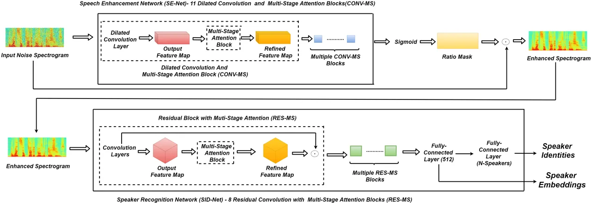
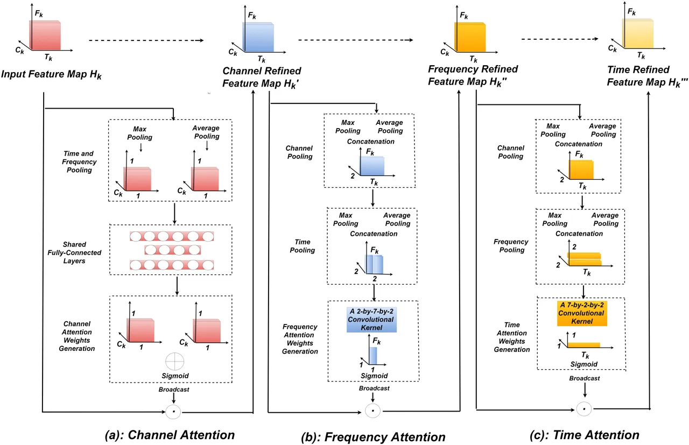
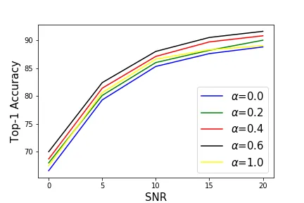

# Robust Speaker Recognition Using Speech Enhancement And Attention Model

\*The first and second author contribute equally to this paper

###### Abstract

In this paper, a novel architecture for speaker recognition is proposed
by cascading speech enhancement and speaker processing. It aims to
improve speaker recognition performance when speech signals are
corrupted by noise. Instead of separately processing speech enhancement
and speaker recognition, the two modules are integrated into one
framework by a joint optimisation using deep neural networks.
Furthermore, to increase the robustness against noise, a multi-stage
attention mechanism is employed to highlight the speaker related
features learned from context information in both time and frequency
domains. To evaluate speaker identification and verification performance
of the proposed approach, VoxCeleb1, one of mostly used benchmark
datasets, is used. Moreover, the robustness evaluation is also conducted
on VoxCeleb1 when its being corrupted by three types of interferences,
general noise, music, and babble, at different signal-to-noise ratio
(SNR) levels. The obtained results show that the proposed approach using
speech enhancement and multi-stage attention models outperforms two
strong baselines in different acoustic conditions in our experiments.

|                                                         |
| ------------------------------------------------------- |
| Yanpei Shi^(\*), Qiang Huang^(\*), Thomas Hain          |
| Speech and Hearing Research Group                       |
| Department of Computer Science, University of Sheffield |
| {YShi30, qiang.huang, t.hain}@sheffield.ac.uk           |

## 1 Introduction

The aim of speaker recognition is to recognize speaker identities from
their voice characteristics \[1\]. In recent years, the use of deep
learning technologies has significantly improved speaker recognition
performance. Variani, et al. \[2\] developed the $`d`$-vector using
multiple fully-connected neural network layers, and Snyder, et al. \[3\]
developed $`X`$-vectors based on the Time-delayed neural networks
(TDNN). However, it is still a challenging task when recognizing or
verifying speakers in poor acoustic conditions.

To tackle speech signals corrupted by noise, in this field, some of
previous studies \[4, 5\] tended to recover original signals by removing
noise. Some methods \[6, 7\] focused on feature extraction from
un-corrupted voices, and some methods \[8, 9\] tried to estimated speech
quality by computing signal-to-noise ratio (SNR). Although speech
enhancement has been used for speaker recognition, in most of previous
studies it was often processed individually. This might cause the
learned features or enhanced speech signals unable to well meet the
requirement by speaker recognition and verification. Accordingly, it is
highly desirable that both speech enhancement and speaker processing
model can be optimised jointly. In \[10\], Shon et.al tried to
integrated speech enhancement module and speaker processing module into
one framework. In this method, the speech enhancement module worked to
filter out unnecessary features corrupted by noise by generating a ratio
mask and multiplying element-wise with the original spectrogram for
speaker verification. However, in this work, the speaker verification
module was per-trained and frozen when training the speech enhancement
network. This means that the two modules were not optimised jointly.

In addition to joint optimisation, attention mechanisms have also been
widely used for speaker identification and verification \[11, 12, 13,
14\]. This is because a neural attention mechanism can allocate
different weights to different input features. This can hence highlight
the relevant information and reduce the interference caused by
irrelevant information. In previous studies \[15, 11\], the use of
attention models has provided benefits not only for speech processing,
but also for natural language processing (NLP) and image processing

Wang, et al. \[15\] used an attentive X-vector where a self-attention
layer was added before a statistics pooling layer to weight each frame.
Rahman, et al. \[11\] jointly used attention model and K-max pooling to
selects the most relevant features. In \[16\], Moritz, et al. combined
CTC (connectionist temporal classification) and attention model to
improve the performance of end to end speech recognition. In \[17, 18\]
and \[19\], different attention models were also designed for speech
emotion recognition and phoneme recognition, respectively. In \[20\], an
attention model was used to allow the each time step of decoder to focus
on different part of input sentence to search for most relevant words.
Luong, et al. \[21\] used global attention and local attention, where
global attention attends to the whole input sentence and local attention
only looks at a part of the input sentence. Cheng et.al \[22\] proposed
self attention that relating different positions of the same sentence.
Woo, et al. \[23\] used combination of spatial attention and channel
attention call CBAM to extract salient features from different dimension
of input.



Figure 1: Architecture of proposed approach by cascading speech
enhancement and speaker recognition. SE-Net denotes the speech
enhancement network with taking noise spectrogram as input and
consisting of 11 dilated convolution and multi-stage attention (CONV-MS)
blocks. SID-Net denotes the speaker recognition network, with taking the
enhanced spectrogram as input and consisting of 8 residual convolution
and multi-stage attention (RES-MS) blocks.

To improve the performance for speaker identification and verification,
and increase the robustness against noise, in our proposed approach, the
networks of speech enhancement and speaker recognition will be cascaded
and their parameter will be optimised jointly by a single loss function.
Simultaneously, a multi-stage attention mechanism will be also employed
in order to learn useful features from context information in time,
frequency and channel dimensions of the corresponding features. The use
of multi-stage attention aims to highlight the relevant features to
improve the robustness for speaker identification and verification in
noise environment. The details of the proposed approach will be depicted
in the following sections.

The rest of the paper is organized as follow: Section 2 presents the
cascade structure of our approach and how the attention mechanism is
used in these architecture. The used data set and experiment set-up are
introduced in Section 3. The obtained results and related analysis are
given in Section 4, and finally conclusions are drawn in Section 5

## 2 Model Architecture



Figure 2: The multi-stage (MS) attention consists of three blocks
attention block (a): Channel Attention; (b): Frequency Attention; (c):
Time Attention, which are run in a cascading order.

### 2.1 Speech Enhancement Module

Figure 1 shows the proposed model architecture consisting of a speech
enhancement module and a speaker recognition module.
$`\boldsymbol{X}\in\mathcal{R}^{T\times F\times C})`$ represent the
input spectrograms, where $`T`$, $`F`$, and $`C`$ represent the temporal
dimension, frequency dimension, and channel dimension, respectively. For
the input spectrogram, $`C`$ is set to one, but its value is then
changed to the number of kernels of a convolutional layer in the propose
architecture.

The speech enhancement module consists of multiple Conv-MS blocks, each
of them containing a dilated convolution layer followed by a multi-stage
attention block. In the attention block, self attention is conducted in
time, frequency and channel domains, respectively.

The output of the dilated convolutional layer is denoted as
$`\boldsymbol{H}_{k}\in\mathcal{R}^{T_{k}\times F_{k}\times C_{k}}`$,
where $`k`$ means the $`k`$th CONV-MC block. The output
$`\boldsymbol{H}_{k}^{\prime\prime\prime}`$ denotes the refined features
of the $`k`$th Conv-MS block, whose dimension is the same as
$`\boldsymbol{H}_{k}`$.

The output of enhancement module is viewed as a ratio mask matrix to
weight the input spectrogram by multiplying it by the corresponding
frequency bins and time frames.

### 2.2 Speaker Recognition Module

The speaker recognition module consists of multiple residual
convolutional blocks and a multi-stage attention block. The input of the
$`k`$th residual block is denoted as
$`\boldsymbol{H}_{k}\in\mathcal{R}^{T_{k}\times F_{k}\times C_{k}}`$,
and the final refined feature map of the $`k`$th residual block is
$`\boldsymbol{H}_{k}^{\prime\prime\prime}`$. Within each residual block,
multi-stage is operated sequentially. The last residual block is
followed by fully-connected layers, by which the predictions of speaker
identities are finally computed using.

### 2.3 Multi-Stage Attention (MS)

Figure 2 shows the structure of a multi-stage attention block, which
runs channel attention, frequency attention, and time attention
sequentially. Its mathematics representation can be found in equation 1:

```math
\displaystyle\boldsymbol{H^{{}^{\prime}}_{k}} \displaystyle=\boldsymbol{\alpha_{C,k}}\odot\boldsymbol{H}_{k} \tag{1}
```

```math
\displaystyle\boldsymbol{H^{{}^{\prime\prime}}_{k}} \displaystyle=\boldsymbol{\alpha_{F,k}}\odot\boldsymbol{H}^{{}^{\prime}}_{k}
```

```math
\displaystyle\boldsymbol{H^{{}^{\prime\prime\prime}}_{k}} \displaystyle=\boldsymbol{\alpha_{T,k}}\odot\boldsymbol{H^{{}^{\prime\prime}}_{k}}
```

where $`\boldsymbol{\alpha_{C,k}}`$, $`\boldsymbol{\alpha_{F,k}}`$, and
$`\boldsymbol{\alpha_{T,k}}`$ represent the implementation of channel
attention, frequency attention and time attention in the $`k`$th
attention block, respectively.

#### 2.3.1 Channel Attention

Following the principle of channel attention used in \[24, 23\], The
working flow of channel attention is shown in Figure 2 (a) and Equation 2.

```math
\displaystyle\boldsymbol{H^{C}_{k,max}} \displaystyle=\boldsymbol{max^{T_{k}\times F_{k}\times 1}(H_{k})} \tag{2}
```

```math
\displaystyle\boldsymbol{H^{C}_{k,avg}} \displaystyle=\boldsymbol{avg^{T_{k}\times F_{k}\times 1}(H_{k})}
```

```math
\displaystyle\boldsymbol{S_{max}} \displaystyle=\mathrm{Relu}\boldsymbol{((H^{C}_{k,max}){W_{0}}+{b_{0}}){W_{1}}}
```

```math
\displaystyle\boldsymbol{S_{avg}} \displaystyle=\mathrm{Relu}\boldsymbol{((H^{C}_{k,avg}){W_{0}}+{b_{0}}){W_{1}}}
```

```math
\displaystyle\boldsymbol{\alpha^{C,k}} \displaystyle=\mathrm{Sigmoid}\boldsymbol{({S_{avg}}+{S_{max}})}
```

where $`\boldsymbol{W_{0}}\in\mathcal{R}^{C_{k}\times 100}`$,
$`\boldsymbol{b_{0}}\in\mathcal{R}^{1\times 100}`$ and
$`\boldsymbol{W_{1}}\in\mathcal{R}^{100\times C_{k}}`$ are the
parameters of the $`k`$th channel attention block.

In the implementation of channel attention, max pooling and average
pooling are firstly applied on both time and frequency dimension of
$`\boldsymbol{H_{k}}`$. Their output
$`\boldsymbol{H^{C}_{k,avg}}\in\mathcal{R}^{1\times 1\times C_{k}}`$ and
$`\boldsymbol{H^{C}_{k,max}}\in\mathcal{R}^{1\times 1\times C_{k}}`$ are
then used as the input of two fully connected layers sharing the same
parameters and followed by $`Relu`$ activation. The channel attention
map $`\boldsymbol{\alpha^{C,k}}`$ is finally obtained after a Sigmoid
activation is applied to the summation of $`\boldsymbol{S_{avg}}`$ and
$`\boldsymbol{S_{max}}`$. After broadcasting data in
$`\boldsymbol{\alpha^{C,k}}`$ to expand the map size same as
$`\boldsymbol{H}_{k}`$, the attention map is multiplied by the original
feature map $`\boldsymbol{H}_{k}`$ to generate the refined feature map
$`\boldsymbol{H}_{k}^{\prime}`$

#### 2.3.2 Frequency and Time Attention

The frequency and time attention block have similar working structure
when processing their three dimensional input except that where an
attention mechanism is applied to, frequency dimension or time
dimension.

```math
\displaystyle\boldsymbol{H^{C^{\prime}}_{k,max}} \displaystyle=\boldsymbol{max^{1\times 1\times C_{k}}(H_{k}^{\prime})} \tag{3}
```

```math
\displaystyle\boldsymbol{H^{C^{\prime}}_{k,avg}} \displaystyle=\boldsymbol{avg^{1\times 1\times C_{k}}(H_{k}^{\prime})}
```

```math
\displaystyle\boldsymbol{H^{C^{\prime}}_{k,pool}} \displaystyle=\mathrm{Concat}\boldsymbol{[H^{C^{\prime}}_{k,avg};H^{C^{\prime}}_{k,max}]}
```

```math
\displaystyle\boldsymbol{H^{T^{\prime}}_{k,max}} \displaystyle=\boldsymbol{max^{T_{k}\times 1\times 1}(H^{C^{\prime}}_{k,pool})}
```

```math
\displaystyle\boldsymbol{H^{T^{\prime}}_{k,avg}} \displaystyle=\boldsymbol{avg^{T_{k}\times 1\times 1}(H^{C^{\prime}}_{k,pool})}
```

```math
\displaystyle\boldsymbol{H_{k,pool}^{\prime}} \displaystyle=\mathrm{Concat}\boldsymbol{[H^{T^{\prime}}_{k,avg};H^{T^{\prime}}_{k,max}]}
```

```math
\displaystyle\boldsymbol{\alpha^{F}_{k}} \displaystyle=\mathrm{Sigmoid}\boldsymbol{(f^{2\times 7}(H_{k,pool}^{\prime}))}
```

Figure 2 (b) shows the working flow of the time attention block and
Equation 3 shows its implementation in math format. In the $`k`$th time
attention block, a max pooling and an average pooling are firstly
applied to channel dimension of the input data
$`\boldsymbol{H^{\prime}_{k}}`$, and the corresponding outputs are
$`\boldsymbol{H^{C}_{k,max}}\in\mathcal{R}^{T_{k}\times F_{k}\times 1}`$
and
$`\boldsymbol{H^{C}_{k,avg}}\in\mathcal{R}^{T_{k}\times F_{k}\times 1}`$,
respectively.
$`\boldsymbol{H^{C}_{k,pool}}\in\mathcal{R}^{T_{k}\times F_{k}\times 2}`$
is obtained by concatenating the outputs after using poolings. On time
dimension, the same max pooling and average pooling steps are applied on
$`\boldsymbol{H^{C}_{k,pool}}\in\mathcal{R}^{T_{k}\times F_{k}\times 2}`$
and the corresponding outputs are
$`\boldsymbol{H^{T}_{k,avg}}\in\mathcal{R}^{1\times F_{k}\times 2}`$ and
$`\boldsymbol{H^{T}_{k,max}}\in\mathcal{R}^{1\times F_{k}\times 2}`$.
Again, the output after concatenating them on time dimension is
$`\boldsymbol{H_{k,pool}}\in\mathcal{R}^{2\times F_{k}\times 2}`$. The
frequency attention map $`\boldsymbol{\alpha^{F}_{k}}`$ is computed
using a convolution operation with a 2-by-7-by-2 kernel followed by a
sigmoid activation. The stride value is 1 on frequency dimension during
convolution. The size of $`\boldsymbol{\alpha^{F}_{k}}`$ is then
expanded to the same as $`\boldsymbol{H}_{k}^{\prime\prime}`$ by data
broadcast. The frequency refined feature map
$`\boldsymbol{H}_{k}^{\prime\prime}`$ is finally obtained by the product
of $`\boldsymbol{\alpha^{F}_{k}}`$ and $`\boldsymbol{H^{\prime}_{k}}`$.

|    Layer Name         |    Structure    |    Dilation    |
| --------------------- | --------------- | -------------- |
|    CONV-MS Block1     |    7x1x48       |    1x1         |
|                       |    MS           |                |
|    CONV-MS Block2     |    1x7x48       |    1x1         |
|                       |    MS           |                |
|    CONV-MS Block3     |    5x5x48       |    1x1         |
|                       |    MS           |                |
|    CONV-MS Block4     |    5x5x48       |    1x2         |
|                       |    MS           |                |
|    CONV-MS Block5     |    5x5x48       |    1x4         |
|                       |    MS           |                |
|    CONV-MS Block6     |    5x5x48       |    1x8         |
|                       |    MS           |                |
|    CONV-MS Block7     |    5x5x48       |    1x1         |
|                       |    MS           |                |
|    CONV-MS Block8     |    5x5x48       |    2x2         |
|                       |    MS           |                |
|    CONV-MS Block9     |    5x5x48       |    4x4         |
|                       |    MS           |                |
|    CONV-MS Block10    |    5x5x48       |    8x8         |
|                       |    MS           |                |
|    CONV-MS Block11    |    1x1x1        |    1x1         |
|                       |    MS           |                |

Table 1: Architecture of the speech enhancement network (SE-Net)
consists of 11 blocks. In each block, a dilated convolutional layer is
followed by a multi-stage attention (MS) layer.

|                     |                 |                |
| ------------------- | --------------- | -------------- |
|    Block Name       |    Structure    |    Output      |
|    RES-MS Block1    |    3x3x64       |    150x129     |
|                     |    3x3x64       |                |
|                     |    3x3x64       |                |
|                     |    MS-ATT       |                |
|    RES-MS Block2    |    3x3x128      |    75x65       |
|                     |    3x3x128      |                |
|                     |    3x3x128      |                |
|                     |    MS-ATT       |                |
|    RES-MS Block3    |    3x3x128      |    75x65       |
|                     |    3x3x128      |                |
|                     |    MS-ATT       |                |
|    RES-MS Block4    |    3x3x256      |    38x33       |
|                     |    3x3x256      |                |
|                     |    3x3x128      |                |
|                     |    MS-ATT       |                |
|    RES-MS Block5    |    3x3x256      |    38x33       |
|                     |    3x3x256      |                |
|                     |    MS-ATT       |                |
|    RES-MS Block6    |    3x3x256      |    38x33       |
|                     |    3x3x256      |                |
|                     |    MS-ATT       |                |
|    RES-MS Block7    |    3x3x256      |    38x33       |
|                     |    3x3x256      |                |
|                     |    MS-ATT       |                |
|    RES-MS Block8    |    3x3x512      |    19x17       |
|                     |    3x3x512      |                |
|                     |    3x3x128      |                |
|                     |    MS-ATT       |                |
|    Pool             |    19x1         |    1x17x512    |
|    FC               |    512          |                |

Table 2: Architecture of SID-Net consists of 8 blocks. Within each
block, the multiple convolutional layers are followed by a multi-stage
attention (MS) layer before a residual connection.

The computation of time attention is similar to frequency attention.
Equation 3 and Figure 2 (c) shows the computation flow. The final
feature representation is obtained by the multiplication of the previous
frequency refined feature map and the time attention weights
$`\boldsymbol{\alpha^{T}_{k}}`$.

```math
\displaystyle\boldsymbol{H^{C^{\prime\prime}}_{k,max}} \displaystyle=\boldsymbol{max^{1\times 1\times C_{k}}(H_{k}^{\prime\prime})} \tag{4}
```

```math
\displaystyle\boldsymbol{H^{C^{\prime\prime}}_{k,avg}} \displaystyle=\boldsymbol{avg^{1\times 1\times C_{k}}(H_{k}^{\prime\prime})}
```

```math
\displaystyle\boldsymbol{H^{C^{\prime\prime}}_{k,pool}} \displaystyle=\mathrm{Concat}\boldsymbol{[H^{C^{\prime\prime}}_{k,avg};H^{C^{\prime\prime}}_{k,max}]}
```

```math
\displaystyle\boldsymbol{H^{F^{\prime\prime}}_{k,max}} \displaystyle=\boldsymbol{max^{1\times F_{k}\times 1}(H^{C^{\prime\prime}}_{k,pool})}
```

```math
\displaystyle\boldsymbol{H^{F^{\prime\prime}}_{k,avg}} \displaystyle=\boldsymbol{avg^{1\times F_{k}\times 1}(H^{C^{\prime\prime}}_{k,pool})}
```

```math
\displaystyle\boldsymbol{H_{k,pool}^{\prime\prime}} \displaystyle=\mathrm{Concat}\boldsymbol{[H^{F^{\prime\prime}}_{k,avg};H^{F^{\prime\prime}}_{k,max}]}
```

```math
\displaystyle\boldsymbol{\alpha^{T}_{k}} \displaystyle=\mathrm{Sigmoid}\boldsymbol{(f^{7\times 2}(H_{k,pool}^{\prime\prime}))}
```

## 3 Experiments

| Model              | Description                                        |
| ------------------ | -------------------------------------------------- |
| VoiceID_loss\[10\] | baseline done by cascading                         |
|                    | speech enhancement and speaker recognition modules |
| SID                | speaker identification baseline using              |
|                    | speaker recognition module (SID-Net) only          |
| SE+SID             | joint optimisation of speech enhancement (SE-Net)  |
|                    | and speaker recognition module (SID-Net)           |
|                    | without using attention mechanism                  |
| SE-MS+SID          | proposed model using a joint                       |
|                    | optimisation and a multi-stage attention (MS)      |
|                    | models in speech enhancement module (SE-Net)       |
| SE+SID-MS          | proposed model using a joint                       |
|                    | optimisation and multi-stage attention models      |
|                    | in speaker recognition module (SID-Net)            |

Table 3: Descriptions of five models: three baselines (VoiceID_loss,
SID, and SE+SID) and two proposed approaches (SE-MS+SID and SE+SID-MS).

|            |     |          |          |          |          |            |          |           |          |
| ---------- | --- | -------- | -------- | -------- | -------- | ---------- | -------- | --------- | -------- |
| Noise Type | SNR | SID      |          | SE+SID   |          | SE-MS +SID |          | SE+SID-MS |          |
|            |     | Top1 (%) | Top5 (%) | Top1 (%) | Top5 (%) | Top1 (%)   | Top5 (%) | Top1 (%)  | Top5 (%) |
| Noise      | 0   | 74.1     | 86.9     | 76.3     | 88.9     | 78.5       | 90.0     | 77.7      | 89.2     |
|            | 5   | 79.2     | 90.0     | 81.1     | 91.8     | 83.4       | 92.1     | 81.9      | 91.8     |
|            | 10  | 83.2     | 93.2     | 86.0     | 94.7     | 87.3       | 95.6     | 86.7      | 95.1     |
|            | 15  | 84.9     | 94.6     | 87.3     | 95.8     | 89.5       | 96.7     | 88.8      | 96.0     |
|            | 20  | 87.9     | 95.4     | 89.1     | 96.6     | 90.9       | 97.5     | 90.2      | 97.0     |
| Music      | 0   | 65.8     | 82.0     | 67.7     | 83.7     | 70.3       | 84.1     | 69.5      | 83.5     |
|            | 5   | 76.9     | 89.1     | 80.0     | 91.0     | 81.6       | 91.5     | 80.6      | 90.8     |
|            | 10  | 83.8     | 93.5     | 85.2     | 94.7     | 86.3       | 95.3     | 85.8      | 94.7     |
|            | 15  | 86.1     | 93.9     | 88.4     | 95.6     | 89.1       | 96.7     | 88.2      | 95.4     |
|            | 20  | 87.4     | 94.7     | 89.1     | 96.0     | 90.2       | 97.1     | 89.5      | 96.6     |
| Babble     | 0   | 62.4     | 80.2     | 65.7     | 81.5     | 67.5       | 83.0     | 66.6      | 81.9     |
|            | 5   | 76.2     | 87.3     | 78.6     | 88.9     | 80.6       | 89.9     | 79.3      | 89.6     |
|            | 10  | 81.4     | 92.2     | 84.6     | 93.6     | 86.6       | 94.5     | 85.3      | 83.2     |
|            | 15  | 84.0     | 92.6     | 86.8     | 93.9     | 88.3       | 94.7     | 87.6      | 94.0     |
|            | 20  | 85.8     | 92.9     | 87.1     | 94.6     | 89.0       | 95.5     | 88.8      | 95.2     |
| Original   |     | 88.5     | 95.9     | 89.8     | 96.5     | 91.9       | 97.6     | 90.8      | 97.3     |

Table 4: Speaker Identification Results on the Voxcebe1 test data when
being corrupted by three types of noise (Noise, Music and Babble) at
different SNR (0-20 dB) levels. Four different scenarios are tested:
SID-Net (SID), the use of both SE-Net and SID-Net without employing a
multi-stage attention (SE+SID), a joint system combing SE-Net with
SID-Net, but a multi-stage attention is used only in SE-Net(SE-MS+SID);
The SE-Net and SID-Net denotes a joint system, with a multi-stage
attention layer being used only in SID-Net(SE+SID-MS).

|            |     |         |       |                     |       |         |       |           |       |           |       |
| ---------- | --- | ------- | ----- | ------------------- | ----- | ------- | ----- | --------- | ----- | --------- | ----- |
| Noise Type | SNR | SID     |       | VoiceID Loss \[10\] |       | SE+SID  |       | SE-MS+SID |       | SE+SID-MS |       |
|            |     | EER (%) | DCF   | EER (%)             | DCF   | EER (%) | DCF   | EER (%)   | DCF   | EER (%)   | DCF   |
| Noise      | 0   | 16.94   | 0.933 | 16.56               | 0.938 | 16.20   | 0.912 | 15.95     | 0.901 | 16.13     | 0.908 |
|            | 5   | 12.48   | 0.855 | 12.26               | 0.830 | 11.99   | 0.819 | 11.76     | 0.805 | 11.78     | 0.812 |
|            | 10  | 10.03   | 0.760 | 9.86                | 0.747 | 9.54    | 0.732 | 9.17      | 0.717 | 9.29      | 0.727 |
|            | 15  | 8.84    | 0.648 | 8.69                | 0.686 | 8.48    | 0.665 | 8.08      | 0.639 | 8.10      | 0.641 |
|            | 20  | 7.96    | 0.594 | 7.83                | 0.639 | 7.52    | 0.629 | 7.07      | 0.615 | 7.09      | 0.623 |
| Music      | 0   | 17.04   | 0.940 | 16.24               | 0.913 | 15.96   | 0.901 | 15.58     | 0.899 | 15.89     | 0.904 |
|            | 5   | 11.54   | 0.828 | 11.44               | 0.818 | 11.15   | 0.805 | 10.93     | 0.791 | 11.04     | 0.801 |
|            | 10  | 9.69    | 0.749 | 9.13                | 0.733 | 9.12    | 0.731 | 8.87      | 0.714 | 8.97      | 0.725 |
|            | 15  | 8.40    | 0.689 | 8.10                | 0.677 | 8.08    | 0.643 | 7.62      | 0.621 | 7.77      | 0.629 |
|            | 20  | 7.70    | 0.665 | 7.48                | 0.635 | 7.39    | 0.619 | 7.13      | 0.607 | 7.26      | 0.614 |
| Babble     | 0   | 38.90   | 1.000 | 37.96               | 1.000 | 37.53   | 0.999 | 37.55     | 0.999 | 37.46     | 0.998 |
|            | 5   | 28.04   | 0.998 | 27.12               | 0.996 | 26.97   | 0.979 | 26.42     | 0.981 | 26.35     | 0.977 |
|            | 10  | 17.34   | 0.917 | 16.66               | 0.926 | 16.44   | 0.911 | 16.30     | 0.907 | 16.36     | 0.911 |
|            | 15  | 11.31   | 0.795 | 11.25               | 0.807 | 11.24   | 0.801 | 10.89     | 0.795 | 10.94     | 0.801 |
|            | 20  | 9.12    | 0.720 | 8.99                | 0.705 | 8.77    | 0.695 | 8.39      | 0.677 | 8.51      | 0.688 |
| Original   |     | 6.92    | 0.565 | 6.79                | 0.574 | 6.41    | 0.541 | 6.18      | 0.528 | 6.26      | 0.535 |

Table 5: Speaker Verification Results on Voxceleb1 test data when it
being corrupted by different types of noise (Noise, Music and Babble) at
different SNR (0-20 dB). Four different scenarios are tested: only use
SID-Net (SID); A joint system combining the SE-Net with the SID-Net
without a multi-stage attention (SE+SID); A joint system using both
SE-Net and SID-Net, but without being used in multi-stage attention
(SE-MS+SID); A joint system consisting of SE-Net and SID-Net, with a
multi-stage attention being used in SID-Net (SE+SID-MS). The results of
VoiceID Loss \[10\] is listed and works as a baseline.

### 3.1 Data

In this work, Voxceleb1 \[25\] dataset is used to evaluate the proposed
approach. Voxceleb1 data are extracted from Youtube videos, which
contains 1251 speakers with more than 150 thousand utterances collected
”in the wild”. The average length of the audios in the dataset is 7.8
seconds.

The spectrogram of each recording is used as input features. Each
recording is segmented frames using a 25-ms sliding window with a 10-ms
hop, and then a 512-point FFT is implemented on audio segments. In our
experiments, a 3-second audio segment are randomly extracted from each
recording without any normalization.

To evaluate the robustness of the proposed approach, extra noise from
MUSAN dataset is used. MUSAN dataset contains three categories of
noises: general noise, music and babble \[26\]. The general noise type
contains 6 hours of audio, including DTMF tones, dialtones, fax machine
noises et.al. The music type contains 42 hours of music recording from
different categories. The babble type contains 60 hours of speech ,
including read speech from public domain, hearings, committees and
debates et.al.

### 3.2 Speaker Identification

In VoxCeleb1 dataset, both training and test sets contain the same
number of speakers (1251 speakers) \[25\]. The training set contains
145265 utterances and the test set contains 8251 utterances. In order to
reduce possible bias, the MUSAN dataset is also split into two parts for
training and test. This is to ensure that the noise signals used for
training will not be reused for test. Each training utterance is mixed
with a type of noise at one of five SNR levels. For the test set, the
same data configuration is set. To evaluate the recognition performance,
Top-1 and Top-5 accuracy are employed \[27\].

### 3.3 Speaker Verification

There contains 148,642 utterances (1211 speakers) in the VoxCeleb1
development dataset, and 4,874 utterances (40 speakers) in the test
dataset \[25\]. For the speaker verification task, there are total
37,720 test pairs. The same configuration on the data for speaker
recognition task is also set for speaker verification. To compare with
the baseline introduced in \[10\], the same loss function and similarity
measurement (Cosine) are used. Equal Error Rate (EER) \[28\] and
Detection Cost Function (DCF) \[29\] are used as evaluation metrics. DCF
is computed as the average of two minimum DCF score (DCF0.01 and
DCF0.001) \[29, 30\].

### 3.4 Experiment Setup

To evaluate our proposed approach, five models including two baselines
and three proposed approaches are to be tested on the data mentioned in
Section 3.2 and 3.3. As listed in table 3, SID represents the baseline
using the SID-Net, and VoiceID_loss \[10\] represents the baseline done
by cascading speech enhancement and speaker recognition. SE+SID
represents the cascading structure with a joint optimisation with SE-Net
and SID-Net. SE-MS+SID and SE+SID-MS are the two proposed approaches
using multi-stage attention models in either the speech enhancement
module (SE-Net) or the speaker recognition module (SID-Net) besides the
joint optimisation used in SE+SID.

### 3.5 Network Structure

Table 1 and Table 2 shows the detailed structure of the speech
enhancement and speaker recognition module, respectively. In the speech
enhancement module, 11 dilated convolutional layers are employed. The
speaker recognition module uses the Resnet-20 architecture\[31\], due to
its effectiveness in speaker recognition \[27\].

For SE-MS+SID, each dilated convolutional layer in the speech
enhancement module is followed by a multi-stage attention module (MS).
For SE+SID-MS, the multi-stage attention module (MS) is inserted into
each residual block. Each of these two modules are trained
independently, and are then fine-tuned by a joint optimisation. During
training, Adam optimizer \[32\] is used with the initial learning rate
being set to 1e-3 and the decay rate being set to 0.9 for each epoche.

## 4 Results

Table 4 shows speaker identification results obtained using the models
listed in Table 3. Compared to the SID baseline, the use of SE+SID
yields better performances for speaker identification. After using
multi-stage attention models, SE+SID-MS and SE-MS+SID, about 2$`\sim`$3%
further improvements on Top-1 and Top-5 accuracy are obtained in
comparison with the baseline in all noise conditions. Compared to
SE+SID, the use of attention model can also show about 1$`\sim`$2%
relative improvement even if the SNR is at 0dB level. This case is
probably because the use of attention mechanism can highlight the
speaker related information and reduce the interference caused by
irrelevant noise signals.

For the task of speaker verification, table 5 shows similar tendencies
when implementing all five models on the test data. It is clear that
SE+SID the use of a joint optimisation can performs better than
VoiceID_loss \[10\] using only a pre-trained speaker identification
model instead of a joint optimisation. In comparison with speaker
identification task, the verification improvements obtained using
SE-MS+SID and SE+SID-MS are relatively smaller. This is probably because
for speaker verification, the similarity between speaker embeddings
learned from speaker model is computed using Cosine function instead of
directly being computed using the trained speaker recognition model. In
addition, for speaker verification, the use of attention model in speech
enhancement module can yield slight better performances in almost all
conditions except when speeches are corrupted by Babble noise at 0dB and
5dB SNR levels. For this case, a possible reason is that the ”Babble”
noise signals are relative complication due to its speaker/speech like
characteristics. The use of attention model in speaker recognition
module (SID-Net) might be more suitable to extract speaker relevant
information than using an attention model in the speech enhancement
model when acoustic environment is poor.



Figure 3: The Top-1 Accuracy of the linear combination of the SE-MS+SID
and SE+SID-MS results when the noise is ”babble”.
$`\boldsymbol{\alpha}`$ denotes the combination parameter for SE-MS+SID,
the combination parameter of SE+SID-MS is $`1-\boldsymbol{\alpha}`$.

Figure 3 shows the linear combination of speaker identification results
(Top-1 Accuracy) of SE-MS+SID and SE+SID-MS. In the combination results,
$`\boldsymbol{\alpha}`$ denotes the combination parameter of SE-MS+SID
and $`1-\boldsymbol{\alpha}`$ denotes that of SE+SID-MS. The two
baseline when $`\boldsymbol{\alpha}`$ equals to zero and one are also
shown. When $`\boldsymbol{\alpha}`$ equals to one, the linear
combination is the same scenario that only using SE-MS+SID; When
$`\boldsymbol{\alpha}`$ equals to zero, the linear combination is the
same scenario that only using SE+SID-MS. It it clear from the figure
that when $`\boldsymbol{a}lpha`$ becomes larger, the final results
becomes better. This phenomenon shows the contribution of SE-MS+SID is
bigger than SE-SID+MS to the final accuracy. The MS module added in SE
module obtains better recognition results.

## 5 Conclusion and Future Work

In this paper, a joint optimisation by cascading the speech enhancement
network and speaker recognition network was implemented in order to
improve speaker identification and verification performance when speech
signals are corrupted by noise. Furthermore, a multi-stage attention
model also employed in either the speech enhancement or speaker
recognition module to highlight speaker relevant information. It is
clear that the use of speech enhancement can yield better performances
than the only use of speaker identification model. Moreover, a joint
optimisation and the use of attention model can further increase the
robustness of our system against the interferences caused by different
types of noise.

In the future work, the scenario that use multi-stage attention (MS)
module in both SE-Net and SID-Net will be tested. More advanced speech
enhancement technologies and training strategy such as adversarial
training will be studied on other large datasets, such as Voxceleb2.
Post-processing techniques for speaker embeddings such as PLDA back-end
will also be taken into account.

Acknowledgement

This work was in part supported by Innovate UK Grant number 104264
MAUDIE.

## References

- \[1\] Arnab Poddar, Md Sahidullah, and Goutam Saha, “Speaker
  verification with short utterances: a review of challenges, trends and
  opportunities,” IET Biometrics, 2017.
- \[2\] Ehsan Variani, Xin Lei, Erik McDermott, Ignacio Lopez Moreno,
  and Javier Gonzalez-Dominguez, “Deep neural networks for small
  footprint text-dependent speaker verification,” in ICASSP. IEEE, 2014.
- \[3\] David Snyder, Daniel Garcia-Romero, Gregory Sell, Daniel Povey,
  and Sanjeev Khudanpur, “X-vectors: Robust dnn embeddings for speaker
  recognition,” in ICASSP. IEEE, 2018.
- \[4\] Simon Leglaive, Umut Şimşekli, Antoine Liutkus, Laurent Girin,
  and Radu Horaud, “Speech enhancement with variational autoencoders and
  alpha-stable distributions,” in ICASSP 2019-2019 IEEE International
  Conference on Acoustics, Speech and Signal Processing (ICASSP). IEEE,
  2019, pp. 541–545.
- \[5\] Mostafa Sadeghi, Simon Leglaive, Xavier Alameda-Pineda, Laurent
  Girin, and Radu Horaud, “Audio-visual speech enhancement using
  conditional variational auto-encoder,” arXiv preprint
  arXiv:1908.02590, 2019.
- \[6\] Inseon Jang, ChungHyun Ahn, Jeongil Seo, and Younseon Jang,
  “Enhanced feature extraction for speech detection in media audio.,” in
  INTERSPEECH, 2017, pp. 479–483.
- \[7\] Gholamreza Farahani, Seyed Mohammad Ahadi, and Mohammad Mehdi
  Homayounpour, “Robust feature extraction of speech via noise reduction
  in autocorrelation domain,” in International Workshop on Multimedia
  Content Representation, Classification and Security. Springer, 2006,
  pp. 466–473.
- \[8\] Lara Nahma, Pei Chee Yong, Hai Huyen Dam, and Sven Nordholm, “An
  adaptive a priori snr estimator for perceptual speech enhancement,”
  EURASIP Journal on Audio, Speech, and Music Processing, vol. 2019, no.
  1, pp. 7, 2019.
- \[9\] Rui Yao, ZeQing Zeng, and Ping Zhu, “A priori snr estimation and
  noise estimation for speech enhancement,” EURASIP journal on advances
  in signal processing, vol. 2016, no. 1, pp. 101, 2016.
- \[10\] Suwon Shon, Hao Tang, and James Glass, “Voiceid loss: Speech
  enhancement for speaker verification,” arXiv preprint
  arXiv:1904.03601, 2019.
- \[11\] FA Rezaur rahman Chowdhury, Quan Wang, Ignacio Lopez Moreno,
  and Li Wan, “Attention-based models for text-dependent speaker
  verification,” in ICASSP. IEEE, 2018.
- \[12\] Yingke Zhu, Tom Ko, David Snyder, Brian Mak, and Daniel Povey,
  “Self-attentive speaker embeddings for text-independent speaker
  verification.,” in Interspeech, 2018.
- \[13\] Miquel India, Pooyan Safari, and Javier Hernando, “Self
  multi-head attention for speaker recognition,” arXiv preprint
  arXiv:1906.09890, 2019.
- \[14\] Nguyen Nang An, Nguyen Quang Thanh, and Yanbing Liu, “Deep cnns
  with self-attention for speaker identification,” IEEE Access, 2019.
- \[15\] Qiongqiong Wang, Koji Okabe, Kong Aik Lee, Hitoshi Yamamoto,
  and Takafumi Koshinaka, “Attention mechanism in speaker recognition:
  What does it learn in deep speaker embedding?,” in 2018 IEEE Spoken
  Language Technology Workshop (SLT). IEEE, 2018.
- \[16\] Niko Moritz, Takaaki Hori, and Jonathan Le Roux, “Triggered
  attention for end-to-end speech recognition,” in ICASSP. IEEE, 2019.
- \[17\] Seyedmahdad Mirsamadi, Emad Barsoum, and Cha Zhang, “Automatic
  speech emotion recognition using recurrent neural networks with local
  attention,” in ICASSP. IEEE, 2017.
- \[18\] Yuanyuan Zhang, Jun Du, Zirui Wang, Jianshu Zhang, and Yanhui
  Tu, “Attention based fully convolutional network for speech emotion
  recognition,” in APSIPA ASC. IEEE, 2018.
- \[19\] Jan K Chorowski, Dzmitry Bahdanau, Dmitriy Serdyuk, Kyunghyun
  Cho, and Yoshua Bengio, “Attention-based models for speech
  recognition,” in Advances in neural information processing
  systems, 2015.
- \[20\] Dzmitry Bahdanau, Kyunghyun Cho, and Yoshua Bengio, “Neural
  machine translation by jointly learning to align and translate,”
  arXiv:1409.0473, 2014.
- \[21\] Minh-Thang Luong, Hieu Pham, and Christopher D Manning,
  “Effective approaches to attention-based neural machine translation,”
  arXiv:1508.04025, 2015.
- \[22\] Jianpeng Cheng, Li Dong, and Mirella Lapata, “Long short-term
  memory-networks for machine reading,” in Proceedings of the 2016
  Conference on Empirical Methods in Natural Language Processing, 2016,
  pp. 551–561.
- \[23\] Sanghyun Woo, Jongchan Park, Joon-Young Lee, and In So Kweon,
  “Cbam: Convolutional block attention module,” in ECCV, 2018.
- \[24\] Jie Hu, Li Shen, and Gang Sun, “Squeeze-and-excitation
  networks,” in Proceedings of the IEEE conference on computer vision
  and pattern recognition, 2018, pp. 7132–7141.
- \[25\] Arsha Nagrani, Joon Son Chung, and Andrew Zisserman, “Voxceleb:
  a large-scale speaker identification dataset,” arXiv preprint
  arXiv:1706.08612, 2017.
- \[26\] David Snyder, Guoguo Chen, and Daniel Povey, “Musan: A music,
  speech, and noise corpus,” arXiv preprint arXiv:1510.08484, 2015.
- \[27\] Mahdi Hajibabaei and Dengxin Dai, “Unified hypersphere
  embedding for speaker recognition,” arXiv preprint
  arXiv:1807.08312, 2018.
- \[28\] Jyh-Min Cheng and Hsiao-Chuan Wang, “A method of estimating the
  equal error rate for automatic speaker verification,” in 2004
  International Symposium on Chinese Spoken Language Processing. IEEE,
  2004, pp. 285–288.
- \[29\] David A Van Leeuwen and Niko Brümmer, “An introduction to
  application-independent evaluation of speaker recognition systems,” in
  Speaker classification I, pp. 330–353. Springer, 2007.
- \[30\] Weidi Xie, Arsha Nagrani, Joon Son Chung, and Andrew Zisserman,
  “Utterance-level aggregation for speaker recognition in the wild,” in
  ICASSP 2019-2019 IEEE International Conference on Acoustics, Speech
  and Signal Processing (ICASSP). IEEE, 2019, pp. 5791–5795.
- \[31\] Kaiming He, Xiangyu Zhang, Shaoqing Ren, and Jian Sun, “Deep
  residual learning for image recognition,” in Proceedings of the IEEE
  conference on computer vision and pattern recognition, 2016, pp.
  770–778.
- \[32\] Diederik P Kingma and Jimmy Lei Ba, “Adam: Amethod for
  stochastic optimization,” .
