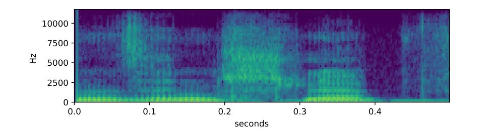
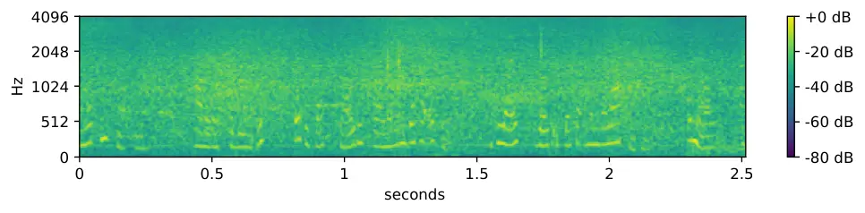
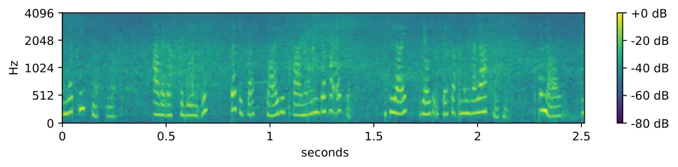
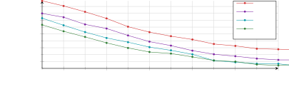
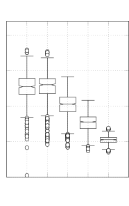
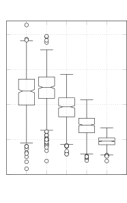
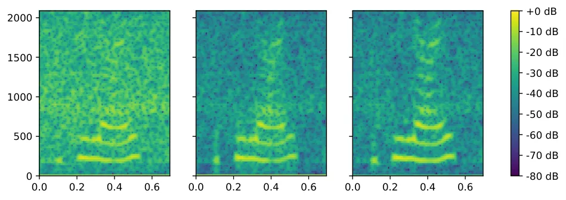

# CLCNet: Deep learning-based noise reduction for hearing aids using complex linear codingThanks: $`\star`$ M. Aubreville is also affiliated with Sivantos GmbH, Erlangen, Germany.

H. Schröter    T. Rosenkranz    A. N. Escalante-B    M. Aubreville    A.
Maier

###### Abstract

Noise reduction is an important part of modern hearing aids and is
included in most commercially available devices. Deep learning-based
state-of-the-art algorithms, however, either do not consider real-time
and frequency resolution constrains or result in poor quality under very
noisy conditions.

To improve monaural speech enhancement in noisy environments, we propose
CLCNet, a framework based on complex valued linear coding. First, we
define complex linear coding (CLC) motivated by linear predictive coding
(LPC) that is applied in the complex frequency domain. Second, we
propose a framework that incorporates complex spectrogram input and
coefficient output. Third, we define a parametric normalization for
complex valued spectrograms that complies with low-latency and on-line
processing.

Our CLCNet was evaluated on a mixture of the EUROM database and a
real-world noise dataset recorded with hearing aids and compared to
traditional real-valued Wiener-Filter gains.

###### Index Terms: 

noise reduction, speech enhancement, LPC, hearing aid signal processing,
deep learning

^(†)^(†)address: ¹ Friedrich-Alexander-Universität Erlangen-Nürnberg,
Pattern Recognition Lab  
² Sivantos GmbH, Research and development, Erlangen, Germany  
hendrik.m.schroeter@fau.de

## 1 Introduction

Noise reduction is an emerging field in speech applications and signal
processing. Especially in the context of an aging society with an
increase in spread of hearing loss, noise reduction becomes a
fundamental feature for the hearing-impaired.

Advances in deep learning recently improved the performance of noise
reduction algorithms \[1, 2, 3\]. It is common practice to transform the
noisy time-domain signal into a time-frequency representation, for
instance using a short-time Fourier transform (STFT). Usually, only the
magnitude of the complex valued spectrogram \[1, 4\] is used for noise
reduction. Recent publications though, also focus on incorporating phase
information in the reconstructed output by using the phase \[5\] or the
raw complex valued spectrogram \[6\] as input. Most approaches, however,
work with high frequency resolution (high-res) spectrograms \[7, 6\].
This exceedingly simplifies the noise reduction process, since a single
scalar value per frequency bin is sufficient to attenuate a narrow
frequency range. A low-res spectrogram on the other hand cannot resolve
speech harmonics that have a typical distance of
$`50\text{\,}\mathrm{Hz}400\text{\,}\mathrm{Hz}`$. Hence, a scalar
factor is not able to reduce the noise between the harmonics while
persevering the speech. Although a single complex factor could be used
to perfectly reconstruct the clean signal via the complex ideal ratio
mask (cIRM), it is hard to learn \[7, 6\]. Due to a superposition of
multiple, quasi static signals within one frequency bin, not only the
phase changes over time but also the magnitude as a result of
cancellation. Thus, low-res spectrograms limit the effectiveness of
standard complex valued processing methods that mainly bring phase
improvement \[5, 8\].

While other work uses the whole signal in an off-line processing fashion
as input for the noise reduction \[9, 10, 11\], our work requires
real-time capabilities. Both high-res spectrograms and off-line
processing are not feasible for hearing aid applications, where the
overall latency is a very important property. The superposition of both
signals results in a clearly audible comb filter effect that is
generating a tonal sound impression especially of background noises.
Therefore, an overall latency of $`10\text{\,}\mathrm{ms}`$ is typically
the maximum of what is acceptable \[12\]. Since higher frequency
resolutions introduce bigger delays \[13\], noise reduction for hearing
aids needs to be performed on low-res spectrograms. This, and on-line
processing constraints are not considered in any state-of-the-art (SOTA)
algorithms.

To overcome these limitations, this study proposes a framework motivated
by LPC. Due to the low resolution, one frequency band can contain
multiple harmonics. This results in a superposition of multiple complex
valued periodic signals for each frequency band. LPC is able to
perfectly model a superposition of multiple sinusoidals given enough
coefficients. Due to this property, LPC finds a use case in speech
coding and synthesis \[14\]. Yet, it is often only applied on
time-domain signals as a post-processing step. Instead, we propose a
complex valued linear combination of the model output and the noisy
spectrogram. We can show that this outperforms previous approaches like
real valued Wiener-Filter (WF) masking on low-res spectrograms.

## 2 Related work

Removing unwanted environmental background noise in speech signals is a
common step in speech processing applications. Complex valued neural
networks as well as phase estimation have been of great interest in
speech enhancement lately, since the perceptual audio quality has been
reported to be improved significantly \[5, 7, 6, 10\].

One approach is to estimate magnitude and phase or a phase
representation either directly \[5\] or use the estimated magnitude and
noisy phase to predict the clean phase \[8\]. Estimating the clean phase
directly, however, is quite hard, because of its spontaneous,
random-like nature. Zheng et al. \[5\] jointly estimated the magnitude
spectrogram and a phase representation based on the time derivative of
the phase. Le Roux et al. \[8\] estimated a magnitude mask and clean
phase using a cookbook-based method. Reducing the phase estimate from a
continuous space to discrete cookbook values reduces the search space
and allows to use output activations that are designed to represent the
cookbook values, like a convex softmax.

Other work focuses on estimating a complex valued mask. Williamson et
al. \[7\] used a complex ratio mask (CRM) to reconstruct a clean speech
spectrogram. Yet the network did not use complex valued input features,
but used traditional real valued features such as MFCCs as input. Tan et
al. tried to directly estimate the complex valued spectrogram \[6\]
using a linear output layer. This, however, might not be very robust,
since the network is allowed to output any value.

None of those SOTA algorithms, however, fulfill the latency and thus
low-res spectrogram requirements. Even Tan et al. \[4\], who propose a
convolutional recurrent network for real-time speech enhancement do not
specify overall latency. However, the windowing used in their approach
for the frequency transform results in $`20\text{\,}\mathrm{ms}`$ of
delay. Furthermore, it was only evaluated on synthetic noise.

Only Aubreville et al. \[1\] fully respects those constraints. Their
approach uses Wiener-Filter (WF) gains to reduce unwanted environmental
noise. The real-valued WF gains can only modify the magnitude of the
enhancement spectrogram. This, however, performs poor on low signal to
noise ratios (SNRs) since the WF is restricted by frequency resolution,
resulting in phase distortions that decrease perceptual quality.

## 3 Complex Linear Coding

In this section, we will describe details of our approach and provide a
theoretical motivation. Starting with complex valued LPC, we derive a
more general noise reduction framework based on a complex valued linear
combination. Finally, we introduce a phase-aware, parametric
normalization method for complex spectrograms. We provide details of our
implementation, which is qualified to be embedded into a hearing aid
signal processing chain, and the used database.

### 3.1 Linear Predictive Coding

Linear predictive coding is known to be a suitable model of the vocal
tract response \[15\] and is still used in SOTA approaches for speech
coding and synthesis \[14\]. Given a signal $`x_{k}`$ at sample $`k`$,
LPC can be described as the linear combination

```math
\hat{x}_{k}=\sum_{i=1}^{N}a_{i}x_{k-i}\text{\ ,} \tag{1}
```

where $`a_{i}`$ are the LPC coefficients of order $`N`$ and
$`\hat{x}_{k}`$ is the predicted sample at position $`k`$. Let $`d_{k}`$
be the prediction error

```math
\vskip-1.99997ptd_{k}=x_{k}-\hat{x}_{k}=x_{k}-\sum_{i=1}^{N}a_{i}x_{k-i}\text{\ .} \tag{2}
```

The optimal coefficients $`a_{i}`$ can then be found by minimizing the
expectation value $`E\{d_{k}^{2}\}`$. This results in $`n`$ equations
that need to be solved. In practice, a solution can be found e.g. via
autocorrelation of $`x`$ and the Levinson-Durbin \[16\] algorithm.
Higher order $`n`$ allow to model a higher number of superimposed
frequencies in the signal $`x`$. For instance, Makhoul et al. \[15\]
showed that $`n=10`$ coefficients are enough to sufficiently model the
dominant frequencies of the vocal tract.

Although LPC is often only applied to real-valued time-domain signals,
it is equivalent for a complex valued signal. In the next section, we
describe our proposed noise reduction framework using a general form of
equation (1).

### 3.2 Noise reduction via complex linear combination



Figure 1: A power spectrogram using the deployed filter bank from a
clean speech sample of the train set. This filter bank is similar to a
96 point STFT. The speech-typical harmonics are not clearly visible due
to the low frequency resolution.

Spectrograms have a periodic structure if the underlying time domain
signal is a superposition of sinusoidals and the frequency resolution of
the spectrogram cannot resolve the different frequencies in the signal.
This is caused by cancellation within each frequency band. Since those
spectrograms have wide frequency bands, multiple harmonics of human
speech can lie within a frequency band. Due to the overlap between two
successive windows during STFT, the phase of the different frequencies
in the time-domain signals changes with different rotation speed. This
may lead to partial cancellation, i.e. the magnitude of the
superposition of those frequencies may decrease. This effect can be
observed in Fig. 1. Here, a single frequency band is approximately
$`500\text{\,}\mathrm{Hz}`$ wide. Assuming a minimal human fundamental
frequency $`f_{0}=100`$, up to 5 harmonic oscillations can be captured
within a band.

To enhance a noisy spectrogram, a naive approach would be to calculate
the LPC coefficients of the ideal clean speech via Levinson-Durbin and
apply it to the noisy spectrogram. A deep learning-based model would
learn the mapping from a noisy spectrogram to the ideal LPC
coefficients. This however, does not work very well. First of all, the
coefficients computed from the clean spectrogram are only meaningful for
time-frequency (TF) bins that include harmonic parts of speech. For TF
bins without speech, the LPC coefficients will not enhance the resulting
spectrogram. Furthermore, the “ideal” LPC coefficients only slightly
reduce white noise and do not enhance the noisy spectrogram w.r.t. any
metric, i.e. amplitude (IAM) or energy (WF).

Instead we propose a complex linear coding (CLC) framework. Since we
know that LPC modeled by a complex linear combination works well for for
harmonic signals like speech, we embed the linear combination as a known
operator \[17\] in the network. Given a noisy spectrogram, the model
predicts complex valued coefficient that are applied to the noisy
spectrogram again. Thus, CLC will output an enhanced spectrogram that
can be transformed into time-domain. The loss can then be computed in
either time or frequency domain.

In contrast to LPC, for CLC we can use information of the current and
even future frames resulting in a more general form of the linear
combination in (1):

```math
\vskip-1.99997pt\boldsymbol{\hat{S}}(k,f)=\sum_{i=0}^{N}\boldsymbol{A}(k,i,f)\cdot\boldsymbol{X}(k-i+l,f)\text{\ ,} \tag{3}
```

were $`l`$ is an offset and $`N`$ the order of the linear combination.
$`\boldsymbol{A}(k,i,f)`$ are the output coefficients with
$`i=0,\dots,N`$ for each time-index $`k`$ and frequency-index $`f`$. For
$`l=-1`$, this is equivalent to LPC. Note that $`\boldsymbol{S}`$,
$`\boldsymbol{A}`$ and $`\boldsymbol{X}`$ are complex, thus the
multiplication needs to be complex valued.

As described above, one frequency bin can include up to 5 speech
harmonics. Thus, we chose a CLC order of $`N=5`$ for our noise reduction
framework.

### 3.3 Parametric unit norm normalization

Normalization is an essential part of most deep learning pipelines which
helps for robustness and generalization. In speech processing
applications, most normalization methods are performed on
power-spectrogram level which is not applicable for complex valued
input. Instead, we propose a bin-wise and phase-sensitive normalization
scheme based on the unit norm. Given a filter bank representation
$`\boldsymbol{X}(k,f)`$, the signal is normalized as:

```math
\vskip-1.99997pt\boldsymbol{X}_{\text{norm}}(k,f)=\frac{\boldsymbol{X}(k,f)}{\mu_{k,f}}\cdot\gamma_{f}\text{ ,}\vskip-1.99997pt \tag{4}
```

where $`\mu`$ is the mean of $`|\boldsymbol{X}|`$ and
$`\gamma_{f}\in{\mathbb{R}}`$ a learnable parameter for each frequency
bin. $`\mu`$ can be computed in a real-time capable fashion like a
exponential moving average or a window-based approach. Since the complex
valued input is only multiplied with scalar values, the phase of
$`\boldsymbol{X}`$ does not change.

### 3.4 Hearing aid signal processing chain

Instead of a usual STFT, our signal processing chain employs a standard
uniform polyphase filter bank for hearing aids \[13\]. In particular, a
48-frequency-bin analysis filter bank transforms the time-domain signal
of clean speech $`s`$, noise $`n`$ and noisy mixture $`m`$ into the
representations $`\boldsymbol{S}(k,f)`$, $`\boldsymbol{N}(k,f)`$,
$`\boldsymbol{M}(k,f)`$.

We directly feed the complex valued filter bank representations into a
parametric channel-wise normalization to enhance the weaker frequency
bands. After the noise reduction step via complex linear combination
(3), the enhanced filter bank representation
$`\boldsymbol{\hat{S}}(k,f)`$ gets synthesized again.

## 4 Experiments

### 4.1 Dataset and Implementation Details

The clean speech corpus contains 260 German sentences from 52 speakers
from the EUROM database \[18\] upsampled to $`24\text{\,}\mathrm{kHz}`$.
We furthermore used 49 real-world noise signals including non-stationary
signals to generate noisy mixtures. The noise signals were recorded in
various places in Europe using hearing aid microphones in a receiver in
a canal-type hearing instrument shell (Signia Pure 312, Sivantos GmbH,
Erlangen, Germany) and calibrated recording equipment at a sampling rate
of $`24\text{\,}\mathrm{kHz}`$. The mixtures were created with up to
$`4`$ noises at various SNRs of $`\{-100,-5,0,5,10,20\}\ $\mathrm{dB}$`$
and level offsets $`\{-6,0,6\}\ $\mathrm{dB}$`$ sampled online with an
uniform distribution. The dataset was split on original signal level
into train, validation and test sets, where validation set was used for
model selection and test set to report the results.





Figure 2: High resolution Mel spectrograms of a noisy input and an
enhanced output.

Our framework was implemented in PyTorch \[19\] using a similar
MLP-based architecture (3 fully connected layers with ReLU activations)
and temporal context to \[1\]. Only the input and output layers were
modified due to the complex filter bank representation input and
coefficient output. Thus, we chose a tanh activation to also allow
negative output. The complex input spectrogram is normalized given the
temporal context of $`\tau=\tau_{1}+1+\tau_{2}`$, where
$`\tau_{1}=$200\text{\,}\mathrm{m}\mathrm{s}$`$ is the look-back and
$`\tau\_{2}=$2\text{\,}\mathrm{m}\mathrm{s}$`$ the lookahead context. We
used an Adam optimizer with an initial learning rate of
$`3\cdot 10^{-4}`$. The loss was computed in time-domain using a
multi-objective loss of RMSE loss and scale-invariant signal distortion
ratio (SI-SDR) \[20\]. We found that the SI-SDR helped to enhance higher
harmonics of the original speech, while the RMSE loss penalized the RMS
difference of the enhanced audio. The scale-dependent SDR did not
converge in out experiments.

The maximum attenuation of the noise reduction was limited to
$`14\text{\,}\mathrm{dB}`$ similar to \[1\], because in practice not all
noise should be removed for hearing aid applications. Since the
attenuation cannot be limited afterwards, the model was trained to only
improve the SNR by $`14\text{\,}\mathrm{dB}`$. Therefore, the clean
speech was not used directly as target but rather a mixture with an
$`\Delta\text{SNR}_{t}=$14\text{\,}\mathrm{dB}$`$ over the noisy input
signal. Fig. 2 shows an utterance of the test set with an SNR of
$`-5\text{\,}\mathrm{dB}`$, enhanced with an attenuation of
$`\Delta\text{SNR}\_{t}=$14\text{\,}\mathrm{dB}$`$. German and English
audio samples are available at \[21\].

### 4.2 Objective Evaluation and Discussion

The enhanced speech signals are evaluated using two objective metrics,
namely the scale-invariant signal distortion ratio (SI-SDR) \[20\] and
the difference between noisy and enhanced signal w.r.t. the short-time
objective intelligibility (STOI) \[22\], denoted as
$`\Delta\text{STOI}`$. We evaluate different configurations of our
framework and compare them with previous work \[1\].

When comparing the loss for different offsets $`l`$ as shown in Fig. 3,
we can see that the CLC-framework benefits from lookahead context. While
an offset of $`l=-1`$ leads to a significant performance drop, the loss
converges for a higher context as $`l`$ gets greater than 1. Thus we
chose $`l=1`$ for further experiments.



Figure 3: Validation loss for different offsets $`l`$. An offset of
$`l=-1`$ corresponds to predicting the next frame like in LPC.

|              |                                                    |       |       |       |      |
| ------------ | -------------------------------------------------- | ----- | ----- | ----- | ---- |
| Offset $`l`$ | 20                                                 | 10    | 5     | 0     | -5   |
|              | $`\Delta\text{SNR}_{t}=$14\text{\,}\mathrm{dB}$`$  |       |       |       |      |
| -1           | 21.64                                              | 15.73 | 12.27 | 8.06  | 3.24 |
| 0            | 21.18                                              | 15.69 | 12.21 | 8.07  | 3.14 |
| 1            | 22.27                                              | 16.19 | 12.70 | 8.53  | 3.63 |
| 2            | 22.74                                              | 16.28 | 12.58 | 8.18  | 3.20 |
|              | $`\Delta\text{SNR}_{t}=$100\text{\,}\mathrm{dB}$`$ |       |       |       |      |
| 1            | 21.69                                              | 16.28 | 13.48 | 10.09 | 5.88 |

Table 1: SI-SDR \[$`\mathrm{dB}`$\] test set performance for different
SNRs.

The objective results in table 1 show the performance of different
CLCNet configurations. We find that limiting the maximum attenuation
$`\Delta\text{SNR}_{t}=$14\text{\,}\mathrm{dB}$`$ decreases SI-SDR
especially for low SNRs like $`-5\text{\,}\mathrm{dB}`$, which is an
expected result. For higher SNRs, however, the difference is negligible.

The strength of complex linear coding is evident for low SNRs like
$`0\text{\,}\mathrm{dB}-5\text{\,}\mathrm{dB}`$. Fig. 4 compares the
$`\Delta\text{STOI}`$ metric with the WF approach and shows a
significant improvement at $`-5\text{\,}\mathrm{dB}`$ and
$`0\text{\,}\mathrm{dB}`$. Interestingly, limiting the attenuation via
$`\Delta\text{SNR}_{t}`$ to $`14\text{\,}\mathrm{dB}`$ yields slightly
better results and smaller interquartile range w.r.t.
$`\Delta\text{STOI}`$. Due to the 5 coefficients per TF bin, CLC is able
to reduce only parts of one frequency band, reducing noise between
harmonics, while preserving most of the speech. Fig. 5 shows this effect
in comparison with the conventional Wiener-Filter approach.



Figure 4: Comparison with WF-approach \[1\]

For high SNRs however, the Wiener-Filter often performs satisfactory.
Here, noise between the harmonics only has little impact on the phase,
which would impair the listening experience. The WF with its linear
mapping between noisy and clean filter bank representation is perfectly
suited for these cases. While CLC with $`l>=0`$ could also learn this,
it is a lot harder since it needs to zero almost all coefficients and
only keep the real part of the coefficient of the current frame.
Furthermore, the attenuation of a WF can be modified before being
applied to the signal, so a model can be trained without “noisy” input
via $`\Delta\text{SNR}_{t}`$. This allows the network to easily remove
all noise for high SNR conditions.



(a)        (b)        (c)   

Figure 5: Detail view of Fig. 2
($`7.5\text{\,}\mathrm{s}8\text{\,}\mathrm{s}`$). Noisy input (a), WF
\[1\] (b), CLC (c). CLC is able to reduce the noise between harmonics
within a single frequency band, while WF is limited by the frequency
band width and thus, can only reduce the noise before and after speech
segments.

## 5 Conclusion

In this work we presented a real-time capable noise reduction framework
for low resolution spectrograms based on complex linear coding. We
showed that our CLC framework is able to reduce noise within individual
frequency bands while preserving the speech harmonics. Especially for
low SNRs, objective metrics show that CLCNet significantly outperforms
previous work.

## References

- \[1\] Marc Aubreville, Kai Ehrensperger, Andreas Maier, Tobias
  Rosenkranz, Benjamin Graf, and Henning Puder, “Deep denoising for
  hearing aid applications,” in 2018 16th International Workshop on
  Acoustic Signal Enhancement (IWAENC). IEEE, 2018, pp. 361–365.
- \[2\] Hakan Erdogan, John R Hershey, Shinji Watanabe, and Jonathan
  Le Roux, “Phase-sensitive and recognition-boosted speech separation
  using deep recurrent neural networks,” in 2015 IEEE International
  Conference on Acoustics, Speech and Signal Processing (ICASSP). IEEE,
  2015, pp. 708–712.
- \[3\] Anurag Kumar and Dinei Florencio, “Speech enhancement in
  multiple-noise conditions using deep neural networks,” arXiv preprint
  arXiv:1605.02427, 2016.
- \[4\] Ke Tan, Xueliang Zhang, and DeLiang Wang, “Real-time speech
  enhancement using an efficient convolutional recurrent network for
  dual-microphone mobile phones in close-talk scenarios,” in ICASSP
  2019-2019 IEEE International Conference on Acoustics, Speech and
  Signal Processing (ICASSP). IEEE, 2019, pp. 5751–5755.
- \[5\] Naijun Zheng and Xiao-Lei Zhang, “Phase-aware speech enhancement
  based on deep neural networks,” IEEE/ACM Transactions on Audio, Speech
  and Language Processing (TASLP), vol. 27, no. 1, pp. 63–76, 2019.
- \[6\] Ke Tan and DeLiang Wang, “Complex spectral mapping with a
  convolutional recurrent network for monaural speech enhancement,” in
  ICASSP 2019-2019 IEEE International Conference on Acoustics, Speech
  and Signal Processing (ICASSP). IEEE, 2019, pp. 6865–6869.
- \[7\] Donald S Williamson, Yuxuan Wang, and DeLiang Wang, “Complex
  ratio masking for monaural speech separation,” IEEE/ACM Transactions
  on Audio, Speech and Language Processing (TASLP), vol. 24, no. 3, pp.
  483–492, 2016.
- \[8\] Jonathan Le Roux, Gordon Wichern, Shinji Watanabe, Andy Sarroff,
  and John R Hershey, “Phasebook and friends: Leveraging discrete
  representations for source separation,” IEEE Journal of Selected
  Topics in Signal Processing, vol. 13, no. 2, pp. 370–382, 2019.
- \[9\] Donald S Williamson, “Monaural speech separation using a
  phase-aware deep denoising auto encoder,” in 2018 IEEE 28th
  International Workshop on Machine Learning for Signal Processing
  (MLSP). IEEE, 2018, pp. 1–6.
- \[10\] Zhong-Qiu Wang, Jonathan Le Roux, DeLiang Wang, and John R
  Hershey, “End-to-end speech separation with unfolded iterative phase
  reconstruction,” arXiv preprint arXiv:1804.10204, 2018.
- \[11\] Han Zhao, Shuayb Zarar, Ivan Tashev, and Chin-Hui Lee,
  “Convolutional-recurrent neural networks for speech enhancement,” in
  2018 IEEE International Conference on Acoustics, Speech and Signal
  Processing (ICASSP). IEEE, 2018, pp. 2401–2405.
- \[12\] Jeremy Agnew and Jeffrey M Thornton, “Just noticeable and
  objectionable group delays in digital hearing aids,” Journal of the
  American Academy of Audiology, vol. 11, no. 6, pp. 330–336, 2000.
- \[13\] Robert W Bäuml and Wolfgang Sörgel, “Uniform polyphase filter
  banks for use in hearing aids: design and constraints,” in 2008 16th
  European Signal Processing Conference. IEEE, 2008, pp. 1–5.
- \[14\] Jean-Marc Valin and Jan Skoglund, “LPCNet: Improving neural
  speech synthesis through linear prediction,” in ICASSP 2019-2019 IEEE
  International Conference on Acoustics, Speech and Signal Processing
  (ICASSP). IEEE, 2019, pp. 5891–5895.
- \[15\] John Makhoul, “Linear prediction: A tutorial review,”
  Proceedings of the IEEE, vol. 63, no. 4, pp. 561–580, 1975.
- \[16\] James Durbin, “The fitting of time-series models,” Revue de
  l’Institut International de Statistique, pp. 233–244, 1960.
- \[17\] Andreas K Maier, Christopher Syben, Bernhard Stimpel, Tobias
  Würfl, Mathis Hoffmann, Frank Schebesch, Weilin Fu, Leonid Mill, Lasse
  Kling, and Silke Christiansen, “Learning with known operators reduces
  maximum error bounds,” Nature machine intelligence, vol. 1, no. 8, pp.
  373–380, 2019.
- \[18\] Dominic Chan, Adrian Fourcin, Dafydd Gibbon, Björn Granström,
  Mark Huckvale, George Kokkinakis, Knut Kvale, Lori Lamel, Borge
  Lindberg, Asuncion Moreno, et al., “Eurom-a spoken language resource
  for the eu-the sam projects,” in Fourth European Conference on Speech
  Communication and Technology, 1995.
- \[19\] Adam Paszke, Sam Gross, Soumith Chintala, Gregory Chanan,
  Edward Yang, Zachary DeVito, Zeming Lin, Alban Desmaison, Luca Antiga,
  and Adam Lerer, “Automatic differentiation in pytorch,” 2017.
- \[20\] Jonathan Le Roux, Scott Wisdom, Hakan Erdogan, and John R
  Hershey, “SDR–half-baked or well done?,” in ICASSP 2019-2019 IEEE
  International Conference on Acoustics, Speech and Signal Processing
  (ICASSP). IEEE, 2019, pp. 626–630.
- \[21\] Hendrik Schröter, “CLCNet - audio samples,”
  [https://rikorose.github.io/CLCNet-audio-samples.github.io/](https://rikorose.github.io/CLCNet-audio-samples.github.io/),
  2019, Accessed: 2019-10-20.
- \[22\] Cees H Taal, Richard C Hendriks, Richard Heusdens, and Jesper
  Jensen, “An algorithm for intelligibility prediction of time–frequency
  weighted noisy speech,” IEEE Transactions on Audio, Speech, and
  Language Processing, vol. 19, no. 7, pp. 2125–2136, 2011.
