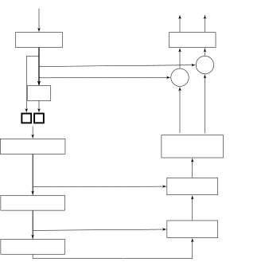
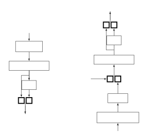
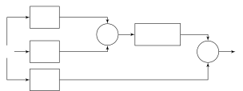

# Channel-Attention Dense U-Net for Multichannel Speech Enhancement

Bahareh Tolooshams    Ritwik Giri    Andrew H. Song    Umut Isik   
Arvindh Krishnaswamy

###### Abstract

Supervised deep learning has gained significant attention for speech
enhancement recently. The state-of-the-art deep learning methods perform
the task by learning a ratio/binary mask that is applied to the mixture
in the time-frequency domain to produce the clean speech. Despite the
great performance in the single-channel setting, these frameworks lag in
performance in the multichannel setting as the majority of these methods
a) fail to exploit the available spatial information fully, and b) still
treat the deep architecture as a black box which may not be well-suited
for multichannel audio processing. This paper addresses these drawbacks,
a) by utilizing complex ratio masking instead of masking on the
magnitude of the spectrogram, and more importantly, b) by introducing a
channel-attention mechanism inside the deep architecture to mimic
beamforming. We propose Channel-Attention Dense U-Net, in which we apply
the channel-attention unit recursively on feature maps at every layer of
the network, enabling the network to perform _non-linear_ beamforming.
We demonstrate the superior performance of the network against the
state-of-the-art approaches on the CHiME-3 dataset.

###### Index Terms: 

Channel-Attention, U-Net, Complex Ratio Masking, Multichannel Speech
Enhancement.

^(†)^(†)address: ¹School of Engineering and Applied Sciences, Harvard
University, Cambridge, MA  
²Amazon Web Services, Palo Alto, CA  
³Massachusetts Institute of Technology, Cambridge, MA^(†)^(†) This work
was done while B. Tolooshams and A. H. Song were interns at Amazon Web
Services.

## 1 Introduction

Multichannel speech enhancement is the problem of obtaining a clean
speech estimate from multiple channels of noisy mixture recordings.
Traditionally, beamforming techniques have been employed, where a linear
spatial filter is estimated, per frequency, to boost the signal from the
desired target direction while attenuating the interferences from other
directions by utilizing second-order statistics, e.g., spatial
covariance of speech and noise \[1\].

In recent years, deep learning (DL) based supervised speech enhancement
techniques have achieved significant success \[2\], specifically for
monaural/single-channel case. Motivated by this success, a recent line
of work proposes to combine supervised single-channel techniques with
unsupervised beamforming methods for multichannel case \[3, 4\]. These
approaches are broadly known as neural beamforming, where a neural
network estimates the second-order statistics of speech and noise, using
estimated time-frequency (TF) masks, after which the beamformer is
applied to linearly combine the multichannel mixture to produce clean
speech. However, the performance of neural beamforming is limited by the
nature of beamforming, a linear spatial filter per frequency bin.

Another line of work \[5, 6\] proposes to use spatial features along
with spectral information to estimate TF masks. Most of these approaches
have an explicit step to extract spatial features such as interchannel
time/phase/level difference (ITD/IPD/ILD). Recent work \[7\]
automatically extracts phase information from the input mixture by
incorporating IPD as a block inside the neural network. \[8\] takes a
more general approach to predict the TF mask by directly feeding
magnitude and phase of the complex spectrogram from all microphones to a
convolutional neural network (CNN). Despite incorporating spatial
information, these methods still focus on predicting a real mask, hence
resort to using the noisy phase, and ignore phase-enhancement.

To overcome the aforementioned limitations, this paper proposes an
end-to-end neural architecture for multichannel speech enhancement,
which we call Channel-Attention Dense U-Net. The distinguishing feature
of the proposed framework is a Channel-Attention (CA) mechanism inspired
by beamforming. CA is motivated by the self-attention mechanism, which
captures global dependencies within the data. Self-attention has been
previously used in various fields \[9, 10, 11\], as well as speech
enhancement in the single-channel setting \[12\]. This paper
incorporates CA into a CNN to guide the network to decide, at every
layer, which feature maps to pay the most attention to. This work,
therefore, extends the idea of beamforming on the input space to a
latent space.

In addition to the CA units, the network is a variation of U-Net \[13\],
a popular architecture for source separation, and DenseNet \[14\].
Motivated by the success of complex ratio masking in the single-channel
case \[15\], our approach takes both real and imaginary part of the
complex mixture short-time Fourier transform (STFT) and estimates a
complex ratio mask (CRM) unlike in \[6, 16\]. The CRM is then applied to
the mixture STFT to obtain the clean speech. Channel-Attention Dense
U-Net does not require an explicit spatial feature extraction step;
instead it implicitly identifies and exploits the relevant spatial
information.

Rest of the paper is organized as follows: Section 2 introduces the
proposed network, Channel-Attention Dense U-Net, and discusses mechanism
of CA in detail. Section 3 describes the dataset, network parameters,
and evaluation criteria. This is followed by Section 4, in which we
demonstrate the outperformance of our network against state-of-the-art
methods. Finally, Section 5 concludes the paper and discusses some
future directions of this work.

## 2 Channel-Attention Dense U-Net

### 2.1 Problem Description

Let $`\mathbf{y}^{c}\in{\mathbb{R}}^{N}`$ be the discrete-time signal of
a noisy mixture at microphone $`c`$. We assume that
$`\{\mathbf{y}^{c}\}_{c=1}^{C}`$, for $`c=1,\ldots,C`$ and
$`n=1,\ldots,N`$, follows the generative model

```math
\mathbf{y}^{c}[n]=\mathbf{s}^{c}[n]+\mathbf{n}^{c}[n], \tag{1}
```

where $`\mathbf{s}^{c}[n]`$ and $`\mathbf{n}^{c}[n]`$ represent the
clean speech and noise recorded at channel $`c`$, at time $`n`$,
respectively. The goal of speech enhancement is to estimate
$`\hat{\mathbf{s}}^{\text{ref}}`$, where $`\text{ref}\in\{1,\ldots,C\}`$
denotes a reference channel from the multichannel mixtures
$`\{\mathbf{y}^{c}\}_{c=1}^{C}`$. We also denote
$`\mathbf{Y}^{c}\in\mathbb{C}^{F\times T}`$ as the STFT of
$`\mathbf{y}^{c}`$, where $`F`$ and $`T`$ are the number of frequency
bins and time frames, respectively, and
$`\mathbf{Y}=[\mathbf{Y}^{1},\ldots,\mathbf{Y}^{C}]\in\mathbb{C}^{F\times T\times C}`$
as multichannel STFT.

Let
$`\mathbf{Y}_{f}=[\mathbf{Y}^{1}_{f},\ldots,\mathbf{Y}^{C}_{f}]\in\mathbb{C}^{T\times C}`$
be the multichannel STFT at frequency bin $`f`$, the traditional
beamformers, such as the popular MVDR beamformer, _linearly_ combine
$`\{\mathbf{Y}_{f}^{c}\}_{c=1}^{C}`$ with the estimated beamforming
weights $`\hat{\mathbf{w}}_{f}\in\mathbb{C}^{C}`$, to produce the
estimated clean speech $`\hat{\mathbf{S}}_{f}`$ at each frequency $`f`$
(e.i.,
$`\hat{\mathbf{S}}_{f}=\mathbf{Y}_{f}\hat{\mathbf{w}}_{f}^{\text{H}}\in\mathbb{C}^{T}`$).
As will be made clearer in subsequent sections, our proposed framework
applies attention weights, i.e., a weight matrix similar to beamforming
weights, recursively to the multichannel input and feature maps,
extending the beamforming analogy to a _non-linear_ combination.

### 2.2 Framework Overview

Channel-Attention Dense U-Net consists of an encoder, a mask estimation
network, and a decoder. The encoder performs STFT on the mixture
$`\{\mathbf{y}^{c}\}_{c=1}^{C}`$ to produce $`\mathbf{Y}`$. Given
$`\mathbf{Y}`$, the mask estimation network computes both the speech
mask $`\mathbf{M}`$ and noise mask $`\mathbf{M}^{\text{noise}}`$, which
are multiplied to input, to obtain the clean speech estimate
$`\hat{\mathbf{S}}\in\mathbb{C}^{F\times T\times C}`$ and the noise
estimate $`\hat{\mathbf{N}}\in\mathbb{C}^{F\times T\times C}`$. Finally,
the decoder performs inverse-STFT on $`\hat{\mathbf{S}}`$ and
$`\hat{\mathbf{N}}`$ to produce time-domain estimates of the speech
$`\hat{\mathbf{s}}\in{\mathbb{R}}^{N\times C}`$ and the noise
$`\hat{\mathbf{n}}\in{\mathbb{R}}^{N\times C}`$.

We now expand on how the outputs of the network, $`\hat{\mathbf{S}}`$
and $`\hat{\mathbf{N}}`$, are computed from $`\mathbf{Y}`$. Stacking the
real and imaginary components
$`\mathbf{Y}_{\text{stack}}=[\mathbf{Y}_{r},\mathbf{Y}_{i}]`$ where
subscript $`r`$ and $`i`$ denote real and imaginary parts, respectively,
the mask estimation network aims to estimate a mask
$`\mathbf{M}_{\text{stack}}=[\mathbf{M}_{r},\mathbf{M}_{i}]\in[{\mathbb{R}}^{F\times T\times C},{\mathbb{R}}^{F\times T\times C}]`$.
The complex multiplication between $`\mathbf{Y}`$ and $`\mathbf{M}`$
produces estimated speech
$`\hat{\mathbf{S}}\in\mathbb{C}^{F\times T\times C}`$ \[16, 8\]. Hence,
$`\mathbf{M}`$ can be considered as the CRM for speech. Given
$`\mathbf{M}_{\text{stack}}`$, the noise mask
$`\mathbf{M}^{\text{noise}}_{\text{stack}}`$ is computed for the
estimate of the noise $`\hat{\mathbf{N}}`$ as follows:

```math
\displaystyle\mathbf{M}_{r}^{\text{noise}} \displaystyle=1-\mathbf{M}_{r},\qquad\quad\mathbf{M}_{i}^{\text{noise}}=-\mathbf{M}_{i}. \tag{2}
```

The clean speech $`\hat{\mathbf{S}}`$ and noise $`\hat{\mathbf{N}}`$ are
estimated by the element-wise complex multiplication (denoted as
$`\ast`$)

```math
\displaystyle\hat{\mathbf{S}} \displaystyle=\mathbf{Y}*\mathbf{M},\qquad\quad\hat{\mathbf{N}}=\mathbf{Y}*\mathbf{M}^{\text{noise}}. \tag{3}
```

To train the network, we minimize the weighted $`\ell_{1}`$ loss of the
audio in time domain and the magnitude of its spectrogram as follows:

```math
\mathcal{L}(\mathbf{u},\hat{\mathbf{u}})=\sum_{u\in\{\mathbf{s},\mathbf{n}\}}\alpha\|\mathbf{u}-\hat{\mathbf{u}}\|_{1}+\big\lVert|\mathbf{U}|-|\hat{\mathbf{U}}|\big\rVert_{1},\vskip-5.0pt \tag{4}
```

where $`\alpha`$ is determined based on the relative importance of the
two error terms. The framework is trained in a supervised manner,
requiring ground truth speech and noise signals \[2\].

### 2.3 Network Architecture

The mask estimation network is a variant of U-Net that consists of a
series of blocks. The first block is a single unit of CA to perform
beamforming-like operation on the input mixture, and the last block is a
convolutional layer with ReLU non-linearity to generate the mask. We
explain the middle blocks for the rest of this section.

We note that the real version of Channel-Attention Dense U-Net takes the
magnitude of the STFT as its input, and estimates a real mask \[16\].
This implies that the denoising of the noisy mixture is performed only
with respect to the magnitude, hence the estimated clean speech contains
phase of the noisy mixture.



Figure 1: Architecture of Channel-Attention Dense U-Net for $`L=2`$.

#### 2.3.1 U-Net with DenseNet Blocks

U-Net, a convolutional network previously proposed for image
segmentation, is a popular network for source separation \[17\] and
speech enhancement \[18\]. U-Net consists of a series of blocks ($`L`$
down-blocks and $`L`$ up-blocks), and skip-connections between down and
up-blocks. Each down-block consists of a pooling layer for
down-sampling, a convolutional layer, and an exponential non-linearity.
Each up-block consists of an up-sampling through a transposed
convolution with stride 2, a transposed convolutional layer, and an
exponential non-linearity.

In Channel-Attention Dense U-Net, each convolutional layer in each block
is replaced by a DenseNet block followed by a CA unit. The output of
each down-block or up-block is the concatenation of the input and output
of its CA unit. DenseNet applies convolution to the concatenation of
several previous-layer feature maps, which eases the gradient flow in
deep networks and helps each layer learn features that are not similar
to the neighbouring layers \[19\]. Figure 1 shows the architecture of
Channel-Attention Dense U-Net for when $`L=2`$, and Figure 2 shows the
detail of down and up blocks.



Figure 2: (a) Down Block, (b) Up Block. The skip connection is the
output from the corresponding down-block.

#### 2.3.2 Channel-Attention

In this section, we introduce the Channel-Attention unit inspired by
self-attention and beamforming. Self-attention is a mechanism for
capturing global dependencies, which has gained attention in various
fields such as machine translation \[9\], natural language
processing \[10\], and image processing \[11\].

Given input
$`\mathbf{x}\in{\mathbb{R}}^{\widetilde{F}\times\widetilde{T}\times 2\widetilde{C}}`$,
which is also the output of the DenseNet in mid blocks, our proposed CA
unit transforms $`\mathbf{x}`$ into key
$`\mathbf{k}(\mathbf{x})\in{\mathbb{R}}^{\widetilde{F}\times d\times 2\widetilde{C}}`$,
query
$`\mathbf{q}(\mathbf{x})\in{\mathbb{R}}^{\widetilde{F}\times d\times 2\widetilde{C}}`$,
and value
$`\mathbf{v}(\mathbf{x})\in{\mathbb{R}}^{\widetilde{F}\times\widetilde{T}\times 2\widetilde{C}}`$
feature maps through a convolution followed by an exponential
non-linearity. Note that we use $`\widetilde{(\cdot)}`$ to indicate that
due to down/up-sampling layer in each block, the dimensions of the input
are different for CA unit at different blocks. The $`\mathbf{k}`$,
$`\mathbf{q}`$, and $`\mathbf{v}`$ are $`1\times 1`$ convolutional
operators in the 2-dimensional space of
$`\widetilde{F}\times 2\widetilde{C}`$ with $`\widetilde{T}`$ input
channels and $`d`$, $`d`$, and $`\widetilde{T}`$ output channels,
respectively, followed by an exponential non-linearity.

We treat the key, query, and value as stack of real and imaginary where
the first $`\widetilde{C}`$ channels are real and the second
$`\widetilde{C}`$ channels are imaginary. For a given frequency bin
$`f`$, we define the key and query as
$`\mathbf{k}_{f}(\mathbf{x})\in\mathbb{C}^{d\times\widetilde{C}}`$ and
$`\mathbf{q}_{f}(\mathbf{x})\in\mathbb{C}^{d\times\widetilde{C}}`$. The
CA mechanism computes the similarity matrix,
$`\mathbf{P}=[\mathbf{P}_{1},\ldots,\mathbf{P}_{\widetilde{F}}]\in\mathbb{C}^{\widetilde{F}\times\widetilde{C}\times\widetilde{C}}`$
between key and query for every frequency bin as follows:

```math
\mathbf{P}_{f}=\mathbf{k}_{f}(\mathbf{x})^{\text{T}}\mathbf{q}_{f}(\mathbf{x})\in\mathbb{C}^{\widetilde{C}\times\widetilde{C}},\ \textrm{for }f=1,\ldots,\widetilde{F}.\\
 \tag{5}
```

Having
$`\mathbf{k}_{f}(\mathbf{x})=[\mathbf{k}_{f1},\ldots,\mathbf{k}_{f\widetilde{C}}]`$
and
$`\mathbf{q}_{f}(\mathbf{x})=[\mathbf{q}_{f1},\ldots,\mathbf{q}_{f\widetilde{C}}]`$,
for $`f=1,\ldots,\widetilde{F}`$, the similarity matrix is,

```math
\mathbf{P}_{f}=\mathbf{k}_{f}^{\text{T}}\mathbf{q}_{f}=\begin{bmatrix}\mathbf{k}_{f1}^{\text{T}}\mathbf{q}_{f1}&\ldots&\mathbf{k}_{f1}^{\text{T}}\mathbf{q}_{f\widetilde{C}}\\
\mathbf{k}_{f2}^{\text{T}}\mathbf{q}_{f1}&\ldots&\mathbf{k}_{f2}^{\text{T}}\mathbf{q}_{f\widetilde{C}}\\
\vdots&\ldots&\vdots\\
\mathbf{k}_{f\widetilde{C}}^{\text{T}}\mathbf{q}_{f1}&\ldots&\mathbf{k}_{f\widetilde{C}}^{\text{T}}\mathbf{q}_{f\widetilde{C}}\\
\end{bmatrix}.\\
 \tag{6}
```

The attention weights matrix
$`\mathbf{W}\in\mathbb{C}^{\widetilde{F}\times\widetilde{C}\times\widetilde{C}}`$
is normalized (by softmax function) $`\mathbf{P}`$ with respect to the
second dimension. The weight matrix entry is thus given as

```math
|w_{f,c,c^{\prime}}|=\frac{\mathbf{e}^{|p_{f,c,c^{\prime}}|}}{\sum_{c=1}^{\widetilde{C}}\mathbf{e}^{|p_{f,c,c^{\prime}}|}},\qquad\angle w_{f,c,c^{\prime}}=\angle p_{f,c,c^{\prime}}, \tag{7}
```

$`\textrm{for }f=1,\ldots,F,\textrm{and }c,c^{\prime}=1,\ldots,\widetilde{C}`$.
The output of the attention unit for frequency $`f`$ is the
concatenation of the real and imaginary parts of $`\textbf{o}_{f}`$
computed as follows:

```math
\textbf{o}_{f}=\mathbf{v}_{f}(\mathbf{x})\mathbf{W}_{f}\in\mathbb{C}^{\widetilde{T}\times\widetilde{C}}, \tag{8}
```

where
$`\mathbf{v}_{f}(\mathbf{x})\in\mathbb{C}^{\widetilde{T}\times\widetilde{C}}`$,
and $`\mathbf{W}_{f}\in\mathbb{C}^{\widetilde{C}\times\widetilde{C}}`$.
For real-valued input, multiplication and similarity operations happen
in real domain. Figure 3 shows the detailed architecture of CA.



Figure 3: CA unit. Given input $`\mathbf{x}`$, CA computes the attention
mask $`\mathbf{W}`$ and apply it to value, a variant of the input.

### 2.4 Connection of Channel-Attention to Beamforming

The motivation for incorporating the CA concept into our framework is
two-fold. First, inspired by the traditional beamformers which linearly
combine multichannel mixtures to produce a clean signal estimate, we
expect the trained CA unit to learn to ‘optimally’ combine multichannel
information to produce a clean speech signal. Specifically, the fact
that a CA unit is applied to features maps at every layer, and that
nonlinearity layers exist throughout the architecture suggests that this
combination is not confined to the linear regime.

In Eq. (6), each column $`c`$ resembles beamforming weights as if
channel $`c`$ is chosen as reference. Therefore, in Eq. (8),
$`\mathbf{v}_{f}(\mathbf{x})`$ can be seen as a variant of the input
signal to CA, and $`\mathbf{W}_{f}`$ decides which channel of
$`\mathbf{v}_{f}(\mathbf{x})`$ to pay more attention to. Indeed, our
proposed CA can be seen as a mechanism to automatically pick a reference
channel and perform beamforming. Interestingly, we observe that the
attention weights in a trained model learn to represent the
signal-to-noise-ratio (SNR) (importance) of each feature map.

We verified this behaviour by examining the weights of the trained CA
unit $`\mathbf{W}`$, located right after the encoder, from the trained
CA unit of real Channel-Attention Dense U-Net for the following two
input scenarios: 1) a noisy mixture from the CHiME-3 dataset \[20\] and 2) a toy example with the simulated input where channel 1 has the
highest SNR among all channels. We chose to examine the real network
instead of the complex network, for easier interpretation and
visualization.


Figure 4: (a) $`\mathbf{W}`$ from the CHiME-3 dataset (b) $`\mathbf{W}`$
from the SNR example.

Figure 4(a) shows the
$`[\mathbf{W}_{F\times C\times 1},\ldots,\mathbf{W}_{F\times C\times C}]`$
for the CHiME-3 data example, where we observe that channel $`5`$ has
received the most attention. This matches with the fact that channel
$`4`$ and $`5`$ of CHiME-3 recordings have the highest SNR on average.
Another interesting observation is that CA learns to pay more attention
to low frequencies, which are known to contain the majority of the
speech information.

Figure 4(b) demonstrates the similar results for a toy example. In this
case, we clearly observe that channel $`1`$, the channel with the
highest SNR, gets the most attention.

## 3 Experiments

### 3.1 Dataset

We used the publicly available CHiME-3 dataset \[20\], made available as
part of a speech separation and recognition challenge, for training and
evaluating speech enhancement performance. The dataset is a
$`6`$-channel ($`C=6`$) microphone recording of talkers speaking in a
noisy environment, sampled at $`16`$ kHz. It consists of $`7{,}138`$,
$`1{,}640`$, and $`1{,}320`$ simulated utterances with an average length
of $`{3}`$ s for training, development, and test, respectively. At every
iteration of training, a random segment of length $`N=19{,}200`$ is
selected from the utterance, and a random attenuation of the background
noise in the range of $`{[-20,0]}\text{ dB}`$ is applied as a data
augmentation scheme. This augmentation was done to make the network
robust against various SNRs.

### 3.2 Training and Network Parameters

The encoder and decoder are initialized with STFT and Inverse-STFT
coefficients, respectively, using a Hanning window of length
$`1{,}024`$, hence $`F=512`$ (we discard the last bin, since, for the
downsampling step of the network, the number of frequency bins needs to
be even), and hop size of $`{256}`$. Consequently, the number of time
frames for each input is $`T=80`$. We design the network to have $`4`$
down-blocks and $`4`$ up-blocks $`(L=4)`$ where the kernel size for all
convolutions is $`2\times 2`$. The number of convolutional filters in
the first layer is set to $`{32}`$, with a maximum of $`256`$ possible
number of filters at every convolution. For all the CA units inside the
network, we set the depth of query and key to $`d={20}`$.

The network is trained with ADAM optimizer with learning rate of
$`{10^{-4}}`$, and batch size of $`8`$. For the loss function (Eq. (4)),
we set $`\alpha`$ such that the error in time domain,
$`\|\mathbf{u}-\hat{\mathbf{u}}\|_{1}`$, is twice as important as the
error in the magnitude of the spectrogram,
$`\big\lVert|\mathbf{U}|-|\hat{\mathbf{U}}|\big\rVert_{1}`$. This is
done based on loss magnitude at the beginning of training.

### 3.3 Evaluation

We evaluated the network performance with the following metrics:
signal-to-distortion ratio (SDR) using BSS Eval library \[21\] and
Perceptual Evaluation of Speech Quality (PESQ) - more specifically the
wideband version recommended in ITU-T P.862.2 (–0.5 to 4.5).

Given the source estimates $`\hat{\mathbf{s}}`$ from all $`C`$ channels
at the output, we computed the posterior SNR for each channel and
selected the channel with the highest posterior SNR as the final
estimate.

## 4 Results

We trained four networks as follows:

- •
  U-Net (Real): U-Net without any dense blocks, which performs magnitude
  ratio masking.
- •
  Dense U-Net (Real): U-Net (Real) with dense blocks ($`D`$$`=`$$`4`$).
- •
  Dense U-Net (Complex): U-Net with dense blocks ($`D`$$`=`$$`4`$),
  which takes real and imaginary part of STFT as input and performs
  complex ratio masking.
- •
  CA Dense U-Net (Complex): Dense U-Net (Complex) with
  Channel-Attention.

|                          | sim-dev |       | sim-test |       |
| ------------------------ | ------- | ----- | -------- | ----- |
| Methods                  | SDR     | PESQ  | SDR      | PESQ  |
| Channel-5 (Noisy)        | 5.79    | 1.27  | 6.50     | 1.27  |
| U-Net (Real)             | 14.651  | 2.105 | 15.967   | 2.176 |
| Dense U-Net (Real)       | 14.901  | 2.242 | 16.855   | 2.378 |
| Dense U-Net (Complex)    | 16.962  | 2.33  | 18.402   | 2.404 |
| CA Dense U-Net (Complex) | 17.169  | 2.368 | 18.635   | 2.436 |

Table 1: Performance of trained networks on CHiME-3 dataset.

|                     | sim-dev |                | sim-test |                |
| ------------------- | ------- | -------------- | -------- | -------------- |
| Methods             | SDR     | $`\Delta`$PESQ | SDR      | $`\Delta`$PESQ |
| NMF B \[22\]        | \-      | \-             | 16.16    | 0.52           |
| Forgetting F \[23\] | 16.07   | \-             | \-       | \-             |
| Neural B \[3\]      | 15.80   | 0.92           | 15.12    | 1.02           |
| CA Dense U-Net      | 17.169  | 1.09           | 18.635   | 1.16           |

Table 2: Performance comparison of Channel-Attention Dense U-Net with
state-of-the-art results on CHiME 3.

Table 1 demonstrates the improvement in the performance of the network,
as we add a new component to the architecture, such as dense-blocks,
complex ratio masking scheme, and finally, the Channel-Attention. We
note that for U-Net (Real), and Dense U-Net (Real), the only spatial
information network has access to is ILD, the level difference between
the channel. Hence the performance improvement from Dense U-Net (Real)
to Dense U-Net (Complex) is primarily for two reasons: a) access to IPD
information, and b) complex ratio masking instead of magnitude ratio
masking. Finally, we observe that Channel-Attention improves the
performance of Dense U-Net (Complex) further.

We compare the performance of our method to the following three
state-of-the-art methods on CHiME-3 dataset:

- •
  Neural Beamforming \[3\]: An MVDR beamforming with mask estimation
  through bidirectional-LSTM.
- •
  NMF-Informed Beamforming \[22\]: An online MVDR beamforming through
  the decomposition of TF bins of the mixture into the sum of speech and
  noise, by performing non-negative matrix factorization (NMF).
- •
  Forgetting Factor Optimization \[23\]: An MVDR beamforming with
  simultaneous estimation of TF masks and forgetting factors.

Table 2 shows the results where $`\Delta`$PESQ represents PESQ
improvement with respect to the channel 5 of the noisy mixtures (row 1
in Table 1). Results for the competing methods are taken from the
corresponding papers and the missing entries in the table indicate that
the metric is not reported in the reference paper. Overall, our proposed
approach significantly outperforms state-of-the-art results on the
CHiME-3 speech enhancement task.

## 5 Conclusion

This paper proposed a channel-attention mechanism inspired by
beamforming for speech enhancement of multichannel recordings. The paper
combined time-frequency masking \[16\], UNet \[13\], and DenseNet \[14\]
into a unified network along with channel-attention mechanism. Our
interpretation of the channel-attention mechanism is that the network
performs recursive _non-linear_ beamforming on the data represented in a
latent space. We showed that the proposed network outperforms all the
published state-of-the-art algorithms on the CHiME-3 dataset.

## References

- \[1\] Jacob Benesty, Jingdong Chen, and Yiteng Huang, Microphone array
  signal processing, vol. 1, Springer Science & Business Media, 2008.
- \[2\] DeLiang Wang and Jitong Chen, “Supervised speech separation
  based on deep learning: An overview,” IEEE/ACM Transactions on Audio,
  Speech, and Language Processing, vol. 26, no. 10, pp. 1702–1726, 2018.
- \[3\] H. Erdogan, J. Hershey, S. Watanabe, M. Mandel, and J. Le Roux,
  “Improved mvdr beamforming using single-channel mask prediction
  networks,” Nuclear Physics A, vol. 08-12-September-2016, pp.
  1981–1985, 2016.
- \[4\] Jahn Heymann, Lukas Drude, and Reinhold Haeb-Umbach, “Neural
  network based spectral mask estimation for acoustic beamforming,” in
  2016 IEEE International Conference on Acoustics, Speech and Signal
  Processing (ICASSP). IEEE, 2016, pp. 196–200.
- \[5\] Zhong-Qiu Wang and DeLiang Wang, “Combining spectral and spatial
  features for deep learning based blind speaker separation,” IEEE/ACM
  Transactions on Audio, Speech, and Language Processing, vol. 27, no.
  2, pp. 457–468, 2018.
- \[6\] Zhong-Qiu Wang, Jonathan Le Roux, and John R Hershey,
  “Multi-channel deep clustering: Discriminative spectral and spatial
  embeddings for speaker-independent speech separation,” in 2018 IEEE
  International Conference on Acoustics, Speech and Signal Processing
  (ICASSP). IEEE, 2018, pp. 1–5.
- \[7\] R. Gu, J. Wu, S. Zhang, L. Chen, Y. Xu, M. Yu, D. Su, Y. Zou,
  and D. Yu, “End-to-end multi-channel speech separation,” arXiv
  preprint arXiv:1905.06286, 2019.
- \[8\] S. Chakrabarty, D. Wang, and E. A. P. Habets, “Time-frequency
  masking based online speech enhancement with multi-channel data using
  convolutional neural networks,” in 16th International Workshop on
  Acoustic Signal Enhancement, Sep. 2018, pp. 476–480.
- \[9\] D. Bahdanau, K. Cho, and Y. Bengio, “Neural machine translation
  by jointly learning to align and translate,” arXiv preprint
  arXiv:1409.0473, 2014.
- \[10\] A. Parikh, O. Täckström, D. Das, and J. Uszkoreit, “A
  decomposable attention model for natural language inference,” in Proc.
  of the 2016 Conference on Empirical Methods in Natural Language
  Processing, Austin, Texas, Nov. 2016, pp. 2249–2255, Association for
  Computational Linguistics.
- \[11\] H. Zhang, I. Goodfellow, D. Metaxas, and A. Odena,
  “Self-attention generative adversarial networks,” arXiv preprint
  arXiv:1805.08318, 2018.
- \[12\] Ritwik Giri, Umut Isik, and Arvindh Krishnaswamy, “Attention
  wave-u-net for speech enhancement,” in Proc. of IEEE Workshop on
  Applications of Signal Processing to Audio and Acoustics, 2019.
- \[13\] O. Ronneberger, P. Fischer, and T. Brox, “U-net: Convolutional
  networks for biomedical image segmentation,” in Medical Image
  Computing and Computer-Assisted Intervention – MICCAI 2015, Cham,
  2015, pp. 234–241, Springer International Publishing.
- \[14\] G. Huang, Z. Liu, L. v. d. Maaten, and K. Q. Weinberger,
  “Densely connected convolutional networks,” in 2017 IEEE Conference on
  Computer Vision and Pattern Recognition (CVPR), July 2017, pp.
  2261–2269.
- \[15\] D. S. Williamson, Y. Wang, and D. Wang, “Complex ratio masking
  for monaural speech separation,” IEEE/ACM Transactions on Audio,
  Speech, and Language Processing, vol. 24, no. 3, pp. 483–492, 2016.
- \[16\] X. Li and R. Horaud, “Multichannel Speech Enhancement Based on
  Time-frequency Masking Using Subband Long Short-Term Memory,” in in
  Proc. of 2019 IEEE Workshop on Applications of Signal Processing to
  Audio and Acoustics (WASPAA), New Paltz, NY, United States, Oct. 2019.
- \[17\] D. Stoller, S. Ewert, and S. Dixon, “Wave-u-net: A multi-scale
  neural network for end-to-end audio source separation,” in Proc. of
  IEEE International Conference on Acoustics, Speech, and Signal
  Processing (ICASSP), 2018, pp. 2391–2395.
- \[18\] H. Choi, J. Kim, J. Huh, A. Kim, J. Ha, and K. Lee,
  “Phase-aware speech enhancement with deep complex u-net,” in Proc. of
  International Conference on Learning Representations, 2019.
- \[19\] Naoya Takahashi and Yuki Mitsufuji, “Multi-scale multi-band
  densenets for audio source separation,” in 2017 IEEE Workshop on
  Applications of Signal Processing to Audio and Acoustics (WASPAA).
  IEEE, 2017, pp. 21–25.
- \[20\] J. Barker, R. Marxer, E. Vincent, and S. Watanabe, “The third
  ?chime? speech separation and recognition challenge: Dataset, task and
  baselines,” in 2015 IEEE Workshop on Automatic Speech Recognition and
  Understanding (ASRU), Dec 2015, pp. 504–511.
- \[21\] E. Vincent, R. Gribonval, and C. Févotte, “Performance
  measurement in blind audio source separation,” IEEE transactions on
  audio, speech, and language processing, vol. 14, no. 4, pp.
  1462–1469, 2006.
- \[22\] K. Shimada, Y. Bando, M. Mimura, K. Itoyama, K. Yoshii, and
  T. Kawahara, “Unsupervised speech enhancement based on multichannel
  nmf-informed beamforming for noise-robust automatic speech
  recognition,” IEEE/ACM Trans. Audio, Speech and Lang. Proc., vol. 27,
  no. 5, pp. 960–971, May 2019.
- \[23\] M. Togami, “Simultaneous optimization of forgetting factor and
  time-frequency mask for block online multi-channel speech
  enhancement,” in ICASSP 2019 - 2019 IEEE International Conference on
  Acoustics, Speech and Signal Processing (ICASSP), May 2019, pp.
  2702–2706.
