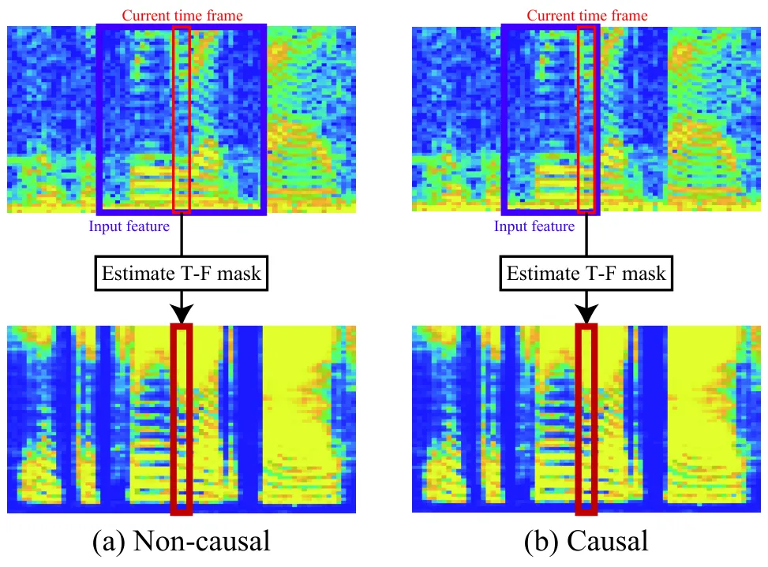

# Real-time speech enhancement using equilibriated RNN

Daiki Takeuchi^(†)    Kohei Yatabe^(†)    Yuma Koizumi    Yasuhiro
Oikawa^(†)    Noboru Harada

###### Abstract

We propose a speech enhancement method using a causal deep neural
network (DNN) for real-time applications. DNN has been widely used for
estimating a time-frequency (T-F) mask which enhances a speech signal.
One popular DNN structure for that is a recurrent neural network (RNN)
owing to its capability of effectively modelling time-sequential data
like speech. In particular, the long short-term memory (LSTM) is often
used to alleviate the vanishing/exploding gradient problem which makes
the training of an RNN difficult. However, the number of parameters of
LSTM is increased as the price of mitigating the difficulty of training,
which requires more computational resources. For real-time speech
enhancement, it is preferable to use a smaller network without losing
the performance. In this paper, we propose to use the equilibriated
recurrent neural network (ERNN) for avoiding the vanishing/exploding
gradient problem without increasing the number of parameters. The
proposed structure is causal, which requires only the information from
the past, in order to apply it in real-time. Compared to the uni- and
bi-directional LSTM networks, the proposed method achieved the similar
performance with much fewer parameters.

###### Index Terms: 

Real-time speech enhancement, equiribriated recurrent neural network,
vanishing/exploding gradient problem.

^(†)^(†)address: ^(†)Department of Intermedia Art and Science, Waseda
University, Tokyo, Japan  
^(‡)NTT Media Intelligence Laboratories, Tokyo, Japan

## 1 Introduction

Speech enhancement is used for recovering the target speech from a noisy
observed signal. In the single-channel case, the standard method is
time-frequency (T-F) masking in the short-time Fourier transform (STFT)
domain. Recently, speech enhancement is advanced by the use of a deep
neural network (DNN) to estimate a T-F mask. For effectively modelling a
speech signal which is time-sequential data, a recurrent neural
network (RNN) is used in various speech signal processing applications
\[1, 2, 3, 4, 5, 6, 7, 8, 9, 10, 11, 12, 13, 14\].

While it has been effectively applied to speech enhancement, RNN is
difficult to train in general because the gradient of RNN vanishes or
explodes at an exponential rate by performing back-propagation to the
same layer repeatedly. This difficulty of training RNN is so-called the
vanishing/exploding gradient problem \[15\], and several methods have
been proposed to solve it \[16, 17, 18\]. One of the popular DNN
structures to mitigate this problem is the long short-term memory (LSTM)
\[18\] illustrated in Fig. 1(a). By combining three gated units (input
gate, forget gate and output gate), LSTM solves the vanishing gradient
problem to some extent. As it can be trained effectively in practice,
LSTM and the bidirectional LSTM (BLSTM) has been applied to speech
enhancement and performed better than the conventional methods at the
time \[2, 4, 8, 9, 10, 11, 12, 13, 14\].

Considering a practical situation in the real world, some research on
DNN-based speech enhancement has focused on real-time application \[19,
20, 21, 22, 23\]. To apply an enhancement method in real time, the
system must be causal, i.e., it uses past information only and does not
require future information to estimate the enhanced signal. Therefore,
uni-directional LSTM are often used in that task \[19, 20, 21, 22\].
However, as the price of mitigating the vanishing gradient problem, LSTM
consists of a lot of parameters as in Fig. 1(a). Since more parameters
require more computational resources, a simpler RNN should be more
suitable for real-time speech enhancement than LSTM if the gradient
problem can be solved in a different way.

Figure 1: Block diagrams of LSTM and ERNN. “FC” stands for
fully-connected layer. The same DNN $`\mathscr{F}`$ is repeatedly
applied in ERNN.

In this paper, we propose a real-time speech enhancement method using a
causal RNN with much fewer parameters compared to LSTM. In the proposed
method, the equilibriated recurrent neural network (ERNN) \[24\] is used
for the T-F mask estimator. ERNN is a simpler RNN as in Fig. 1(b) and
can avoid the vanishing/exploding gradient problem by iteratively
applying the same layer to the hidden state vector. Ideally, the
gradient of ERNN in back-propagation does not vanish or explode \[24\],
and therefore long-term dependencies in the sequential data can be
learned without the gated units as in LSTM. As a result, the number of
parameters of ERNN can be noticeably decreased while maintaining the
speech enhancement performance. The experimental results confirmed that
the proposed method can reduce the number of parameters to less than
$`1/5`$ times that of the LSTM network without sacrificing the
performance.

## 2 DNN-based speech enhancement

This paper focuses on T-F masking for speech enhancement. In this
section, after introducing DNN-based T-F masking and RNN briefly,
real-time speech enhancement is explained.

### 2.1 Time-frequency masking based on DNN

The aim of speech enhancement is to recover the target speech signal
$`s_{t}`$ degraded by noise $`n_{t}`$ from an observed signal $`x_{t}`$,

```math
x_{t}=s_{t}+n_{t}, \tag{1}
```

where $`t`$ is the time index. It can be rewritten in T-F domain as

```math
X_{\omega,\tau}=S_{\omega,\tau}+N_{\omega,\tau}, \tag{2}
```

where $`X`$ is the T-F representation of $`x`$ (spectrogram obtained by
STFT in this paper), and $`\omega=1,\ldots,\Omega`$ and
$`\tau=1,\ldots,T`$ denote the indices of frequency and time frame,
respectively. In T-F masking, the estimated target signal
$`\hat{S}_{\omega,\tau}`$ is acquired by the element-wise multiplication
of a T-F mask $`G_{\omega,\tau}`$ to the observation
$`X_{\omega,\tau}`$:

```math
\hat{S}_{\omega,\tau}=G_{\omega,\tau}\,X_{\omega,\tau}. \tag{3}
```

Then, the enhanced result is transformed back to the time domain by the
inverse transform. The T-F mask $`G_{\omega,\tau}`$ must be estimated
solely from $`X_{\omega,\tau}`$, which is the difficult part.

Many methods have applied DNN to estimate the T-F mask. In
deep-learning-based approach, a T-F mask $`G_{\omega,\tau}`$ is
estimated as

```math
G_{\omega,\tau}=\mathcal{M}_{\theta}(\Psi)_{\omega,\tau} \tag{4}
```

where $`\mathcal{M}_{\theta}`$ is a regression function implemented by
DNN, $`\theta`$ is the set of its parameters, and $`\Psi=\Psi(X)`$ is
the input acoustic feature. Since the signal is time-sequential data
indexed by $`\tau`$, RNN is often used for realizing the regression
function $`\mathcal{M}_{\theta}`$.

### 2.2 Recurrent neural network (RNN) and LSTM

Among many DNN structures, RNN is a popular network for modelling
time-sequential data including speech. RNN consists of a function
$`\mathscr{F}`$ which output the current hidden state vector
$`h_{\tau}`$ from the past state vector $`h_{\tau-1}`$ and the current
input feature $`\psi_{\tau}`$ as follows:

```math
h_{\tau}=\mathscr{F}(\psi_{\tau},h_{\tau-1}), \tag{5}
```

where the recurrent structure on the state vector $`h_{\tau}`$ enables
to learn the long-term dependencies of time series with fewer parameters
comparing to non-recurrent networks.

Although an RNN can effectively handle information from the past, it may
not perform well in practice because of the difficulty on its training,
the so-called vanishing/exploding gradient problem. When
back-propagation is performed to RNN, the gradient passes through the
same layer repeatedly. Then, by the chain rule, the gradient on the
current state vector $`h_{c}`$ from the past state vector $`h_{p}`$ is
the product of gradients for all intermediate state vectors:

```math
\frac{\partial h_{c}}{\partial h_{p}}=\prod_{r=0}^{c-p-1}\frac{\partial}{\partial h_{c-r-1}}\mathscr{F}(\psi_{c-r},h_{c-r-1}).\vskip-4.0pt \tag{6}
```

Therefore, the back-propagated gradient vanishes or explodes at an
exponential rate unless the norm of each gradient is equal to one, i.e.,
$`\|\partial\mathscr{F}/\partial h_{\tau}\|=1\;\;(p\leq\tau<c)`$. Even
though an RNN has ability to model the long-term dependency, learning it
is difficult because the dependency between the current and past
information is quickly lost as the gradient quickly vanishes.

To mitigate the vanishing or exploding gradient problem of RNN, several
methods have been developed \[16, 17, 18\]. One of the most standard
methods is LSTM \[18\] illustrated in Fig. 1(a). It includes an
additional recurrent loop of the so-called cell state so that the
information from the past is retained unless the forget gate eliminates
it. The magnitude of the gradient of LSTM does not decrease when the
forget gate is open, and thus the vanishing gradient problem is avoided
by assuming that the forgate gate properly select the information. Since
it works well in practice, LSTM plays an important role in the DNN-based
speech enhancement. However, since the gated unit consists of twice as
many parameters than the linear layer, LSTM consists of a lot of
parameters, which requires more computational resources compared to a
simpler RNN.



Figure 2: Illustration of non-causal and causal estimators. While a
non-causal DNN uses future information for estimating the current T-F
mask, a causal DNN requires only past and current information.

### 2.3 Real-time speech enhancement and causal RNN

Some research on DNN-based speech enhancement has focused on the
real-time application for applying it to a practical situation in the
real world \[19, 20, 22, 23\]. To apply an enhancement method in real
time, the system must be causal as illustrated in Fig. 2. In general,
T-F mask $`G`$ at time index $`\tau`$ can be estimated from the input
feature $`\Psi`$ obtained from both past and future,

```math
G_{\tau}=\mathcal{M}_{\theta}(\ldots,\psi_{\tau+1},\psi_{\tau},\psi_{\tau-1},\ldots), \tag{7}
```

as illustrated in Fig. 2(a), where
$`G_{\tau}=[G_{1,\tau},\ldots,G_{\Omega,\tau}]^{\mathsf{T}}`$. However,
such non-causal network cannot be applied in real time because the
information in future $`\psi_{\tau+1},\psi_{\tau+2},\ldots`$ is not
available at the time of estimating $`G_{\tau}`$. It requires some delay
for buffering the input feature until all necessary information is
obtained. For real-time applications, the network must be causal, i.e.,
estimation must be performed based on the past information only:

```math
G_{\tau}=\mathcal{M}_{\theta}(\psi_{\tau},\psi_{\tau-1},\psi_{\tau-2},\ldots). \tag{8}
```

This requirement makes RNN suitable for real-time applications because
the past information can be encoded into the hidden state vector $`h`$
so that only the input feature $`\psi_{\tau}`$ and the state vector
$`h_{\tau-1}`$ are required for estimating the mask at time $`\tau`$ as

```math
G_{\tau}=\mathcal{M}_{\theta}(\psi_{\tau},h_{\tau-1}). \tag{9}
```

Owing to the causality and the advantage on training as explained in the
previous subsection, uni-directional LSTM are often used in real-time
speech enhancement \[19, 20, 22\]. While LSTM performs well in practice,
any causal RNN written in the form of Eq. (9) can be used for real-time
speech enhancement. That is, it should be possible to construct a
computationally cheaper RNN for the real-time application if the
training issue can be solved.

Figure 3: Illustration of DNN $`\mathscr{F}`$ utilized for ERNN in this
paper. “FC” stands for a fully-connected layer, and $`N_{\rm s}`$ and
$`N_{\rm h}`$ are the dimension of the matrix of each fully-connected
layer.

## 3 Proposed method

For real-time speech enhancement, a causal DNN with fewer parameters is
preferred for reducing the computational requirement. Considering such
conditions, we propose a causal DNN-based speech enhancement method
using ERNN illustrated in Fig. 1(b).

### 3.1 Equilibriated recurrent neural network (ERNN)

ERNN is an RNN which avoids the vanishing/exploding gradient problem by
the skip connections and repeated application of the same block \[24\].
It is inspired by the fixed point recursion of the implicit
discretization scheme for an ordinary differential equation. By
introducing an intermediate variable $`\xi^{(k)}`$ with iteration index
$`k=0,\ldots,K-1`$, a simple form of ERNN can be written as

```math
\xi^{(k+1)}=\xi^{(k)}+\eta^{(k)}[\mathscr{F}(\psi_{\tau},\xi^{(k)}+h_{\tau-1})-(\xi^{(k)}+h_{\tau-1})], \tag{10}
```

where $`\eta^{(k)}`$ is a small trainable scalar, $`K`$ is the total
number of iteration, the initial value $`\xi^{(0)}`$ is typically $`0`$,
and the updated state vector $`h_{\tau}`$ is given as the iterated
result $`h_{\tau}=\xi^{(K)}`$, i.e., ERNN returns $`h_{\tau}`$ after
$`K`$ iteration based on the inputs $`\psi_{\tau}`$ and $`h_{\tau-1}`$
as in Eq. (5). Here, $`\mathscr{F}`$ is a nonlinear function implemented
by a neural network, which makes Eq. (10) a multilayer RNN as in
Fig. 1(b).

The notable property of ERNN is that its gradient does not vanish or
explode in the ideal situation \[24\]. That is, the norm of the gradient
is equal to one: $`\|\partial h_{c}/\partial h_{p}\|=1\;\;(p<c)`$.
Therefore, it is expected that ERNN can learn the long-term dependencies
without suffering from the training issue because the gradient survives
in the parameter update for all time instances. This property should
allow us to simplify the network because the gated units used in LSTM
are not necessary anymore for alleviating the difficulty of training. We
experimentally show later in the next section that a simple ERNN with
much fewer parameters can compete with LSTM.

### 3.2 Proposed speech enhancement method using ERNN

We propose a speech enhancement method based on a causal ERNN. The
proposed method estimates the T-F mask for the current time frame
$`G_{\tau}`$ by ERNN whose input is based only on the current input
feature $`\psi_{\tau}`$ and the hidden state vector $`h_{\tau-1}`$ as

```math
G_{\tau}=\sigma(Wh_{\tau}+b),\qquad h_{\tau}=\mathrm{ERNN}_{K}^{\mathscr{F}}\!(\psi_{\tau},h_{\tau-1}), \tag{11}
```

where $`W`$ and $`b`$ are the matrix and bias of the fully-connected
layer, respectively, $`\sigma(\cdot)`$ is the sigmoid function, and
$`\mathrm{ERNN}_{K}^{\mathscr{F}}\!(\cdot,\cdot)`$ is the function
iterating Eq. (10) $`K`$ times from an initial value $`\xi^{(0)}`$ using
the nonlinear function $`\mathscr{F}`$.

Since the expressive power of ERNN is determined by the nonlinear
function $`\mathscr{F}`$, the performance and the degree of
computational requirements can be traded by appropriately designing it.
For real-time applications, we aim to reduce the number of parameters of
the system while maintaining the performance so that the proposed method
can compete with the standard LSTM-based methods. As the first step of
the investigation of the proposed method, we consider a fully-connected
DNN with the ReLU activation as illustrated in Fig. 3 because it is easy
to adjust the number of parameters by changing the size of the
fully-connected layers. As the DNN $`\mathscr{F}`$ is common for all
$`k`$ in the iteration of Eq. (10), the number of parameters is that of
$`\mathscr{F}`$ plus $`K`$ (comes from the scalers
$`\eta^{(0)},\ldots,\eta^{(K-1)}`$). Note that this choice of
$`\mathscr{F}`$ is merely an example, and it should be possible to
design a better network consisting of fewer parameters.

## 4 Experiment

In order to confirm the effectiveness of the proposed method, the
performance of speech enhancement was investigated by comparing with
LSTM-based methods as the baselines. We conducted two experiments. As
the first experiment, we compared the performance and the number of
parameters of the proposed and conventional methods by selecting the
same number of the cell units. In the second experiment, the number of
parameters of the proposed method was decreased to see how the
performance varies for smaller DNN. Our implementation of these
experiments is openly available online¹¹ 1
https://github.com/dtake1336/ERNN-for-speech-enhancement .

### 4.1 Experimental condition

|              |            |                                     |
| ------------ | ---------- | ----------------------------------- |
| Layer        | Type       | Size (activation)                   |
| LSTM2/BLSTM2 |            |                                     |
| Layer1       | LSTM/BLSTM | 257 $`\to`$ $`N_{\rm s}`$           |
| Layer2       | LSTM/BLSTM | $`N_{\rm s}`$ $`\to`$ $`N_{\rm s}`$ |
| output       | Fully      | $`N_{\rm s}`$ $`\to`$ 257 (sigmoid) |
| ERNN         |            |                                     |
| Layer1       | ERNN       | 257 $`\to`$ $`N_{\rm s}`$           |
| output       | Fully      | $`N_{\rm s}`$ $`\to`$ 257 (sigmoid) |

Table 1: Network architectures for the experiment.

#### 4.1.1 Dataset

We utilized the VoiceBank-DEMAND dataset constructed by Valentini et
al. \[25\] which is openly available²² 2
http://dx.doi.org/10.7488/ds/1356 and frequently used in the literature
of DNN-based speech enhancement. It consists of train set and test set
which contain noisy mixtures and clean speech signals, respectively,
i.e., noise and speech signals were already mixed by the authors \[25\].
They consist of 28 and 2 speakers (11 572 and 824 utterances) \[26\]
which are contaminated by 10 (DEMAND, speech-shaped noise, and babble)
and 5 types of noise (DEMAND) \[27\], respectively. All data were
downsampled from 48 kHz to 16 kHz.

#### 4.1.2 DNN architecture, loss function and training setup

The parameters of STFT were the 512 points (32 ms) Hann window, 256
points time-shifting, and 512 points FFT length, and the inverse STFT
was implemented by its canonical dual \[28\]. In the proposed method,
DNN $`\mathscr{F}`$ in ERNN was that illustrated in Fig. 3, and the
iteration number $`K`$ was varied as 1/3/5. The size of hidden vector
$`N_{\rm s}`$ and $`N_{\rm h}`$ were varied as 512/256 and
512/256/128/64/32, respectively. For the baseline methods, two-layered
LSTM and BLSTM, which are popular and have been successfully applied to
speech enhancement \[2\], consisting of 512/256 cells were used as
summarized in Table 1. For the input feature, log-magnitude spectrogram,

```math
\Psi_{\omega,\tau}={\rm ln}(|X_{\omega,\tau}|), \tag{12}
```

was used for all networks, where $`|\cdot|`$ denotes the absolute value.
As an activation function of the output layer, the sigmoid function was
used for limiting the values within the range of 0 to 1.

For the loss function in the training, the mean absolute error measured
in the time domain was used:

```math
\mathcal{J}_{\rm MAE}(\theta)=\frac{1}{T}\sum_{t=1}^{T}\,\bigl|\,s_{t}-{\rm iSTFT}(\mathcal{M}_{\theta}(\Psi)\odot X)_{t}\,\bigr|,\vskip-4.0pt \tag{13}
```

where $`\odot`$ is the element-wise multiplication, and
$`{\rm iSTFT}(\cdot)`$ denotes the inverse STFT. Each DNN was trained
200 epochs where each epoch contained 11 572 utterances. A
one-second-long segment was randomly picked up for each utterance, and
mini-batch size was 16. Adam optimizer \[29\] was utilized with a fixed
learning rate 0.0001.

The performance of speech enhancement was measured by PESQ\[30\] and
three measures CSIG, CBAK, and COVL \[31\] which are the popular
predictor of the mean opinion score (MOS) of the signal distortion, the
background noise interference, and the overall effect, respectively.

| DNN    | $`N_{\rm s}`$ | $`N_{\rm h}`$ | $`K`$ | Params. | PESQ                  | CSIG                  | CBAK                  | COVL                  |
| ------ | ------------- | ------------- | ----- | ------- | --------------------- | --------------------- | --------------------- | --------------------- |
|        |               |               | 1     |         | 2.42                  | 3.57                  | 2.58                  | 2.98                  |
| ERNN   |               | 256           | 3     | 329k    | 2.49                  | 3.58                  | $`\boldsymbol{2.62}`$ | 3.02                  |
|        | 256           |               | 5     |         | 2.43                  | 3.56                  | 2.58                  | 2.98                  |
| BLSTM2 |               | –             | –     | 2.76M   | $`\boldsymbol{2.50}`$ | $`\boldsymbol{3.65}`$ | $`\boldsymbol{2.62}`$ | $`\boldsymbol{3.06}`$ |
| LSTM2  |               |               |       | 1.12M   | 2.34                  | 3.49                  | 2.55                  | 2.90                  |

| DNN    | $`N_{\rm s}`$ | $`N_{\rm h}`$ | $`K`$ | Params. | PESQ                  | CSIG                  | CBAK                  | COVL                  |
| ------ | ------------- | ------------- | ----- | ------- | --------------------- | --------------------- | --------------------- | --------------------- |
|        |               |               | 1     |         | 2.43                  | 3.65                  | 2.60                  | 3.03                  |
| ERNN   |               | 512           | 3     | 1.05M   | 2.43                  | 3.60                  | 2.59                  | 3.00                  |
|        | 512           |               | 5     |         | 2.41                  | $`\boldsymbol{3.67}`$ | 2.58                  | 3.02                  |
| BLSTM2 |               | –             | –     | 9.72M   | $`\boldsymbol{2.53}`$ | $`\boldsymbol{3.67}`$ | $`\boldsymbol{2.65}`$ | $`\boldsymbol{3.08}`$ |
| LSTM2  |               |               |       | 3.81M   | 2.45                  | 3.63                  | 2.61                  | 3.03                  |

Table 2: Results for comparison $`(N_{\rm s}=256)`$

Table 3: Results for comparison $`(N_{\rm s}=512)`$

| DNN  | $`N_{\rm s}`$ | $`N_{\rm h}`$ | $`K`$ | Params. | PESQ                  | CSIG                  | CBAK                  | COVL                  |
| ---- | ------------- | ------------- | ----- | ------- | --------------------- | --------------------- | --------------------- | --------------------- |
| ERNN | 256           |               | 1     |         | 2.30                  | 3.34                  | 2.52                  | 2.80                  |
|      |               | 32            | 3     | 215k    | 2.39                  | 3.54                  | 2.57                  | 2.95                  |
|      |               |               | 5     |         | 2.32                  | 3.45                  | 3.45                  | 2.87                  |
|      |               |               | 1     |         | 2.43                  | 3.60                  | 2.59                  | 3.00                  |
|      |               | 64            | 3     | 231k    | 2.40                  | 3.56                  | 2.58                  | 2.97                  |
|      |               |               | 5     |         | 2.37                  | 3.57                  | 2.56                  | 2.96                  |
|      |               |               | 1     |         | 2.45                  | 3.64                  | 2.61                  | 3.03                  |
|      |               | 128           | 3     | 264k    | 2.40                  | 3.57                  | 2.58                  | 2.97                  |
|      |               |               | 5     |         | $`\boldsymbol{2.49}`$ | $`\boldsymbol{3.71}`$ | $`\boldsymbol{2.63}`$ | $`\boldsymbol{3.09}`$ |

| DNN  | $`N_{\rm s}`$ | $`N_{\rm h}`$ | $`K`$ | Params. | PESQ                  | CSIG                  | CBAK                  | COVL                  |
| ---- | ------------- | ------------- | ----- | ------- | --------------------- | --------------------- | --------------------- | --------------------- |
| ERNN | 512           |               | 1     |         | 2.35                  | 3.43                  | 2.54                  | 2.87                  |
|      |               | 32            | 3     | 560k    | 2.40                  | 3.58                  | 2.58                  | 2.98                  |
|      |               |               | 5     |         | 2.41                  | 3.62                  | 2.58                  | 3.00                  |
|      |               |               | 1     |         | 2.44                  | 3.56                  | 2.59                  | 2.98                  |
|      |               | 64            | 3     | 593k    | 2.47                  | 3.60                  | 2.61                  | 3.02                  |
|      |               |               | 5     |         | 2.45                  | 3.63                  | 2.61                  | 3.03                  |
|      |               |               | 1     |         | 2.49                  | 3.70                  | 2.62                  | 3.08                  |
|      |               | 128           | 3     | 658k    | 2.36                  | 3.52                  | 2.56                  | 2.93                  |
|      |               |               | 5     |         | 2.52                  | 3.69                  | 2.64                  | 3.09                  |
|      |               |               | 1     |         | 2.52                  | 3.68                  | 2.63                  | 3.09                  |
|      |               | 256           | 3     | 790k    | 2.48                  | $`\boldsymbol{3.75}`$ | 2.63                  | 3.10                  |
|      |               |               | 5     |         | $`\boldsymbol{2.54}`$ | 3.74                  | $`\boldsymbol{2.65}`$ | $`\boldsymbol{3.13}`$ |

Table 4: Results of varying $`N_{\rm h}`$ $`(N_{\rm s}=256)`$

Table 5: Results of varying $`N_{\rm h}`$ $`(N_{\rm s}=512)`$

### 4.2 Results

The results for comparison are summarized in Tables 3 and 3, where the
cell sizes were 256 and 512, respectively. As well known in the speech
enhancement literature, BLSTM performed better than LSTM because BLSTM
is non-causal and can use the information from the future, while LSTM is
causal and can only use the past information. Since BLSTM cannot be
utilized for real-time applications, its scores are merely a reference,
and LSTM is the direct competitor of the proposed method. Comparing with
LSTM, the proposed method obtained almost the same performance in every
situation. For some situations, the proposed method also obtained the
similar performance compared to BLSTM even though the proposed method is
causal and contains about 1/9 parameters. This should be because ERNN
was able to successfully learn the long-term dependencies of the speech
signals.

Since our aim is to construct a network with fewer parameters, the
number of the parameters of the proposed method was reduced by changing
the dimension of the linear layer $`N_{\rm h}`$ (see Fig. 3). The
results are summarized in Tables 5 and 5, where the result for
$`N_{\rm s}=N_{\rm h}`$ can be found in Tables 3 and 3. As a general
tendency, reducing the number of parameters gradually degrades the
performance. However, the amount of degradation is not so significant,
which indicates that the proposed method can reduce the computational
requirement without losing the performance much. In terms of the number
of iteration $`K`$, more iteration tends to slightly improve the
performance. The proposed method can reduce the computational
requirement by reducing $`K`$, where $`K=1`$ means that the network
$`\mathscr{F}`$ is applied only once at each time frame.

Note that, by comparing the best scores in Table 5 with LSTM in Table 3,
the proposed method outperformed LSTM with less than 1/14 parameters. It
is also comparable to BLSTM in Table 3 with less than 1/36 parameters
and BLSTM in Table 3 with around 1/10 parameters. Again, BLSTM cannot
perform in real time as it is non-causal, and thus the proposed method
should be compared with LSTM. While LSTM lost noticeable amount of
performance by reducing the parameters as shown in Tables 3 and 3, the
proposed method can reduce the number of parameters with moderate amount
of degradation of the performance as in the tables. Therefore, we
confirmed the effectiveness of the proposed method in real-time speech
enhancement as it can be performed by much lower computational cost
compared to the standard LSTM networks.

## 5 Conclusions

In this paper, the causal DNN-based speech enhancement method using ERNN
was proposed for real-time applications. By using ERNN, the number of
parameters can be decreased thanks to its ability of learning the
long-term dependencies without the vanishing gradient problem. The
experimental results indicated that, while the standard LSTM lost the
performance by reducing the number of parameters, the proposed method
can effectively trade the performance and computational requirement
which is preferable for performing speech enhancement on
resource-limited devices. As this paper only considered a simple
fully-connected DNN with ReLU activation as an example for ERNN, our
future works include investigation of a better network performing well
with less number of parameters.

## References

- \[1\] D. L. Wang and J. Chen, “Supervised speech separation based on
  deep learning: An overview,” IEEE/ACM Trans. Audio, Speech, Lang.
  Process., vol. 26, no. 10, pp. 1702–1726, 2018.
- \[2\] H. Erdogan, J. R. Hershey, S. Watanabe, and J. L. Roux,
  “Phase-sensitive and recognition-boosted speech separation using deep
  recurrent neural networks,” in 2015 IEEE Int. Conf. Acoust. Speech
  Signal Process. (ICASSP), 2015, pp. 708–712.
- \[3\] J. R. Hershey, Z. Chen, J. Le Roux, and S. Watanabe, “Deep
  clustering: Discriminative embeddings for segmentation and
  separation,” in 2016 IEEE Int. Conf. Acoust. Speech Signal Process.
  (ICASSP). IEEE, 2016, pp. 31–35.
- \[4\] H. Zhao, S. Zarar, I. Tashev, and C. Lee,
  “Convolutional-recurrent neural networks for speech enhancement,” in
  2018 IEEE Int. Conf. Acoust. Speech Signal Process. (ICASSP), 2018,
  pp. 2401–2405.
- \[5\] N. Kalchbrenner, E. Elsen, K. Simonyan, S. Noury, N. Casagrande,
  E. Lockhart, F. Stimberg, A. Oord, S. Dieleman, and K. Kavukcuoglu,
  “Efficient neural audio synthesis,” in Int. Conf. on Mach. Learn.,
  2018, pp. 2415–2424.
- \[6\] L. Perotin, R. Serizel, E. Vincent, and A. Guérin, “Multichannel
  speech separation with recurrent neural networks from high-order
  ambisonics recordings,” in 2018 IEEE Int. Conf. Acoust. Speech Signal
  Process. (ICASSP), 2018, pp. 36–40.
- \[7\] J. Le Roux, G. Wichern, S. Watanabe, A. Sarroff, and J. R.
  Hershey, “Phasebook and friends: Leveraging discrete representations
  for source separation,” IEEE J. Sel. Top. Signal Process., vol. 13,
  no. 2, pp. 370–382, 2019.
- \[8\] D. Takeuchi, K. Yatabe, Y. Koizumi, Y. Oikawa, and N. Harada,
  “Data-driven design of perfect reconstruction filterbank for DNN-based
  sound source enhancement,” in 2019 IEEE Int. Conf. Acoust. Speech
  Signal Process. (ICASSP), 2019, pp. 596–600.
- \[9\] Y. Koizumi, N. Harada, and Y. Haneda, “Trainable adaptive window
  switching for speech enhancement,” in 2019 IEEE Int. Conf. Acoust.
  Speech Signal Process. (ICASSP). IEEE, 2019, pp. 616–620.
- \[10\] S.-W. Fu, C.-F. Liao, Y. Tsao, and S.-D. Lin, “MetricGAN:
  Generative adversarial networks based black-box metric scores
  optimization for speech enhancement,” in Int. Conf. Mach. Learn.,
  2019, pp. 2031–2041.
- \[11\] S. Chakrabarty and E. A. P. Habets, “Time-frequency masking
  based online multi-channel speech enhancement with convolutional
  recurrent neural networks,” IEEE J. Sel. Top. Signal Process., 2019.
- \[12\] N. Zheng and X.-L. Zhang, “Phase-aware speech enhancement based
  on deep neural networks,” IEEE/ACM Trans. Audio, Speech, Lang.
  Process., vol. 27, no. 1, pp. 63–76, 2019.
- \[13\] Y. Koizumi, K. Yatabe, M. Delcroix, Y. Masuyama, and
  D. Takeuchi, “Speech enhancement using self-adaptation and multi-head
  self-attention,” in 2020 IEEE Int. Conf. Acoust. Speech Signal
  Process. (ICASSP), 2020.
- \[14\] M. Kawanaka, Y. Koizumi, R. Miyazaki, and K. Yatabe, “Stable
  training of DNN for speech enhancement based on perceptually-motivated
  black-box cost function,” in 2020 IEEE Int. Conf. Acoust. Speech
  Signal Process. (ICASSP), 2020.
- \[15\] Y. Bengio, P. Simard, and P. Frasconi, “Learning long-term
  dependencies with gradient descent is difficult,” IEEE trans. neural
  netw., vol. 5, no. 2, pp. 157–166, 1994.
- \[16\] M. Arjovsky, A. Shah, and Y. Bengio, “Unitary evolution
  recurrent neural networks,” in Int. Conf. Mach. Learn., 2016, pp.
  1120–1128.
- \[17\] S. Wisdom, T. Powers, J. R. Hershey, J. Le Roux, and L. Atlas,
  “Full-capacity unitary recurrent neural networks,” 2016.
- \[18\] S. Hochreiter and J. Schmidhuber, “Long short-term memory,”
  Neural Comput., vol. 9, no. 8, pp. 1735–1780, 1997.
- \[19\] G. Naithani, T. Barker, G. Parascandolo, L. Bramsløw, N. H.
  Pontoppidan, and T. Virtanen, “Low latency sound source separation
  using convolutional recurrent neural networks,” in 2017 IEEE Workshop
  Appl. Signal Process. Audio Acoust. (WASPAA), 2017, pp. 71–75.
- \[20\] K. Tan and D. L. Wang, “A convolutional recurrent neural
  network for real-time speech enhancement,” in Interspeech 2018, 2018,
  pp. 3229–3233.
- \[21\] M. Parviainen, P. Pertilä, T. Virtanen, and P. Grosche,
  “Time-frequency masking strategies for single-channel low-latency
  speech enhancement using neural networks,” in Int. Workshop Acoust.
  Signal Enhanc. (IWAENC), 2018, pp. 51–55.
- \[22\] A. Pandey and D. L. Wang, “TCNN: temporal convolutional neural
  network for real-time speech enhancement in the time domain,” in 2019
  IEEE Int. Conf. Acoust. Speech Signal Process. (ICASSP), 2019, pp.
  6875–6879.
- \[23\] G. S. Bhat, N. Shankar, C. K. A. Reddy, and I. M. S. Panahi, “A
  real-time convolutional neural network based speech enhancement for
  hearing impaired listeners using smartphone,” IEEE Access, vol. 7, pp.
  78421–78433, 2019.
- \[24\] A. Kag, Z. Zhang, and V. Saligrama, “RNNs evolving in
  equilibrium: A solution to the vanishing and exploding gradients,”
  arXiv preprint arXiv:1908.08574, 2019.
- \[25\] C. Valentini-Botinho, X. Wang, S. Takaki, and J. Yamagishi,
  “Investigating RNN-based speech enhancement methods for noise-robust
  Text-to-Speech.,” in 9th ISCA Speech Synth. Workshop, 2016, pp.
  146–152.
- \[26\] C. Veaux, J. Yamagishi, and S. King, “The voice bank corpus:
  Design, collection and data analysis of a large regional accent speech
  database,” in 2013 Int. Conf. Orient. COCOSDA held jointly 2013 Conf.
  Asian Spok. Lang. Res. Eval. (O-COCOSDA/CASLRE), 2013, pp. 1–4.
- \[27\] J. Thiemann, N. Ito, and E. Vincent, “The diverse environments
  multi-channel acoustic noise database: A database of multichannel
  environmental noise recordings,” J. Acoust. Soc. Am., vol. 133, no.
  5, pp. 3591–3591, 2013.
- \[28\] K. Yatabe, Y. Masuyama, T. Kusano and Y. Oikawa,
  “Representation of complex spectrogram via phase conversion,” Acoust.
  Sci. Tech, vol. 40, no. 3, 2019.
- \[29\] D. P. Kingma and J. Ba, “Adam: A method for stochastic
  optimization,” in Int. Conf. Learn. Represent. (ICLR), 2015.
- \[30\] P.862.2: Wideband extension to Recommendation P.862 for the
  assessment of wideband telephone networks and speech codecs, ITU-T
  Std. P.862.2, 2007.
- \[31\] Y. Hu and P. C. Loizou, “Evaluation of objective quality
  measures for speech enhancement,” IEEE Trans. Audio, Speech, Lang.
  Process., vol. 16, no. 1, pp. 229–238, 2008.
