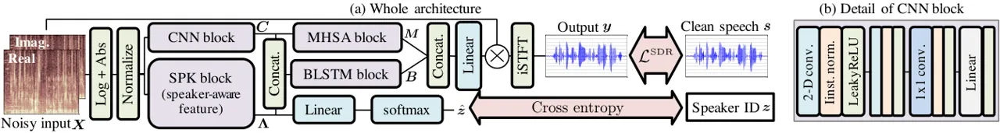
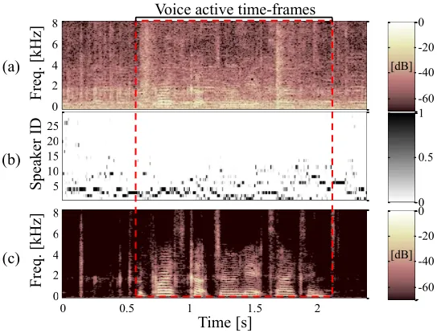

# Speech enhancement using self-adaptation and multi-head self-attention

Yuma Koizumi^(†)    Kohei Yatabe^(‡)    Marc Delcroix^(⋆)    Yoshiki
Masuyama^(‡)    Daiki Takeuchi^(‡)

###### Abstract

This paper investigates a self-adaptation method for speech enhancement
using auxiliary speaker-aware features; we extract a speaker
representation used for adaptation directly from the test utterance.
Conventional studies of deep neural network (DNN)–based speech
enhancement mainly focus on building a speaker independent model.
Meanwhile, in speech applications including speech recognition and
synthesis, it is known that model adaptation to the target speaker
improves the accuracy. Our research question is whether a DNN for speech
enhancement can be adopted to unknown speakers without any auxiliary
guidance signal in test-phase. To achieve this, we adopt multi-task
learning of speech enhancement and speaker identification, and use the
output of the final hidden layer of speaker identification branch as an
auxiliary feature. In addition, we use multi-head self-attention for
capturing long-term dependencies in the speech and noise. Experimental
results on a public dataset show that our strategy achieves the
state-of-the-art performance and also outperform conventional methods in
terms of subjective quality.

###### Index Terms: 

Speech enhancement, auxiliary information, multi-task learning, and
multi-head self-attention.

^(†)^(†)address: ^(†)NTT Media Intelligence Laboratories, Tokyo, Japan  
^(‡)Department of Intermedia Art and Science, Waseda University, Tokyo,
Japan  
^(⋆)NTT Communication Science Laboratories, Kyoto, Japan

## 1 Introduction

Speech enhancement (or speech-nonspeech separation \[2\]) is used to
recover target speech from a noisy observed signal. It is a fundamental
task with a wide range of applications such as automatic speech
recognition (ASR) \[3, 4\]. A recent advancement in this area is the use
of a deep neural network (DNN) for estimating unknown parameters such as
a time-frequency (T-F) mask \[2\]. In this study, we focus on DNN-based
single channel speech enhancement using T-F masking; i.e. a T-F mask is
estimated using a DNN and applied to the T-F represention of the
observation, then the estimated signal is re-synthesized using the
inverse transform.

Generalization is an important requirement in DNN-based speech
enhancement to enable enhancing unknown speakers’ speech. To achieve
this, several previous studies train a speaker independent DNN using
many speech samples spoken by many speakers \[4, 5, 6, 7, 8, 9, 10, 11,
12, 13, 14, 15\]. Meanwhile, in other speech applications, model
specialization to the target speaker has succeeded \[16, 17\]. In
text-to-speech synthesis (TTS), the target speaker model is trained
using samples spoken by a target speaker, and that has achieved high
performance \[16\]. In addition, by adapting a global ASR/TTS model to
the target speaker using an auxiliary feature such as the i-vector \[17,
18, 19\] and/or a speaker code \[19, 20\], ASR/TTS performance has been
increased.

Success of model specialization suggests us that speaker information is
important to improve the performance of speech applications including
speech enhancement. In fact, for speech separation (or multi-talker
separation \[2\]), several works have succeeded to extract the desired
speaker’s speech utilizing speaker information as an auxiliary input
\[21, 22, 23\], in contrast to separating arbitrary speakers’ mixture
such as deep-clustering \[24\] and permutation invariant training
\[25\]. A limitation of these studies is that they require a guidance
signal such as adaptation utterance, because there is no way of knowing
which signal in the speech-mixture is the target. However, in speech
enhancement scenario, the dominant signal is the target speech and noise
is not interference speech \[2\]. Thus, we consider that we can
specialize a DNN for enhancing the target speech without any guidance
signal in the test-phase.

In this paper, we investigate whether we can adapt a DNN to enhance the
target speech while extracting speaker-related information from the
observation simultaneously. DNN-based T-F mask estimator has a speaker
identification branch, which is simultaneously trained using a
multi-task-learning-based loss function of speech enhancement and
speaker identification. Then, we use the output of the final hidden
layer of speaker identification branch as an auxiliary feature. In
addition, to capture long-term dependencies in the speech and noise, we
combine bidirectional long short-term memory (BLSTM)–based and
multi-head self-attention \[27\] (MHSA)–based time-series modeling.
Experimental results show that (i) our strategy is effective even when
the target speaker is not included in the training dataset, (ii) the
proposed method achieved the state-of-the-art performance on a public
dataset \[28\], and (iii) subjective quality was also better than
conventional methods.

## 2 Related works



Figure 1: Overview of proposed network architecture; (a) whole
processing procedure and (b) detail of CNN block.

### 2.1 DNN-based speech enhancement and separation

Let $`T`$-point-long time-domain observation $`\bm{x}\in\mathbb{R}^{T}`$
be a mixture of a target speech $`\bm{s}`$ and noise $`\bm{n}`$ as
$`\bm{x}=\bm{s}+\bm{n}`$. The goal of speech enhancement and separation
is to recover $`\bm{s}`$ from $`\bm{x}`$. In speech enhancement,
$`\bm{n}`$ is assumed to be environmental noise and does not include
interference speech signals. Meanwhile, in speech separation, $`\bm{x}`$
consists of $`J`$ interference speech signals.

Over the last decade, the use of DNN for speech enhancement and
separation has substantially advanced the state-of-the art performance
by leveraging large training data. A popular strategy is to use a DNN
for estimating a T-F mask in the short-time Fourier transform
(STFT)–domain\[2\] . Let
$`\mathcal{F}:\mathbb{R}^{T}\to\mathbb{C}^{F\times K}`$ be the STFT
where $`F`$ and $`K`$ are the number of frequency and time bins. The
general form of DNN-based speech enhancement using T-F mask can be
written as

```math
\displaystyle\bm{y}=\mathcal{F}^{{\dagger}}\left(\mathcal{M}(\bm{x};\theta)\odot\mathcal{F}\left(\bm{x}\right)\right), \tag{1}
```

where $`\bm{y}`$ is the estimate of $`\bm{s}`$,
$`\mathcal{F}^{{\dagger}}`$ is the inverse-STFT, $`\odot`$ is the
element-wise product, $`\mathcal{M}`$ is a DNN for estimating a T-F
mask, and $`\theta`$ is the set of its parameters.

### 2.2 Auxiliary speaker-aware feature for speech separation

An important requirement in DNN-based speech enhancement and separation
is generalization that means working for any speaker. To achieve this,
in speech enhancement, several studies train a global $`\mathcal{M}`$
using many speech samples spoken by many speakers \[4, 5, 6, 7, 8, 9,
10, 11, 12, 13, 14, 15\]. Unfortunately, in speech separation,
generalization cannot be achieved solely using a large scale training
dataset because there is no way of knowing which signal in the
speech-mixture is the target. The most popular strategy is to separate
$`\bm{x}`$ into $`J`$ speech signals, and selecting the target speech
from it \[24, 25, 26\].

Recently, to avoid such multistage processing, the use of an auxiliary
speaker-aware feature has been investigated \[21, 22, 23\]. A clean
speech spoken by the target speaker is also passed to the DNN. Then, by
using the clean speech as guidance, a DNN is specialized to recover the
target speech. In the SpeakerBeam method \[21, 22\], the guidance signal
in the T-F-domain $`\bm{A}\in\mathbb{C}^{F\times K_{a}}`$ is converted
to the sequence-summarized feature $`\bm{\lambda}\in\mathbb{R}^{P}`$
using an auxiliary neural network
$`\mathcal{G}:\mathbb{C}^{F\times K_{a}}\to\mathbb{R}^{P\times K_{a}}`$
as

```math
\displaystyle\bm{\lambda}=\frac{1}{K_{a}}\sum_{k=1}^{K_{a}}\bm{\lambda}_{k},\qquad\bm{\Lambda}=(\bm{\lambda}_{1},...,\bm{\lambda}_{K_{a}})=\mathcal{G}\left(\bm{A};\theta_{g}\right), \tag{2}
```

where $`\theta_{g}`$ is the set of parameters of $`\mathcal{G}`$. Since
the input of $`\mathcal{G}`$ is a clean speech of the target speaker, we
can expect $`\bm{\lambda}`$ includes the speaker voice characteristics.
Thus, $`\bm{\lambda}`$ is used as a model-adaptation parameter by
multiplying to the outputs of a hidden layer of $`\mathcal{M}`$.

Using auxiliary information about the target speaker has only been
investigated for target speech extraction. In this paper, we investigate
it for noise reduction. In this case, since the noisy signal contains
only speech of the target and noise, we expect that it would be possible
to extract speaker information directly from the noisy signal and
realize thus self-adaptation (i.e. without auxiliary guidance signal).

## 3 Proposed method

### 3.1 Basic idea

Figure 1-(a) shows the overview of the proposed neural network. We adopt
the multi-task-learning strategy for incorporating speaker-aware feature
extraction for speech enhancement. The speech enhancement DNN has a
branch for speaker identification (SPK block), and its final hidden
layer’s output is used as an auxiliary feature. Both T-F mask estimation
and speaker identification are trained simultaneously using a joint cost
function of speech enhancement and speaker identification.

In addition, to capture the characteristics of speech and noise, not
only adjacent time-frames but also long-term dependencies in a sequence
should be important. To capture longer-term dependencies, a recent
research revealed that the MHSA \[27\] is effective for time-series
modeling in speech recognition/synthesis \[29\]. Therefore, in this
study, we combine BLSTM-based and MHSA-based time-series modeling.

### 3.2 Implementation

The base architecture is a combination of a convolutional neural network
(CNN) block and a BLSTM block. This set up is a standard architecture in
DNN-based speech enhancement \[8\]. We add a speaker identification
branch for extracting speaker-aware auxiliary feature (i.e. SPK block)
and a MHSA block to the base network. The input of the DNN is the
log-amplitude spectrogram of $`\bm{X}=\mathcal{F}\left(\bm{x}\right)`$,
and the output of that is a complex-valued T-F mask. Note that the input
is normalized to have zero mean and unit variance for each frequency
bin. Then, the complex-valued T-F mask is multiplied to $`\bm{X}`$ and
re-synthesized using the inverse STFT. Hereafter, we describe the detail
of each block.

CNN block: The CNN block consists of two 2-D convolution, one 1x1
convolution, and one linear layer as shown in Fig. 1-(b). For both 2-D
convolution layers, we used 5x5 kernel, (2,2) padding, and (1,1) stride
to obtain the same size of input/output. The number of output channel is
45 and 90 for the first and second 2-D convolution layer, respectively.
We used the instance normalization \[30\] and leaky-ReLU activation
after each CNN. Then, CNN output is passed to the linear layer, and
output $`\bm{C}\in\mathbb{R}^{D\times K}`$.

SPK block: The input feature is also passed to the SPK block. This block
consists of one CNN block and one BLSTM layer. This CNN block consists
of the same architecture of the above CNN block but the output channels
of each 2-D convolution layer are 30 and 60, respectively. Then, the CNN
block output $`\mathbb{R}^{D\times K}`$ is passed to the BLSTM layer,
then its forward and backward outputs are concatenated as
$`\bm{\Lambda}\in\mathbb{R}^{D\times K}`$.

BLSTM block: Then, $`\bm{C}`$ and $`\bm{\Lambda}`$ are concatenated and
passed to the BLSTM block. The BLSTM block consists of two BLSTM layers,
and its forward and backward outputs are concatenated as the output of
this block $`\bm{B}\in\mathbb{R}^{2D\times K}`$. Note that, although
SpeakerBeam uses the sequence-summarized feature as (2), we directly use
$`\bm{\Lambda}`$ as a speaker-aware auxiliary feature. Since the speaker
information is captured from the noisy signal, it is possible to obtain
time-dependent speaker information that could better represent the
phoneme of dynamic information.

MHSA block: As a parallel path of the BLSTM block, we use MHSA block.
This block consists of one linear layer and two cascaded MHSA modules.
First, $`\bm{C}`$ is passed to the linear layer to reduce its dimmension
$`D`$ to $`D/2`$. Then the linear layer output
$`\bm{\Gamma}\in\mathbb{R}^{D/2\times K}`$ is passed to the MHSA
modules. The input/output dimension of each MHSA module is
$`D/2\times K`$ thus the final output is
$`\bm{M}\in\mathbb{R}^{D/2\times K}`$. For simplifying the description
of this section, the detail of one MHSA module is described in Appendix
A. Note that $`\bm{\Lambda}`$ is not passed to this block. The reason is
we expect that this block mainly extracts long-term dependencies of
noise information because speaker information is analyzed in the SPK
block. To capture non-stationary noise such as intermittent noise, the
long-time similarity of the noise might be important and a speaker-aware
feature and position information should not be important.

DNN outputs and loss function: The main output of the DNN is a
complex-valued T-F mask. This mask is calculated by the last linear
layer whose output dimension is $`2F\times K`$. Then, the output is
split into two $`F\times K`$ matrices, and used as the real- and
imaginary-part of a complex-valued T-F mask. In the training phase,
$`\bm{\Lambda}`$ is also passed to a linear layer and we obtain
$`\bm{Z}=(\bm{z}_{1},...,\bm{z}_{K})\in\mathbb{R}^{L\times K}`$ where
$`L`$ is the number of speakers included in training dataset. Then,
speaker ID of $`\bm{X}`$ is estimated as
$`\hat{\bm{z}}=\softmax(K^{-1}\sum_{k=1}^{K}\bm{z}_{k})`$. We use a
multi-task loss, which consists of a SDR-based loss and the
cross-entropy loss are calculated as

```math
\displaystyle\mathcal{L} \displaystyle=\mathcal{L}^{\mbox{\tiny SDR}}+\alpha\CE(\bm{z},\hat{\bm{z}}), \tag{3}
```

```math
\displaystyle\mathcal{L}^{\mbox{\tiny SDR}} \displaystyle=-\frac{1}{2}\left(\clip_{\beta}\left[\SDR(\bm{s},\bm{y})\right]+\clip_{\beta}\left[\SDR(\bm{n},\bm{m})\right]\right), \tag{4}
```

where
$`\SDR(\bm{s},\bm{y})=10\log_{10}\left(\lVert\bm{s}\rVert_{2}^{2}/\lVert\bm{s}-\bm{y}\rVert_{2}^{2}\right)`$,
$`\lVert\cdot\rVert_{2}`$ is $`\ell_{2}`$ norm,
$`\bm{m}=\bm{x}-\bm{y}`$, $`\alpha>0`$ is a mixing parameter,
$`\clip_{\beta}[x]=\beta\cdot\tanh(x/\beta)`$, $`\beta>0`$ is a clipping
parameter \[8\], and $`\bm{z}`$ is the true speaker label $`\bm{X}`$.

## 4 Experiments

To investigate whether our strategy is effective for DNN-based speech
enhancement, we conducted three experiments; (i) a verification
experiment using a small dataset, (ii) an objective experiment using a
public dataset, and (iii) a subjective experiment. The purposes of each
experiment were (i) verifying the effectiveness of auxiliary feature,
(ii) comparing the performance with conventional studies, and (iii)
evaluating not only objective metrics but also subjective quality,
respectively. In all experiments, we utilized the VoiceBank-DEMAND
dataset constructed by Valentini et al. \[28\] which is openly available
and frequently used in the literature of DNN-based speech enhancement
\[5, 9, 10, 13\]. The train and test sets consists of 28 and 2 speakers
(11572 and 824 utterances), respectively.

### 4.1 Verification experiments

First, we conducted a verification experiment to investigate the
effectiveness of auxiliary speaker-aware feature. Since this experiment
mainly focuses on the effectiveness of the SPK block, we modified the
DNN architecture illustrated in Fig. 1. We removed all CNNs and MHSA
modules, and all BLSTMs were chenged to the bidirectional-gated
recurrent unit (BiGRU) with one hidden layer. The unit size of the BiGRU
was $`D=200`$. In this experiment, one of the speakers in the training
dataset p226 was used as the target speaker. In order to use the same
number of training samples for each speaker, the training dataset was
separated into $`300\times 28`$ training samples and other samples
spoken by each speaker were used for training. Then, we tested three
types of training as follows:

Close:  
Trained using the target speaker’s samples, that is, the speaker
dependent model. This score indicates the ideal performance and just for
reference because it cannot be used in practice.

Open:  
Trained using other 27 speakers’ samples, that is, the speaker
independent model (the scope of conventional studies).

Open+SPK:  
Trained using other 27 speaker’s samples, and the DNN has a SPK branch.
The output of SPK block was used as an auxiliary speaker-aware feature,
that is, self-adaptation model (the scope of this study).

Thus, for Close, 300 samples spoken by p226 were the training data, and
for Open and Open+SPK, $`300\times 27`$ samples except p226 were
training data. The number of test samples was 53. In addition, we used
data augmentation by swapping noise of randomly selected two samples.
The training setup and STFT parameters were the same as the objective
experiment described in Sec. 4.2.

| Method   | SI-SDR          | PESQ           | CSIG           | CBAK           | COVL           |
| -------- | --------------- | -------------- | -------------- | -------------- | -------------- |
| Noisy    | $`5.96`$        | $`1.56`$       | $`2.44`$       | $`2.07`$       | $`1.96`$       |
| Close    | $`{\bf 14.59}`$ | $`{\bf 2.18}`$ | $`{\bf 3.10}`$ | $`{\bf 2.84}`$ | $`{\bf 2.59}`$ |
| Open     | $`14.28`$       | $`2.11`$       | $`2.99`$       | $`2.79`$       | $`2.50`$       |
| Open+SPK | $`14.48`$       | $`2.15`$       | $`2.96`$       | $`2.82`$       | $`2.51`$       |

Table 1: Results of verification experiment.

We used the perceptual evaluation of speech quality (PESQ), CSIG, CBLK,
and COVL as the performance metrics which are the standard metrics for
this dataset \[5, 9, 10, 13\]. The three composite measures CSIG, CBAK,
and COVL are the popular predictor of the mean opinion score (MOS) of
the target signal distortion, background noise interference, and overall
speech quality, respectively \[31\]. In addition, as the standard metric
in speech enhancement, we also evaluated scale-invariant SDR (SI-SDR)
\[32\]. Table 1 shows the experimental results. By comparing Open and
Open+SPK, scores of Open+SPK were better than Open except CSIG, and got
close to Close’s upper bound score. This result suggest us the
effectiveness of auxiliary speaker feature extracted by SPK block for
DNN-based speech enhancement.

### 4.2 Objective evaluations

We evaluated the DNN described in Sec. 3.2 (Ours) on the same dataset
and metrics of conventional studies \[5, 9, 10, 13\], i.e. using all
training data and evaluated on PESQ, CSIG, CBLK, and COVL. The output
size of CNN block was $`D=600`$ and the number of heads of each MHSA
module was $`H=4`$. The mixing and clipping parameters were the same as
the verification experiment. To evaluate effectiveness of SPK block and
MHSA block, we also evaluated only adding either one block; MHSA w/o SPK
block and SPK w/o MHSA block. The swapping-based data augmentation was
used which is described in Sec. 4.1. We fixed the learning rate for the
initial 100 epochs and decrease it linearly between 100–200 epochs down
to a factor of 100 using ADAM optimizer, where we started with a
learning rate of 0.001. We always concluded training after 200 epochs.
The STFT parameters were a frame shift of 128 samples, a DFT size of
512, and a window was 512 points the Blackman window.

The proposed method was compared with speech enhancement generative
adversarial network (SEGAN) \[5\], MMSE-GAN \[9\], deep feature loss
(DFL) \[10\], and Metric-GAN \[13\], because these methods have been
evaluated on the same dataset. Table 2 shows the experimental results.
As we can see from this table, the proposed method (Ours) achieved
better performance than conventional methods in all metrics. In
addition, we observed from the attention map that the attention module
tends to pay attention to longer context when there was impulsive noise
or consonants. This may help reduce noise and be the reason of that MHSA
achieved the best CBAK score.

|                  |                |                |                |                |
| ---------------- | -------------- | -------------- | -------------- | -------------- |
| Method           | PESQ           | CSIG           | CBAK           | COVL           |
| Noisy            | $`1.97`$       | $`3.35`$       | $`2.44`$       | $`2.63`$       |
| SEGAN \[5\]      | $`2.16`$       | $`3.48`$       | $`2.94`$       | $`2.80`$       |
| MMSE-GAN \[9\]   | $`2.53`$       | $`3.80`$       | $`3.12`$       | $`3.14`$       |
| DFL \[10\]       | n/a            | $`3.86`$       | $`3.33`$       | $`3.22`$       |
| MetricGAN \[13\] | $`2.86`$       | $`3.99`$       | $`3.18`$       | $`3.42`$       |
| MHSA             | $`2.93`$       | $`4.10`$       | $`{\bf 3.46}`$ | $`3.51`$       |
| SPK              | $`2.95`$       | $`4.10`$       | $`3.41`$       | $`3.52`$       |
| Ours             | $`{\bf 2.99}`$ | $`{\bf 4.15}`$ | $`3.42`$       | $`{\bf 3.57}`$ |

Table 2: Objective evaluation results on public dataset \[28\].



Figure 2: Example of speech enhancement result. Each figure shows (a)
spectrogram of input, (b) speaker identification result on each
time-frame where speaker IDs have been sorted by descending order of
frequency of appearance, and (c) spectrogram of output, respectively.

Figure 2 shows the speech enhancement result of p257*070.wav which is a
test sample spoken by a female speaker under a low signal-to-noise ratio
(SNR) condition. The top and bottom figures show the spectrograms of the
input and output, respectively. Figure 2-(b) shows speaker
identification result on each time-frame which is calculated for
visualization as $`\hat{\bm{z}}*{k}=\softmax(\bm{z}_{k})`$ instead of
$`\hat{\bm{z}}`$. Although the SPK branch estimated the speaker of the
whole utterance was p228 (a female) as $`\hat{\bm{z}}`$, the middle
figure (i.e. $`\hat{\bm{z}}_{k}`$) shows the SPK branch might select
different speaker frame-by-frame. Actually, in the voice active
time-frames of this utterance, 64% and 84% of the time-frames were
occupied by 3 and 5 speakers, respectively; p268 (id: 1), p228 (id: 2),
p256 (id: 3), p239 (id: 4), and p258 (id: 5). p256 is a male speaker
whose voice is a bit hoarse, and the male speaker is mainly selected at
consonant time-frames. Since the SPK block can extract speaker-aware
information, SPK achieved better PESQ and COVL score than MHSA, and its
convention Ours achieved the state-of-the-art performance on a public
dataset for speech enhancement.

### 4.3 Subjective evaluations

We conducted a subjective experiment. The proposed method was compared
with SEGAN \[5\] and DFL \[10\] because speech samples of both methods
are openly available in DFL’s web-page \[33\]. We selected 15 samples
from Tranche 1--3 data from the web-page (low SNR conditions). The
speech samples of the proposed method used in this test are also openly
available¹¹ 1
https://sites.google.com/site/yumakoizumiweb/publication/icassp2020. The
subjective test was designed according to ITU-T P.835 \[34\]. In the
tests, the participants rated three different factors in the samples:
speech mean-opinion-score (S-MOS), subjective noise MOS (N-MOS), and
overall MOS (G-MOS). Ten participants evaluated the sound quality of the
output signals. Figure 3 shows the results of the subjective test. For
all factors, the proposed method achieved the highest score, and
statistically significant differences were observed in a paired one
sided $`t`$-test ($`p<0.01`$). From these results, it is suggested that
the SPK block can extract speaker-aware information and it is effective
for DNN-based speech enhancement.

Figure 3: Subjective evaluation results according to ITU-T P.835.

## 5 Conclusions

We investigated the use of self-adaptation for DNN-based speech
enhancement; we extracted a speaker representation used for adaptation
directly from the test utterance. A multi-task-based cost function was
used for simultaneously training DNN-based T-F mask estimator and
speaker identifier for extracting a speaker representation. Three
experiments showed that (i) our strategy was effective even if the
target speaker is unknown, (ii) the proposed method achieved the
state-of-the-art performance on a public dataset \[28\], and (iii)
subjective quality was also better than conventional methods. Thus, we
concluded that self-adaptation using speaker-aware feature is effective
for DNN-based speech enhancement.

Appendix A. Detail of MHSA module

Here, we briefly describe the detail of MHSA module \[27\]. Let $`H`$ be
the number of heads in MHSA. First, $`\bm{\Gamma}`$ is inputted to the
layer normalization. Then, $`h`$-th head’s attention matrix
$`\bm{A}_{h}`$ is calculated as
$`\bm{A}_{h}=\mbox{softmax}(d^{-1/2}\cdot\tilde{\bm{A}}_{h})`$ where
$`d=D/(2H)`$ is a scaling parameter, and

```math
\displaystyle\tilde{\bm{A}}_{h}=\left(\bm{W}_{h,q}\bm{\Gamma}\right)^{\mathsf{T}}\bm{W}_{h,k}\bm{\Gamma}\in\mathbb{R}^{K\times K}. \tag{5}
```

Here ^(T) is the transpose. The size of $`\bm{W}_{h,q}`$ and
$`\bm{W}_{h,k}`$ are $`D/(2H)\times D/2`$. Then, $`h`$-th head’s context
matrix is calculated as

```math
\displaystyle\bm{E}_{h}=\bm{A}_{h}\left(\bm{W}_{h,v}\bm{\Gamma}\right)^{\mathsf{T}}\in\mathbb{R}^{T\times D/(2H)}, \tag{6}
```

where the size of $`\bm{W}_{h,v}`$ is also $`D/(2H)\times D/2`$. Then,
$`\bm{W}_{p}\in\mathbb{R}^{D/2\times D/2}`$ is multiplied to the
concatenated $`\bm{E}_{h}`$ and added to $`\bm{\Gamma}`$ as

```math
\displaystyle\bm{E}=\left(\concat[\{\bm{E}_{h}\}_{h=1}^{H}]\bm{W}_{p}\right)^{\mathsf{T}}+\bm{\Gamma}\in\mathbb{R}^{D/2\times K}. \tag{7}
```

Finally, $`\bm{E}`$ is passed to the second layer normalization, and
passed to the point-wise feed-forward layer as

```math
\displaystyle\bm{M}=\lin^{(1)}\left(\lrelu\left(\lin^{(2)}\left(\bm{E}\right)\right)\right), \tag{8}
```

where $`\lin(\cdot)`$ denotes feed-forward NN, and the output size of
$`\lin^{(1)}`$ and $`\lin^{(2)}`$ are $`D/2`$ and $`3D/2`$,
respectively.

## References

- \[2\] D. L. Wang and J. Chen, “Supervised Speech Separation Based on
  Deep Learning: An Overview,” IEEE/ACM Trans. on Audio, Speech, and
  Lang. Process., 2018.
- \[3\] T. Yoshioka, N. Ito, M. Delcroix, A. Ogawa, K. Kinoshita,
  M. Fujimoto, C. Yu, W. J. Fabian, M. Espi, T. Higuchi, S. Araki, and
  T. Nakatani, “The NTT CHiME-3 System: Advances in Speech Enhancement
  and Recognition for Mobile Multi-Microphone Devices,” Proc. of
  Automatic Speech Recognition and Understanding Workshop (ASRU), 2015.
- \[4\] H. Erdogan, J. R. Hershey, S. Watanabe, and J. Le Roux,
  “Phase-Sensitive and Recognition-Boosted Speech Separation using Deep
  Recurrent Neural Networks,” Proc. of Int. Conf. on Acoust., Speech,
  and Signal Process. (ICASSP), 2015.
- \[5\] S. Pascual, A. Bonafonte, and J. Serra, “SEGAN: Speech
  Enhancement Generative Adversarial Network,” Proc. of
  Interspeech, 2017.
- \[6\] D. S. Williamson, Y. Wang and D. L. Wang, “Complex Ratio Masking
  for Monaural Speech Separation,” IEEE/ACM Trans. on Audio, Speech, and
  Lang. Process., 2016.
- \[7\] Y. Koizumi, K. Niwa, Y. Hioka, K. Kobayashi and Y. Haneda,
  “DNN-based Source Enhancement Self-Optimized by Reinforcement Learning
  using Sound Quality Measurements,” Proc. of Int. Conf. on Acoust.,
  Speech, and Signal Process. (ICASSP), 2017.
- \[8\] H. Erdogan, and T. Yoshioka, “Investigations on Data
  Augmentation and Loss Functions for Deep Learning Based
  Speech-Background Separation,” Proc. of Interspeech, 2018.
- \[9\] M. H. Soni, N. Shah, H. A. Patil, “Time-Frequency Masking-Based
  Speech Enhancement Using Generative Adversarial Network,” Proc. of
  Int. Conf. on Acoust., Speech, and Signal Process. (ICASSP), 2018.
- \[10\] F. G. Germain, Q. Chen, and V. Koltun, “Speech Denoising with
  Deep Feature Losses,” Proc. of Interspeech, 2019.
- \[11\] Y. Koizumi, K. Niwa, Y. Hioka, K. Kobayashi and Y. Haneda,
  “DNN-based Source Enhancement to Increase Objective Sound Quality
  Assessment,” IEEE/ACM Trans. on Audio, Speech, and Lang.
  Process.,, 2018.
- \[12\] D. Takeuchi, K. Yatabe, Y. Koizumi, N. Harada, and Y. Oikawa,
  “Data-Driven Design of Perfect Reconstruction Filterbank for DNN-based
  Sound Source Enhancement,” Proc. of Int. Conf. on Acoust., Speech, and
  Signal Process. (ICASSP), 2019.
- \[13\] S. W. Fu, C. F. Liao, Y. Tsao, and S. D. Lin, “MetricGAN:
  Generative Adversarial Networks based Black-box Metric Scores
  Optimization for Speech Enhancement,” Proc. of Int. Conf. on Machine
  Learning (ICML), 2019.
- \[14\] M. Kawanaka, Y. Koizumi, R. Miyazaki, and K. Yatabe, “Stable
  Training of DNN for Speech Enhancement based on Perceptually-Motivated
  Black-box Cost Function,” Proc. of Int. Conf. on Acoust., Speech, and
  Signal Process. (ICASSP), 2020.
- \[15\] D. Takeuchi, K. Yatabe, Y. Koizumi, Y. Oikawa, and N. Harada,
  “Invertible DNN-based Nonlinear Time-Frequency Transform for Speech
  Enhancement,” Proc. of Int. Conf. on Acoust., Speech, and Signal
  Process. (ICASSP), 2020.
- \[16\] A. Oord, S. Dieleman, H. Zen, K. Simonyan, O. Vinyals,
  A. Graves, N. Kalchbrenner, A. Senior, and K. Kavukcuoglu, “WaveNet: A
  Generative Model for Raw Audio,” arXiv preprint,
  arXiv:1609.03499, 2016.
- \[17\] G. Saon, H.-K. J. Kuo, S. Rennie, and M. Picheny, “The IBM 2015
  English Conversational Telephone Speech Recognition System,” Proc. of
  Interspeech, 2015.
- \[18\] Z. Wu, P. Swietojanski, C. Veaux, S. Renals, and S. King, “A
  Study of Speaker Adaptation for DNN-based Speech Synthesis,” Proc. of
  Interspeech, 2015.
- \[19\] Y. Zhao, D. Saito, and N. Minematsu, “Speaker Representations
  for Speaker Adaptation in Multiple Speakers’ BLSTM-RNN-based Speech
  Synthesis,” Proc. of Interspeech, 2016.
- \[20\] N. Hojo, Y. Ijima, and H. Mizuno, “DNN-Based Speech Synthesis
  Using Speaker Codes,” IEICE Trans. Inf. & Syst., 2018.
- \[21\] M. Delcroix, K. Zmolikova, K. Kinoshita, A. Ogawa, and
  T. Nakatani, “Single Channel Target Speaker Extraction and Recognition
  with Speaker Beam,” Proc. of Int. Conf. on Acoust., Speech, and Signal
  Process. (ICASSP), 2018.
- \[22\] K. Zmolikova , M. Delcroix, K. Kinoshita, T. Ochiai,
  T. Nakatani, L. Burget, and J. Cernocky, “SpeakerBeam: Speaker Aware
  Neural Network for Target Speaker Extraction in Speech Mixtures,” IEEE
  Jnl. of Selected Topics in Signal Process., 2019.
- \[23\] X. Xiao, Z. Chen, T. Yoshioka, H. Erdogan, C. Liu,
  D. Dimitriadis, J. Droppo, and Y. Gong, “Single-channel Speech
  Extraction Using Speaker Inventory and Attention Network,” Proc. of
  Int. Conf. on Acoust., Speech, and Signal Process. (ICASSP), 2019.
- \[24\] J. R. Hershey, Z. Chen, J. Le Roux, and S. Watanabe, “Deep
  Clustering: Discriminative Embeddings for Segmentation and
  Separation,” Proc. of Int. Conf. on Acoust., Speech, and Signal
  Process. (ICASSP), 2016.
- \[25\] M. Kolbak, D. Yu, Z. H. Tan, and J. Jensen, “Multi-talker
  Speech Separation with Utterance-level Permutation Invariant Training
  of Deep Recurrent Neural Networks,” IEEE/ACM Trans. on Audio, Speech,
  and Lang. Process., 2017.
- \[26\] L. Drude, T. Neumann, and R. H. Umbach, “Deep attractor
  networks for speaker re-identification and blind source separation”
  Proc. of Int. Conf. on Acoust., Speech, and Signal Process.
  (ICASSP), 2018.
- \[27\] A. Vaswani, N. Shazeer, N. Parmar, J. Uszkoreit, L. Jones,
  A. N. Gomez, L. Kaiser, and I. Polosukhin, “Attention Is All You
  Need,” in Proc. 31st Conf. on Neural Info. Process. Systems
  (NIPS), 2017.
- \[28\] C. Valentini-Botinho, X. Wang, S. Takaki, and J. Yamagishi,
  “Investigating RNN-based Speech Enhancement methods for Noise-Robust
  Text-to-Speech,” Proc. of 9th ISCA Speech Synth. Workshop (SSW), 2016.
- \[29\] S. Karita, N. Chen, T. Hayashi, T. Hori, H. Inaguma, Z. Jiang,
  M. Someki, N. Enrique Y. Soplin, R. Yamamoto, X. Wang, S. Watanabe,
  T. Yoshimura, and W. Zhang, “A Comparative Study on Transformer vs RNN
  in Speech Applications,” Proc. of Automatic Speech Recognition and
  Understanding Workshop (ASRU), 2019.
- \[30\] D. Ulyanov, A. Vedaldi, and V. Lempitsky, “Instance
  Normalization: The Missing Ingredient for Fast Stylization,” arXiv
  preprint, arXiv:1607.08022, 2016.
- \[31\] Y. Hu and P. C. Loizou, “Evaluation of Objective Quality
  Measures for Speech Enhancement,” IEEE/ACM Trans. on Audio, Speech,
  and Lang. Process.,, 2008.
- \[32\] J. Le Roux, S. Wisdom, H. Erdogan, and J. R. Hershey, “SDR -
  half-baked or well done?,” Proc. of Int. Conf. on Acoust., Speech, and
  Signal Process. (ICASSP), 2019.
- \[33\]
  https://ccrma.stanford.edu/~francois/SpeechDenoisingWithDeepFeatureLosses/
- \[34\] International Telecommunication Union, “Subjective test
  methodology for evaluating speech communication systems that include
  noise suppression algorithm,” ITU-T Recommendation P.835, 2003.
