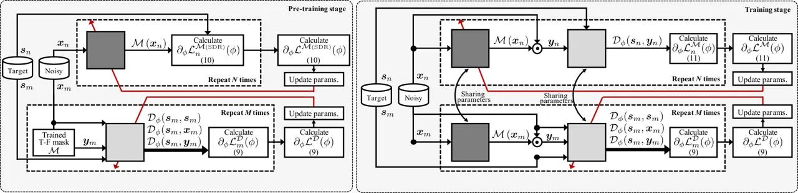

# Stable Training of DNN for Speech Enhancement based on Perceptually-Motivated Black-Box Cost Function

Masaki Kawanaka^(†)    Yuma Koizumi    Ryoichi Miyazaki^(†)    Kohei
Yatabe^(⋆)

###### Abstract

Improving subjective sound quality of enhanced signals is one of the
most important missions in speech enhancement. For evaluating the
subjective quality, several methods related to perceptually-motivated
objective sound quality assessment (OSQA) have been proposed such as
PESQ (perceptual evaluation of speech quality). However, direct use of
such measures for training deep neural network (DNN) is not allowed in
most cases because popular OSQAs are non-differentiable with respect to
DNN parameters. Therefore, the previous study has proposed to
approximate the score of OSQAs by an auxiliary DNN so that its gradient
can be used for training the primary DNN. One problem with this approach
is instability of the training caused by the approximation error of the
score. To overcome this problem, we propose to use stabilization
techniques borrowed from reinforcement learning. The experiments, aimed
to increase the score of PESQ as an example, show that the proposed
method (i) can stably train a DNN to increase PESQ, (ii) achieved the
state-of-the-art PESQ score on a public dataset, and (iii) resulted in
better sound quality than conventional methods based on subjective
evaluation.

###### Index Terms: 

Speech enhancement, sound quality assessment, perceptual evaluation of
speech quality, function approximation.

^(†)^(†)address: ^(†)National Institute of Technology, Tokuyama College,
Yamaguchi, Japan  
^(‡)NTT Media Intelligence Laboratories, Tokyo, Japan  
^(⋆)Department of Intermedia Art and Science, Waseda University, Tokyo,
Japan

## 1 Introduction

Speech enhancement, which aims to recover the target speech from a noisy
observed signal, is a fundamental task in a wide range of speech
applications including automatic speech recognition (ASR) \[1\] and
telecommunication \[2\]. In these applications, the objectives of
enhancement are different; the former is for helping machine listening,
while the latter is for helping human listening. This study focuses on
the latter, where the subjective sound quality of the enhanced speech
signal is the target of improvement.

Over the last decade, the use of deep neural network (DNN) for speech
enhancement has substantially advanced the state-of-the-art performance
\[3, 4, 5, 9, 6, 7, 8, 10, 11, 12, 13, 14, 15\]. The popular strategy is
to estimate a time-frequency (T-F) mask by a DNN and apply it in the
short-time Fourier transform (STFT)–domain \[3\], where the enhanced
signal is obtained by the inverse STFT. Ordinarily, DNNs are trained by
back-propagation to minimize a mathematically-defined differentiable
cost function such as the mean squared/absolute error \[4\] and the
signal-to-distortion ratio (SDR) \[6\]. Unfortunately, it has been shown
that such mathematically-defined cost functions do not guarantee to
improve subjective sound quality \[10\]. For improving the sound quality
of enhanced speech signals, human-perception-based measures for
objective sound quality assessments (OSQA), such as PESQ (perceptual
evaluation of speech quality) \[16\], has been applied to the training
of DNNs.

The difficulty in the training of DNN based on the score of OSQA is its
non-differentiable nature which restricts the use of back-propagation.
In the previous studies, two types of strategies have been proposed to
circumvent this difficulty \[9, 10, 11\]. Koizumi et al. formulated the
training as a black-box optimization problem and adopted techniques from
reinforcement learning (RL) that approximate the gradient using a
sampling algorithm \[9, 10\]. MetricGAN proposed by Fu et al. \[11\] is
the other approach which utilizes an auxiliary DNN to approximate the
score of OSQA as the generative-adversarial-network (GAN) \[17\]. This
function-approximation-based strategy allows to back-propagate the
information of OSQA to the primary DNN which enhances the signals. While
these methods effectively improved the sound quality, their problem is
instability of the training. The targeted score of OSQA on the test
dataset does not stably increase (see Fig. 5 of \[10\] and Fig. 2 of
\[11\]), which can be a cause of failure for some situations.

In this study, we propose the use of stabilization techniques for the
function-approximation-based method as shown in Fig. 1. For stably
training the auxiliary DNN for approximating the score of OSQA, we
design a new cost function and adopt training techniques in RL and other
machine learning areas. We conducted experiments training a DNN based on
PESQ as an example, and the results show that the proposed method (i)
can stably train a DNN to increase PESQ, (ii) achieved the
state-of-the-art PESQ score on a public dataset, and (iii) obtained
better sound quality than conventional methods based on subjective
evaluation.



Figure 1: Overview of training procedure of proposed method.

## 2 Conventional Methods

### 2.1 DNN-based Speech Enhancement using T-F mask

Let $`T`$-points-long time-domain observation
$`\bm{x}\in\mathbb{R}^{T}`$ be a mixture of a target signal $`\bm{s}`$
and noise $`\bm{n}`$ as $`\bm{x}=\bm{s}+\bm{n}`$. The goal of speech
enhancement is to recover $`\bm{s}`$ from $`\bm{x}`$, where the use of
DNN has substantially advanced the state-of-the-art performance. A
popular strategy is to use a DNN for estimating a T-F mask in the
STFT-domain. Let $`\mathcal{F}:\mathbb{R}^{T}\to\mathbb{C}^{F\times K}`$
be the STFT where $`F`$ and $`K`$ are the number of frequency and time
bins, respectively. A general form of DNN-based speech enhancement using
a T-F mask can be written as

```math
\displaystyle\bm{y}=\mathcal{F}^{{\dagger}}\left(\mathcal{M}_{\theta\!}\left(\bm{x}\right)\odot\mathcal{F}\left(\bm{x}\right)\right), \tag{1}
```

where $`\bm{y}`$ is the estimate of $`\bm{s}`$,
$`\mathcal{F}^{{\dagger}}`$ is the inverse-STFT, $`\odot`$ is the
element-wise product, and $`\mathcal{M}`$ is a DNN for estimating the
T-F mask. The set of parameters of the DNN $`\theta`$ is trained to
minimize a cost function $`\mathcal{L}(\bm{s},\bm{y})`$ by iterating the
gradient descending procedure:

```math
\displaystyle\theta^{t+1}\leftarrow\theta^{t}-\lambda\,\partial_{\theta}\mathcal{L}(\bm{s},\bm{y}), \tag{2}
```

where $`\lambda>0`$, and $`\partial_{\theta}`$ is the differential
operator w.r.t. $`\theta`$.

To apply a gradient-descent-type algorithm as in (2), derivatives of
both $`\mathcal{L}`$ and $`\mathcal{M}`$ are required for computing
$`\partial_{\theta}\mathcal{L}(\bm{s},\bm{y})`$. Since
$`\partial_{\theta}\mathcal{M}`$ is usually computed by the
back-propagation, differentiability of the cost function $`\mathcal{L}`$
is the matter for the algorithm. The mean squared/absolute error \[4\]
and SDR \[6\] are some examples of differential cost functions popular
in speech enhancement. However, these mathematically-defined cost
functions do not guarantee to improve the subjective sound quality of
the enhanced signals \[10\] because they do not take the perceptual
concepts into account.

### 2.2 OSQA-based Cost Function for Speech Enhancement

Instead of such mathematically-defined differentiable cost functions,
some perceptually-motivated functions such as PESQ have been considered
in DNN-based speech enhancement. Let $`\mathcal{P}(\bm{s},\bm{y})`$ be
an OSQA score evaluated between $`\bm{s}`$ and $`\bm{y}`$. To
incorporate it into training of DNN, two approches have been proposed
\[9, 10, 11\].

The first approach \[10\] considered the expectation
w.r.t. $`\bm{x},\bm{y}`$,

```math
\mathcal{L}^{\mathcal{P}}=-\mathbb{E}\left[\mathcal{P}(\bm{s},\bm{y})\right]_{\bm{x},\bm{y}}, \tag{3}
```

as the cost function. To calculate
$`\partial_{\theta}\mathcal{L}^{\mathcal{P}}(\bm{s},\bm{y})`$, Koizumi
et al. \[10\] considered a sampling algorithm used in RL. They rewrote
(3) as

```math
\mathcal{L}^{\mathcal{P}}=\int p(\bm{x})\int\mathcal{P}(\bm{s},\bm{y})\,q_{\theta}(\bm{y}|\bm{x})\,d\bm{y}d\bm{x}, \tag{4}
```

where $`q_{\theta}(\bm{y}|\bm{x})`$ is a conditional distribution of
$`\bm{y}`$ given $`\bm{x}`$. As the goal is to train a DNN for
recovering $`\bm{y}`$, $`q_{\theta}`$ is considered to consist of a DNN.
Then, by using the log-derivative trick,
$`\partial_{\theta}\mathcal{L}^{\mathcal{P}}`$ is given by

```math
\partial_{\theta}\mathcal{L}^{\mathcal{P}}=\mathbb{E}\left[\mathcal{P}(\bm{s},\bm{y})\,\partial_{\theta}\ln q_{\theta}(\bm{y}|\bm{x})\right]_{\bm{x},\bm{y}}. \tag{5}
```

When $`\ln q_{\theta}(\bm{y}|\bm{x})`$ is differentiable w.r.t
$`\theta`$ and $`\bm{y}`$ can be drawn from
$`q_{\theta}(\bm{y}|\bm{x})`$, (5) can be approximately calculated. The
problem of this approach is that training takes a long-time for
stabilizing it. This is because the expectation in (5) is numerically
calculated by the Monte Carlo method, and stabilization of the
random-sampling-based expectation requires a huge number of samples.

The second approach, MetricGAN proposed by Fu et al. \[11\], is based on
function approximation of $`\mathcal{P}(\bm{s},\bm{y})`$. In this
method, the score of OSQA is approximated by using an auxiliary DNN
$`\mathcal{D}`$ as

```math
\displaystyle\mathcal{P}(\bm{s},\bm{y})\approx\mathcal{D}_{\phi}(\bm{s},\bm{y}), \tag{6}
```

where $`\phi`$ is the set of parameters of $`\mathcal{D}`$. Since
$`\mathcal{D}`$ is differentiable w.r.t. $`\bm{y}`$,
$`\partial_{\theta}\mathcal{D}_{\phi}(\bm{s},\bm{y})`$ can be calculated
via back-propagation. In this method, $`\mathcal{D}`$ and
$`\mathcal{M}`$ are trained alternately. First, $`\mathcal{D}`$ is
updated to decrease the following cost function:

```math
\displaystyle\mathcal{L}^{\mathcal{D}{\mbox{\tiny(GAN)}}}=\mathcal{E}_{\phi}(\bm{s})+\mathcal{E}_{\phi}(\bm{y}), \tag{7}
```

where $`\mathcal{E}_{\phi}(\cdot)`$ is the mean-squared error (MSE)
between true and estimated OSQA scores,
$`\mathcal{E}_{\phi}(\cdot)=(\mathcal{P}(\bm{s},\cdot)-\mathcal{D}_{\phi}(\bm{s},\cdot))^{2}`$.
Then, to update $`\mathcal{M}`$ so as to obtain the best score for all
$`\bm{x}`$, the cost function,

```math
\displaystyle\mathcal{L}^{\mathcal{M}{\mbox{\tiny(GAN)}}}=\left(\mathcal{D}_{\phi}(\bm{s},\bm{y})-1\right)^{2}, \tag{8}
```

is minimized, where the OSQA score is assumed to be normalized as
$`0\leq\mathcal{P}(\bm{s},\bm{y})\leq 1`$, and therefore
$`\mathcal{P}(\bm{s},\bm{s})=1`$

It is known that training of GAN is difficult and unstable. Thus, Fu et
al. introduced several techniques, including the Spectral Normalization
\[18\], to stabilize the training of MetricGAN. However, as can be seen
in Fig. 2 of their paper \[11\], its training is still unstable in the
early stage of training (at around 20–50 iterations).

## 3 Proposed method

Recently, several pieces of literature have reported that, based on the
relevance between GAN and RL, training of GAN can be stabilized by
adopting techniques of RL \[19\]. In addition, several techniques for
stabilizing DNN training have also been proposed in other areas \[19,
20, 21, 22, 23\]. Therefore, we consider that the training of MetricGAN,
or the function-approximation-based approach, can be stabilized by
adopting such techniques. In this section, we describe the techniques
that succeeded to stabilize the training.

### 3.1 Techniques for Stabilizing DNN Training

Figure 2: Illustration of difference of OSQA approximation owing to cost
functions, (a) MetricGAN
$`\mathcal{L}^{\mathcal{D}{\mbox{\tiny(GAN)}}}`$, and (b) Ours
$`\mathcal{L}^{\mathcal{D}}`$. The solid-lines represent the true OSQA
function, while dotted- and dashed-lines are its approximation by
$`\mathcal{D}`$. Since MetricGAN trains $`\mathcal{D}`$ using
$`\mathcal{E}_{\phi}(\bm{s})`$ and $`\mathcal{E}_{\phi}(\bm{y})`$ only,
$`\mathcal{D}`$ can become both dotted- and dashed-line in (a). To
inform OSQA score of noisy signal, our cost function additionally uses
$`\mathcal{E}_{\phi}(\bm{x})`$ so that $`\mathcal{D}`$ becomes
dotted-line in (b).

#### 3.1.1 Cost function for OSQA score approximation

First, we consider a cost function better than
$`\mathcal{L}^{\mathcal{D}{\mbox{\tiny(GAN)}}}`$. Since
$`\mathcal{L}^{\mathcal{D}{\mbox{\tiny(GAN)}}}`$ consists of
$`\mathcal{E}_{\phi}(\bm{s})`$ and $`\mathcal{E}_{\phi}(\bm{y})`$,
$`\mathcal{D}`$ can know the OSQA scores of clean and current-output
signals $`\bm{s},\bm{y}`$ only, i.e., it cannot know the score of noisy
signal $`\bm{x}`$. Then, it is difficult to approximate the score for
noisier signals as illustrated in Fig. 2-(a). Such lack of information
on $`\mathcal{P}(\bm{s},\bm{x})`$ should be the cause of the instability
of training. Therefore, we additionally supervise the OSQA score of a
noisy signal as

```math
\displaystyle\mathcal{L}^{\mathcal{D}}=\sum_{m=1}^{M}\mathcal{E}_{\phi}(\bm{s}_{m})+\mathcal{E}_{\phi}(\bm{x}_{m})+\mathcal{E}_{\phi}(\bm{y}_{m}), \tag{9}
```

where $`M`$ is the minibatch-size of $`\mathcal{D}`$’s training, and
$`\bm{s}_{m}`$, $`\bm{x}_{m}`$, and $`\bm{y}_{m}`$ are the $`m`$th
samples of clean, noisy, and output signal in the minibatch,
respectively. Since three points (clean, current, and noisy) of the
score are informed to $`\mathcal{D}`$, we can expect that
$`\mathcal{D}`$ can learn better as in Fig. 2-(b), and $`\mathcal{M}`$
can know which is a lower-quality signal.

#### 3.1.2 Training techniques

We also adopted some techniques in the training procedures. Here, we
provide a recipe including a pre-training method, optimizer and
minibatch-size selection.

\(i\) Pre-training: Training of $`\mathcal{M}`$ based on a
differentiable cost function is easier than that of using OSQA scores.
Although SDR does not reflect the subjective sound quality, signals with
higher SDR tends to result in higher OSQA score. Therefore, pre-training
of $`\mathcal{M}`$ using SDR should be effective. Thus, before training
by OSQA score, we train $`\mathcal{M}`$ using the SDR-based cost
function \[6\] defined as

```math
\displaystyle\mathcal{L}^{\mathcal{M}{\mbox{\tiny(SDR)}}}=\sum_{n=1}^{N}\clip_{\alpha}\left[10\log_{10}\frac{\lVert\bm{s}_{n}\rVert_{2}^{2}}{\lVert\bm{s}_{n}-\bm{y}_{n}\rVert_{2}^{2}}\right], \tag{10}
```

where $`\clip_{\alpha}[x]=\alpha\cdot\tanh(x/\alpha)`$, $`\alpha=20`$ is
a clipping parameter, $`N`$ is the minibatch-size of $`\mathcal{M}`$’s
training, and $`\bm{s}_{n}`$ and $`\bm{y}_{n}`$ are the $`n`$th samples
of clean and output signals in the minibatch, respectively. After the
pre-training of $`\mathcal{M}`$ using (10), $`\mathcal{D}`$ is also
pre-trained using the cost function (9) with fixed $`\mathcal{M}`$. In
the pre-training stage, the minibacth-size was set to 5 for both
networks.

\(ii\) Optimizer: In MetricGAN, the adaptive moment estimation (Adam)
\[20\] was used as the optimizer for both $`\mathcal{M}`$ and
$`\mathcal{D}`$. However, it is known that the Adam optimizer may not
improve the generalization performance compared to the stochastic
gradient descent (SGD) \[21\]. Therefore, we use the SGD optimizer
instead of the Adam optimizer in the training stage.

\(iii\) Minibatch-size: Since calculation of OSQA takes long time, using
a large minibatch-size is not practical. However, a small minibatch-size
may degrade the approximation accuracy of the OSQA scores because the
gradients become less accurate that may results in unstable training. We
experimentally found that the minibatch-size $`M=10`$ is the smallest
size which stabilizes the training of $`\mathcal{D}`$ in our experiment.
Based on this finding, we use minibatch-size $`N=5`$ for
$`\mathcal{M}`$’s training. The reason for this selection is based on
the literature of the actor-critic algorithm in RL which is an
optimization method for the function-approximation-based cost function.
In the literature, it is known that the learning rates of the actor (or
$`\mathcal{M}`$) and critic (or $`\mathcal{D}`$) should be $`2:1`$
\[22\]. In addition, recent research has reported that decreasing the
learning rate has the same effect as increasing minibatch-size in some
situations \[23\], i.e., the learning rate and minibatch-size are
related inversely in these context. Thus, we set the minibatch-sizes to
$`1:2`$ ($`N=5`$ and $`M=10`$) based on the inverse relation.

### 3.2 Implementation

The proposed training procedure is summarized in Fig. 1. First,
$`\mathcal{M}`$ is pre-trained using the SDR-based function (10), and
then $`\mathcal{D}`$ is also pre-trained based on the fixed
$`\mathcal{M}`$ as in the left-hand side of Fig. 1. Next, we train
$`\mathcal{M}`$ and $`\mathcal{D}`$ alternately as follows. The
parameter $`\phi`$ of $`\mathcal{D}`$ is updated ten times for
decreasing (9). Then, the parameter $`\theta`$ of $`\mathcal{M}`$ is
updated twenty times for decreasing the following cost function

```math
\displaystyle\mathcal{L}^{\mathcal{M}}=-\sum_{n=1}^{N}\mathcal{D}_{\phi}(\bm{s}_{n},\bm{y}_{n}). \tag{11}
```

Note that, while updating $`\mathcal{M}`$, $`\mathcal{D}`$ is fixed, and
vice versa.

## 4 Experiments

We conducted three experiments: (i) a verification experiment for
investigating the stabilization effect of the proposed method, (ii) an
objective experiment using a public dataset, and (iii) a subjective
experiment. In all experiments, we utilized the VoiceBank-DEMAND dataset
constructed by Valentini et al. \[24\] which is openly available and
frequently used in the literature of DNN-based speech enhancement \[5,
7, 8, 12, 11\]. The train and test sets consists of 28 and 2 speakers
(11572 and 824 utterances), respectively, and all signals were
downsampled to 16 kHz. As an example of OSQA to be approximated by the
DNN, PESQ was considered in this section.

### 4.1 Experimental Setups

The DNN for estimating the T-F mask, $`\mathcal{M}`$, consisted of two
2-D convolutional neural networks (CNNs) followed by a 1x1 CNN, two
linear layers, and two bidirectional long short-term memory
(BLSTM)–layers. This setup is a standard architecture in DNN-based
speech enhancement \[6\]. The input of the DNN was log-amplitude
spectrogram of the observed signal $`\bm{x}`$ whose size was
$`F\times K`$. The kernel size, stride, and padding of both 2-D CNNs
were (5,15), (1,1) and (2,7), respectively. The number of output
channels of the first and second 2-D CNNs were 30 and 60, respectively.
Then, the number of channels was decreased to 1 by the 1x1 CNN. The
dimension of the 1x1 CNN’s output $`(F\times K)`$ was changed by the
first linear layer to $`D\times K`$. It was passed to the BLSTM layers,
and its forward and backward outputs were concatenated so that the
output size of this block was $`2D\times K`$. It was converted to
$`2F\times K`$ by the last linear layer. Finally, the output was split
into two $`F\times K`$ matrices which were used as the real- and
imaginary-parts of the complex-valued T-F mask. The spectrogram
$`\mathcal{F}(\bm{x})`$ was multiplied by the estimated complex T-F mask
and transformed back to the time-domain as (1), where the STFT
parameters, frame shift and window size $`(=\text{DFT size})`$, were set
to 128- and 512-samples, respectively, with the Hann window. The DNN for
approximating PESQ, $`\mathcal{D}`$, was the same network used in
MetricGAN.

In the pre-training stage, $`\mathcal{D}`$ and $`\mathcal{M}`$ were
trained 200 and 290 epochs, where each epoch included randomly selected
1,000 utterances. We fixed the learning rate for the initial 100 epochs
and then decreased it linearly down to a factor of 100 using Adam
optimizer, where we started with a learning rate of 0.001. In the
training stage, SGD was used as the optimizer and the learning rate was
set to 0.001, and it was concluded after 2,000 updates.

### 4.2 Objective experiments

For the objective evaluation, we conducted two experiments. First, we
conducted an experiment for verifying whether the PESQ score of the
test-dataset was stably improved by increasing the number of iterations.
Figure 3 shows the relationship between the number of iterations and the
PESQ score test-dataset, where each minibatch in training stage was
randomly chosen by using a seed value. From Fig. 3, the PESQ score was
improved stably by increasing the number of iterations for all seed
values used for choosing the minibatches in traning stage. This result
indicates that the proposed method succeeded to stabilize the training
of DNN-based speech enhancement for increasing the OSQA score.

Figure 3: Relationship between number of iterations and PESQ score on
test-dataset. Trial1, Trial2, and Trial3 represent the different seed
values for randomly choosing training-minibatch in training stage.

|                  |      |      |      |      |
| ---------------- | ---- | ---- | ---- | ---- |
| Method           | PESQ | CSIG | CBAK | COVL |
| Noisy            | 1.97 | 3.35 | 2.44 | 2.63 |
| SEGAN \[5\]      | 2.16 | 3.48 | 2.94 | 2.80 |
| MMSE-GAN \[7\]   | 2.53 | 3.80 | 3.12 | 3.14 |
| DF-Loss \[8\]    | -    | 3.86 | 3.33 | 3.22 |
| SERGAN \[12\]    | 2.62 | -    | -    | -    |
| MetricGAN \[11\] | 2.86 | 3.99 | 3.18 | 3.42 |
| Pre-train        | 2.73 | 3.73 | 2.55 | 3.20 |
| Ours             | 2.93 | 3.72 | 2.64 | 3.29 |

Table 1: Results of objective evaluation

Figure 4: Result of subjective evaluation.

Next, we compared the proposed method with the conventional methods on
the same dataset and metrics, where CSIG, CBAK, and COVL are the popular
predictor of the mean opinion score (MOS) of the target signal
distortion, background noise interference, and overall speech quality,
respectively \[25\]. In this evaluation, we considered SEGAN \[5\],
MMSE-GAN \[7\], Deep Feature Loss (DF-Loss) \[8\], SERGAN \[12\] and
MetricGAN \[11\] as the reference of conventional methods because these
methods have been evaluated on the same dataset \[24\]. In addition to
the proposed method, the pre-trained network $`\mathcal{M}`$ without the
training using $`\mathcal{D}`$ was also evaluated (Pre-train) to
investigate the performance improvement by the proposed training for
improving the OSQA score.

Table 1 summarizes the evaluated scores, where the proposed method
achieved the state-of-the-art score for PESQ compared to the
conventional methods. As the proposed method can be considered as an
improved version of MetricGAN, the higher PESQ score indicates the
effectiveness of the proposed method. Although the proposed method did
not outperform conventional methods on the other metrics, it is a
straightforward result because the proposed method in this experiment
was specialized to PESQ and did not take the other scores into account.
To improve these scores simultaneously, design of mixed-OSQA as in
\[10\] should be performed. However, since there is no OSQA which
perfectly correlates with the sound quality, improving every OSQA score
is not the essential goal for improving the actual subjective quality,
at least for the current standards.

### 4.3 Subjective evaluation

To confirm whether the proposed method improved the actual subjective
quality, we conducted a subjective experiment. The proposed method was
compared with SEGAN \[5\] and DF-Loss \[8\] because speech samples of
these methods are openly available in the web-page \[26\]. We selected
20 samples from Tranche 1--4 data (low SNR conditions) from the
web-page. The speech samples of the proposed method used in this test
are also openly available¹¹ 1
https://miyazaki-lab.github.io/icassp2020_demo/. Nine participants
evaluated the sound quality of the output signals according to ITU-T
P.835 \[27\]. The participants listened to each test sample three times
and evaluated the quality of only speech (S-MOS), only noise (N-MOS),
and overall (G-MOS). By evaluating S-MOS and N-MOS before evaluating
G-MOS, the situation that only either one of the speech or noise affects
the score of G-MOS was avoided.

Figure 4 shows the results of the subjective evaluation. The proposed
method outperformed SEGAN in terms of all factors, and outperformed
DF-Loss except N-MOS. In addition, statistically significant differences
were observed in S-MOS and G-MOS between the proposed method and the
others according to the paired one sided $`t`$-test ($`p<0.01`$). This
result suggests that the proposed method improves not only objective
metrics but also subjective quality.

## 5 Conclusion

In this study, we proposed the use of stabilization techniques to the
function-approximation-based method for stably improving OSQA scores.
For stably training the auxiliary DNN approximating OSQA, we designed a
new cost function (9) and adopted training techniques as described in
Sec. 3.1.2. Experiments showed that the proposed method (i) was able to
stably train the DNN, (ii) achieved the state-of-the-art PESQ score on
the public dataset, and (iii) obtained better subjective quality than
the conventional methods. Thus, we concluded that the proposed method is
effective for (i) stabilizing the training of DNN-based speech
enhancement for increasing OSQA score, and (ii) improving subjective
quality of the enhanced signal.

## References

- \[1\] T. Yoshioka, N. Ito, M. Delcroix, A. Ogawa, K. Kinoshita,
  M. Fujimoto, C. Yu, W. J. Fabian, M. Espi, T. Higuchi, S. Araki, and
  T. Nakatani, “The NTT CHiME-3 System: Advances in Speech Enhancement
  and Recognition for Mobile Multi-Microphone Devices,” in Proc. IEEE
  Automatic Speech Recognition and Understanding Workshop (ASRU), 2015.
- \[2\] K. Kobayashi, Y. Haneda, K. Furuya, and A. Kataoka, “A
  Hands-Free Unit with Noise Reduction by using Adaptive Beamformer,”
  IEEE/ACM Trans. on Consum. Electron., 2008.
- \[3\] D. L. Wang and J. Chen, “Supervised Speech Separation Based on
  Deep Learning: An Overview,” IEEE/ACM Trans. on Audio, Speech, and
  Lang. Process., 2018.
- \[4\] H. Erdogan, J. R. Hershey, S. Watanabe, and J. Le Roux,
  “Phase-Sensitive and Recognition-Boosted Speech Separation using Deep
  Recurrent Neural Networks,” Proc. of Int. Conf. on Acoust., Speech,
  and Signal Process. (ICASSP), 2015.
- \[5\] S. Pascual, A. Bonafonte, and J. Serra, “SEGAN: Speech
  Enhancement Generative Adversarial Network,” Proc. of
  Interspeech, 2017.
- \[6\] H. Erdogan and T. Yoshioka, “Investigations on Data Augmentation
  and Loss Functions for Deep Learning Based Speech-Background
  Separation,” Proc. of Interspeech, 2018.
- \[7\] M. H. Soni, N. Shah, and H. A. Patil, “Time-Frequency
  Masking-Based Speech Enhancement Using Generative Adversarial
  Network,” Proc. of Int. Conf. on Acoust., Speech, and Signal Process.
  (ICASSP), 2018.
- \[8\] F. G. Germain, Q. Chen, and V. Koltun, “Speech Denoising with
  Deep Feature Losses,” Proc. of Interspeech, 2019.
- \[9\] Y. Koizumi, K. Niwa, Y. Hioka, K. Kobayashi, and Y. Haneda,
  “DNN-based Source Enhancement Self-Optimized by Reinforcement Learning
  using Sound Quality Measurements,” Proc. of Int. Conf. on Acoust.,
  Speech, and Signal Process. (ICASSP), 2017.
- \[10\] Y. Koizumi, K. Niwa, Y. Hioka, K. Kobayashi, and Y. Haneda,
  “DNN-based Source Enhancement to Increase Objective Sound Quality
  Assessment,” IEEE/ACM Trans. on Audio, Speech, and Lang.
  Process., 2018.
- \[11\] S. W. Fu, C. F. Liao, Y. Tsao, and S. D. Lin, “MetricGAN:
  Generative Adversarial Networks based Black-box Metric Scores
  Optimization for Speech Enhancement,” Proc. of Int. Conf. on Machine
  Learning (ICML), 2019.
- \[12\] D. Baby and S. Verhulst, “Sergan: Speech Enhancement Using
  Relativistic Generative Adversarial Networks with Gradient Penalty,”
  Proc. of Int. Conf. on Acoust., Speech, and Signal Process.
  (ICASSP), 2019.
- \[13\] Y. Koizumi, K. Yatabe, M. Delcroix, Y. Masuyama, and
  D. Takeuchi, “Speech Enhancement using Self-Adaptation and Multi-Head
  Self-Attention,” Proc. of Int. Conf. on Acoust., Speech, and Signal
  Process. (ICASSP), 2020.
- \[14\] D. Takeuchi, K. Yatabe, Y. Koizumi, Y. Oikawa, and N. Harada,
  “Real-Time Speech Enhancement using Equilibraited RNN,” Proc. of Int.
  Conf. on Acoust., Speech, and Signal Process. (ICASSP), 2020.
- \[15\] D. Takeuchi, K. Yatabe, Y. Koizumi, Y. Oikawa, and N. Harada,
  “Invertible DNN-based Nonlinear Time-Frequency Transform for Speech
  Enhancement,” Proc. of Int. Conf. on Acoust., Speech, and Signal
  Process. (ICASSP), 2020.
- \[16\] International Telecommunication Union, “Perceptual Evaluation
  of Speech Quality (PESQ): An Objective Method for End-to-End Speech
  Quality Assessment of Narrow-band Telephone Networks and Speech
  Codecs,” ITU-T Recommendation P.862, 2001.
- \[17\] I. J. Goodfellow, J. Pouget-Abadie, M. Mirza, B. Xu,
  D. Warde-Farley, S. Ozair, A. Courville, and Y. Bengio, “Generative
  Adversarial Nets,” Proc. of Neural Information Processing Systems
  (NIPS), 2014.
- \[18\] T. Miyato, T. Kataoka, M. Koyama, and Y. Yoshida, “Spectral
  Normalization for Generative Adversarial Networks,” Proc. of Int.
  Conf. on Learning Representations (ICLR), 2018
- \[19\] D. Pfau and O. Vinyals, “Connecting Generative Adversarial
  Networks and Actor-Critic Methods,” NIPS Workshop on Adversarial
  Training, 2016.
- \[20\] D. P. Kingma and J. Ba, “Adam: A Method for Stochastic
  Optimization,” Proc. of Int. Conf. on Learning Representations
  (ICLR), 2015.
- \[21\] A. C. Wilson, R. Roelofs, M. Stern, N. Srebro, and B. Recht.
  “The Marginal Value of Adaptive Gradient Methods in Machine Learning,”
  Proc. of Neural Information Processing Systems (NIPS), 2017.
- \[22\] V. Mnih, A. P. Badia, M. Mirza, A. Graves, T. P. Lillicrap,
  T. Harley, D. Silver, and K. Kavukcuoglu, “Asynchronous Methods for
  Deep Reinforcement Learning,” Proc. of Int. Conf. on Machine Learning
  (ICML), 2018.
- \[23\] S. L. Smith, P. J. Kindermans, C. Ying, and Q. V.. Le, “Don’t
  Decay the Learning Rate, Increase the Batch Size,” Proc. of Int. Conf.
  on Learning Representations (ICLR), 2018.
- \[24\] C. Valentini-Botinho, X. Wang, S. Takaki, and J. Yamagishi,
  “Investigating RNN-based Speech Enhancement methods for Noise-Robust
  Text-to-Speech,” Proc. of 9th ISCA Speech Synth. Workshop (SSW), 2016.
- \[25\] Y. Hu and P. C. Loizou, “Evaluation of Objective Quality
  Measures for Speech Enhancement,” IEEE Trans. on Audio, Speech, and
  Lang. Process., 2008.
- \[26\]
  https://ccrma.stanford.edu/~francois/SpeechDenoisingWithDeepFeatureLosses/
- \[27\] International Telecommunication Union, “Subjective test
  methodology for evaluating speech communication systems that include
  noise suppression algorithm,” ITU-T Recommendation P.835, 2003.
